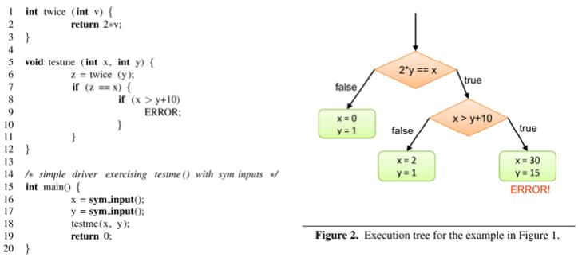
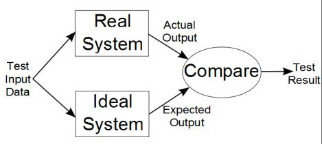
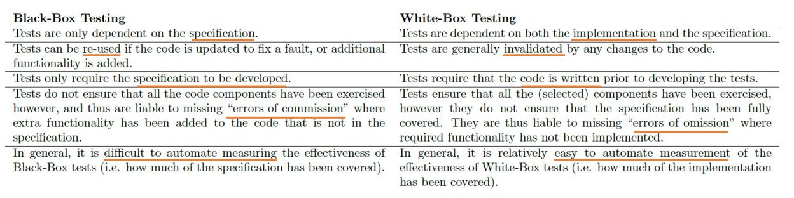
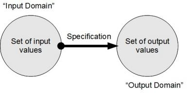
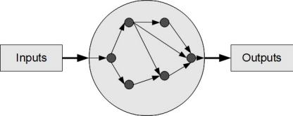
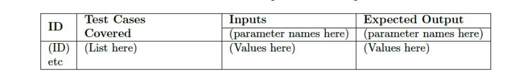
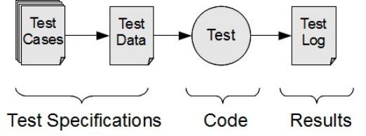

# Ch3 TestPrinciple

<!-- page: 1 -->

Principles of Software Testing

Spring, 2026

1

<!-- page: 2 -->

Contents

   Static and Dynamic Verification

  Black and White Box Testing

  Test Artefacts

2

<!-- page: 3 -->

1.   Static and Dynamic Verification

   Static Verification does not require the execution of the software code, while

Dynamic Verification does.

   Static Verification (or Static Analysis) can be as straightforward as having

someone of training and experience reading through the code to search for
faults.

  Dynamic Verification (or Software Testing) confirms the operation of a

program by executing it.

3

<!-- page: 4 -->

Static Verification

 It could also take a mathematical approach consisting of symbolic execution of the

program

 It could be a formal approach consisting of symbolic verification of the translation

between the specification and the source code

4

<!-- page: 5 -->

<!-- page: 6 -->

Dynamic Verification

 Test Cases are created that guide the selection of suitable Test Data (consisting

of Input values and Expected Output values

 The Input values are provided as inputs to the

program during execution

 The Actual Outputs are collected from the

program, and then they are compared with the
Expected Outputs.

   The Ideal system is represented by the specification while the Real system is the actual code.
   For a test to be successful a pass result is not required. A failed test will also impart some new knowledge about

the system

5

<!-- page: 7 -->

2. Black and White Box Testing

 Black Box testing is based entirely on the program specification and aims to

verify that the program meets the specified requirements

 White box testing uses the implementation of the software to derive the tests.

The tests are designed to exercise some aspect of the program code

6

<!-- page: 8 -->

Compare Black and White Box Testing

7

<!-- page: 9 -->

Coverage Interpretation

Black-Box testing provides for coverage of the specification, but not full coverage
of the implementation. That is, there may be code in the implementation that
produces results not stated in the specification.

White-Box testing provides for coverage of the implementation, but not of the

specification. That is there may be behaviour stated in the specification for which
there is no code in the implementation.

9

<!-- page: 10 -->

Black-Box Testing

The basic principle of Black-Box Testing can be expressed in a number of
different ways:

1. Test against the specification.
2. Use test coverage criteria based on the
specification.
3. Develop test cases derived from the
specification.
4. “Exercise” the specification.

10

<!-- page: 11 -->

White-Box Testing

The basic principle of White-Box Testing can be expressed:

1. Test against the implementation
2. Use test coverage criteria based on the
implementation
3. Develop test cases derived from the
implementation
4. “Exercise” implementation

11

<!-- page: 12 -->

Fault Insertion

 The most common technique is referred to as Mutation Testing where faults (or
“mutations”) are inserted into the source code, and the code checked to see if the
mutant produces a different output.

 In Strong Mutation Testing this check is carried out by executing the code.

12

<!-- page: 13 -->

Offut’s 5 sufficient mutations

• AOR (arithmetic operator replacement)
Replace one of the arithmetic operators by one
of the others

  ABS: -ABS(), ABS(), 0

  AOR: + - * / %

• LCR (logical connector replacement)
Replace one of the logical operators by one of
the others

  LCR: (a && b) or (a || b) ->

(a other-op b), (a), (b)

(a op true), (a op false), (true op b), (false op b)

• ROR (Relational operator replacement)
Replace one of the relational operators by one
of the others

  ROR: (a cmp b) ->

a [< <= > >= != ==] b, true, false

• UOI (unary operator insertion) Insert a unary
operator before the expression

  UOI: insert “! - ++ --” before expression

13

<!-- page: 14 -->

3. Test Artefacts

14

