# Ch4 BlackBox

<!-- page: 1 -->

Black-Box Testing

Spring, 2026

1

<!-- page: 2 -->

Contents

 Equivalence Partitioning

 Boundary Value Analysis

 Combinational Testing

 Sequence and Value

 Random Testing and Error Guessing

 Scenario Testing

2

<!-- page: 3 -->

1. Equivalence Partitioning

 An Equivalence Partition (EP) is a range of values for a parameter for which

the specification states equivalent processing.

 Example

Two equivalence partitions for the parameter x can be identified:
– 1. Integer.MIN VALUE..-1
– 2. 0..Integer.MAX VALUE

Consider a method,

– boolean isNegative(int x),

This accepts a single Java
int as its input parameter. The
method returns true if x is
negative, otherwise false.

3

<!-- page: 4 -->

Equivalence Partitioning

 These specification-based ranges are called Equivalence Partitions – according

to the specification, any value in the partition is processed equivalently to any
other value

 Every value for every parameter must be in one equivalence partition.

   — There are no values between partitions.
   — The natural range of the parameter provides the upper and lower limits for partitions

where not specified otherwise.

 Equivalence Partitions are useful for testing the fundamental operation of the

software: if the software fails using EP values, then it is not worth testing with
more sophisticated techniques until the faults have been fixed.

4

<!-- page: 5 -->

Equivalence  Partitioning

Equivalence partitioning is the process
of methodically reducing the huge (or
infinite) set of possible test cases into a
small, but equally effective, set of test
cases.

Invalid inputs           Valid inputs

System

A2
represents

A

A1,A2…,An

A

B

Outputs

5

<!-- page: 6 -->

Equivalence Class

Equivalence classes form a partition of a set.
Partition: collection of mutually disjoint subsets whose union is the entire set.

 Valid equivalence Class

     A meaningful set ofdata in an input field.
     Used to verify whether the system function and performance can be correctly implemented.

 Invalid equivalence class

     A meaningless set ofdata in an input field.
   Used to test the fault tolerance of the system.

6

<!-- page: 7 -->

Steps to identify the test cases

1.   Identify the inputs/outputs from the specification
eg. input fields in a form, inputs to command line programs, outputs-messages, calculations etc.

2.   Identify the equivalence classes for the inputs/outputs identified
   For a range, 1 valid class(within the range) and two invalid class (one outside each end of the

range)

   If the input is a set of valid values,  1  valid  class(from within the  set) and  1  invalid  class

(outside the set)
   If the input is a set of values and the program treats input values differently, 1 valid class for

each allowed input and 1 invalid class (the set of all disallowed inputs).

7

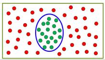

<!-- page: 8 -->

Steps to identify the test cases

  For a Boolean, 1 valid class (true) and 1 invalid class (false)
  For a mandatory input, empty(invalid) and valid inputs.
  If the input must follow rules,  1  valid  class  (conforming to the rule)  and

several invalid classes (violating the rule from different ways)

Divide each input into equivalence classes and form equivalence class table,

specifying a unique ID for each equivalence class.

8

<!-- page: 9 -->

(1) Equivalence classes table examples

Input value : Score of students , range from 0~100

Parameters
Valid Equivalence Class
Invalid Equivalence Class

Score
0<=X<= 100   (1)
X < 0                     (2)

X > 100                 (3)

Input value : Required Courses , {Database, Network, OS }

Parameters
Valid Equivalence Class
Invalid Equivalence Class

Database    (1)

Course

Others            (4)
Network     (2)

OS                 (3)

9

<!-- page: 10 -->

(1) Equivalence classes table examples

Input value : External Dial PhoneNumber  ,    “9 - eight digits”

Parameters
Valid Equivalence Class
Invalid Equivalence Class

9
digits string
beginning with “9”.

Not beginning with “9”.  (2)

Phone
number

Not digits string                 (3)

Not 9                                  (4)

(1)

10

<!-- page: 11 -->

(2) Design Test cases covering equivalence classes

Input value : External Dial  ,    “9 - eight digits”

Parameters
Valid Equivalence Class
Invalid Equivalence Class

9
digits string
beginning with “9”.

Not beginning with “9”.  (2)

Phone
number

Not digits string                 (3)

Not 9                                  (4)

(1)

Test case ID
PhoneNumber
Expected
Output

Actual
Output

Equivalence Classes
Coverage

1
912345678
OK
（1）

2
812349878
Error
(2)

3
9abcdefgh
Error
(3)

4
93465
Error
(4)

11

<!-- page: 12 -->

Steps to identify the test cases

4.  Write test cases for the valid class followed by invalid class. There could be
an overlap sometimes.

  Test cases for valid classes

   Each cover as many valid classes as possible,  and repeat until all valid classes are

covered by the test cases set.
  Test cases for invalid classes

   Each only cover one invalid class (include one invalid value and the remaining

values will all be valid).

12

<!-- page: 13 -->

Equivalence  Class Testing

Equivalence testing: use one element from each equivalence class.

Program:

F (a,b,c) with input domains A, B, and C.

Elements of partition denoted as :

13

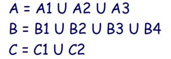

<!-- page: 14 -->

Weak Equivalence  Class Testing

 Use one variable from each equivalence class in a test case.

 #test cases = #classes in the partition with the largest numbering of subsets.

14

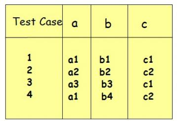

<!-- page: 15 -->

Strong Equivalence  Class Testing

 Based on Cartesian product of the partition subsets.

 We cover all the equivalence classes, and we have one of each possible

combination of inputs.

 Generalization: equivalence classes on outputs

15

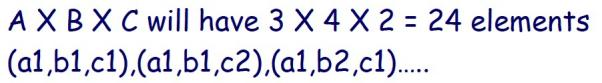

<!-- page: 16 -->

The Nextdate Program

It is a function that returns the date of the day after the input date.

The month, day and year values in the input date have numerical values with the following
constraints.

16

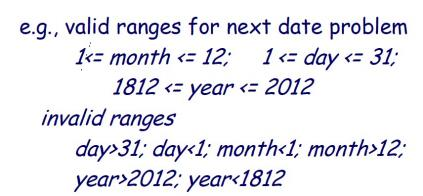

<!-- page: 17 -->

Traditional Equivalence  Class Testing

Better Equivalence relation?

Look at the functionality of the program, that is, what must be done to input date?

Note:

   A year is a leap year if it is divisible by 4, unless it is a century year.
   Century years are leap years only if they are multiples of 400. So 2000 is a leap year while

the year 1900 is not a leap year.

17

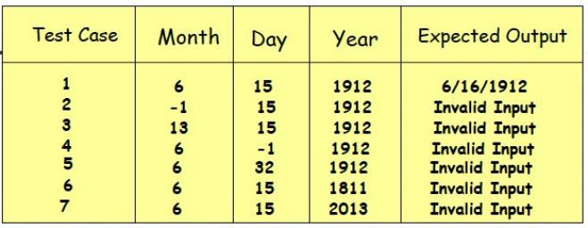

<!-- page: 18 -->

Strong Equivalence Class Test Cases

(m1,m2,m3) X (d1,d2,d3,d4) X (y1,y2)
3 x 4 x 2 = 24 test cases
Postulate the following equivalence classes:

Input

Classes

Output
Classes

18

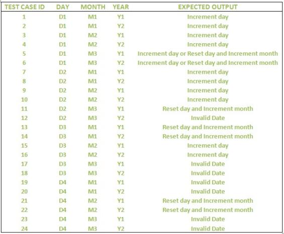

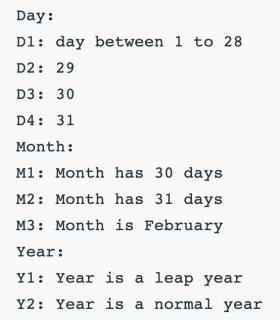

<!-- page: 19 -->

Examples from Book (p.60)

Description

A program for airline seat
reservation takes two inputs.

The first is the number of free seats

The second is the number of seats
required. Both numbers are integers.

19

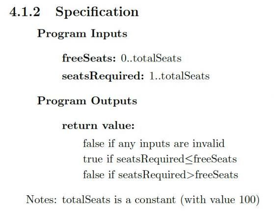

<!-- page: 20 -->

20

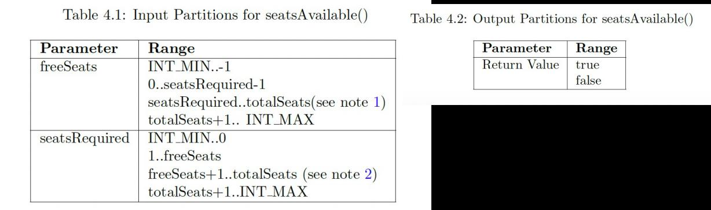

<!-- page: 21 -->

21

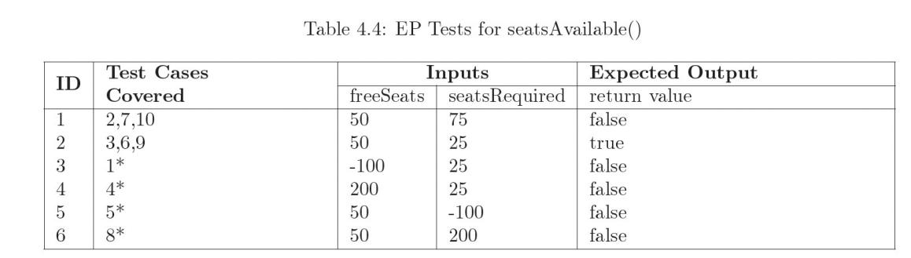

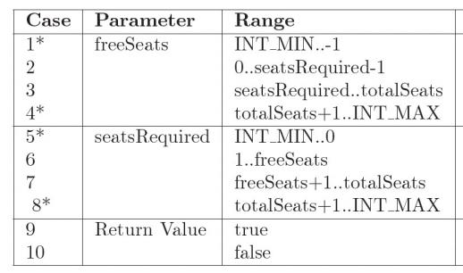

<!-- page: 22 -->

Comment on Equivalence  Partitioning

 Equivalence Partitions provide a minimum level of blackbox testing. At least one

value has been tested from every input and output partition, using a minimum
number of tests.

 These tests are likely to ensure that the basic data processing aspects of the code

are correct. But they do not exercise the different decisions made in the code.

 This is important, as decisions are a frequent source of mistakes in the code. These

decisions generally reflect the boundaries of input partitions, or the identification
of combinations of inputs requiring particular processing.

22

<!-- page: 23 -->

Strengths & Weakness

 Provides a good basic level of testing.
 Well suited to data processing applications where input variables may be

easily identified and take on distinct values allowing easy partitioning.
 Provides a structured means for identifying  basic Test Cases.

 Correct processing at the edges of partitions is not tested.
 Combinations of inputs are not tested.
 The technique does not provide an algorithm for finding the partitions or

selecting the test data.

23

<!-- page: 24 -->

2. Boundary Value Analysis

 Boundary conditions are situations at the edge of the planned operational

limits of the software.

E.g., negative to zero to positive numbers, exceeding the input field length of a form,
etc.

 Choose input data that lie on the boundary when formulating equivalence

partitions.

Inner point

Test the valid data just inside the boundary
Test the last possible valid data

Equivalence
class

Test the invalid data just outside the boundary

Outer point

 Security flaws such as buffer overflow attacks exploit boundaries of array

buffers.

24

<!-- page: 25 -->

Picking Boundary Values

1.   Every parameter has a boundary value at the top and bottom of
every equivalence partition.

2.   For a contiguous data type, the successor to the value at the top
of one partition must be the value at the bottom of the next.

3.   The natural range of the parameter provides the ultimate
maximum and minimum values.

25

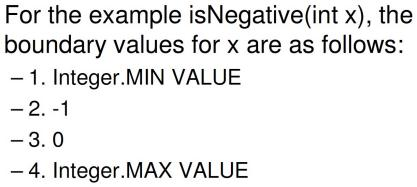

<!-- page: 26 -->

Common Boundary Values

 The 0, 1 and last loops in the Loop structure
 The first and last elements of the array
 Maximum and minimum values allowed for a variable type
 The first and last nodes of a linked list
 The maximum and minimum number of acceptable characters, such as in

username and password
 The first row, first column, last row and last column of the table/report

 Typically, software testing involves several types of boundary checks: numbers,

characters, position, weight, size, speed, orientation, dimension, space, and so on.

 Accordingly, the boundary values of the above types should be in: Max/min,

first/last, up/down, fastest/slowest, highest/lowest, shortest/longest, empty/full, etc.

26

<!-- page: 27 -->

Examples from Book (p.64)

27

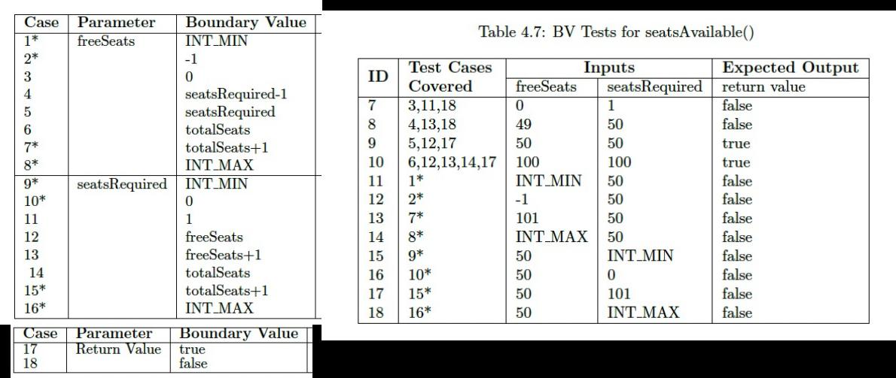

<!-- page: 28 -->

Strengths & Weakness

 Test Data values are provided by the technique.
 Tests focus on areas where faults are more likely to be found.

  For each variable, select five values

1)    Min      The minimum
2)   Min+    Slightly above the minimum
3)   Nor      Normal
4)   Max–     Slightly below the maximum
5)   Max       Maximum

Try: NextDate
 Combinations of inputs are not tested.

28

<!-- page: 29 -->

3. Combinational Testing

 There are a number of different techniques for identifying relevant

combinations, such as Cause-Effect Graphs, Decision Tables and Truth Tables.

 The analysis of combinations involves identifying all the different combinations

of input causes to the software and their associated output effects.

 The causes and effects are described as logical statements (or predicates), based

on the specification of the software. These expressions specify the conditions
required for a particular variable to cause a particular effect.

29

<!-- page: 30 -->

Truth Table

 To test all the different behaviors ofthe program, a Truth Table is created. The

inputs (“Causes”) and outputs (“Effects”) are specified as Boolean expressions
(using predicate logic).

 Combinations ofthe causes are the inputs that will generate a particular response

from the program.

 Test Cases are then constructed that will cover all possible combinations of

Cause and Effect. For N independent causes, there will therefore be a total of 2N
different combinations. The Truth Table specifies how the software should
behave for each combination.

30

<!-- page: 31 -->

Example A – isNegative()

   Rule 1 states that if x<0, then the return value is true.
   Rule 2 states that if !(x<0), then the return value is false.

Each column is referred to as a Rule in the  Truth Table – Each Rule is a different test case .

31

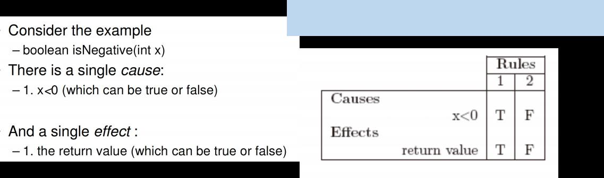

<!-- page: 32 -->

Example B – largest()

32

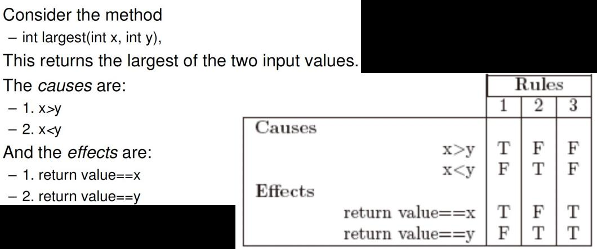

<!-- page: 33 -->

“Don’t Care” Conditions

 “Don’t care” conditions exist where the value of  a cause has no impact on the

effect.

 These “Don’t care” conditions are used to reduce the number of rules where the

same output will be generated irrespective of whether the Cause is true or false.

 In the worst case, if there are no “Don’t care” conditions, N Causes will create 2N

Rules.
 “Don’t care” conditions are represented by a “*” for the causes in a Truth Table.

33

<!-- page: 34 -->

Example C – condIsNegt()

The number of tests is reduced using ‘don’t-care” conditions where the value of
a particular cause has no effect on the output.

Combinational Testing
does not test all the combinations of causes

34

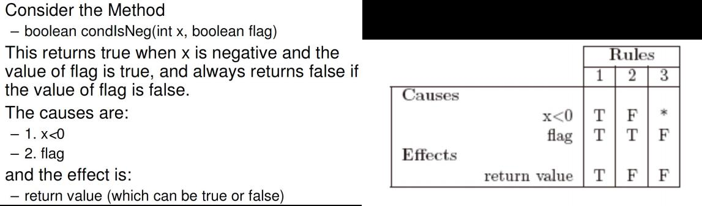

<!-- page: 35 -->

Strengths & Weakness

 Exercises combinations oftest data

 The truth tables can sometime be very large. The solution is to identify

subproblems and develop separate tables for each.

 Very dependent on the quality of the specification - more detail means more

causes and effects, which takes more time to test; less detail means less
causes and effects, but less effective testing.

35

<!-- page: 36 -->

Decision Tables

 precise yet compact way to model complicated logic

 Associate conditions with actions to perform

 Can associate many independent conditions with several actions in an elegant way

36

<!-- page: 37 -->

Decision Tables - Terminology

37

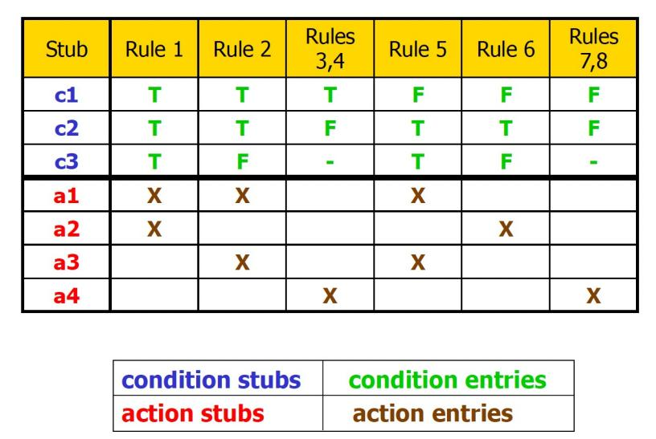

<!-- page: 38 -->

Decision Tables - Printer Troubleshooting DT

38

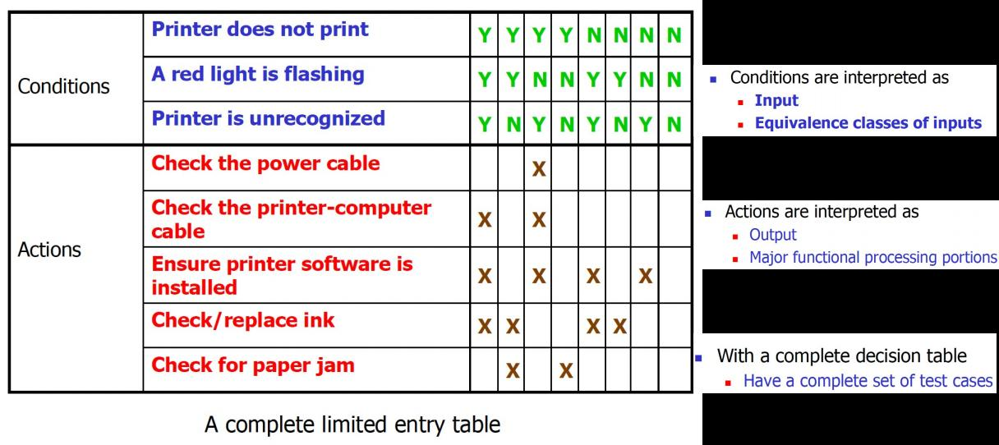

<!-- page: 39 -->

Decision Tables – NextDate DT

 The NextDate problem illustrates the correspondence between equivalence classes

and decision table structure

 The NextDate problem illustrates the problem of dependencies in the input

domain

 Decision tables can highlight such dependencies

 Impossible dates can be clearly marked as a separate action

39

<!-- page: 40 -->

NextDate Equivalence Classes – for 1st try

40

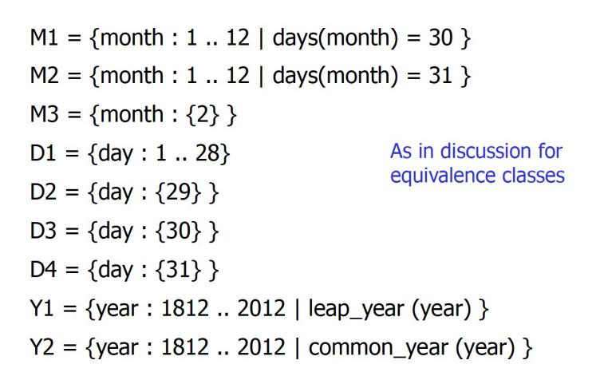

<!-- page: 41 -->

NextDate Decision Table – mutually exclusive conditions

41

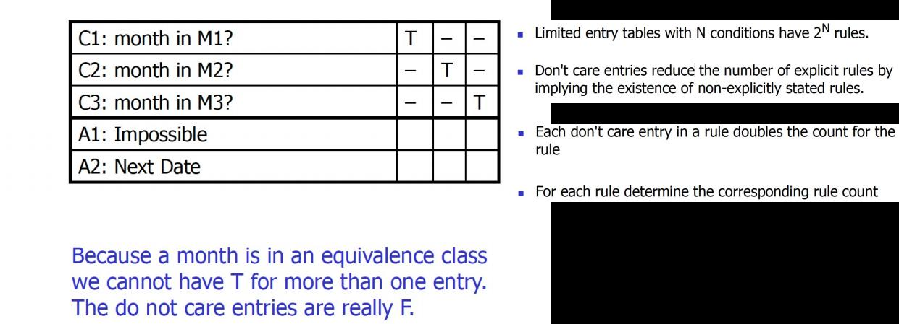

<!-- page: 42 -->

NextDate Decision Table – (1st try - partial)

42

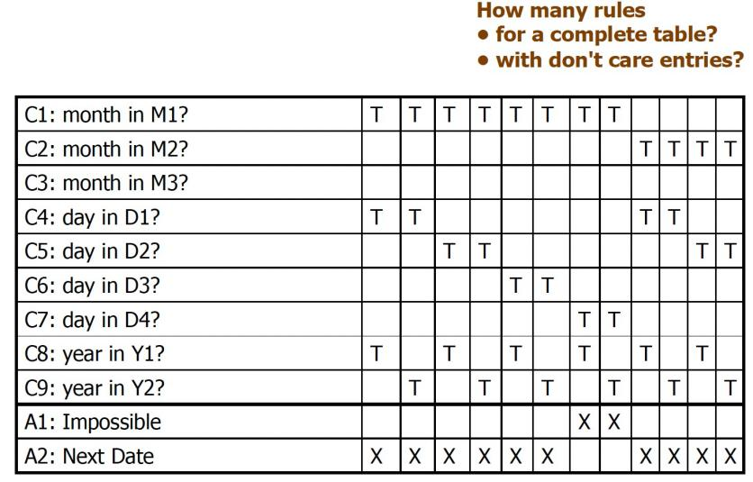

<!-- page: 43 -->

NextDate Decision Table – (2st try - partial)

12月31？

43

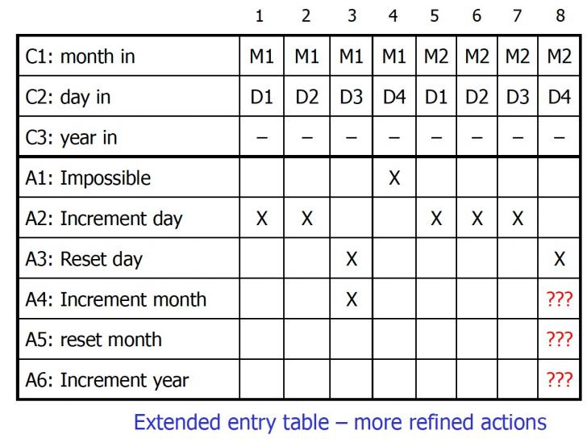

<!-- page: 44 -->

New Equivalence Classes – for 2rd try

44

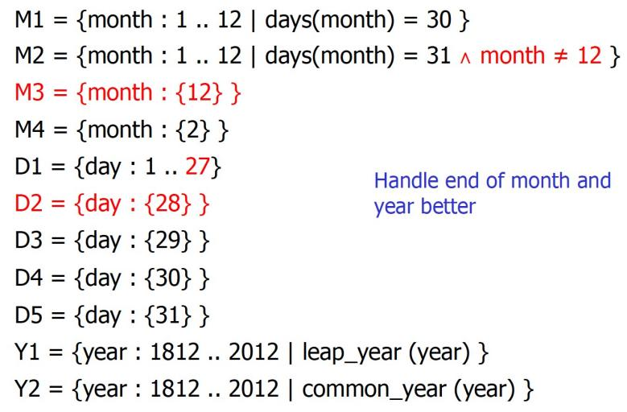

<!-- page: 45 -->

NextDate DT (3rd try - part 1)

45

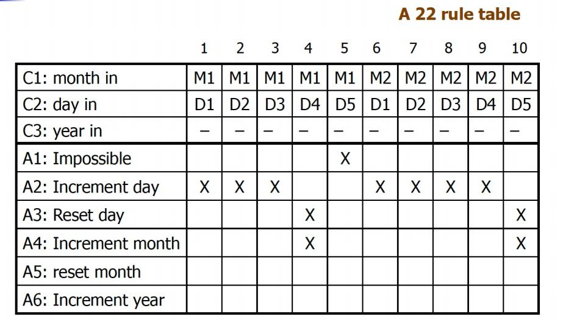

<!-- page: 46 -->

NextDate DT (3rd try - part 2)

46

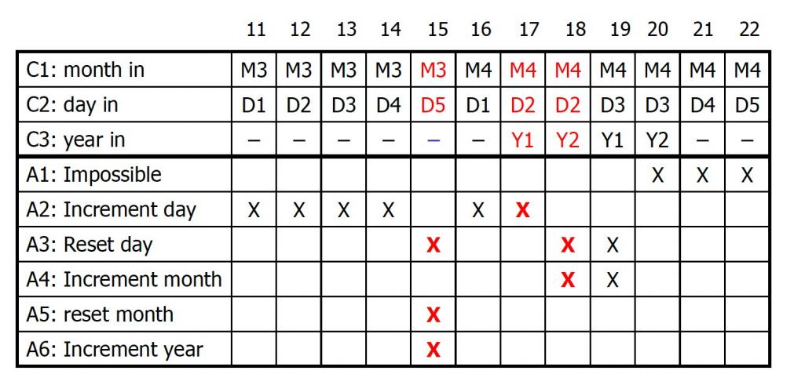

<!-- page: 47 -->

Reduced NextDate DT (3rd try - part 1)

47

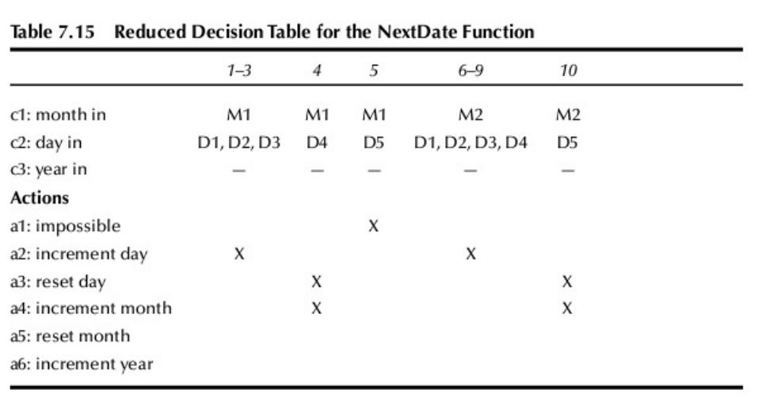

<!-- page: 48 -->

NextDate Test Cases

48

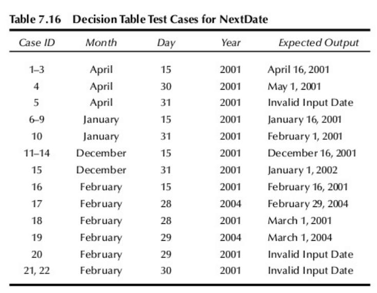

<!-- page: 49 -->

Comment

 It has been shown that equivalence classes and decision tables can

be closely related.

 Decision Table testing is most appropriate for programs where

    There is a lot of decision making
    There are important logical relationships among input variables
    There are calculations involving subsets of input variables
    There is complex computation logic (high cyclomatic complexity)

49

<!-- page: 50 -->

4. Sequence and Value testing

 Sequences of values are important where the software preserves state.

 The response to a particular input value can vary depending on the state, and

the state depends on the previous sequence of values.

 The normal approach for analyzing sequences is by using a State Diagram to

identify the states the software can be in, and the response (“Action”) to
each input (“Event”) in each state.

50

<!-- page: 51 -->

State Diagram

51

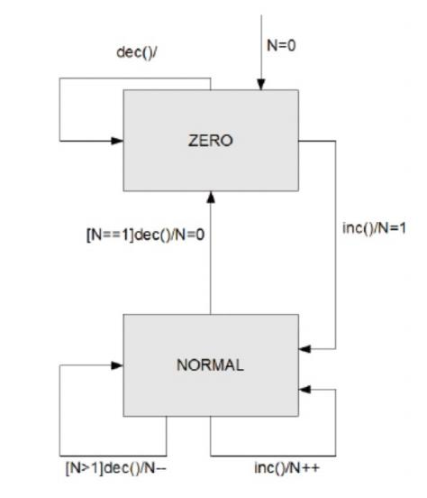

<!-- page: 52 -->

Building blocks of a state diagram

 State

An abstract situation in the life cycle of a system entity
(for instance, the contents of an object)

 Transition

An allowable two-state sequence. Caused by an event
 Event

An input or a time interval
 Action

The output that follows an event
 Guard

Predicate expression associated with an event, stating a Boolean
restriction for a transition to fire

52

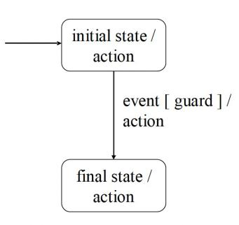

<!-- page: 53 -->

53

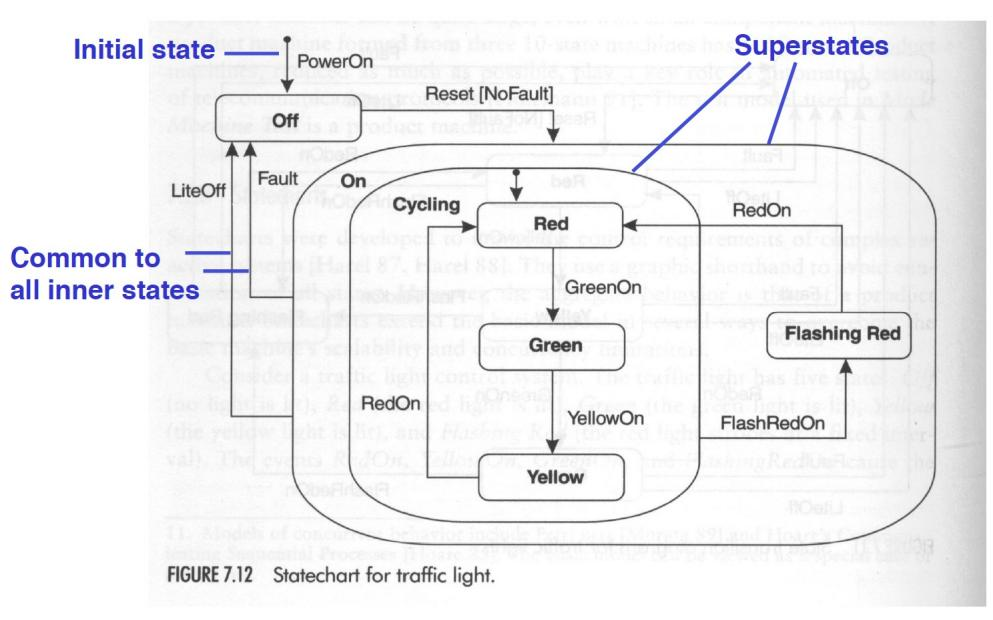

<!-- page: 54 -->

54

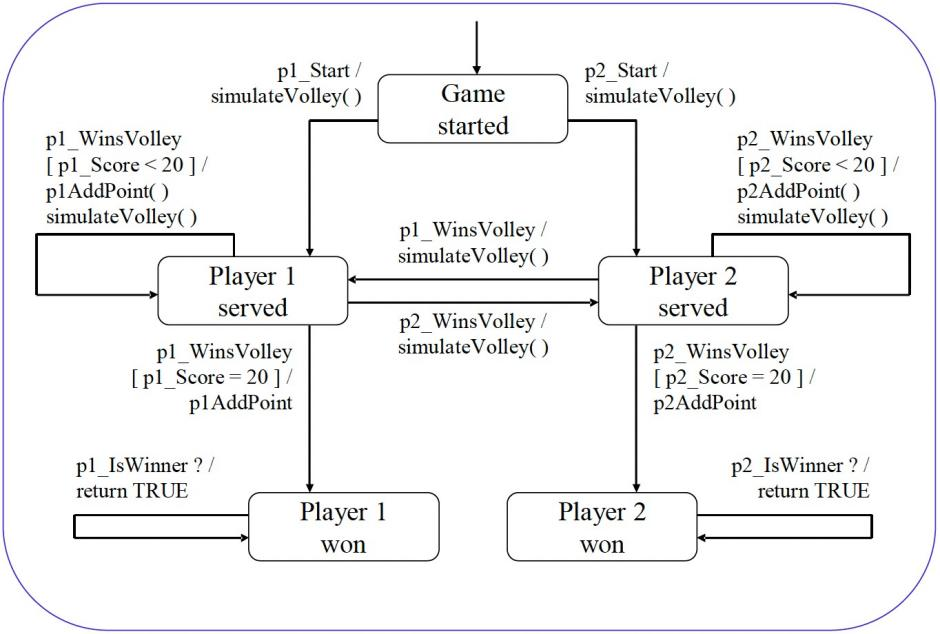

<!-- page: 55 -->

Importance of State-based testing

 State-based testing is important for object-oriented software

In particular for real-time/control systems and communications

  Classes, clusters, subsystem or system
  Behavior bugs due to complex and implicit structure

 We are interested in testing the behavior of many different types of systems,

including event-driven software systems.
 Statechart can model event-driven behavior. If we can express the system under test

as a statechart, we can generate test cases for its behavior.

56

<!-- page: 56 -->

State Diagram Analysis

Test case = sequence of input events

 All-events coverage: each event of the state machine is included in the test suite

(is part of at least one test case)
 All-states coverage: each state of the state machine is exercised at least once

during testing, by some test case in the test suite
 All–transitions coverage. each transition is exercised at least once

– implies (subsumes) all-events coverage, all-states coverage
– ”minimum acceptable strategy for responsible testing of a state machine”
 All –paths coverage from entry to exit. In the diagram there is no exit state so all

paths from entry to every state need to be identified.
 All –circuits coverage in the diagram that start and end in the same state

57

<!-- page: 57 -->

58

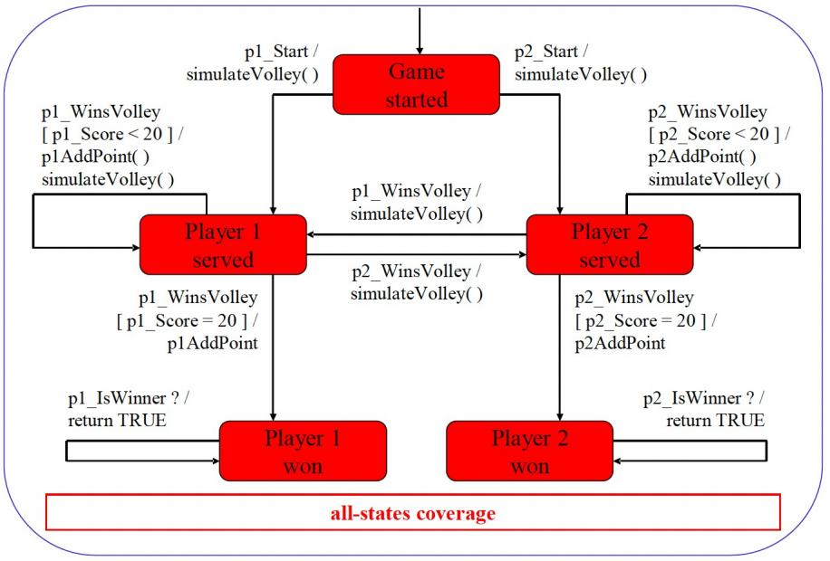

<!-- page: 58 -->

59

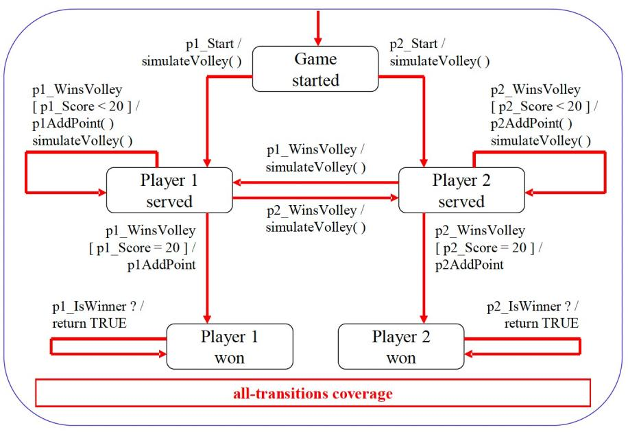

<!-- page: 59 -->

5. Random Testing and Error Guessing

Random Testing

 Test data is generated using random number generators. The distribution

may be uniform, or chosen to mimic, in a statistical sense, the type of inputs
that the program will receive in real use.

 If the specification is clearly written and thorough, then it should be possible

to find the set(s) of possible input values.

 The goal is to achieve a “reasonable” coverage of the possible values for

each input parameter, based on its distribution. This can be determined
heuristically (using, for example, 10 random values), or based on a statistical

sample size determined from the required confidence in the coverage.

60

<!-- page: 60 -->

Random Testing

 Each Test Case is represented by a set of (random) input values, one for each

parameter.

 If the test is fully automated, then each Test Case is represented by a

distribution of values for a particular parameter.

 This will normally include the upper and lower limits, and the distribution to

be used between these limits to select a random value.

61

<!-- page: 61 -->

Random Testing Comment

 Random Test Data generation is straightforward to implement and leads to a

fast generation of Test Cases.

 If the distribution/histogram of the real-world input data is known, then this

provides a mathematical basis for selecting a set of input test case values.

 The measured test failure rate then provides an indication of the expected

failure rate in use.

 Random data selection is sometimes used for stability testing, to ensure that

no input data value causes the software to crash or raise unexpected

exceptions. This technique is easy to implement in an automated manner,
but is unlikely to find faults except in low-quality code.

62

<!-- page: 62 -->

Error Guessing

 This is an ad-hoc approach, based on intuition and experience.

 Test data is selected that is likely to expose faults in the code. Some typical

examples of inputs likely to cause problems are:

– Empty or null strings, arrays, lists, and class references. These may find code that

does not check for empty or non-null values before using them.
– Zero as a value, or as a count of instances or occurrences. These may find divide-by-

zero faults.

– Spaces or null characters in strings. This may find code that does not process strings

correctly or does not trim whitespace before trying to extract data from the string.
– Negative numbers. These may find faults in code that only expects to receive
positive numbers.

 The goal is to cover as many values as possible which in the experience of

the tester are likely to expose faults in the code

63

<!-- page: 63 -->

Error Guessing

A program that sorts a List (such as an array) can presumably has the

following cases that require special testing:

1)  The input List is empty
2)  The List contains only one element
3) All elements in the List have been sorted
4)  List has been arranged in reverse order
5)  Some or all elements in the List are the same

64

<!-- page: 64 -->

Error Guessing

 The tester selects values which are likely to produce errors. Each value is a

Test Case.

 This technique can produce both normal and error Test Cases. The values

selected are those that are likely to expose faults in the code, they are not
necessarily illegal values.

 Input Test Data is selected, based on Test Cases which are not yet covered.

As with the other test techniques, error cases should be executed

individually.

65

<!-- page: 65 -->

Error Guessing Comment

 With experienced testers, this can be a very effective complement to other

testing techniques.

 It depends on how well the testers know the types of mistakes that the

developers are likely to make, or mistakes that have a high impact on the
final product.

66

<!-- page: 66 -->

6. Scenario Testing

 Scenario Testing is a Software Testing Technique that uses scenarios i.e.

speculative stories to help the tester work through a complicated problem or test
system.

 Scenario testing is performed to ensure that the end-to-end function of software

and all the process flow of the software are working properly.

 In scenario testing, the testers assume themselves to be the end users and find the

real-world scenarios or use cases which can be carried out on the software by the
end user.

67

<!-- page: 67 -->

Use case Scenario

Actor

 something with behavior, such as a person
 (identified by role), computer system, or organization; e.g.

a cashier, a player.

Scenario (aka a use case instance)

 a specific sequence of actions and interactions between

actors and the system
 it is one particular story of using a system, or one path

through a use case.

Use case

 a collection of related success and failure scenarios that

describe an actor using a system to support a goal.

68

<!-- page: 68 -->

Basic flow and Alternative flow

 Basic Flow

UseCase Start

   The simplest path through the use case, that is, without any error,

the program directly from the beginning to the end of the process.
   The most used operation process by most users, reflecting the

Alternative
Flow 1

Alternative
Flow 3

main functions and processes of the software.
   There is only one base flow for a business, and the base flow has

only one start and one end.

Alternative
Flow 4

 Alternative Flow

Alternative
Flow 2

   Start with a base flow, perform under a specific condition, and

then rejoin the base flow (such as alternative flows 1 and 3);
   Or originate from another alternative flow (such as alternative

flow 2);
   Use cases can also be terminated without being added to the base

UseCase End

flow (such as alternative flows 2 and 4)
   reflecting various exception and error conditions.

69

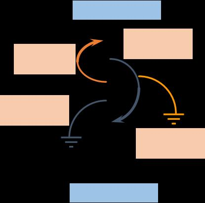

<!-- page: 69 -->

Use case Scenario

1.    Scenario 1: Basic flow
2.    Scenario 2: Basic flow → Alternative flow 1
3.    Scenario 3: Basic flow → Alternative flow 1 → Alternative flow 2
4.    Scenario 4: Basic flow → Alternative flow 3
5.    Scenario 5: Basic flow → Alternative flow 3→ Alternative flow 1
6.    Scenario 6: Basic Flow → Alternative flow 3→ Alternative flow 1→ Alternative flow 2
7.    Scenario 7: Basic flow → Alternate flow 4
8.    Scenario 8: Basic flow → Alternative flow 3→ Alternative flow 4

In order to simplify the analysis of the problem, only one loop execution of the alternative
flow 3 is considered

70

<!-- page: 70 -->

Scenario  Testing Steps

Scenario Testing Goal

 Simulate the user to complete the operation of normal functions and core business

logic to verify the correctness of software functions;
 Simulate the main errors in user operation to verify the abnormal error handling

ability of software.

Alternative flows, like the program execution paths, will cause the scenario explosion.
Typical scenarios need to be selected for testing.

(1) One and only one scenario contains the basic flow;
(2) The minimum number of scenarios: the total of basic flows and alternative flows;
(3) For an alternative flow:  at least one scenario covering it, which try to avoid
covering other alternative flows

71

<!-- page: 71 -->

Scenario  Testing Steps

(1) According to the specification, describe the basic flow and alternative flow of

the software under test.

(2) Construct different scenarios to meet the requirements oftest completeness and
no redundancy.

(3) Design corresponding test cases for each scenario.

(4) Re-examine all generated test cases and remove redundant test cases. After the
test cases are determined, the test data values are determined for each test case.

72

<!-- page: 72 -->

Scenario  Testing Example

A hotel system supports online reservations.

Customers visit the website for room reservation operation, select a reservation
date, suitable room, online reservation.

In this case, you need to login to the system using your personal account.
After the login succeeds, you can make the deposit payment.
After the deposit is paid successfully, the room reservation form will be
generated to complete the whole room reservation process.
The system allows a reservation period of 30 days and a deposit of 400 dollars.

73

<!-- page: 73 -->

Scenario  Testing Example

(1) Determine the basic flow and alternative flow

type
description
type
description

Select booking date
Alternative flow 1
The reservation date is

overdue

Choose the room
Alternative flow 2
No spare room

The basic flow

Login to the account
Alternative flow 3
Account does not exist

Pay the deposit
Alternative flow 4
Password is wrong

Generate reservation order
Alternative flow 5
The account balance is

insufficient

74

<!-- page: 74 -->

Scenario Testing Example

(2) Generate different scenarios based on the base flow and alternative flow

Scenario 1 (Successful reservation) : Basic flow.

Scenario 2 (Reservation date overdue) : Basic flow, alternate flow 1.

Scenario 3 (no spare room) : Basic flow, alternative flow 2.

Scenario 4 (account does not exist) : Basic flow, alternate flow 3.

Scenario 5 (password error) : Basic flow, alternate flow 4.

Scenario 6 (Insufficient account balance) : Basic flow, alternate flow 5.

75

<!-- page: 75 -->

Scenario Testing Example

(3) Test case design

“V”  ：condition must be Valid for the base flow to be executed

“ I”  ：the desired alternative flow will be activated if the condition is Invalid
“N /a” (not applicable)  ：the condition does not apply to the test case.

TC

Scenario/Condition
Date
Room
Account
PW
Balance
Expected Output

(Successful reservation)
V
V
V
V
V
"reservation succeeded"
the account balance is decreased

1
Scenario 1

2
Scenario 2
(Reservation date overdue)
I
n/a
n/a
n/a
n/a
"Invalid reservation date”
Reselect the date

3
Scenario 3
(no spare room)
V
I
n/a
n/a
n/a
“Reservation room is full”
Reselect the date

4
Scenario 4
(account does not exist)
V
V
I
n/a
n/a
“Account does not exist”
Enter the account again

5
Scenario 5
(password error)
V
V
V
I
n/a
“Password error”
Enter the password again

6
Scenario 6
(Insufficient account balance)
V
V
V
V
I
“Insufficient account balance

,
please recharge”           76

<!-- page: 76 -->

Scenario Testing Example

(4) Determine the test case data values

Assume that User1 is a registered user and the password is MyPass. User2 is an unregistered user.

Scenario/Condition
Date
Room
Account
PW
Balance
Expected

TC

Output

Scenario1
A valid Date
Not full
User1
MyPass
800
Successful
1

2

Scenario2
An overdue Date
n/a
n/a
n/a
n/a
Overdue

3

Scenario3
A valid Date
Full
n/a
n/a
n/a
No Room

Scenario4
A valid Date
Not full
User2
n/a
n/a
Account

4

Error

Scenario5
A valid Date
Not full
User1
NoPass
n/a
Password

5

Error

Scenario6
A valid Date
Not full
User1
MyPass
200
Insufficient

6

Balance

77

<!-- page: 77 -->

7. Summary ：Strategies on BlackBox Testing

1.   For the specific input field in the specific function page, the refined test is carried
out, using equivalence class and boundary value; Use static testing to check
buttons, links, content, images, etc;

2.   If the function description contains a combination of input conditions, and the
business logic is complex, decision table can be used.

3.   Boundary value analysis should be considered in any case, as it is one of the
most effective methods to find software defects.

4.   Test cases can be expanded by error guessing method, and the valuable
experience of test engineers is emphasized.

5.   For the system with clear business process, the scenario testing can be used
throughout the whole testing process

78
