# Ch5-1 WhiteBox-LogicCoverage

<!-- page: 1 -->

White-Box Testing

Spring, 2026

1

<!-- page: 2 -->

Contents

 Control Flow Testing

  Statement Coverage
  Decision  Coverage
  Condition Coverage
  Decision Condition Coverage
  Condition Combination Coverage

  Path Coverage
  Basis Path Testing

2

<!-- page: 3 -->

Control Flow Testing

 Control-flow testing is a structural testing strategy that uses the program’s

control flow as a model.

 Requires the tester to have a clear understanding of the logical structure of the

program, and even to be able to master all the details of the source program.

 Most applicable to new software for unit testing.

3

<!-- page: 4 -->

1. Statement Coverage

 Design test cases and work out input values required to ensure that every source

code statement is executed.

 Also known as point coverage

 The weakest logical coverage, be used interoperatively with other  testing methods.

4

<!-- page: 5 -->

Program Flow Graph                                                       Source Code

s
public static float Example(float A,B,X){

1

if ( A>1 &&  B==0 )

a

X= X / A;
if (A==2 || X>1)

T

4

(A>1) and (B=0)

X=X+1;
return X;

c

F

X = X / A

}

2

5
b

I. A=2, B= 0, X=4 ---- sacbed

T

(A=2) or (X>1)

6

e

X=X+1
F

TestCase
Input (A，B，X)
Path
Output ( X )

3

1
2,0,4
sacbed
3

7

d

5

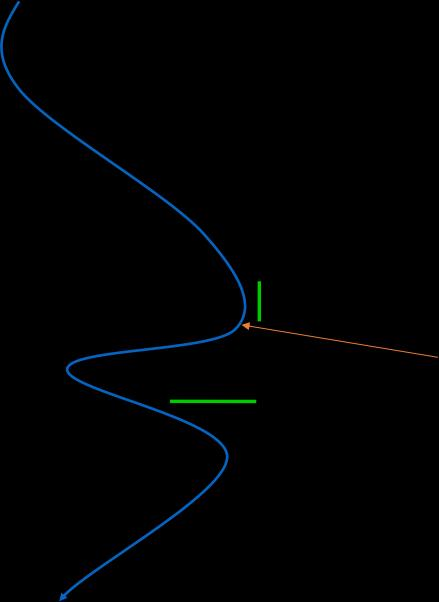

<!-- page: 6 -->

Statement Coverage

The statement coverage seem like it validates every statement comprehensively,
but it's quite weak. Why?

If there is a problem with the logical operation of the two decisions, like:

 AND        OR

 OR          AND

 X>1         X>0
……

the above test case cannot detect it.

6

<!-- page: 7 -->

2. Decision Coverage (Branch Coverage)

 Design test cases and work out input values required to ensure that every source

code branch is taken.

 Each true and false branch of the program is executed at least once

 Also known as edge coverage

7

<!-- page: 8 -->

 Each true and false branch is executed at least once

s

1
a

Is there other test cases combination  satisfying
branch coverage?

T

4
c

(A>1) and (B=0)

Does it cover all the statement?

F

X = X / A

2

5

b

I: A=3, B=0,X=1: sacbd

T

(A=2) or (X>1)

6

e

II: A=2, B=1,X=1: sabed

F

X=X+1

3

7

d

8

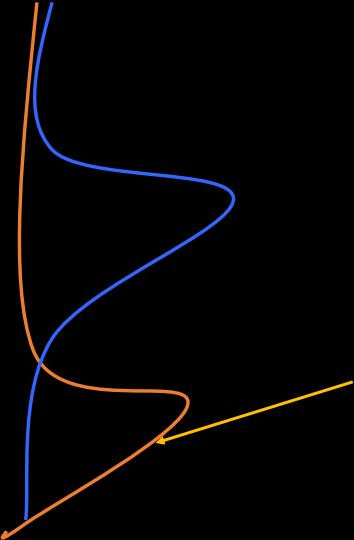

<!-- page: 9 -->

Decision Coverage (Branch Coverage)

 Test cases that satisfy decision coverage definitely  satisfy statement coverage.

 Decision Coverage is better than statement coverage, but it's still weak logical

coverage.

 X>1         X<1

the above test cases cannot detect it.

 Decision coverage does not guarantee that errors in decision conditions can be

detected. Therefore, stronger logical coverage criteria are needed to test the
internal conditions.

9

<!-- page: 10 -->

3. Condition Coverage

 A complex decision is formed from multiple (Boolean) conditions.

 Condition Coverage extends Branch Coverage by ensuring that, for complex

decisions, each condition within the decision is tested for its true and false values.

  There is a caveat: it is not necessary that the decision itself take on true and false

values!

 Test data is selected to ensure that every condition in every decision takes on the

value true and false.

10

<!-- page: 11 -->

 Each true and false condition in each

decision is executed at least

once

s

1
a

T
(A  1) and (B=0)

Decision Expression #1
If A>1         True      T1

4
c

False     T1
If B==0       True      T2

F

X = X / A

2

False     T2

5

b

Decision Expression #2
If A==2       True       T3

T
(A=2) or (X   1)

6 e

False     T3
If X>1          True      T4

F

X=X+1

3
7
d

False     T4

11

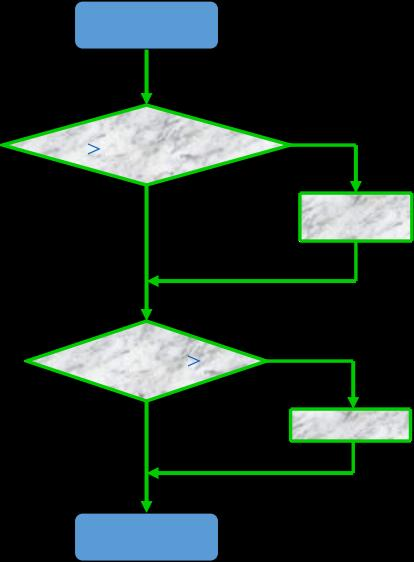

<!-- page: 12 -->

True           False

s

T1

T1

(A>1)      (A≤1)

1
a

T2

T2

(B=0)       (B≠0)

T
4
c

(A  1) and (B=0)

T3

T3

(A=2)      (A≠2)

F

X = X / A

(X>1)      (X≤1)
T4

T4

2

5

b

T

TestCase
Path
Condition
Output

(A=2) or (X   1)

6 e

X
A
B
X

F

X=X+1

3

7

d

12

<!-- page: 13 -->

s

Situation #1

(A>1)      (A≤1)

1
a

(B=0)       (B≠0)

T

4

(A>1) and (B=0)

c

(A=2)      (A≠2)

F

X = X / A

(X>1)      (X≤1)

2

5

T
b

Ⅰ : A=2, B=0,X=4: sacbed

(A=2) or (X>1)

6

e

Ⅱ: A=1, B=1,X=1: sabd

F

X=X+1

TestCase
Path
Condition
X
A
B
X

3

7

d

2
0
4
sacbed
T1,T2,T3,T4
3

Decision coverage is satisfied
Whether decision coverage is satisfied

1
1
1
sabd
T1,T2,T3,T4
1

13

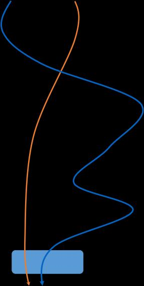

<!-- page: 14 -->

s

Situation #2

(A>1)      (A≤1)

1
a

(B=0)       (B≠0)

T

4

(A=2)      (A≠2)
(A>1) and (B=0)

c

F

X = X / A

(X>1)      (X≤1)

2

5
b

Ⅲ: A=2, B=0,X=1: sacbed

6
T

(A=2) or (X>1)

Ⅳ: A=1, B=1,X=2: sabed

e

F

X=X+1

TestCase
Path
Condition
X
A
B
X

3

7
d

2
0
1
sacbed
T1,T2,T3,T4
1.5

Decision coverage isn’t satisfied

1
1
2
sabed
T1,T2,T3,T4
3

14

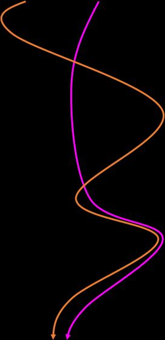

<!-- page: 15 -->

s

Situation #3

(A>1)      (A≤1)

1
a

(B=0)      (B≠0)

T

4

(A=2)      (A≠2)
(A>1) and (B=0)

c

F

X = X / A

(X>1)      (X≤1)

2

5

T
b

Ⅴ: A=1, B=0,X=3: sabed

(A=2) or (X>1)

6

e

Ⅵ: A=2, B=1,X=1: sabed

F

X=X+1

3

TestCase

Path             Conditions           X

7

d

A    B    X

4

1     0     3      sabed           T1,T2,T3,T4

Neither decision coverage
nor statement coverage is satisfied

15
2

2     1     1      sabed           T1,T2,T3,T4

<!-- page: 16 -->

Condition Coverage

 Strength: focuses on condition outcomes and thus extends Branch coverage

 Weakness: may fail to achieve branch coverage as it is not necessary for the
decision itself to take on true and false outcomes.

consider the test cases
(1) a=true and b= false
(2) a=false and b=true

Each condition (a and b) have taken on the values of true and false but the
decision itself always evaluates to false.

Thus, Branch Coverage has not been achieved

16

<!-- page: 17 -->

4. Decision/Condition Coverage

 Generate test data such that all conditions in a decision take on both outcomes (if

possible) at least once and exercise the true and false outcomes of every decision.

   Each decision has True and False test cases
   In addition, each condition in a decision has True and False test cases (if possible)

  It is a combination of Condition Coverage and Branch Testing. It uses the same test

data as for Condition Coverage but must additionally ensure that each branch or
decision takes a true or false outcome.

   Single condition decision: 2 test cases
   2-condition decisions: 2+ test cases

17

<!-- page: 18 -->

Situation #1

s

1

a

T

4

(A>1) and (B=0)

c

Decision

TestCase

#1,#2
X
A
B
X

Path
Condition

F

X = X / A

2

5
b

2
0
4
sacbed
T1,T2,T3,T4
T, T
3

1
1
1
sabd
T1 ,T2, T3, T4
F,F
1

T

(A=2) or (X>1)

6

e

F

X=X+1

3

7

d

18

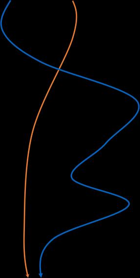

<!-- page: 19 -->

Airline Seat reservation Example

19

<!-- page: 20 -->

Airline Seat reservation Example

Each Boolean value for each decision

In addition, each Boolean value for each condition

20

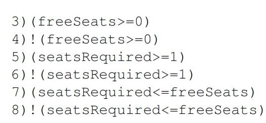

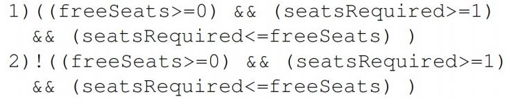

<!-- page: 21 -->

Airline Seat reservation ----Test Cases

21

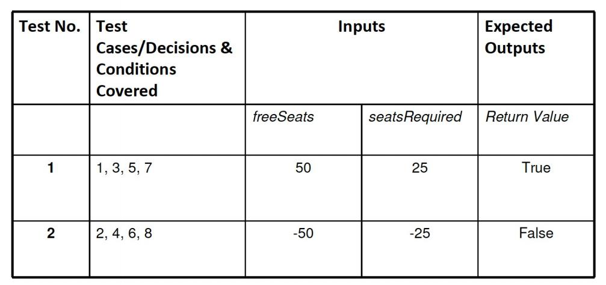

<!-- page: 22 -->

Decision/Condition Coverage Comments

 Steps

   Identify all the decisions in the program
   List all the conditions
   Generate the test data to cover the above decisions and conditions

 Addresses one of deficiencies of condition coverage by forcing each branch to

be exercised .

   Conditions can be masked due to the potential lazy evaluation of compound conditions,

e.g.

while(!(found) && (i<=x))
   For the decision to be true, both conditions must evaluate to true.
   For the decision to be false, only the first condition need to evaluate to false.

 Thus, the consequence of the second condition evaluating to false might be

insufficiently considered.

22

<!-- page: 23 -->

Decision/Condition Coverage Strengths & Weaknesses

 The true and false outcomes of every decision and every condition are covered
 This gives stronger coverage than just Condition Coverage or Decision

Coverage

 Even though every decision is tested, and every condition is tested, not every

possible combination of conditions is tested.

23

<!-- page: 24 -->

5. Condition Combination Coverage

 Tests are generated to cause every possible combination of conditions for every

decision to be tested.

 The goal is to achieve 100% coverage of every decision and 100% coverage of

every condition.

 A Truth-Table is the best way to identify all the possible combinations of values.

24

<!-- page: 25 -->

Every combination of conditions for every
decision be taken at least once

s

1
a

T
4
c

(A  1) and (B=0)

①  A＞1,   B =0 ,  TT
②  A    1,   B≠0 ,   TF
③  A   1,    B =0 ,  FT
④  A   1,    B≠0 ,   FF
⑤  A =2,   X    1 , TT
⑥  A =2,   X   1 , TF
⑦  A≠2,     X     1 , FT
⑧  A≠2,     X    1 ,  FF

F

X = X / A

2

5

b

T

(A=2) or (X   1)

6 e

F

X=X+1

3

7

d

25

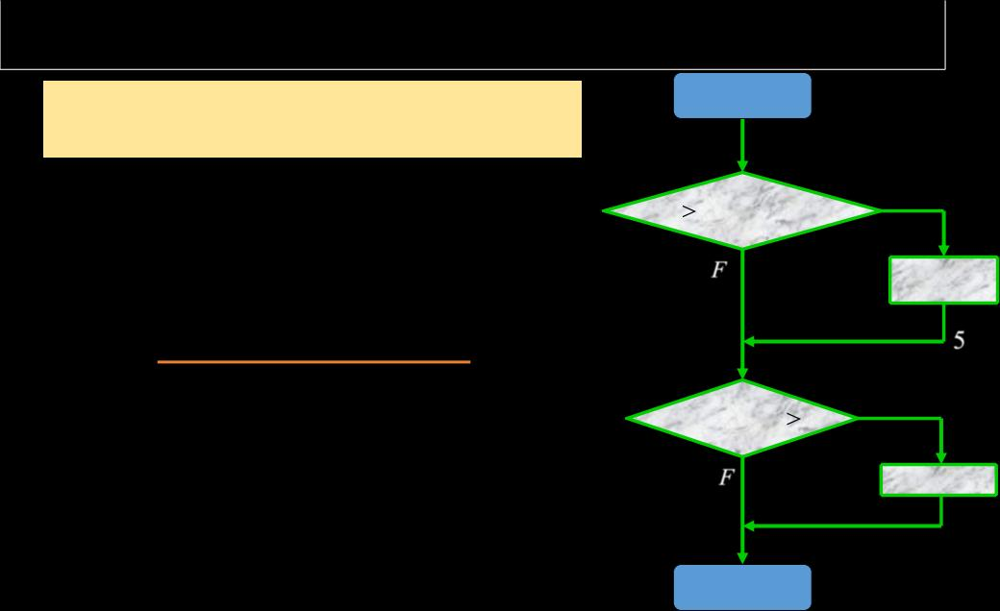

<!-- page: 26 -->

s

1.        A＞1,   B＝0
1                                               2.        A     1,   B≠0

I. A=2,B=0,X=4

3.        A>1,   B＝0

1                                                                         ＞

a

4.        A>1,   B≠0

T

4

II. A=2,B=1,X=1

(A>1) and (B=0)

c

6.       A ＝2,   X>1

5.       A ＝2,   X＞1

F

X = X / A

8.       A≠2,   X>1

2

7.       A≠2,   X＞1

5
b

I: sacbed
II: sabed
III: sabed
IV: sabd

T

Path

(A=2) or (X>1)

6

e

III. A=1,B=0,X=2

F

X=X+1

3

IV. A=1,B=1,X=1

7

d

Meeting the criteria of conditional combination coverage means meeting the criteria of
decision coverage, conditional coverage and decision/conditional coverage.

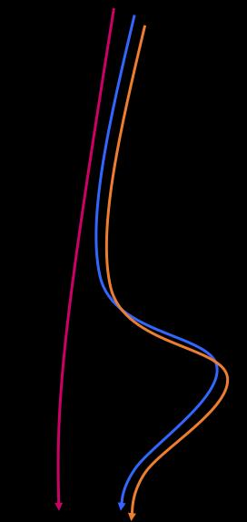

<!-- page: 27 -->

Four testcases allow each of the eight condition combinations
to occur at least once:

TestCase

Path
Conditions
Condition
Combination
Decisions
Expected

Output
A
B
X

2
0
4
sacbed
T1,T2,T3,T4
1, 5
TT
3
2
1
1
sabed
T1,T2,T3,T4
2, 6
FT
2

1
0
2
sabed
T1,T2,T3,T4
3, 7
FT
3

1
1
1
sabd
T1,T2,T3,T4
4, 8
FF
1

27

<!-- page: 28 -->

s

1.        A＞1,   B＝0
1                                               2.        A     1,   B≠0
a

I. A=2,B=0,X=4

3.        A>1,   B＝0

1                                                                         ＞

4.        A>1,   B≠0

T
(A>1) and (B=0)

4

II. A=2,B=1,X=1

c

6.       A ＝2,   X>1

5.       A ＝2,   X＞1

F

X = X / A

8.       A≠2,   X>1
I: sacbed
II: sabed
III: sabed
IV: sabd

2

7.       A≠2,   X＞1

5
b

T

Path

(A=2) or (X>1)

6

e

III. A=1,B=0,X=2

F

X=X+1

3

IV. A=1,B=1,X=1

7

d

Not every path in the program can be executed , for example, sacbd.

28

<!-- page: 29 -->

Airline Seat reservation Example

29

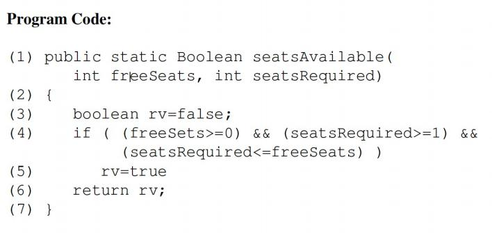

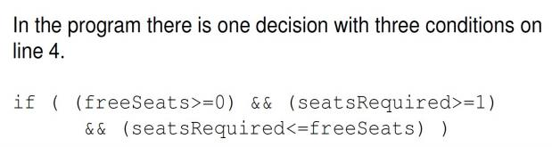

<!-- page: 30 -->

Airline Seat reservation Example

30

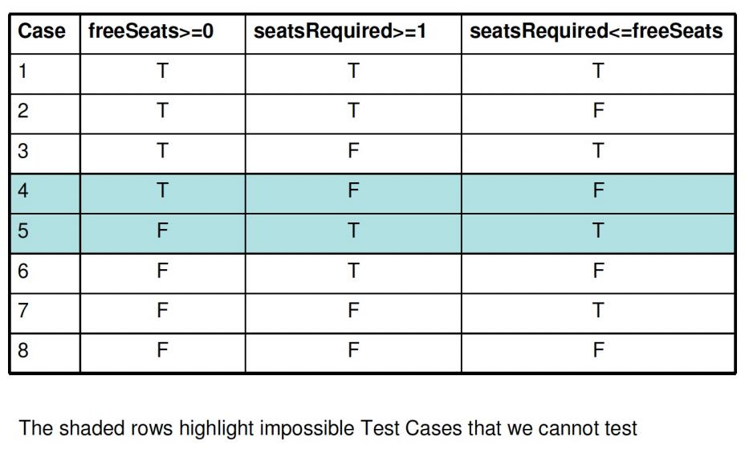

<!-- page: 31 -->

Airline Seat reservation ----Test Cases

31

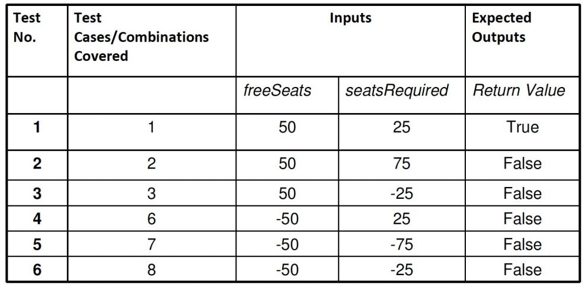

<!-- page: 32 -->

Condition Combination Coverage Strengths & Weaknesses

 Tests all possible combinations of conditions in every decision

 Can be expensive: n conditions in a decision give 2^n test cases
 Can be difficult to determine the required input parameter values

 Even though multiple condition testing covers every possible combination of

conditions in a decision, it does not cause every possible execution path to be taken

32

<!-- page: 33 -->

EX. Grade Specification

The program Grade combines an exam and coursework mark into a single
grade. The values for exam and coursework are integers.

If the exam or coursework mark is less than 50% then the grade returned is a ‘Fail’ .
To pass the course with a ‘Pass, C’, the student must score between 50% and 60% in
the exam, and at least 50% in the coursework.

They will pass the course with ‘Pass, B’, if they score over 60% in the exam and 50%
in the coursework.

In addition to this, if the average of the exam and the coursework is at least 70%, then
they are awarded a ‘Pass, A’. Input values that are less than 0 or greater than 100 for
either the exam or coursework are invalid and the program will return a message to

say ‘Marks out of range’ .

33

<!-- page: 34 -->

1) Please draw the program flow chart
of the above code

2) Please list all the decisions and their
conditions of the above program.

3)  Please use the Condition
Combination coverage testing
method to design the testcases for
the above code

34

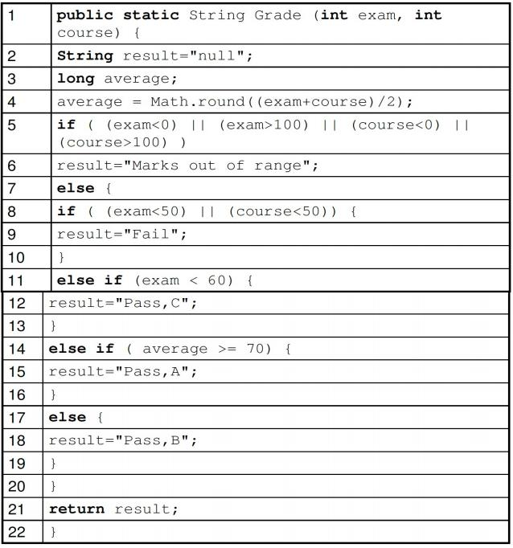

<!-- page: 35 -->

35

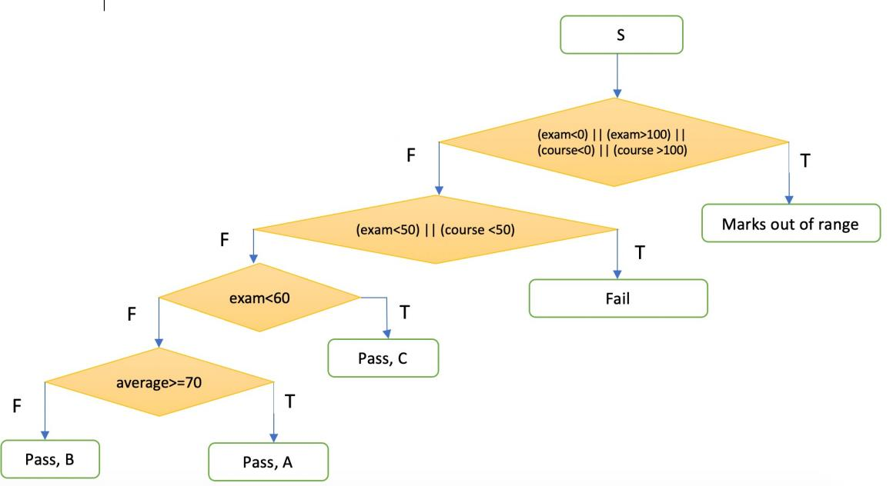

<!-- page: 36 -->

36

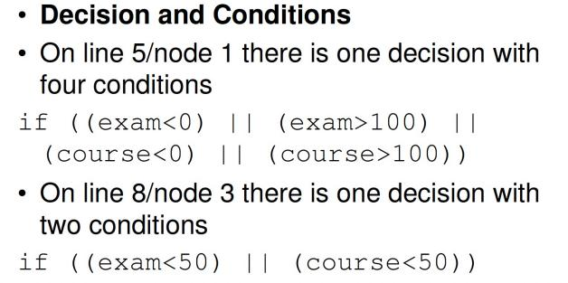

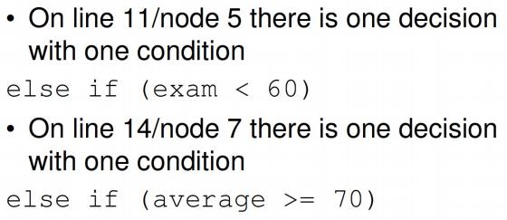

<!-- page: 37 -->

37

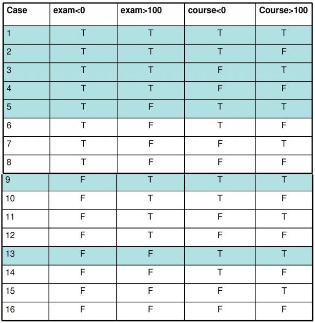

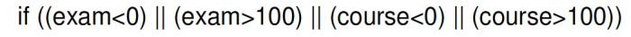

<!-- page: 38 -->

Test Cases and Test Data

38

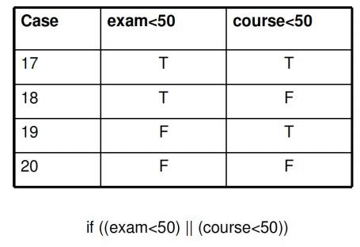

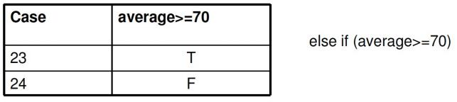

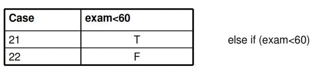

<!-- page: 39 -->

Test Cases and Test Data

39

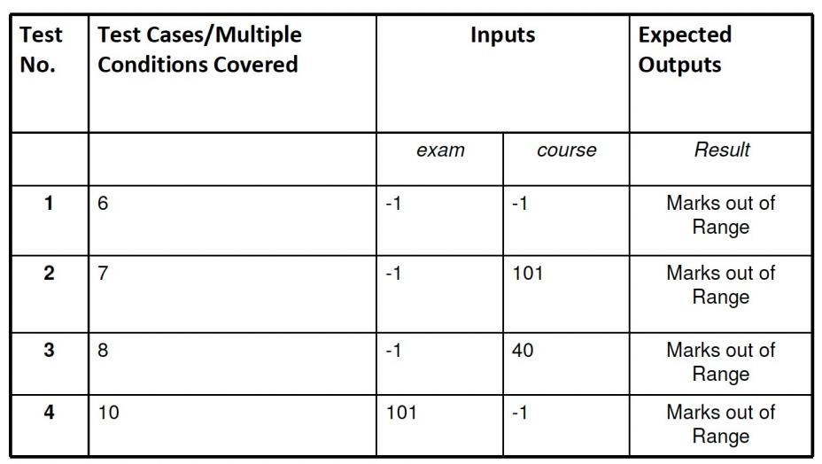

<!-- page: 40 -->

Test Cases and Test Data

40

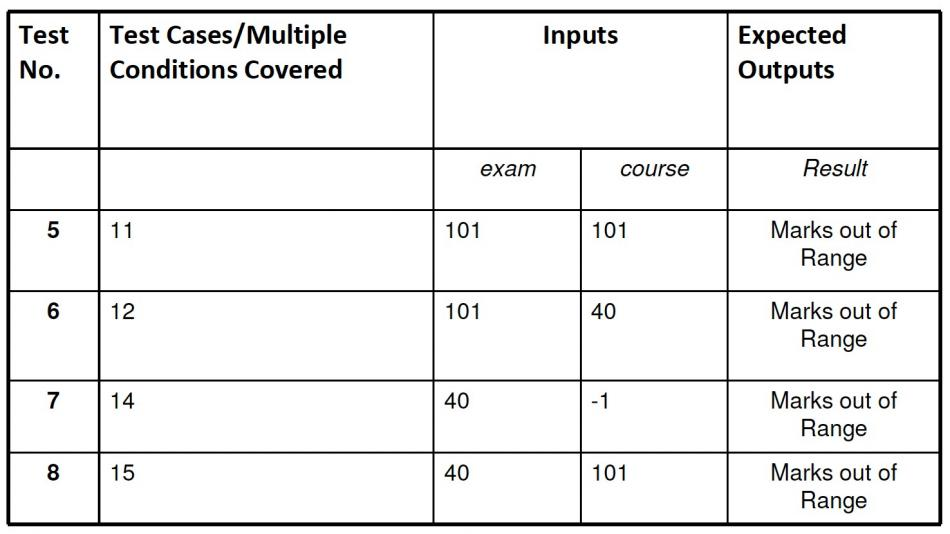

<!-- page: 41 -->

Test Cases and Test Data

41

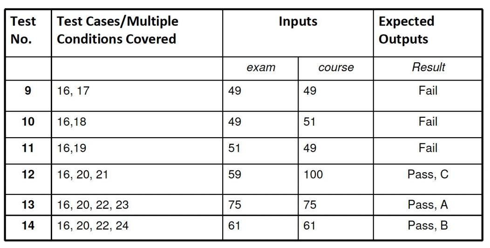
