# Ch5-2 WhiteBox-PathCoverage

<!-- page: 1 -->

White-Box Testing

Spring, 2026

1

<!-- page: 2 -->

Contents

 Control Flow Testing

  Statement Coverage
  Decision  Coverage
  Condition Coverage
  Decision Condition Coverage
  Condition Combination Coverage

  Path Coverage
  Basis Path Testing

2

<!-- page: 3 -->

1. Control Flow Graphs (CFGs)

Being able to create a Control Flow Graphs is essential for path testing

techniques.

 Directed graph G(V, E)

   V is set of vertices
   E is set of edges, E = V*V

 Represent the flow of control

   Each node represents one or more statements
   Each edge represents a ‘jump’ or ‘branch’
   Two exits=a decision (True or False)

3

<!-- page: 4 -->

Control Flow Graphs for Sequence

4

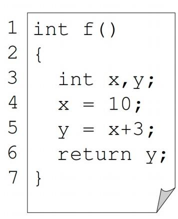

<!-- page: 5 -->

CFG for Selection (if-then)

5

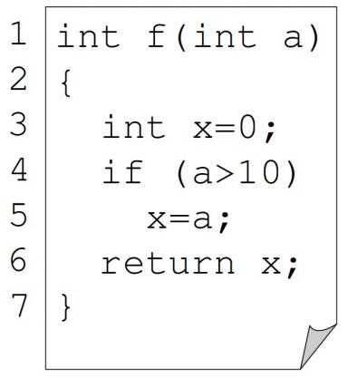

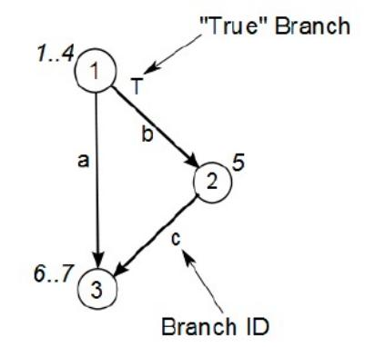

<!-- page: 6 -->

CFG for Selection (if-then-else)

6

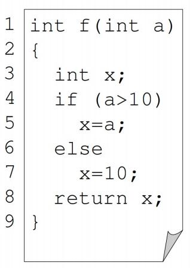

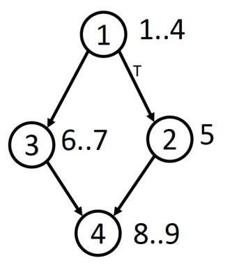

<!-- page: 7 -->

CFG for Selection   (switch)

7

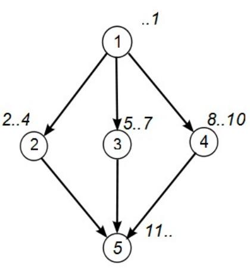

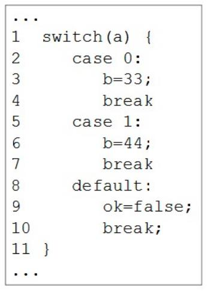

<!-- page: 8 -->

CFG for Iteration (while)

8

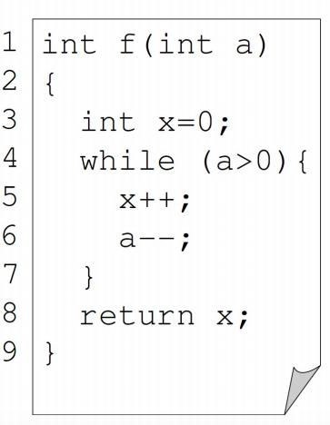

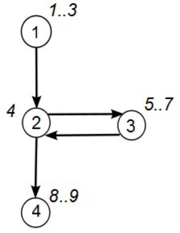

<!-- page: 9 -->

CFG for Iteration (do-while)

9

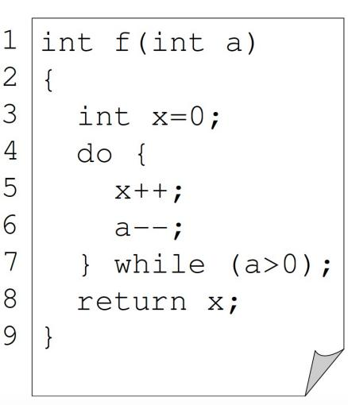

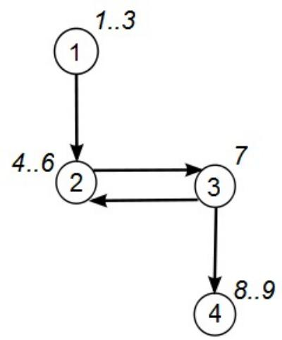

<!-- page: 10 -->

CFG for Iteration (for)

10

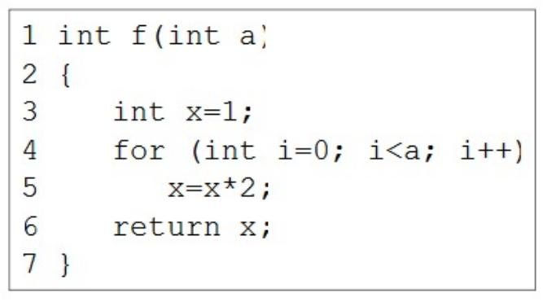

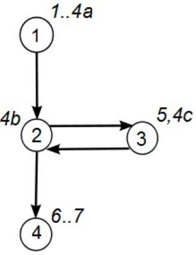

<!-- page: 11 -->

CFG Tips

 Identify all the “jump” points (decisions):

  if, while, switch/case, for

 Start at the top of the code
 Work your way down to the next jump point
 Create a new node
 For each decision identify the destination node if (a) True and (b)

false
 Connect the nodes

11

<!-- page: 12 -->

Example Code

12

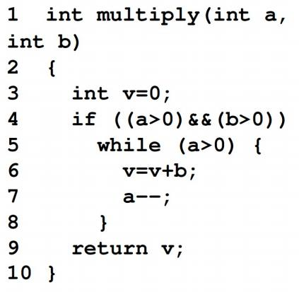

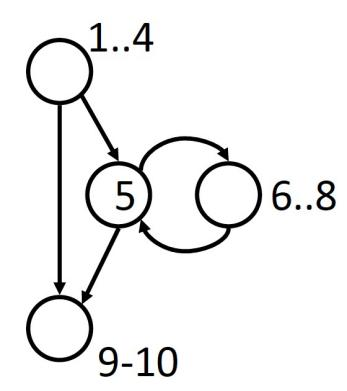

<!-- page: 13 -->

Program Flow Graph vs.  Control Flow Graph

  Control flow Graph

s

is a simplified

a  1

s,a

1

program flow graph

T

4
c

(A  1) and (B=0)

c

2
3

  Only describes the

F

X = X / A

control flow of the
program

2

5

b

b

5

T

  Does not show the

e

(A=2) or (X   1)

6 e

specific operation
of data and the
specific conditions
of branch or loop

4

F

X=X+1

6

d

3
7
d

13

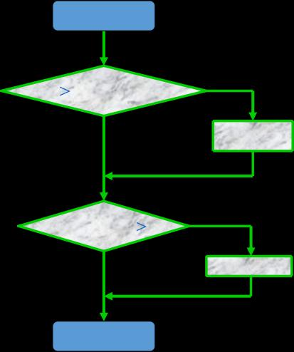

<!-- page: 14 -->

2. Path Coverage

 Generate test data to exercise all the distinct paths in a program. This is called

“path coverage”

 Path coverage causes every possible path from entry to exit of the program to be

taken during test execution.
 The goal is to achieve 100% coverage of every start-to-finish path in the code.

 A path that makes i iterations through a loop is distinct from a path that makes

i+1 iterations through a loop, even if the same nodes are visited in both iterations

Thus, there can be an infinite number of paths is some programs!

15

<!-- page: 15 -->

Path Coverage

 Need to limit the number of paths: choose equivalence classes of paths

 Two paths are considered equivalent if they differ only in the number of

loop iterations, giving two classes of loops:

    one with 0 iterations
    one with n iterations (n > 0)

 Other equivalence paths can also be chosen if required

16

<!-- page: 16 -->

Path Expression

The CFG of a program can be described by a regular expression that
uses the following operations:

. is the concatenation of a sequence of nodes

+ is a decision in the graph  (i.e. an if statement)

* is iteration  (0 or more times, e.g. a while statement)

17

<!-- page: 17 -->

Path Expression - Example

1)  i=0;
2) while (i<list.length) {
3)       if (list[i]==target)
4)                 match++;
5)       else
6)                 mismatch++;
7)       i++;
8) }

The CFG can be
represented by

18

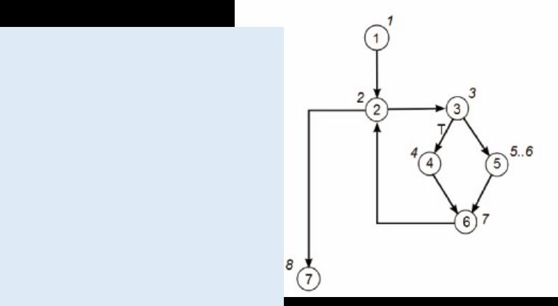

<!-- page: 18 -->

Path Expression - Example

 The loop can be simplified by

   replacing the (expression)* with a (expression+0)
   where 0 is a null represents a loop with 0 iterations

This gives:

1.2.(3.(4+5).6.2+0).7

Expanding gives the paths:

  1-2-7
  1-2-3-4-6-2-7
  1-2-3-5-6-2-7

19

<!-- page: 19 -->

Path Coverage - Example

1.2.(3.(4+5).6.2+0).7

  Replacing each node number (including the null) by a 1
  Evaluating the expression mathematically (+ becomes

addition and . becomes multiplies)

we can work out the total number of paths

paths-1.1.(1.(1+1).1.1+1).1=3

Note for “null else” statements where there is an if and no else
the expression (node +0) is used where 0 represents the “null else” decision

20

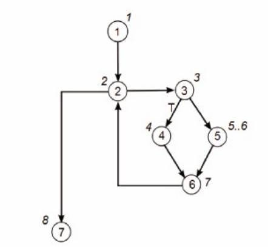

<!-- page: 20 -->

Path Coverage - seatsAvailable

Paths

(1) 1-3
(2) 1-2-3

Examining the control flow graph, two paths can be seen:

21

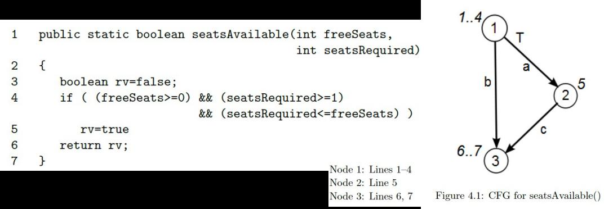

<!-- page: 21 -->

Path Coverage - seatsAvailable

If we wish to characterize the program using a
Regular Expression we can write:

Replace all values, including null, by 1 to compute
the number of paths through the program.
This gives:

22

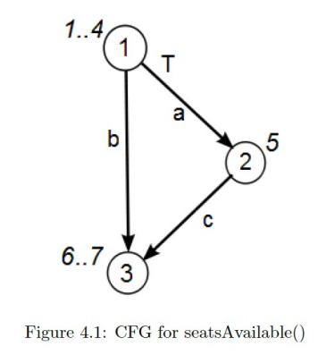

<!-- page: 22 -->

Test Cases and Test Data - seatsAvailable

 Each Path is a Test Case

1. Path 1
2. Path 2

 Test Data

  Each path must be tested in a separate test.
  It is straightforward to create tests to cover both paths.
  In this case, the tests will be the same as for Branch testing.
  It must be noted though that this will not always be so.

23

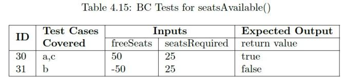

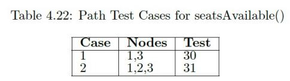

<!-- page: 23 -->

Test Cases and Test Data - seatsAvailable

Compared with Condition Combination  Coverage:

Path Coverage does not explicitly evaluate the conditions in each decision.

24

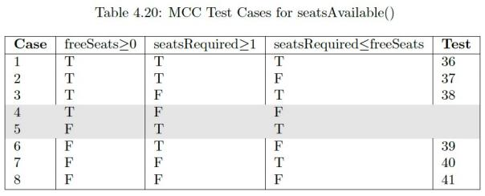

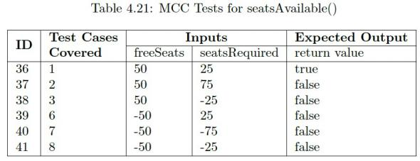

<!-- page: 24 -->

Path Coverage 一 Program Grade

25

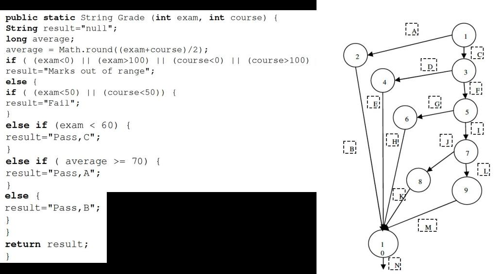

<!-- page: 25 -->

Path Coverage 一 Program Grade

Statement Coverage

26

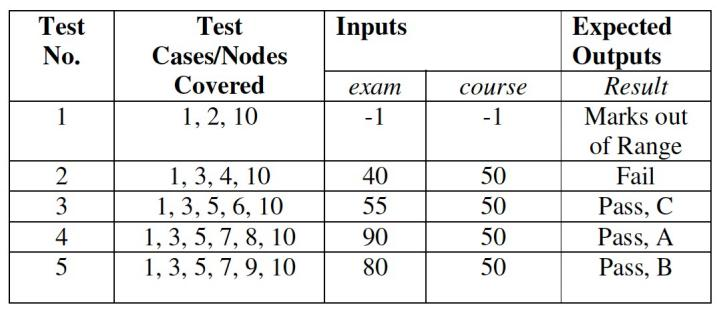

<!-- page: 26 -->

Path Coverage 一 Program Grade

Decision(Branch) Coverage

27

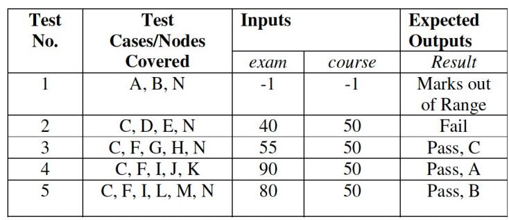

<!-- page: 27 -->

Path Coverage 一 Program Grade

Path Coverage

Path Expression:

Five paths :

28

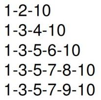

<!-- page: 28 -->

Path Coverage 一 Program Grade

Path Coverage

Path Coverage can achieve 100% statement coverage and 100% branch coverage.

29

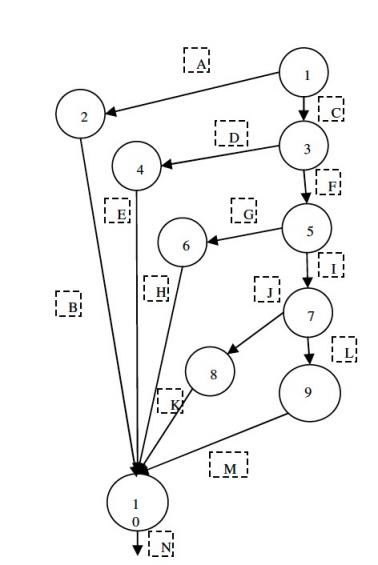

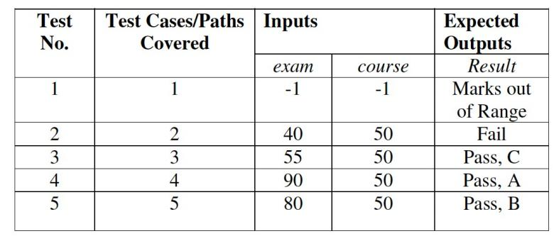

<!-- page: 29 -->

Path Coverage 一 EX.

public static float Example(float A,B,X){

if ( A>1 &&  B==0 )

a

1

X= X / A;
if (A==2 || X>1)

c

X=X+1;
return X;

2
3

}

b

5

a.(0+c).b.(0+e).d

Path Expression:

e

4

abd
abed
acbd
acbed

6

Paths:

d

30

<!-- page: 30 -->

Path Coverage 一 EX.

Test Cases
Paths
Output

A
B
X
X

1
1
1
abd
1

1
1
2
abed
2

3
0
1
acbd
1/3
2
0
4
acbed
4/3
Compared with Condition
Combination coverage:

TestCase

Path
Conditions
Condition
Combination
Decisions
Expected

Output
A
B
X

2
0
4
sacbed
T1,T2,T3,T4
1, 5
TT
3

2
1
1
sabed
T1,T2,T3,T4
2, 6
FT
2

1
0
2
sabed
T1,T2,T3,T4
3, 7
FT
3

FF
sabd
1
1
1
1

T1,T2,T3,T4

4, 8

31

<!-- page: 31 -->

Path Coverage 一 Strengths/Weaknesses

 It does create combinations of paths not exercised by other methods

  Creating  and  executing  tests  for  all  possible  paths  results  in  100%

statement coverage and 100% branch coverage.

 However, it can be computationally intensive if the program is complex

and many paths are found.

 Also, it does not explicitly evaluate the conditions in each decision.

 If path coverage and condition combination coverage are combined, test

cases with stronger fault detection ability can be designed

32

<!-- page: 32 -->

3. Basis Path Testing

 Basis Path Testing is a White Box Testing method in which test cases are

defined based on flows or logical paths that can be taken through the program.

 The objective of basis path testing is to define the number of independent paths,

so the number of test cases needed can be defined explicitly to maximize test
coverage.

 Basis path testing involves execution of all possible blocks in a program and

achieves maximum path coverage with the least number of test cases.

33

<!-- page: 33 -->

Independent paths

Independent path is defined as a path from entry to exit that has at least one edge
which has not been traversed before in any other paths.

a

1

Path Expression:  a.(0+c).b.(0+e).d

c

✓

abd
abed
acbd
acbed

2
3

Paths:

✓

✓

b

5

✗

e

4

6

Number of the independent paths:   3

d

34

<!-- page: 34 -->

Steps for Basis Path testing

（ 1） Draw a control flow graph (to determine different program paths)

（2） Calculate Cyclomatic complexity

(metrics to determine the number of independent paths)

（3） Find a basis set of paths

（4） Generate test cases to exercise each path

35

<!-- page: 35 -->

Step1  ： Draw a control flow graph

Program Flow Graph

1

void Func(int nPosX        int nPosY)
{

while (nPosX > 0)
{

2

int nSum = nPosX + nPosY;
if (nSum > 1)
{

3

nPosX--;
nPosY--;
}
else
{

6

4

5

7

8
9

if (nSum < -1) nPosX -= 2;
else nPosX -= 4;
} // end of if
}  // end of while
}

10

11

36

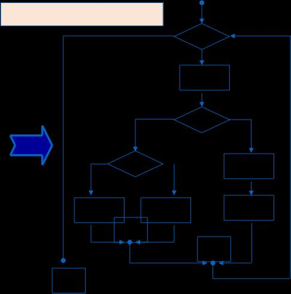

<!-- page: 36 -->

Step1  ： Draw a control flow graph

Nodes

Program Flow Graph
Control Flow Graph

1

1
Edges
2,3

2

6

4,5

3

3 Decision
Nodes

8
7

6

4

1,3,6

9

5

7
9

8

10

11
Regions

10

11
A region enclosed by edges and
nodes(including outer region)
Node9 is the end of Node6,

37

Node10 /Node3, Node 11/ Node 1

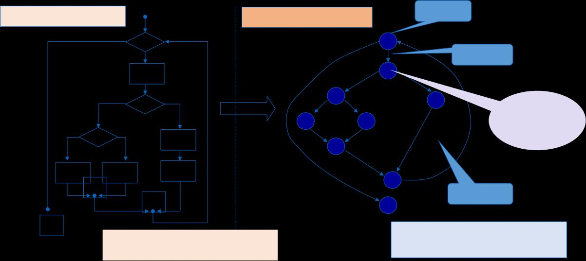

<!-- page: 37 -->

Step2: Calculate McCabe’s Cyclomatic complexity

 Cyclomatic Complexity is a testing metric developed by Thomas J. McCabe and

used for measuring the complexity of a software program.

   It is a quantitative measure of independent paths in the source code of a software program.

 Question:

How many paths should be found to cover the basis path set?

 Cyclomatic Complexity provides a basis for determining the upper bound of

the basis path set.

  Cyclomatic Complexity is the maximum number of independent paths
   Note: The basis path set is not unique.

Basis Path Testing  checks each linearly independent path through the program, which means
number of test cases, will be equivalent to the cyclomatic complexity of the program.

38

<!-- page: 38 -->

Step2: Calculate McCabe’s Cyclomatic complexity

 Three methods to compute Cyclomatic Complexity V(G)

V(G) = E - N + 2       E = Number of edges, N =Number of Nodes

V (G) = P + 1             P = Number of decision nodes (node that contains condition,

V(G) = R                   R= Number of regions

39

<!-- page: 39 -->

Step2: Calculate McCabe’s Cyclomatic complexity

1

(1) V(G) =R= 4

2,3

6                4,5

(2) V(G) =E-N+2 = 11-9+2=4

7

8

9

(3) V(G) =P+1 = 3+1=4

10

11

40

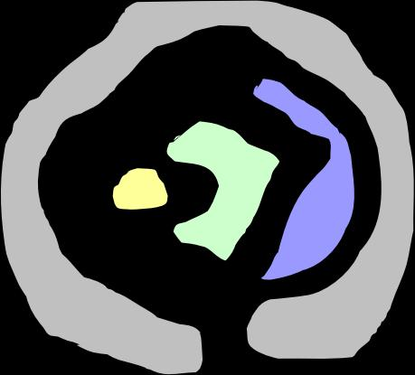

<!-- page: 40 -->

Step3: Find Basis Path Set

Independent path:
A path that moves along at least one new edge from the beginning to the end

1

2,3

Path 1 ：1-11
Path 2 ：1-2-3-4-5-10-1-11
Path 3 ：1-2-3-6-8-9-10-1-11
Path 4 ：1-2-3-6-7-9-10-1-11

6

4,5

8

7

9

To traverse the above path is to
execute all statements and all the
branches in the program at least once.

10

11

41

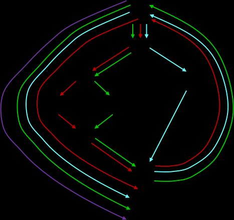

<!-- page: 41 -->

Step4: Design Test Cases

Design test cases to ensure the execution of each path in the basis path set.

Input
Paths
Output

nPosX
nPosY
nPosX
nPosY

-1
1
1 – 11
-1
1

1
1
1 – 2 – 3 – 4 – 5
– 10 – 1 – 11
0
0

1 – 2 – 3 – 6 – 8
– 9 – 10 – 1 –

1
-3

11
-1
-3

1 – 2 – 3 – 6 – 7
– 9 – 10 – 1 –

1
-1

11
-3
-1

42
