# Ch5-3 WhiteBox-Dataflow

<!-- page: 1 -->

White-Box Testing

Spring, 2026

1

<!-- page: 2 -->

Contents

 Data Flow Testing

  DU-Pair Testing

2

<!-- page: 3 -->

Dataflow Testing --- Motivation

 Testing All-Nodes and All-Edges in a control flow graph may miss significant

test cases!

 Testing All-Paths in a control flow graph is often too time consuming !

 Can we select a subset of these paths that will reveal the most faults?!

 Dataflow Testing

focuses on the points at which variables receive values and the points at
which these values are used!

3

<!-- page: 4 -->

Dataflow Testing --- Motivation

 A program accepts inputs, performs computations, assigns new values to variables,

and returns results.

 One can visualize of “flow” of data values from one statement to another. A data

value produced in one statement is expected to be used later.

 Motivations of data flow testing

   The memory location for a variable is accessed in a “desirable” way.
   Verify the correctness of data values “defined” (i.e. generated) -observe that all the “uses” of the

value produce the desired results.
   Find data flow anomalies

4

<!-- page: 5 -->

Dataflow Analysis

 Data flow analysis is in part based concordance analysis such as that shown

below — the result is a variable cross reference Table.

5

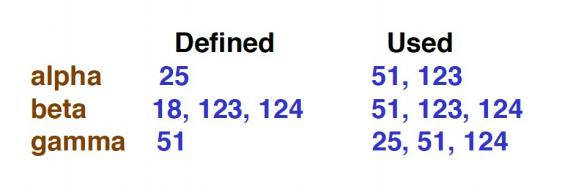

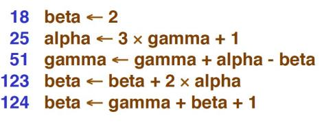

<!-- page: 6 -->

Dataflow Analysis

 Can reveal interesting bugs （ data flow anomalies ） !

1.   A variable that is defined but never used
2.   A variable that is used but never defined
3.   A variable that is defined twice before it is used
4.   Sending a modifier message to an object more than once between
accesses

5.   Deallocating a variable before it used

   Container problem – deallocating container loses references to items in the

container, memory leak

6

<!-- page: 7 -->

Dataflow Testing

 (Static Analysis ) The bugs can be found from a cross-reference table.

 (Dynamic Testing) Paths from the definition of a variable to its use are more

likely to contain bugs.

   Generate test data that follows the pattern of data definition & use through the program.

   The objective is to identify and classify all occurrences of variables in a program and for each

variable generate test data so that all definitions and uses are exercised.

7

<!-- page: 8 -->

Dataflow Testing --- Definitions

DEF(v, n) – if the value of v is defined at the statement n (or node n)

 Input, assignment, procedure calls

USE(v, n) – if the value of v is used at the statement n (or node n)

 Output, assignment, conditionals
 P-use, if variable v appears in a predicate expression
 C-use, if variable v appears in a computation

A definition-use path, du-path, with respect to a variable v

A sub-path from a defining statement(node) for v to a usage statement(node) for
v and the path is definition clear with no other defining statement(node) for v .

8

<!-- page: 9 -->

Dataflow Testing --- Max Program

9

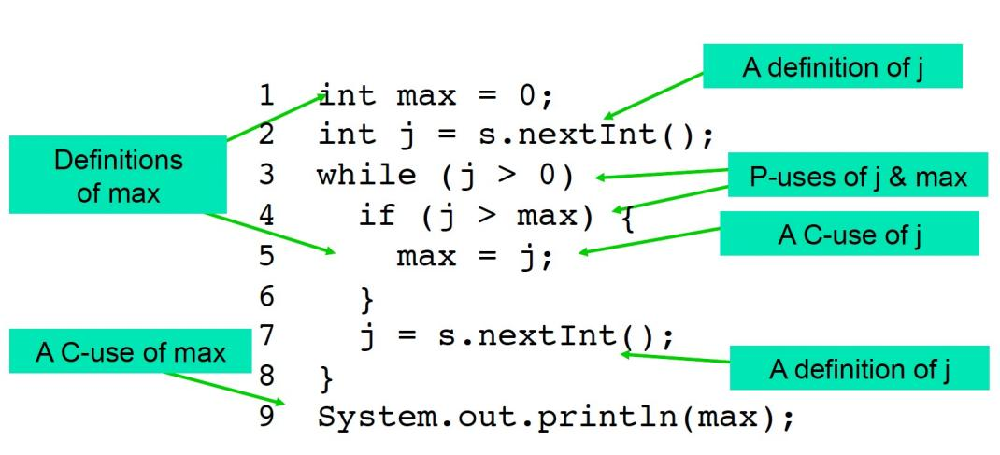

<!-- page: 10 -->

Dataflow Testing --- Max Program

du-paths j

A B
A B C
A B C D

E B
E B C
E B C D

du-paths max

A B F
A B C

D E B C
D E B F

10

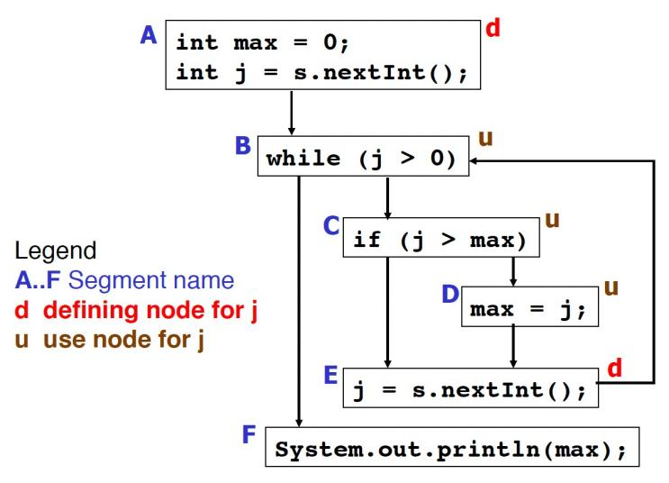

<!-- page: 11 -->

Dataflow Testing --- Coverage Criteria

Path Coverage

ADUP – (All-DU-Paths)
 One of the strongest data-

DU-Pair Testing

flow testing strategies.

ADUP requires that every
du path from every
definition of every variable
to every use of that
definition be exercised
under some testcase.

Branch Coverage

Statement Coverage

11

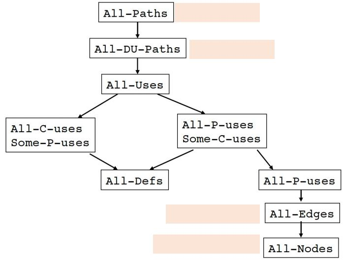

<!-- page: 12 -->

Dataflow Testing Example --- Factorial  （from textbook）

DU-Pair
For Variable Result

To generate test data to exercise these pairs

  input variable n =3 would exercise pairs 1, 3 and 4
  input variable n =1 would exercise pair 2

12

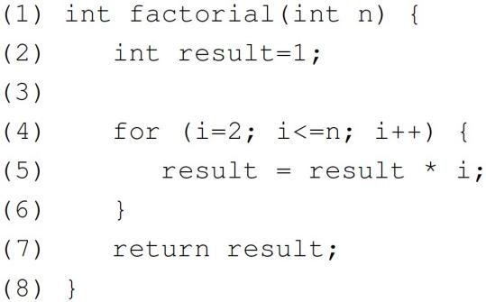

<!-- page: 13 -->

Airline Seat reservation Example

  The principle in du-pair testing is to execute each path between

the definition of the value in a variable and its subsequent use.

13

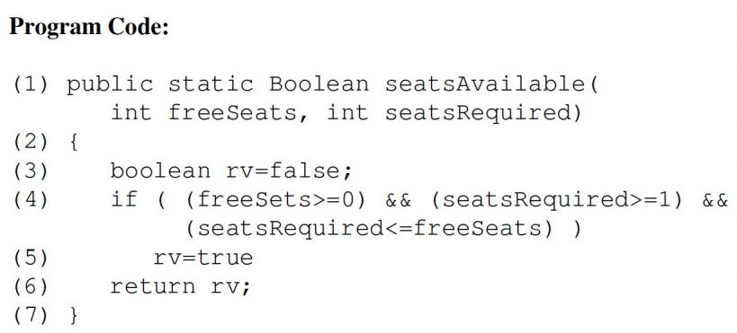

<!-- page: 14 -->

Airline Seat reservation Example

14

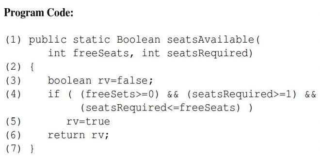

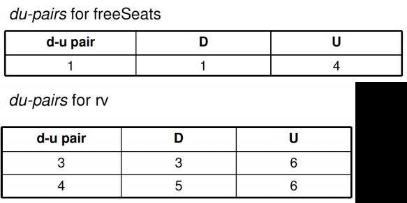

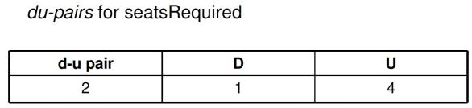

<!-- page: 15 -->

Airline Seat reservation Example

Test Data

15

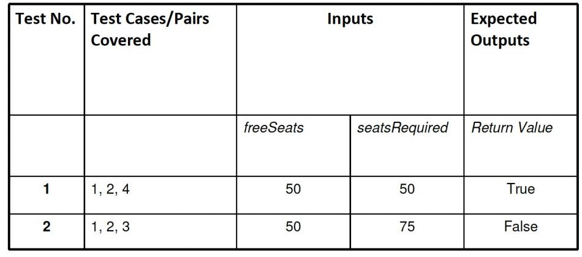

<!-- page: 16 -->

Dataflow Testing Example --- Grade

16

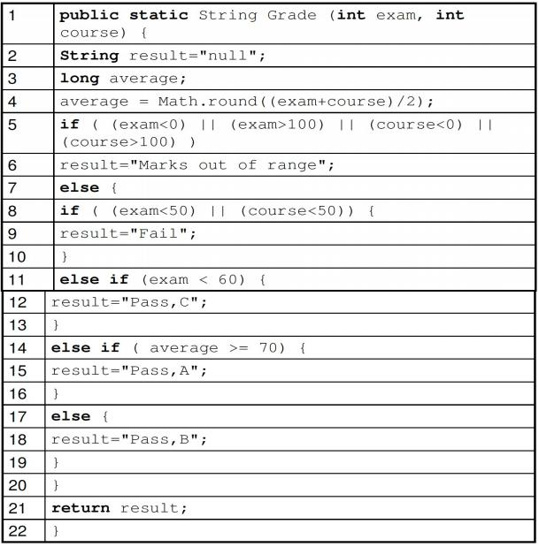

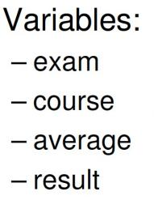

<!-- page: 17 -->

Dataflow Testing Example --- Grade

17

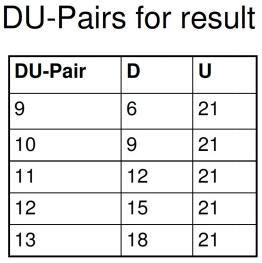

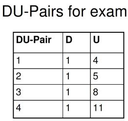

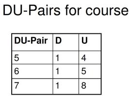

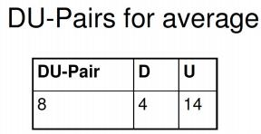

<!-- page: 18 -->

Dataflow Testing Example --- Grade

18

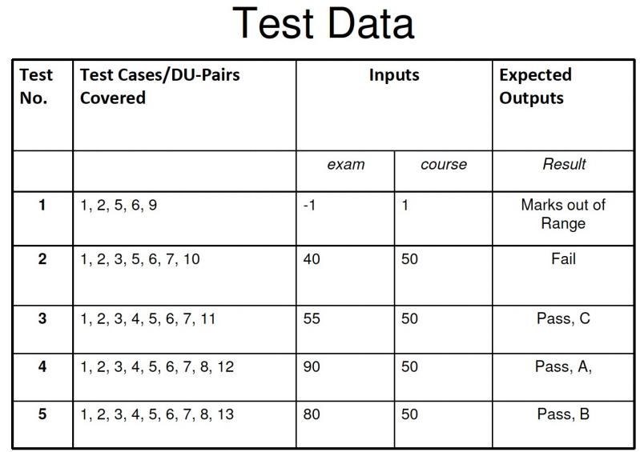

<!-- page: 19 -->

Dataflow Testing --- Comment

 The principle in du-pair testing is to execute each path between the definition of

the value in a variable and its subsequent use.

  A definition is the assignment of a value to a variable, including assignment

at function entry.
  A use is the reading of the value from a variable.
  Increment and decrement operations cause a use followed by a definition.

 DU-Pair testing provides comprehensive testing of all the Definition-Use paths

in a program, but generating the test data can be a very time consuming exercise

19
