# Ch6 StaticTesting

<!-- page: 1 -->

Static  Testing

Spring, 2026

1

<!-- page: 2 -->

Contents

 Static Testing

  Code Review

  Static Program Analysis

2

<!-- page: 3 -->

1. Static Testing

 Static testing is the process of carefully and methodically reviewing and

analyzing the software for bugs without executing it.

  Code Review
  Static Program Analysis

 This form of testing is very valuable and has advantages over execution-based

testing. Reported experience shows that a large number of faults can be found
using static testing.

 This has benefits in terms of cost and productivity because faults are found

(and corrected) early on and less time is required for execution-based tests.

3

<!-- page: 4 -->

Experience of Static Testing

4

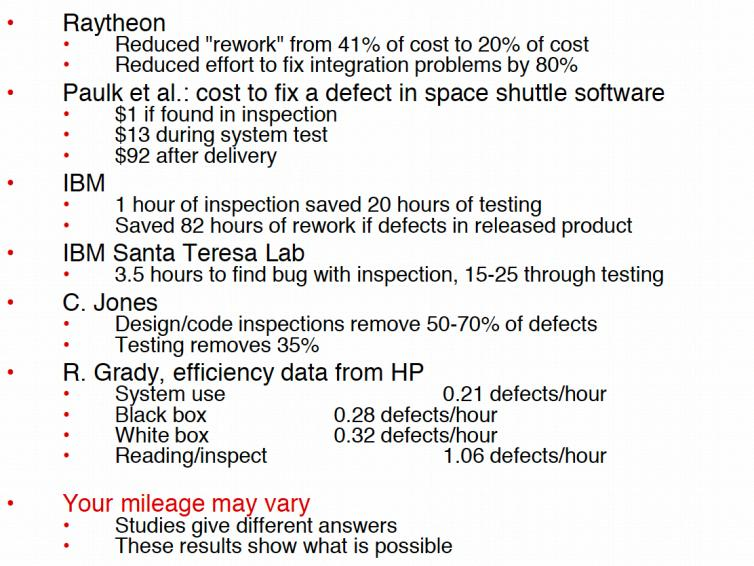

<!-- page: 5 -->

2. Code Review

Essential elements of  code review

 Identify problems:

 Find problems with the software such as missing items, mistakes, etc.

 Follow rules:

 Amount of code to be reviewed, how much time will be spent, etc.

 Prepare:

 Each participant should prepare in order to contribute to the review.

 Write a report:

 Summarize the results of the review, make report available to the

development team.

5

<!-- page: 6 -->

Informal Code Review

 Peer reviews

 An informal small group of programmers and/or testers act as reviewers.
 Participants should follow the 4 essential elements even through the review is

informal.

 Walkthroughs

 A more formal process in which the author of the code formally presents the code

to a small group of programmers and/or testers.
 The author reads the code line by line explaining what it does, reviewers listen

and ask questions.
 Participants should follow the 4 essential elements.

6

<!-- page: 7 -->

Formal Code Inspections

 An inspection is more comprehensive than a walk-through.

  Code presenter is not the author of the code.
  The other participants are the inspectors.
  There is a moderator to assure that the rules are followed and the meeting

runs smoothly.

 After the inspection a report is composed. The programmer then makes

changes and a re-inspection occurs, if necessary.

 Formal code inspections are effective at finding bugs in code and designs and

are gaining in popularity.

7

<!-- page: 8 -->

Formal Code Inspections – 5 steps

 Stage 1 - Overview

   An overview document that details the product specifications/ design/code/plan is

prepared by the programmer. The document is distributed to participants.

 Stage 2 - Preparation

   The Tester must understand the document in detail. A checklist of fault types generally

found in inspections ranked by frequency should be available to help concentrate their
efforts.

 Stage 3 - Inspection

   At the meeting there is a walk-through of the document to ensure that each item in the

checklist is covered. Any faults found are simply documented for later correction.

8

<!-- page: 9 -->

Formal Code Inspections – 5 steps

 Stage 4 - Rework

     After the meeting all faults and issues are resolved.

 Stage 5 - Follow-up

   The leader of the code inspection group must finally ensure that every issue has been

resolved, and should produce a final report. This will provide detail on items such as:

– faults found categorized by their type
– fault statistics (for example, the number of faults found compared to the number of

faults found at same stage of development in other products)

 The report should also be able to recommend the redesign of a module or

modules if too many faults were found. Other similar modules could be
subjected to more rigorous testing when they are produced.

 Once the report is finalized the inspection can be declared to be complete.

9

<!-- page: 10 -->

Code review checklist:  Data reference errors

 Is an un-initialized variable referenced?
 Are array subscripts integer values and are they within the array’s bounds?
 Are there off-by-one errors in indexing operations or references to arrays?
 Is a variable used where a constant would work better?
 Is a variable assigned a value that’s of a different type than the variable?
 Is memory allocated for referenced pointers?
 Are data structures that are referenced in different functions defined
identically?

10

<!-- page: 11 -->

Code review checklist:  Data declaration errors

 Are the variables assigned correct length, type, storage class?

 E.g. should a variable be declared a string instead of an array of

characters?

 If a variable is initialized at its declaration, is it properly initialized and
consistent with its type?
 Are there any variable with similar names?
 Are there any variables declared that are never referenced or just referenced
once (should be a constant)?

 Are all variables explicitly declared within a specific module?

11

<!-- page: 12 -->

Code review checklist:  Computation errors

 Do any calculations that use variables have different data types?

 E.g., add a floating-point number to an integer
 Do any calculations that use variables have the same data type but are different
size?

 E.g., add a long integer to a short integer
 Are the compiler’s conversion rules for variables of inconsistent type or size
understood?

 Is overflow or underflow in the middle of a numeric calculation possible?
 Is it ever possible for a divisor/modulus to be 0?
 Can a variable’s value go outside its meaningful range?

 E.g., can a probability be less than 0% or greater than 100%?
 Are parentheses needed to clarify operator presence rules?

12

<!-- page: 13 -->

Code review checklist:  Comparison errors

 Are the comparisons correct?

 E.g., < instead of <=

 Are there comparisons between floating-point values?

 E.g., is 1.0000001 close enough to 1.0000002 to be equal?

 Are the operands of a Boolean operator Boolean?

 E.g., in C 0 is false and non-0 is true

13

<!-- page: 14 -->

Code review checklist:  Control flow errors

 Do the loops terminate? If not, is that by design?
 Does every switch statement have a default clause?
 Are there switch statements nested in loops?

E.g., careful because break statements in switch statements will not
exit the loop … but break statements not in switch statements will
exit the loop.
 Is it possible that a loop never executes? If it acceptable if it doesn’t?

 Does the compiler support short-circuiting in expression evaluation?

14

<!-- page: 15 -->

Code review checklist:  Subroutine parameter errors

 If constants are passed to the subroutine as arguments are they accidentally
changed in the subroutine?
 Do the units of each parameter match the units of each corresponding
argument?

 E.g., English versus metric
 This is especially pertinent for SOA components
 Do the types and sizes ofthe parameters received by a subroutine match
those sent by the calling code?

15

<!-- page: 16 -->

Code review checklist:  Input/Output errors

 If the file or peripheral is not ready, is that error condition handled?
 Does the software handle the situation of the external device being
disconnected?

 Have all error messages been checked for correctness, appropriateness,
grammar, and spelling?
 Are all exceptions handled by some part of the code?
 Does the software adhere to the specified format of the date being read from
or written to the external device?

16

<!-- page: 17 -->

Code review checklist:  Other checks

 Does your code pass the lint test?

 E.g., How about gcc compiler warnings?

 Is your code portable to other OS platforms?
 Does the code handle ASCII and Unicode?
 How about internationalization issues?
 Does your code rely on deprecated APIs?
 Will your code port to architectures with different byte orderings?

 E.g., little (increasing numeric significance with increasing memory

addresses) versus big (the opposite of little) endian?

17

<!-- page: 18 -->

3. Program Static Analysis

18

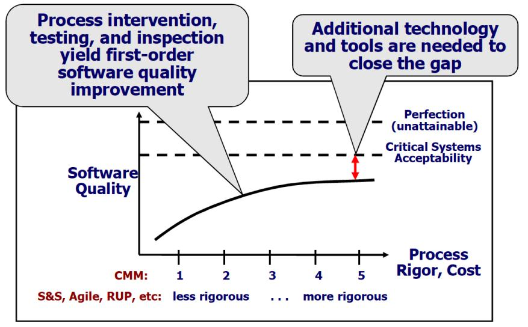

<!-- page: 19 -->

Program Static Analysis

Dynamic:

  Testing: Direct execution of code on test data in a controlled environment.
Static:

  Inspection: Human evaluation of code, design documents (specs and models),

modifications.
   Analysis: Tools reasoning about the program without executing it.

 Try to discover issues by analyzing source code. No need to run.

  Defects of interest may be on uncommon or difficult-to-force execution paths

for testing.
  What we really want to do is check the entire possible state space of the

program for particular properties. .(e.g., race condition, buffer overflow, use

after free)
  Static code analysis tools:  Lint/ FindBugs/Coverity/Facebook Infer …

19

<!-- page: 20 -->

Defects Static Analysis can Catch

Defects that result from inconsistently following simple design rules.

  Security: Buffer overruns, improperly validated input.
  Memory safety: Null dereference, uninitialized data.
  Resource leaks: Memory, OS resources.
  API Protocols: Device drivers; real time libraries; GUI frameworks.
  Exceptions: Arithmetic/library/user-defined
  Encapsulation: Accessing internal data, calling private functions.
  Data races: Two threads access the same data without synchronization

20

<!-- page: 21 -->

The most common defect in open-source software

Coverity Scan Program (Stanford, 2006)

  Launched under a contract with the Department of Homeland Security to

harden open source software which provides critical infrastructure for the
Internet.
  Analyzed more than 290 open source projects, including Linux, Apache,

PHP, and Android.

Defects
Frequency
Risk

Null pointer dereferences
27.60%
Medium

Resource leaks
23.19%
High
Incorrect expression
9.76%
Medium
Uninitialized variables
8.41%
High
Use after free
5.91%
High
Buffer overflows
5.52%
High

21

<!-- page: 22 -->

Checker：
FORWARD_NULL

program Crash, exit, restart, execution of unauthorized code or command

22

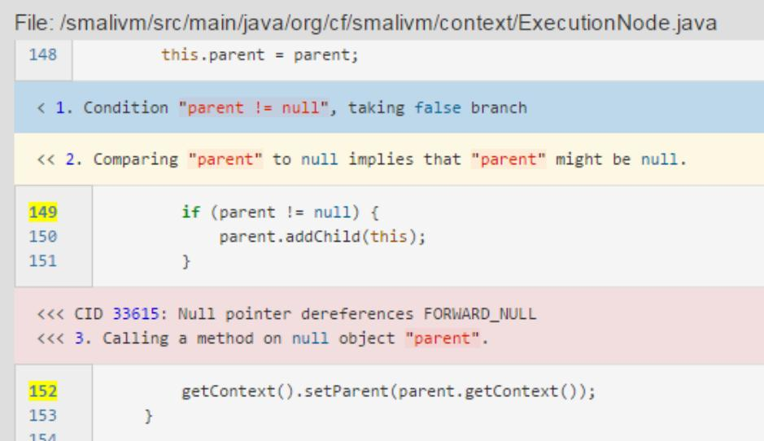

<!-- page: 23 -->

Checker:
RESOURCE_LEAK

DoS attacks, sensitive data leaks, resource consumption

23

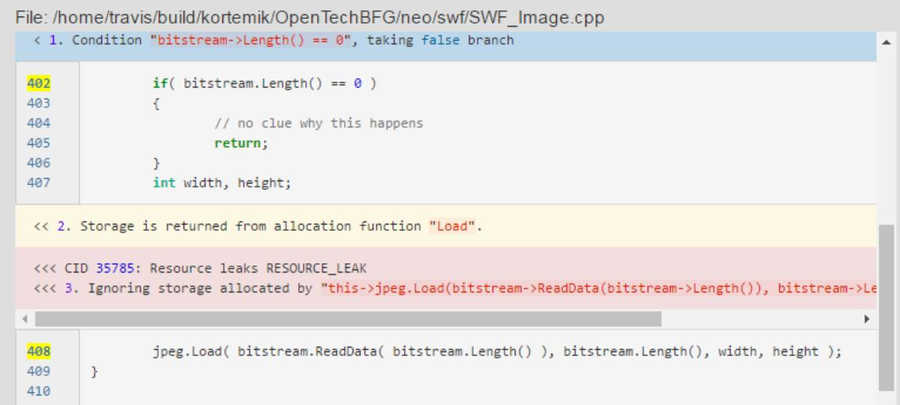

<!-- page: 24 -->

Checker:
COPY_PASTE_ERROR

Unexpected output values, program logic errors, runtime errors

24

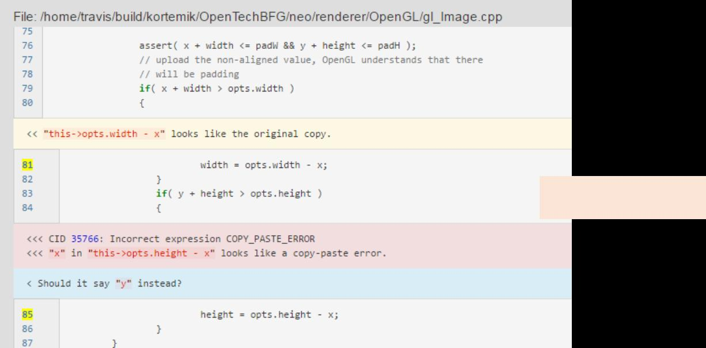

<!-- page: 25 -->

Checker:
UNINIT

Result in incorrect program logic, incorrect data, program crash

25

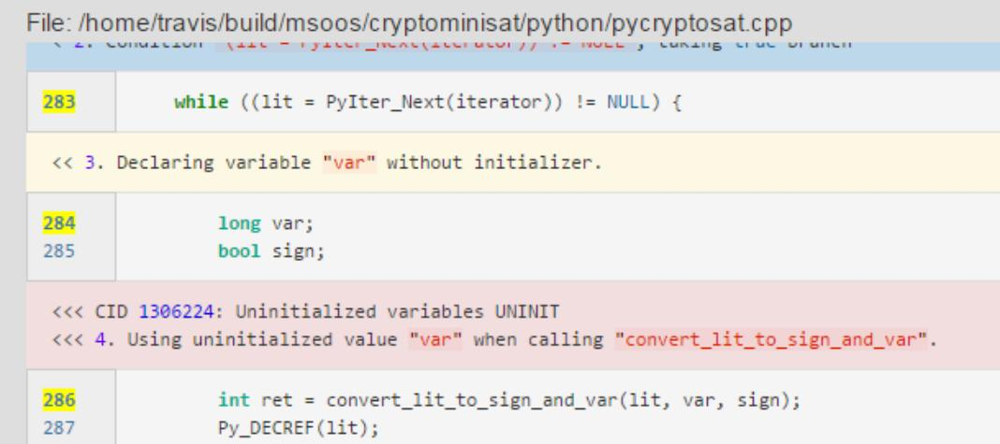

<!-- page: 26 -->

Checker:
USE_AFTER_FREE

resource consumption
Memory - illegal accesses,  Program Crash, exit, restart,

26

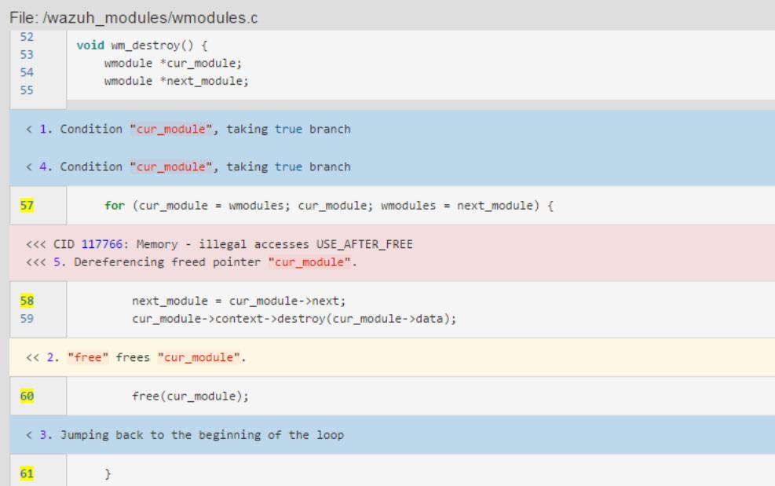

<!-- page: 27 -->

Checker:

OVERRUN

Memory - illegal accesses,  Program Crash, exit, restart,

resource consumption                                                    27

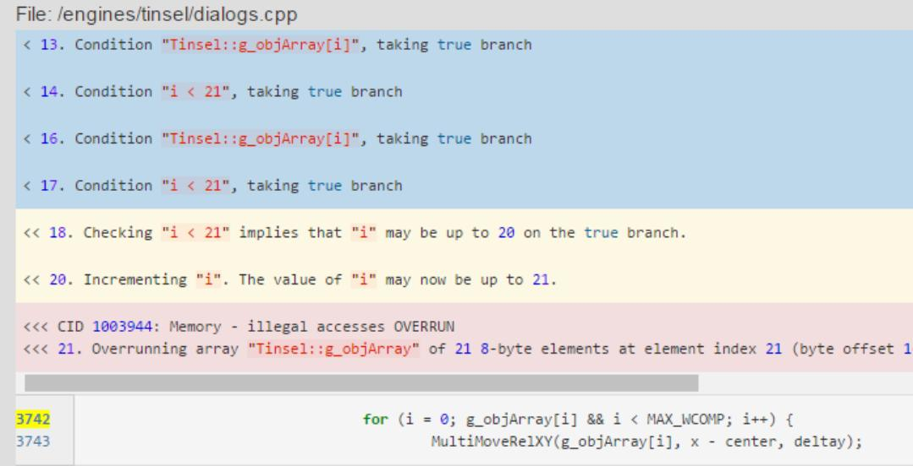

<!-- page: 28 -->

Empirical Results on Static Analysis

 Static analysis tools as early indicators of pre-release defect density（2005）

   The defects identified by two different static analysis tools
   Predict the actual pre-release defect density for Windows Server 2003
   Identify fault-prone areas of code requiring further testing.

 On the Value of Static Analysis for Fault Detection in Software （2006）

   Nortel Network/3 C/C++ projects/3 million LOC total/ large-scale industrial software
   Early generation static analysis tools
   Cost per fault of static analysis 61-72% compared to inspections
   Effectively finds assignment, checking faults
   Can be used to find potential security vulnerabilities

Results indicate static analysis tools are complementary to other fault-detection
techniques for the economic production of a high-quality software product.

28

<!-- page: 29 -->

Quality assurance at Microsoft

Original process: manual code inspection

•  Effective when system and team are small
•  Too many paths to consider as system grew

Early 1990s: add massive system and unit testing

•  Tests took weeks to run
•  Diversity of platforms and configurations
•  Sheer volume of tests
•  Inefficient detection of common patterns, security holes
Non-local, intermittent, uncommon path bugs was treading water in Windows
Vista development

Early 2000s: add static analysis

29

<!-- page: 30 -->

Program Analyzers

Code

Report
Type
Line

1
mem leak
324

2
buffer oflow
4,353,245

Program
Analyzer

3
sql injection
23,212

4
stack oflow
86,923

Spec

5
dang ptr
8,491

…
…
…

10,502
info leak
10,921

30

<!-- page: 31 -->

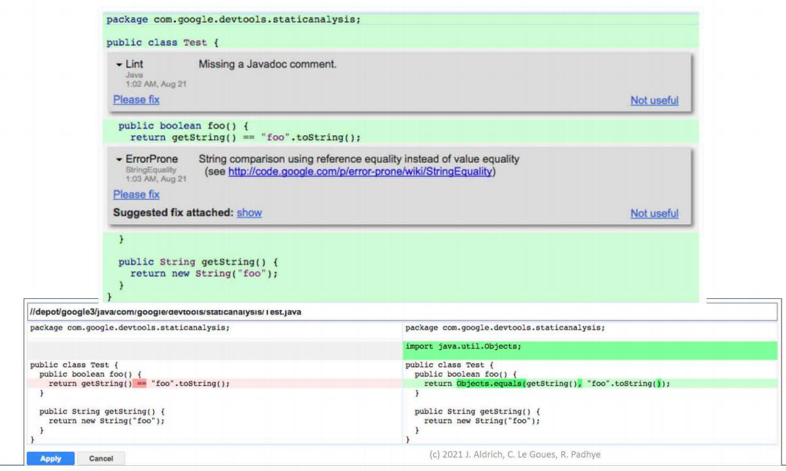

<!-- page: 32 -->

Two fundamental concepts

Abstraction

。Elide details of a specific implementation.
。Capture semantically relevant details; ignore the rest.

Programs as data

。Programs are just trees/graphs!
。…and we know lots of ways to analyze trees/graphs, right?

32

<!-- page: 33 -->

Defining Static Analysis

 Systematic examination of an abstraction of program state space.

。Does not execute code! (like code review)

 Abstraction:A representation of a program that is simpler to analyze.

。Results in fewer states to explore; makes difficult problems tractable.

 Check if a particular property holds over the entire state space:

。Liveness:“something good eventually happens.”
。Safety:“this bad thing can’t ever happen.”
。Compliance with mechanical design rules.

33

<!-- page: 34 -->

The Bad News: Rice's Theorem

"Any nontrivial property about the language
recognized by a Turing machine is undecidable.“

Henry Gordon Rice, 1953

Every static analysis is necessarily incomplete or unsound or
undecidable (or multiple of these)

34                                                                                                             2015 (c) C. Le Goues
34

<!-- page: 35 -->

Results combined

Sound Analysis

Unsound
and
Incomplete
Analysis

All Defects

Complete
Analysis

2015 (c) C. Le Goues                                                35                                                                                                      35

<!-- page: 36 -->

36

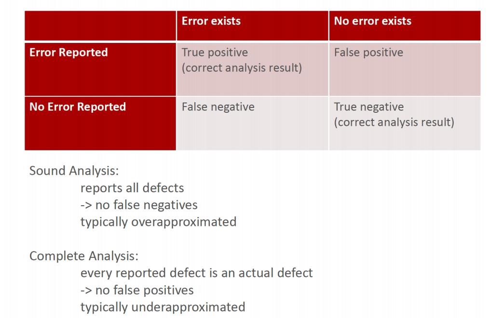

<!-- page: 37 -->

Sound Program Analyzer

Analyze large
code bases

Code

Report
Type
Line

1
mem leak

324

2
buffer oflow
4,353,245

false alarm

Program
Analyzer

3
sql injection
23,212

4
stack oflow
86,923

false alarm

5
dang ptr
8,491

Spec

…
…
…

10,502
info leak
10,921

Sound: may
report many
warnings

May emit
false alarms

38

<!-- page: 38 -->

Abstract Syntax Trees

int result = 1;
int i = 2;
while (i < n) {

Program

while

=                          …

result *= i;
i++;
}
return result;

result              1

block

i                     n                    …

That is what your IDE and compiler are doing

2015 (c) C. Le Goues                                                39                                                                                                      39

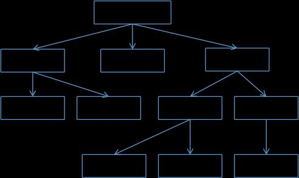

<!-- page: 39 -->

Abstraction Control-Flow Graph

(entry)

1. void foo() {
2.    …
3.    cli();
4.   if (a) {
5.      restore_flags();
6.    }
7. }

3. cli();

4. if (rv   0)

5. restore_flags();

(exit)

40

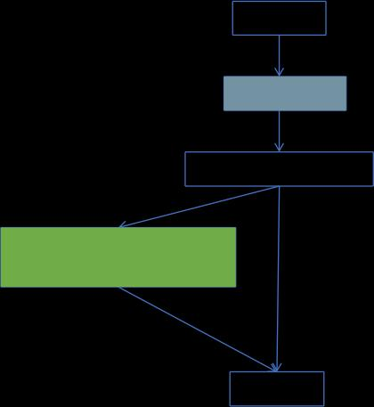

<!-- page: 40 -->

Data flow Analysis

1.  int foo() {
2.     Integer x = new Integer(6);
3.     Integer y = bar();
4.    int z;
5.    if (y != null)
6.        z = x.intVal() + y.intVal();
7.     else {
8.        z = x.intVal();
9.       y = x;
10.      x = null;
11.    }
12.    return z + x.intVal();
13. }

Are there any

possible null pointer
exceptions in this
code?

41

<!-- page: 41 -->

In graph form …

Integer x = new Integer(6);

1.int foo() {
2.   Integer x = new Integer(6);
3.   Integer y = bar();
4.   int z;
5.   if (y != null)
6.      z = x.intVal() + y.intVal();
7.   } else {
8.      z = x.intVal();
9.      y = x;
10.     x = null;
11.   }
12.   return z + x.intVal();
13.}

Integer y = bar();

int z;

if (y  = null)

z = x.intVal();
y = x;
x = null;

z = x.intVal () +
y .intVal();

return z + x.intVal();

42

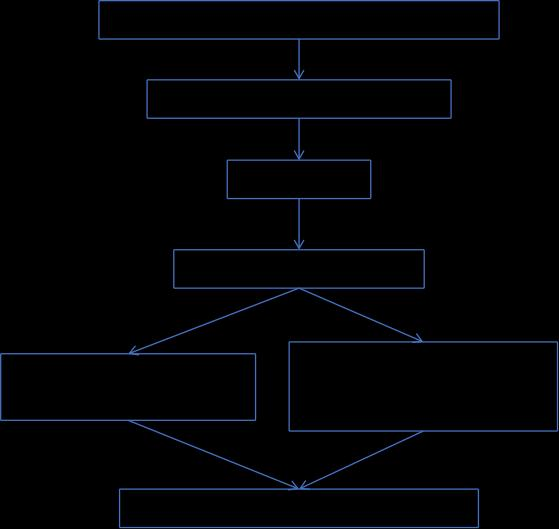

<!-- page: 42 -->

Null pointer analysis

Track each variable in the program at all program points.

Abstraction:

 Program counter
 3 states for each variable: null, not-null, and maybe-null.

Then check if, at each dereference, the analysis has identified whether the
dereferenced variable is or might be null.

43

<!-- page: 43 -->

Integer x = new Integer(6);

In graph form …

x      not-null

V

Integer y = bar();

1.int foo() {
2.   Integer x = new Integer(6);
3.   Integer y = bar();
4.   int z;
5.   if (y != null)
6.      z = x.intVal() + y.intVal();
7.   } else {
8.      z = x.intVal();
9.      y = x;
10.     x = null;
11.   }
12.   return z + x.intVal();
13.}

x      not-null, y      maybe-null

V
int z;
if (y != null)

x      not-null, y      maybe-null
x      not-null, y     maybe-null

z = x.intVal();
y = x;
x = null;

z = x.intVal () +
y .intVal();

x      not-null, y       maybe-null         x       null, y      maybe-null

x      maybe-null, y

maybe-null

Error: may have null pointer on line 12,
because x may be null!

return z + x.intVal();

44

<!-- page: 44 -->

Examples of Data-Flow Analyses

 Null Analysis

。Var -> {Null, NotNull, U N K N O W N }
 Zero Analysis

。Var -> {Zero, NonZero, U N K N O W N }
 Sign Analysis

。Var -> {-, +, 0, U N K N O W N }
 Range Analysis

。Var -> {[0, 1], [1, 2], [0, 2], [2, 3], [0, 3], …, U N K N O W N }
 Constant Propagation

。Var -> {1, 2, 3, …, U N K N O W N }
 File Analysis

。File -> {Open, Close, U N K N O W N }
 Tons more!!!

45

<!-- page: 45 -->

Static Analysis vs. Testing

Which one to use when?

 Points in favor of Static Analysis

。Don’t need to set up run environment, etc.
。Can analyze functions/modules independently and in parallel
。Don’t need to think of(or try to generate) program inputs

 Points in favor of Testing / Dynamic Analysis

。Not deterred by complex program features
。Can easily handle external libraries, platform-specific config, etc.
。Ideally no false positives
。Easier to debug when a failure is identified

46

<!-- page: 46 -->

