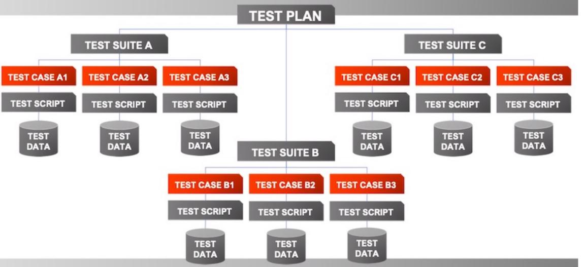

# Ch7 TestPlan_TestCase

<!-- page: 1 -->

Test Plan and Test Case

Spring, 2026

1

<!-- page: 2 -->

Contents

 Test Plan

  Process for planning

  Test plan components

 Test Case

2

<!-- page: 3 -->

1. Test Plan

 A TEST PLAN is a document describing software testing scope and activities.

It is the basis for formally testing any software / product in a project.

   the scope, approach, resources and schedule of intended test activities.

 Master Test Plan: A single high-level test plan for a project / product that

unifies all other test plans.
 Testing Level Specific: Test plans for each level of testing:

   Unit Test Plan
    Integration Test Plan
    System Test Plan
   Acceptance Test Plan
 Testing Type Specific: Test plans for specific types of testing like Performance

Test Plan and Security Test Plan.

3

<!-- page: 4 -->

Test Planning Process

1)  Define test strategy
2)  Define test system
3)  Estimate test effort
4)  Prepare and review test plan

4

<!-- page: 5 -->

1) Test Strategy

• Approach: how to do different tasks
• Entry/exit criteria
• When can you start?
• When can you stop?
• When can you restart?
• Automation
• Which tools?
• When? (e.g., only regression testing)

• Scope
• You cannot test everything.
• What are the priorities?
• most important features
• new code
• most difficult areas
• most often used features

5

<!-- page: 6 -->

2) Test Systems

• Architecture
• Test suite: collection of tests for a related group of
requirements
• Test case: smallest unit

• Environment: physical facilities ，platforms

6

<!-- page: 7 -->

3) Estimating Test Effort

• Tasks: list of things to do

• Effort estimation: previous experience, expert judgment,
decomposition
• Schedule: show relationships between tasks
• Risks: estimate likelihood and impact

7

<!-- page: 8 -->

Test Plan Components (1)

The format and content of a software test plan vary depending on the processes, standards, and test
management tools being implemented.

The following format, which is based on IEEE standard for software test documentation, provides a
summary of what a test plan can / should contain.

1.    Test plan identifier: unique
2.    Introduction: objectives of document/Specify constraints
3.    Test items: high-level description of inputs to testing
(software / products  and their versions)
4.    Features to be tested: list of features or requirements
5.    Features not to be tested: features you cannot test yet

8

<!-- page: 9 -->

Test Plan Components (2)

6.   Approach
n how you will test
n may include: phases of testing (unit, system, acceptance),

static vs. dynamic methods, performance testing,

regression testing, use of problem tracking system

7.    Item pass/fail criteria
n When does a test pass?
n When does the product pass?

9

<!-- page: 10 -->

Test Plan Components (3)

8.    Suspension criteria and resumption requirements: what to do if
bugs prevent progress
9.    Test deliverables: all outputs of testing
Test Case/Defects Report/ Test Report …
9.    Environmental needs: hardware and software/network
any testing or related tools.
10.  Responsibilities: who does what/each team / role / individual.

10                                                                         10

<!-- page: 11 -->

Test Plan Components (4)

13. Staffing and training needs: list people or types of people
14. Schedule: milestones
15.  Risks and contingencies: matrix here
• the risks that have been identified.
• the mitigation plan and the contingency plan for each risk.

16. Approvals: signatures

11

<!-- page: 12 -->

2. Test Case

 A TEST CASE is a documented set of preconditions (prerequisites), procedures

(inputs / actions) and postconditions (expected results) which a tester uses to
determine whether a system under test satisfies requirements or works
correctly.

 A test case can have one or multiple test scripts .

   A sequence of instructions for the execution of a test

 A collection of test cases is called a test suite.

12

<!-- page: 13 -->

13

