# Ch8 UnitTesting

<!-- page: 1 -->

Unit  Testing

Spring, 2026

1

<!-- page: 2 -->

Contents

 What do we test?

 Unit Testing

 Test-Driven Development (TDD)

Automated Unit Testing

2

<!-- page: 3 -->

1. What do we test? - 一 the Focus of Concern

3

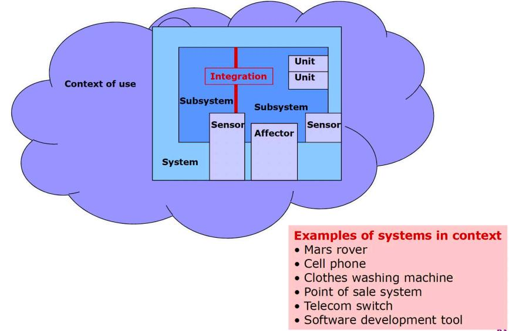

<!-- page: 4 -->

What do we test? - 一 the Focus of Concern

4

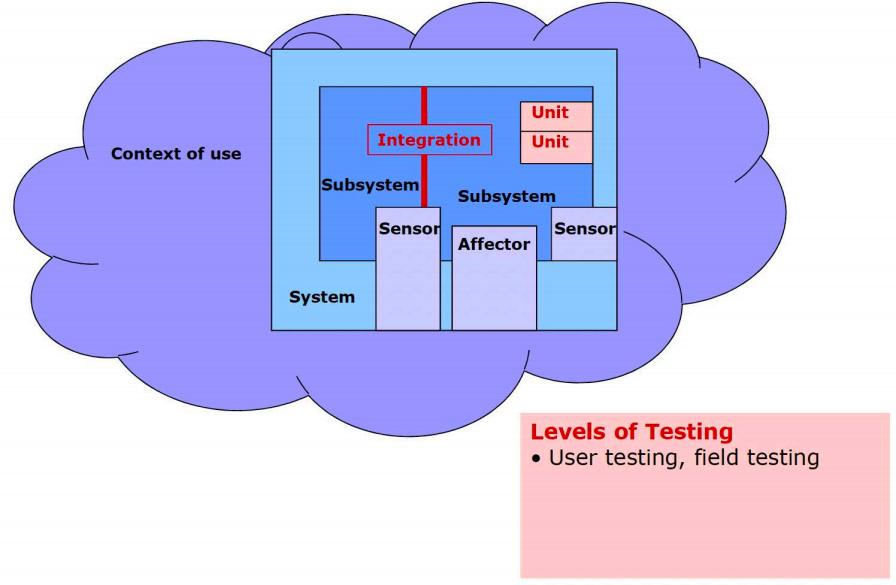

<!-- page: 5 -->

What do we test? - 一 the Focus of Concern

5

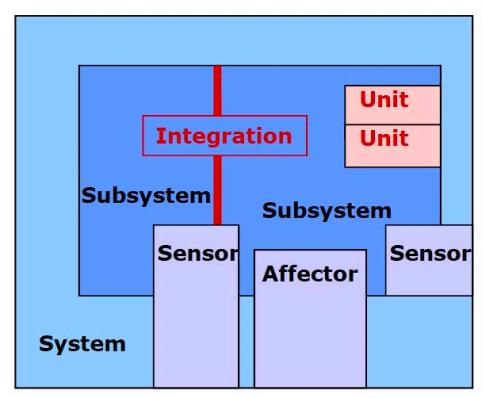

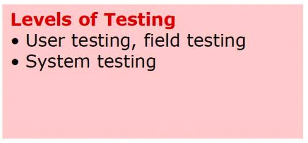

<!-- page: 6 -->

What do we test? - 一 the Focus of Concern

6

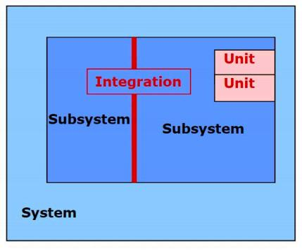

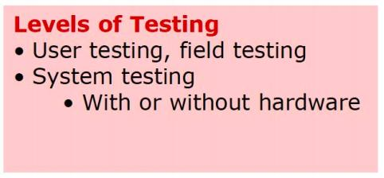

<!-- page: 7 -->

What do we test? - 一 the Focus of Concern

7

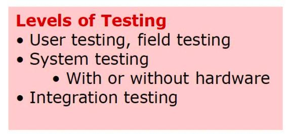

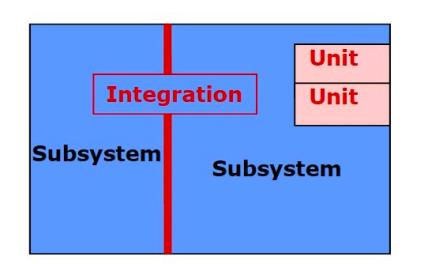

<!-- page: 8 -->

What do we test? - 一 the Focus of Concern

8

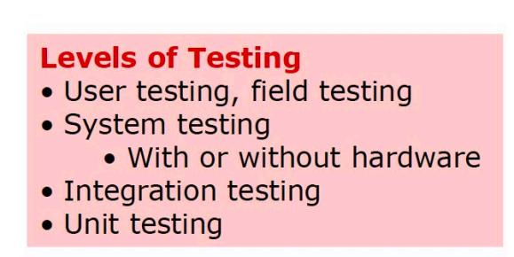

<!-- page: 9 -->

2. Unit Testing

   Unit tests are mainly whitebox tests written by developers, and designed

to verify small units of program functionality.

• Key Metaphor: I.C. Testing
Integrated Circuits are tested individually for functionality before the whole circuit is
tested.

• Definitions
Whitebox – Unit tests are written with full knowledge of implementation details.

Developers – Unit tests are written by you, the developer, concurrently with
implementation.

Small Units – Unit tests should isolate one piece of software at a time.
• Individual methods and classes
Verify – Make sure you built ‘the software right.’ Testing against the contract.
• Contrast this with validation

9

<!-- page: 10 -->

Role of Unit Testing

Helps localize errors

    Failure indicates problem in the unit under test
 Find errors early

    Unit tests are written during development, usually by developer
    More expensive to fix defects found later by another team
 Avoid unnecessary functionality

  Write test first, only write enough code to get it working
Improve code quality code

 Helps developer deliver working code
 Assure minimum quality of units before integration into system

10

<!-- page: 11 -->

Unit Test and Scaffolding

11

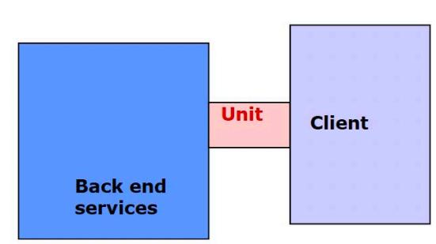

<!-- page: 12 -->

Scaffolding

12

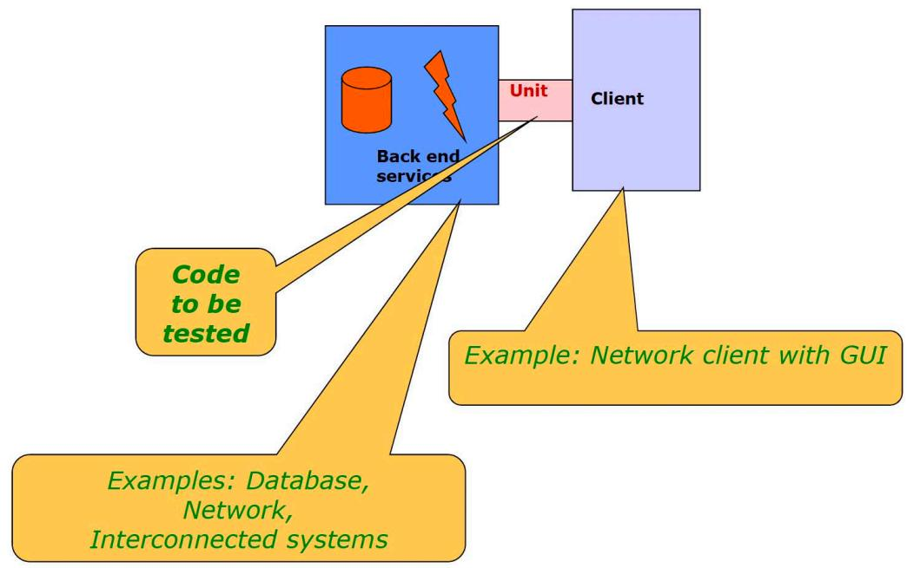

<!-- page: 13 -->

Unit Test and Scaffolding

13

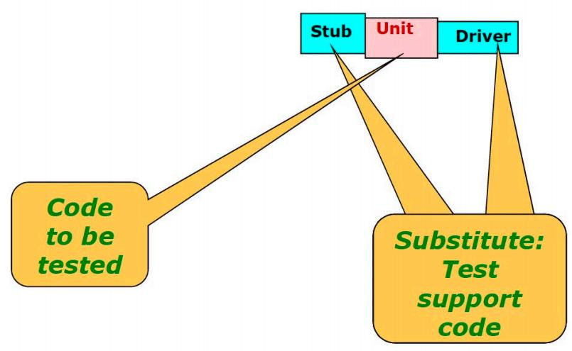

<!-- page: 14 -->

Techniques for Unit Testing : Scaffolding

14

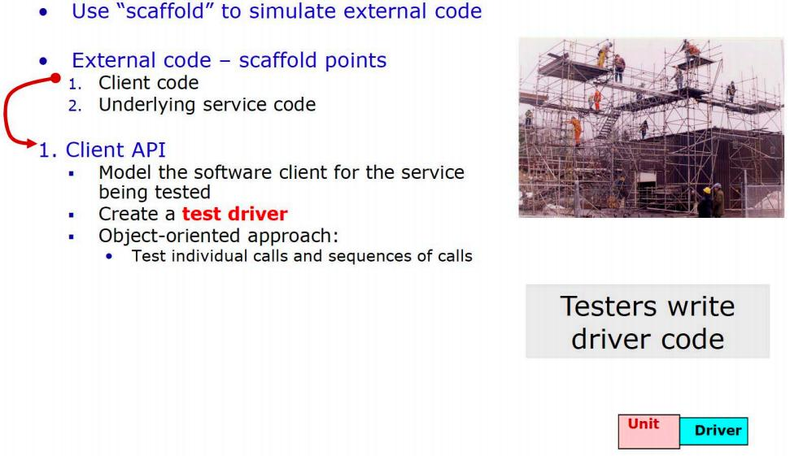

<!-- page: 15 -->

Techniques for Unit Testing : Scaffolding

15

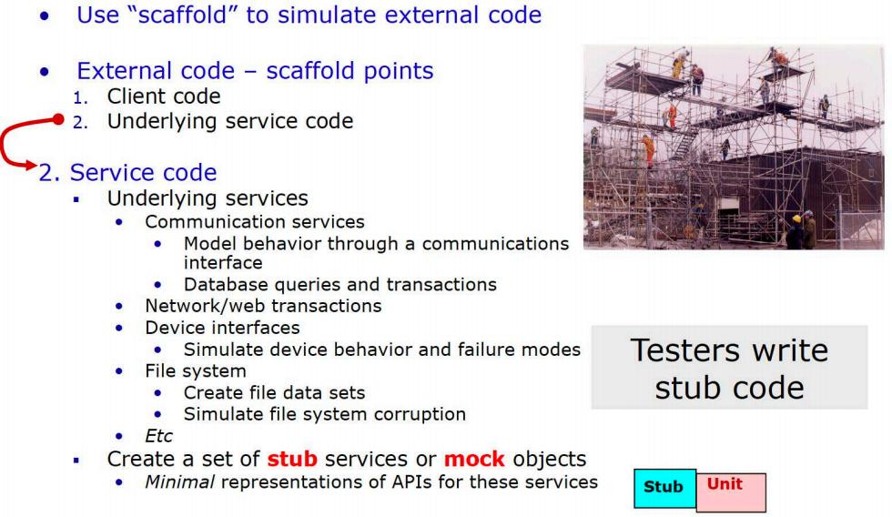

<!-- page: 16 -->

3. Test-Driven Development

Write the tests before the code

    Helps you think about corner cases when writing
    Helps you think about interface design
  Write code only when an automated test fails
  If you find a bug through other means, first write a test that fails, then fix
the bug

  Bug won’t resurface later
 Run tests as often as possible, ideally every time the code is changed

   Having comprehensive unit tests allows you to refactor code with

confidence

   Without unit tests, code is fragile — changes might break clients!

16

<!-- page: 17 -->

TDD - Test-Driven Development

Start

Write a test for

new capability

Refactor as needed

Compile

Run the test                                  Fix compile

errors

And see it pass

Write the code

Run the test
And see it fail

17

<!-- page: 18 -->

Test-Driven Development

An excellent practice promoted by the iterative and agile XP method , also
known as test-first development

Advantages

  The unit tests actually get written
  Programmer satisfaction leading to more consistent test writing
  Clarification of detailed interface and behavior
  Provable, repeatable, automated verification
  The confidence to change things

18

<!-- page: 19 -->

Test-Driven Development

  The most popular unit testing framework is the xUnit family

JUnit for java, NUnit for .NET, and so forth.

  Example: using JUnit and TDD to create the Sale class.
Before programming the Sale class, we write a unit testing method in a SaleTest class that
does the following

   Create a Sale
   Add some line items to it with the makeLineItem method
   Ask for the total and verify that it is the expected value
   Each testing method follows this pattern
   Create the fixture.
   Do something to it (some operation that you want to test).
   Evaluate that the results are as expected.

19

<!-- page: 20 -->

Refactoring

 Continuously refactoring code is another XP practice and applicable to all iterative

methods

   A structured, disciplined method to rewrite or restructure existing code without changing its

external behavior .
   Applying small transformation steps combined with re-executing tests each step.

 The essence of refactoring is applying small behavior preserving transformations

(each called a ‘refactoring’), one at a time .

 After each transformation, the unit tests are re-executed to prove that the refactoring

did not cause a regression （failure).

22

<!-- page: 21 -->

The Activities and Goals of Refactoring

 They are simply the activities and goals of good programming

   Remove duplicate code
   Improve clarity
   Make long methods shorter
   Remove the use of hand-coded literal constants
   And more …

 Some code smells include:

   Duplicated code
   Big method
   Class with many instance variables
   Class with lots of code
   Strikingly similar subclasses
   high coupling between many objects
   And so many other ways bad code is written …

23

<!-- page: 22 -->

Refactorings

Martin Fowler《Refactoring: Improving the Design of Existing Code》

24

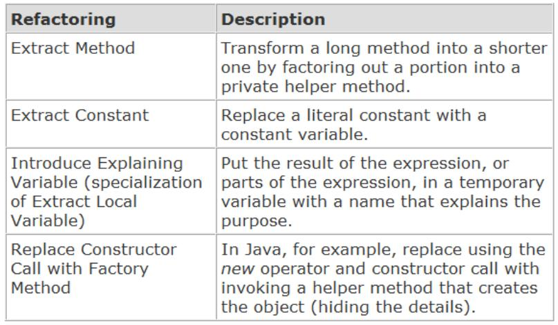

<!-- page: 23 -->

4. Automated Unit Test

Testing Framework are tools that help manage and run your unit tests.
xUnit Framework： JUnit(java),  CppUnit(c++),   NUnit(.Net)

  Help achieve three properties of good unit tests:

• Automatic
Tests should be easy to run and check for correct completion.
  This allows developers to quickly confirm their code is working after a

change.

• Repeatable
Any developer can run the tests and they will work right away.
• Independent
Tests can be run in any order and they will still work.

29

<!-- page: 24 -->

30

<!-- page: 25 -->

31

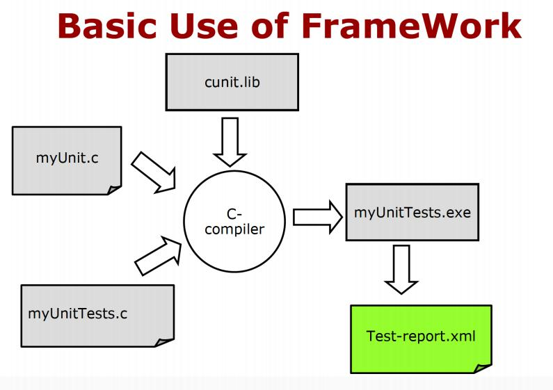

<!-- page: 26 -->

32

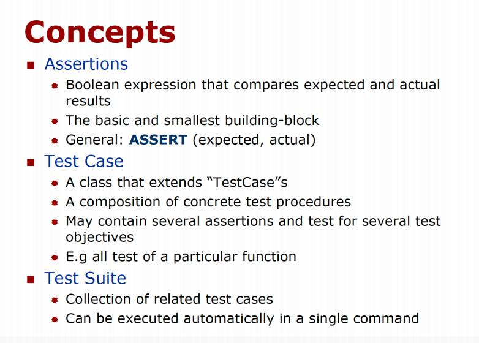

<!-- page: 27 -->

33

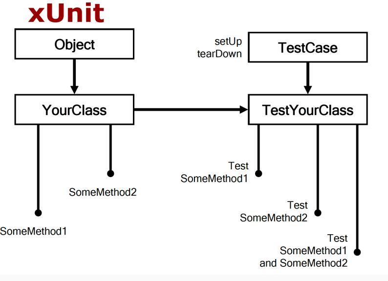

<!-- page: 28 -->

JUnit: A Java Unit Testing Framework

http://www.junit.org/

34

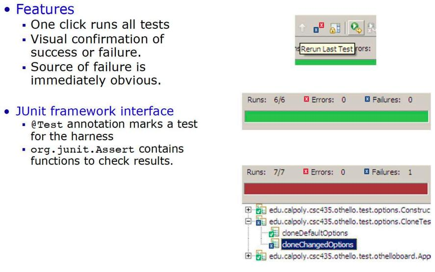
