# Ch9 IntegrationTesting

<!-- page: 1 -->

Integration   Testing

Spring, 2026

1

<!-- page: 2 -->

Contents

 What is Integration Testing

 Approaches to Integration Testing

 Decomposition-based Integration

 Call-Graph based Integration

 MM Path based Integration

2

<!-- page: 3 -->

1. Lifecycle Testing Relationships

3

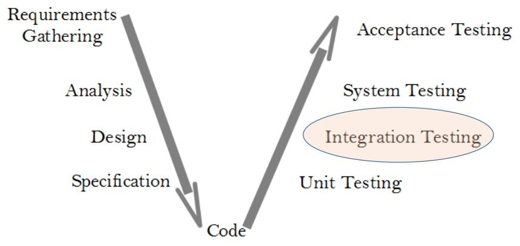

<!-- page: 4 -->

Testing Level Assumptions and Objectives

4

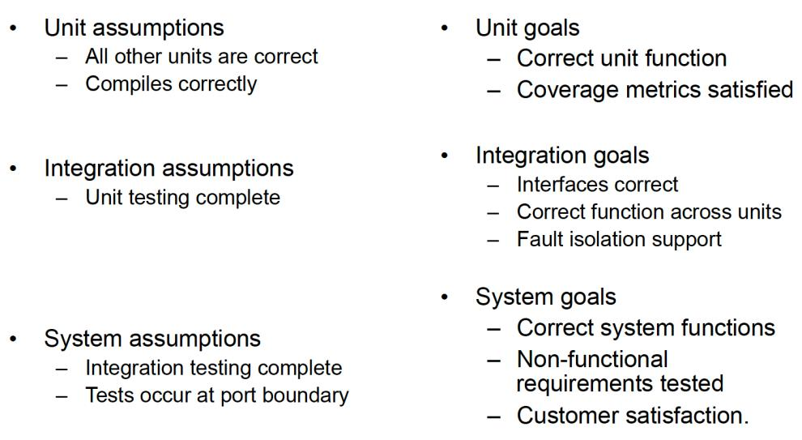

<!-- page: 5 -->

Definitions – Integration Tests

  Integration test data is selected to ensure that the components or

sub-systems of a system are working correctly together.

  Test cases will explore different interactions between the

components, and make sure the correct results are produced.

5

<!-- page: 6 -->

Definitions – System Tests

  System test data is selected to ensure that the system as a whole

is working.

  Test cases will therefore explore the different inputs and

combinations of inputs to the system to ensure that the system
satisfies its specification

6

<!-- page: 7 -->

The Mars Climate Orbiter Mission

  mission failed in September 1999

  completed successful flight: 416,000,000 miles (665.600.600 km)
  41 weeks flight duration
  lost at beginning of Mars orbit

  An integration fault:

     Lockheed Martin used English units for acceleration calculations (pounds),

and Jet Propulsion Laboratory used metric units (newtons).

 NASA announced a US$ 50,000 project to discover how this

happened.

7

<!-- page: 8 -->

Integration Testing – Drivers and Stubs

  Drivers and Stubs are temporary

software components

    A test driver calls the software under test,

passing the test data as inputs.

    In manual testing, where the system

interface has not been completed, a test
driver is used in its place to provide the
interface between the test user and the
software under test.

8

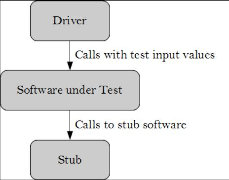

<!-- page: 9 -->

Integration Testing – Drivers and Stubs

  Drivers

    Drivers can have varying levels of sophistication.
    It could be hard-coded to run through a fixed series of input values, read

data from a prepared file, contain a suitable random number generator
etc..

  Stubs

    A stub is a temporary or dummy software that is required by the software

under test to operate properly.
    This is a throw-away version to allow testing to take place.
    It will provide a fixed or limited set of values to be passed to the software

under test.

9

<!-- page: 10 -->

2. Approaches to Integration Testing ( “source” of test cases)

  Decomposition-based Integration

  “Big bang” integration
  Top-down integration
   Bottom-up integration
   Sandwich integration

  Call graph-based Integration

   Pairwise integration
   Neighborhood integration

  Path-based Integration

   MM-Path based Integration

10

<!-- page: 11 -->

2.1 Decomposition-based Integration

    In this strategy, do the decomposition based on the functional characteristics of the system.

    A functional characteristic is defined by what the module does, that is, actions or

activities performed by the module.

Big bang integration

   big-bang groups the whole system and test it in a single test phase.

Top-down integration

   Top-down starts at the root of the tree and slowly work to lower level of the tree

Bottom-up integration

   Bottom-up mirrors top-down, it starts at the lower level implementation of
the system and work towards the main

Sandwich integration

    Sandwich is an approach that combines both top-down and bottom-up.

11

<!-- page: 12 -->

Big bang Integration

  Considers the whole system as a subsystem
  Tests all the modules in a single test session
  Only one integration testing session

No...
— stubs
— drivers
— strategy

  Very difficult fault isolation

12

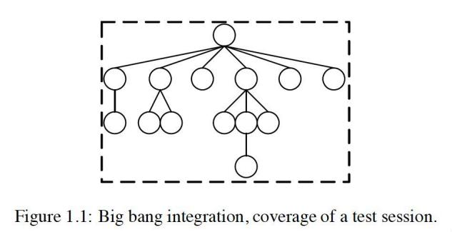

<!-- page: 13 -->

Top-Down Integration

  Breadth-first traversal ofthe functional decomposition tree.

• First step: Check main program logic, with all called units replaced by stubs that always return correct values.
• Move down one level
– replace one stub at a time with actual code.
– any fault must be in the newly integrated unit

 Early SUT prototype

 Throw-away code programming

13

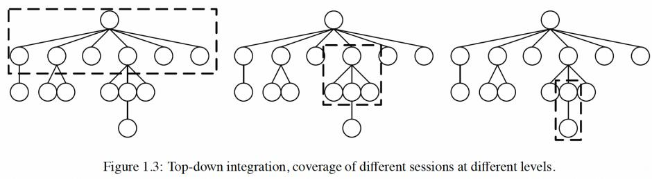

<!-- page: 14 -->

Bottom-Up Integration

  Reverse of top-down integration

   Start at leaves of the functional decomposition tree.
   Driver units...

– call next level unit
– “drive” the unit with inputs
  As with top-down integration, one driver unit at a time is replaced with actual code.
  Any fault is (most likely) in the newly integrated code.

  Less throw-away code programming

  No prototype and Main program tested last

14

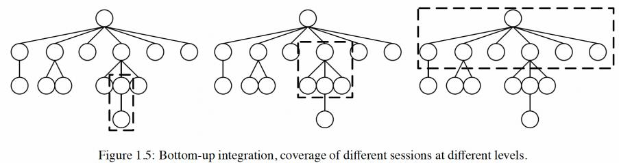

<!-- page: 15 -->

Sandwich integration

  Combines top-down approach and bottom-up approach

    Generally, higher level modules use a top-down approach (stub)
    Normally, lower-level modules use a bottom-up approach (driver)
  Testing converges to the middle
  Number of integration sessions can vary

  Top and bottom layers can be done in parallel
  Less stubs and drivers needed

  Hard to isolate problems

15

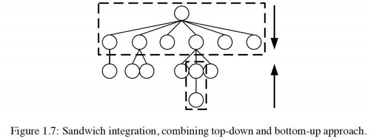

<!-- page: 16 -->

CaseStudy --- The NextDate Program

  This program uses three variables: month, date and year.
  With the input, it returns the next date of the inputted date.

It has the following characteristics:

16

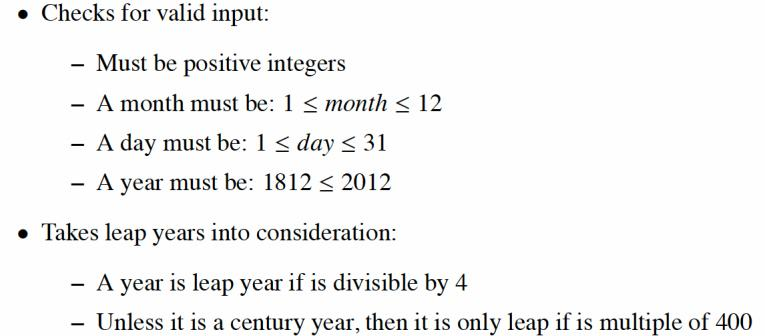

<!-- page: 17 -->

Pseudo-code of the NextDate program implementation- Main()

17

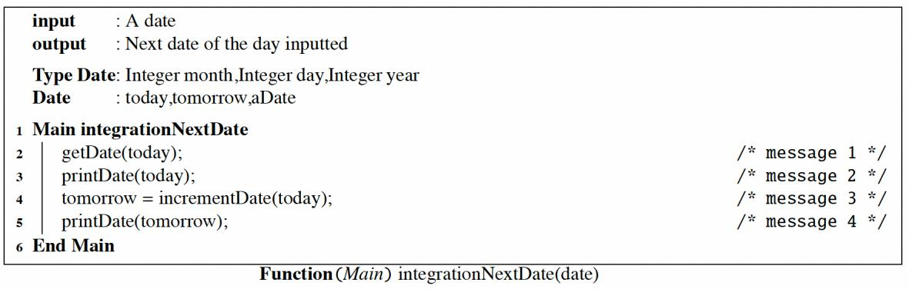

<!-- page: 18 -->

Pseudo-code of the NextDate program implementation – isLeap()

18

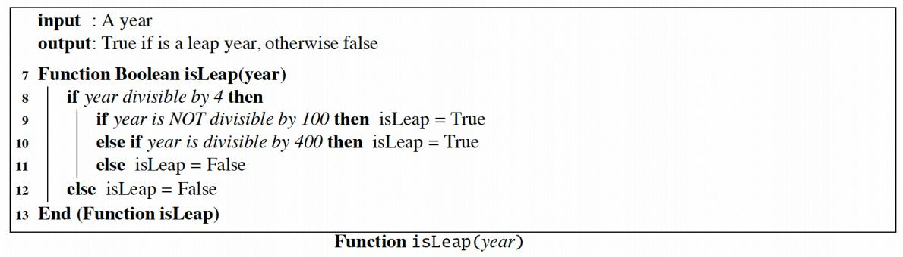

<!-- page: 19 -->

Pseudo-code of the NextDate program implementation – lastDayOfMonth()

19

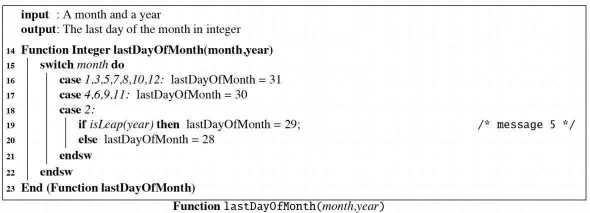

<!-- page: 20 -->

Pseudo-code of the NextDate program implementation – validDate()

20

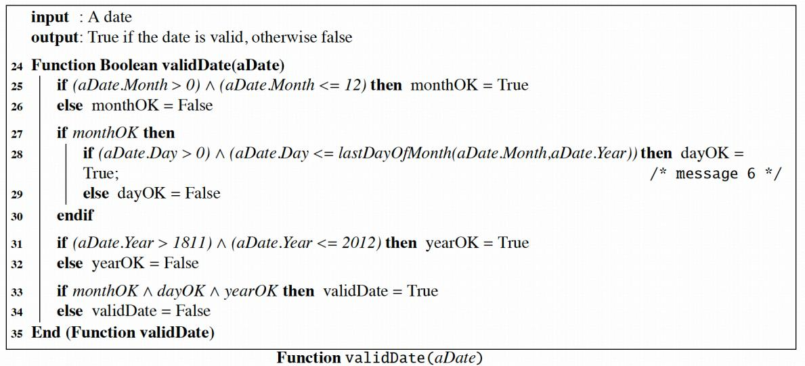

<!-- page: 21 -->

Pseudo-code of the NextDate program implementation –getDate()

21

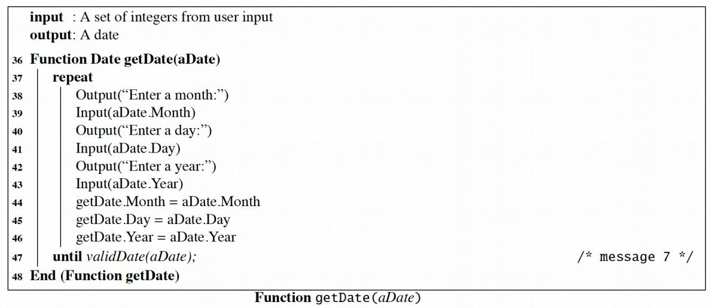

<!-- page: 22 -->

Pseudo-code of the NextDate program implementation – incrementDate()

22

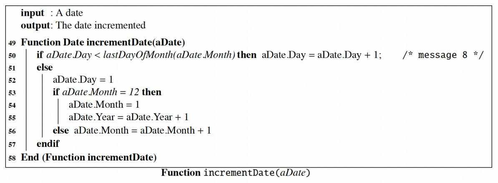

<!-- page: 23 -->

Pseudo-code of the NextDate program implementation – printDate()

23

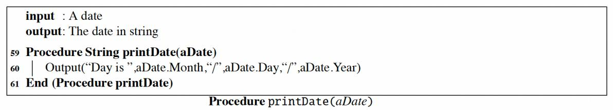

<!-- page: 24 -->

Decomposition-based Integration --- the NextDate program ( Big Bang)

Compile all the modules in the functional decomposition tree and test the whole system in a single session

24

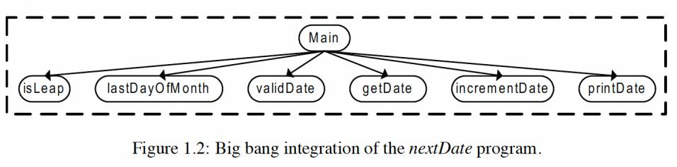

<!-- page: 25 -->

Decomposition-based Integration --- the NextDate program ( Top-down)

  Start with Main as a target node and replace the children nodes one by one with stubs (only one stub in each test session).
 We must build the stub such that it returns correct values to the real module and compatible to the test cases.

A possible stub

for incrementDate:

The test cases will be limited by how
and what we code in the stub

Never called by Main directly

Not be able to isolate them withstubs with a top-down approach

25

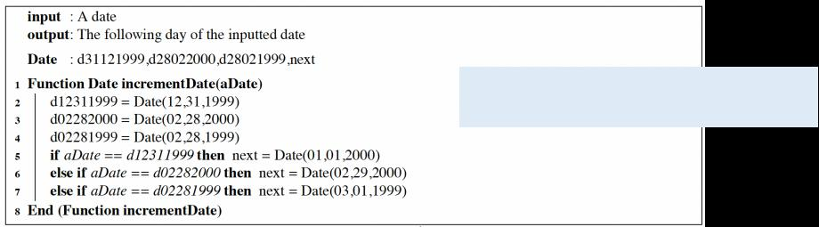

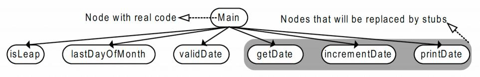

<!-- page: 26 -->

Decomposition-based Integration --- the NextDate program ( Bottom-up)

Begins with the leaves of the decomposition tree,  and use a driver version
of the unit that would normally call it to provide it with test cases.

 No need to substitute as many modules with temporary throw-away modules

A possible driver

for  isLeap:

isLeap_driver()

isLeap_driver)

26

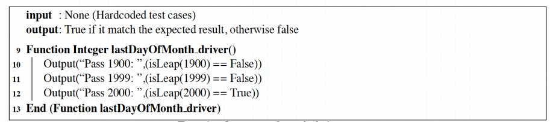

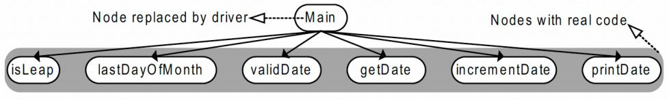

<!-- page: 27 -->

Decomposition-based Integration --- the NextDate program ( Sandwich)

Sandwich integration combines top-down integration and bottom-up integration.

    In top-down by starting at the root of the functional decomposition tree, which

can test the main program at early stage.
   In bottom-up, we will have coverage that is easy to create test cases.

There are no strict guidelines in modules grouping

27

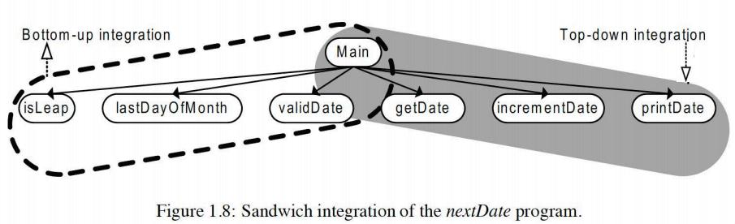

<!-- page: 28 -->

Pros and Cons of Decomposition-Based Integration

 Pros

— intuitively clear
— “build” with proven components
—  fault isolation varies with the number of units being Integrated

 Cons

— some branches in a functional decomposition may not correspond
with actual interfaces.
— stub and driver development can be extensive

28

<!-- page: 29 -->

2.2 Call Graph-based Integration

    Definition: The Call Graph of a program is a directed graph in which

– nodes are unit
– edges correspond to actual program calls (or messages)

    Call Graph Integration avoids the possibility of impossible edges in decomposition-based

integration.
    Can still use the notions of stubs and drivers.
    Can still traverse the Call Graph in a top-down or bottom-up strategy.

Two strategies

– Pair-wise integration
– Neighborhood integration

Degrees of nodes in the Call Graph indicate integration sessions

– test high indegree nodes first, or at least,
– pay special attention to “popular” nodes

29

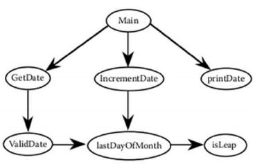

<!-- page: 30 -->

Pair-Wise Integration

    By definition, and edge in the Call Graph refers to an interface between the

units that are the endpoints of the edge.

    Every edge represents a pair of units to test.
    Fault isolation is localized to the pair being Integrated
    The number of integration testing sessions is the number of edges

30

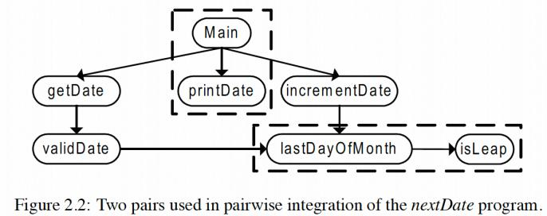

<!-- page: 31 -->

Neighborhood Integration

    The neighborhood (or radius 1) of a node in a graph is the set of nodes that are one

edge away from the given node.

    This can be extended to larger sets by choosing larger values for the radius.
    Stub and driver effort is reduced.

31

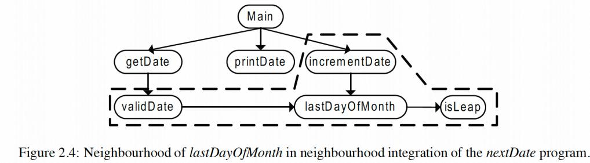

<!-- page: 32 -->

2.3 Path-Based Integration

 Motivation : an integration testing level construct similar to Paths Coverage for unit

testing
– extend the symbiosis of spec-based and code-based testing to the integration level
– greater emphasis on behavioral threads
– shift emphasis from interface testing to interactions (cofunctions) among units

 Need some new definitions

– source and sink nodes in a program graph
– module (unit ) execution path
– generalized message
– MM-Path

32

<!-- page: 33 -->

New and Extended Definitions

  A source node in a program is a statement fragment

at which program execution begins or resumes.

  A sink node in a unit is a statement fragment at

which program execution terminates.

  A module execution path is a sequence of

statements that begins with a source node and ends
with a sink node, with no intervening sink nodes.

  A message is a programming language mechanism

by which one unit transfers control to another unit,
and acquires a response from the other unit.

  Module/Message-Path – an interleaved sequence of

module execution paths and messages.

33

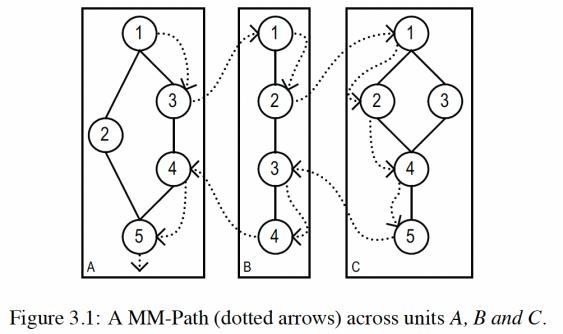

<!-- page: 34 -->

MM-Path Definition and Example

An MM-Path is an interleaved sequence of module execution paths and messages.

An MM-Path
across three units

The node sequence

34

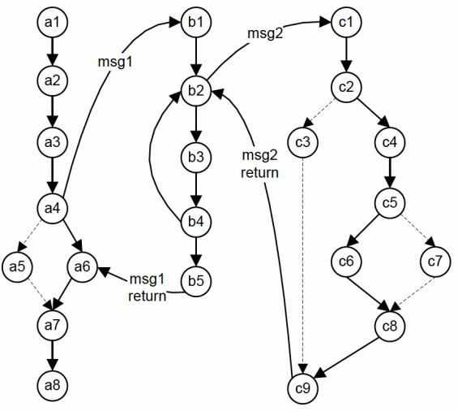

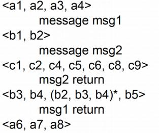

<!-- page: 35 -->

MM-Path based Integration --- the NextDate program

The MM-Paths begin in and return to the main program.

Main problem is knowing how many MM-Paths are required to complete the integration
test. The set of MM-Paths should traverse all source-to-sink paths.

The following fragment represent the first MM-Path for “5/27/2002”

35

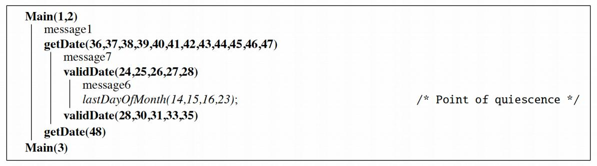

<!-- page: 36 -->

Pros and Cons of Path-Based Integration

 Pros

  Hybrid of functional and structural testing
  Closely coupled with actual system behaviour
  Does not require stub or driver

 Cons

  Extra effort required to identify the MM-Paths

36

<!-- page: 37 -->

Comparison of Integration Testing Strategies

37

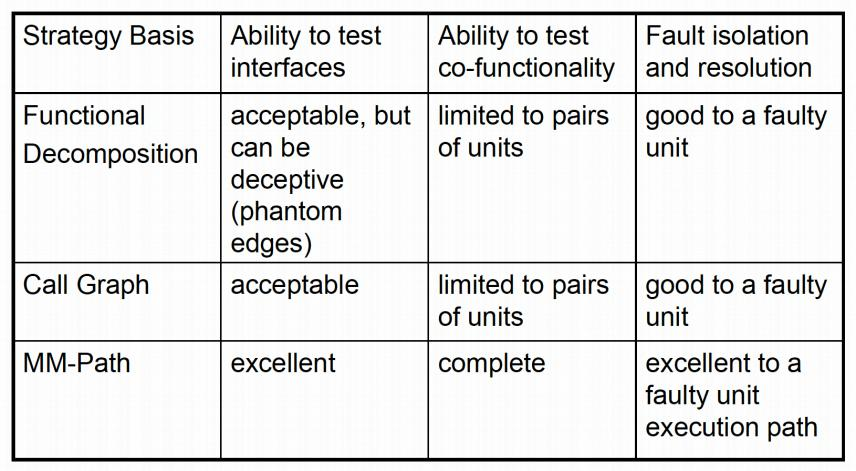
