# 2012软件测试试题（回忆版）

**2012届软件测试试题（回忆版）**
- **名词解释**

<!-- question: software-testing-021-Q1 -->

1. **Software Test**

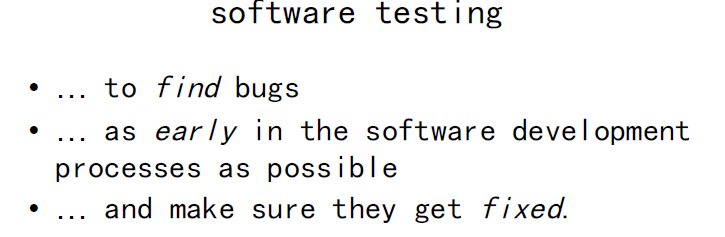

<!-- question: software-testing-021-Q2 -->

1. **Static white-box testing**

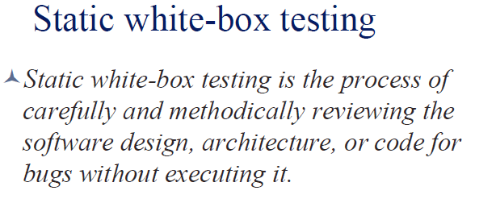

<!-- question: software-testing-021-Q3 -->

1. **TDD(Test-Drivern Development)**

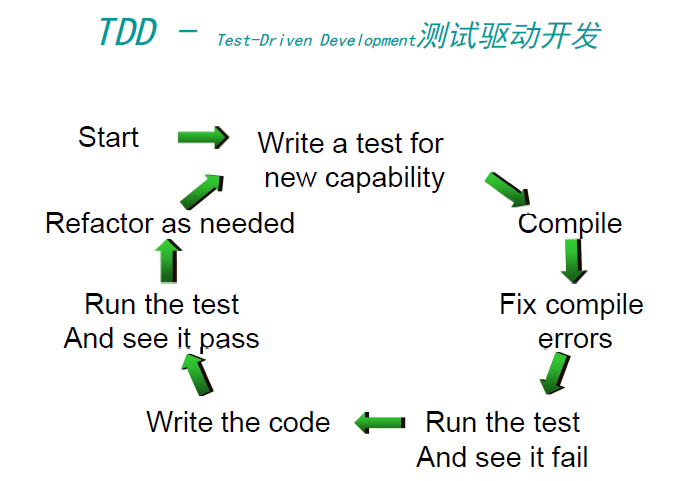

<!-- question: software-testing-021-Q4 -->

1. **H模型**

这个示意图仅仅演示了在整个生产周期中某个层次上的一次测试“微循环”。图中的其他流程可以是任意开发流程。

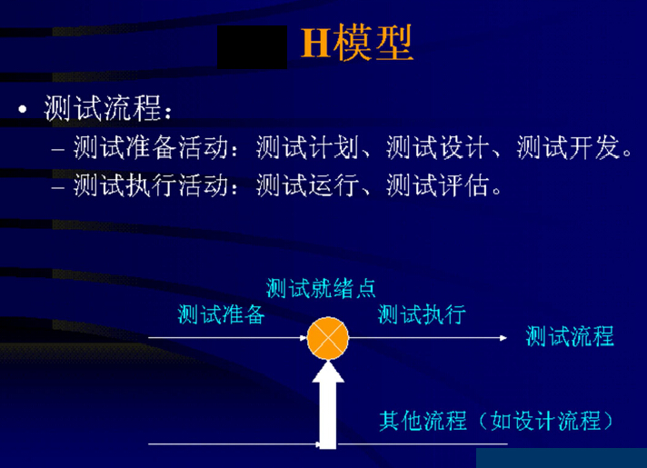
- **简答**

<!-- question: software-testing-021-Q5 -->

1. **画出Junit框架图并简要描述**

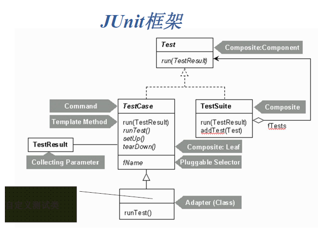

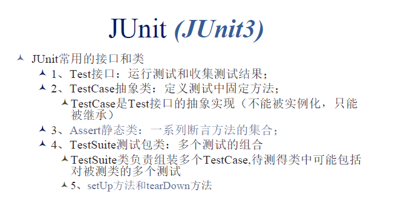

<!-- question: software-testing-021-Q6 -->

1. 软件维护的4类

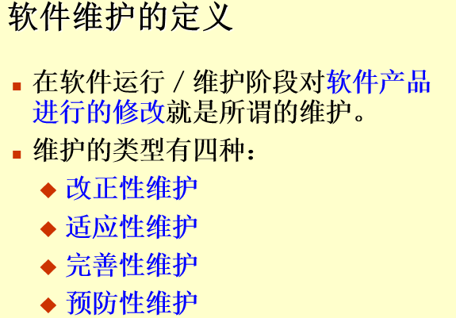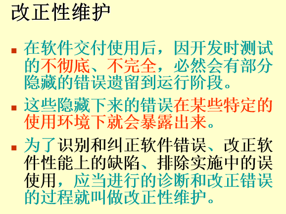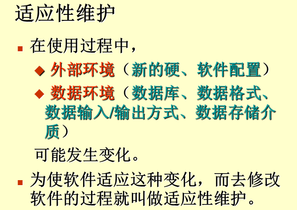

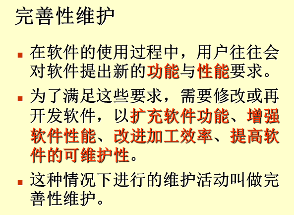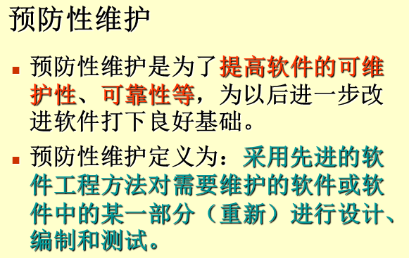

<!-- question: software-testing-021-Q7 -->

1. **Please explain “ Not all bugs found will be fixed”**

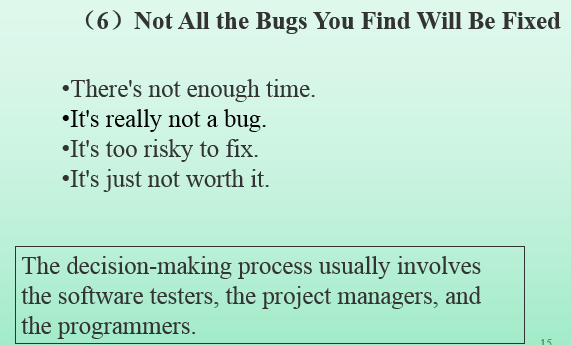
1. **什么是压力测试？请根据LoadRunner描述压力测试的步骤**

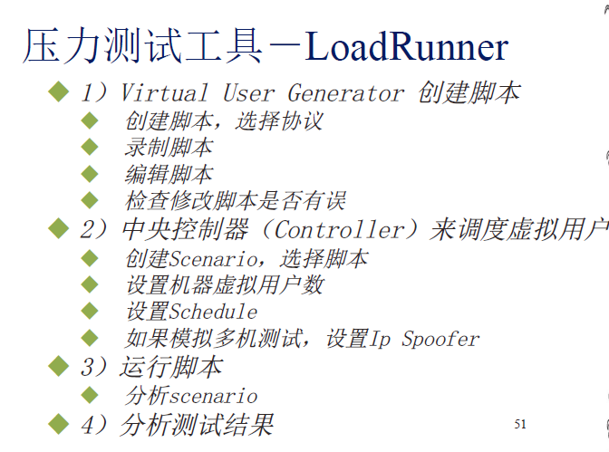
- **应用分析**
1. 根据以下程序（大概是这样吧，每行代码前有数字），画出程序流程图，并使用判定覆盖（decision  coverage）

void Func(int a, int b,int c)

{

if (a>0 and b>1)

{

a=a-b;

if(c>0 and a<0)

c=a+b;

else {

if(c < -2 and )

c=c+1;

else c=b+1;

}

}

}

<!-- question: software-testing-021-Q8 -->

1. 先给出一个注册界面（注册界面包括手机号，姓名，邮箱等）

已知，电话号码由三部分组成
- Area code ,  为空或者0086
- Prefix code，3位数字，第一位数字为1，第二位数字大于等于3
- Post coed，  8位数字

<!-- question: software-testing-021-Q9 -->

1. 根据等价类划分及边界条件写出其测试用例。

<!-- question: software-testing-021-Q10 -->

1. 根据图（即那个注册界面），来确定测试策略来完成该测试。
