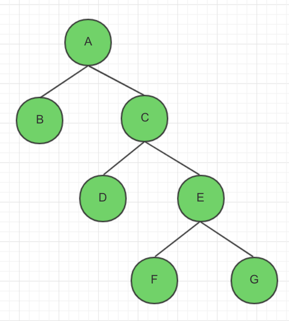

# A卷

<!-- page: 1 -->

… … … … … … … … … … … … … … … … … 密… … … … … … … … … … … … … … … … … … 封… … … … … … … … … … … … … … … 线… … … … … … … … … … … … … …

姓名                学号
  学院                  专业班级                     座位号

诚信应考,考试作弊将带来严重后果！

 华南理工大学期末考试

《软件测试与维护》试卷A

注意事项：1. 开考前请将密封线内各项信息填写清楚；

<!-- question: software-testing-023-Q1 -->

          2. 所有答案请直接答在试卷上；

<!-- question: software-testing-023-Q2 -->

          3．考试形式：闭卷；

<!-- question: software-testing-023-Q3 -->

          4. 本试卷共 （ 四 ）大题，满分100 分，考试时间120 分钟。

题 号
一
二
三
四
总分
得 分

1
Explain the following concept in your own words.( 20 points/5 points each)
1) Alpha testing
2) Stub
3) Static white-box testing

得分

( 密 封 线 内 不 答 题 )

《 软件测试与维护 》试卷第 1 页 共 7 页

<!-- page: 2 -->

4) W model
2
Answer the following question briefly in your own words(25 points)
1) What is software testing? What is the difference between software testing and
debugging?（9 points）
2) Please descricbe the difference between Top-down Integration and Bottom-up
Integration through drawing their model graph？（8 points）

得分

《 软件测试与维护 》试卷第 2 页 共 7 页

<!-- page: 3 -->

3) What is the Stress Testing? Briefly describe the process of Stress Testing through using
Loadrunner testing tool ? （8 points）
3
Please analyse the following questions：（35 points）
1)The following code is written in C language, please answer as required?（18 points）

得分

Int IsLeap(int year)
1 {
2    if (year % 4 = = 0)
3     {
4       if (year % 100 == 0)
5       {
6           if ( year % 400 = = 0)
7                 leap = 1;
8           else
9                leap = 0;
10        }
11     else
12          leap = 1;
13    }
14    else
15        leap = 0;
16    return leap;
17 }

《 软件测试与维护 》试卷第 3 页 共 7 页

<!-- page: 4 -->

① Please draw the program flow chart of the above code？（6 points）

② Please calculating the condition number of the above program flow graph？
（2 points）
six condition number:

condition statement
condition number
year % 4 = = 0
T1
F1
year % 100 = = 0
T2
F2
year % 400 = = 0
T3
F3

③ Assuming that the input range is 1000 < year < 2001, please use the condition
coverage test method to design the testcases to meet the requirements of the condition
coverage？（10 points）

test case id
year
condition number coverage
testcase 1
2000
T1, T2, T3
testcase 2
1001
F1, F2, F3

《 软件测试与维护 》试卷第 4 页 共 7 页

<!-- page: 5 -->

2) A insurance company publishes a insurance solution, the insurance premium
computation formula in this solution is as below:

the insurance premium= the amount insured* the insurance rate。
the premium rate of which is different according to the number of points( the total
points ), the insurance rate above 10 points（>=10 points） is 0.6%, the insurance rate
below 10 points(<10 points) is 0.1%, and the points are determined by the age, sex, and
marriage status,the total points are equal to the sum of the points. .

——the rules of the rate are as follows:

the
number
of
points
20<=age<40 years old
5
40<=age<60
4
Age>=60 or age<20 years old
2
sex
male
5
female
3
marriage

age

unmarried
3
married
4
Please design testcases to calculate the insurance premium through using techniques of
decision table . (17 points)

status

<!-- question: software-testing-023-Q4 -->

1. Build a decision table

1
2
3
4
5
6
7
8
9
10
11
12

20<=age<40
T
T
T
T
F
F
F
F
F
F
F
F

40<=age<60
F
F
F
F
T
T
T
T
F
F
F
F

age

Age>=60 or

age<20
F
F
F
F
F
F
F
F
T
T
T
T

sex
male
T
T
F
F
T
T
F
F
T
T
F
F

marriage
married
T
F
T
F
T
F
T
F
T
F
T
F

points
>=10
√
√
√
√
√
√
√
√
√
√

<10
√
√

<!-- question: software-testing-023-Q5 -->

2. Simplify the decision table

《 软件测试与维护 》试卷第 5 页 共 7 页

<!-- page: 6 -->

1
2
3

20<=age<40
—
F
F

40<=age<60
—
F
F

age

age>=60 or

age<20
F
T
T

sex
male
—
T
F

marriage
married
—
—
—

points
>=10
√
√

<10
√

<!-- question: software-testing-023-Q6 -->

3. Design the testcases
1) age = 30, sex = male, marriage = married     insurance rate: 0.6%
2) age = 15, sex = male, marriage = unmarried   insurance rate: 0.6%
3) age = 62, sex = female, marriage = married    insurance rate: 0.1%
4
Essay question：（20 points）
The company A has undertaken the construction of office automation system for the
company B. At the beginning of October 2014, at the stage of development, the project is
expected to complete all the development work in May 2015, but the contract stipulates
that the system acceptance time is at the end of October 2014. Therefore, in the early
October 2014, the company A submitted a request to the company B for acceptance test at
the end of October 2014, and gave a detailed test plan.
In this plan, the company A point out that the testing team is made up of A's testing
engineers, external testing experts and external experts.

1)  Is the practice of company A correct? Please give a reason.（8 points）
A company's practice is incorrect.
Acceptance testing is performed after functional testing and system testing, so the
prerequisite for acceptance testing is that the system or software product has passed
internal testing. Then check the software with the user and run the software in a real
environment to see if there is a problem that is inconsistent with the user's needs or violates
the requirements of the product specification. Because the tester cannot completely use the
actual situation of the user, whether the software truly meets the requirements of the end
user, the user should perform a series of acceptance tests.
The software development of Company A was not completed and conditions for carrying
out acceptance tests were not available.

《 软件测试与维护 》试卷第 6 页 共 7 页

<!-- page: 7 -->

2) If the software has been delivered in use, the company B requests to add new
functions to meet the new needs. Please answer:（12 points）

① Which stage of software process does this stage belong to？What is the basic
definition of this stage？ （5 points）
This stage belongs to the software maintenance stage.
Software maintenance refers to the modification of code and related documents due to a
software product's problem or need for improvement. The purpose of the software
maintenance is to modify the existing software product while maintaining its integrity.

② Please give a workflow description to meet the new functional requirements？（7
points）

<!-- question: software-testing-023-Q7 -->

1. Users propose changes

<!-- question: software-testing-023-Q8 -->

2. Developer classification and identification

<!-- question: software-testing-023-Q9 -->

3. Software requirements analysis

<!-- question: software-testing-023-Q10 -->

4. Software design

<!-- question: software-testing-023-Q11 -->

5. Software implementation

<!-- question: software-testing-023-Q12 -->

6. System test

<!-- question: software-testing-023-Q13 -->

7. Acceptance test

<!-- question: software-testing-023-Q14 -->

8. Software delivery

《 软件测试与维护 》试卷第 7 页 共 7 页
