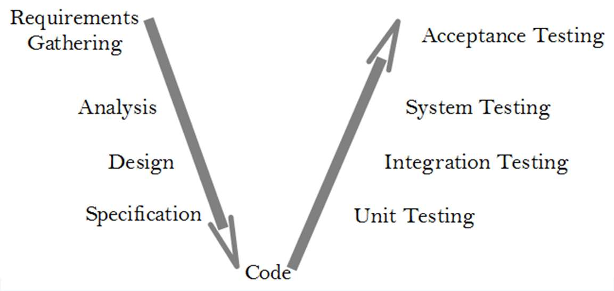
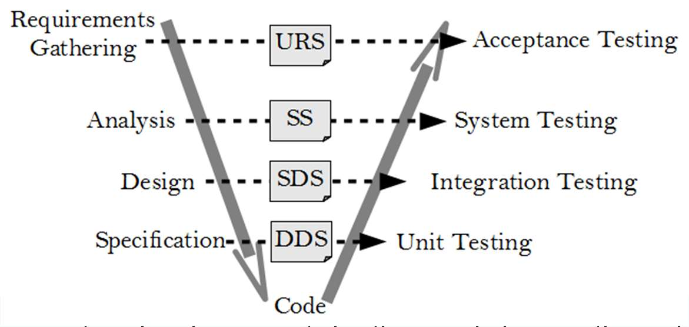
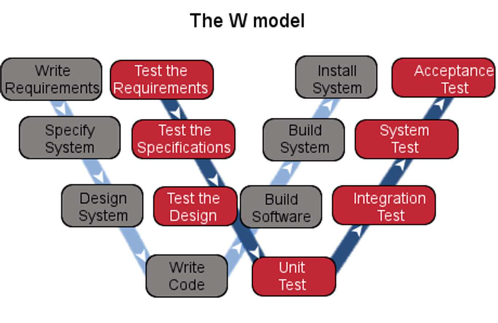
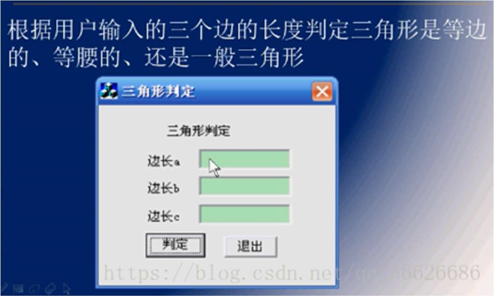

# 软件测试2024小测（样板卷）

<!-- page: 1 -->

<!-- page: 2 -->

1. Please draw the model diagram of V model
and briefly describe the shortcomings of V
model and  how to solve the shortcomings of
V model?

<!-- page: 3 -->

V Model

Extension of the Waterfall model

emphasizes Verification & Validation by marking the relationships

between each phase of the life cycle and testing activities

Once the code implementation is finished the testing begins.

Starts with unit testing, and moves up one test level at a time until the acceptance testing

phase is completed

3

<!-- page: 4 -->

V Model

Each document produced is associated with pairs of phases in the model.

– (a) the User Requirements Specification.    URS

– (b) the System Requirements Specification, SRS

– (c) the System Design Specifications,          SDS

– (d) Detailed Design Specifications,              DDS

4

<!-- page: 5 -->

V Model – Strength& Weakness

Strength
Weakness

It is simple and easy to manage due to the
rigidity of the model

Like the Waterfall model , there is no working
software produced until late during the life cycle

It encourages Verification and Validation at all
phases

It is unsuitable where the requirements are at a
moderate to high risk of changing.

Each phase has specific deliverables and a
review process.

It has been suggested too that it is a poor model
for long, complex and object-oriented projects

It gives equal weight to testing alongside
development rather than treating it as an
afterthought at the end.

5

<!-- page: 6 -->

4. W Model

Extension of V Model/Both

V

Testing is not after the code

implementation .

Parallel to the development

process, the test process  is
carried  out.

Co-operation between

development and testing

Testing is more than just

construction, execution and
evaluation of test cases.

6

<!-- page: 7 -->

1. Please design testcases based on the decision table method for the following right
triangle problem with side a,b,c. (40 scores)

Side a, b, and c should be  positive integers ranging from 1 to 100;
If any side is less than 1 or greater than 100, the output is “invalid input”;
If the sum of any two sides is less than or equal to the third side, the output is “non-
triangular”;
If the sum of the squares of any two sides is equal to the square of the third side, the
output is “a right triangle”; else the output is "general triangle";

1) Please draw the decision table.
2) Please list the testcases.

<!-- page: 8 -->

•
直角三角形的例子用判定表法进行测试用例的设计；

是否为直角三角形

假设三边边长a、b和c均为1到100之间的正整数，直角三角形判定需满足；
当三边中任意两边边长之和小于等于第三边，则输出“非三角形”
当其中两边边长的平方和等于第三边的平方，则输出“直角三角形”
当任意两边边长的平方和都不等于第三边的平方，则输出“一般三角形”
当三边中任意一边边长小于1或者大于100，则给出“输入无效”的提示信息

<!-- page: 9 -->

编号
原因
编号
结果
c1
1<=a
e1
输入无效
c2
a<=100
e2
非三角形
c3
1<=b
e3
一般三角形
c4
b<=100
e4
直角三角形
c5
1<=c
c6
c<=100
c7
a+b>c
c8
a+c>b
c9
b+c>a
c10
a2 +b2 =c2

c11
a2 +c2 =b2

c12
b2 +c2 =a2

<!-- page: 10 -->

1
2
3
4
5
6
7
8
9
10
11
12
13
14
15
16
17
条
件
桩

c1
F
T
T
T
T
T
T
T
T
T
T
T
c2
F
T
T
T
T
T
T
T
T
T
T
T
c3
F
T
T
T
T
T
T
T
T
T
T
T
c4
F
T
T
T
T
T
T
T
T
T
T
T
c5
F
T
T
T
T
T
T
T
T
T
T
T
c6
F
T
T
T
T
T
T
T
T
T
T
T
c7
F
T
T
T
T
T
T
T
T
T
T
c8
F
T
T
T
T
T
T
T
T
T
c9
F
T
T
T
T
T
T
T
T
c10
F
F
F
T
T
T
F
T

c11
F
F
T
F
T
F
T
T

c12
F
T
F
F
F
T
T
T

e1
✗
✗
✗
✗
✗
✗
e2
✗
✗
✗
e3
✗
e4
✗
✗
✗

动
作
桩

<!-- page: 11 -->

Rule
a
b
c
Expected

Output
1
-1
50
50
invalid input

2
101
50
50
invalid input

3
50
-1
50
invalid input

4
50
101
50
invalid input

5
50
50
-1
invalid input

6
50
50
101
invalid input

7
50
1
60
non-triangular

8
50
60
1
non-triangular

9
60
50
1
non-triangular

10
40
50
60
general triangle

11
30
40
50
right triangle

12
30
50
40
right triangle
13
50
30
40
right triangle

<!-- page: 12 -->

2.
Please complete the testcases
design using the following
white-box testing techniques.
(50 scores)
1) Please draw the control flow
chart.
2) Please list all the decisions
and their conditions branches.
3) Please use the condition
combination testing method to
design testcases.
4) Please use the path coverage
method to design testcases.
5) Please use the basis path
testing method to design
testcases.

1      public static void showC() {
2
int a, b, c ;
3
if (a > 0 & b > 0)
4
{
5
if (c > 0) {
6
c = a + b;
7
}
8
else
9
c = c + 1;
10
}
11
else
12
c = c + 2;
13
System.out.println(c);
14
}

<!-- page: 13 -->

Program flow graph
Control flow graph

Start

a

int a, b, c

c

b

T

a>0 and b>0

c>0

e
d

T
F
F

c=c+1
c=c+2

c=a+b

f

System.out.println(c);

g

end

<!-- page: 14 -->

答案

• 判定2个:
• a>0 and b>0
• c>0

• 条件分支,6个:
• a>0 ,X1;
• a<=0 ,-X1;
• b>0, X2;
• b<=0,-X2;
• c>0,X3;
• c<=0,-X3

• 判定分支4个:
• a>0 and b>0,M;
• a<=0 or b<=0,-M
• c>0,N;
• c<=0,-N

<!-- page: 15 -->

1. 判定－条件覆盖法:
要覆盖所有的判定分支与条件分支
覆盖判定:3个用例,检查未覆盖的条件,补充

Start

• a>0 ,X1;
• a<=0 ,-X1;
•
b>0, X2;
• b<=0,-X2;
• c>0,X3;
• c<=0,-X3

a>0 and b>0,M;
a<=0 or b<=0,-M
c>0,N;
c<=0,-N

int a, b, c

a>0 and b>0

c>0

T

T
F
F

c=c+1
c=c+2

c=a+b

System.out.println(c);

end

a, b, c
执行路径
覆盖条件
覆盖判定
预期
结果

测试
用例

1
-1,-1,1
1-2-3-7-8
-X1, -X2
-M
c=3

2
1,1,-1
1-2-3-4-6-8
X1, X2, -X3
M,-N
c=0

3
1,1,1
1-2-3-4-5-8
X1, X2, X3
M,N
c=2

<!-- page: 16 -->

2. 条件组合覆盖

1.
a>0, b>0   TT

2.
a>0, b<=0  TF

3.
a<=0, b>0   FT

4.
a<=0, b<=0 FF
5. c>0            T
6. c<=0          F

<!-- page: 17 -->

2. 条件组合覆盖法:
要覆盖每个判定的所有条件组合

Start

1.
a>0, b>0   TT

int a, b, c

2.
a>0, b<=0  TF

a>0 and b>0

c>0

T

3.
a<=0, b>0   FT

T
F
F

4.
a<=0, b<=0 FF
5.
c>0            T
6.
c<=0          F

c=c+1
c=c+2

c=a+b

System.out.println(c);

end

a, b, c
执行路径
覆盖的条件组合
预期结果

测试
用例

1
1,1,1
1-2-3-4-5-8
1,5
c=2

2
1,-1,-1
1-2-3-7-8
2
c=1

3
-1,1,1
1-2-3-7-8
3
c=3

4
-1,-1,-1
1-2-3-7-8
4
c=1

5
1,1,-1
1-2-3-4-6-8
1,6
c=0

<!-- page: 18 -->

2. 条件组合覆盖法:
要覆盖每个判定的所有条件组合

Start

1.
a>0, b>0   TT

int a, b, c

2.
a>0, b<=0  TF

a>0 and b>0

c>0

T

3.
a<=0, b>0   FT

T
F
F

4.
a<=0, b<=0 FF
5.
c>0            T
6.
c<=0          F

c=c+1
c=c+2

c=a+b

System.out.println(c);

end

a, b, c
执行路径
覆盖的条件组合
预期结果

测试
用例

1
1,1,1
1-2-3-4-5-8
1,5
c=2

2
1,-1,-1
1-2-3-7-8
2
c=1

3
-1,1,1
1-2-3-7-8
3
c=3

4
-1,-1,-1
1-2-3-7-8
4
c=1

5
1,1,-1
1-2-3-4-6-8
1,6
c=0

<!-- page: 19 -->

3. 路径覆盖法

a

• a.(b+c.(d+e).f).g
• =abg+acdfg+acefg

c

b

e
d

f

g

a, b, c
执行路径
预期结
果

测试
用例

1
1,1,1
acefg
c=2

2
1,1,-1
acdfg
c=0

3
-1,1,1
abg
c=3

对比一下几种覆盖的效果：未必覆盖条件组合，条件

<!-- page: 20 -->

4. 基本路径覆盖法

a

• 基本路径数：

•
3个区域
•
2个判定+1
•
8-7+2=3
• 基本路径集：
• abg/acdfg/acefg

c

b

e
d

f

g

a, b, c
执行路径
预期结
果

测试
用例

1
1,1,1
acefg
c=2

2
1,1,-1
acdfg
c=1

3
-1,1,1
abg
c=3
