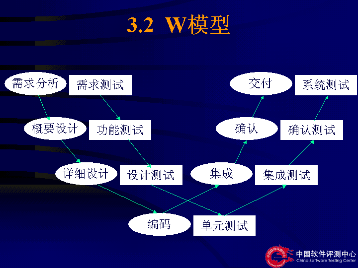

# 软件测试与维护（试卷A）-答案

**诚信应考,考试作弊将带来严重后果！**

**华南理工大学期末考试**

**《软件测试与维护》试卷A**

**注意事项：1.** **考前请将密封线内填写清楚；**

**2.** **前2题答案请直接答在试卷上，第3题答案请答在答题纸上**

**3．考试形式：闭卷；**

**4.** **本试卷共  三  大题，满分100分，**	**考试时间120分钟**。

| **题 号** | **一** | **二** | **三** | **总分** |
|---|---|---|---|---|
| **得 分** |  |  |  |  |
| **评卷人** |  |  |  |  |

- **Explain the** **following** **concepts in your own words.( 20 points/5 points each)**

<!-- question: software-testing-027-Q1 -->

1. W  model

<!-- question: software-testing-027-Q2 -->

1. Software  Testing
- to  *find*  bugs
- … as  *early*  in the software development processes as possible
- … and make sure they get  *fixed*

<!-- question: software-testing-027-Q3 -->

1. Static white-box testing

*Static white-box testing is the process of carefully and methodically reviewing the software design, architecture, or code for bugs without executing it.*

*走查* *（**Walk Through**）**,**审查* *（**Inspection**）**,* *评审* *（**Review**）*

<!-- question: software-testing-027-Q4 -->

1. Test-Driven Development

TDD测试驱动开发的基本思想就是在开发功能代码之前，先编写测试代码。也就是说在明确要开发某个功能后，首先思考如何对这个功能进行测试，并完成测试代码的编写，然后编写相关的代码满足这些测试用例。然后循环进行添加其他功能，直到完全部功能的开发
- **Answer the** **following** **questions briefly** **in your own words(32 points)**
  - Briefly describe  JUnit  framework through drawing its structure graph?  （**6** **points**）

  - Briefly describe  the bug management process？（**6 points**）
  - What the software  maintenance  and the process of Software Configuration Management.  （**8 points**）

软件维护是指软件系统交付使用以后，为了改正错误或满足新的需要而修改软件的过程。4种类型：改正性维护、适应性维护、完善性维护、预防性维护

配置管理计划、配置库管理、变更管理、版本管理、配置审计
  - How to understand the relationship between specification and bugs?  （**5 points**）

The software does not do something that the specification says it should do.

The software does something that the specification says it should not do.

The software does something that the specification does not mention.

The software does not do something that the product specification does not mention but should.

The software is difficult to understand, hard to use, slow  …
  - Please descricbe  the difference between  Top-down Integration and Bottom-up Integration  through drawing their model graph？  （**7 points**）
- Top-down
  - Start with top-level modules
  - Use stubs for lower-level modules
  - As each level is completed, replace stubs with next level of modules
- Bottom-up
  - Start with bottom-level modules
  - Use drivers for upper-level modules
  - As each level is completed, replace drivers with next level of modules

|  | **自底向上** | **自顶向下** |
|---|---|---|
| **集成** | **早** | **早** |
| **基本程序能工作时间** | **晚** | **早** |
| **需要驱动程序** | **是** | **否** |
| **需要桩程序** | **否** | **是** |
| **计划与控制** | **容易** | **难** |

绘图，优缺点对比
- **Please** **analyse** **the following questions：（48 points）**
1. Please describe how to finish  Unit Testing? Please draw the program process graph and control flow graph for the following program,and design testcases  through using the  condition combination coverage?**（23 points =6 points +17 points）**

void Func(int a, int b,int c)

{

if (a>0 and b>1)

{

a=a-b;

if(c>0 and a<0)  c=a+b;

else   c=c+1;

}

else c=b+1;

}

Answer :
    - 模块接口测试
    - 模块局部数据结构测试
    - 模块边界条件测试
    - 模块独立执行通路测试
    - 模块的各条错误处理通路测试

静态检查+动态测试，白盒为主，黑盒为辅（6 points）

条件组合(最小用例集7个): a>0 , b>1; a>0 ,b<=1; a<=0 , b>1; a<=0 and b<=1

c>0 ,a<0; c>0 ,a>=0; c<=0 , a<0; c<=0 , a>=0;

**程序流程图4分、控制流图3分、条件组合7分，用例3分**

<!-- question: software-testing-027-Q5 -->

1. **(25 points=15points+10points)**

<!-- question: software-testing-027-Q6 -->

  1. The mobile number area consists of three parts,includes:

a. area  code,  blank or 0086;

b. prefix  code,three numeric characters  and the  first numeric character  is  ‘1’and the second numeric character  is  greater than or equal to  3;

c. postfix,eight numeric characters;

The software system  accept a correct mobile number input and refuses a wrong mobile number input.Please design testcases to check the mobile number area through using techniques of  Equivalence Partitioning and Boundary value. **(15 points)**

| 输入等价类 | 有效等价类 | 无效等价类 |
|---|---|---|
| 地区码 | 1.地区码0086 2.地区码空白 | 5.地区码不等于0086 and不为空白 |
| 3位前缀 | 3.前缀第一位为1 and第二位>=3 | 6.前缀有**非**数字字符 7.前缀位数不为3位 8.3位前缀第一位不为1 9.3位前缀第二位<3 |
| 8位后缀 | 4.后9位数字字符（000000000-999999999） | 10.后缀有非数字字符 11.后缀位数不为9位 |

设计测试用例，以便覆盖所有的有效等价类，设计的测试用例如下：

测试数据         期望结果      覆盖的等价类

（略）

边界值：
- 地区码，  blank，0086,
- 前缀，130，139
- 后缀，00000000，99999999

有效等价类4分、无效等价类4分、二者的测试用例2、边界值及其测试用例5分
  1. According the graph, please give us the Testing Strategy  to finish  the Testing?（**10 points**）

组建测试队伍、时间安排、压力测试,功能测试
