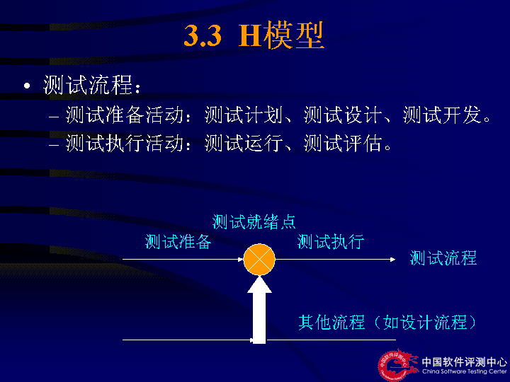
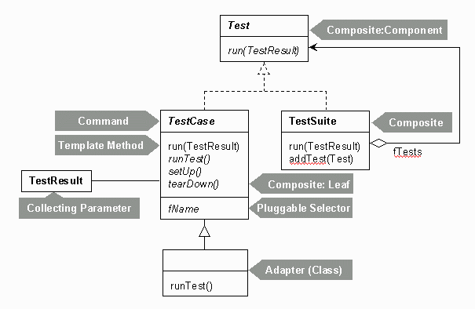

# 软件测试与维护（试卷B）-答案

**诚信应考,考试作弊将带来严重后果！**

**华南理工大学期末考试**

**《软件测试与维护》试卷B**

**注意事项：1.** **考前请将密封线内填写清楚；**

**2.** **前2题答案请直接答在试卷上，第3题答案请答在答题纸上**

**3．考试形式：闭卷；**

**4.** **本试卷共  三  大题，满分100分，**	**考试时间120分钟**。

| **题 号** | **一** | **二** | **三** | **总分** |
|---|---|---|---|---|
| **得 分** |  |  |  |  |
| **评卷人** |  |  |  |  |

- **Explain the** **following** **concepts in your own words.( 24 points/6 points each)**

<!-- question: software-testing-028-Q1 -->

1. H  model

<!-- question: software-testing-028-Q2 -->

1. driver

用以模拟被测模块的上级模块。驱动模块在集成测试中接受测试数据，把相关的数据传送给被测模块，启动被测模块，并打印出相应的结果。

<!-- question: software-testing-028-Q3 -->

1. Acceptance Testing

*在软件产品完成了功能测试和系统测试之后、产品发布之前所进行的软件测试活动它是技术测试的最后一个阶段**,**也称为交付测试。*

<!-- question: software-testing-028-Q4 -->

1. Version  Control

版本控制就是管理在整个软件生存周期中建立起来的某一配置项的不同版本。

在软件工程过程中所涉及的软件对象都要加以标识。在对象成为基线以前可能要做多次变更，在成为基线之后也可能需要频繁地变更。这样对于每一配置对象可以建立一个演变图，以方便记叙这个对象的变更历史
- **Answer the** **following** **questions briefly** **in your own words(36 points)**
  - Briefly describe  JUnit  framework through drawing its structure graph?  （**7** **points**）

  - Please descricbe  the Categories of  software  maintenance.  （**7 points**）

--Corrective maintenance: Reactive modification of a software product performed after delivery to correct discovered problems.

--Adaptive maintenance: Modification of a software product performed after delivery to keep a software product usable in a changed or changing environment.

--Perfective maintenance: Modification of a software product after delivery to improve performance or maintainability.

--Preventive maintenance: Modification of a software product after delivery to detect and correct latent faults in the software product before they become effective faults.
  - How to understand the relationship between specification and bugs?  （**7 points**）

The software does not do something that the specification says it should do.

The software does something that the specification says it should not do.

The software does something that the specification does not mention.

The software does not do something that the product specification does not mention but should.

The software is difficult to understand, hard to use, slow  …
  - What is the relation between Software Testing and SQA? ( **7 points**)
- SQA 是管理工作、审查对象是流程、强调以预防为主
- 测试是技术实施工作、测试对象是产品、主要是以事后检查（文档、程序）为主
- SQA指导测试、监控测试
- 测试为SQA提供依据
- 测试是SQA的一个环节、一个手段
  - How to build the Testing team?  （**8 points**）

测试经理、环境管理人员、 测试组长,  测试设计人员，初级测试工程师，发布工程师、配置管理员
- **Please** **analyse** **the following questions：（40 points）**
1. Please describe how to finish  Unit Testing? Please draw the program process graph and control flow graph for the following program,and design testcases through using the techniques of decision coverage  and  condition coverage  ?**（25 points =6 points +19 points）**

void Func(int a, int b,int c)

{

if (a>0 and b>1)

{

a=a-b;

if(c>0 and a<0)  c=a+b;

else   c=c+1;

}

else c=b+1;

}

Answer :
    - 模块接口测试
    - 模块局部数据结构测试
    - 模块边界条件测试
    - 模块独立执行通路测试
    - 模块的各条错误处理通路测试

静态检查+动态测试，白盒为主，黑盒为辅（6 points）

判定（最小用例集3个用例）：a>0 and b>1, a<=0 or b<=1; c>0 and a<0, c<=0 or a>=0

条件（最小用例集3个）：a>0,a<=0;b>1,b<=1;c>0,c<=0,a<0,a>=0;

**程序流程图4分、控制流图3分、判定条件9分，用例3分**

The mobile number area consists of three parts,includes:

a. area  code,  blank or 0086;

b. prefix  code,three numeric characters  and the  first numeric character  is  ‘1’and the second numeric character  is  greater than or equal to  3;

c. postfix,eight numeric characters;

The software  system    accept  a correct  mobile number input and refuses  a  wrong mobile number input.Please  design testcases to  check the  mobile number area through using techniques of    Equivalence  Partitioning and Boundary  value. **(15 points)**

<table>
<tr><td>输入等价类</td><td>有效等价类</td><td>无效等价类</td></tr>
<tr><td>地区码</td><td>1.地区码0086 and 前缀3位数字字符且第一位为1 and第二位>=3 and    后9位数字字符（000000000-999999999） 2.  地区码空白and 前缀3位数字字符且第一位为1 and第二位>=3 and    后9位数字字符（000000000-999999999）</td><td>3.地区码不等于0086 and不为空白</td></tr>
<tr><td>3位前缀</td><td></td><td>4.前缀有非数字字符 5.前缀位数不为3位 6．3位前缀第一位不为1 7. 3位前缀第二位<3</td></tr>
<tr><td>8位后缀</td><td></td><td>8.后缀有非数字字符 9.后缀位数不为9位</td></tr>
</table>

设计测试用例，以便覆盖所有的有效等价类，设计的测试用例如下：
- 边界值：
- 地区码，  blank，0086,
- 前缀，130，139
- 后缀，00000000，99999999

有效等价类4分、无效等价类4分、二者的测试用例2、边界值及其测试用例5分
