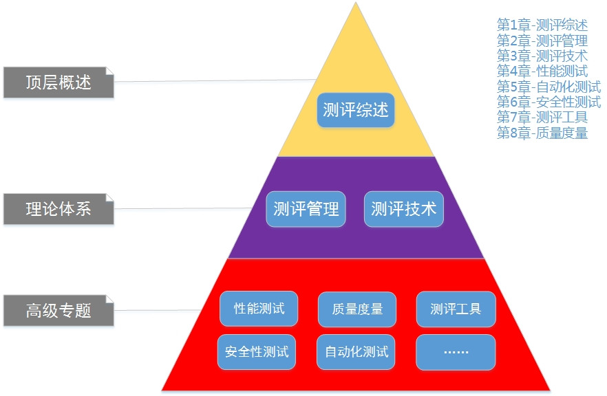
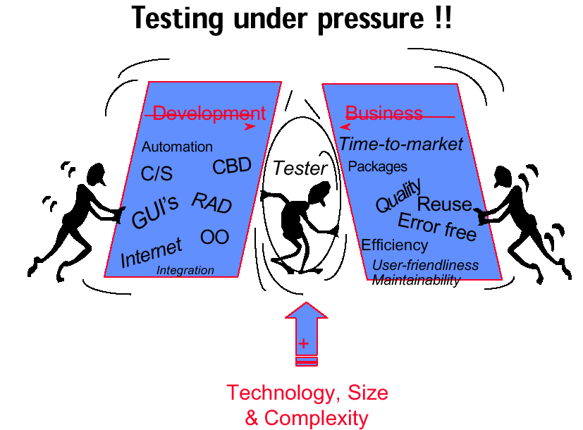
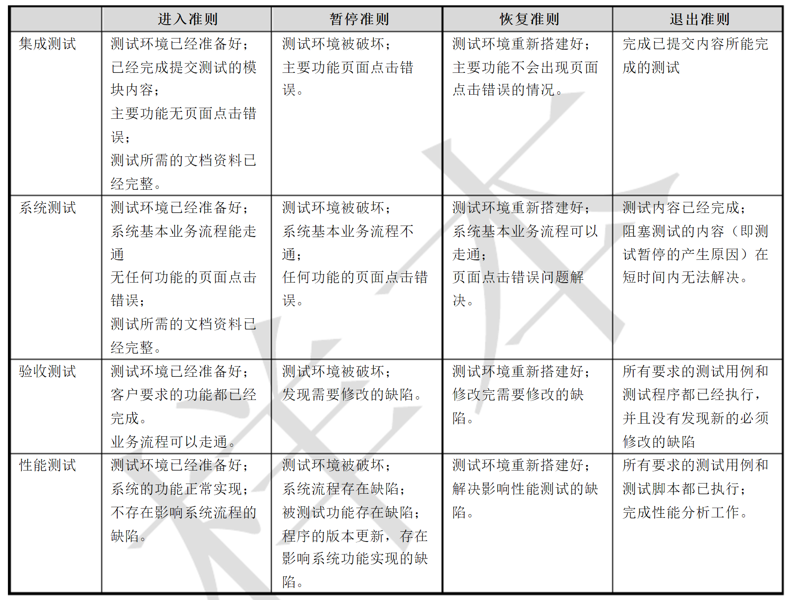
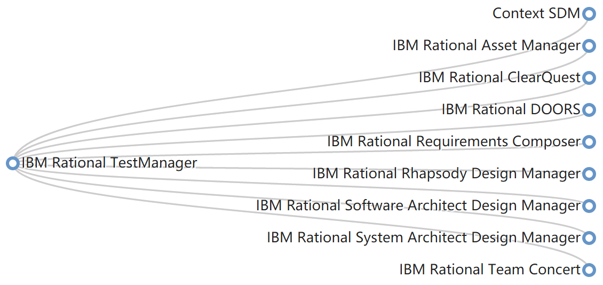
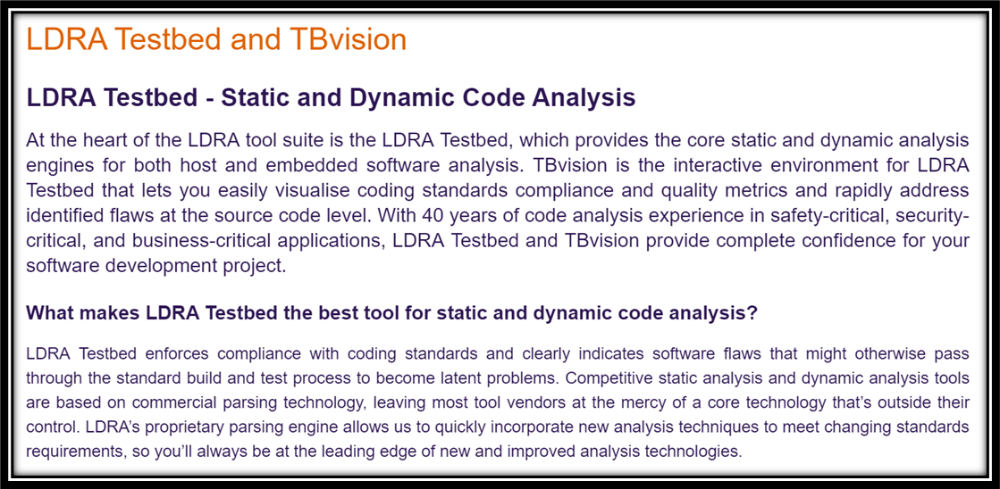

# 软件测评-1-综述

<!-- slide: 1 -->

- <number>
- 聂勇伟，副教授
  - nieyongwei@scut.edu.cn
  - 华南理工大学计算机科学与工程学院
- 软件测试与质量保障
- 第一章 - 综述

> 备注：软件研发vs测试
1个人开发与1000个人开发
自己开发，与别人开发

<!-- slide: 2 -->

<!-- slide: 3 -->

## 软件测评－提要

- 软件测试的意义和地位
- 软件测试的法则与实践
- 软件测试方法
- 软件测试级别
- 软件测试过程
- 软件测试自动化

<!-- slide: 4 -->

## 意义和地位－软件特点

- 软件在各行各业中的应用
- 软件的关键程度
- 软件的发展趋势
- 软件的技术特点

> 备注：应用性很强，电脑在哪里，软件就在那里。需要自动化的地方就需要软件。

发展趋势：越来越庞大，功能越来越复杂（计算器，到人工智能），开发越来越方便
中国软件的发展趋势，过去一段时间是互联网软件发展的黄金时代，现在是各种商业模式软件开发的黄金时代，而将来，我认为可能是专业软件开发的黄金时代。

技术特点：不同时代软件的技术特点不同。所谓技术特点，简单点说，就是软件开发用了什么技术，平台，语言，库等等。用途，B/s模式？C/S结构，即Client/Server(客户机/服务器)结构，开发平台，编程语言，

<!-- slide: 5 -->

## 意义和地位－软件研发

- 软件的地位
- 软件研制的过程能力
- 软件研制中的测试工作

> 备注：研发与测试，软件生成的两个主要工作
维护

<!-- slide: 6 -->

## 意义和地位－软件质量与缺陷

- 软件产品既必需满足用户的功能要求，又必须稳定可靠地完成用户的作业。
- 软件质量体现在多个方面，但首先要面对并必须解决的方面是软件缺陷。
- 软件缺陷有可能会给系统质量尤其是可靠性带来重大影响。

<!-- slide: 7 -->

## 什么是软件缺陷

- 产品说明书
  - 软件开发小组的一个协定，对开发的产品进行定义，给出产品的细节、如何做、做什么、不能做什么
- 至少满足下列5个规则之一才称发生了一个软件缺陷：
  - 软件未实现产品说明书要求的功能
  - 软件出现了产品说明书指明不应该出现的错误
  - 软件实现了产品说明书未提到的功能
  - 软件未实现产品说明书虽未明确提及但应该实现的目标
  - 软件难以理解、不易使用、运行缓慢或者最终用户认为不好

<!-- slide: 8 -->

## 意义和地位－典型缺陷1

- 事件 — Ariane 5
  - 1996年6月4日，Ariane 5 发射40秒后爆炸。
- 原因
  - 将一个64位浮点值转换为16位有符号整数值时，超出了16位整数的表示范围，而这个异常未得到正确处理。
- 教训
  - 对于重用模块，作了 Ariane 5和Ariane 4 具有相同环境的假设，重用模块在新的环境下完全没有进行测试。
  - 错误处理模块的处理机制不正确。

> 备注：阿丽亚娜-5运载火箭

<!-- slide: 9 -->

## 意义和地位－典型缺陷2

- 事件—火星探测器
  - 1999年，火星气象卫星(Mars Climate Orbiter)到达火星之后不久就消失；火星极地登陆者(Mars Polar Lander)在火星上着陆时坠毁。
- 原因
  - 地面系统软件和飞行器上软件分别使用公制和英制两种单位。
- 教训
  - 没有进行充分的测试；
  - 发现异常时，没有被恰当的解释。

<!-- slide: 10 -->

## 意义和地位－其他典型缺陷

- Therac-25放射治疗仪, 1985.6~1987.1, 6人治疗过量, 其中3人死亡；
- AT&T电话服务中断：1990.1.15全美范围9个小时, 1998.4.13全美范围23个小时；
- 计算机病毒攻击；
- 千年虫问题；
- ……

> 备注：2000年问题（Year 2000 Problem，简称Y2K），是指由于计算机程序设计的一些问题，使得计算机在处理2000年1月1日以后的日期和时间时候，可能会出现不正确的操作，从而可能导致一些敏感的工业部门（比如电力，能源）和银行，政府等部门在2000年1月1日零点工作停顿甚至是发生灾难性的结果。
2000年问题在英文中通常缩写为Y2K。其中Y表示“year”也就是年，而K则表示拉丁前缀“kilo”，表示1000。Y2K或者就是指2000年。
一般来说，由于计算机程序中使用两个数字来表示年份，如1998年被表示为“98”、1999年被表示为“99”；而2000年被表示为“00”，这样将会导致某些程序在计算时得到不正确的结果，如把“00”误解为1900年。在嵌入式系统中可能存在同样的问题，这有可能导致设备停止运转或者发生更加灾难性的后果。

<!-- slide: 11 -->

## 意义和地位－软件行业现状

- 软件的状况
- 无法提供无缺陷的软件
  - 各种研究报告表明，每写1000行代码会产生 30到85个缺陷
  - 大多数缺陷可通过测试捕获
  - 在大量的已完成测试的软件中，每1000行代码仍存在0.5~3个缺陷

> 备注：代码写的很乱
难以理解
难以调试
难以维护
难以测试

<!-- slide: 12 -->

## 意义和地位－获得高质量软件

- 软件质量
- 软件工程
- 方法
- 正式
- 技术评审
- 度量与控制
- 标准与过程
- 测试
- SCM
- 与
- SQA

> 备注：软件工程学科
开发人员能够及时地得到同行专家的帮助和指导，通过消除工作成果的缺陷而提高产品的质量。越早消除缺陷就越能降低开发成本。
Software Configuration Management
Software Quality Assurance

这里主要是为了强调测试的重要性

<!-- slide: 13 -->

## 意义和地位－验证与确认

- 验证与确认是广泛认可的质量保证方法
- 验证是指对某项规定活动进行检查的过程，以确保该活动实现了规定功能。
- 确认是指审查已建立的软件产品是否符合客户需要的过程。
- 软件测试是软件验证与确认的重要手段

> 备注：“验证”表明的是满足规定要求，而“确认”表明的是满足预期用途或应用要求，说简单点，“确认”就是检查最终产品是否达到顾客使用要求。

验证软件需求说明书
最终确认用户的需要

<!-- slide: 14 -->

## 意义和地位－发展历程

| 时间区间 | 状况 |
|---|---|
| -1956 | 面向调试的阶段 |
| 1957 - 1978 | 面向证实的阶段 |
| 1979 - 1982 | 面向破坏的阶段 |
| 1983 - 1987 | 面向评价的阶段 |
| 1988 - | 面向预防的阶段 |

<!-- slide: 15 -->

## 意义和地位－现实的用途

- 在给定的时限内尽可能多的发现缺陷和隐患
- 证实给定的软件产品满足其需求规格说明
- 评价软件产品的质量水平
- 为软件开发过程的改进提供数据支持

<!-- slide: 16 -->

## 意义和地位－压力下成长

> 备注：软件测试人员是有压力的，
开发人员不负责任，把压力给我们
客户的需求验证，也需要我们
所以，我们是在压力下成长的

<!-- slide: 17 -->

## 法则与实践－尽早测试

- 软件测试的基本法则
  - 在软件开发过程中尽早开展软件测试
    - 软件开发过程存在缺陷放大模型
    - 开发过程前进一步，发现和修复缺陷的成本增长10倍
    - 随着开发过程的进展，测试的有效性会不断下降
    - 应促使开发人员尽早考虑软件的可测试性
- 软件研制中的典型问题
  - 代码出来了，甚至系统实现了，才开始测试
  - 文档开发滞后，更新不及时，无法进行追踪，不重视对文档进行测试
  - 系统状态不稳定，测试的效果无法体现

> 备注：对文档进行测试什么意思呢？
比如，在文档中记录了某个需求，以及解决这个需求的算法。
那么，静态测试要考虑的典型问题是：这个算法能否解决这个需求

还有比如，输入输出是否定义清楚了，是否满足要求等等。逻辑是否合理。可行性，健壮性，结构化，易修改。等等。

<!-- slide: 18 -->

## 法则与实践－系统化测试

- 软件测试的基本法则
  - 多类角色—解决人的视角隧道问题
  - 多个层次—每个层次关注不同类型的缺陷
  - 多种方法—一种测试方法只对特定种类缺陷有效
  - 多个角度—该做/不该做、有效/无效、期望/不期望
- 软件研制中的典型问题
  - 没有必要多个角色做相同的事情
  - 调试代替低层次测试
  - 不测试无效和不期望的输入

<!-- slide: 19 -->

## 法则与实践－自动化测试

- 软件测试的基本法则
  - 自动化可提高测试工作的质量和效率
  - 自动化有利于解决规模大、结构复杂和日程紧张等问题
- 软件研制中的典型问题
  - 过分关注测试执行，而忽视测试设计
  - 期望自动工具替代测试工程师
  - 期望靠测试自动化节约测试成本
  - 期望靠测试自动化改善测试质量
  - 相信录制/回放工具是万能的

<!-- slide: 20 -->

## 法则与实践－有效的管理测试

- 软件测试的基本法则
  - 测试过程与其它软件过程协调一致才能保证测试有效性
  - 测试工作应该按项目进行管理
  - 应分派有经验、富有创造性的人员承担测试
  - 采用独立测试保证测试有效性
- 软件研制中的典型问题
  - 测试没有文档化的计划、方案支持
  - 独立测试组与开发组之间关系不协调

> 备注：其它软件过程
比如之前说的SCM，SQA

<!-- slide: 21 -->

## 法则与实践－基于风险测试

- 软件测试的基本法则
  - 测试需要在时间、成本和质量之间权衡
  - 风险分析是确定测试目标和策略的有效方法
  - 测试本身是一种高风险的活动
- 软件研制中的典型问题
  - 不使用风险分析技术
    - 太专业，很难掌握
    - 用不好，浪费时间

> 备注：（1）需求风险。对软件需求理解不准确，导致测试范围存在误差，遗漏部分需求或者执行了错误的测试方式；另外需求变更导致测试用例变更，同步时存在误差。 
（2）测试用例风险。测试用例设计不完整，忽视了边界条件、异常处理等情况，用例没有完全覆盖需求；测试用例没有得到全部执行，有些用例被有意或者无意的遗漏； 
（3）缺陷风险。某些缺陷偶发，难以重现，容易被遗漏； 
（4）代码质量风险。软件代码质量差，导致缺陷较多，容易出现测试的遗漏； 
（5）测试环境风险。有些情况下测试环境与生产环境不能完全一致，导致测试结果存在误差； 
（6）测试技术风险。某些项目存在技术难度，测试能力和水平导致测试进展缓慢，项目延期； 
（7）回归测试风险。回归测试一般不运行全部测试用例，可能存在测试不完全； （8）沟通协调风险。测试过程中涉及的角色较多，存在不同人员、角色之间的沟通、协作，难免存在误解、沟通不畅的情况，导致项目延期； 
（9）其它不可预计风险。一些突发状况、不可抗力等也构成风险因素，且难以预估和避免。

<!-- slide: 22 -->

## 法则与实践－测试的复杂性

- 软件测试的基本法则
  - 被测对象及其运行环境复杂
  - 高质量的测试要求测试人员彻底理解系统或产品
  - 测试质量取决于适当的测试用例集和有效的测试方法
  - 缺乏广泛适用的有效测试工具
- 软件研制中的典型问题
  - 测试工作很简单，测试成为新程序员的过渡性工作/不合格程序员的归宿
  - 进行无知的测试
  - 软件测试太复杂，投入很大，做了但是没有效果

<!-- slide: 23 -->

## 法则与实践－维持可追溯

- 软件测试的基本法则
  - 测试应源于用户需求
  - 进行可重复和可再现的测试
- 软件研制中的典型问题
  - 需求规格说明太简单、过时
  - 创建和维护测试文档浪费时间
  - 测试做了，没有文档和记录

<!-- slide: 24 -->

## 法则与实践－测试无止境

- 软件测试的基本法则
  - 除了最简单的程序，任何程序的完全测试都不可能
  - 测试可以表明缺陷的存在，但绝不能证明没有缺陷
  - 测试只能使好的设计变得更好
- 软件研制中的典型问题
  - 测试组应对保证质量负责
  - 没有发现所有错误说明测试人员未尽力工作
  - 没有必要反复做相同事情

<!-- slide: 25 -->

## 法则与实践－重视类聚性

- 软件测试的基本法则
  - 软件缺陷具有类聚性
    - 缺陷隐藏在角落里，聚集在边界上
    - 程序中隐藏缺陷的概率与其已发现的缺陷数成比例
- 软件研制中的典型问题
  - 发现并修复缺陷越多质量改进越成功
  - 将边界值分析当作最有效的测试方法

<!-- slide: 26 -->

## 法则与实践－利用Pareto法则

- 软件测试的基本法则
  - Pareto法则(8:2法则)
    - 20%的模块产生80%的缺陷
    - 20%的缺陷消耗80%的维护费用
    - 20%的原因导致了80%的缺陷
- 软件研制中的典型问题
  - 找出20%的部分需要大量的实践数据，目标太遥远
  - 需要细致的统计分析技术，条件不具备

> 备注：帕雷托法则（英语：Pareto principle），也称为二八定律或80/20法则，此法则指在众多现象中，80%的结果取决于20%的原因，而这一法则在很多方面被广泛的应用。

<!-- slide: 27 -->

## 方法－方法的重要性

- 用户与测试人员的区别
- 测试不能靠运气
- 测试方法来自于测试经验

<!-- slide: 28 -->

## 方法－有效性和效率

- 为使测试有效, 必须利用策略, 发现尽可能多的缺陷
- 为使测试有效率, 必须用最少的测试去发现最多的缺陷
- 测试就像侦探:
  - 为了更好地发现缺陷, 测试人员必须理解程序员和设计人员的思路
  - 测试人员不能遗忘任何不保险的东西, 应怀疑一切
  - 测试人员不能花费太多的时间, 必须有效率

<!-- slide: 29 -->

## 方法－分类

- 静态测试技术
- 动态测试技术
  - 白盒测试(White-Box Testing)
  - 黑盒测试(Black-Box Testing)

<!-- slide: 30 -->

## 方法－静态测试特征

- 静态测试是不动态执行程序代码而寻找程序代码中可能存在的缺陷或评估程序代码的过程。
- 可以由人工进行，充分发挥人的逻辑思维优势。
- 也可以借助软件工具自动进行。

<!-- slide: 31 -->

## 方法－常用静态测试方法

- 代码复查
  - 代码走查(Walkthrough)
  - 桌面检查(Desk Checking)
  - 代码审查(Code Inspection)
  - 代码评审(Code Review)
- 静态分析(主要由软件工具自动进行)

> 备注：代码走查(code walkthrough)是一个开发人员与架构师集中讨论代码的过程。代码走查的目的是交换有关代码是如何书写的思路，并建立一个对代码的标准集体阐述。 在代码走查的过程中，开发人员都应该有机会向其他人来阐述他们的代码。 通常地，即便是简单的代码阐述也会帮助开发人员识别出错误并预想出对以前麻烦问题的新的解决办法。

人工查找错误的第三种过程是古老的桌面检查方法。桌面检查可视为由单人进行的代码检查或代码走查：由一个人阅读程序，对照错误列表检查程序，对程序推演测试数据。

代码审查（英语：Code Review）是指对计算机源代码系统化地审查，常用软件同行评审的方式进行，其目的是在找出及修正在软件开发初期未发现的错误，提升软件质量及开发者的技术。代码审查常以不同的形式进行，例如结对编程、非正式的看过整个代码，或是正式的软件检查。

代码评审（Code Review，以下简称CR）是指通过阅读代码来检查源代码与编码标准的符合性以及代码质量的活动。其目的是帮助提高代码质量，尽早发现由于编码习惯而造成的缺陷，重新梳理思路，最重要的是促进团队沟通共享，共同识别优秀的习惯和模式，把代码评审活动看做一种 学习活动而非批判活动。

内容
编码风格、文档与注释
代码结构
工具框架的使用
功能和业务逻辑、异常处理
安全性、性能
可测性
工具扫描出的违规项和编译器警告

<!-- slide: 32 -->

## 方法－代码检查实践

- 自动代码检查方法
- 步骤：
  - 根据语言和环境要求选择代码检查工具
  - 定义代码检查规则
  - 利用自动化代码检查工具进行代码检查
  - 对自动代码检查结果进行人工分析
  - 利用静态分析工具实施代码静态分析
  - 根据拟定原则挑选关键单元进行人工补充检查
  - 编制问题报告并辅助定位
  - 对发现的问题实施闭环控制

<!-- slide: 33 -->

## 方法－动态测试特征

- 实际运行被测试程序，取得程序运行的真实情况和动态情况，进行分析；
- 测试的质量依赖于使用的测试数据；
- 生成测试数据和分析测试结果需要时间与经费投入；
- 动态测试涉及人员、设备和数据等多个方面，要求有较好的管理和工作规程。

<!-- slide: 34 -->

## 方法－黑盒与白盒测试

- 实际输出
- 内部行为
- 期望输出
- 软件设计
- 黑盒测试
- 白盒测试
- 选定的
- 输  入
- 实际输出
- 期望输出
- 选定的
- 输  入

<!-- slide: 35 -->

## 方法－测试用例

- 具有合理的捕获缺陷的概率
- 执行了重要的区域
- 做了应引起注意的事情
- 不做多余的事情
- 既不太简单也不太复杂
- 不与其它测试用例冗余
- 使得缺陷显而易见
- 考虑缺陷的隔离和识别

> 备注：软件工程中的测试用例是一组条件或变量，测试者根据它来确定应用软件或软件系统是否正确工作。

确定软件程序或系统是否通过测试的方法叫做测试准则。

<!-- slide: 36 -->

## 方法－白盒测试方法

- 基于控制流的测试
  - 语句覆盖
  - 分支覆盖
  - 条件覆盖
  - 条件组合覆盖
  - 基本路径覆盖
  - 循环覆盖
- 基于数据流的测试
- 变元测试(mutation test)

> 备注：数据流测试的英文是 data flow testing。定义：根据代码中变量的使用情况进行的测试。
1、变量被定义，但是从来没有使用(引用)     2、所使用的变量没有被定义     3、变量在使用之前被定义两次
数据流测试指关注变量接收值的点和使用（或引用）这些值的点的结构性测试形式。

代码变异测试是通过对代码产生“变异”来帮助我们学习的。“变异”指的是修改一处代码来改变代码行为（当然保证语法的合理性）。简单来说，代码变异测试先试着对代码产生这样的变异，然后运行单元测试，并检查是否有任何测试因为这个代码变异而失败。如果有测试失败，那么说明这个变异被“消灭”了，这是我们期望看到的结果。如果没有测试失败，则说明这个变异“存活”了下来，这种情况下我们就需要去研究一下“为什么”了。

http://www.infoq.com/cn/articles/test-coverage-rate-role

<!-- slide: 37 -->

## 方法－黑盒测试方法

- 边界值分析(boundary analysis)
- 等价类划分(equivalence class partitioning)
- 组合逻辑测试(combinational logic testing)
- 基于状态转换的测试(state-based testing)
- 随机测试(random testing)

<!-- slide: 38 -->

## 级别－分级策略

- S
- R
- D
- C
- U
- I
- V
- ST
- System Engineering
- Requirements
- Design
- Code
- Unit Test
- Integration Test
- Validation Test
- System Test

<!-- slide: 39 -->

## 级别－组织策略

- 单元测试
- 集成测试
- 确认测试
- 系统测试
- 验收测试
- 内部测试人员
- 独立测试小组
- 独立测试机构
- SQA

- 定义测试标准和质量控制过程

<!-- slide: 40 -->

## 级别－单元测试的特点

- 对象－模块
- 依据－软件设计规格说明
- 实现－串行或并行测试
- 方法－白盒为主
- 被测模块
- 测试用例
- 结果
- 测试工程师

<!-- slide: 41 -->

## 级别－单元测试的准备

- 要求的文档(软件设计规格说明)可提交
- 软件单元源程序符合设计规格要求
- 软件单元源程序已无错误地通过编译或汇编
- 被测试软件单元已纳入配置管理中
- 具备了规定的单元测试环境和测试工具

<!-- slide: 42 -->

## 级别－单元测试通过准则

- 命名符合规则
- 控制流程正确
- 变量使用无差错
- 达到质量度量指标
- 功能与设计说明一致
- 性能达到软件设计指标
- 覆盖测试达到规定的覆盖率
- 对发现的问题已进行修改并通过回归测试

> 备注：回归测试是软件测试的一种，旨在检验软件原有功能在修改后是否保持完整。
1.识别出软件中被修改的部分
2.从原基线测试用例库“T”中，排除所有不再适用的测试用例，确定对新版本依然有效的测试用例，创建新的基线测试用例库“TN”
3.依据一定的策略从TN中选择测试用例测试被修改的软件
4.如果必要，生成新的测试用例集“T1”，用于测试TN无法充分测试的软件部分
5.用T1执行修改后的软件

第2和第3步测试验证修改是否破坏了现有的功能，第4和第5步测试验证修改工作本身。

<!-- slide: 43 -->

## 级别－单元测试的内容

- 静态测试
  - 人工执行：读源程序
  - 走查(非正式)
  - 代码审查(正式)
  - 自动工具检查
    - 语法及语义错误
    - 背离编码标准
    - Runtime错误
- 动态测试
  - 黑盒测试
  - 白盒测试
  - 基于数据结构的测试

<!-- slide: 44 -->

## 级别－单元测试的焦点

- 被测模块
- 模块接口
- 局部数据结构
- 边界条件
- 独立执行路径
- 错误处理的路径
- 测试用例

<!-- slide: 45 -->

## 级别－单元接口测试

- 模块的实际输入与定义的输入一致
  - 个数、类型、顺序
- 模块中对于非内部/局部变量使用合理
- 调用其他模块时，检查其可用性和处理结果
- 使用外部资源时，检查其可用性并及时释放资源
  - 内存、文件、硬盘、端口等
- 其他

<!-- slide: 46 -->

## 级别－单元局部数据结构测试

- 变量从来没有被使用
  - 可能使用了错误的变量名
- 变量没有初始化
- 错误的类型转换
- 数组越界
- 非法指针
- 变量或函数名称拼写错误
  - 使用了外部变量或函数
- 其他

<!-- slide: 47 -->

## 级别－单元边界条件测试

- 正确处理合法数据
- 正确处理非法数据
- 正确处理边界的内点
- 正确处理边界的外点
- 其他

<!-- slide: 48 -->

## 级别－单元独立执行路径测试

- 不可达或冗余代码
- 计算优先级错误
- 精度错误
  - 比较运算错误
  - 赋值错误
- 表达式的不正确符号
  - >、>=；=、==、!=
- 循环变量的使用错误
  - 错误赋值
- 其他

<!-- slide: 49 -->

## 级别－单元错误处理路径测试

- 错误自动检测机制
  - 资源使用前后
- 错误处理策略
  - 抛出错误
  - 通知用户
  - 进行记录
- 错误处理的有效性
  - 在系统干预前处理
  - 报告和记录的错误真实详细
- 其他

<!-- slide: 50 -->

## 级别－单元测试环境与组织

- 被测模块
- 驱动模块
- 结果
- 测试用例
- 模块接口
- 局部数据结构
- 边界条件
- 独立执行路径
- 错误处理的路径
- 桩1
- 桩2
- 桩n

<!-- slide: 51 -->

## 级别－集成测试

- 集成可在多个层次上进行
- 两个组件集成的例子:
- Component #1
- Operations and
- Functions with I/O
- input
- interface
- operation
- Component #2
- Operations and
- Functions with I/O
- output
- operation

<!-- slide: 52 -->

## 级别－集成测试特征

- 一组相互依赖的组件或模块放在一起进行测试，以确保其作为一个整体的质量。
- 集成测试是一个渐进的过程
- 模块          软件部件          软件配置项
- 子系统           软件系统

<!-- slide: 53 -->

## 级别－集成测试进入条件

- 要求的文档可提交
- 被集成的软件单元已通过单元测试
- 被测试构件已纳入配置管理中
- 具备了满足要求的集成测试环境和测试工具

<!-- slide: 54 -->

## 级别－集成测试内容

- 组件/模块间的接口测试
- 全局数据结构测试
- 软件功能模块的功能测试
- 性能测试
- 边界和人为条件下的性能

<!-- slide: 55 -->

## 级别－集成测试接口类型

- 参数接口
  - 将数据从一个过程(函数)传递到另一个过程(函数)
- 共享内存接口
  - 两个或多个过程(函数) 共享同一个内存区
- 程序接口
  - 将子系统封装成过程(函数) 集，由其他子系统调用
- 消息传递接口
  - 一个子系统从另一个子系统请求服务

<!-- slide: 56 -->

## 级别－典型接口错误

- 接口误用
  - 一个模块调用其它模块时，误用接口。如：参数次序错误，参数数量不同，等
- 接口误解
  - 一个调用模块中包含对被调用模块的不当假设，如，调用结果均合法，可使用非法数据，等
- 时间错误
  - 调用模块和对被调用模块以不同的速度运行，并且存取外部数据信息。

<!-- slide: 57 -->

## 级别－集成接口测试指南

- 用边界值测试参数传递
- 用空指针测试指针参数
- 设计导致模块失败的测试
- 消息传递系统中使用压力测试
- 在共享内存系统中, 改变模块激活的次序

<!-- slide: 58 -->

## 级别－集成测试焦点

- 软件系统结构的设计和构造
- 在子系统层次上被集成的功能或操作
- 组件/模块之间的接口和相互作用
- 资源集成
- 环境集成

<!-- slide: 59 -->

## 级别－集成测试通过准则

- 组件/模块间无错误连接
- 满足各项功能、性能要求
- 对错误有正确的处理
- 对测试中的异常有合理解释
- 接口正确

<!-- slide: 60 -->

## 级别－集成测试的策略

- 非渐增式集成(大爆炸集成)
- 渐增式集成
  - 自顶向下集成
    - 深度优先方法
    - 广度优先方法
  - 自底向上集成
  - 高频集成

<!-- slide: 61 -->

## 级别－大爆炸集成测试

- 含义 一次性组装或整体拼接
- 前提
  - 被测系统在通过系统范围的测试后，只有少量构件加入或修改
  - 被测系统较小并具有良好可测试性，每个构件都经过充分测试
  - 被测系统的构件紧密连接，无法分别测试
  - 测试未考虑构件之间的相依性或风险

<!-- slide: 62 -->

## 级别－自顶向下集成测试

- 顶上的模块借助桩进行测试
- 每次替换一个桩，
- 可选用“深度优先”或者“广度优先”方式。
- 每当新的模块集成进来，
- 重新运行一些测试子集。
- A
- B
- C
- D
- E
- F
- G

<!-- slide: 63 -->

## 级别－自顶向下集成测试步骤

- 首先开发和测试在最高控制层的构件，下层构件用桩实现；
- 继续在每一层按宽度或深度优先进行，用真正的模块代替桩，并建立下层桩；
- 每一个模块集成进来的时候都要进行测试；
- 用回归测试保证没有引入新错误；
- 以这种方式继续直到所有被测系统中的桩已经实现和测试。

<!-- slide: 64 -->

## 级别－自顶向下集成测试举例

- A
- B
- E
- H
- C
- D
- F
- I
- G
- J
- L
- M
- K
- 广度优先 – A B C D E F G H I J K L M
- 深度优先 – A B E H C F I D G J L M K

<!-- slide: 65 -->

## 级别－自顶向下集成测试特性

- 优点
  - 测试和集成可以较早开始
  - 减少了驱动器开发费用
- 缺点
  - 需要建立大量的桩
  - 底层的需求变化会影响上层构件

<!-- slide: 66 -->

## 级别－自底向上集成测试

- A
- B
- C
- D
- E
- F
- G
- 以深度优先次序每次替换一个驱动模块
- 可工作的模块被聚合在一起，
- 形成build并集成。
- 簇

<!-- slide: 67 -->

## 级别－自底向上集成测试步骤

- 第一阶段对底层模块编码，并使用驱动模块对其测试；
- 底层模块组合成能够实现软件特定子功能的簇，写驱动模块对簇进行测试；
- 移走驱动模块，沿着程序结构的层次向上对簇进行组合，使用驱动模块对其测试；
- 以这种方式继续集成直到整个系统使用真实的主控制模块进行测试。

<!-- slide: 68 -->

## 级别－自底向上集成测试举例

- A
- B
- E
- H
- C
- D
- F
- I
- G
- J
- L
- M
- K
- Build1– H E B
- Build2– I F C D
- Build3– L M J K G
- 将build 1,2和3与A集成。

<!-- slide: 69 -->

## 级别－自底向上集成测试特性

- 优点
  - 不需要桩
  - 可并行测试
- 缺点
  - 需要大量驱动器

<!-- slide: 70 -->

## 级别－高频集成测试

- 开发者产生要集成的代码增量和相关测试包，运行测试包，构件通过所有测试后，将代码和测试包移交集成部门。
- 集成构件测试员将开发者的提交聚集起来并运行一个集成测试包。集成测试包包括冒烟测试(Smoke Testing)、新开发的测试以及时间允许的尽可能多的测试。
- 评价结果。集成构件的纠错拥有最高优先级。

> 备注：“冒烟测试”这一术语源自硬件行业。该术语源于此做法：对一个硬件或硬件组件进行更改或修复后，直接给设备加电。如果没有冒烟，则该组件就通过了测试。

在软件中，“冒烟测试”这一术语描述的是在将代码更改签入到产品的源树中之前对这些更改进行验证的过程。在检查了代码后，冒烟测试是确定和修复软件缺陷的最经济有效的方法。冒烟测试设计用于确认代码中的更改会按预期运行，且不会破坏整个版本的稳定性。

<!-- slide: 71 -->

## 级别－高频集成测试特征

- 适用于时间紧复杂度高的软件
- 自底向上/自顶向下的集成方式
- 每日构建与冒烟测试(Daily Build and Smoke Testing)
- 冒烟测试从头到尾检测整个系统(当前状态下)。它不一定必须是穷举的，但是应该能够暴露主要问题。冒烟测试应该是足够充分的，如果构件通过了冒烟测试，就可以假定该构件已经足够稳定，可以继续进行更加彻底的测试。
- － McConnel, S.

<!-- slide: 72 -->

## 级别－高频集成测试前提

- 可得到一个稳定的增量
- 大多数有意义的增量可在频率间隔内产生
- 测试包和代码并行开发并保持当前有效
- 必须进行自动化测试
- 必须使用配置管理工具

<!-- slide: 73 -->

## 级别－高频集成测试优点

- 集成风险很小
- 最终产品的质量得到改善
- 错误诊断和改正简单
- 进度易于评估

<!-- slide: 74 -->

## 级别－系统测试概念

- 软件系统作为一个整体进行测试，检验系统各部分之间的协调情况，以证实在目标环境下软件完成了全部系统功能和性能。
- 系统测试是一系列不同测试的组合，这些测试目的不同，但都是为了整个系统成分能正常地集成到一起并完成分配的功能。

<!-- slide: 75 -->

## 级别－系统测试组织

- 软件系统测试
- 软件确认测试
- 验收测试
  - 基准测试
  - 小规模试验
    - 用户测试
    - 独立测试
    - Alpha和Beta测试
  - 比较测试
  - 符合性测试

> 备注：alpha测试是在用户组织模拟软件系统的运行环境下的一种验收测试,由用户或第三方测试公司进行的测试,模拟各类用户行为对即将面市的软件产品进行测试,试图发现并修改错误。    Beta测试是用户公司组织各方面的典型终端用户在日常工作中实际使用beta版本,并要求用户报告异常情况,提出批评意见。

Alpha测试是指把用户请到开发方的场所来测试,beta测试是指在一个或多个用户的场所进行的测试。Alpha测试的环境是受开发方控制的,用户的数量相对比较少,时间比较集中。而beta测试的环境是不受开发方控制的,谁也不知道用户如何折磨软件,用户数量相对比较多,时间不集中。一般地,alpha测试先于beta测试执行。

比较测试（化学）
符合性测试（金融和审计，为查明被审计单位内部控制制度是否执行及其执行效果所采取的抽查法审查。）

<!-- slide: 76 -->

## 级别－系统测试目标

- 揭示系统范围出现的错误
- 验证被测系统实现了所有需要的能力
- 确定被测系统是否可提交

<!-- slide: 77 -->

## 级别－系统测试内容

- 功能
- 性能
- 可靠性
- 恢复性
- 安装性
- 用户操作
- 特定条件下的行为
- 软件与硬件的集成与协作
- 与外部软件和系统的集成

<!-- slide: 78 -->

## 级别－回归测试

- 每个修改都需要相应级别的回归测试验证
  - 超过60%的对软件系统的修改会无意中引入新的错误
  - 每修改6行代码就会引入一个新的错误
- 目标
  - 检验修改是否达到了预期的目的
  - 检验是否损害了原有的正常功能，从而造成系统的回归

<!-- slide: 79 -->

## 级别－回归测试流程

- 识别变更，进行变更影响分析；
- 对原测试集进行维护，生成新的测试集；
- 从测试集中选择回归测试包；
- 用选择的测试包进行回归测试；
- 对回归测试结果进行分析并报告。

<!-- slide: 80 -->

## 级别－回归测试用例集维护

- 增加
  - 针对新被测特征的测试用例
- 修改
  - 为适应被测对象的变更进行修改
- 删除
  - 零碎的测试用例
  - 过时的测试用例
  - 不能控制的测试用例
  - 冗余的测试用例

<!-- slide: 81 -->

## 级别－回归测试用例选择

- 再测试全部用例
- 基于风险选择测试
- 基于操作剖面选择测试
- 再测试修改的部分
- 防火墙内再测试

<!-- slide: 82 -->

## 级别－影响回归测试的因素

- 对软件质量的信心
- 修改的特性
- 修改的影响
- 日程、经费约束

<!-- slide: 83 -->

## 级别－提高回归测试效率

- 回归测试自动化
- 更换测试人员
- 在不改变测试目的的情况下，鼓励测试者创造性地执行测试用例
- 不要期望只做一次回归测试

<!-- slide: 84 -->

## 过程－测试阶段

- 测试执行
- 测试评估

- 测试计划
- 测试设计
- 质量保证

<!-- slide: 85 -->

## 过程－测试计划的意义

- 成功执行和管理软件测试项目的保证
- 计划的过程比形成的文档更重要
- 提供了交流的平台
- 计划是动态的

> 备注：计划的过程是一种面对面的交流
文档并不是越多越好

<!-- slide: 86 -->

## 过程－测试计划的级别

- 总体测试计划
- 单元
- 测试
- 计划
- 集成
- 测试
- 计划
- 系统
- 测试
- 计划
- 验收
- 测试
- 计划

<!-- slide: 87 -->

## 过程－测试计划流程

- 制定测试计划
- 项目计划
- 质量保证计划
- 配置管理计划
- 软件技术文档
- 项目资源
- 项目要求
- 风险分析
- 项目策划
- 同行评审
- 测试计划文档

<!-- slide: 88 -->

## 过程－测试计划活动

- 明确测试目的
- 定义测试策略
- 定义测试系统
- 估算测试工作量
- 编制测试计划
- 审查测试计划

<!-- slide: 89 -->

## 过程－明确测试目的

- 符合性制导测试
- 缺陷制导测试
- 故障制导测试
- 失效制导测试

> 备注：符合性 针对单元测试的
缺陷 静态的
故障 动态的
失效 针对用户的

<!-- slide: 90 -->

## 过程－定义测试策略

- 确定测试范围(What will be tested)
- 选择测试方法(How testing will be done)
- 建立进入／退出标准和质量检查点
- 确定自动化策略

<!-- slide: 91 -->

## 过程－确定测试范围

- 应用风险管理技术
- 技术风险分析
  - 功能特征
  - 性能特征
  - 约束
- 生成测试项清单

> 备注：期望货币值
计算风险因子
PERT估计
仿真
专家判断

<!-- slide: 92 -->

## 过程－选择测试方法

- 弄清当前开发阶段
- 理解测试饱和效应
- 关注测试方法焦点
- 考虑产品成熟度
- 建立测试距阵

<!-- slide: 93 -->

## 过程－理解测试饱和效应

- 剩余缺陷
- 功能
- F1
- t1s
- t1e
- 控制流
- F2
- t2s
- t2e
- 变元分析
- F3
- t3s
- t3e
- 可靠性测试
- Fn
- tns
- tne
- 缺陷数
- 测试投入
- t
- F
- 饱和区

<!-- slide: 94 -->

## 过程－关注测试方法焦点

- 数据
- 功能
- 风险测试
- 功能测试
- 可靠性
- 测试
- 冒烟
- 测试

<!-- slide: 95 -->

## 过程－建立测试距阵

| 测试特征 | 测试类型 |  |  |  |
|---|---|---|---|---|
|  | 功能测试 | 可靠性测试 | 安全性测试 | … |
| 录入 | ✓ |  | ✓ |  |
| 报表 | ✓ |  |  | ✓ |
| 计算 | ✓ | ✓ |  |  |
| … |  |  | ✓ |  |

<!-- slide: 96 -->

## 过程－准则和质量检查点

- 进入准则(Entry criteria)
- 退出准则(Exit criteria)
- 挂起/再继续准则(Suspension/resumption  criteria)
- 测试通过/失败准则(Test pass/fail criteria)
- 过程和标准确定的其它准则

<!-- slide: 97 -->

## 过程－定义测试系统

- 测试结构
  - Test suite
  - Test
  - Test case
- 测试工具
- 测试环境
- 测试配置
- 测试地点

<!-- slide: 98 -->

## 过程－估算测试工作量

- 考虑
  - 进度要求
  - 测试工作量
  - 约束与限制
- 任务
  - 测试工作分解
  - 测试任务依赖性分析
  - 与开发活动关系
  - 确定里程碑

> 备注：里程碑是项目中的重大事件，在项目过程中不占资源，是一个时间点，通常指一个可支付成果的完成。项目里程碑（milestone）定义的核心是围绕事件（event）、项目活动（activity）、检查点（checkpoint）或决策点，以及可交付成果（deliverable）这些概念来展开的。

<!-- slide: 99 -->

## 过程－组建测试小组

- 组织模式
- 小组规模
  - 比例
  - 工作量
- 技能要求
- 培训需求

<!-- slide: 100 -->

## 过程－测试计划文档

- 编制
  - 测试计划的正式程度取决于企业文化
  - 测试计划应依据相关标准
- 审查
  - 对测试计划的审查是必要的
  - 审查组成员应知晓项目背景
  - 审查组成员应包括相关各方的代表
  - 对审查发现的问题应跟踪

<!-- slide: 101 -->

## 过程－测试设计目标

- 对确定的测试范围提供良好的测试覆盖
- 确定可验证的测试用例列表
- 创建并管理测试用例集

<!-- slide: 102 -->

## 过程－测试设计流程

- 测试设计
- 软件测试计划
- 配置管理计划
- 软件技术文档
- 项目资源
- 项目要求
- 覆盖率分析
- 需求工程
- 同行评审
- 测试说明
- 测试用例集

<!-- slide: 103 -->

## 过程－测试设计活动

- 测试总体设计
- 测试用例开发
- 检验并调试测试用例
- 编制软件测试说明
- 评审软件测试说明

<!-- slide: 104 -->

## 过程－测试总体设计

- 定义测试目标
  - 细化测试范围
  - 精选测试方法
- 定义每个测试的输入规范
  - 数据文件、数据库记录、配置文件、…
  - 不包括用户通过键盘和鼠标输入
- 定义用于每个测试的测试配置
- 测试设计文档化和评审
  - 基于需求追踪文档化
  - 基于覆盖率分析和正确性检查评审

<!-- slide: 105 -->

## 过程－需求追踪矩阵

| SRID | SWRID | 体系结构部件 | TRID | 测试需求说明 | 测试技术 |
|---|---|---|---|---|---|
| 3.2.1a | SM001 | 系统管理 | 1001 | 根据字典和易猜口令表检查用户口令 | 功能测试 |
| 3.2.1b | SM002 | 系统管理 | 1002 | 在常规负载下系统维持50%的剩余内存容量 | 内存使用 |
| 3.2.1c | SM003 | 系统管理 | 1003 | 取值超出规定范围时，系统给出恰当的错误提示 | 错误处理 |
| … | … | … | … | … | … |
| 各种 | 各种 | 各种(来自分析) | 1080 | 程序中的所有语句至少执行一次 | 语句覆盖 |
| 各种 | 各种 | 各种(来自分析) | 1081 | 程序中每个逻辑分支至少执行一次 | 分支覆盖 |

> 备注：需求跟踪矩阵，主要验证需求是否得到了实现的有效工具，借助RTM，可以跟踪每个需求的状态。

<!-- slide: 106 -->

## 过程－测试用例开发

- 选择测试用例开发技术
- 确定预期输入
- 开发详细测试过程
- 定义预期结果
- 测试用例的初始和结束状态

> 备注：1. Myers提出了使用各种测试方法的综合策略：
1)在任何情况下都必须使用边界值分析方法，经验表明用这种方法设计出测试用例发现程序错误的能力最强。 
2)必要时用等价类划分方法补充一些测试用例。
3)用错误推测法再追加一些测试用例。
4)对照程序逻辑，检查已设计出的测试用例的逻辑覆盖程度，如果没有达到要求的覆盖标准，应当再补充足够的测试用例。
5)如果程序的功能说明中含有输入条件的组合情况，则一开始就可选用因果图法。

1)构造根据设计规格得出的基本功能测试用例；
2)边界值测试用例；
3)状态转换测试用例；
4)错误猜测测试用例；
5)异常测试用例；
6)性能测试用例；
7)压力测试用例。

<!-- slide: 107 -->

## 过程－测试用例分级

- 目的
  - 简化测试复杂性
  - 优先执行风险高的测试用例
- 举例
  - 1级：冒烟测试用例
  - 2级：能力测试用例
  - 3级：功能测试用例
  - 4级：复合测试用例

<!-- slide: 108 -->

## 过程－测试用例检验

- 测试用例的正确性检验
- 测试程序调试
- 测试过程自动化

<!-- slide: 109 -->

## 过程－测试说明文档

- 编制
  - 使用软件测试说明标准和模板
  - 将测试设计成果文档化
  - 测试说明应关注技术细节
  - 为每个测试项编制一份测试说明
- 审查
  - 复审并评估测试覆盖
  - 关注测试的技术可行性
  - 审查测试通过准则的合理性

<!-- slide: 110 -->

## 过程－测试执行

- 创建测试环境并得到确认
- 运行与被测试对象相对应的测试用例集
- 记录真实的结果
- 提交受认可的问题报告

<!-- slide: 111 -->

## 过程－测试执行流程

- 测试执行
- 软件测试计划
- 软件测试说明
- 测试用例集
- 配置管理计划
- 软件技术文档
- 项目资源
- 项目要求
- 测试环境建立
- 测试运行
- 项目状态报告
- 同行评审
- 测试日志
- 问题报告

<!-- slide: 112 -->

## 过程－测试执行活动

- 建立测试环境并确认
- 执行测试用例
- 测试评估
- 填写测试日志
- 如发现异常，填写问题报告
- 维护测试环境
- 如需要继续执行测试用例，转第2步
- 结束测试

<!-- slide: 113 -->

## 过程－测试执行的控制

- 测试周期
- 缺陷跟踪
- 状态报告
  - 测试状态报告
  - 缺陷状态报告
  - 测试总结报告
- 测试退出判断

<!-- slide: 114 -->

## 过程－测试执行的质量控制

- 复审测试记录
- 复审软件问题报告
- 测试过程监督
- 实施缺陷跟踪管理

<!-- slide: 115 -->

## 过程－测试评估

- 准确地分析测试结果
- 确定测试满足测试完成标准
- 形成有效的测试报告

<!-- slide: 116 -->

## 过程－测试评估流程

- 测试评估
- 软件测试计划
- 软件测试说明
- 测试用例集
- 配置管理计划
- 测试日志
- 问题报告
- 软件技术文档
- 项目资源
- 项目要求
- 测试质量度量
- 软件质量评价
- 同行评审
- 测试报告

<!-- slide: 117 -->

## 过程－测试评估活动

- 提取问题处理信息
- 分析测试结果
- 确定是否达到了测试的完成标准
- 生成软件测试报告
- 评审软件测试报告

<!-- slide: 118 -->

## 过程－测试评估质量控制

- 评审软件测试报告
- 复审并评估实际测试覆盖
- 复审并评估遗留软件问题

<!-- slide: 119 -->

## 自动化－自动测试的目的

- 更好地完成回归测试、可移植性测试、性能测试和配置测试
- 提高测试的一致性和可重复性
- 测试的复用
- 更好地利用资源
- 完成手工不可能进行的测试

<!-- slide: 120 -->

## 自动化－自动测试的内容

- 自动测试输入
- 自动测试执行
- 测试脚本技术
- 测试结果的自动比较
- 自动测试管理
- 自动测试质量评价

<!-- slide: 121 -->

## 自动化－自动测试的好处

- 生产出可靠的系统
  - 改进需求定义
  - 改进性能、压力测试
  - 系统开发生存周期改进
- 改进测试工作质量
  - 改进回归测试、多平台兼容性测试
  - 改进测试执行
  - 执行手工测试无法完成的测试
  - 改进重现软件缺陷的能力
- 减轻了测试工作量并缩短了测试进度

<!-- slide: 122 -->

## 自动化－不正确的期望

- 自动测试计划生成
- 测试工具可适用于所有测试
- 测试工作马上减轻
- 进度马上缩短
- 工具易于使用
- 测试自动化的普遍应用
- 100%的测试覆盖率

<!-- slide: 123 -->

## 自动化－影响自动化的因素

- 使用的工具
- 测试自动化的方法
- 测试自动化者的经验和水平
- 环境
- 被测软件
- 其它因素(已有的测试过程)

<!-- slide: 124 -->

## 自动化－测试流程管理

- 目的
  - 对软件测试过程进行管理
- 工具
  - Rational TestManager
  - MI TestDirector
  - QADirector
  - ……

<!-- slide: 125 -->

## 自动化－缺陷跟踪管理

- 目的
  - 对软件测试过程中发现的缺陷/问题进行跟踪
- 工具
  - Rational ClearQuest
  - MI TestDirector
  - PVCS
  - ……

<!-- slide: 126 -->

## 自动化－代码审查工具

- 目的
  - 实现代码审查自动化
- 工具
  - LDRA TestBed
  - LogiScope
  - PRQA C/C++
  - ……

<!-- slide: 127 -->

## 自动化－静态分析工具

- 目的
  - 实现代码的静态分析，并获得代码的清晰性、可测试性、可维护性等代码质量因素的定量结果。
- 工具
  - LDRA TestBed
  - LogiScope
  - Cantata++
  - McCabe QA
  - ……

<!-- slide: 128 -->

## 自动化－覆盖率分析工具

- 目的
  - 获得被测单元运行后按各类测试覆盖统计方法进行统计的覆盖结果
- 工具
  - Rational PureCoverage
  - CodeTest
  - LogiScope
  - LDRA TestBed
  - McCabe QA
  - ……

<!-- slide: 129 -->

## 自动化－内存缺陷测试工具

- 目的
  - 实现运行时内存缺陷的检查
- 工具
  - Rational Purify
  - CodeTest
  - ……

<!-- slide: 130 -->

## 自动化－运行时缺陷测试工具

- 目的
  - 实现各类运行时缺陷的检查
- 工具
  - PolySpace
  - ……

<!-- slide: 131 -->

## 自动化－性能测试工具

- 目的
  - 获得被测单元运行时的代码性能表现
  - 获得可使用GUI驱动的单元的外部性能表现
- 工具
  - Rational Quantify
  - CodeTest
  - LogiScope
  - MI LoadRunner
  - Rational TestStudio
  - SilkPerformer
  - Microsoft WAS

<!-- slide: 132 -->

## 自动化－单元测试工具

- 目的
  - 实现测试环境的自动化和构建，以辅助完成单元的功能和接口测试
- 工具
  - Cantata++
  - Rational Test RealTime
  - LDRA TestBed
  - ……

<!-- slide: 133 -->

## 自动化－集成测试工具

- 目的
  - 实现测试环境的自动化和构建以辅助完成功能及接口测试
- 工具
  - LDRA TestBed
  - Cantata++
  - Rational Test RealTime
  - ……

<!-- slide: 134 -->

## 自动化－系统测试工具

- GUI测试
  - Rational Robot
  - MI WinRunner
  - QA Run
- 嵌入式系统测试
  - CodeTest
- 仿真
  - stage
  - BusTools
  - ADS-3000/V2

<!-- slide: 135 -->

- <number>
- 谢  谢！
- 华南理工大学 计算机科学与工程学院
- 广州市番禺区大学城华南理工大学
- 邮编：510006
- 电子邮件：nieyongwei@scut.edu.cn
