# 软件测评-2-测试方法

<!-- slide: 1 -->

- 1
- 2010年度广州市电子商务发展专项资金
- 扶持项目
- 软件测试与质量保障
- 华南理工大学计算机科学与工程学院
- 聂勇伟 副教授
- nieyongwei@scut.edu.cn
- 第二章 - 软件测试方法

<!-- slide: 2 -->

## 课程回顾

- 软件测试
- 基本概念：重要意义，法则
- 方法（手段）：静态、动态、黑盒、白盒 …
- 级别（阶段）：单元、集成、确认、系统、验收
- 过程：计划、设计、执行、评估
- 自动化

<!-- slide: 3 -->

## 按方法（手段）分类

<!-- slide: 4 -->

## 按方法（手段）分类

<!-- slide: 5 -->

## 黑盒测试

- 输入
- 输出
- 用户需求
- 事件驱动

<!-- slide: 6 -->

## 黑盒测试

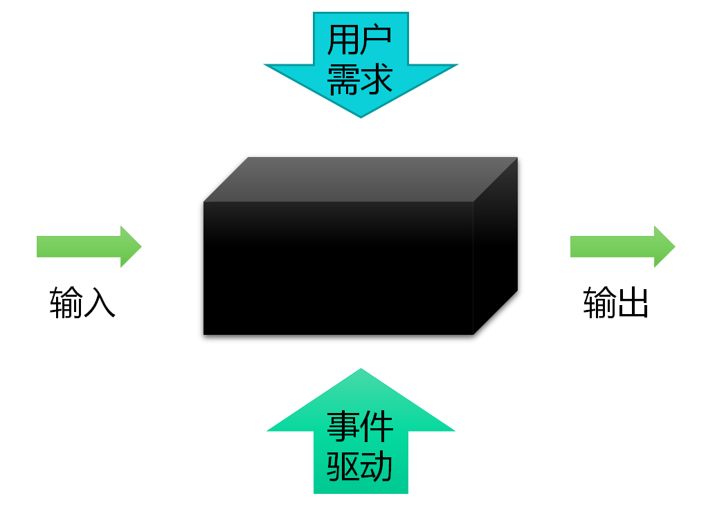
- 6
- 已知软件产品应该具有的功能，通过测试来检测每个功能是否都能正常使用；
- 黑盒法着眼于程序外部结构，不考虑内部逻辑结构；
- 穷举输入/状态测试，测试情况有无穷多个；
- 依据需求规范；
- 检查程序实现的功能，是一种确认技术；
- 也称为功能测试或数据驱动测试。

<!-- slide: 7 -->

## 输入/状态空间

- 7
- 一些很普通的程序所包含的输入输出组合的数目都是非常惊人的，有些更是天文数字
- 例：读入三个数值，表示三角形的三条边，程序输出一条信息，说明该三角形是等边三角形、等腰三角形、不等边三角形。
- 解：在限制坐标点取值为1~10^4的整数的情况下，3条直线有10^4╳10^4╳10^4＝10^12种可能的输入，每秒测试1000条直线，需要10^12/10^3＝10^9s，每年按3.1536╳10^7s计算，需要10^9/(3.1536╳10^7)=31.7年。
- 注：考虑输入域之外/实数/更大范围

<!-- slide: 8 -->

## 黑盒测试不彻底性

- 8
- 不可能测试所有的输入
  - 有效的输入
  - 无效的输入
  - 输入的编辑特性
  - 输入时间的考虑
- 不可能测试多个输入的所有组合
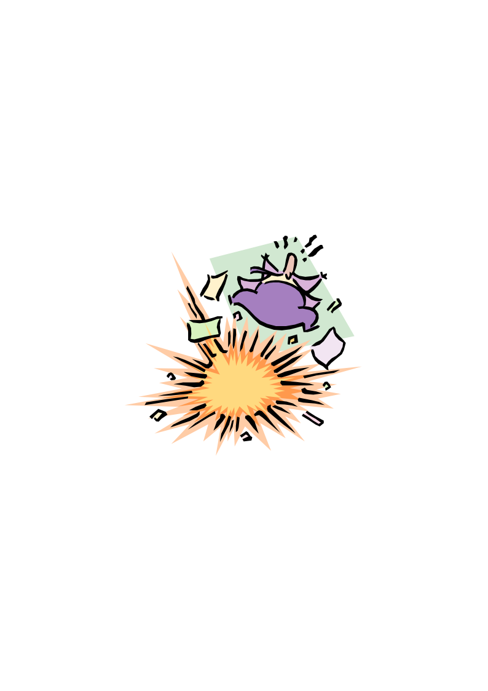
- State Space Explosion

<!-- slide: 9 -->

## 黑盒测试常用方法

- 9

<!-- slide: 10 -->

## 黑盒测试常用方法

- 10

<!-- slide: 11 -->

## 等价类划分法-定义

- 等价类划分法
  - 是把所有可能的输入数据,即程序的输入域划分成若干部分（子集）,然后从每一个子集中选取少数具有代表性的数据作为测试用例。该方法是一种重要的,常用的黑盒测试用例设计方法。
- 等价类
  - 等价类是指某个输入域的子集合。在该子集合中,各个输入数据对于揭露程序中的错误都是等效的，并合理地假定：测试某等价类的代表值就等于对这一类其它值的测试，因此,可以把全部输入数据合理划分为若干等价类,在每一个等价类中取一个数据作为测试的输入条件就可以用少量代表性的测试数据取得较好的测试结果。

<!-- slide: 12 -->

## 等价类划分法-定义

- 有效等价类
  - 是指对于程序的规格说明来说是合理的、有意义的输入数据构成的集合。利用有效等价类可检验程序是否实现了规格说明中所规定的功能和性能。
- 无效等价类
  - 与有效等价类的定义恰巧相反。无效等价类指对程序的规格说明是不合理的或无意义的输入数据所构成的集合。对于具体的问题，无效等价类至少应有一个，也可能有多个。
- 设计测试用例时,要同时考虑这两种等价类。因为软件不仅要能接收合理的数据,也要能经受意外的考验，这样的测试才能确保软件具有更高的可靠性。

<!-- slide: 13 -->

## 等价类划分法-标准

- 完备测试、避免冗余;
  - 划分等价类重要的是：集合的划分，划分为互不相交的一组子集，而子集的并是整个集合;
  - 完备性：并是整个集合
  - 子集互不相交：保证一种形式的无冗余性
  - 同一类中标识（选择）一个测试用例，同一等价类中，往往处理相同，相同处理映射到"相同的执行路径"。

<!-- slide: 14 -->

## 等价类划分法-方法

- 在输入条件规定了取值范围或值的个数的情况下,则可以确立一个有效等价类和两个无效等价类。如：输入值是学生成绩，范围是0～100；
- 在输入条件规定了输入值的集合或者规定了"必须如何"的条件的情况下,可确立一个有效等价类和一个无效等价类；
- 在输入条件是一个布尔量的情况下,可确定一个有效等价类和一个无效等价类。
- 在规定了输入数据的一组值（假定n个）,并且程序要对每一个输入值分别处理的情况下,可确立n个有效等价类和一个无效等价类。
- 在规定了输入数据必须遵守的规则的情况下,可确立一个有效等价类（符合规则）和若干个无效等价类（从不同角度违反规则）；
- 在确知已划分的等价类中各元素在程序处理中的方式不同的情况下,则应再将该等价类进一步的划分为更小的等价类。
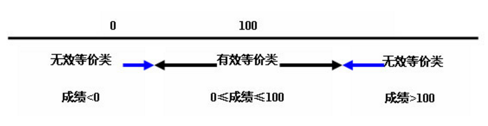

<!-- slide: 15 -->

## 等价类划分法-设计测试用例

- 在确立了等价类后,可建立等价类表,列出所有划分出的等价类输入条件：有效等价类、无效等价类，然后从划分出的等价类中按以下三个原则设计测试用例：
- 为每一个等价类规定一个唯一的编号；
- 设计一个新的测试用例,使其尽可能多地覆盖尚未被覆盖地有效等价类,重复这一步，直到所有的有效等价类都被覆盖为止；
- 设计一个新的测试用例,使其仅覆盖一个尚未被覆盖的无效等价类,重复这一步，直到所有的无效等价类都被覆盖为止。

<!-- slide: 16 -->

## 等价类划分法-实例分析

- 某程序规定："输入三个整数 a 、 b 、 c 分别作为三边的边长构成三角形。通过程序判定所构成的三角形的类型，当此三角形为一般三角形、等腰三角形及等边三角形时，分别作计算 … "。用等价类划分方法为该程序进行测试用例设计。（三角形问题的复杂之处在于输入与输出之间的关系比较复杂。）
- 分析题目中输入条件   明显的(1)整数(2)三个数
- 隐含的(3)非零数(4)正数
- 分析题目中输出条件   (1)一般(2)等边(3)等腰

<!-- slide: 17 -->

## 等价类划分法-实例分析

- 覆盖有效等价类的测试用例：
- a      b      c              覆盖等价类号码    3      4      5             （1）--（7）    4      4      5             （1）--（7），（8）    4      5      5             （1）--（7），（9）        5      4      5             （1）--（7），（10）    4      4      4             （1）--（7），（11）
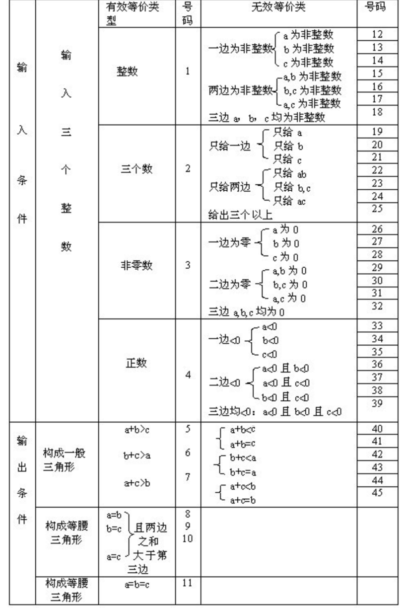

<!-- slide: 18 -->

## 等价类划分法-实例分析

- 覆盖无效等价类的测试用例：
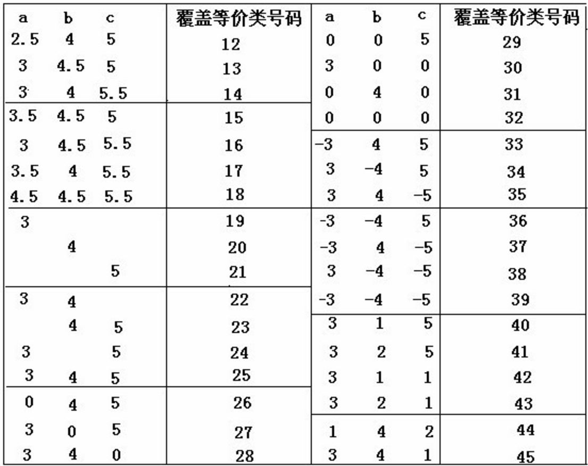

<!-- slide: 19 -->

## 黑盒测试常用方法

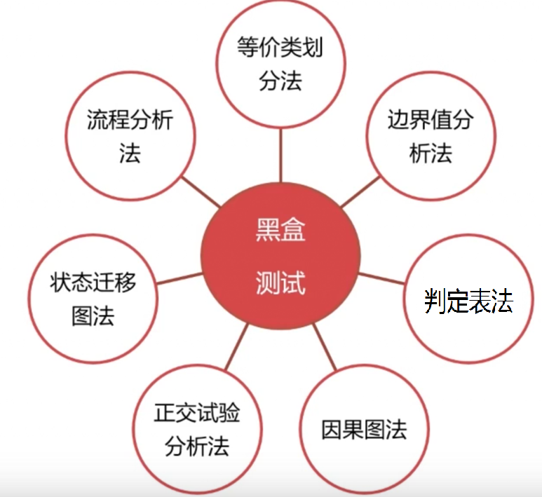
- 19

<!-- slide: 20 -->

## 边界值分析法-定义

- 边界值分析法
  - 边界值分析法就是对输入或输出的边界值进行测试的一种黑盒测试方法。
  - 通常边界值分析法是作为对等价类划分法的补充，这种情况下，其测试用例来自等价类的边界。应当选取正好等于，刚刚大于或刚刚小于边界的值作为测试数据，而不是选取等价类中的典型值或任意值作为测试数据。

<!-- slide: 21 -->

## 边界值分析法-方法

- 根据被测对象的输入（或输出）要求确定边界值
- 选取等于、刚刚大于、刚刚小于边界的值作为测试数据

<!-- slide: 22 -->

## 边界值分析法-假设

- 单缺陷假设
  - 是指“失效极少是由两个或两个以上的缺陷同时发生引起的”。要求测试用例只使一个变量取极值，其他变量均取正常值；
- 多缺陷假设
  - 是指“失效是由两个或两个以上缺陷同时作用引起的”，要求测试用例时同时让多个变量取极值。

<!-- slide: 23 -->

## 边界值分析法-分类

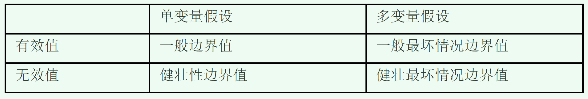

<!-- slide: 24 -->

## 边界值分析法-一般边界值

- 24
- a
- b
- x1
- x2
- c
- d
- n个变量有
- 4n＋1个测试用例
- 仅考虑有效区间单个变量边界值（一般边界值）：用最小值、略高于最小值、正常值、略低于最大值和最大值。
- 考虑两个输入变量的程序
- a≥x1 ≤b
- c≥x2 ≤d

<!-- slide: 25 -->

## 边界值分析法-一般边界值

- 有函数f（x,y,z）,其中x∈[1900,2100],y∈[1,12],z∈[1,31]的。请写出该函数采用基本边界值分析法设计的测试用例？
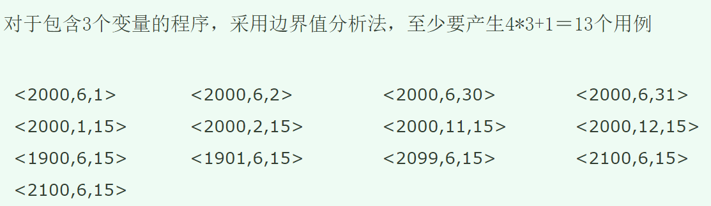

<!-- slide: 26 -->

## 边界值分析法-健壮边界值

- 26
- a
- b
- x1
- x2
- c
- d
- n个变量有
- 6n＋1个测试用例
- 同时考虑有效区间和无效区间单个变量边界值（健壮边界值）：除了最小值、略高于最小值、正常值、略低于最大值、最大值，还要有略超过最大值和略小于最小值的值。

<!-- slide: 27 -->

## 边界值分析法-一般最坏情况边界值

- 27
- a
- b
- x1
- x2
- c
- d
- n个变量有
- 5n个测试用例
- 仅考虑有效区间多个变量边界值同时作用（一般最坏情况边界值）：用各个变量最小值、略高于最小值、正常值、略低于最大值和最大值的笛卡尔积。

<!-- slide: 28 -->

## 边界值分析法-健壮最坏情况边界值

- 28
- a
- b
- x1
- x2
- c
- d
- n个变量有
- 7n个测试用例
- 同时考虑有效区间和无效区间多个变量边界值同时作用（健壮最坏情况边界值）：用各个变量最小值、略高于最小值、正常值、略低于最大值、最大值、略超过最大值和略小于最小值的笛卡尔积。

<!-- slide: 29 -->

## 边界值分析法-实例分析

- 例子
  - 新浪博客图片上传，要求如下：上传文件大小不超过5M
  - 以一般边界值的标准进行边界值分析
- 解：
  - 以一般边界值的标准可选取5M（正好等于）、4.9M（刚刚小于）、3M（正常值）0.1M（略高于最小值）0M（最小值）为边界值来测试

<!-- slide: 30 -->

## 黑盒测试常用方法

- 30

<!-- slide: 31 -->

## 判定表驱动分析方法-定义

- 判定表是分析和表达多逻辑条件下执行不同操作的情况的工具。
  - 在一些数据处理问题中，某些操作依赖多个逻辑条件的取值。处理这类问题的一个非常有力的分析和表达工具是判定表
  - 一些软件的功能需求可用判定表表达得非常清楚，在检验程序的功能时判定表也就成为一个非常有力的工具

> 备注：也就是在这些逻辑条件取值的组合所构成的多种情况下，分别执行不同的操作，获得不同的结果

<!-- slide: 32 -->

## 判定表驱动分析方法-例子

> 备注：也就是在这些逻辑条件取值的组合所构成的多种情况下，分别执行不同的操作，获得不同的结果

<!-- slide: 33 -->

## 判定表驱动分析方法-例子

- 1)条件桩（Condition Stub）：列出了问题的所有条件。通常认为列出的条件的次序无关紧要。
- 2)动作桩（Action Stub）：列出了问题规定可能采取的操作。这些操作的排列顺序没有约束。
- 3)条件项（Condition Entry）：列出针对它左列条件的取值。在所有可能情况下的真假值。
- 4)动作项（Action Entry）：列出在条件项的各种取值情况下应该采取的动作。

> 备注：也就是在这些逻辑条件取值的组合所构成的多种情况下，分别执行不同的操作，获得不同的结果

<!-- slide: 34 -->

## 判定表驱动分析方法-建立步骤

- 判定表的建立通常有以下4步骤：
- 条件桩—列出问题的所有条件
- 条件项—针对条件桩给出的条件列出所有可能的取值
- 动作桩—列出问题规定的可能采取的操作
- 动作项—指出在条件项的各组取值情况下应采取的动作
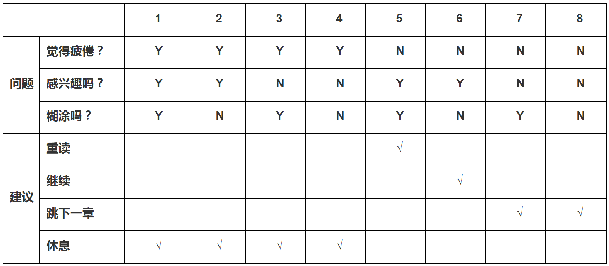

> 备注：也就是在这些逻辑条件取值的组合所构成的多种情况下，分别执行不同的操作，获得不同的结果

<!-- slide: 35 -->

## 判定表驱动分析方法-实例

- 问题要求：”……对功率大于50马力的机器、维修记录不全或已运行10年以上的机器，应给予优先的维修处理……” 。这里假定，“维修记录不全”和“优先维修处理”均已在别处有更严格的定义 。请建立判定表。

> 备注：也就是在这些逻辑条件取值的组合所构成的多种情况下，分别执行不同的操作，获得不同的结果

<!-- slide: 36 -->

## 判定表驱动分析方法-实例

- 问题要求：”……对功率大于50马力的机器、维修记录不全或已运行10年以上的机器，应给予优先的维修处理……” 。这里假定，“维修记录不全”和“优先维修处理”均已在别处有更严格的定义 。请建立判定表。
- 确定规则的个数：这里有3个条件，每个条件有两个取值，故应有2*2*2=8种规则。
- 列出所有的条件茬和动作桩：
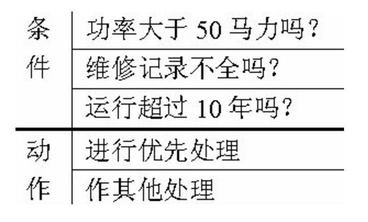

> 备注：也就是在这些逻辑条件取值的组合所构成的多种情况下，分别执行不同的操作，获得不同的结果

<!-- slide: 37 -->

## 判定表驱动分析方法-实例

- 填入条件项。可从最后1行条件项开始，逐行向上填满。如第三行是： Y N Y N Y N Y N，第二行是： Y Y N N Y Y N N等等。
- 填入动作桩和动作顶。这样便得到形如图的初始判定表。
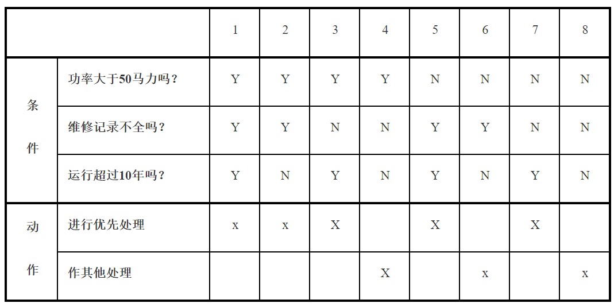

> 备注：也就是在这些逻辑条件取值的组合所构成的多种情况下，分别执行不同的操作，获得不同的结果

<!-- slide: 38 -->

## 黑盒测试常用方法

- 38

<!-- slide: 39 -->

## 因果图法-定义

- 是一种利用图解法分析输入的各种组合情况，从而设计测试用例的方法，它适合于检查程序输入条件的各种组合情况。
- 因果图法产生的背景：
- 等价类划分法和边界值分析方法都是着重考虑输入条件，但没有考虑输入条件的各种组合、输入条件之间的相互制约关系。这样虽然各种输入条件可能出错的情况已经测试到了，但多个输入条件组合起来可能出错的情况却被忽视了。

<!-- slide: 40 -->

## 因果图法-关系

- 4种因果关系
  - 因果图中使用了简单的逻辑符号，以直线联接左右结点。左结点表示输入状态（或称原因），右结点表示输出状态（或称结果）
  - Ci表示原因，通常置于图的左部；ei表示结果，通常在图的右部。Ci和ei均可取值0或1，0表示某状态不出现，1表示某状态出现。
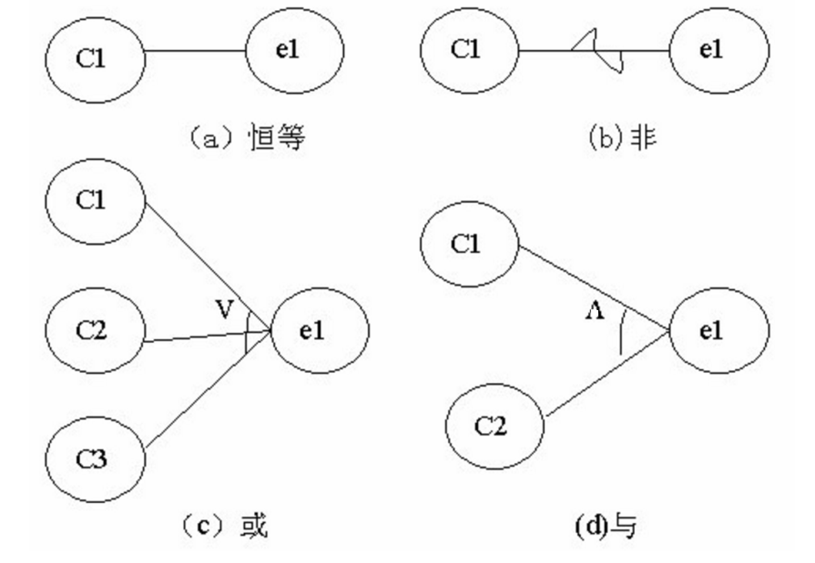

<!-- slide: 41 -->

## 因果图法-关系

- 4种因果关系
  - 恒等：若ci是1，则ei也是1；否则ei为0。
  - 非：若ci是1，则ei是0；否则ei是1。
  - 或：若c1或c2或c3是1，则ei是1；否则ei为0。“或”可有任意个输入。
  - 与：若c1和c2都是1，则ei为1；否则ei为0。“与”也可有任意个输入。

<!-- slide: 42 -->

## 因果图法-约束

- 输入之间4种约束（输入状态相互之间还可能存在某些依赖关系，称为约束。例如, 某些输入条件本身不可能同时出现。在因果图中,用特定的符号标明这些约束。）
  - E约束（异）：a和b中至多有一个可能为1，即a和b不能同时为1。
  - I约束（或）：a、b和c中至少有一个必须是1，即 a、b 和c不能同时为0。
  - O约束（唯一）；a和b必须有一个，且仅有1个为1。
  - R约束（要求）：a是1时，b必须是1，即不可能a是1时b是0。
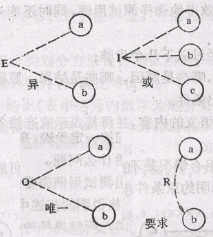

<!-- slide: 43 -->

## 因果图法-约束

- 输出之间1种约束（输出状态之间也往往存在约束。）
  - 输出条件的约束只有M约束（强制）：若结果a是1，则结果b强制为0。
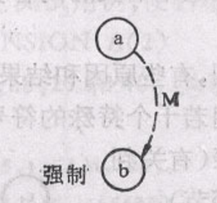

<!-- slide: 44 -->

## 因果图法步骤

- 分析软件规格说明描述中, 哪些是原因(即输入条件或输入条件的等价类),哪些是结果(即输出条件), 并给每个原因和结果赋予一个标识符。
- 分析软件规格说明描述中的语义，找出原因与结果之间, 原因与原因之间对应的关系，根据这些关系,画出因果图。
- 由于语法或环境限制, 有些原因与原因之间,原因与结果之间的组合情况不可能出现，为表明这些特殊情况, 在因果图上用一些记号表明约束或限制条件。
- 把因果图转换为判定表。
- 把判定表的每一列拿出来作为依据,设计测试用例。

<!-- slide: 45 -->

## 因果图法-实例

- 某软件规格说明书包含这样的要求：第一个字符必须是#或*，第二个字符必须是一个数字，在此情况下进行文件的修改。但如果第一个字符不正确，则给出信息L；如果第二个字符不是数字，则给出信息M。
- 解题步骤
- （1）分析程序的规格说明，列出原因和结果。
- （2）找出原因与结果之间的因果关系、原因与原因之间的约束关系，画出因果图。
- （3）将因果图转换成决策表。
- （4）根据（3）中的决策表，设计测试用例的输入数据和预期输出。

> 备注：因果图法是一种比较高效的测试用例设计方法，它使用输入输出数据之间的因果关系来有效的降低了测试用例的数目

<!-- slide: 46 -->

## 因果分析

- 原因：
  - c1——第一个字符是#
  - c2——第一个字符是*
  - c3——第二个字符是一数字
- 结果：
  - e1——给出信息L
  - e2——修改文件
  - e3——给出信息M

<!-- slide: 47 -->

## 因果分析

- （1）分析程序规格说明中的原因和结果：
- （2）画出因果图（编号为11的中间结点是导出结果的进一步原因）：

| 原因 | 结果 |
|---|---|
| c1：第一列字符是# | e1：给出信息L |
| c2：第一列字符是* | e2：修改文件 |
| c3：第二列字符是一个数字 | e3：给出信息M |

- c1
- c2
- c3
- e1
- 11
- e2
- e3
- ～
- ∨
- E
- ～
- ∧
- 不可能同时存在

<!-- slide: 48 -->

## 由因果图建立的判定表

- （3）将因果图转换成如下所示的判定表：

|  | 1 | 2 | 3 | 4 | 5 | 6 | 7 | 8 |
|---|---|---|---|---|---|---|---|---|
| 条件： C1 C2 C3 11 |  1 1 1 |  1 1 0 |  1 0 1 1 |  1 0 0 1 |  0 1 1 1 |  0 1 0 1 |  0 0 1 0 |  0 0 0 0 |
| 动作： e1 e2 e3 不可能 |     √ |     √ |   √ |    √ |   √ |    √ |  √ |  √  √ |
| 测试用例 |  |  | #3 | #A | *6 | *B | A1 | GT |

- 规则
- 选项

> 备注：决策表通过增加了不可能选项，来否决现实中不可能的情况。

<!-- slide: 49 -->

## 从判定表中得到测试用例

- （4）根据决策表中的每一列设计测试用例：

| 测试用例编号 | 输入数据 | 预期输出 |
|---|---|---|
| 1 | #3 | 修改文件 |
| 2 | #A | 给出信息M |
| 3 | *6 | 修改文件 |
| 4 | *B | 给出信息M |
| 5 | A1 | 给出信息N |
| 6 | GT | 给出信息N和信息M |

<!-- slide: 50 -->

## 黑盒测试-总结与讨论

- 50

<!-- slide: 51 -->

## 白盒测试

- 51
- 已知产品内部工作流程，通过测试来检测产品的内部动作是否按照详细设计规格说明的规定正常进行，而不管它的功能；
- 也称为结构测试或逻辑驱动测试；
- 目标是对所有逻辑路径进行测试，穷举路径；
- 依据详细设计规范；
- 一种验证技术。

<!-- slide: 52 -->

## 白盒测试

- 52

<!-- slide: 53 -->

## 白盒测试－逻辑路径的数量

- 53
- 程序的执行序列(逻辑路径)的数目是庞大的，简单的重复就有可能使执行序列的数目增大到天文数字。
- 例子：
- For (int i =0;i<n;++i)
- {
- if (a.get(i)==b.get(i))
- x[i]=x[i]+100;
- else
- x[i]=x[i]/2;
- }
- 解：
- 可能的执行序列/路径数是2n
- 当n=200时，执行序列/路径数是???

<!-- slide: 54 -->

## 白盒测试－基本覆盖

- 54
- 基于控制流的测试
  - 语句覆盖
  - 分支覆盖
  - 条件覆盖
  - 条件组合覆盖
  - 基本路径覆盖
  - 循环覆盖
- 数据流覆盖
- 变元覆盖(mutation coverage)

<!-- slide: 55 -->

## 白盒测试－控制流图

- 55
- 一个段是一个或多个无条件连续执行的语句。
- 一个段在控制流图中用一个结点表示，结点可以用任何方便的形式命名。
- 一个控制条件转移是一个分支，一个分支段在控制流图中用一个输出边表示。
- 一个程序的入口点用入口结点表示，它是一个没有输入边的结点，一个程序的出口点用出口结点表示，它是一个没有输出边的结点。

<!-- slide: 56 -->

## 白盒测试－程序实例

- 56
- void  DoWork(int x,int y,int z)
- {
- int  k=0,j=0;
- if((x>3)&&(z<10))
- {
- k=x*y-1;
- j=sqrt(k);
- }
- if((x= =4)||(y>5))
- {
- j=x*y+10;
- }
- j=j%3;
- }

<!-- slide: 57 -->

## 白盒测试－控制流图例

- 57
- A
- A: 1,2,3
- B: 4
- C: 5, 6, 7, 8
- D: 9
- E: 10, 11, 12
- F: 13, 14
- B
- D
- F
- E
- C
- void  DoWork(int x,int y,int z)
- {
- int  k=0,j=0;
- if((x>3)&&(z<10))
- {
- k=x*y-1;
- j=sqrt(k);
- }
- if((x= =4)||(y>5))
- {
- j=x*y+10;
- }
- j=j%3;
- }

<!-- slide: 58 -->

## 白盒测试－语句覆盖

- 58
- 程序中每条语句至少被执行一次
- C1覆盖、行覆盖、段覆盖、基本块覆盖
- 语句覆盖的盲点(循环;条件)
- 语句覆盖是最起码的测试要求

<!-- slide: 59 -->

## 白盒测试－程序实例

- 59
- void  DoWork(int x,int y,int z)
- {
- int  k=0,j=0;
- if((x>3)&&(z<10))
- {
- k=x*y-1;
- j=sqrt(k);
- }
- if((x==4)||(y>5))
- {
- j=x*y+10;
- }
- j=j%3;
- }

<!-- slide: 60 -->

## 白盒测试－语句覆盖实例

- void  DoWork(int x,int y,int z)
- {
- int  k=0,j=0;
- if((x>3)&&(z<10))
- {
- k=x*y-1;
- j=sqrt(k);
- }
- if((x==4)||(y>5))
- {
- j=x*y+10;
- }
- j=j%3;
- }
- 60
- 用例
  - { x=4、y=5、z=5}
- 执行路径
  - ABCDEF
- A
- B
- D
- F
- E
- C

<!-- slide: 61 -->

## 白盒测试－分支覆盖

- 61
- 分支覆盖就是设计若干个测试用例，运行被测程序，使得程序中每个判断的取真分支和取假分支至少经历一次。分支覆盖又称为判定覆盖、C2覆盖、决策覆盖。
- 分支覆盖的盲点
  - 短路估值使分支覆盖不必考虑所有条件
  - 忽略了从复合谓词引出的隐含路径
  - 分支覆盖不能保证所有入口－出口路径都被执行

<!-- slide: 62 -->

## 白盒测试－程序实例

- 62
- void  DoWork(int x,int y,int z)
- {
- int  k=0,j=0;
- if((x>3)&&(z<10))
- {
- k=x*y-1;
- j=sqrt(k);
- }
- if((x= =4)||(y>5))
- {
- j=x*y+10;
- }
- j=j%3;
- }

<!-- slide: 63 -->

## 白盒测试－分支覆盖实例

- void  DoWork(int x,int y,int z)
- {
- int  k=0,j=0;
- if((x>3)&&(z<10))
- {
- k=x*y-1;
- j=sqrt(k);
- }
- if((x= =4)||(y>5))
- {
- j=x*y+10;
- }
- j=j%3;
- }
- 63
- 用例
  - { x=2、y=3、z=5}
  - { x=4、y=5、z=5}
- 执行路径
  - ABDEF
  - ABDF
- A
- B
- D
- F
- E
- C
- 1
- 2

<!-- slide: 64 -->

## 白盒测试－条件覆盖

- 64
- 条件覆盖就是设计若干个测试用例，运行被测程序，使得程序中每个判断的每个条件的可能取值至少执行一次。
- 不要求测试所有可能的分支

<!-- slide: 65 -->

## 白盒测试－条件覆盖实例

- 65
- 用例
  - { x=4、y=5、z=15}
  - { x=2、y=6、z=5}
- 执行路径
  - ABDF
  - ABCDEF
- A
- B
- D
- F
- E
- C
- 1
- 2
- void  DoWork(int x,int y,int z)
- {
- int  k=0,j=0;
- if((x>3)&&(z<10))
- {
- k=x*y-1;
- j=sqrt(k);
- }
- if((x= =4)||(y>5))
- {
- j=x*y+10;
- }
- j=j%3;
- }

<!-- slide: 66 -->

## 白盒测试－条件组合覆盖

- 66
- 判定－条件覆盖就是设计足够的测试用例，使得判断中每个条件的所有可能取值至少执行一次，同时每个判断所有条件的各种组合情况至少执行一次。
- 达到了条件组合覆盖，所有的语句、分支和条件都将覆盖，但不保证路径覆盖。
- 在实际测试中，由于谓词表达式的短路估值和排它性条件使得达到所有条件组合不可能。

<!-- slide: 67 -->

## 白盒测试－条件组合覆盖实例

- 67
- 用例
  - { x=4、y=6、z=5}
  - { x=4、y=5、z=15}
  - { x=2、y=6、z=5}
  - { x=2、y=5、z=15}
- 执行路径
  - ABCDEF
  - ABDEF
  - ABDEF
  - ABDF
- A
- B
- D
- F
- E
- C
- 1
- 4
- 2
- 3
- void  DoWork(int x,int y,int z)
- {
- int  k=0,j=0;
- if((x>3)&&(z<10))
- {
- k=x*y-1;
- j=sqrt(k);
- }
- if((x= =4)||(y>5))
- {
- j=x*y+10;
- }
- j=j%3;
- }

<!-- slide: 68 -->

## 白盒测试－基本路径覆盖

- 68
- 圈复杂度C=e-n+2
- 基本路径覆盖要求测试C条不同的入口－出口路径
- 在某些程序中，分支覆盖可在少于C条路径的情况下获得
- 基本路径覆盖可能既没有获得语句覆盖也没有获得分支覆盖。

<!-- slide: 69 -->

## 白盒测试－基本路径覆盖实例

- 69
- 圈复杂度
  - C=7-6+2=3
- 用例
  - { x=4、y=6、z=5}
  - { x=4、y=5、z=15}
  - { x=2、y=5、z=15}
- 执行路径
  - ABCDEF
  - ABDEF
  - ABDF
- A
- B
- D
- F
- E
- C
- 1
- 3
- 2

<!-- slide: 70 -->

## 白盒测试－循环覆盖

- 70
- 简单循环
- 嵌套循环
- 顺序循环
- 面条循环

<!-- slide: 71 -->

## 白盒测试－简单循环的测试

- n 是循环的最大数
  - 跳过循环
  - 通过循环1次
  - 通过循环2次
  - 通过循环m次, m<n
  - 通过循环n-1, n次

<!-- slide: 72 -->

## 白盒测试－嵌套循环的测试

- 从最内层循环开始, 设置所有的外层循环叠代参数为最小值
- 保持所有外层循环叠代参数为最小值，测试最内层循环参数为min+1, 典型, max-1, max值
- 向外移动一层循环, 所有内层循环叠代参数为典型值, 所有外层循环叠代参数为最小值,测试循环参数为min+1, 典型, max-1, max值
- 重复步骤3 , 直到最外层循环

<!-- slide: 73 -->

## 白盒测试－顺序循环的测试

- 当顺序循环相互独立时, 将每个循环当作简单循环进行测试
- 当顺序循环不独立时, 当作嵌套循环进行测试

<!-- slide: 74 -->

## 白盒测试－数据流覆盖（了解）

- 74
- 通过一定的覆盖准则检查程序中每个数据对象的每次定义、使用和消除。
- 数据流模型(DUK)
- 数据流覆盖策略

<!-- slide: 75 -->

## 白盒测试－变元覆盖（了解）

- 75
- 代码变异测试
- 测试覆盖实现中指定的变体，如测试探测到变元，则变体“退役”，如测试探测不到变元，则修正测试包。
- 变元是指为程序植入小的变化，一般是常出现的错误，如将>=改写成>。
- 用于检查系统的容错能力和测试套件的充分性。

<!-- slide: 76 -->

## 白盒测试－变元覆盖实例

- 76
- void  Max( int m, int n)
- {
- if (m>n)
- {
- return m;
- }
- else
- {
- return n;
- }
- }

<!-- slide: 77 -->

## 白盒测试－变元覆盖实例

- 77
- 测试用例
  - 输入: M=1, N=2
  - 返回: 2
- 测试结果见右表
- 增加测试用例
  - 输入: M=2, N=1
  - 可测试出if M=N, 但测不出if M>=N
- 没有用例能测出if M>=N

| Mutants | Outputs | Comparison |
|---|---|---|
| if M>=N | 2 | live |
| if M<N | 1 | dead |
| if M<=N | 1 | dead |
| if M=N | 2 | live |
| if M<>N | 1 | dead |

<!-- slide: 78 -->

## 白盒测试－覆盖分析器

- 78
- 覆盖分析器是分析测试覆盖率的工具
- 覆盖分析器工作原理
  - 通过对源代码的词法分析，插入可跟踪代码，再编译连接；
  - 当装配过可跟踪代码的软件执行时，就会产生一个跟踪文件；
  - 测试完成后，利用跟踪文件生成覆盖报告。

<!-- slide: 79 -->

## 白盒测试－覆盖率的作用

- 79
- 不可执行的路径或条件
- 不可能到达或冗余的代码
- 不充分的测试用例集

<!-- slide: 80 -->

## 白盒测试－覆盖率与缺陷查找

- 80
- 覆盖与发现缺陷之间没有必然联系
- 达到85% 容易, 达到100% 困难
  - 不可到达的代码(控制流无法到达)
  - 复杂序列(很难使控制流到达)
- 获得任何覆盖目标都不意味着没有缺陷
  - 需求相关的缺陷
  - 丢失的代码
  - 中断相关的缺陷
  - 兼容性/配置相关的缺陷

<!-- slide: 81 -->

## 白盒测试－总结与讨论

- 81
- 81
- RESULTANT
- OUTPUTS
- INTERNAL
- BEHAVIOR
- DESIRED
- OUTPUT
- SOFTWARE
- DESIGN
- “WHITE BOX” TESTING
- SELECTED
- INPUTS

<!-- slide: 82 -->

## 比较黑盒测试与白盒测试

- 黑盒测试方法技术相对要求低，方法简单有效，可以整体测试系统的行为，可以从头到尾（end-to-end）进行数据完整性测试。黑盒测试方法适合系统的功能测试、易用性测试，也适合和用户共同进行验收测试、软件确认测试。黑盒测试方法不适合单元测试、集成测试，而且测试结果的覆盖度不容易度量，其测试的潜在风险比较高。

<!-- slide: 83 -->

## 比较黑盒测试与白盒测试

- 由于白盒测试方法，已知产品的内部工作过程，针对性很强，可以对程序每一行语句、每一个条件或分支进行测试，测试效率比较高，而且可以清楚已测试的覆盖程度。如果时间足够多，可以保证所有的语句和条件得到测试，测试的覆盖程度达到很高。白盒测试方法所以适合单元测试、集成测试，而不适合系统测试。白盒测试方法准备的时间很长，如果要覆盖全部程序语句、分支的测试，一般花费比编程更长的时间。
- 白盒测试方法所要求的技术也较高，相应的测试成本要大。对于一个应用的系统，程序的路径数可能是一个天文数字，即使借助一些测试工具，白盒测试法也不可能进行穷举测试，企图遍历所有的路径往往是做不到的。即使，穷举路径测试，也不能查出程序违反了设计规范的地方，不能发现程序中已实现但不是用户所需要的功能，可能发现不了一些与数据相关的错误或用户操作行为的缺陷。所以白盒测试方法也存在一定的局限性。

<!-- slide: 84 -->

## 平衡黑盒与白盒测试

- 84
- 从原理上讲，功能(黑盒)测试能检测出所有错误，但要花费无限的时间。结构(白盒)测试基本上是有限的，但即使是全部执行也不能测试出全部的错误。某种程度上讲，测试的技巧就是在结构(白盒)测试与功能(黑盒)测试之间如何进行选择。
- ----- Beizer

<!-- slide: 85 -->

## 按方法（手段）分类

<!-- slide: 86 -->

## 静态测试－定义

- 86
- 静态测试是不动态执行程序代码而寻找程序代码中可能存在的缺陷或评估程序代码的过程。
  - 因此，静态测试常称为“分析”，静态分析是对被测对象进行特性分析的一些方法的总称。

<!-- slide: 87 -->

## 静态测试－特征

- 87
- 不动态运行程序
- 充分发挥人的思维优势
- 易开展，不需特别条件，但可能非常耗时
- 对测试人员要求较高，要有编程经验，需要有知识和经验的积累，能发现问题本身而非征兆

<!-- slide: 88 -->

## 静态测试－内容

- 88
- 主要包括：各阶段的文档评审、代码检查、代码度量等
  - 对象：程序代码、界面或文档中可能存在的错误的过程。

<!-- slide: 89 -->

## 静态测试－方法

- 89
- 人工检测（又称为评审）
  - 人工检测是指不依靠计算机而完全靠人工审查或评审软件。人工检测这种方法可以有效地发现逻辑设计和编码错误，发现计算机不易发现的问题。
- 计算机辅助静态分析
  - 利用静态分析工具对被测程序进行特性分析，从程序中提取一些信息，以便检查程序逻辑的各种缺陷和可疑的程序构造。如用错的局部变量和全局变量，不匹配的参数，潜在的死循环等。静态分析中还可以用符号代替数值求得程序结果，阻便对程序进行运算规律的检验。

<!-- slide: 90 -->

## 静态测试－方法-评审

- 90
- 评审是对所有人工静态分析和具体文档检查技术的通称。
- 评审对象：
  - 开发项目中所有文档及项目外有价值的文档。如：合同、需求定义、设计规格说明、程序代码、测试计划和手册等。
- 评审是一种保证质量的方法，积极作用有：
  - 可降低消除缺陷的成本              -可减少系统安装后的变更申请
  - 可缩短开发时间                         -降低系统运行故障率
  - 可减少动态测试时间和成本      -检查团对活动，改进团队成员的工作方法

<!-- slide: 91 -->

## 静态测试－方法-评审

- 91
- 评审潜在的问题
  - 注意不要使作者感到严格检查是针对他人而非他提交的文档。
- 评审的成本和收益
  - 评审的成本大概占整个开发预算的10%~15%,包括评审过程、评审分析和过程改进的工作量。估计节约的成本约为14%~25%。
  - 如评审有效，应能发现70%以上的文档缺陷。
- 能促使评审成功的因素
  - 每次评审都事先定于一个明确的目标；
  - 根据每个人的知识和技能水平选择合适的评审参与者。

<!-- slide: 92 -->

## 静态测试－方法-评审

- 92

<!-- slide: 93 -->

## 静态测试－方法-评审

- 93

<!-- slide: 94 -->

## 静态测试－方法-正式评审

- 正式评审过程（参考：[IEEE 1028]）
  - 评审活动分6个步骤：计划、概述、准备、检查（评审会议）、返工和跟踪。
- 计划
  - 要评审的文档；评审技术；估算评审工作量；评审检查点；组建评审团队；确保文档处于一个可评审状态；会议的时间和地点（如有的话）等。
- 概述（开工会）
  - 为参加评审的人提供所有必需信息。
- 准备
  - 评审人必须各自为评审会议做准备。
- 94

<!-- slide: 95 -->

## 静态测试－方法-正式评审

- 检查（评审会议）
  - 会议应有主持人。
  - 目的除了发现缺陷外，还包括判断评审对象是否满足需求以及是否符合标准。
  - 评审会议的一些通用准则：
    - 评审会议的时间限制在2小时内；
    - 如有评审人缺席或准备不充分，主持人有权取消或中止会议；
    - 检查对象是被提交的文档，而非作者（评审人必须注意他们的言语及表达方式，作者不应为自己或文档辩护）
    - 主持人不应同时作为评审人；
    - 不讨论常见的风格问题（方针之外的问题）；
    - 开发方案和对应的讨论不是评审团队的任务；
- 95

<!-- slide: 96 -->

## 静态测试－方法-正式评审

    - 每个评审人员必须有机会充分表达他们的论点；
    - 会议纪要必须完整表达评审人的意见；
    - 问题不应以命令的形式写给作者；
    - 问题必须划分为不同的权重：严重缺陷、重要缺陷、一般缺陷、好的；
    - 评审团队应对评审对象给出最后意见：接受（无需修改）有条件接受（需修改，但不需进一步评审）不接受（需进一步评审或其他的检查）
    - 要有会议纪要及总结（包括会议中讨论的问题或发现问题的列表，评审总结报告等。）
- 返工（经理决定接受评审团队意见修正缺陷，或选择另外的方法（经理必须对此全权负责））
- 跟踪（专人跟踪缺陷的修改。）
- 96

<!-- slide: 97 -->

## 静态测试－方法-正式评审

- 正式评审角色和职责
  - 经理
    - 确保文档、必需的资源可用，同时选择评审人；
    - 经理不一定得是管理层人员（导致大家“人心恍惚”）
  - 主持人
    - 管理评审有关的工作：计划、准备并保证评审有序进行且满足它的目标，收集评审数据、发布评审报告等。
  - 作者
    - 文档的创建者，如为多人，应是主要负责人。
    - 不要把针对文档的问题看作是对其人的批评，作者必须明白评审只是用来帮助改进产品
- 97

<!-- slide: 98 -->

## 静态测试－方法-正式评审

- 评审角色和职责
  - 评审人
    - 通常最多5个。他们应能识别并描述评审对象中存在的问题。为保证有效的覆盖率，可给评审人分配制定的评审主题。
  - 记录员
    - 记录所有的发现：问题、采取的措施、决定和建议等。文字应简短和准确。
    - 最好由文档作者来担当。
- 98

<!-- slide: 99 -->

## 静态测试－方法-评审

- 评审失败的可能原因
  - 需要的人没空或不具备必须的资格和技术技能。
  - 管理层在资源计划时不准确的估计
  - 准备不足。
  - 文档不足
  - 缺少管理层支持
- 99

<!-- slide: 100 -->

## 静态测试-代码检查

- 代码检查
  - 主要检查代码和设计的一致性，代码对标准的遵循、可读性，代码的逻辑表达的正确性，代码结构的合理性等方面；以期发现违背编程标准或编程风格问题，程序中不安全、不明确和模糊部分，程序中不可移植部分等。
  - 代码检查在编译和动态测试前进行，在检查前，应准备好需求描述文档、程序设计文档、程序的源代码清单、代码编码标准和代码缺陷检查表等。
  - 方法包括：
    - 桌面检查、代码审查、代码走查等
- 100

<!-- slide: 101 -->

## 静态测试-代码检查

- 桌面检查（Desk Checking）
  - 由程序员自查。程序员在程序通过编译之后，进行单元测试设计之前，对源程序代码进行分析，检验，并补充相关文档。检查项目有：
    - 变量的问题（类型，引用，临时变量，局部、全局变量）
    - 标号的问题
    - 子程序，宏，函数的问题
    - 等值性检查
    - 常量
    - 标准，控制流，规格说明，风格，补充文档等
- 这种桌前检查，由于程序员熟悉自己的程序和自身的程序设计风格，可以节省很多的检查时间，但应避免主观片面性。
- 101

<!-- slide: 102 -->

## 静态测试-代码检查

- 代码审查（Code Reading Review）
  - 代码审查是由若干程序员和测试员组成一个会审小组，通过阅读、讨论和争议，对程序进行静态分析的过程。 代码审查分两步：
  - 第一步，小组负责人提前把设计规格说明书、控制流程图、程序文本及有关要求、规范等分发给小组成员，作为评审的依据。小组成员在充分阅读这些材料之后，进入审查的第二步。
  - 第二步：召开程序审查会。在会上，首先由程序员逐句讲解程序的逻辑。在此过程中，程序员或其他小组成员可以提出问题，展开讨论，审查错误是否存在。实践表明，程序员在讲解过程中能发现许多原来自己没有发现的错误，而讨论和争议则促进了问题的暴露。
- 102

<!-- slide: 103 -->

## 静态测试-代码检查

- 代码审查（Code Reading Review）
- 103
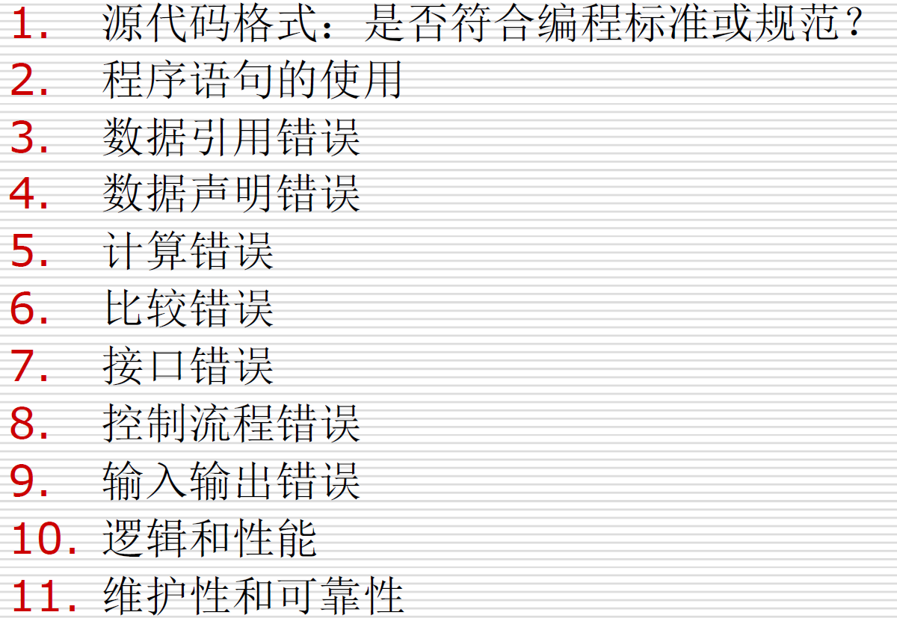

<!-- slide: 104 -->

## 静态测试-代码检查

- 代码走查（Walkthroughs）
  - 走查与代码会审基本相同，其过程分为两步。
    - 第一步也把材料先发给走查小组每个成员，让他们认真研究程序，然后再开会。开会的程序与代码会审不同，不是简单地读程序和对照错误检查表进行检查，而是让与会者“充当”计算机。即首先由测试组成员为被测程序准备一批有代表性的测试用例，提交给走查小组。走查小组开会，集体扮演计算机角色，让测试用例沿程序的逻辑运行一遍，随时记录程序的踪迹，供分析和讨论用。
    - 第二步 人们借助于测试用例的媒介作用，对程序的逻辑和功能提出各种疑问，结合问题开展热烈的讨论和争议，能够发现更多的问题。
- 104

<!-- slide: 105 -->

## 静态测试-代码检查-实例

- #include <stdio.h>
- Max(float x, float y)
- {
- float z;
- z=x>y?x:y;
- return(z);
- }
- Main()
- {
- float a, b;
- int c;
- scanf(“%f, %f”&a,&b);
- c=max(a,b);
- printf(“Max is %d\n”, c);
- }
- 105
- 必须修改的问题：
- 程序没有注释。注释是程序中非常重要的组成部分，一般占到总行书的1/4左右。程序开发出来不仅是给程序员看得，其他程序员和测试人员也要看得。有了注释，别人就能很快地了解程序实现的功能。注释应该包含作者，版本号、创建日期等，以及主要功能模块的含义。
- 子函数max没有返回值的类型。由于类型为单精度，我们可以在max()前面加一个float类型声明。
- 精度丢失问题。注意“c=max(a,b)”语句，我们知道c的类型为整型int ，而max(a,b)的返回值z为单精度float， 将单精度的数赋值给一个整型的数，c语言的编译器会自动地进行类型转换，将小数部分去掉，比如z=2.5，赋给c则为2，最后输出的结果就不是a和b 中的大数，而是大数的整数部分。

<!-- slide: 106 -->

## 静态测试-代码检查-实例

- #include <stdio.h>
- Max(float x, float y)
- {
- float z;
- z=x>y?x:y;
- return(z);
- }
- Main()
- {
- float a, b;
- int c;
- scanf(“%f, %f”&a,&b);
- c=max(a,b);
- printf(“Max is %d\n”, c);
- }
- 106
- 建议修改的问题：
- Main函数没有返回值类型和参数列表。虽然main函数没有返回值和参数，但是我们组后将其改为void main(void)，来表明main函数的返回值和参数都为空，因为在有的白盒测试工具的编码规范中，如果不写void会认为是个错误。
- 一行代码只定义一个变量。
- 程序适当加些空行。空行不占内存，会使程序看起来更清晰。

<!-- slide: 107 -->

## 静态测试-总结与讨论

- 107

<!-- slide: 108 -->

## 动态测试－定义

- 108
- 动态测试是通过观察代码运行时的动作，来提供执行跟踪、时间分析，以及测试覆盖度方面的信息。动态测试通过真正运行程序发现错误。通过有效的测试用例，对应的输入输出关系来分析被测程序的运行情况。
- 所以判断一个测试属于动态测试还是静态的，唯一的标准就是看是否运行程序。

<!-- slide: 109 -->

## 动态、静态、黑盒、白盒的关系

- 109
- 黑盒测试有可能是动态测试（运行程序，只看输入和输出），也有可能是静态测试（不运行程序，只是查看界面）
- 白盒测试有可能是动态测试（运行程序，并分析代码结构），也有可能是静态测试（不运行程序，只是静态查看代码）
- 动态测试有可能是黑盒测试（运行程序，只看输入和输出），也有可能是白盒测试（运行程序，并分析代码结构）
- 静态测试有可能是黑盒测试（不运行程序，只是查看界面），也有可能是白盒测试（不运行程序，只是静态查看代码）

<!-- slide: 110 -->

## 动态测试和静态测试区别

- 110

| 静态测试 | 动态测试 |
|---|---|
| 不运行程序 | 运行程序 |
| 确认 | 验证 |
| 防止缺陷 | 找到和修复缺陷 |
| 给出代码和文档的评估 | 给出系统的bug和瓶颈 |
| 检查列表 | 测试用例 |
| 找到缺陷的花费小 | 找到和修复缺陷的花费大 |
| 在软件工程早期执行 | 在软件开发后执行 |
| 需要开会 | 少量开会 |

<!-- slide: 111 -->

## 动态测试－平衡动态与静态测试

- 111
- S
- S
- S
- S
- S
- S
- S
- S
- S
- S
- S
- S
- S
- S
- D
- D
- D
- D
- D
- D
- D
- D
- D
- D
- S
- S
- D
- D
- D
- D
- D
- D
- D
- D
- D
- D
- D
- D
- D
- D
- D
- D
- D
- D
- D
- S
- S
- S
- S
- S
- 许多动态测试通常会遗留下来的缺陷
- 可以通过早期的静态测试发现
- 动态测试时发现的缺陷
- 静态测试时发现的缺陷

<!-- slide: 112 -->

## 按方法（手段）分类

<!-- slide: 113 -->

## 手工测试-定义

- 113
- 手工测试就是由人去一个一个的输入用例，然后观察结果，和机器测试相对应，属于比较原始但是必须的一个步骤。

<!-- slide: 114 -->

## 手工测试-四种情形

- 114
- 如果某项测试工作难以采用自动测试完成(甚至根本无法采用自动测试完成)，例如：在程序执行的关键时刻，我们需要从物理上断开一个网络连接，其目的在于验证程序处理错误条件的能力，此时我们就可以采用手工测试。
- 对于某些测试，如果我们采用自动测试，可能导致投资回报率(return on investment，ROI)过低。例如，如果我们需要验证一个图形用户界面组件确实能够应用于某个软件产品中的某项功能的开发，而这项功能又将被其他功能替换。此时，假设使用手工测试方法只需要花费10秒时间，但是，如果使用自动测试，却需要花费几个小时甚至几天的时间编写测试，并且还要维护测试，那么在这种情况下，我们显然应该使用手工测试来解决问题。
- 需要使用自动测试，但是时间不允许进行自动测试的场合。
- 需要使用自动测试，但是开发团队当前技术水平尚不足以支持自动测试的场合。

<!-- slide: 115 -->

## 自动化测试-定义

- 115
- 自动化测试就是通过测试工具或其他手段，按照测试工程师的预定计划对软件产品进行自动的测试。
- 它是软件测试的一个重要的组成部分，它能够完成许多手工无法完成或者难以实现的一些测试工作。
- 正确、合理地实施自动化测试，能够快速、全面地对软件进行测试，从而提高软件质量，节省经费，缩短产品发布周期。

<!-- slide: 116 -->

## 软件测试方法－总结与讨论

- 116

<!-- slide: 117 -->

- 117
- 谢  谢！
- 华南理工大学 计算机科学与工程学院
- 广州市番禺区大学城华南理工大学
- 邮编：510006
- 电子邮件：nieyongwei@scut.edu.cn
