# 软件测评-3-单元测试与Google Test框架

<!-- slide: 1 -->

- 1
- 2010年度广州市电子商务发展专项资金
- 扶持项目
- 软件测试与质量保障
- 华南理工大学计算机科学与工程学院
- 聂勇伟 副教授
- nieyongwei@scut.edu.cn
- 第三章 – 单元测试与Google Test框架

<!-- slide: 2 -->

## 课程回顾

- 软件测试
- 基本概念：重要意义，法则
- 方法（手段）：静态、动态、黑盒、白盒 …
- 级别（阶段）：单元、集成、确认、系统、验收
- 过程：计划、设计、执行、评估
- 自动化

<!-- slide: 3 -->

## 回顾 — 软件测评技术 — 级别

<!-- slide: 4 -->

## 回顾－过程

- 4
- 软件项目测试
- 单元测试
- 计划
- 设计
- 评估
- 需求分析
- 用例设计
- 脚本开发
- 任务1
- 任务2
- 级别
- 阶段
- 活动
- 任务
- …
- …
- 任务n
- 集成测试
- 确认测试
- 系统测试
- 验收测试
- 执行
- …
- …
- …
- …
- …

<!-- slide: 5 -->

## 回顾－测试级别

- S
- R
- D
- C
- U
- I
- V
- ST
- System Engineering 系统工程
- Requirements 需求
- Design 设计
- Code 编码
- Unit Test 单元测试
- Integration Test 集成测试
- Validation Test 确认测试
- System Test 系统测试

<!-- slide: 6 -->

## 回顾－组织

- 6
- 单元测试
- 集成测试
- 确认测试
- 系统测试
- 验收测试
- 内部测试人员
- 独立测试小组
- 独立测试机构
- SQA

- 定义测试标准和质量控制过程

<!-- slide: 7 -->

## 回顾－软件开发与测试过程

<!-- slide: 8 -->

## 重点－单元测试

- 对象－模块
- 依据－软件设计规格说明
- 方法－白盒为主

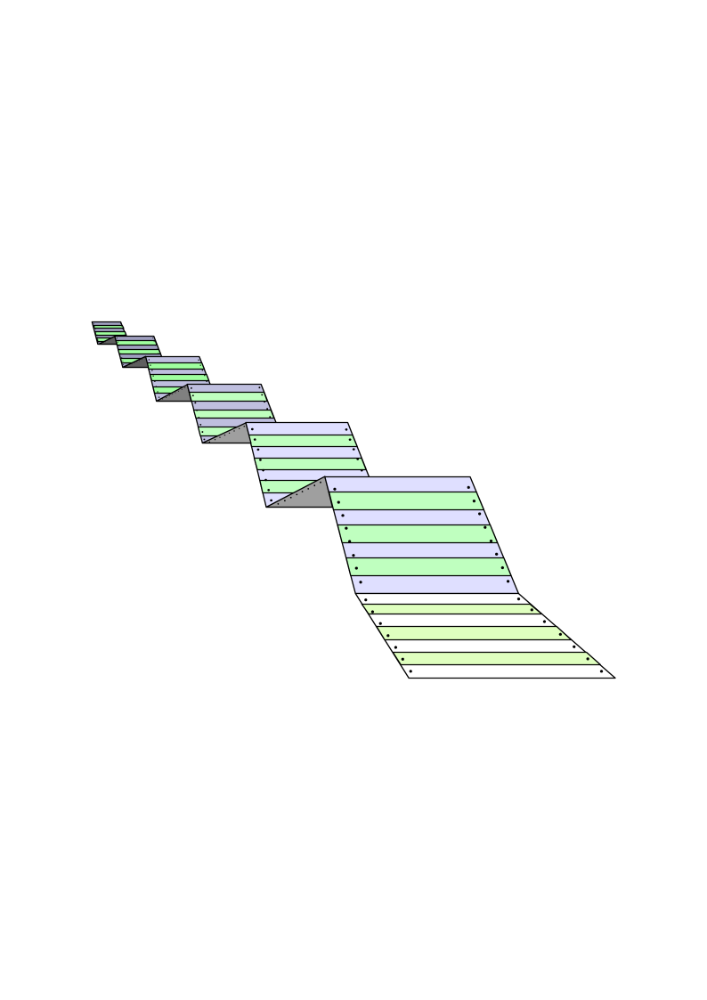

- 被测模块
- 测试用例
- 结果
- 测试工程师

<!-- slide: 9 -->

## 单元测试－测试准备

- 要求的文档(软件设计规格说明)可提交
- 软件单元源程序符合规格要求并已无错误地通过编译或汇编
- 被测试软件单元已纳入配置管理中
- 具备了规定的单元测试环境和测试工具

<!-- slide: 10 -->

## 单元测试－通过准则

- 命名符合规则
- 控制流程正确
- 变量使用无差错
- 达到质量度量指标
- 功能与设计说明一致
- 性能达到软件设计指标
- 覆盖测试达到规定的覆盖率
- 对发现的问题已进行修改并通过回归测试

<!-- slide: 11 -->

## 单元测试－测试方法

- 静态测试
  - 人工执行：读源程序
  - 走查(非正式)
  - 代码检查(正式)
  - 自动工具检查
    - 语法及语义错误
    - 背离编码标准
    - Runtime错误
- 动态测试
  - 黑盒测试
  - 白盒测试
  - 基于数据结构的测试

<!-- slide: 12 -->

## 单元测试－单元测试焦点

- 被测模块
- 模块接口
- 局部数据结构
- 边界条件
- 独立执行路径
- 错误处理的路径

- 测试用例
- …

<!-- slide: 13 -->

## 单元测试－模块接口

- 模块的实际输入与定义的输入一致
  - 个数、类型、顺序
- 模块中对于非内部/局部变量使用合理
- 调用其他模块时，检查其可用性和处理结果
- 使用外部资源时，检查其可用性并及时释放资源
  - 内存、文件、硬盘、端口等
- 其他
- 被测模块
- 模块接口
- 局部数据结构
- 边界条件
- 独立执行路径
- 错误处理的路径

- 测试用例

<!-- slide: 14 -->

## 单元测试－局部数据结构

- 变量从来没有被使用
  - 可能使用了错误的变量名
- 变量没有初始化
- 错误的类型转换
- 数组越界
- 非法指针
- 变量或函数名称拼写错误
  - 使用了外部变量或函数
- 其他
- 被测模块
- 模块接口
- 局部数据结构
- 边界条件
- 独立执行路径
- 错误处理的路径

- 测试用例

<!-- slide: 15 -->

## 单元测试－边界条件

- 正确处理合法数据
- 正确处理非法数据
- 正确处理边界的内点
- 正确处理边界的外点
- 其他
- 被测模块
- 模块接口
- 局部数据结构
- 边界条件
- 独立执行路径
- 错误处理的路径

- 测试用例

<!-- slide: 16 -->

## 单元测试－独立执行路径

- 不可达或冗余代码
- 计算优先级错误
- 精度错误
  - 比较运算错误
  - 赋值错误
- 表达式的不正确符号
  - >、>=；=、==、!=
- 循环变量的使用错误
  - 错误赋值
- 其他
- 被测模块
- 模块接口
- 局部数据结构
- 边界条件
- 独立执行路径
- 错误处理的路径

- 测试用例

<!-- slide: 17 -->

## 单元测试－错误处理的路径

- 错误自动检测机制
  - 资源使用前后
  - 其他模块使用前后
- 错误处理策略
  - 抛出错误
  - 通知用户
  - 进行记录
- 错误处理的有效性
  - 在系统干预前处理
  - 报告和记录的错误真实详细
- 其他
- 被测模块
- 模块接口
- 局部数据结构
- 边界条件
- 独立执行路径
- 错误处理的路径

- 测试用例

<!-- slide: 18 -->

## 单元测试－动态测试环境

- 被测模块
- 驱动模块
- (googletest,Junit …)
- 结果

- 测试用例
- 模块接口
- 局部数据结构
- 边界条件
- 独立执行路径
- 错误处理的路径
- 桩1
- 桩2
- 桩n

<!-- slide: 19 -->

## 单元测试－测试步骤

- 步骤1－冒烟测试
- 步骤2－肯定测试(Positive testing) 采用有效输入
- 步骤3－否定测试(Negative testing) 采用无效输入
- 步骤4－专用测试
- 步骤5－覆盖测试(Coverage testing)
- 步骤6－覆盖率评估
- 步骤7－覆盖率完善与实现

<!-- slide: 20 -->

## 单元测试－冒烟测试

- 目标
  - 用最简单的方法执行被测单元
  - 考核最基本的能力
- 方法
  - 基于规格说明的测试
  - 等价类划分
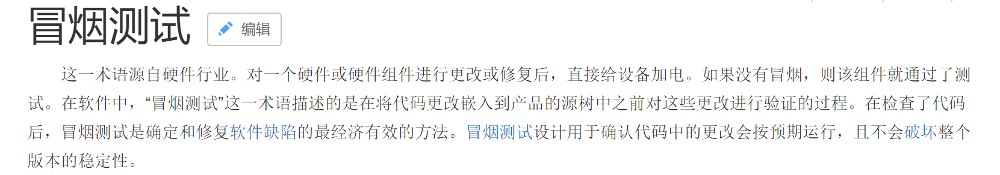

<!-- slide: 21 -->

## 单元测试－肯定测试

- 目标
  - 走查相关规格说明
  - 每个测试用例测试一或多个设计陈述
  - 覆盖全部设计陈述
- 方法
  - 基于规格说明的测试
  - 等价类划分

<!-- slide: 22 -->

## 单元测试－否定测试

- 目标
  - 确认软件没有做规格说明未指定事情
- 方法
  - 错误猜测
  - 外部边界值分析与测试

<!-- slide: 23 -->

## 单元测试－专用测试

- 目标
  - 验证性能需求
  - 验证安全性需求
  - 验证信息安全需求
- 方法
  - 基于规格说明的测试

<!-- slide: 24 -->

## 单元测试－覆盖测试

- 目标
  - 验证程序控制流的正确性
  - 验证程序数据流的正确性
- 方法
  - 语句覆盖
  - 分支覆盖
  - 条件覆盖
  - 数据流覆盖

<!-- slide: 25 -->

## 单元测试－覆盖率评估

- 目标
  - 测量覆盖率
  - 确定覆盖率目标是否实现
- 方法
  - 覆盖率度量
  - 覆盖率分析

<!-- slide: 26 -->

## 单元测试－覆盖率完善与实现

- 目标
  - 找出无法执行测试的路径或条件
  - 发现不可达或冗余代码
  - 补充测试并达到覆盖率目标
- 方法
  - 覆盖率分析
  - 语句覆盖
  - 分支覆盖
  - 条件覆盖
  - 数据流覆盖

<!-- slide: 27 -->

## 单元测试－实例

- 描述
  - 对计算一个实数的平方根的函数进行测试
- 设计规格说明
  - 输入－实数
  - 输出－实数
  - 当输入一个0或大于0的值时，返回输入值的正数平方根
  - 当输入小于0的值时，显示错误信息"Square root error - negative input"并返回-1
  - 使用库函数显示错误信息

<!-- slide: 28 -->

## 单元测试－实现及原始测试代码

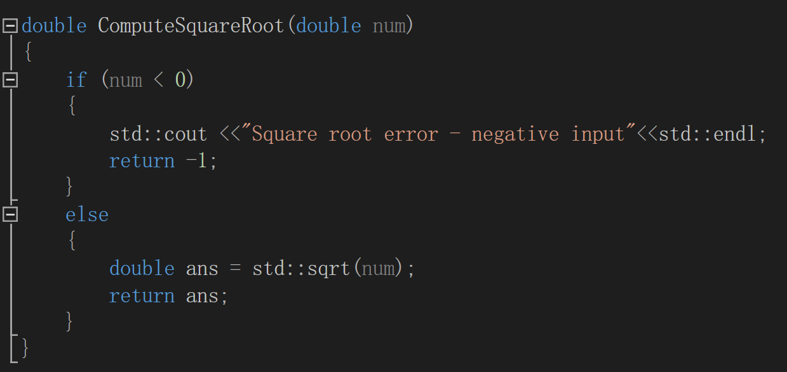
- Code/UnitTest-Primitive/ UnitTest-Primitive/primitive.cpp

<!-- slide: 29 -->

## 单元测试－等价类划分设计

- 分析
  - 3个陈述
  - 2个约束
  - 2个用例可实现覆盖

<!-- slide: 30 -->

## 单元测试－等价类划分设计

| 输入划分 |  | 输出划分 |  |
|---|---|---|---|
| I | >=0 | a | >=0 |
| II | <0 | b | Error |

- 分析
  - 2个输入等价类
  - 2个输出等价类
  - 2个用例可实现覆盖

<!-- slide: 31 -->

## 单元测试－等价类划分设计

- 设计结果
  - 用例1
    - 输入4; 返回2
    - 执行了输入等价类I和输出等价类a
  - 用例2
    - 输入-10, 返回-1, , 用Print_Line输出 "Square root error - illegal negative input"
    - 执行了输入等价类II和输出等价类b

<!-- slide: 32 -->

## 单元测试－等价类划分设计

- Code/UnitTest-Primitive/ UnitTest-Primitive/primitive.cpp
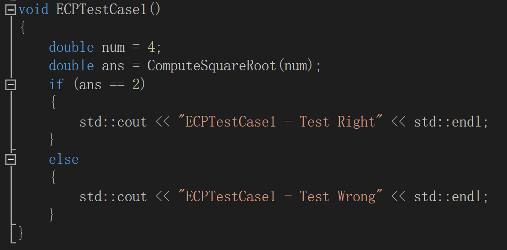
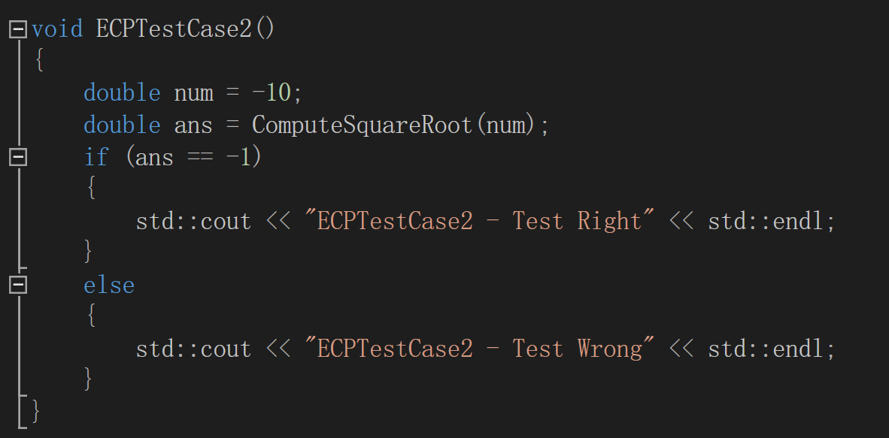

<!-- slide: 33 -->

## 单元测试－等价类划分设计

- Code/UnitTest-Primitive/ UnitTest-Primitive/primitive.cpp
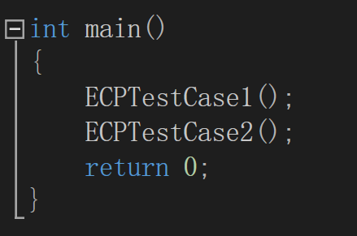

<!-- slide: 34 -->

## 单元测试－边界值分析设计

- 分析
  - 5个用例可实现覆盖
- 用例1
  - 输入最大的负数, 返回-1, 输出 "Square root error - illegal negative input“
  - 执行了等价类II的下边界
- 用例2
  - 输入仅比0小的数, 返回-1, 输出 "Square root error - illegal negative input“
  - 执行了等价类II的上边界

<!-- slide: 35 -->

## 单元测试－边界值分析设计

- 用例3
  - 输入0, 返回0
  - 执行了等价类II的上边界外点,等价类I的下边界,等价类a的下边界
- 用例4
  - 输入仅比0大的数, 返回输入值的正数平方根
  - 执行了等价类I下边界内点
- 用例5
  - 输入最大的正数, 返回输入值的正数平方根
  - 执行了等价类I上边界内点,等价类a的上边界

<!-- slide: 36 -->

## 单元测试－边界值分析设计

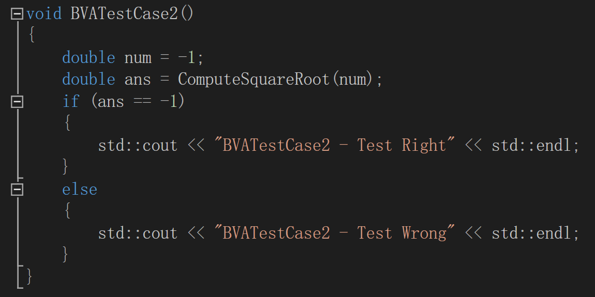
- Code/UnitTest-Primitive/ UnitTest-Primitive/primitive.cpp
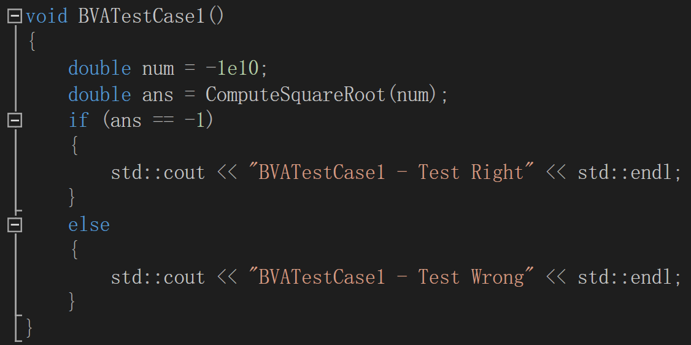

<!-- slide: 37 -->

## 单元测试－边界值分析设计

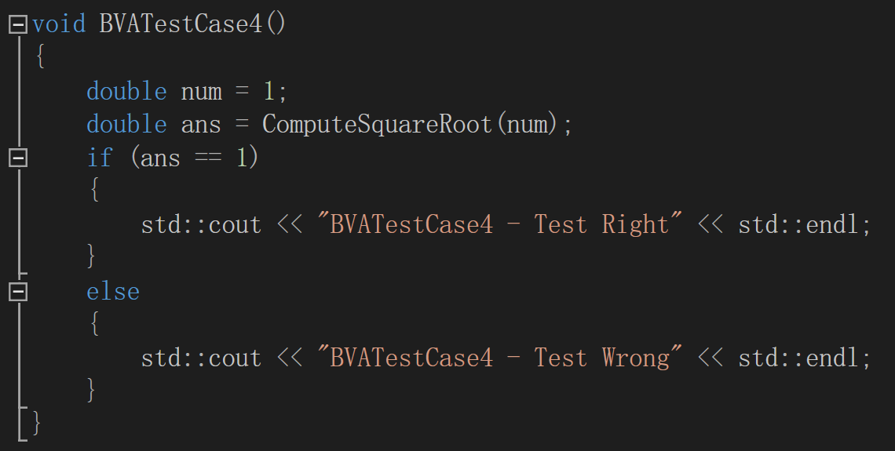
- Code/UnitTest-Primitive/ UnitTest-Primitive/primitive.cpp
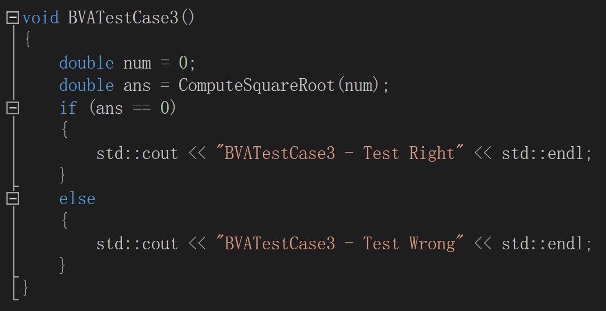

<!-- slide: 38 -->

## 单元测试－边界值分析设计

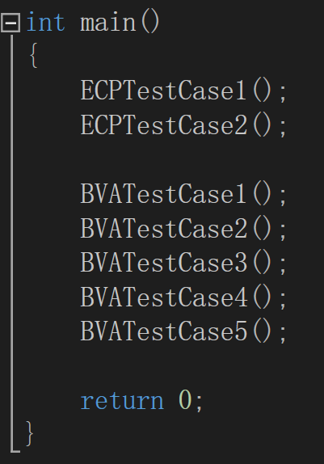
- Code/UnitTest-Primitive/ UnitTest-Primitive/primitive.cpp
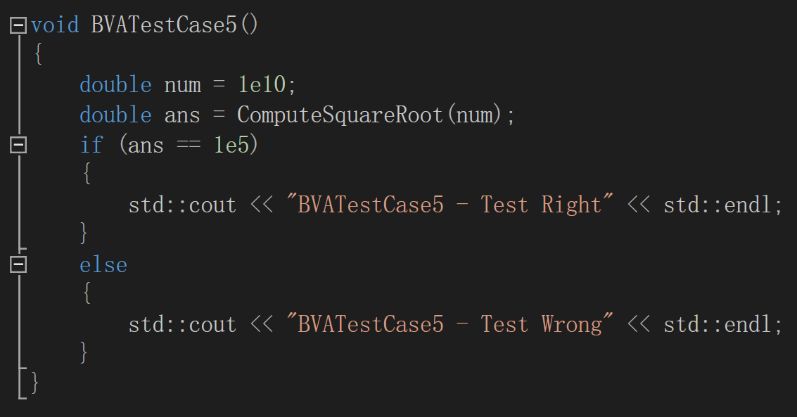

<!-- slide: 39 -->

## 单元测试－边界值分析设计

- Code/UnitTest-Primitive/ UnitTest-Primitive/primitive.cpp
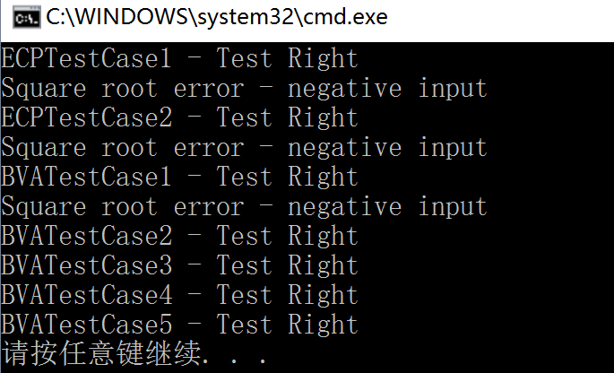

<!-- slide: 40 -->

## 单元测试－原始测试代码的问题

- 臃肿
- 工作量大
- 测试结果不直观（需要细心优化）

<!-- slide: 41 -->

## 优秀的单元测试框架

- Java
  - JUnit
- Python
  - PyUnit
- C++
  - CppUnit
  - Google C++ Testing Framework （Google Test）

<!-- slide: 42 -->

## Google Test

- 优点
  - 开源 （https://github.com/google/googletest）
  - 跨平台
    - Linux, Windows, Mac
  - 测试之间独立，且测试可重复
  - 测试得到良好的组织，能够反映被测代码的结构
  - 当测试失败时，能提供丰富的信息，以便找到错误
  - 当
    - 当测试失败时，只停止当前的测试；继续执行下一个测试
  - 能让测试人员关注测试内容本身
    - 自动管理和运行所有测试，不需要用户穷举执行
  - 测试速度快
    - 能重用不同测试之间的资源
- 和Junit, PyUnit一样，基于xUnit架构

<!-- slide: 43 -->

## Google Test – 安装

- 下载 http://code.google.com/p/googletest/
- 安装
  - 以MSVC为例
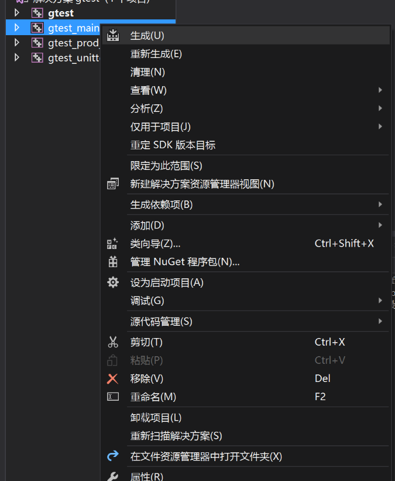

- googletest-master\googletest\include
- googletest-master\googletest\msvc
- \gtest\Debug\gtestd.lib
- googletest-master\googletest\msvc
- \gtest\Release\gtest.lib

<!-- slide: 44 -->

## Google Test – 安装

- 建立新的测试项目
  - 以MSVC为例
- 首先建立被测项目
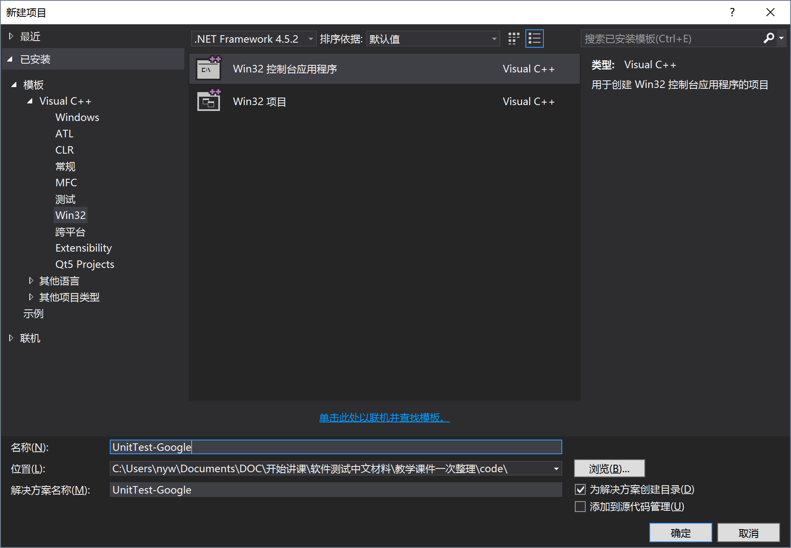

<!-- slide: 45 -->

## Google Test

- 建立新的测试项目
  - 以MSVC为例
- 首先建立被测项目
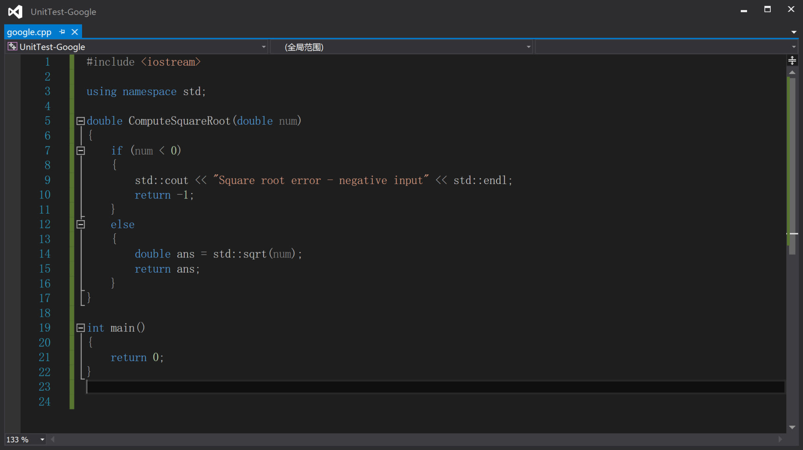

<!-- slide: 46 -->

## Google Test

- 建立新的测试项目
  - 以MSVC为例
- 首先建立被测项目
- 添加Google Test环境
  - 添加include文件夹
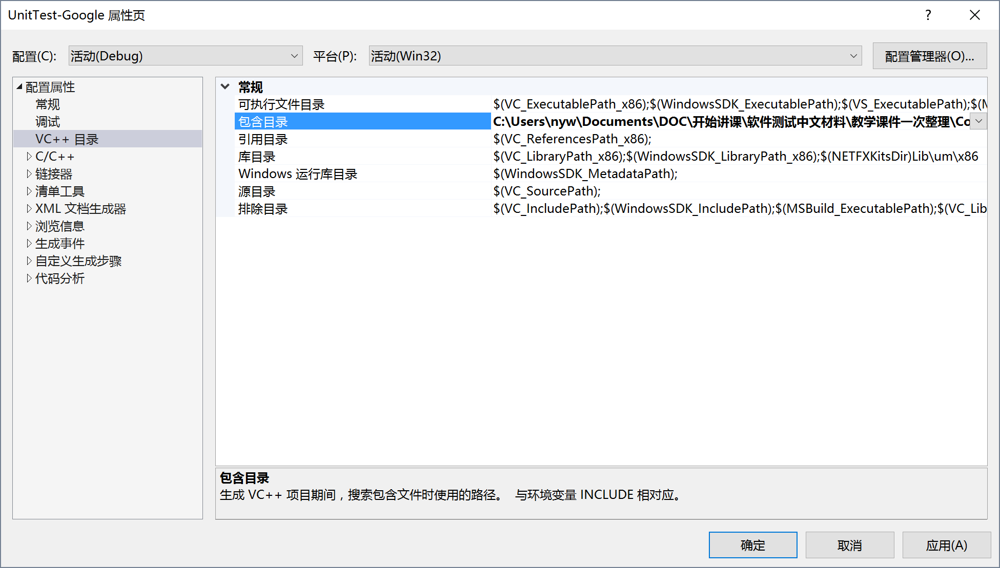

<!-- slide: 47 -->

## Google Test

- 建立新的测试项目
  - 以MSVC为例
- 首先建立被测项目
- 添加Google Test环境
  - 添加include文件夹
  - 添加lib文件夹
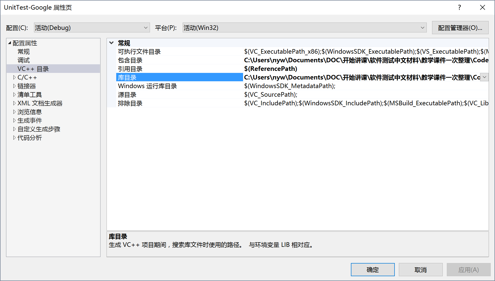

<!-- slide: 48 -->

## Google Test

- 建立新的测试项目
  - 以MSVC为例
- 首先建立被测项目
- 添加Google Test环境
  - 添加include文件夹
  - 添加lib文件夹
  - 添加附加依赖项（即：gtestd.lib）
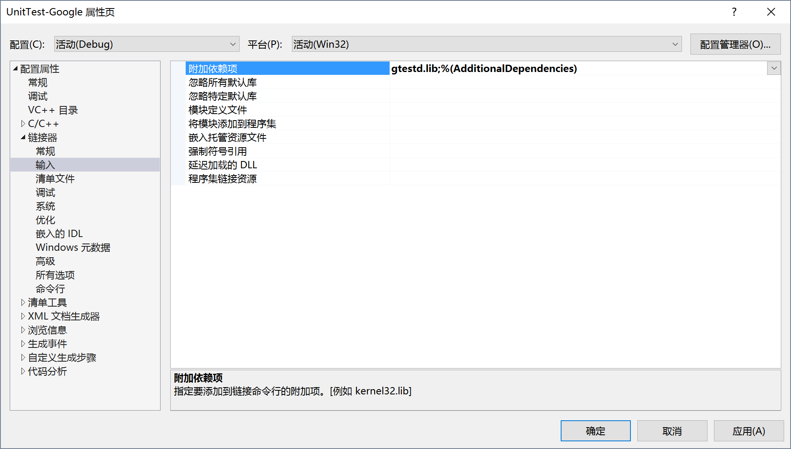

<!-- slide: 49 -->

## Google Test

- 建立新的测试项目
  - 以MSVC为例
- 首先建立被测项目
- 添加Google Test环境
  - 添加include文件夹
  - 添加lib文件夹
  - 添加附加依赖项（即：gtestd.lib）
  - 可能需要设置运行库
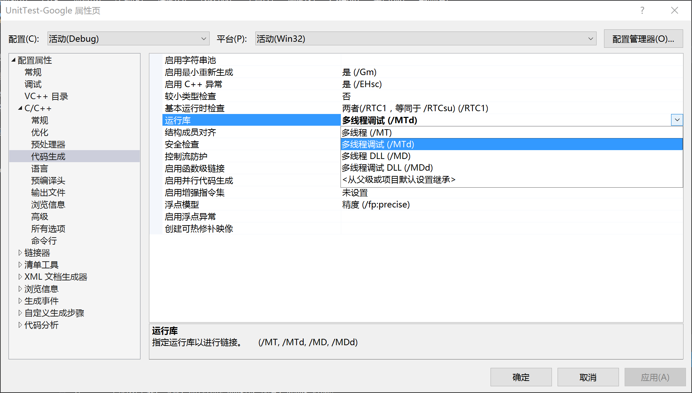

<!-- slide: 50 -->

## Google Test

- 用Google Test进行测试
  - 非常简单和方便！！！
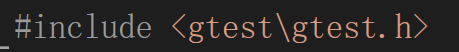
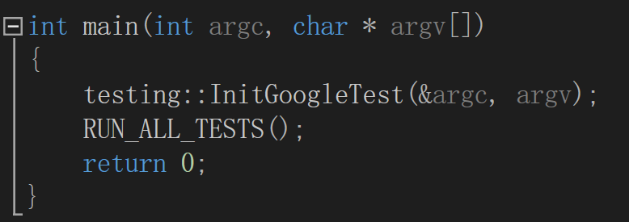
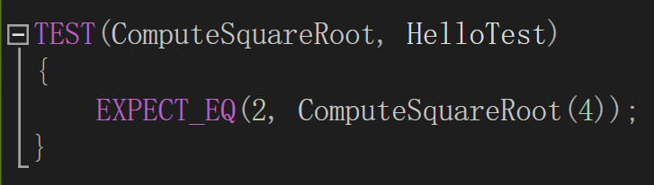

<!-- slide: 51 -->

## Google Test

- 用Google Test进行测试
  - 非常简单和方便！！！
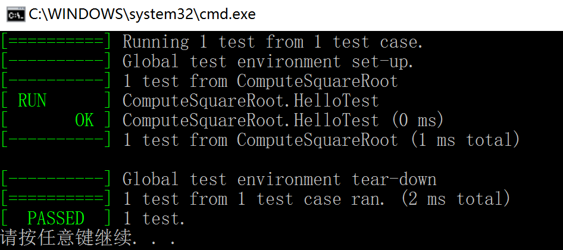

<!-- slide: 52 -->

## Google Test

- 用Google Test进行测试
  - 非常简单和方便！！！
  - 7个用例

<!-- slide: 53 -->

## Google Test

- 用Google Test进行测试
  - 非常简单和方便！！！
  - 7个用例
  - 与原始测试代码的比较

| 原始测试代码 | 基于Google Test的测试代码 |
|---|---|
| 140行 | 40行 |

<!-- slide: 54 -->

## 学习使用它Google Test

<!-- slide: 55 -->

## Google Test－TEST宏

- TEST宏
  - TEST宏，有两个参数，官方的对这两个参数的解释为：[TestCaseName，TestName]
  - 针对同一系列的test cases，可以有多个TEST宏，一个TEST宏包含多个断言
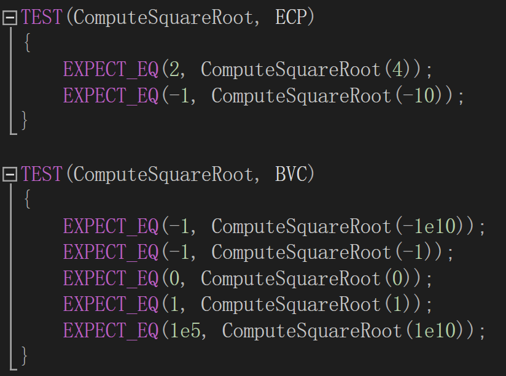
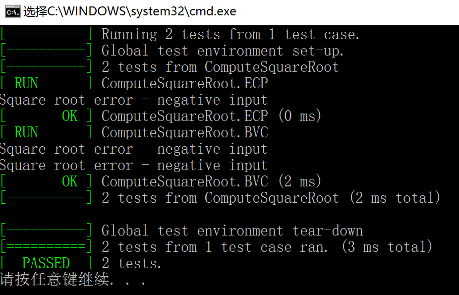

<!-- slide: 56 -->

## Google Test－断言

- 断言(assertion)：使用Google Test，其实就是写断言(assertions)，即判断某条件是否为真
  - 采用断言来判断程序的行为是否正确

<!-- slide: 57 -->

## Google Test－断言

- 断言返回三种结果：success，nonfatal failure（非致命错误），fatal failure
- 两种断言成对出现
  - EXPECT_* 	       返回success或nonfatal failure（TEST宏继续执行）
  - ASSERT_*          返回success或fatal failure（立刻退出TEST宏（可能导致内存泄漏））
- Basic Assertions
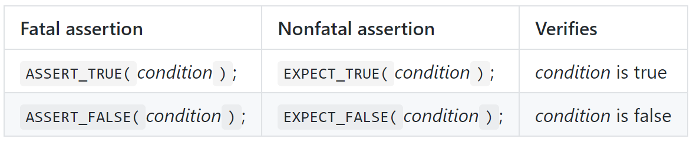

<!-- slide: 58 -->

## Google Test－断言

  - Binary Comparison
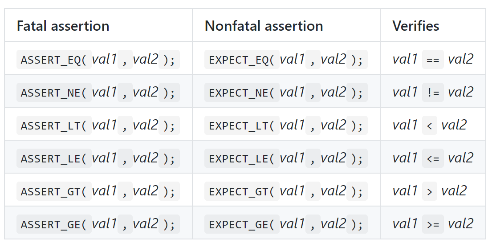

<!-- slide: 59 -->

## Google Test－断言

- String Comparison
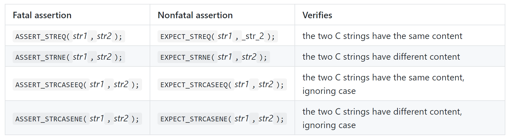

<!-- slide: 60 -->

## Google Test－断言

- 当断言失败时，Google Test打印失败断言所在源文件、行数，并给出失败原因：
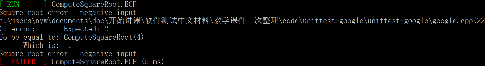

<!-- slide: 61 -->

## Google Test－步骤总结

- 首先用TEST()宏定义和命名一个测试函数（普通的无返回值的C++函数）
- 在该函数中包含多个断言
- 该函数的结果由断言的结果决定，任何一个断言出错，则该测试函数崩溃和出错，否则，测试成功
- TEST(test_case_name, test_name) {
- ... test body ...
- }

<!-- slide: 62 -->

## Google Test－步骤总结

- TEST(test_case_name, test_name) {
- ... test body ...
- }
- 不同的TEST宏，可以有相同的test_case_name
- test_case_name不同时
- test_name可以相同

<!-- slide: 63 -->

## Google Test－例子

- 测试对象为阶乘函数：
- 测试用例可为：
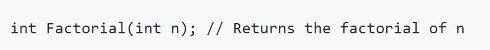
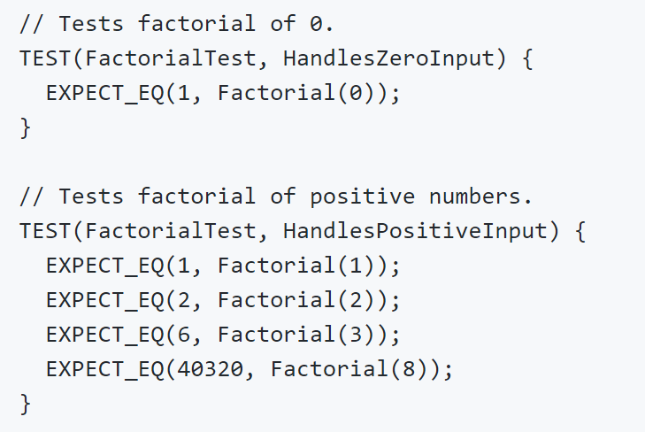

<!-- slide: 64 -->

## Google Test－test fixture

- Google Test采用test fixture机制实现面向对象的测试
- 举例说明：

<!-- slide: 65 -->

## Google Test－test fixture

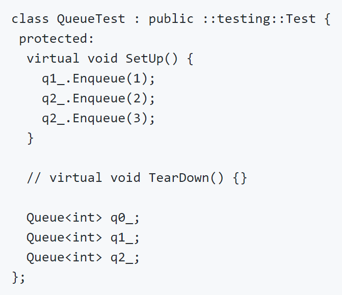

<!-- slide: 66 -->

## Google Test－test fixture

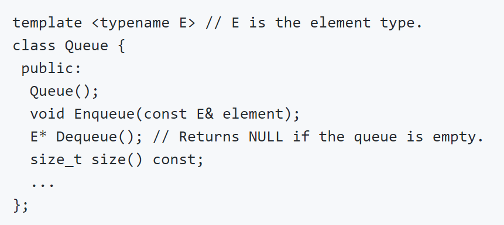

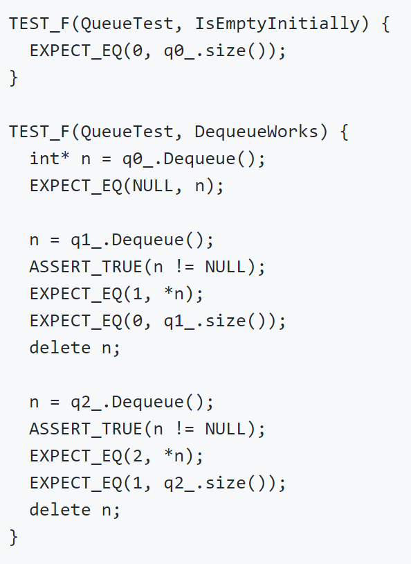

<!-- slide: 67 -->

## Google Test－步骤总结

- 从::testing::Test继承一个子类
- 在该子类里，申明被测对象，这些对象能被所有测试使用
- 重写SetUp和TearDown函数
- 在使用fixture时，用TEST_F替代TEST宏。对于TSET_F定义的测试，Google Test将
  - 创建一个test fixture对象
  - 初始化它
  - 执行测试
  - 析构test fixture对象
  - 删除该对象

<!-- slide: 68 -->

## Google Test－运行过程

- 运行过程：
  - 首先Google Test构建一个QueueTest对象（称之为t1）
  - t1.SetUp()执行，并初始化t1
  - 在t1上执行IsEmptyInitially 测试例子
  - t1.TearDown()执行
  - t1被析构
  - 上述过程重新执行，建立新的QueueTest对象，并执行DequeueWorks测试

<!-- slide: 69 -->

## Google Test－进阶

- 更多断言
- 事件机制
- 参数化
- 死亡测试
- 运行参数

<!-- slide: 70 -->

## Google Test－More Assertions

- 异常检查
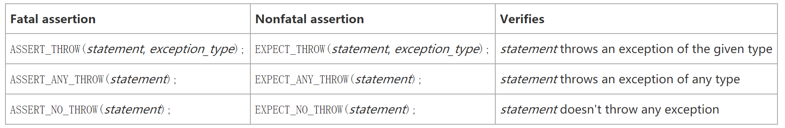
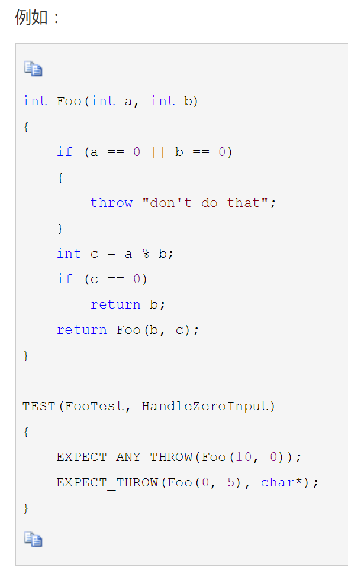

<!-- slide: 71 -->

## Google Test－More Assertions

- Predicate（谓语） Assertions
  - 在使用EXPECT_TRUE或ASSERT_TRUE时，有时希望能够输出更加详细的信息，比如检查一个函数的返回值TRUE还是FALSE时，希望能够输出传入的参数是什么，以便失败后好跟踪。因此提供了如下的断言：
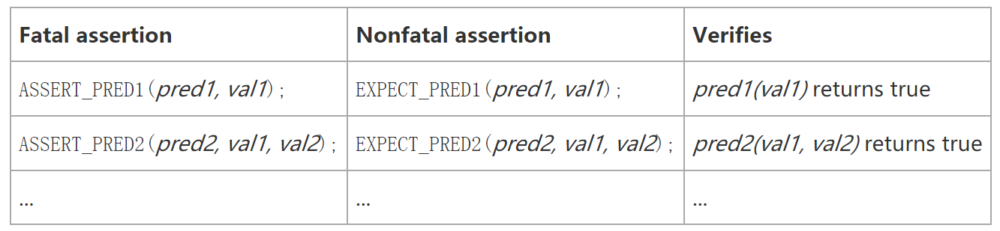
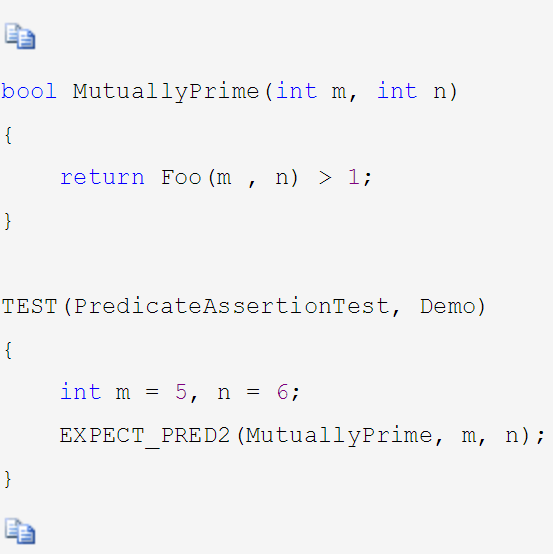
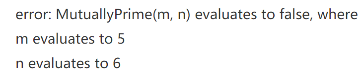

<!-- slide: 72 -->

## Google Test－More Assertions

- Predicate Assertions
  - 如果对这样的输出不满意的话，还可以自定义输出格式，通过如下：
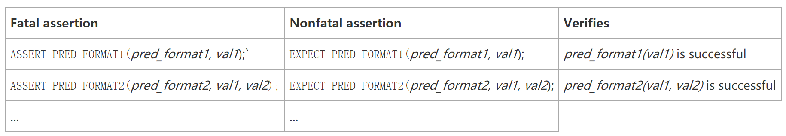
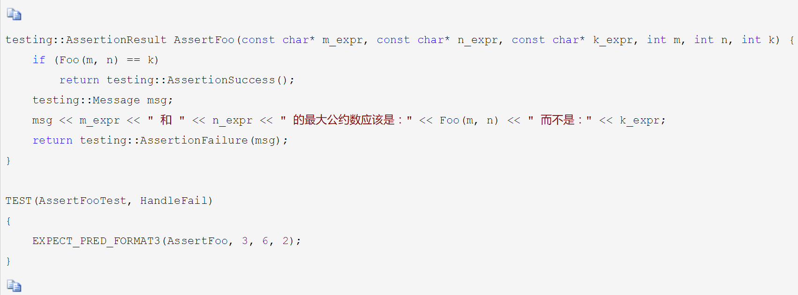

<!-- slide: 73 -->

## Google Test－More Assertions

- 浮点型检查
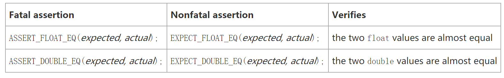
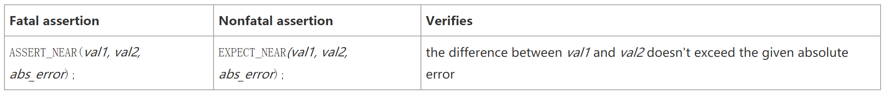

<!-- slide: 74 -->

## Google Test－More Assertions

- Windows HRESULT assertions
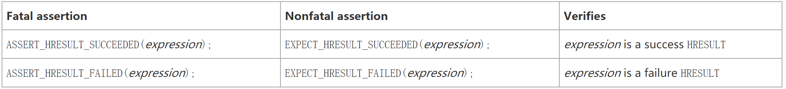
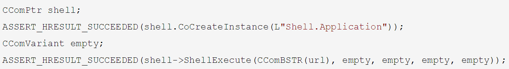

<!-- slide: 75 -->

## Google Test－More Assertions

- 类型检查
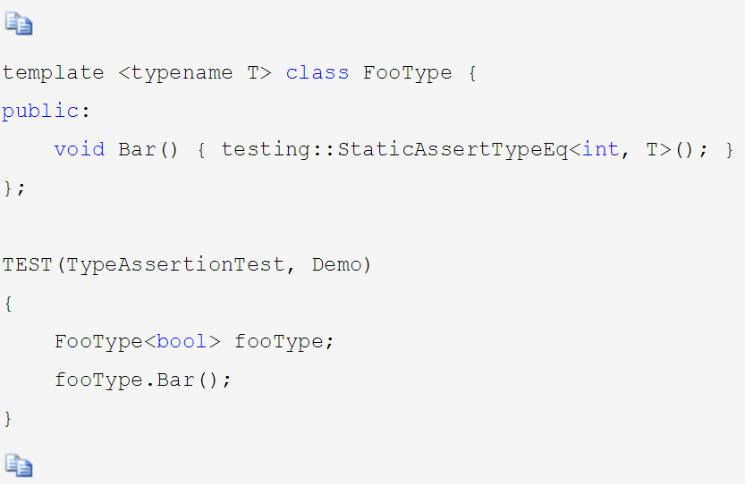

<!-- slide: 76 -->

## Google Test－事件机制

- gtest提供了多种事件机制，方便在案例之前或之后做一些操作。gtest的事件一共有3种：
  - 全局的，所有案例执行前后。
  - TestSuite级别的，在某一批案例中第一个案例前，最后一个案例执行后。
  - TestCase级别的，每个TestCase前后。

<!-- slide: 77 -->

## Google Test－事件机制

- 全局事件
  - 要实现全局事件，必须写一个类，继承testing::Environment类，实现里面的SetUp和TearDown方法。
    - SetUp()方法在所有案例执行前执行
    - TearDown()方法在所有案例执行后执行
  - 接下里，在main函数中通过testing::AddGlobalTestEnvironment方法添加这个全局事件
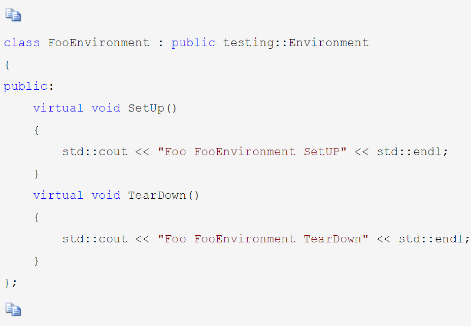
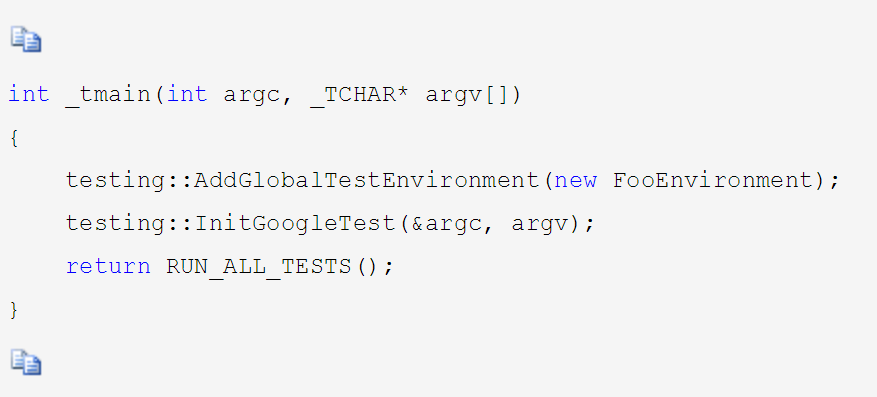

<!-- slide: 78 -->

## Google Test－事件机制

- TestSuite事件
  - 需要写一个类，继承testing::Test，然后实现两个静态方法
    - SetUpTestCase() 方法在第一个TestCase之前执行
    - TearDown()方法在所有案例执行后执行
  - 在编写测试案例时，使用TEST_F宏，第一个参数必须是上面的类的名字，代表一个TestSuite
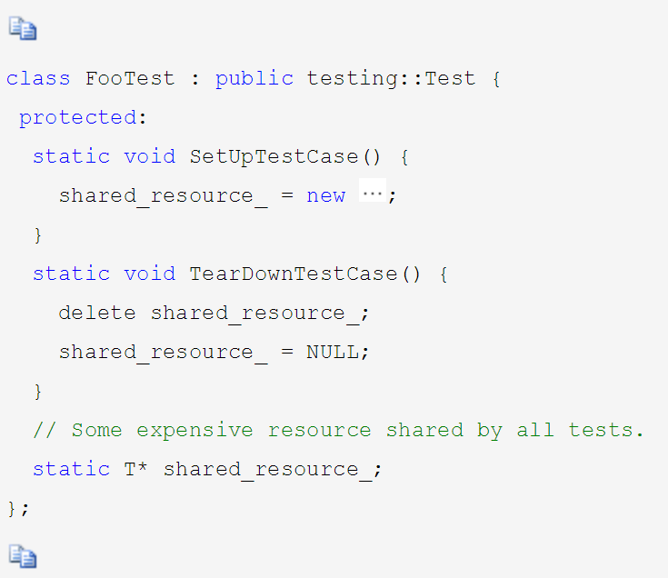
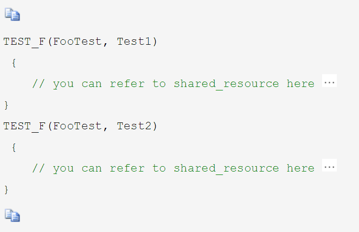

<!-- slide: 79 -->

## Google Test－事件机制

- TestCase事件
  - TestCase事件是挂在每个案例执行前后的，实现方式和上面的几乎一样，不过需要实现的是SetUp方法和TearDown方法：
    - SetUp()方法在每个TestCase之前执行
    - TearDown()方法在每个TestCase之后执行
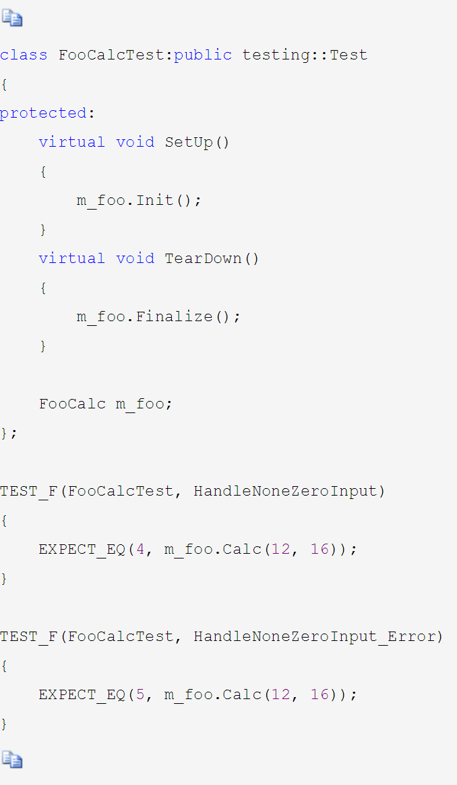

<!-- slide: 80 -->

## Google Test－参数化

- 在设计测试案例时，经常需要考虑给被测函数传入不同的值的情况。
  - 例如：
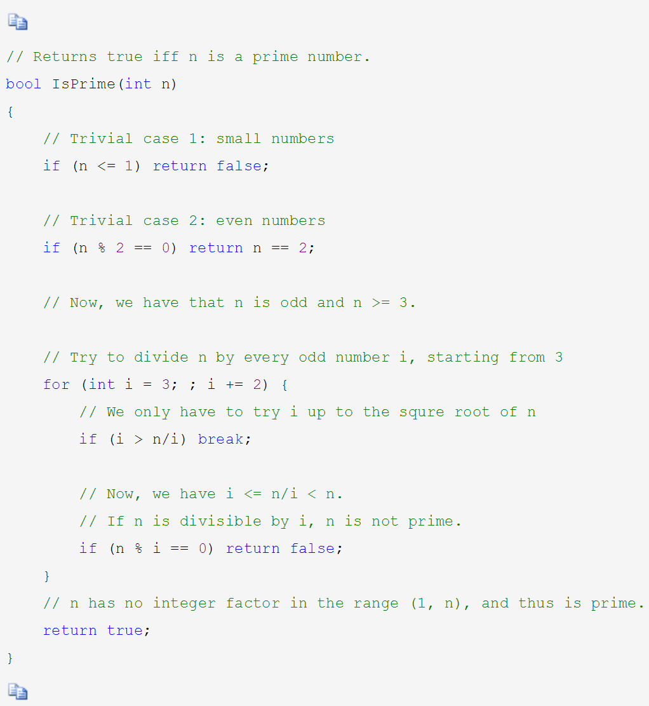
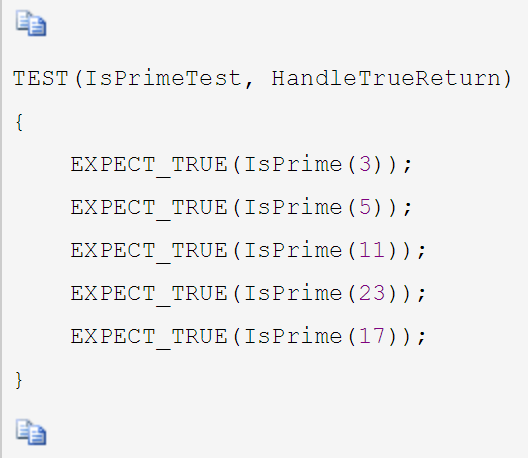

<!-- slide: 81 -->

## Google Test－参数化

- 参数化解决方案
  - 添加一个类，继承testing::TestWithParam<T>，其中T就是需要参数化的参数类型，比如上面的例子，需要参数化一个int型的参数
  - 使用一个新的宏：TEST_P，关于这个“P”的含义，可以理解为”parameterized" 或者 "pattern"。在TEST_P宏里，使用GetParam()获取当前的参数的具体值
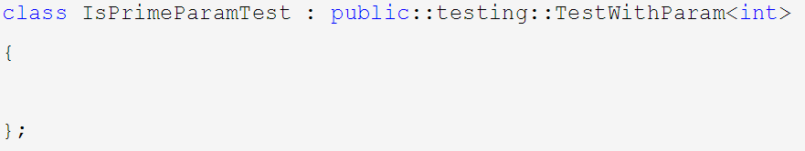
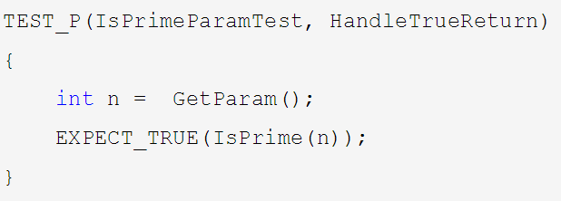

<!-- slide: 82 -->

## Google Test－参数化

- 参数化解决方案
  - 告诉gtest想要测试的参数范围是什么
  - 第一个参数是测试案例的前缀，可以任意取。
  - 第二个参数是测试案例的名称，需要和之前定义的参数化的类的名称相同，如：IsPrimeParamTest
  - 第三个参数是可以理解为参数生成器，上面的例子使用test::Values表示使用括号内的参数。Google提供了一系列的参数生成的函数：
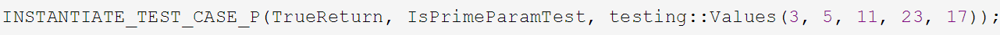

| Range(begin, end[, step]) | 范围在begin~end之间，步长为step，不包括end |
|---|---|
| Values(v1, v2, ..., vN) | v1,v2到vN的值 |
| ValuesIn(container) and ValuesIn(begin, end) | 从一个C类型的数组或是STL容器，或是迭代器中取值 |
| Bool() | 取false 和 true 两个值 |
| Combine(g1, g2, ..., gN) | 将g1,g2,...gN进行排列组合，g1,g2,...gN本身是一个参数生成器，每次分别从g1,g2,..gN中各取出一个值，组合成一个元组(Tuple)作为一个参数。 说明：这个功能只在提供了<tr1/tuple>头的系统中有效。gtest会自动去判断是否支持tr/tuple。 |

<!-- slide: 83 -->

## Google Test－其他（课外了解）

- 死亡测试
- 运行参数
- ...
- Google Mock
- 被测模块
- 驱动模块
- (googletest,Junit …)
- 结果

- 测试用例
- 模块接口
- 局部数据结构
- 边界条件
- 独立执行路径
- 错误处理的路径
- 桩1
- 桩2
- 桩n

<!-- slide: 84 -->

- 84
- 谢  谢！
- 华南理工大学 计算机科学与工程学院
- 广州市番禺区大学城华南理工大学
- 邮编：510006
- 电子邮件：nieyongwei@scut.edu.cn
