# 软件测评-5-自动化测试

<!-- slide: 1 -->

- <number>
- 2010年度广州市电子商务发展专项资金
- 扶持项目
- 软件测试与质量保障
- 华南理工大学计算机科学与工程学院
- 聂勇伟 副教授
- nieyongwei@scut.edu.cn
- 第五章 - 软件自动化测试

<!-- slide: 2 -->

## 软件测试自动化

- 软件自动化测试基础
- 自动化测试的作用和优势
- 自动化测试投入产出比分析
- 分层的自动化测试思想
- 自动化测试的难点
- 自动化测试项目开展方法
- 软件测试工具分类
- 几种常用软件测试工具
- 用QTP进行GUI层自动化测试

<!-- slide: 3 -->

## 软件自动化测试基础

- (1) 软件自动化测试的产生
- 随着计算机日益广泛的应用，计算机软件越来越庞大和复杂，软件测试的工作量也越来越大。

<!-- slide: 4 -->

- (1) 软件自动化测试的产生
- 随着人们对软件测试工作的重视，大量的软件测试自动化工具不断涌现出来，自动化测试能够满足软件公司想在最短的进度内充分测试其软件的需求，一些软件公司在这方面的投入，会对整个开发工作的质量、成本和周期带来非常明显的效果。

<!-- slide: 5 -->

- (2) 软件自动化测试的概念
- 软件测试自动化就是通过测试工具或其他手段，按照测试工程师的预定计划对软件产品进行自动的测试，它是软件测试的一个重要组成部分，能够完成许多手工无法完成或者难以实现的一些测试工作。正确、合理地实施自动化测试，能够快速、全面地对软件进行测试，从而提高软件质量、节省经费、缩短产品发布周期。

<!-- slide: 6 -->

- (2) 软件自动化测试的概念
- 自动化测试能够替代大量手工测试工作，避免重复测试，同时，它还能够完成大量手工无法完成的测试工作，如并发用户测试、大数据量测试、长时间运行可靠性测试等。

<!-- slide: 7 -->

## 自动化测试的作用和优势

- 使用测试工具的目的就是要提高软件测试的效率和软件测试的质量。
- 通常，自动化测试的好处有：
-   产生可靠的系统；
-   改进测试工作质量；
-   减少测试工作量并加快测试进度。

<!-- slide: 8 -->

- (1) 产生可靠的系统
- 回顾：测试工作的主要目标一是找出缺陷，从而减少应用中的错误；另一个是确保系统的性能满足用户的期望。为了有效地支持这些目标，在开发生存周期的需求定义阶段，在开发和细化需求时就应着手测试工作。

<!-- slide: 9 -->

- (1) 产生可靠的系统
- 使用自动化测试可改进所有的测试领域，包括测试程序开发、测试执行，测试结果分析、故障状况和报告生成。它还支持所有的测试阶段，其中包括单元测试、集成测试、系统测试、验收测试与回归测试等。

<!-- slide: 10 -->

- (1) 产生可靠的系统
- 通过使用自动化测试可获得的效果可归纳如下。
    - （1）需求定义的改进
    - （2）性能测试的改进
    - （3）负载/压力测试的改进
    - （4）高质量测量与测试最佳化
    - （5）改进与开发组人员之间的关系
    - （6）改进系统开发生存周期

<!-- slide: 11 -->

- (2) 改进测试工作质量
- 通过使用自动化测试工具，可增加测试的深度与广度，改进测试工作质量。其具体好处可归纳如下。

<!-- slide: 12 -->

      - （1）改进多平台兼容性测试
      - （2）改进软件兼容性测试
      - （3）改进普通测试执行
      - （4）使测试集中于高级测试问题
      - （5）执行手工测试无法完成的测试
      - （6）重现软件缺陷的能力
      - （7）测试无需用户干预

<!-- slide: 13 -->

- (3) 减少测试工作量并加快测试进度
- 善于使用测试工具来进行测试，其节省时间并加快测试工作进度是毋庸置疑的，这也是自动化测试的主要优点。

<!-- slide: 14 -->

- (3) 减少测试工作量并加快测试进度下表列出了采用手工和自动化测试方式完成各测试步骤所需工作量的基准对比结果。该测试涉及1750个测试程序和700个错误。表中的数字反映出通过测试自动化，测试工作总量减少75%。

<!-- slide: 15 -->

<!-- slide: 16 -->

- 软件自动化测试是软件测试技术的一个重要的组成部分，引入自动化测试可以提高软件质量，节省经费，缩短产品发布周期。
- 然而，测试工具本身的优势并不意味着使用测试工具就能成功，关键还是在于使用工具的人。很多刚拥有测试工具的人，经常过分夸大工具的功效，并投入太高的期望。

<!-- slide: 17 -->

- 工具只是提供了解决问题的一种手段而已。成功的测试自动化需有以下两个关键的因素：
- ① 一个被很好理解的并且稳定的应用行为
- ② 一个专注的、有着丰富技能的测试组，并且被分配了足够的时间和资源

<!-- slide: 18 -->

## 自动化测试ROI（投入产出）分析

- 什么是ROI？
- Wikipedia 对 ROI 的解释为，在金融学中， ROI 被理解为投入产出比（Return on Investment），指投融资的回报率或者有时就指投资回报。
- 它表示相对于投资额的金钱获得或者损失的比例。金钱的获得或者损失可以理解为利益，利润或者损失，浪费。投资额可以理解为资产、本金。

<!-- slide: 19 -->

## 自动化测试ROI（投入产出）分析

<!-- slide: 20 -->

## 自动化测试ROI（投入产出）分析

> 备注：我们开始探寻到底自动化测试应该越大程度越好呢，还是应该科学的规划才更有价值，而又如何规划才是合理的呢。
Wikipedia 对 ROI 的解释为，在金融学中， ROI 被理解为投入产出比（Return on Investment），指投融资的回报率或者有时就指投资回报。它表示相对于投资额的金钱获得或者损失的比例。金钱的获得或者损失可以理解为利益，利润或者损失，浪费。投资额可以理解为资产、本金。

测试的价值是通过找到更多质量缺陷（Defects）使得产品后期投入（Cost）减少而实现的。

综上所述，自动化测试的取决于最终发现的质量缺陷数量多少，而自动化测试的初始投资由自动化工具开发、部署，自动化脚本、程序的开发和维护，以及执行自动化测试所需的成本决定。

经过以上推算，我们可以得到结论，如果要使得自动化测试优于手动测试的投入产出比，我们需要证明同样质量的测试结果前提下，自动化测试的投入成本要低于手动测试成本。

<!-- slide: 21 -->

## 自动化测试ROI（投入产出）分析

<!-- slide: 22 -->

## 自动化测试ROI（投入产出）分析

> 备注：。

<!-- slide: 23 -->

## 自动化测试ROI（投入产出）分析

- 即：如果要使得自动化测试优于手动测试的投入产出比，我们需要证明同样质量的测试结果前提下，自动化测试的投入成本要低于手动测试成本。

<!-- slide: 24 -->

## 自动化测试ROI（投入产出）分析

- 为了进一步推断自动化规划的最优化，
  - 假设1：手动测试用例 / 自动化测试脚本的粒度是一个用例 / 脚本均足以且仅能发现一个质量缺陷。
  - 假设 2：自动化测试不发现质量缺陷，只能发现日志错误，在人工检查日志错误时，需经过分析日志（约等同于 1 遍手动测试），人工再现场景以确认产品问题（等同于 1 遍手动测试）来定位和暴露真实质量缺陷。

<!-- slide: 25 -->

## 自动化测试ROI（投入产出）分析

- 为了进一步推断自动化规划的最优化，
  - 假设 3：无论是否采用了自动化手段，在当前质量缺陷被修复后，仍然需要花费一遍手动执行测试用例的同等执行时间来验证此修复。
  - 假设 4：自动化过的脚本仅执行所花费的时间和投入可以忽略。

<!-- slide: 26 -->

## 自动化测试ROI（投入产出）分析

- 案例分析
  - 将 100 个测试用例来测试一个隐藏了 20 个质量缺陷的产品，而且每个测试用例的执行时间约为 a 小时

<!-- slide: 27 -->

## 自动化测试ROI（投入产出）分析

<!-- slide: 28 -->

## 自动化测试ROI（投入产出）分析

- 100

<!-- slide: 29 -->

## 自动化测试ROI（投入产出）分析

- 案例分析
  - 最优自动化规划将满足以下不等式：
  - x<80a
  - 结论：如果自动化后的测试脚本在项目中只运行一遍，那么自动化脚本本身开发的成本不应大于手动执行一遍对应测试用例的执行时间。即完全没必要自动化。

<!-- slide: 30 -->

## 自动化测试ROI（投入产出）分析

- 多少自动化投入才合理
  - 真实的场景比以上案例要复杂
    - 自动化测试脚本可能执行多次
    - 产品中的质量缺陷无法确切得知

<!-- slide: 31 -->

## 自动化测试ROI（投入产出）分析

- 多少自动化投入才合理
  - 假设1：d% 是平均出错率，也就是说一个产品的代码中如果有 d% 的出错率，对产品质量缺陷的修复仍然将带来 d% 的新质量缺陷。
  - 假设2：质量达标 95% 的测试通过率后，产品可以发布。
  - 假设3：n ，迭代次数，自动化脚本将被执行 n 次，或者叫做迭代测试 n 次（n>=1）。

<!-- slide: 32 -->

## 自动化测试ROI（投入产出）分析

<!-- slide: 33 -->

## 自动化测试ROI（投入产出）分析

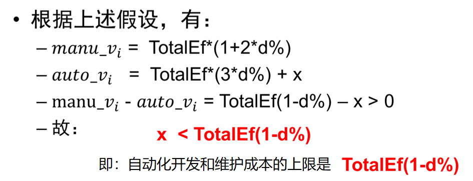

<!-- slide: 34 -->

## 自动化测试ROI（投入产出）分析

- 结论：
  - d% 的值越大，质量缺陷越多，我们依赖于手动测试的可靠性更大。
  - TotalEf 越大，应越倚重于自动化测试
  - 新测试用例开发出来阶段我们必然依赖于手动测试，之后才采用自动化测试
  - 自动化测试多用在回归测试：回归测试的用例重复性使用频率越高，自动化的投入必要性越大

<!-- slide: 35 -->

## 自动化测试ROI（投入产出）分析

- 回归测试的自动化测试规划方式
  - 回归测试是软件测试的一种，旨在检验软件原有功能在修改后是否保持完整。
  - 进行回归重复测试相同用例的出发点是为了确保先前成功的功能不会失败
  - 成熟的测试团队应该不断根据现有的产品质量缺陷报告对回归测试的覆盖范围和计划做出正确估计和调整

<!-- slide: 36 -->

## 自动化测试ROI（投入产出）分析

<!-- slide: 37 -->

## 自动化测试ROI（投入产出）分析

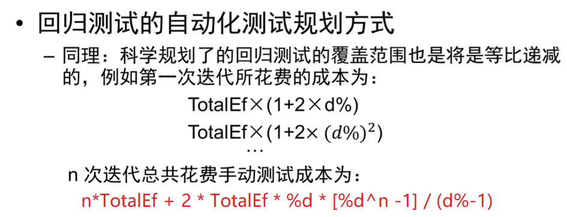

<!-- slide: 38 -->

## 自动化测试ROI（投入产出）分析

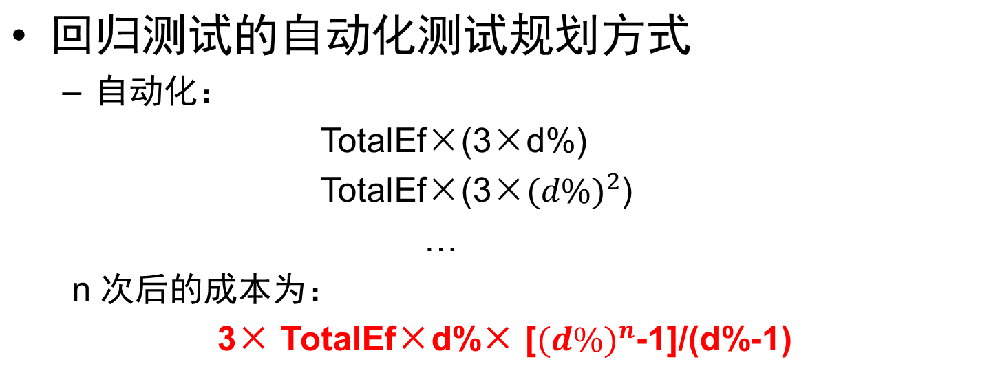

<!-- slide: 39 -->

## 自动化测试ROI（投入产出）分析

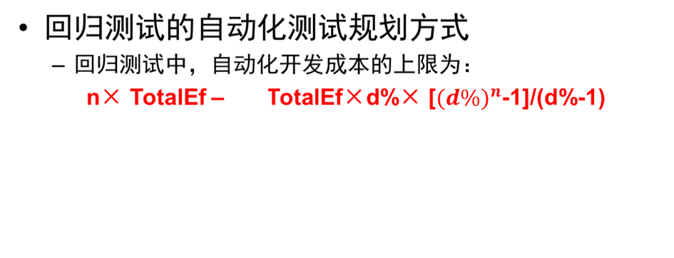
- x =

> 备注：这个公式是对的
TotalEf是第一次测试花掉的总成本
TotalEf*d%是第二次测试花掉的总成本

<!-- slide: 40 -->

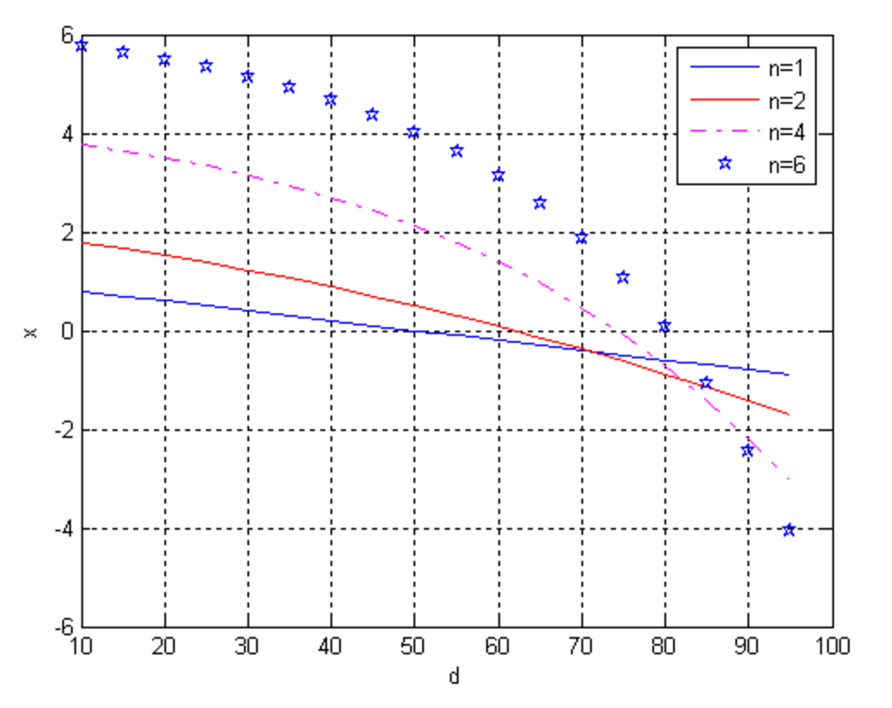

<!-- slide: 41 -->

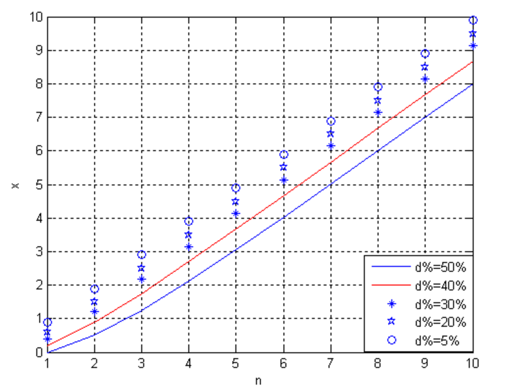

<!-- slide: 42 -->

- 从该图中，还能得到另一个信息：迭代次数基本与可允许投入的自动化开发成本成线性关系。也就是说当测试需要迭代的次数是 n=k 时，允许投入的自动化开发、维护成本可以是当 n=2 时候的 k 倍。
- 自动化测试ROI（投入产出）分析

<!-- slide: 43 -->

## 自动化测试ROI（投入产出）分析

- 结论：
  - 当考虑自动化测试成本收益时，应该先考虑那些可能迭代次数更多，运行次数更多的测试用例进行自动化脚本开发
  - 当质量缺陷越少，质量越好的产品，自动化开发成本收益也会比较大
  - 例如，当当前测试用例很可能最多就执行 2 次，单产品中的遗留问题可能使得 60% 测试用例不能通过，这时考虑自动化测试是没有必要的。

<!-- slide: 44 -->

## 自动化测试的投入与回报

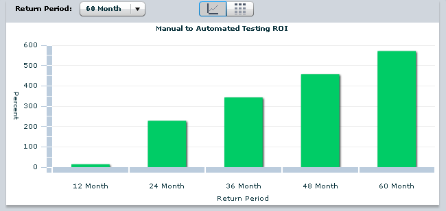
- http://www-01.ibm.com/software/rational/offerings/testing/roi/

<!-- slide: 45 -->

## 结合ROI，说明如何选择合适的项目实现自动化测试？

- 哪些项目适合自动化测试？
- 哪些项目不适合自动化测试？

<!-- slide: 46 -->

## 分层自动化测试思想

- 分层自动化测试是相对于传统的自动化测试而言的
- 传统上，由于开发测试团队割裂，质量职责错配的问题，测试团队 通常试图在测试团队能够掌控的黑盒测试环节进行尽可能全面的黑盒（界面）自动化测试。导致：
  - 测试团队规模的急剧膨胀；
  - 全面黑盒（界面）自动化测试运动
- 全面黑盒自动化测试一般来说是要注定失败的，因为界面是非常易变的，维护成本相对高昂，使得测试团队不堪重负的

<!-- slide: 47 -->

## 分层自动化测试思想

- 传统自动化测试的缺点：
  - 传统自动化测试主要集中在GUI层（比较单一）
  - 缺乏开发团队的支持
  - 覆盖率上不去
  - 成本高（技术成本、管理成本）
  - 不稳定（易变）
  - 不能在早期开展（需要界面）

<!-- slide: 48 -->

## 分层自动化测试思想

- 软件系统是分层的
- 每个层面有对应合适的测试手段、技术、工具
- 自动化测试也分层

<!-- slide: 49 -->

## 分层自动化测试的好处

- 有利于测试覆盖率的提升
- 能在早期开展
- 能与持续集成框架整合

<!-- slide: 50 -->

## 分层自动化测试的环境

- 稳定的测试环境
- 测试数据构造策略
- 系统隔离与Mock

<!-- slide: 51 -->

## Google的分层自动化测试方案

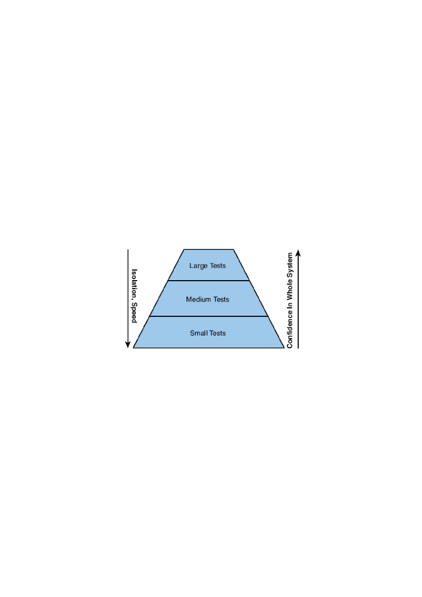
- 谷歌采用70/20/10原则: 70% 小，20% 中，10% 大
- 呼应了ROI分析中的结论

> 备注：《How Google Tests Software》
• 小测试
– Small tests cover a single code unit in a completely faked environment.
• 中测试
– Medium tests cover multiple and interacting code units in a faked or real
environment.
• 大测试
– Large tests cover any number of code units in the actual production environment with
real resources.

<!-- slide: 52 -->

## Google的分层自动化测试方案

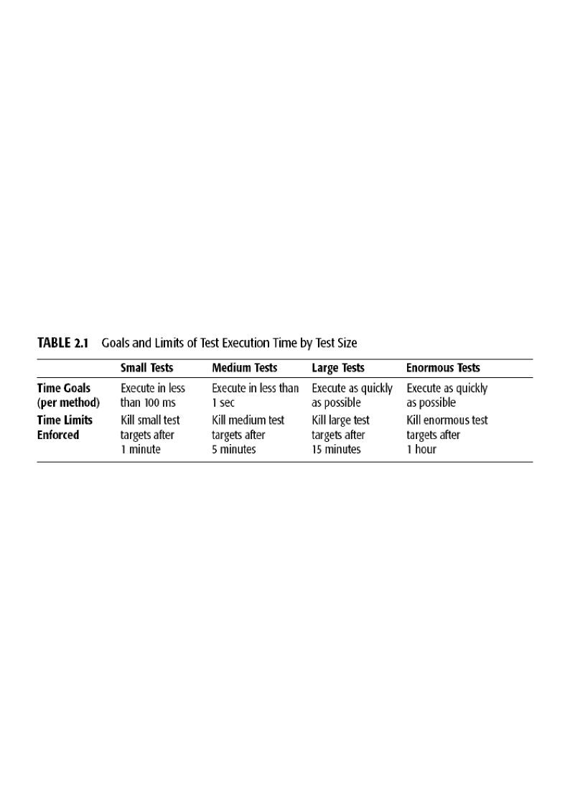

<!-- slide: 53 -->

## Google的分层自动化测试方案

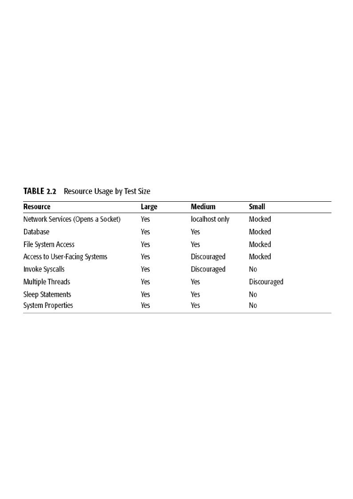

> 备注：Large，medium和small测试时是否用左边的资源

<!-- slide: 54 -->

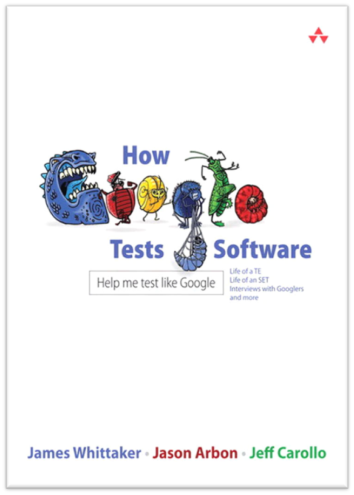
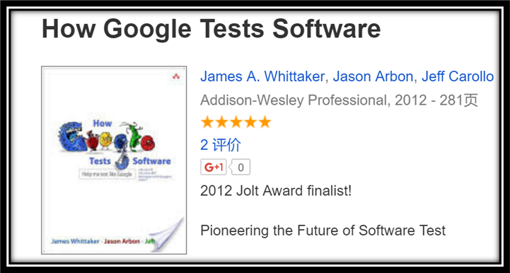

<!-- slide: 55 -->

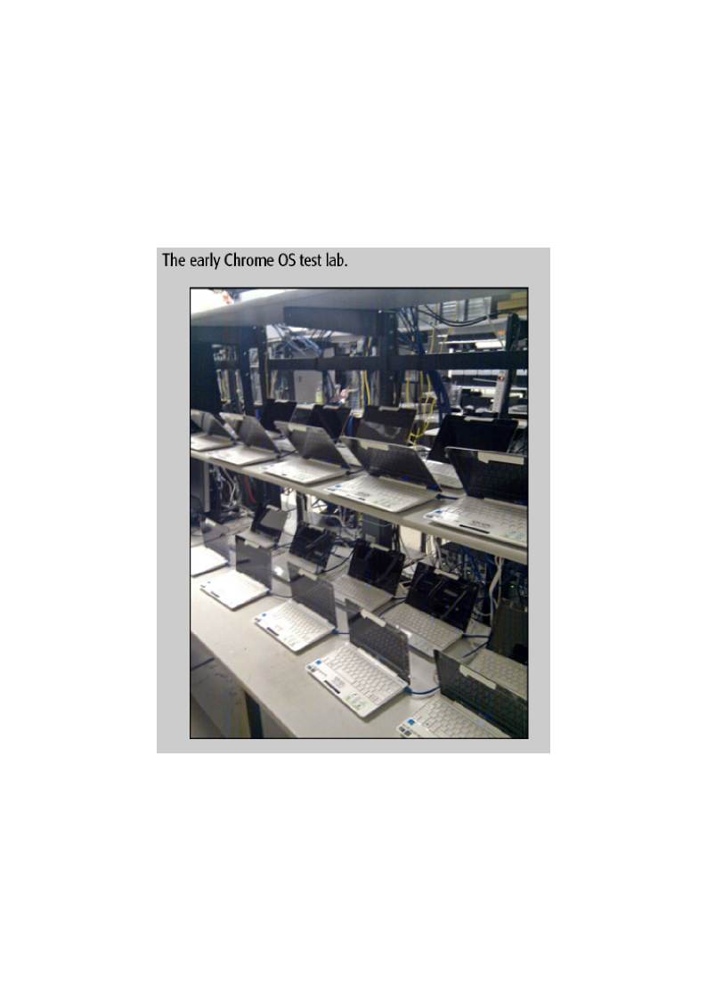

<!-- slide: 56 -->

## 还可以从哪些方面进行分层？

- 历史缺陷分析
  - 缺陷主要集中在需求、业务规则、还是界面操作？或其它？
- 复杂性分析
  - 复杂度主要体现在界面层还是业务层、数据层？或其它？
- 变更频率分析
  - 哪个层面的东西最容易变化？

<!-- slide: 57 -->

## 测试金字塔

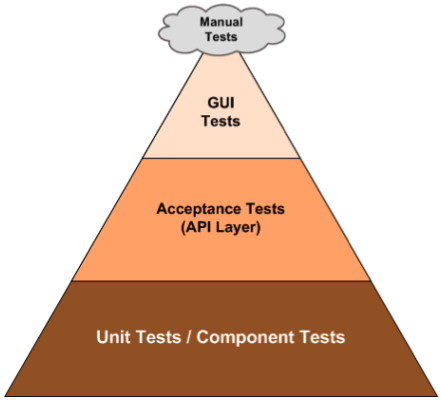

<!-- slide: 58 -->

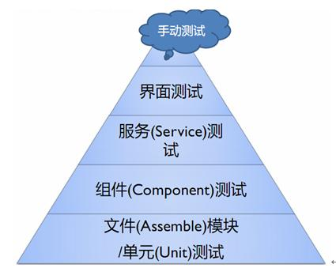

<!-- slide: 59 -->

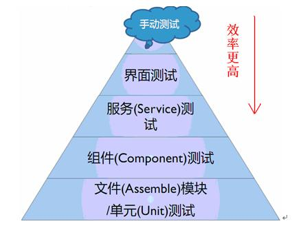

<!-- slide: 60 -->

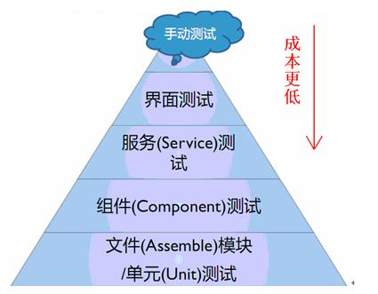

<!-- slide: 61 -->

## 自动化测试的难点

- 技术上的难点
  - 对象识别、工具使用、脚本编程
  - 被测对象的特点
- 管理上的难点
  - 脚本量、脚本的可维护性
  - 测试数据的管理维护
  - 测试环境

<!-- slide: 62 -->

## 自动化测试项目开展方法

- 工具选型
- 自动化测试团队组建
- 试点项目
- 框架搭建
- 获取支持的资源
- 规模化推广
- 自动化测试管理平台

<!-- slide: 63 -->

## 软件测试工具分类

- 软件测试工具的种类不少，有些以用途来分类，有些以价位来分类，有些则以使用特性来分类。基本上，分类只是一种归纳的方式，这里按照测试工具的主要用途和应用领域将测试软件做了一个整理归纳，将自动化测试工具分为以下几类：

<!-- slide: 64 -->

-   捕获错误用途；
-   一般用途；
-   GUI自动化用途；
-   专项用途；
-   软件产品功能、性能测试用途；
-   测试管理工具；
-   测试辅助工具。

<!-- slide: 65 -->

- (1) 捕获错误用途
- 顾名思义就是用于捕获软件错误或程序调试。
- (2) 一般用途
- 这里所说的一般用途，是指这个测试工具在进行测试时，可以适用于大部分的软件。

<!-- slide: 66 -->

- (3) GUI自动化用途
- 目前许多以测试用软件为主要产品的软件公司，大多提供这类的自动化测试软件。这类软件除了提供在窗口界面中使用外，也有不少是针对浏览器接口开发的自动化测试工具。

<!-- slide: 67 -->

- (4) 专项用途
- 以专项用途为主的测试工具，就是某种专项测试的软件。
    - （1）专用代码测试工具
    - （2）白盒测试工具
    - （3）网络测试工具

<!-- slide: 68 -->

- (5) 软件产品功能、性能测试用途
- 这类测试工具通过自动录制、检测和回放用户的应用操作，将被测系统的输出记录同预先给定的标准结果进行比较。

<!-- slide: 69 -->

- (6) 测试管理工具
- 测试管理工具用于对测试进行管理。
- (7) 测试辅助工具
- 这些工具本身并不执行测试，例如它们可以生成测试数据，为测试提供数据准备等。

<!-- slide: 70 -->

## 几种常用软件测试工具介绍

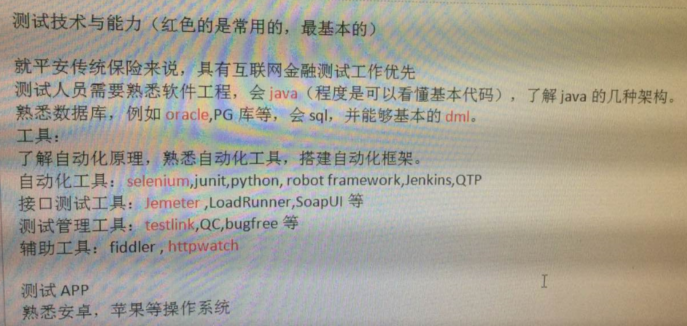

<!-- slide: 71 -->

## 几种常用软件测试工具介绍

- (1) QACenter
- QACenter自动化测试系列工具是Compuware公司的产品，它能够帮助测试人员创建快速、可重用的测试过程。这些测试工具可以帮助管理测试过程，快速分析和调试程序，包括针对回归、强度、单元、并发、集成、移植、容量、负载测试、自动执行测试和产生测试结果文档。

<!-- slide: 72 -->

- QACenter主要包括
- QARun、
- QALoad、
- QADirector、
- EcoTools
- TESTBytes
- 等模块。

<!-- slide: 73 -->

- (2) WinRunner（QTP）
- WinRunner是Mercury Interactive公司提供的一个企业级的功能检测工具。WinRunner使功能测试得以自动化，从而保证了应用程序按照预定方式运行。它以测试脚本形式将业务的过程记录下来，并随着相应的应用程序的开发或更新来支持对脚本的改进。执行脚本及报告结果在整个的应用周期中可对脚本重复使用。
- 目前WinRunner已被HP公司收购，新一代的WinRunner被命名为QTP

<!-- slide: 74 -->

- (3) LoadRunner
- LoadRunner是Mercury Interactive公司开发的一种预测系统行为和性能的负载测试工具，它可以通过模拟成千上万个用户和实施实时监测来确认和查找问题。对于有实力的大公司而言，这款软件可能比较适合，它的功能与QALoad相比不相上下。通过使用LoadRunner，企业能够最大限度地缩短测试时间、优化性能和加速应用系统的发布周期。

<!-- slide: 75 -->

- (3) LoadRunner
- LoadRunner是一种具有较高规模适应性的自动负载测试工具，它能预测系统行为，优化性能，强调的是整个企业的系统。通过模拟实际用户的操作行为和实行实时性能监测，来查找和确认存在的问题。

<!-- slide: 76 -->

- (4) GUI接口自动化测试工具
- 目前市场上有关GUI形式的自动化测试软件种类相当多，而且所支持的操作平台也越来越多。基本上GUI自动测试的原理就是以录制和播放（Record and Replay）为主要的操作方式。由于每一家开发公司所采用的开发技术不同，因此使用者所要学习的指令编写方式也大不相同。

<!-- slide: 77 -->

- (4) GUI接口自动化测试工具
- 虽然学习这些指令并不困难，但是要将这些测试软件的功能发挥好，就必须非常熟悉软件所提供的API及函数，所以如果要学会所有的GUI自动测试软件指令，也不是一件容易的事。由于GUI自动化测试软件有相当多的种类，在这里只介绍两种GUI自动化测试软件。它们分别是Rational公司发行的Visual Test与Seapine公司发行的QA Wizard for Web版本。

<!-- slide: 78 -->

- Visual Test
- 使用Visual Test并不困难，而且熟悉Microsoft Visual Studio的使用者会发现它与Visual Studio的使用界面几乎相同。
- 它使用类似Visual Basic的语言，编程进行起来简单直接，同时它也具备使用指针处理复杂数据结构的高级功能，这让用Visual Test更容易调用Windows API。

<!-- slide: 79 -->

- QA Wizard
- QA Wizard是由Seapine软件公司开发的。
- 基本上QA Wizard也是一个录制和播放的自动化测试。

<!-- slide: 80 -->

- QA Wizard
- 目前的版本只支持Microsoft的IE浏览器，而未来将推出支持Netscape浏览器的版本。
- QA Wizard最大的好处是它已经不需要再去对所产生的Script进行修改，当然如果有必要的话，使用者也可以很容易地进行修改。在资料存储上它采用微软的Access MDB。

<!-- slide: 81 -->

- QA Wizard
- 在使用QA Wizard录制使用者的操作行为时，在浏览器的上端会嵌入QA Wizard的功能栏，这个功能栏提供了Record、Run、Pause、Stop、Checkpoint及Properties 6种功能键。这6种功能可以让使用者自由地操作录制的过程。

<!-- slide: 82 -->

- (5) BoundsChecker
- BoundsChecker是用于Visual C++开发环境所开发的程序代码的一个很优秀的自动捕捉错误及调试工具。它最主要的功能是协助程序开发人员快速找出与内存及资源有关的错误，并且指出是哪一行程序代码所导致的。

<!-- slide: 83 -->

- (6) CodeReview
- CodeReview是针对 Visual Basic开发环境所开发的程序代码分析工具。这套工具可以检测出Visual Basic程序代码内可能出现错误的环节，一旦问题被捕捉出来，CodeReview会将出错的内容及导致出错的原因一一呈现给开发人员。

<!-- slide: 84 -->

- (7) SmartCheck
- SmartCheck也是针对Visual Basic开发环境的分析工具。
- (8) JCheck
- JCheck是用来分析Java执行过程与事件的工具，它可实时监控程序执行的状态。JCheck的最大特点是能将Java语言的执行过程以图形化的方式表现出来。

<!-- slide: 85 -->

- (9) TrueTime
- TrueTime是分析程序执行性能的工具，它能够自动锁定延缓程序执行速度的程序代码，并产生分析报表。
- (10) TrueCoverage
- TrueCoverage与TrueTime一样同时支持Visual C++、Visual Basic及Java程序语言。

<!-- slide: 86 -->

- (11) FailSafe
- FailSafe可以让开发人员在程序代码中加入错误处理程序代码，在程序发生错误时产生报告以方便错误的追查，同时也可以避免程序因错误而造成不正常的结束。FailSafe可以提高编写VisualBasic程序的稳定度，同时也方便日后的产品维护。

<!-- slide: 87 -->

- 补充
- CodeGuard：程序崩溃和内存泄露检测工具
- 集成在Delphi/C++ Builder里

<!-- slide: 88 -->

## 用QTP进行GUI层自动化测试

- QTP前身是Mercury Interactive公司的WinRunner，被HP公司收购。能进行功能测试等多种用途的自动化测试。
- 它以测试脚本形式将业务的过程记录下来，并随着相应的应用程序的开发或更新来支持对脚本的改进，执行脚本及报告结果。在整个的应用周期中可对脚本重复使用。

<!-- slide: 89 -->

## GUI层自动化测试的难点

- 界面对象识别
- 脚本维护

<!-- slide: 90 -->

## GUI层自动化测试用例的选取方法

- 基本流程、基本业务场景、冒烟测试
- 简单、可重复、机械化
- 大数据量覆盖
- 对象识别复杂度低

<!-- slide: 91 -->

## GUI层自动化测试工具选型

- 横向对比、项目试点
  - 对象识别能力
  - 脚本语言
  - 脚本组织维护方式
  - 可扩展性
  - 基于工具搭建框架的难度

<!-- slide: 92 -->

## QTP简介

- QTP对象识别技术
- AJAX控件的处理办法
- 模块化脚本设计
- 共享函数库结构脚本设计
- 面向页面对象的脚本设计模式
- 数据驱动脚本设计
- 对象库管理
- 分层结构化设计模式

<!-- slide: 93 -->

## GUI对象识别技术

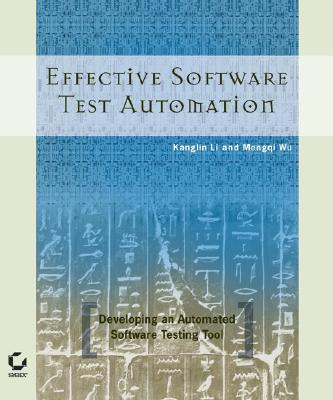
- Windows API、MSAA、.NET UI Automation
- DOM（Document Object Modal）
- …
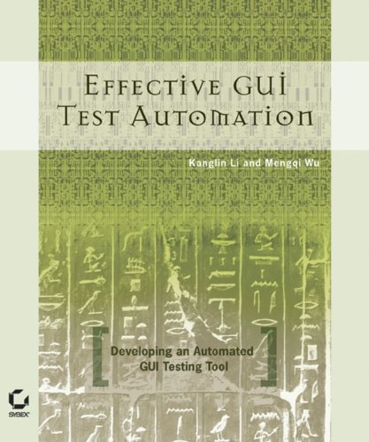
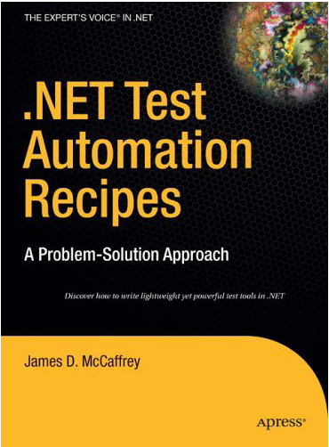

> 备注：G:\资料\QTP培训课程\QTP工具应用实战\Docs\UI自动化测试技术的演变.pdf

<!-- slide: 94 -->

## 线性脚本

- 使用简单的录制回放的方法
  - 一种非结构化的编程方式；
  - 测试用例由脚本定义；
  - 非常低的开发成本；
  - 测试人员所需要的编程方面的技巧几乎可以忽略；
  - 不需要计划、设计；
  - 测试数据在脚本中是硬编码的。

> 备注：以QTP为例介绍几种脚本设计方式的特点

<!-- slide: 95 -->

## 结构化脚本

- 结构化脚本编写方法在脚本中使用结构控制。结构控制让测试人员可以控制测试脚本，和测试用例的流程。
  - 测试用例在脚本中定义；
  - 编程的成本要比线性脚本编写方法略微高一点；
  - 需要测试员调整编码技巧；
  - 需要某种程度上的计划、设计；
  - 测试数据也是在脚本中被硬编码；
  - 因为相对稳定一点，所以需要相对少的脚本维护，维护成本比线性脚本编写方法的要相对低；
  - 除了编程知识外，还需要一些脚本语言的知识。

<!-- slide: 96 -->

## 共享脚本

- 共享脚本编写方法是把代表应用程序行为的脚本在其他脚本之间共享。共享脚本编写方法的特点是：
  - 脚本是结构化的；
  - 测试用例在脚本中定义；
  - 开发成本相对于结构化脚本编写方法来说，要降低一些，因为减少了很多复制的劳动；
  - 需要测试员的调整代码的编程技巧；
  - 由于脚本需要模块化，所以需要更多的计划和设计；
  - 测试数据也是硬编码；
  - 脚本维护和维护成本要比线性脚本编写方法相对低；

<!-- slide: 97 -->

## 数据驱动脚本设计

- 数据驱动脚本编写方法把数据从脚本分离出去，存储在外部的文件中。数据驱动脚本编写方法的特点是：
  - 脚本是以结构化的方式编程的；
  - 测试用例由测试数据或脚本定义；
  - 由于脚本参数化和编程成本，这种方法的开发成本跟共享脚本编写方法比较相对较高；
  - 需要测试员较高的代码调整方面的编程技巧；
  - 需要更多的计划和设计；
  - 数据独立存储在数据表或外部文件；
  - 脚本维护成本较低。

<!-- slide: 98 -->

## 数据驱动脚本设计

- 如何数据驱动？
  - 数据源（Excel、CSV、TXT、XML、DB）
  - 数据的组织（输入数据、预期结果数据）

<!-- slide: 99 -->

## 基于Excel的用例组织框架

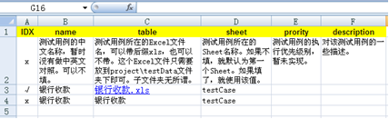
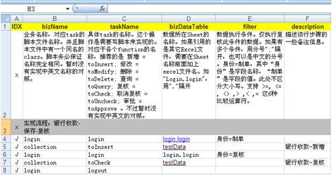
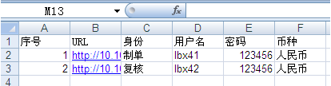
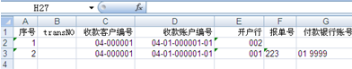
- Test Set
- TestCase
- Test Data
- Test Data

> 备注：G:\资料\QTP培训课程\自动化测试框架\scripts\project
G:\资料\QTP培训课程\自动化测试框架\doc\轻量级自动化测试框架-QTP Based.ppt

<!-- slide: 100 -->

## 关键字驱动脚本

- 什么是关键字？
- 关键字驱动的好处
- 关键字驱动脚本设计对人员的要求
- 关键字驱动对框架设计的要求

<!-- slide: 101 -->

## High Level关键字与Low Level关键字

- Low Level关键字是指封装的关键字是接近测试步骤中的每个操作动词，也就是用户的界面操作（GUI Operation），例如：Click、Type、Select等。
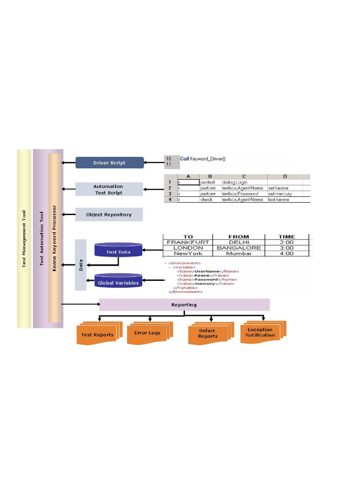

> 备注：G:\资料\Automation Framework\Open2Test\QTP\v2.0\

<!-- slide: 102 -->

## High Level关键字与Low Level关键字

- High Level的关键字体现业务流程中的业务操作，例如Login、Enter Client、Query Order等。High Level关键字更贴近业务，更容易被手工测试人员、业务人员理解，并且由于封装了High Level的关键字，屏蔽了底层细节（如GUI对象、GUI操作），所以更容易使用，可重用度更高，手工测试人员或业务人员只需要关注测试的业务流程和测试数据。
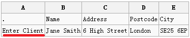

> 备注：G:\项目\AIA\PGS & iPos
KeywordFramework Demo

<!-- slide: 103 -->

## 关键字驱动脚本

- 关键字驱动脚本编写方法是把检查点和执行操作的控制都维护在外部数据文件。关键字驱动脚本编写方法是数据驱动测试方法的扩展：
  - 综合了数据驱动脚本编写方法、共享脚本编写方法、结构化脚本编写方法；
  - 测试用例由数据定义；
  - 开发成本高，因为需要更多的测试计划和设计、开发方面的投入
  - 要求测试人员有很强的编程能力；
  - 最初的计划和设计、管理成本会比较高；
  - 需要额外的框架或库，因此，测试员需要更多的编程技巧；
  - 维护成本比较低；

<!-- slide: 104 -->

## 自动化测试框架设计

- 选择驱动方法：数据驱动 或者 关键字驱动
- 选择自动化软件：开源软件 或者 商业工具
- 自动化测试用例的组织和管理
- 自动化测试用例调度执行框架
- 测试日志与报告框架

<!-- slide: 105 -->

## 基于商业工具搭建GUI层自动化测试框架

- QTP自动化测试框架类型
  - QTP自身 （Action、Function、DataTable）
  - QTP+QC\ALM=BPT
  - 基于Excel构建数据驱动、关键字驱动框架

> 备注：QC:Quality Center
QC是测试管理工具，用于测试流程管理、保存测试用例、执行、bug记录等

<!-- slide: 106 -->

## BPT模式的自动化测试

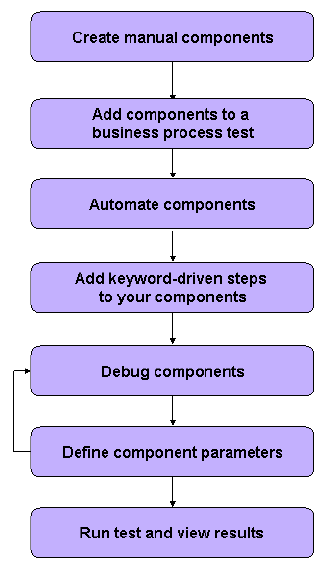

> 备注：G:\资料\QTP培训课程\BPT最佳实践\BPT最佳实践.ppt

Business Process Testing，业务流程测试

<!-- slide: 107 -->

## 基于开源工具搭建GUI层自动化测试框架

- Selenium自动化测试框架类型
  - Eclipse+Junit\TestNG+Selenium
  - VisualStudio+MSTest\Nunit+Selenium
  - Robot Framework\Fitnesse\Cucumber+Selenium
  - 基于Excel构建数据驱动、关键字驱动的Selenium框架

> 备注：http://sahitest.com/demo/index.htm
《selenium2自动测试实战--基于Python语言》

简单例子：
安装python
安装selenium (pip install selenium)
安装chromedriver （注意chrome与chromedriver的版本要匹配）

from selenium import webdriver
from selenium.webdriver.common.keys import Keys
import time

driver = webdriver.Chrome()  # 打开chrome，如果没有安装chrome,换成webdriver.Firefox()
driver.maximize_window()  # 最大化浏览器窗口
driver.implicitly_wait(8)  # 设置隐式时间等待

driver.get("https://www.baidu.com")  # 地址栏输入百度地址
input_ele = driver.find_element_by_xpath(r'//*[@id="kw"]')
search_string = "software testing"
input_ele.send_keys(search_string)
input_ele.send_keys(Keys.RETURN)

time.sleep(10)

driver.quit()

<!-- slide: 108 -->

## 自动化测试管理平台设计

- 自动化测试管理平台设计
- 如何降低自动化测试执行的总体时间？
- 自动化测试用例与测试用例、缺陷的关联管理
- 自动化测试与持续集成的整合
- 自动化测试度量与报告管理
- 自动化测试管理平台设计案例分析
- 框架在大规模自动化测试项目中应用的不足之处

<!-- slide: 109 -->

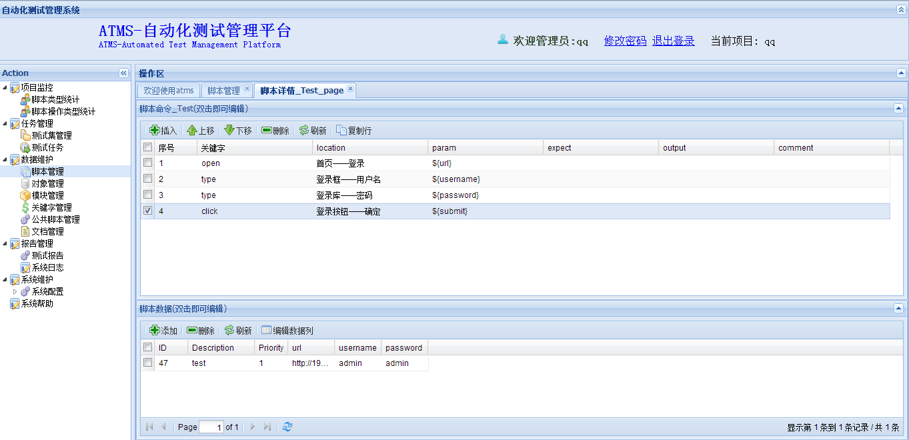

<!-- slide: 110 -->

- <number>
- 谢  谢！
- 华南理工大学 计算机科学与工程学院
- 广州市番禺区大学城华南理工大学
- 邮编：510006
- 电子邮件: nieyongwei@scut.edu.cn
