# 软件测评-6-JMeter性能测试及自动化

<!-- slide: 1 -->

- 1
- 2010年度广州市电子商务发展专项资金
- 扶持项目
- 软件测试与质量保障
- 华南理工大学计算机科学与工程学院
- 聂勇伟 副教授
- nieyongwei@scut.edu.cn
- 第六章 - JMeter性能测试及自动化

<!-- slide: 2 -->

## 目录

- 性能测试基本概念
- JMeter性能测试实战
- 性能测试流程

<!-- slide: 3 -->

## 性能测试基本概念

<!-- slide: 4 -->

## 基本概念

- 性能缺陷的来源
  - 需求阶段
    - 功能需求不确定，在进入开发阶段时还在增加和修改。
    - 性能需求不明确。
  - 技术
    - 系统构架方面不适当的选择。
    - 选择先进但不稳定的技术。

<!-- slide: 5 -->

## 基本概念

- 性能测试定义
  - 检测系统的性能表现，包括特定情况下，系统的响应能力和稳定性。

<!-- slide: 6 -->

## 基本概念

- 性能测试目的
  - 性能测试主要评价系统或组件的性能是否和具体的性能需求一致。例如：对访问速度的性能需求或对内存使用情况的需求。
  - 特定性能测试的关注点在于组件或系统在规定的时间内和特定的条件下响应用户或系统输入的能力。

<!-- slide: 7 -->

## 基本概念

- 性能测试目的的进一步说明
  - 性能测试关注的是系统性能是否和具体的性能需求相一致，而当系统性能超过性能需求的时候，系统的表现并不是测试人员关心的重点。

<!-- slide: 8 -->

## 基本概念

- 性能测试目的的进一步说明
  - 例如：性能需求中要求系统应该支持最大同时在线用户为5000个，那么在性能测试过程中重点测试系统是否能支持5000个用户同时在线；当有5000个用户同时在线后，性能测试需要关注整个系统的运行是否符合要求；而对于在线用户超过5000人的时候，系统的表现行为并不是性能测试需要关注的。

<!-- slide: 9 -->

## 基本概念

- 性能度量方法
  - 系统资源开销：CPU，内存等
  - 稳定性：是否容易宕机
  - 执行速度：常用响应时间、吞吐量、吞吐率来表示

<!-- slide: 10 -->

## 基本概念

- 性能度量方法
  - 不同的性能的度量方法取决于不同的被测对象
    - 对于单独软件组件，其性能可根据CPU主频来判定
    - 对于带客户端的系统，其性能则要根据系统处理特定用户请求的响应时间来判定
    - 对于由多种组件（如客户端、服务器、数据库）构成的系统，则要进行各组件之间的性能测试

<!-- slide: 11 -->

## 基本概念

- 性能测试原理图
- Controller
- EBS服务器
- 数据库
- Agent
- Agent

<!-- slide: 12 -->

## 基本概念

- 性能测试原理图
- EBS服务器
- 数据库
- Agent
- Agent
- Controller

<!-- slide: 13 -->

## 基本概念

- 性能测试原理图
- Agent
- Agent
- 登录服务器
- 数据库
- Controller

<!-- slide: 14 -->

## 基本概念

- 性能测试模型
- 被
- 评
- 测
- 网
- 游
- 服务请求。含有以下数据
- （正确/错误/非法/边缘）
- 请求接受
- 请求拒绝
- 处理正确
- 处理出错
- 系统响应时间
- 吞吐率
- 资源利用率
- 错误类型i
- 错误概率
- 错误间隔时间
- 事件发生概率
- 事件发生间隔时间
- 事件类型k

<!-- slide: 15 -->

## 基本概念

- 性能测试的重要性
  - 产品的性能对用户是否会持续使用该产品影响很大
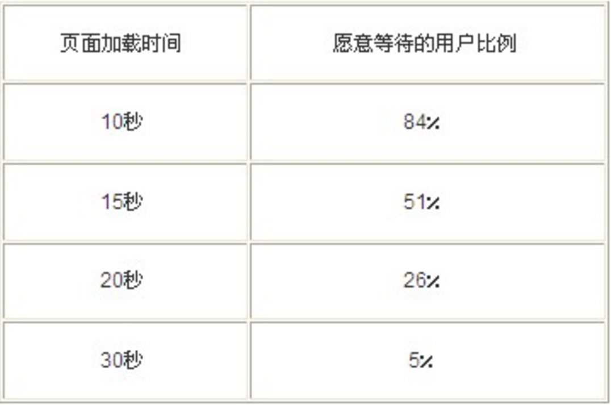

<!-- slide: 16 -->

## 基本概念

- 16
- 负载测试
  - 负载测试是一种通过增加负载来评估组件或系统的性能的测试方法。
  - 例如：通过增加并发用户数和（或）事务数量来测量组件或系统能够承受的负载。

<!-- slide: 17 -->

## 基本概念

- 17
- 负载测试
  - 负载测试和性能测试的主要区别在于负载测试时，系统负载是逐渐增加的，而不是一步到位，负载测试需要观察系统在各种不同的负载情况下是否都能够正常工作

<!-- slide: 18 -->

## 基本概念

- 18
- 负载测试
  - 下图是某网站随着用户数量的增加，对应的响应时间也在增加的趋势图
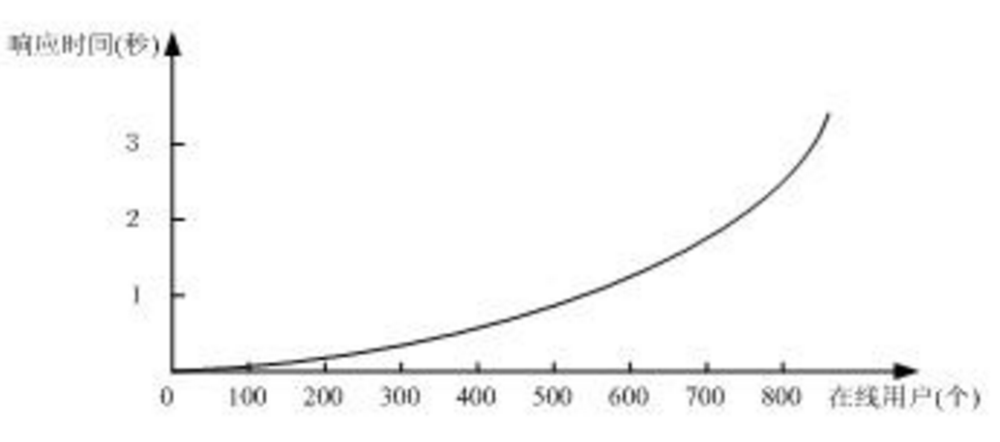

<!-- slide: 19 -->

## 基本概念

- 19
- 负载测试
  - 通过观察，可以发现随着用户数目的增加，系统响应时间也跟着增加。当在线用户数到700以后，系统响应时间增速明显加快。
  - 响应时间只是需要观察的数据之一，随着测试负载的增加还需要观察系统资源等占有情况

<!-- slide: 20 -->

## 基本概念

- 负载测试
  - 例2

<!-- slide: 21 -->

## 基本概念

- 压力测试
  - 压力测试是评估系统处于或超过预期负载时系统的运行情况。压力测试的关注点在于系统在峰值负载或超出最大载荷情况下的处理能力
  - 在压力级别逐渐增加时，系统性能应该按照预期缓慢下降，但是不应该崩溃
  - 压力测试还可以发现系统崩溃的临界点，从而发现系统中的薄弱环节

<!-- slide: 22 -->

## 基本概念

- 压力测试
  - 压力测试和负载测试的区别在于是否超出了系统的预期负载
  - 例如：系统最大支持的同时在线用户数是1000个，压力测试需要测试在1000个用户甚至2000个用户同时在线时系统的表现。
  - 压力测试也可以针对系统资源进行测试，例如：在系统内存耗尽情况下，测试系统的运行情况，这种情况下被测试系统也不应该崩溃。

<!-- slide: 23 -->

## 基本概念

- 压力测试
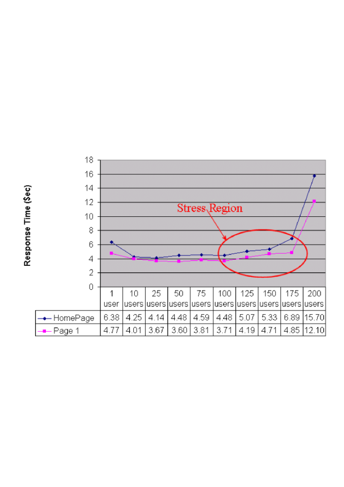
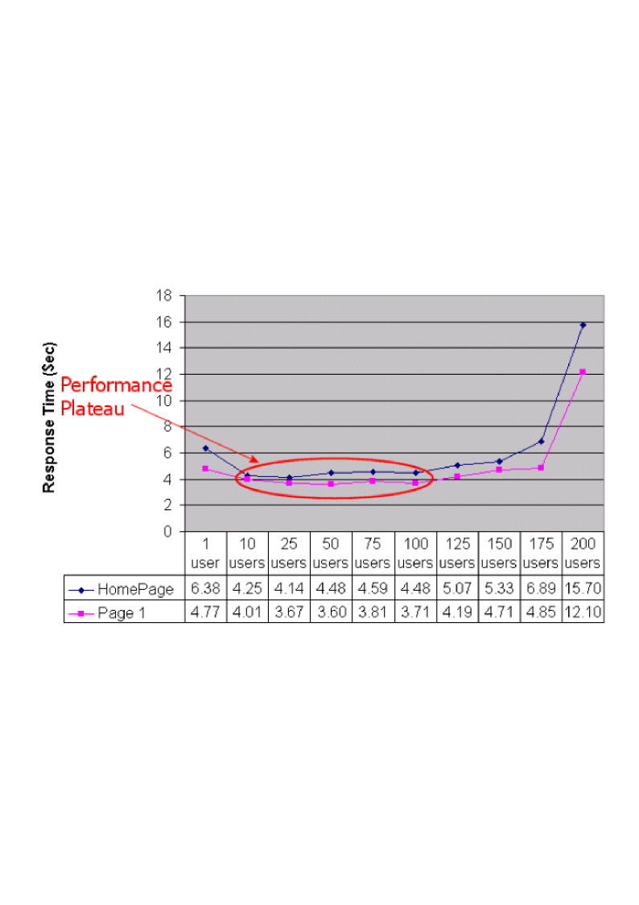

<!-- slide: 24 -->

## 基本概念

- 性能测试，负载测试，压力测试
  - 目前在软件测试领域，对这三种测试类型的定义并不统一
  - 在实际的测试工作中，性能测试这个词被广泛的使用。在很多场合，性能测试是上述三种测试类型的通称；在有的书籍或者参考资料中，性能测试的范围甚至更加广泛。

<!-- slide: 25 -->

## 基本概念

- 其他重要概念
  - 响应时间
  - 并发量
  - 吞吐量

<!-- slide: 26 -->

## 基本概念

- 响应时间
  - 概念
    - 服务器收到请求的时刻开始计时，到服务器完成请求执行的这一段时间的间隔。
  - 期望值
    - 不同系统有不同的要求。
    - 不同的人有不同要求。
    - （跟个人所处地理位置、连接状况有关）

<!-- slide: 27 -->

## 基本概念

- 响应时间
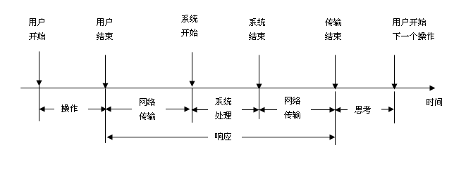

<!-- slide: 28 -->

## 应用程序中不同点的响应时间

- 28
- 度量端到端的响应时间：

<!-- slide: 29 -->

## 应用程序中不同点的响应时间

- 29
- 度量网络和服务器响应时间：

<!-- slide: 30 -->

## 应用程序中不同点的响应时间

- 30
- 度量服务器响应时间：

<!-- slide: 31 -->

## 应用程序中不同点的响应时间

- 31
- 度量中间件到服务器的响应时间：

<!-- slide: 32 -->

## 基本概念

- 响应时间
  - 影响因素
    - 不同的交易会有不同的响应时间。
    - 不同的交易组合会相互影响。
    - 不同的并发会影响交易的响应时间。
    - 服务器的配置、用户跟服务器之间的距离等都会影响到响应时间。

<!-- slide: 33 -->

## 基本概念

- 并发量
  - 概念
    - 并发请求发出的间隔时间非常的短，可以在“毫秒”级别内。
    - 并发请求会对系统的处理造成一定的混乱。
  - 期望值
    - 不同的岗位的有不期望。
    - 不同系统有不同的预期。

<!-- slide: 34 -->

## 基本概念

- 并发量
  - 影响因素
    - 事务的消耗资源的类型和大小。
    - 服务器及网络设备关键资源的硬件配置。
    - 服务器的系统和相关应用配置。
    - 应用程序的代码质量。

<!-- slide: 35 -->

## 基本概念

- 吞吐量
  - 概念
    - 是单位时间内完成工作量的量度。
    - 描述系统能够处理交易的能力。
    - 衡量一个系统是否可用的最直接的指标。
  - 期望值
    - 越大越好，但不知道具体的数值。

<!-- slide: 36 -->

## 基本概念

- 吞吐量
  - 影响因素
    - 事务的消耗资源的类型和大小。
    - 服务器及网络设备关键资源的硬件配置。
    - 服务器的配置。
    - 应用程序的代码质量。

<!-- slide: 37 -->

## 基本概念

- 并发量响应时间关系
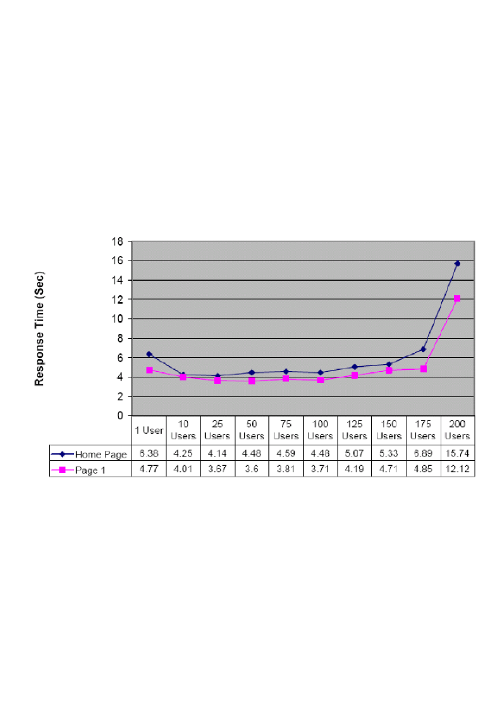

<!-- slide: 38 -->

## JMeter实战

<!-- slide: 39 -->

- Jmeter简介
- JMeter是一款Java桌面应用程序，它的用户界面采用Swing Java API实现。
- JMeter是一个跨平台工具，能够运行在任何安装了Java虚拟机的操作系统(Windows, Linux, Mac)的设备上。
- 它的框架支持并发和或者线程组的执行，用于负载测试和压力测试。多线程
- 它是可扩展的，提供了大量的可用插件。
- JMeter是Apache软件基金会下的一个子项目，完全免费和开源。

<!-- slide: 40 -->

- Jmeter安装
- 首先安装java环境：JDK
- http://www.oracle.com/technetwork/java/javase/downloads/index.html
- 设置环境变量JAVA_HOME，使其指向JDK的安装目录。Windows用户而言：
  - JAVA_HOME=C:\Program Files\Java\jdk1.8.0_20
- 将java编译路径添加到系统路径下。Windows用户而言：
  - 将C:\Program Files\Java\jdk1.8.0_20\bin添加到系统变量Path尾部。

<!-- slide: 41 -->

- Jmeter安装
- 从http://jmeter.apache.org/download_jmeter.cgi下载最新版本的JMeter
- 解压
- 进入\bin，执行jmeter.bat

<!-- slide: 42 -->

- JMeter介绍
- JMeter几乎提供任何一种系统的测试配置。总的来说，包含下列协议：
  - Web: HTTP, HTTPS网站
  - Web 服务: SOAP / XML-RPC
  - 支持任何一种数据库（例如通过JDBC驱动的数据库）
  - 使用POP3, IMAP, SMTP协议的邮件服务
  - FTP服务
  - 使用JUnit和Java应用程序的进行的功能测试

<!-- slide: 43 -->

- JMeter介绍
- JMeter测试计划和组件：
  - 创建测试计划
  - 配置测试计划
  - 执行测试计划
  - 结果分析

<!-- slide: 44 -->

- JMeter介绍
- JMeter测试计划由以下组件组成：
  - 线程组（ThreadGroup）
  - 采样器（Samplers）
  - 逻辑控制器(Logic Controllers)
  - 监听器(Listeners)
  - 定时器(Timers)
  - 断言(Assertions)
  - 配置节点(Configuration nodes)
  - 前置处理器(Pre processors)
  - 后置处理器(Post processors)

<!-- slide: 45 -->

- JMeter介绍
  - 线程组（ThreadGroup）
  - 一个线程组基本上是某测试计划各个元素的组合，它是一个测试计划的核心，控制着测试基本参数
  - 为了创建一个测试计划，首先要创建一个线程组，配置如下参数：
    - 线程数：执行测试计划的线程数，这个参数对于配置负载和压力测试非常重要。
    - 过渡期：JMeter开始启动所有线程所需时间。
    - 循环次数:即迭代次数，也就是测试计划被执行的次数
    - 错误行为：错误场景下的行为模式：阻止当前线程，停止整个测试，继续执行…

<!-- slide: 46 -->

- JMeter介绍
  - 线程组（ThreadGroup）
  - 一个线程组基本上是某测试计划各个元素的组合，它是一个测试计划的核心，控制着测试基本参数
  - 为了创建一个测试计划，首先要创建一个线程组，配置如下参数：
    - 线程数：执行测试计划的线程数，这个参数对于配置负载和压力测试非常重要。
    - 过渡期：JMeter开始启动所有线程所需时间。
    - 循环次数:即迭代次数，也就是测试计划被执行的次数
    - 错误行为：错误场景下的行为模式：阻止当前线程，停止整个测试，继续执行…

<!-- slide: 47 -->

- JMeter介绍
  - 线程组（ThreadGroup）
  - 可以为线程组配置开始和结束时间：通过单击复选框“Scheduler”，弹出带有调度参数的面板，为测试配置开始和结束时间
  - 线程组配置完成后，可以开始添加其他测试计划元素到线程组，例如采样器，侦听器和定时器

<!-- slide: 48 -->

- JMeter介绍
  - 采样器（Samplers）
    - 采样器用于发送请求到不同类型的服务器
    - 采样器执行请求，这些请求产生一个或多个响应，后续将被分析
    - 采样器是每一个测试计划的基本要素，一切都围绕采样器而工作

<!-- slide: 49 -->

- JMeter介绍
  - JMeter可用的采样器列表(并不完整（可安装插件增加））：
    - 访问日志采样器
    - AJP采样器
    - Bean shell取样器
    - BSF采样器
    - 调试采样器
    - FTP采样器
    - HTTP采样器
    - Java采样器
    - JDBC采样器
    - JMS(几个)采样器
    - JSR223采样器
    - JUnit采样器
    - LDAP(几个)采样器
    - 邮件阅读器
    - MongoDB采样器
    - 操作系统进程取样器
    - SMTP采样器
    - SOAP
    - TCP采样器
    - 测试行动

<!-- slide: 50 -->

- JMeter介绍
  - 逻辑控制器(Logic Controllers)
    - 逻辑控制器允许你配置一个线程组内不同采样器的执行顺序
      - 简单控制器
      - 循环控制器
      - 一次性控制器
      - 交错控制器
      - 随机控制器
      - 随机顺序控制器
      - 流量控制器
      - 运行时控制器
      - I控制器
    - While控制器
    - Switch控制器
    - ForEach控制器
    - 模块控制器
    - include控制器
    - 事务控制器
    - 记录控制器

<!-- slide: 51 -->

- JMeter介绍
  - 监听器(Listeners)
    - 监听器提供不同的方式查看由采样器请求产生的结果。监听器以报表、树型结构、或简明的日志文件的形式分析结果。
    - 可以在测试计划中的任何地方添加监听器，但他们只会在各自的应用范围内解析和收集来自采样器的数据。

<!-- slide: 52 -->

- JMeter介绍
  - 监听器(Listeners)
    - 样品结果配置保存
    - 全图景结果集
    - 图表结果集
    - 样条线可视化工具
    - 断言结果集
    - 树形结果集
    - 整合报告
    - 表格结果集
    - 简单数据输出
    - 监测结果集
    - 分布图(alpha)
    - 整合图
    - Mailer可视化工具
    - Beanshell监听器
    - 总结报告

<!-- slide: 53 -->

- JMeter介绍
  - 定时器(Timers)
    - 使用定时器来定义请求之间的等待时间。如果不指定，JMeter会一个请求完成后立即执行下一个请求，没有任何等待时间。
      - 恒定的定时器
      - 高斯随机定时器
      - 均匀随机定时器
      - 恒定吞吐量定时器
      - 同步定时器
      - jsr223定时器
      - Beanshell定时器
      - BSF定时器
      - 泊松随机定时器

<!-- slide: 54 -->

- JMeter介绍
  - 配置节点(Configuration nodes)
    - 配置节点提供了创建变量的一种方式，这些参数之后被采样器所使用，即可通过使用配置元素将不同的参数传递给取样器请求。
      - 计数器
      - CSV数据集配置
      - FTP请求缺省值
      - HTTP授权管理
      - HTTP缓存管理
      - HTTP cookie管理
      - HTTP代理服务器
      - HTTP请求缺省值
      - HTTP头部管理
      - Java请求缺省值
    - 密钥库配置
    - JDBC连接值
    - 登录配置元素
    - LDAP请求缺省值
    - LDAP扩展请求缺省值
    - TCP采样器配置
    - 用户自定义变量
    - 简单配置元素
    - 随机变量

<!-- slide: 55 -->

- JMeter介绍
  - 前置处理器(Pre processors)
    - 前置处理器在采样器执行前被触发。可用于从响应中提取变量，这些变量后续将通过配置元素被采样器所使用。
      - HTML链接解析器
      - HTTP URL重写修改器
      - HTTP用户参数修改器
      - 用户参数
      - JDBC前置处理器
      - jsr223前置处理器
      - 正则表达式的用户参数
      - Beanshell前置处理器
      - BSF的前置处理器

<!-- slide: 56 -->

- JMeter介绍
  - 后置处理器(Post processors)
    - 后置处理器是取样器被执行后被触发执行的元素。他可用于解析响应数据，提取变量，以便后续使用
      - 正则表达式提取器
      - XPath提取器
      - Result status动作处理器
      - jsr223 后置处理器
      - JDBC 后置处理器
      - BSF后置处理器
      - jQuery/CSS 提取器
      - Beanshell 后置处理器
      - Debug后置处理器

<!-- slide: 57 -->

- JMeter介绍
  - 测试计划元素执行顺序
    - 配置节点
    - 前置处理器
    - 定时器
    - 取样器
    - 后置处理器（只在有结果可用情况下执行）
    - 断言（只在有结果可用情况下执行）
    - 监听器（只在有结果可用情况下执行）

<!-- slide: 58 -->

- JMeter介绍
  - 运行/停止测试计划
    - 运行一个测试计划，只需要点击“play”按钮：
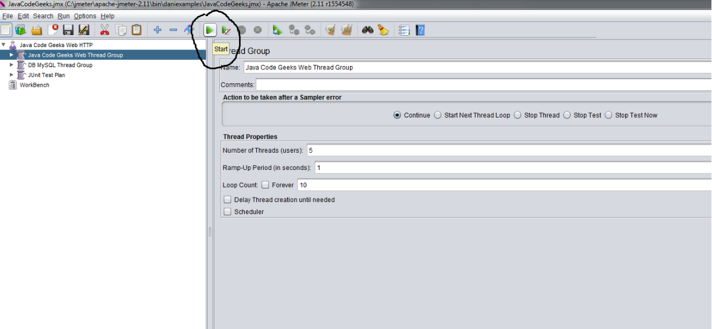

<!-- slide: 59 -->

- JMeter介绍
  - 运行/停止测试计划
    - 通过点击“停止”按钮，可以停止测试：

<!-- slide: 60 -->

- JMeter介绍
  - 运行/停止测试计划
    - 通过点击“停止”按钮，可以停止测试：
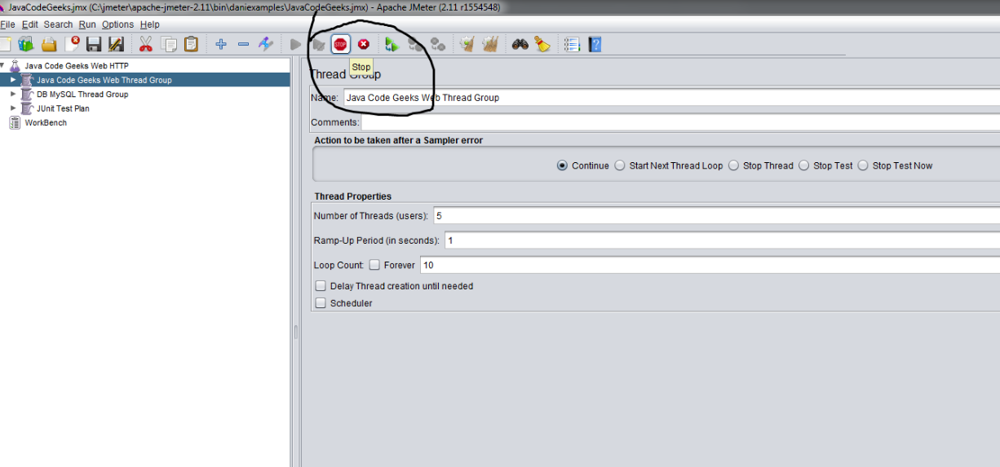

<!-- slide: 61 -->

- JMeter Web测试计划实例1
  - 通过实际例子，了解如何通过HTTP协议测试一个特定的网页的测试计划。
  - HTTP协议：协议是指计算机通信网络中两台计算机之间进行通信所必须共同遵守的规定或规则，超文本传输协议(HTTP)是一种通信协议，它允许将超文本标记语言(HTML)文档从Web服务器传送到客户端的浏览器
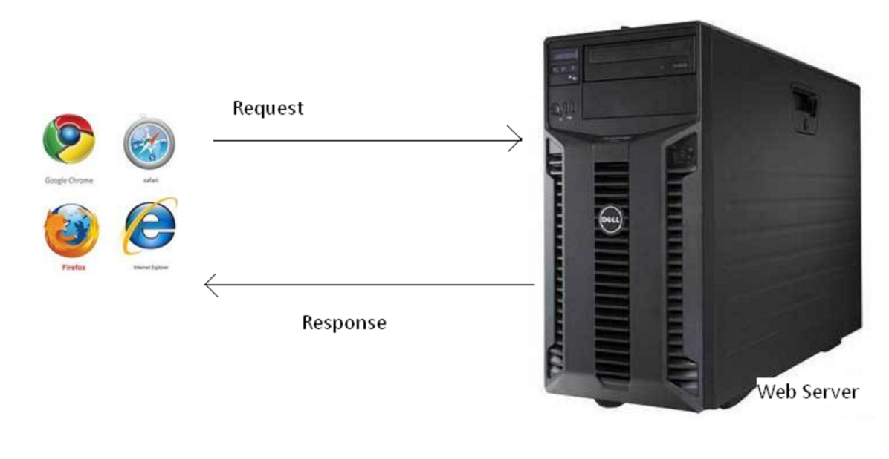

<!-- slide: 62 -->

- JMeter Web测试计划实例1
  - 命名测试计划
  - 保存测试计划
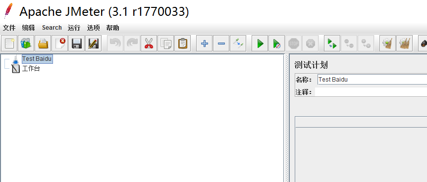

<!-- slide: 63 -->

- JMeter Web测试计划实例1
  - 添加线程组
    - 设置线程数，过渡时期，迭代次数，以及发生错误后的处理方式等
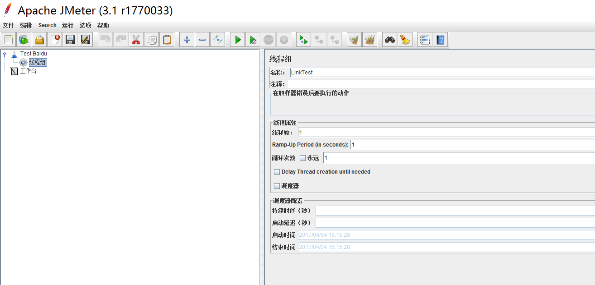

<!-- slide: 64 -->

- JMeter Web测试计划实例1
  - 添加HTTP请求取样器
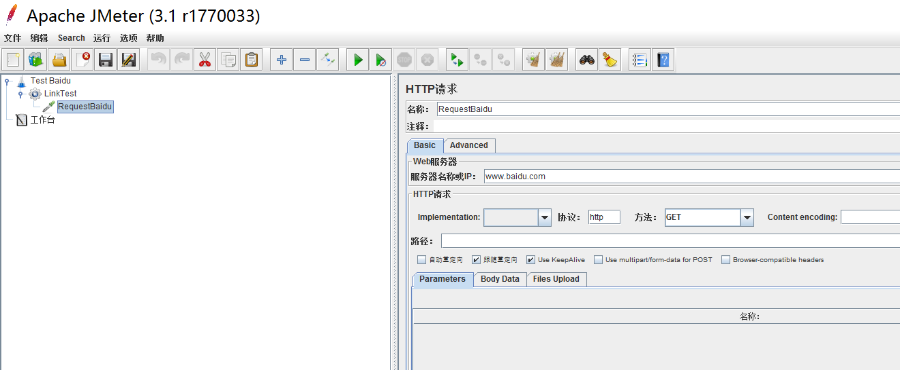

<!-- slide: 65 -->

- JMeter Web测试计划实例1
  - 添加结果监听器
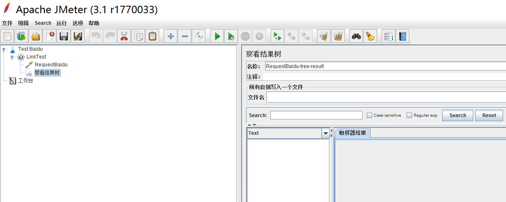

<!-- slide: 66 -->

- JMeter Web测试计划实例1
  - 保存并运行测试计划

<!-- slide: 67 -->

- JMeter Web测试计划实例1
  - 保存并运行测试计划
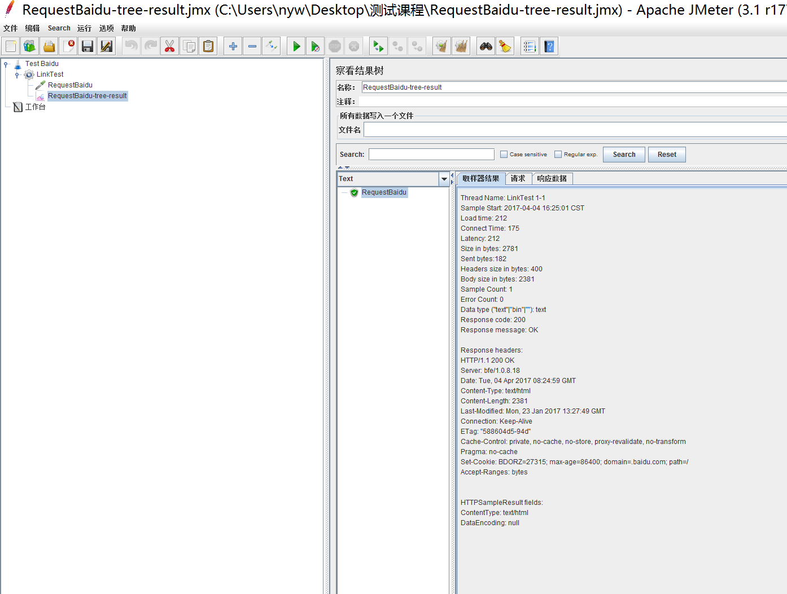

<!-- slide: 68 -->

- JMeter Web测试计划实例1
  - 添加定时器
  - 需要改变线程组循环次数
  - 改变线程延迟，查看效果
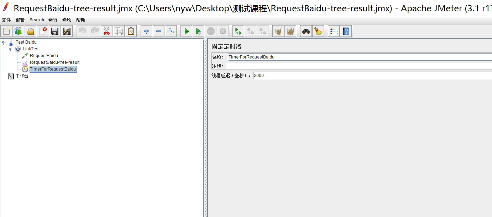

<!-- slide: 69 -->

- JMeter Web测试计划实例1
  - 添加断言
    - 响应时间断言
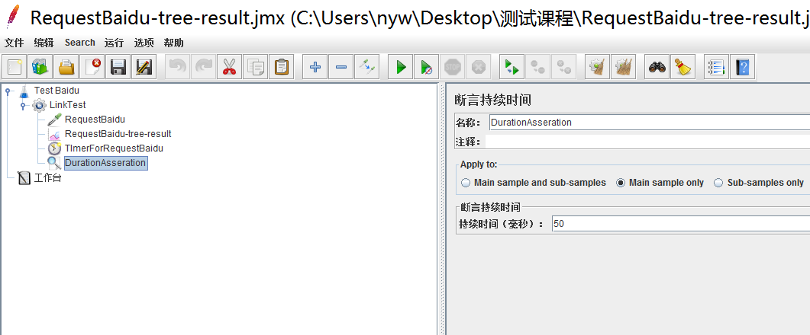

<!-- slide: 70 -->

- JMeter Web测试计划实例1
  - 添加断言
    - 响应时间断言
    - 响应尺寸断言
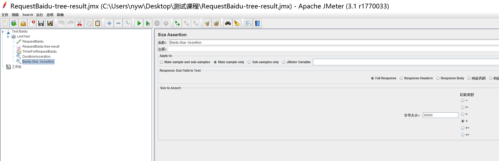

<!-- slide: 71 -->

- JMeter Web测试计划实例2
  - 通过实例2，了解在不同HTTP请求之间关联变量
  - 在本实例中，建立两个HTTP Request，第一个请求从下列网址中获取上海的城市代码
  - http://toy1.weather.com.cn/search?cityname=上海
  - 第二个请求从下列网址中获取上海的天气状况
  - http://www.weather.com.cn/weather2d/101020100.shtml

> 备注：https://blog.csdn.net/luckydarcy/article/details/52503463
http://www.weather.com.cn/weather/101230101.shtml

正则表达式：
[0-9]{9}   广州

可以通过user defined variables传递变量
也可以通过铮则表达式传递

分别定义变量，并在后面引用即可

<!-- slide: 72 -->

- JMeter Web测试计划实例2
  - 类似于实例1，新建并保存测试计划，建立线程组
  - 新建HTTP采样器，并将请求发送到
        - http://toy1.weather.com.cn
  - 设置查询路径和查询内容：/search?cityname=上海
    - 了解URL相关知识
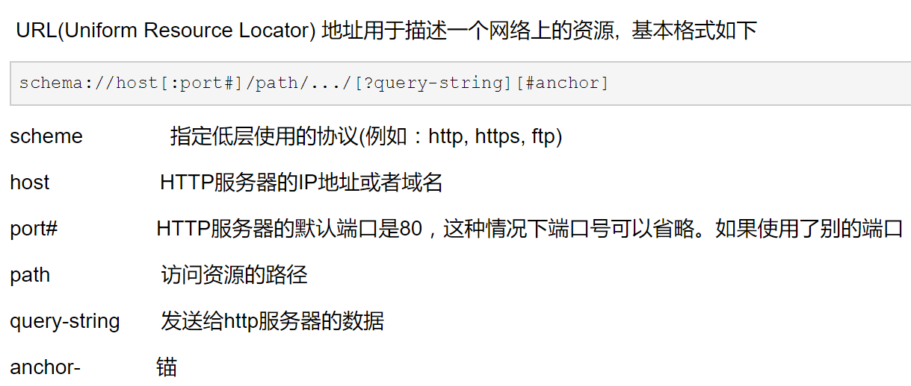

<!-- slide: 73 -->

- JMeter Web测试计划实例2
  - 类似于实例1，新建并保存测试计划，建立线程组
  - 新建HTTP采样器，并将请求发送到
        - http://toy1.weather.com.cn
  - 设置查询路径和查询内容：/search?cityname=上海
    - 了解URL相关知识
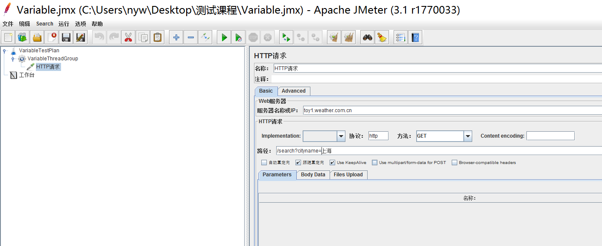

<!-- slide: 74 -->

- JMeter Web测试计划实例2
  - 类似于实例1，新建并保存测试计划，建立线程组
  - 新建HTTP采样器，并将请求发送到
        - http://toy1.weather.com.cn
  - 设置查询路径和查询内容：/search?cityname=上海
    - 了解URL相关知识
  - 为请求的信息头管理器中添加Referer信息，建立请求的上下文
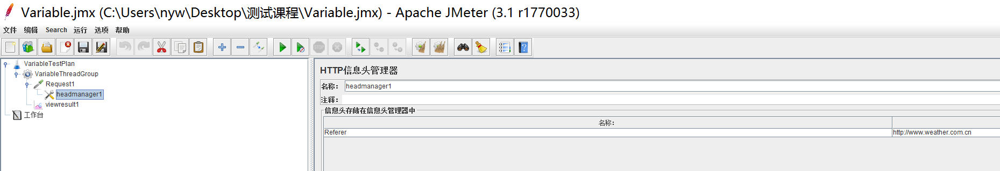

<!-- slide: 75 -->

- JMeter Web测试计划实例2
  - 建立监听器
  - 保存并执行测试计划
  - 查看监听结果
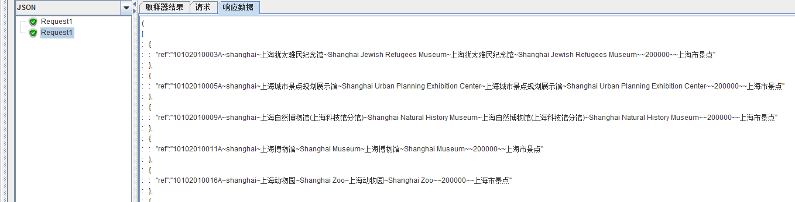

<!-- slide: 76 -->

- JMeter Web测试计划实例2
  - 添加Response Asseration
    - （上一个例子中看到了Duration与Size断言）
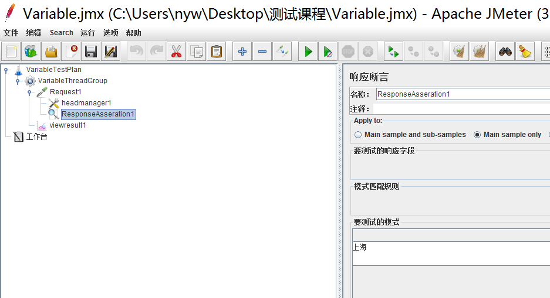

<!-- slide: 77 -->

- JMeter Web测试计划实例2
  - 添加Response Asseration
    - （上一个例子中看到了Duration与Size断言）
  - 使用用户自定义的变量（在配置元件中）
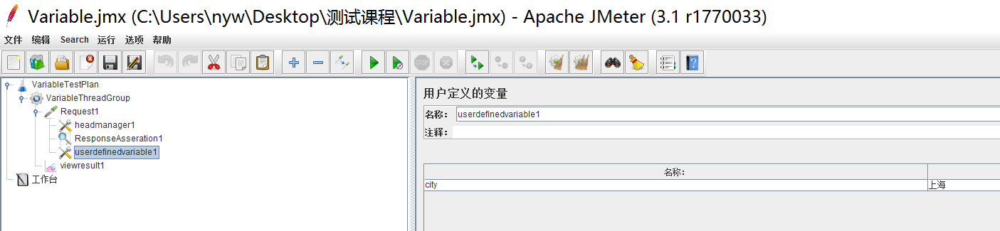

<!-- slide: 78 -->

- JMeter Web测试计划实例2
  - 从第一个请求返回的信息中，获取上海的城市代码
  - 通过添加一个后置的正则表达式处理器实现
  - (\d{9}?)~.*?~上海
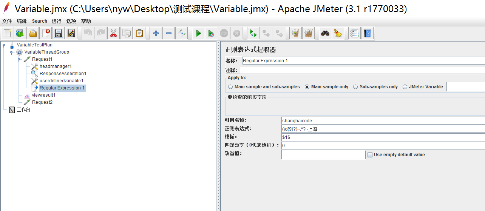

<!-- slide: 79 -->

- JMeter Web测试计划实例2
  - 从第一个请求返回的信息中，获取上海的城市代码
  - 通过添加一个后置的正则表达式处理器实现(注意：该后置处理器必须建立在请求之外，从而使别的请求可用)
            - (\d{9}?)~.*?~上海
  - 建立第二个HTTP Request
    - 配置服务器为www.weather.com.cn
    - 配置请求路径为/weather2d/${citycode}.shtml
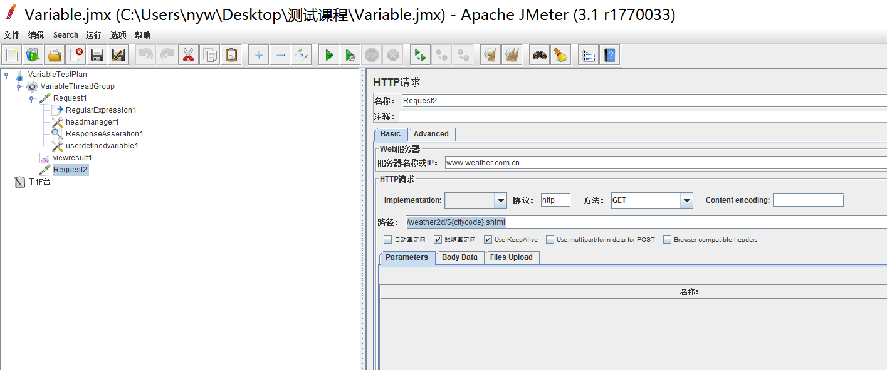

<!-- slide: 80 -->

- JMeter Web测试计划实例2
  - 查看结果
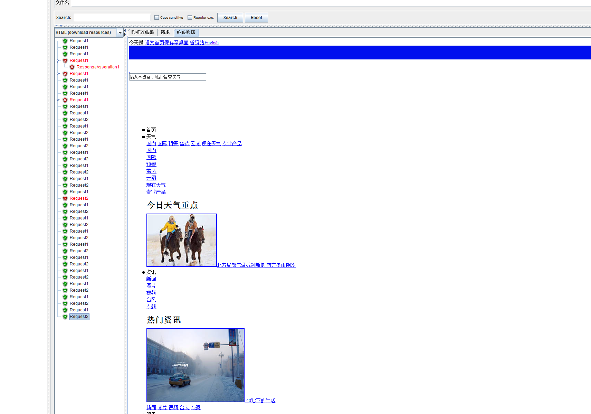

<!-- slide: 81 -->

- JMeter 脚本编写
  - 脚本运行的机制：工具提供运行环境和所需的变量，通过编程对这些变量予以控制，包括输入、处理、以及最终输出，以达到测试目的
  - 上面两个实例，实际上是脚本的所见即所得化
  - 在JMeter中，编写和使用BeanShell脚本

<!-- slide: 82 -->

- JMeter 脚本编写
  - BeanShell运行在JMeter环境中，可以调用JMeter API以及导入JMeter中的外部API
  - JMeter API的详细信息可以在以下链接中找到：
  - https://jmeter.apache.org/api/

<!-- slide: 83 -->

- JMeter 脚本编写
  - JMeter中，BeanShell作为内置组件，有如下五种形态，对应五种使用位置：
    - BeanShell Sampler
    - BeanShell PreProcessor
    - BeanShell PostProcessor
    - BeanShell Assertion
    - __BeanShell Function

<!-- slide: 84 -->

- JMeter 脚本编写
  - BeanShell Sampler：
    - 通过脚本实现独立的采样器
  - BeanShell PreProcessor
    - 为现有采样器实现前置处理器，进行变量赋值等
  - BeanShell PostProcessor
    - 为现有采样器实现后置处理器，进行收尾工作
  - BeanShell Assertion
    - 实现特定的断言功能
  - __BeanShell Function
    - 实现在采样器运行的整个过程中所需的特定功能

<!-- slide: 85 -->

- JMeter 脚本编写
  - BeanShell PostProcesser为例：
  - 首先建立测试计划，HTTP采样器，以及View Results Tree监听器
  - 然后为HTTP采样器建立BeanShell PostProcesser元素
  - 在BeanShell PostProcesser中编写如下脚本：
        - print(ctx.getCurrentSampler());
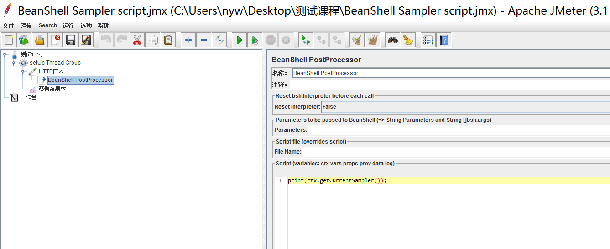

<!-- slide: 86 -->

- JMeter 脚本编写
  - 在BeanShell PostProcesser中编写如下脚本：
        - print(ctx.getCurrentSampler());
  - 运行JMeter，控制台上的输出为：
  - 为HTTP请求采样器设置服务器地址：baidu.com
  - 运行JMeter，输出为：
  - ctx即JMeter运行环境提供的一个变量，代表整个上下文
  - 通过控制ctx调用JMeter API，可以获得更多的信息

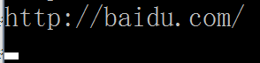

<!-- slide: 87 -->

- JMeter 脚本编写
  - 在BeanShell PostProcesser中编写如下脚本：
        - print(ctx.getCurrentSampler());
  - 运行JMeter，控制台上的输出为：
  - 为HTTP请求采样器设置服务器地址：baidu.com
  - 运行JMeter，输出为：
  - ctx即JMeter运行环境提供的一个变量，代表整个上下文
  - 通过控制ctx调用JMeter API，可以获得更多的信息

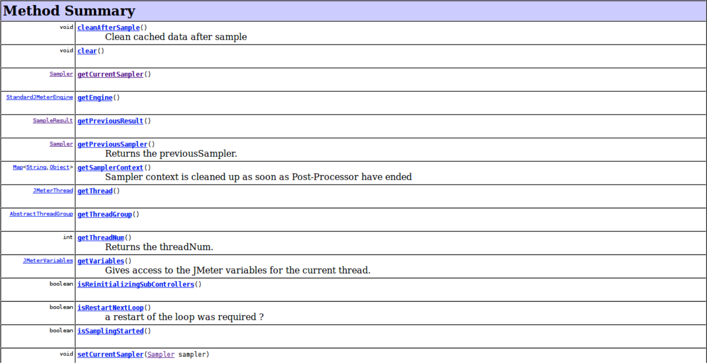

<!-- slide: 88 -->

- JMeter 脚本编写
  - 为HTTP请求采样器添加一个Cookie
  - 继续在BeanShell PostProcesser中编写如下脚本：print(ctx.getCurrentSampler().getCookieManager().get(0).toString());
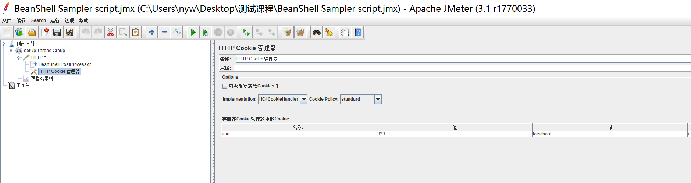
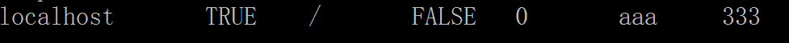

<!-- slide: 89 -->

- JMeter 脚本编写
  - 更加复杂的脚本
  - 课后可进一步深入的学习JMeter

<!-- slide: 90 -->

- JMeter做压力测试
  - 回顾：压力测试，就是 被测试的系统在一定的访问压力下，看程序运行是否稳定/服务器运行是否稳定（资源占用情况）
  - 例如： 2000个用户同时到一个购物网站购物，这些用户打开页面的速度是否会变慢，或者网站是否会奔溃

<!-- slide: 91 -->

- JMeter做压力测试
  - 步骤：
    - 写脚本或者录制脚本
    - 使用用户自定义参数
    - 场景设计
    - 使用控制器，控制模拟用户数量
    - 使用监听器， 查看测试结果

<!-- slide: 92 -->

- JMeter做压力测试
  - 实例： 在一台电脑用JMeter模拟200个用户，同时去使用百度搜索不同的关键字， 查看页面返回的时间是否在正常范围内
  - 首先，新建一个txt文档，写入搜索关键字
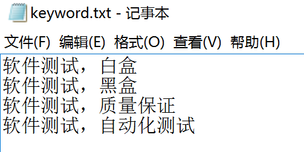

<!-- slide: 93 -->

- JMeter做压力测试
  - 其次，打开JMeter，新建测试计划，并加入线程组
  - 然后，新建配置元件：CSV Data Set Config，用以配置关键字所在文件的相关信息
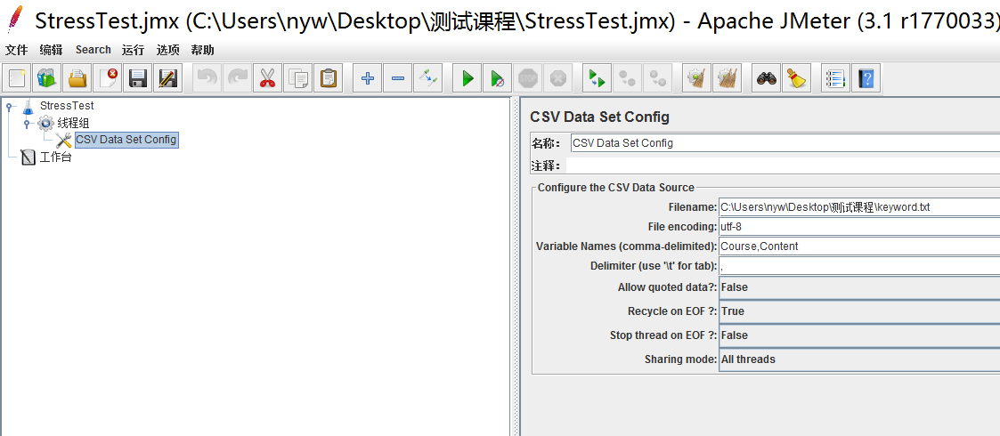

<!-- slide: 94 -->

- JMeter做压力测试
  - 其次，打开JMeter，新建测试计划，并加入线程组
  - 然后，新建配置元件：CSV Data Set Config，用以配置关键字所在文件的相关信息
  - 接着，添加HTTP请求采样器，并进行配置

<!-- slide: 95 -->

- JMeter做压力测试
  - 接着， 设置Thread Group， 控制模拟多少用户
    - 其中Ramp-up Period表示在该时间内完成所有线程

<!-- slide: 96 -->

- JMeter做压力测试
  - 接着， 设置Thread Group， 控制模拟多少用户
    - 线程数：一个用户占一个线程，  200个线程就是模拟200个用户
    - Ramp-up Period： 设置线程需要多长时间全部启动。如果线程数为200 ，准备时长为10 ，那么需要1秒钟启动20个线程
    - 每个线程发送请求的次数。如果线程数为200 ，循环次数为10 ，那么每个线程发送10次请求。总请求数为200*10=2000
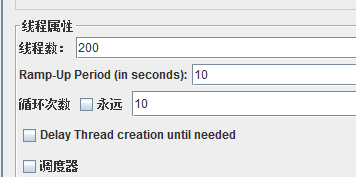

<!-- slide: 97 -->

- JMeter做压力测试
  - 最后， 添加聚合报告监听器，并运行JMeter
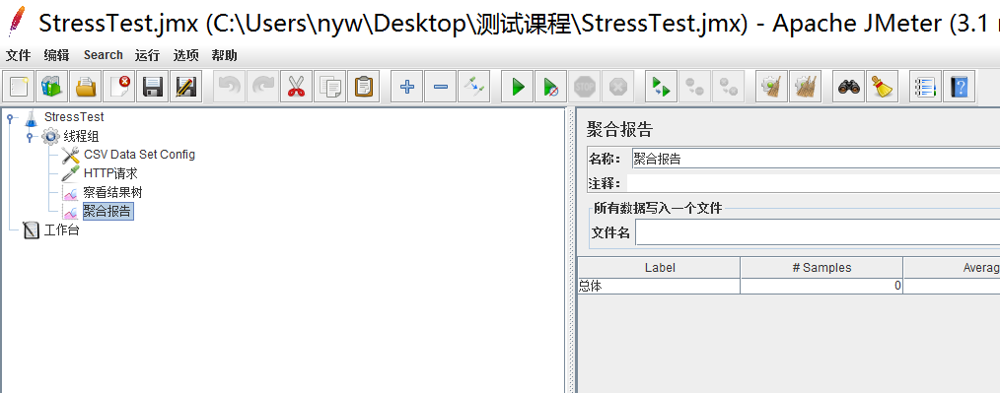

<!-- slide: 98 -->

- JMeter做压力测试
  - 通过聚合报告，查看结果：
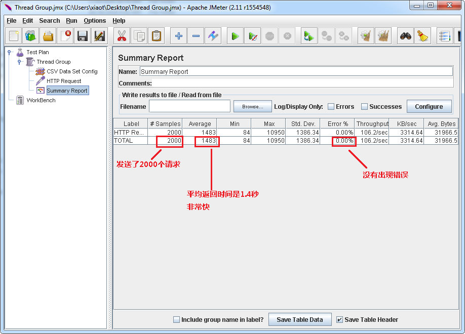

<!-- slide: 99 -->

## 性能测试工作流程

<!-- slide: 100 -->

## 工作流程

- 产生需求&目标
- 设计测试方案
- 设计测试用例
- 搭建测试环境
- 开发测试脚本
- 执行测试
- 数据分析
- 性能对比

<!-- slide: 101 -->

## 需求&目标

- 用户需求
  - 并发量。
  - 吞吐量。
  - 响应时间。
  - 操作权限。（不同职责）

<!-- slide: 102 -->

## 需求&目标

- 系统需求
  - 单位时间业务处理量。
  - 用户容量。（并发&在线）
  - 硬件配置。（网络&服务器）
  - 系统配置。（系统&应用）
  - 系统构架。
  - 连续运行时间。

<!-- slide: 103 -->

## 方案设计

- 定义目标
  - 对象&范围
  - 标准
    - 用户：响应时间
    - 系统：吞吐量&系统开销
  - 资源
    - 人力、时间、设备
  - 方法

<!-- slide: 104 -->

## 方案设计

- 定义标准
  - CPU利用率
  - 可用内存
  - 磁盘I/O
  - 带宽
  - 正确率

<!-- slide: 105 -->

## 测试用例

- 选择标准
  - 用户较多模块
  - 使用频率较高的模块
  - 系统资源开销较大的模块
  - 准确性要求高的模块
  - 关键模块

<!-- slide: 106 -->

## 测试用例

- 评估
  - 是否具备代表性
  - 分布是否合理
  - 充分必要性

<!-- slide: 107 -->

## 测试用例

- 执行场景
  - 并发量
  - 并发方式
  - 时间安排

<!-- slide: 108 -->

## 测试环境

- 目标
  - 使测试数据具有较高评估价值
- 要求
  - 精确模拟运营环境
  - 精确模拟业务流程的处理过程

<!-- slide: 109 -->

## 测试环境

- 服务器
  - 服务器物理和应用构架
  - 数据库相关表中基础数据的数量
- 客户端
  - 在线数
  - 活跃数
  - 并发数
- 网络设备
  - 多样带宽
  - 2个以上的路由设备

<!-- slide: 110 -->

## 测试环境

<!-- slide: 111 -->

## 测试脚本

- 编制
  - 按照模块的业务流程录制脚本
  - 增强和调试脚本
  - 验证脚本执行的真实性

<!-- slide: 112 -->

## 测试执行

- 执行基准测试
  - 吞吐量
  - 响应时间
  - 网络流量
  - 检查数据库更新信息
- 执行压力测试

<!-- slide: 113 -->

## 测试执行

- 验证测试
  - 系统吞吐量是否和基准数据成正比
  - 网络流量是否和基准数据成正比
  - 响应时间和基准数据对比
  - 检验数据库的更新信息

<!-- slide: 114 -->

## 测试执行

- 判断性能状况
  - 业务功能满足
  - 业务性能需求是否满足
    - 响应时间
    - 并发数
    - 系统吞吐量

<!-- slide: 115 -->

## 测试执行

- 判断性能状况
  - 连续执行时间满足
  - 系统关键资源开销满足（KPI）
    - CPU
    - 内存
    - 磁盘I/O
    - 网络流量
    - 其他

<!-- slide: 116 -->

## 数据分析

- CPU

<!-- slide: 117 -->

## 数据分析

- 内存

<!-- slide: 118 -->

## 数据分析

- 磁盘

<!-- slide: 119 -->

## 数据分析

- 网络

<!-- slide: 120 -->

## 性能对比

| 对比项 | 对比的数据（图表） |
|---|---|
| 并发量 | 在不同并发量的条件下系统资源利用状况。 |
| 执行次数 （时间） | 如果同样循环次数，比较执行时间长短。 如果同样的时间，比较执行次数多少次。 |
| 测试环境 | 需要一致，如果不一致的话，列出影响因素。 |
| 优化前后 | 系统优化前后同一个测试用例的结果数据对比。 |
| 软件配置 | 配置更改前后的情况。 |
| 要求：测试用例、测试环境、测试过程、监控工具一样。 难点：保持测试环境有一定困难。 |  |

<!-- slide: 121 -->

- 参考文档：
  - https://www.blazemeter.com/blog/using-beanshell-beginners-no-java-knowledge-required
  - https://www.blazemeter.com/blog/queen-jmeters-built-componentshow-use-beanshell
  - http://www.importnew.com/13876.html
  - http://www.cnblogs.com/TankXiao/p/4064289.html
  - http://www.cnblogs.com/TankXiao/p/4059378.html

<!-- slide: 122 -->

- 122
- 谢  谢！
- 华南理工大学 计算机科学与工程学院
- 广州市番禺区大学城华南理工大学
- 邮编：510006
- 电子邮件：nieyongwei@scut.edu.cn
