# 软件测评-8-软件质量度量

<!-- slide: 1 -->

- <number>
- 2010年度广州市电子商务发展专项资金
- 扶持项目
- 软件测试与质量保障
- 华南理工大学计算机科学与工程学院
- 聂勇伟 副教授
- nieyongwei@scut.edu.cn
- 第八章 - 软件质量度量

<!-- slide: 2 -->

## 主要内容

- 概述-关于软件质量
- 软件代码度量
- 覆盖率度量
- 软件缺陷度量
- 软件质量度量标准
- 软件质量度量工具的应用

<!-- slide: 3 -->

## 概述-关于软件质量:定义

  - “产品或者服务的整体功能和特点 用以满足明确或者隐含的需要的能力” (ISO 8402)
  - “软件产品满足特定需求的能力” (DoD-STD-2168)
  - “系统，组件或者过程满足客户或者用户需要或者期望的程度” (IEEE standard 610.12-1990)
  - ANSI/IEEE Std 729-1983定义软件质量为：“与软件产品满足规定的和隐含的需求的能力有关的特征或特性的全体”
  - M.J.Fisher将软件质量定义为：“所有描述计算机软件优秀程度的特性的组合。”
  - 软件产品满足明确或隐含需求的能力有关的特证和特性的总和。(GB／T16260—1996)

<!-- slide: 4 -->

## 软件质量的含义

  - 需求是度量软件质量的基础
  - 遵守标准中规定的开发准则
  - 满足明确定义需求，还要满足隐含的需求
  - 软件质量是各种特性的复杂组合

> 备注：隐含的需求，没有表达出来，需要需求分析人员发觉

<!-- slide: 5 -->

## 软件质量的角度

- 用户最感兴趣：
  - 如何使用软件
  - 使用效果如何
  - 软件性能如何
- 软件开发团队：
  - 开发出符合需求的软件
  - 产品的可实现性
  - 运用最少的资源、最快的进度开发出产品
- 软件维护者团队：对软件维护方面的特性感兴趣
- 对企业的管理层来说，注重的是总体利益和长远利益，质量好的软件一般可以帮助企业扩大市场。

<!-- slide: 6 -->

## 软件质量模型（1）

- 软件质量由软件质量特性反映
- 软件质量的特性需要用软件质量模型来描述
- 软件质量模型为分层模型
- 基质量特性由一些子质量特性和度量构成

<!-- slide: 7 -->

## 软件质量模型（2）

- 1977年  McCall质量模型
- 1978年  Boehm质量模型
- 1985年  ISO9126质量模型

<!-- slide: 8 -->

## McCall质量模型

- McCall质量模型是McCall等人于1977年提出的软件质量模型。
- McCall质量模型是基于11个特性的，分别面向软件产品的运行、修订、变迁。

<!-- slide: 9 -->

## McCall软件质量模型

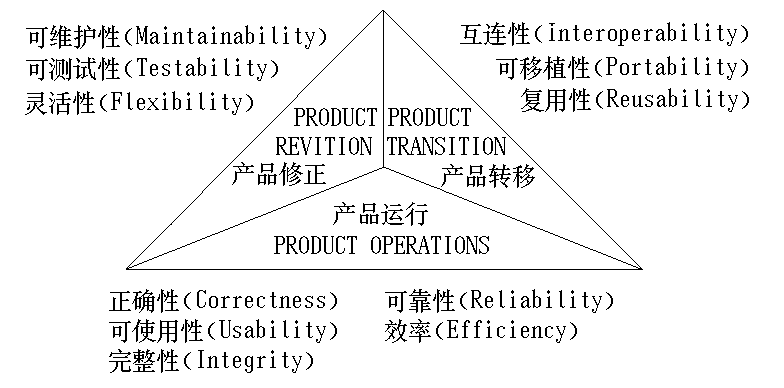

<!-- slide: 10 -->

## Boehm质量模型

- 1978年Boehm等人提出了基于分层结构的软件质量模型
- 它既包含了用户的期望和需要的概念，又包括McCall质量模型中没有的硬件特性。

<!-- slide: 11 -->

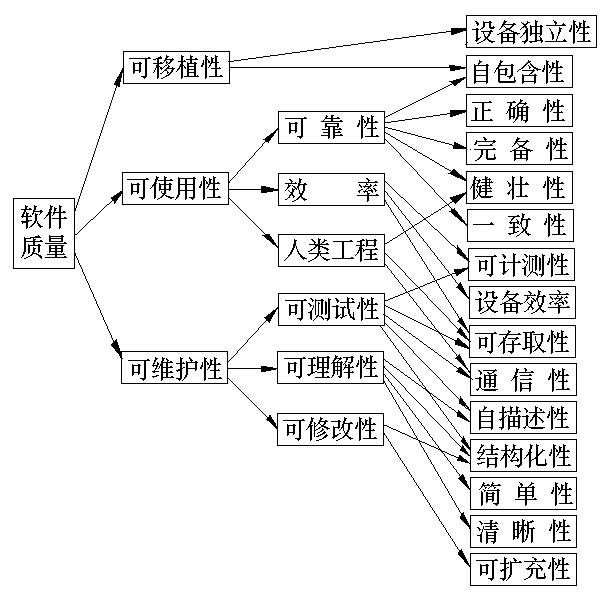

<!-- slide: 12 -->

## Boehm质量模型特点

- Boehm质量模型兼顾不同类型的用户
  - 最终顾客：系统做了顾客所期望的事，顾客对系统非常满意
  - 要将软件移植到其他软硬件系统下使用的客户
  - 维护系统的程序员

<!-- slide: 13 -->

## ISO 9126质量模型

- 1991年，ISO发布了ISO/IEC9126
- 6个质量特性：
  - 功能性
  - 可靠性
  - 可维护性
  - 效率
  - 可使用性
  - 可移植性
- 定义了21个子特性。
- ISO/IEC9126标准现在被分为了两部
  - ISO/IEC9126(软件产品质量)
  - ISO/IEC14598(软件产品评价)。

<!-- slide: 14 -->

## ISO 9126质量模型

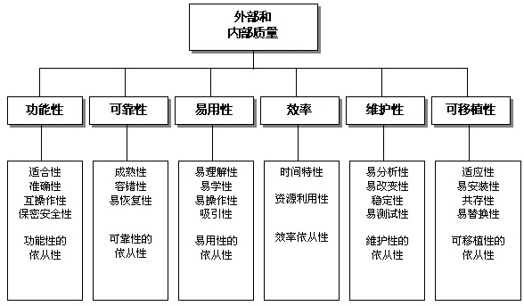

<!-- slide: 15 -->

## ISO 9126质量模型特点

- 出发点在于使软件最大限度的满足用户明确的和潜在的需求。
- 六个质量特性最大可能的涵盖了质量模型中所有的因素，而且彼此的交叉性最小。
- 软件质量特性与子特性的定义考虑了
  - 用户的角度
  - 开发者的角度
  - 管理者的角度

<!-- slide: 16 -->

## 关于软件质量的总结

- 质量需要对应需求、以可接受性和实现的证据来衡量
- 没有质量度量来做质量管理只能是幻想
- 质量不必是“最好”的，质量是用户想要的和愿意购买的
- 质量保证>测试

<!-- slide: 17 -->

- ´当你可以对一个事物进行测量并且能够量化的表述时，才算真正了解它，当你不能这么做时，你的知识还不满足你的需要。
- Lord Kelvin 开尔文-物理学家, 1889
- ´不可测量的东西，你无法控制它
- De Marco 软件专家, 1982

<!-- slide: 18 -->

## 什么是度量(Metric)？

- 任何测量的单位
  - e.g. Cm, Litre, Ohm, Second, Color
- 描述一个实体的属性
- 度量的类型：
  - 和项目相关
    - 时间表/开支
  - 估算测量
    - 功能点
  - 代码度量

<!-- slide: 19 -->

## 什么是软件度量

- 定义：
  - 是对软件开发项目、过程及其产品进行数据定义、收集以及分析的持续性定量化过程
- 目的：理解、预测、评估、控制和改善
- 方法：测试、审核、调查
- 工具：统计、图表、数字、模型
- 最终：量化的指标

<!-- slide: 20 -->

## 度量什么？

- 复杂性
- 规模
- 测试路径
- 冗余
- 结构
- 模块性
- 可维护性
- 可靠性
- 可复用性
- 可测量的
- 不可测量的
- 5.2o-2s

<!-- slide: 21 -->

## 质量因子-准则-度量关系

- 质量树概念
- 质量
- 因子 1
- 因子 2
- 因子 L
- 准则 1
- 准则 J
- 准则 M
- 度量 K
- 度量 1
- 度量 N

> 备注：If we look futher into the previous slide, here we have an example of a  generic quality model- Quality Tree Concept. 
Metrics are the baseline. Metrics help to evaluate a certain quality criteria. One ore more criterias help evaluating a certain quality factor. All (it can also be only one) quality factors together present the overall quality.
Usually you pick one factor (e.g. maintenance), define criterias and finally associate metrics with the different criterias. This approach is reasonable because there are some quality factors which are more or less mutually exclusive (e.g. performance and portability)

<!-- slide: 22 -->

## 度量

- 因子
- 准则
- 度量
- 可维护性
- 自描述性
- 简单性
- 简明性
- 模块性
- 嵌套级别数
- 环路数
- 可执行语句数
- 操作数频率
- 语句平均长度
- 组件层数
- 注释率

> 备注：All the models seen before end at the criteria level. The criterias themselves are hardly to measure. There must be another, more detailed level which adds the quantifiable component ==> the metrics.

All the metrics are objectively measurable either by manually counting them or having them calculated by a tool.

<!-- slide: 23 -->

## 好的度量元

- 必须：
- 直观的
- 应当:
- 和错误出现有直接关系
- 客观的
- 语言独立
- 和测试工作量直接有关
- 自动化
- 简单

<!-- slide: 24 -->

## 代码质量度量

- 代码质量度量可以反映软件的内部质量的质量特性

<!-- slide: 25 -->

## 源代码度量元

- Halstead度量
- 功能点度量
- 代码行统计度量
- 代码基本统计度量
- McCabe度量
- 系统级度量
- 面向对象度量

<!-- slide: 26 -->

## Halstead 度量

- 起源：
- 1977年 Maurice Halstead 发明
- 直接测量模块的操作符和操作数的复杂性
- 基于源代码测量模型的复杂性，重点关注计算的复杂性
- 由于应用与代码，经常作为可维护性方面的度量
- 关于其实用价值有广泛的不同意见
- Source: Software Engineering Institute Carnegie Mellon

<!-- slide: 27 -->

## Halstead度量

- Halstead度量基于四个从源码中而来的量数
- n1 = 独立的 操作符数目
- n2 = 独立的操作数的数目
- N1 = 操作符的总数
- N2 =操作数的总数
- 度量 	公式
- Program length 	N= N1 + N2
- Program vocabulary 	n= n1 + n2
- Volume 	V= N * (LOG2 n)
- Difficulty                                                                          D= (n1/2) * (N2/n2)
- Effort 	E= D * V
- 基于上面的计算，得到五个度量...

<!-- slide: 28 -->

## 例子：请你计算一下

- main()
- {
- int a, b, c, avg;
- scanf("%d %d %d", &a, &b, &c);
- avg = (a + b + c) / 3;
- printf("avg = %d", avg);
- }
- n1 = 10:                 main, (), {}, int, scanf, &, =, +, /, printf
- n2 = 7:                   a, b, c, avg, "%d %d %d", 3, "avg = %d“
- N1 = 16
- N2 = 15

> 备注：n1=10:   int  =  ,  ;  for  (  <=  +=  )  *=
n2= 5:   f  1  n  7  I
N1 =16:  int  =  ,  =  ;  for  (  int  =  ;  <=  ; +=  )  *=  ;
N2 =12:   f  1  n  7  i  1  i  n  i  1  f  i

<!-- slide: 29 -->

## Halstead好处

- 不必深入分析程序的结构
- 预测错误的数目
- 预测维护的工作量
- 对报告和预测项目的健康程度有帮助
- 对整个程序有帮助
- 计算简单
- 适合任何编程语言
- 经过很多工业研究，结果都支持使用Halstead 来预测开发工作量和平均缺陷

<!-- slide: 30 -->

## 功能点Function Point

- 起源：
- 1977 由A.J.Albrecht提出并与IBM合作
- 测量软件的大小和生产力
- 技术：
- 基本功能点分为5组: 外部输出, 外部查询, 外部输入, 内部逻辑文件,外部接口文件.
- 功能点就是最终用户的业务功能,比如对输入的查询.
- 和软件完成的功能紧密相关
- Source: Software Engineering Institute Carnegie Mellon

<!-- slide: 31 -->

## 功能点

- 优点
- 被广泛接受作为一种有效途径:
- 很大的用户社区；International Function Point Group (IFPG) 多于 1,200 会员公司 http://www.ifpug.org/
- 建立每小时功能点的生产率
- 评估对需求的支持
  - 估计软件项目的规模
- 使模块的比较容易实现
- 评估系统变更的开销
- 在IFPG的实践手册中提供标准的练习和例子，说明如何来计算和使用功能点

<!-- slide: 32 -->

## 行统计度量

- 指每个模块的行数, 包括代码,注释, 空白行, 混合代码和注释.
- 技术
- LOC分为:
- Lines-of-Code (LOC) 度量提供代码的总量, 但是无法测量内容
- 空白行-	 没有文本，只有空格和tab的行数
- 代码行- 	只包含代码和空格的行
- 注释行- 	仅包含注释行
- 混合行- 	包含代码和注释行
- nl – 模块中的所有行数，包括代码注释和空白行

<!-- slide: 33 -->

## 行统计度量

- 优点
- 可以反映代码的物理上的规模
- 可以指出特定的模块, 例如注释和空白行的模块
- 可以指出难以理解的模块.  (注释行通常可以增加可读性，即使非常庞大的注释量往往也说明这个模块难以理解.)

<!-- slide: 34 -->

## 代码基本度量

- 控制结构中的最大嵌套层次
- 函数返回点数量
- 声明的局部变量个数
- 函数参数个数
- 代码注释率
- 文件中外部变量的个数
- 扇入、扇出数
- …

<!-- slide: 35 -->

## 练习：请计算最大嵌套层次

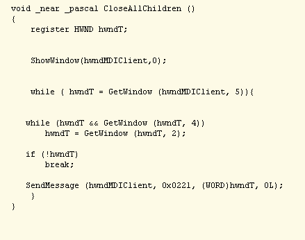
- 1
- 2
- 3
- 4

<!-- slide: 36 -->

## McCabe 度量

- 起源
- Cyclomatic Complexity (圈复杂度)由Thomas McCabe 于1976年提出
- 测量模块内部独立线性路径数量
- 这种度量相对于其他方法简单直接
- 程序的健壮性和信心的一个广泛的衡量标准
- 被引用为程序复杂度, 或者McCabe复杂度

<!-- slide: 37 -->

## McCabe复杂度

- 《结构化测试：使用圈复杂度的一种测试方法学》
- NIST(美国标准技术协会)的测试标准
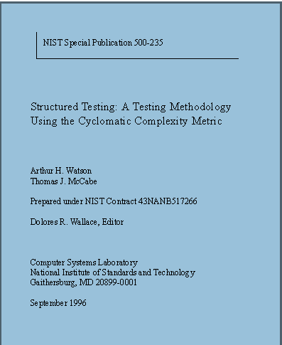

<!-- slide: 38 -->

## McCabe度量

- 优点
- 广泛应用的静态软件度量
- 和其他度量互补
- 独立于开发语言
- 扩展到可以包括设计和结构复杂度
- 基于软件结构的严格的数学分析

<!-- slide: 39 -->

## McCabe度量

- 优点
- 可以应用到几个领域:
- 代码维护风险分析
  - 代码随着维护复杂性会增加.通过对维护前和维护后的代码进行复杂度测量可以对变更的风险进行监视，管理并降低风险
- 代码开发的风险分析：
  - 在开发过程中，控制复杂度
- 测试的计划
  - McCabe复杂度给出了测试用例的准确数量，辅助测试计划，高复杂性的模块需要非常多的测试，可以通过把模块划分为简单的若干个模块来降低测试的数量
- 再工程
  - McCabe复杂性分析提供了代码结构的深入分析，再工程风险与代码复杂度有关，这种深入分析可以对风险和开销分析有帮助

<!-- slide: 40 -->

## McCabe度量

- McCabe度量包含...
- 圈复杂度(v(G))
- 基本复杂度(ev(G))
- 模块设计复杂度(iv(G))
- 设计复杂度 (S0)
- 集成复杂度(S1)

<!-- slide: 41 -->

## 圈复杂度

- 定义:  圈复杂度, v, 是测量一个模块逻辑复杂度的值，它表示测试一个模块需要的最小的努力，v值就是独立的线性路径的条数，也就是需要测试的最少路径.
- 优点
  - 量化逻辑复杂度
  - 预测最小的测试工作量
  - 指导测试过程

<!-- slide: 42 -->

## 计算圈复杂度

- 3种方法:
- - 形式化方法
- - 判定法
- - 区域法
- 不同方法，同样的结果

<!-- slide: 43 -->

## 形式化方法

- 计算所有的边和节点
- 使用公式
- v(G) = e - n + 2
- v(G) = 15 - 12 + 2
- Example:
- v(G) = 5
- 1
- 2
- 3
- 4
- 5
- 6
- 7
- 8
- 9
- 10
- 11
- 12
- 1
- 2
- 3
- 4
- 5
- 6
- 7
- 10
- 8
- 9
- 12
- 13
- 14
- 11
- 15

<!-- slide: 44 -->

## 判定方法

- 计算所有的判定分支并加 1
- v(G) = 4 + 1
- Example :
- v(G) = 5
- v(G) = Predicates + 1

<!-- slide: 45 -->

## 区域方法

- 计算页面上被图形分割的区域
- Example:
- v(G) = 5
- 1
- 2
- 3
- 4
- 5
- 注意，画图的时候线不要交叉

<!-- slide: 46 -->

## 圈复杂度

- 1
- 4
- 2
- 6
- 7
- 8
- 9
- 11
- 13
- 14
- 15
- 3
- 5
- 10
- 12
- 方法三
- regions = 11 Beware of crossing lines
- R1
- R2
- R3
- R4
- R5
- R6
- R7
- R8
- R9
- R10
- R11
- 19
- 1
- 2
- 3
- 4
- 5
- 6
- 7
- 8
- 9
- 10
- 11
- 12
- 13
- 14
- 15
- 16
- 17
- 18
- 20
- 21
- 22
- 23
- 24
- 方法一
- e = 24, n = 15
- v = 24 -15 +2
- v = 11
- =2
- =1
- =1
- =2
- =1
- =1
- =1
- =1
- 方法二
- v =  + 1
- v = 11

<!-- slide: 47 -->

## 基本复杂度

- 定义:  基本复杂度, ev, 是测试模块的非结构化程度的值，ev是简化后的流图的圈复杂度值，在流图中去掉那些结构化的部分，其余的就是那些非结构化的代码.
- 好处
  - 量化非结构化程度
  - 揭示代码质量
  - 预测维护的工作量
  - 帮助模块化进程

<!-- slide: 48 -->

## 流图简化

- 圈复杂度 = 4
- v(G) = 4
- McCabe’s 基本复杂度 ev(G)
- 去掉结构化部分重新计算复杂度
- 基本复杂度 = 1
- ev(G) = 1

<!-- slide: 49 -->

## 非结构化的逻辑（不能简化）

- Branching out of a loop
- Branching in to a loop
- Branching into a decision
- Branching out of a decision

<!-- slide: 50 -->

## 例子

- v = 5
- Reduced flowgraph
- v = 3
- Therefore ev of the original flowgraph = 3
- ev=3

<!-- slide: 51 -->

## 基本复杂度

- 基本复杂度帮助发现非结构化的代码
- 好的设计
- 迅速恶化
- v  = 10
- ev = 1
- v  = 11
- ev = 10

> 备注：Loop可以简化

<!-- slide: 52 -->

## 怎样管理和减少v和ev

- 时间
- 减少和管理
- v 和 ev
- 1
- 20
- 15
- 10
- 重视结构设计和方法
- 遵守编码标准
- QA 程序和评审
- 自动化工具
- 模块化

<!-- slide: 53 -->

## 模块设计复杂度

- 定义:  模块设计复杂度, iv,是测量模块和其子模块之间的控制结构的一个值，这个值会量化测试模块和其子模块之间的调用耦合度.
- 模块设计复杂度是简化流图后的圈复杂度值，简化过程是去除不影响调用结构的判定和节点

<!-- slide: 54 -->

## 设计简化规则

- Rule 1: Sequential
- Rule 3: Conditional
- Rule 4:  Looping
- Rule 2: Repetitive
- Rule 0: Call
- *
- *
- *
- 非调用节点
- 调用节点
- 0路径和更多非调用节点
- 任何节点，调用和非调用

<!-- slide: 55 -->

## 模块设计复杂度

- 例子:
- main
- proge
- progd
- iv = 3
- Therefore,
- iv of the original flowgraph = 3
- Reduced Flowgraph
- v = 3
- proge()
- progd()
- main
- v = 5
- proge()
- progd()
- main()
- {
- if (a == b) progd();
- if (m == n) proge();
- switch(expression)
- {
- case value_1:
- statement1;
- break;
- case value_2:
- statement2;
- break;
- case value_3:
- statement3;
- }
- }

<!-- slide: 56 -->

## 系统设计复杂度

- 定义:  设计复杂度, S0,设计复杂度以数量来衡量程序模块之间的相互作用关系，它提供了系统级模块设计复杂度的概况，有助于衡量进行自底向上集成测试的工作量.
  - S0 =   iv叶子节点没有下级调用，所以S0 = iv = 1.

<!-- slide: 57 -->

## 系统设计复杂度

- 如何评价当前的设计复杂度 ?
- Marketing
- Development
- Revenue
- Support
- Maintenance
- 计算设计复杂度(S0)...

<!-- slide: 58 -->

## 系统设计复杂度

- System Design Complexity S0 =  Module Design Complexity (iv(G))
- Development
- Marketing
- Revenue
- Support
- Maintenance
- iv(G) =2
- iv(G) =2
- iv(G) =1
- iv(G) =3
- iv(G) =1
- S0 =  iv(G)
- S0 = 2 + 3 + 2 + 1 + 1
- S0 = 9
- 计算设计复杂度(S0)...

<!-- slide: 59 -->

## 集成复杂度

- 集成复杂度S1 =  S0 -n + 1, 这里 S0 是整个设计或子设计的设计复杂度，n是设计总模块的数量.

<!-- slide: 60 -->

## 集成复杂度

- Marketing
- Revenue
- Support
- Maintenance
- Development
- 例子1:
- 测试系统的集成需要什么 ?
- 为了激励其这些模块之间的相互作用需要最小的测试数是多少？
- McCabe 集成复杂度 S1 = 5
- ( S1 =  S0 -n + 1  =  9 - 5 + 1 = 5 )

<!-- slide: 61 -->

## 例子1

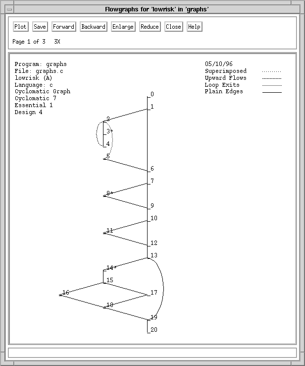
- 可靠
  - 逻辑简单
  - 不易犯错
  - 容易测试
- 可维护
  - 结构很好
  - 容易理解
  - 容易修改

<!-- slide: 62 -->

## 例子2

- 不可靠
  - 逻辑复杂
  - 容易犯错
  - 难以测试
- 可维护
  - 可以被理解
  - 可以被修改
  - 复杂度可以被降低
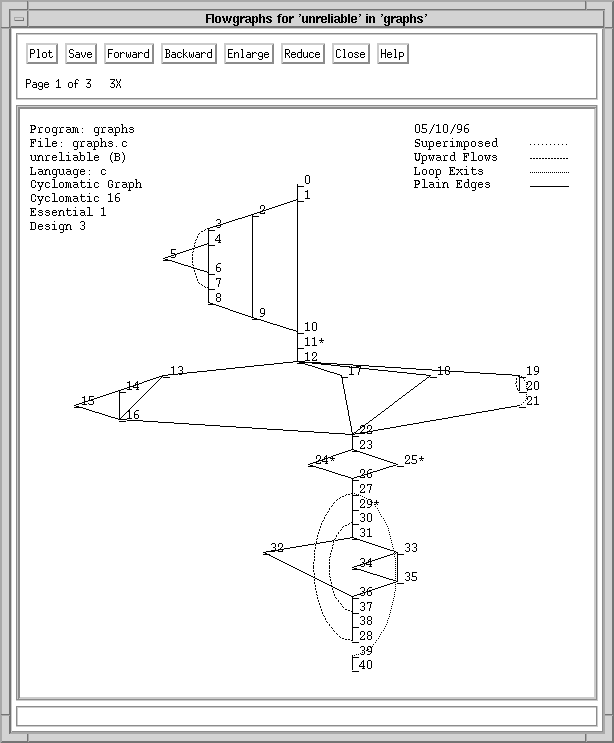

<!-- slide: 63 -->

## 例子3

- 不可靠
  - 容易犯错
  - 非常难测试
- 不可维护
  - 难以理解
  - 难以修改
  - 难以降低复杂度
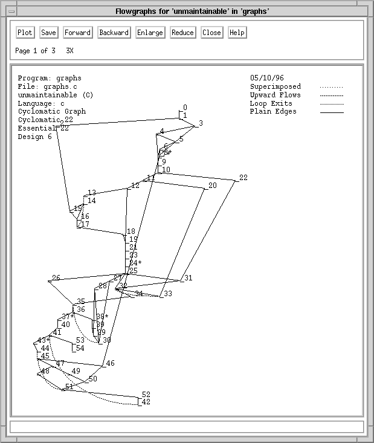

<!-- slide: 64 -->

## 例子4

- 问题:当软件的复杂度超过一定的边界时，软件变得毫无希望
  - 使用时容易发生错误
  - 修正起来太复杂
- 结论: 在开发过程或维护过程中控制复杂度
  - 远离度量的门限
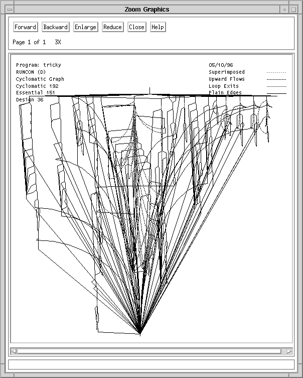
  - 重新开发过于庞大

<!-- slide: 65 -->

## 其它项目度量举例

- CoCoMo模型
  - 1981年 Boehm提出“构造性成本模型”（Constructive Cost Model）
  - 软件分为
    - 组织型：各类应用程序
    - 半独立型：各类实用程序、编译程序等
    - 嵌入型：实时处理、控制程序、操作系统
  - 工作量（人月）E=aLb
    - a, b是常数，适当范围选择数值
    - L是代码行估计值，单位是千行代码
  - 例如：
    - 嵌入型项目E = 3.6*(代码行/1000) 1.20 人/月
    - 组织型项目E = 2.4*(代码行/1000) 1.05人/月
    - 半独立型E = 3.0*(代码行/1000) 1.12人/月

<!-- slide: 66 -->

## 主要内容

- 概述-关于软件质量
- 软件代码度量
- 覆盖率度量
- 软件缺陷度量
- 软件质量度量标准
- 软件质量度量工具的应用

<!-- slide: 67 -->

## 覆盖率度量

- 衡量测试充分性的指标
- 代码覆盖率

<!-- slide: 68 -->

## 代码覆盖率

- 软件代码被真正测试过的比率
  - 通常以百分比表示
  - 完全的覆盖率增强测试者对软件的信心
- 多种覆盖率度量
    - 函数入口
    - 调用对
    - 语句覆盖
    - 分支覆盖
    - MC/DC覆盖率
    - 目标码覆盖率

<!-- slide: 69 -->

## 代码覆盖率的意义

- 黑盒测试
- 白盒测试
- % of
- coverage
- 测试时间

<!-- slide: 70 -->

## 函数入口覆盖率

- 入口覆盖率=调用过的函数数量/总函数数量
- 最基本的覆盖率度量，简单地测量哪些函数被调用过了

<!-- slide: 71 -->

## 调用对覆盖率

- 调用对覆盖率=执行过的调用对/总的调用对
- 集成测试（部件测试）阶段最常用的覆盖率度量
- 衡量模块间调用关系被测试过的程度

<!-- slide: 72 -->

## 语句覆盖率

- 执行过的语句的比例
- 语句覆盖率，即执行过的语句的百分比
- = 	起码执行过一次的语句的数量	被测代码中所有语句的数量
- 单元测试阶段最弱的覆盖率度量
- 不非常彻底
  - 忽略了空的分支
  - 在这个例子里，只需要一个‘true’ 条件的测试用里就可以完全覆盖所有语句:
    - IF (cond_a) & (cond_b) & (cond_c) THEN
    - do_something;
    - END_IF;
  - 忽略了复杂的条件

<!-- slide: 73 -->

## 分支覆盖

- 即判定覆盖
- 条件判定的扇出确定执行过的百分比
- = 	起码执行过一次条件判定的扇出数目	所有条件判定的扇出数目
- 包容语句覆盖
- 仍然忽略了复杂的条件
  - IF (cond_a) & (cond_b) & (cond_c) THEN......
- 根据图形理论（流程图）定义

<!-- slide: 74 -->

## MC/DC的定义

- 在RTCA/DO178B中，修正的条件判定覆盖率
- （Modified Condition/Decision Coverage）的
- 定义：
  - 程序中的每一个入口和出口都至少被执行一次；
  - 程序中的每一个条件和所有可能结果至少出现一次；
  - 每个判定中的每一个条件必须能够独立影响判断的结果，即在其它条件不变的情况下，仅改变这个条件的值，可使判断结果改变。

<!-- slide: 75 -->

## MC/DC的实际意义

- MC/DC是DO-178B中首次提出的，开始是为了提高航空软件测试中的覆盖率水平。在 DO-178B中阐明了MC/DC的意义:
- 对于关键性的实时程序而言，超过半数的可执行代码可能都与布尔运算表达式有关，表达式的复杂性应得到关注。MC/DC的提出是为了引起对布尔表达式的关注…

<!-- slide: 76 -->

## MC/DC示例

| 测试用例 | A | B | C | 判定结果 |
|---|---|---|---|---|
| 1 | T | T | T | T |
| 2 | T | T | F | T |
| 3 | T | F | T | T |
| 4 | T | F | F | F |
| 5 | F | T | T | F |

- A and (B or C)
- 表达式为一个判定，A、B、C均为条件
- 列出其满足修正的条件判定覆盖(MC/DC)的测试用例集
- A:{1,5}
- B:{2,4}
- C:{3,4}

<!-- slide: 77 -->

## MC/DC发现的主要软件问题

- ORF: Operator Reference Faults，例如“与”被误写成“或”；
- VNF: Variable Negation Faults，一个变量被误写成了它的否定；
- ENF: Expression Negation Faults，一个表达式被误写成了它的否定。

<!-- slide: 78 -->

## ORF示例

- 仍以A && (B || C)为例，为其满足MC/DC覆盖率设计了一组测试用例，但是在代码中却误写成了A || (B || C),见下列真值表：
- F
- T
- T
- F
- 5
- F
- F
- F
- T
- 4
- T
- T
- F
- T
- 3
- T
- F
- T
- T
- 2
- T
- T
- T
- T
- 1
- 判定结果
- C
- B
- A
- 测试用例
- 表达式
- 中“与”误
- 写成了
- ”或”
- T
- T
- T
- F
- 5
- T
- F
- F
- T
- 4
- T
- T
- F
- T
- 3
- T
- F
- T
- T
- 2
- T
- T
- T
- T
- 1
- 判定结果
- C
- B
- A
- 测试用例

<!-- slide: 79 -->

## VNF示例

- 将A && (B || C)误写成

- F
- T
- T
- F
- 5
- F
- F
- F
- T
- 4
- T
- T
- F
- T
- 3
- T
- F
- T
- T
- 2
- T
- T
- T
- T
- 1
- 判定结果
- C
- B
- A
- 测试用例
- 一个变量
- 被误写成
- 了它的
- 否定

| 测试用例 | A |   | B | C | 判定结果 |
|---|---|---|---|---|---|
| 1 | T | F | T | T | F |
| 2 | T | F | T | F | F |
| 3 | T | F | F | T | F |
| 4 | T | F | F | F | F |
| 5 | F | T | T | T | T |

<!-- slide: 80 -->

## 主要内容

- 概述-关于软件质量
- 软件代码度量
- 覆盖率度量
- 软件缺陷度量
- 软件质量度量标准
- 软件质量度量工具的应用

<!-- slide: 81 -->

## 软件缺陷度量

- 缺陷度量就是对项目过程中产生的缺陷数据进行采集和量化，将分散的缺陷数据统一管理，使其有序而清晰，然后通过采用一系列数学函数，对数据进行处理，分析缺陷密度和趋势等信息，从而提高产品质量和改进开发过程
  - 组织级缺陷度量，目的是了解组织的整体缺陷情况，了解客户对组织的质量满意度，建立组织基线，确定改进活动。
  - 项目级缺陷度量，目的是了解项目实时质量情况（很多项目只在最后度量，包括那些迭代式开发的项目，实际上为时已晚），预测缺陷造成的发布后维护工作量，了解客户对项目的质量满意度。
  - 个体缺陷度量，目的是了解个体缺陷产生的详细原因，并实施行动进行改进。

<!-- slide: 82 -->

|  信息需要 |  可度量概念 |  度 量 元 |  派生度量元 |
|---|---|---|---|
| 通过模块的各类型缺陷数来评价软件质量 | 模块缺陷分布 | 每个模块的各类缺陷数目 | 各模块的缺陷个数百分比 |
| 通过总体的各类型缺陷数来评价软件质量 | 总体缺陷分布 | 每类缺陷的数目 | 每类缺陷占总缺陷的比例 |
| 通过缺陷密度评价模块稳定性 | 缺陷密度 | 每个模块的各类缺陷数目 | 每个模块的各类缺陷密度及比例 |
| 判断缺陷数量的趋势 | 总体趋势 | 各种状态缺陷的数量 | 各种状态缺陷的数量的比例 |
| 判断缺陷驻留时间 | 缺陷排除情况 | 缺陷数量排行、缺陷发现时间、缺陷清除时间 | 整体缺陷清除率、阶段性缺陷清除率、缺陷的驻留时间 |
| 确定哪种缺陷发现方式有效 | 缺陷数量和种类 | 缺陷种类 | 缺陷密度、同行评审发现错误率、测试发现的缺陷数、PPQA发现的缺陷数 |

<!-- slide: 83 -->

## 缺陷密度

- “在测试中发现缺陷多的地方，还有更多的潜在缺陷将会被发现” Glenford J. Myers
- 缺陷密度=已知缺陷数量/产品规模
- 每KLOC或每个功能点的缺陷数，缺陷密度越低意味着产品质量越高
- 还需要什么？
  - 缺陷管理流程

<!-- slide: 84 -->

## 缺陷管理

- 目的：
  - 确保每个被发现的缺陷都能够被解决
  - 收集缺陷数据并根据缺陷趋势曲线确定软件过程阶段

<!-- slide: 85 -->

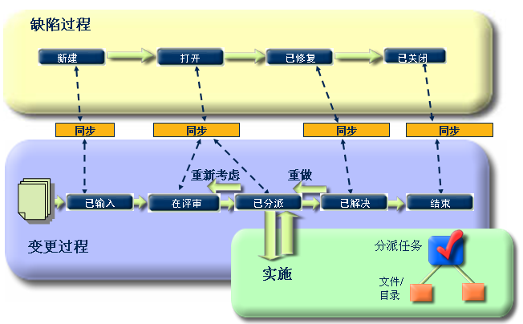

<!-- slide: 86 -->

## 主要内容

- 概述-关于软件质量
- 软件代码度量
- 覆盖率度量
- 软件缺陷度量
- 软件质量度量标准
- 软件质量度量工具的应用

<!-- slide: 87 -->

## 软件质量标准

- 国外篇
  - 1999年，国际标准化组织ISO将ISO/SEC 9126-1991分成两个系列的标准：
    - ISO/IEC 14598 《软件工程 产品评价》，注重软件质量评价的支持和评价过程
    - ISO/IEC 9126 《软件工程 产品质量》，注重软件本身的质量度量模型
  - 近几年国际软件工程标准化组织，一直在对软件产品评价与质量度量领域的国际标准进行研究，主要对象有：
    - ISO/IEC 12119-1994 “信息技术 软件包 质量要求和测试”
    - ISO/IEC 9126 “软件工程 产品质量”
    - ISO/IEC 14598 “软件工程 产品评价”

<!-- slide: 88 -->

## 软件质量标准

- 国外篇（续）
  - 从2005年开始ISO陆续发布以下ISO/IEC 25000系列标准
    - ISO/IEC 25000-2005 “软件工程 软件产品质量要求和评价（SQuaRE) SQuaRE指南”
    - ISO/IEC 25020-2007 “软件工程 软件产品质量要求和评价（SQuaRE) 质量指南”
    - ISO/IEC 25030-2007 “软件工程 软件产品质量要求和评价（SQuaRE) 质量度量”
    - ISO/IEC 25040 “软件工程 软件产品质量要求和评价（SQuaRE) 质量评价”
    - ISO/IEC 25051-2006 “软件工程 软件产品质量要求和评价（SQuaRE) 现货软件质量要求与测试说明” （代替了ISO/IEC 12119-1994)

<!-- slide: 89 -->

## 软件质量标准

- 国内篇：
  - 目前国内主要是在引进国际标准的基础上，结合国内软件测试颁布了一系列软件质量标准。

<!-- slide: 90 -->

## 软件质量标准

- 国内篇（续）：
- GB/T 16260-2006 “软件工程 产品质量”
- GB/T 18905-2002 “软件工程 产品评价”
- GB/T 15532-2008 “计算机软件测试规范”
- GB/T 17544-1998 “信息技术 软件包 质量要求和测试

<!-- slide: 91 -->

## 软件质量度量标准

- GB／T16260—1996 /2004 信息技术 软件产品评价 质量特性及其使用指南
- GB/T 16260-2006
- GJB 5236-2004 军用软件质量度量

<!-- slide: 92 -->

## GB/T 16260-2006 “软件工程 产品质量”

- GB/T 16260-2006是对GB/T16260-1996 “信息技术软件产品评价质量特性及其使用指南”的修订，保留了与之相同的软件质量特性。
- GB/T 16260-2006分为以下几部分：
  - 第一部分GB/T 16260.1-2006 :  质量模型
  - 第二部分GB/T 16260.2-2006 ：外部度量
  - 第三部分GB/T 16260.3-2006 ：内部度量
  - 第四部分GB/T 16260.4-2006 ：使用质量的度量
- GB/T 16260-2006从软件的获取、需求、开发、使用、评价、支持、维护、质量保证和审核相关的不同视角来确定和评价软件产品质量，可以被开发者、需求方、质量保证人员和独立评价者，特别是那些对确定和评价软件产品质量负责的人员所使用。

<!-- slide: 93 -->

## GB/T 18905-2002 “软件工程 产品评价”

- GB/T 18905-2002系列标准等同于ISO/IEC 14598标准是为软件产品质量的测量、评估和评价提供了方法。
- 软件质量评价的基本部分包括：质量模型、评价方法、软件的测量和支持工具。
- GB/T 18905-2002系列由6部分组成：
  - GB/T 18905.1-2002，概述软件产品评价的产品，提供评价需求和指南
  - GB/T 18905.2-2002，策划和管理
  - GB/T 18905.3-2002，开发者用的过程
  - GB/T 18905.4-2002，需求方用的过程
  - GB/T 18905.5-2002，评价者用的过程
  - GB/T 18905.6-2002，评价模块的文档编制
- 从适用范围上，GB/T 18905-2002是供软件的开发者、软件的需求方和独立的评价者，特别是供那些负责软件产品评价的人员使用的。

<!-- slide: 94 -->

## GB/T 15532-2008 “计算机软件测试规范”

- GB/T 15532-2008对主要的测试类别按照“测试对象和目的”、“测试的组织和管理”、“技术要求”、“测试内容”、“测试环境”、“测试方法”、“准入条件”、“准出条件”、“测试过程”和“输出文档”等条目做出要求。
- 在附录中还介绍了软件测试方法、软件可靠性的推荐模型、软件测试部分模板、软件测试内容的对应关系等
- GB/T15532-2008规定了计算机生命周期内各类软件产品的基本测试方法、过程和准则，适用于计算机软件生命周期的全过程，适合计算机软件的开发机构、测试机构及相关人员使用

<!-- slide: 95 -->

## GB/T 17544-1998 “信息技术 软件包 质量要求和测试”

- GB/T 17544-1998等同于ISO/IEC 12119-1994,它规定了软件包的质量要求及针对这些要求如何对软件包进行测试的规则。
- 质量要求从产品描述、用户文件、程序及数据三个方面进行了规定，测试细则依据这些规定来制订。
- GB/T 17544-1998适用于软件包，例如文本处理程序、电子表格、数据库程序、图形软件包、技术或科学函数计算程序及实用程序等。

<!-- slide: 96 -->

## 军用软件测试标准

- GJB 2434-2004 “军用软件产品评价”
- GJB 1268-2004 “军用软件验收要求”
- GJB 5234-2004 “军用软件验证和确认”
- GJB 5236-2004 “军用软件质量度量”
- GJB/Z 141-2004 “军用软件测试指南”
- GJB/Z 142-2004 “军用软件安全性分析指南”

<!-- slide: 97 -->

## GJB 5236-2004 军用软件质量度量

- 军用软件产品的质量模型和基本的度量
- 软件质量
- 可靠性
- 功能性
- 易用性
- 效率
- 维护性
- 可移植性
- 适合性
- 准确性
- 互操作性
- 安全保密性
- 功能性的
- 依从性
- 成熟性
- 容错性
- 易恢复性
- 可靠性
- 依从性
- 易理解性
- 易学性
- 易操作性
- 吸引性
- 易用性
- 依从性
- 时间特性
- 资源利用性
- 效率的依从性
- 易分析性
- 易改变性
- 稳定性
- 易测试性
- 维护性的
- 依从性
- 适应性
- 易安装性
- 共存性
- 易替换性
- 可移植性
- 依从性

<!-- slide: 98 -->

## 软件度量的误区

- 目的不明，事后发现度量的内容与管理无关；
- 使用度量去评价个人；
- 开发人员拒绝执行，认为会否认其工作业绩；
- 度量过多，要求广泛收集数据，程序繁琐，不堪重负；
- 认为度量结果报告无法引导管理活动；
- 管理部门看到可能发生的问题或无成功的结果，而放弃 支持度量工作
- 过分强调LOC单个因素的度量

<!-- slide: 99 -->

## 主要内容

- 概述-关于软件质量
- 软件代码度量
- 覆盖率度量
- 软件缺陷度量
- 软件质量度量标准
- 软件质量度量工具的应用

<!-- slide: 100 -->

## 软件质量度量工具

- McCabe
- Logiscope

<!-- slide: 101 -->

## 关于McCabe

- 40多年的关键系统软件测试经验 .
  - 已分析过超过 250亿行的代码
  - 数以千计的用户在使用
  - 适用于关键性工程
  - 大量政府和商业客户

<!-- slide: 102 -->

## 发展历程

- Tom McCabe 1976年发表《软件复杂度》的论文
- 1977年建立McCabe&Associates公司，推广结构测试方法
- 1982年发表论文《结构测试：使用圈复杂度的软件测试方法》（美国国家标准局专刊500-99），McCabe测试技术被美国国家标准技术学会（NIST）采用
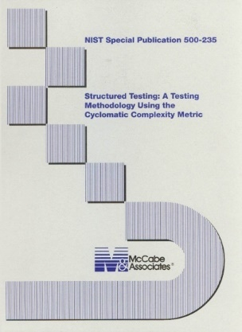

<!-- slide: 103 -->

## McCabe复杂度在业界的应用

<!-- slide: 104 -->

## McCabe复杂度

- 由以下机构的独立研究证明
  - 美国国防部
  - 美国海军武器系统
  - 通用电子
- 圈复杂度可以很好的预测
  - 错误发生的可能性
  - 代码可被理解的程度
  - 维护的工作量
  - 调试的容易程度
- 经验显示，McCabe复杂度与错误发生率密切相关

<!-- slide: 105 -->

## McCabe IQ 结构

- McCabe IQ Framework
- (Code analysis, Execution monitoring, Data usage, Visualization)
- McCabe Source Code Parsing Technology
- C  C++  Java  JSP  Visual Basic  PERL  Cobol
- VB.NET  Fortran  Ada  PL1  ASM370  M204
- McCabe
- EQ
- McCabe
- Test (Coverage)
- McCabe
- Change
- McCabe
- Slice
- McCabe
- Data
- McCabe
- Compare
- McCabe
- OO

<!-- slide: 106 -->

## McCabe EQ

- 怎样度量和提高软件质量?
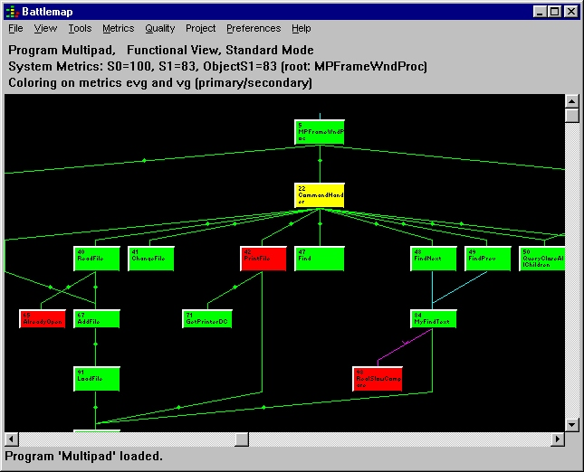
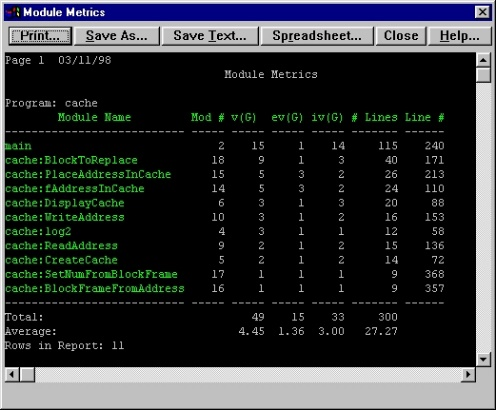
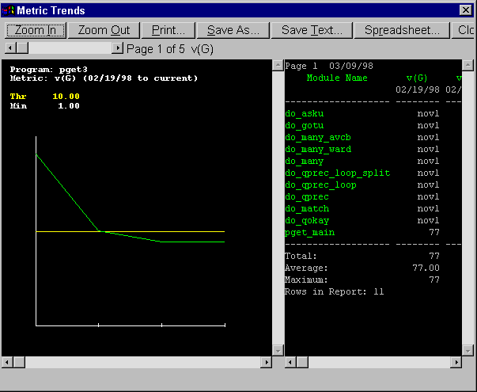

<!-- slide: 107 -->

## 测量软件质量

- 得到代码的流程图
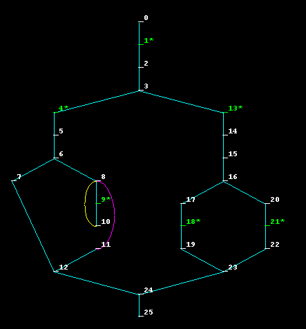
- 简单的, 结构好的代码

<!-- slide: 108 -->

## 测量软件质量

- 得到代码的流程图
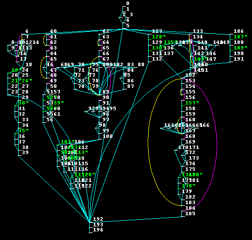
- 复杂的, 结构差的代码

- 难 于 理 解

- 不 好 测 试

- 可能带有错误

<!-- slide: 109 -->

## 测量软件质量

- 强大的图形技术帮助系统分析
- 散点图比较任意两个度

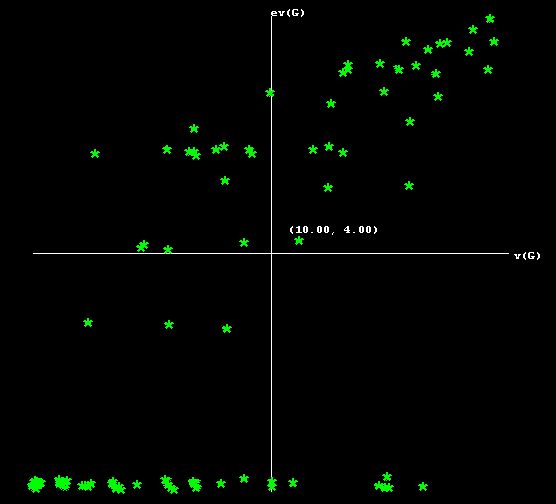
- Unstructure
- Logic size
- 不可信的,难维护的函数

- 可信的,易于维护的函数

<!-- slide: 110 -->

## 软件可视化

- 颜色可配置
- 关注模块之间的调用关系

- 内部复杂度低

- 内部复杂度中

- 内部复杂度高

- 提高理解

- 部分代码放大

<!-- slide: 111 -->

## 软件可视化

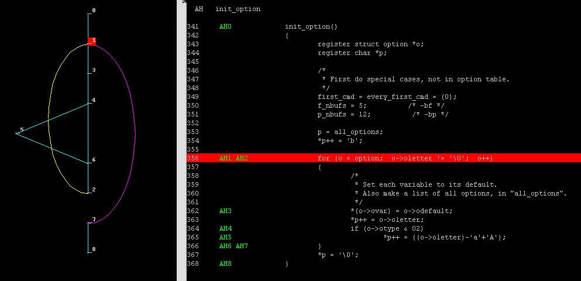
- 逻辑图和代码列表

- 图形和代码之间
- 交叉参考

<!-- slide: 112 -->

## 测试路径的设计

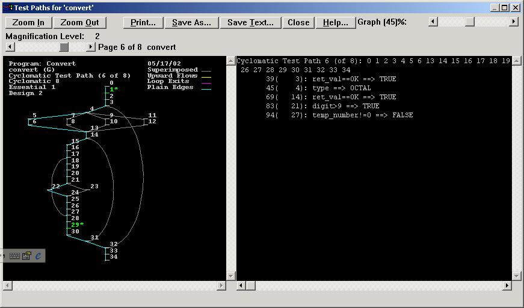

<!-- slide: 113 -->

## 评估软件变更影响

- 某一模块修改对整体系统的影响。
- 模块内部包含代码的修改

<!-- slide: 114 -->

## 评估软件变更影响

- 模块内部包含代码的修改
- 工具会给出模块的影响

<!-- slide: 115 -->

## McCabe Test

- 关注于动态测试
- 设定测试计划
- 评定测试覆盖率
- 定位测试过的代码
- 提高软件可靠性，降低风险
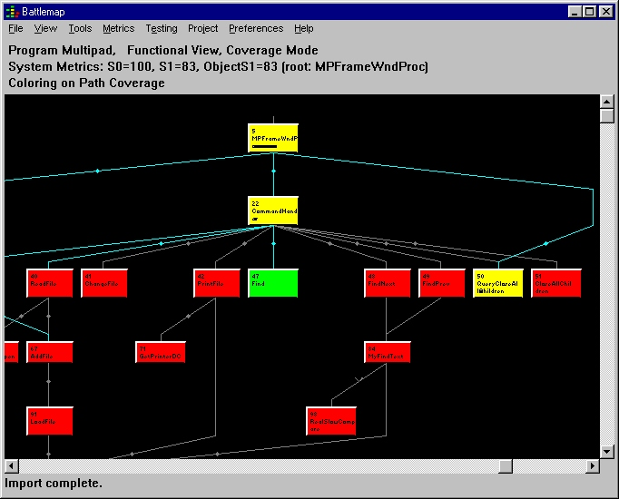
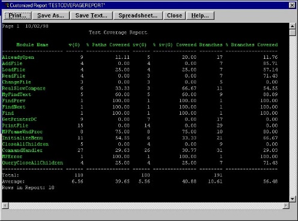
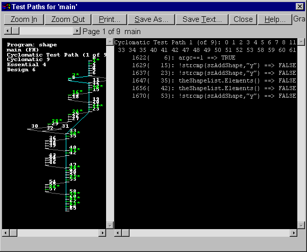

<!-- slide: 116 -->

## 聚焦软件测试

- 自动跟踪软件执行
- 得到测试信息
- 产生覆盖率报告
- 存储覆盖率结果

<!-- slide: 117 -->

## 聚焦软件测试

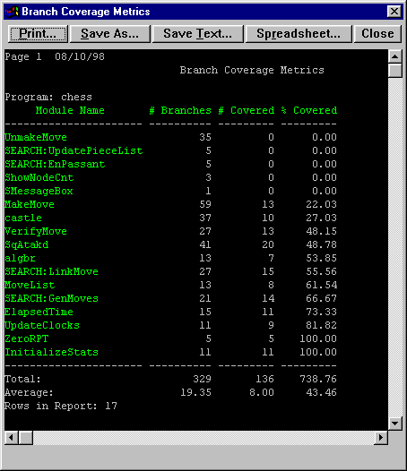
- 覆盖率报告
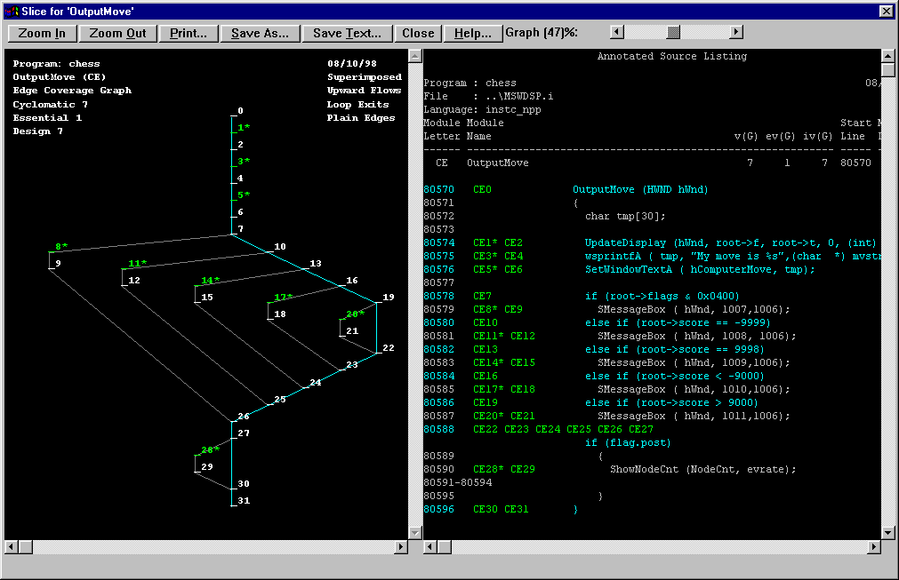
- 测试的路径
- 测试的代码

<!-- slide: 118 -->

## 聚焦软件测试

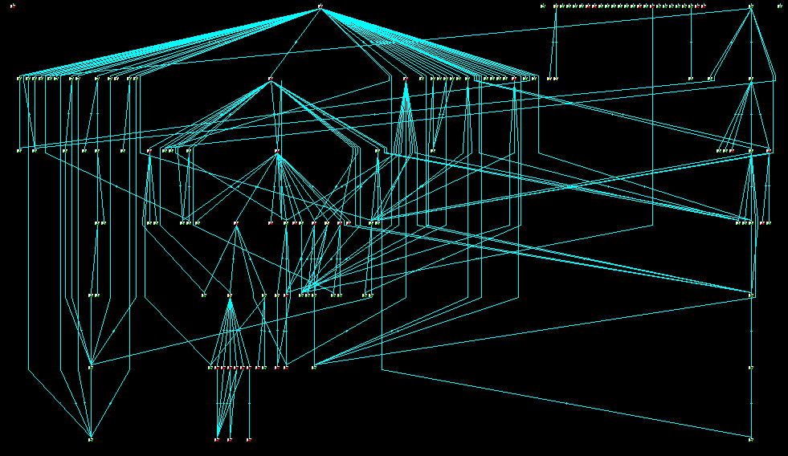
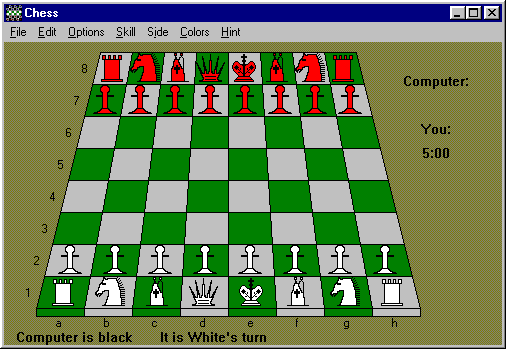
- 可以测试任何类型的应用

<!-- slide: 119 -->

## 聚焦软件测试

- 走棋…...

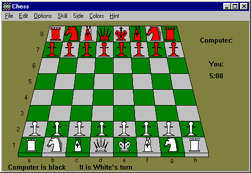

<!-- slide: 120 -->

## 聚焦软件测试

- 执行被跟踪…
- 跟踪文件产生

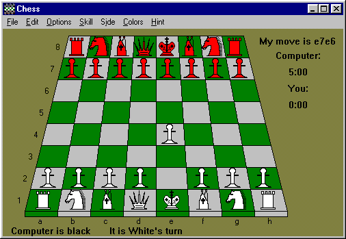
- 跟踪文件
- 001000101100

<!-- slide: 121 -->

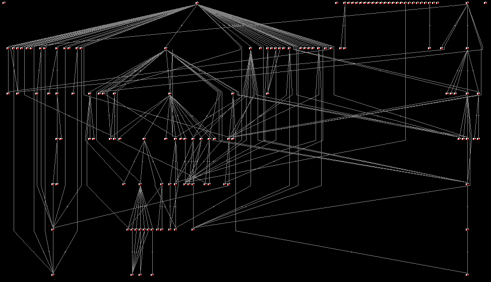
- 图形显示覆盖率信息
- 输入跟踪信息

- 001000101100
- 聚焦软件测试

<!-- slide: 122 -->

## 聚焦软件测试

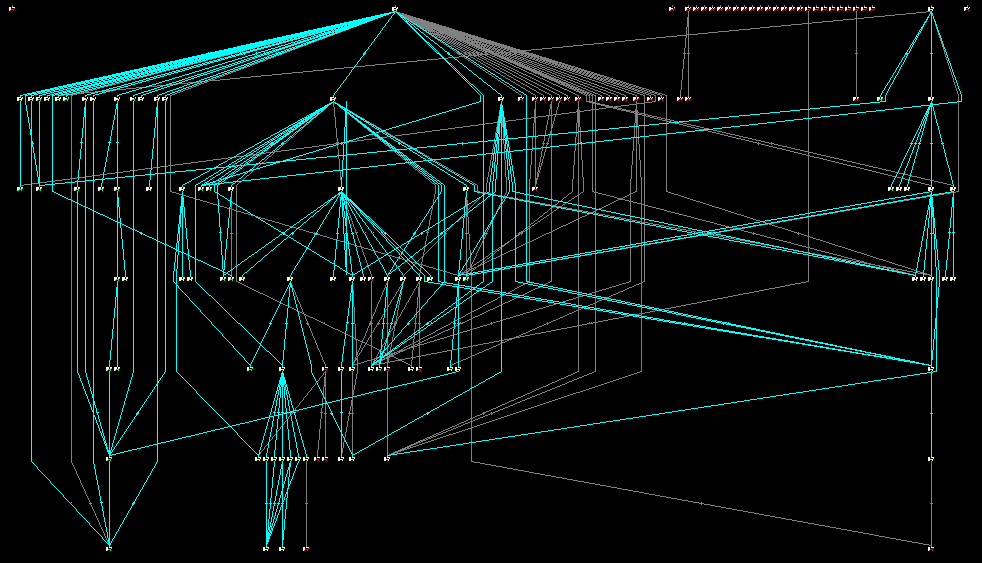
- 显示执行路径
- 显示测试的程度

- 被测的代码

<!-- slide: 123 -->

## 聚焦软件测试

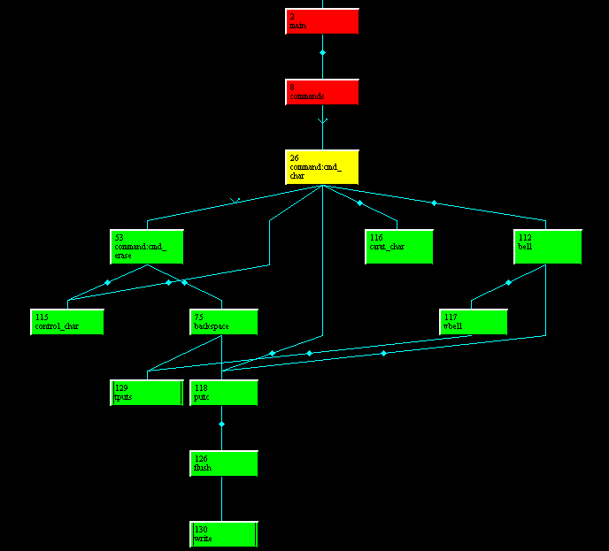
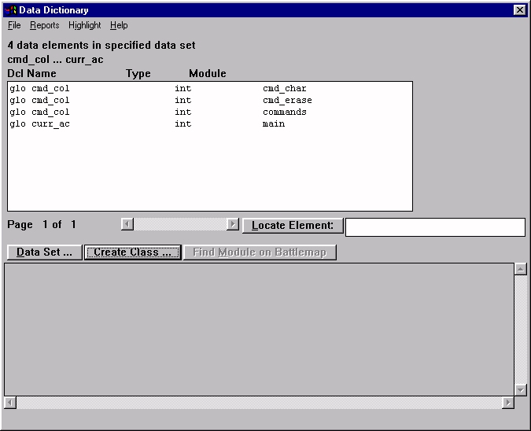
- 数据集合
- 显示数据集合

- 数据字典，分析数据的使用

<!-- slide: 124 -->

## 可视化数据

- 数据可以跟踪
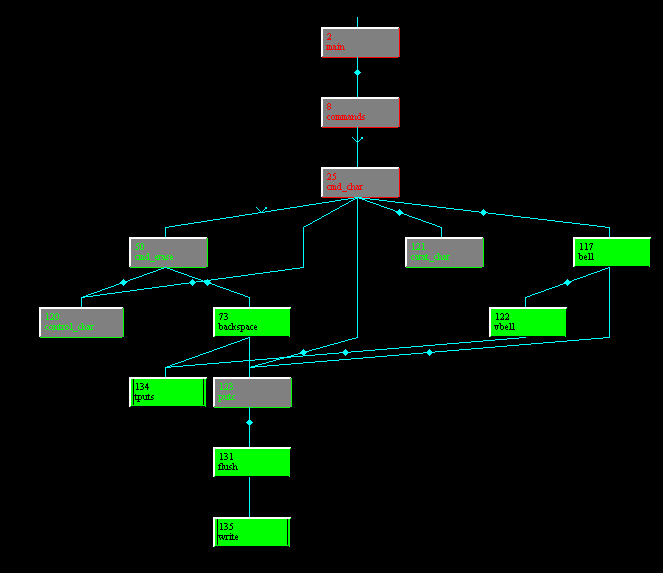
- 数据在这里

<!-- slide: 125 -->

## 可视化软件

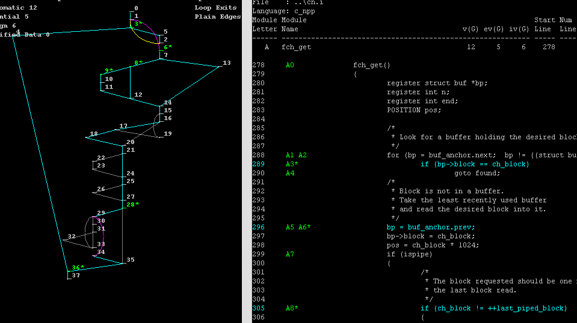
- 跟踪到流程图和代码列表中
- 数据在这里
- 强大的数据显示工具

<!-- slide: 126 -->

## McCabe的质量分析报告

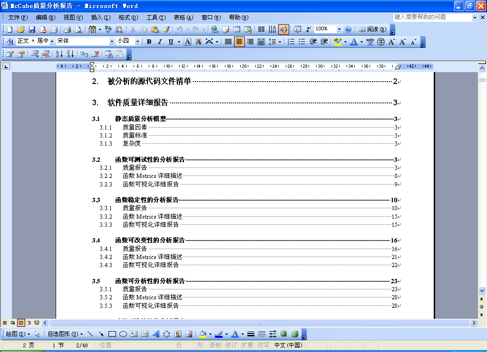
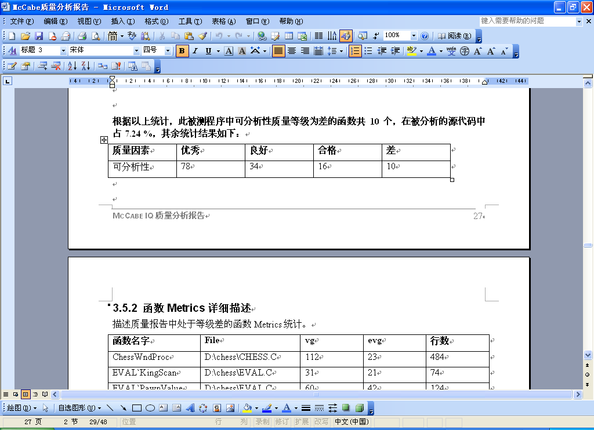

<!-- slide: 127 -->

## 软件质量度量工具

- McCabe
- Logiscope

<!-- slide: 128 -->

## Logiscope 工具集

- Logiscope 是领先的质量评估工具集:
- Logiscope RuleChecker
  - 自动代码规则检查
- Logiscope QualityChecker
  - 质量评估与图形代码视图
- Logiscope TestChecker
  - 基于结构的测试与测试覆盖率分析

> 备注：The lists below show the supported languages and dialects for Logiscope: 
CANSIKernighan & RitchieMicrosoft 1.5Microsoft 2.0Microtech research 4.4SUN CGNU 3.0GNU D950 1.1HP CIARDIAB 4.4Borland 3.0Borland 5.0C++GNU 2.7HP C++Microsoft 1.5Microsoft 2.0Microsoft 5.0Microsoft 6.0Sun Sparc C++ compiler 4.0IBM C++ 3.1Digital C++ 6.0AdaAda 83Ada 95JavaJDK 2 compiler

<!-- slide: 129 -->

## Logiscope QualityChecker

- 对于C, C++, Ada & Java，提供了超过了190个程序度量元与面向对象的度量元
- 可裁剪的适于项目/公司的质量模型
- 可定制的自动报表生成工具 (HTML, Word)
- 与开发环境集成 (IDEs)

> 备注：Out-of context file parsing means that you don ’t need all the project files to study a single file. You can even take a UNIX C source file and study it alone on Windows.

<!-- slide: 130 -->

## 用Logiscope 进行控制流分析

- 对测试的需求:
    - “函数不得具有过分复杂的结构”
    - “应该避免重复的源代码”
    - “在一个块中，在一个分支语句或exit语句之后不得有其它语句”…
- 原理:
  - 把每个函数的控制流表示为一个图形
  - 查找易错的结构 :
    - 非均匀过程流
    - 缺乏处理层次
    - 缺乏代码的重构
    - 死代码…

<!-- slide: 131 -->

## 用Logiscope 进行控制流分析

- 缺乏处理层次 ?

> 备注：This graphic suggests that the code might be better decomposed into extra functions, to improve maintenability.

<!-- slide: 132 -->

## 用Logiscope 进行控制流分析

- 重复的代码 ?  缺乏对类的重构 ?

> 备注：This graphic suggests that the code might have identical pieces (copy-paste?) that should be refactored & placed in a single function, to avoid maintaining 3 times the same code. Finding this during a peer review could be very time-consuming.

<!-- slide: 133 -->

## 用Logiscope 进行控制流分析

    - 非均匀过程流! A bug ?

> 备注：A switch without a break – may be on purpose, may be a bug (missing a « ; »). Click and naviage to the code to check. Even if normal, a special test may be required.

<!-- slide: 134 -->

## 用Logiscope 进行控制流分析

- 死代码 !

<!-- slide: 135 -->

## 用Logiscope 分析组件的耦合

- 对测试的需求:
  - “对操作系统的依赖性应该进行优化/使依赖性最小”,
  - “对非自己开发的软件的依赖性应该进行优化/使依赖性最小”
  - “应该严格限制软件单元之间的依赖性” …
- 原理:
  - 在组件之间用图形来表示调用/使用关系,
  - 把组件分组后组合到更高的层次,
  - 分析组件间的耦合性。

<!-- slide: 136 -->

## 用图形表示软件的构架

- 指出程序的缺陷
  - 缺乏层次,
  - 递归调用：直接与间接,
  - 关键资源 (被多个组件所调用)…
- 从图形视图的任意一点回到源代码
- main
- reset
- dummy
- score
- find_digit
- format_output
- skipline
- prompt
- getcod
- play
- ram
- rom
- make_cod
- print

<!-- slide: 137 -->

## 用Logiscope 进行代码质量评估

- 对测试的需求:
  - “组件的内部结构不应该过分复杂”
- 原理:
  - 对每个组件度量其复杂性属性
  - 把结果与极限值进行比较
  - 测量值超出极限值的比率
- 可变更性
- DRCT_CALLS
- DRCT_CALLS
- 可分析性
- 可测试性
- 稳定性
- PATH
- PARA
- VG
- STMT
- AVGS
- COMF
- PARA
- PARA
- LVAR
- VOCF
- GOTO
- NBCALLING
- RETU
- LEVL

> 备注：The Kiviat analysis provides a graphic display of the state of an object (component or application) with respect to limit values:
• each axis represents a metric,
• limits are indicated by two circles: the inner circle corresponds to the minimum value accepted, and the outer circle corresponds to the maximum value accepted,
• the polygon links all values obtained for the object analyzed,
• limit values defined and values found for the various metrics are given in the upper left hand corner of the graph (See the graph below),
• the overall assessment of results is immediate. If values are acceptable, the polygon will be drawn between the two circles. Kiviat graphs can thus be compared to a template.
 In our example, STABILITY is good (only the number of Direct calls is out of bounds) but TESTABILITY is poor (Number of levels and number of paths are also out of bounds)

The Kiviat chart, although a simple idea, is one of our key differentiators. Logiscope uses multiple metrics to identify higher level quality values (McCabe for instance will focus on VG). This is similar to estimating the risk of driving a car. Speeding is a risk factor, but if the driver is also elderly, has had a drink, if the road is wet… the risk is high, even though the parameters may be OK seperately.

<!-- slide: 138 -->

## Logiscope QualityChecker 提供质量度量元

- 综合的度量元组
  - 函数域
  - 类域
  - 应用程序域
  - 复杂性
- 可以创建需定制的度量元
  - 用基本度量元的组合
  - 用脚本来写新的度量元
- 支持所有的语言:
  - 圈复杂度 V(G),
  - 注释频率,
  - 嵌套的层次数,
  - 执行路径数,
  - 宏的数量,
  - 等等.
- 面向对象的语言:
  - 继承树的深度,
  - 类的耦合度,
  - 类的内聚性,
  - 方法的继承重构,
  - 依赖的方法的个数,
  - 等等.

> 备注：OLE support: allows users to integrate Logiscope results in other Windows applications such as Word, Excel, etc.

READ !

<!-- slide: 139 -->

## 用 Logiscope来评价代码质量

- 符合ISO 9126 的质量模型
  - 提炼质量特性与特征来进行软件质量度量
  - 设置性能层次/极限值，比率层次
  - 经过裁剪可以适合项目或公司的需求
- 因素
- 准则
- 度量元
- 极限值
- [1..10]

- 优秀
- 一般
- 好
- 差
- 功能性
- 可靠性
- 可用性
- 可维护性
- 效率
- 可移植性
- 可分析性
- 可变更性
- 稳定性
- 可测试性
- 圈复杂度
- 层次个数
- 参数的个数

> 备注：ISO 9126 provides the definition of the characteristics and associated quality evaluation process to be used when specifying the requirements for and evaluating the quality of software products throughout their life cycle. (Note: This standard does not provide sub-characteristics and metrics, nor the method for measurement, rating and assessment.)

It is important to note that most companies focus on functionality; the standard indicates it’s just one area out of 6.
Factor & criteria need to be tuned to each organization. For instance a Install Wizard is important for Microsoft Word, not for nuclear power plant surveillance systems.

Functionality:  is the set of attributes that bear on the existence of a set of functions and their specified properties. The functions are those that satisfy stated or implied needs. 
Reliability :is the set of attributes that bear on the capability of software to maintain its level of performance under stated conditions for a stated period of time. 

Usability :is the set of attributes that bear on the effort needed for use, and on the individual assessment of such use, by a stated or implied set of users. 

Efficiency is the set of attributes that bear on the relationship between the level of performance of the software and the amount of resources used, under stated conditions. 

Maintainability is the set of attributes that bear on the effort needed to make specified modifications. 

Portability is the set of attributes that bear on the ability of software to be transferred from one environment.

<!-- slide: 140 -->

- <number>
- 谢  谢！
- 华南理工大学 计算机科学与工程学院
- 广州市番禺区大学城华南理工大学
- 邮编：510006
- 电子邮件: nieyongwei@scut.edu.cn
