# ST 讲义（一）测试介绍

**ST 讲义（一）测试介绍**

初稿已完成更新，重点是打🌟的几个概念，很有可能考概念题

**Ch0 Course Overview 课程概览**

**软件测试：判断质量 + 发现错误**

A systematic approach to  **judge quality and discover bugs**.

**判断质量和发现错误**的系统方法。

**课程目标**

Ø Understand the  **concepts and theory**  related to software testing and quality assurance

Ø Understand the relationship between  **black-box and white-box**  testing, and know how to apply as appropriate

Ø Understand different  **testing techniques and processes**  used for developing test cases and evaluating test adequacy

Ø Learn to use  **automated testing tools**  efficiently and effectively

Ø Understand current state of software testing and maintenance

Ø 了解软件测试和质保相关的**概念和理论**

Ø 了解**黑盒和白盒测试**的关系，知道如何酌情申请

Ø 了解用于开发测试用例和评估测试充分性的不同**测试技术和流程**

Ø 学会**高效有效的使用**自动化测试工具

Ø 了解软件测试和维护的现状

**课程与课本对应**

上课的顺序和原本课本的行文思路是不一样的

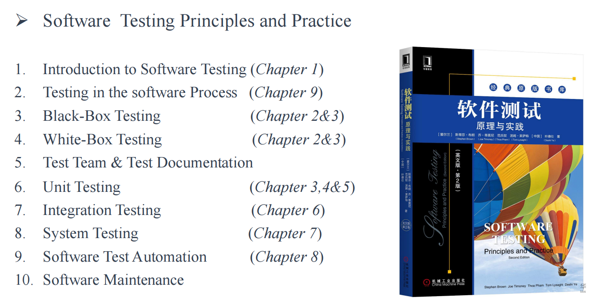

**Ch1-1 Introduction**

**序、软件工程知识体系：SWEBOK**

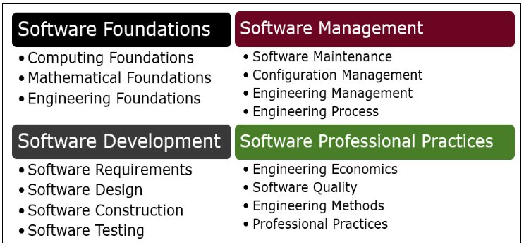

软件工程知识体系：SWEBOK  https://www.ieee.org/about/ieee-india/ieee-computer-society-india/swebok.html

**1.1 什么是软件？**

软件通常包括一系列的：**指令、数据结构、配置文件、系统文档、用户文档**

Ø A software system usually consists of a number of :

§  **Instructions**  within separate programs that when executed some desired function

§  **Data structures**  that enable the programs to adequately manipulate information

§  **Configuration files**  which are used to set up these programs

§  **System documentation**  which describes the structure of the system

§  **User documentation**  which explains how to use the system and websites for users to download recent product information

Ø 一个软件系统通常由多个...组成：

§ 单独程序中的**指令**，当执行某些所需功能时

§ 使程序能够充分操作信息的**数据结构**

§ 用于设置这些程序的**配置文件**

§ 描述系统结构的**系统文档**

§  **用户文档**，解释了如何使用系统和网站，供用户下载最近的产品信息

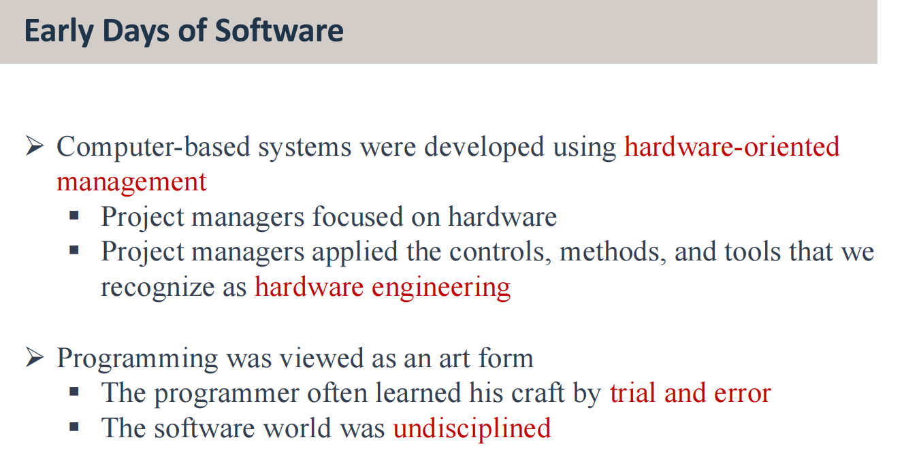
- 软件定义行为（服务器、存储、网络路由、交换网络、其他基础架构）
- 今天的软件市场更大、竞争更多、用户更多
- 嵌入式控制软件越来越多（飞机航空、航天飞船、手表、烤炉、远程控制器）
- **敏捷开发为测试人员保障质量增加了压力**

Industry is going through a revolution in what testing means to the success of software products

行业正在经历一场革命，即测试对软件产品的成功意味着什么

**QUALITY AND SOFTWARE**

Ø There are risks associated with Software Development

§ Modern programs are complex and have ten thousands of lines of code

§ The customer’s requirements can be vague, lacking in exactness

§ Deadlines and budgets put pressure on the development team

Ø The combination of these factors can lead to a lack emphasis being placed on the final quality of the software product

§ Poor quality can result in software failure resulting in high maintenance costs and long delays before the final deployment

§ The impact on the business can be loss of reputation, legal claims, decrease in market share

Ø 软件开发存在风险

§ 现代程序很复杂，有一万行代码

§ 客户的要求可能含糊不清，缺乏准确性

§ 截止日期和预算给开发团队带来压力

Ø 这些因素的结合可能导致对软件产品的最终质量缺乏重视

§ 质量差可能导致软件故障，导致最终部署前的高维护成本和长时间延迟

§ 对业务的影响可能是声誉损失、法律索赔、市场份额下降

Ø The International Standard can provide

§ support for setting quality goals

§ support for design review, verification and validation.

Ø The International Standard
1. A quality in use model composed of five characteristics
1. A product quality model composed of eight characteristics (which are further subdivided into

subcharacteristics)

Ø Be applicable to all software products and computer systems

Ø 国际标准可提供

§ 支持设定质量目标

§ 支持设计审查、验证和确认。

Ø 国际标准
1. 由五个特征组成的使用质量模型
1. 由八个特征组成的产品质量模型（进一步细分为子特征）

Ø 适用于所有软件产品和计算机系统

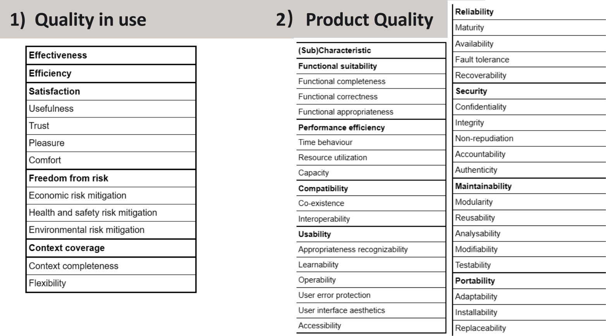

**1.2 什么是 BUG？**

BUG 是非正式的统称

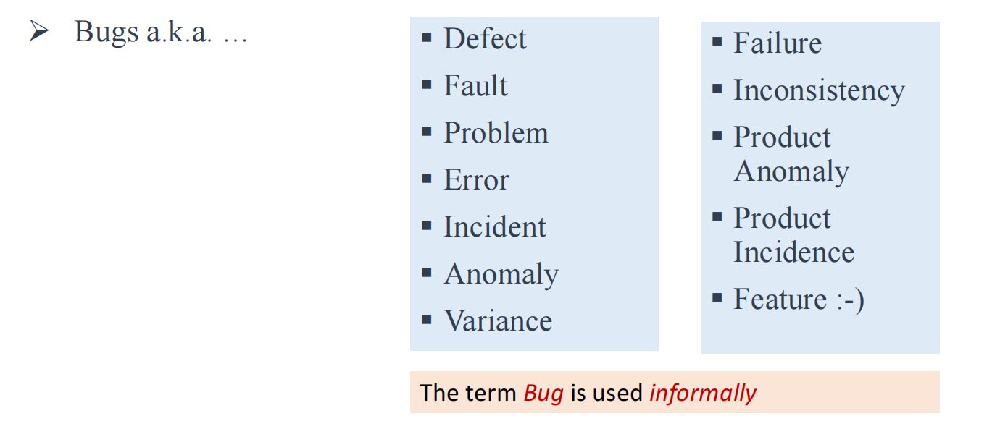

**🌟 1.3 Fault（故障）Error（错误） Failure（失效）**

**定义（必考！）**

**Fault 故障 静态缺陷 （缺陷，单词长度短）**

**Failure 失效 外部错误行为**

**Error 错误 错误的内部状态（内部 ROR）**

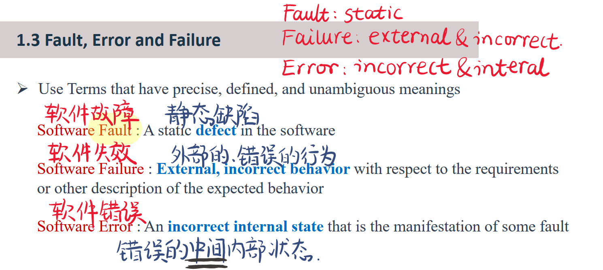

Software Fault（软件故障）：A static defect in the software 软件的静态缺陷

Software Failure（软件失效）：**External, incorrect behavior** with respect to the requirements or other description of the expected behavior 与需求或预期行为的其他描述相关的**外部的、不正确的行为**

Software Error（软件错误）：An  **incorrect internal state** that is the manifestation of some fault

**不正确的内部状态**，是某些故障的表现

**DS 解析**

软件故障（Fault）、软件错误（Error）、软件失效（Failure）的关系可以通过以下类比和定义来解析：

**1. 核心定义与关系**

**软件故障（Fault）**

相当于软件中的“先天缺陷”，是静态存在于代码、设计或文档中的偏差。例如：需求遗漏、逻辑错误、未处理的异常分支等。

**类比**：医生发现的“根本病因”（如基因缺陷或器官结构异常），可能潜伏多年未被激活。

**软件错误（Error）**

是软件运行时因故障被激活导致的**内部状态异常**。例如：变量值越界、内存溢出、信号逻辑错误等。

**类比**：医生检测到的异常指标（如高血压、细菌感染），代表系统内部已偏离正常状态。

**软件失效（Failure）**

是错误未被处理时，软件**外部可感知的功能丧失**。例如：系统崩溃、功能输出错误、用户请求超时等。

**类比**：患者表现出的症状（如疼痛、器官衰竭），是内部问题传递到外部的结果。

**2. 因果链与动态过程**

三者遵循  **Fault → Error → Failure**  的传导路径：
- **Fault**（缺陷存在）→ 被特定条件激活 →  **Error**（内部异常）→ 未及时修复/容错 →  **Failure**（外部失效）

例如：
- **Fault**：代码未处理除零异常 →  **Error**：运行时变量值变为无穷大 →  **Failure**：系统返回错误结果或崩溃

**关键区别**：
- **软件故障是静态的**，可能长期存在而不引发失效（如冗余系统中的未激活缺陷）；
- **硬件故障可能是动态的**（如元件老化、物理磨损），但软件故障仅由设计/实现时的错误导致。

**3. 与医疗类比的对应**

| 概念 | 软件领域 | 医疗类比 |
|---|---|---|
| **Fault（故障 - 静态缺陷）** | 代码/设计缺陷（如未处理异常分支） | 先天基因缺陷、器官结构异常 |
| **Error（错误 - 外部错误）** | 运行时内部状态异常（如内存泄漏、信号冲突） | 检测到的异常指标（细菌感染、电解质失衡） |
| **Failure（失效 - 中间内部）** | 用户可见的功能失效（如系统崩溃、输出错误） | 外显症状（疼痛、器官衰竭） |

**差异点**：
- 软件故障不会“随时间退化”，而是从开发阶段就存在；
- 硬件故障可能因物理老化（类似人体器官衰老），但软件失效仅由激活的缺陷引起。

**4. 实际场景举例**

**案例1：自动驾驶制动系统**
- **Fault**：软件未考虑传感器信号突变（设计缺陷）

→  **Error**：ECU接收到不合理的制动踏板信号（内部状态异常）

→  **Failure**：车辆意外紧急制动（用户可感知的危险行为）。

**案例2：金融交易系统**
- **Fault**：代码中未处理浮点数精度问题（编码错误）

→  **Error**：计算利息时产生微小偏差（内部数据错误）

→  **Failure**：用户账户余额显示异常（功能失效）。

**总结**
- **Fault是根源**，需通过代码审查、静态分析预防；
- **Error是中间态**，需依赖运行时监控和容错机制拦截；
- **Failure是终点**，需通过用户反馈和测试回溯修复。

三者关系类似于疾病从病因到症状的传导，但软件缺陷的“先天固化性”使其与硬件/生物系统的动态退化本质不同。

**例题 1**

| Java  public static int numZero (int[] arr) {     // Effects: If arr is null throw NullPointerException     // else return the number of occurrences of 0 in arr     int count = 0;     // Fault（静态）: 数组遍历应该从 0 开始遍历，不是 1          for (*int i = 1*; i < arr.length; i++)      {         if (arr[i] == 0)         {             count++;         }     }     return count;  } |
|---|

测试用例 1

[2, 7, 0]

预期输出：1

实际输出：1

Error（内部状态）：i = 1, 不是 0，在第一轮循环

Failure（外部错误）：无

测试用例 2

[0, 2, 7, 0]

预期输出：2

实际输出：1

Error（内部状态）：i = 1, 不是 0，在第一轮循环

**错误感染（propagates）到了变量 count**

Failure（外部错误）：在返回的时候，count 的结果为 1

**PIE Model**

**Execution 执行（Fault） - Infection 感染（Error） - Propagation 传播（Failure）**

Execution/Reachability:

The location or locations in the program that contain the faults must be reached.

执行/触达能力：

必须到达程序中包含故障的一个或多个位置

A test may not execute the location of the fault !（测试可能无法执行故障位置！）

Infection:

The state of the program must be incorrect.

感染：

程序的状态一定不正确

A test executing the fault may not produce an error !（执行故障的测试可能不会产生错误！）

Propagation:

The infected state must propagate to cause some output of the program to be incorrect.

传播：

感染状态必须传播以导致程序的某些输出不正确。

An error may not be propagated to the output !（错误可能不会传播到输出！）

**例题 2：设计测试用例**
1. T1 执行故障，但没有错误
1. T2 执行故障且产生错误，但是没有失效
1. T3 出现失效

| Java  public static double computeMean (int[] arr) {     // Effects: If arr is null throw NullPointerException     // else return the number of occurrences of 0 in arr      *int length = arr.length - 1; // Fault（静态）：应该被设置为数组长度 arr.length*          double mean, sum;     sum = 0.0;      for (int i = 0; i < length; i++)      {         sum += arr[i];     }     mean = sum / (double) length;     return mean;  } |
|---|

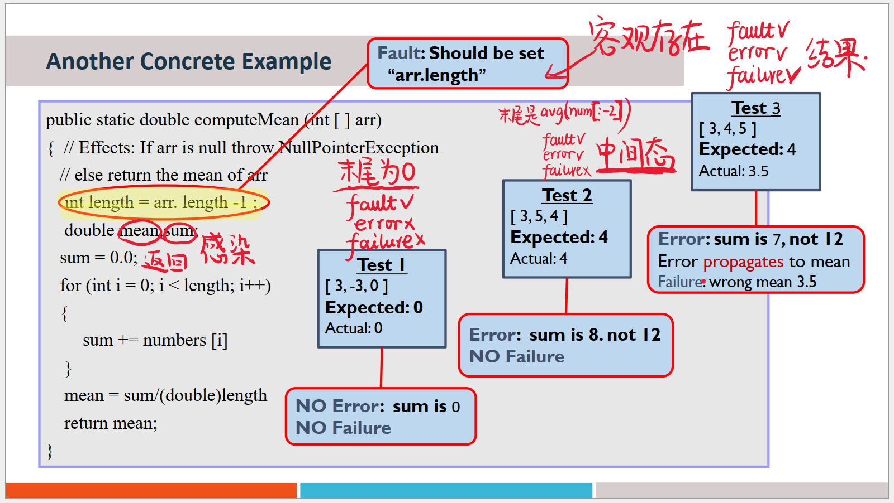

**参考答案**

| CASE ID | Input | Fault | Error | Failure | sum（中间态） | mean（结果） |
|---|---|---|---|---|---|---|
| 1（执行故障无错误） | [-3, 3, 0] | ！ |  |  | 0（✅） | 0（✅） |
| 2（执行故障且产生错误，但是没有失效） | [3, 5, 4] | ！ | ！ |  | 8（✖，12 才对） | 4（✅） |
| 3（失效了） | [3, 4, 5] | ！ | ！ | ！ | 7（✖，12 才对） | 3.5（✖，4 才对） |

**1.4 故障软件的不良影响（复习 PPT 没提）**

**Ch1-2 Introduction**

**🌟 2.1 Validation（结果导向，符合预期） & Verification（过程导向，满足需求）**
- **Verification** : The process of determining whether the products of a given phase of the software development process  **fulfill the requirements**  established during the previous phase.
- 验证：确定软件开发过程给定阶段的产品是否**满足上一阶段建立的需求**的过程。
- 换句话说：我们正确地生产了产品吗？（强调过程）
- **Validation** : The process of evaluating software at the end of software development to ensure  **compliance with intended usage**.
- 确认：在软件开发结束时评估软件以确保**符合预期用途**的过程。
- 换句话说：我们生产的产品是正确的吗？（强调结果）

**🌟 Specifications / 规范**

 Specifications play a key role.  / 规范起着关键作用

 Detailed specifications provide the correct behavior of the software.  / 详细规范提供了软件的正确行为

 They must describe normal and error behavior. / 它们必须描述正常和错误行为

**🌟 规范和 BUG 的关系？**

The software does not do something that the specification says it should do.

The software does something that the specification says it should not do.

The software does something that the specification does not mention.

The software does not do something that the product specification does not mention but should.

The software is difficult to understand, hard to use, slow ...

规范应该做的没做，不该做的做了，未提及的做了，默认做的没做

软件太慢太难用/理解

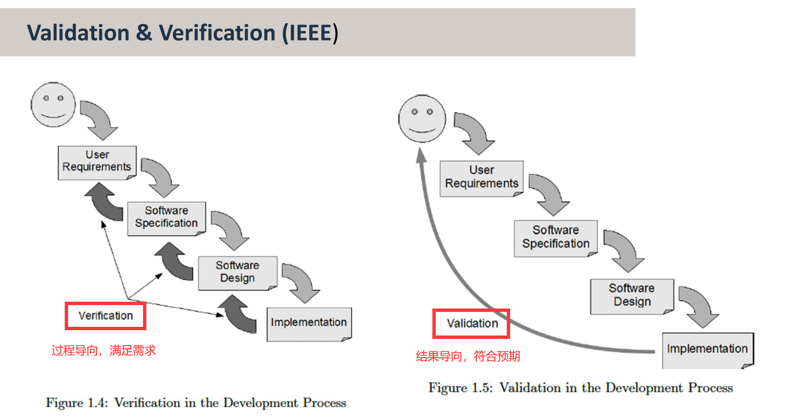

Very - Verification - 过程导向

Vali - Validation - 结果导向

**DS ：如何区分 Verification（验证）与 Validation（确认）？**

Verification 和 Validation 虽然都以 "V" 开头，但核心差异在于**焦点和目标**。以下是基于 ISO 标准和实际场景的清晰区分方法：

**1. 核心区别：过程 vs 结果**

| **维度** | **Verification（验证）** | **Validation（确认）** |
|---|---|---|
| **焦点** | **过程正确性**（是否按规范做） | **结果正确性**（是否满足用户需求） |
| **问题** | “我们是否正确地构建了产品？” | “我们构建的是正确的产品吗？” |
| **验证对象** | 设计规范、代码逻辑、技术文档等 | 用户实际需求、场景适用性 |
| **阶段** | **开发过程中**（如代码审查、单元测试） | **开发完成后**（如用户测试、临床评估） |
| **类比** | 按菜谱检查食材用量和火候 | 品尝菜品是否符合食客口味 |

**2. 记忆技巧**

**（1）口诀法**

**口诀**：

| **“Veri过程，Valid结果；前者对步骤，后者对用途。”** |
|---|

**（2）生活场景类比**
- **自动驾驶系统**：
- **Verification**：测试传感器代码是否按规范处理信号；
- **Validation**：车辆在真实道路中能否安全避障。
- **医疗设备**：
- **Verification**：检查除颤器是否输出指定电压脉冲；
- **Validation**：医生在手术室中能否用该设备成功抢救患者。

**3. 实际应用场景**

**（1）软件开发**
- **Verification**：通过单元测试、静态代码分析确保代码符合设计文档；
- **Validation**：通过**用户验收测试（UAT）**验证软件是否解决用户痛点。

**（2）医疗器械**
- **Verification**：按 IEC 62304 进行可用性验证（如字体大小是否符合人体工学规范）；
- **Validation**：通过临床评估证明设备在真实医疗环境中安全有效。

**4. 常见误区与注意事项**
- **误区1**：认为 Validation 比 Verification 更重要。
- **纠正**：两者互补！未通过 Verification 的软件可能无法进入 Validation 阶段（如代码漏洞导致功能崩溃）。
- **误区2**：将 Verification 等同于测试。
- **纠正**：Verification 包括代码审查、设计评审等非测试手段；Validation 需用户参与（如可用性测试）。

**5. 终极记忆法**

| **“Verification是‘做对事’，Validation是‘做对的事’。”** （前者确保步骤正确，后者确保方向正确） |
|---|

通过以上方法，可以快速区分两者的核心差异，并在实际项目中精准应用。

**2.2 Software Testing Axioms / 测试公理（公理无需证明）**

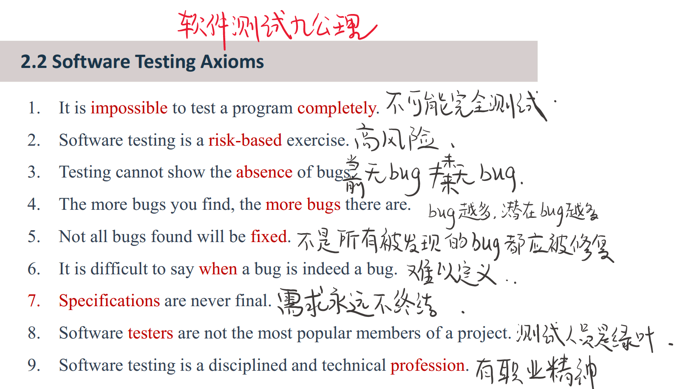
1. 输入太大、输出太大、路径太多、定义开放
1. 既然无法穷举测试，无论怎么测，都会有经济风险、安全风险。所以这门课的目的是教软件测开的工作人员如何在不破产的前提下尽量降低风险

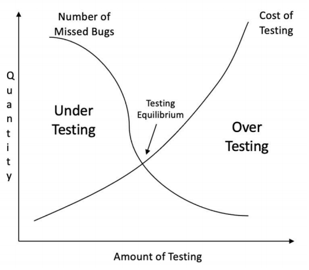
1. Dijkstra 老爷子的原话，不解释
1. 杀虫剂效应（如果程序员在某个点粗心，那么很有可能在一片代码都会粗心犯错，所以 bug 很有可能只是冰山一角，需要持续的写新的、不同的测试用例）
1. 没时间了、不一定是 BUG（万一是定义出错了呢？）、修复风险太大、不值得修
1. Bugs that are undiscovered are called latent bugs. 未被发现的错误称为潜在错误。
1. 软件工程的目标是“移动的、快速变化的”，但是传统工程是谋定而后动
1. 测试人员是绿叶，做好三件事：发现bug，尽早发现bug，确保bug被修复

1. 如果软件 BUG 太多，积重难返成本就太高了，所以要有职业精神

**2.3 Goals of a Software Tester / 软件测试人员的目标**

find early fixed
- 发现 BUGS
- 越早发现 BUGS 越好
- 确保这些 BUG 被修复

请注意，我们并不是*消除所有的 BUG*，目前来看这个情况不现实

To  **identify the ideal test**  – that is, the  **minimum test data**  required to ensure that the software works for all inputs. / 确定**理想的测试**，即确保软件适用于所有输入所需的**最少测试数据**。

**🌟 Ch2 Test Process 测试流程**

** Waterfall Model 瀑布模型**
- 所有的计划在一开始就完成了，一旦被创建了以后就无法被改变
- There is  **no overlap**  between any of the subsequent phases.

任何后续阶段之间都**没有重叠**。
- Often anyone’s first chance to “see” the program is at the very end once the testing is complete.

通常任何人第一次“看到”该计划的机会是在测试完成后的最后。

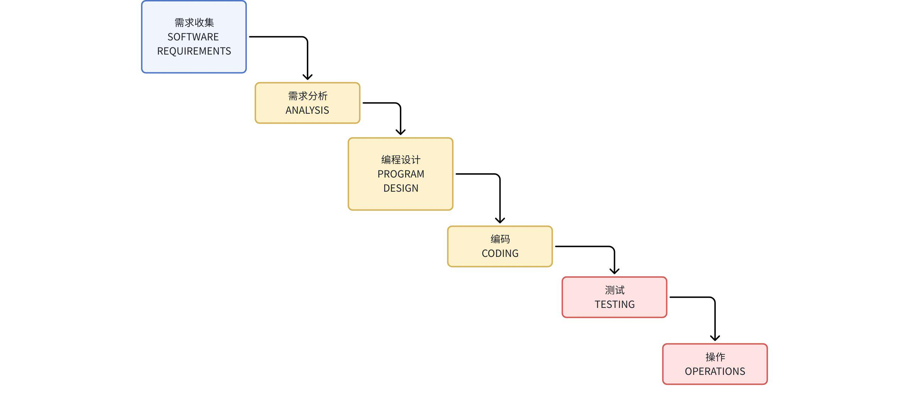

| 优势 | If time is spent early on making sure that the requirements and design are absolutely correct, then this will save much time and effort later.（如果早期设计是**完全正确**的，那么之后能节约很多时间） There is an emphasis on documentation which keeps all knowledge in a central repository and can be referenced easily by new members joining the team.（重点是文档，它将所有知识保存在一个中央存储库中，并且可以很容易地被加入团队的新成员引用。） |
|---|---|
| 不足 | Few visible signs of  **progress**  until the end of the project （直到项目结束，几乎没有明显的进展迹象） It is not flexible to  **changes** （针对变化不灵活） Time-consuming to produce all the  **documentation**（文档生成耗时） **Tests**  are only carried out at the end  – this could mean a compromise if time or budgetary constraints exist（测试只在最终环节被实施：如果存在时间或预算限制，这可能意味着妥协） Having to test the program as a  **whole** could result in incomplete testing  （将程序作为一个整体进行测试会导致不完全的测试） If testing does identify a fault that suggests a redesign it may be ignored because of the trouble involved（如果测试确实发现了建议重新设计的故障，则可能会因为涉及的问题而被忽略） If the customer is unhappy it may  **incur a long maintenance**  phase resolving their issues（顾客不满意的话，需要长时间的维护需解决他们的诉求） |

** Spiral Model 螺旋模型**

开发 → 迭代：对**每一个迭代模型进行评审以及验证**
- **风险驱动**的开发流程
- 组合了**瀑布模型**以及**快速原型迭代模型**
- 从**目标设计**开始，从客户回顾流程结束
1. 决定目标
1. 识别风险
1. 开发 & 测试
1. 计划下一轮迭代

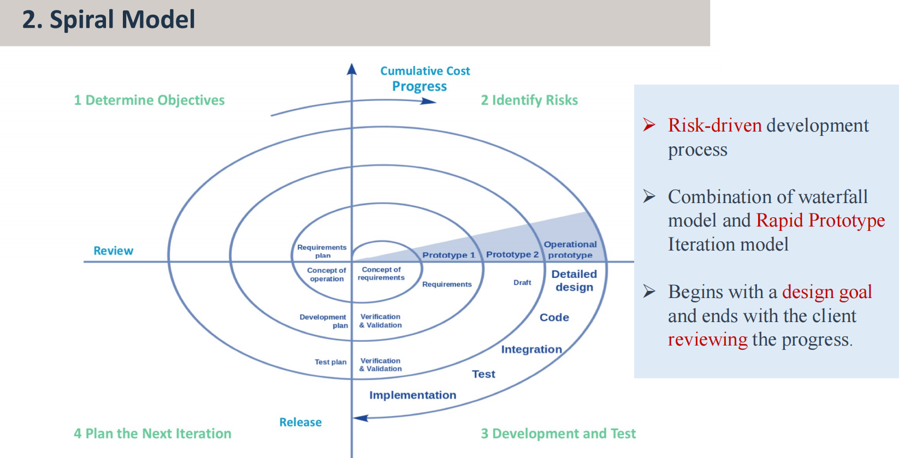

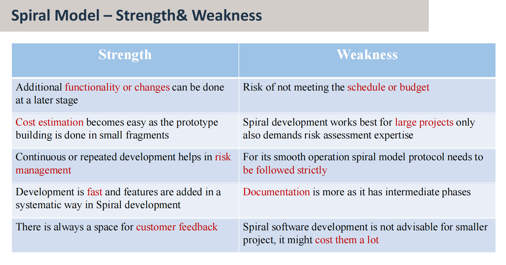

优势：功能更改可适当推后、成本估计简单、风险管理有效、开发快、有用户反馈空间

缺点：可能无法按时 + 平账、只适用于大项目、管理严格、文档更多、对小项目不可取

**🌟 V Model**

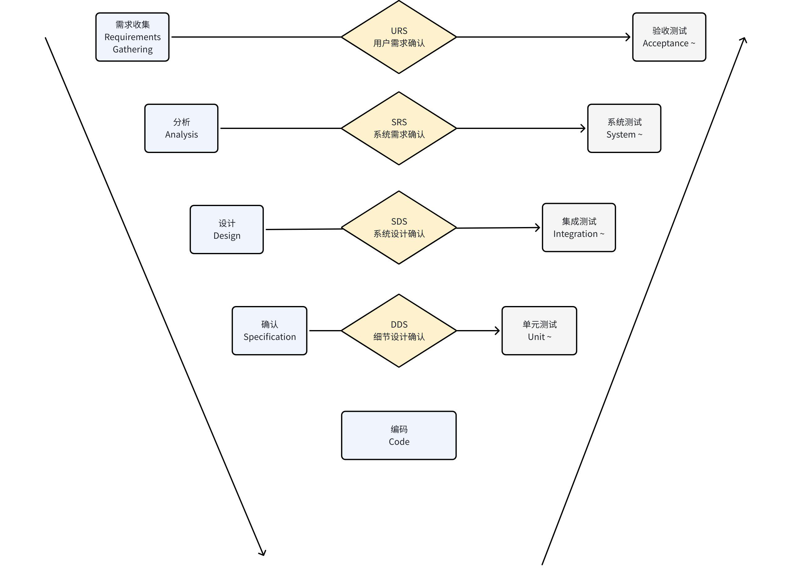

这是瀑布模型的扩展

通过  **标记每一个阶段的生命周期以及测试活动**  来强调 Verification & Validation

一旦编码完成，测试就随之开始了

**从单元测试开始，然后测试层级逐步提高，直到验收测试完成。**

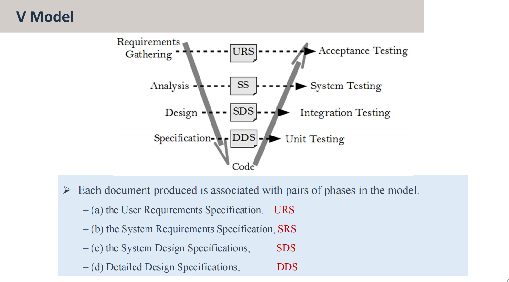

| 优势 | It is simple and  **easy to manage**  due to the rigidity of the model. （由于模型的刚性，它简单易管理） It encourages  **verification and validation**  at all phases. （它鼓励在所有阶段进行验证和校验） Each phase has specific deliverables and a review process. （每个阶段都有**特定的可交付成果和审查流程**） It gives  **equal weight to testing**  alongside development rather than treating it as an afterthought at the end.（它将**测试与开发同等重视**，而不是在最后将其视为事后的想法） |
|---|---|
| 不足 | Like the Waterfall model , there is no working  **software**  produced until  **late**  during the life cycle.（和瀑布模型一样，直到生命周期后期才生产出工作软件） It is  **unsuitable**  where the requirements are at a moderate to  **high risk of changing**. （不适合需求处于中度到高度变更风险的情况。） The tight link between test, debug and change tasks during the test phase is not clear.（测试阶段的测试、DEBUG 和变更任务是不清晰的） |

**🌟 W Model**

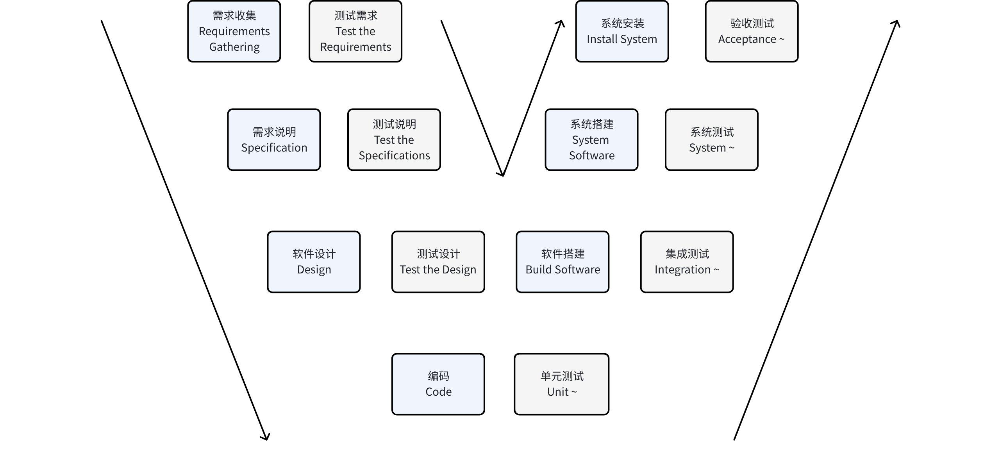

别名：V 模型拓展 / 双 V 模型

测试并不是在编码完成后进行的，而是和开发过程**平行（PARALLEL）**

强调开发和测试的协作**（CO-OPERATION）**

测试不只是构建，还包括执行和评估

** Agile Model – XP 敏捷模型：极限编程**

在去年的 SA 学习中，我们对敏捷模型已经有了一定的理解，详情：[SA 讲义（四）Chapter 15 ~ 17](https://a1npn29y3xu.feishu.cn/wiki/Kxggw6yRZixCWIkbdsfcW2Pcn3f?from=from_copylink)

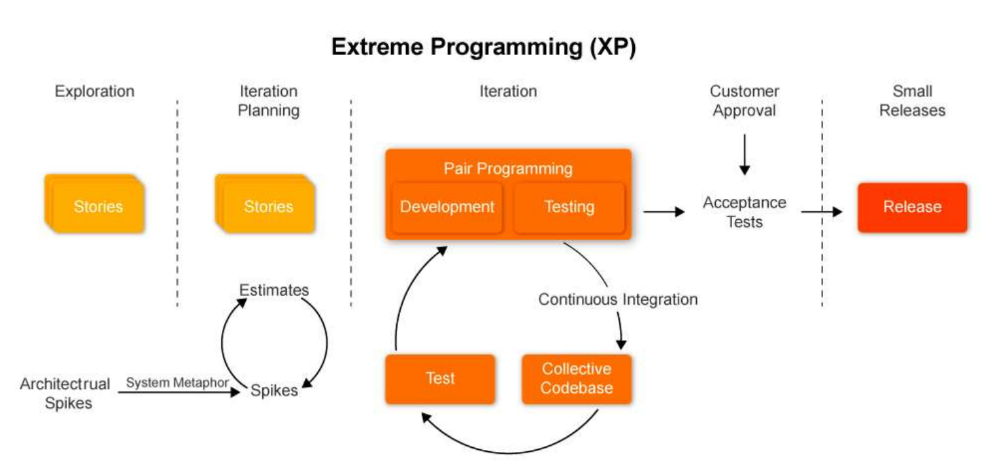

**极限编程的理念**
- 迭代和增量开发
- 将大项目拆分成小的周期，**每个交付一个功能增量以迭代细化特征**
- 以消费者为中心的价值交付
- 经常交付工作软件以适应不断变化的需求
- 拥抱变化
- 将需求变更视为改进的机会，通过持续反馈调整优先级，而不是严格遵守最初的计划
- 自组织的团队和组织
- 赋能跨职能团队自我管理，强调面对面沟通

**极限编程的价值**

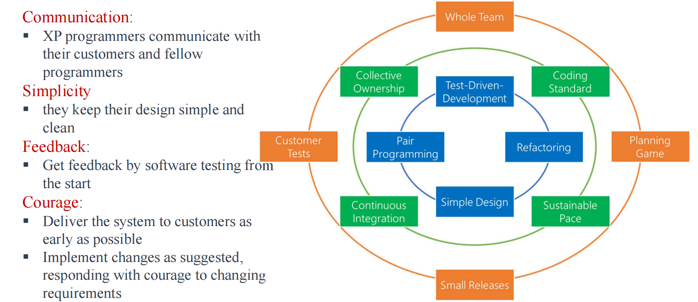

**Communication:**
- XP programmers communicate with their customers and fellow programmers

沟通：

极限编程的程序员与他们的客户和其他程序员交流

**Simplicity:**
- they keep their design simple and clean

简单：

他们保持设计简单干净

**Feedback:**
- Get feedback by software testing from the start

反馈：

从一开始就通过软件测试获得反馈

**Courage:**
- Deliver the system to customers as early as possible
- Implement changes as suggested, responding with courage to changing requirements

勇气：

尽早将系统交付给客户

按照建议实施变更，勇于响应不断变化的需求

**🌟 极限编程的软件测试**

**生命周期测试**
- 软件生命周期的测试
- **左移测试：**在需求阶段过程中开始测试，和开发相互平行
- **持续测试：**将测试集成到每一个迭代上，从而保证每一次增量发布的质量稳步提升

**🌟 TDD**

**定义**
- **TDD（Test-Driven Development） 测试驱动开发**
- 先写测试 —— 然后编译 —— 接下来跑测试 —— 写代码 —— 跑测试 —— 测试通过再重构
- **在编码之前写测试用例：帮助开发者思考接口设计以及边界条件**
- 先书写单元测试 — 然后开发代码去通过测试 — 最后重构代码
- 通过测试定义需求去保证代码符合预期并且保持可维护性

开始 —— 编写测试 —— 编译 —— 修复编译错误 —— 运行代码观察其失败 —— 编写代码 —— 运行代码观察其通过 —— 根据需求重构代码 —— 重复编写测试

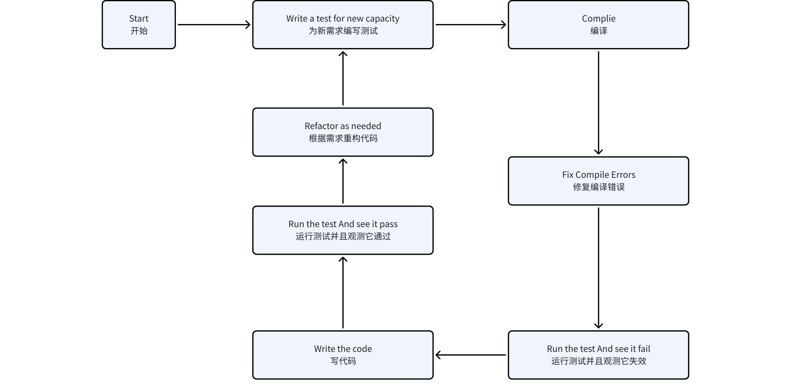

**实现细节**

Ø Write code only when an automated test fails

Ø If you find a bug through other means, first write a test that fails, then fix the bug

§ Bug won’t resurface later

Ø  **Run tests as often as possible**, ideally every time the code is changed

§ Having comprehensive unit tests allows you to refactor code with confidence

§ Without unit tests, code is fragile – changes might break clients

Ø 仅在自动化测试失败时编写代码

Ø 如果你通过其他方式找到bug，先写一个失败的测试，然后修复bug

§ Bug以后不会重新出现

Ø  **尽可能经常地运行测试**，理想情况下每次更改代码时都要运行测试

§ 拥有全面的单元测试可以让您自信地重构代码

§ 没有单元测试，代码很脆弱 —— 更改可能会破坏客户端

**好处**

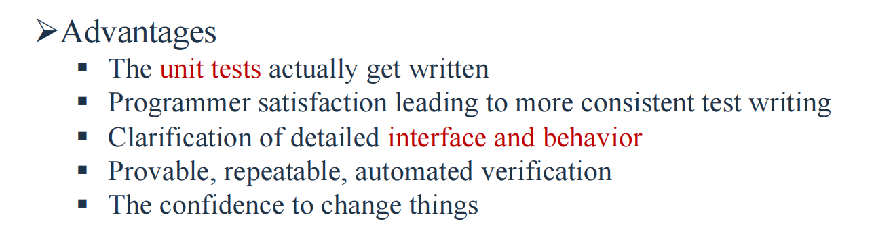
1. **单元测试**实际上被编写了
1. 程序员的满意能让测试用例编写变得更有持续性
1. 让**接口和行为**的细节更加清晰
1. 可证明、可重复、自动化的验证
1. 为程序员提供重构的自信

**验收测试**
- **Acceptance Testing Aligned with User Stories**

Define acceptance criteria for each user story, with tests designed around these criteria.
- 与用户故事对齐验收测试

为每个用户故事定义验收标准，并围绕这些标准设计测试。

**CI（持续集成）**
- **Continuous Feedback and Improvement**

Use daily builds and continuous integration (CI 持续集成) to automate tests
- 持续反馈和改进

使用每日构建和持续集成（CI持续集成）来自动化测试

**测试金字塔**
- Automation as the Backbone

测试金字塔（自顶向下）UI 测试 → 集成测试 → 单元测试

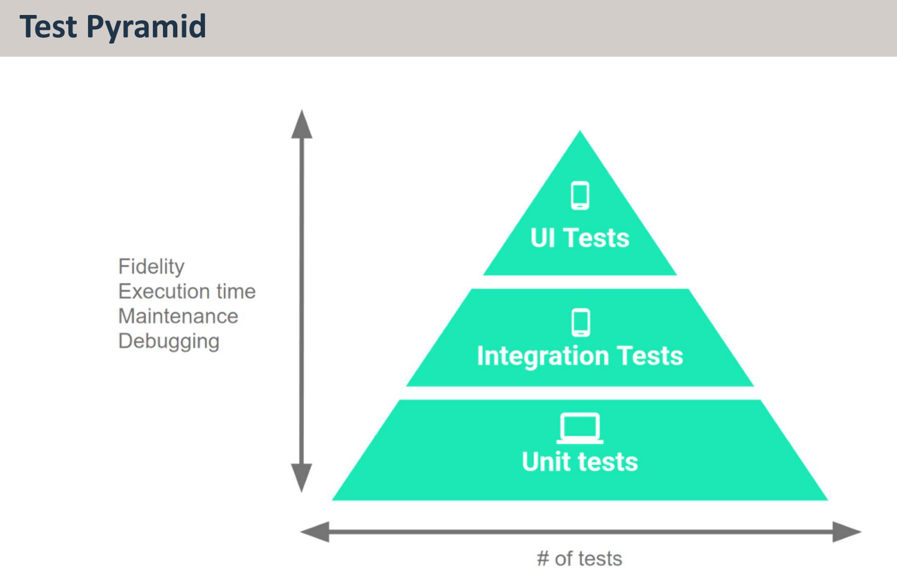

Fidelity Execution time Maintenance Debugging / 准确性、执行时间、维护、调试

High: volume of unit tests (fast, low-cost, code-level coverage).

Middle: Integration/API tests (validate module interactions).

Top: Fewer end-to-end (UI) tests (simulate user workflows, costly but critical for key paths).

** DevOps （就业很有用，复习 PPT 没提）**

感兴趣的同学可看：[zhuanlan.zhihu.com](https://zhuanlan.zhihu.com/p/562036793)

**Ch3 Test Principle 测试原理**

这一章内容比较精简，集中解决一个问题：**怎么进行测试？**

**3.1 静态和动态验证**

|  | 静态验证 （Static Verification） | 动态验证（Dynamic Verification） |
|---|---|---|
| 是否需要 执行代码？ | ✖ | ✅ |
| 怎么做的？ | Reading through the code (straightforward) 直接通读代码 | Executing 执行代码 |
| 包含步骤 | static analysis, code reviews, checks against coding standards and guidelines, and other techniques 静态分析、代码审查、根据编码标准和指南进行检查以及其他技术 | 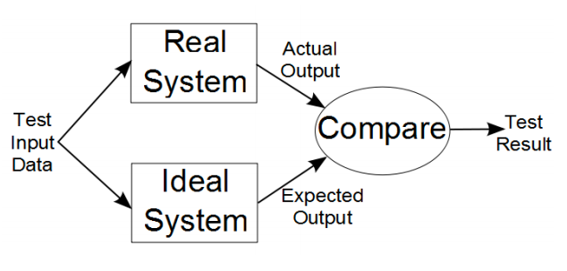 |

静态验证

a formal approach consisting of symbolic verification of the translation between the specification and the source code

一种正式的方法，包括对规范和源代码之间的转换进行符号验证

动态验证

**Test Cases**  are created that guide the selection of suitable Test Data (consisting of Input values and Expected Output values ) / 创建测试用例以指导选择合适的测试数据（由输入值和预期输出值组成）

Input values.

Actual Outputs are compared with the Expected Outputs.

**3.2 🌟 对比黑盒测试和白盒测试（部分内容移动到讲义二和三里）**

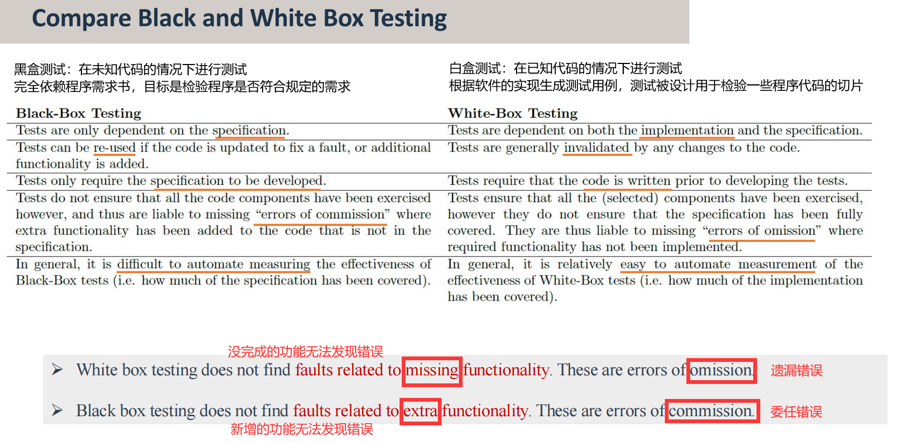

|  | 黑盒测试 | 白盒测试 |
|---|---|---|
| 依赖内容 | 只依赖需求说明书 | 依赖源代码实现 + 需求说明书 |
| 代码更改后 测试用例 能否重用 | 可以 | 一般情况下不可以 |
| 需要什么 | 只需要指定规范 | 需要在测试之前写好代码 |
| 自动化测试难度 | 较难 | 较易 |

Ø White box testing does  **not**  find faults related to  **missing**  functionality. These are errors of  **omission**.

Ø 白盒测试没有发现与**功能缺失**相关的故障。这些是**遗漏错误**。

Ø Black box testing does  **not**  find faults related to  **extra**  functionality. These are errors of  **commission**.

Ø 黑盒测试未发现与**额外功能**相关的故障。这些是**委托错误**。

**3.3 错误注入与测试制品（仅供了解）**

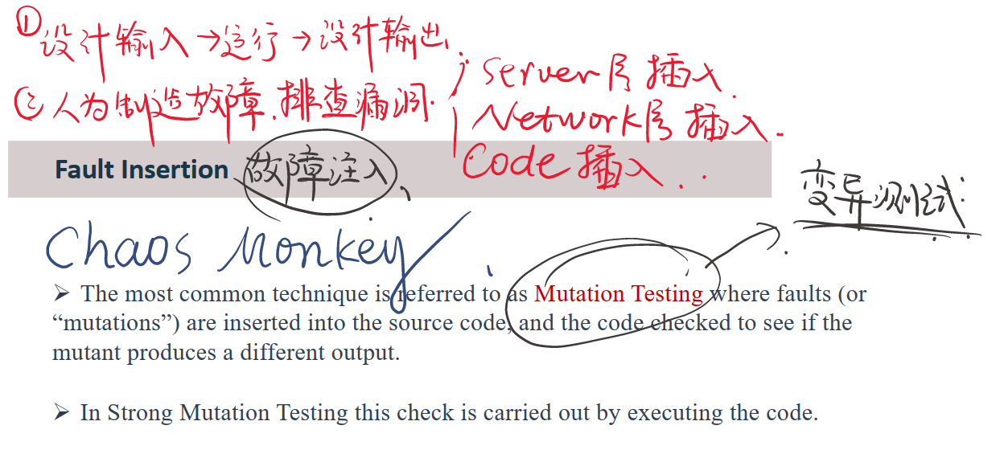

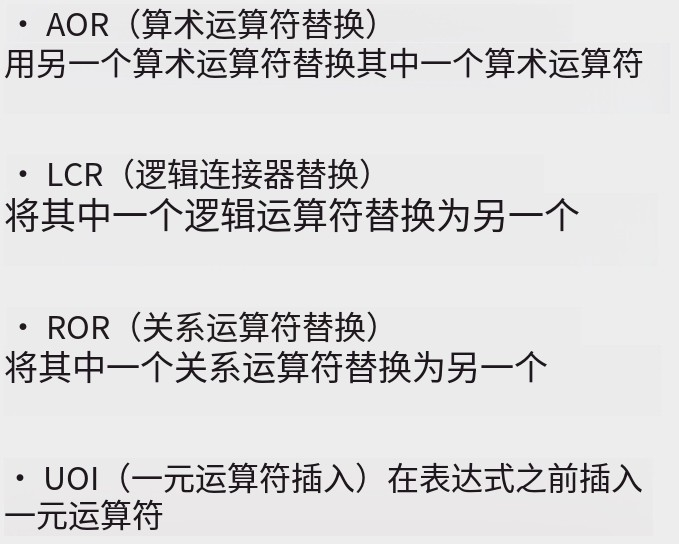

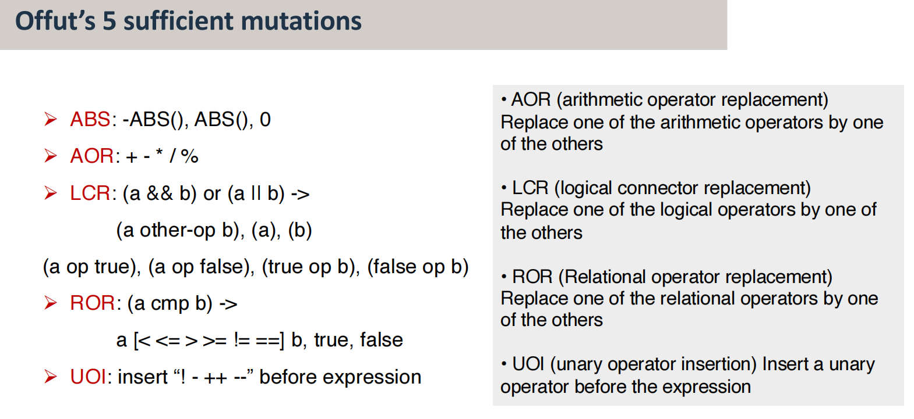

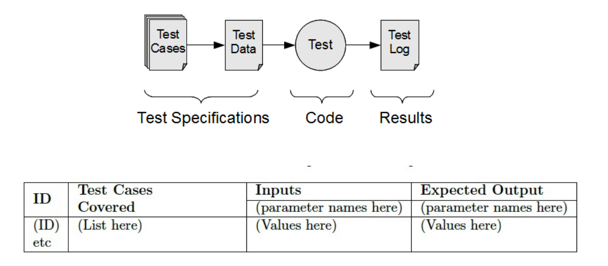
