# ST 讲义（三）🌟 白盒测试 ✅

**ST 讲义（三）🌟 白盒测试 ✅**

白盒测试初稿已经更新完毕，期末的重点是理解白盒测试从简略到详细的思维流程，在期末考试的时候一定要审题，看清楚老师究竟要让我们使用哪种方法。

画程序流程图相信大家能稳稳拿下，但是画 CFG 控制流图还是有很多需要注意事项的，大家复习的时候可以在白纸上多写写多画画。

**序、白盒测试概念**

**什么是白盒测试？**

**White box testing**  uses the  **implementation**  of the software to derive the tests. The tests are designed to exercise some aspect of the program code.

**白盒测试**使用软件的**实现**来推导测试。这些测试旨在考察程序代码的某些方面。

**White-Box testing**  provides for  **coverage of the implementation**, but not of the specification. That is there may be behaviour stated in the specification for which there is no code in the implementation.

白盒测试提供了实现的覆盖范围，但没有提供规范的覆盖范围。也就是说，规范中可能规定了实现中没有代码的行为。

ref:  [白盒测试 百度百科](https://baike.baidu.com/item/%E7%99%BD%E7%9B%92%E6%B5%8B%E8%AF%95/934440)

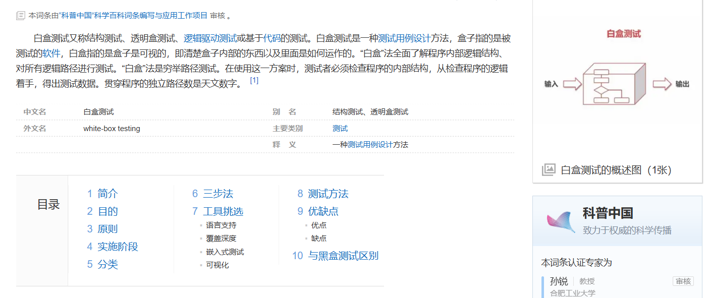

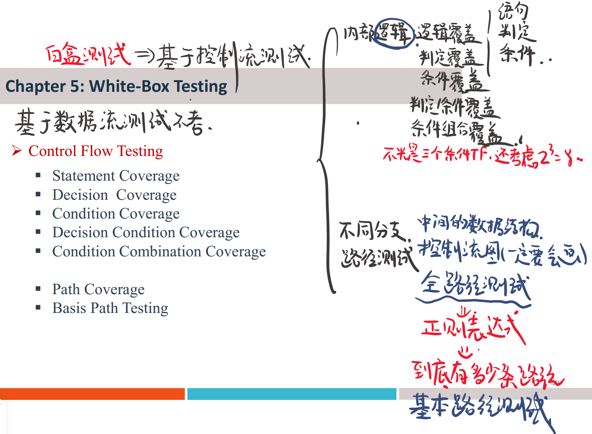

**白盒测试的原则（principle）**

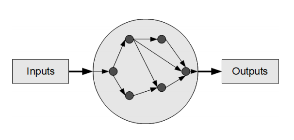
1. Test against the implementation 测试执行情况
1. Use test coverage criteria based on the implementation 根据实现使用测试覆盖率标准
1. Develop test cases derived from the implementation 开发从实现中得出的测试用例
1. “Exercise” implementation “演习”执行

**什么是控制流测试？**

Ø Control-flow testing is a structural testing strategy that uses the program’s control flow as a model.

Ø 控制流测试是一种以程序的控制流为模型的结构测试策略。

Ø Requires the tester to have a clear understanding of the logical structure of the program, and even to be able to master all the  **details of the source program**.

Ø 要求测试人员对程序的逻辑结构有清晰的认识，甚至能够掌握源程序的所有细节。

Ø Most applicable to new software for  **unit testing**.

Ø 最适用于新软件的单元测试。

**Ch 5-1 Logic Coverage（逻辑覆盖）**

**Source Code（本节课使用的源代码）**

| Java  Java 实现  public static float example(float A, B, X) {     if (A > 1 && B == 0) {         X = X / A;     }     if (A == 2 \|\| X > 1) {         X = X + 1;     }     return X;  } |
|---|

| Python  Python 实现  def example(A: float, B: float, X: float) -> float:     if A > 1 and B == 0:         X = X // A     if A == 2 or X > 1:         X = X + 1          return X |
|---|

**Program Flow Graph（本节课使用的程序流图）**

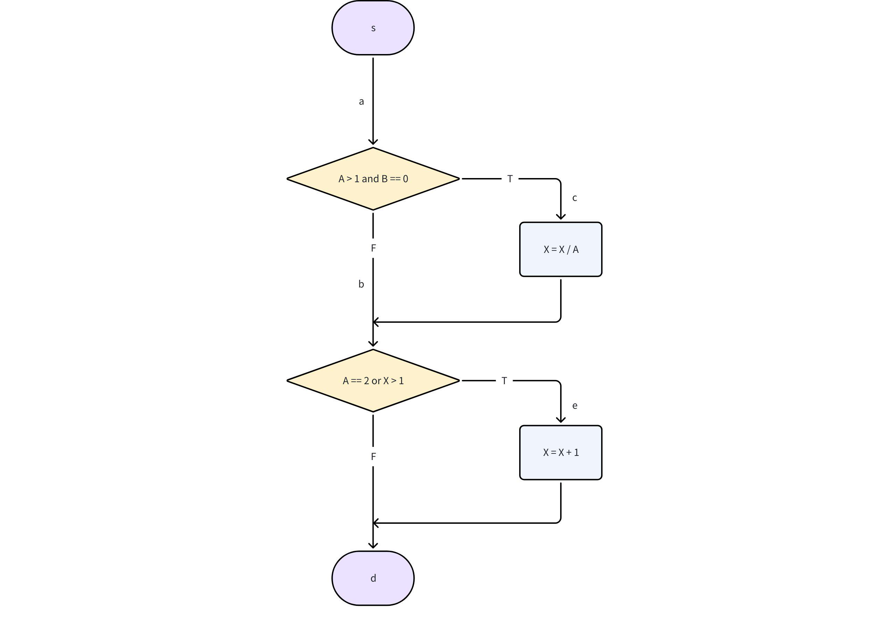

**Statement/Point Coverage 语句/点覆盖**

**定义**
- Design test cases and work out input values required to ensure that  **every source code statement is executed**.（设计测试用例以及需求的输入值确保**源代码的每一行都能被执行到**）
- Also known as  **point coverage（点覆盖）**
- The  **weakest logical coverage**, be used interoperatively with other testing methods.（最弱的逻辑覆盖，一般结合其他的测试方法进行使用）

**例题**

| 用例编号 | 输入（A, B, X） | 路径 | 输出（X） |
|---|---|---|---|
| 1 | 2,0,4 | sacbed | 3 |

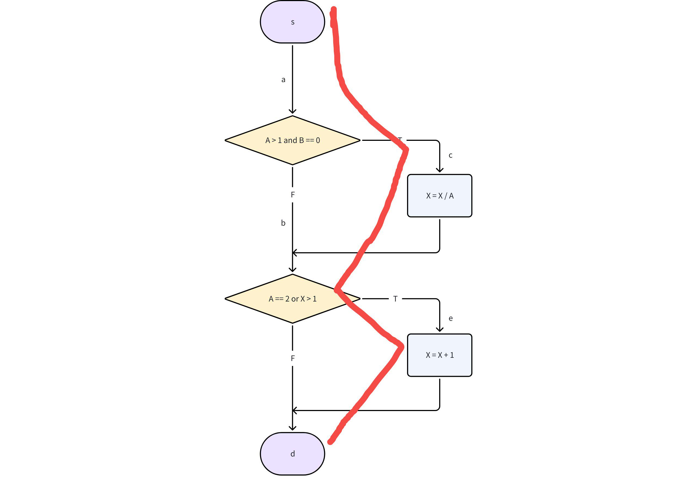

**Decision/Branch/Edge Coverage 决策/分支/边覆盖**

**定义**
- Design test cases and work out input values required to ensure that  **every source  code branch is taken**.（设计测试用例并且输入需要的的输入值去确保**每一个源代码的分支都可以被执行到**）
- Each true and false branch of the program is executed at least once（程序中的每一个 true 和 false 分支都可以至少被执行一次）
- Also known as  **edge coverage**.（边覆盖）

**例题**

I 用蓝笔表示：A = 3, B = 0, X = 1, sacbd

II 用红笔表示：A = 2, B = 1, X = 1, sabed

**满足分支覆盖一定满足语句覆盖**

**但是满足语句覆盖不一定满足分支覆盖**

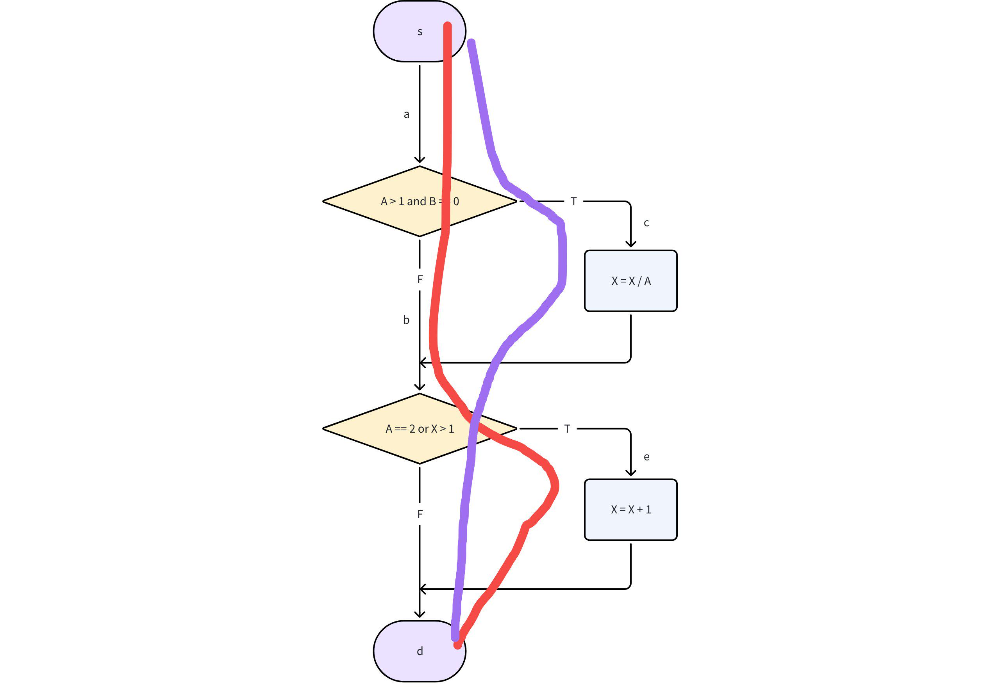

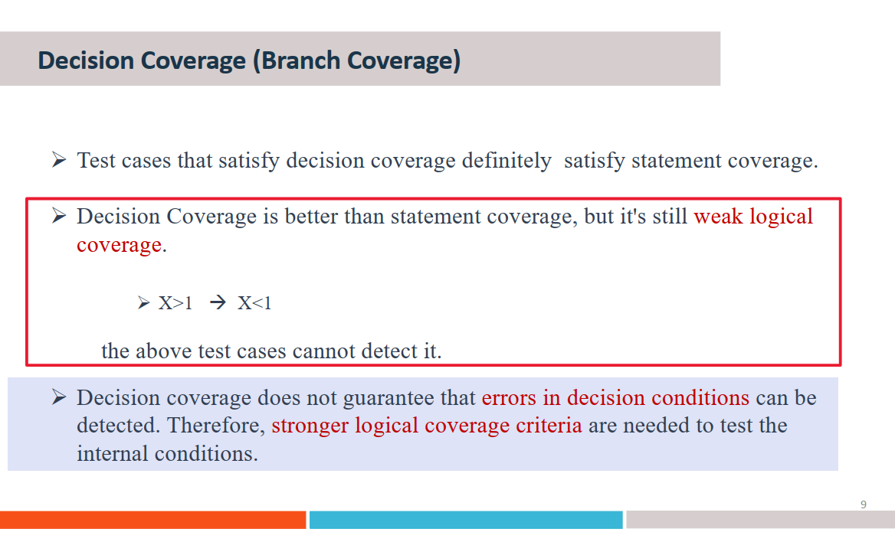

**Condition Coverage 条件覆盖**

**定义**
- 一个复杂的**决策**是由**许多布尔条件**组合而成的
- 条件覆盖在分支覆盖的基础上做了拓展：**对于复杂的决策，每一个布尔条件的 True 和 False 都应该被测试**
- 这存在一个 caveat （警告）：决策本身的 True 和 False 并没有必要被考虑进去
- 测试数据被选择去确保每一个决策的每一个条件的 True 和 False 都应该被考虑进去

**例题**

根据条件覆盖的定义可以得出真值表

| A > 1 and B == 0 |  |  |  | A == 2 or X > 1 |  |  |  |
|---|---|---|---|---|---|---|---|
| A > 1 |  | B == 0 |  | A == 2 |  | X > 1 |  |
| T | F | T | F | T | F | T | F |

**我们只需要保证设计的测试用例能涵盖真值表的所有 T 和 F 即可**

**情景一：条件覆盖满足语句覆盖和分支覆盖**

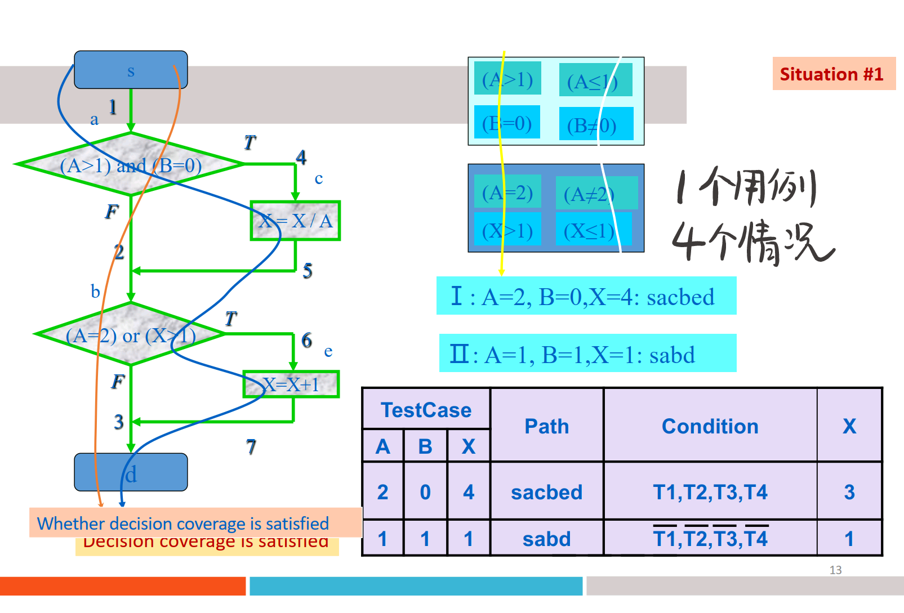

**情景二：条件覆盖满足语句覆盖，不满足分支覆盖**

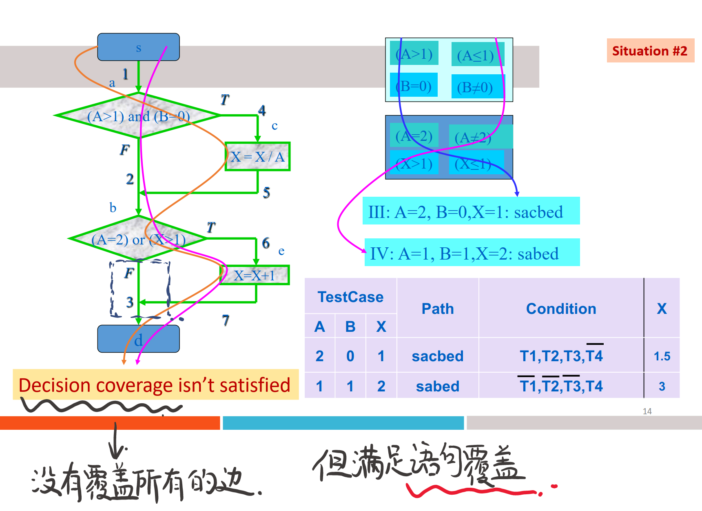

**情景三：条件覆盖不满足语句覆盖，也不满足分支覆盖**

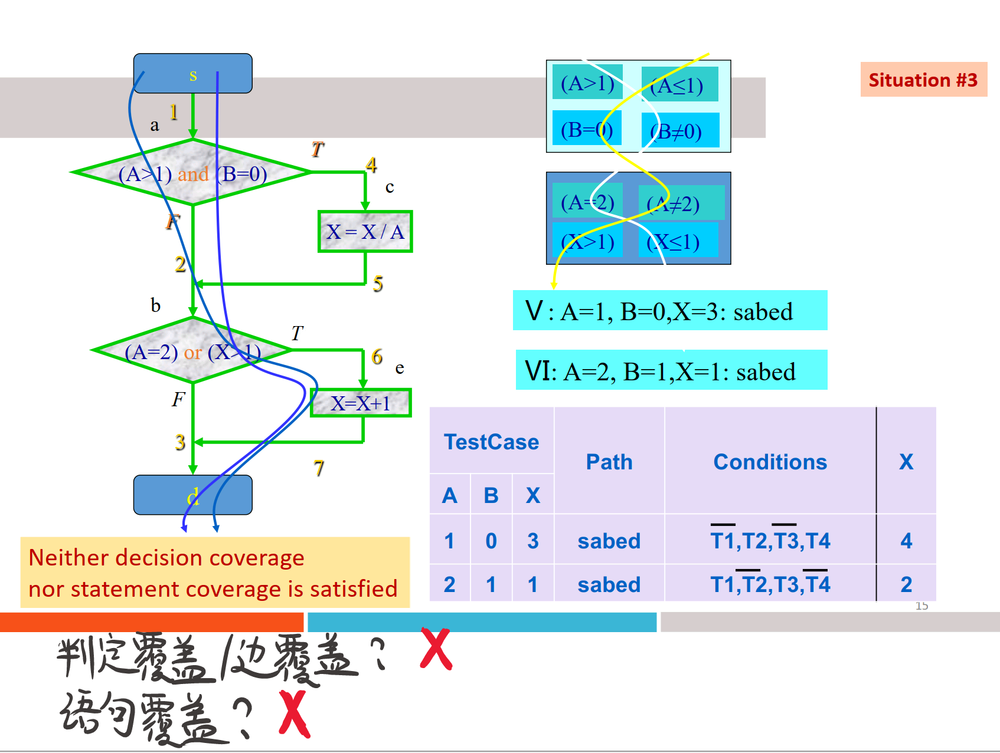

**优势和不足**

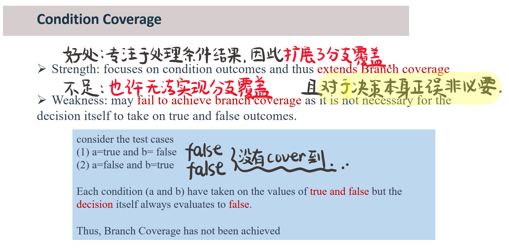

**Decision Condition Coverage 决策/条件覆盖**

**定义**

Ø Generate test data such that all conditions in a decision take on both outcomes (if possible) at least once and exercise the true and false outcomes of every decision.

§  **Each decision**  has True and False test cases

§ In addition,  **each condition**  in a decision has True and False test cases (if possible)

Ø 生成测试数据，使决策中的所有条件至少对两个结果（如果可能）进行一次，并练习每个决策的真假结果。

§  **每个决策**都有True和False测试用例

§ 此外，决策中的**每个条件**都有True和False测试用例（如果可能）

Ø It is a  **combination of Condition Coverage and Branch Testing**. It uses the same test data as for Condition Coverage but must additionally ensure that each branch or decision takes a true or false outcome.

§ Single condition decision: 2 test cases

§ 2-condition decisions: 2+ test cases

Ø 它是**条件覆盖和分支测试的组合**。它使用与条件覆盖相同的测试数据，但必须额外确保每个分支或决策都得出真或假的结果。

§ 单条件决策：2 个测试用例

§ 2-条件决策：2+ 个测试用例

**例题**

1.1  **书接上文**

在上一节的例题中，我们得到了这张表

| A > 1 and B == 0 |  |  |  | A == 2 or X > 1 |  |  |  |
|---|---|---|---|---|---|---|---|
| A > 1 |  | B == 0 |  | A == 2 |  | X > 1 |  |
| T | F | T | F | T | F | T | F |

如何做到**边覆盖**且让**八个布尔值同时被测试**呢？

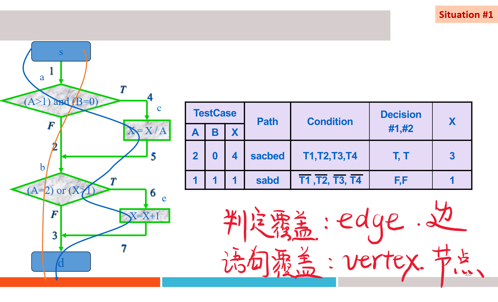

1.2  **航空座位预定样例**

| Java  细节：使用了包装布尔类  public static Boolean seatsAvailable(int freeSeats, int seatsRequired) {     boolean rv = false;          if (***(freeSeats >= 0) && (seatsRequired >= 1) && (seatsRequired <= freeSeats)***) {         rv = true;     }     return rv; // Java 的自动装箱机制  } |
|---|

如何实现分支覆盖？

| ***(freeSeats >= 0) && (seatsRequired >= 1) && (seatsRequired <= freeSeats)*** |  |
|---|---|
| T（1） | F（2） |

如何实现条件覆盖？

| ***(freeSeats >= 0)*** |  | ***(seatsRequired >= 1)*** |  | ***(seatsRequired <= freeSeats)*** |  |
|---|---|---|---|---|---|
| T（3） | F（4） | T（5） | F（6） | T（7） | F（8） |

如何实现 决策/条件覆盖呢？

<table>
<tr><td>测试用例</td><td>真值表覆盖条件</td><td>输入</td><td></td><td>预计输出</td></tr>
<tr><td></td><td></td><td>freeSeats</td><td>seatsRequired</td><td>返回值</td></tr>
<tr><td>1</td><td>1,3,5,7</td><td>50</td><td>25</td><td>true</td></tr>
<tr><td>2</td><td>2,4,6,8</td><td>-50</td><td>-25</td><td>false</td></tr>
</table>

**小结**

决策/条件覆盖的实现步骤

① 确定程序中所有的决策（decisions）

② 将程序中所有的条件（conditions）列出来

③ 生成测试数据去**覆盖以上的所有决策和条件的布尔值**

通过强制执行每个分支来解决条件覆盖率的缺陷之一

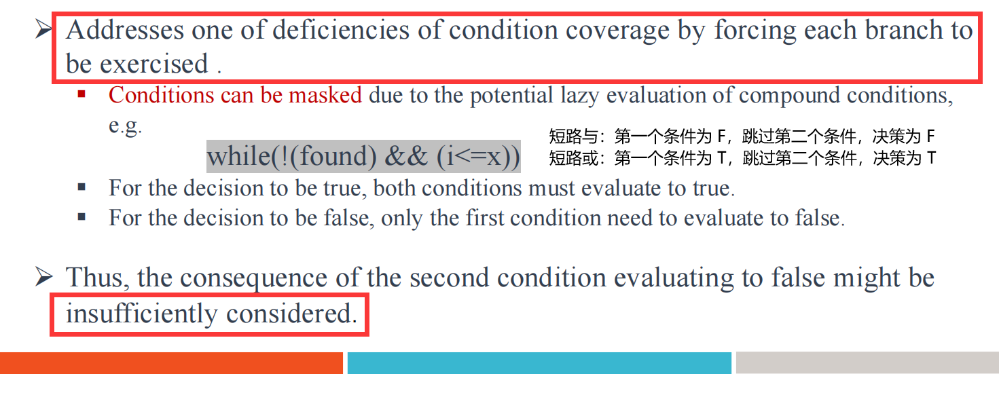

**优势和不足**

**优势**

Ø The true and false outcomes of every decision and every condition are covered

Ø This gives  **stronger coverage**  than just Condition Coverage or Decision Coverage

Ø 覆盖每一个决策、每一个条件的真假结果

Ø 这提供了比条件覆盖或决策覆盖**更强的覆盖范围**

**不足**

Ø Even though every decision is tested, and every condition is tested,  **not every possible combination of conditions is tested**.

Ø 即使每个决策都经过测试，每个条件都经过测试，但**并不是每个可能的条件组合都经过测试**。

**Condition Combination Coverage 条件组合覆盖**

最强，开销最大的逻辑覆盖测试方法

**定义**

Ø Tests are generated to cause  **every possible combination**  of conditions for  **every decision to be tested**.

Ø 生成测试以导致测试**每个决策**的**每个可能条件组合**。

Ø The goal is to achieve  **100% coverage**  of every decision and  **100% coverage**  of every condition.

Ø A  **Truth-Table（真值表）**  is the best way to identify all the possible combinations of values.

**例题**

1.1  **书接上文**

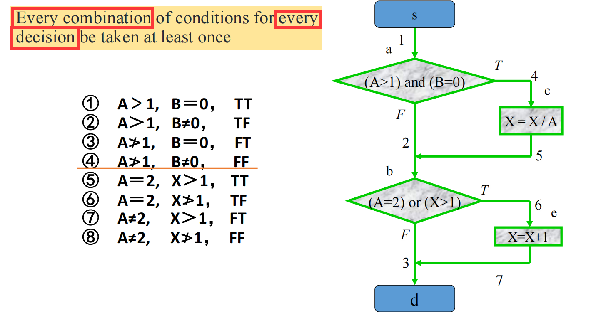

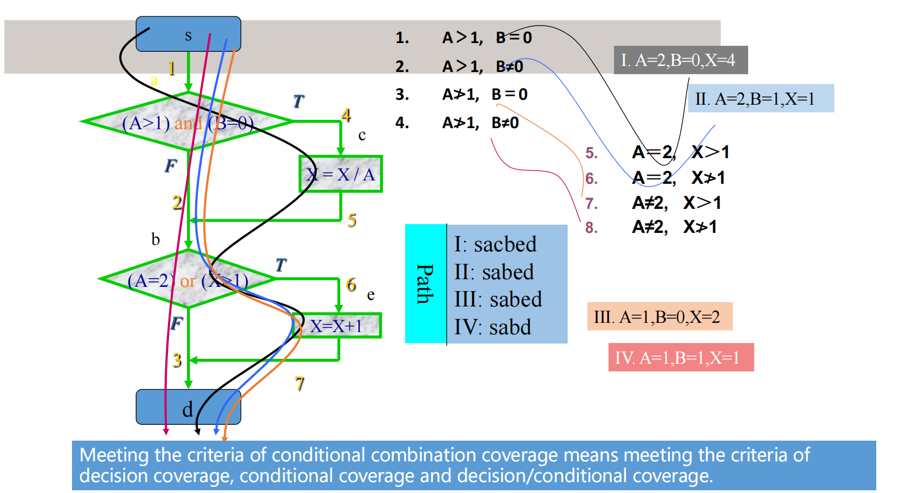

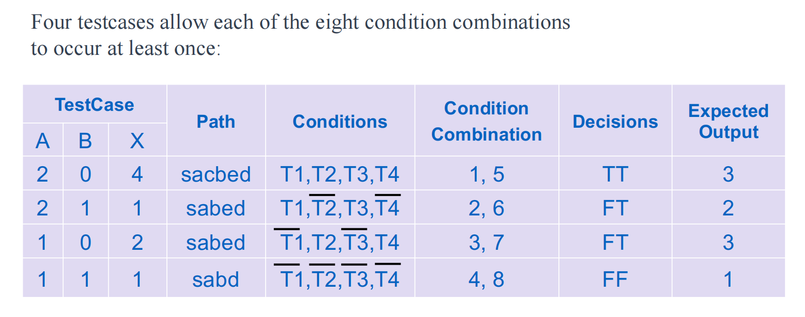

**注意到：即使是双重笛卡尔积，程序中也不是所有的路径都可以被执行到的，比如说** **sacbd**

1.2  **seatsAvailable()**

| Java  细节：使用了包装布尔类  public static Boolean seatsAvailable(int freeSeats, int seatsRequired) {     boolean rv = false;          if (***(freeSeats >= 0) && (seatsRequired >= 1) && (seatsRequired <= freeSeats)***) {         rv = true;     }     return rv; // Java 的自动装箱机制  } |
|---|

如何实现分支覆盖？

| ***(freeSeats >= 0) && (seatsRequired >= 1) && (seatsRequired <= freeSeats)*** |  |
|---|---|
| T（1） | F（2） |

如何实现条件覆盖？

| ***(freeSeats >= 0)*** |  | ***(seatsRequired >= 1)*** |  | ***(seatsRequired <= freeSeats)*** |  |
|---|---|---|---|---|---|
| T（3） | F（4） | T（5） | F（6） | T（7） | F（8） |

如何实现条件组合覆盖呢？（理论上 2^3 = 8，但实际上有些条件根本不可能达成，被删掉）

| **测试用例** | ***(freeSeats >= 0)*** | ***(seatsRequired >= 1)*** | ***(seatsRequired <= freeSeats)*** |
|---|---|---|---|
| 1 | T | T | T |
| 2 | T | T | F |
| 3 | T | F | T |
| 4 | T | F | F |
| 5 | F | T | T |
| 6 | F | T | F |
| 7 | F | F | T |
| 8 | F | F | F |

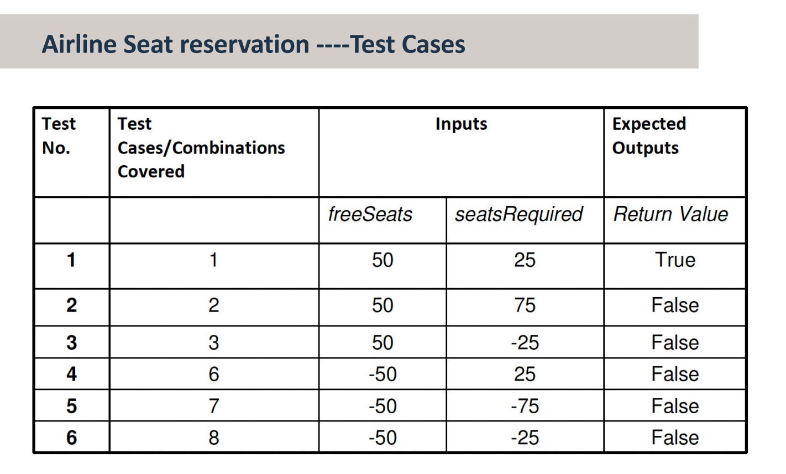

**优势和不足**

**优势**

Ø Tests all possible  **combinations of conditions**  in every decision.

Ø 测试每个决策中所有可能的条件组合。

**不足**

Ø Can be  **expensive**: n conditions in a decision give 2^n test cases.

Ø 可能很昂贵：决策中的n个条件给出2^n个测试用例。

Ø Can be  **difficult**  to determine the required input parameter values.

Ø 可能难以确定所需的输入参数值。

Ø Even though multiple condition testing covers every possible combination of conditions in a decision, it does  **not cause every possible execution path**  to be taken.

Ø 即使多个条件测试涵盖了决策中所有可能的条件组合，**也不会导致采取所有可能的执行路径**。

**🌟 期末真题：打分系统测试**

**题干**

The program Grade combines an exam and coursework mark into a single grade. The values for exam and coursework are integers.

If the exam or coursework mark is less than 50 then the grade returned is a ‘Fail’.

To pass the course with a ‘Pass, C’, the student must score between 50 and 60 in the exam, and at least 50 in the coursework.

They will pass the course with ‘Pass, B’, if they score over 60 in the exam and 50 in the coursework.

In addition to this, if the average of the exam and the coursework is at least 70, then they are awarded a ‘Pass, A’. Input values that are less than 0 or greater than 100 for either the exam or coursework are invalid and the program will return a message to say ‘Marks out of range’.

程序成绩将考试和课程成绩合并为一个成绩。考试和课程成绩的值为整数。

如果考试或课程成绩低于50分，则返回的成绩为“不及格”。

要以“通过，C”的成绩通过课程，学生必须在考试中得分在50到60之间，并且在课程作业中至少得分50分。

如果他们在考试中得分超过60分，在课程作业中得分超过50分，他们将以“通过，B”的成绩通过课程。

此外，如果考试和课程的平均值至少为70，则授予“及格，A”。考试或课程的输入值小于0或大于100无效，程序将返回一条消息，显示“分数超出范围”。

| Java  public static String grade(int exam, int course) {     String result = "null";     long average;     average = Math.round((exam + course) / 2);     if ((exam < 0) \|\| (exam > 100) \|\| (course < 0) \|\| (course > 100))          result = "Marks out of range";     else {         if ((exam < 50) \|\| (course < 50)) {             result = "Fail";         }          else if (exam < 60) {             result = "Pass, C";         }          else if (average >= 70) {             result = "Pass, A";         }          else {             result = "Pass, B";         }     }     return result;  } |
|---|

1. Please draw the program flow chart of the above code.
1. Please list all the decisions and their conditions of the above program.
1. Please use the Condition Combination coverage testing method to design the testcases for the above code.

**参考答案**

1.1  **根据代码画流程图**

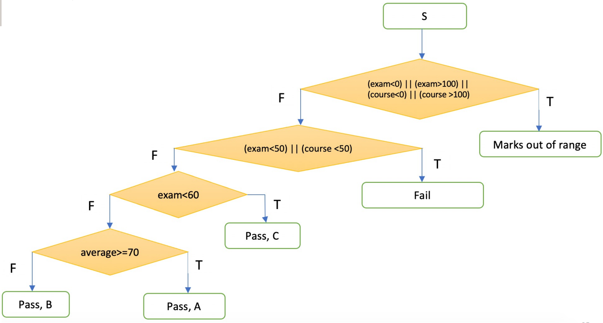

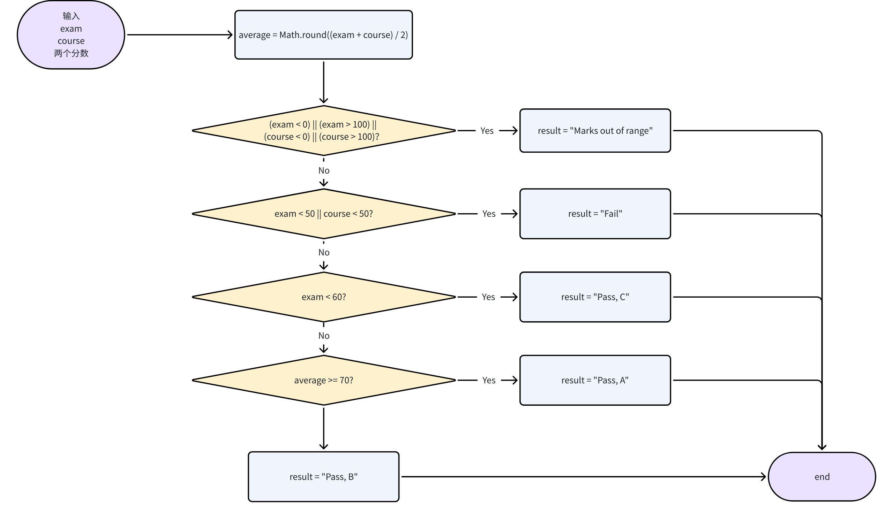

1.2  **列举 “决策” 和 “条件”**

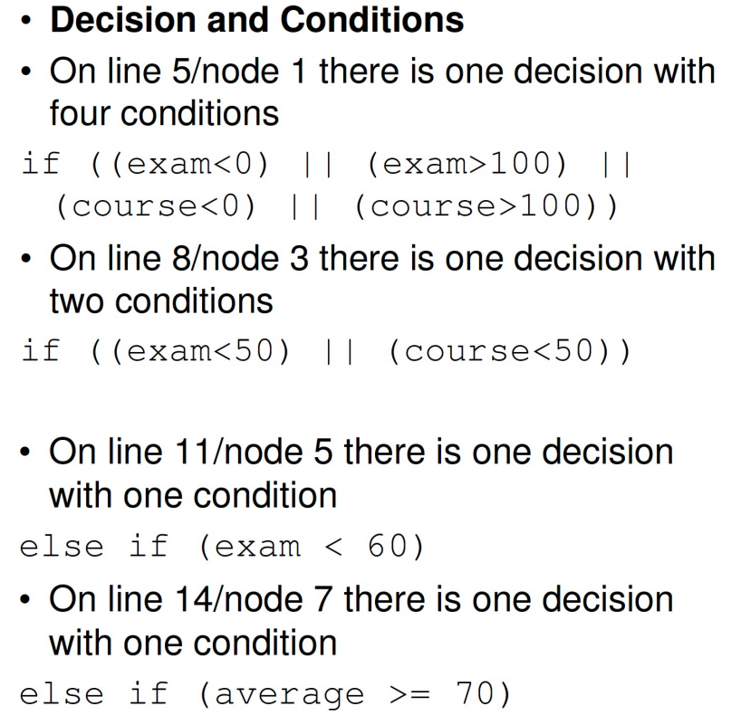

| decision 多层括号 | condition 每个条件单层括号 |
|---|---|
| ((exam < 0) \|\| (exam > 100) \|\| (course < 0) \|\| (course > 100)) | (exam < 0) 1 (exam > 100) 2 (course < 0) 3 (course > 100) 4 |
| ((exam < 50) \|\| (course < 50)) | (exam < 50) 5 (course < 50) 6 |
| ((exam < 60)) | (exam < 60) 7 |
| ((average >= 70)) | (average >= 70) 8 |

1.3  **条件组合覆盖测试（以决策为单位，每个决策下面的条件画出 2^N 行的真值表，删掉相互矛盾的行，剩下的写出对应的测试用例进行测试即可）**

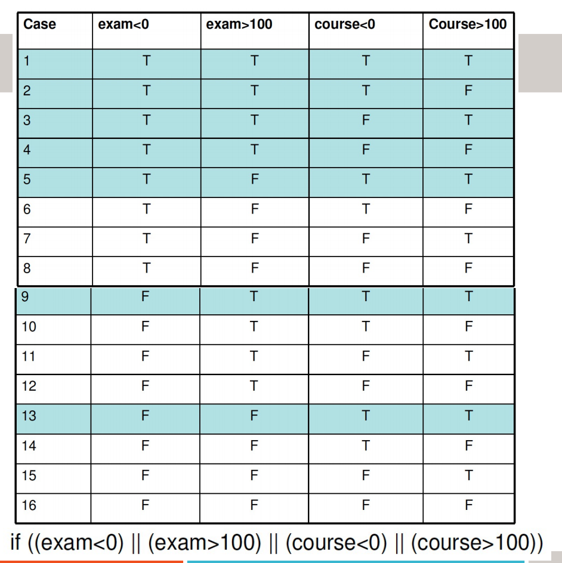

| 用例编号 | 1 | 2 | 3 | 4 |
|---|---|---|---|---|
| 1 | 1 | 1 | 1 | 1 |
| 2 | 1 | 1 | 1 |  |
| 3 | 1 | 1 |  | 1 |
| 4 | 1 | 1 |  |  |
| 5 | 1 |  | 1 | 1 |
| 6 | 1 |  | 1 |  |
| 7 | 1 |  |  | 1 |
| 8 | 1 |  |  |  |
| 9 |  | 1 | 1 | 1 |
| 10 |  | 1 | 1 |  |
| 11 |  | 1 |  | 1 |
| 12 |  | 1 |  |  |
| 13 |  |  | 1 | 1 |
| 14 |  |  | 1 |  |
| 15 |  |  |  | 1 |
| 16 |  |  |  |  |

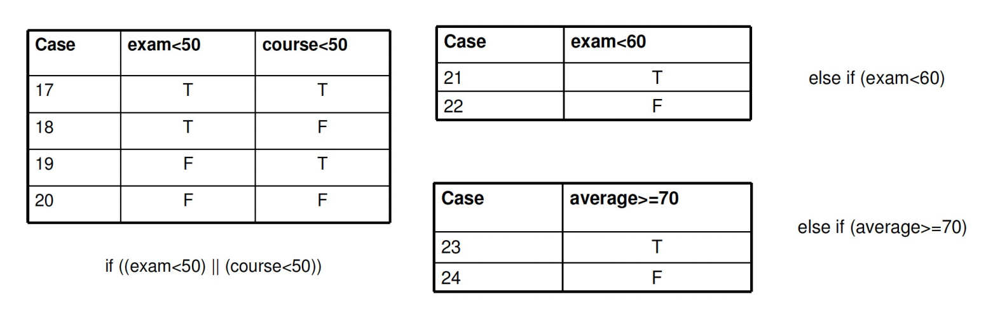

| 用例编号 | 5 | 6 |
|---|---|---|
| 17 | 1 | 1 |
| 18 | 1 |  |
| 19 |  | 1 |
| 20 |  |  |

| 用例编号 | 7 |
|---|---|
| 21 | 1 |
| 22 |  |

| 用例编号 | 8 |
|---|---|
| 23 | 1 |
| 24 |  |

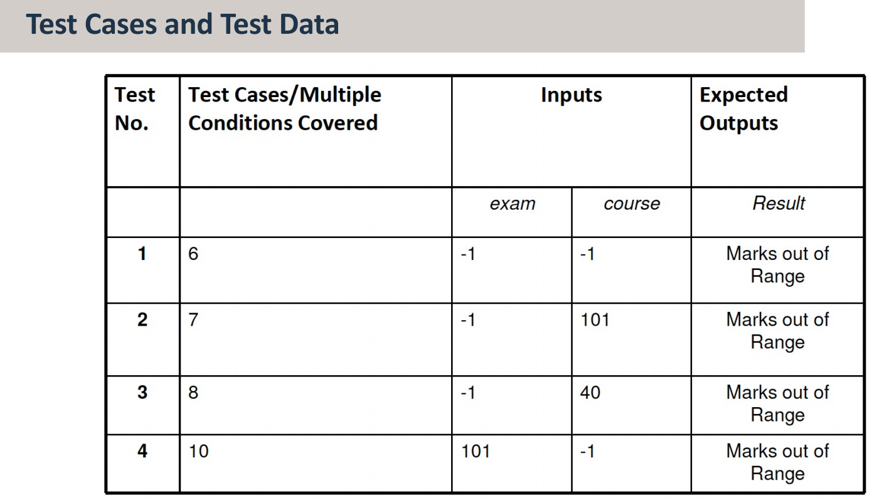

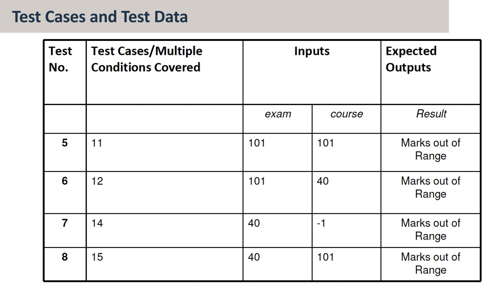

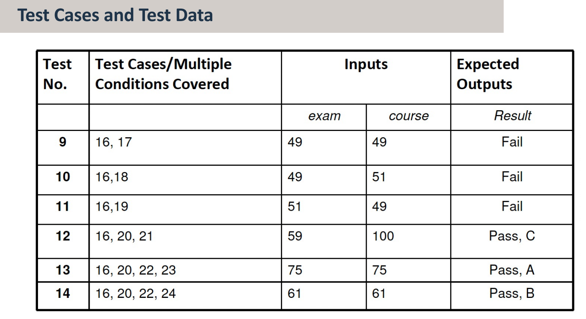

**方法论小结**

涉及到白盒测试的流程覆盖

1.  **先画流程图**

画了流程图可以解决哪两种覆盖呢？**语句覆盖（点覆盖）**、**条件覆盖（边覆盖）**

条件覆盖一定能保证语句覆盖，反之不成立。

2.  **拆解决策和条件**

**条件覆盖：**只需要让测试用例覆盖确保**条件表**所有的 True 和 False 至少出现一次

**决策条件覆盖**：让测试用例覆盖确保**决策表和条件表**所有的 True 和 False 至少出现一次

**条件组合覆盖**：以决策为单位，每个决策下面的条件画出 2^N 行的真值表，删掉相互矛盾的行，剩下的写出对应的测试用例进行测试即可

至此，白盒测试中的逻辑覆盖暂时告一段落了。

但是，白盒测试真的只需要做到这样就可以了吗？如果说这段代码量特别长，分支条件特别特别多，而且还有循环嵌套呢？怎么办？嗯？look in my eyes...

**这个时候，路径覆盖就要派上大用场了，让我们继续白盒测试 —— 路径覆盖。**

**Ch 5-2 Path Coverage（路径覆盖）**

**Control Flow Graphs （控制流图）**

**什么是控制流图？**

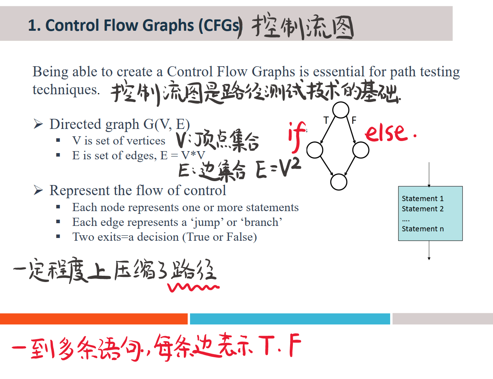

每个节点表示一个或者多个语句

每一条边表示一个'jump（跳跃）'或者'branch（分支）'

两个离开表示一个决策（对或错）

**控制流图怎么画？（建议在白纸上捋一遍，清晰）**

**顺序语句**

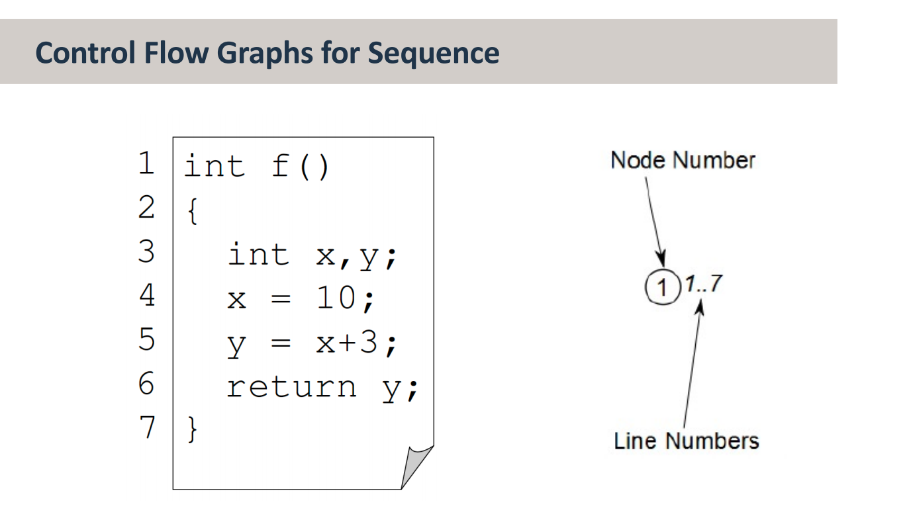

**if 语句**

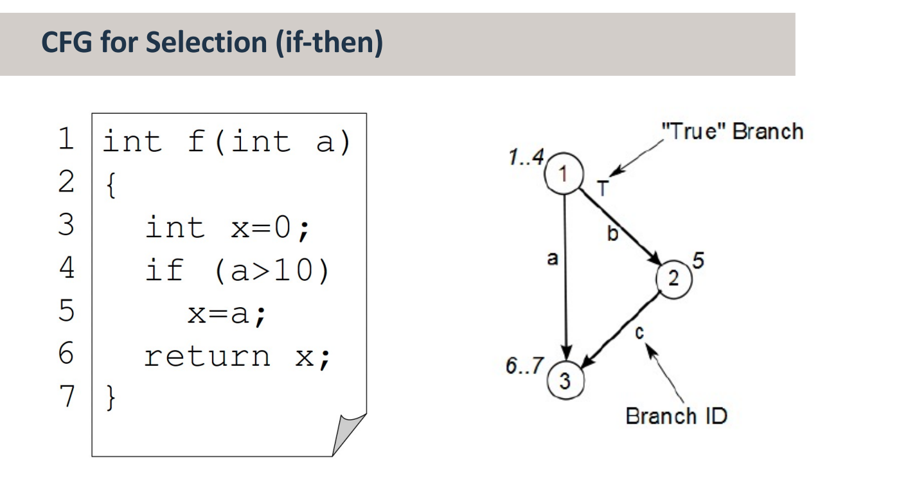

**if-else 语句**

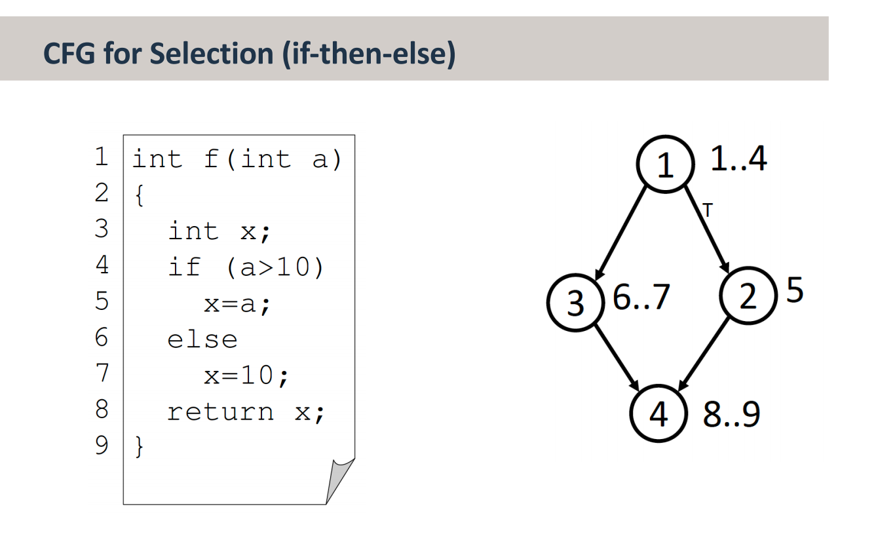

**switch-case 语句**

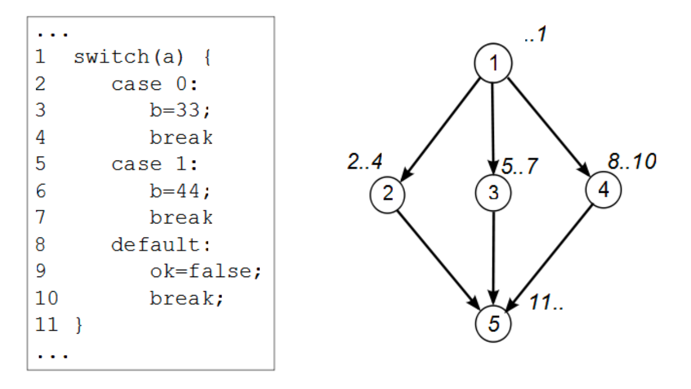

**while 语句**

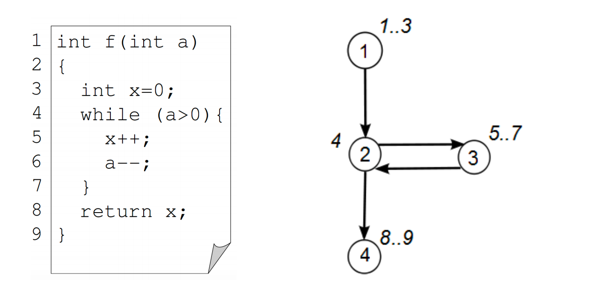

**do-while 语句**

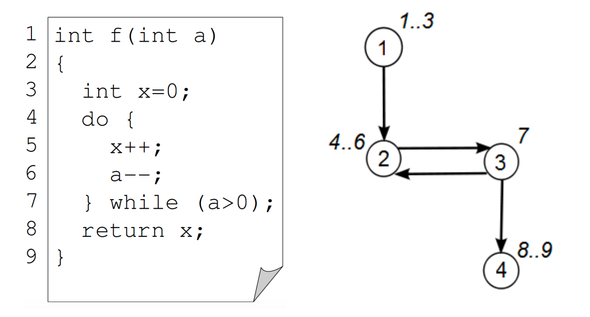

**for 语句**

细节一：第几行 for (a; b; c)

细节二：先执行 5，再执行 4c

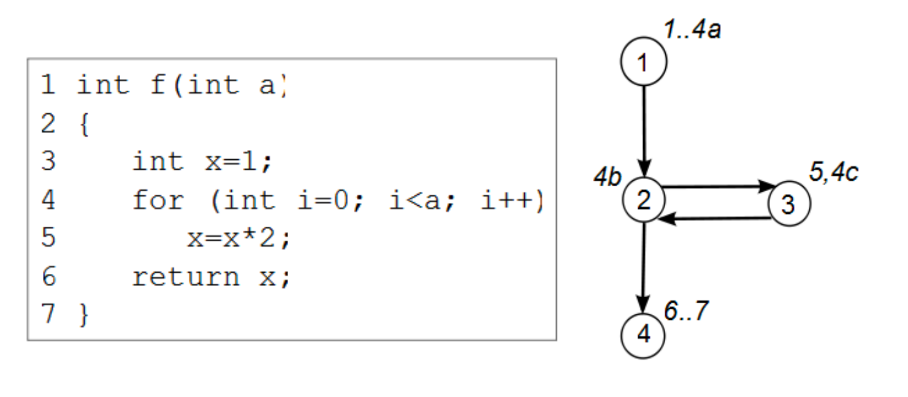

| Java  for (int i = 0; i < a; i++) ⬆️ 等价 ⬇️ int i = 0; while (i < a) {     i++;  } |
|---|

**批注**
1. 一定要注意所有导致“跳跃”的条件（决策）：

**if, while, switch/case, for**
1. 以下是控制流图的执行步骤：
- Start at the top of the code （从代码的顶部开始 ）
- Work your way down to the next jump point （向下工作到下一个跳转点 ）
- Create a new node （创建新节点 ）
- For each decision identify the destination node if (a) True and (b) False （对于每个决策，如果（a）True和（b）False，则识别目标节点 ）
- Connect the nodes （连接节点）

**期末例题 + 解析**

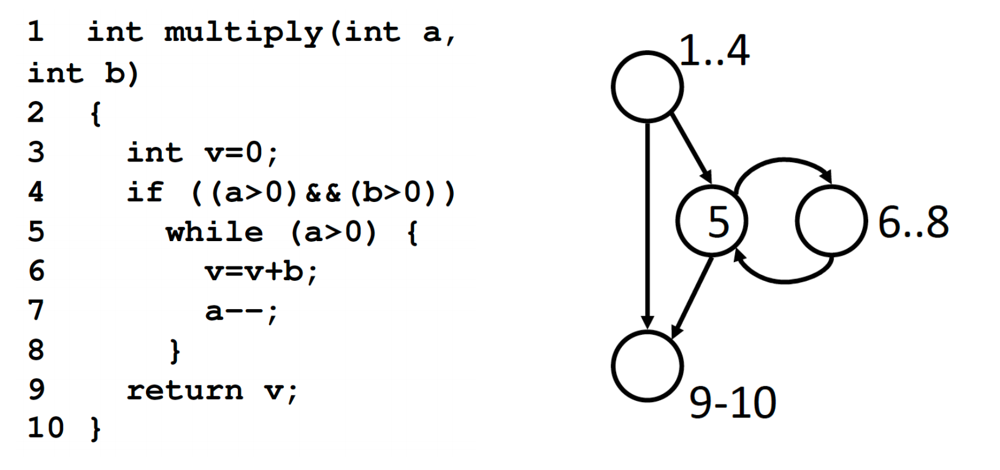

**程序流图 vs 控制流图**

一句话总结：控制流图就是简化版本的程序流图，它只描述了程序的控制流

什么是控制流？控制流是计算机执行一个程序中**语句的顺序**

请注意：控制流并没有展示对数据的特定操作以及分支或者循环的特定条件！！！

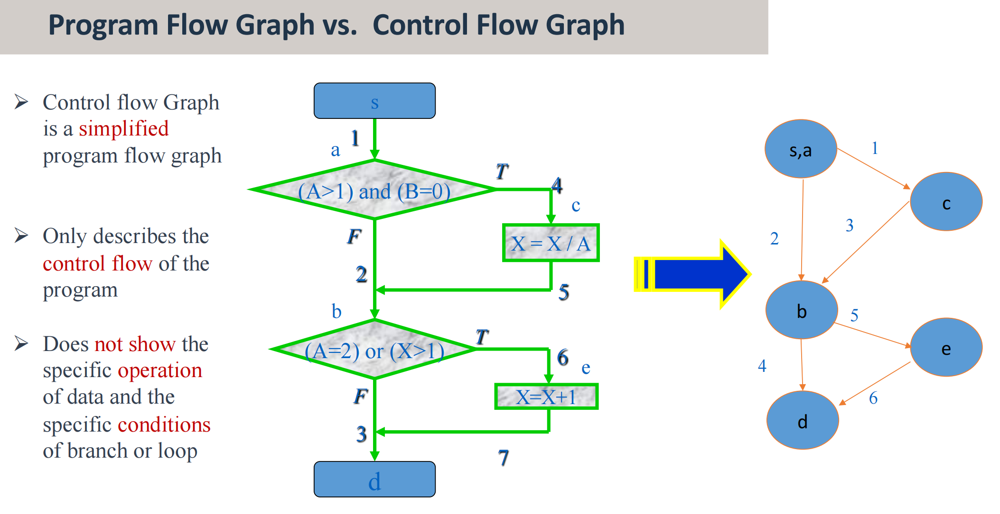

**Path Coverage 路径覆盖**

**定义**

Ø Generate test data to exercise all the distinct paths in a program. This is called “**path coverage**”

Ø 生成测试数据以练习程序中所有不同的路径。这称为“路径覆盖”

Ø Path coverage causes every possible path from entry to exit of the program to be taken during test execution.

Ø 路径覆盖导致在测试执行期间采取从程序进入到退出的所有可能路径。

Ø The goal is to achieve  **100% coverage of every start-to-finish path**  in the code.

Ø 目标是实现代码中每个从头到尾的路径100%覆盖。

Ø A path that makes i iterations through a loop is distinct from a path that makes i+1 iterations through a loop, even if the same nodes are visited in both iterations

Ø 通过循环进行i次迭代的路径与通过循环进行i+1次迭代的路径不同，即使在两次迭代中都访问了相同的节点

Thus, there can be an  **infinite number of paths**  in some programs!

因此，在某些程序中可能有无限数量的路径！

**路径等价类**

Ø Need to limit the number of paths: choose equivalence classes of paths（需要限制路径的数量，可以**选择路径的等价类**）

Ø Two paths are considered equivalent  **if they differ only in the number of loop iterations**, giving two classes of loops:

§ one with 0 iterations

§ one with n iterations (n > 0)

Ø Other equivalence paths can also be chosen if required

Ø 如果两条路径仅在循环迭代次数上不同，则认为它们是等效的，给出了两类循环：

§ 一个0次迭代

§ 一个有n次迭代（n>0）

Ø 如有需要，也可选择其他等价路径

**CFG 与 正则表达式的翻译**

**翻译规则**

The CFG of a program can be described by a  **regular expression**  that uses the following operations:

程序的CFG可以通过使用以下操作的正则表达式来描述：

**.** is the concatenation of a sequence of nodes （节点的拼接）

**+** is a decision in the graph (i.e. an if statement) （图形的决策）

***** is iteration (0 or more times, e.g. a while statement) （迭代 1+ 次）

**计算样例**

| Java  1.2.(3.(4+5).6.2)*.7  i = 0; while (i < list.length) {     if (list[i] == target)          match++;     else         mismatch++;     i++;  } |
|---|

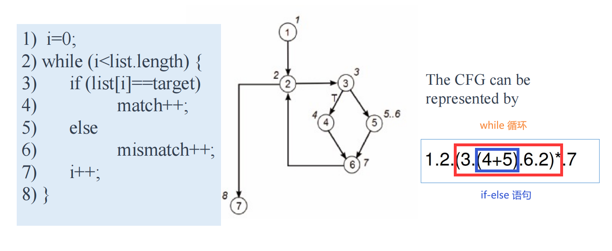

**循环化简**

(expression)* 变成 (expression  **+ 0**)

为什么要 +0 呢？

因为 0 可以表示没有循环的情况！

1.2.(3.(4  **+**  5).6.2)*.7

1.2.(3.(4  **+**  5).6.2  **+ 0**).7

从而可以得到路径为：

1.2.7

1.2.3.4.6.2.7

1.2.3.5.6.6.7

**路径数目计算**
1. 将所有节点的数字（包括 NULL）变成 1
1. 把 + 变为加法，把 . 变为乘法
1. 计算路径总数

原来的正则表达式：1.2.(3.(4  **+**  5).6.2  **+ 0**).7

计算路径总数 1·1·(1·(1 + 1)·1·1 + 1)·1 =  **3**

Note for “null else” statements where there is an if and no else the expression (node +0) is used where 0 represents the “null else” decision.

注意“null else”语句，其中有 if 和 no else 表达式（node+0），**其中0表示“null else”决定**。

**例题**

**题目要求**

① 阅读代码，画出控制流图

② 根据控制流图设计测试用例

1.  **seatsAvailable()**

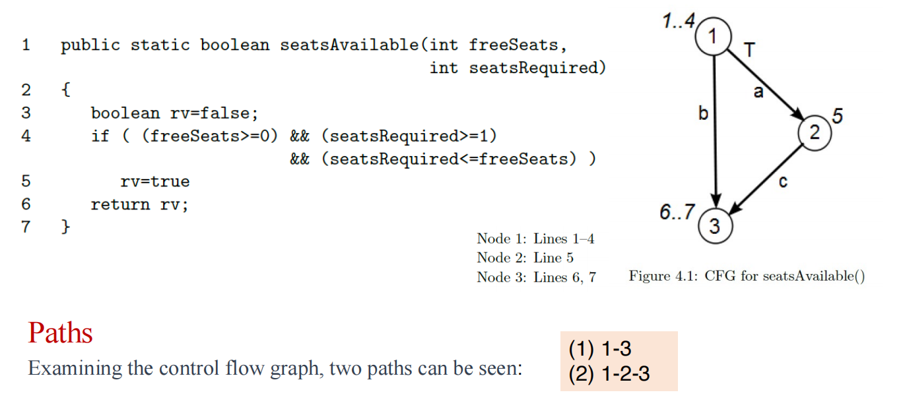

将其翻译成正则表达式：1.(2 + 0).3

从正则表达式推导出路径计算：1·（1+1）·1 = 2

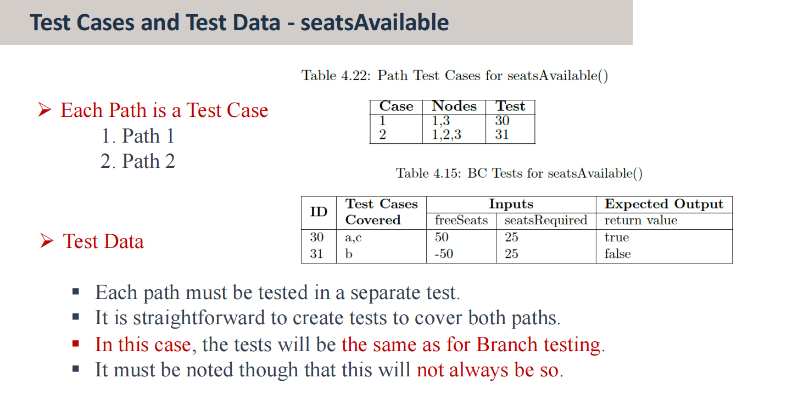

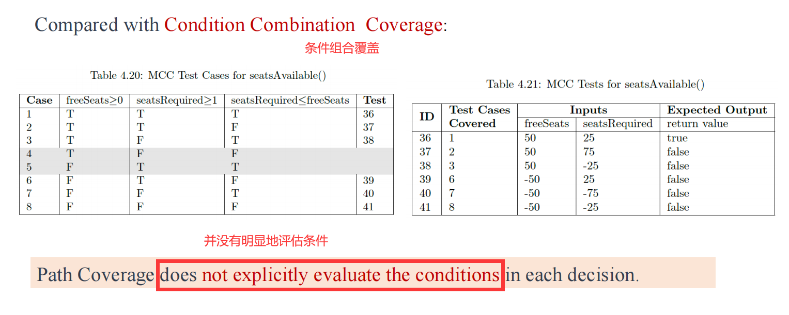

2.  **成绩统计**

| Java  public static String grade(int exam, int course) {     String result = "null";     long average;     average = Math.round((exam + course) / 2);     if ((exam < 0) \|\| (exam > 100) \|\| (course < 0) \|\| (course > 100))          result = "Marks out of range";     else {         if ((exam < 50) \|\| (course < 50)) {             result = "Fail";         }          else if (exam < 60) {             result = "Pass, C";         }          else if (average >= 70) {             result = "Pass, A";         }          else {             result = "Pass, B";         }     }     return result;  } |
|---|

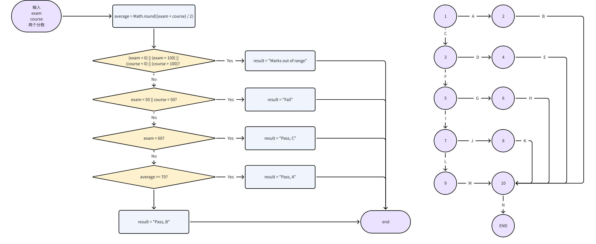

**语句（点）覆盖**

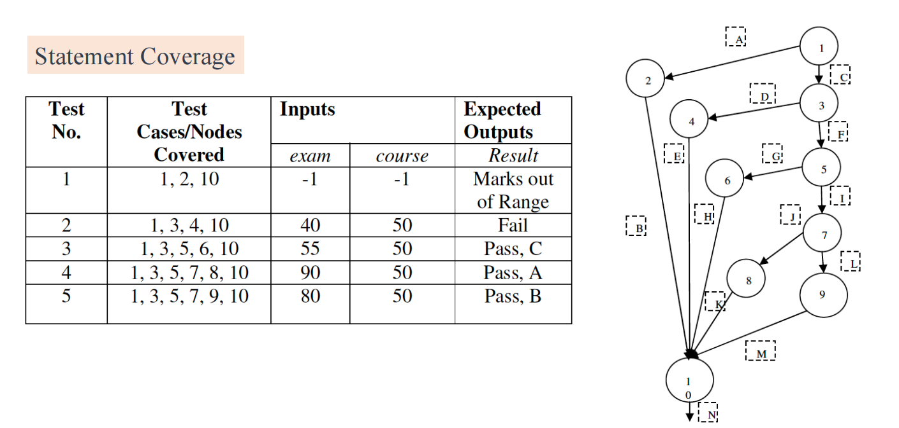

**决策（分支，边）覆盖**

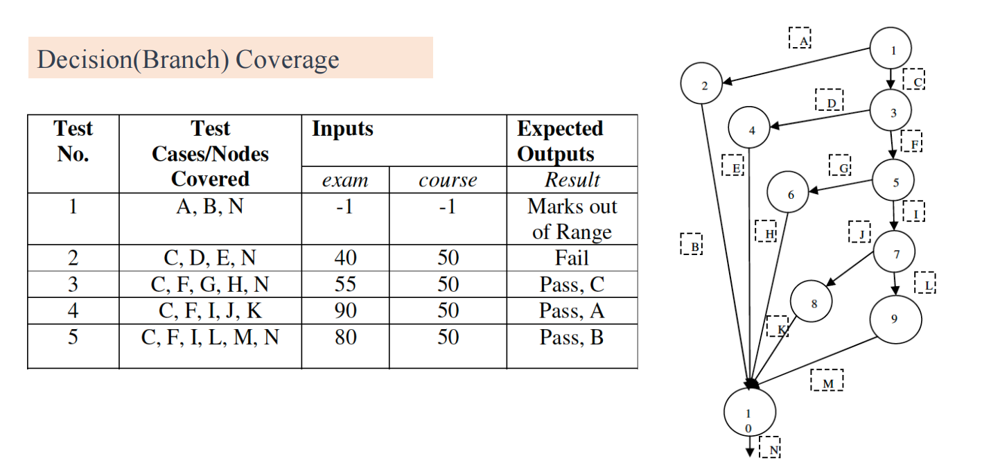

**路径覆盖**

1.(2+3.(4+5.(6+7.(8+9)))).10

路径总数

1.(1+1.(1+1.(1+1.(1+1)))).1 = 5

具体路径

1-2-10

1-3-4-10

1-3-5-6-10

1-3-5-7-8-10

1-3-5-7-9-10

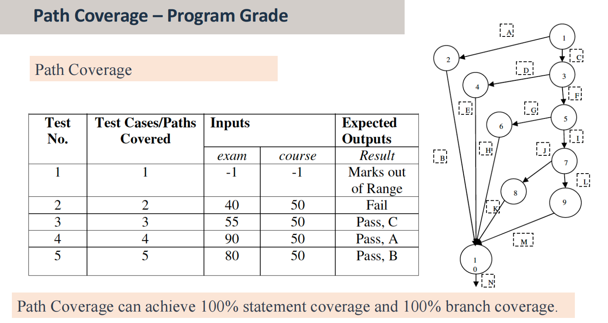

路径覆盖可以达到 100% 语句覆盖 和 100% 分支覆盖

3.  **example**

| Python  a.(0+c).b.(0+e).d  def example(A: float, B: float, X: float) -> float:     if A > 1 and B == 0:         X = X // A     if A == 2 or X > 1:         X = X + 1          return X |
|---|

**路径覆盖**

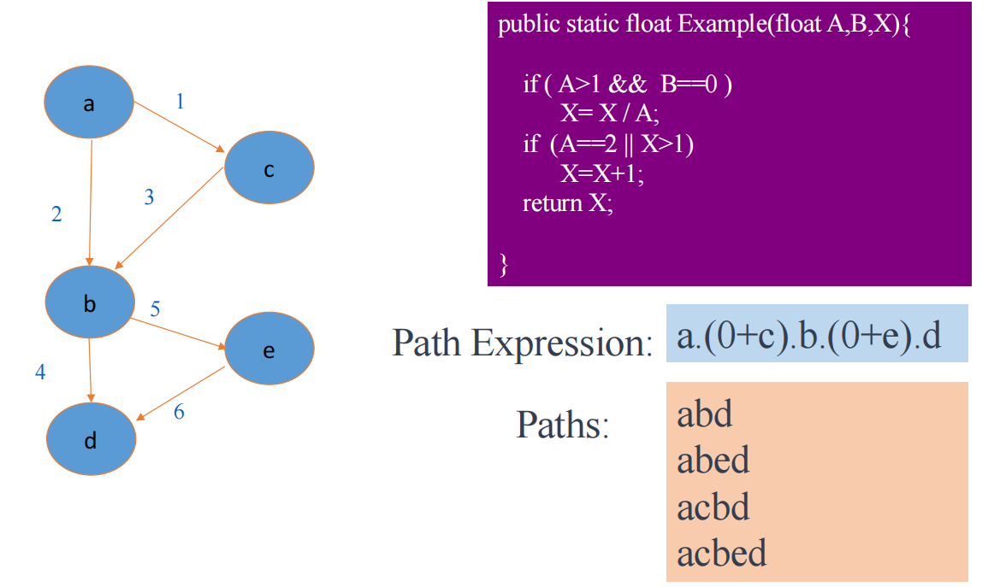

**测试用例设计**

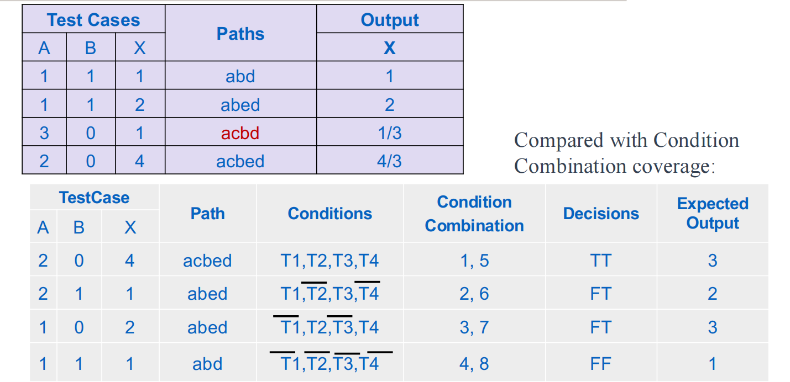

**优势和不足**

**优势**

Ø It does create  **combinations of paths**  not exercised by other methods

§ Creating and executing tests for all possible paths results in 100% statement coverage and 100% branch coverage.

Ø 它确实创建了其他方法未行使的**路径组合**

§ 为所有可能的路径创建和执行测试会导致100%的语句覆盖率和100%的分支覆盖率。

**不足**

Ø However, it can be  **computationally intensive**  if the program is complex and many paths are found.

Ø 但是，如果程序很复杂并且找到了许多路径，则可能需要**大量计算**。

Ø Also, it does  **not explicitly evaluate the conditions**  in each decision.

Ø 此外，它**没有明确评估每个决策中的条件**。

Ø If path coverage and condition combination coverage are combined, test cases with stronger fault detection ability can be designed.

Ø 如果结合路径覆盖和条件组合覆盖，可以设计故障检测能力更强的测试用例。

**Basis Path Testing 基础路径测试**

**定义**

Ø  **Basis Path Testing**  is a  White Box Testing  method in which test cases are defined based on flows or logical paths that can be taken through the program.

Ø 基础路径测试是一种白盒测试方法，其中测试用例是根据可以通过程序的流程或逻辑路径定义的。

Ø The objective of basis path testing is to  **define the number of independent paths**, so the number of test cases needed can be defined explicitly to maximize test coverage.

Ø 基础路径测试的目标是定义独立路径的数量，因此可以明确定义所需的测试用例数量，以最大限度地提高测试覆盖率。

Ø Basis path testing involves execution of all possible blocks in a program and achieves  **maximum path coverage with the least number of test cases**.

Ø 基础路径测试涉及执行程序中所有可能的块，并以最少的测试用例实现最大的路径覆盖。

**什么是独立路径？**

**An independent path**  is defined as a path from entry to exit that has at least one edge which  **has not been traversed before in any other paths**.

独立路径被定义为从入口到出口的路径，该路径至少有一条边缘在任何其他路径中以前**没有被遍历过**。

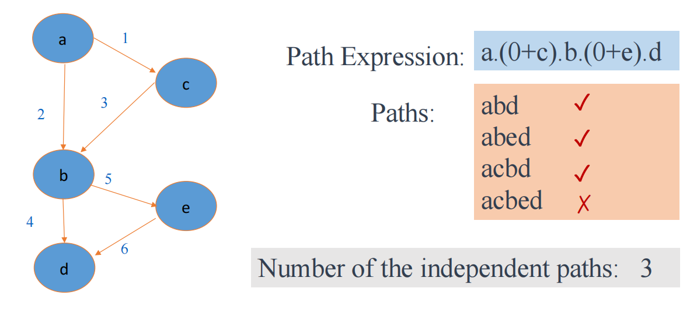

**独立路径的步骤**

（1）画**控制流图**（或者决定不同程序路线）

（2）计算**圈复杂度**（确定独立路径数量的指标）

（3）（从简单的路径开始）寻找**基本路径的集合**

（4）根据基本路径路径**生成测试用例**

**期末例题**

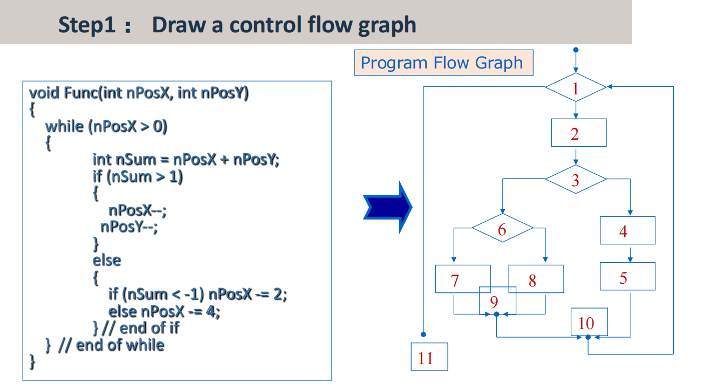

| Java  void function(int x, int y)  {     while (x > 0) {         int s = x + y;         if (s > 1)          {             x--;             y--;         }         else         {             if (s < -1) x -= 2;             else x -= 4;         }     }  } |
|---|

1.  **画控制流图**

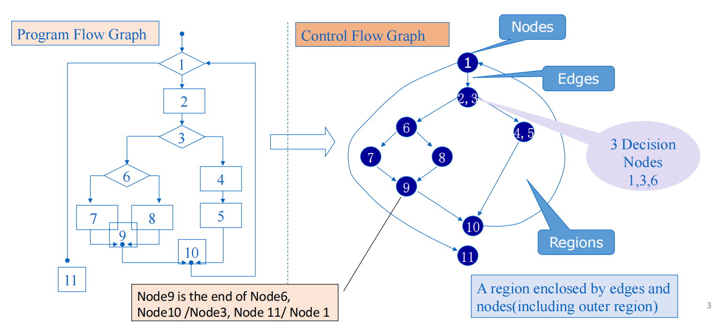

2.  **计算圈复杂度（MaCabe's Cyclomatic complexity 麦凯布圈复杂度）**

Ø Question:

How many paths should be found to cover the basis path set?

Ø 问题：

应该找到多少路径来覆盖基本路径集？

Ø Cyclomatic Complexity provides a basis for determining the  **upper bound of the basis path set**.

Ø Cyclomatic Complexity is the maximum number of independent paths

§ Note: The basis path set is not unique.

Ø 圈复杂度为确定基路径集的**上界提供了基础**。

Ø 圈复杂度是最大独立路径数

§ 注意：基本路径集不是唯一的。

Basis Path Testing checks each linearly independent path through the program, which means  **number of test cases, will be equivalent to the cyclomatic complexity of the program.**

基础路径测试检查通过程序的每个线性独立路径，这意味着**测试用例的数量将等同于程序的圈复杂度**。

**三种方法计算圈复杂度**

V(G) = E - N + 2 （边数 - 节点数 + 2）

V(G) = P + 1 （决策节点 + 1）

V(G) = R （区域数目）

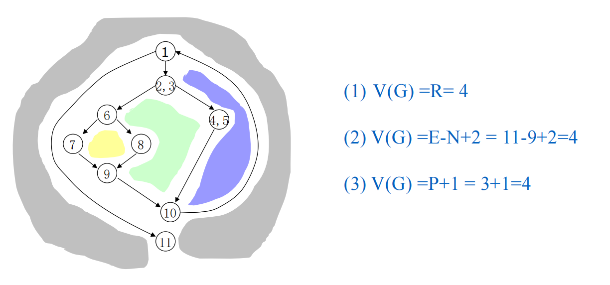

3.  **寻找基本路径集**

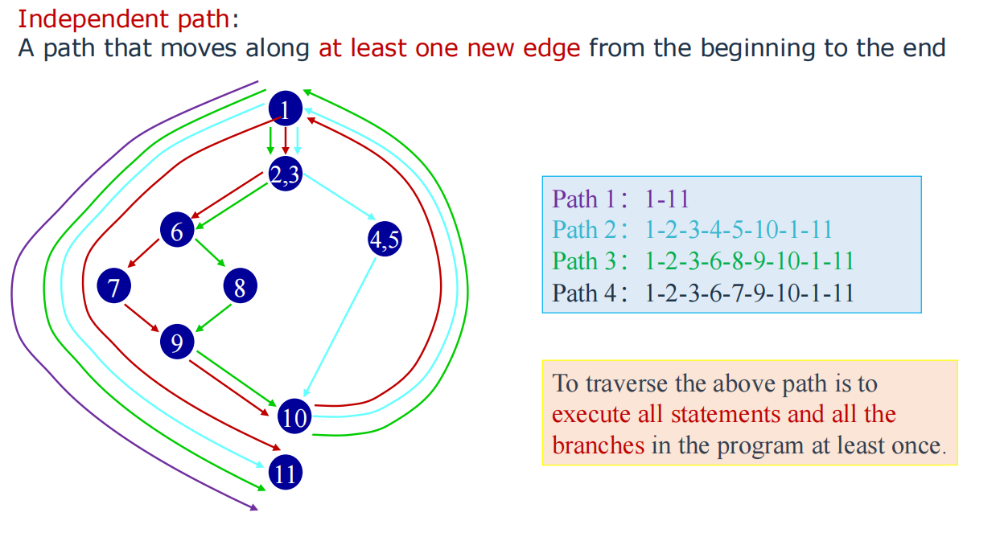

4.  **设计测试用例**

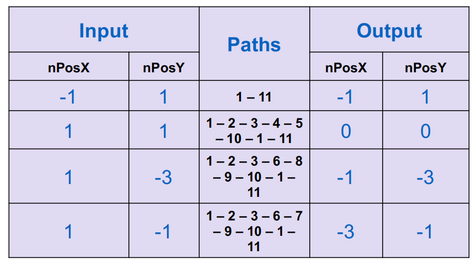

**Compound condition decomposition 复合条件分解**

Ø If the compound condition is included, the compound condition should be decomposed into several simple conditions.

Ø  如果包含复合条件，则应将复合条件分解为几个简单条件。

Ø Each simple condition corresponds to a node in the flow diagram.

Ø 每个简单条件对应流程图中的一个节点。

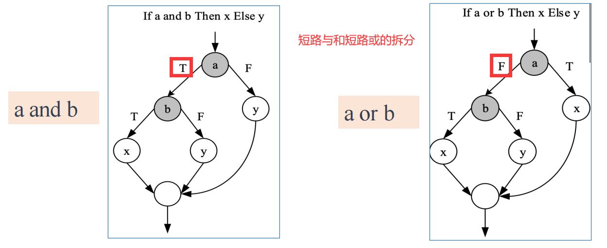

**决定覆盖 = 条件覆盖**

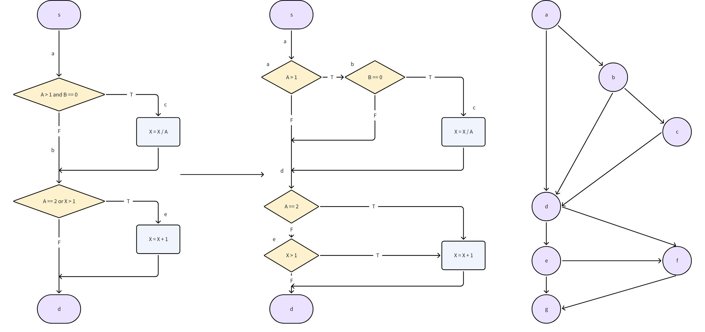

路径表达式：a.(b.(c+0)+0).d.(e.(f+0)+f).g

路径数目：9

独立路径的数目：E - V + 2 = 10 - 7 + 2 = 5

独立路径：

adeg

abdeg

abcdeg

adfg

adefg

**拓展：实验课 BigInteger 函数测试**
1. 语句覆盖/点覆盖（只要做到源代码的每一行都被执行到）
1. 判定覆盖/边覆盖（做到每一个源代码的分支都被执行到）
1. 条件覆盖（每一个条件的 True 或 False 都至少被执行一次）
1. 决策/条件覆盖（条件覆盖 + 判定覆盖）
1. 条件组合覆盖（最强，开销最大，对于每一个将要被测试的 decision，需要考虑到每一个场景）
1. 路径覆盖

必修：完成判定覆盖、条件组合覆盖、基本路径覆盖

三选一：语句覆盖、决策/条件覆盖、路径覆盖

待测试的四个方法（BigInteger 类的四种计算）

| java  public BigInteger add(BigInteger val) {     if (val.signum == 0)         return this;     if (signum == 0)         return val;     if (val.signum == signum)                  return new BigInteger(*add*(mag, val.mag), signum);      int cmp = compareMagnitude(val);     if (cmp == 0)                  return  *ZERO*;          int[] resultMag = (cmp > 0 ?  *subtract*(mag, val.mag)                                                :  *subtract*(val.mag, mag));          resultMag =  *trustedStripLeadingZeroInts*(resultMag);      return new BigInteger(resultMag, cmp == signum ? 1 : -1);  } |
|---|

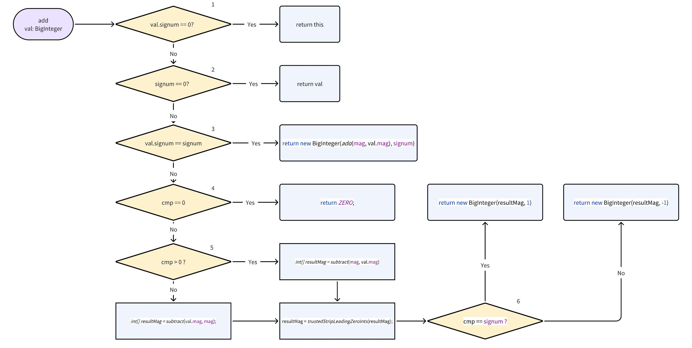

| java  private BigInteger multiply(BigInteger val, boolean isRecursion) {     if (val.signum == 0 \|\| signum == 0)                  return  *ZERO*;      int xlen = mag.length;            if (val == this && xlen >  *MULTIPLY_SQUARE_THRESHOLD*) {         return square();     }      int ylen = val.mag.length;            if ((xlen <  *KARATSUBA_THRESHOLD*) \|\| (ylen <  *KARATSUBA_THRESHOLD*)) {         int resultSign = signum == val.signum ? 1 : -1;         if (val.mag.length == 1) {                          return  *multiplyByInt*(mag,val.mag[0], resultSign);         }         if (mag.length == 1) {                          return  *multiplyByInt*(val.mag,mag[0], resultSign);         }                  int[] result =  *multiplyToLen*(mag, xlen,                                      val.mag, ylen, null);                  result =  *trustedStripLeadingZeroInts*(result);         return new BigInteger(result, resultSign);     } else {                  if ((xlen <  *TOOM_COOK_THRESHOLD*) && (ylen <  *TOOM_COOK_THRESHOLD*)) {                          return  *multiplyKaratsuba*(this, val);         } else {              *//*             *// In "Hacker's Delight" section 2-13, p.33, it is explained*             *// that if x and y are unsigned 32-bit quantities and m and n*             *// are their respective numbers of leading zeros within 32 bits,*             *// then the number of leading zeros within their product as a*             *// 64-bit unsigned quantity is either m + n or m + n + 1. If*             *// their product is not to overflow, it cannot exceed 32 bits,*             *// and so the number of leading zeros of the product within 64*             *// bits must be at least 32, i.e., the leftmost set bit is at*             *// zero-relative position 31 or less.*             *//*             *// From the above there are three cases:*             *//*             *//     m + n    leftmost set bit    condition*             *//     -----    ----------------    ---------*             *//     >= 32    x <= 64 - 32 = 32   no overflow*             *//     == 31    x >= 64 - 32 = 32   possible overflow*             *//     <= 30    x >= 64 - 31 = 33   definite overflow*             *//*             *// The "possible overflow" condition cannot be detected by*             *// examning data lengths alone and requires further calculation.*             *//*             *// By analogy, if 'this' and 'val' have m and n as their*             *// respective numbers of leading zeros within 32*MAX_MAG_LENGTH*             *// bits, then:*             *//*             *//     m + n >= 32*MAX_MAG_LENGTH        no overflow*             *//     m + n == 32*MAX_MAG_LENGTH - 1    possible overflow*             *//     m + n <= 32*MAX_MAG_LENGTH - 2    definite overflow*             *//*             *// Note however that if the number of ints in the result*             *// were to be MAX_MAG_LENGTH and mag[0] < 0, then there would*             *// be overflow. As a result the leftmost bit (of mag[0]) cannot*             *// be used and the constraints must be adjusted by one bit to:*             *//*             *//     m + n >  32*MAX_MAG_LENGTH        no overflow*             *//     m + n == 32*MAX_MAG_LENGTH        possible overflow*             *//     m + n <  32*MAX_MAG_LENGTH        definite overflow*             *//*             *// The foregoing leading zero-based discussion is for clarity*             *// only. The actual calculations use the estimated bit length*             *// of the product as this is more natural to the internal*             *// array representation of the magnitude which has no leading*             *// zero elements.*             *//*             if (!isRecursion) {                  *// The bitLength() instance method is not used here as we*                 *// are only considering the magnitudes as non-negative. The*                 *// Toom-Cook multiplication algorithm determines the sign*                 *// at its end from the two signum values.*                 if (*bitLength*(mag, mag.length) +                      *bitLength*(val.mag, val.mag.length) >                                          32L**MAX_MAG_LENGTH*) {                      *reportOverflow*();                 }             }                            return  *multiplyToomCook3*(this, val);         }     }  } |
|---|

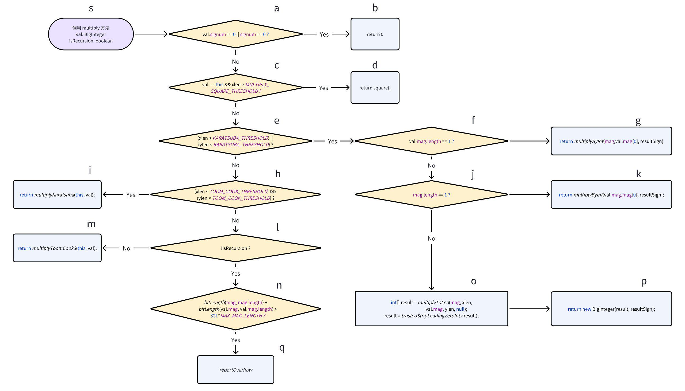

| java  public BigInteger pow(int exponent) {     if (exponent < 0) {         throw new ArithmeticException("Negative exponent");     }     if (signum == 0) {                  return (exponent == 0 ?  *ONE* : this);     }      BigInteger partToSquare = this.abs();        *// Factor out powers of two from the base, as the exponentiation of*     *// these can be done by left shifts only.*     *// The remaining part can then be exponentiated faster.  The*     *// powers of two will be multiplied back at the end.*     int powersOfTwo = partToSquare.getLowestSetBit();     long bitsToShiftLong = (long)powersOfTwo * exponent;          if (bitsToShiftLong > Integer.*MAX_VALUE*) {          *reportOverflow*();     }     int bitsToShift = (int)bitsToShiftLong;      int remainingBits;        *// Factor the powers of two out quickly by shifting right, if needed.*     if (powersOfTwo > 0) {         partToSquare = partToSquare.shiftRight(powersOfTwo);         remainingBits = partToSquare.bitLength();                  if (remainingBits == 1) {    *// Nothing left but +/- 1?*             if (signum < 0 && (exponent&1) == 1) {                                  return  *NEGATIVE_ONE*.shiftLeft(bitsToShift);             } else {                                  return  *ONE*.shiftLeft(bitsToShift);             }         }     } else {         remainingBits = partToSquare.bitLength();                  if (remainingBits == 1) {  *// Nothing left but +/- 1?*             if (signum < 0  && (exponent&1) == 1) {                                  return  *NEGATIVE_ONE*;             } else {                                  return  *ONE*;             }         }     }        *// This is a quick way to approximate the size of the result,*     *// similar to doing log2[n] * exponent.  This will give an upper bound*     *// of how big the result can be, and which algorithm to use.*     long scaleFactor = (long)remainingBits * exponent;        *// Use slightly different algorithms for small and large operands.*     *// See if the result will safely fit into a long. (Largest 2^63-1)*     if (partToSquare.mag.length == 1 && scaleFactor <= 62) {          *// Small number algorithm.  Everything fits into a long.*         int newSign = (signum <0  && (exponent&1) == 1 ? -1 : 1);         long result = 1;                  long baseToPow2 = partToSquare.mag[0] &  *LONG_MASK*;          int workingExponent = exponent;            *// Perform exponentiation using repeated squaring trick*         while (workingExponent != 0) {             if ((workingExponent & 1) == 1) {                 result = result * baseToPow2;             }              if ((workingExponent >>>= 1) != 0) {                 baseToPow2 = baseToPow2 * baseToPow2;             }         }            *// Multiply back the powers of two (quickly, by shifting left)*         if (powersOfTwo > 0) {                          if (bitsToShift + scaleFactor <= 62) {  *// Fits in long?*                 return  *valueOf*((result << bitsToShift) * newSign);             } else {                                  return  *valueOf*(result*newSign).shiftLeft(bitsToShift);             }         } else {                          return  *valueOf*(result*newSign);         }     } else {                  if ((long)bitLength() * exponent / Integer.*SIZE* >  *MAX_MAG_LENGTH*) {              *reportOverflow*();         }            *// Large number algorithm.  This is basically identical to*         *// the algorithm above, but calls multiply() and square()*         *// which may use more efficient algorithms for large numbers.*         BigInteger answer =  *ONE*;          int workingExponent = exponent;          *// Perform exponentiation using repeated squaring trick*         while (workingExponent != 0) {             if ((workingExponent & 1) == 1) {                 answer = answer.multiply(partToSquare);             }              if ((workingExponent >>>= 1) != 0) {                 partToSquare = partToSquare.square();             }         }          *// Multiply back the (exponentiated) powers of two (quickly,*         *// by shifting left)*         if (powersOfTwo > 0) {             answer = answer.shiftLeft(bitsToShift);         }          if (signum < 0 && (exponent&1) == 1) {             return answer.negate();         } else {             return answer;         }     }  } |
|---|

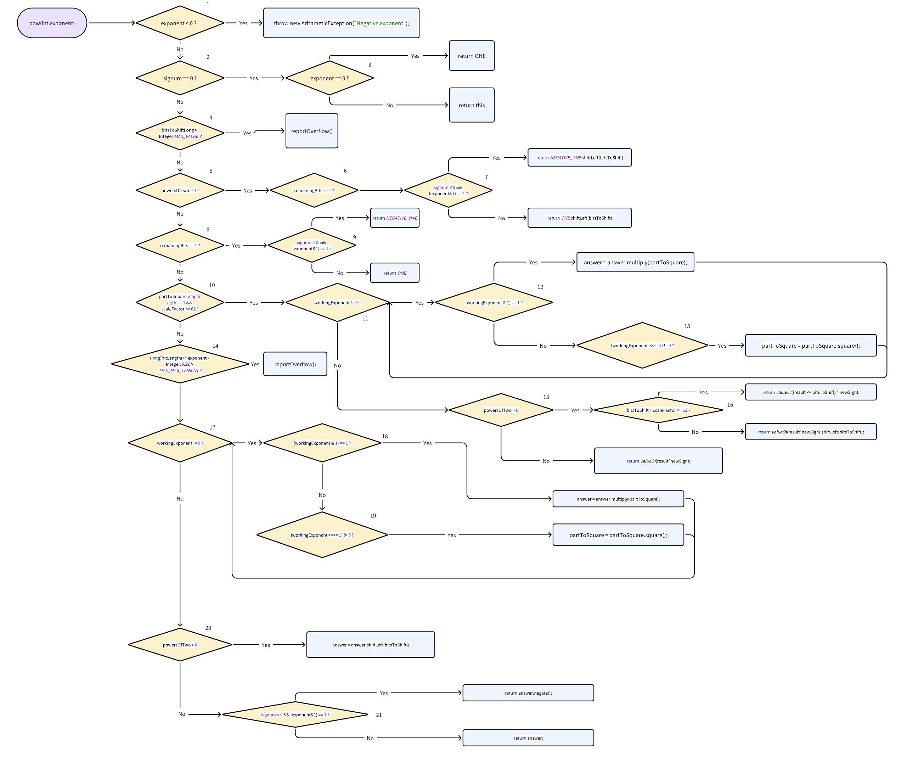

| java  private BigInteger square(boolean isRecursion) {     if (signum == 0) {                  return  *ZERO*;     }     int len = mag.length;            if (len <  *KARATSUBA_SQUARE_THRESHOLD*) {                  int[] z =  *squareToLen*(mag, len, null);                  return new BigInteger(*trustedStripLeadingZeroInts*(z), 1);     } else {                  if (len <  *TOOM_COOK_SQUARE_THRESHOLD*) {             return squareKaratsuba();         } else {              *//*             *// For a discussion of overflow detection see multiply()*             *//*             if (!isRecursion) {                                  if (*bitLength*(mag, mag.length) > 16L**MAX_MAG_LENGTH*) {                      *reportOverflow*();                 }             }              return squareToomCook3();         }     }  } |
|---|

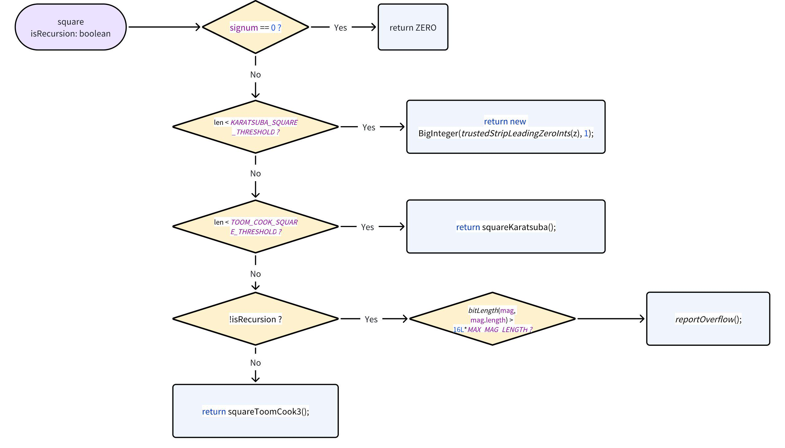

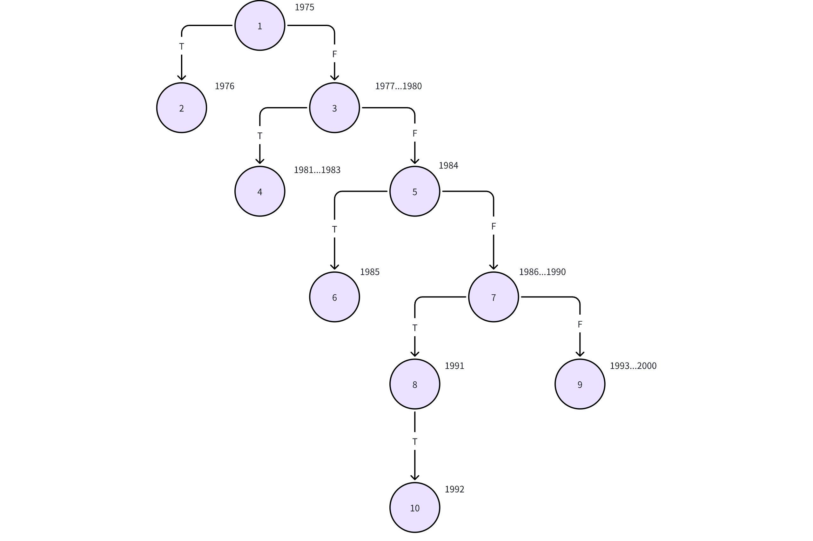
