# ST 讲义（二）🌟 黑盒测试 ✅

**ST 讲义（二）🌟 黑盒测试 ✅**

初稿已完成更新，期末考试黑盒测试必考一题，重点是黑盒测试的分类 + 推导

**序、黑盒测试概念**

**什么是黑盒测试？**

**Black Box testing**  is based entirely on the program specification and aims to verify that the program meets the specified requirements. /  **黑盒测试**完全基于程序规范，旨在验证程序是否满足指定要求。

Black-Box testing provides for  **coverage of the specification**, but not full coverage of the implementation. That is, there may be code in the implementation that produces results not stated in the specification.

黑盒测试提供了规范的覆盖，但没有实现的完全覆盖。也就是说，实现中可能存在产生规范中未说明结果的代码。

**黑盒测试的原则（principle）**

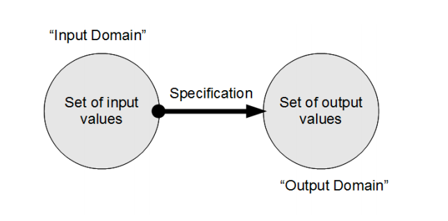
1. Test  **against**  the specification（**对照**规范进行测试）
1. Use test coverage criteria based on the specification（基于需求使用测试覆盖准则）
1. Develop test cases derived from the specification （开发根据规范导出的测试用例）
1. "Exercise" the specification （“行使”规范）

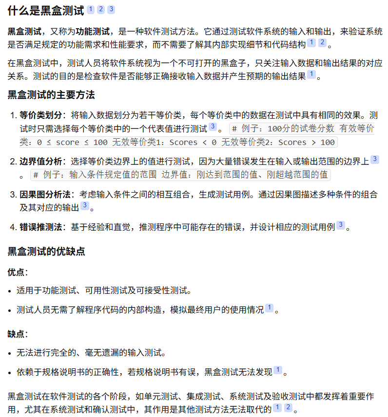

**Equivalence Partitioning 等价类划分**

**什么是等价类划分？**

An Equivalence Partition (EP) is  **a range of values**  for a parameter for which the specification states equivalent processing.

定义：等价划分 （EP） 是规范中规定的等效处理的**参数的值范围**。

例子：

| Java  判定是否为负  /* 可以划分为两个等价类，分别是 [Integer.MIN_VALUE, -1] [0, Integer.MAX_VALUE] */ boolean isNegative(int x) {     return x < 0;  } |
|---|

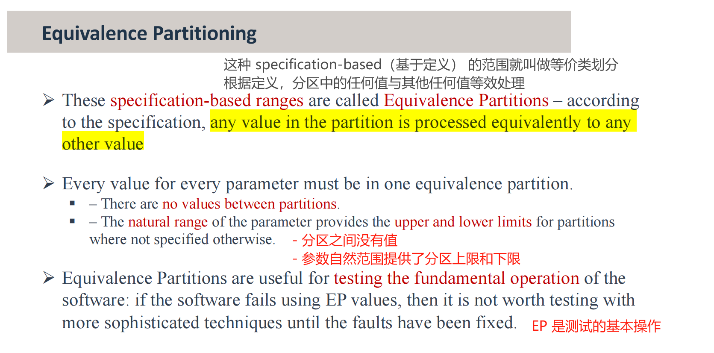

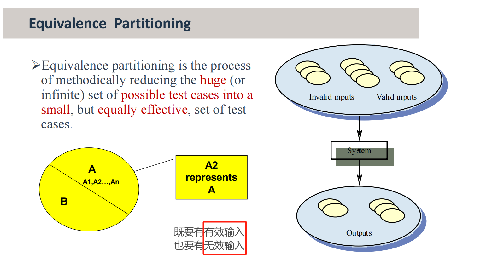

**什么是等价类？**

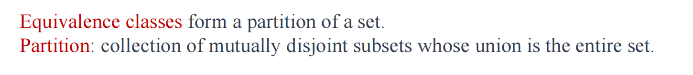

等价类形成集合的分区。

Partition：相互不相交的子集的集合，其 Union 是整个集合。

**等价类的分类**

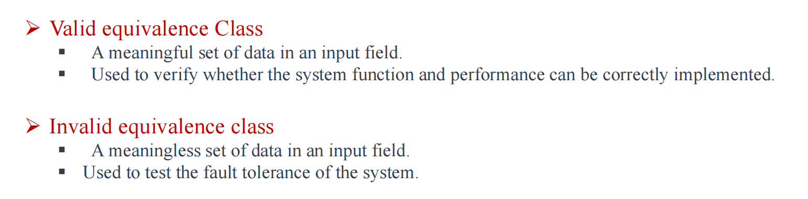

**Valid Equivalence Class（有效等价类）**
- 输入域中有意义的一组数据
- 用于验证系统功能和性能是否能被**准确地实施**

**Invalid Equivalence Class（无效等价类）**
- 输入域中无意义的一组数据
- 用于测试系统的**容错性**

**识别测试用例的步骤**

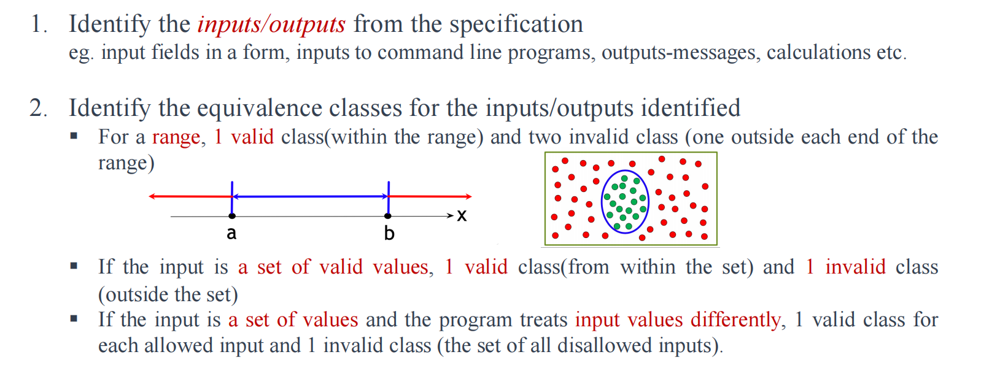

1.  **根据定义/业务需求识别** **输入/输出**

例：表格/命令行输入/输出信息/计算等

2.  **根据被定义的** **输入/输出** **识别等价类**
- 范围识别

| Java  /* 可以划分为三等价类，其中，一个有效等价类，两个无效等价类 有效等价类 [0, 100] 无效等价类 [Integer.MIN_VALUE, 0) (100, Integer.MAX_VALUE] */ boolean isValidScore(int x) {     return x >= 0 and x <= 100;  } |
|---|

- 集合识别（有效集合、无效集合）

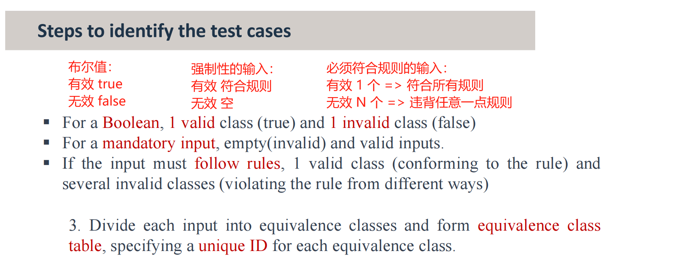

**布尔类型划分等价类**

一个有效等价类（true）

一个无效等价类（false）

**强制输入划分等价类**

一个有效等价类（valid）

至少一个无效等价类（null）

**符合规则划分等价类**

一个有效等价类（符合所有规则）

多个无效等价类（违背任意一个规则）

3.  **将每一个输入划分为等价类，并且形成一张等价类表，为每一个等价类形成一个独特的 ID**

例 1：百分制评分

<table>
<tr><td>参数</td><td>有效等价类</td><td>无效等价类</td></tr>
<tr><td>Score</td><td>0 <= X <= 100 (1)</td><td>X < 0 (2)</td></tr>
<tr><td></td><td></td><td>X > 100 (3)</td></tr>
</table>

例 2：考研 408 的四大件是谁？

<table>
<tr><td>参数</td><td>有效等价类</td><td>无效等价类</td></tr>
<tr><td>Course</td><td>计算机组成原理（1）</td><td>其他课程（5）</td></tr>
<tr><td></td><td>数据结构（2）</td><td></td></tr>
<tr><td></td><td>操作系统（3）</td><td></td></tr>
<tr><td></td><td>计算机网络（4）</td><td></td></tr>
</table>

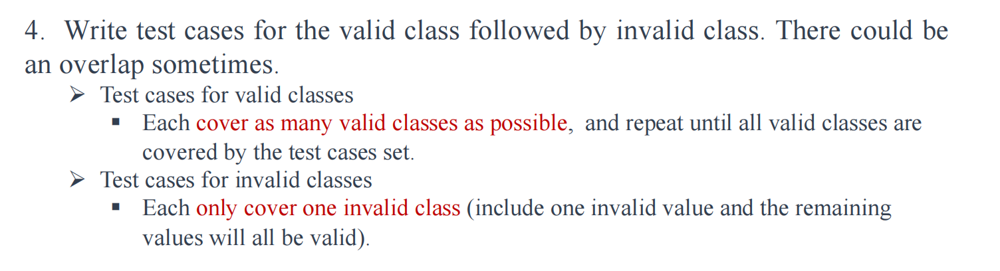

4.  **为有效等价类和无效等价类书写测试用例（备注：有时候会出现 overlap 重叠的现象）**
- 针对有效等价类设计测试用例
- **每个测试用例**都**涵盖尽可能多的有效类**，然后**重复**，直到测试用例集**覆盖所有有效类**。
- 针对无效等价类设计测试用例
- **每个测试用例**仅涵盖**一个无效类**（包括一个无效值，其余值都将有效）

**等价类测试**

等价类测试：从每一个等价类中使用一个元素

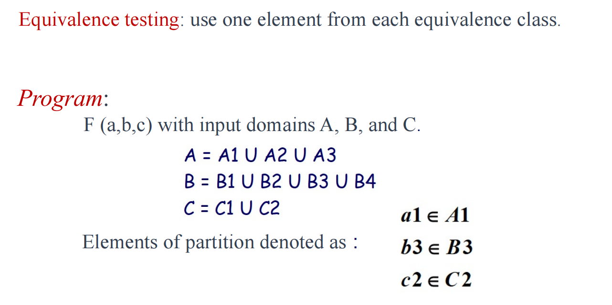

弱等价类：只需要 4 个用例即可全覆盖（毕竟是 or 嘛；A, B, C 选最长的那一个即可咯）

#test cases = #classes in the partition with  the largest numbering of subsets

#测试用例 = #classes 个子集编号最大的分区

| Test Case | A | B | C |
|---|---|---|---|
| 1 | a1 | b1 | c1 |
| 2 | a2 | b2 | c2 |
| 3 | a3 | b3 | c1 |
| 4 | a1 | b4 | c2 |

强等价类：需要 3 * 4 * 2 = 24 个用例（笛卡尔积）

**例题**

1.  **External Dial PhoneNumber , “9 - eight digits”**

<table>
<tr><td>参数</td><td>有效等价类</td><td>无效等价类</td></tr>
<tr><td>Phone Number</td><td>"9" digit string beginning with "9" （1）</td><td>Not beginning with "9" （2）</td></tr>
<tr><td></td><td></td><td>Not digits string （3）</td></tr>
<tr><td></td><td></td><td>Not 9 （4）</td></tr>
</table>

根据等价类表进一步设计测试用例

| 测试用例 ID | 电话号码 | 期待输出 | 实际输出 | 等价类覆盖 |
|---|---|---|---|---|
| 1 | 912345678 | OK |  | （1） |
| 2 | 874563210 | ERROR |  | （2） |
| 3 | 9qwerasdf | ERROR |  | （3） |
| 4 | 98765 | ERROR |  | （4） |

2.  **WindowsXP 文件名称判定机制：不包含特殊字符且长度在 256 字符以内**

<table>
<tr><td>参数</td><td>有效等价类</td><td>无效等价类</td></tr>
<tr><td>File Name</td><td>不包含特殊字符且长度合法 （1）</td><td>包含特殊字符 （2）</td></tr>
<tr><td></td><td></td><td>长度为 0 （3）</td></tr>
<tr><td></td><td></td><td>长度超过 256 字符 （4）</td></tr>
</table>

根据等价类表进一步设计测试用例

| 测试用例 ID | 文件名称 | 期待输出 | 实际输出 | 等价类覆盖 |
|---|---|---|---|---|
| 1 |  | OK |  | （1） |
| 2 |  | ERROR |  | （2） |
| 3 |  | ERROR |  | （3） |
| 4 |  | ERROR |  | （4） |

3.  **🌟 经典真题：已知三条边 A B C，判定三角形的类型**

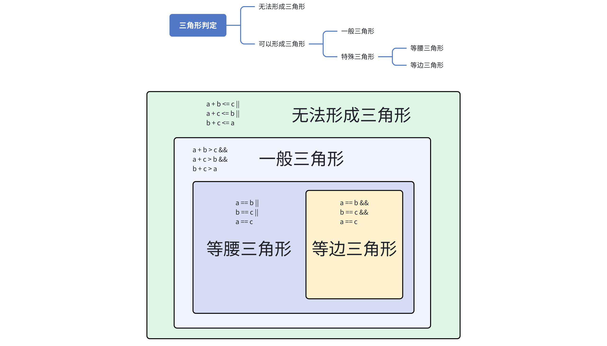

| 输入条件 | 有效等价类 | 无效等价类 |
|---|---|---|
| 是否为**一般**三角形 | A > 0 B > 0 C > 0 A + B > C A + C > B B + C > A (1) | A <= 0 (2) B <= 0 (3) C <= 0 (4) A + B <= C (5) B + C <= A (6) A + C <= B (7) |
| 是否为**等腰**三角形 | A == B (8) B == C (9) C == A (10) | A != B && B != C && A != C (11) |
| 是否为**等边**三角形 | A == B && B == C && C == A (12) | A != B (13) B != C (14) C != A (15) |

4.  **NextDate Program（会反复用！）**

**描述**

给定一系列日期，对于每个日期，你需要计算出下一个有效的日期。如果给定的日期是无效的（例如2008年2月29日不是闰年），则输出"Invalid"。

**输入格式**

第一行是一个整数N，表示接下来有N个日期需要处理。

接下来的N行，每行包含三个整数Y M D，分别代表年份、月份和日期。

1 <= N <= 10

1812 <= Y <= 2012

1 <= M <= 12

1 <= D <= 31

**输出格式**

对于每一个输入的日期，输出下一天的有效日期，或者输出"Invalid"如果输入的日期无效。

**样例输入**

| Plain Text  3 2003 12 31 1000 01 01  2008 02 29 |
|---|

**样例输出**

| Plain Text  2004 01 01 Invalid  2008 03 01 |
|---|

**参考代码**

| Python  The Nextdate Program  def is_leap_year(year):     return (year % 4 == 0 and year % 100 != 0) or (year % 400 == 0)   def days_in_month(month, year):     days = [-1, 31, 28 + is_leap_year(year), 31, 30, 31, 30, 31, 31, 30, 31, 30, 31]     return days[month]   def next_date(year, month, day):     day += 1     if day > days_in_month(month, year):         day = 1         month += 1         if month > 12:             month = 1             year += 1     return year, month, day   def main():     n = int(input())     for _ in range(n):         year, month, day = map(int, input().split())         if not (1812 <= year <= 2012) or not (1 <= month <= 12) or not (1 <= day <= days_in_month(month, year)):             print("Invalid")         else:             year, month, day = next_date(year, month, day)             print(f"{year} {month:02d} {day:02d}")   if __name__ == "__main__":          main() |
|---|

**传统等价类划分**

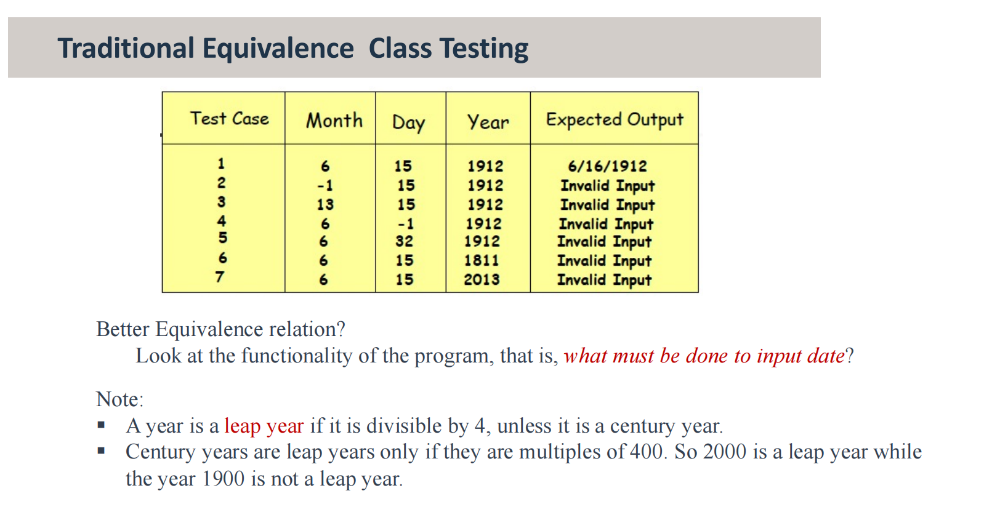

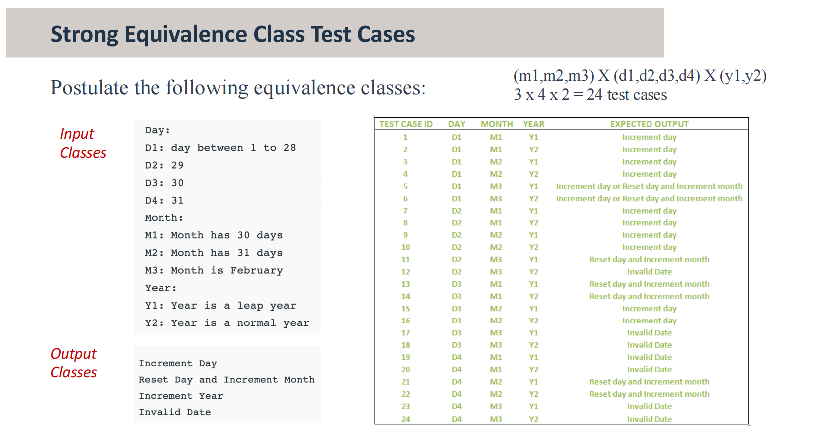

5.  **课本原题：seatsAvailable()**

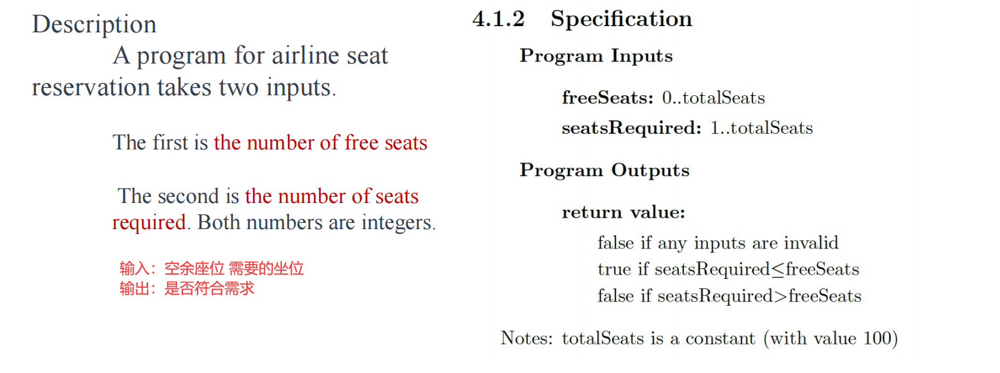
1. 输入分类

| 参数 | 取值范围（打*表示无效等价类） |
|---|---|
| 空余座位 | Integer.MIN_VALUE...-1 (1*) 0...需求座位 - 1 (2) 需求座位...座位总数（3） 座位总数 + 1...Integer.MAX_VALUE (4*) |
| 需求座位 | Integer.MIN_VALUE...0（5*） 1...空余座位（6） 空余座位 + 1...座位总数（7） 座位总数 + 1...Integer.MAX_VALUE（8*） |

1. 输出分类

| 参数 | 取值范围 |
|---|---|
| 返回值 | True False |

1. 书写测试用例

| 测试用例 ID | 输入（空余座位） | 输入（需求座位） | 预计输出 | 实际输出 | 等价类覆盖 |
|---|---|---|---|---|---|
| 有效等价类：使用**尽量少的测试用例**覆盖**尽量多的有效等价类（1 - 1...N）** |  |  |  |  |  |
| **1** | 50 | 75 | **False** |  | **（2）（7）** |
| **2** | 50 | 25 | **True** |  | **（3）（6）** |
| 无效等价类：一个测试用例覆盖一个无效等价类（1 - 1） |  |  |  |  |  |
| 3 | -100 | 25 | False |  | （1*） |
| 4 | 200 | 25 | False |  | （4*） |
| 5 | 50 | -100 | False |  | （5*） |
| 6 | 50 | 200 | False |  | （8*） |

**总结**

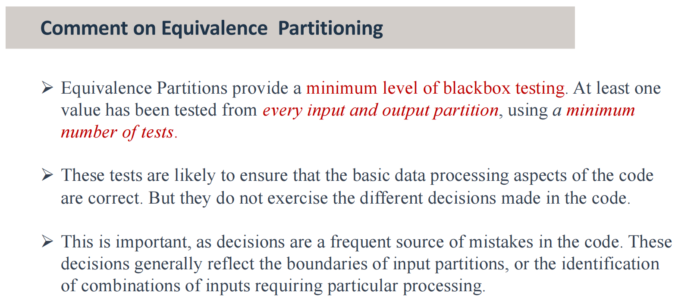
1. 等价类划分**是最低限度的黑盒测试**，每一个输入和输出的划分都至少会有一个值会被测试，使用**最小数目的测试用例。**
1. 这些测试很可能确保代码的基本数据处理方面是正确的，但它们并没有测试代码中做出的各种决策。
1. 这很重要，因为决策是代码中错误的常见来源。这些决策通常反映了输入分区的边界，或是需要特别处理的输入组合的识别。

**优势和不足**

| 优势 | 不足 |
|---|---|
| Ø Provides a good basic level of testing. Ø Well suited to data processing applications where input variables may be easily identified and take on distinct values allowing easy partitioning. Ø Provides a structured means for identifying basic Test Cases. | Ø Correct processing at the edges of partitions is not tested. Ø Combinations of inputs are not tested. Ø The technique does not provide an algorithm for finding the partitions or selecting the test data. |
| Ø 提供良好的基本测试水平。 Ø 非常适合数据处理应用程序，其中输入变量可以很容易地识别并具有不同的值，从而可以轻松分区。 Ø 提供识别基本测试用例的结构化方法。 | Ø 未测试分区边缘的正确处理。 Ø 不测试输入组合。 Ø 该技术没有提供用于查找分区或选择测试数据的算法。 |

**Boundary Value Analysis BVA 边界值分析**

**什么是边界值分析？**

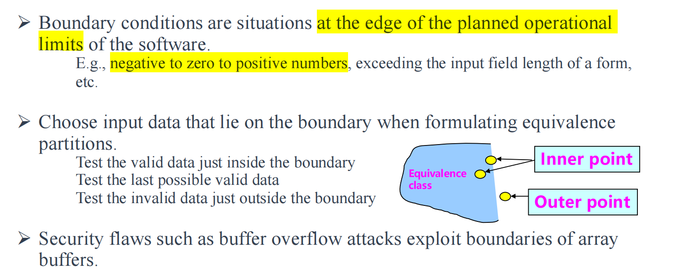
- Boundary conditions are situations at the edge of the planned operational limits of the software.

边界条件是软件计划操作**极限边缘的情况**。
- Security flaws such as buffer overflow attacks exploit boundaries of array buffers.

缓冲区溢出攻击等**安全漏洞**利用数组缓冲区的**边界**。

**如何选取边界值？**
1. Every parameter has a boundary value at the top and bottom of every equivalence partition. （每个参数在每个等价分区的顶部和底部都有一个边界值。 ）
1. For a contiguous data type, the successor to the value at the top of one partition must be the value at the bottom of the next. （对于连续数据类型，一个分区顶部值的后继值必须是下一个分区底部的值。 ）
1. The natural range of the parameter provides the ultimate maximum and minimum values.（参数的自然范围提供最终的最大值和最小值。）

**常用的边界值**
1. **循环**：0，1，len(arr) - 1，len(arr)

经典习题：[704. 二分查找 - 力扣（LeetCode）](https://leetcode.cn/problems/binary-search/description/)

| Python  class Solution:     def search(self, nums: List[int], target: int) -> int:         left = 0         right = len(nums) - 1         while (left <= right):             mid = (left + right) // 2             if (nums[mid] == target):                 return mid             elif (nums[mid] < target):                 left = mid + 1             elif (target < nums[mid]):                 right = mid - 1                  return -1 |
|---|

1. **数组**：第一个元素 arr[0]，最后一个元素 arr[-1]
1. **变量**：最小值和最大值

经典 Java 八股文：

$$
-2^72^7-1-2^152^15-1-2^312^31-1-2^632^63-1
$$

**点击图片可查看完整电子表格**
1. **链表**：第一个节点和最后一个节点

经典习题：[206. 反转链表 - 力扣（LeetCode）](https://leetcode.cn/problems/reverse-linked-list/description/)

| Python  class Solution:     def reverseList(self, head: Optional[ListNode]) -> Optional[ListNode]:         if not head or not head.next:             return head                  cur = head         pre = None         nex = None                  while cur:             nex = cur.next             cur.next = pre             pre = cur             cur = nex                      return pre          def reverseList(self, head: Optional[ListNode]) -> Optional[ListNode]:         if not head or not head.next:             return head                  new_head = self.reverseList(head.next)         head.next.next = head         head.next = None                  return new_head |
|---|

1. **可接受字符（串）的最大长度和最小长度：**用户名/密码
1. **表格/报告的：**第一行、第一列、最后一行、最后一列

经典习题：

🌟  [54. 螺旋矩阵 - 力扣（LeetCode）](https://leetcode.cn/problems/spiral-matrix/)

| Java  class Solution {     public List<Integer> spiralOrder(int[][] matrix) {         if (matrix == null \|\| matrix.length == 0 \|\| matrix[0].length == 0) {             return new ArrayList<Integer>();         }          List<Integer> result = new ArrayList<>();         int top = 0;         int bottom = matrix.length - 1;         int left = 0;         int right = matrix[0].length - 1;          while (top <= bottom && left <= right) {             // Traverse from left to right along the top row.             for (int i = left; i <= right; i++) {                 result.add(matrix[top][i]);             }             top++;              // Traverse downwards along the right column.             for (int i = top; i <= bottom; i++) {                 result.add(matrix[i][right]);             }             right--;              // Check if there are still rows and columns left to traverse.             if (top <= bottom) {                 // Traverse from right to left along the bottom row.                 for (int i = right; i >= left; i--) {                     result.add(matrix[bottom][i]);                 }                 bottom--;             }              if (left <= right) {                 // Traverse upwards along the left column.                 for (int i = bottom; i >= top; i--) {                     result.add(matrix[i][left]);                 }                 left++;             }         }          return result;     }  } |
|---|

[200. 岛屿数量 - 力扣（LeetCode）](https://leetcode.cn/problems/number-of-islands/description/)

| Python  DFS  class Solution:     def numIslands(self, grid: List[List[str]]) -> int:         def dfs(i, j):             if i < 0 or i >= len(grid) or j < 0 or j >= len(grid[0]) or grid[i][j] == '0':                 return             grid[i][j] = '0'             for d in [(0, 1), (0, -1), (1, 0), (-1, 0)]:                 nx = i + d[0]                 ny = j + d[1]                 dfs(nx, ny)         if not grid or not grid[0]:             return 0         cnt = 0         for i in range(len(grid)):             for j in range(len(grid[0])):                 if grid[i][j] == '1':                     cnt += 1                     dfs(i, j)                  return cnt |
|---|

| Python  BFS  from collections import deque from typing import List  class Solution:     directions = [[0, 1], [0, -1], [-1, 0], [1, 0]]      def numIslands(self, grid: List[List[str]]) -> int:         if not grid or not grid[0]:             return 0                      def bfs(grid: List[List[str]], startX: int, startY: int) -> None:             q = deque([[startX, startY]])  # 修改这里             grid[startX][startY] = "0"              while q:                 node = q.popleft()                  curX = node[0]                 curY = node[1]                  for dire in self.directions:  # 使用 self 来引用类变量                     nX = curX + dire[0]                     nY = curY + dire[1]                                      if 0 <= nX < len(grid) and 0 <= nY < len(grid[0]) and grid[nX][nY] == "1":  # 修改这里，确保 nY 的比较是小于 len(grid[0])                         q.append([nX, nY])  # 修改这里，确保添加到队列的是列表                         grid[nX][nY] = "0"          count = 0         for i in range(len(grid)):             for j in range(len(grid[0])):                 if grid[i][j] == "1":                     # dfs(grid, i, j)                     bfs(grid, i, j)                     count += 1                  return count |
|---|

Ø Typically, software testing involves several types of boundary checks: numbers, characters, position, weight, size, speed, orientation, dimension, space, and so on.

Ø 通常，软件测试涉及几种类型的边界检查：数字、字符、位置、重量、大小、速度、方向、尺寸、空间等。

Ø Accordingly, the boundary values of the above types should be in: max/min, first/last, up/down, fastest/slowest, highest/lowest, shortest/longest, empty/full, etc.

Ø 相应地，上述类型的边界值应为：最大/最小、前/后、上/下、最快/最慢、最高/最低、最短/最长、空/满等。

**例题**

1.  **判定是否为负**

| Java  判定是否为负  /* 可以划分为两个等价类，分别是 [Integer.MIN_VALUE, -1] [0, Integer.MAX_VALUE] BVA 边界值分析的四个取值 Integer.MIN_VALUE, -1, 0, Integer.MAX_VALUE */ boolean isNegative(int x) {     return x < 0;  } |
|---|

2.  **seatsAvailable()**

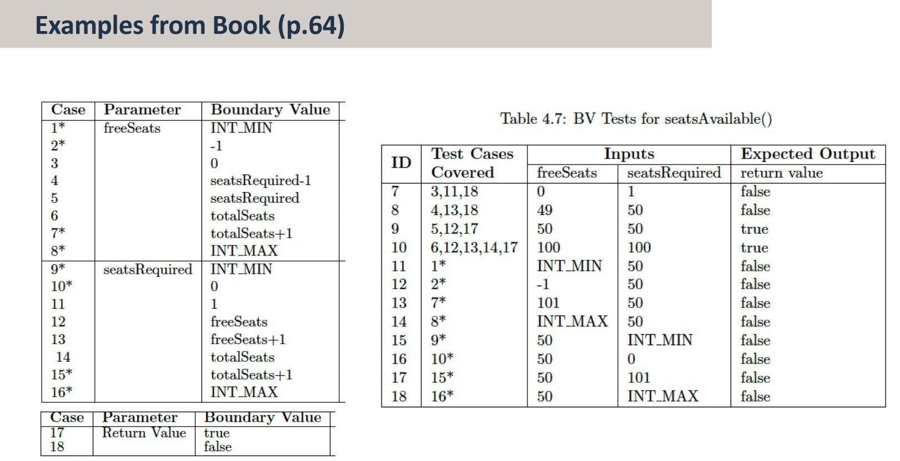

**优势和不足**

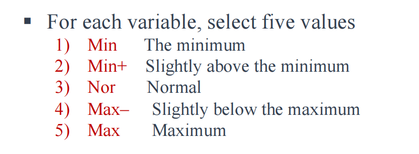

| 优势 | 不足 |
|---|---|
| Ø Test Data values are provided by the technique. Ø Tests focus on areas where faults are more likely to be found. | Ø Combinations of inputs are not tested. |
| Ø 测试数据值由技术提供。 Ø 测试重点放在更容易发现故障的区域。 | Ø 不测试输入组合。 |

**Combinational Testing 组合测试**

**什么是组合测试？**

Ø There are a number of different techniques for identifying relevant combinations, such as  ***Cause-Effect Graphs*****,** ***Decision Tables*** **and** ***Truth Tables***.

Ø 有许多不同的技术可以识别相关组合，例如因果图、决策表和真值表。

Ø The analysis of combinations involves identifying all the different combinations of input  **causes**  to the software and their associated output  **effects**.

Ø 组合分析涉及识别软件输入原因的所有不同组合及其相关的输出效果。

Ø The causes and effects are described as  **logical statements (or predicates)**, based on the specification of the software. These expressions specify the conditions required for a particular variable to cause a particular effect.

Ø 因果关系被描述为逻辑语句（或谓词），基于软件的规范。这些表达式指定了特定变量引起特定影响所需的条件。

**真值表**

Ø To test all the  **different behaviors of the program**, a Truth Table is created. The inputs (“Causes”) and outputs (“Effects”) are specified as Boolean expressions (using predicate logic).

Ø 为了测试程序的所有不同行为，创建了一个真值表。输入（“原因”）和输出（“影响”）被指定为布尔表达式（使用谓词逻辑）。

Ø  **Combinations of the causes**  are the inputs that will generate a particular response from the program.

Ø  **Test Cases**  are then constructed that will  **cover all possible combinations of Cause and Effect**. For N independent causes, there will therefore be a total of  **2^N**  different combinations. The Truth Table specifies how the software should behave for each combination.

Ø  **原因的组合**是将从程序中产生特定响应的输入。然后构建测试用例，涵盖因果关系的所有可能组合。对于N个独立的原因，因此总共会有2^N个不同的组合。真值表指定了软件对每个组合的行为方式。

**例 1：isNegative(int x)**

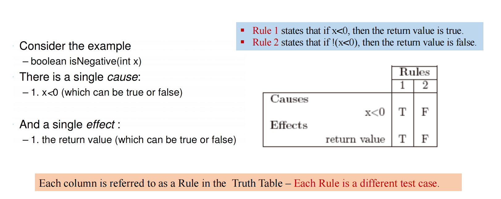

|  | if x < 0 then return true | if not x < 0 then return false |
|---|---|---|
| Causes x < 0 | T | F |
| Effects return value | T | F |

**例 2：largest(int x, int y)**

| Java  public int largest(int x, int y) {     return x >= y ? x : y;  } |
|---|

|  | Rules |  |  |
|---|---|---|---|
| Causes | 1 | 2 | 3 |
| x > y | T | F | F |
| x < y | F | T | F |
| Effects |  |  |  |
| return value == x | T | F | T |
| return value == y | F | T | T |

**Don't Care Conditions**

Ø “Don’t care” conditions exist where the value of  ***a cause has no impact on the effect***.

Ø “不在乎”条件存在，其中原因的价值对结果没有影响。

Ø These “Don’t care” conditions are used to reduce the number of rules  ***where the same output will be generated*** irrespective of whether the  **Cause is true or false**.

Ø 这些“不关心”条件用于减少无论原因是真还是假都会生成相同输出的规则数量。

Ø In the worst case, if there are no “Don’t care” conditions, N Causes will create 2^N Rules.

Ø 在最坏的情况下，如果没有“不关心”的条件，N个原因将创建2^N个规则。

Ø “Don’t care” conditions are represented by a  **“*”**  for the causes in a Truth Table.

Ø “不关心”条件在真值表中用“*”表示原因。

**例 3：condIsNegt(int x, boolean flag)**

| Java  public boolean largest(int x, boolean flag) {     return x < 0 && flag ? true : false;  } |
|---|

|  | Rules |  |  |
|---|---|---|---|
| Causes | 1 | 2 | 3 |
| x < 0 | T | F | * |
| falg | T | T | F |
| Effects |  |  |  |
| return value | T | F | F |

**优势和不足**

Ø The truth tables can sometime  **be very large**. The solution is to identify subproblems and develop  **separate tables**  for each.

真值表有时可能**非常大**。解决方案是识别子问题并为每个子问题开发**单独的表**。

Ø  **Very dependent on the quality of the specification**  - more detail means more causes and effects, which takes more time to test; less detail means less causes and effects, but less effective testing

**非常依赖规范的质量**——细节越多意味着前因后果越多，需要花更多时间测试；细节越少意味着前因后果越少，但测试效果越差

**决定表 Decision Tables**

Ø precise yet compact way to model complicated logic

Ø 精确而紧凑的方式来建模复杂的逻辑

Ø Associate conditions with actions to perform

Ø 将条件与要执行的操作相关联

Ø Can associate many independent conditions with several actions in an elegant way

Ø 可以优雅地将多个独立条件与多个动作关联起来

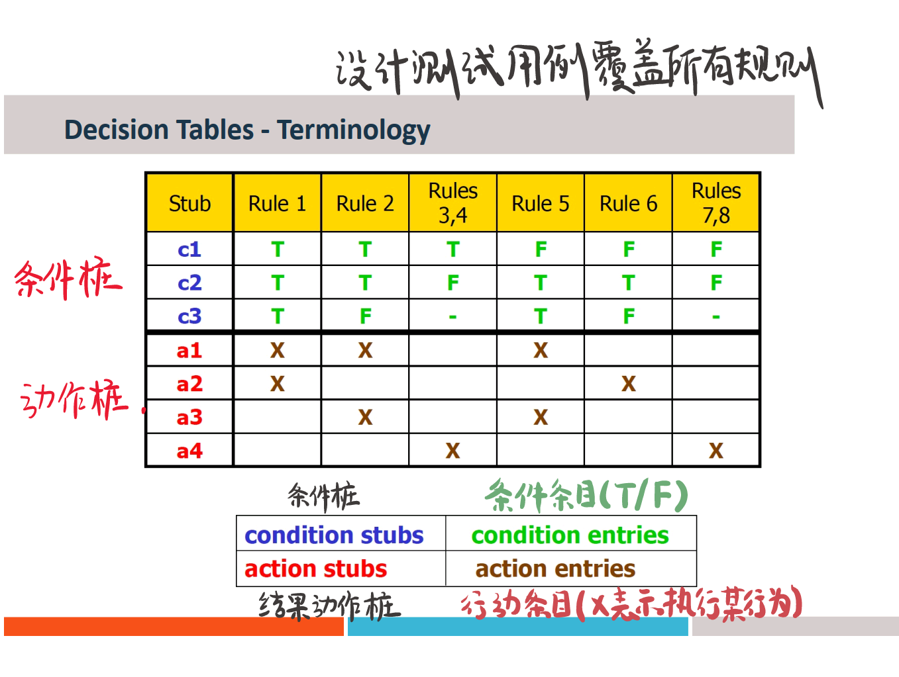

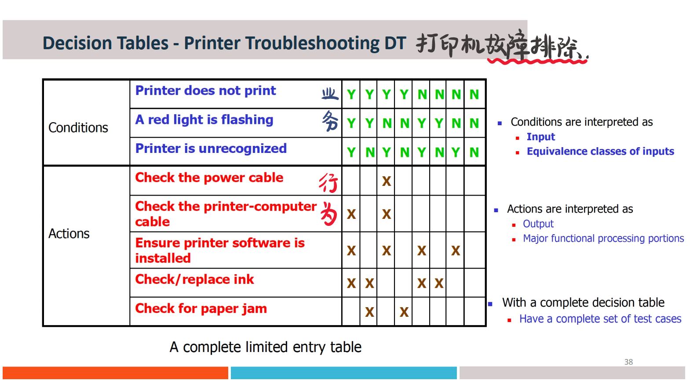

**例 1：NextDate Program**

回顾一下我们之前的等价类划分设计

M1 = { 30 天 的月份 }

M2 = { 31 天 的月份 }

M3 = { 2 月 }

D1 = { 1..28 天 }

D2 = { 29 天 }

D3 = { 30 天 }

D4 = { 31 天 }

Y1 = { 1812 ~ 2012 年之间的闰年 }

Y2 = { 1812 ~ 2012 年之间的平年 }

如果按照真值表对不同的条件进行设计，难道要设计 2^9 = 512 种不同的组合吗？

可以观察到，月份的设计是 “互斥” 的，三种月份我们只能抽取其中一种

| C1：M1 月 | T | —— | —— |
|---|---|---|---|
| C2：M2 月 | —— | T | —— |
| C3：M3 月 | —— | —— | T |
| A1：不可能 |  |  |  |
| A2：下一天 |  |  |  |

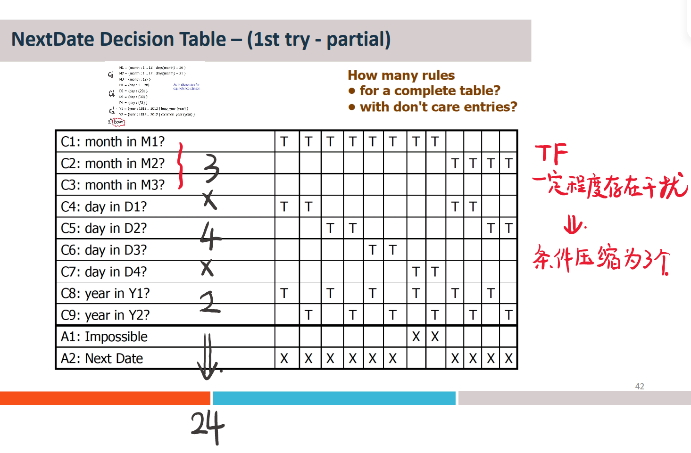

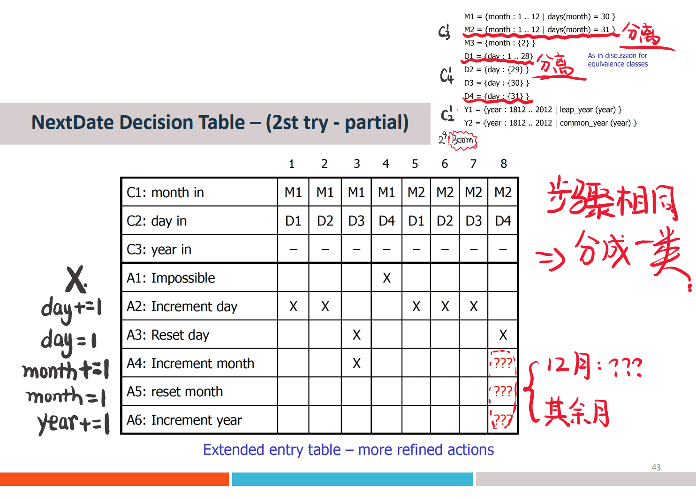

**我们又可以发现：如果我们对 nextDay 这个函数进行细化，又可以有很多种不同的情况，原本的分类无法妥善处理，这就提示我们进行再次拆分，如下所示：**

M1 = { 30 天 的月份 }

M2 = { 31 天 的月份（排除 12 月） }

**M3 = { 12 月 }**

M4 = { 2 月 }

D1 = { 1..27 天 }

**D2 = { 28 天 }**

D3 = { 29 天 }

D4 = { 30 天 }

D5 = { 31 天 }

Y1 = { 1812 ~ 2012 年之间的闰年 }

Y2 = { 1812 ~ 2012 年之间的平年 }

注意到：除了 2 月份要考虑闰年和平年，其他的月份都没有必要进行额外的考虑，排列组合精简为 22 列

**为什么是 22 列呢？**

M 有 4 列，D 有 5 列，笛卡尔积 20 列

**涉及到二月份的 D2 和 D3，需要考虑平年和闰年，多加 2 列**

所以一共是 22 列

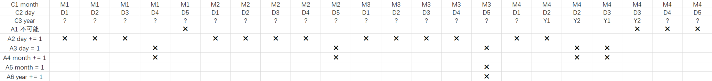

请观察荧光笔的条件合并，总结设计用例的设计规律

为什么 M4 涉及不同 Y 的类型无法合并，但是 M1 和 M2 涉及不同的 D 可以合并呢？

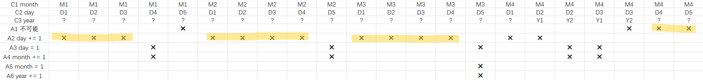

| Case ID | Year | Month | Day | Expected Output |
|---|---|---|---|---|
| 1 - 3 | 2001 | 4 | 15 | 2001 4 16 |
| 4 | 2001 | 4 | 30 | 2001 5 1 |
| 5 | 2001 | 4 | 31 | Invalid |
| 6 - 9 | 2001 | 1 | 15 | 2001 1 16 |
| 10 | 2001 | 1 | 31 | 2001 2 1 |
| 11 - 14 | 2001 | 2 | 15 | 2001 2 16 |
| 15 | 2001 | 12 | 31 | 2002 1 1 |
| 16 | 2001 | 2 | 15 | 2001 2 16 |
| 17 | 2004 | 2 | 28 | 2004 2 29 |
| 18 | 2001 | 2 | 28 | Invalid |
| 19 | 2004 | 2 | 29 | 2004 3 1 |
| 20 | 2001 | 2 | 29 | Invalid |
| 21 - 22 | 2001 | 2 | 30 | Invalid |

**例 2：超市会员例题**

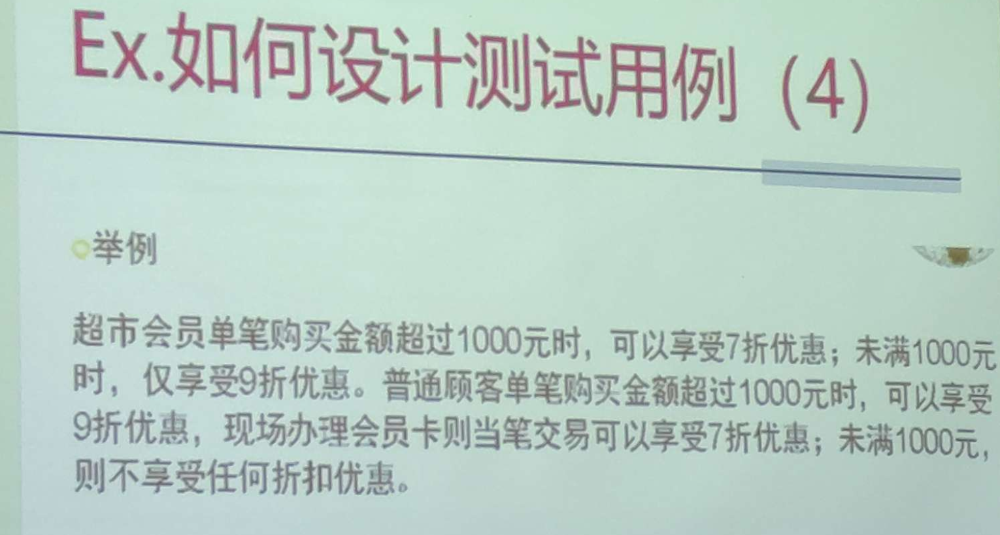

| 会员 | T | T | F | F | F | T |
|---|---|---|---|---|---|---|
| 购买金额 >= 1000 | F | T | F | F | T | T |
| 现场办理会员卡 | - | - | F | - | F | T |
| 九折 | ✖ |  |  |  | ✖ |  |
| 七折 |  | ✖ |  |  |  | ✖ |
| 原价 |  |  | ✖ | ✖ |  |  |

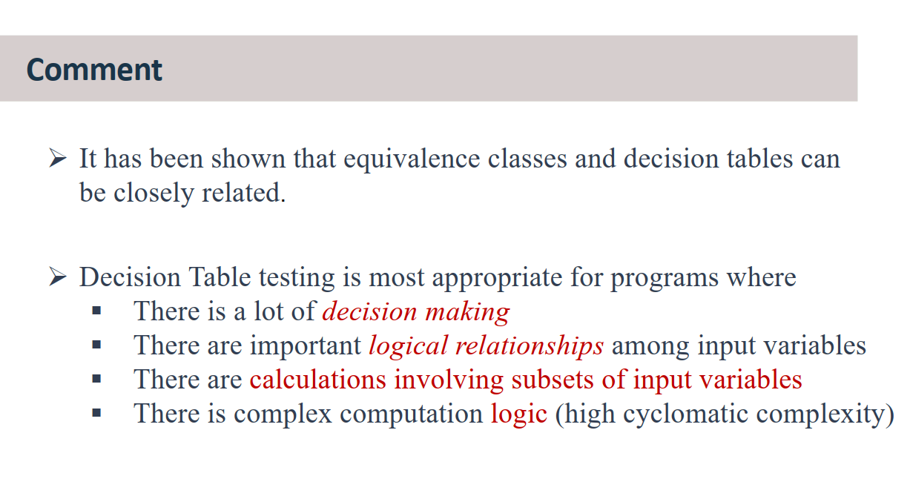

等价类和决策表是紧密关联的

决策表与程序是最接近的
- 有许多决策制定
- 有输入变量的重要逻辑关系
- 有输入变量的子集的计算
- 有复杂的计算逻辑（高圈复杂度）

**Sequence and Value Testing（期末不考）**

**Random Testing and Error Guessing**

**随机测试**

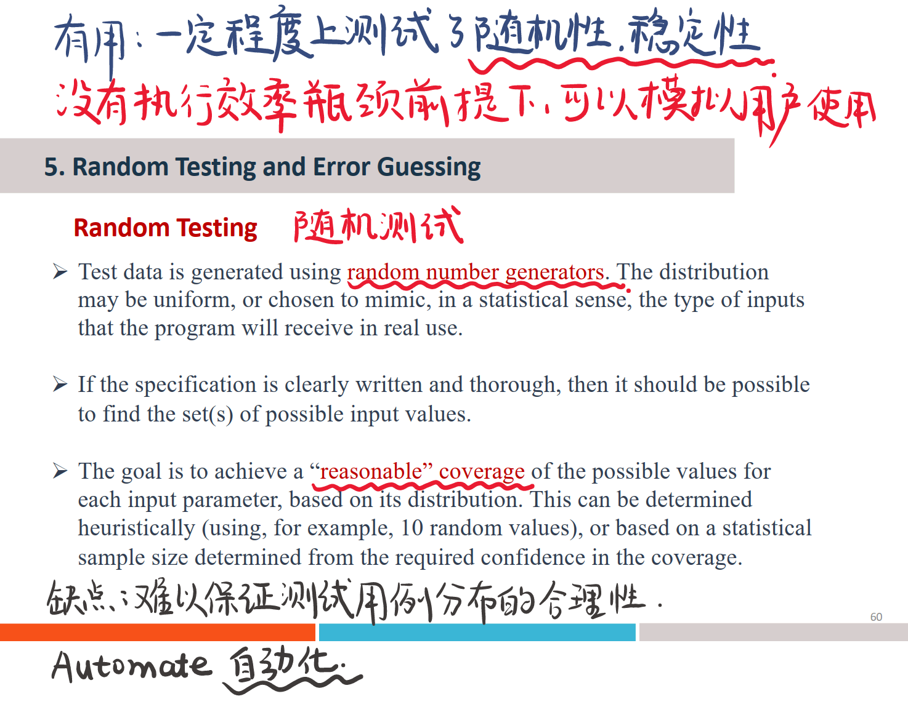
- Each Test Case is represented by  **a set of (random) input values**, one for each parameter.

每个测试用例由一组（随机）输入值表示，每个参数一个。
- If the test is fully  **automated**, then each Test Case is represented by a distribution of values for a particular parameter.

如果测试是完全自动化的，那么每个测试用例都由特定参数的值分布表示。
- This will normally include  **the upper and lower limits, and the distribution**  to be used between these limits to select a random value.

这通常包括上限和下限，以及在这些限制之间用于选择随机值的分布。

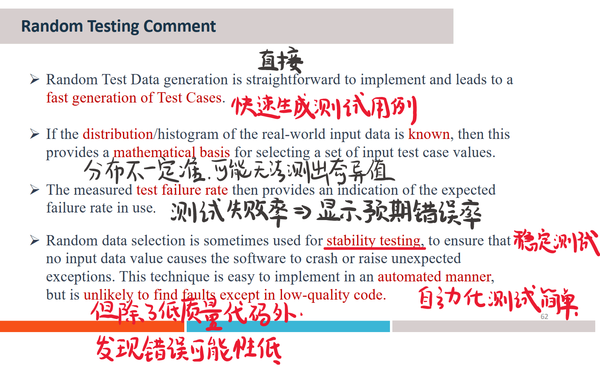

**错误推测**

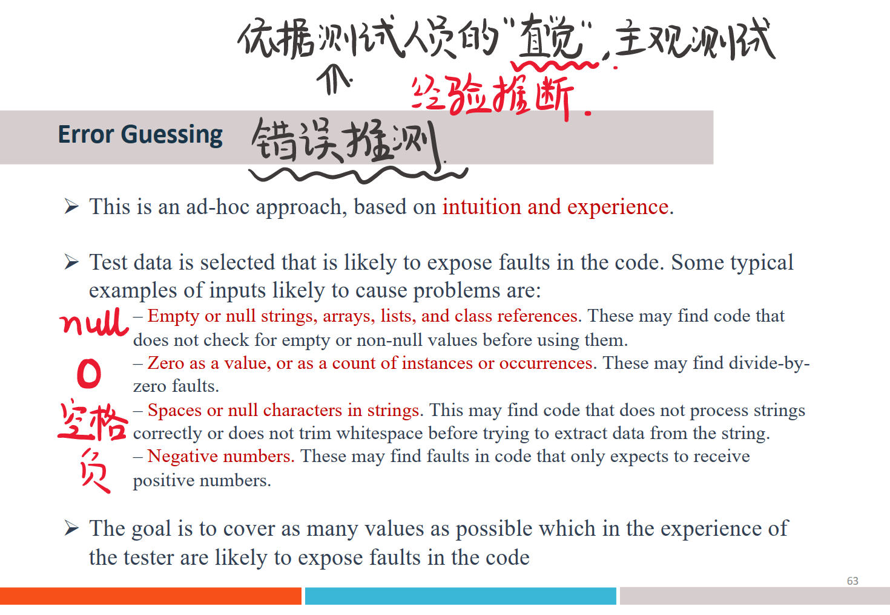
- 空值、空字符串、空数组、空列表、空的类引用
- 0 值
- 字符串的空格或者空字符串
- 负值

例：[912. 排序数组 - 力扣（LeetCode）](https://leetcode.cn/problems/sort-an-array/description/)

| Python  归并排序  class Solution:     def sortArray(self, nums: List[int]) -> List[int]:         return self.merge_sort(nums)          def merge_sort(self, nums):         if len(nums) == 1:             return nums         mid = len(nums) // 2         left = self.merge_sort(nums[:mid])         right = self.merge_sort(nums[mid:])         return self.merge(left, right)              def merge(self, left, right):         sorted_arr = []         i = j = 0                  while i < len(left) and j < len(right):             if left[i] < right[j]:                 sorted_arr.append(left[i])                 i += 1             else:                 sorted_arr.append(right[j])                 j += 1                  sorted_arr.extend(left[i:])         sorted_arr.extend(right[j:])                                    return sorted_arr |
|---|

在 Debug 这一道题的时候，测试人员会考虑 5 中特殊情况
1. 数组为空 []
1. 数组只有一个元素 [1]
1. 所有的元素在数组已经被排序了 [1, 2, 3, 4, 5]
1. 所有的元素在数组已经是逆序了 [9, 7, 5, 4, 3]
1. 部分/所有 元素在数组中是相同的 [3, 4, 4, 3, 9]

Ø The tester selects values which are  **likely to produce errors**. Each value is a Test Case.

Ø 测试人员选择可能产生错误的值。每个值都是一个测试用例。

Ø This technique can produce  **both normal and error Test Cases**. The values selected are those that are likely to expose faults in the code, they are not necessarily illegal values.

Ø 这种技术可以产生正常和错误的测试用例。选择的值是那些可能暴露代码中故障的值，它们不一定是非法值。

Ø Input Test Data is selected, based on Test Cases which are  **not yet covered**. As with the other test techniques, error cases should be executed  **individually**.

Ø 根据尚未涵盖的测试用例选择输入测试数据。与其他测试技术一样，错误用例应单独执行。

Ø With experienced testers, this can be a very  **effective complement**  to other testing techniques.

Ø 有经验的测试人员，这可以成为其他测试技术的非常有效的补充。

Ø It depends on  **how well the testers know the types of mistakes**  that the developers are likely to make, or mistakes that have a high impact on the  final product.

Ø 这取决于测试人员对开发人员可能犯的错误类型或对最终产品影响大的错误的了解程度。

**Scenario Testing 场景测试**

**定义**

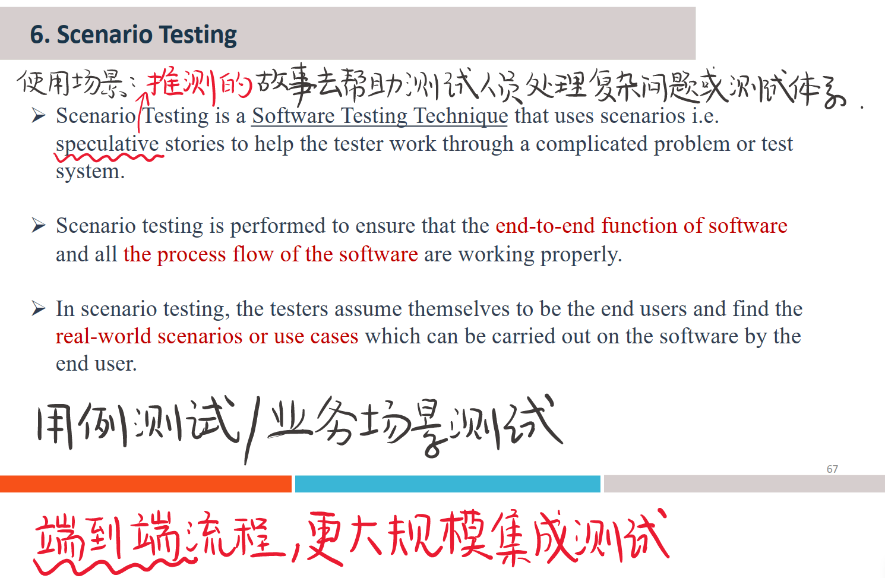

**用例场景解析**

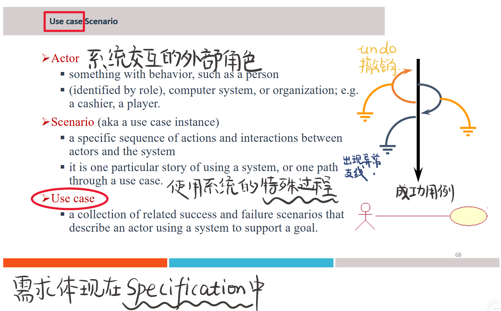

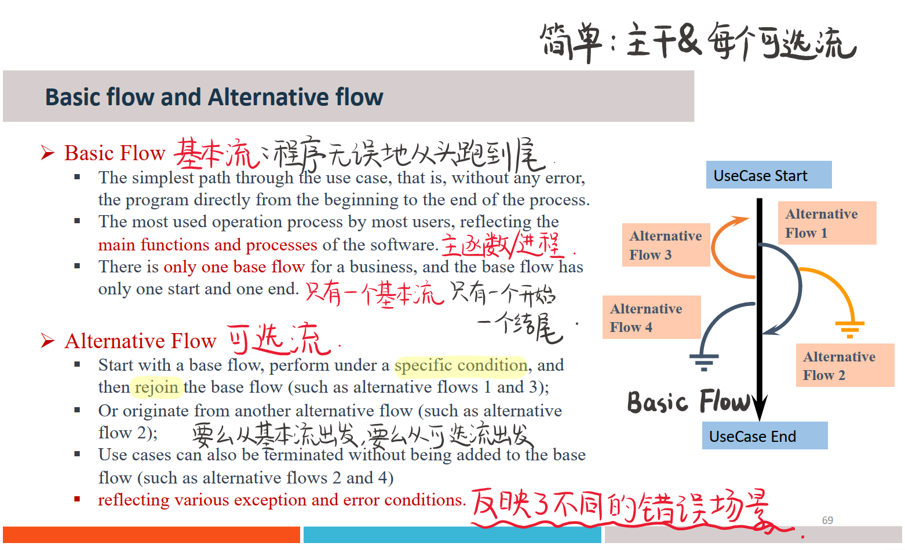

在上面的题目中，我们可以设计 8 个场景

| 1 | B |
|---|---|
| 2 | B - A1 |
| 3 | B - A1 - A2 |
| 4 | B - A3 |
| 5 | B - A3 - A1 |
| 6 | B - A3 - A1 - A2 |
| 7 | B - A4 |
| 8 | B - A3 - A4 |

为了简化问题分析，只有一个循环执行的可选流 3 被考虑进去

**执行步骤**

**Scenario Testing Goal**
- Simulate the user to complete the operation of normal functions and core business logic to  **verify the correctness of software functions**;
- Simulate the main errors in user operation to  **verify the abnormal error handling ability of software**.

场景测试目标
- 模拟用户完成正常功能和核心业务逻辑的操作，验证软件功能的正确性；
- 模拟用户运营中的主要错误，验证软件的异常错误处理能力。

Alternative flows, like the program execution paths, will cause the scenario explosion.

Typical scenarios need to be selected for testing.

(1) One and only one scenario contains the basic flow;

(2) The minimum number of scenarios: the total of basic flows and alternative flows;

(3) For an alternative flow: at least one scenario covering it, which try to avoid covering other alternative flows

替代流程，如程序执行路径，将导致场景爆炸。

需要选择典型场景进行测试。

（1）有且仅有一个场景包含基本流程；

（2）最小场景数：基础流、备选流合计；

（3）对于备选流：至少覆盖一个场景，尽量避免覆盖其他备选流
1. According to the specification,  **describe the basic flow and alternative flow**  of the software under test.

根据规范，描述被测软件的基本流程和备选流程。
1. **Construct different scenarios**  to meet the requirements of test completeness and  no redundancy.

构造不同的场景，满足测试完备性和无冗余的要求。
1. **Design corresponding test cases**  for each scenario.

为每个场景设计相应的测试用例。
1. Re-examine all generated test cases and remove redundant test cases. After the  test cases are determined,  **the test data values are determined**  for each test case.

重新检查所有生成的测试用例，去除冗余的测试用例。测试用例确定后，为每个测试用例确定测试数据值。

**例题：酒店订购**

A hotel system supports online reservations.

Customers visit the website for room reservation operation, select a reservation date, suitable room, online reservation.

In this case, you need to login to the system using your personal account.

After the login succeeds, you can make the deposit payment.

After the deposit is paid successfully, the room reservation form will be generated to complete the whole room reservation process.

The system allows a reservation period of 30 days and a deposit of 400 dollars.

酒店系统支持在线预订。

客户访问网站进行房间预订操作，选择预订日期、合适的房间、在线预订。

在这种情况下，您需要使用您的个人帐户登录系统。

登录成功后，您可以支付押金。

支付押金成功后会生成房间预订表单，完成整个房间预订流程。

该系统允许30天的预订期和400美元的押金。

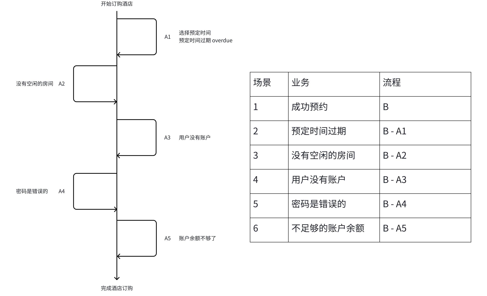

如何根据场景流动设计测试用例呢？

V：为了让基本流被执行，条件必须为有效的

I：如果条件无效，那么就会激活可选流

NA：Not Applicable 条件无法被应用到测试用例中

| 测试用例 | 场景 | 日期 | 房间 | 账户 | 密码 | 账户 | 预计输出 |
|---|---|---|---|---|---|---|---|
| 1 | 1 | V | V | V | V | V | 成功订购 账户余额扣减相应的值 |
| 2 | 2 | I | NA | NA | NA | NA | 预定时间失效 请重新选择日期 |
| 3 | 3 | V | I | NA | NA | NA | 客房已满 请重新选择日期 |
| 4 | 4 | V | V | I | NA | NA | 账户不存在 请重新选择账户 |
| 5 | 5 | V | V | V | I | NA | 密码错误 请重新输入密码 |
| 6 | 6 | V | V | V | V | I | 账户余额不足，请重新提取 |

**根据可选流，结合题目的具体数据设计测试用例即可**

| 测试用例 | 场景 | 日期 | 房间 | 账户 | 密码 | 账户 | 预计输出 |
|---|---|---|---|---|---|---|---|
| 1 | 1 | V | 未满 | USER | 1234 | 1000 | 成功订购 账户余额扣减相应的值 |
| 2 | 2 | I | NA | NA | NA | NA | 预定时间失效 请重新选择日期 |
| 3 | 3 | V | 已满 | NA | NA | NA | 客房已满 请重新选择日期 |
| 4 | 4 | V | 未满 | ??? | NA | NA | 账户不存在 请重新选择账户 |
| 5 | 5 | V | 未满 | USER | 空 | NA | 密码错误 请重新输入密码 |
| 6 | 6 | V | 未满 | USER | 1234 | 0 | 账户余额不足，请重新提取 |

**黑盒测试总结**

**业务功能点 —— 哪些是比较合适的业务功能点 —— 完成完整的业务功能**
1. For the specific input field in the specific function page, the refined test is carried  out, using  **equivalence class and boundary value**; Use static testing to check  buttons, links, content, images, etc;

针对具体功能页面中的具体输入字段，进行精细化测试，使用等价类和边界值;使用静态测试来检查按钮、链接、内容、图像等;
1. If the function description contains a combination of input conditions, and the  business logic is complex,  **decision table**  can be used.

如果函数描述中包含多个输入条件的组合，且业务逻辑复杂，可以使用决策表。
1. **Boundary value analysis**  should be considered in any case, as it is one of the  most effective methods to find software defects.

无论如何都应该考虑边界值分析，因为它是发现软件缺陷的最有效方法之一。
1. Test cases can be expanded by  **error guessing**  method, and the valuable  experience of test engineers is emphasized.

可以通过错误猜测方法扩展测试用例，强调测试工程师的宝贵经验。
1. For the system with  **clear business process, the scenario testing**  can be used  throughout the whole testing process

对于业务流程清晰的系统，场景测试可以贯穿整个测试过程

**笔记补充**

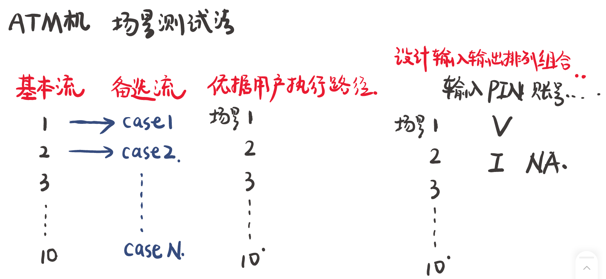

用户与界面的交互事实上也是输入

例：选课系统怎么进行黑盒测试呢？

注册登录

选课逻辑（业务规则）

课程状态（跟踪课程变化的情况）

边界条件（选课成功的业务流程怎么走，选课失败的业务流程怎么走）
