# ST 讲义（五）测试文档、静态测试与软件维护

**ST 讲义（五）测试文档、静态测试与软件维护**

**Ch6 测试文档**

**Test Plan 测试计划**

**什么是测试计划？**
- **测试计划**是一个描述软件测试**范围以及行为**的**文档。**这是在项目中**正式地测试**任意的软件/产品的**基础**
- 范围、方法、资源以及日程的试验活动
- **Master Test Plan（主要测试计划）**：针对一个项目/产品的一个单独的高层级测试计划，它统一了所有其他测试计划
- Testing Level Specific（测试级别特定）：针对每一层的测试设计测试计划
- 单元测试计划 —— 集成测试计划 —— 系统测试计划 —— 验收测试计划
- Testing Type Specific（测试类型特定）：针对特定领域进行测试
- 性能测试计划 —— 安全测试计划

**测试计划流程是什么样的？【2025 PPT 7 - 13】**

1.  **定义测试策略**

2.  **定义测试系统**

3.  **预估测试成本**

4.  **准备并回顾测试计划**

**Test Case 测试用例**

**什么是测试用例？**
- **测试用例**是由文档整理出来的一系列：**前置条件（前置需求）、流程（输入/行为）、后置条件（预期输出）**。这些内容都是测试人员用来决定系统是否符合需求或者是否正确运行的。
- 一个测试用例可以有一个或者多个**测试脚本（test scripts）**
- 测试脚本是用于执行测试的一系列指令
- 一个测试用例的集合被称为**测试包 (test suite)**

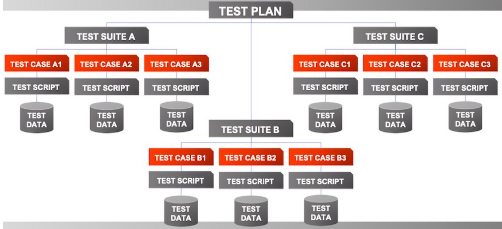

**Bug Report 故障报告/缺陷报告**

**什么是故障报告？**
- 一个用于**指出软件究竟出了什么问题的信息**的文档
- 它列出了原因或看到的错误，以指出什么被视为错误，还包括请求 和/或 如何解决它的详细信息。
- 清晰、可执行、易于完成
- 写故障报告（缺陷报告）的目的是  **get bugs fixed**

“This is what we have, this is what we should have instead, so fix it.”

“这是我们拥有的，**（但）**这**（才）**是我们应该拥有的，所以修复它。”

**BUG Report 的特征？【2025 PPT 17 - 23】**

**Test Summary Report 测试总结报告**

**什么是测试总结报告？**
- 测试总结报告是在测试项目结束时或测试完成后准备的**重要可交付成果（important deliverable）**。
- 测试总结报告的主要目的是**向项目干系人**去**解释**项目中**关于被执行测试的**各种细节以及活动。

After performing  **exhaustive testing**,  **publishing the test results, metrics, best practices, lessons learned, conclusions on ‘Go Live’ etc**. are extremely important to produce that as evidence for the Testing performed and the Testing conclusion.

在进行**详尽的测试**后，发布**测试结果、指标、最佳实践、经验教训、“上线”结论**等对于作为测试执行和测试结论的证据非常重要。

**测试总结报告包含了什么？【2025 PPT 29 及以后】**

**Ch10 静态测试**

**考试范围 2025 PPT 1 - 15**

**请注意，静态测试不考 Static Program Analysis**

**什么是静态测试？**

Static testing is the process of carefully and methodically reviewing and analyzing the software for bugs without executing it. （静态测试是不执行代码、而是仔细地且**有条不紊地（methodically）**回顾且分析软件，从而找到 BUGS 的流程）

这种测试非常有价值并且相比于基于执行的测试有好处。**根据研究，大量的错误可以通过静态测试被发现。**

从成本和生产力的角度来看，这种测试很有好处，因为错误很早被发现（并且纠正），且相比基于执行的测试来说更节省时间。

**Code Review / 代码评审**

**代码评审的重要元素**
- 发现问题
- 发现软件的问题，比如说忽略的条目，错误等
- 遵守规则
- 被评审的代码量，以及被评审的代码将要被花费的时间等
- 准备
- 为了贡献评审，每一个参与者应该提前做准备
- 书写报告
- 总结审查结果，向开发团队提供报告。

文贵被告

**非正式的代码评审**

Ø 同行评审

§ 一小群非正式的程序员和/或测试人员充当审阅者。

§ 参与者应遵循4个基本要素，即使审查是非正式的。

Ø 演练

§ 一个更正式的过程，代码的作者将代码正式地呈现给一小群程序员和/或测试人员。

§ 作者逐行阅读代码解释它的作用，审阅者倾听并提出问题。

§ 参与者应遵循4个基本要素。

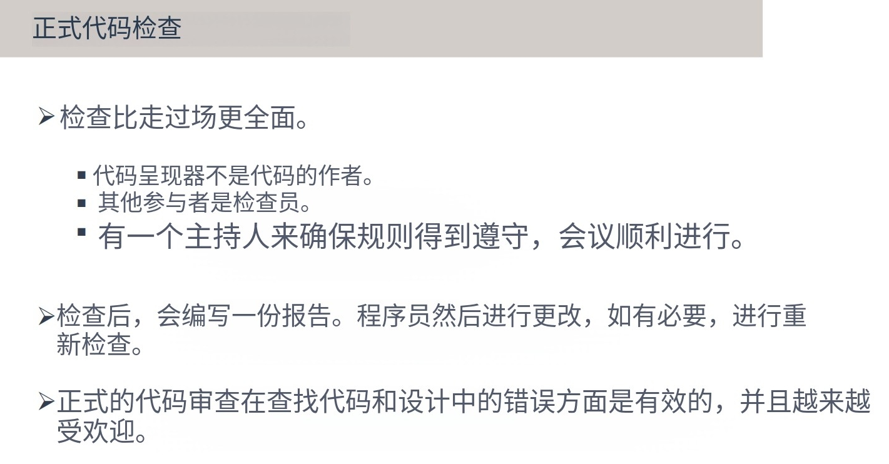

**代码评审检查表**

**数据引用错误**

扩展知识，什么叫 OFF-BY-ONE 错误？

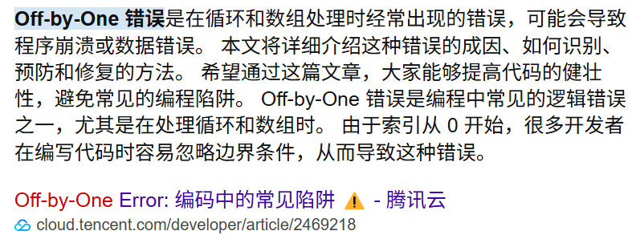

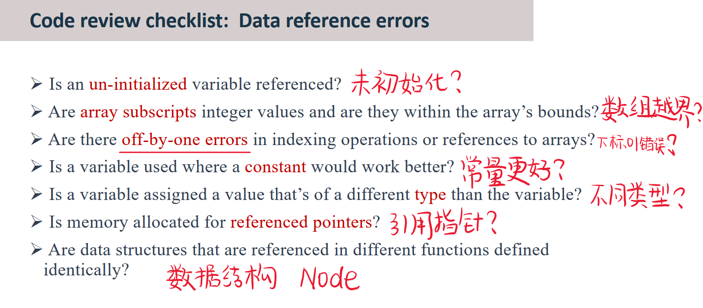

Are data structures that are referenced in different functions defined identically? 不同函数中引用的数据结构定义是否相同？（比如说 Node 在链表、二叉树、N 叉树、图的定义是不同的）

**数据声明错误**

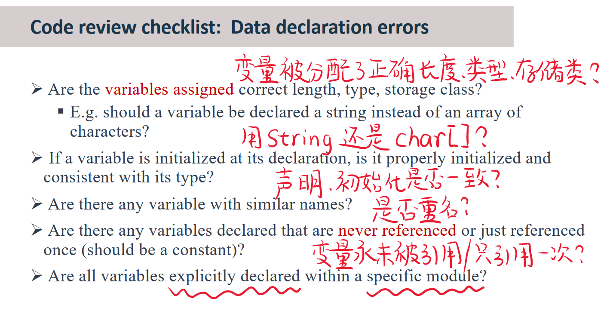

Are all variables explicitly declared within a specific module? 所有变量都在特定模块中显式声明吗？

**计算错误**

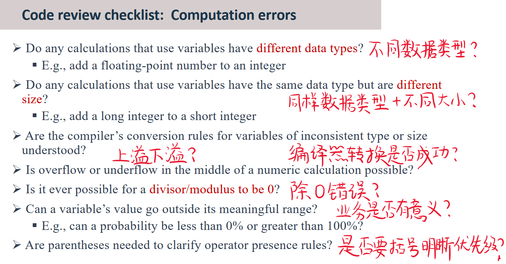

**对比错误**

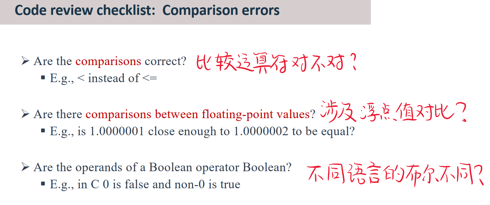

**控制流错误**

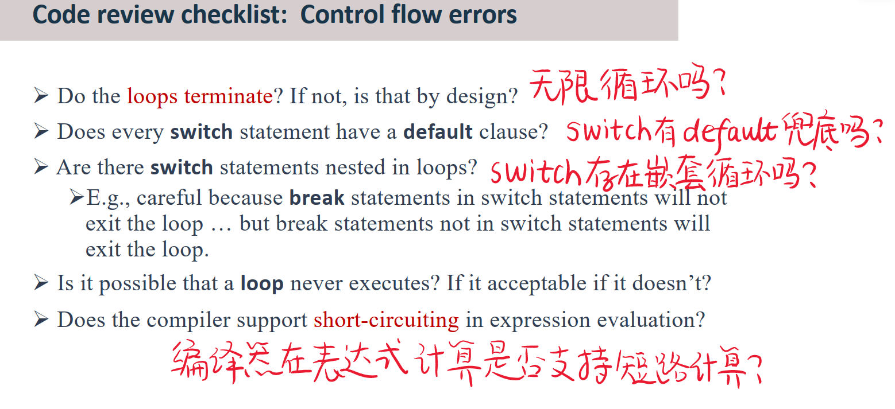

**子程序参数错误**

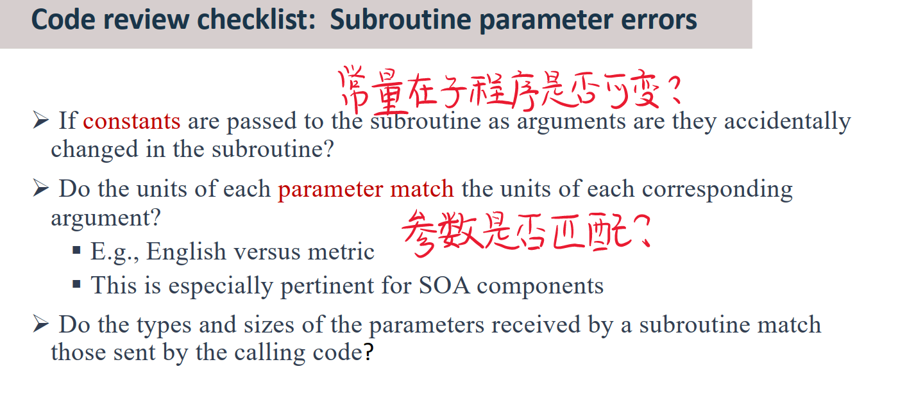

**输入输出错误**

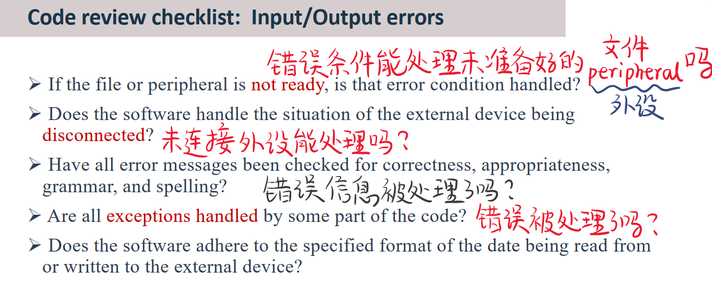

Does the software adhere to the specified format of the date being read from or written to the external device? / 软件是否遵循从外部设备读取或写入日期的指定格式？

**其他错误项**

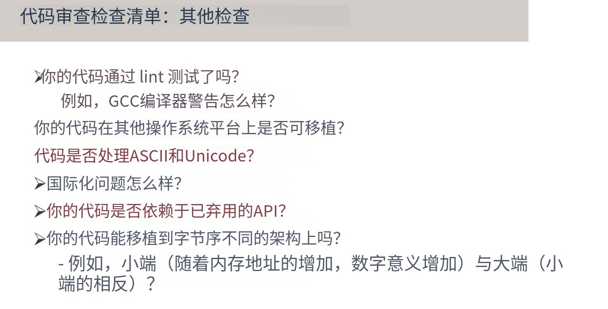

**Ch12 软件维护**

**什么是软件维护**

When the transition from development to evolution is  **not seamless**,  ***the process of changing the software after delivery*** is often called software maintenance.

当从开发到演进的过渡**不是无缝的**，**交付后更改软件**的过程通常称为软件维护。

Maintenance is the process of  **modifying a software system**  or component after delivery to correct faults,  **improve performance or other attributes**, or  **adapt to a changed environment**.

维护是在交付后**修改软件系统**或组件以纠正故障、**提高性能**或其他属性或**适应变化环境**的过程。

Ø Maintenance does not normally involve major changes to the system’s architecture

Ø 维护一般不涉及系统架构的大改动

Ø Maintenance requires program understanding

Ø 维护需要程序理解

| 软件维护 Maintenance | 在软件部署之后保持软件系统可操作所需求的活动 |
|---|---|
| 软件演变 Evolution | 将软件不断变好的持续改变 |

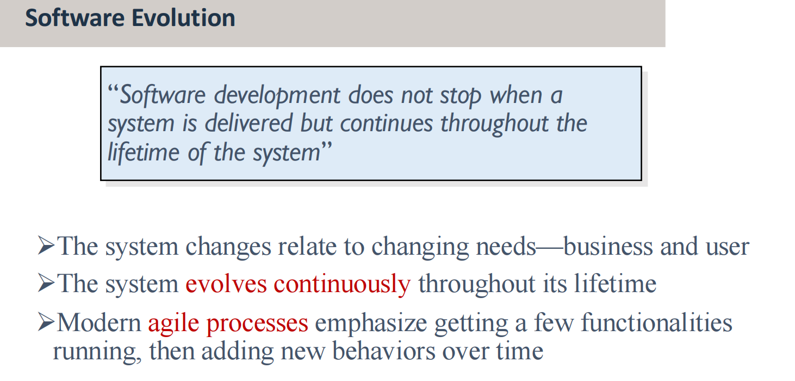

**🌟 必考：软件维护的类型（CAPP）**

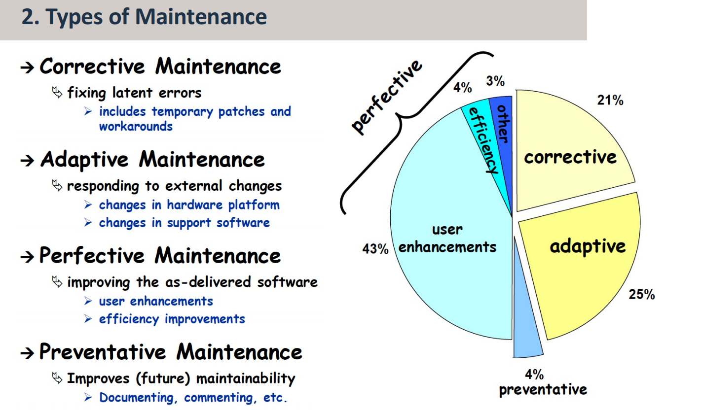

**Corrective ~ 纠错性**
- 修复**潜在的**错误（包括了临时的**补丁和变通方法**  patches and workarounds）

**Adaptive ~ 适应性**
- 处理外部的变化（包括硬件平台的改变以及支持软件的改变）

**Perfective ~ 完善性**
- 提升已经发行的软件的（用户体验以及效率）

**Preventative ~ 预防性**
- 提升未来的可维护性（文档、注释等）

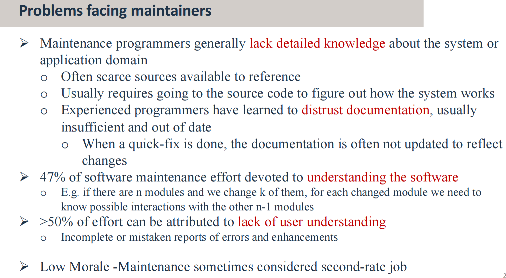

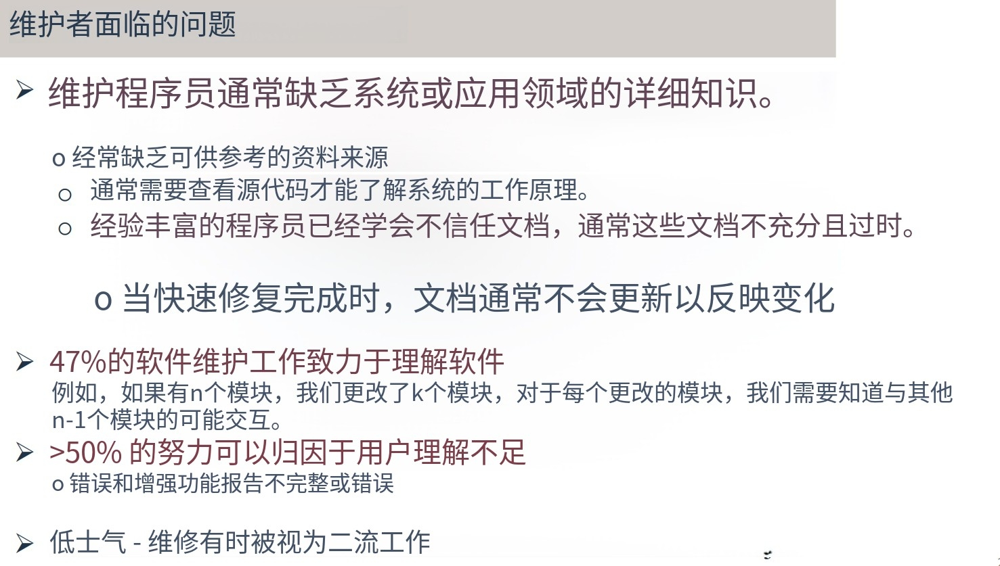

**软件维护的生命周期（SMLC）**

Changes are implemented in the software system by following a software maintenance process

通过遵循软件维护过程在软件系统中实施变更

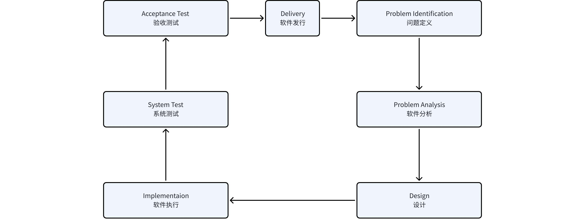

**软件的可维护性：软件可被修改的简单程度**
1. **理解程序**
1. 程序为改变
1. 编码风格

**额外的维护专有名词**

Ø Maintainability : The ease with which software can be modified

Ø Ripple effect : Changes in one software location can impact other components

Ø Impact analysis : Process of identifying how a change in terms of how a change will affect the rest of the system

Ø Traceability : The degree to which a relationship can be established between two or more software artifacts

Ø Legacy systems : A software system that is still in use, but the development team is no longer active

Ø 可维护性：修改软件的难易程度

Ø 涟漪效应：一个软件位置的变化会影响其他组件

Ø 影响分析：根据变化将如何影响系统的其余部分来确定变化的过程

Ø 可追溯性：两个或多个软件工件之间可以建立关系的程度

Ø 遗留系统：仍在使用但开发团队不再活跃的软件系统

**🌟 软件维护的主要活动（major main activities）**

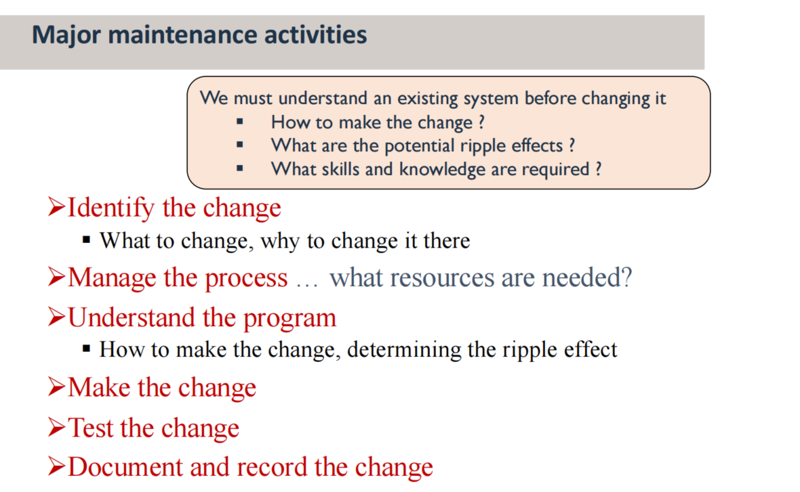

识别变化（是啥？为啥？）→ 管理过程（要啥资源？） → 理解程序（咋办？决定涟漪效应） → 做出改变 → 测试改变 → 文档记录 + 记录改变

**补充材料**
