# ST 讲义（四）V 模型四大测试

**ST 讲义（四）V 模型四大测试**

后面的章节很符合软件学院四大文科的特点：章节切分详细 + 记忆为主

因此，讲义（四）和 讲义（五）都会**基于 REVIEW 进行复习**，讲义仅供参考，大家复习还是得以 PPT 为主

不考的内容讲义只会写标题，不会写正文

讲义（四）会按照 V 模型的测试顺序进行复习，而讲义（五）会补充一系列测试的细节

**序、测试层级划分**

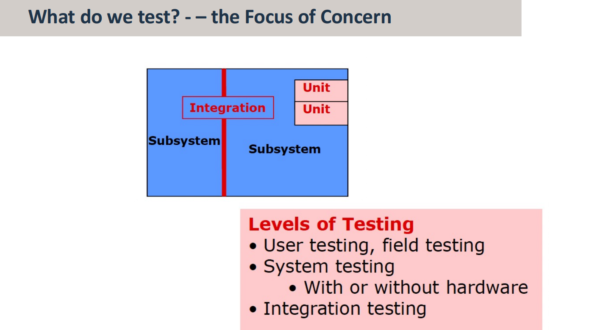

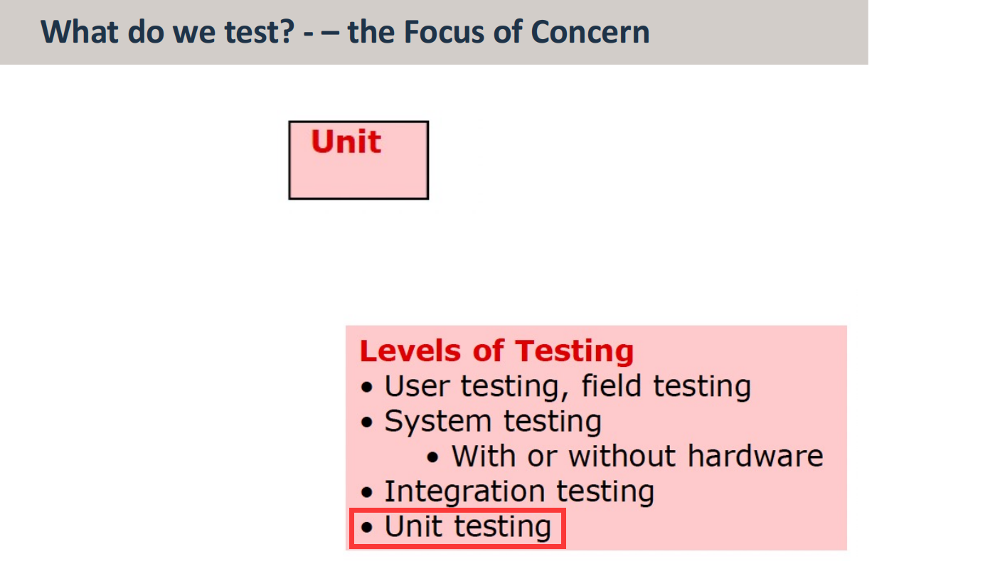

**Ch7 单元测试（白） Unit**

不管以后是否从事测开岗，单元测试都是必须要掌握的。

单元测试指的是针对可独立运行模块进行测试，关注程序内部的执行逻辑、内存占用、异常处理、数据 CRUD

单元测试的典型框架：XUnit

**🌟 什么是单元测试？**
- 单元测试主要是由**开发者**写的**白盒测试**，它被设计用于**验证小单元程序的功能**。
- Key Metaphor: I.C. Testing（关键隐喻：I.C. 测试/集成电路测试）
- 集成电路在整个电路被测试之前，会单独地测试模块的功能
- 定义关键词

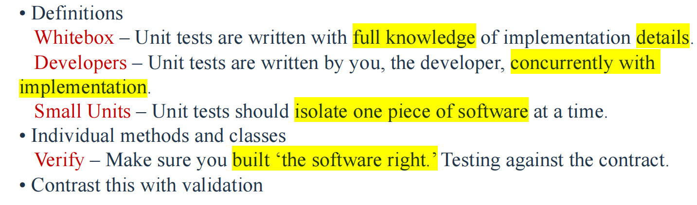
- **Whitebox**  白盒
- **Developers**  开发者
- **Small Units**  小单元
- **Verify**  验证（经典 Verification 和 Validation 的对比）

**单元测试的任务？**

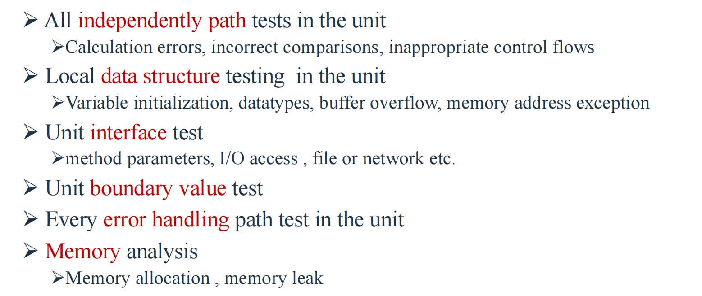

**🌟 单元测试的作用？**
- Helps  **localize errors**  （帮助定位错误）
- Failure indicates problem in the unit undet test（失败表示单元测试存在问题）
- Find errors  **early**（尽早发现错误）
- Unit tests are written during development, usually by developer（单元测试在开发过程中一般由开发人员编写）
- More expensive to fix defects found later by another team（修复其他团队后来发现的缺陷成本更高）
- Avoid  **unnecessary functionality**（避免不必要的功能）
- Write test first, only write enough code to get it working（先写测试，只写足够的代码让它工作）
- Improve  **code quality**（提高代码质量）
- Helps developer deliver working code （帮助开发者发布工作代码）
- Assure minimum quality of units before integration into system （在集成系统之前确保代码单元的最小质量）

**单元测试的流程？**

单元测试是软件开发中针对代码最小可测试单元（如函数、方法、类）的验证过程，其核心流程如下：

**1. 计划阶段**
- **确定测试范围**：明确需要测试的代码单元（如函数、类或模块）。
- **选择测试框架**：根据语言选择工具（如 Java 用 JUnit，Python 用 pytest，JavaScript 用 Jest）。
- **定义测试目标**：明确要验证的功能、边界条件、异常场景等。

**2. 编写测试用例**
- **覆盖三种场景**：
- **正常输入**：验证预期结果（如  add(2,3)  返回  5）。
- **异常输入**：测试错误处理（如传递空值或非法参数）。
- **边界条件**：测试极端值（如数组越界、零值、最大最小值）。
- **隔离依赖**：使用 Mock/Stub 技术模拟外部依赖（如数据库、API）。

**示例（Python/pytest）：**

| Python  def test_divide():     # 正常场景     assert divide(10, 2) == 5       # 异常场景（除数为零）     with pytest.raises(ValueError):                  divide(10, 0) |
|---|

**3. 执行测试**
- **运行测试套件**：通过命令行或 IDE 执行测试（如  pytest test_math.py）。
- **生成报告**：查看通过/失败的用例，分析代码覆盖率（使用工具如  coverage.py、JaCoCo）。

**4. 分析结果**
- **定位失败用例**：根据错误信息定位代码问题（如逻辑错误、未处理的异常）。
- **优化测试用例**：补充遗漏场景或修复测试逻辑。

**5. 修复与回归测试**
- **修改代码**：修复缺陷后重新运行相关测试。
- **回归验证**：确保修复未破坏其他功能（自动化工具可快速执行）。

**6. 自动化与持续集成（CI）**
- **集成到 CI/CD**：通过 Jenkins、GitHub Actions 等工具自动触发测试。
- **监控覆盖率**：设定覆盖率阈值（如 ≥80%），确保测试有效性。

**7. 维护测试用例**
- **同步代码变更**：当业务逻辑调整时，同步更新测试用例。
- **定期重构**：合并重复用例，提升测试代码可读性。

**流程图**

| Plain Text  计划 → 编写用例 → 执行测试 → 分析结果 → 修复问题 → 回归测试 → 自动化集成 → 持续维护 |
|---|

**关键原则**
- **FIRST 原则**：
- **Fast**（快速）：测试应秒级完成。
- **Isolated**（隔离）：用例间无依赖。
- **Repeatable**（可重复）：结果稳定不随机。
- **Self-Validating**（自验证）：自动判断通过/失败。
- **Timely**（及时）：测试与代码同步编写。

FIRST 快歌冲演技

通过规范流程，单元测试可显著提升代码质量，降低维护成本。

**单元测试的组成？**

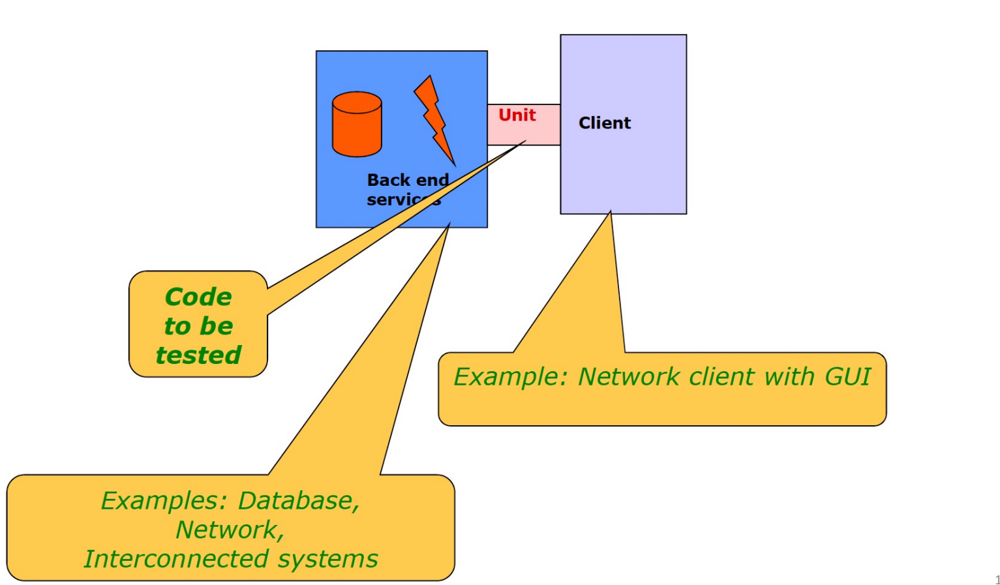

在单元测试中，**STUB**（桩单元）、**UNIT**（被测代码）和**DRIVER**（驱动模块）是构成测试环境的核心组件，其作用如下：

**1. STUB（桩单元）**

用于**替代被测代码依赖的下层模块**，模拟其行为并返回预设结果，以实现被测代码的**逻辑隔离**。
- **特点**：
- 模拟被调用函数的功能，返回硬编码的预期值。
- 当依赖的模块未完成或需要特定场景模拟时使用（如异常处理、边界条件）。
- **示例**：若被测函数调用未实现的子函数，需编写桩函数模拟返回值（如返回固定值或异常）。

**2. UNIT（被测代码）**

即需验证的**最小功能单元**（如函数、类），需覆盖其所有逻辑分支和边界条件。
- **测试重点**：
- **功能性**：输入输出是否符合预期。
- **健壮性**：异常输入或环境下的行为（如空指针、越界）。
- **性能**：执行时间和资源占用（特殊场景需针对性测试）。

**3. DRIVER（驱动模块）**

作为**被测代码的调用入口**，负责传递测试输入、触发执行并验证结果。
- **功能**：
- 接收测试用例的输入和预期输出。
- 调用被测单元并传递参数。
- 比较实际输出与预期结果，生成测试报告。
- **适用场景**：当被测代码无法独立运行（如非顶层模块）时，需驱动模块模拟主程序逻辑。

**4. 测试支持代码的替代关系**
- **STUB**和**DRIVER**共同构成**测试支持代码**，替代真实依赖以实现隔离测试：
- **STUB**替代下层依赖（如数据库、外部接口），避免外部不确定性。
- **DRIVER**替代上层调用者，控制被测代码的执行流程。
- **协作示例**：  当测试函数A时，若其依赖函数B未完成，需用STUB模拟B的返回值；同时通过DRIVER调用A，传入不同参数验证逻辑分支。

**5. 何时使用这些组件？**
- **需编写STUB**：依赖模块未测试、需模拟复杂场景（如网络超时）。
- **需编写DRIVER**：被测代码非独立可执行（如中间层函数）。
- **无需STUB/DRIVER**：被测代码为最底层函数（无依赖）或依赖已通过测试且稳定。

通过合理设计这三者，可实现**高内聚、低耦合的单元测试**，确保被测代码的独立性和可重复性。

**TDD（测试驱动开发）**

详情请搜索关键词 TDD：[ST 讲义（一）测试介绍](https://a1npn29y3xu.feishu.cn/wiki/ARw3wQyggijXsnk5Z1dc5K3Cnve?from=from_copylink)

**XUnit（自动化测试框架）【2025 PPT 20-34】**

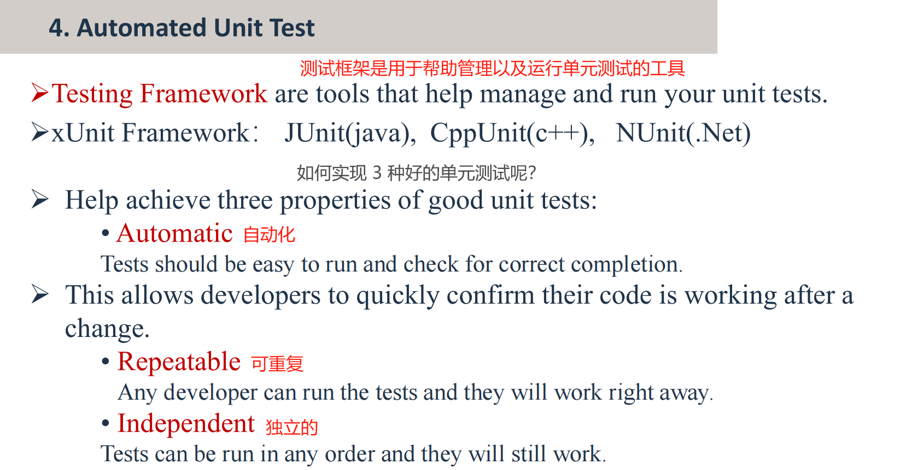

具体到特定语言的 XUnit，感兴趣的同学多多实操即可。

**Ch8 集成测试（黑 + 白） Integration**

**考试范围 2025 PPT 1 - 26**

**请注意，集成测试不考 Call-Graph（调用图），不考 MM based Integration**

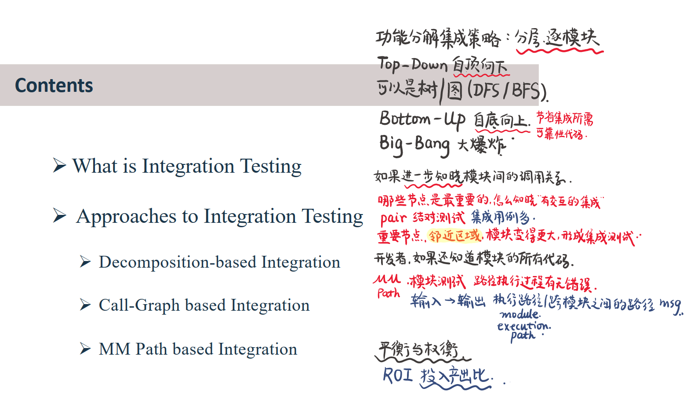

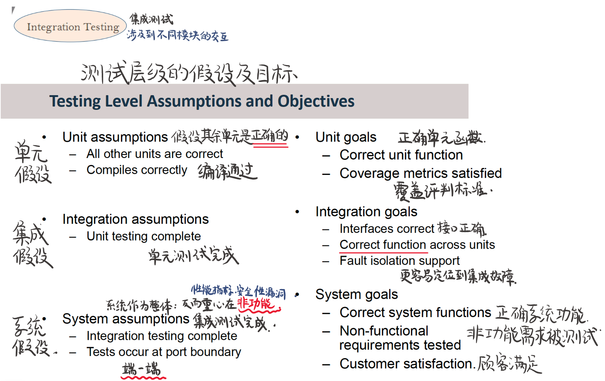

**什么是集成测试？**

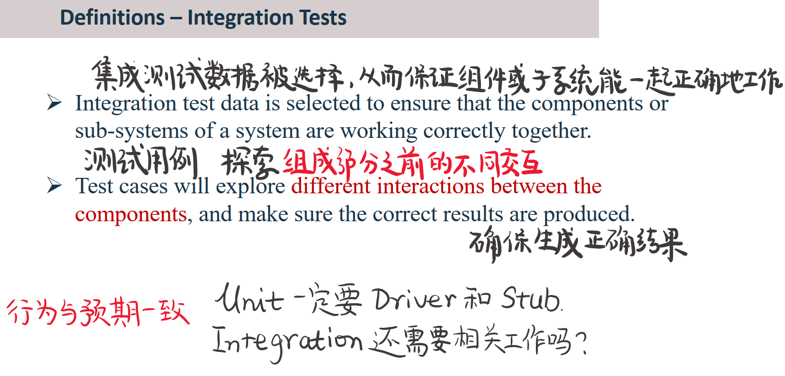

**🌟 Drivers and Stubs 驱动模块和桩单元**

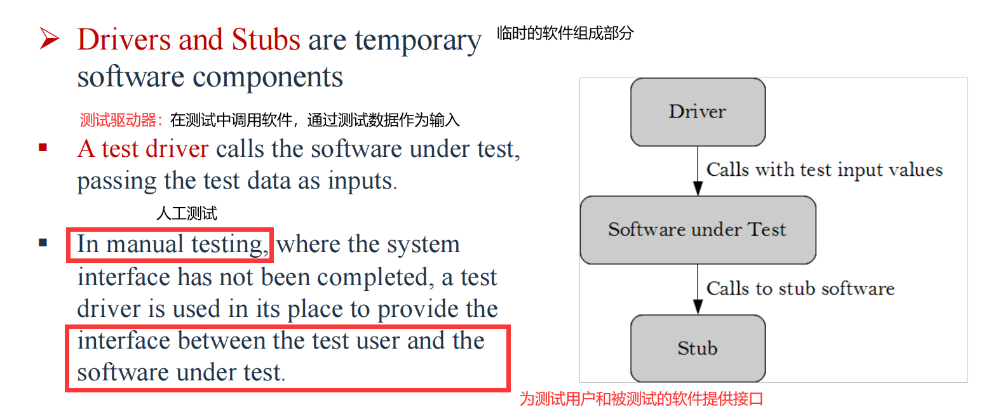

Ø Drivers

§ Drivers can have varying levels of sophistication.

§ It could be  **hard-coded**  to run through a fixed series of input values, read data from  **a prepared file**, contain a suitable  **random number generator**  etc.

Ø 驱动程序

§ 驱动程序可以有不同程度的复杂程度。

§ 它可以被**硬编码**以运行一系列固定的输入值，从**准备好的文件**中读取数据，包含合适的**随机数生成器**等。

Ø Stubs

§ A stub is a  **temporary or dummy software**  that is required by the software under test to operate properly.

§ This is a  **throw-away version**  to allow testing to take place.

§ It will provide a  **fixed or limited set of values**  to be passed to the software under test.

Ø 存根

§ 存根是被测软件正常运行所需的**临时或虚拟软件**。

§ 这是一个**一次性版本**，允许进行测试。

§ 它将提供一组**固定或有限的值**以传递给被测软件。

**基于功能分解的集成测试**

**方法集**

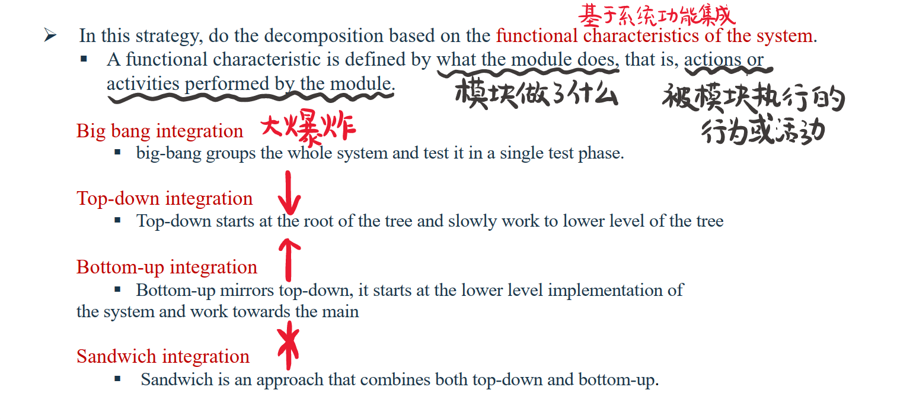

**Big bang**

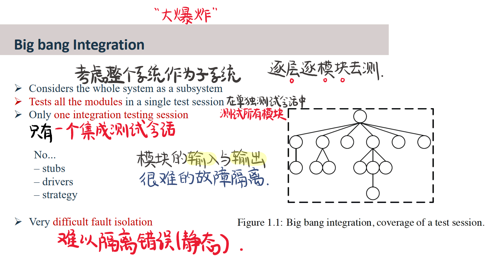

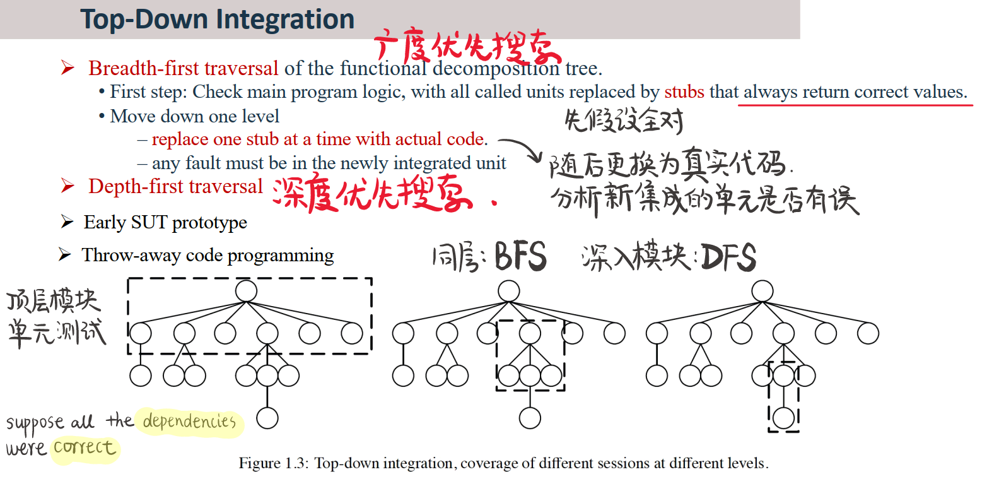

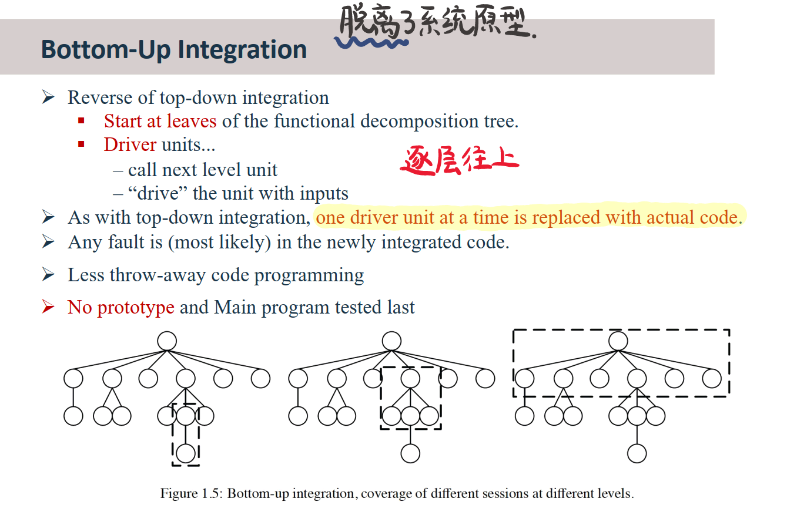

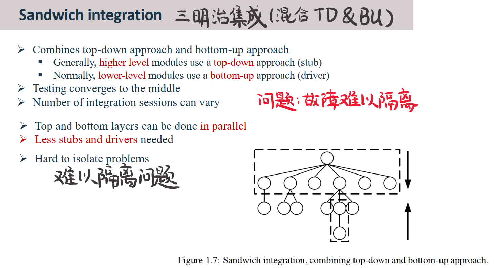

**对比 Top-Down Bottom-Up Sandwich**

**[集成测试方法的对比总结表格.md]**

**🌟 期末例题：NextDate Program**

**Python 实现**

| Python  NextDate Program（Python 简化版）  def is_leap_year(year):     return (year % 4 == 0 and year % 100 != 0) or (year % 400 == 0)   def days_in_month(month, year):     days = [-1, 31, 28 + is_leap_year(year), 31, 30, 31, 30, 31, 31, 30, 31, 30, 31]     return days[month]   def next_date(year, month, day):     day += 1     if day > days_in_month(month, year):         day = 1         month += 1         if month > 12:             month = 1             year += 1     return year, month, day   def print_date(year, month, day):     print(f"{year} {month:02d} {day:02d}")           def is_valid(year, month, day):     return (1812 <= year <= 2012) or not (1 <= month <= 12) or not (1 <= day <= days_in_month(month, year))   def main():     year, month, day = map(int, input().split()) # get_date(today)     print(f"{year} {month:02d} {day:02d}") # print_date(today)     if not is_valid(year, month, day):         print("Invalid")     else:         year, month, day = next_date(year, month, day) # tomorrow = next_date(today)         print_date(year, month, day) # print_date(tomorrow)   if __name__ == "__main__":          main() |
|---|

**集成测试**

**BIGBANG**

编译所有的模块，并且测试整一个系统

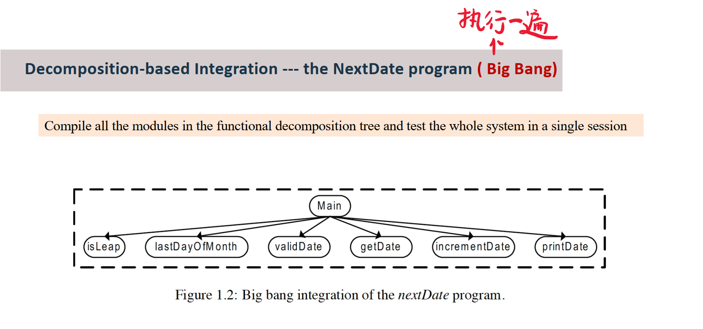

**自顶向下**

从 Main 方法开始测试，然后逐个桩单元进行测试。

我们必须构建存根，使其向真实模块返回正确的值并与测试用例兼容。

| Python  def increment_date(year, month, day):     if year == 1999 and month == 12 and day == 31:         year += 1         month = 1         day = 1     elif year == 2000 and month == 2 and day == 28:         day += 1     elif year == 2000 and month == 2 and day == 29:         month += 1         day = 1          return year, month, day # 先面向结果编程，然后再替换成真实方法，不会直接调用 main 函数 |
|---|

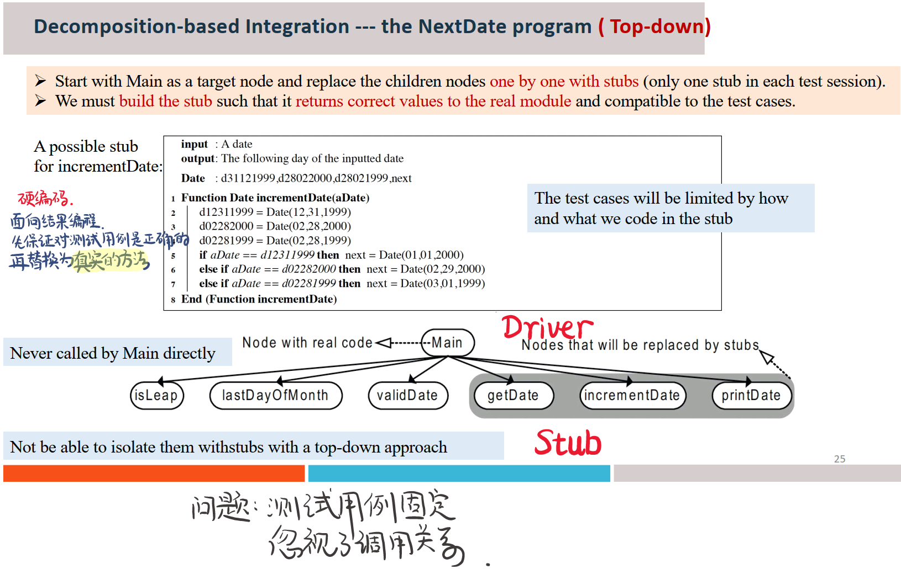

**自底向上**

| Python  def test_is_leap_year():     assert is_leap_year(1900) == False     assert is_leap_year(1999) == False     assert is_leap_year(2000) == True          assert is_leap_year(2004) == True |
|---|

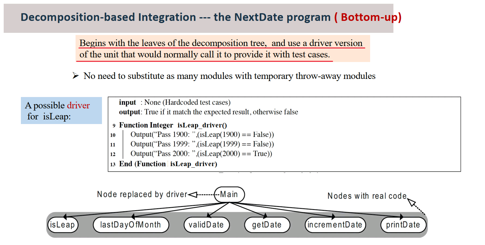

**三明治测试**

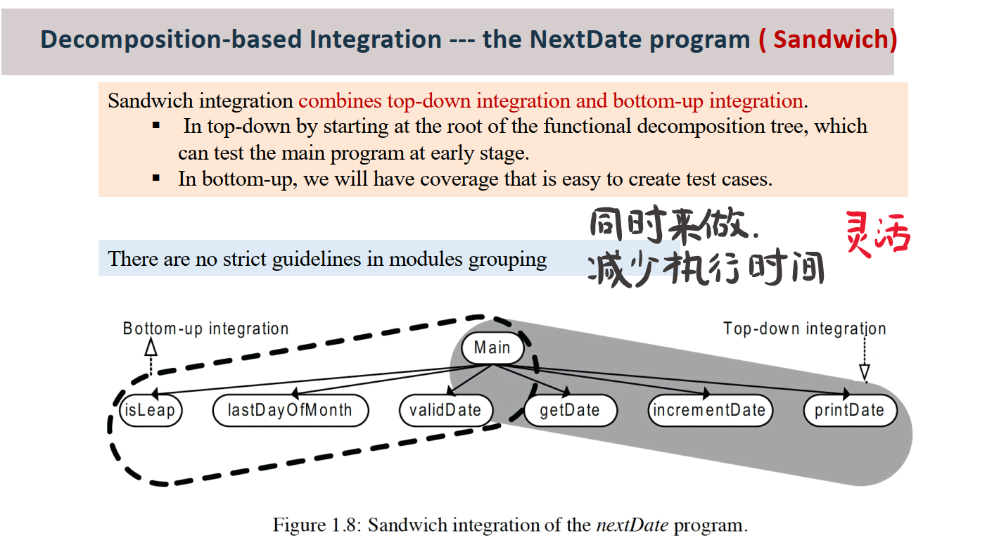

**优势和不足**

| 优势 | Intuitively clear 清晰直观 "build" with proven components 使用经过验证的组件进行“构建” Fault isolation varies with the number of units being Integrated 故障隔离随着被集成的单元数量而变化 |
|---|---|
| 不足 | some branches in a functional decomposition may not correspond with actual interfaces. 函数分解中的某些分支可能与实际接口不对应 stub and driver development can be extensive 每次加一个模块，就要加 stub 和 driver，消耗大 |

**Ch9 系统测试（黑） System**

**什么是系统测试？**

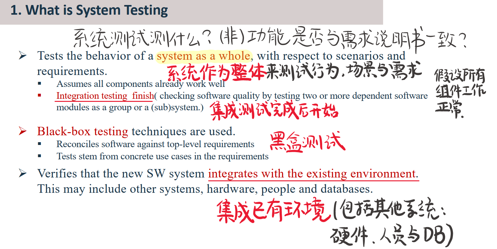

使用了**黑盒测试**技术

§ Reconciles software against top-level requirements

§ Tests stem from concrete use cases in the requirements

§ 根据顶级要求协调软件

§ 测试源于需求中的具体用例

**系统测试的类型**
- 按照测试的目的做区分，而不是它的范围或者机制（mechanism）
- 功能测试：确保功能需求符合预期
- 非功能测试：确保非功能需求符合预期
- 回归测试

**🌟 功能测试**

**定义**

测试的默认假设
- 功能测试验证软件的行为是否符合预期
- 它也包括了测试**坏的输入**，去校验**隐含假设（implicit assumptions）**
- 例：即使给了一个离谱的输入，程序也应该做出合理的回复
- 削减所有级别的测试，但**重在单元测试**
- 系统测试使用的接口：用户接口、网络接口、专用硬件接口等

**策略**

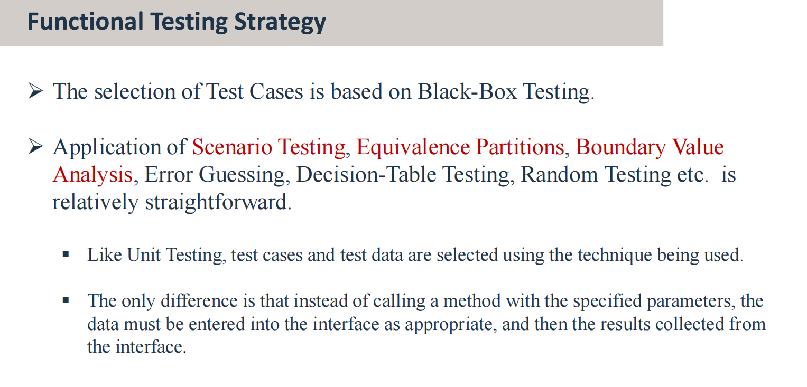

基于黑盒测试（等价类划分、边界值分析、场景测试、错误估计、决策表测试、随机测试等）=> 直接

类似单元测试，测试用例和测试数据都使用正在使用的技术进行选择。

唯一不同的是，不是调用指定参数的方法，而是要**视情况将数据输入接口，然后从接口收集结果**。

**非功能测试**

**定义**

测试软件的质量 "-ilities"

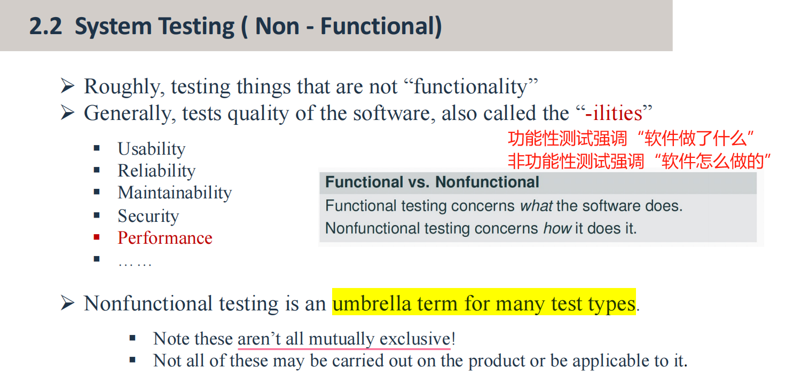

**具体内容【2025 PPT 8 - 11】**

**🌟 回归测试**

Making sure that code changes haven’t broken existing functionality, performance, security, etc.（确保代码更改没有破坏现有功能、性能、安全性等。）

回归测试的必要性是：无论是修复过往的 BUG 还是新增某个特性，引入新 BUG 是很常见的。

在实际应用中，这意味着在代码发生变更以后**要重新跑测试用例**。

With good  **test automation**  and good  **unit/integration/system/**etc. tests. This is literally running tests again after a change.

通过良好的**测试自动化**和良好的**单元/集成/系统**/等测试。这实际上是在更改后再次运行测试。

**测试自动化【2025 PPT 13 - 17】**

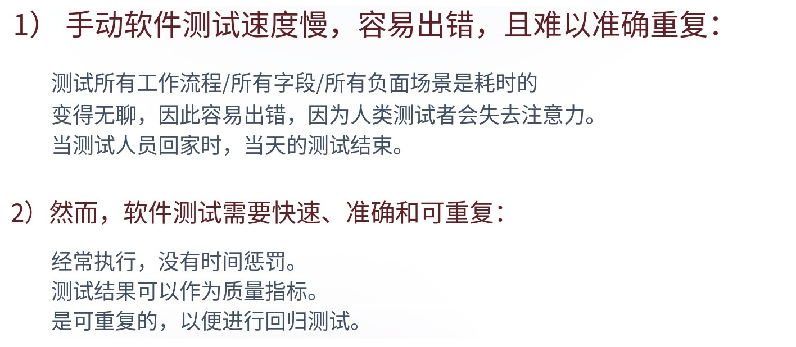

**🌟 测试自动化的优缺点**

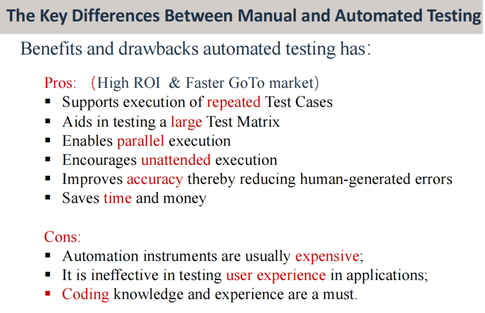

**优点**
- **高投资回报率（ROI） & 加快产品上市速度**
- 支持重复测试用例的执行
- 支持大规模测试矩阵的覆盖测试
- 支持并行执行（如多环境同步测试）
- 支持无人值守执行（自动化脚本可定时运行）
- 提高准确性，减少人为错误
- 节省时间和成本

**缺点**
- 自动化工具通常成本高昂；
- 无法有效评估应用的用户体验（如界面友好性、交互流畅度）；
- 必须掌握编程知识及相关经验。

**注**：
- **术语对照**：
- *Test Matrix*  → 测试矩阵（指多环境、多配置组合的测试场景）。
- *Unattended Execution*  → 无人值守执行（无需人工干预的自动化运行）。
- **适用场景**：
- 自动化测试适用于回归测试、负载测试等重复性任务，但需权衡初期投入与长期收益。

**🌟 性能测试**

**定义**

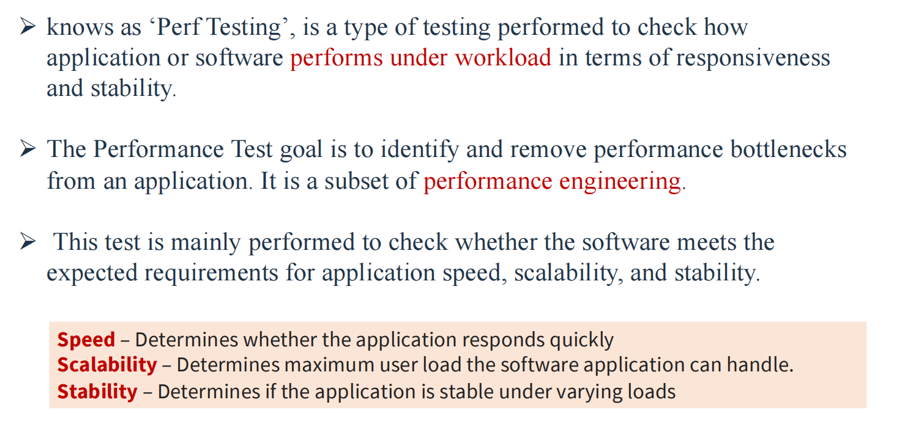

用于检查应用程序或软件**在工作负载下**在响应性和稳定性方面表现的测试类型。

性能测试的目标是从应用中识别并且移除性能瓶颈。这是**性能工程的子集。**

这一种测试主要用于检查软件的速度、可扩展性和稳定性是否符合预期需求。

**速度：**应用的响应快不快

**可扩展性：**软件应用能处理的最大用户负载

**稳定性：**在不同的负载下应用是否稳定

**常见的性能问题**

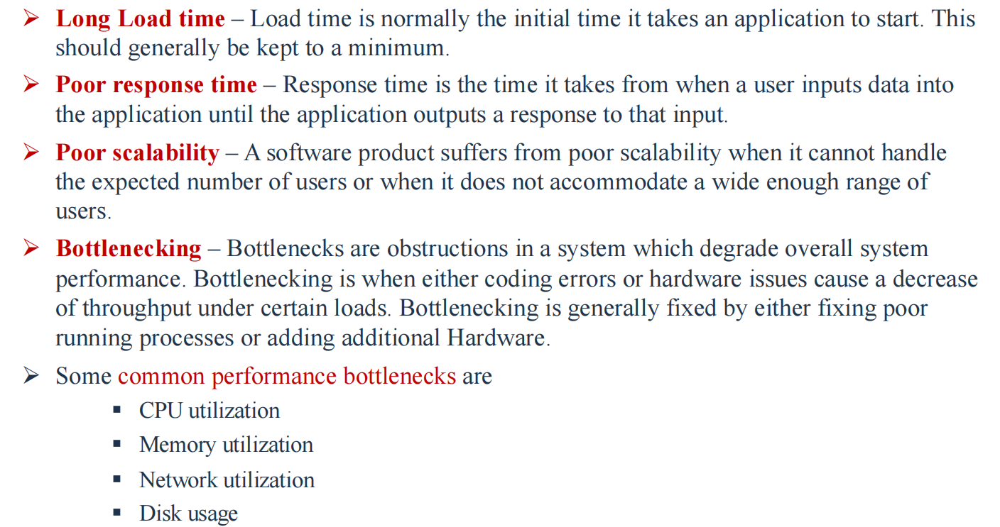

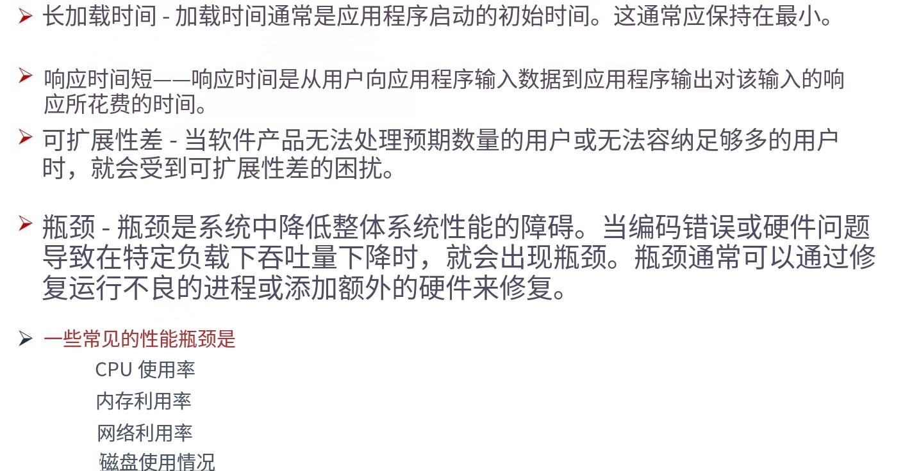

**性能测试指标：监控的参数**

**Processor Usage –** an amount of time processor spends executing non-idle threads.

处理器使用率：处理器用于执行非空闲线程的时间量

**Memory use** **–** amount of physical memory available to processes on a computer.

内存利用率：计算机上进程的物理可用存储器量

**Disk time –** amount of time disk is busy executing a read or write request.

磁盘时间：磁盘忙于执行读或写请求的时间量

**Bandwidth –** shows the bits per second used by a network interface.

带宽：展示了一个网络接口每秒钟使用的比特位

**Response time** **–** time from when a user enters a request until the first character of the response is received.

响应时间：从用户输入请求到收到响应的第一个字符的时间。

**Throughput** **–** rate a computer or network receives requests per second.

吞吐量：每秒钟电脑或者网络获取请求的比率

**Hits per second** **–** the no. of hits on a web server during each second of a load test.

每秒命中数：在负载测试的每一秒期间 Web服务器 上的命中数

§ …… 其他参数

**性能测试样例（基线测试 ）**

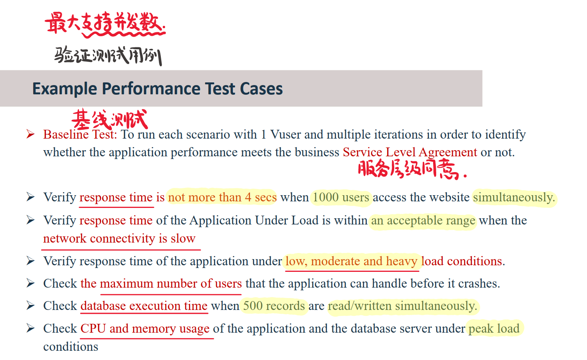

以下是  **基线测试（Baseline Test）**  的翻译与说明：

**定义**
- 通过  **1个虚拟用户（Vuser）**  执行多轮次场景，验证应用程序性能是否符合业务  **服务级别协议（SLA）**。

**测试目标**
1. **验证响应时间**
- 当  **1000名用户同时访问网站**  时，响应时间不超过4秒。
- 在网络连接缓慢时，验证  **负载下应用程序的响应时间**  是否在可接受范围内。
- 在  **低、中、高负载条件**  下，检查应用程序的响应时间。
1. **验证系统极限**
- 检查应用程序在崩溃前能处理的最大用户数。
- 验证  **同时读写500条记录时**  的数据库执行时间。
1. **资源监控**
- 在峰值负载条件下，检查应用程序和数据库服务器的  **CPU及内存使用率**。

**注**：
- **基线测试的核心作用**：
- 建立性能基准，用于后续压力测试、负载测试的对比参照。
- 确保系统在基础场景中满足业务 SLA 要求（如响应时间、资源占用）。
- **关键指标**：
- *SLA*：服务级别协议（例如响应时间、系统可用性等承诺）。
- *Vuser*：虚拟用户（模拟真实用户行为的测试工具配置）。
- **适用场景**：
- 上线前性能验收测试、系统优化后的基准验证。

此翻译可直接用于技术文档或测试报告，重点保留了原始技术细节和测试逻辑。

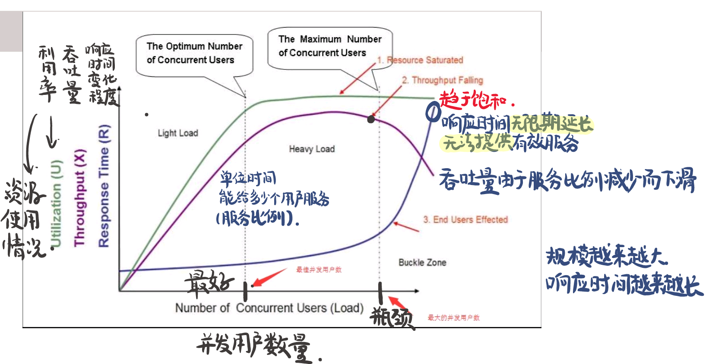

**性能测试的类型**

| 负载测试 | Checks the application’s ability to perform under anticipated user loads. The objective is to identify  **performance bottlenecks**  before the software application goes live. 检查应用程序在预期用户负载下执行的能力。 目标是在软件应用程序上线之前识别**性能瓶颈**。 |
|---|---|
| 压力测试 | Involves testing an application under extreme workloads to see how it handles high traffic or data processing. The objective is to identify the  **breaking point**  of an application. 涉及在极端工作负载下测试应用程序，以了解它如何处理高流量或数据处理。目标是确定应用程序的**崩溃点**。 |
| 持久测试 | To make sure the software can handle the expected load over a  **long period of time**. 确保软件能够**长时间处理预期负载**。 |
| 尖锋测试 | Tests the software’s reaction to  **sudden large spikes**  in the load generated by users. 测试软件对用户产生的**突然大负载峰值**的反应。 |
| 容量测试 | Under Volume Testing  **large no. of. Data**  is populated in a database and the overall software system’s behavior is monitored. The objective is to check software application’s performance under varying  **database volumes**. 在容量测试下，**大量数据**被填充到数据库中，并监控整个软件系统的行为。 目标是检查软件应用程序在不同**数据库卷**下的性能。 |

**🌟 性能测试 vs 负载测试 vs 压力测试 vs 容量测试**

性能测试是负载测试和压力测试的**父集**

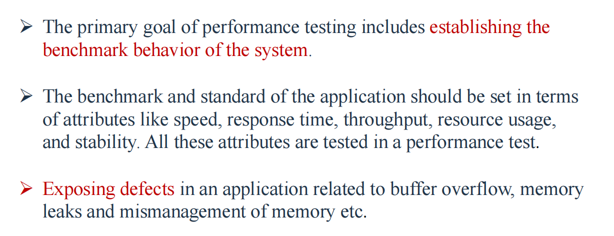

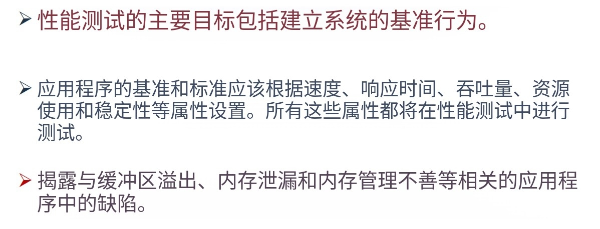

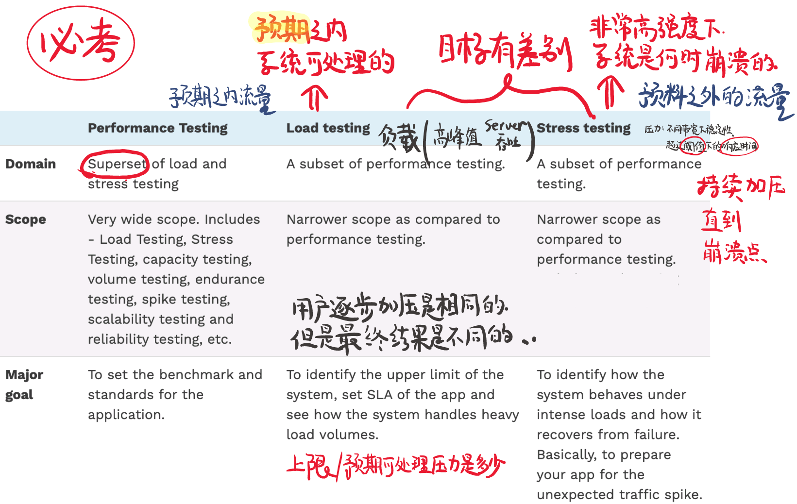

|  | **性能测试** | **负载测试** | **压力测试** |
|---|---|---|---|
| 领域 | 父集 | 子集 | 子集 |
| 范围 | 广泛（负载、压力、容量、持续、尖峰、可扩展性、可靠性） | 更窄 | 更窄 |
| 目标 | 为应用设计 benchmark 规则 以及标准 | 要确定系统的上限，可设置应用程序的 SLA 并查看系统如何处理重负载卷。 | 确定系统在负载不足时的行为方式以及它如何从故障中恢复。基本上，让您的应用程序为意外的流量高峰做好准备。 |
| 负载极限 | 都在突破阈值以下和突破阈值以上 | 直到崩溃的为止 | 高于崩溃阈值 |
| 考察属性 | 项目使用、可靠性、可扩展性、资源使用、响应时间、吞吐量、速度等 | 峰值性能、服务器吞吐量、各种负载水平下的响应时间**（低于崩溃的阈值），**H/W 环境的充足性 | 超出带宽容量、响应时间**（超过崩溃阈值）**等的稳定性。 |
| 发现的问题 | 所有性能问题，包括运行时膨胀与速度、延迟、吞吐量等有关的问题等。负载平衡问题、带宽问题、系统容量过载、数据吞吐量问题等。 | 负载平衡问题、带宽问题、系统容量过载、数据吞吐量问题等。 | 安全漏洞，存在腐败问题，在过载、缓慢、内存泄漏等情况下。 |

|  | **容量测试** | **负载测试** | **压力测试** |
|---|---|---|---|
| 领域 | 大量数据 | 大量用户 | 过多用户、过多数据，towards 系统崩溃 |

In volume testing, it is checked as to how the system behaves against a certain volume of data.

在容量测试中，检查系统对一定数据量的行为。

Thus,  **the databases are stuffed with their maximum capacity**  and their performance levels, like response time and server throughput, are monitored.

因此，数据库**充满了最大容量**，并且监控了响应时间和服务器吞吐量等**性能水平**。

**性能测试步骤**

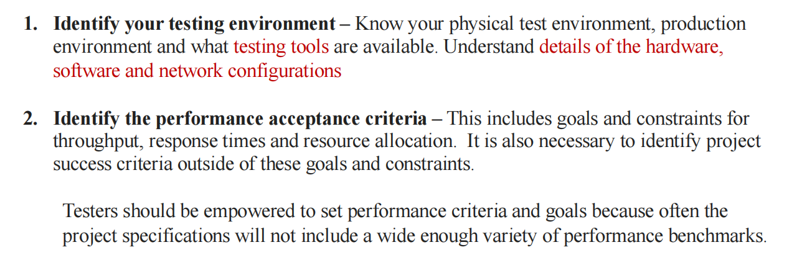

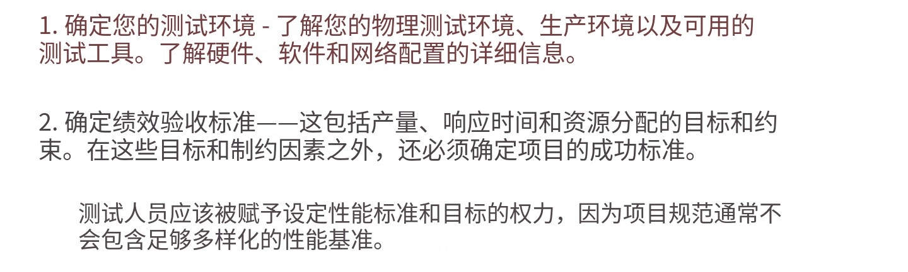

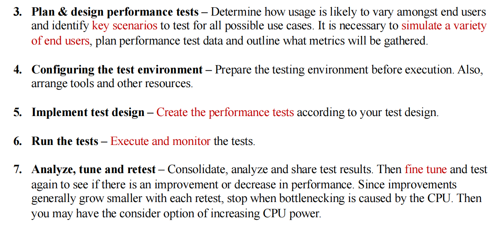

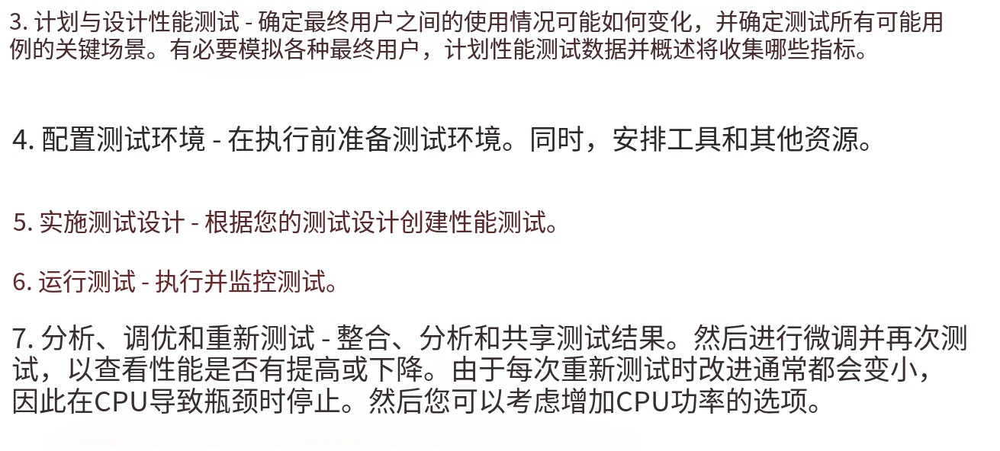

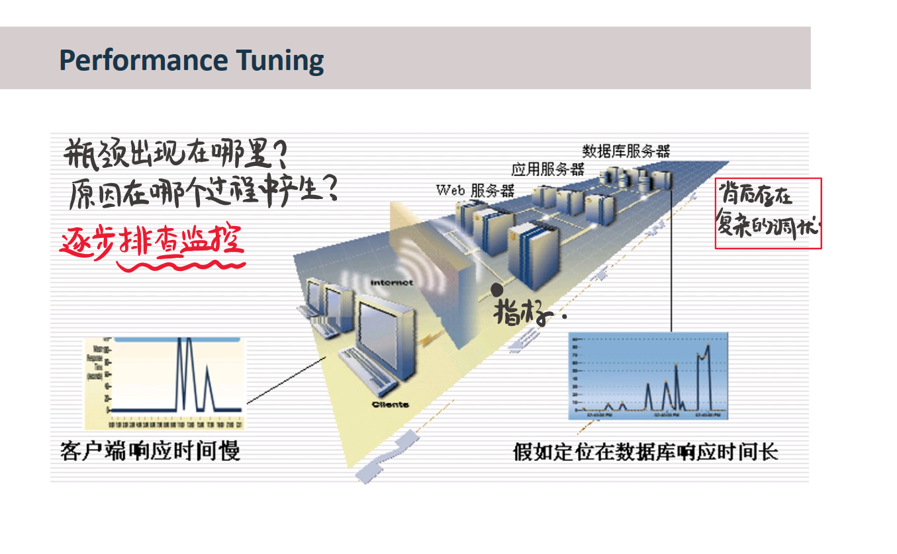

**自动化性能测试**

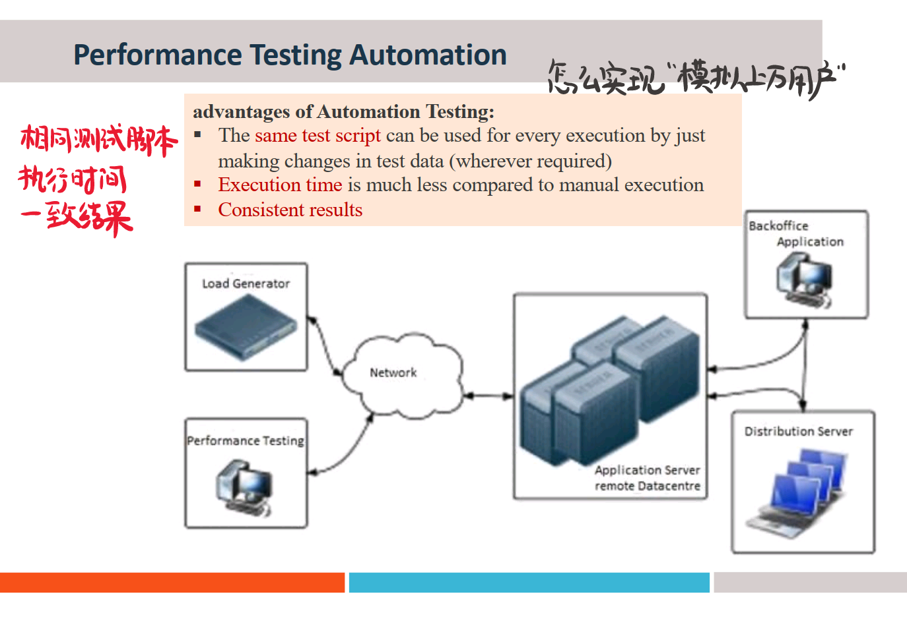

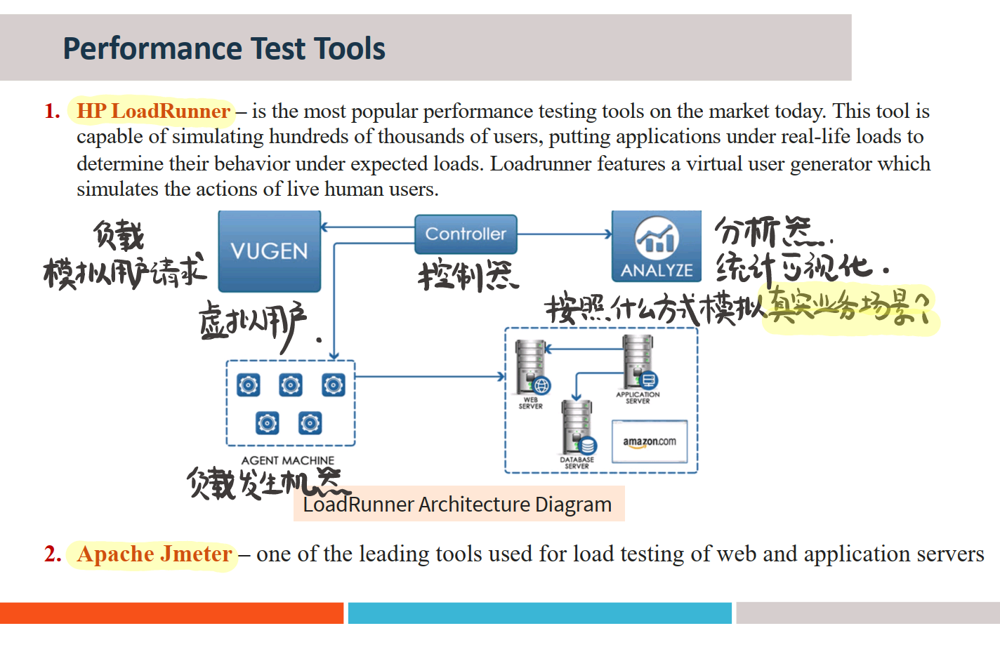

**Ch11 验收测试（黑） Acceptance**

**🌟 什么是验收测试？**
- 验收测试是**软件测试的最终阶段**，此时系统被测试去检验**是否符合其业务要求。**
- 验收测试通常由客户或者终端用户实施，目的是为了检验产品是否符合发行标准。
- 时间点在系统测试之后，最终发布之前
- **使用黑盒测试方法**

**验收测试的组成部分**

***Software Configuration Review 软件配置审查***

通常的软件配置项包括：

① 主要的软件程序配置，通常包括源代码、可执行程序、软件安装以及配置脚本，核心的测试脚本或者测试程序

② 主要的技术文档

③ 主要的开发管理文档

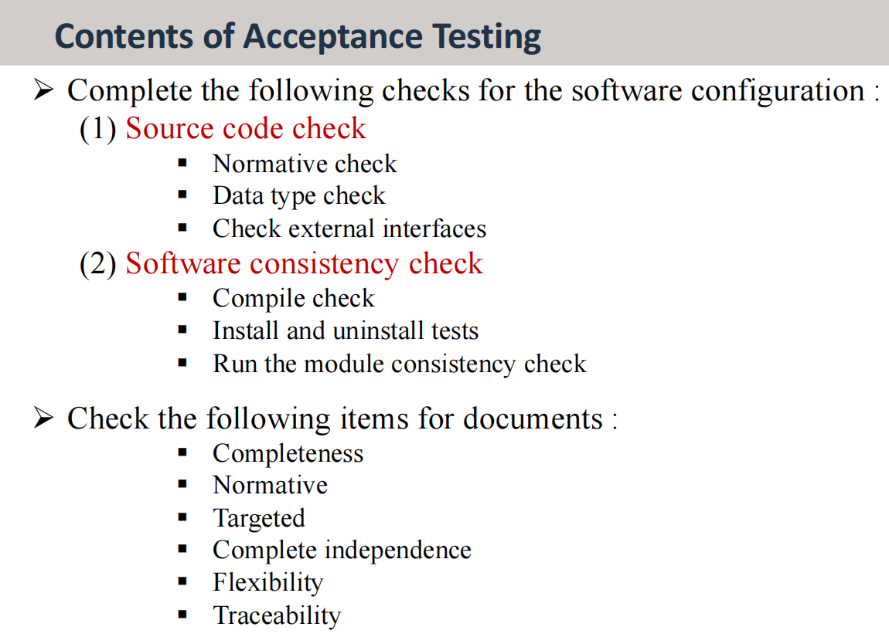

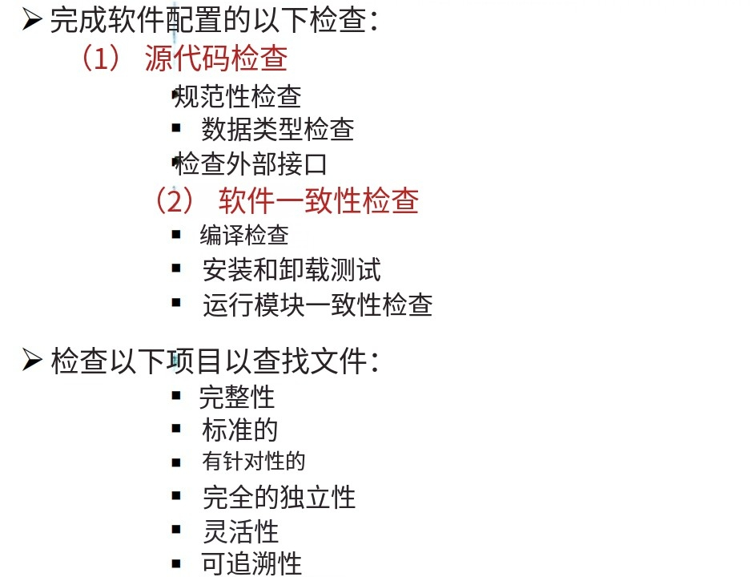

***Software Validity Testing 软件有效性测试***

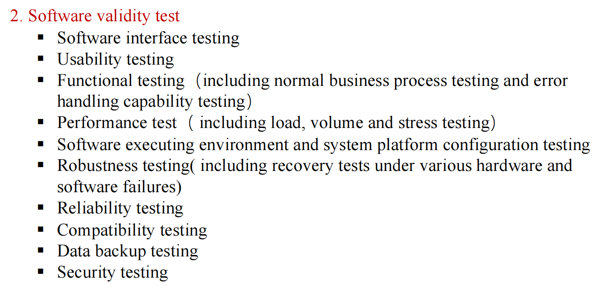

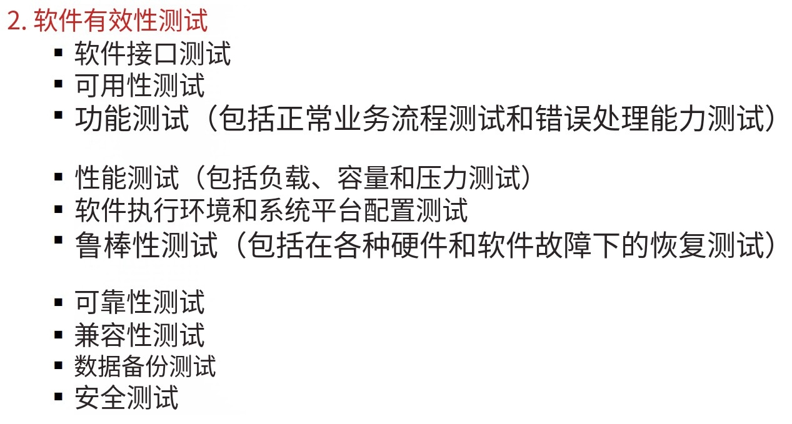

**验收测试的内容**

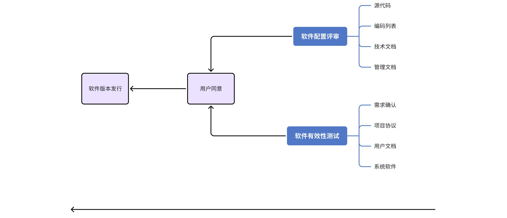

**验收测试注意事项【2025 PPT 8 - 9】**

**安装测试 【2025 PPT 10 - 14】**

**Alpha 测试 和 Beta 测试**

他们都是验收测试的类型，都是客户确认方法（Customer Validation methodologies）。这两种测试方法都可以在产品上线的时候帮忙建立信心，从而在市场的产品上取得成功。

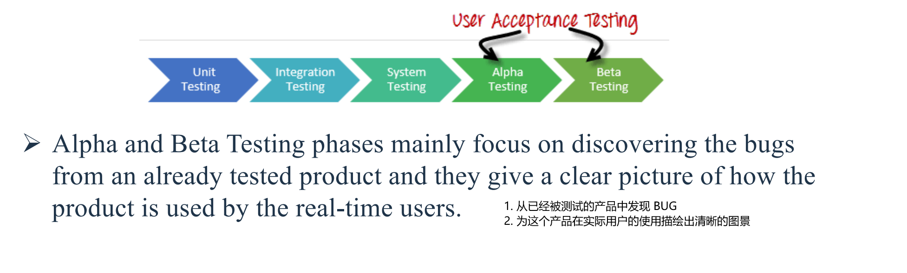

**Alpha 测试**

验收测试，开发者视角。

要么开发者内部进行测试，要么给潜在的终端用户进行测试，不对外开放测试渠道。

**Beta 测试**

验收测试，在客户或者终端用户的视角进行测试。一般来说会对外开放测试渠道。

It is performed after alpha testing and in the real-world environment without the presence or control of developers. / 它是在公司内测后在真实环境中执行的，没有开发人员的存在或控制。

**对比表格**

| Alpha Testing | Beta Testing |
|---|---|
| 基本概念方面 |  |
| 客户确认的第一步 | 客户确认的第二步 |
| 开发者视角：测试环境 | 真实的市场环境 |
| 活动可被控制 | 活动不可被控制 |
| Alpha Release | Beta Release |
| Issues / Bugs 直接在被定义的工具上打日志，被开发者高优先级地修复 | Issues / Bugs 从真实的用户中以建议或者反馈的形式提出，它们将会被考虑成为未来发布版本的改进和优化 |
| 参与人员方面 |  |
| 技术专家、掌握好的领域知识专业测试人员、项目主要专家 | 目标受众终端用户 |
| 测试时长方面 |  |
| 执行了许多测试周期 | 只执行了 1 或 2 个测试周期 |
| 奖励方面 |  |
| 对参与者没有特别的奖励 | 参与者有特别的奖励 |

**🌟 必考：软件测试四大阶段的对比**

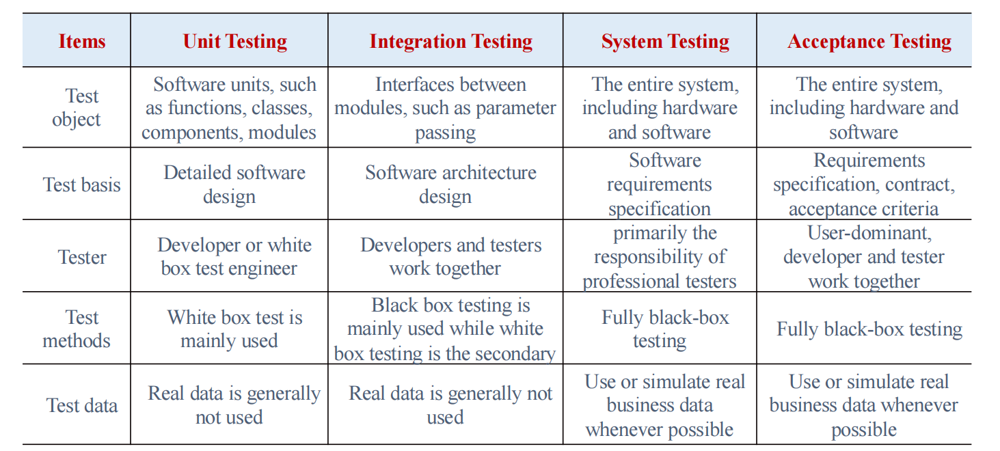

|  | 单元测试 | 集成测试 | 系统测试 | 验收测试 |
|---|---|---|---|---|
| 测试对象 | 软件单元（函数、类、组件、模块） | 模块之间的接口，比如说参数传递 | 整一个系统，包括硬件和软件 | 整一个系统，包括硬件和软件 |
| 测试基础 | 细致的软件设计 | 软件架构设计 | 软件需求确认 | 需求确认，协议，验收协议 |
| 测试人员 | 开发人员或白盒测试工程师 | 开发人员和一起工作的测试人员 | 主要是专业测试人员 | 用户主导，开发者和测试人员共同工作 |
| 测试方法 | 白 1 黑 2 | 黑 1 白 2 | 黑 | 黑 |
| 测试数据 | 真实数据一般不使用 | 真实数据**一般不使用** | **尽可能****使用**或者模拟真实业务数据 | **尽可能使用**或者模拟真实业务数据 |

Use or simulate real business data  **whenever possible**
