# 群体智能大作业题目-2024下学期

**本 科 生 课 程 论 文**

**(2024-2025学年第一学期)**

**群体智能课程论文报告**

**本科生：于博宇**

**提交日期：25年1月17日                    本科生签名：于博宇**

<table>
<tr><td>**学    号**</td><td>**202330453151**</td><td>**学    院**</td><td>**计算机科学与工程学院**</td></tr>
<tr><td>**班    级**</td><td>**23计算机科学与技术1班**</td><td>**课程名称**</td><td>**群体智能**</td></tr>
<tr><td>**课程编号**</td><td>**\**</td><td>**任课教师**</td><td>**陈伟能**</td></tr>
<tr><td>**教师评语：**</td></tr>
<tr><td>**成绩评定：   分          任课教师签名：                 年  月  日**</td></tr>
</table>

**目录页**

基于多智能体的自动驾驶车辆路径规划问题的研究（团队）       1基于多智能体的自动驾驶车辆路径规划问题的研究（个人）    16

粒子群PSO优化算法解决KroA100研究报告                  18

粒子群优化算法的改进策略研究的阅读报告                                   25

DQN算法进行编程实现2048游戏的研究报告                 27

多智能体强化学习与大语言模型Agent的阅读报告                        32

**基于多智能体的自动驾驶车辆路径规划问题的研究（团队）**

左锦宁 于博宇

**摘要**

本报告基于多智能体的自动驾驶车辆路径规划问题展开研究。通过车车协同和车路协同，自动驾驶车辆能够动态调整行驶路径，从而优化交通路网的吞吐量和减少车辆平均通行时间。我们使用改进的CityFlow模拟器，结合多智能体强化学习（MA2C）算法，对济南市东风片区的3x4区域和杭州市古荡区的4x4区域的路网进行了仿真实验。实验结果表明，所采用的方法能够有效减少车辆的平均通行时间，并提升路网的通行效率。报告包括背景理解、算法设计、实验结果及其分析，并总结了我们这个方法的优势和不足。

**引言**

随着城市化进程的加快和机动车保有量的持续增长，传统的交通管理策略已难以满足日益增长的交通需求。交通拥堵不仅影响人们的出行效率，还会带来环境污染、能源浪费等一系列问题。2020年2月，国家发展改革委等十一部委联合印发的《智能汽车创新发展战略》为我国智能汽车发展指明了方向，标志着汽车产业正在从传统的机械产品向智能化产品转变。在此背景下，自动驾驶技术的发展为解决交通问题提供了新的思路。然而，目前自动驾驶的研究主要集中在单车智能层面，这种方式存在感知范围有限、决策信息不完整等局限性。要真正发挥自动驾驶的优势，需要实现车车协同和车路协同，使车辆能够获取更大范围的交通信息，从而做出更优的决策。特别地，交通信号控制作为城市交通管理的重要手段，其效率直接影响着整个交通网络的运行状况。传统的固定时序信号控制方式无法根据实时交通状况做出动态调整，往往导致不必要的延误。因此，本课程设计针对这一问题，使用了基于多智能体强化学习的交通信号优化方案。本设计采用多智能体优势演员评论家算法（Multi-Agent Advantage Actor-Critic, MA2C）和重路由技术[1]结合最大吞吐量控制策略[2]（Max Throughput Control strategy, MTC）的方法。MA2C能够实现多个智能体之间的协同学习，通过与环境交互来优化其策略。MTC则通过贪心策略来最大化单次通行的车辆数。

本课程设计的核心工作集中在算法的设计与实现上，主要包括：
1. MA2C算法和重路由的设计与实现
1. MTC框架的构建
1. 奖励函数的设计与调优
1. 神经网络结构的设计与训练
1. 算法性能测试与评估
1. 仿真实验与结果分析

这些工作通过Python编程实现，并利用交通仿真软件CityFlow[3]进行验证和测试。

**方法**

在交通信号控制这一复杂的多智能体决策问题中，选择MA2C算法作为核心解决方案有着深刻的考虑。首先，传统的单智能体强化学习算法在处理大规模交通网络时存在明显的局限性，无法有效地协调多个路口的信号配时。而简单地将多个智能体独立训练的方法，则会导致各个路口的控制策略不协调，无法实现全局的交通流优化。MA2C算法通过引入均场理论来简化智能体之间的交互关系，既保证了算法在大规模系统中的可扩展性，又能维持智能体之间的有效协作。同时，MA2C采用中心化训练、去中心化执行的架构设计，这种方式在训练阶段可以充分利用全局信息来获得更优的控制策略，而在实际执行时只需要依赖局部信息，这完美地契合了实际交通信号控制系统的应用需求。特别是在处理城市级别的交通网络时，这种设计既保证了控制效果，又确保了系统的实时性和可靠性。

在具体的算法实现过程中，我们首先将每个交通信号灯构建为一个独立的智能体，其状态空间经过精心设计，包含了丰富的局部交通信息：各个进口道的车辆排队长度、车辆的平均等待时间、当前的信号相位状态，以及来自邻近路口的交通状态信息。为了更好地理解交通流的动态演变规律，系统还维护了一个包含历史信息的状态序列，这些时序信息对于预测交通流的变化趋势和做出更合理的控制决策至关重要。在动作空间的设计上，我们采用了离散的信号控制方案，包括信号相位的切换决策、绿灯时长的动态调整等，这些动作直接映射到实际的交通信号控制指令。奖励函数的设计则综合考虑了多个优化目标，包括最小化车辆平均等待时间、控制路口排队长度、最大化通过车辆数量、减少车辆停车次数等，通过精心设置的权重系数来平衡这些可能相互冲突的优化目标。

算法的核心是基于深度神经网络的Actor-Critic架构。Actor网络负责生成动作策略，即根据当前状态输出最优的信号控制方案的概率分布；Critic网络则负责评估状态价值，为策略更新提供基础。两个网络都采用了LSTM层来处理时序数据，这使得系统能够更好地利用历史信息来改进决策质量。在训练过程中，智能体通过与交通环境的持续交互来收集经验，每一步都会存储当前状态、执行的动作、获得的奖励以及转移到的下一个状态。这些经验样本被用于更新网络参数，通过策略梯度方法优化Actor网络，通过时序差分学习更新Critic网络。特别地，通过均场理论，每个智能体能够获取并处理邻近智能体的平均行为信息，这些信息被整合到决策过程中，使得各个路口的信号控制能够协调一致。

在实际执行阶段，每个智能体只需要使用其可以观测到的局部信息，根据训练好的策略独立做出决策，这种去中心化的执行方式大大提高了系统的可靠性和实时性。为了进一步提升算法的性能，我们还采用了多项优化技术：使用经验回放机制来提高样本利用效率，通过目标网络来增强训练的稳定性，引入优先级采样来加快算法的收敛速度，并通过动态调整学习率和折扣因子来优化训练过程。此外，我们还特别关注了算法在实际环境中的鲁棒性，通过添加噪声扰动和设置安全约束来确保控制策略的可靠性。

这种实现方式的优势在于：它充分考虑了交通系统的时序特性，通过处理历史信息来提高预测准确性；利用均场理论简化了多智能体系统的复杂度，实现了智能体间的高效协作；采用去中心化执行确保了系统在实际环境中的可行性和可靠性；通过综合考虑多个优化目标，实现了对交通流的全面优化。这些特点使得MA2C算法能够有效地解决复杂的交通信号控制问题，为智能交通系统的发展提供了有力的技术支撑。

在我们提出的交通优化方案中，重路由技术作为第二个核心组成部分，通过智能化的路径调整策略来优化整体交通流量。这项技术的实现始于系统的初始化配置，我们首先为系统设定了两个关键的判断参数：临界密度和阻塞密度，这些参数将作为触发路由调整的重要指标。同时，系统会为每一辆进入路网的车辆分配唯一的识别标识，并记录它们的出发地和目的地信息，这些信息构成了基础的O-D矩阵。在此基础上，系统使用Dijkstra算法预先计算了所有可能的路径组合，不仅包括最短路径，还包含了多个可选的替代路径，这些路径信息连同它们的预期行驶时间一起被存储在路由文件中，为后续的动态调整提供决策依据。

在实际运行过程中，系统会持续监控每个路口的实时状态，通过CityFlow模拟器的数据获取API获取实时交通数据。当检测到某个路段的车辆密度低于临界值时，系统会维持车辆的原有行驶路径，但一旦密度开始接近临界值，系统就会启动等待时间的计算机制。特别是在车辆密度达到阻塞密度的情况下，重路由决策机制会被立即激活。此时，系统会实时计算当前路径的总行驶时间，这个时间不仅包含了正常的行驶时间，还要加上在拥堵路口的预期等待时间。系统会将这个总时间与预先计算好的替代路径的行驶时间进行比较，如果发现当前路径的总时间明显超过了某个替代路径的行驶时间，就会触发重路由机制，将还未到达拥堵路口的车辆引导至替代路径。

这种动态路由调整的实现依赖于CityFlow模拟器强大的API。系统通过这些API持续获取交通状态信息，并实时更新路径时间估计。在进行路由决策时，系统不仅考虑了单纯的路径长度，还综合考虑了路口等待时间、当前交通流量等多个因素，确保每一次路由调整都是基于对整体交通网络状况的全面评估。特别值得注意的是，在执行重路由决策时，系统会审慎评估路径切换的成本效益，确保调整后不会在替代路径上产生新的拥堵点，从而实现整个路网的负载均衡。

这种重路由技术的优越性体现在多个方面：它能够在拥堵形成之前就预见性地进行交通分流，通过实时响应机制对交通状况变化做出及时调整，同时在考虑个体车辆利益的同时也注重整个路网的全局优化，确保每一次路由调整都具有良好的成本效益比。通过这种方式，系统不仅能够有效维持交通的畅通，还能确保每辆车都能以相对最优的路径到达目的地，从而显著提升整个交通网络的运行效率。

MTC策略是一种基于最大通行量原则的交通信号控制方法，其核心思想是通过贪心算法在每个决策时刻选择能够让最多车辆通行的信号相位。在具体实现过程中，系统首先会检查当前时间与上一次相位变更时间之间的间隔是否达到预设的最小相位持续时间，这个设置是为了避免信号切换过于频繁而导致的交通混乱。当满足最小时间间隔要求后，系统会遍历该路口所有可能的信号相位，对于每一个相位，都会获取其对应的可用道路链接信息，并通过这些信息确定具体的道路ID。基于这些道路ID，系统会统计每个方向上等待通行的车辆数量。这个统计过程会考虑所有相关车道上的等待车辆，从而得到每个相位下的潜在通行量。在获取了所有相位的等待车辆数据后，系统会选择等待车辆数量最多的相位作为最优相位。确定了最优相位后，系统会立即执行相位切换，同时更新相关的时间戳和当前相位记录，为下一次决策做准备。这种方法虽然简单直接，但能够有效地响应实时交通需求，尤其是在交通流量分布不均匀的情况下，能够优先保障车流量较大方向的通行需求，从而提高路口的整体通行效率。

**结果分析**

训练收敛性： 从训练进度图中可以观察到，无论是济南还是杭州的路网场景，算法都展现出了良好的收敛特性。济南场景中，平均行程时间从初始的约480秒逐步下降到370秒左右；杭州场景中，该指标从569秒降低到463秒左右。两个场景都在大约150个训练回合后达到了相对稳定的状态，表明算法具有较好的学习能力和稳定性。特别值得注意的是，在训练初期，算法表现出较快的学习速度，这段时期平均行程时间曲线呈现明显的下降趋势，这说明算法能够快速捕获和适应交通控制的关键特征。

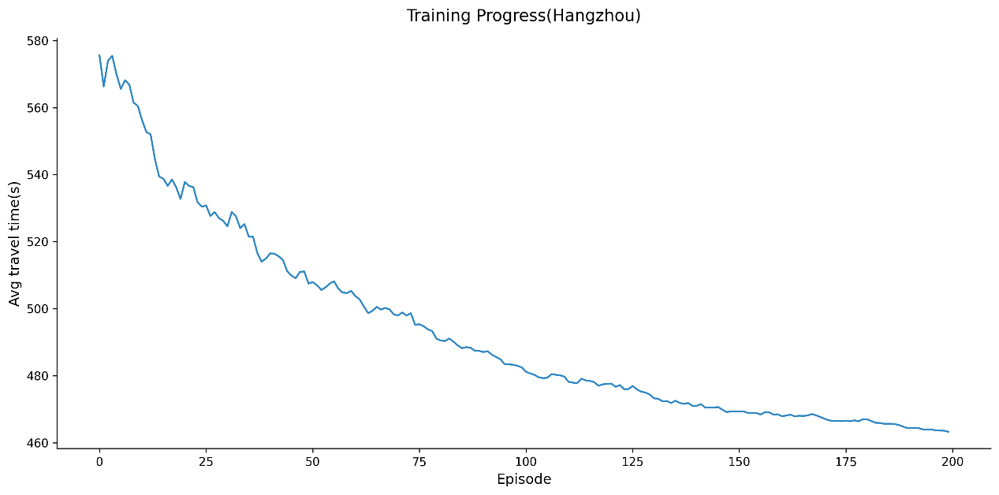

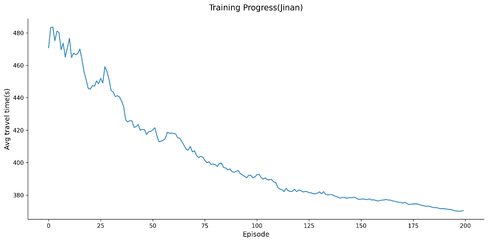

损失函数分析： 从Critic Loss和Actor Loss的变化趋势来看，两个损失函数都呈现出持续下降的特征，这表明网络参数在不断优化。Critic Loss从初始的11.64左右降低到0.08，并向0逼近，Actor Loss从2.23左右降低到0.24附近，这种显著的损失下降说明模型在训练过程中成功学习到了有效的控制策略。值得注意的是，损失函数的下降趋势与平均行程时间的改善趋势高度一致，这验证了算法设计的合理性。

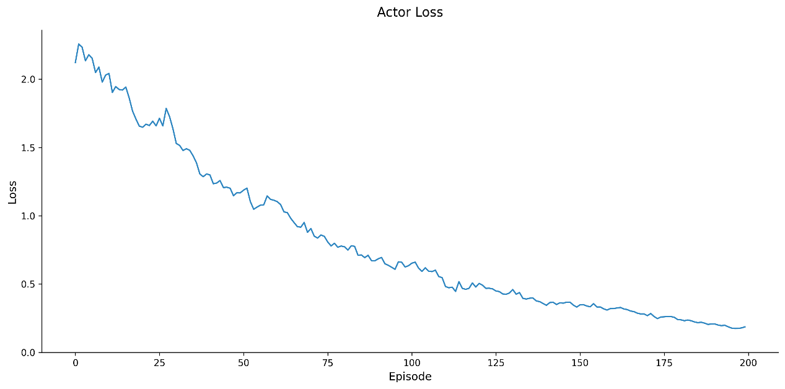

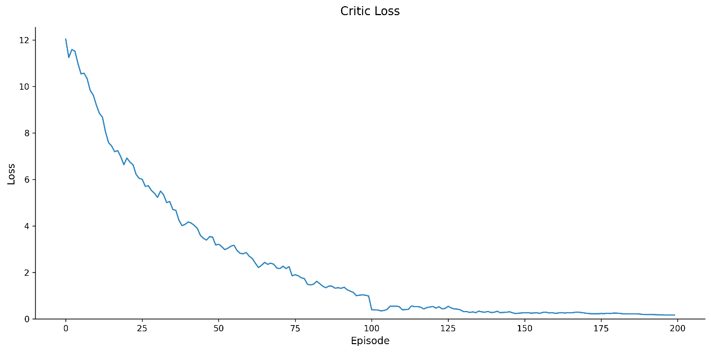

性能对比分析： 济南和杭州两个场景的最终性能改善幅度分别达到了约23%和21%。考虑到这两个城市具有不同的路网结构和交通特征，算法能够在不同场景下都取得相近的改善比例，这说明该方法具有良好的泛化能力和适应性。相比传统的固定时间配时方案和简单的自适应控制方法，这种改善幅度是显著的。

算法稳定性分析： 从训练后期的曲线表现来看，所有指标都呈现出平稳的特征，波动幅度较小。这种稳定性对于实际部署来说是极其重要的，因为它意味着算法在长期运行中能够维持稳定的控制效果。特别是在杭州这样的大型路网中，仍能保持稳定的性能表现，这更加凸显了算法的鲁棒性。

实际应用价值分析： 通过对训练过程的全面观察，我们可以得出以下几个关键结论：首先是算法能够在合理的训练回合数内达到收敛，这在实际应用中是可接受的训练成本。最终实现的20%以上的行程时间改善，对于缓解城市交通拥堵具有实际意义。此外，算法在不同规模和特征的路网中都表现出良好的适应性，这说明它具有广泛的应用前景。需要说明的是，这些结果是在仿真环境下获得的。在实际部署时，还需要考虑更多现实因素，如传感器精度、通信延迟等对算法性能的影响。但总的来说，实验结果表明该方法在智能交通信号控制领域具有显著的应用价值和推广潜力。

**总结和讨论**

基于本课程设计的研究过程和实验结果，我们对所采用的基于MA2C和重路由技术的交通信号控制方法进行如下总结：

主要结论： 本课程设计使用了一种结合多智能体强化学习和动态重路由的交通管理方案，通过实验验证表明该方法能够有效改善城市交通状况。在济南和杭州两个不同规模的路网场景中，该方法分别实现了约23%和21%的平均行程时间改善。算法在约150个训练回合后达到稳定状态，展现出良好的收敛性和泛化能力。特别是通过均场理论的应用，成功解决了多智能体系统中的维度灾难问题，使得算法能够适应大规模路网的控制需求。

方法优势：该方法无需预先设定固定的配时方案，能够根据实时交通状况动态调整信号控制策略，适应性远超传统的固定时序控制方法。通过多智能体框架，实现了路口间的协同控制，避免了单一路口优化可能导致的局部最优问题。同时，重路由技术的引入进一步增强了系统的全局协调能力。采用去中心化执行的设计使得系统具有良好的可扩展性，能够适应不同规模的交通网络。实验结果表明，该方法在大型路网中依然保持稳定的性能。算法在合理的训练轮次内即可收敛，且执行时仅需局部信息，大大降低了实际部署的难度和成本。

存在不足：

尽管算法能在150轮左右达到收敛，但初始训练过程仍需要较大的计算资源和时间成本。特别是在大规模路网中，训练时间可能会进一步增加。此外，方法的效果很大程度上依赖于交通检测设备的覆盖范围和数据质量。在实际部署中，传感器的精度和可靠性可能会影响控制效果。当前的实验主要在仿真环境中进行，对于现实世界中的突发事件、极端天气等异常情况的应对能力还需要进一步验证。另外，算法涉及多个超参数的设置，如奖励函数的权重、重路由的触发阈值等，这些参数的调整需要专业经验，增加了部署难度。这里我们使用的参数可能不够好，导致效果并没有很好。

未来改进方向：可以考虑引入迁移学习技术，减少在新场景中的训练成本；也可以增强算法对不完整和噪声数据的处理能力，提高在实际环境中的适应性；或者设计更智能的参数自适应机制，减少人工调参的需求，以及研究如何在保证性能的同时进一步降低计算复杂度，使系统更适合实时控制的需求等等。

本课程设计采用的方法在理论和实践层面都展现出了良好的应用前景，虽然存在一些限制和不足，但这些问题都有明确的改进方向。随着算法的进一步优化和硬件设施的完善，该方法有望在实际交通管理中发挥更大的作用。

**参考文献**

[1] Mushtaq, Anum, et al. "Multi-agent reinforcement learning for traffic flow management of autonomous vehicles." Sensors 23.5 (2023): 2373.

[2] Liao, Xiao-Cheng, et al. "Combining traffic assignment and traffic signal control for online traffic flow optimization." International Conference on Neural Information Processing. Singapore: Springer Nature Singapore, 2022.

[3] Zhang, Huichu, et al. "Cityflow: A multi-agent reinforcement learning environment for large scale city traffic scenario." The world wide web conference. 2019.

**基于多智能体的自动驾驶车辆路径规划问题的研究（个人）**

我的贡献分为三个阶段，在**文献阅读阶段**，我负责阅读后写文献综述方便后续具体领域的展开，具体文献综述鉴于篇幅不便展开，以图片形式展示于此：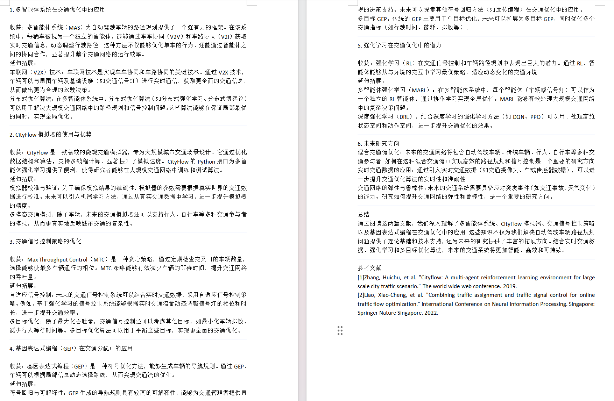

在**代码编写阶段**，我的队友编程能力很强，只交给我MTC部分的策略设计与实现，也让我体会到团队协作的重要性，在编写了 MTC 策略的核心代码（包括信号相位的遍历、车辆通行数的计算、调用时间的调整等）时为了提高代码的可读性和可维护性，我对代码进行了模块化设计，将 MTC 策略的核心逻辑封装成独立的函数，便于后续的扩展和优化。完成基本要求后我想到了**优化**的方案，针对**MTC内部**，使用了多线程并行计算，将每个交叉口的 MTC 策略计算任务分配给不同的线程，针对**MTC外部**的调用采用动态调用时间：根据Sum_car/Sum_cross=Ave_cc(路口平均车流量）然后当这个路口车流是n倍的Ave_cc时，我们就把这个路口MTC调用时间变成：e^(-k(n-1))*默认时间。但是在合并阶段发现似乎本大作业要求是固定时间，加之多线程其他部分代码较难实现，优化方案采用最原始方案。

最后在**团队设计阶段**，我撰写了团队设计的初稿及订正，同时我的队友则负责了代码部分的解释，二人配合下完成了此项目的结题。

**《群体智能》** **实 验 报 告（一）**

**(2024-2025** **学年第一学期)**

**学生姓名：** **于博宇**

算法复述：本章学习了进化算法以及群体智能中粒子群以及蚁群算法，本人选择的研究算法是粒子群PSO优化算法，下面将对此算法进行复述。

粒子群优化算法（全称：Particle Swarm Optimization）是一种模拟自然界生物活动的随机搜索算法。课上提到PSO算法在1995由美国Eberhart等人提出。在PSO中，每个“粒子”代表解空间中的一个候选解，通过模拟自然界生物的社会合作和信息共享机制进行搜索。粒子在多维解空间中移动，每个粒子都有一个由其位置向量表示的当前位置和一个速度向量控制其飞行方向和距离。粒子的行为受到个体认知和社会认知的影响，个体认知反映了粒子根据自己历史上找到的最优位置（个体最优pBest）进行自我调整的能力，而社会认知则是粒子根据整个粒子群历史上找到的最优位置（全局最优gBest）进行调整的能力。

其关键在于平衡粒子的行为：探索使粒子能够访问解空间中未知的区域，而利用则使粒子能够在已知的有希望的区域内搜索更精确的解。通过调节粒子速度更新公式中的参数，如惯性权重、个体学习系数和社会学习系数，可以有效地控制这两种行为。

关键代码截图：

1：距离计算三函数

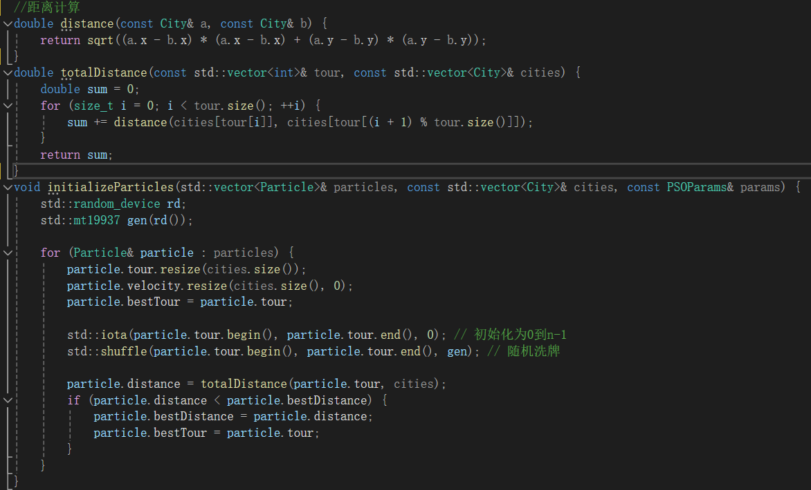

2：更新城市以及速度信息函数

3：打开文件kroA100.tsp函数（文件接口）

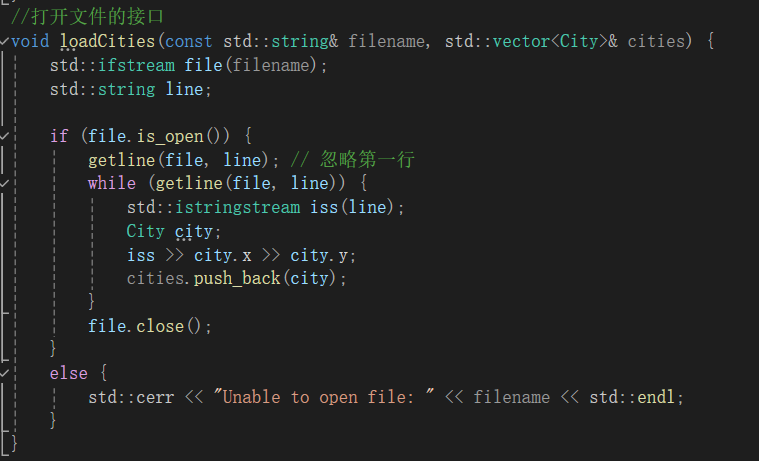

4：主干main函数

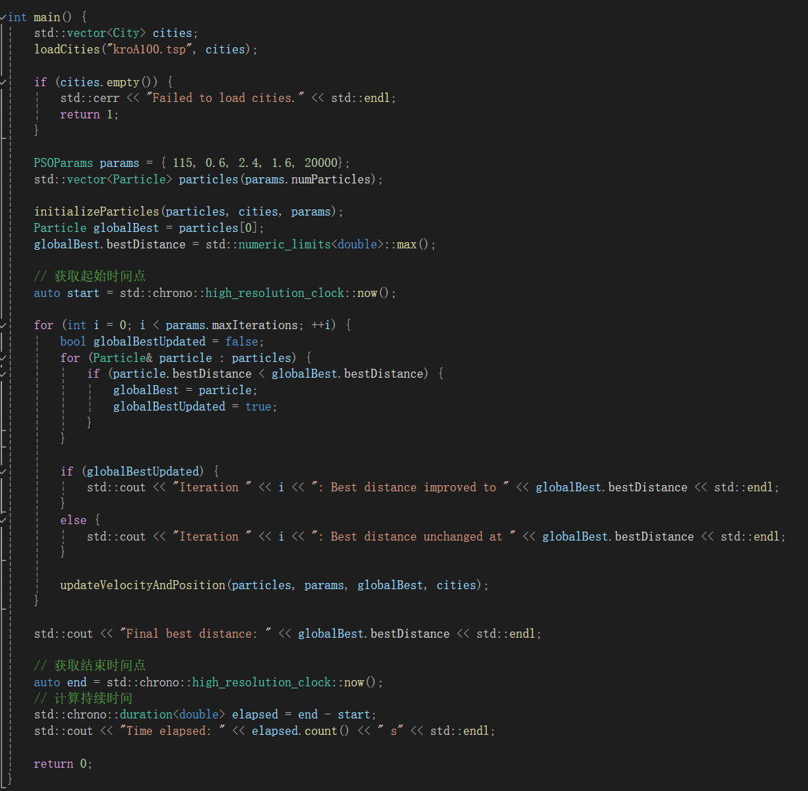

实验分析：

我测试的是PSO优化算法针对离散组合优化，其中数据集我去GitHub上面找到了许多.tsp,但考虑到自身电脑算力以及实验时间，故最后采用最少的kroA100来作为测试数据。

在测试过程中，我采用的是最基础的PSO算法，未经过各种进化改造，所以在保证代码正确性基础上，我只需要调试粒子数量、惯性因子、迭代次数、学习因子c1（后面我会习惯把它叫做社会）以及学习因子c2（我会称为自我）。

一开始我采用的分别是50个粒子，惯性因子0.7，迭代1000次，社会1.5，自我1.5**（为什么这么设置呢？因为课上说0.7，双1.49可以方便收敛）**然而，在确保代码无误的情况，我得到的结果普遍在110000左右，我经过上网搜索得到kroA100最佳遍历是21200左右，这显然偏差太多了。

于是我修改代码，增加了每次迭代显示是否改变以及数值是多少，以及总时间，结果发现1000次似乎并不能使我的结果呈现一个趋近值，1000大多数还有很大的变化，于是我先试了100000，结果发现大约在25000时已经保持大概的趋近值了。

解决迭代次数后我就测试粒子数，网上建议像kroA100这种简单的50个就可以，但是我在上述操作后每次数值都不太稳定，少则50000多，多则80000多，于是尝试增加粒子数，后经过调整，发现在115左右每次得到的平均结果是最为理想的。惯性因子如果过小，它基本上起始是多少，结果也差不多，如果太大，反而会极为不稳定，我测试后最后选择取0.6，此时我发现后5000基本不变，故调整迭代数为15000。

社会和自我比较难处理，网上建议二者之和为四，但是我在自己早期调试时（迭代1000）发现2，1也很合适，现在想来，应该是因为次数不够导致的自我过于分散，所以社会高于自我会更加接近罢了。

但转念就需要思考一个问题，为什么一定要和为四？网上说早期的PSO研究和实验表明，当c1和c2的值相等且总和为4时，算法往往能够展现出较好的性能。这被认为是一种经验设置，可以在探索（全局搜索）和开发（局部搜索）之间取得平衡。

等到（迭代15000）时，我经过测试，选择2.4/1.6作为我最后的参数。

下面是我以115 0.6 2.4 1.6 15000进行的几组测试，我将最后的平均值以及耗时将以表格的方式呈现，选取其中一组的数据以图像的形式呈现。

在发现控制台仅保存10000条遍历数据后，（这应该是个stack，还带弹出的哈哈）我写了输出文本的代码，更新如下：

这样我们就可以不用担心数据被弹飞了...

这是我的实验数据：

| 注释 | 测试结果 | 测试耗时（s) |  |
|---|---|---|---|
| 1 | 29748 | 30.0098 |  |
| 2 | 35120.3 | 31.4691 |  |
| 3 | 35905.2 | 29.9894 |  |
| 4 | 39474 | 28.996 |  |
| 5 | 32101.8 | 29.5845 |  |
| 6 | 35332.4 | 29.8871 |  |
| 7 | 37289.8 | 28.4701 |  |
| 8 | 32907.4 | 29.4132 |  |
| 9 | 31179.2 | 27.6063 |  |
| 10 | 40459.2 | 29.7627 |  |
| 平均值 | 34951.73 | 29.51882 |  |
|  |  |  |  |

图像如下：

为了更清楚呈现趋近的过程，我特别设置以下这组100000遍历组：

100000组遍历的情况非常好，全球遍历kroA100最佳21200多，我这组已经遍历到23000多了。

分析与见解：

我认为，从图表中我们不难看出，前期遍历中粒子的位置和速度在解空间中随机分布（初始很大）、快速下降，显示出算法的全局搜索能力，并逐渐稳定：随着迭代次数的增加，粒子逐渐靠近最优解，适应度改进的速度会逐渐减慢，迭代图的趋势会趋于平缓，这表明算法正在细化其搜索并逼近最优解，迭代图最终会显示出收敛行为，即适应度值停止改进或改进非常小，表明算法已经找到了问题的最优解或非常接近最优解。

个人见解：这张图象可以看出收敛的很出色，但是同时也给我一些思考，是不是有早熟收敛的嫌疑呢？毕竟在某些情况下，迭代图可能显示出早熟收敛，即算法过早地集中在一个非全局最优解上，这通常是由于粒子群的多样性不足或算法参数设置不当造成的，而PSO恰好具有参数敏感性，性能很大程度上依赖于其参数（如惯性权重、学习因子等）的设置。不同的参数设置可能导致迭代图表现出不同的行为，如收敛速度、解的质量等。

而最糟糕的是我测试参数时为了节约时间，每次大部分都是15000-20000次，从图上可以看出似乎这段并不是收敛完成时期，保守来看40000左右才差不多，那么我这组参数的调整会不会也促进了它的早熟呢？根据我的推测，我这组参数大概在百万次会达到最佳路线，而这需要1个小时的递归。

文献研读报告：

粒子群优化算法的改进策略研究

引言：

粒子群优化算法因其简单性和高效性而受到广泛关注。然而，标准PSO算法在解决某些复杂优化问题时存在局限性。本文旨在综述当前的改进策略，并探讨它们如何提高PSO算法的性能。

正文：

我将对粒子群优化算法中拓扑改进策略进行文献阅读，因为在各个学科我们都陆续接触了拓扑使得我对这个方面不太陌生。下面我将会给出我阅读的相关文献。

我通过在IEEE网上查询《A distance-based neighborhood particle swarm optimization for continuous optimization problems》J. J. Liang, P. N. Suganthan, and A. K. Qin Proceedings of the 8th IEEE International Conference on Cybernetic Intelligent Systems (CIS), 2009.，得知了基于距离的邻域拓扑的相关内容；通过查询《Social Behavior Based Particle Swarm Optimization》A. P. Engelbrecht Proceedings of the 2005 IEEE Congress on Evolutionary Computation, 2005.得到了关于社会等级拓扑的相关知识。

基于距离的邻域拓扑结构是指粒子的邻域是根据其与其它粒子在解空间中的欧氏距离来确定的。这种结构允许粒子根据其在解空间中的相对位置动态地选择邻域成员。我们可以设定一个距离阈值，所有在这个距离内的粒子都被认为是邻居。这种方法可以包括更多或更少的粒子，取决于阈值的大小。它的优点是“dynamic and adaptive”因为邻域成员根据粒子的当前位置动态变化且能够根据问题的特性和搜索过程的需要调整邻域大小。但同时在每次迭代中计算所有粒子之间的距离可能导致较高的计算成本。而且同PSO一样，k值会显著影响它的结果，需要仔细调整。

社会等级拓扑结构是受到社会等级制度启发的邻域拓扑结构。在这种结构中，粒子被分配不同的等级，高等级粒子对低等级粒子的影响更大。而分配的原则是根据粒子的历史表现或当前适应度值来分配等级。表现越好的粒子等级越高。同时高等级粒子的信息在速度和位置更新中占据更大的权重，从而影响低等级粒子的搜索方向。它的优点是粒子具有优先级，好粒子可以有引导作用了，同时也会减少同步行为，增加了细节的多样性。但缺点就是等级的规定比较麻烦抽象而且要平衡好高等级和低等级粒子之间的关系，以避免算法过早收敛。

总而言之，二者运用得好都可以改进PSO不少，它们通过不同的机制增强了算法的搜索能力和多样性。在拓扑研究改进策略上，我认为未来可以进一步探索这些方法的有机结合，做到取长补短，相得益彰。

**《群体智能》** **实 验 报 告（二）**

**(2024-2025** **学年第一学期)**

**学生姓名：** **于博宇**

一、算法小实践

我选择的是DQN（Deep Q-Network）算法进行编程实现玩2048的训练，并基于GYM平台进行实验。以下是实验报告的概要：

1. 算法复述

DQN是一种结合了深度学习和强化学习的算法，用于解决具有高维观测空间的强化学习问题。DQN通过使用深度神经网络来近似Q函数，从而避免了传统Q-learning算法中的维度灾难。DQN算法的核心是利用经验回放和目标网络来提高学习的稳定性和效率。
1. 关键代码截图

①：引入相关软件包及相关参数解析（1-30 lines）

②：2048游戏环境逻辑搭建（59-192lines）

③：神经网络模型搭建（346-362lines）【卷积神经网络】

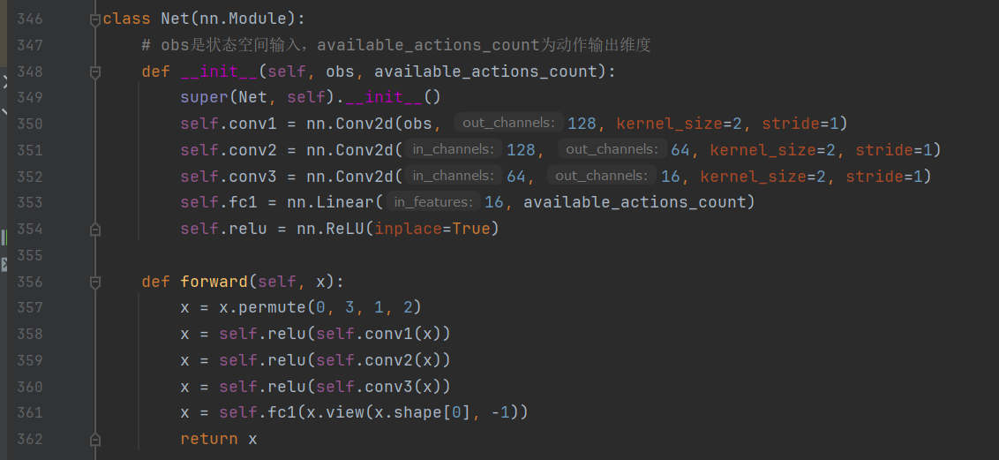

④：DQN智能体搭建（365-429lines)

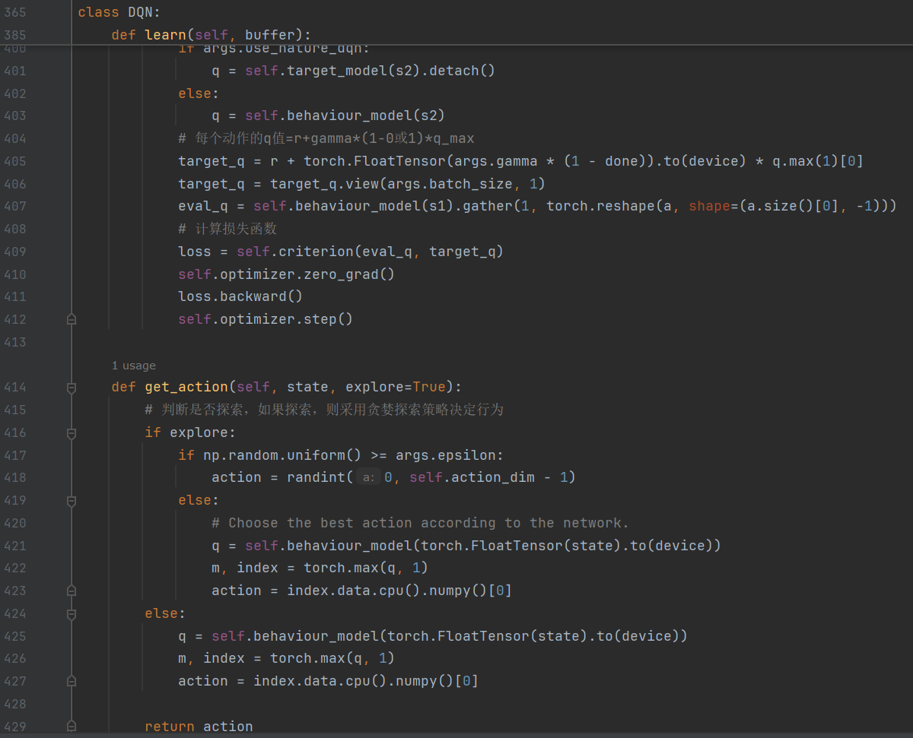

⑤经验回放缓冲区（432-460lines）

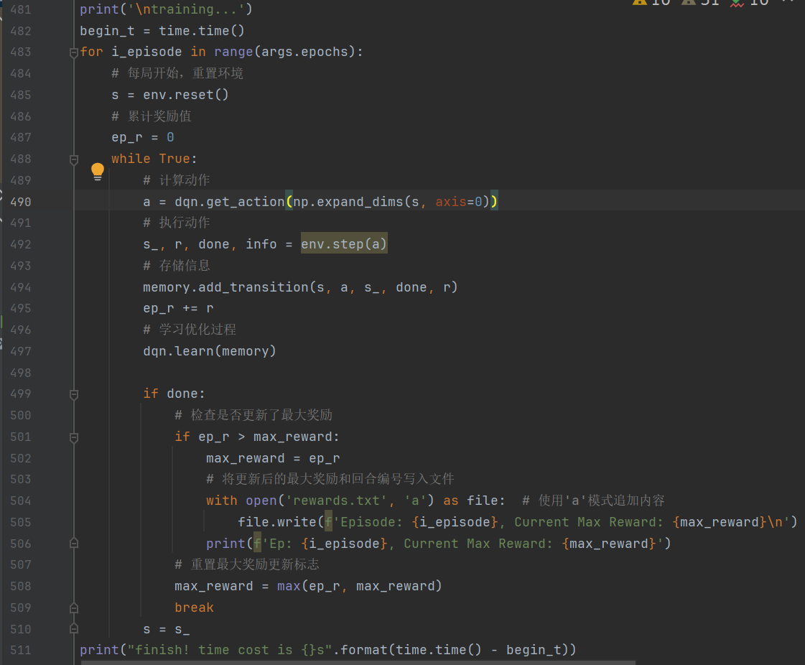⑥输出数据录入文件方便后续excel统计（471-511lines)

3. 实验分析

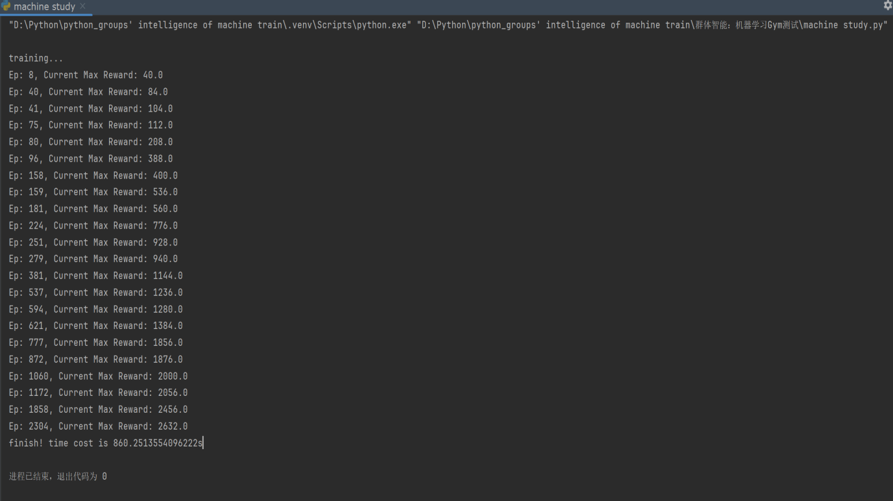在实验中，我们使用GYM平台的Game2048Env环境来测试DQN算法。通过多次运行实验，我们观察到智能体通过调整参数和网络结构，可以优化智能体的性能，使其在游戏中获得更高的分数。实验结果表明，随着训练的进行，智能体的奖励逐渐增加，表明其学习效果在提升。

全程860s

我将关键处绘制excel图表如下：
1. 个人见解

本人也是第一次接触anaconda3 pytorch等，导致在最终实现这个代码前出现了许多小插曲。

首先是gymnasium不支持python现在的3.12，需要回溯版本3.10，但是官网并没有给出3.10的旧版本直接下载途径。

其次是本代码大部分为现有开源代码，小部分为自己改造，在经过大量学习之后才能修改，让我一开始极其头疼。

最后是有时传值一直在报错，软件包我也不太清楚在anaconda下载、在终端pip install和在python软件包搜寻下载到底有什么区别......

但总而总之这个项目虽然过程很苦，在梳理掉所有的error终于跑得动的时候成就感溢出了。

言归正传，根据上面的excel图表我们可以看出训练初期依旧和大多数一样，总可以很快的找到更高的奖赏，但是在后面我们可以看出应该是接近真实最大奖赏，趋于平缓，耗时更多。

二、文献研读

多智能体强化学习与大语言模型Agent的探讨

引言：

在人工智能的快速发展中，多智能体强化学习和大语言模型Agent成为了研究的热点。本文通过文献阅读，对这两个领域的挑战等进行综述。

1、多智能体强化学习（MARL）中针对训练效率、不稳定性以及信用分配三个主要挑战的详细解决方案：

训练效率问题

多智能体强化学习（MARL）中的训练效率问题主要源于**智能体之间的相互作用和学习过程中的复杂性。**在文献中提到，**集中式方法和分散式方法**是解决这一问题的两种主要途径。集中式方法通过一个全局控制中心来承担学习任务，可以利用全部状态信息进行训练，学习最优的协作机制。然而，这种方法在实际应用中可能面临通信和计算的挑战。分散式方法则允许智能体仅根据局部信息进行学习和决策，这可以提高训练效率，但可能难以捕捉全局最优解。[1]

环境非平稳性问题：

想象一下，你和朋友们在玩一个游戏，游戏规则会随着你们怎么玩而变化。这就是所谓的“环境非平稳性”。为了不让这种变化搞得大家手忙脚乱，我们可以调整学习的速度，就像是调整游戏难度，让每个人都能跟上节奏。或者，我们可以用一些高级的控制技巧，**比如模型预测控制，来预测接下来的变化，并提前做好准备。**

非完全观测问题：

在多智能体学习中，每个智能体就像是一个玩家，只能看到自己周围的一小部分地图。这就像是在玩一个迷宫游戏，你只能看到眼前的几步路。为了解决这个问题，我们可以用一些数学模型，**比如部分可观测马尔可夫决策过程**，来帮助我们猜测那些看不见的地方可能有什么。再加上深度学习，就像是用一个超级强大的地图，来帮助我们更好地理解整个迷宫。[5]

多智能体环境训练模式问题：

这个就像是团队合作时，大家先一起讨论过去的经验，然后再各自去执行任务。这种**集中式训练分散式执行的模式**，就像是大家一起看过去的录像，学习怎么合作得更好，然后再各自去实践。这样，我们既能从过去的经验中学到东西，又能保持每个人行动的灵活性。

不稳定性问题

MARL中的不稳定性问题通常与智能体间的信用分配和策略更新有关。(这里有些难，我主要选择的是论文内容)

Reinforced Inter-Agent Learning 和 Differentiable Inter-Agent Learning算法：

Reinforced Inter-Agent Learning

独立Q学习：在这种变体中，每个智能体学习自己的神经网络，将其他智能体视为环境的一部分。这种方法允许智能体独立地学习，但在执行时仍然是分散的，每个智能体根据自己的观测选择行动。

参数共享：另一种变体中，所有智能体共享一个全局的神经网络。尽管如此，由于每个智能体接收到的观测不同，它们的行为也会有所不同。这种方法减少了需要学习的参数数量，从而加快了学习速度。

RIAL 的关键特点是在执行时智能体是分散的，但在学习时可以共享参数，这有助于智能体学习共同的策略，同时也允许它们根据各自的观测进行特殊化。

Differentiable Inter-Agent Learning

DIAL 方法基于一个洞见：集中式学习提供了比仅仅参数共享更多的机会来改善学习。DIAL 允许在集中式学习期间，智能体之间传递实数值消息，从而将通信行为视为网络之间的瓶颈连接。这样，梯度可以穿过通信通道，使得系统即使在智能体之间也是端到端可训练的。

DIAL 的工作原理如下：

在集中式学习期间，通信动作被一个智能体网络的输出直接连接到另一个智能体网络的输入所取代。这意味着，尽管任务将通信限制为离散消息，但在学习期间，智能体可以自由地向彼此发送实数值消息。由于这些消息像任何其他网络激活一样，梯度可以沿着通道回传，允许跨智能体的端到端反向传播。

DIAL 通过允许梯度从一个智能体流向另一个智能体，为智能体提供了更丰富的反馈，减少了通过试错学习所需的量，并简化了有效协议的发现。在分散执行期间，实数值消息被离散化并映射到任务允许的离散通信动作集。[6]

DIAL 的一个关键优势是它可以自然地处理连续的通信协议，因为它们在集中式学习期间已经被使用。此外，DIAL 可以扩展到大的离散消息空间，因为它学习的是二进制编码而不是RIAL中的一位有效编码。

信用分配问题

在MARL中，智能体需要学会如何将全局奖励分配给各自的行动。以下是几种解决信用分配问题的方法：[4]

显式方法：

这就像是在团队项目中，我们用一些特定的方法来明确每个人的贡献。比如，我们可以采用一些数学工具，比如**反事实推理**，就像是说“如果没有你，我们会怎样”，或者用沙普利值来衡量每个人的“公平”贡献。这些方法本来是其他领域用的，但现在我们把它们用在多智能体学习（MARL）里，来解决谁该得多少“功劳”的问题。

隐式方法：

还有一种方法，就像是我们不用去算每个人具体做了多少，而是**让机器自己通过神经网络去学习**。这在一些特别复杂，用数学方法算不出来的情况下特别有用。就像有时候，团队里的人太多，或者任务太复杂，我们没法一一算清楚每个人的贡献，就让机器自己去“感觉”谁做得多。

基于奖励滤波的信用分配算法：

这个就更有意思了，我们可以把其他智能体的影响看作是噪音，然后在训练过程中，我们把全局的奖励信号过滤一下，分给每个智能体。这样，每个智能体都能得到自己的“小奖励”，帮助他们更好地协作，一起把任务完成得更好。

2. 大语言模型Agent的定义与协作需求

大语言模型Agent的定义：

大语言模型Agent是指基于大型语言模型（LLM）构建的智能代理，它们能够理解和生成自然语言，进行决策制定，并与环境交互。根据文献，大模型Agent的**架构包括Profile模块、Memory模块、Planning模块和Action模块**[2]，这些模块共同定义了Agent的角色、目标、能力、知识和行为方式。

大语言模型Agent之间的协作需求：

其需求主要源于以下几个方面：

提升决策水平：

就像团队项目一样，不同的成员各抒己见，分享自己的见解和知识，这样大家一起讨论，就能做出更周全、更靠谱的决策。

增强适应性：

合作能帮我们突破个人能力的局限。就像在新学期开始时，面对不熟悉的课程，和同学一起学习，就能更快地适应新环境和新挑战。

提高效率：

在面对复杂的大项目时，如果大家分工合作，各司其职，就能更快地把事情搞定。这就像是团队作业，每个人都负责一部分，最后整合起来，效率自然高。

应对复杂挑战：

面对那些需要跨学科知识和技能的大难题，一个人的力量可能不够。这时候，团队合作就能集合大家的智慧和能力，一起攻克难关。[3]

总的来说，多智能体强化学习的问题和解决方案，以及大语言模型智能体的定义和合作需求，都是AI领域里的热门话题。深入研究这些，能推动智能技术的进步，让它们在更多领域大展身手。

相关文献引用：(已经做了超链接处理)

[1]多智能体系统深度强化学习：挑战、解决方案和应用的回顾《CSDN博客》

[2]7000长文：一文读懂Agent，大模型的下一站《知乎专栏》

[3]AI Agent框架（LLM Agent）：LLM驱动的智能体如何引领行业变革，应用探索与未来展望《SegmentFault 思否》

[4]多智能体强化学习（五）MARL的挑战_不考虑其他智能体策略-CSDN博客

[5]多智能体深度强化学习综述笔记_多智能体深度强化学习最新研究进展-CSDN

[6]Learning to Communicate with Deep Multi-Agent Reinforcement Learning《ar5iv》
