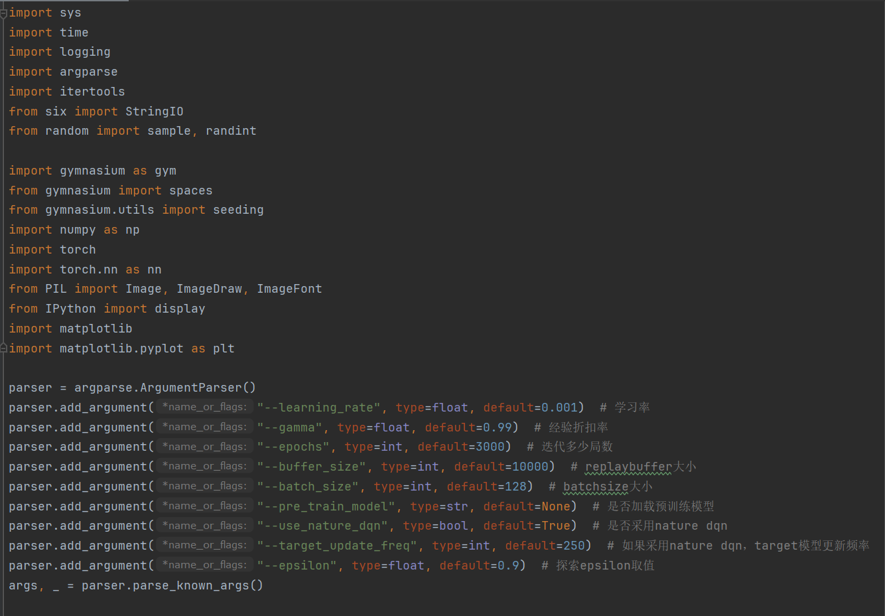
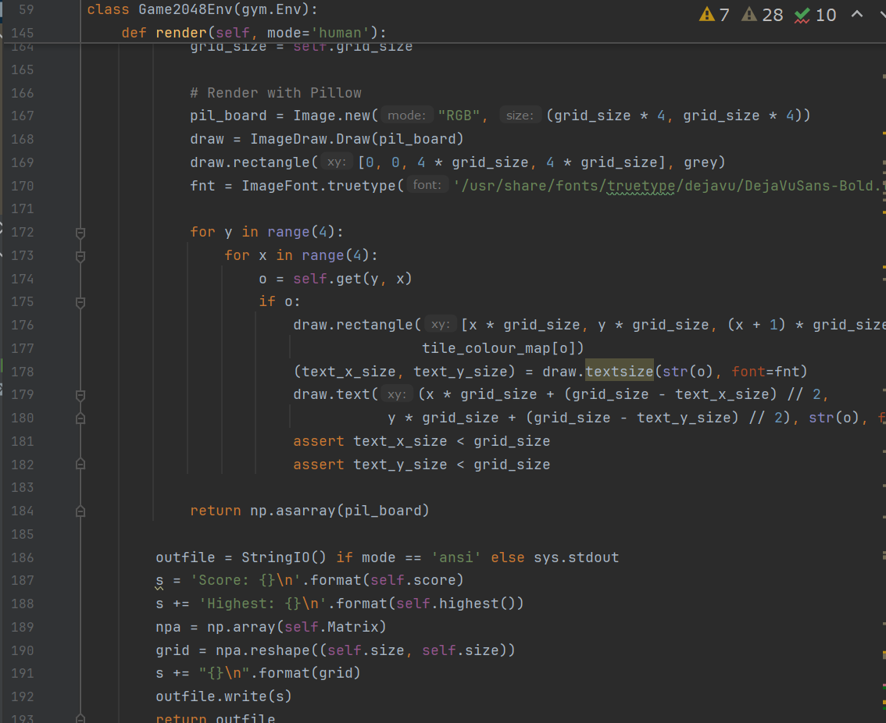
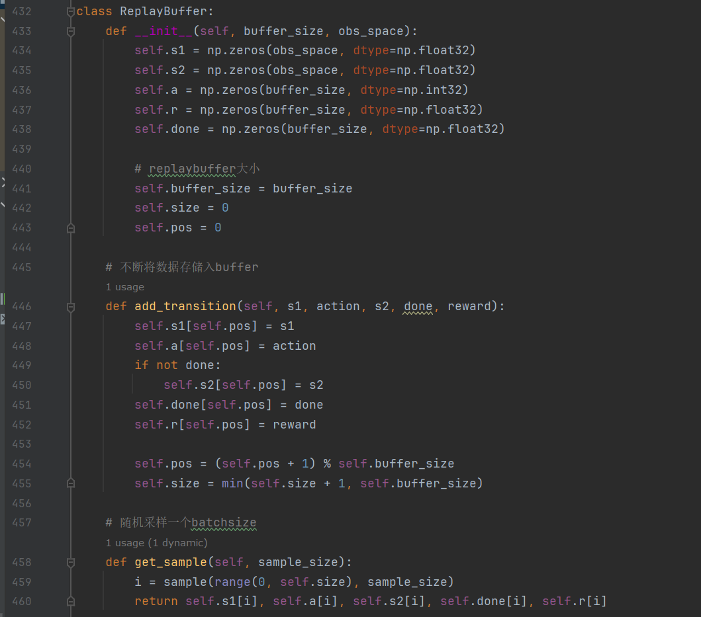
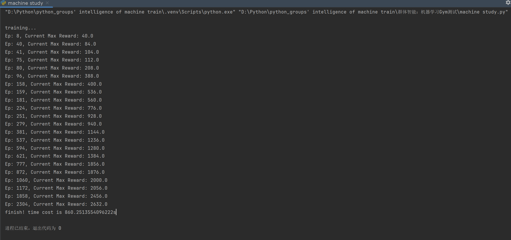

# 关于群体智能中强化学习的研究结果

一、算法小实践

我选择的是DQN（Deep Q-Network）算法进行编程实现玩2048的训练，并基于GYM平台进行实验。以下是实验报告的概要：

1. 算法复述

DQN是一种结合了深度学习和强化学习的算法，用于解决具有高维观测空间的强化学习问题。DQN通过使用深度神经网络来近似Q函数，从而避免了传统Q-learning算法中的维度灾难。DQN算法的核心是利用经验回放和目标网络来提高学习的稳定性和效率。
1. 关键代码截图

①：引入相关软件包及相关参数解析（1-30 lines）

②：2048游戏环境逻辑搭建（59-192lines）

③：神经网络模型搭建（346-362lines）【卷积神经网络】

④：DQN智能体搭建（365-429lines)

⑤经验回放缓冲区（432-460lines）

⑥输出数据录入文件方便后续excel统计（471-511lines)

3. 实验分析

在实验中，我们使用GYM平台的Game2048Env环境来测试DQN算法。通过多次运行实验，我们观察到智能体通过调整参数和网络结构，可以优化智能体的性能，使其在游戏中获得更高的分数。实验结果表明，随着训练的进行，智能体的奖励逐渐增加，表明其学习效果在提升。

全程860s

我将关键处绘制excel图表如下：
1. 个人见解

本人也是第一次接触anaconda3 pytorch等，导致在最终实现这个代码前出现了许多小插曲。

首先是gymnasium不支持python现在的3.12，需要回溯版本3.10，但是官网并没有给出3.10的旧版本直接下载途径。

其次是本代码大部分为现有开源代码，小部分为自己改造，在经过大量学习之后才能修改，让我一开始极其头疼。

最后是有时传值一直在报错，软件包我也不太清楚在anaconda下载、在终端pip install和在python软件包搜寻下载到底有什么区别......

但总而总之这个项目虽然过程很苦，在梳理掉所有的error终于跑得动的时候成就感溢出了。

言归正传，根据上面的excel图表我们可以看出训练初期依旧和大多数一样，总可以很快的找到更高的奖赏，但是在后面我们可以看出应该是接近真实最大奖赏，趋于平缓，耗时更多。

二、文献研读

多智能体强化学习与大语言模型Agent的探讨

引言：

在人工智能的快速发展中，多智能体强化学习和大语言模型Agent成为了研究的热点。本文通过文献阅读，对这两个领域的挑战等进行综述。

1、多智能体强化学习（MARL）中针对训练效率、不稳定性以及信用分配三个主要挑战的详细解决方案：

训练效率问题

多智能体强化学习（MARL）中的训练效率问题主要源于**智能体之间的相互作用和学习过程中的复杂性。**在文献中提到，**集中式方法和分散式方法**是解决这一问题的两种主要途径。集中式方法通过一个全局控制中心来承担学习任务，可以利用全部状态信息进行训练，学习最优的协作机制。然而，这种方法在实际应用中可能面临通信和计算的挑战。分散式方法则允许智能体仅根据局部信息进行学习和决策，这可以提高训练效率，但可能难以捕捉全局最优解。[1]

环境非平稳性问题：

想象一下，你和朋友们在玩一个游戏，游戏规则会随着你们怎么玩而变化。这就是所谓的“环境非平稳性”。为了不让这种变化搞得大家手忙脚乱，我们可以调整学习的速度，就像是调整游戏难度，让每个人都能跟上节奏。或者，我们可以用一些高级的控制技巧，**比如模型预测控制，来预测接下来的变化，并提前做好准备。**

非完全观测问题：

在多智能体学习中，每个智能体就像是一个玩家，只能看到自己周围的一小部分地图。这就像是在玩一个迷宫游戏，你只能看到眼前的几步路。为了解决这个问题，我们可以用一些数学模型，**比如部分可观测马尔可夫决策过程**，来帮助我们猜测那些看不见的地方可能有什么。再加上深度学习，就像是用一个超级强大的地图，来帮助我们更好地理解整个迷宫。[5]

多智能体环境训练模式问题：

这个就像是团队合作时，大家先一起讨论过去的经验，然后再各自去执行任务。这种**集中式训练分散式执行的模式**，就像是大家一起看过去的录像，学习怎么合作得更好，然后再各自去实践。这样，我们既能从过去的经验中学到东西，又能保持每个人行动的灵活性。

不稳定性问题

MARL中的不稳定性问题通常与智能体间的信用分配和策略更新有关。(这里有些难，我主要选择的是论文内容)

Reinforced Inter-Agent Learning 和 Differentiable Inter-Agent Learning算法：

Reinforced Inter-Agent Learning

独立Q学习：在这种变体中，每个智能体学习自己的神经网络，将其他智能体视为环境的一部分。这种方法允许智能体独立地学习，但在执行时仍然是分散的，每个智能体根据自己的观测选择行动。

参数共享：另一种变体中，所有智能体共享一个全局的神经网络。尽管如此，由于每个智能体接收到的观测不同，它们的行为也会有所不同。这种方法减少了需要学习的参数数量，从而加快了学习速度。

RIAL 的关键特点是在执行时智能体是分散的，但在学习时可以共享参数，这有助于智能体学习共同的策略，同时也允许它们根据各自的观测进行特殊化。

Differentiable Inter-Agent Learning

DIAL 方法基于一个洞见：集中式学习提供了比仅仅参数共享更多的机会来改善学习。DIAL 允许在集中式学习期间，智能体之间传递实数值消息，从而将通信行为视为网络之间的瓶颈连接。这样，梯度可以穿过通信通道，使得系统即使在智能体之间也是端到端可训练的。

DIAL 的工作原理如下：

在集中式学习期间，通信动作被一个智能体网络的输出直接连接到另一个智能体网络的输入所取代。这意味着，尽管任务将通信限制为离散消息，但在学习期间，智能体可以自由地向彼此发送实数值消息。由于这些消息像任何其他网络激活一样，梯度可以沿着通道回传，允许跨智能体的端到端反向传播。

DIAL 通过允许梯度从一个智能体流向另一个智能体，为智能体提供了更丰富的反馈，减少了通过试错学习所需的量，并简化了有效协议的发现。在分散执行期间，实数值消息被离散化并映射到任务允许的离散通信动作集。[6]

DIAL 的一个关键优势是它可以自然地处理连续的通信协议，因为它们在集中式学习期间已经被使用。此外，DIAL 可以扩展到大的离散消息空间，因为它学习的是二进制编码而不是RIAL中的一位有效编码。

信用分配问题

在MARL中，智能体需要学会如何将全局奖励分配给各自的行动。以下是几种解决信用分配问题的方法：[4]

显式方法：

这就像是在团队项目中，我们用一些特定的方法来明确每个人的贡献。比如，我们可以采用一些数学工具，比如**反事实推理**，就像是说“如果没有你，我们会怎样”，或者用沙普利值来衡量每个人的“公平”贡献。这些方法本来是其他领域用的，但现在我们把它们用在多智能体学习（MARL）里，来解决谁该得多少“功劳”的问题。

隐式方法：

还有一种方法，就像是我们不用去算每个人具体做了多少，而是**让机器自己通过神经网络去学习**。这在一些特别复杂，用数学方法算不出来的情况下特别有用。就像有时候，团队里的人太多，或者任务太复杂，我们没法一一算清楚每个人的贡献，就让机器自己去“感觉”谁做得多。

基于奖励滤波的信用分配算法：

这个就更有意思了，我们可以把其他智能体的影响看作是噪音，然后在训练过程中，我们把全局的奖励信号过滤一下，分给每个智能体。这样，每个智能体都能得到自己的“小奖励”，帮助他们更好地协作，一起把任务完成得更好。

2. 大语言模型Agent的定义与协作需求

大语言模型Agent的定义：

大语言模型Agent是指基于大型语言模型（LLM）构建的智能代理，它们能够理解和生成自然语言，进行决策制定，并与环境交互。根据文献，大模型Agent的**架构包括Profile模块、Memory模块、Planning模块和Action模块**[2]，这些模块共同定义了Agent的角色、目标、能力、知识和行为方式。

大语言模型Agent之间的协作需求：

其需求主要源于以下几个方面：

提升决策水平：

就像团队项目一样，不同的成员各抒己见，分享自己的见解和知识，这样大家一起讨论，就能做出更周全、更靠谱的决策。

增强适应性：

合作能帮我们突破个人能力的局限。就像在新学期开始时，面对不熟悉的课程，和同学一起学习，就能更快地适应新环境和新挑战。

提高效率：

在面对复杂的大项目时，如果大家分工合作，各司其职，就能更快地把事情搞定。这就像是团队作业，每个人都负责一部分，最后整合起来，效率自然高。

应对复杂挑战：

面对那些需要跨学科知识和技能的大难题，一个人的力量可能不够。这时候，团队合作就能集合大家的智慧和能力，一起攻克难关。[3]

总的来说，多智能体强化学习的问题和解决方案，以及大语言模型智能体的定义和合作需求，都是AI领域里的热门话题。深入研究这些，能推动智能技术的进步，让它们在更多领域大展身手。

相关文献引用：(已经做了超链接处理)

[1]多智能体系统深度强化学习：挑战、解决方案和应用的回顾《CSDN博客》

[2]7000长文：一文读懂Agent，大模型的下一站《知乎专栏》

[3]AI Agent框架（LLM Agent）：LLM驱动的智能体如何引领行业变革，应用探索与未来展望《SegmentFault 思否》

[4]多智能体强化学习（五）MARL的挑战_不考虑其他智能体策略-CSDN博客

[5]多智能体深度强化学习综述笔记_多智能体深度强化学习最新研究进展-CSDN

[6]Learning to Communicate with Deep Multi-Agent Reinforcement Learning《ar5iv》
