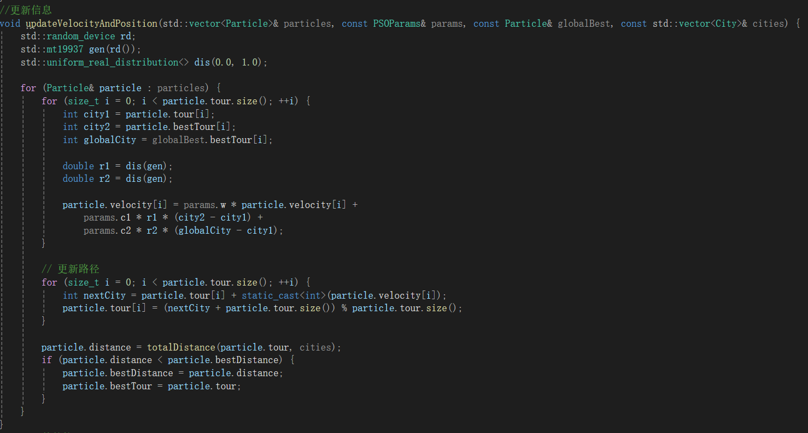
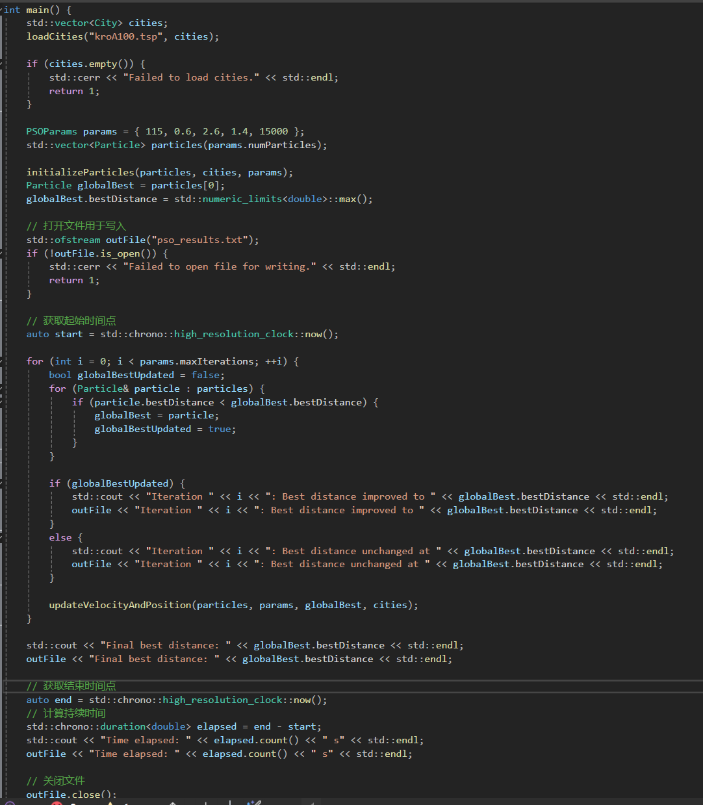
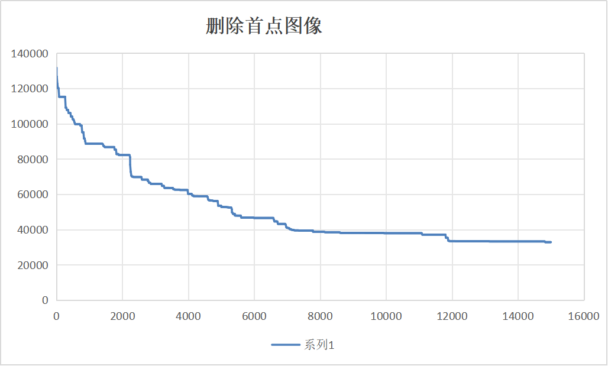
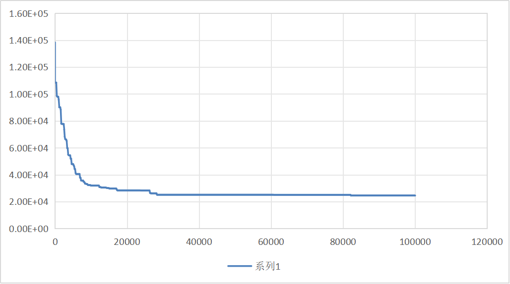

# 群体智能实验报告

**《群体智能》 实 验 报 告**

**(2024-2025** **学年第一学期)**

**学生姓名： 于博宇**

## 算法复述：

粒子群优化算法（全称：Particle Swarm Optimization）是一种模拟自然界生物活动的随机搜索算法。课上提到PSO算法在1995由美国Eberhart等人提出。在PSO中，每个“粒子”代表解空间中的一个候选解，通过模拟自然界生物的社会合作和信息共享机制进行搜索。粒子在多维解空间中移动，每个粒子都有一个由其位置向量表示的当前位置和一个速度向量控制其飞行方向和距离。粒子的行为受到个体认知和社会认知的影响，个体认知反映了粒子根据自己历史上找到的最优位置（个体最优pBest）进行自我调整的能力，而社会认知则是粒子根据整个粒子群历史上找到的最优位置（全局最优gBest）进行调整的能力。

其关键在于平衡粒子的行为：探索使粒子能够访问解空间中未知的区域，而利用则使粒子能够在已知的有希望的区域内搜索更精确的解。通过调节粒子速度更新公式中的参数，如惯性权重、个体学习系数和社会学习系数，可以有效地控制这两种行为。

### 关键代码截图：

1：距离计算三函数

2：更新城市以及速度信息函数

3：打开文件kroA100.tsp函数（文件接口）

4：主干main函数

### 实验分析：

我测试的是PSO优化算法针对离散组合优化，其中数据集我去GitHub上面找到了许多.tsp,但考虑到自身电脑算力以及实验时间，故最后采用最少的kroA100来作为测试数据。

在测试过程中，我采用的是最基础的PSO算法，未经过各种进化改造，所以在保证代码正确性基础上，我只需要调试粒子数量、惯性因子、迭代次数、学习因子c1（后面我会习惯把它叫做社会）以及学习因子c2（我会称为自我）。

一开始我采用的分别是50个粒子，惯性因子0.7，迭代1000次，社会1.5，自我1.5**（为什么这么设置呢？因为课上说0.7，双1.49可以方便收敛）**然而，在确保代码无误的情况，我得到的结果普遍在110000左右，我经过上网搜索得到kroA100最佳遍历是21200左右，这显然偏差太多了。

于是我修改代码，增加了每次迭代显示是否改变以及数值是多少，以及总时间，结果发现1000次似乎并不能使我的结果呈现一个趋近值，1000大多数还有很大的变化，于是我先试了100000，结果发现大约在25000时已经保持大概的趋近值了。

解决迭代次数后我就测试粒子数，网上建议像kroA100这种简单的50个就可以，但是我在上述操作后每次数值都不太稳定，少则50000多，多则80000多，于是尝试增加粒子数，后经过调整，发现在115左右每次得到的平均结果是最为理想的。惯性因子如果过小，它基本上起始是多少，结果也差不多，如果太大，反而会极为不稳定，我测试后最后选择取0.6，此时我发现后5000基本不变，故调整迭代数为15000。

社会和自我比较难处理，网上建议二者之和为四，但是我在自己早期调试时（迭代1000）发现2，1也很合适，现在想来，应该是因为次数不够导致的自我过于分散，所以社会高于自我会更加接近罢了。

但转念就需要思考一个问题，为什么一定要和为四？网上说早期的PSO研究和实验表明，当c1和c2的值相等且总和为4时，算法往往能够展现出较好的性能。这被认为是一种经验设置，可以在探索（全局搜索）和开发（局部搜索）之间取得平衡。

等到（迭代15000）时，我经过测试，选择2.4/1.6作为我最后的参数。

下面是我以115 0.6 2.4 1.6 15000进行的几组测试，我将最后的平均值以及耗时将以表格的方式呈现，选取其中一组的数据以图像的形式呈现。

在发现控制台仅保存10000条遍历数据后，（这应该是个stack，还带弹出的哈哈）我写了输出文本的代码，更新如下：

这样我们就可以不用担心数据被弹飞了...

这是我的实验数据：

| 注释 | 测试结果 | 测试耗时（s) |  |
|---|---|---|---|
| 1 | 29748 | 30.0098 |  |
| 2 | 35120.3 | 31.4691 |  |
| 3 | 35905.2 | 29.9894 |  |
| 4 | 39474 | 28.996 |  |
| 5 | 32101.8 | 29.5845 |  |
| 6 | 35332.4 | 29.8871 |  |
| 7 | 37289.8 | 28.4701 |  |
| 8 | 32907.4 | 29.4132 |  |
| 9 | 31179.2 | 27.6063 |  |
| 10 | 40459.2 | 29.7627 |  |
| 平均值 | 34951.73 | 29.51882 |  |
|  |  |  |  |

图像如下：

为了更清楚呈现趋近的过程，我特别设置以下这组100000遍历组：

100000组遍历的情况非常好，全球遍历kroA100最佳21200多，我这组已经遍历到23000多了。

### 分析与见解：

我认为，从图表中我们不难看出，前期遍历中粒子的位置和速度在解空间中随机分布（初始很大）、快速下降，显示出算法的全局搜索能力，并逐渐稳定：随着迭代次数的增加，粒子逐渐靠近最优解，适应度改进的速度会逐渐减慢，迭代图的趋势会趋于平缓，这表明算法正在细化其搜索并逼近最优解，迭代图最终会显示出收敛行为，即适应度值停止改进或改进非常小，表明算法已经找到了问题的最优解或非常接近最优解。

个人见解：这张图象可以看出收敛的很出色，但是同时也给我一些思考，是不是有早熟收敛的嫌疑呢？毕竟在某些情况下，迭代图可能显示出早熟收敛，即算法过早地集中在一个非全局最优解上，这通常是由于粒子群的多样性不足或算法参数设置不当造成的，而PSO恰好具有参数敏感性，性能很大程度上依赖于其参数（如惯性权重、学习因子等）的设置。不同的参数设置可能导致迭代图表现出不同的行为，如收敛速度、解的质量等。

而最糟糕的是我测试参数时为了节约时间，每次大部分都是15000-20000次，从图上可以看出似乎这段并不是收敛完成时期，保守来看40000左右才差不多，那么我这组参数的调整会不会也促进了它的早熟呢？根据我的推测，我这组参数大概在百万次会达到最佳路线，而这需要1个小时的递归。

### 文献研读报告：

## 粒子群优化算法的改进策略研究

### 引言：

粒子群优化算法因其简单性和高效性而受到广泛关注。然而，标准PSO算法在解决某些复杂优化问题时存在局限性。本文旨在综述当前的改进策略，并探讨它们如何提高PSO算法的性能。

### 正文：

我将对粒子群优化算法中拓扑改进策略进行文献阅读，因为在各个学科我们都陆续接触了拓扑使得我对这个方面不太陌生。下面我将会给出我阅读的相关文献。

我通过在IEEE网上查询《A distance-based neighborhood particle swarm optimization for continuous optimization problems》J. J. Liang, P. N. Suganthan, and A. K. Qin Proceedings of the 8th IEEE International Conference on Cybernetic Intelligent Systems (CIS), 2009.，得知了基于距离的邻域拓扑的相关内容；通过查询《Social Behavior Based Particle Swarm Optimization》A. P. Engelbrecht Proceedings of the 2005 IEEE Congress on Evolutionary Computation, 2005.得到了关于社会等级拓扑的相关知识。

基于距离的邻域拓扑结构是指粒子的邻域是根据其与其它粒子在解空间中的欧氏距离来确定的。这种结构允许粒子根据其在解空间中的相对位置动态地选择邻域成员。我们可以设定一个距离阈值，所有在这个距离内的粒子都被认为是邻居。这种方法可以包括更多或更少的粒子，取决于阈值的大小。它的优点是“dynamic and adaptive”因为邻域成员根据粒子的当前位置动态变化且能够根据问题的特性和搜索过程的需要调整邻域大小。但同时在每次迭代中计算所有粒子之间的距离可能导致较高的计算成本。而且同PSO一样，k值会显著影响它的结果，需要仔细调整。

社会等级拓扑结构是受到社会等级制度启发的邻域拓扑结构。在这种结构中，粒子被分配不同的等级，高等级粒子对低等级粒子的影响更大。而分配的原则是根据粒子的历史表现或当前适应度值来分配等级。表现越好的粒子等级越高。同时高等级粒子的信息在速度和位置更新中占据更大的权重，从而影响低等级粒子的搜索方向。它的优点是粒子具有优先级，好粒子可以有引导作用了，同时也会减少同步行为，增加了细节的多样性。但缺点就是等级的规定比较麻烦抽象而且要平衡好高等级和低等级粒子之间的关系，以避免算法过早收敛。

总而言之，二者运用得好都可以改进PSO不少，它们通过不同的机制增强了算法的搜索能力和多样性。在拓扑研究改进策略上，我认为未来可以进一步探索这些方法的有机结合，做到取长补短，相得益彰。
