# 2 自然启发的群体智能

<!-- page: 1 -->

群体智能Crowd Intelligence

第二章 自然启发的群体智能

华南理工大学 计算机科学与工程学院

陈伟能

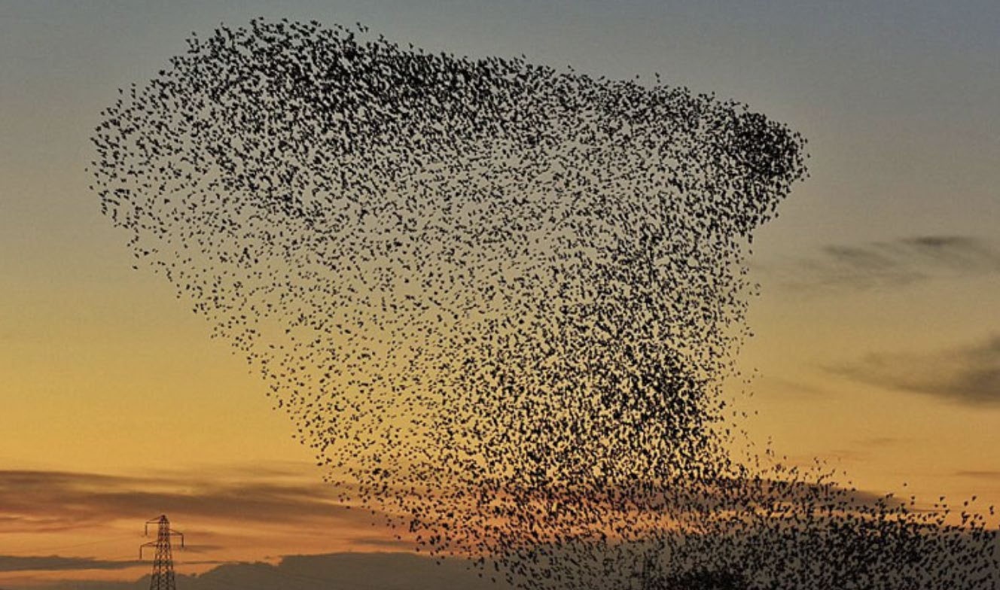

<!-- page: 2 -->

一、背景与意义

Outline
二、进化算法

三、粒子群优化

四、蚁群优化

五、进化计算的前沿研究进展

<!-- page: 3 -->

优化问题无处不在

物流调度优化
车辆调度优化
路径优化
投资组合优化

工业设计优化
云平台资源调度优化
流水线优化

3
优化问题存在于日常生活和工业生产的方方面面

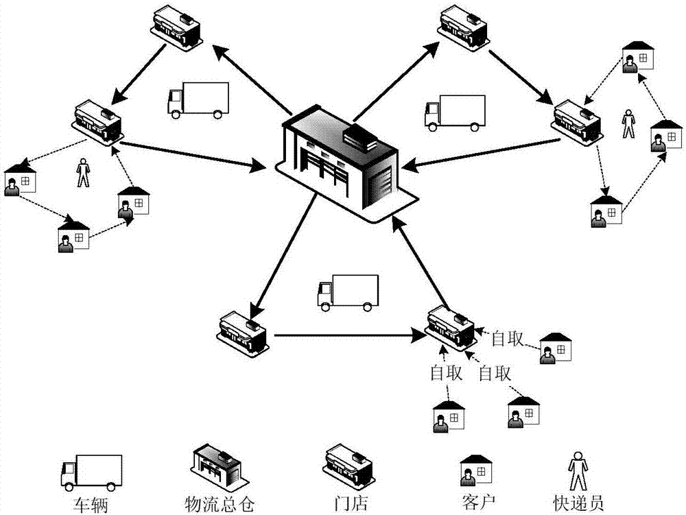

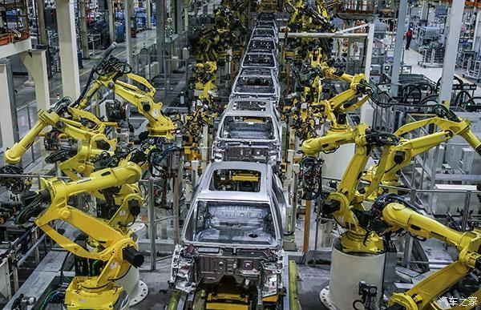

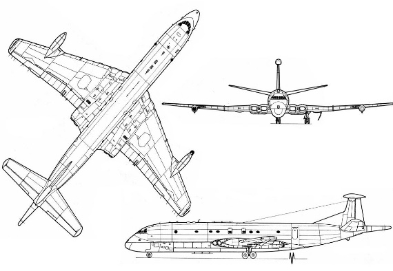

<!-- page: 4 -->

优化问题日益复杂

单峰优化问题
多峰优化问题

线性优化问题

非线性优化问题

4
连续优化问题
离散优化问题
混合变量优化问题

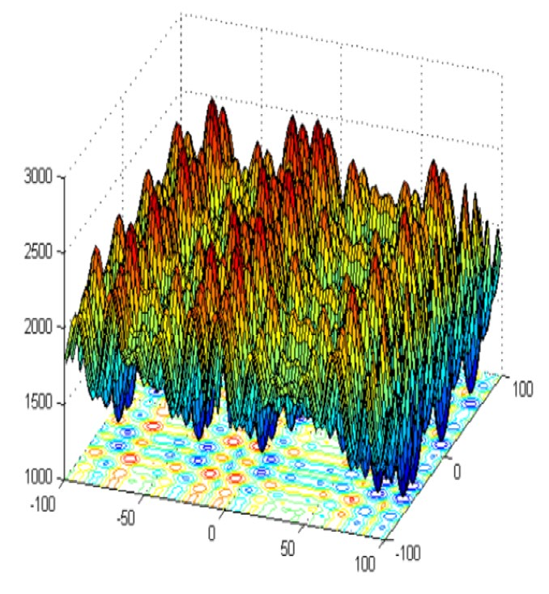

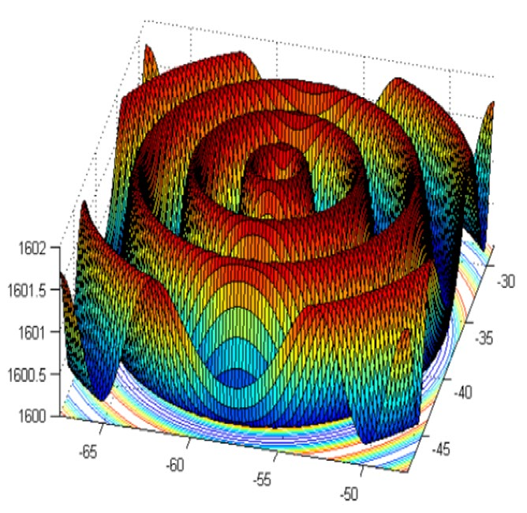

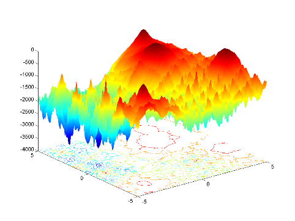

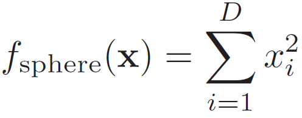

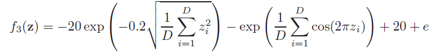

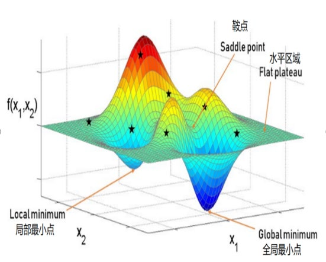

<!-- page: 5 -->

优化问题日益复杂

基于大数据的离散制造知识提取
大数据环境下复杂优化问题特性

高维度
变量紧耦合

非线性
非凸不可导

不连续
多峰
无解析模型
NP-难

5
大数据时代下优化问题日益复杂、难以优化

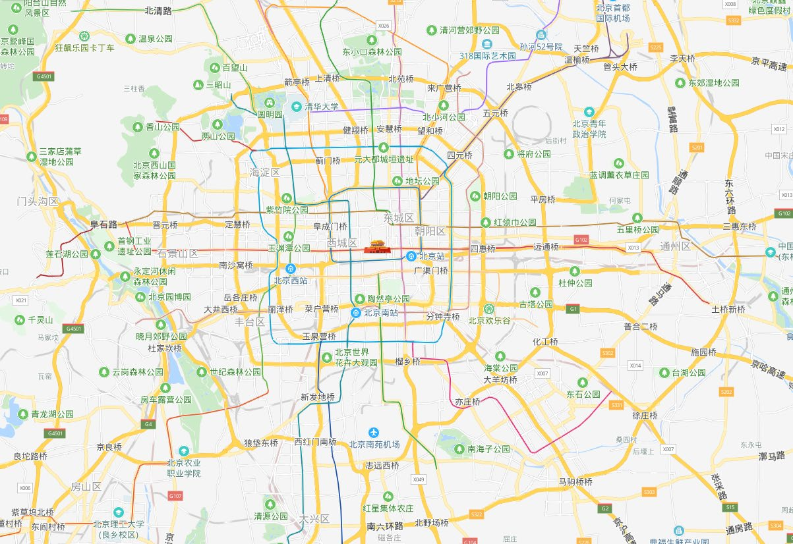

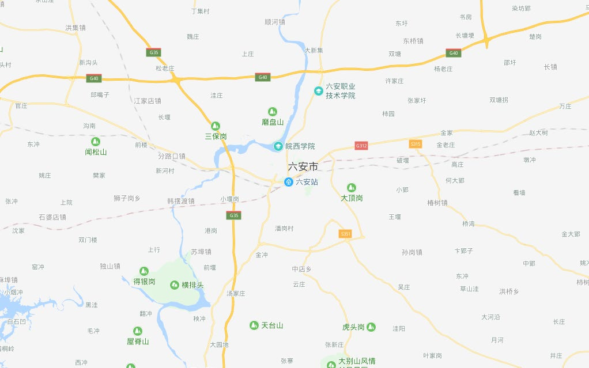

<!-- page: 6 -->

传统优化方法

利用目标函数J(θ)关于参数的梯度∇θJ(θ)的反方向更新参数；

梯度下降

学习率η决定达到最小值或者局部最小值过程中所采用的步长的

大小。

沿着目标函数的斜面下降的方向，直到到达谷底。

批梯度下降法

Vanilla梯度下降法，又称为批梯度下降法（batch gradient

descent）

在执行每次更新时，在整个数据集上计算所有的梯度；

批梯度下降法的速度会很慢；

批梯度下降法无法处理超出内存容量限制的数据集；

批梯度下降法同样也不能在线更新模型，即在运行的过程中，不

能增加新的样本。

6

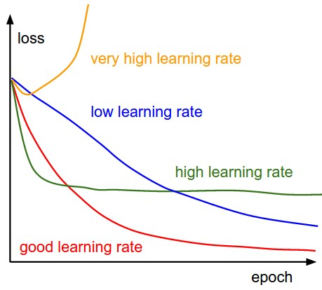

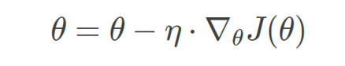

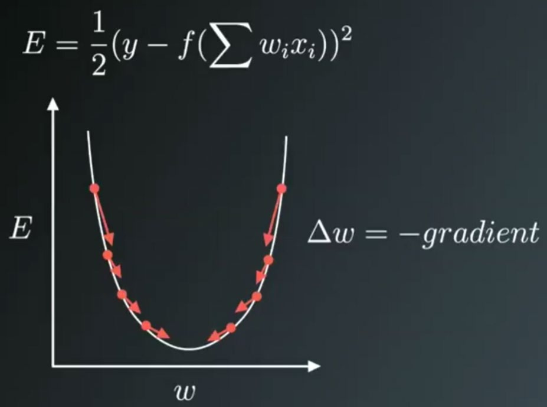

<!-- page: 7 -->

传统优化方法的不足

传统梯度下降等优化方法

基于大数据的离散制造知识提取

可导可微
凸模型
依赖数学模型
连续

对初始化敏感、容易陷入局部最优、甚至无法求解

传统梯度下降等优化方法难以应用于复杂、黑箱的优化难题

7

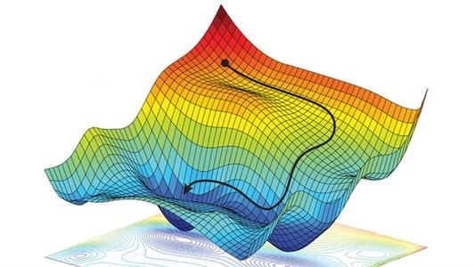

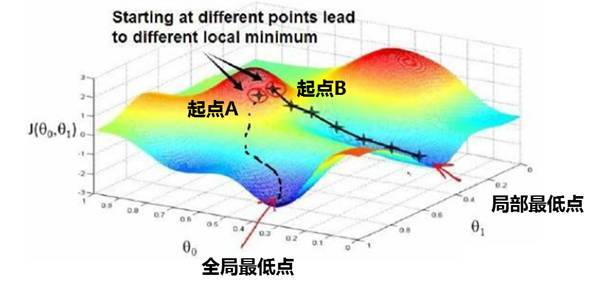

<!-- page: 8 -->

自然启发的群体智能优化方法

 生物进化现象
 社会性生物的合作行为

通过『适者生存』、『优胜劣汰』的生物进化
和自然选择机理，生物群体对环境的适应能力不断
优化

蜂群、鸟群、鱼群、蚁群等社会性生物个体行
为简单，但通过个体间的特定协作可完成极其复杂
的任务

8

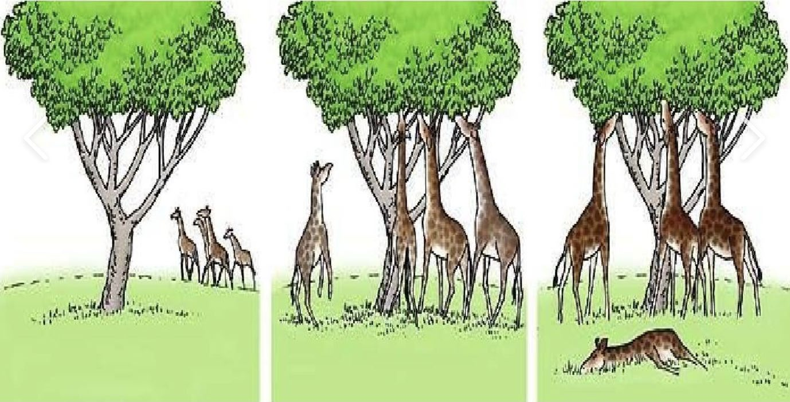

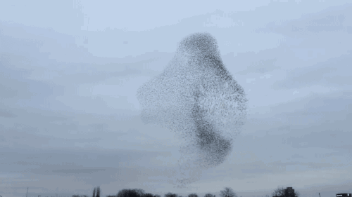

<!-- page: 9 -->

进化计算

进
化
操
作

满
足
终
止
条
件

种
群
初
始
化

适
应
值
计
算

是

开
始

结
束

传统的进化计算

进化操作主要

模拟生物群体

否

的进化行为

基于大数据的离散制造知识提取
启发于自然界的群体智能方法

无需连续可导
无梯度要求

无需解析模型

群体智能优化

进化操作主要

内在并行

种群迭代搜索
一次获得多个解

模拟社会性生

物的合作机理

进化计算已成为求解复杂优化问题的有效途径之一

9

<!-- page: 10 -->

进化计算

维持一个种群迭代式搜索解空间的一类优化方法
10

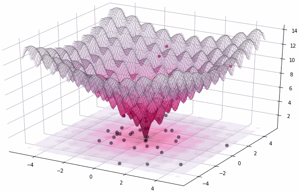

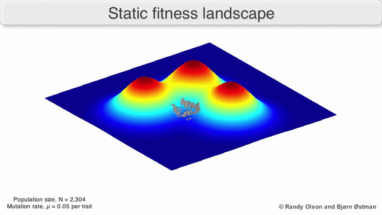

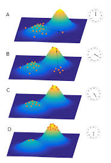

<!-- page: 11 -->

进化计算

随机探索-------多样性

方向指导-------收敛速度

优势

全局优化，多样

性强

不需要求导、计

算梯度等，通用

性强

适用于非凸、黑

箱、动态、多目

标等复杂优化问

带有方向指导性的随机搜索算法

题场景

11

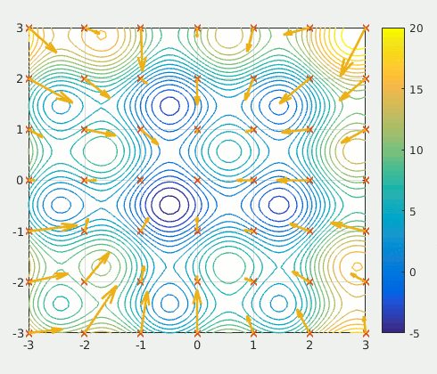

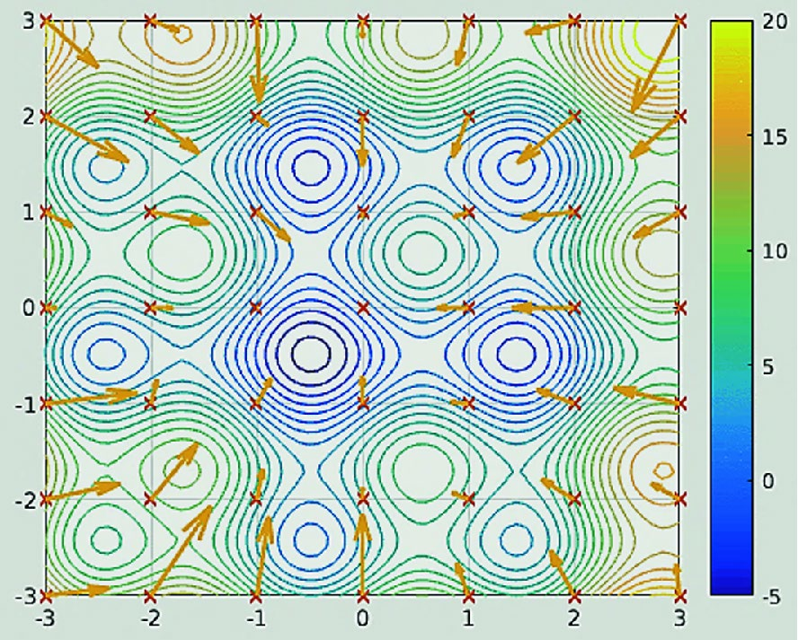

<!-- page: 12 -->

进化计算的主要分类

遗传算法 Genetic Algorithm （GA）

进化算法
Evolutionary

进化策略 Evolutionary Strategy（ES）

Algorithm

进化规划 Evolutionary Programming（EP）

进化计算
Evolutionary

遗传规划 Genetic Programming（GP）

Computation

拓展：差分进化计算、分布估计算法等

蚁群优化 Ant Colony Optimization （ACO）

群体智能

Swarm
Intelligence

粒子群优化 Particle Swarm Optimization （PSO）

12

<!-- page: 13 -->

代表性应用

北京鸟巢体育馆使用遗传算法进行钢结构设计
NASA使用遗传算法设计ST-5航天器的X-Band天线

13

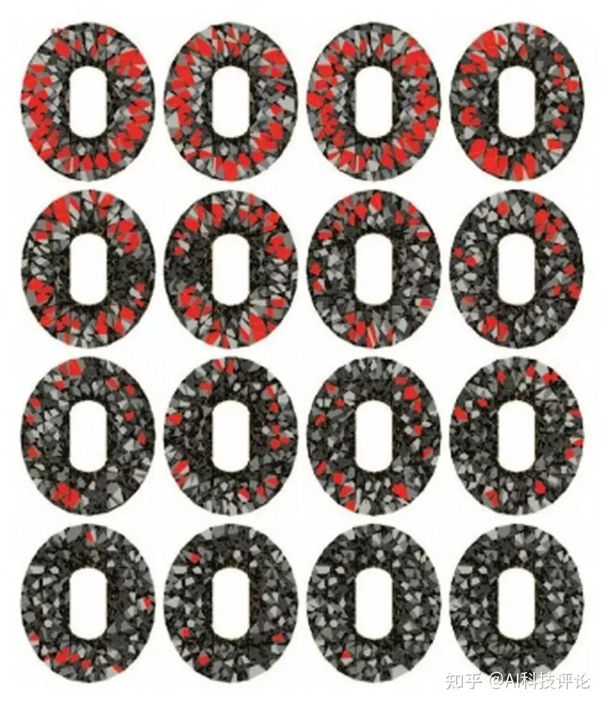

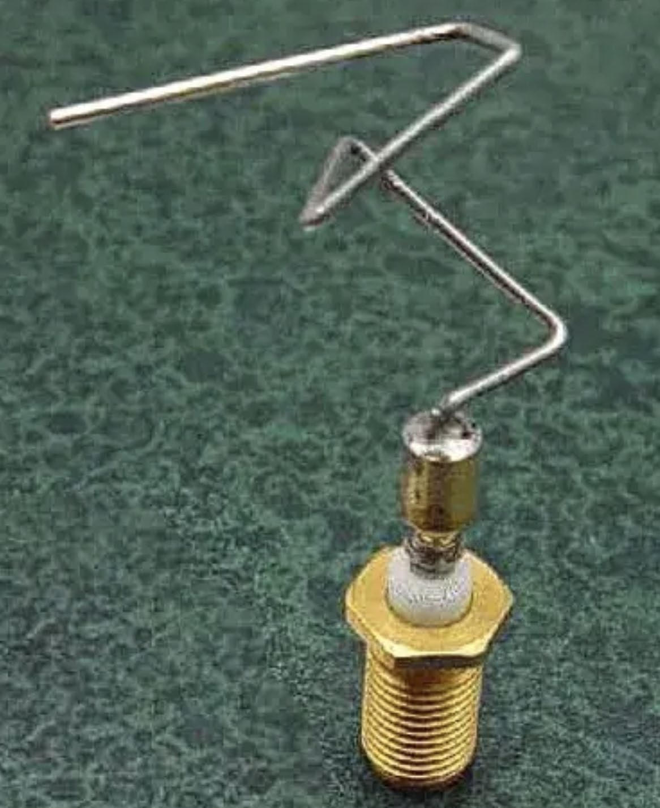

<!-- page: 14 -->

代表性应用

进化深度学习

AI智能体学会动物进化法则：李飞飞等提出深度进化RL
谷歌和OpenAI：如何使用达尔文进化论

辅助设计人工智能算法？

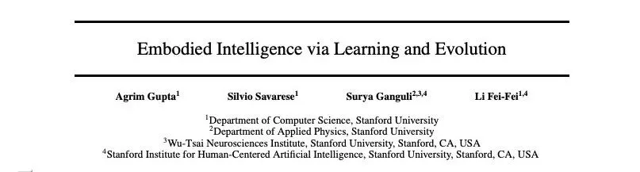

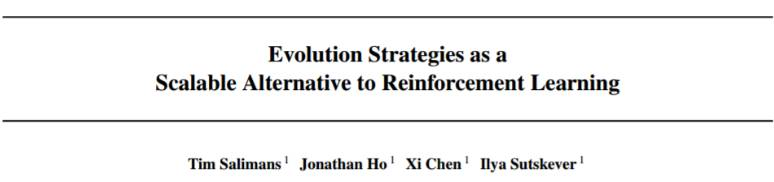

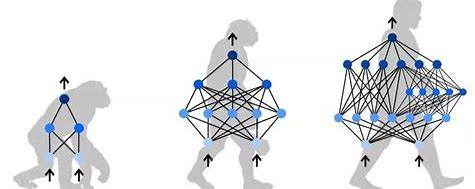

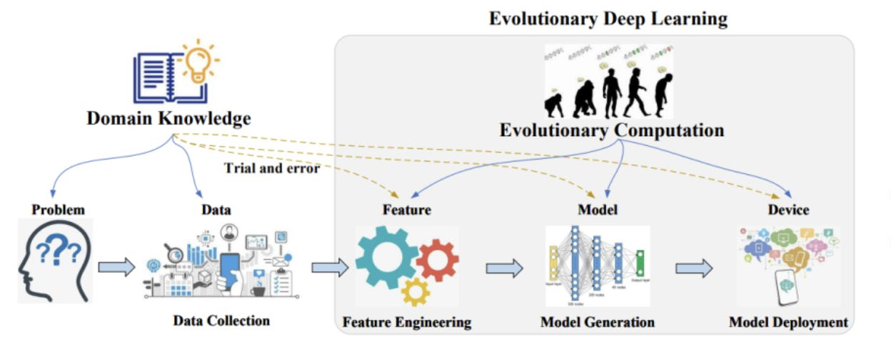

<!-- page: 15 -->

一、背景与意义

Outline
二、进化算法

三、粒子群优化

四、蚁群优化

五、进化计算的前沿研究进展

<!-- page: 16 -->

进化算法

16

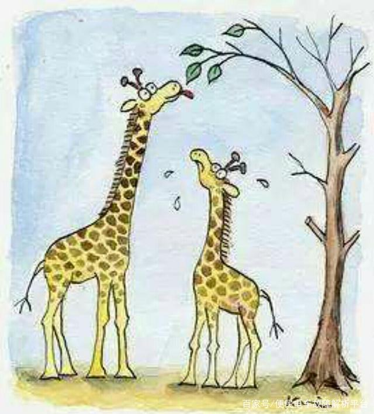

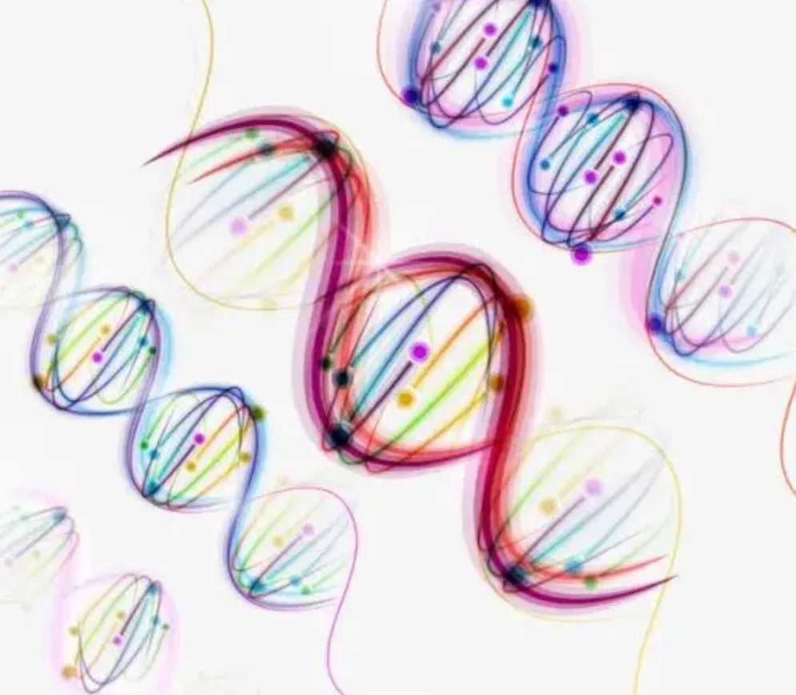

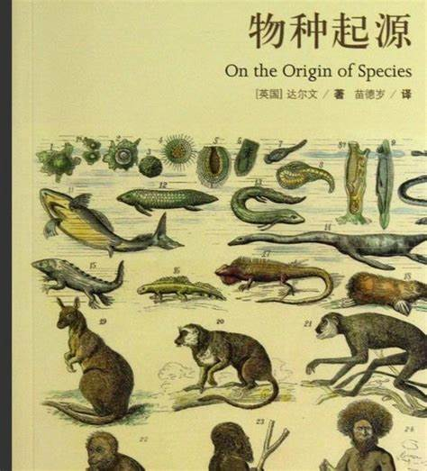

<!-- page: 17 -->

进化算法

经典分类
目前常见方法

遗传算法

遗传算法

进化策略

进化策略

进化算法
Evolutionary

分布估计算法

Algorithm

进化规划

差分进化计算

遗传规划

遗传规划

17

<!-- page: 18 -->

1、遗传算法——起源

遗传算法的思想来源是怎样的？

它由谁提出的？

遗传算法（Genetic Algorithm，GA）

是进化计算的一个分支，
是一种模拟自然界生物进化过程的随机搜索算法。

GA思想源于自然界“自然选择”和“优胜劣汰”

的进化规律，
通过模拟生物进化中的自然选择和交配变异

寻找问题的全局最优解。
它最早由美国密歇根大学教授John H.

Holland提出，
现在已经广泛应用于各种工程领域的优化问

题之中。

18

<!-- page: 19 -->

1、遗传算法——起源

淘汰

遗传基因重组过程

群体

淘汰的

变异

选择

个体

父代染色体1
父代染色体2

新种群

种群

交配

子代染色体1
子代染色体2
生物进化过程

遵循『适者生存』、『优胜劣汰』的原则
模拟生物种群的进化过程
通过选择(Selection)、交叉(Crossover)以及变异(Mutation)

等机制，在每次迭代中保留一组候选个体，重复此过程，种群
经过若干代进化后，理想情况下其适应度达到近似最优的状态。

19

<!-- page: 20 -->

1、遗传算法——基本思想

生物遗传进化过程

遗传算法

生物遗传进化

•搜索空间的一组有效解

•群体

•选择得到的新群体

•种群

•可行解的编码串

•染色体

•染色体的一个编码单元

•基因

类比关系

•染色体的适应值

•适应能力

•染色体交换部分基因得
到新染色体

•交配

•变异

•染色体某些基因的数值改变

•算法结束

•进化结束

遗传算法

20

<!-- page: 21 -->

1、遗传算法——基本流程

满
足
终
止
条
件

进
化
操
作

种
群
初
始
化

适
应
值
计
算

是

开
始

结
束

否

/* P(t)表示某一代的群体，t为当前进化代数

开始

Best 表示目前已找到的最优解*/
Procedure GA

初始化群体

t←0;
initialize(P(t));        //初始化群体
evaluate(P(t));        //适应值评价
     keep_best(P(t));      //保存最优染色体

适应值评价，保存最优染色体

选择

while (不满足终止条件) do
     P(t)← selection(P(t));    //选择算子
     P(t)← crossover(P(t));   //交配算子
     P(t)← mutation(P(t));    //变异算子
     t←t+1;
     P(t)←P(t-1);
     evaluate(P(t));
    if(P(t)的最优适应值大于Best的适应值)
        //以P(t)的最优染色体替代Best
        replace(Best);
     end if
 end while
end procedure

交配

变异

重新评价适应值，更新最优染色体

否

满足终止条件

是

21

结束

<!-- page: 22 -->

1、遗传算法——基本算子

操作
作用
举例

二进制编码、格雷码编码、浮点数
编码、符号编码、多参数交叉编码

染色体

表示问题的

规定适应值𝑬𝑬𝑬𝑬𝑬𝑬𝑬𝑬𝑪𝑪越大的染色体

编码

解

等
适应值

评估各个染
色体适应值

评价

越优
选择
算子

对群体优胜

轮盘赌、最佳个体保存模型、排挤

模型、随机锦标赛模型等
交叉
算子

劣汰选择

交换个体基

两点交叉、多点交叉、均匀交叉、

算术交叉等
变异
算子

因

随机变化新
的个体基因

边界变异、高斯变异、非均匀变异

等

22

<!-- page: 23 -->

1、遗传算法——算法编码

二进制编码：二进制编码方法

产生的染色体是一个二进制符

号序列，染色体的每一个基因

只能取值0或1

10进制实数:128
2进制:10000000
编码

交叉变异

解码

10010100

二进制编码的遗传算法过程

23

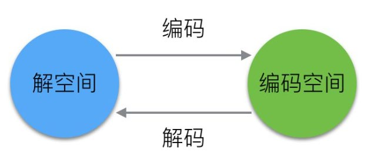

<!-- page: 24 -->

1、遗传算法——算法编码

缺点
由于Hamming悬崖的存在，

二进制编码对于实数域函数
优化存在很大的问题
精度不足，易产生误差

10进制实数:128
2进制:10000000

10进制实数:127
2进制:01111111

127
128
表现型空间相邻点

2进制:10000000
2进制:01111111
Hamming距离巨大

难以实现

24

<!-- page: 25 -->

1、遗传算法——算法编码

实数编码：使用具体的浮点数直接组成染色体,适用于较高精度

或者表示较大范围的函数的优化

待解问题的有效解
对应染色体编码方式

25

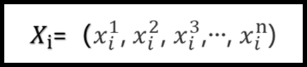

<!-- page: 26 -->

1、遗传算法——初始化

• 采用均匀随机数初始化方法，对染色体的每一维变量在定

义域内进行初始化赋值。初始化染色体时必须注意染色体

是否满足优化问题对有效解的定义；

• 挑战：尽量让初始化种群分散在整个解空间，而不要集中

于某一区域；

• 如果在进化开始时保证初始群体已经是一定程度上的优良

群体的话，将能够有效提高算法找到全局最优解的能力。

26

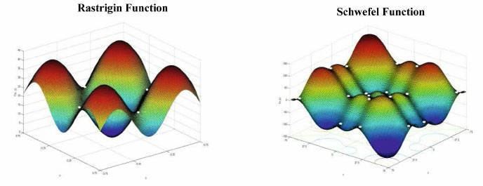

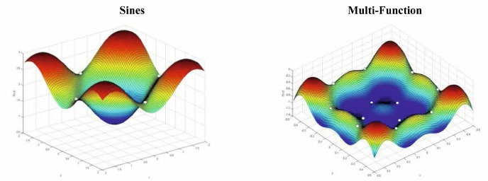

<!-- page: 27 -->

1、遗传算法——初始化

评估函数用于评估各个染色体的适应

值，进而区分优劣。评估函数常常根
据问题的优化目标来确定，比如在求
解函数优化问题时，问题定义的目标
函数可以作为评估函数的原型。

在遗传算法中，规定适应值越大的染色体越优。因此对

于一些求解最大值的数值优化问题，我们可以直接套用
问题定义的函数表达式。但是对于其他优化问题，问题
定义的目标函数表达式必须经过一定的变换。

27

<!-- page: 28 -->

1、遗传算法——选择算子

遗传算法的原理从本质上来说基于达尔文的自然选择学说

选择提供了遗传算法的驱动力

驱动力太大 -> 遗传搜索将过早地终止

驱动力太小 -> 进化过程将慢得难以接受

轮盘赌选择
锦标赛选择

28

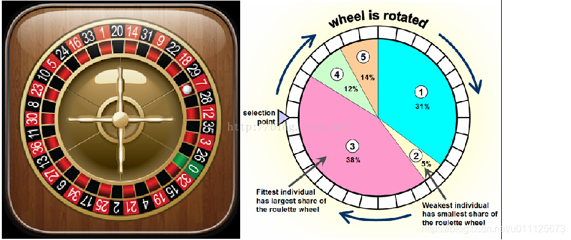

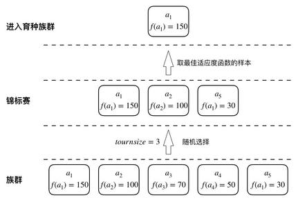

<!-- page: 29 -->

1、遗传算法——选择算子

轮盘赌选择

各个个体被选中的概率与其适应度大小成正比．

/* once of roulette wheel selection
 * 输出参数：
 * 选中的染色体
*/
procedure RWS
1  m←0;
2    r←Random(0,1); //0至1的随机数
3    for i=1 to N
4       m←m+Pi;
5       if r ＜= m
6         return i;
        7       end if
        8    end for

1.计算每个个体的适应度值。

2.计算种群所有个体的选择概率：

(
)
(
)
i
i
n

f
x
p x

=

∑

x
=

i
i

1

3.计算个体的积累概率：

i

j
j
q i
p x
=
= ∑

1
( )
(
)

4.在[0, 1]区间生成一个随机数r

,

x
r
q
selection
x
q
r
q
−

<

= 
<
<=


1
(1)

,
k
k
k

end procedure

(
1)
( )

5.重复(4)共N次。这样就选出来了一个新的种群。

29

<!-- page: 30 -->

轮盘赌选择
1、遗传算法——选择算子

30

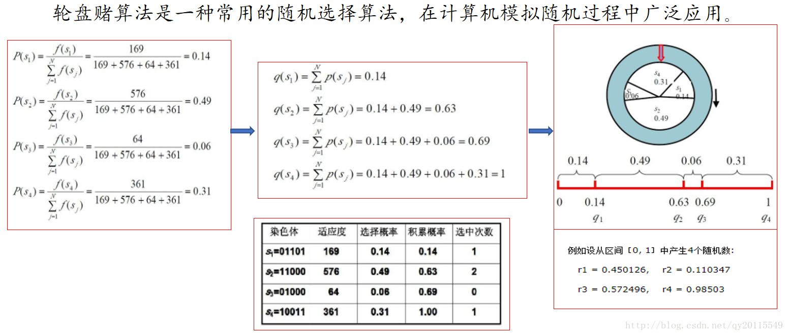

<!-- page: 31 -->

1、遗传算法——选择算子

有放回的随机采样

锦标赛选择

(1)确定每次选择的个体数量N；（二元锦标赛选择即选择2个个体）

(2)从种群中随机选择N个个体(每个个体被选择的概率相同) ，根据每

个个体的适应度值，选择其中适应度值最好的个体进入下一代种群。

(3)重复步骤(2)多次（重复次数为种群的大小），直到新的种群规模

达到原来的种群规模。

确定锦标赛规
模N(二元/三元)

N个个体进行比赛，
选出冠军进入种群中

随机选择N个

个体

重复N次

31

<!-- page: 32 -->

每个染色体以Px的概率参与交叉———信息交换
1、遗传算法——交叉算子

单点交叉（One-point Crossover）
指在个体编码串中只随机设置一
个交叉点，然后再该点相互交换
两个配对个体的部分染色体。

两点交叉（Two-point Crossover）

在个体编码串中随机设置了两个交

叉点，然后再进行部分基因交换。

32

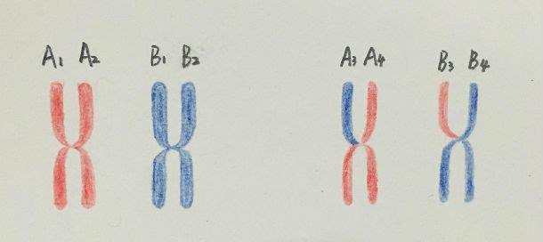

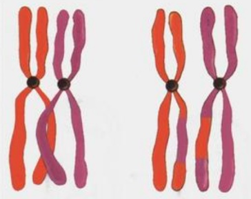

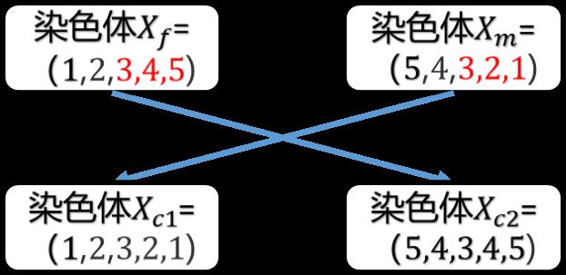

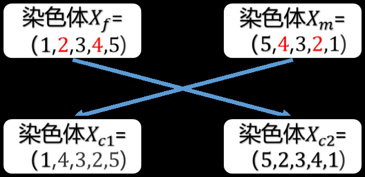

<!-- page: 33 -->

每个基因有Pm的概率进行变异
1、遗传算法——变异算子

变异运算：将个体染色体编码串中的某些基因座上的基因值用

该基因座上的其它等位基因来替换，从而形成新的个体。

均匀变异（Uniform Mutation）

用某一范围内均匀分布的随机数，以某一较小的概率来

替换个体编码串中各个基因座上的原有基因值。

X∈[min，max]

均匀变异

33

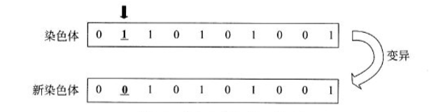

<!-- page: 34 -->

1、遗传算法——变异算子

边界变异

随机取基因的两个对应边界值之一替代原有基因值；适用

于最优点位于或接近于可行解的边界时的一类问题。

x=min or max

高斯近似变异

进行变异操作时用当前基因值为均值，方差为δ的正态分布

采样一个随机数来替换原有的基因值。

非均匀变异

对原有基因值做随机扰动，以扰动后的结果作为变异后的新

基因值。对每个基因都以相同的概率进行变异之后，相当于
整个解向量作了一次轻微的变动。

34

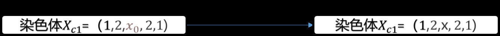

<!-- page: 35 -->

1、遗传算法——整体流程

1.初始化

2.适应度评价

3.选择

4.交叉

5.变异

确定好编
码方式之
后，就可
以对种群
里的NP
个体进行
初始化

评价函数
用于评估
每个染色
体的适应
值，进而
区分优劣

按照一定
的随机性
选出原始
种群中优
秀的染色
体，组成
新的种群

按照一定的
随机性选出
原始种群中
两条优秀的
染色体组成
父代，通过
交叉操作产
生子代

对重新组
成的种群
进行基因
变异操作，
最后形成
当前代最
终的种群

初始化
评价
择优选择

色体交叉
按概率Pm

按概率Px染

基因变异

35

<!-- page: 36 -->

1、遗传算法——整体流程

36

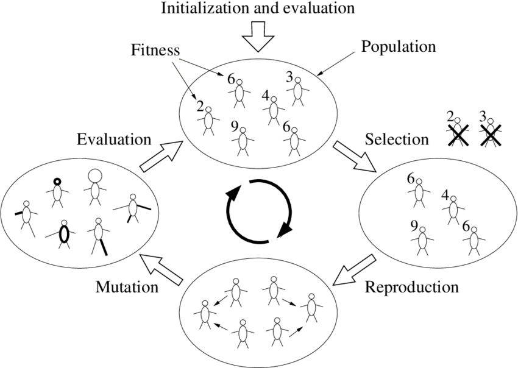

<!-- page: 37 -->

2、进化策略——基本思想

满
足
终
止
条
件

进
化
操
作

种
群
初
始
化

适
应
值
计
算

是

开
始

结
束

否

采样
评估
选择
更新

采样产生一个
或者一组候选
解(candidate
solutions)

对新产生的解
计算对应的目
标函数值

依据目标函数
值选择部分或
者全部解

使用选择的解
更新分布参数

37

<!-- page: 38 -->

2、简单高斯进化策略——分布估计算法

什么是分布估计算法？

分布估计算法的思想来源是怎样的？

它由谁提出的？

分布估计算法
（Estimation of Distribution Algorithm，EDA）
是进化算法的一个分支，通过统计学习建立解空间内个体分布的概率模
型,然后对概率模型随机采样产生新的群体,如此反复进行,实现群体的进化。

它的概念最初是1996年由P. Larrañaga and J. A. Lozano提出，在2000年

左右迅速发展。

EDA算法具有全局探索能力强，多样性高，不
容易陷入局部最优等优势，已经被广泛应用于各

类优化问题的求解。

<!-- page: 39 -->

2、简单高斯进化策略——分布估计算法

分布估计算法思想起源于遗传算法。

结合了统计学习理论和遗传算法的原理，通过构建概率模型、

采样和更新等操作实现群体的进化。

遗传算法是“微观”层面上对生

物进化进行模拟。

分布估计算法是在“宏观”的层

面上来控制算法搜索，是一种全

新的进化模型。

算法更加简单易操作，没有太多

的参数，优化性能强大。

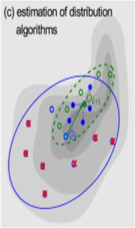

<!-- page: 40 -->

2、简单高斯进化策略——分布估计算法

选择算子---如何从种群

中选择适当的个体进行概

率分布的估计。

概率分布估计---选择何

种概率分布模型进行评估；

用什么方式进行评估（单

变量或者多变量）。

随机采样---如何采样？

是否需要缩放？

总体原则---均衡多样性

和收敛速度。

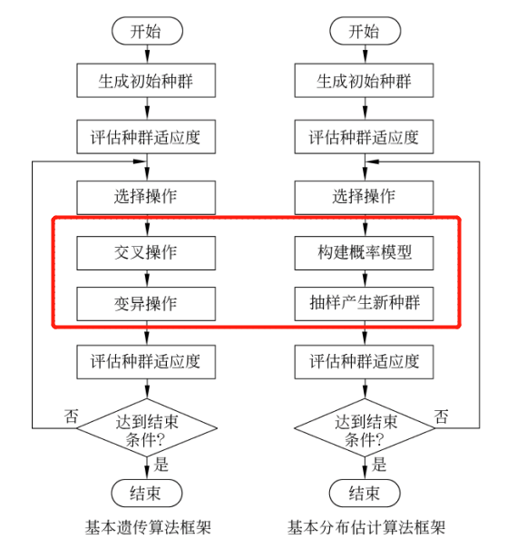

<!-- page: 41 -->

2、简单高斯进化策略——分布估计算法

采用均匀分布在解空间随机生成种群，规模为N

开始

(
)
min
,
max
m n
0
i
rand(0,1)
,
1,2,3,
,
j
j
j
i

j
x
x
x
x
j
D
=
+
⋅
−
=
…

初始化群体

选择优质群体：按照适

应度从好到坏的顺序对
种群进行排序，并从中
选出最优的S 个个体
（S<=N）。

选择优质群体

建立概率模型

随机采样

新群体

否

满足条件

是

结束

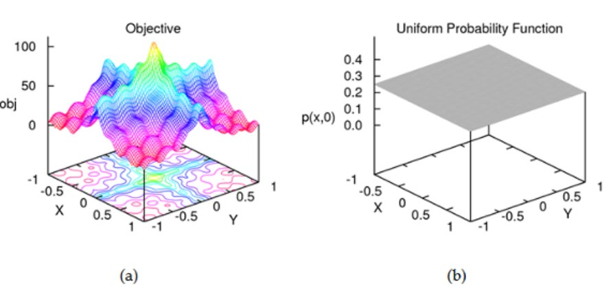

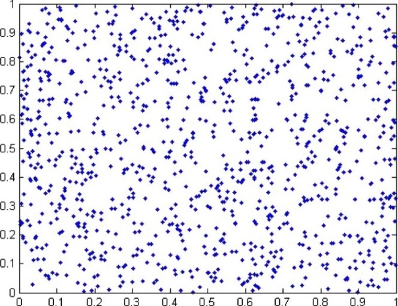

<!-- page: 42 -->

2、简单高斯进化策略——分布估计算法

依据所选择的个体，评估种群的概率分布p(x).

开始

n
S

=
=
=∏

1
( )
( |
)
( )

i
i
p x
p x D
p x

初始化群体

n为维度大小，p(xi)为每维变量的概率分布。

选择优质群体

利用高斯分布模型采样生成新群体

建立概率模型

从新建的概率模型 p(x)中采样，得到N个新样

随机采样

本，构成新种群。

新群体

否

满足条件

是

结束

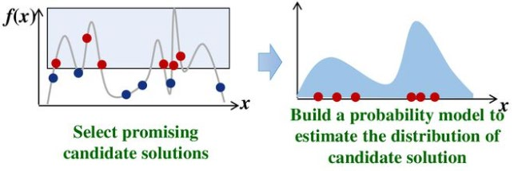

<!-- page: 43 -->

2、简单高斯进化策略——分布估计算法

分布估计算法通过分析较优群

开始

体所包含的变量，构建符合这

初始化群体

些变量分布的概率模型；

概率模型是基于种群中优势群

选择优质群体

体建立起来的，基于该模型产

建立概率模型

生的新种群在整体质量上将优

于原来的种群；

随机采样

种群的整体质量经过多次迭代

新群体

后将不断得到提高；

分布估计算法就是按照这种形

否

满足条件

式将当前最优解一步一步地逼

是

近全局最优解。

结束

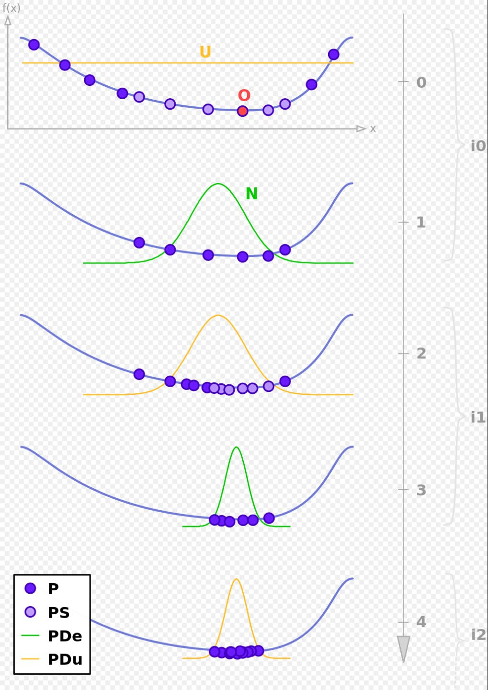

<!-- page: 44 -->

2、简单高斯进化策略——分布估计算法

绿点： 每一代分布函数的均值

蓝点： 所有根据分布采样得到的点

红点： 当前最优解

44

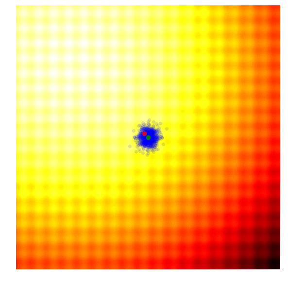

<!-- page: 45 -->

2、简单高斯进化策略——分布估计算法

初始化高斯分布

采样

选择精英集

更新高斯分布

45

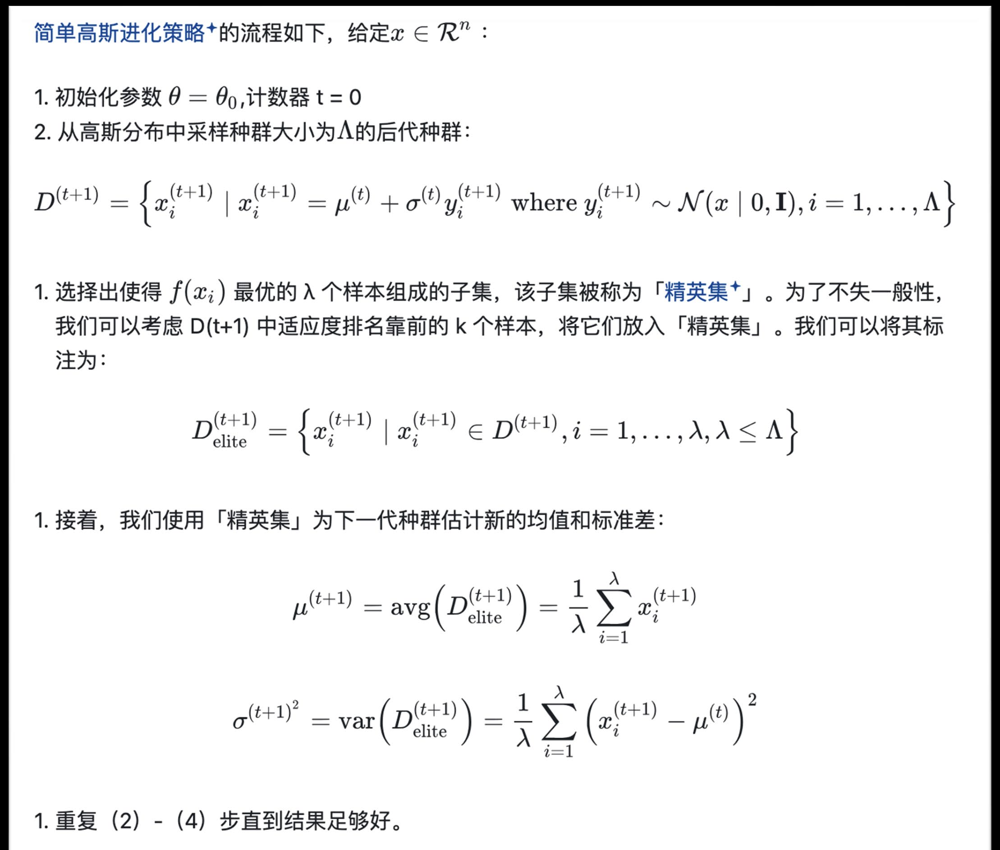

<!-- page: 46 -->

2、协方差自适应进化策略 CMA-ES

简单高斯进化策略有什么不足？

1、标准差的噪声参数是固定的
2、只考虑了各维度独立的高斯分布进行采样

解决办法：
1、自适应的高斯噪声参数
2、采样协方差矩阵，考虑变量之间的相互关系
CMA-ES已成为目前最流行的黑箱优化工具之一

<!-- page: 47 -->

2、协方差自适应进化策略 CMA-ES

简单高斯进化策略
CMA-ES

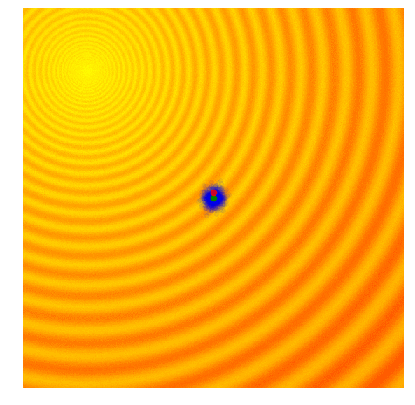

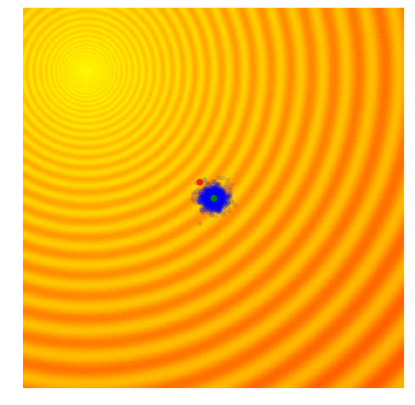

<!-- page: 48 -->

2、协方差自适应进化策略 CMA-ES

首先生成一组多元正态分布                          ，对其进行线性变化转成标
准正态分布的一个变形：

初始化高斯分布

采样

采样公式

从λ个后代中选取μ个权重最大的作为更新均值的样本数
据，常用前1/4的个体选择作为精英

选择精英集

更新高斯分布

计算协方差矩阵，控制步长

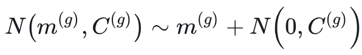

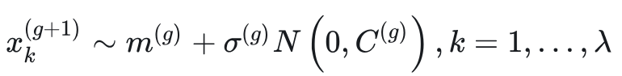

<!-- page: 49 -->

2、协方差自适应进化策略 CMA-ES

多元正态分布与协方差矩阵

对于一个二维向量x和一个正定实对称矩阵C，方程                      ,其中D是常量，
描述了一个中心在原点的椭圆。中心在原点的椭圆协方差矩阵的几何解释如下图：
椭圆的主轴对应协方差的特征向量，主轴长度对应协方差的特征值的大小。

左图： 两方向同心圆

中图：y轴方向拉伸

右图：拉伸后旋转，方
向沿着其梯度下降最快
的方向

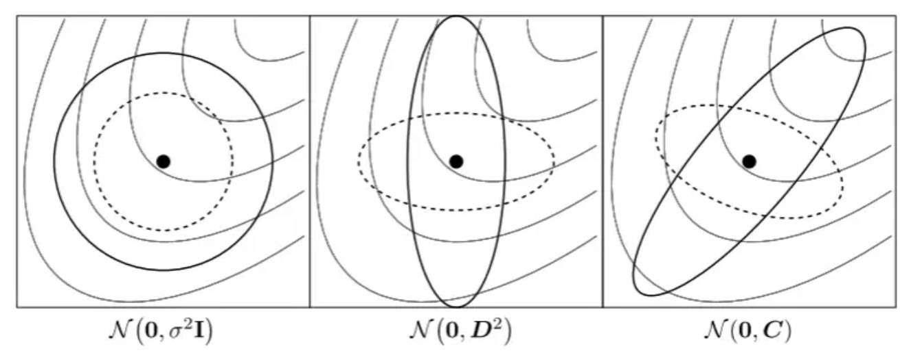

<!-- page: 50 -->

2、协方差自适应进化策略 CMA-ES

步长控制

CMA-ES 默认使用累积式步长调整 (Cumulative step size adaptation，CSA) 。CSA
是当前最成功、用的最多的步长调整方式。CSA 的原理可以理解为：相继搜索的
方向应该是共轭的。

•当演化路径太短时，搜索步之间会相
互抵消，此时步长需要减小
•当演化路径较长时，每个搜索步之间
的方向相似，搜索路径可由指向相同的
少量长路径来代替, 此时应增加步长
•当演化路径较长，理想情况下单个步
骤的方向大致垂直时，各搜索步是不相
关的，此时是理想步长

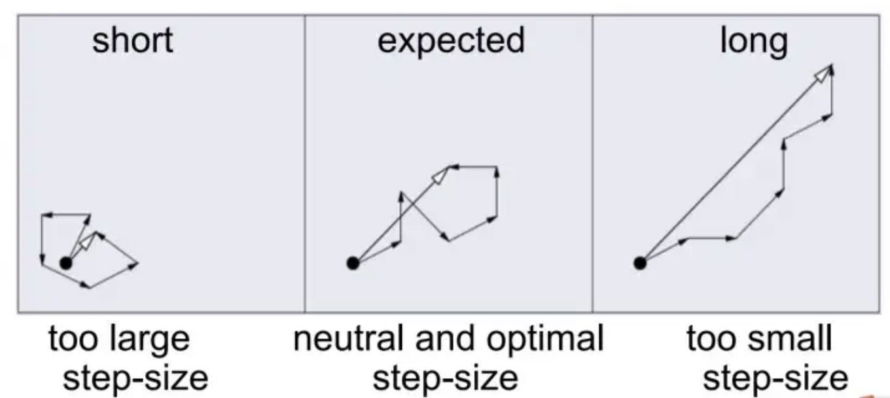

<!-- page: 51 -->

2、协方差自适应进化策略 CMA-ES

延伸阅读

CMA-ES 代码

CMA-ES 学习指南： https://arxiv.org/abs/1604.00772
https://cma-es.github.io/cmaes_sourcecode_page.html

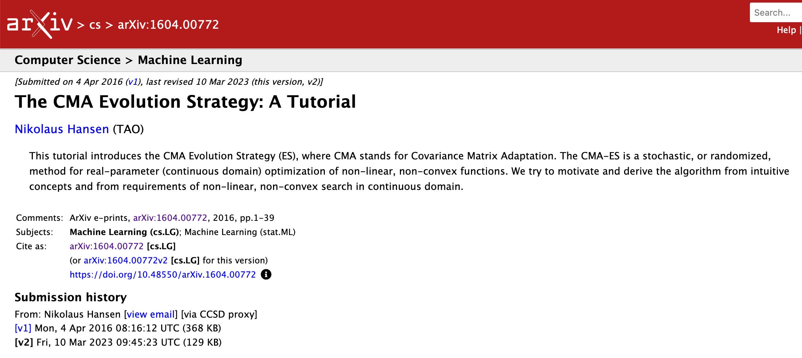

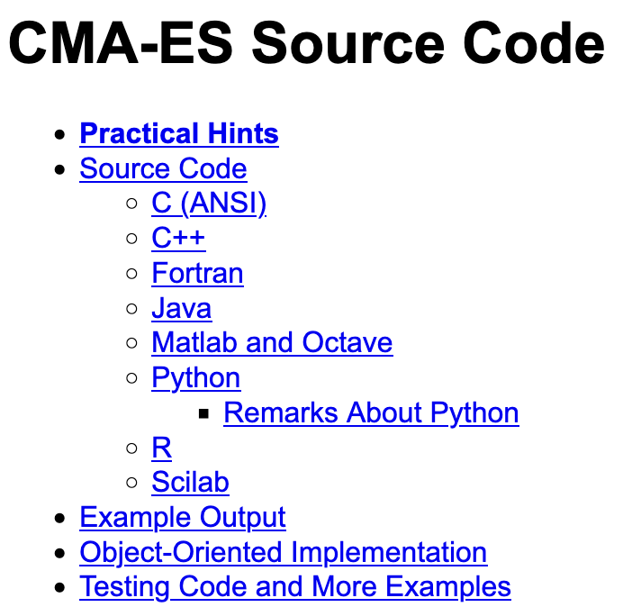

<!-- page: 52 -->

3、差分进化计算方法——起源

差分进化算法是什么？

差分进化算法的思想来源是怎样的？

它由谁提出的？

差分进化算法
（Differential Evolution，DE）
是进化计算的一个分支，维持一个种群迭代式搜索解空间，通过

群体协作寻找到问题的全局最优解。
它是1997年由美国学者R. Storn和K. Price为求解Chebyshev多项

式而提出的。

DE与PSO算法已成为群体智能的研究前沿，
现在已经广泛应用于各种工程领域的优化问题之

中。

<!-- page: 53 -->

3、差分进化计算方法——起源

差分进化思想来源于早期提出的遗传算法
模拟遗传学中的杂交(crossover)、变异(mutation)、选择

(selection)来设计算子
相同点：通过随机生成初始种群，以种群中每个个体的适应度值为

选择标准，包括变异、交叉和选择三个步骤

不同之处：遗传算法是根据适

应度值来控制父代杂交，适应
值大的个体被选择的概率较大。
差分进化算法变异向量是由父

代差分向量生成，并与父代个
体向量交叉生成新个体向量，
直接与其父代个体进行选择。
显然差分进化算法相对遗传算

法的逼近效果更加显著。

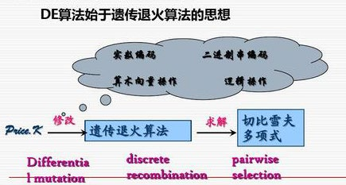

<!-- page: 54 -->

3、差分进化计算方法——总体框架

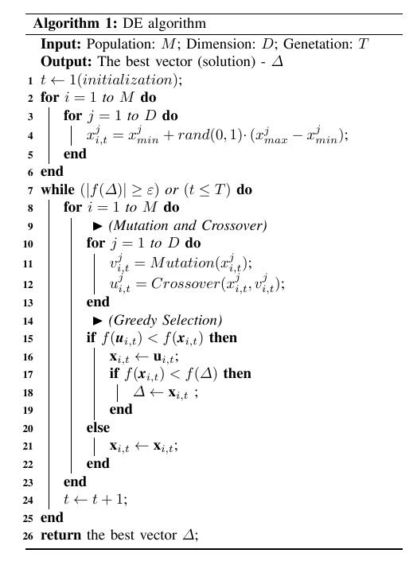

<!-- page: 55 -->

采用均匀分布在解空间随机生成个体
3、差分进化计算方法——初始化

(
)
min
,
max
m n
0
i
rand(0,1)
,
1,2,3,
,
j
j
j
i

j
x
x
x
x
j
D
=
+
⋅
−
=
…

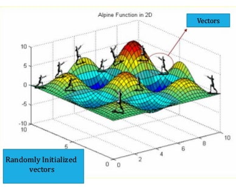

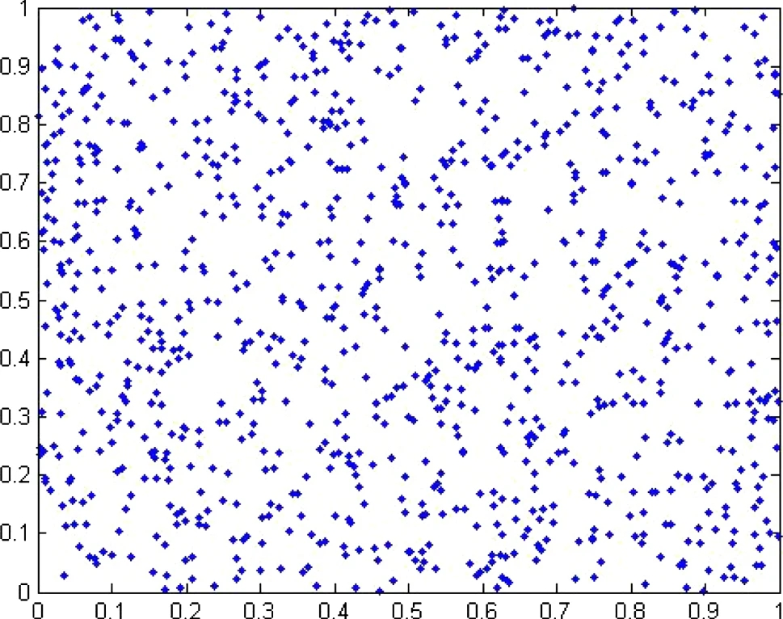

<!-- page: 56 -->

3、差分进化计算方法——变异

(
)
1
2
3
,
,
,
,
i g
r g
r g
r g
V
X
F
X
X
=
+
⋅
−
DE/rand/1

F为缩放因子；F

越大，变异向量

的变化就越大。

r1，r2，r3为从种

群中随机选择的

三个互不相同的

个体且满足r1≠ r2

≠r3 ≠ i

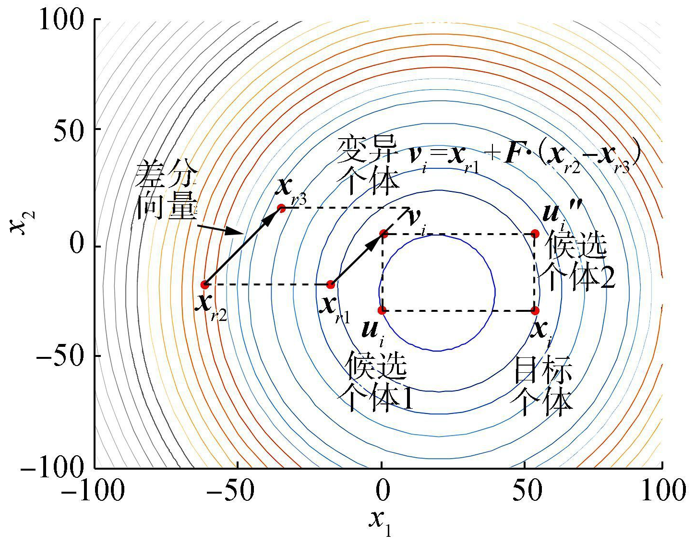

<!-- page: 57 -->

3、差分进化计算方法——变异

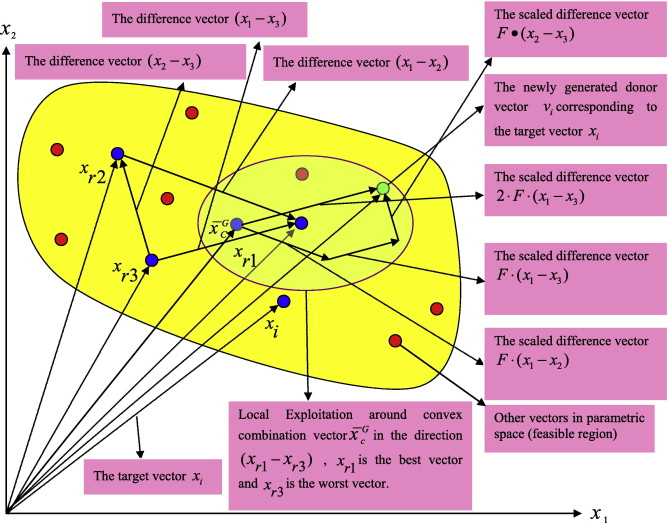

<!-- page: 58 -->

3、差分进化计算方法——交叉


二项交叉


≤
=

= 

j
i g
j
i g
j
i g

,
 if rand(0,1)
CR or

v
j
j
u
x

,
rand
,

,
 otherwise

,

CR 为交叉概

率;CR越大，所得

的子代与父代差异

越多。

jrand为从维度D中

随机选择的一个整

数，用以保证至少

有一个元素来自变

异个体

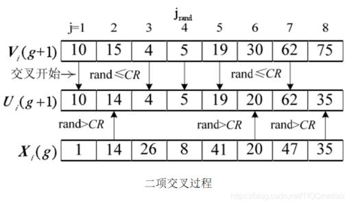

<!-- page: 59 -->

3、差分进化计算方法——选择

(
)
(
)
,
,
,
,
1


≤

= 

,
 if

U
f U
f
X
X

i g
i g
i g
i g

X
+

,
 otherwise


策略（1）：每个子代与各自的父代比较，适应值好者保留

,

i g

策略（2）：每个子代与距离最近的父代比较，适应值好者保留

<!-- page: 60 -->

3、差分进化计算方法——总体框架

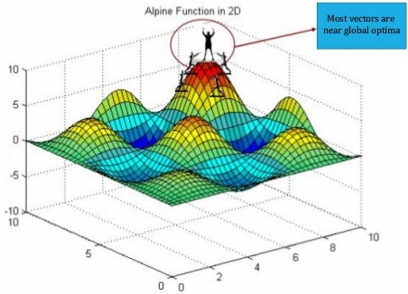

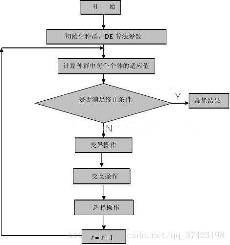

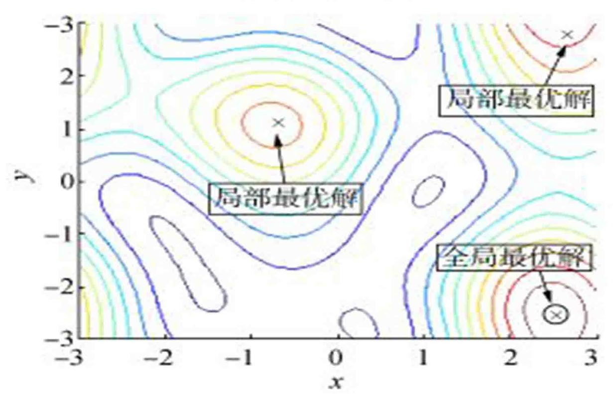

<!-- page: 61 -->

3、差分进化计算方法——举例

例   求解如下四维Rosenbrock函数的优化问题．

3
2
2
2
1
1
min
( )
[100(
)
(
1) ]
+
=
=
−
+
−
∑
i
i
i
i
f
x
x
x
x

[ 30,30] (
1,2,3,4)
∈−
=
ix
i

算法的相关设计分析如下．

5
m =

即算法中个体的数量，取

种群大小：

编码：因为问题的维数是4，所以每个个体的位置均为

4 维的实数向量．

参数设置：F=0.9，CR=0.5

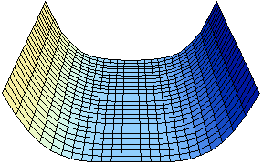

<!-- page: 62 -->

3、差分进化计算方法——举例

初始化

随机初始化各个体的位置

0
ix

设各粒子的初始位置为：

初始位置：

(0)
1
{27.0978278866636
-4.62986309947153
-11.9127030772761
9.99167480415521}
=
x

(0)
2
{25.2199223901938
2.87225407289068
12.0659253540556
-19.3120527359797}
=
x

(0)
3
{-26.8393801391524
26.5642190566161
9.98033109506554
-22.3191360167896}
=
x

(0)
4
{14.2714857310198
-4.93535374100027
2.34758790257140
29.9448236856816}
=
x

(0)
5
{-13.8528344160866
28.9831479881914
11.8863312108185
-19.7327360186141}
=
x

<!-- page: 63 -->

计算适应值
3、差分进化计算方法——举例

初始位置：

(0)
(0)
(0)
(0)
(0)
1
2
3
4
5
,
,
,
,
x
x
x
x
x

计算每个个体的适应值

3
2
2
2
1
1
( )
[100(
)
(
1) ]
i
i
i
i
f
x
x
x
+
=
=
−
+
−
∑
x

按照
计算适应值

(0)
1
(
)
56452993.7380424
f
=
x

历史最优解

(0)
2
(
)
42812031.3328011
f
=
x

(0)
3
(
)
98019006.3572426
f
=
x

(0)
4
(
)
4460198.79419000
f
=
x

(0)
4
g =
p
x

(0)
4
(
)
(
)
g
f
f
=
p
x

(0)
5
(
)
73829024.6969565
f
=
x

<!-- page: 64 -->

变异算子
3、差分进化计算方法——举例

1
2
3
(1)
(0)
(0)
(0)
(
)
r
r
r
i
F
=
+
−
u
x
x
x

1
2
3
,
, ]
[
[
2
]
4 5
r r r =

(1)
1
{50.5318105225896
-27.6543974833818
3.48105637663318
25.3977509978864}
u
=

1
2
3
,
, ]
[
[
3
]
1
 4
r r r =

(1)
2
{-9.90195139649140
23.7197524183832
-5.04323420403135
-37.0458889280690}
u
=

1
2
3
,
, ]
[
[
4
]
5 2
r r r =

(1)
3
{-20.8939953946326
18.5644507827704
2.18595317365803
29.5662087313107}
u
=

1
2
3
,
, ]
[
[
5
]
2 3
r r r =

(1)
4
{33.0005378603250
7.66037950283853
13.7633660439095
-17.0263610658852}
u
=

1
2
3
,
, ]
[
[
4
]
1 2
r r r =

(1)
5
{15.9616006778426
-11.6872591961263
-19.2331776856271
56.3181784718031}
u
=

<!-- page: 65 -->

3、差分进化计算方法——举例

越界处理
(1)


<

= 
>


LB
u
LB
u

,
(1)

i j

,
(1)

i j

UB
u
UB

,

i j

(1)
1
{30.00
-27.6543974833818
3.48105637663318
25.3977509978864}
u
=

(1)
2
{-9.90195139649140
23.7197524183832
-5.04323420403135
-30.00}
u
=

(1)
3
{-20.8939953946326
18.5644507827704
2.18595317365803
29.5662087313107}
u
=

(1)
4
{30.00
7.66037950283853
13.7633660439095
-17.0263610658852}
u
=

(1)
5
{15.9616006778426
-11.6872591961263
-19.2331776856271
30.00}
u
=

<!-- page: 66 -->

交叉算子
3、差分进化计算方法——举例


≤

= 

(1)

()
i j

u
if rand
CR

,
(1)


v

,
(0)

i j

x
otherwise

,

i j

(0)
1
{27.0978278866636
-4.62986309947153
-11.9127030772761
9.99167480415521}
=
x

(1)
1
{30.00
-27.6543974833818
3.48105637663318
25.3977509978864}
u
=

{0.0326008205305280
0.368916546063895
0.644764536870088 0.120611613297162}
r =

(1)
1
{30
-27.6543974833818
-11.9127030772761
25.3977509978864}
v
=

(0)
2
{25.2199223901938
2.87225407289068
12.0659253540556
-19.3120527359797}
=
x

(1)
2
{-9.90195139649140
23.7197524183832
-5.04323420403135
-30.00}
u
=

{0.561199792709660
0.460725937260412
0.376272210278832 0.589507484695059}
r =

(1)
2
{25.2199223901938
23.7197524183832
-5.04323420403135
-19.3120527359797}
v
=

<!-- page: 67 -->

3、差分进化计算方法——举例

交叉算子

(0)
3
{-26.8393801391524
26.5642190566161
9.98033109506554
-22.3191360167896}
=
x

(1)
3
{-20.8939953946326
18.5644507827704
2.18595317365803
29.5662087313107}
u
=

{0.881866500451810
0.981637950970750 0.190923695236303 0.226187679752676}
r =

(1)
3
{-26.8393801391524
26.5642190566161
2.18595317365803
29.5662087313107}
v
=

(0)
4
{14.2714857310198
-4.93535374100027
2.34758790257140
29.9448236856816}
=
x

(1)
4
{30.00
7.66037950283853
13.7633660439095
-17.0263610658852}
u
=

{0.669175304534394
0.156404952226563 0.428252992979386 0.384619124369411}
r =

(1)
4
{14.2714857310198
7.66037950283853
13.7633660439095
-17.0263610658852}
v
=

(1)
5
{15.9616006778426
-11.6872591961263
-19.2331776856271
30.00}
u
=

(0)
5
{-13.8528344160866
28.9831479881914
11.8863312108185
-19.7327360186141}
=
x

{0.190433267179954
0.855522805845911 0.482022061031856 0.582986382747674}
r =

(1)
5
{15.9616006778426
28.9831479881914
-19.2331776856271
-19.7327360186141}
v
=

<!-- page: 68 -->

计算适应值
3、差分进化计算方法——举例

计算每个trial个体的适应值

3
2
2
2
1
1
( )
[100(
)
(
1) ]
i
i
i
i
f
x
x
x
+
=
=
−
+
−
∑
x

按照
计算适应值

(1)
1
(
)
147736599.684158
f v
=

(1)
2
(
)
69920430.2715108
f v
=

(1)
3
(
)
97684321.9793867
f v
=

(1)
4
(
)
8306764.61447020
f v
=

(1)
5
(
)
94114148.8539227
f v
=

<!-- page: 69 -->

3、差分进化计算方法——举例

更新粒子历史最优位置和历史全局最优位置

(1)
(0)
1
1
(
=
)
56452993.7380424
f
=
x
x

(1)
1
(
)
147736599.684158
f v
=

(0)
1
(
)
56452993.7380424
f
=
x

(1)
(0)
2
2
(
)
42812031.3328011
f
=
=
x
x

(1)
2
(
)
69920430.2715108
f v
=

(0)
2
(
)
42812031.3328011
f
=
x

(1)
3
(
)
97684321.9793867
f v
=

(1)
(1)
3
3
(
=
)
97684321.9793867
f
=
x
v

(0)
3
(
)
98019006.3572426
f
=
x

(1)
4
(
)
8306764.61447020
f v
=

(0)
4
(
)
4460198.79419000
f
=
x

(1)
(0)
4
4
(
=
)
4460198.79419000
f
=
x
x

(1)
5
(
)
94114148.8539227
f v
=

(0)
5
(
)
73829024.6969565
f
=
x

(1)
(0)
5
5
(
=
)
73829024.6969565
f
=
x
x

(
(0)
4
1)
(
)
4460198.79419000
g
f
=
=
p
x

(
(0)
4
0)
(
)
4460198.79419000
g
f
=
=
p
x

重复上述步骤，将迭代进行下去，直至满足终止条件．

<!-- page: 70 -->

物联网与大数据环境下优化问题日益复杂化
3、差分进化计算方法——改进

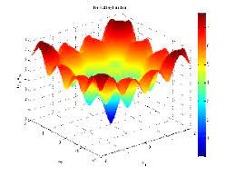

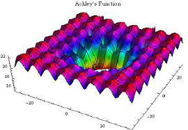

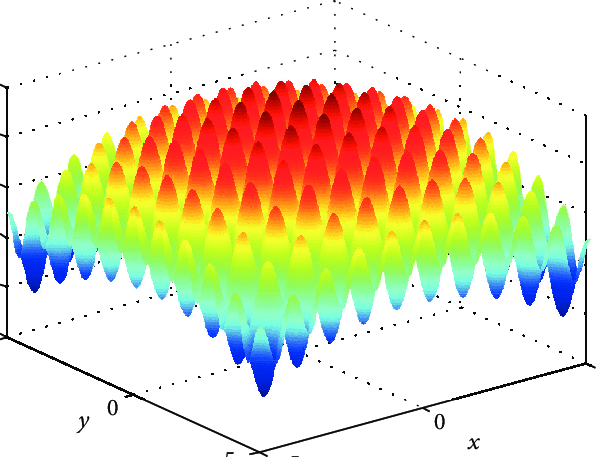

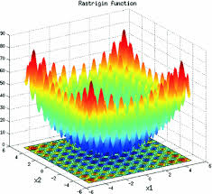

<!-- page: 71 -->

3、差分进化计算方法——改进

DE 研究热点与方向

选择算子

算法应用

研究
变异算子

交叉算子

研究
参数自适

算法理论

研究

研究

应研究

研究

<!-- page: 72 -->

DE/strategy/x
3、差分进化计算方法——改进变异策略

“DE/rand/1”:  𝑉𝑉𝑖𝑖,𝑔𝑔= 𝑋𝑋𝑟𝑟1,𝑔𝑔+ 𝐹𝐹ȉ (𝑋𝑋𝑟𝑟2,𝑔𝑔−𝑋𝑋𝑟𝑟3,𝑔𝑔)

“DE/best/1”: 𝑉𝑉𝑖𝑖,𝑔𝑔= 𝑋𝑋𝑏𝑏𝑏𝑏𝑏𝑏𝑏𝑏,𝑔𝑔+ 𝐹𝐹ȉ (𝑋𝑋𝑟𝑟1,𝑔𝑔−𝑋𝑋𝑟𝑟2,𝑔𝑔)

𝑉𝑉𝑖𝑖,𝑔𝑔= 𝑋𝑋𝑖𝑖,𝑔𝑔+ 𝐹𝐹ȉ 𝑋𝑋𝑏𝑏𝑏𝑏𝑏𝑏𝑏𝑏,𝑔𝑔−𝑋𝑋𝑖𝑖,𝑔𝑔+ 𝐹𝐹ȉ (𝑋𝑋𝑟𝑟1,𝑔𝑔−𝑋𝑋𝑟𝑟2,𝑔𝑔)

“DE/current to best/1”:

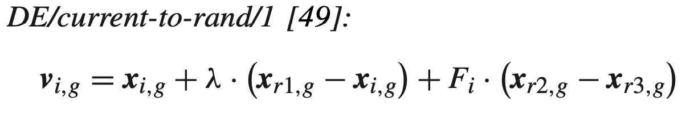

<!-- page: 73 -->

3、差分进化计算方法——改进变异策略

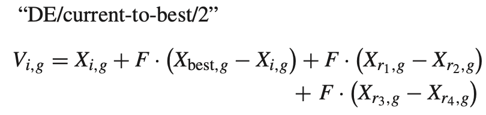

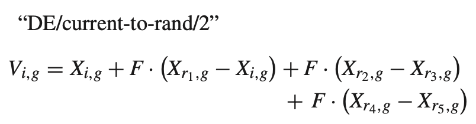

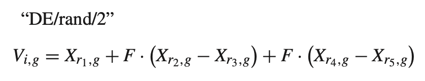

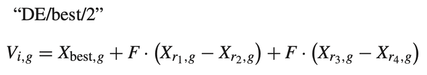

<!-- page: 74 -->

3、差分进化计算方法——改进变异策略

m

=
=∑


ci
mbest
k
k
k
x
w x

_

1

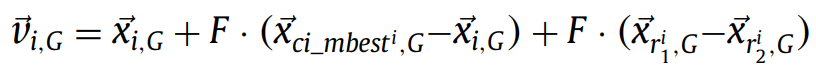

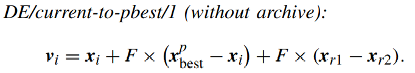

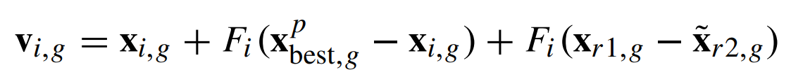

<!-- page: 75 -->

3、差分进化计算方法——改进变异策略

多变异策略协同

不同的个体使用不同的变异策略

• 𝒑𝒑: 使用“DE/rand/1”的概率

• 两种变异策略: “DE/rand/1” and “DE/current to best/2”

• 𝒏𝒏𝒏𝒏𝟏𝟏: 使用“DE/rand/1”生成的子代个体成功替换父代个体

• 𝒏𝒏𝒏𝒏𝟏𝟏: 使用“DE/rand/1”生成的子代个体不能替换父代个体

𝒑𝒑=
𝒏𝒏𝒏𝒏𝟏𝟏ȉ (𝒏𝒏𝒏𝒏𝟐𝟐+ 𝒏𝒏𝒏𝒏𝟐𝟐)
𝒏𝒏𝒏𝒏𝟐𝟐ȉ 𝒏𝒏𝒏𝒏𝟏𝟏+ 𝒏𝒏𝒏𝒏𝟏𝟏+ 𝒏𝒏𝒏𝒏𝟏𝟏ȉ (𝒏𝒏𝒏𝒏𝟐𝟐+ 𝒏𝒏𝒏𝒏𝟐𝟐)

• 自适应更新概率

<!-- page: 76 -->

3、差分进化计算方法——改进交叉策略


≤
=

= 

j
i g
j
i g
j
i g

,
 if rand(0,1)
CR or
,
 otherwise

v
j
j
u
x


二项交叉

,
rand
,

,

优点

能够任意组合变量

进行交叉

交叉的可能性有2D

缺点

没有考虑变量的相关性

相邻变量同时（不）被

交叉的概率低

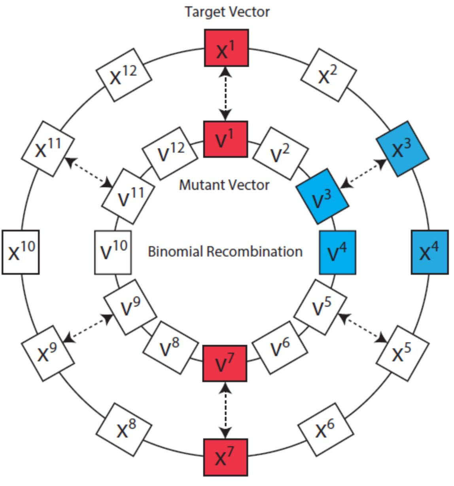

<!-- page: 77 -->

指数交叉
3、差分进化计算方法——改进交叉策略

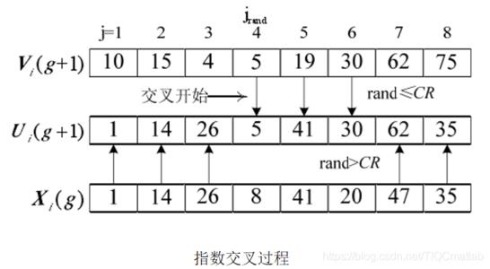

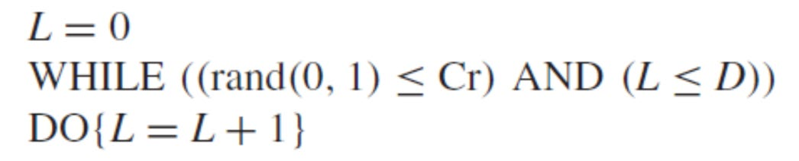

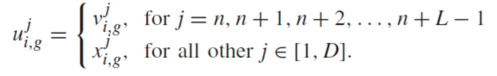

<!-- page: 78 -->

3、差分进化计算方法——改进交叉策略

指数交叉

优点

间接考虑了变量的

相关性

相邻变量同时（不）

被交叉的概率高

缺点

交叉概率与交叉长度没有

线性规律

交叉的可能性远小于2D

距离较远的两个变量同时

（不）被交叉的概率低

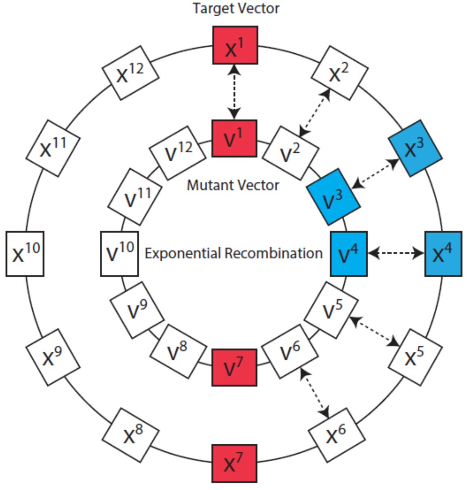

<!-- page: 79 -->

3、差分进化计算方法——改进交叉策略

多指数交叉

Crm：子代个体来自变

异个体的概率

Crs：子代个体来自父代

个体的概率

交替基于Crm和Crs进行

交叉

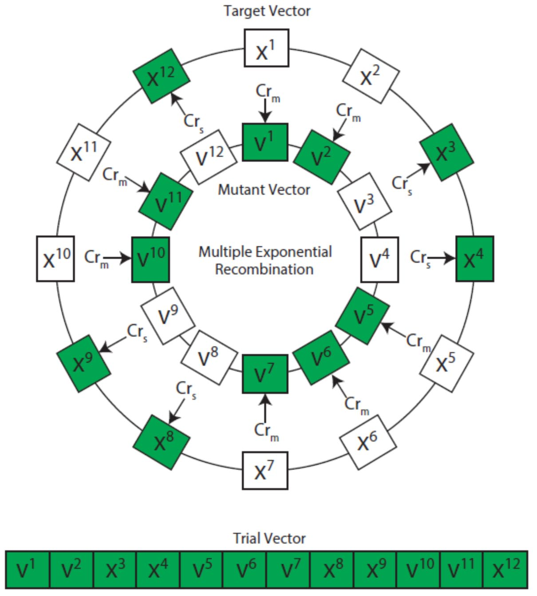

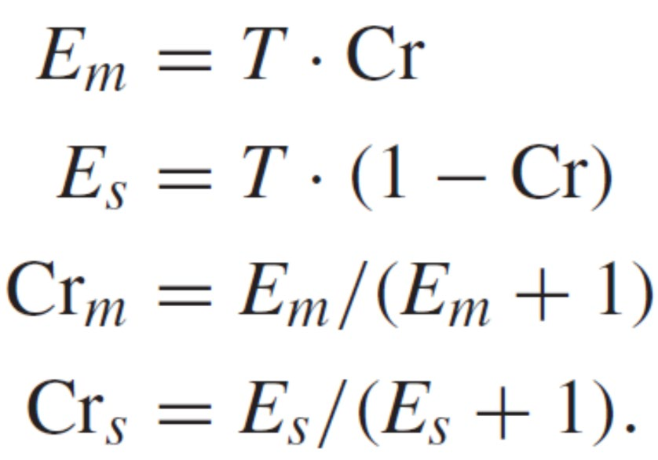

<!-- page: 80 -->

3、差分进化计算方法——改进交叉策略

多指数交叉

综合了二项

交叉和指数

交叉的优点

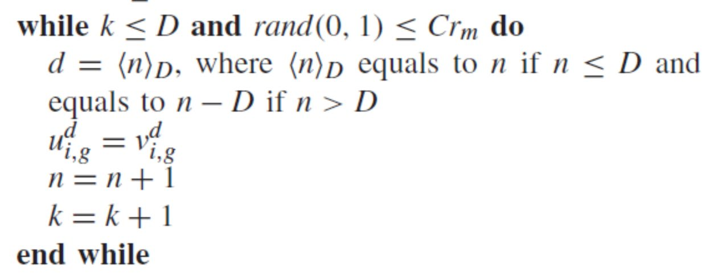

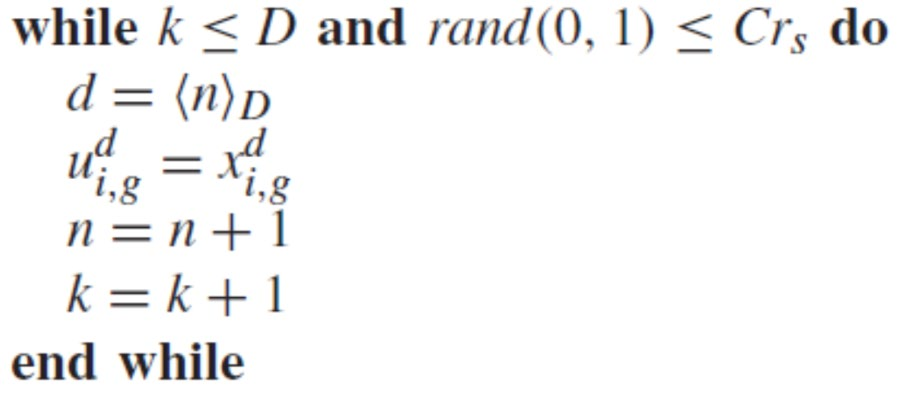

<!-- page: 81 -->

3、差分进化计算方法——改进交叉策略

两个变量距离

的越小（包含

环形距离），

不同时（不）

被交叉的概率

较低

两个变量距离

越大，Mexp

的曲线图与

Bin越接近

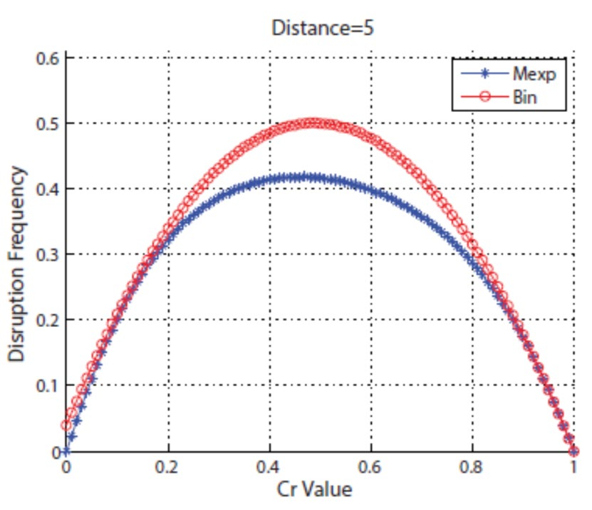

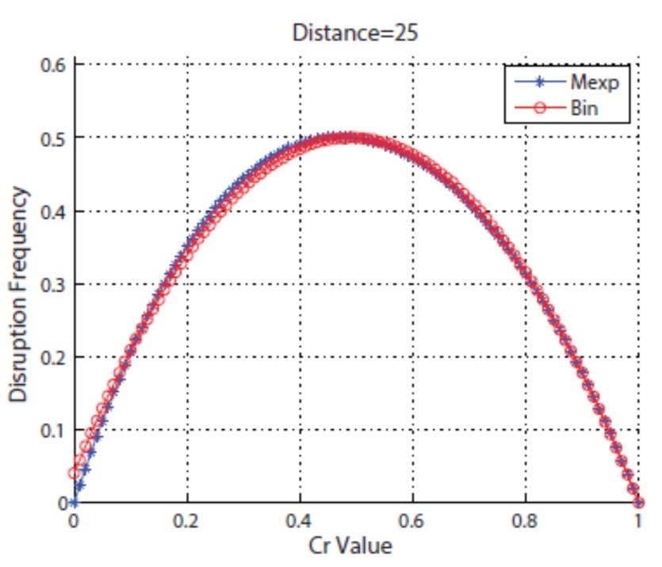

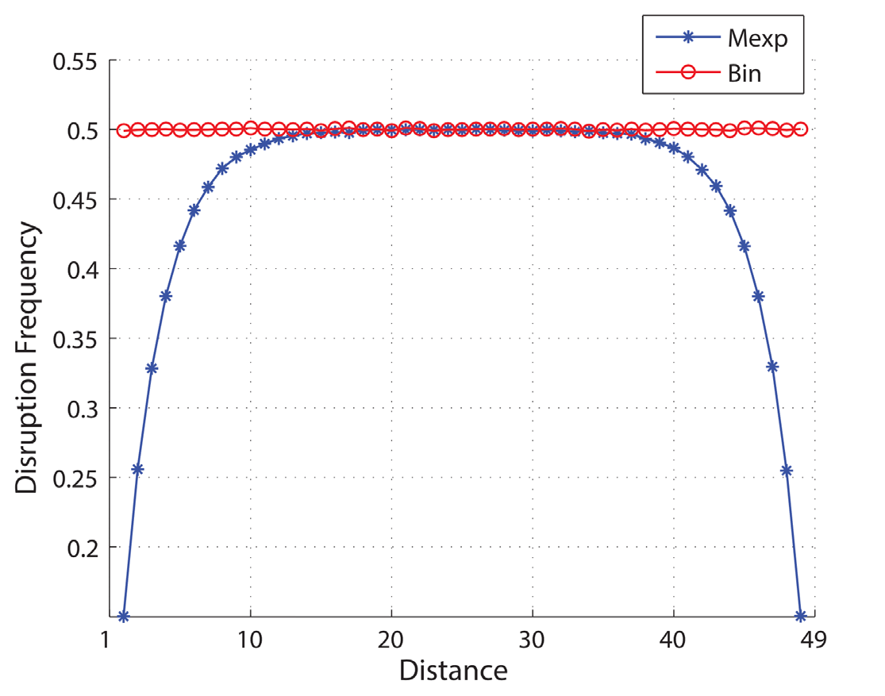

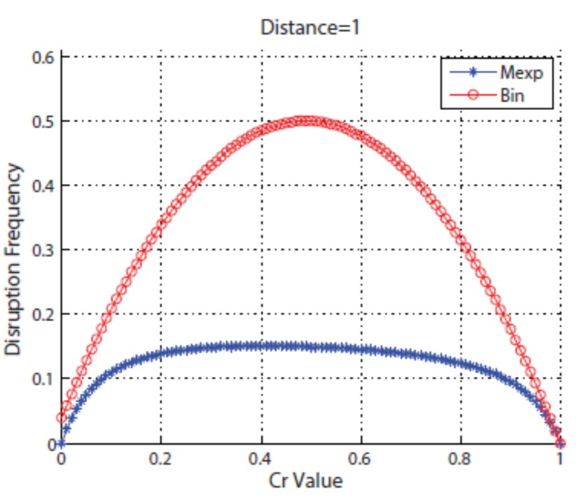

<!-- page: 82 -->

3、差分进化计算方法——参数自适应

主要针对F和CR的自适应

• 策略（1）

𝑭𝑭𝒊𝒊= 𝑵𝑵𝒊𝒊𝟎𝟎. 𝟓𝟓, 𝟎𝟎. 𝟑𝟑

• F 高斯分布随机生成

𝑪𝑪𝑪𝑪𝒊𝒊= 𝑵𝑵𝒊𝒊𝑪𝑪𝑪𝑪𝑪𝑪, 𝟎𝟎. 𝟏𝟏

• CR 高斯分布随机生成

𝟏𝟏
𝑪𝑪𝑪𝑪𝒓𝒓𝒓𝒓𝒓𝒓∑𝒌𝒌=𝟏𝟏

𝑪𝑪𝑪𝑪𝑪𝑪=

𝑪𝑪𝑪𝑪𝒓𝒓𝒓𝒓𝒓𝒓𝑪𝑪𝑪𝑪𝒓𝒓𝒓𝒓𝒓𝒓(𝒌𝒌)

𝑪𝑪𝑪𝑪𝒓𝒓𝒓𝒓𝒓𝒓:记录成功使得子代个体替换父代个体的CR

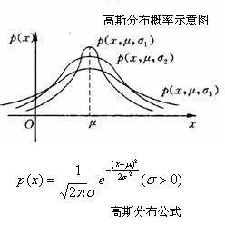

<!-- page: 83 -->

3、差分进化计算方法——参数自适应

策略（2）

𝑭𝑭𝒊𝒊,𝒈𝒈+𝟏𝟏= ቊ𝑭𝑭𝒍𝒍+ 𝒓𝒓𝒓𝒓𝒓𝒓𝒓𝒓𝟏𝟏ȉ 𝑭𝑭𝒖𝒖
𝐢𝐢𝐢𝐢𝒓𝒓𝒓𝒓𝒓𝒓𝒓𝒓𝟐𝟐< 𝝉𝝉𝟏𝟏
𝑭𝑭𝒊𝒊,𝒈𝒈
𝐨𝐨𝐨𝐨𝐨𝐨𝐨𝐨𝐨𝐨𝐨𝐨𝐨𝐨𝐨𝐨𝐨𝐨

𝑪𝑪𝑪𝑪𝒊𝒊,𝒈𝒈+𝟏𝟏= ቊ𝒓𝒓𝒓𝒓𝒓𝒓𝒓𝒓𝟑𝟑
𝐢𝐢𝐢𝐢𝒓𝒓𝒓𝒓𝒓𝒓𝒓𝒓𝟒𝟒< 𝝉𝝉𝟐𝟐
𝑪𝑪𝑪𝑪𝒊𝒊,𝒈𝒈
𝐨𝐨𝐨𝐨𝐨𝐨𝐨𝐨𝐨𝐨𝐨𝐨𝐨𝐨𝐨𝐨𝐨𝐨

𝒓𝒓𝒓𝒓𝒓𝒓𝒓𝒓𝒋𝒋∈𝟎𝟎, 𝟏𝟏, 𝒋𝒋∈{𝟏𝟏, 𝟐𝟐, 𝟑𝟑, 𝟒𝟒}

𝝉𝝉𝟏𝟏= 𝝉𝝉𝟐𝟐= 𝟎𝟎. 𝟏𝟏
𝑭𝑭𝒍𝒍= 𝟎𝟎. 𝟏𝟏, 𝑭𝑭𝒖𝒖= 𝟎𝟎. 𝟗𝟗

<!-- page: 84 -->

3、差分进化计算方法——参数自适应

• 𝑭𝑭𝒊𝒊= ቊ𝑵𝑵𝒊𝒊𝟎𝟎. 𝟓𝟓, 𝟎𝟎. 𝟑𝟑,
𝐢𝐢𝐢𝐢𝑼𝑼𝒊𝒊𝟎𝟎, 𝟏𝟏< 𝒇𝒇𝒇𝒇
𝜹𝜹𝒊𝒊,
𝐨𝐨𝐨𝐨𝐨𝐨𝐨𝐨𝐨𝐨𝐨𝐨𝐨𝐨𝐨𝐨𝐨𝐨
𝑪𝑪𝑪𝑪𝒊𝒊= 𝑵𝑵𝒊𝒊𝑪𝑪𝑪𝑪𝑪𝑪, 𝟎𝟎. 𝟏𝟏

• 策略（3）

𝑪𝑪𝑪𝑪𝒓𝒓𝒓𝒓𝒓𝒓

𝑪𝑪𝑪𝑪𝑪𝑪=
෍

𝒘𝒘𝒌𝒌ȉ 𝑪𝑪𝑪𝑪𝒓𝒓𝒓𝒓𝒓𝒓(𝒌𝒌)

𝒌𝒌=𝟏𝟏

∆𝒇𝒇𝒓𝒓𝒓𝒓𝒓𝒓𝒌𝒌= 𝒇𝒇𝒌𝒌−𝒇𝒇𝒏𝒏𝒏𝒏𝒏𝒏(𝒌𝒌)

∆𝒇𝒇𝒓𝒓𝒓𝒓𝒓𝒓

𝒘𝒘𝒌𝒌= ∆𝒇𝒇𝒓𝒓𝒓𝒓𝒓𝒓(𝒌𝒌)/( ෍

∆𝒇𝒇𝒓𝒓𝒓𝒓𝒓𝒓(𝒌𝒌)

𝒌𝒌=𝟏𝟏

<!-- page: 85 -->

策略（4）
3、差分进化计算方法——参数自适应

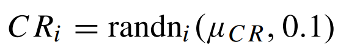

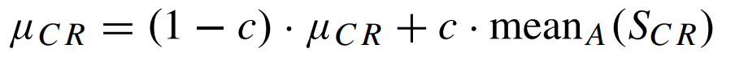

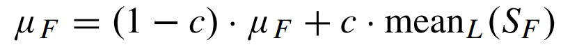

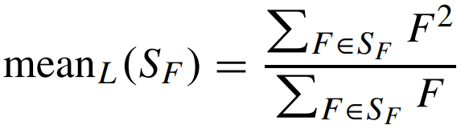

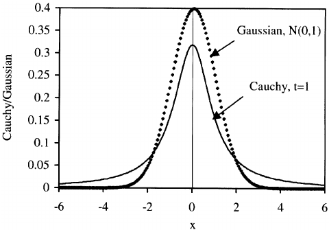

<!-- page: 86 -->

3、差分进化计算方法——参数自适应

策略（5）

个体越好，对应的F和CR越小

好的个体集中于开发解空间，差的个体集中于探索解空间

种群内部即可平衡算法的开发能力和探索能力

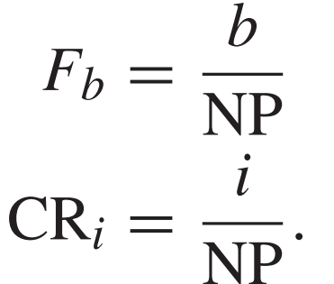

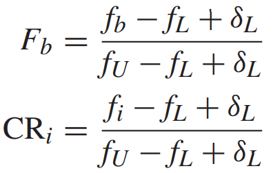

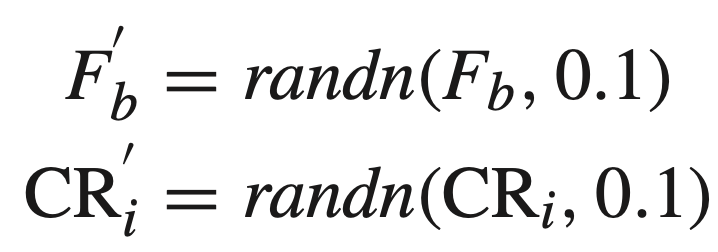

<!-- page: 87 -->

4、遗传规划方法——起源

遗传规划算法是什么？

遗传规划算法的思想来源是怎样的？

它由谁提出的？

遗传规划算法
（Genetic Programming，GP）
是进化计算的一个分支。与传统遗传算法等主要用于求出一个优
化解不同，GP的核心是进化出一个能构造算法的算法，体现为一

个优先级函数，或一个程序。

它是Koza于1992年提出。

GP是进化计算中的一个非常特殊的分支，它可
以应用于符号回归、动态控制与优化等众多领域，

是当前的一个前沿研究分支。

<!-- page: 88 -->

4、遗传规划方法——基本思想

满
足
终
止
条
件

进
化
操
作

种
群
初
始
化

适
应
值
计
算

是

开
始

结
束

否

•
解被编码为一个程
序，常常可表达为
一棵树

•
基于树结构的交
叉和变异

•
需要在许多案例
中进行评估（训
练集）

•
包含终端集（叶子
节点）和函数集
（子根或根节点）
两个部分

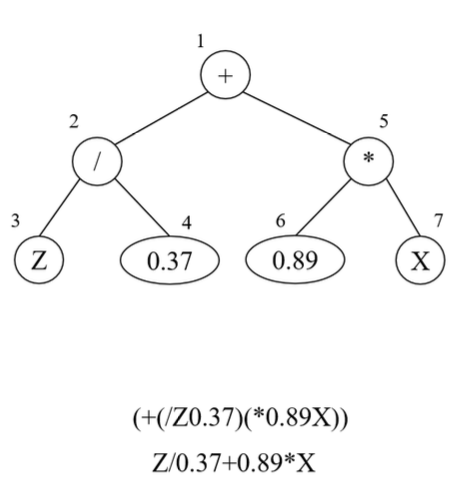

<!-- page: 89 -->

4、遗传规划方法——基本思想

两个个体

截取了交叉片段

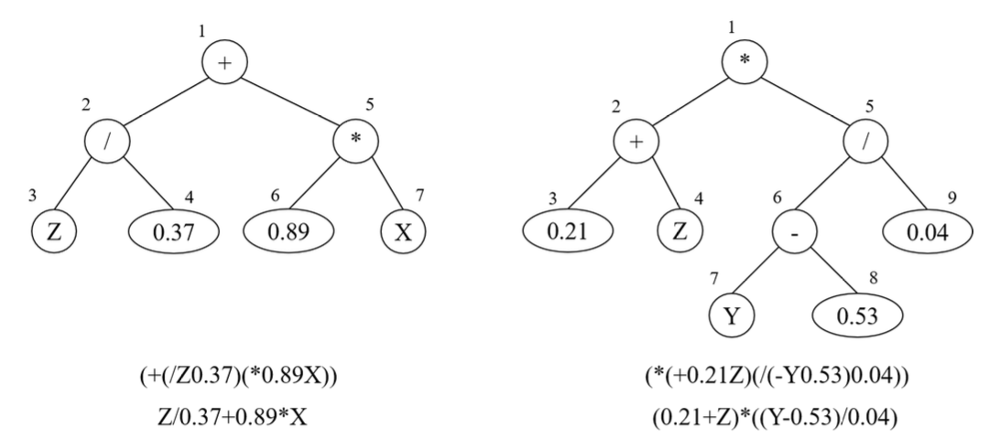

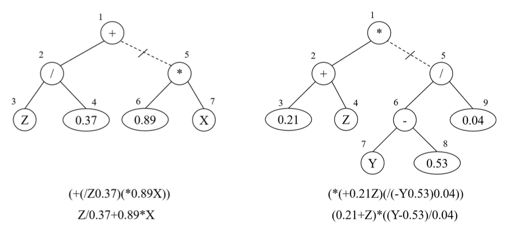

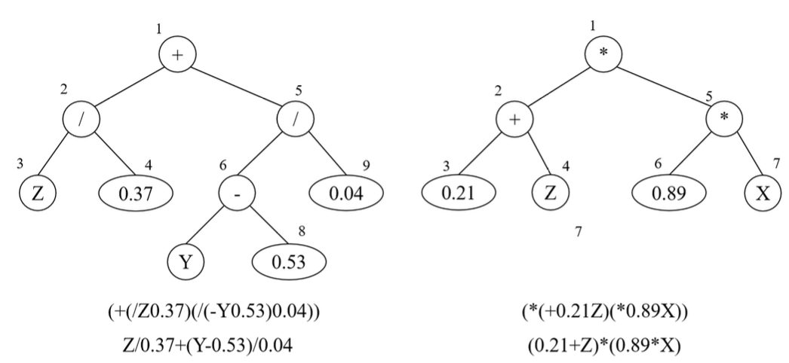

<!-- page: 90 -->

4、遗传规划方法——应用举例

成都车流调度系统

成都东客站人群仿真调度系统

个体：车  群体：车流

群智人群势态预测

城市大脑

数据

全局决策目标：最大化路网吞吐量

群智人群管控优化

动态、开放环境的群体智能协同决策

阿里云ET城市大脑

科技创新2030——“新一代人工智能”重大项目

“群智涌现机理与演化计算方法”

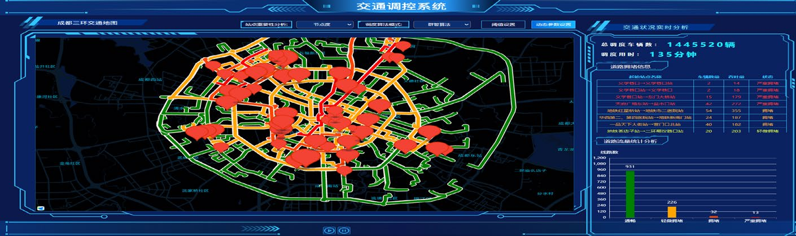

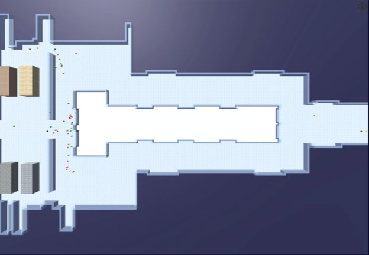

<!-- page: 91 -->

4、遗传规划方法——应用举例

小型路网
车流仿真

GP

小规模网络
个体行动
超启发策略

迁移

城市级
大型路网

树状超启发式策略

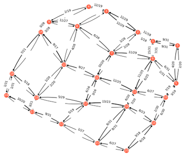

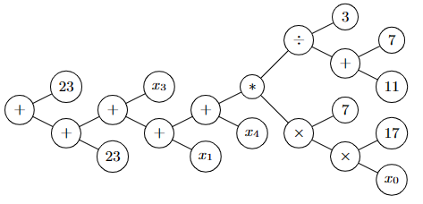

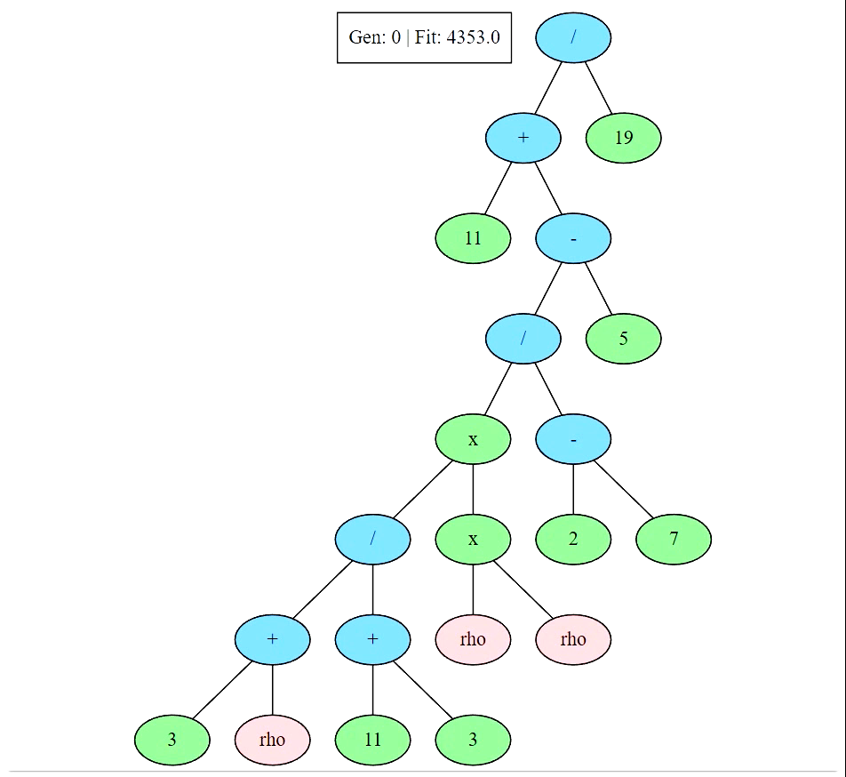

<!-- page: 92 -->

4、遗传规划方法——应用举例

分布式群智决策

级车流调度
分布式决策
动态环
境感知
超启发
式策略

城市路网千万

超启发式策略迁移

分布式

决策

动态环境感知

成都市三环内路网

千万级规模车流调度

反馈

动态环境感知

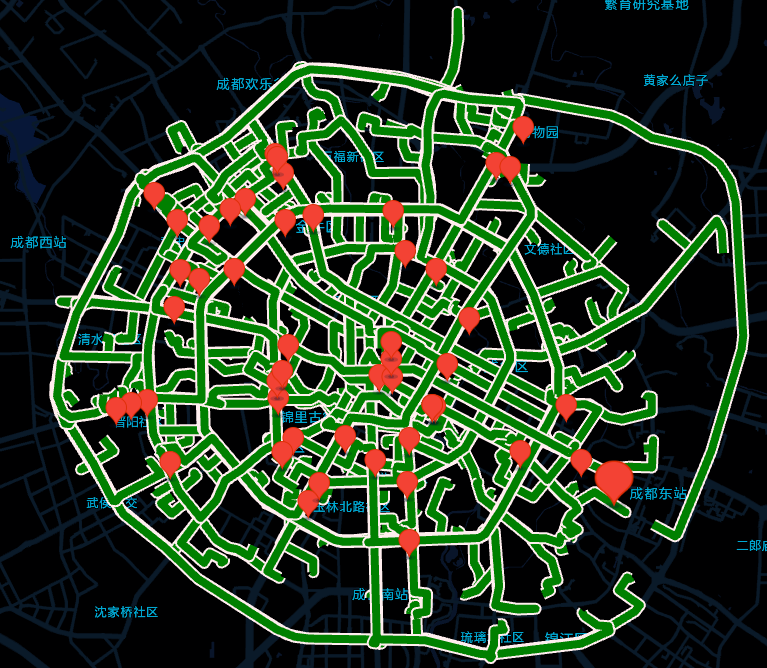

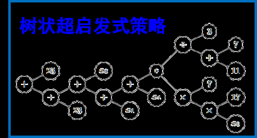

<!-- page: 93 -->

4、遗传规划方法——应用举例

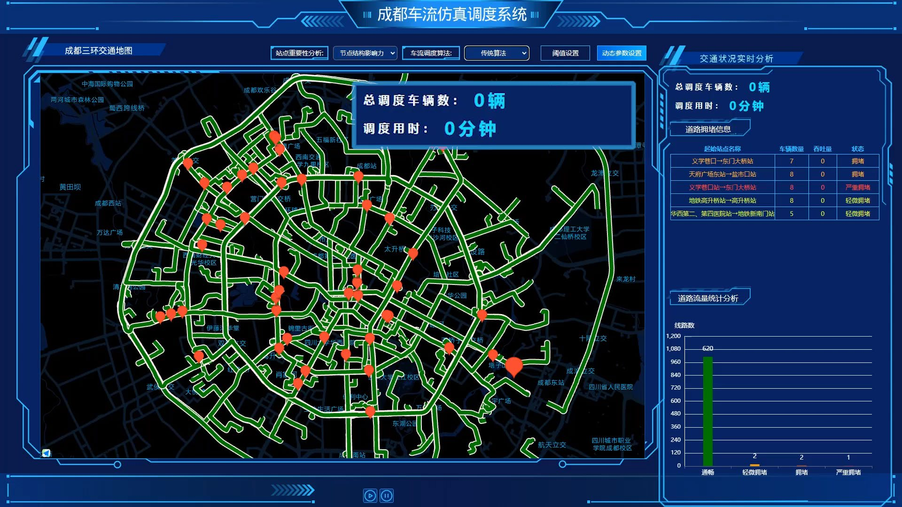

<!-- page: 94 -->

4、遗传规划方法——应用举例

累积流量/万
10
20
40
50
80
160
320
640
1000

传统晚高峰
33
46
69
82
138
391
1171
3517
7423

群智晚高峰
31
42
59
66
87
148
294
651
1111

传统早高峰
33
46
69
82
140
387
1140
3428
7476

群智早高峰
31
43
60
68
91
163
345
790
1465

传统平峰
34
47
68
80
126
322
904
2684
5846

群智平峰
32
43
60
67
87
144
276
608
1141

最小差值
2
3
8
13
39
178
628
2076
4705

最小比值
5.80%
6.50%
11.70%
16.20%
30.90%
55.20%
69.40%
76.90%
80.40%

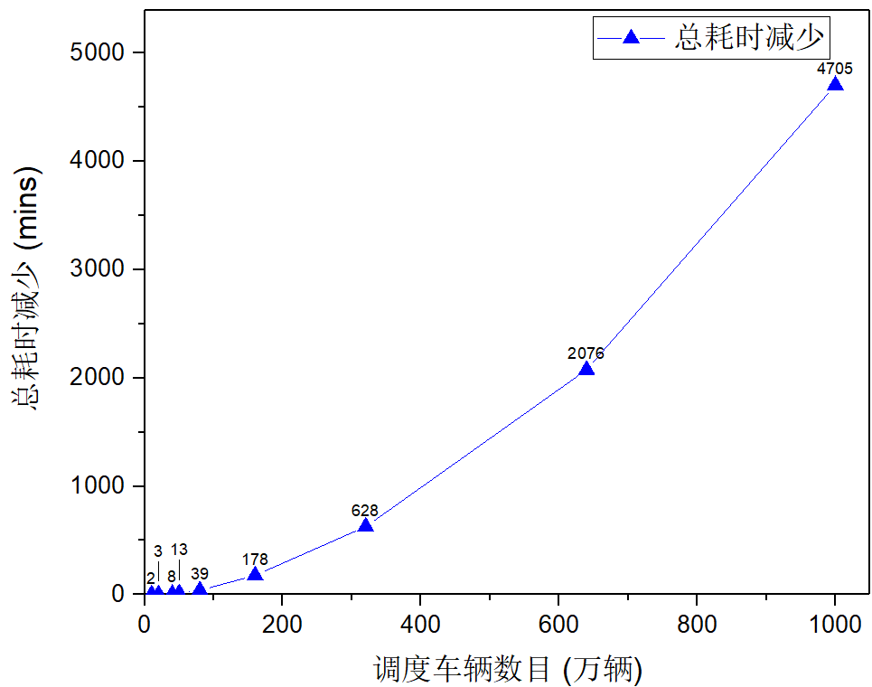

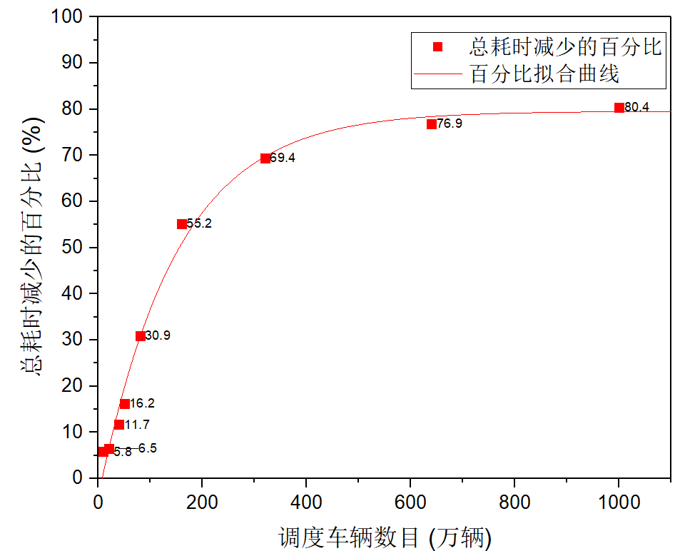

<!-- page: 95 -->

部分参考文献

遗传算法

[1] A genetic algorithm tutorial, D Whitley - Statistics and computing, 1994 - Springer

[2] X Yao, Y Liu, G Lin, “Evolutionary programming made faster”, IEEE Transactions on Evolutionary Computation, 1999

进化策略、分布估计算法

[1] N Hansen, “The CMA evolution strategy: A tutorial”, https://arxiv.org/abs/1604.00772

[2] X He, Y Zhou, Z Chen, J Zhang, WN Chen, “Large-scale evolution strategy based on search direction adaptation”, IEEE transactions on cybernetics 51 (3), 2019

[3] Q Yang, WN Chen, Y Li, CLP Chen, XM Xu, J Zhang, “Multimodal estimation of distribution algorithms”, IEEE Transactions on Evolutionary Computation, 2017

差分进化计算

[1] Storn, R. and Price, K., Differential evolution–a simple and efficient heuristic for global optimization over continuous spaces. Journal of global optimization, 11, pp.341-359, 1997.

[2] J Zhang, AC Sanderson, “JADE: adaptive differential evolution with optional external archive”, IEEE Transactions on Evolutionary Computation, 2009

[3] AK Qin, PN Suganthan, “Self-adaptive differential evolution algorithm for numerical optimization”, IEEE Congress on Evolutionary Computation 2006, 2006

[4] R. Tanabe and A. Fukunaga, "Reviewing and Benchmarking Parameter Control Methods in Differential Evolution," in IEEE Transactions on Cybernetics, vol. 50, no. 3, pp. 1170-

1184, March 2020.

[5] Wei-Jie Yu, Meie Shen, Wei-Neng Chen, Zhi-Hui Zhan, Yue-Jiao Gong, et al., "Differential Evolution With Two-Level Parameter Adaptation," in IEEE Transactions on

Cybernetics, vol. 44, no. 7, pp. 1080-1099, 2014.

95

<!-- page: 96 -->

一、背景与意义

Outline
二、进化算法

三、粒子群优化

四、蚁群优化

五、进化计算的前沿研究进展

<!-- page: 97 -->

粒子群优化——思想来源

粒子群优化算法是什么？

粒子群优化算法的思想来源是怎样的？

它由谁提出的？

粒子群优化算法
（Particle Swarm Optimization，PSO）

是进化计算的一个分支，
是一种模拟自然界的生物活动的随机搜索算法。

PSO模拟了自然界鸟群捕食和鱼群捕食的过程。

通过群体中的协作寻找到问题的全局最优解。
它是1995年由美国学者Eberhart和Kennedy提出的，
现在已经广泛应用于各种工程领域的优化问题之中。

<!-- page: 98 -->

粒子群优化——思想来源

一种模拟自然界的生物活动以
及群体智能的随机搜索算法。

社会心理学
群体智慧
个体认知
社会影响
……
粒子群
优化算法

生物界现象
群体行为
群体迁徙
生物觅食
……

人工生命
鸟群觅食
鱼群学习
群理论

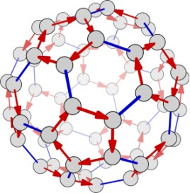

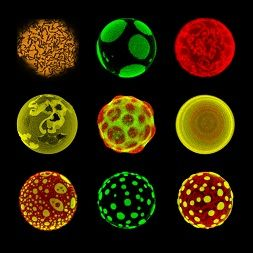

<!-- page: 99 -->

启发于动物的群体行为
粒子群优化——思想来源

自然界的鸟群、兽群、鱼群等在其迁

徙、捕食过程中，往往表现出高度的
组织性和规律性。

1987年，Reynolds实现了鸟群运动

的计算机可视化仿真。

1990年，动物学家Heppner和

Grenander对动物的群体活动规律进
行研究，包括大规模群体同步聚合，
突然地改变方向，规律的分散与重组
等相关的机制和潜在的规律。

众多的研究成果都为粒子群优化算法

的发明奠定了思想来源和理论基础。

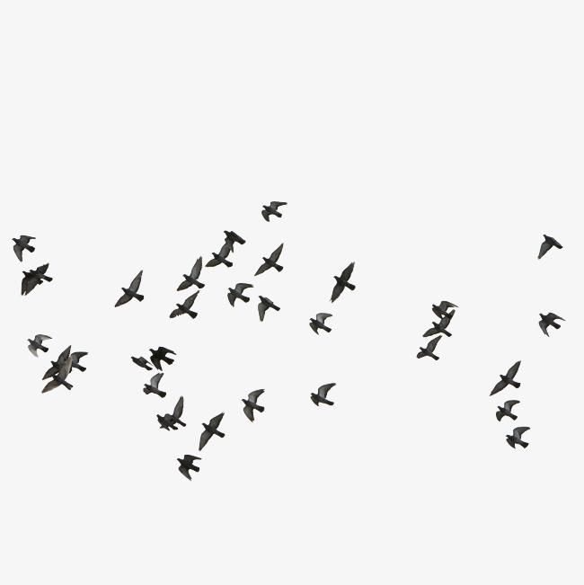

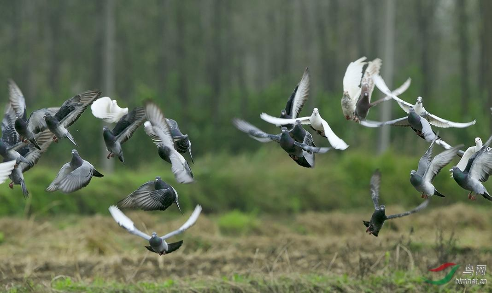

<!-- page: 100 -->

在群体智慧方面:
粒子群优化——思想来源

Wilson在20世纪70年代就指出:“至少在理论

上,在群体觅食的过程中,群体中的每一个个体
都会受益于所有成员在这个过程中所发现和累
积的经验。”因此 PSO直接采用了这一思想。

Kennedy和Eberhart也指出,他们在设计PSO

的时候,除了考虑模拟生物的群体活动之外,更
重要的是融入了个体认知(Self-Cognition)和
社会影响(Social-Influence)这些社会心理学
的理论。

1996年, Boyd 和 Richerson在研究人类的决

策过程时,也提出了个体学习和文化传递的概念。
根据他们的研究结果，人们在决策过程中使用
两类重要的信息：一是自身的经验,二是其他人
的经验。也就是说，人们根据自身的经验和他
人的经验进行自己的决策。

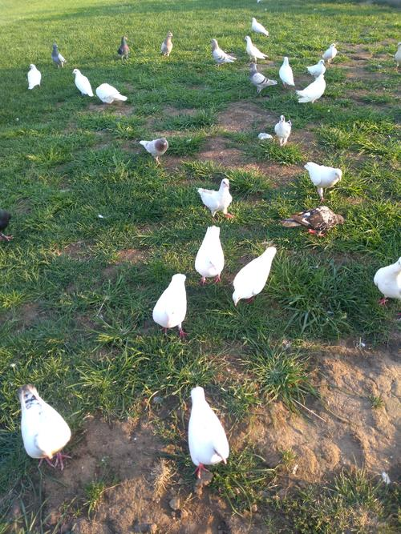

<!-- page: 101 -->

粒子群优化——思想来源

在自然界鸟群捕食过程中，小鸟是通

过什么样的机制找到食物的呢？

一群分散的鸟随机飞行觅食，

每只鸟在飞行过程
中不断记录和更新
它曾到达的离食物
最近的位置(pbest)

不知道食物的具体位置，但
是有一个间接的机制让小鸟
知道它距离食物的距离（如

食物香味的浓淡等）

鸟的飞行方向受到
这两个信息的引导，

每一只鸟在飞
行的过程中有
两个启发信息：

所有鸟互相交
流信息，得到
整个种群最佳
位置(gbest)。

寻找更加接近食物
的位置，最终群体
聚集到食物的位置

自身经验和整
个种群的经验

<!-- page: 102 -->

粒子群优化算法
粒子群优化——思想来源

鸟群觅食现象

<!-- page: 103 -->

粒子群优化——思想来源

鸟群觅食现象

粒子群优化算法

鸟群觅食现象

•搜索空间的一组有效

•鸟群

解

•觅食空间

•问题的搜索空间

•飞行速度

类比关系

•解的速度向量

•所在位置

•解的位置向量

•个体认知与群体协作

•速度与位置的更新

•找到食物

•找到全局最优解

粒子群优化算法

<!-- page: 104 -->

粒子群优化——思想来源

鸟群觅食基本定义：

鸟群：搜索空间的一组有效解（种群规模N）

觅食空间：问题的搜索空间（维数D）

飞行速度：解的速度向量 𝒗𝒗𝒊𝒊= [𝑣𝑣𝑖𝑖

1, 𝑣𝑣𝑖𝑖
2, … , 𝑣𝑣𝑖𝑖
𝐷𝐷]

所在位置：解的位置向量 𝒙𝒙𝒊𝒊= [𝑥𝑥𝑖𝑖

1, 𝑥𝑥𝑖𝑖
2, … , 𝑥𝑥𝑖𝑖
𝐷𝐷]

个体认知：个体历史最优位置向量 𝒑𝒑𝒑𝒑𝒑𝒑𝒑𝒑𝒑𝒑𝒊𝒊= [𝑝𝑝𝑝𝑝𝑝𝑝𝑝𝑝𝑝𝑝𝑖𝑖

1, 𝑝𝑝𝑝𝑝𝑝𝑝𝑝𝑝𝑝𝑝𝑖𝑖
2, … , 𝑝𝑝𝑝𝑝𝑝𝑝𝑝𝑝𝑝𝑝𝑖𝑖
𝐷𝐷]

群体认知：种群历史最优位置向量 𝒈𝒈𝒈𝒈𝒈𝒈𝒈𝒈𝒈𝒈= [𝑔𝑔𝑔𝑔𝑔𝑔𝑔𝑔𝑔𝑔1, 𝑔𝑔𝑔𝑔𝑔𝑔𝑔𝑔𝑔𝑔2, … , 𝑔𝑔𝑔𝑔𝑔𝑔𝑔𝑔𝑔𝑔𝐷𝐷]

找到食物：算法结束，输出全局最优解

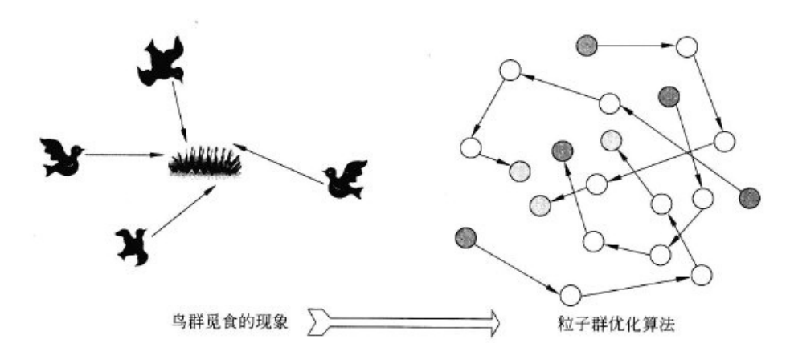

<!-- page: 105 -->

粒子群优化——算法框架

//功能：粒子群优化算法伪代码
//说明：本例以求问题最小值为目标
//参数：N为群体规模

开始

随机初始化每个粒子

procedure PSO
    for each particle i
        Initialize velocity Vi and position Xi for particle i
        Evaluate particle i and set pBesti = Xi
    end for
    gBest = min {pBesti}
    while not stop
        for i=1 to N
            Update the velocity  and position of particle i
            Evaluate particle i
            if fit (Xi) < fit (pBesti)
                  pBesti = Xi;
            if fit(pBesti) < fit (gBest)
                  gBest = pBesti;
         end for
    end while
    print gBest
end procedure

评估每个粒子并得到全局最优

是
满足结束条件

否

更新每个粒子的速度和位置

评估每个粒子的函数适应值

更新每个粒子历史最优位置

更新群体的全局最优位置

结束

<!-- page: 106 -->

粒子群优化——基本流程

1）初始化所有个体（粒子）：初始化速度和位
置，并将pbest设置为当前位置（𝒑𝒑𝒑𝒑𝒑𝒑𝒑𝒑𝒑𝒑𝒊𝒊= 𝒙𝒙𝒊𝒊）

2）在 t 代进化中，计算每个粒子的适应值𝒇𝒇𝒕𝒕(𝒙𝒙𝒊𝒊)

3）比较所有粒子的𝒇𝒇𝒕𝒕(𝒙𝒙𝒊𝒊)，得出𝒈𝒈𝒈𝒈𝒈𝒈𝒈𝒈𝒈𝒈= 𝒙𝒙𝒃𝒃𝒃𝒃𝒃𝒃𝒃𝒃

5）计算更新完的粒子的适应值𝒇𝒇𝒕𝒕+𝟏𝟏(𝒙𝒙𝒊𝒊)

4）更新粒子速度和位置

6）比较𝒇𝒇𝒕𝒕(𝒙𝒙𝒊𝒊)与𝒇𝒇𝒕𝒕+𝟏𝟏(𝒙𝒙𝒊𝒊)，更新𝒑𝒑𝒑𝒑𝒑𝒑𝒑𝒑𝒑𝒑𝒊𝒊

7）比较所有𝒇𝒇𝒕𝒕+𝟏𝟏(𝒙𝒙𝒊𝒊)，更新𝒈𝒈𝒈𝒈𝒈𝒈𝒈𝒈𝒈𝒈

8）t++ , 满足终止条件就输出𝒈𝒈𝒈𝒈𝒈𝒈𝒈𝒈𝒈𝒈，否则跳转到 4）

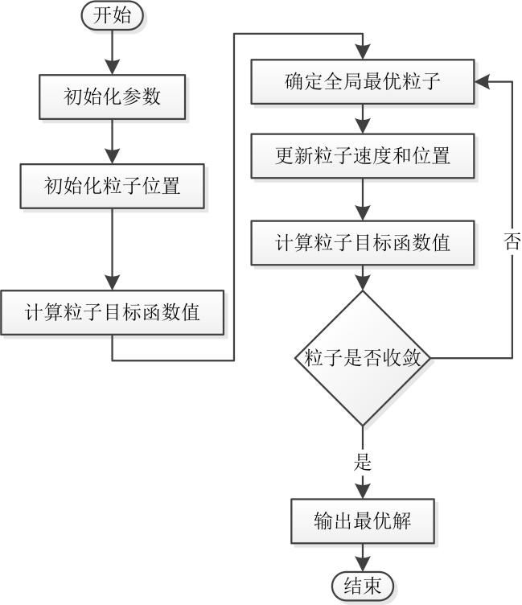

<!-- page: 107 -->

粒子群优化——更新公式

1
1
2
2
(
)
(
)
d
d
d
d
d
d
d
d
i
i
i
i
i
v
v
c
r
pBest
x
c
r
gBest
x
ω
=
×
+
×
×
−
+
×
×
−

d
d
d
i
i
i
x
x
v
=
+

自身速度

𝝎𝝎：惯性权重——上一代的速度

其中：

更新速度

个体认知

𝒄𝒄𝟏𝟏, 𝒄𝒄𝟐𝟐：加速系数——向pbest和

对这一代的影响

社会引导

𝒓𝒓𝟏𝟏, 𝒓𝒓𝟐𝟐：[𝟎𝟎, 𝟏𝟏]之内的随机数——增加算法随机性；每个

gbest偏向的程度

维度均产生一个随机数

<!-- page: 108 -->

粒子群优化——更新公式

权重因子：惯性因子    、学习因子

1
1
1 1
2 2
(
)
(
)
k
k-1
k
k
id
id
id
id
d
id
v = wv
c r pbest
x
c r gbest
x
−
−
+
−
+
−

粒子的速度更新主要由三部分组成：

惯性因子

kv
ω

前次迭代中自身的速度

基本粒子群算法

1
1 1(
)
k
id
id
c r pbest
x −
−

自我认知部分

失去对粒子本身的

1
2 2(
)
k
d
id
c r gbest
x −
−

速度的记忆
社会经验部分

<!-- page: 109 -->

粒子群优化——更新公式

权重因子：惯性因子    、学习因子

1
1
1 1
2 2
(
)
(
)
k
k-1
k
k
id
id
id
id
d
id
v = wv
c r pbest
x
c r gbest
x
−
−
+
−
+
−

粒子的速度更新主要由三部分组成：

学习因子

kv
ω

前次迭代中自身的速度

无私型粒子群算法

1
1 1(
)
k
id
id
c r pbest
x −
−

自我认知部分

“只有社会，没有自我”

1
2 2(
)
k
d
id
c r gbest
x −
−

迅速丧失群体多样性，
易陷入局优而无法跳出．

社会经验部分

<!-- page: 110 -->

粒子群优化——更新公式

权重因子：惯性因子    、学习因子

1
1
1 1
2 2
(
)
(
)
k
k-1
k
k
id
id
id
id
d
id
v = wv
c r pbest
x
c r gbest
x
−
−
+
−
+
−

粒子的速度更新主要由三部分组成：

kv
ω

前次迭代中自身的速度

学习因子

1
1 1(
)
k
id
id
c r pbest
x −
−

自我认知部分

自我认知型粒子群算法
“只有自我，没有社
会”
完全没有信息的社会共享，

1
2 2(
)
k
d
id
c r gbest
x −
−

社会经验部分

导致算法收敛速度缓慢

<!-- page: 111 -->

粒子群优化——更新公式

权重因子：惯性因子    、学习因子

1
1
1 1
2 2
(
)
(
)
k
k-1
k
k
id
id
id
id
d
id
v = wv
c r pbest
x
c r gbest
x
−
−
+
−
+
−

粒子的速度更新主要由三部分组成：

kv
ω

前次迭代中自身的速度

1
1 1(
)
k
id
id
c r pbest
x −
−

自我认知部分

c1,c2都不为0，称为
完全型粒子群算法

1
2 2(
)
k
d
id
c r gbest
x −
−

社会经验部分

完全型粒子群算法更容易保持收敛速度和搜索效果的

均衡，是较好的选择．

<!-- page: 112 -->

粒子群优化——应用举例

例   求解如下四维Rosenbrock函数的优化问题．

3
2
2
2
1
1
min
( )
[100(
)
(
1) ]
+
=
=
−
+
−
∑
i
i
i
i
f
x
x
x
x

[ 30,30] (
1,2,3,4)
∈−
=
ix
i

算法的相关设计分析如下．

5
m =

即算法中粒子的数量，取

种群大小：

编码：因为问题的维数是4，所以每个粒子的位置和

速度均4 维的实数向量．

min
60
V
= −

max
60
=
V

设定粒子的最大速度：

<!-- page: 113 -->

粒子群优化——应用举例

对粒子群进行随机初始化

随机初始化各粒子的位置和速度

0
iv
0
ix

设各粒子的初始位置     和初始速度    为：

0={0,0,0,0}
iv

初始速度

初始位置：

(0)
1
{5.69376444051686
-22.9549409486516
-24.8690521745974
13.8198517713272}
=
x

(0)
2
{-14.2672951331493
-12.1994476069004
-14.2510659181000
-0.683461571785252}
=
x

(0)
3
{6.17058536292498
-10.8733018844471
18.0608773661843
4.71150366140633}
=
x

(0)
4
{12.6729468260210
-4.54999441717157
-28.2467833462712
-15.7629852137087}
=
x

(0)
5
{-16.6951959589656
0.471497079667088 25.7312483686827
-2.46907030920413}
=
x

<!-- page: 114 -->

粒子群优化——应用举例

初始位置：

(0)
(0)
(0)
(0)
(0)
1
2
3
4
5
,
,
,
,
x
x
x
x
x

初始速度：

(0)
(0)
(0)
(0)
(0)
1
2
3
4
5
,
,
,
,
v
v
v
v
v

计算每个粒子的适应值

3
2
2
2
1
1
( )
[100(
)
(
1) ]
i
i
i
i
f
x
x
x
+
=
=
−
+
−
∑
x

按照
计算适应值

(0)
1
(
)
67316186.2595905
f
=
x

历史最优解

(0)
2
(
)
11467578.4277622
f
=
x

(0)
2
g =
p
x

(0)
2
(
)
(
)
g
f
f
=
p
x

(0)
3
(
)
11578605.1241726
f
=
x

0, (
1,2,3,4,5)
i
i
i
=
=
p
x

(0)
4
(
)
69169811.4708573
f
=
x

(0)
5
(
)
51973576.1749053
f
=
x

0
(
)
(
), (
1,2,3,4,5)
i
i
f
f
i
=
=
p
x

<!-- page: 115 -->

粒子群优化——应用举例

初始位置：
(0)
(0)
(0)
(0)
(0)
1
2
3
4
5
,
,
,
,
x
x
x
x
x

初始速度：

(0)
(0)
(0)
(0)
(0)
1
2
3
4
5
,
,
,
,
v
v
v
v
v

(0)
1
g =
p
x

群体历史最优解：

0, (
1,2,3,4,5)
i
i
i
=
=
p
x

个体历史最优解：

更新粒子的速度和位置：

1
w =
1
2
2
c
c
=
=

取
, 得到速度和位置的更新函数为

(1)
(0)
(0)
(0)
(0)
(0)
1
2
2 (
)
2 (
),
i
i
i
i
g
i
r
r
=
+
−
+
−
v
v
p
x
p
x

(1)
(0)
(1)
i
i
i
=
+
x
x
v

<!-- page: 116 -->

粒子群优化——应用举例

初始速度：
初始位置：
(0)
(0)
(0)
(0)
(0)
1
2
3
4
5
,
,
,
,
x
x
x
x
x

(0)
(0)
(0)
(0)
(0)
1
2
3
4
5
,
,
,
,
v
v
v
v
v

(0)
1
g =
p
x

群体历史最优解：

0, (
1,2,3,4,5)
i
i
i
=
=
p
x

个体历史最优解：

产生随机数：

(1)
1
{0.963088539286913 0.624060088173690 0.0377388662395521 0.261871183870716}
r
=

(2)
1
{0.546805718738968 0.679135540865748 0.885168008202475 0.335356839962797}
r
=

(3)
1
{0.521135830804002 0.395515215668593 0.913286827639239 0.679727951377338}
r
=

(4)
1
{0.231594386708524 0.367436648544477 0.796183873585212 0.136553137355370}
r
=

(5)
1
{0.488897743920167 0.987982003161633 0.0987122786555743 0.721227498581740}
r
=

<!-- page: 117 -->

粒子群优化——应用举例

初始速度：
初始位置：
(0)
(0)
(0)
(0)
(0)
1
2
3
4
5
,
,
,
,
x
x
x
x
x

(0)
(0)
(0)
(0)
(0)
1
2
3
4
5
,
,
,
,
v
v
v
v
v

(0)
1
g =
p
x

群体历史最优解：

0, (
1,2,3,4,5)
i
i
i
=
=
p
x

个体历史最优解：

产生随机数：

(1)
2
{0.106761861607241
0.903720560556316 0.0305409463046367 0.609866648422558}
r
=

(2)
2
{0.653757348668560
0.890922504330789 0.744074260367462 0.617666389588455}
r
=

(3)
2
{0.494173936639270 0.334163052737496
0.500022435590201 0.859442305646212}
r
=

(4)
2
{0.779051723231275
0.698745832334795 0.479922141146060 0.805489424529686}
r
=

(5)
2
{0.715037078400694
0.197809826685929 0.904722238067363 0.576721515614685}
r
=

<!-- page: 118 -->

粒子群优化——应用举例

初始位置：
(0)
(0)
(0)
(0)
(0)
1
2
3
4
5
,
,
,
,
x
x
x
x
x

初始速度：

(0)
(0)
(0)
(0)
(0)
1
2
3
4
5
,
,
,
,
v
v
v
v
v

(0)
1
g =
p
x

群体历史最优解：

0, (
1,2,3,4,5)
i
i
i
=
=
p
x

个体历史最优解：

更新速度：

(1)
1
{-4.26215975947529
19.4399209437344
0.648566696246109 -17.6901741991723}
=
v

(1)
2
{0
0
0
0}
=
v

(1)
3
{-20.1997357226159 -0.886297805979549
-32.3133931593206
-9.27332271779066}
=
v

(1)
4
{-41.9756838451182
-10.6900470719262
13.4337093500063
24.2927936410294}
=
v

(1)
5
{3.47207822627667
-5.01287474479381
-72.3457777293015
2.05959795467809}
=
v

<!-- page: 119 -->

粒子群优化——应用举例

初始位置：
(0)
(0)
(0)
(0)
(0)
1
2
3
4
5
,
,
,
,
x
x
x
x
x

初始速度：

(0)
(0)
(0)
(0)
(0)
1
2
3
4
5
,
,
,
,
v
v
v
v
v

(0)
1
g =
p
x

群体历史最优解：

0, (
1,2,3,4,5)
i
i
i
=
=
p
x

个体历史最优解：

更新速度：

(1)
1
{-4.26215975947529
19.4399209437344
0.648566696246109 -17.6901741991723}
=
v

(1)
2
{0
0
0
0}
=
v

(1)
3
{-20.1997357226159 -0.886297805979549
-32.3133931593206
-9.27332271779066}
=
v

(1)
4
{-41.9756838451182
-10.6900470719262
13.4337093500063
24.2927936410294}
=
v

(1)
5
{3.47207822627667
-5.01287474479381
-60.00
2.05959795467809}
=
v

<!-- page: 120 -->

粒子群优化——应用举例

初始位置：
(0)
(0)
(0)
(0)
(0)
1
2
3
4
5
,
,
,
,
x
x
x
x
x

初始速度：

(0)
(0)
(0)
(0)
(0)
1
2
3
4
5
,
,
,
,
v
v
v
v
v

(0)
1
g =
p
x

群体历史最优解：

0, (
1,2,3,4,5)
i
i
i
=
=
p
x

个体历史最优解：

更新位置，得：

(1)
1
{1.43160468104157
-3.51502000491729
-24.2204854783513
-3.87032242784512}
=
x

(1)
2
{-14.2672951331493
-12.1994476069004
-14.2510659181000
-0.683461571785252}
=
x

(1)
3
{-14.0291503596910
-11.7595996904266
-14.2525157931363
-4.56181905638433}
=
x

(1)
4
{-29.3027370190972
-15.2400414890978
-14.8130739962649
8.52980842732072}
=
x

(1)
5
{-13.2231177326889
-4.54137766512673
-34.2687516313173
-0.409472354526049}
=
x

<!-- page: 121 -->

粒子群优化——应用举例

初始位置：
(0)
(0)
(0)
(0)
(0)
1
2
3
4
5
,
,
,
,
x
x
x
x
x

初始速度：

(0)
(0)
(0)
(0)
(0)
1
2
3
4
5
,
,
,
,
v
v
v
v
v

(0)
1
g =
p
x

群体历史最优解：

0, (
1,2,3,4,5)
i
i
i
=
=
p
x

个体历史最优解：

更新位置，得：

(1)
1
{1.43160468104157
-3.51502000491729
-24.2204854783513
-3.87032242784512}
=
x

(1)
2
{-14.2672951331493
-12.1994476069004
-14.2510659181000
-0.683461571785252}
=
x

(1)
3
{-14.0291503596910
-11.7595996904266
-14.2525157931363
-4.56181905638433}
=
x

(1)
4
{-29.3027370190972
-15.2400414890978
-14.8130739962649
8.52980842732072}
=
x

(1)
5
{-13.2231177326889
-4.54137766512673
-30.00
-0.409472354526049}
=
x

<!-- page: 122 -->

粒子群优化——应用举例

3
2
2
2
1
1
( )
[100(
)
(
1) ]
i
i
i
i
f
x
x
x
+
=
=
−
+
−
∑
x

按照
计算适应值

(1)
1
(
)
35006821.7665257
f
=
x

(1)
2
(
)
11467578.4277622
f
=
x

当前种群

最优解

(1)
3
(
)
10991674.0476102
f
=
x

(1)
4
(
)
86922105.4883463
f
=
x

(1)
5
(
)
84549352.7251398
f
=
x

<!-- page: 123 -->

粒子群优化——应用举例

更新粒子历史最优位置和历史全局最优位置

(1)
(1)
1
1
(
=
)
35006821.7665257
f
=
p
x

(1)
1
(
)
35006821.7665257
f
=
x

(0)
1
(
)
67316186.2595905
f
=
p

(1)
(0)
2
2
(
)
11467578.4277622
f
=
=
p
p

(1)
2
(
)
11467578.4277622
f
=
x

(0)
2
(
)
11467578.4277622
f
=
p

(1)
(1)
3
3
(
=
)
10991674.0476102
f
=
p
x

(1)
3
(
)
10991674.0476102
f
=
x

(0)
3
(
)
11578605.1241726
f
=
p

(1)
(0)
4
4
(
=
)
69169811.4708573
f
=
p
p

(1)
4
(
)
86922105.4883463
f
=
x

(0)
4
(
)
69169811.4708573
f
=
p

(1)
(0)
5
5
(
=
)
51973576.1749053
f
=
p
p

(1)
5
(
)
84549352.7251398
f
=
x

(0)
5
(
)
51973576.1749053
f
=
p

(1
(1)
3
)
(
)=10991674.0476102
g
f
=
p
p

(
(0)
2
0)
(
)
11467578.4277622
g
f
=
=
p
x

重复上述步骤，将迭代进行下去，直至满足终止条件．

<!-- page: 124 -->

粒子群优化的改进——拓扑结构

(a) 星型结构
(b) 环型结构
(c) 齿型结构
(d) 冯诺依曼结构
全局版本PSO和局部版本PSO在收敛特点：
1. GPSO由于其很高的连接度，往往具有比LPSO更快的收敛速度。但
是，快速的收敛也让GPSO付出了多样性迅速降低的代价
2. LPSO由于具有更好的多样性，因此一般不容易落入局部最优，在处
理多峰问题上具有更好的性能

在解决具体问题的时候，可以遵循以下一些规律：
(A)邻域较小的拓扑结构在处理复杂的、多峰值的问题上具有优势，例
如环型结构的LPSO
(B)随着邻域的扩大，算法的收敛速度将会加快，这对简单的、单峰值
的问题非常的有利，例如GPSO在这些问题上就表现很好

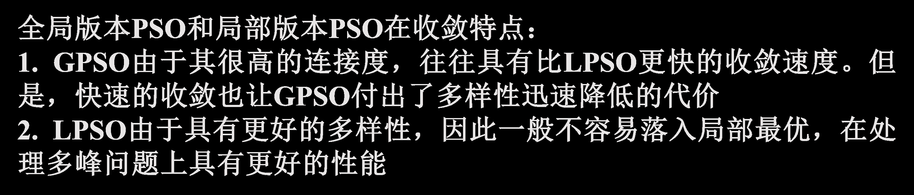

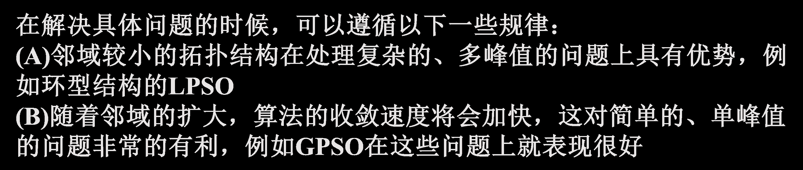

<!-- page: 125 -->

粒子群优化的改进——拓扑结构

全局粒子群算法

      1. 粒子自己历史最优值

领域PSO：整个种群被划分成
不同的子区域，传统全局gbest
被替换成相邻子区域整体的最
优解lbest。粒子向自己的历史
最优和领域最优学习。

      2. 粒子群体的全局最优值

局部粒子群算法

      1. 粒子自己历史最优值

      2. 粒子邻域内粒子的最优值

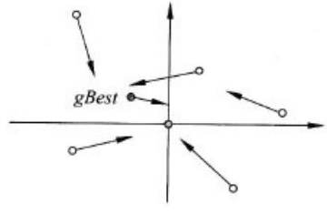

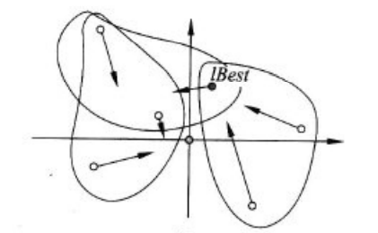

<!-- page: 126 -->

粒子群优化的改进——拓扑结构

GPSO
LPSO

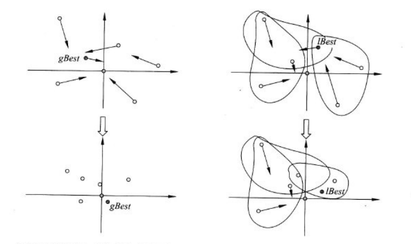

<!-- page: 127 -->

粒子群优化的改进——拓扑结构

其它拓扑结构

社会趋同法
Kennedy 2000
Fully Informed
Mendes 等人 2004
广泛学习策略
Liang 等人 2006
……

动态拓扑结构

静态拓扑结

逐步增长法
Suganthan 1999
最小距离法
Hu & Eberhart 2002
重新组合法
Liang&Suganthan2005
随机选择法
Kennedy 等人 2006
……

构
全局版本：
  星型结构
局部版本：

环形结构
  齿形结构
  金字塔结构
  冯诺依曼结构
  ……

<!-- page: 128 -->

粒子群优化的改进——混合算法

混合其它搜索算法

混合进化算子

混合其它技术

的改进

的改进
选择算子
交叉算子
变异算子

的改进
单纯形技术
函数延伸技术

结合模拟退火算法
结合人工免疫算法
结合差分进化算法
结合局部搜索算法

混沌技术
量子技术
协同技术
小生境技术
物种形成技术

……
进化规划
进化策略
蚁群算法

……

……

……

<!-- page: 129 -->

粒子群优化的改进——编码机制

Kennedy和Eberhart 1997 年对PSO进行了离散化，
形成了二进制编码的PSO(BPSO)，并且在对De
Jong 的五个标准测试函数的测试中取得较好的效果

二进制编码

Salman等人2002 年将粒子的位置变量四舍五入为
最接近的合法的离散值
Yoshida等人 2000 年将连续的值域分区间，每个区
间赋予一个相应的离散值

整数编码

Schoofs和Naudts 2002 年重新定义了PSO的“加减
乘”法，并且应用到了约束可满足问题（CSP）
Hu等人2003 年将速度定义为位置变量相互交换的
概率，从而将PSO离散化并用于解决n皇后问题
Clerc 2004 年为PSO定义了合适的“加减乘”法而实
现离散化，并且应用于解决旅行商问题（TSP）
Chen等人2009年基于集合论的技术，重新定义了
PSO速度和位置的更新公式实现了离散化

其它形式

<!-- page: 130 -->

粒子群优化的改进——参数设置

• 种群规模N
• 粒子的长度D
• 粒子的范围R
• 最大速度Vmax
• 惯性权重ω
• 压缩因子χ
• 加速系数c1和c2
• 终止条件
• 全局和局部PSO
• 同步和异步更新

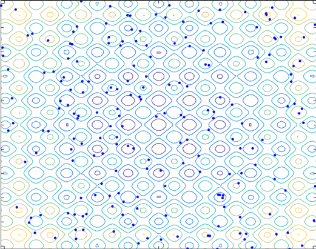

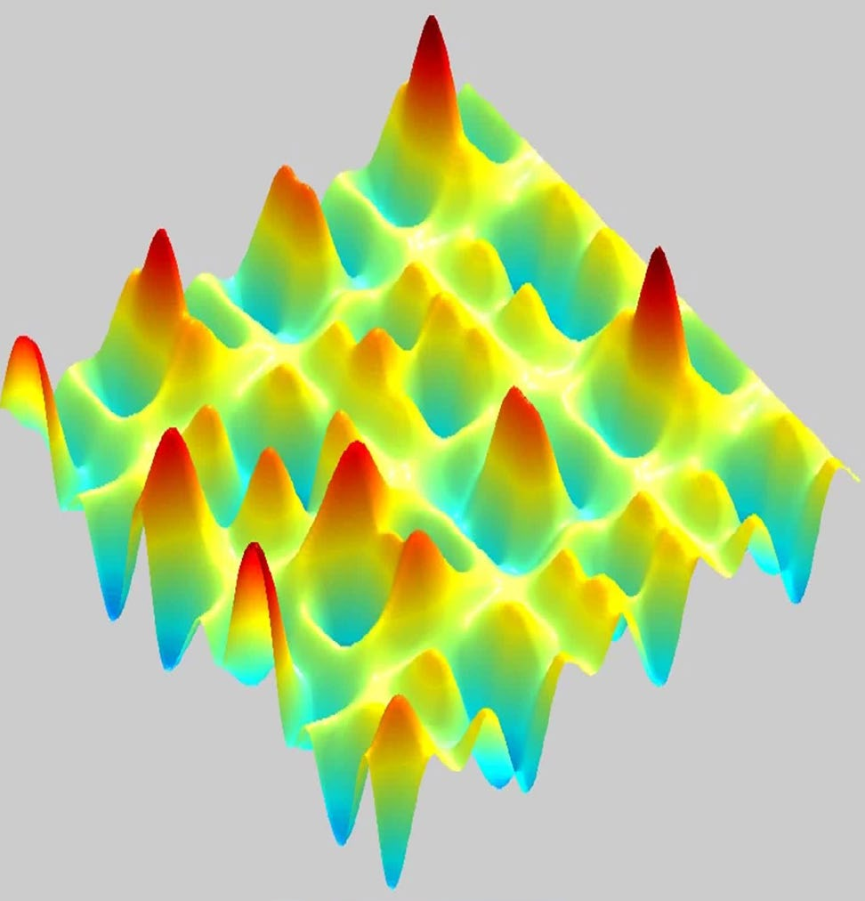

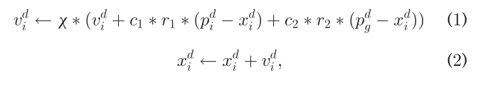

<!-- page: 131 -->

粒子群优化的改进——参数设置

种群规模

• 影响着算法的搜索能力和计算量

• 种群规模对算法的搜索多样性和收敛速度影响最大；小种
群使得算法搜索多样性较低、但种群收敛较快（可能全局
最优也可能局部最优）；大种群使得算法搜索多样性较高，
但收敛速度较慢；

• 种群规模的设置往往跟问题相关；一般而言，维度越高，
问题越复杂，种群的规模就越大。

粒子长度

• 粒子的长度D由优化问题本身决定，就是问题解的维度；

• 粒子的范围R由优化问题本身决定，每一维可以设定不同
的范围

<!-- page: 132 -->

粒子群优化的改进——参数设置

最大速度Vmax

• 决定粒子每一次的最大移动距离，制约着算法的探索和开发能力

• Vmax的每一维一般可以取相应维搜索空间的10%-20%，甚至100% ；

• 也有研究使用将Vmax按照进化代数从大到小递减的设置方案 。

惯性权重ω

• 控制着前一速度对当前速度的影响，用于平衡算法的探索和开发能
力

• 一般设置为从0.9线性递减到0.4，也有非线性递减的设置方案 ；
• 可以采用模糊控制的方式设定，或者在[0.5, 1.0]之间随机取值；
• ω设为0.729的同时将c1和c2设1.49445，有利于算法的收敛 。

<!-- page: 133 -->

粒子群优化的改进——参数设置

压缩因子χ

• 限制粒子的飞行速度的，保证算法的有效收敛

• Clerc等人通过数学计算得到χ取值0.729，同时c1和c2设为
2.05

加速系数c1和c2

• 代表了粒子向自身极值pBest和全局极值gBest推进的加速权值

• c1和c2通常都等于2.0，代表着对两个引导方向的同等重视

• 也存在一些c1和c2不相等的设置，但其范围一般都在0和4
之间

• 研究对c1和c2的自适应调整方案对算法性能的增强有重要
意义

<!-- page: 134 -->

粒子群优化的改进——参数设置

终止条件

• 决定算法运行的结束，由具体的应用和问题本身确定

• 将最大循环数设定为500，1000，5000，或者最大的函数评
估次数，等等

• 也可以使用算法求解得到一个可接受的解作为终止条件

• 或者是当算法在很长一段迭代中没有得到任何改善，则可以
终止算法

全局与局部学习

• 决定算法如何选择两种版本的粒子群优化算法—全局版PSO
和局部版PSO

• 全局版本PSO速度快，不过有时会陷入局部最优

• 局部版本PSO收敛速度慢一点，不过不容易陷入局部最优

• 在实际应用中，可以根据具体问题选择具体的算法版本

<!-- page: 135 -->

粒子群优化的改进——更新方式

• 同步更新与异步更新两种更新方式的区别在于对全局的
gBest或者局部的lBest的更新方式

• 在同步更新方式中，在每一代中，当所有粒子都采用当前
的gBest进行速度和位置的更新之后才对粒子进行评估，更
新各自的pBest，再选最好的pBest作为新的gBest

• 在异步更新方式中，在每一代中，粒子采用当前的gBest进
行速度和位置的更新，然后马上评估，更新自己的pBest，
而且如果其pBest要优于当前的gBest，则立刻更新gBest，迅
速将更好的gBest用于后面的粒子的更新过程中

• 一般而言，异步更新的PSO具高效的信息传播能力，具有
有更快的收敛速度

<!-- page: 136 -->

粒子群优化的改进——更新策略

传统粒子群优化算法

带权重的粒子群优化算法

带压缩因子的粒子群优化算法

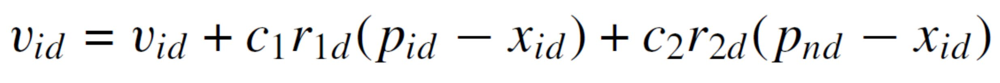

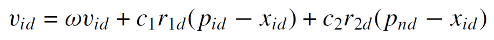

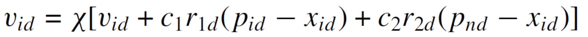

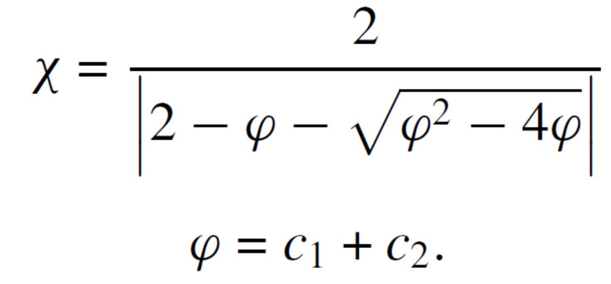

<!-- page: 137 -->

粒子群优化的改进——更新策略

优化问题维度

x1
x2
x3
x4
x5
x6
x7

最优解

0
0
0
0
0
0
0

个体1

0.05
5.85
0.02
0.08
6.85
7.98
10.58

个体2

4.32
0.03
4.89
5.10
0.06
0.09
9.12

不同的个体包含不同的

个体3

1.52
9.58
2.10
1.63
8.69
9.72
0.01

有价值信息

0.05
0.03
0.02
0.08
0.06
0.09
0.01

如何集成各个体中的有用演化

信息，快速定位全局最优？

<!-- page: 138 -->

Comprehensive Learning Particle Swarm Optimizer(CLPSO)
粒子群优化的改进——更新策略

丢弃gbest学习对象；
每个维度随机选择一个pbest学习
每个维度独立看待
多个pbest的有价值信息可以被集

成学习
可以理解为构建一个新的学习对

象

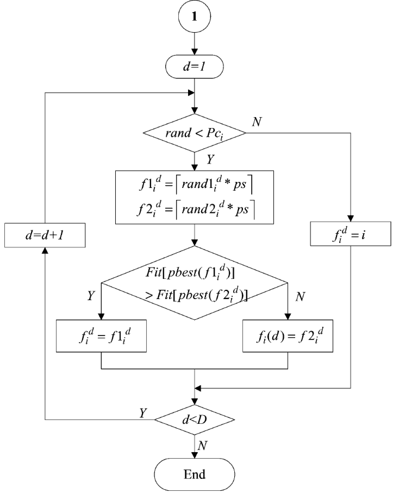

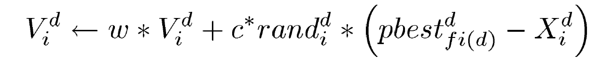

<!-- page: 139 -->

Orthogonal Learning Particle Swarm Optimizer(OLPSO)
粒子群优化的改进——更新策略

构建一个正交矩阵，逐个尝试维

度组合
计算每个维度组合的适应值，而

后计算每个维度的平均适应值
选择具有最好平均适应值的维度

进行组合作为学习对象
能够大概率找到比较好的维度组

合
需要消耗大量适应值
把每个变量独立看待

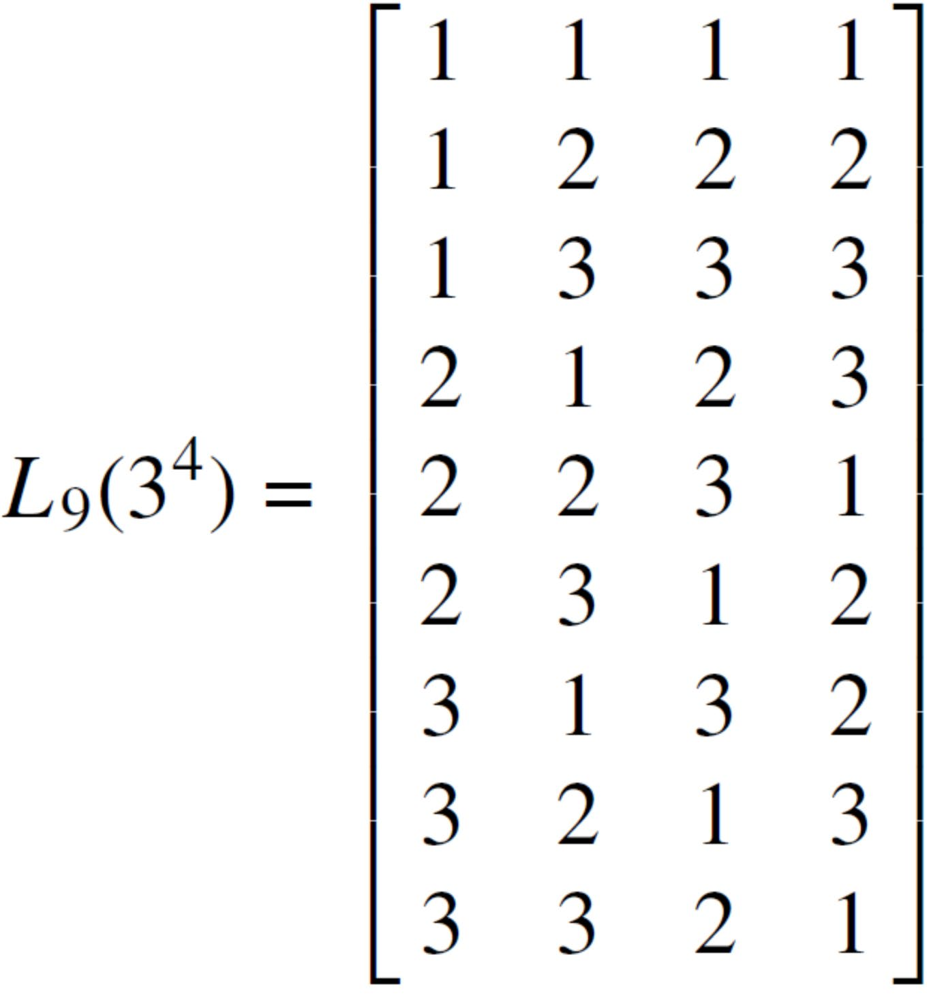

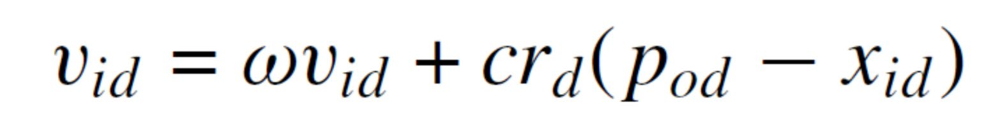

<!-- page: 140 -->

粒子群优化的改进——更新策略

Genetic Learning Particle Swarm Optimizer(GLPSO)

GA

交叉操作

操

变异操作

作

选择操作

利用GA构建PSO的学习对象；
gbest和pbest的线性组合以及更好的
变异操作引入多样性
每更新一个粒子，需要消耗两次适应值评估

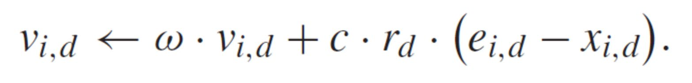

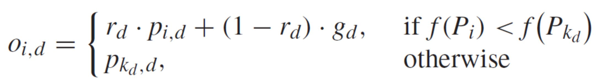

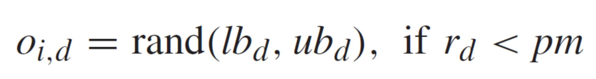

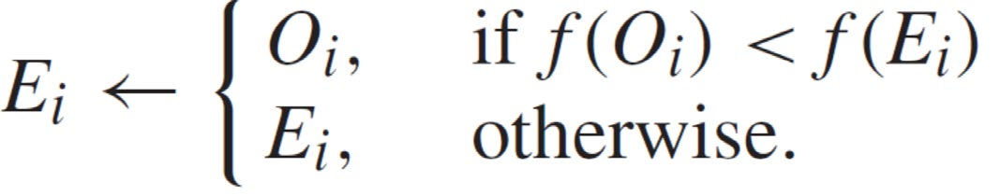

<!-- page: 141 -->

粒子群优化的改进——更新策略

基于历史信息构建学习对象（pbest和gbest）

pbest可能保持多代不变

gbest保持不变的概率更大，代数更长

适合于低维优化问题，不适合高维优化问题

1. J. J. Liang, A. K. Qin, P. N. Suganthan, and S. Baskar, "Comprehensive
Learning Particle Swarm Optimizer for Global Optimization of Multimodal
Functions," IEEE Trans. Evol. Comput., vol. 10, no. 3, pp. 281-295, 2006.
2. Z.-H. Zhan, J. Zhang, Y. Li, and Y.-H. Shi, "Orthogonal Learning Particle
Swarm Optimization," IEEE Trans. Evol. Comput., vol. 15, no. 6, pp. 832-847,
2011.
3. Y. Gong et al., "Genetic Learning Particle Swarm Optimization," IEEE Trans.
Cybern., vol. 46, no. 10, pp. 2277-2290, 2016.

<!-- page: 142 -->

粒子群优化的改进——更新策略

Competitive Swarm Optimizer(CSO)

种群中的个体两两随机配对，

随后进行比较；
winner直接进入下一代，loser

向winner学习；

用整个种群的平均位置作为另

一个学习对象；
同一代中，每个待更新粒子的

学习对象均不相同---来源于随
机配对
不同代中，同一粒子的学习对

随着迭代的进行，winner

会越来越好
最终winner可能收敛自全

象也不相同---来源于种群个体
更新和随机配对

局或者局部最优

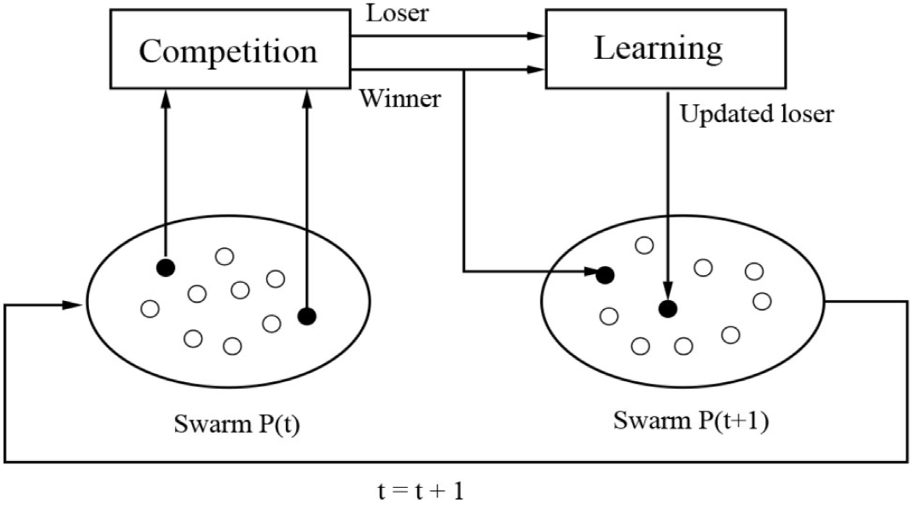

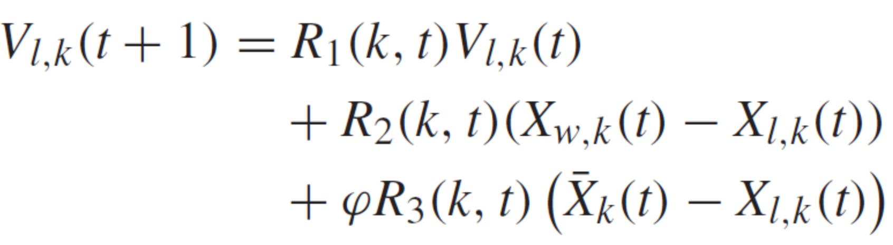

<!-- page: 143 -->

粒子群优化的改进——更新策略

Social Learning Particle Swarm

Optimization（SL-PSO）

更新概率

M：固定基数

n：维度大小
m：种群大小

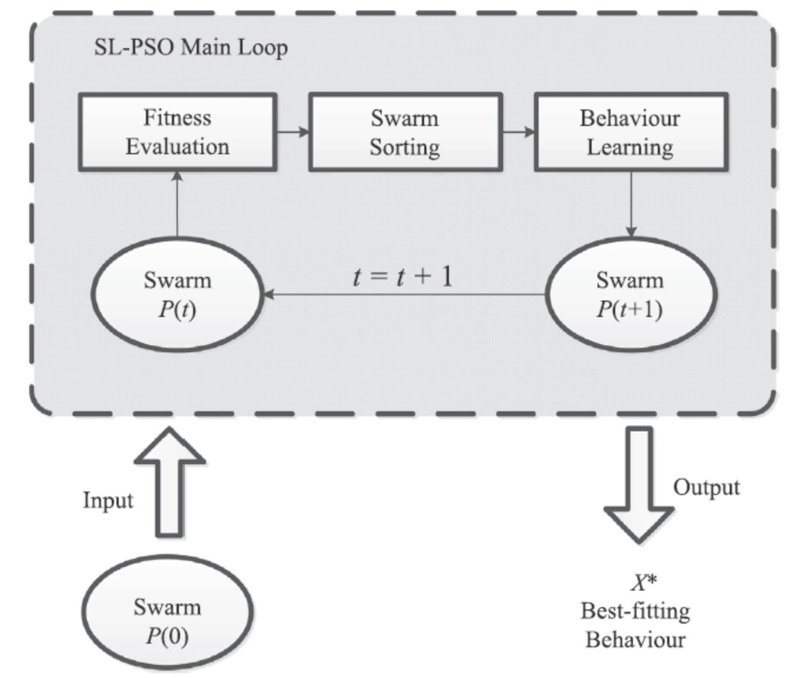

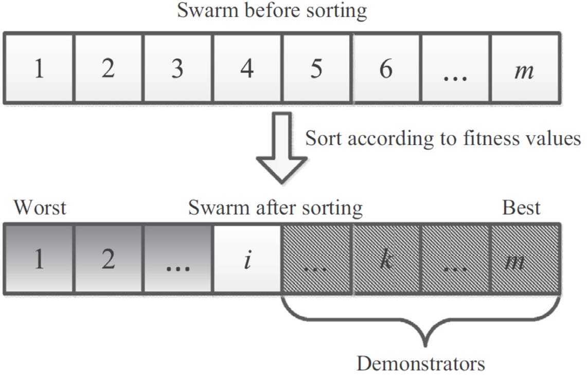

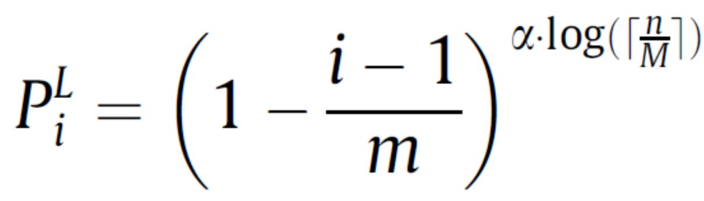

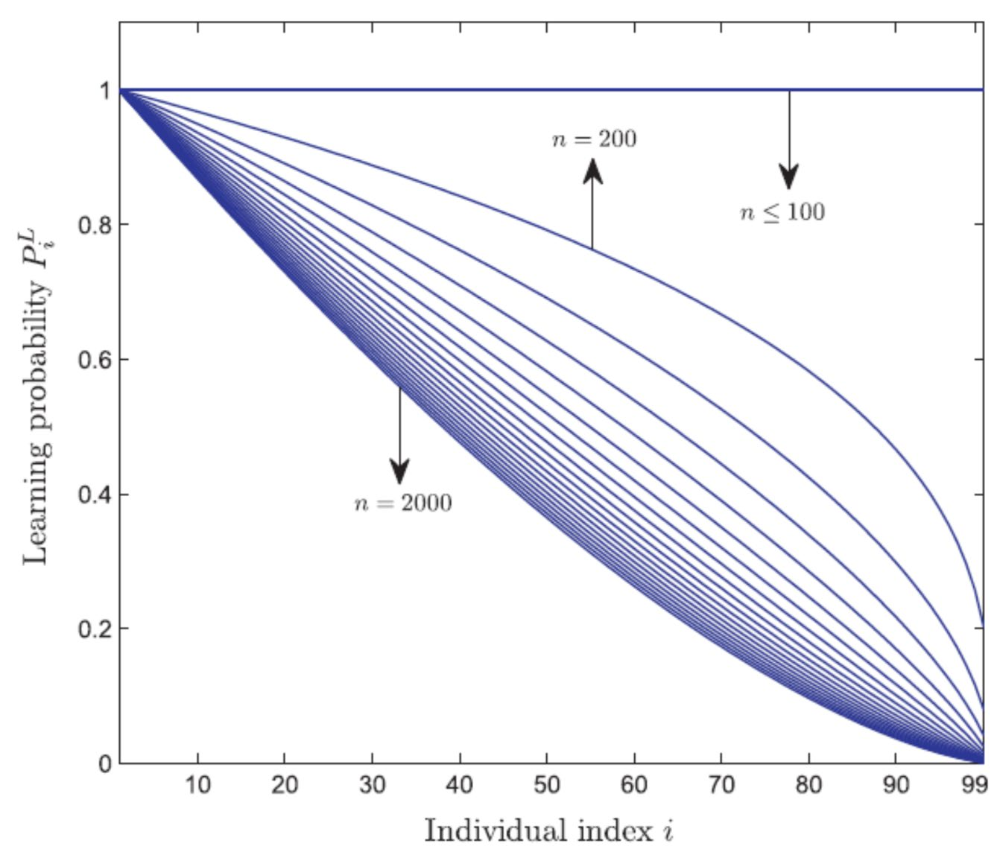

<!-- page: 144 -->

粒子群优化的改进——更新策略

Social Learning Particle Swarm Optimization（SL-PSO）

ഥ𝑿𝑿：种群的平均位置

Xk：比Xi好的个体中随机选择的一个个体

根据排序序号计算更新概率----个体适应值越好，更新概率越低；
最好的个体更新概率为0，最差的个体更新概率为1；
给予较差的个体一定的存货概率，有利于高多样性的维持；
较好的个体会越来越好，最终收敛到全局或者局部最优解；

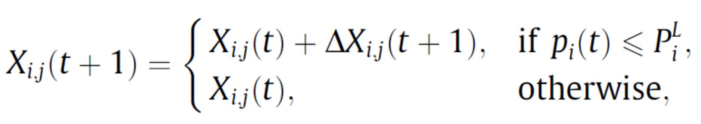

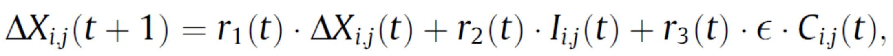

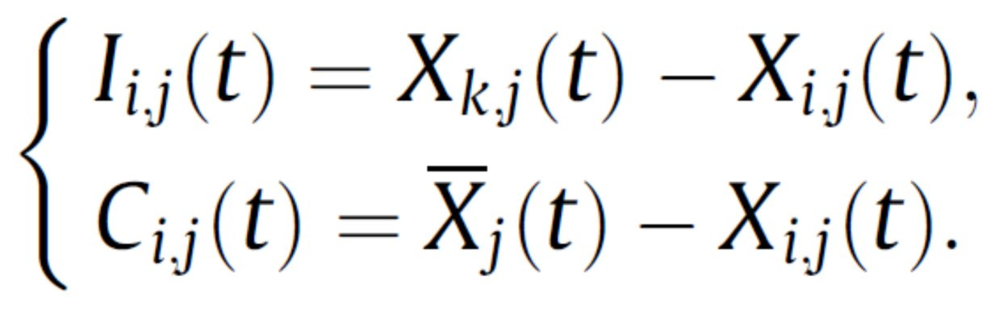

<!-- page: 145 -->

粒子群优化的改进——更新策略

优化问题维度

2x

研究动机

4x

x1
x2
x3
x4
x5
x6
x7

1x
5x

最优解

0
0
0
0
0
0
0

7x
6x

3x

个体1

0.05
5.85
0.02
0.08
6.85
7.98
10.58

变量关联情况

不同的个体包含不同的

个体2

4.32
0.03
4.89
5.10
0.06
0.09
9.12

有价值信息

相关联的变量往往相互

个体3

1.52
9.58
2.10
1.63
8.69
9.72
0.01

影响演化方向

个体中的有价值信息往

往呈变量相关性聚集
0.05
0.03
0.02
0.08
0.06
0.09
0.01

如何集成各个体中的有用演化

信息，快速定位全局最优？

<!-- page: 146 -->

Segment-based Predominant Learning Swarm Optimizer（SPLSO）
粒子群优化的改进——更新策略

基于竞争机制，将种群划分为较好个体集合RG和较差个体集合RP---

Competition

较差的粒子向较好的粒子学习，较好的粒子直接进入下一代---

Predominant Learning

将每个较差的粒子维度分段，每段向一个RG中较好的粒子学习---

Segment-based Learning

population

𝐺𝐺1
𝐺𝐺2
𝐺𝐺𝑚𝑚

𝑹𝑹𝑹𝑹

. . .

loser

𝐺𝐺1
𝐺𝐺2
𝐺𝐺𝑚𝑚

𝐺𝐺1
𝐺𝐺2
𝐺𝐺𝑚𝑚
𝐺𝐺1
𝐺𝐺2
𝐺𝐺𝑚𝑚

𝑹𝑹𝑹𝑹

. . .

. . .
. . .
. . .

𝐸𝐸𝐸𝐸𝐸𝐸𝐸𝐸𝐸𝐸𝐸𝐸𝐸𝐸1
𝐸𝐸𝐸𝐸𝐸𝐸𝐸𝐸𝐸𝐸𝐸𝐸𝐸𝐸2
𝐸𝐸𝐸𝐸𝐸𝐸𝐸𝐸𝐸𝐸𝐸𝐸𝐸𝐸𝑚𝑚

winner

Randomly Select

(a) Segment-based Learning
(b) Predominant Learning

(c) Competition

<!-- page: 147 -->

粒子群优化的改进——更新策略

Segment-based Predominant Learning Swarm Optimizer（SPLSO）

( , )
1
2
3 ˆ
(
)
(
)
i
i
i
i
i
i

j
j
g
j i
j
j
RP
RP
RG
RP
RP
r
r
r
φ
←
+
−
+
−
G
G
G
G
G
G
V
V
X
X
x
X

维度分段机制---随机分段，减

少适应值消耗

j
j
j
RP
RP
RP
←
+
G
G
G
X
X
V

i
i
i

每个待更新粒子都进行维度分

X

(
)
ˆ

fit
x
x
fit
=

NP
d
d
i

段---更大概率确保关联性

= ∑

i
NP
i

∑

X

(
)

1

j
j

1

=

population

𝐺𝐺1
𝐺𝐺2
𝐺𝐺𝑚𝑚

𝑹𝑹𝑹𝑹

. . .

loser

𝐺𝐺1
𝐺𝐺2
𝐺𝐺𝑚𝑚

𝐺𝐺1
𝐺𝐺2
𝐺𝐺𝑚𝑚
𝐺𝐺1
𝐺𝐺2
𝐺𝐺𝑚𝑚

𝑹𝑹𝑹𝑹

. . .

. . .
. . .
. . .

𝐸𝐸𝐸𝐸𝐸𝐸𝐸𝐸𝐸𝐸𝐸𝐸𝐸𝐸1
𝐸𝐸𝐸𝐸𝐸𝐸𝐸𝐸𝐸𝐸𝐸𝐸𝐸𝐸2
𝐸𝐸𝐸𝐸𝐸𝐸𝐸𝐸𝐸𝐸𝐸𝐸𝐸𝐸𝑚𝑚

winner

Randomly Select

(a) Segment-based Learning
(b) Predominant Learning

(c) Competition

<!-- page: 148 -->

粒子群优化的改进——更新策略

Segment-based Predominant Learning Swarm Optimizer（SPLSO）

通过维度分段，间接考虑了变量相关性

提供了一种新型个体协同方式

更有效地聚集不同个体内的有价值信息

population

𝐺𝐺1
𝐺𝐺2
𝐺𝐺𝑚𝑚

𝑹𝑹𝑹𝑹

. . .

loser

𝐺𝐺1
𝐺𝐺2
𝐺𝐺𝑚𝑚

𝐺𝐺1
𝐺𝐺2
𝐺𝐺𝑚𝑚
𝐺𝐺1
𝐺𝐺2
𝐺𝐺𝑚𝑚

𝑹𝑹𝑹𝑹

. . .

. . .
. . .
. . .

𝐸𝐸𝐸𝐸𝐸𝐸𝐸𝐸𝐸𝐸𝐸𝐸𝐸𝐸1
𝐸𝐸𝐸𝐸𝐸𝐸𝐸𝐸𝐸𝐸𝐸𝐸𝐸𝐸2
𝐸𝐸𝐸𝐸𝐸𝐸𝐸𝐸𝐸𝐸𝐸𝐸𝐸𝐸𝑚𝑚

winner

Randomly Select

(a) Segment-based Learning
(b) Predominant Learning

(c) Competition

<!-- page: 149 -->

Level-based Learning Swarm Optimizer（LLSO）
粒子群优化的改进——更新策略

教育学因材施教策略

每个学生学
习能力不同

学生分级
因材施教

种群进化依状态层次式更新机制

L1

粒子分层
层次更新

每个粒子演
化状态不同

L2

L3

L4

Level-based Learning Swarm Optimizer (LLSO)

<!-- page: 150 -->

粒子群优化的改进——更新策略

Level-based Learning Swarm Optimizer（LLSO）

低层粒子向随机选择的两个高

层粒子学习

1
1
2
2
,
1
,
2
,
,
3
,
,
(
)
(
)
d
d
d
d
d
d
i j
i j
rl k
i j
rl
k
i j
r x
x
r x
x
v
rv
φ
+
−
+
−
←

第二层粒子向从第一层随机选

择的两个粒子学习

,
,
,
d
d
d
i j
i j
i j
x
v
x
+
←

最高层粒子不更新，直接进入

下一代

Swarm

Levels
Levels

L1

L1

L2’s Learning

L3’s Learning

L2

L2

Ranking

Learning

L4’s Learning

L3

L3

L4

L4

<!-- page: 151 -->

Level-based Learning Swarm Optimizer（LLSO）
粒子群优化的改进——更新策略

每个粒子向两个不同的支配粒子学习，不同粒子的两个学习对象往往不

同---学习对象多样性更高

每个粒子向两个具备不同演化能力的支配粒子学习---从粒子层平衡探索

能力和开发能力

不同层次的粒子拥有不同数目的候选学习对象，层次越高的粒子所拥有

的候选学习对象越少

高层粒子集中开发解空间，低层粒子集中探索解空间---从种群层平衡探

索能力和开发能力

Levels
Levels

Swarm

L1

L1

L2’s
Learning

L2

L2

L3’s
Learning

Ranking

Learning

L4’s
Learning

L3

L3

L

L4

4

<!-- page: 152 -->

粒子群优化的改进——更新策略

Stochastic Dominant Learning Swarm Optimizer（SDLSO）

每个粒子具有潜在的存活概率；

适应值越好的个体，存活概率越大；

最好的前两个个体存活概率为1，最

差的个体存活概率为0；

最好的前两个个体越来越好，最终

收敛到全局或者局部最优；

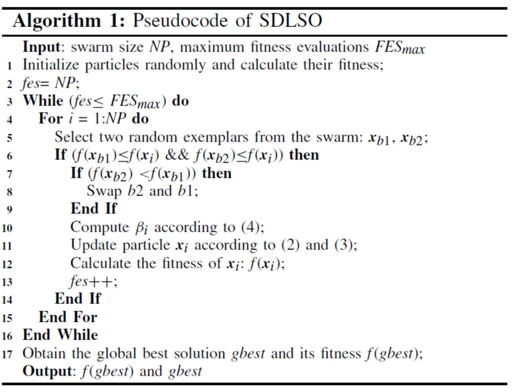

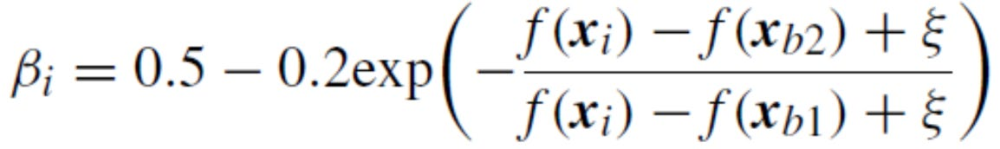

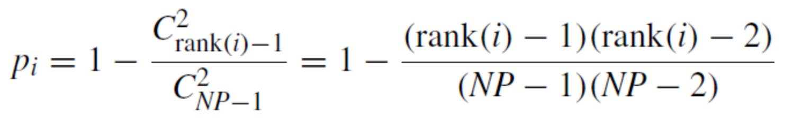

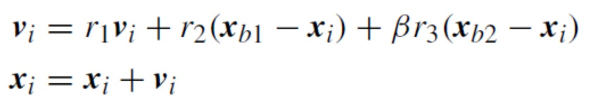

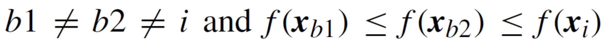

<!-- page: 153 -->

参考文献

[1] J. Kennedy and R. Eberhart, "Particle swarm optimization," Proceedings of ICNN'95 - International Conference on Neural Networks, Perth, WA, Australia, 1995, pp. 1942-1948

[2] V. L. Huang, A. P. Engelbrecht, and M. C. Eberhart, "Particle Swarm Optimization with Extended Memory," IEEE Transactions on Evolutionary Computation, vol. 8, no. 3, pp. 3

21-328, 2004.

[3] R. Mendes, J. Kennedy, and J. Neves, "The Fully Informed Particle Swarm: Simpler, Maybe Better," IEEE Transactions on Evolutionary Computation, vol. 8, no. 3, pp. 204-210, 2004.

[4] F. van den Bergh and A. P. Engelbrecht, "A Cooperative Approach to Particle Swarm Optimization," IEEE Transactions on Evolutionary Computation, vol. 8, no. 3, pp. 225-239, 2004.

[4] Wei-neng Chen, Jun Zhang, Ying Lin, Ni Chen, Zhi-Hui Zhan, et al., "Particle Swarm Optimization With an Aging Leader and Challengers," in IEEE Transactions on Evolutionary

Computation, vol. 17, no. 2, pp. 241-258, 2013.

[5] Wei-neng Chen, Jun Zhang, Henry. S. H. Chung, Wen-Liang Zhong, Wei-Gang Wu and Yu-hui Shi, "A Novel Set-Based Particle Swarm Optimization Method for Discrete Optimi-

-zation Problems," in IEEE Transactions on Evolutionary Computation, vol. 14, no. 2, pp. 278-300, 2010,

[6] An Song, Wei-neng Chen, Xiao-nan Luo, Zhi-Hui Zhan and Jun Zhang, "Scheduling Workflows With Composite Tasks: A Nested Particle Swarm Optimization Approach," in IEEE

Transactions on Services Computing, vol. 15, no. 2, pp. 1074-1088, 1 March-April 2022

[7] Qiang Yang, Wei-neng Chen, Jeremiah Da Deng, Yun Li, Tianlong Gu, Jun Zhang, “A Level-based Learning Swarm Optimizer for Large Scale Optimization”, IEEE Transactions

on Evolutionary Computation, vol. 22, no. 4, pp. 578-594, 2018.

[8] Feng-Feng Wei, Wei-neng Chen, Qiang Yang, J. Da Deng, Xiao-Nan Luo, Hu Jin, et al., “A Classifier-Assisted Level-Based Learning Swarm Optimizer for Expensive Optimizati-

-on,” IEEE Transactions on Evolutionary Computation, vol. 25, no. 2, pp. 219-233, 2021.

[9] Bowen Zhao, Ximeng Liu, An Song, Wei-neng Chen, KK Lai, Jun Zhang and Robert Deng, “PriMPSO: A Privacy-Preserving Multiagent Particle Swarm Optimization Algorithm”,

IEEE Transactions on Cybernetics, vol. 53, no. 11, pp. 7136-7149, 2023.

[10] Qiang Yang, Gong-Wei Song, Wei-Neng Chen, Ya-Hui Jia, Xu-Dong Gao, Zhen-Yu Lu, Sang-Woon Jeon, and Jun Zhang, "Random Contrastive Interactionfor Particle Swarm

Optimization in High-Dimensional Environment", IEEE Transactions on Evolutionary Computation, in press, 2023.

153

<!-- page: 154 -->

一、背景与意义

Outline
二、进化算法

三、粒子群优化

四、蚁群优化

五、进化计算的前沿研究进展

<!-- page: 155 -->

蚁群优化方法——思想来源

蚁群优化算法的思想来源是怎样的？

它由谁提出的？

蚁群优化算法（Ant Colony Optimization，ACO）

是进化计算的一个分支，
是一种模拟自然界蚂蚁觅食行为的随机搜索算法。

蚁群优化算法最早由意大利学者Dorigo、
Maniezzo等人于20世纪90年代首先提出。他
们在研究蚂蚁觅食的过程中，发现单个蚂蚁的行
为比较简单，但是蚁群整体却可以体现一些智能

的行为。受此启发，提出了ACO算法，并成为
了解决离散优化问题的主要方法之一，被应用于

了各个领域之中。

155

<!-- page: 156 -->

蚁群优化方法——思想来源

自然界蚁群智能行为现象

156

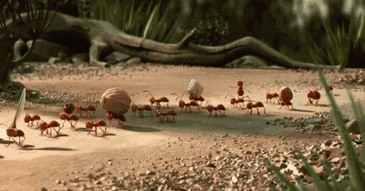

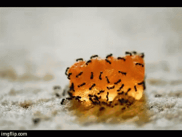

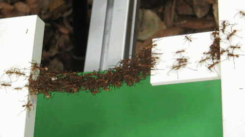

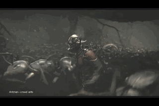

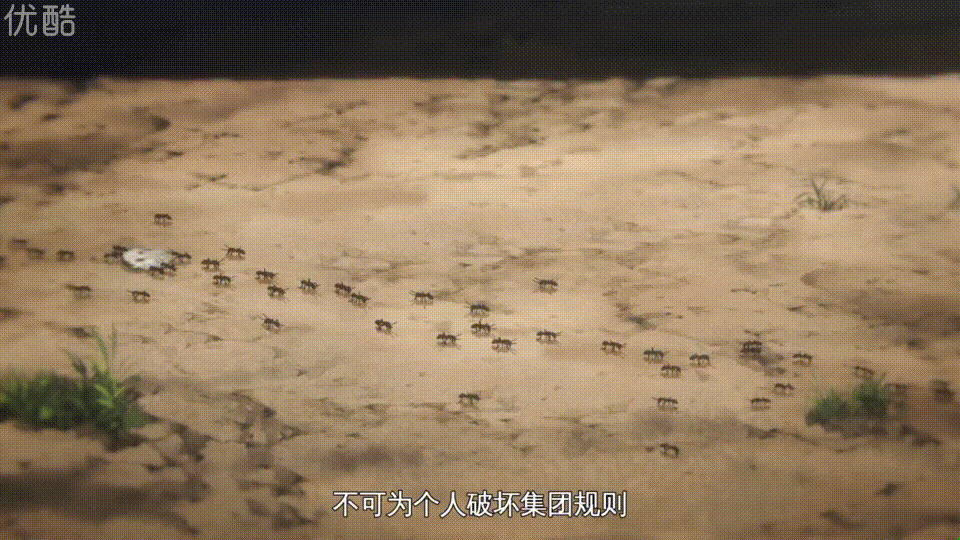

<!-- page: 157 -->

蚁群优化方法——思想来源

著名的双桥实验

蚁群在不同的环境下，均可以

寻找到最短到达食物源的路径；
蚁群内的蚂蚁可以通过某种信

息机制实现信息的传递；
蚂蚁会在其经过的路径上释放

一种可以称之为“信息素”的
物质；
蚁群内的蚂蚁对“信息素”具

有感知能力，它们会沿着“信
息素”浓度较高路径行走，而
每只路过的蚂蚁都会在路上留
下“信息素”；
形成一种类似正反馈的机制，

经过一段时间后，整个蚁群就
会沿着最短路径到达食物源了。

157

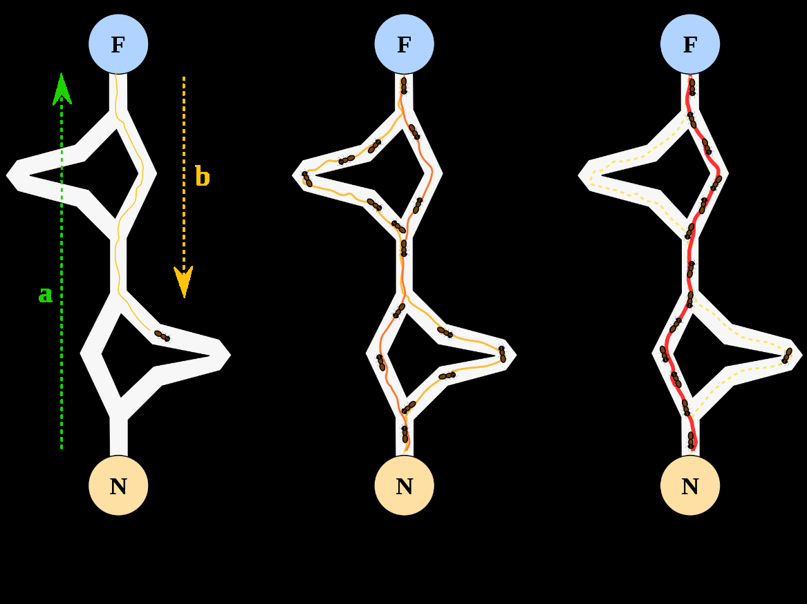

<!-- page: 158 -->

蚁群优化方法——思想来源

蚁群在遇到动态障碍后会在短时间内找到新的最优路径

158

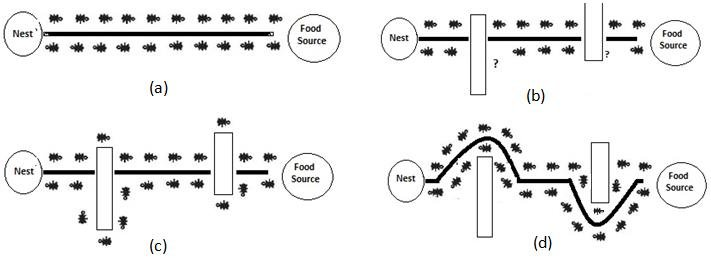

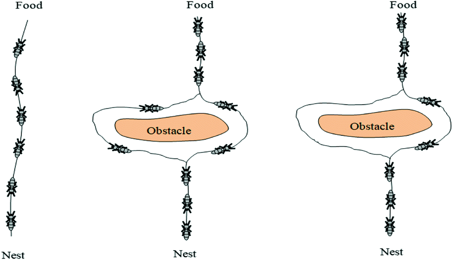

<!-- page: 159 -->

蚁群优化方法——思想来源


意大利学者Dorigo教授在1992年通过模拟蚂
蚁觅食行为，找到了一种求解离散组合最优化
问题的智能优化算法——蚁群优化算法！

用蚂蚁的行走路径表示待优化问题的可行解，

整个蚂蚁群体的所有路径构成待优化问题的解
空间
路径较短的蚂蚁释放的信息素量较多，随着时

Marco Dorigo
比利时布鲁塞尔
    大学教授
 著名蚁群优化算
法的创始人
 IEEE Fellow
IEEE Trans on
EC 副主编

间的推进，较短的路径上累积的信息素浓度逐
渐增高，选择该路径的蚂蚁个数也愈来愈多。
最终，整个蚂蚁会在正反馈的作用下集中到最
佳的路径上，此时对应的便是待优化问题的最
优解

<!-- page: 160 -->

蚁群优化方法——思想来源

❖
Marco Dorigo教授2000年在《自然》上发
表了相关论文

Marco Dorigo
比利时布鲁塞尔
    大学教授
 著名蚁群优化算
法的创始人
 IEEE Fellow
IEEE Trans on
EC 副主编

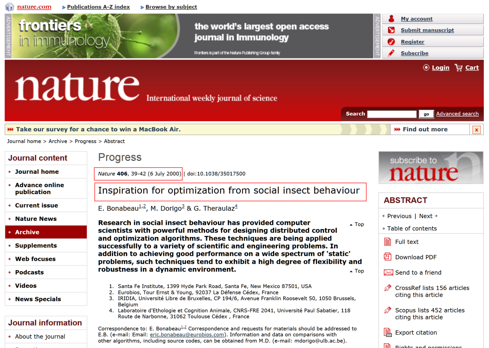

<!-- page: 161 -->

蚁群优化方法——基本框架

自然界蚂蚁觅食行为
蚁群优化算法

觅食空间

问题的搜索空间

对
应
关
系

蚁群
搜索空间的一组有效解

蚁巢到食物的一条路径

一个有效解

找到的最短路径

问题的最优解

蚂蚁间的通信
启发式搜索

信息素

信息素浓度变量

161

<!-- page: 162 -->

蚁群优化方法——基本框架

❖
蚂蚁在寻找食物的过程中往往是随机选择路径的，但它

们能感知当前地面上的信息素浓度，并倾向于往信息素

浓度高的方向行进。

2：天哪，我一定是走错路了，
好远，得产生少点信息素

3：（得意……）
我这么快就到了，
产生多点信息素，
兄弟们不跟我跟谁？
4、5：好强的信息素浓度，
跟上跟上

1：走哪条路比较好呢？
嗯，先自己瞧瞧，
再感受下兄弟们的气息

食物

6：我自己走，说不定能探索
出一条更短的路径呢，
到时候你们就都会跟着我了

162

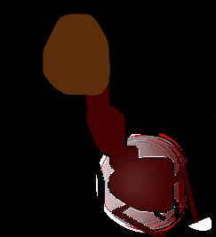

<!-- page: 163 -->

蚁群优化方法——基本框架

❖
信息素由蚂蚁自身释放，是实现蚁群内间接通信的物质。

❖
较短路径上蚂蚁的往返时间比较短，单位时间内经过该路径
的蚂蚁多，所以信息素的积累速度比较长路径快。

❖
当后续蚂蚁在路口时，就能感知先前蚂蚁留下的信息，并倾
向于选择一条较短的路径前行。

2：天哪，我一定是走错路了，
好远，得产生少点信息素

3：（得意……）
我这么快就到了，
产生多点信息素，
兄弟们不跟我跟谁？
4、5：好强的信息素浓度，
跟上跟上

1：走哪条路比较好呢？
嗯，先自己瞧瞧，
再感受下兄弟们的气息

食物

6：我自己走，说不定能探索
出一条更短的路径呢，
到时候你们就都会跟着我了

163

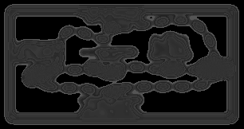

<!-- page: 164 -->

蚁群优化方法——基本框架

❖
这种正反馈机制使得越来越多的蚂蚁在巢穴与食物之间

的最短路径上行进。由于其他路径上的信息素会随着时

间蒸发，最终所有的蚂蚁都在最优路径上行进。

2：天哪，我一定是走错路了，

好远，得产生少点信息素

3：（得意……）

我这么快就到了，

1：走哪条路比较好呢？

产生多点信息素，

兄弟们不跟我跟谁？
4、5：好强的信息素浓度，

嗯，先自己瞧瞧，

再感受下兄弟们的气息

跟上跟上

食物

6：我自己走，说不定能探索

出一条更短的路径呢，

到时候你们就都会跟着我了

164

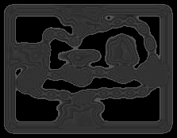

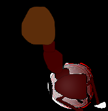

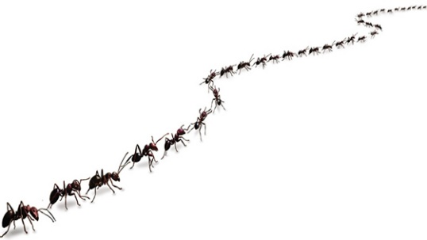

<!-- page: 165 -->

蚁群优化方法——基本框架

蚁群优化算法整体框架

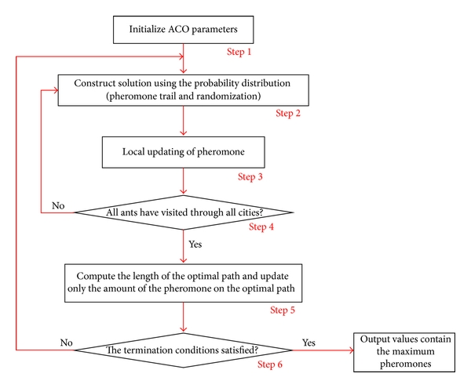

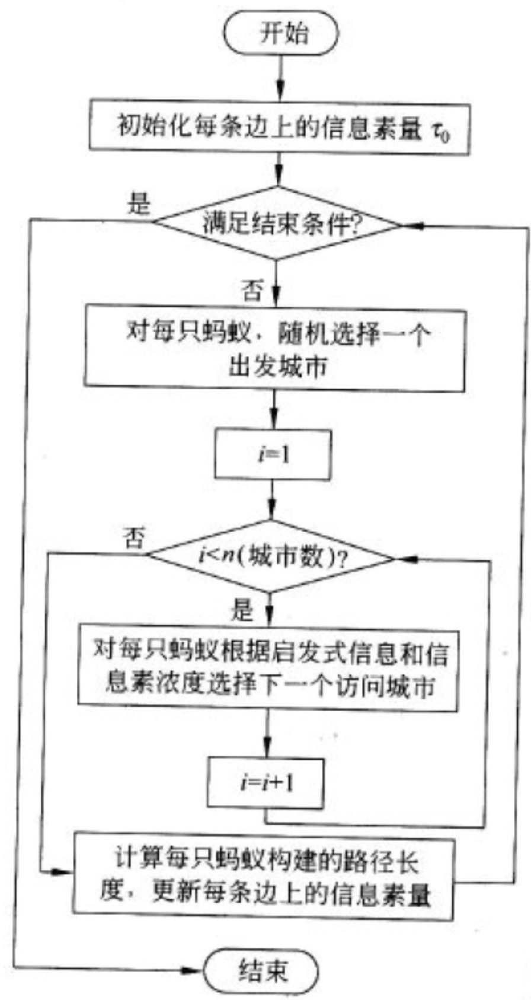

<!-- page: 166 -->

蚁群优化方法——基本框架

ACO基本要素

信息素更新

路径构建

当所有蚂蚁构建完路径

每只蚂蚁随机选择一
个城市作为其出发城
市，并维护一个路径
记忆向量，用来存放
该蚂蚁依次经过的城
市。蚂蚁在构建路径
的每一步中，按照一
个随机比例规则选择
下一个要到达的城市
。

后，算法将会对所有的

路径进行全局信息素的

更新。信息素的浓度变

化与蚂蚁所构建的路径

长度相关。

166

<!-- page: 167 -->

蚁群优化方法——路径构建

❖
路径构建—伪随机比例选择规则（random
proportional）

α
β



∈

= 

[
] [
]

( , )
( , )
,  if
( )
( , )
( , )
( , )

i j
i j
j
J
i
p
i j
i u
i u

α
β
τ
η

k
k

[
] [
]
( )

∑

τ
η
∈




u J
i

k

             0,                            otherwise

对于每只蚂蚁k，路径记忆向量Rk按照访问顺序记录了所有k

已经经过的城市序号。
设蚂蚁k当前所在城市为i，则其选择城市j作为下一个访问对

象的概率如上式。
Jk(i)表示从城市i可以直接到达的、且又不在蚂蚁访问过的城

市序列Rk中的城市集合。
η(i, j)是一个启发式信息，通常由h (i, j)=1/dij直接计算。τ (i, j)

表示边(i, j)上的信息素量。

167

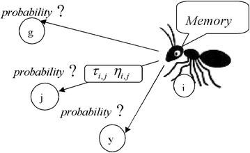

<!-- page: 168 -->

蚁群优化方法——路径构建

❖
路径构建—伪随机比例选择规则（random
proportional）

α
β



∈

= 

[
] [
]

( , )
( , )
,  if
( )
( , )
( , )
( , )

i j
i j
j
J
i
p
i j
i u
i u

α
β
τ
η

k
k

[
] [
]
( )

∑

τ
η
∈




u J
i

k

             0,                            otherwise

长度越短、信息素浓度越大的路径被蚂蚁选择的概率越大。
α和β是两个预先设置的参数，用来控制启发式信息与信息素

浓度作用的权重关系。
当α=0时，算法演变成传统的随机贪心算法，最邻近城市被

选中的概率最大。
当β=0时，蚂蚁完全只根据信息素浓度确定路径，算法将快

速收敛，这样构建出的最优路径往往与实际目标有着较大的
差异，算法的性能比较糟糕。

168

<!-- page: 169 -->

蚁群优化方法——信息素更新

❖
信息素更新

在算法初始化时，问题空间中所有的边上的信息素都被初始

化为τ0。

算法迭代每一轮，问题空间中的所有路径上的信息素都会发

生蒸发，即为所有边上的信息素乘上一个小于1的常数。信

息素蒸发是自然界本身固有的特征，在算法中能够帮助避免

信息素的无限积累，使得算法可以快速丢弃之前构建过的较

差的路径。

蚂蚁根据自己构建的路径长度在它们本轮经过的边上释放信

息素。蚂蚁构建的路径越短、释放的信息素就越多。一条边

被蚂蚁爬过的次数越多、它所获得的信息素也越多。

169

<!-- page: 170 -->

蚁群优化方法——信息素更新

❖
信息素更新

m

∑

( , )
(1
)
( , )
( , ),

i j
i j
i j

τ
ρ
τ
τ

=
−
⋅
+
∆

k
k

1
1

=
−

k
k
k


∈
∆
= 

(
)
, if ( , )
( , )
   0,       otherwise

C
i j
R
i j

τ

m是蚂蚁个数；

ρ是信息素的蒸发率，规定0< ρ ≤1。

                是第k只蚂蚁在它经过的边上释放的信息素量，它等

( , )
k i j
τ
∆

于蚂蚁k本轮构建路径长度的倒数。

Ck表示路径长度，它是Rk中所有边的长度和。

170

<!-- page: 171 -->

蚁群优化方法——信息素更新

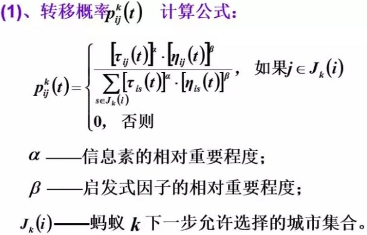

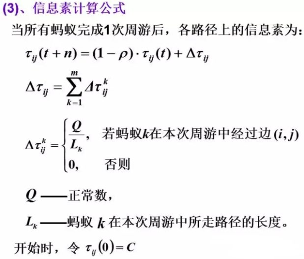

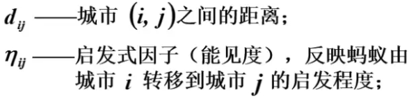

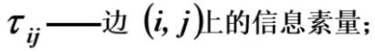

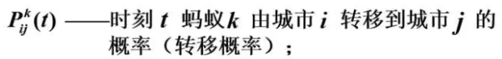

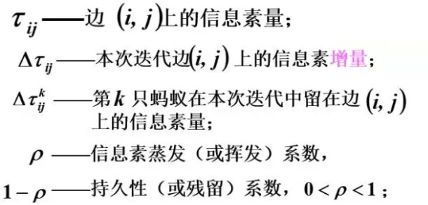

<!-- page: 172 -->

蚁群优化方法——整体流程

算法流程

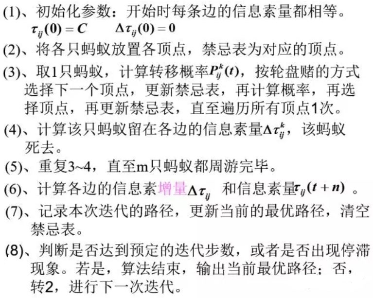

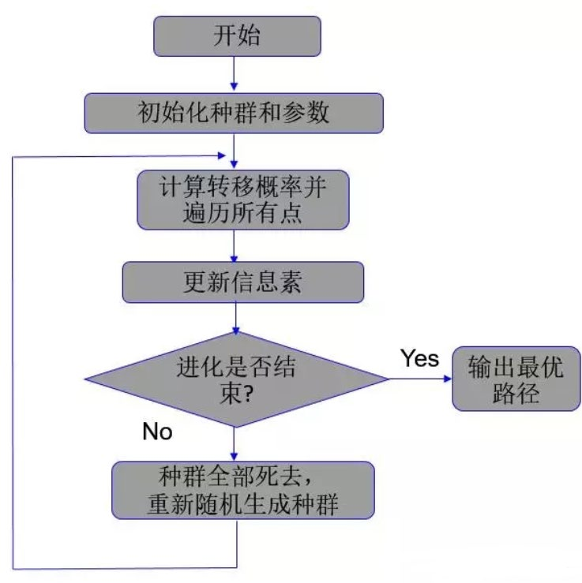

<!-- page: 173 -->

蚁群优化方法——整体流程

路径构建

信息素更新

173

<!-- page: 174 -->

蚁群优化方法——整体流程

蚁群算法是一种用来寻找优化路径的概率型算法

本质上是进化算法中的一种启发式全局优化算法

与其他优化算法相比，蚁群算法具有以下几个特点：

采用正反馈机制，使得搜索过程不断收敛，最终逼近最优解。

每个个体可以通过释放信息素来改变周围的环境，且每个个

体能够感知周围环境的实时变化，个体间通过环境进行间接

地通讯。

搜索过程采用分布式计算方式，多个个体同时进行并行计算，

大大提高了算法的计算能力和运行效率。

启发式的概率搜索方式不容易陷入局部最优，易于寻找到全

局最优解

174

<!-- page: 175 -->

蚁群优化方法——求解TSP问题

给出用蚁群算法求解一个四城市的TSP问题的执行步骤，

四个城市A、B、C、D之间的距离矩阵如下

3
1
2
3
5
4
1
5
2
2
4
2

∞


∞


=
= 

∞


∞



ij
W
d

假设蚂蚁种群的规模m=3,参数a=1，b=2，r=0.5。

步骤1：初始化。首先使用贪心算法得到路径
(ACDBA)，则Cnn=f(ACDBA)=1+2+4+3=10。
求得τ0=m/Cnn=3/10=0.3。初始化所有边上的信
息素τij=τ0。

175

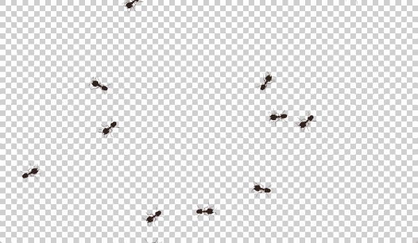

<!-- page: 176 -->

蚁群优化方法——求解TSP问题

步骤2.1：为每只蚂蚁随机选择出发城市，
假设蚂蚁1选择城市A，蚂蚁2选择城市B，
蚂蚁3选择城市D。

3
1
2
3
5
4
1
5
2
2
4
2

∞


∞


=
= 

∞


∞



ij
W
d

步骤2.2：为每只蚂蚁选择下城市。我们仅
以蚂蚁1为例，当前城市i=A,可访问城市集
合J1(i) ={B, C, D}。计算蚂蚁1选择B,C,D作
为下一访问城市的概率：

α
β



∈

= 

[
] [
]

( , )
( , )
,  if
( )
( , )
( , )
( , )

i j
i j
j
J
i
p
i j
i u
i u

α
β
τ
η

k
k

[
] [
]
( )

∑

τ
η
∈




u J
i

k

             0,                            otherwise

( )
0.033/(0.033 0.3 0.075)
0.081
p B =
+
+
=
( )
0.3/(0.033
0.3
0.075)
0.74
p C =
+
+
=


×
=
×
=

⇒
×
=
×
=


×
=
×
=


1
2

:
0.3
(1/3)
0.033
:
0.3
(1/1)
0.3
:
0.3
(1/ 2)
0.075

α
β

B
A
C

τ
η
τ
η
τ
η

AB
AB

1
2

α
β

AC
AC

1
2

α
β

D

( )
0.075/(0.033 0.3 0.075)
0.18
p D =
+
+
=

AD
AD

176

<!-- page: 177 -->

蚁群优化方法——求解TSP问题

     用轮盘赌法则选择下城市。假设产生的
随机数q=random(0,1)=0.05，则蚂蚁1将会
选择城市B。

步骤2.3：当前蚂蚁1所在城市i=B,路径记忆向量
R1=(AB)，可访问城市集合J1(i) ={C, D}。计算蚂蚁1选
择C,D作为下一城市的概率：

α
β
τ
η
τ
η

×
=
×
=
⇒
×
=
×
=

( )
0.012/(0.012
0.019)
0.39
p C =
+
=
(
)
0.019/(0.012
0.019)
0.61
p D =
+
=

1
2

1
2
:
0.3
(1/ 5)
0.012
:
0.3
(1/ 4)
0.019
BC
BC

α
β

BD
BD
C
B
D

     用轮盘赌法则选择下城市。假设产生的随机数
q=random(0,1)=0.67，则蚂蚁1将会选择城市D。

177

<!-- page: 178 -->

蚁群优化方法——求解TSP问题

     用同样的方法为蚂蚁2和3选择下一访问城市，假设
蚂蚁2选择城市C，蚂蚁3选择城市C。

 步骤2.4：实际上此时路径已经构造完毕，蚂蚁1构建
的路径为(ABDCA)。蚂蚁2构建的路径为(BDCAB)。
蚂蚁3构建的路径为(DACBD)。

178

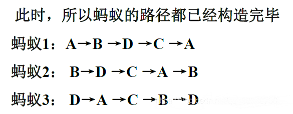

<!-- page: 179 -->

蚁群优化方法——求解TSP问题

 步骤3：信息素更新。

     计算每只蚂蚁构建的路径长度：C1=3+4+2+1=10，
C2=4+2+1+3=10，C3=2+1+5+4=12。更新每条边上的
信息素：

3

=
=
−
×
+
∆
=
×
+
+
=
∑

1
(1
)
0.5 0.3
(1/10 1/10) 0.35
k
AB
AB
AB
k
τ
ρ
τ
τ

3

=
=
−
×
+
∆
=
×
+
=
∑

1
(1
)
0.5 0.3
(1/12) 0.16
k
AC
AC
AC
k
τ
ρ
τ
τ

……
如此，根据公式(5.2)依次计算出问题空间内所有边更
新后的信息素量。

步骤4：
如果满足结束条件，则输出全局最优结果并结束
程序，否则，转向步骤2.1继续执行。

179

<!-- page: 180 -->

蚁群优化方法——求解TSP问题

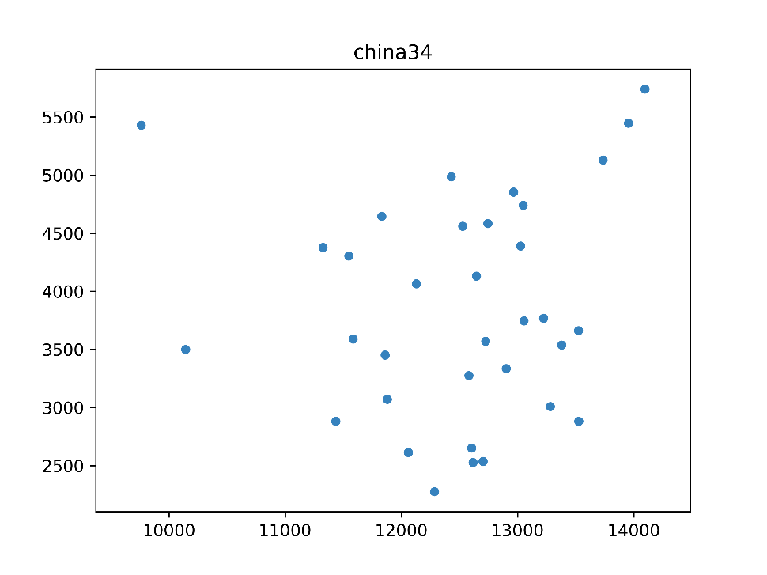

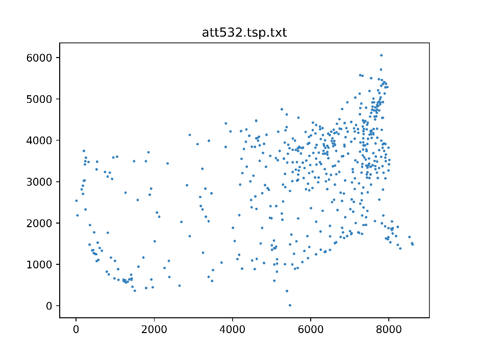

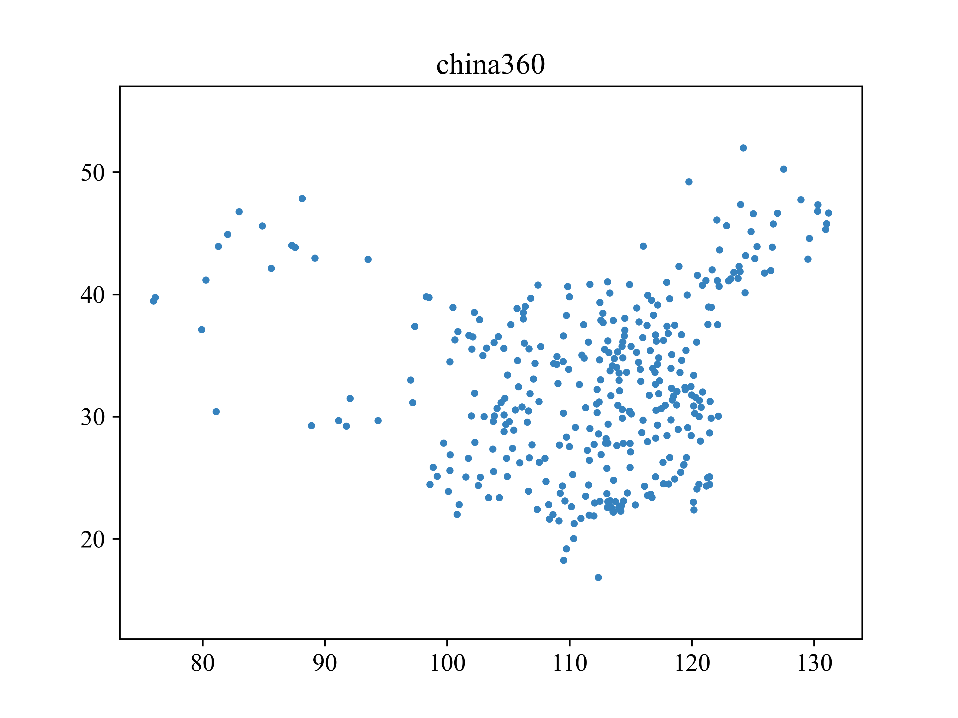

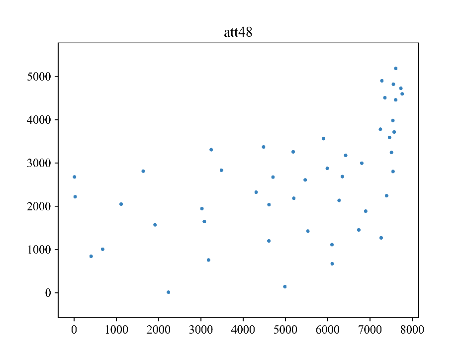

<!-- page: 181 -->

蚁群优化方法——求解TSP问题

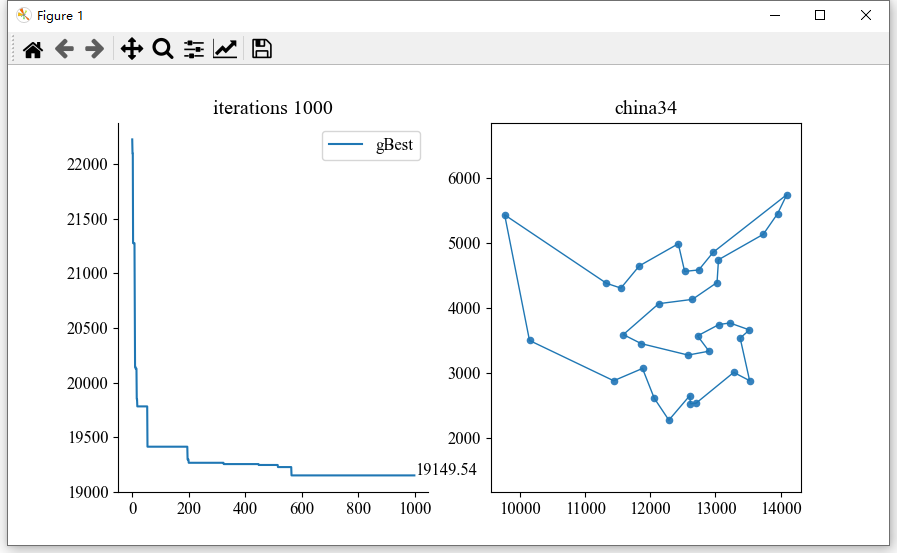

<!-- page: 182 -->

蚁群优化方法——求解TSP问题

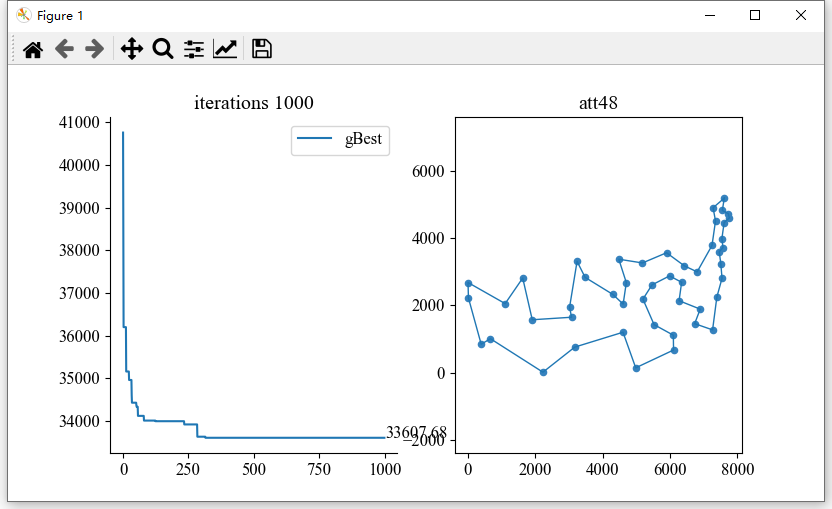

<!-- page: 183 -->

蚁群优化方法——求解TSP问题

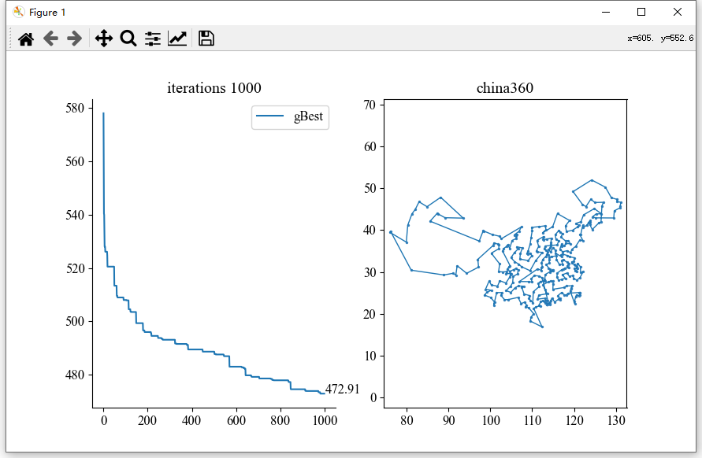

<!-- page: 184 -->

蚁群优化方法——求解TSP问题

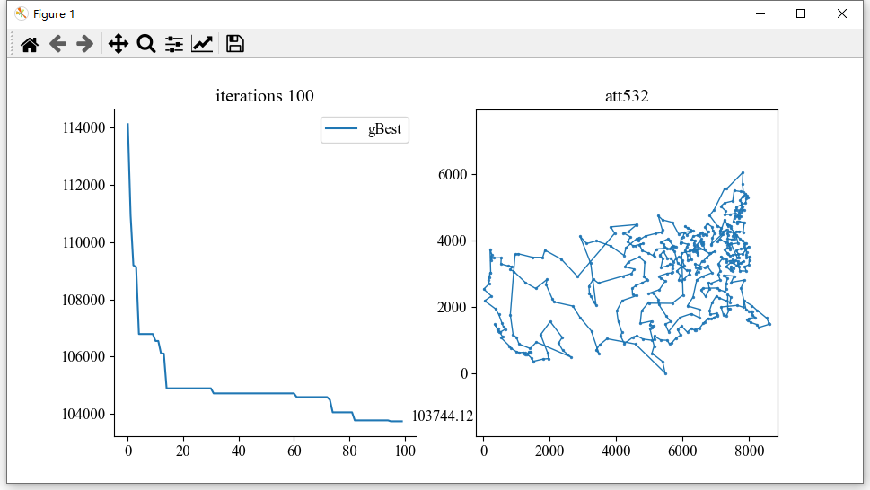

<!-- page: 185 -->

蚁群优化方法——求解TSP问题

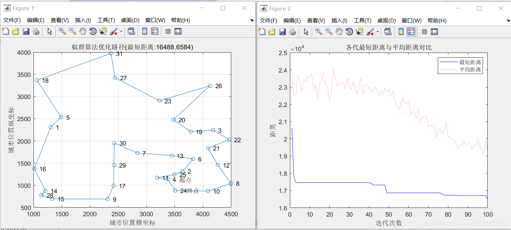

<!-- page: 186 -->

蚁群优化方法——改进算法

算法名称
时间
第一作者
备注

蚂蚁系统 (AS)
1991/1996
Dorigo
第一个蚁群算法

精华AS (EAS)
1991
Dorigo

Ant-Q
1995
Gambardella

最大最小AS (MMAS)
1996
Stutzle

基于排列的AS (ASrank)
1997
Bullnheimer

蚁群系统 (ACS)
1997
Dorigo

ANTS
1999
Maniezzo

连续蚁群 (CACO)
2000
Mathur
优化连续空间问题

最优最差AS (BWAS)
2000
Cordon

超立方体AS (HC-ACO)
2001
Blum

正交连续蚁群 (COAC)
2008
Hu
优化连续空间问题

伪并行蚁群 (PACO)
2008
Lin

<!-- page: 187 -->

蚁群优化方法——最大最小蚂蚁系统

最大最小蚂蚁系统（MAX-MIN Ant System，MMAS）在基本AS

算法的基础上进行了四项改进：

（1）只允许迭代最优蚂蚁（在本次迭代构建出最短路径的蚂蚁），

或者至今最优蚂蚁释放信息素。（迭代最优更新规则和至今最优更

新规则在MMAS中会被交替使用。）

如果只使用至今最优更新规则进行信息素的更新，搜索的导向性很

强，算法会很快收敛到Tb附近；反之，如果只使用迭代最优更新规

则，则算法的探索能力会得到增强，但收敛速度会下降。实验结果

表明，对于小规模的TSP问题，仅仅使用迭代最优信息素更新方式

即可。随着问题规模的增大，至今最优信息素规则的使用变得越来

越重要。

<!-- page: 188 -->

蚁群优化方法——最大最小蚂蚁系统

最大最小蚂蚁系统（MAX-MIN Ant System，MMAS）在基本AS

算法的基础上进行了四项改进：

（2）信息素量大小的取值范围被限制在一个区间[τmin,τmax]内。

当信息素浓度也被限制在一个范围内以后，位于城市i的蚂蚁k选择

城市j作为下一城市的概率也将被限制在一个区间内。算法有效避

免了陷入停滞状态（所有蚂蚁不断重复搜索同一条路径）的可能

性。

（3）信息素初始值为信息素取值区间的上限，并伴随一个较小的

信息素蒸发速率。

增强算法在初始阶段的探索能力，有助于蚂蚁“视野开阔地”进行

全局范围内的搜索。

随后蚂蚁逐渐缩小搜索范围。

<!-- page: 189 -->

蚁群优化方法——最大最小蚂蚁系统

最大最小蚂蚁系统（MAX-MIN Ant System，MMAS）在基本

AS算法的基础上进行了四项改进：

（4）每当系统进入停滞状态，问题空间内所有边上的信息素量

都会被重新初始化。（我们通常通过对各条边上信息素量大小的

统计或是观察算法在指定次数的迭代内至今最优路径有无被更新

来判断算法是否停滞。）

有效地利用系统进入停滞状态后的迭代周期继续进行搜索，使

算法具有更强的全局寻优能力。

<!-- page: 190 -->

蚁群优化方法——蚁群系统

开始

❖
1997年，蚁群算法的创始人Dorigo在

初始化每条边上的信息素量τ0

“ Ant colony system: a cooperative

是
满足结束条件？

learning
approach
to
the
traveling

否

对每只蚂蚁，随机选择一个

出发城市

salesman problem”一文中提出了一种

i=1

具有全新机制的ACO算法——蚁群系

否

i<n (城市数)?

统（Ant Colony System，ACS），进

是

一步提高了ACO算法的性能。

状态转移规则

❖
ACS是蚁群算法发展史上的一个里程

信息素局部更新规则

i=i+1

碑式的作品

信息素全局更新规则

结束

<!-- page: 191 -->

蚁群优化方法——蚁群系统

开始

ACS与AS之间存在三方面的主要差异：

初始化每条边上的信息素量τ0

1. 使用一种伪随机比例规则选择下一个城

是
满足结束条件？

市节点， 建立开发当前路径与探索新路

否

对每只蚂蚁，随机选择一个

径之间的平衡。

出发城市

i=1

2. 信息素全局更新规则只在属于至今最优

否

i<n (城市数)?

路径的边上蒸发和释放信息素。

是

状态转移规则

3. 新增信息素局部更新规则，蚂蚁每次经

信息素局部更新规则

过空间内的某条边，他都会去除该边上

i=i+1

的一定量的信息素，以增加后续蚂蚁探

索其余路径的可能性。

信息素全局更新规则

结束

<!-- page: 192 -->

蚁群优化方法——蚁群系统

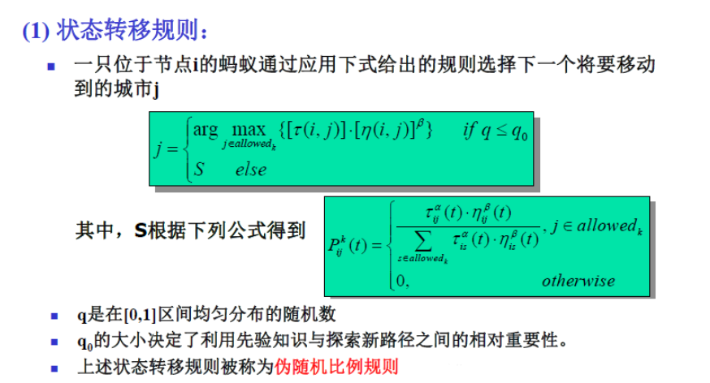

<!-- page: 193 -->

蚁群优化方法——蚁群系统

[
] [
]
{
}
( )
0
arg max
( , ) ,
( , )
,  if
,                                                       otherwise

β
τ
η
∈

≤
= 

k
j J
i
i j
i j
q
q
j

S




当产生的随机数q≤q0时，蚂蚁直接选择使启发式信息与信

息素量的指数乘积最大的下城市节点，我们通常称之为开

发（exploitation）；


当产生的随机数q>q0时ACS将和各种AS算法一样使用轮盘

赌选择策略，我们称之为偏向探索（bias exploration）。


通过调整q0，我们能有效调节“开发”与“探索”之间的

平衡，以决定算法是集中开发最优路径附近的区域，还是

探索其它的区域。

<!-- page: 194 -->

蚁群优化方法——蚁群系统


不论是信息素的蒸发还是释放，都只在属于至今最优路径的边上进行，这里与

AS有很大的区别。


AS算法将信息素的更新应用到了系统的所有边上，信息素更新的计算复杂度为O

（n2）


ACS算法的信息素更新计算复杂度降低为O（n）


更新后的信息素浓度被控制在旧信息素量与新释放的信息素量之间，用一种隐含

的又更简单的方式实现了MMAS算法中对信息素量取值范围的限制。

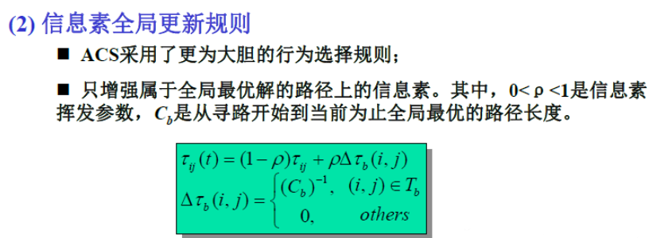

<!-- page: 195 -->

蚁群优化方法——蚁群系统

信息素局部更新规则作用于某条边上会使得这条边被其他蚂蚁选

中的概率减少。这种机制大大增加了算法的探索能力，后续蚂蚁

倾向于探索未被使用过的边，有效地避免了算法进入停滞状态。

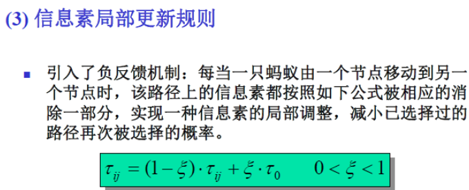

<!-- page: 196 -->

蚁群优化方法——蚁群系统

并行构建
顺序构建

起点城市

路径

顺序构建是指当一只蚂蚁完成一轮完整的构建并返回到初始城市之

后，下一只蚂蚁才开始构建；

并行构建是指所有蚂蚁同时开始构建，每次所有蚂蚁各走一步（从

当前城市移动到下一个城市）。对于ACS，要注意到两种路径构建

方式会造成算法行为的区别。

在ACS中通常我们选择让所有蚂蚁并行地工作。

<!-- page: 197 -->

蚁群优化方法——蚁群系统

参数
参考设置

蚂蚁数目m
在用AS、EAS、ASrank和MMAS求解TSP问题时，
m取值等于城市数目n算法有较好性能；而对于
ACS，m=10比较合适。

信息素权重α与启发式信
息权重β

在各类ACO算法中设置α=1，β=2~5比较合适。

信息素挥发因子ρ
对于AS和EAS，ρ=0.5；对于ASrank，ρ=0.1；对于
MMAS，ρ=0.02；对于ACS，ρ=0.1，算法的综合
性能较高。

初始信息素量τ0
对于AS，τ0=m/Cnn；对于EAS，τ0=(e+m)/rCnn；
对于ASrank，τ0=0.5r(r-1)/rCnn；对于MMAS，
τ0=1/rCnn；对于ACS，τ0=1/nCnn。

释放信息素的蚂蚁个数w
在ASrank中，参数w设置为w=6。

进化停滞判定代数rs
在MMAS中，参数rs设置为rs=25。

信息素局部挥发因子ξ
在ACS中，参数ξ设置为ξ=0.1。

伪随机因子q0
在ACS中，参数q0设置为q0=0.1。

<!-- page: 198 -->

参考文献

[1] M. Dorigo, V. Maniezzo, and A. Colorni, "Ant System: Optimization by a Colony of Cooperating Agents," IEEE Transactions on Systems, Man, and Cybernetics, Part B (Cybernetics),

vol. 26, no. 1, pp. 29-41, 1996.

[2] C. Blum, M. J. Blesa, A. Roli, and M. Sampels, "An Ant Colony Optimization Algorithm for Shop Scheduling Problems," Journal of Mathematical Modelling and Algorithms, vol. 3, n-

o. 3, pp. 285-308, 2004.

[3] M. Dorigo, M. Birattari, and T. Stützle, "Ant Colony Optimization: Artificial Ants as a Computational Intelligence Technique," IEEE Computational Intelligence Magazine, vol. 1, no.

4, pp. 28-39, 2006.

[4] F. S. Gharehchopogh and S. Khalifelu, "Using Artificial Ant Colony Optimization Algorithm for Web Usage Mining in Data Mining Applications," IEEE Transactions on Internet Techn-

-ology and Secured Transactions, vol. 3, no. 1, pp. 432-437, 2012.

[5] W. Y. Szeto, Y. Jiang, and S. C. H. Leung, "A Hybrid Artificial Bee Colony Algorithm for Road Network Toll Design Problem with Link Capacity Constraints," IEEE Transactions on

Intelligent Transportation Systems, vol. 16, no. 5, pp. 2266-2279, 2015.

[6] T. Kumar, S. Narayan, and S. Singh, "An Efficient Ant Colony Optimization Algorithm for Grid Scheduling Problems," IEEE Transactions on Systems, Man, and Cybernetics: Systems,

vol.49, no. 5, pp. 1025-1038, 2019.

[7] A. A. Farahani, N. Labadie, and R. Afsar, "Ant Colony Optimization for Multiple Traveling Salesmen Problem with Time Windows," IEEE Transactions on Intelligent Transportation

Systems, vol. 21, no. 8, pp. 3345-3354, 2020.

[8] Wei-Neng Chen and Jun Zhang, "Ant Colony Optimization for Software Project Scheduling and Staffing with an Event-Based Scheduler," in IEEE Transactions on Software Engineering,

vol. 39, no. 1, pp. 1-17, 2013.

[9] Qiang Yang, Wei-Neng Chen, Zhengtao Yu, Tianlong Gu, Yun Li, Huaxiang Zhang, and Jun Zhang. "Adaptive Multimodal Continuous Ant Colony Optimization", IEEE Transactions

on Evolutionary Computation, vol. 21, no. 2, pp. 191-205, 2017.

[10] Xiao-Cheng Liao, Wei-Neng Chen, Xiao-Qi Guo, Jing-Hui Zhong and Xiao-Min Hu, "Crowd Management Through Optimal Layout of Fences: An Ant Colony Approach Based on

Crowd Simulation," in IEEE Transactions on Intelligent Transportation Systems, vol. 24, no. 9, pp. 9137-9149, 2023.

198

<!-- page: 199 -->

一、背景与意义

Outline
二、进化算法

三、粒子群优化

四、蚁群优化

五、进化计算的前沿研究进展

<!-- page: 200 -->

1、大规模高维优化

大数据环境下优化问题的维度急剧增长

社区发现
特征选择

滴滴车辆派遣优化

神经网络参数优化
路网优化

云工作流调度优化

200

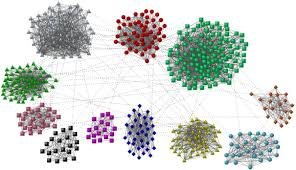

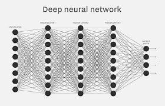

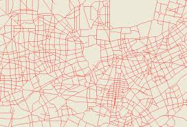

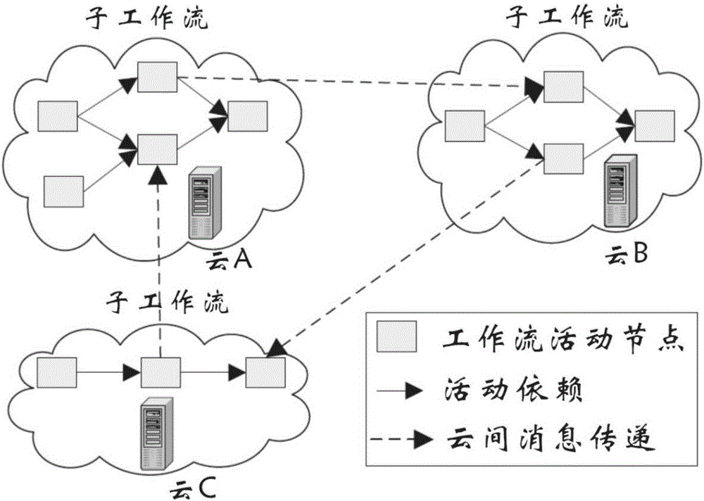

<!-- page: 201 -->

1、大规模高维优化

大规模环境下优化问题的挑战

基于大数据的离散制造知识提取
挑
战

局部最优区域宽且多
解空间指数式增长
时间复杂度急剧升高

问
题

多样性不足
全局探索能力较低
容易陷入局部最优

搜索效率较低
无法在有限资源下
获得高质量的最优解

执行效率较低
无法在可接受时间范围内

获得高精度的最优解

✗

传统串行集中式的群体智能算法无法有效求解大规模优化问题

如何提升群体智能算法求解大规模优化问题的效率？

201

<!-- page: 202 -->

2、多峰值优化

优化问题存在多个最优解

挑战

一次性找到全部最优解
最优解往往分散于不同区域，如何避免落入同一区域
逃离局部最优区域，定位全局最优

202

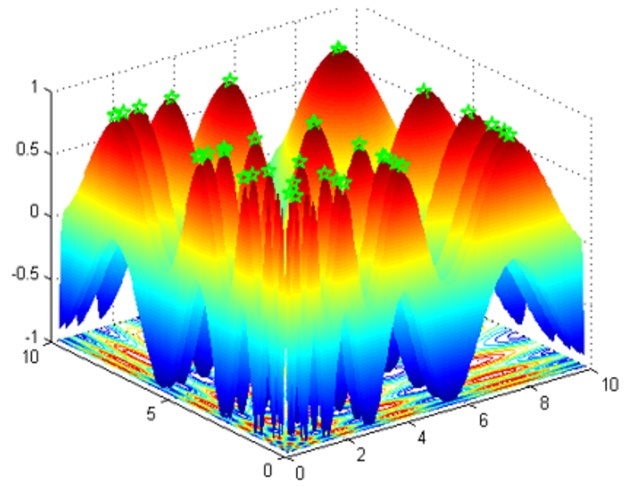

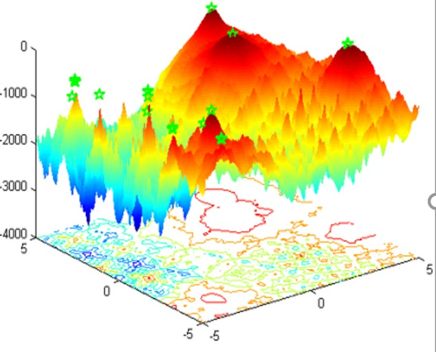

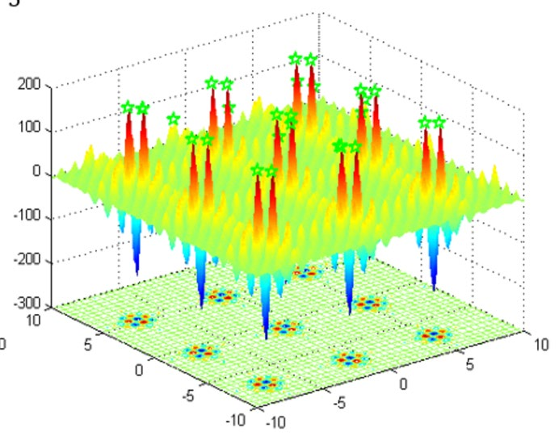

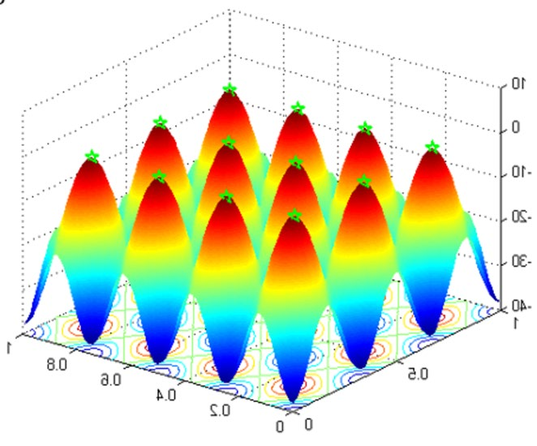

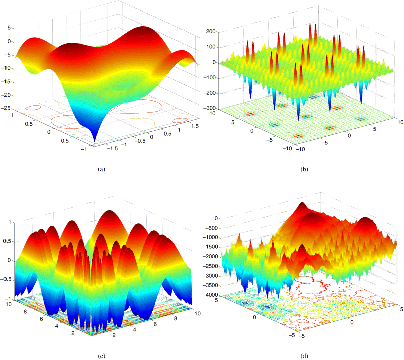

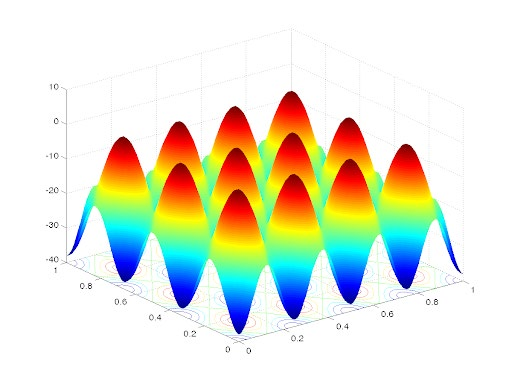

<!-- page: 203 -->

3、动态优化

优化问题随着时间不断变化

问题的最优解位置变化

问题的解空间（形状）发生变化

挑战

检测优化问题的变化；
快速响应变化，找到新的最优解

203

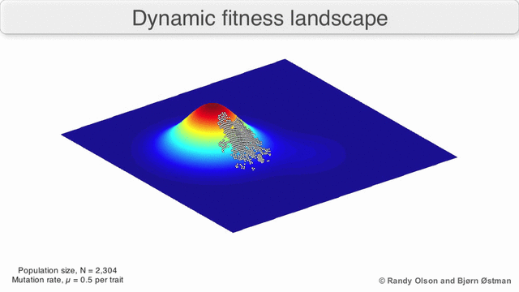

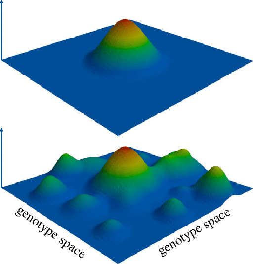

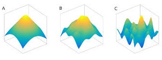

<!-- page: 204 -->

4、多目标优化

同时优化多个目标函数

目标函数之间往往存在冲突

存在无穷多个非支配解

挑战

寻找最优帕累托前沿上的解；
所获得的解尽可能分散；

204

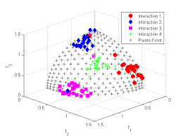

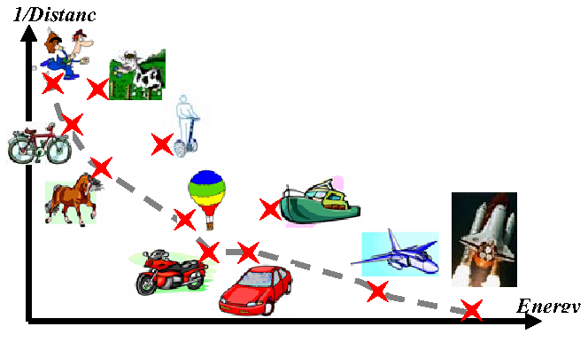

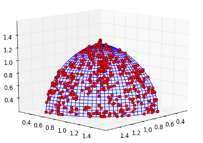

<!-- page: 205 -->

5、昂贵优化及数据驱动优化

无法建立精确的数学模型

依赖数据评估个体好坏，驱动算法进化

可把优化问题视为一种黑箱优化问题

205

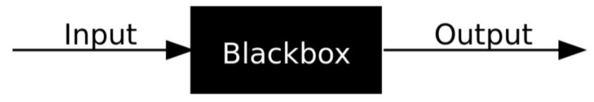

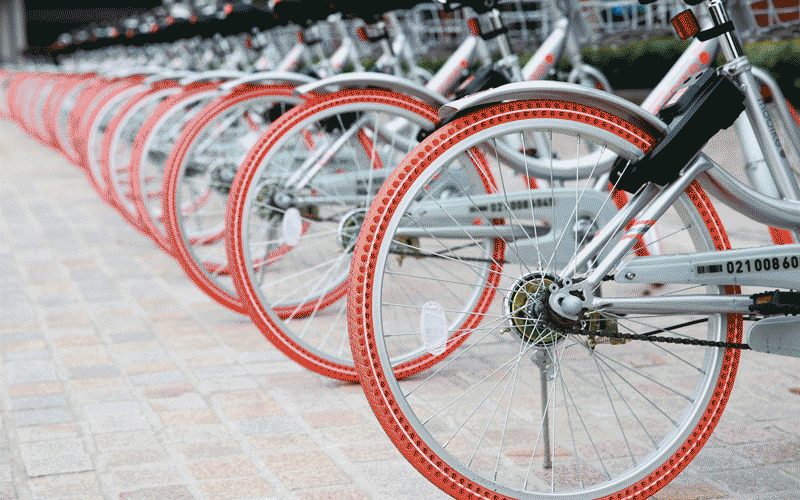

<!-- page: 206 -->

5、昂贵优化及数据驱动优化

依据优化函数评估个体适应值需要较长时间（1min, 1hour, 1 day, etc）

致使计算智能方法无法在可接受时间范围内找到最优解

药物分子结构优化
核弹爆炸优化
汽车/飞机模型优化

挑战

在给定时间范围内找到优化问题的最优解；
建立尽可能准确的简单模型拟合原优化问题；

206

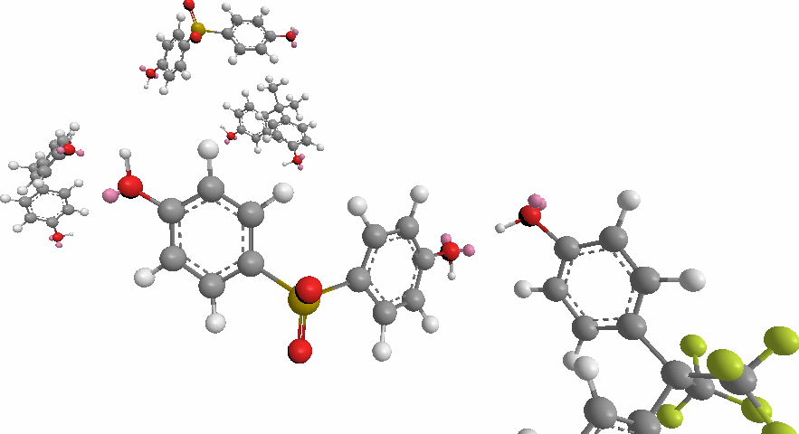

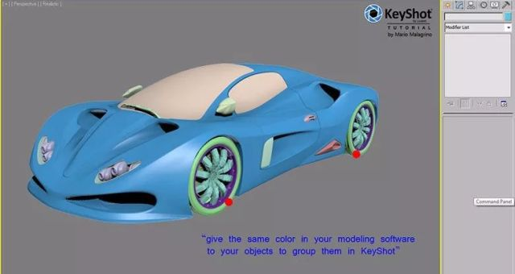

<!-- page: 207 -->

6、约束优化

优化问题带有各种约束条件（不等式或者等式约束条件）

挑战

解空间被约束条件分割为可行区

域和非可行区域（解空间不连
续）；
在可行区域内找最优解；
如何有效处理约束条件

207

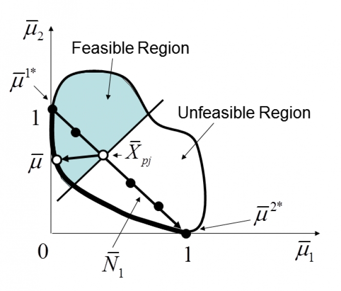

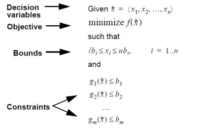

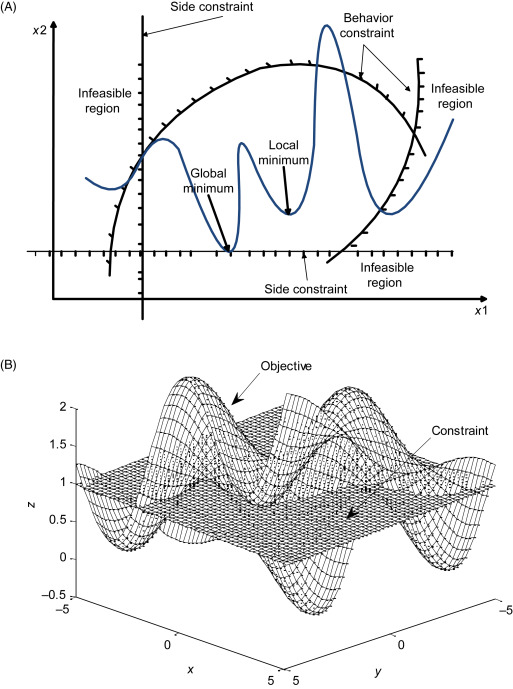

<!-- page: 208 -->

7、分布式优化

个体
（个体目标，数据，
通信机制，行动策略）

Optimize fi(xi, Di)

全局优化目标Optimize f(x, D)

个体缺乏全局信息

挑战

个体间通讯受限
如何引导面向全局目标进化？

208

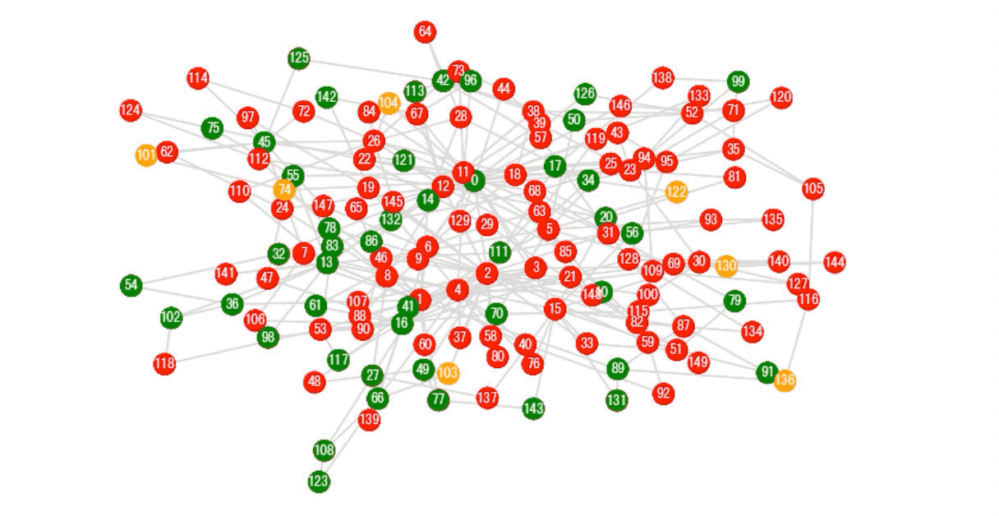

<!-- page: 209 -->

8、多智能体协作动态优化

短路优先规则：高拥挤，低吞吐量
空路优先规则：高拥挤，低吞吐量

10000+节点
100000+OD对
强泛化能力

209

群智演化的路由规则：低拥挤，高吞吐量

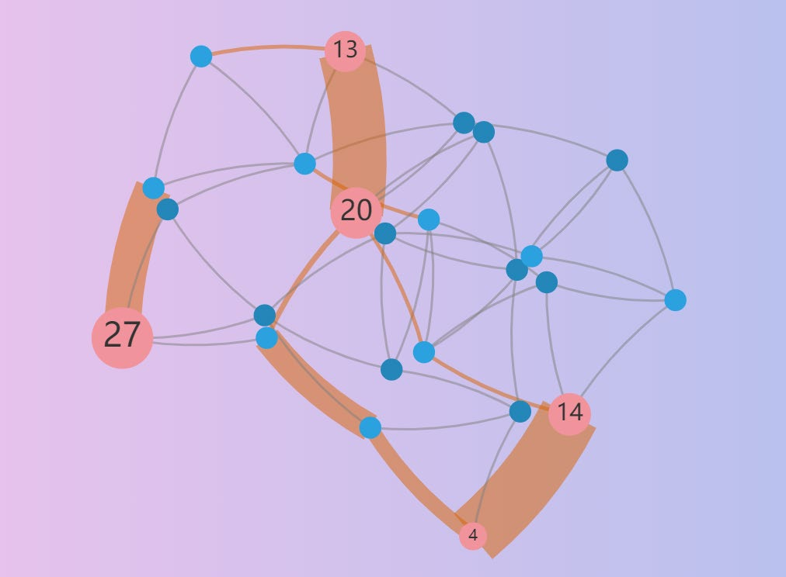

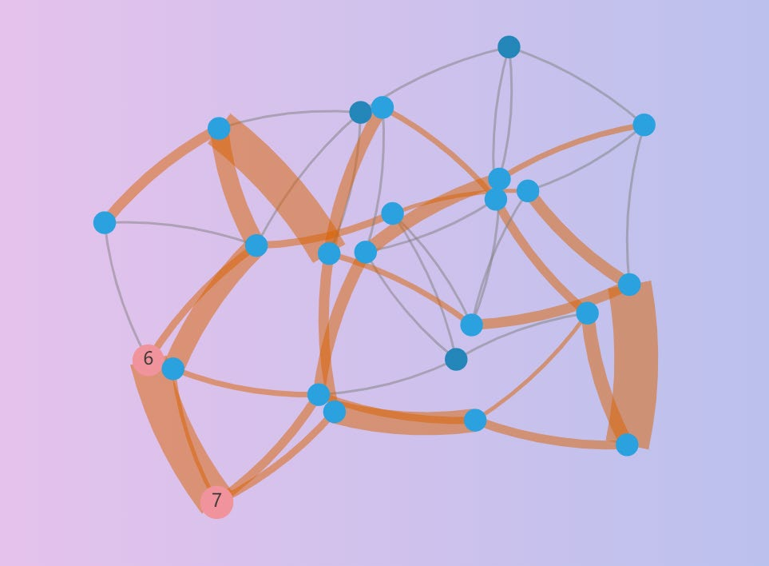

<!-- page: 210 -->

部分参考文献

大规模优化

[1] Q Yang, WN Chen, J Da Deng, Y Li, T Gu, J Zhang, “A Level-Based Learning Swarm Optimizer for Large-Scale Optimization”, IEEE Transactions on Evolutionary Computation

22 (4), 578-594, 2018

[2] MN Omidvar, M Yang, Y Mei, X Li, “ DG2: A faster and more accurate differential grouping for large-scale black-box optimization”, IEEE Transactions on Evolutionary

Computation, 2017

[3] YH Jia, WN Chen, T Gu, H Zhang, HQ Yuan, S Kwong, J Zhang, “Distributed cooperative co-evolution with adaptive computing resource allocation for large scale optimization”,

IEEE Transactions on Evolutionary Computation 23 (2), 188-202, 2018

多峰值优化

[1] Q Yang, WN Chen, Z Yu, T Gu, Y Li, H Zhang, J Zhang , “Adaptive Multimodal Continuous Ant Colony Optimization”, IEEE Transactions on Evolutionary Computation 21 (2),

191-205, 2017

动态优化

[1] D Yazdani, MN Omidvar, R Cheng, “Benchmarking Continuous Dynamic Optimization: Survey and Generalized Test Suite”, IEEE Transactions on Cybernetics, 2020

[2] D Yazdani, R Cheng, D Yazdani, et al., “A Survey of Evolutionary Continuous Dynamic Optimization Over Two Decades”, IEEE Transactions on Evolutionary Computation, 2021

多目标优化

[1] K Deb, A Pratap, S Agarwal et a;., “A fast and elitist multiobjective genetic algorithm: NSGA-II”, IEEE Transactions on Evolutionary Computation, 2002

[2] Q Zhang, H Li, “MOEA/D: A multiobjective evolutionary algorithm based on decomposition”, IEEE Transactions on Evolutionary Computation, 2007

[3] ZH Zhan, J Li, J Cao, J Zhang, et al., “Multiple populations for multiple objectives: A coevolutionary technique for solving multiobjective optimization problems”, IEEE

Transactions on Cybernetics, 2013

210

[4] R Cheng, Y Jin, M Olhofer, “Test problems for large-scale multiobjective and many-objective optimization”, IEEE transactions on cybernetics, 2016

<!-- page: 211 -->

部分参考文献

昂贵优化

[1] SH Wu, ZH Zhan, J Zhang, “SAFE: Scale-adaptive fitness evaluation method for expensive optimization problems”, IEEE Transactions on Evolutionary Computation, 2021

[2] FF Wei, WN Chen, Q Yang, J Deng, XN Luo, H Jin, J Zhang, “A classifier-assisted level-based learning swarm optimizer for expensive optimization”, IEEE Transactions on

Evolutionary Computation, 2020

[3] FF Wei, WN Chen, Q Li, SW Jeon, J Zhang, ” Distributed and expensive evolutionary constrained optimization with on-demand evaluation”, IEEE Transactions on Evolutionary

Computation, 2022

约束优化

[1] S Zeng, R Jiao, C Li, X Li, et al., “A general framework of dynamic constrained multiobjective evolutionary algorithms for constrained optimization”, IEEE transactions on

cybernetics, 2017

分布式优化

[1] YJ Gong, WN Chen, ZH Zhan, J Zhang, Y Li, Q Zhang, JJ Li, “Distributed evolutionary algorithms and their models: A survey of the state-of-the-art”, Applied Soft Computing 34,

286-300, 2015

[2] TY Chen, WN Chen, XQ Guo, YJ Gong, J Zhang, “A Multiagent Co-Evolutionary Algorithm With Penalty-Based Objective for Network-Based Distributed Optimization”, IEEE

Transactions on Systems, Man, and Cybernetics: Systems, 2024

[3] TY Chen, WN Chen, FF Wei, XM Hu, J Zhang, “Multi-Agent Swarm Optimization With Adaptive Internal and External Learning for Complex Consensus-Based Distributed

Optimization”, IEEE Transactions on Evolutionary Computation, 2024

[4] FF Wei, WN Chen, XQ Guo, B Zhao, SW Jeon, J Zhang, “CrowdEC: Crowdsourcing-based Evolutionary Computation for Distributed Optimization”, IEEE Transactions on

Services Computing, 2024

211

<!-- page: 212 -->

本 章 作 业

1、从本章提及的进化算法或群体智能优化算

Outline

法中，选择1种算法，编程实现，并分析测试
实验结果，并完成实验报告。

对于连续函数优化，应选择相应的benchmark

函数进行测试
对于离散组合优化，建议从TSPLIB中选择一个

实例（例如Kroa100）进行测试

2、从本章提及的研究进展方向中，选取1个

方向，对该方向进行文献阅读，形成文献阅
读报告。

