# 3 多智能体系统

<!-- page: 1 -->

群 体 智 能  Crowd Intelligence

第三章 多智能体系统

华南理工大学 计算机科学与工程学院

陈伟能

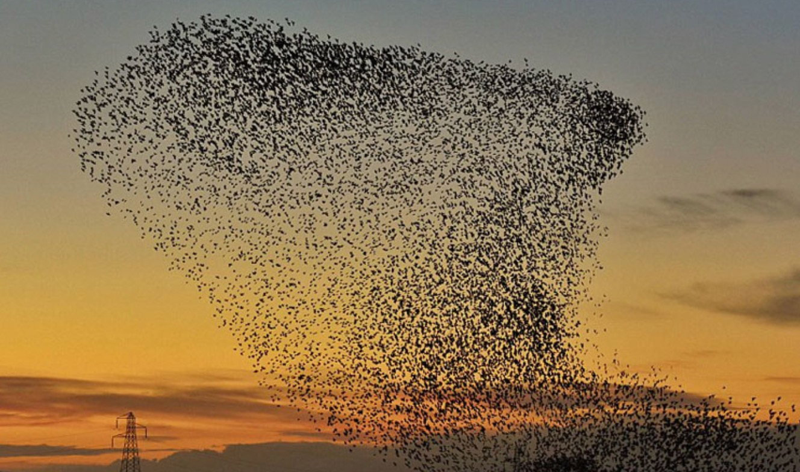

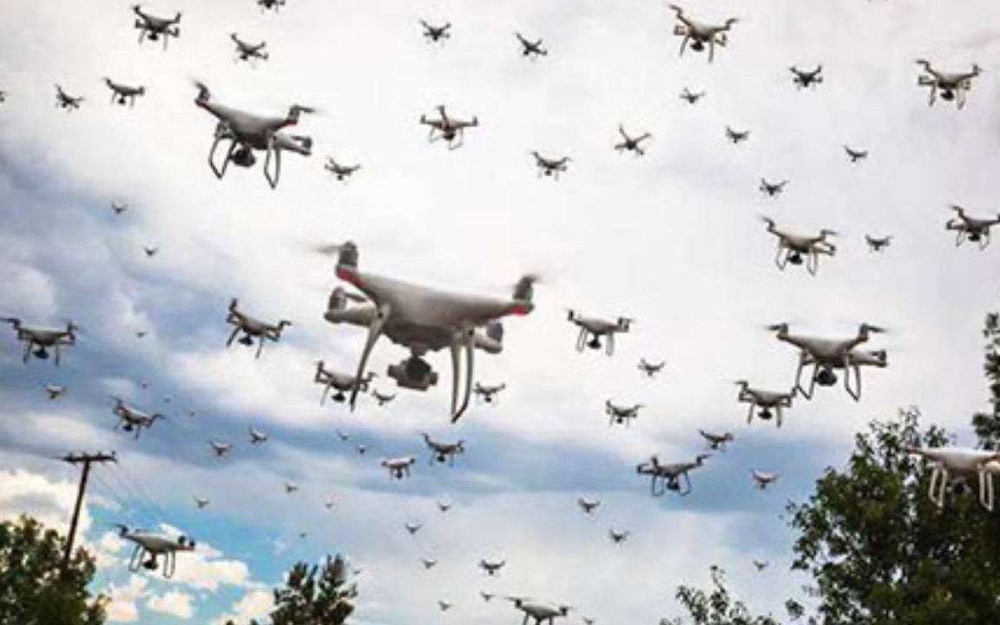

<!-- page: 2 -->

Outline
一、智能体与多智能体系统

二、多智能体的协同与控制

三、强化学习与多智能体强化学习

<!-- page: 3 -->

多智能体系统——概念与起源

随着计算机网络和人工智能技术的发展，常常需要协同多个“智能体”来
求解复杂问题，因而出现了“多智能体系统”（Multi-Agent Systems，MAS）

3

<!-- page: 4 -->

多智能体系统——智能体的概念

Agent可以看做是一个程序或者一个实体，它嵌入在环境中，通过传感器
(sensors)感知环境，通过效应器(effectors)自治地作用于环境并满足设计要求。

Agent与环境的交互：感知环境，通过执行动作作用于环境。

传感器

感知

作用

执行器

4
环境
智能体

<!-- page: 5 -->

多智能体系统——智能体的特点

Agent具有独立的局部于自身的知识和知识处理方法，能够根
据其内部状态和感知到的环境信息自主决定和控制自身的状态
和行为。

自主性

Agent能够感知、影响环境。Agent的行为是为了实现自身内在的目标，
在某些情况下，Agent能够采取主动的行为，改变周围的环境，以实
现自身的目标。

反应性

很多Agent同时存在，形成多智能体系统，模拟社会性的群体。Agent
具有和外部环境中其它Agent相互协作的能力，在遇到冲突时能够通
过协商来解决问题。

社会性

进化性
Agent应该能够在交互过程中逐步适应环境，自主学习，自主进化。

5

<!-- page: 6 -->

多智能体系统——智能体的结构

Ø Agent结构接收传感器的输入，然后运行

传感器

Agent程序，并把执行的结果传送到效应

器进行动作。

Ø Agent系统的结构直接影响到系统的性能。

Ø Agent、体系结构和程序之间的关系：

执行器

智能体

            Agent = 体系结构 + 程序

6

<!-- page: 7 -->

多智能体系统——智能体的结构

Ø 反应式agent

 具备对当时处境的实时反应能力的Agent

7

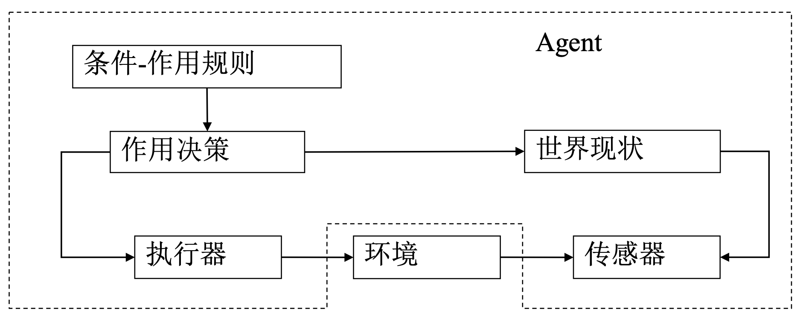

<!-- page: 8 -->

多智能体系统——智能体的结构

Ø 慎思式agent

基于知识的系统，包括环境描述和丰富的智能行为的
逻辑推理能力。

8

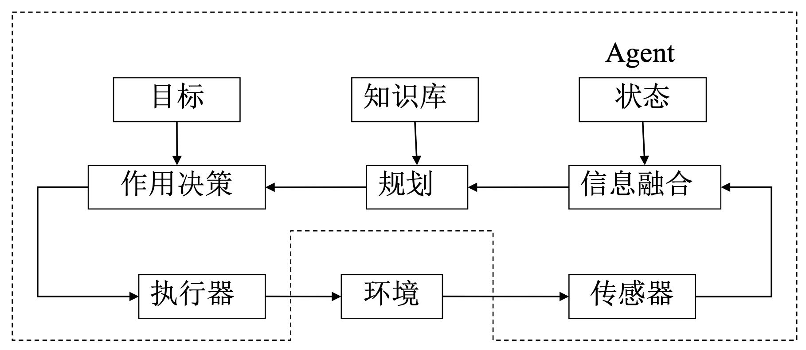

<!-- page: 9 -->

多智能体系统——智能体的结构

Ø 复合式agent

组合多种相对独立和并行执行的智能形态，其结构包
括感知、动作、反应、建模、规划、通信和决策等模块。

9

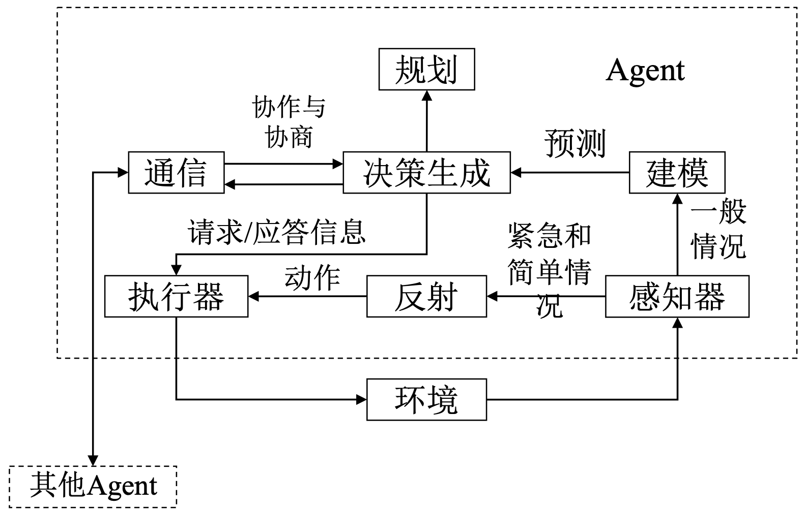

<!-- page: 10 -->

多智能体系统——智能体系统的特点

自主性
多智能体系统中，每个智能体相对来说是独立、自主的。

由于智能体的自主性，多智能体系统可支持分布式的计算与应用，具
有很好的模块性、可扩展性和鲁棒性。

分布式

协调性
多智能体系统是一个协调式的系统，智能体之间相互通讯、相互协调，
并行分布式地求解问题，从而可以高效可扩展地解决复杂难题。

异构性
各个智能体可以是异构的，从而可以协调具有不同特性的智能体来合
作解决复杂问题。

10

<!-- page: 11 -->

多智能体系统——智能体系统的协作模型

BDI模型
BDI架构是一种对智能体的组成表示方法，将智
能体划分为信念、意愿、意图三个部分。

信念

Agent

意愿
Desire

意图
Intention

信念
Belief

完成

智能体的能力、
知识，以及对环
境及自身的认知

智能体的
的行动顺序及

计划
目标

智能体的
特定目标

采用的计划

选择

11

<!-- page: 12 -->

多智能体系统——智能体系统的协作模型

事先制定协调各个智能体的规划，并用该规
划来协调和控制智能体。

协作规划模型

规 划

12

<!-- page: 13 -->

多智能体系统——智能体系统的协作模型

智能体通过相互协商来完成协作，从而可解
决任务分配、资源冲突、知识冲突等问题。

协商模型

协商
协商

协商

协商
协商

协商

协商

协商

协商

协商

协商

协商

13

<!-- page: 14 -->

多智能体系统——智能体系统的协作模型

自协调模型
智能体之间并不协商，而通过随环境的变化
而调整行为，以环境为中介完成协调。

14

<!-- page: 15 -->

多智能体系统——智能体系统的通信结构

网络结构

联盟结构

黑板结构

黑板
共享存储

智能体组织成一个
网络拓扑结构来通信

智能体基于距离等关系组

智能体均通过共享的
黑板来实现数据共享

织成联盟

（静态、移动）

15

<!-- page: 16 -->

Outline
一、智能体与多智能体系统

二、多智能体的协同与控制

三、强化学习与多智能体强化学习

<!-- page: 17 -->

多智能体系统的协调与协作

Ø协调和协作是MAS研究的核心问题之一，是一个系统智能

水平的重要体现。

Ø协调是一组Agent完成集体活动时相互作用的性质。

Ø协作是非对抗的Agent之间保持行为协调的特例。

ØMAS中的协调是指多个Agent为了一致和谐的方式工作而

进行交互的过程，避免Agent之间的死锁或活锁。

l 死锁指多个Agent无法进行各自的下一步动作；

l 活锁指多个Agent不断工作却无任何进展。

17

<!-- page: 18 -->

多智能体系统的协调方法

l 将具备其他Agent的知识、能力和环境知识的Agent可

作为主控Agent，对该MAS的目标进行分解，对任务进
行规划，并指示或建议其他Agent执行相关任务。
l 特别适用于环境和任务相对固定、动态行为集可预计和

基于集中规划

需要集中监控的情况。

主控Agent负责对其他Agents进行规划

18

<!-- page: 19 -->

多智能体系统的协调方法

基于集中规划

优势
简单、高效、便于
协调，全局性强

适用性有效，灵活
性低，无法应对动
态不确定场景，易
受攻击

缺点

目前的无人机群表演往往是集中规划的

19

<!-- page: 20 -->

多智能体系统的协调方法

基于协商
智能体间通过协商来实现任务的分配。协商是Agent
间交换信息、讨论和达成共识的方式。

协商
协商

协商

协商
协商

协商

协商

协商

协商

协商

协商

协商

20

<!-- page: 21 -->

多智能体系统的协调方法

基于协商

优势
通用性强、可扩展
性强、鲁棒性强

协商机制较难设计，
需要精心设计以确
保冲突消除；较难
进行全局协作

缺点

工业场景的多智能体系统

21

<!-- page: 22 -->

多智能体系统的协调方法

•
分成有通信协调和无通信协调两类。
•
无通信协调是在没有通信的情况下，Agent根据对方
及自身效益模型，按照对策论选择适当行为，Agent
至多也只能达到协调的平衡解。（非合作博弈）
•
在有通信协调中则可得到协作解。（合作博弈）

基于博弈

Agent
Agent
博弈
（对策论）

22

<!-- page: 23 -->

多智能体系统的协调方法

基于博弈

通用性强，功能强
大，可实现智能体
自主智能决策

优势

智能体能力要求较高，
在多Agents、异构、
非合作等场景下的对
策论设计比较复杂

缺点

AlphaGO围棋Agent

23

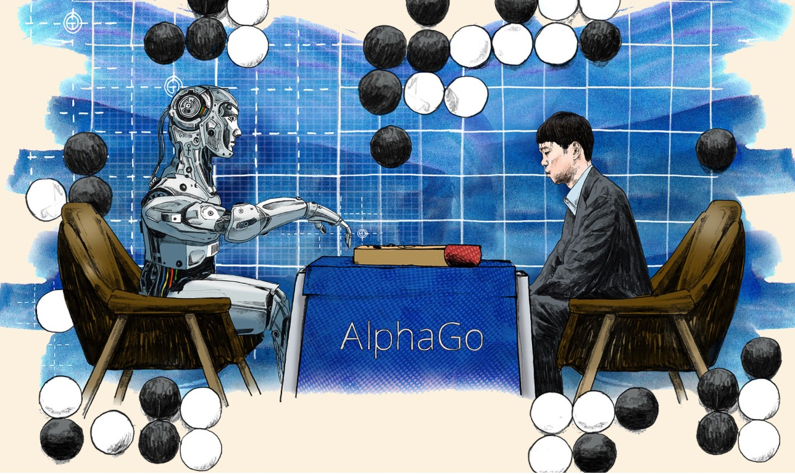

<!-- page: 24 -->

多智能体系统的协调方法

•
以每个Agent必须遵循的社会规则、过滤策略、标准
和惯例为基础的协调方法。
•
这些规则对于Agent的行为加以限制，过滤某些有冲
突的意图和行为，保证其他Agent必须的行为方式。

基于社会规划

社会、环境中事先制定的社会规则

24

<!-- page: 25 -->

多智能体系统的协调方法

基于社会规则

优势
简单、能有效避免
冲突

一般只用于冲突消
除，较难获取社会
层面的全局最优

缺点

交通规则

25

<!-- page: 26 -->

多智能体系统的协作类型

完全协作型
系统中的智能体围绕一个共同的全局目标全力以赴地协
作，各个智能体没有自己的局部目标。

协作型
系统中的智能体具有一个共同的全局目标，同时各个智
能体还有与全局目标一致的局部目标。

自私型
一般不存在全局目标，各智能体都围绕自身的目标来工
作，仅在智能体间存在冲突时进行协调和协作。

完全自私型
不存在全局目标，各智能体都围绕自身的目标来工作，
而且不考虑任何协作行为。

协作与自私共存
系统中既存在共同的全局目标，某些智能体也可能还具
有与全局目标无直接联系的局部目标。

26

<!-- page: 27 -->

举例：目标冲突的分布式共识进化优化

分布式共识优化

多智能体系统中，节点通信协作，优化全局目标并达成共识。

目标1: 最小化全局目标

特征1: 每个节点有
一个局部目标

%

min
! 𝐹𝑥= '

𝑓" (𝑥)

"#$

目标2: 系统达成共识

%

特征2: 节点只与邻
近节点通信

𝑙𝑖𝑚&→(𝑥" = 1

𝑛'

𝑥)

)#$

27

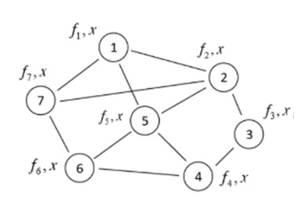

<!-- page: 28 -->

举例：目标冲突的分布式共识进化优化

分布式共识优化的应用

无线传感器网络协同定位
智能电网潮流计算

多智能体系统
传感器组成的通信网络
发电站、配电站等构成网络

节点局部信息
范围有限的探测数据
区域内的电力数据

局部目标
自身估计误差
自身电力成本

全局目标
最小化传感器误差累和
最小化电网电力成本累和

系统共识
保证传感器对目标的定义相同
保证电网输电不冲突

挑
战

1.
优化目标黑箱：涉及仿真评估、超参数评估、双层优化时，梯度不可算
2.
目标函数非凸：现实应用建模复杂，简化模型难以表达

28

<!-- page: 29 -->

经典的多智能体分布式优化算法

Ø经典的分布式优化算法是分布式梯度下降算法，该算法包括⼀致

性算法和(次)梯度下降⽅法两个部分。⼀致性部分确保所有智能
体达到状态⼀致，次梯度部分确保⼀致的状态是全局最优解。

步⻓
⽹络连接权重

次梯度下降
简化形式

⼀致性

Agent i 的次梯度

Agent i 在k+1步的结果
Agent j 在k步的结果

每个智能体随机
生成一个初始解
分别计算梯度
求解次梯度
更新解

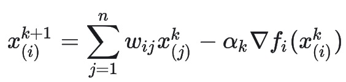

<!-- page: 30 -->

梯度与次梯度

Ø 梯度下降

•
要求光滑（可导），可计算梯度

•
步⻓的选择

——固定步⻓

——可变步⻓
步⻓太⼩，收敛慢
步⻓太⼤，错过最优点

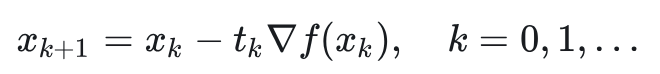

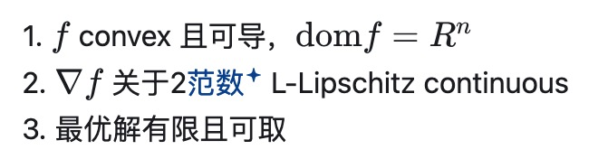

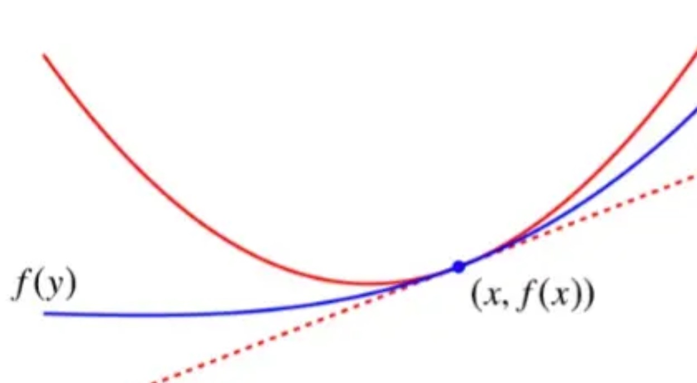

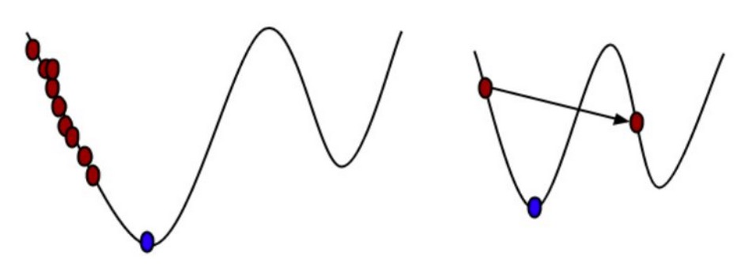

<!-- page: 31 -->

梯度与次梯度

Ø 次梯度下降

如果优化函数本身存在不可导的点，就没有办法计算梯度了，这个时候就需要引
入次梯度(Subgradient)。

次梯度g实际上也是下水平集的一个支撑超平面

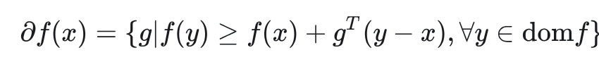

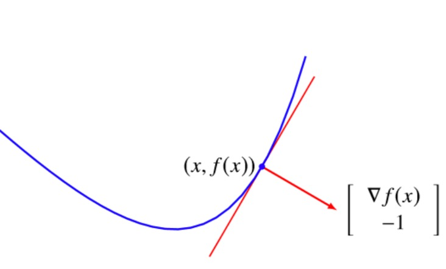

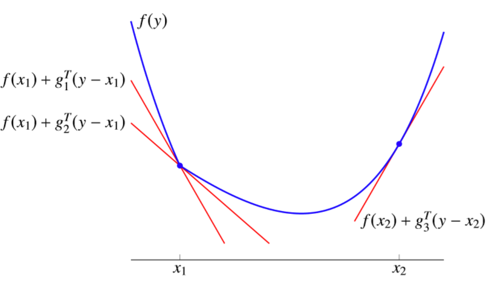

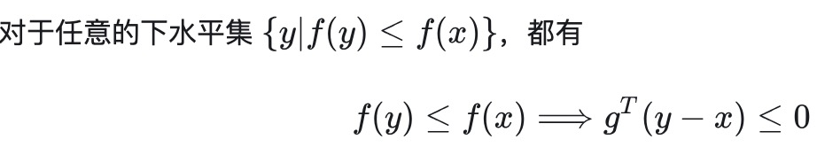

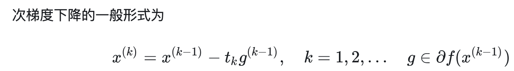

<!-- page: 32 -->

经典的多智能体分布式优化算法

Ø EXTRA算法（Shi et al., 2015, EXTRA: An Exact First-Order Algorithm for

Decentralized Consensus Optimization, SIMA Journal on Optimization,

https://epubs.siam.org/doi/abs/10.1137/14096668X）
Ø 分布式次梯度下降算法固定步⻓⽆法保证最优，可变步⻓则收敛

较慢，EXTRA可以在固定步⻓下精确收敛到最优

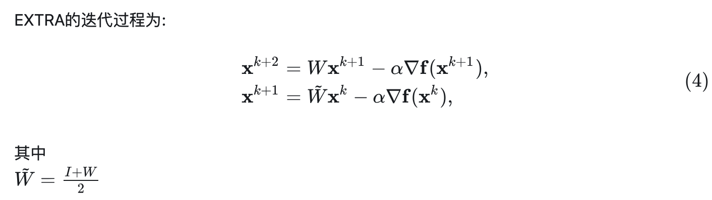

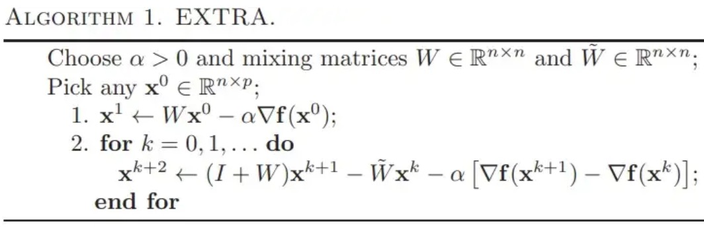

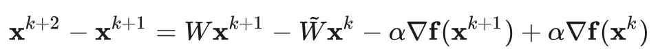

<!-- page: 33 -->

基于内外部学习的多智能体粒子群优化

多智能体系统下新型学习机制
现有理论

外部
学习

提供复杂黑箱优化能力

粒子群优化算法

常用于解决
黑箱非凸问题

将粒子群学习机制
应用于多智能体系统

内部
学习

提供理论支撑与保障

多智能体共识理论

常用于解决
分布式凸优化问题

v! = 𝑟"𝑣! + 𝑟# 𝑥$ −𝑥! + 𝜙𝑟%(𝑥& −𝑥!)
内部学习：

基于共识理论设计

粒子群学习系数

𝜔+,((𝑥( −𝑥+)
外部学习：

v! = 𝜑𝑟'𝑣! + 5

(∈*!

将现有理论优势互补，提出多智能体系统下新型粒子群学习机制

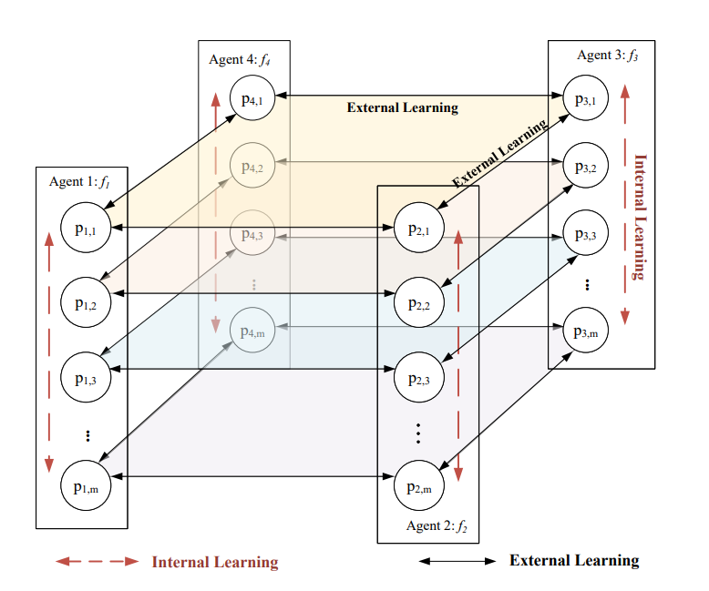

<!-- page: 34 -->

基于内外部学习的多智能体粒子群优化

1 将多智能体粒子群演化建模为动力学系统

2 分析动力学系统的收敛性
    当状态转移矩阵的特征值<1，代表系统收敛

3 分析收敛条件下系统的共识性

分析得出，粒子群速度V将趋近于0，
位置X将趋于共识

34
在两种基本情形下，算法的系统共识得到理论保证

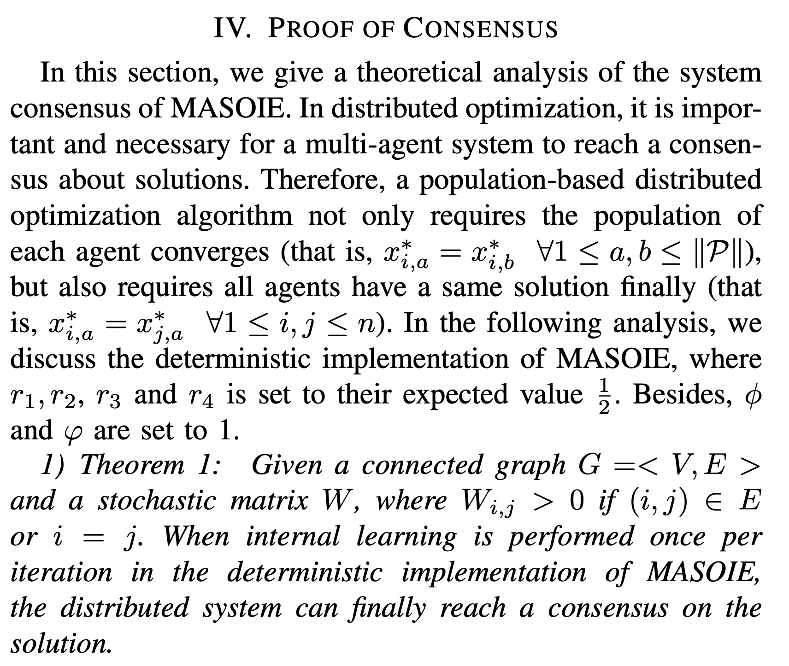

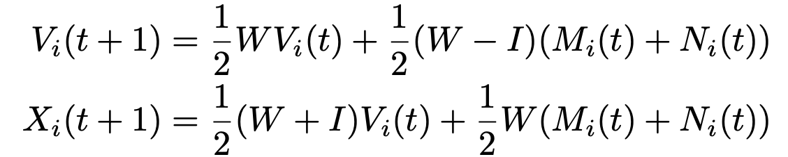

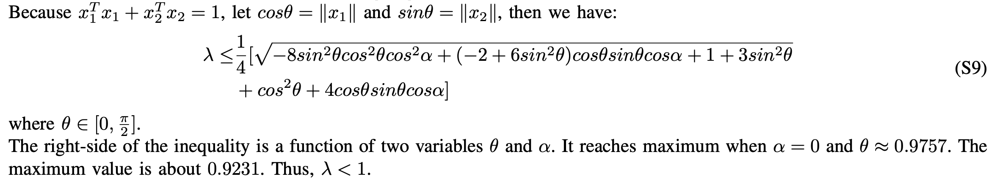

<!-- page: 35 -->

基于内外部学习的多智能体粒子群优化

实验结果

Ø 在80%的基准函数上优于现有分布式优化算法

Ø 在20、40、60节点网络上比现有算法取得了更稳定的共识效果

Ø 在无线传感器协同定位问题验证了算法的应用效果

适
应
值

共
识
性

Tai-You Chen, Wei-Neng Chen（通讯作者), et al., “Multi-Agent Swarm Optimization With Adaptive Internal
and External Learning for Complex Consensus-Based Distributed Optimization”, IEEE Transactions on
Evolutionary Computation, 2024.

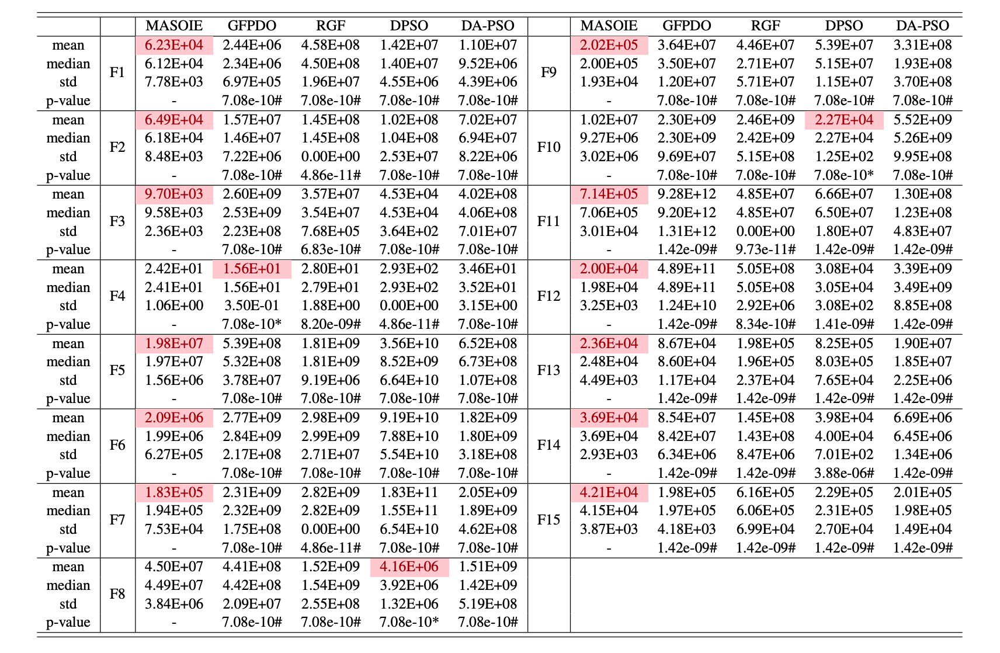

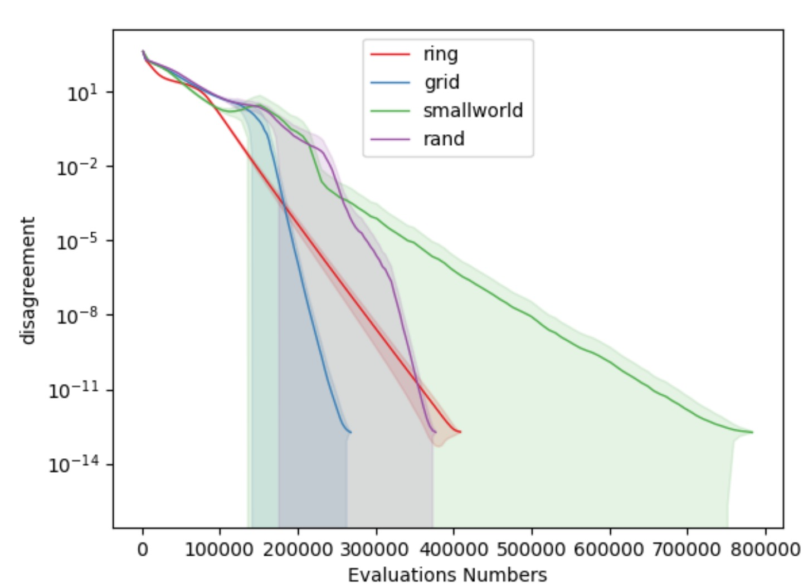

<!-- page: 36 -->

基于目标激励的多智能体协同进化算法

算法思想
挑战

节点目标函数冲突，
且只能访问自身目标函数

𝑓! + h
𝑓" + h

协同

𝑓"

𝑓%

𝑓# + h
𝑓$ + h
𝑓% + h
冲突

加入
目标激励

𝑓#
𝑓$

激励目标  =   原局部目标  + 激励项（惩罚函数）

𝑓!

*∈+!,#
(𝑡',* 𝑥* −𝑥&,-./

*
)

ℎ& 𝑥= 𝑓& 𝑥+ 𝜔5

5

'∈)!

设计激励目标引导节点协同优化

<!-- page: 37 -->

基于目标激励的多智能体协同进化算法

1 算法框架

𝑓! + h
𝑓! + h

激励目标引导
适应性调整激励目标

候选解

多智能体通信与协商

评估->竞争->共享
开始
局部优化
粒子群优化、遗传算法、差分进化
结束

共识解

2 冲突检测

∆𝑓$
−150 < 0

∆!,#! 𝑓$
𝑥= 𝑓$ 𝑥%, … , 𝑥& + 𝜎, … , 𝑥' −𝑓$ 𝑥%, … , 𝑥&, … , 𝑥'

∆𝑓$
−100 < 0

1. 不同维度的冲突程度不同
2. 不同优化阶段冲突程度不同

∆𝑓%
−100 > 0
∆𝑓%
−150 < 0

适应性调整：只在节点冲突时进行目标激励

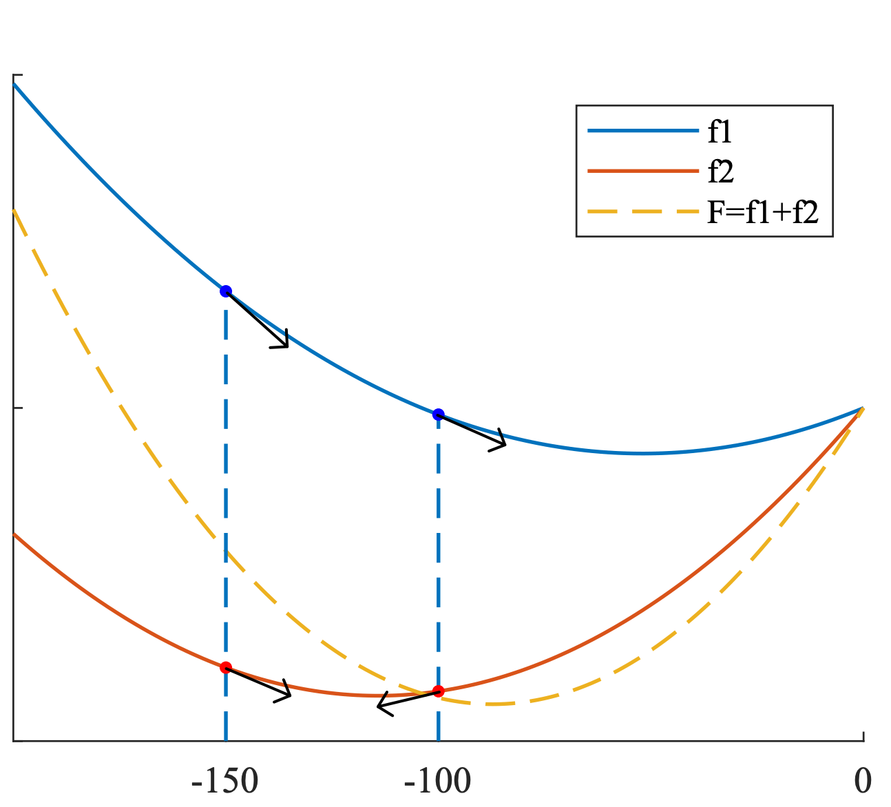

<!-- page: 38 -->

基于目标激励的多智能体协同进化算法

实验结果

Ø 在所有基准函数上优于/等于现有分布式优化算法

Ø 相比于现有主从优化模型有着更低的计算损耗，且优势随着通信/评估比的增加而增加

Ø 在分布式电力分配问题上验证了算法的应用效果

Tai-You Chen, Wei-Neng Chen（通讯作者), et al., “A Multi-Agent Co-evolutionary Algorithm with Penalty-Based
Objective for Network-Based Distributed Optimization”, IEEE Transactions on Systems, Man and Cybernetics:
Systems, 2024.

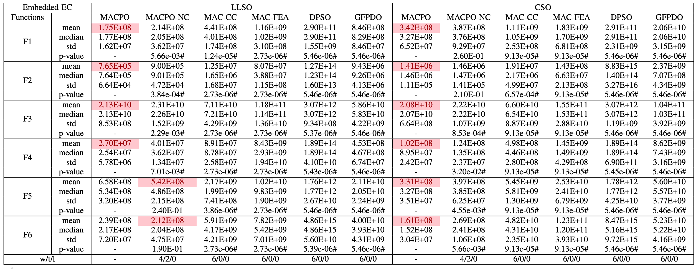

<!-- page: 39 -->

Outline
一、智能体与多智能体系统

二、多智能体的协同与控制

三、强化学习与多智能体强化学习

<!-- page: 40 -->

强化学习（Reinforcement Learning）

Ø 强化学习是一种机器学习方法，其思想来源于行为主义，是（多）智能体系

统自主学习、行动和协作中最常用的方法之一。

40

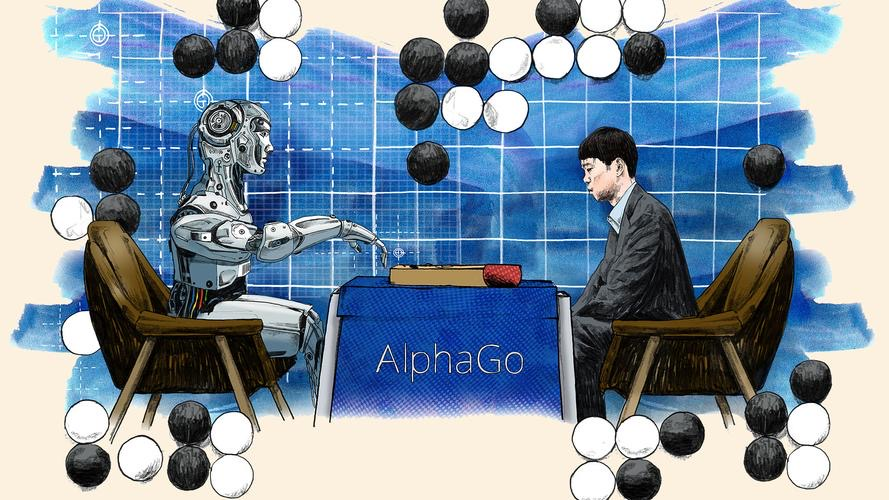

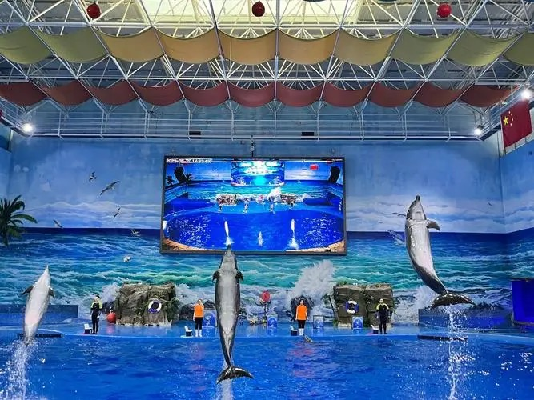

<!-- page: 41 -->

机器学习的主要分类

有监督学习通过对已有标记数据进⾏学习，训练模型能够从未
标记数据中进⾏预测和分类。在监督学习中，每个样本都有标
签（标记），模型可以利⽤这些标签来学习分类模型。

有监督学习

⽆监督学习⽤于处理未标记的数据，即没有给定输出标签的数据。⽆
监督学习的⽬标是学习数据中的模式和结构，以便在未知数据上进⾏
分类和预测。

无监督学习

半监督学习（Semi-supervised Learning）是介于监督学习和⽆监督
学习之间的⼀种学习⽅式。半监督学习利⽤⼀⼩部分已标记数据和⼤
量未标记数据进⾏训练，以提⾼模型的预测能⼒。

半监督学习

⽤于培养智能体（Agent）通过与环境的交互来学习最佳决策策略。强
化学习的⽬标是使智能体获得最⼤的累积奖励，从⽽学会在特定环境
下做出最佳决策。

强化学习

41

<!-- page: 42 -->

强化学习的发展历程

1957年

2016年

Bellman提出马
尔科夫决策过程

2013年

1989年

AlphaGo击败围棋

1972年

1953年

Watkins提出Q-
Learning算法

Minh首次
将深度学
习与强化
学习结合

世界冠军，是深度

Klopf把试错学习

Bellman提出动态

强化学习应用的重

和时序差分结合

规划方法

要里程碑

2018以来

1977年

1961年

2015年

1992年

1954年

强化学习研究热潮，

盒子和箭头模型被
提出，是Q-
Learning算法的原
型

强化学习一词
最早出现在
Minsky的论文
“Steps
toward AI”

Minsky在博
士论文中实
现了计算上
的试错学习

Tesauro成功将强
化学习应用于西
洋

在自动驾驶等领域

提出A3C算法，通

1950年
以前

有广泛应用

过异步更新和价值

函数进一步提升学

心理学家研究条件反
射，奠定强化学习的
生物学借鉴基础

习效率

奠定生物学与数学基础
发展强化学习基本算法
强化学习研究与应用快速发展

42

<!-- page: 43 -->

强化学习的在（多）智能体系统中的应用

电子游戏AI

无人机控制

机器人行为训练

自动驾驶

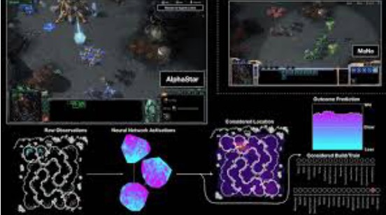

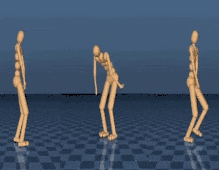

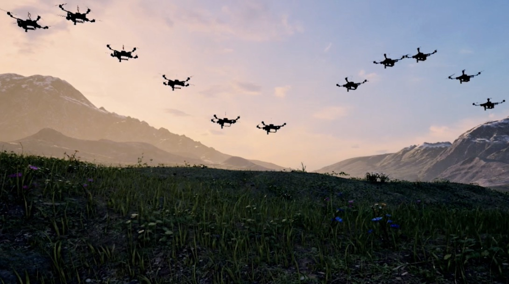

<!-- page: 44 -->

强化学习的基本概念

传感器

感知

作用

执行器

环境
智能体

回顾：智能体的概念
强化学习的基本要素

<!-- page: 45 -->

强化学习的基本概念

基本要素

ØAgent（智能体）：强化学习训练的主体

ØEnvironment（环境）：智能体所处的环境

ØState（状态）： 当前 Environment和Agent

所处的状态

ØAction（⾏动）： 基于当前的状态，Agent

可以采取哪些行动

ØReward（奖励）： Agent在当前状态下，

强化学习的基本要素

采取了某个特定的行动后，会获得环境的一

定反馈就是Reward

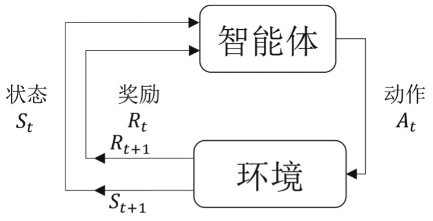

<!-- page: 46 -->

强化学习的基本概念

ØAgent（智能体）：

下棋的程序

ØEnvironment（环

境）：棋盘

ØState（状态）：、

棋盘当前状态

ØAction（⾏动）：

在哪里下子

ØReward（奖励）：

强化学习的基本要素

下子后棋局形势的好

坏变化的反馈

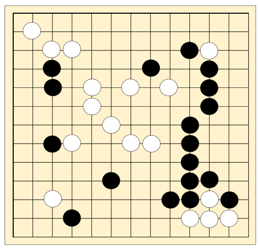

<!-- page: 47 -->

强化学习的基本概念

⻢尔科夫决策过程（Markov Decision Process，MDP）

奖励1
奖励2
奖励

状态1
状态2
状态3
状态n
动作1
动作2
动作3

…

Ø强化学习的应用场景一般都涉及连续多步决策

Ø目前训练强化学习的主要过程都基于一个前提：整个过程都是符合马尔可夫

决策过程，即下一步的State只和当前的状态State以及当前状态将要采取的

Action有关，只回溯一步。

<!-- page: 48 -->

强化学习的基本概念

上述决策过程形成了强化学习智能体与环境交互的轨迹：

强化学习与其他机器学习⽅法的不同：

Ø 没有教师信号、没有数据标签，只有激励反馈

Ø 反馈有延时，⼀般不能⽴即返回

Ø 输⼊的数据是时序序列，⽽不是独⽴同分布的数据

Ø Agent执⾏动作后，会对后续的数据产⽣影响

<!-- page: 49 -->

强化学习的基本概念

转移过程：

确定性
随机性

探索（Exploitation）与开发（Exploration）：

Ø 利⽤当前已知信息来使智能体表现最佳

Ø 通过与环境尝试不同的交互来获得更多的信息

⻓期回报（long-term return）与短期回报（short-term return）：

Ø 智能体的表现是⽤期望的奖励来评估的
Ø ⻓期回报：智能体着眼于较⻓期（轨迹）后获得的期望回报 （全局，反馈滞后）

Ø 短期回报：智能体着眼于较短期（轨迹）后获得的期望回报 （贪⼼，交易评估）

<!-- page: 50 -->

强化学习的基本概念

五元组：

Ø  S： 状态集合

Ø A：动作集合

Ø P： 策略（Policy）——智能体根据它对环境的观测来⾏动的⽅式

Ø R：期望回报——在⼀个策略下给定所有可能轨迹的回报的期望值

——St状态下执⾏动作At ，得到的⽴即回报Rt

——S状态下执⾏动作a 的概率分布

给定起始状态分布ρ0 和策略π，⻢尔可夫决策过程中⼀个T步⻓的轨迹的发⽣概率

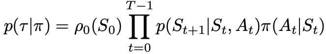

<!-- page: 51 -->

强化学习的基本概念

五元组：

给定奖励函数 R 和所有可能的轨迹 τ，策略π的期望回报 J(π) 可以定义为

Ø 强化学习优化的⽬标是，改进策略，从⽽最⼤化期望回报，即

<!-- page: 52 -->

强化学习的基本概念

Ø 状态S基于策略π的价值函数： 状态S在策略π 下的期望回报定义为：

折扣值
例如：评价一个棋局整体状态的价值

Ø 动作的价值函数：状态S下给定⼀个动作a，可以定义其动作的价值函数

例如：评价一个棋局在某状态S下执行下子动作a的价值

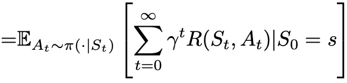

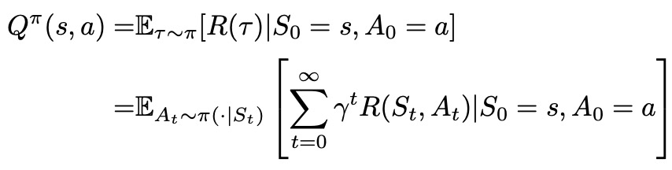

<!-- page: 53 -->

强化学习的基本概念

⻉尔曼⽅程：

状态S
的价值v(S)

奖励
立即回报
后继状态
折扣价值

Rt+1

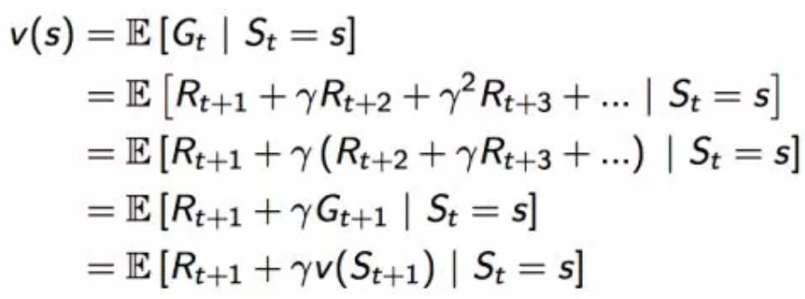

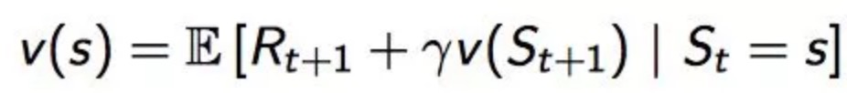

<!-- page: 54 -->

强化学习的基本概念

举例：

Ø Agent从start开始，⾛迷宫通往

Goal

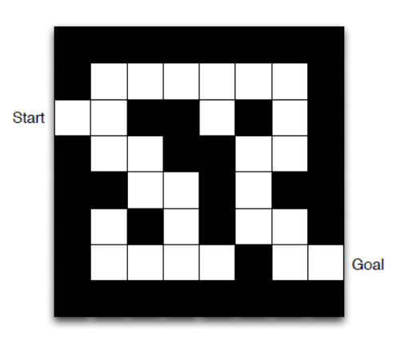

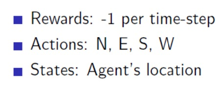

<!-- page: 55 -->

强化学习的基本概念——策略与价值

智能体应该采⽤的策略Policy
定义智能体在每种状态下的价值Value

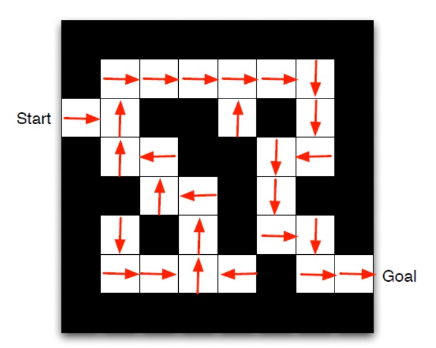

<!-- page: 56 -->

强化学习的基本概念——有模型与免模型

有模型：智能体知道环境模型，通过

⽆模型：智能体不具备环境模型，通过与

学习环境的模型来规划和决策

环境的交互来获取经验数据并进⾏优化

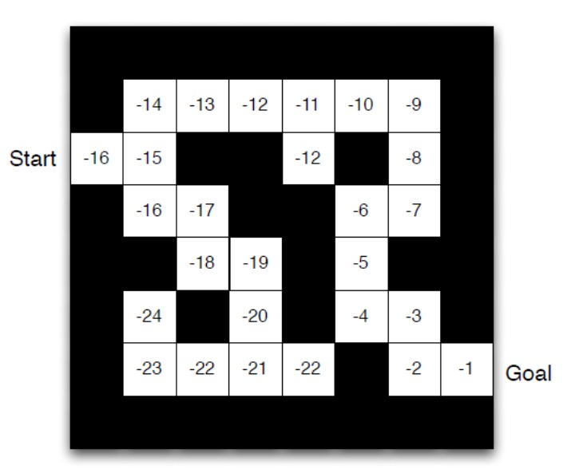

<!-- page: 57 -->

强化学习的基本分类

基于价值：

Ø 智能体通过价值函数来决定选择什么

⾏动（选择Q值“最”⼤的⾏动）

基于策略：

Ø 直接计算能使回报最⼤化的策略

基于模型：

Ø 建⽴⼀个环境的模型，使智能体可以

直接依赖模型来计算价值和选择动作

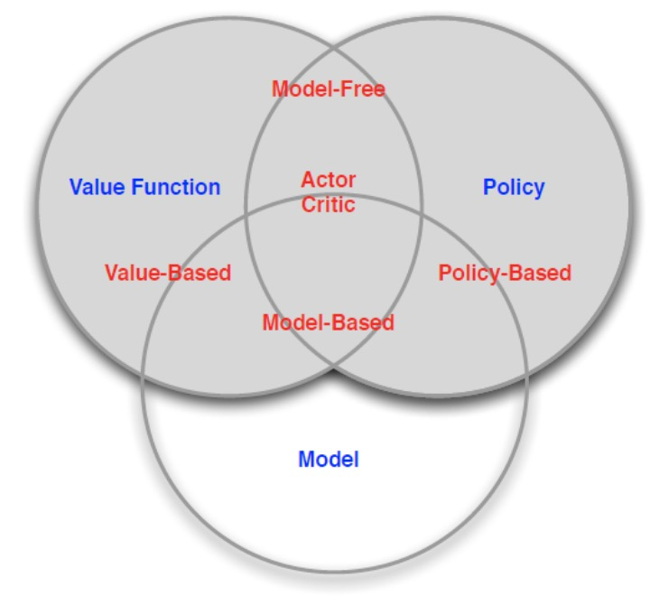

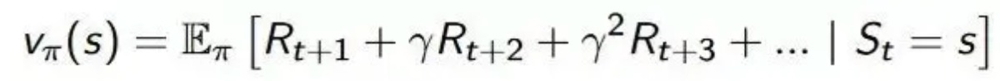

<!-- page: 58 -->

强化学习的基本分类

基于价值：

Ø 学习吃某种草药（动作）对

治疗某病（状态）的价值

基于策略：

Ø 学习治疗某病（状态），应

该选⽤什么草药（动作）
基于模型：

Ø 学习⼀本能描述各种草药各

种特性的书（环境）

<!-- page: 59 -->

强化学习的基本分类

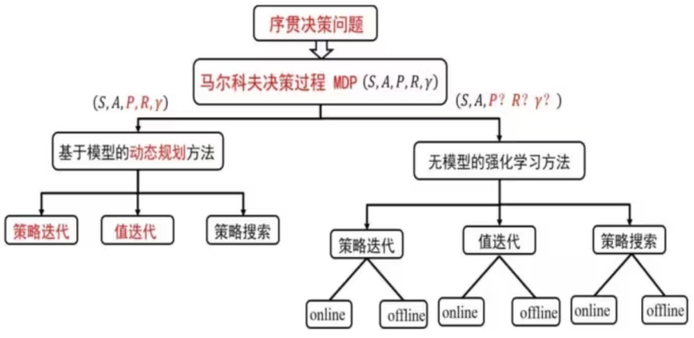

<!-- page: 60 -->

动态规划方法

动态规划（Dynamic Programming）⼀般应⽤于有模型，且问题

符合最优⼦结构(Optimal Substructure) 的简单⻢尔科夫决策过程。

Ø 策略迭代⽅法

•
给定任意⼀个策略 πt，对于每⼀次迭代 t 中的每⼀个状态 s，我们

⾸先评估 vπt (s)，然后找到⼀个更好的策略 πt+1

Ø 价值迭代⽅法

•
如果我们知道⼦问题 v∗(s ′) 的解，就可以通过⼀步完全回溯

(One-Step Full Backup)找到任意⼀个初始状态s的解

<!-- page: 61 -->

动态规划方法

初始化：所有格子状态初
始化为0，并且选择随机策

⾛到左上或右下
的终⽌格

Ø 策略迭代⽅法——策略评估

略（上下左右四个方向均

等可能）

定义每次移动得到的回报为-1，仅当到了终止格价值为0，例如

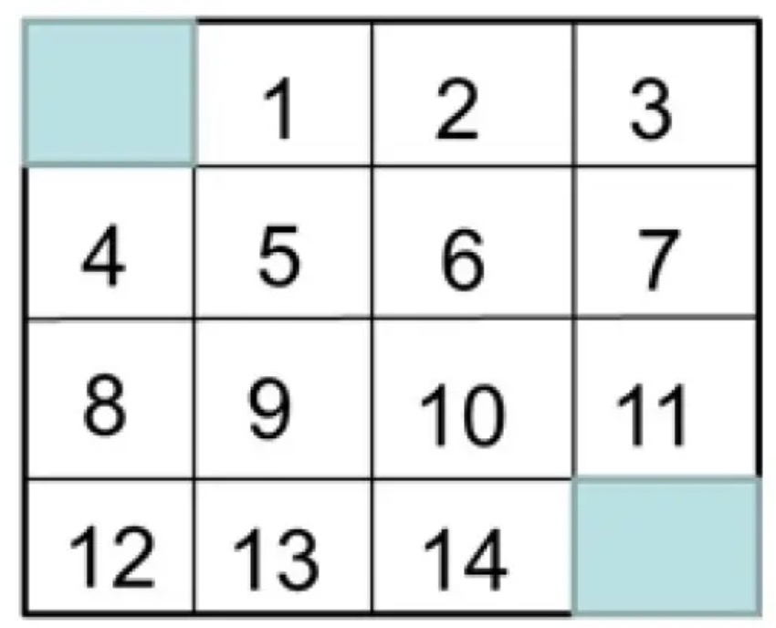

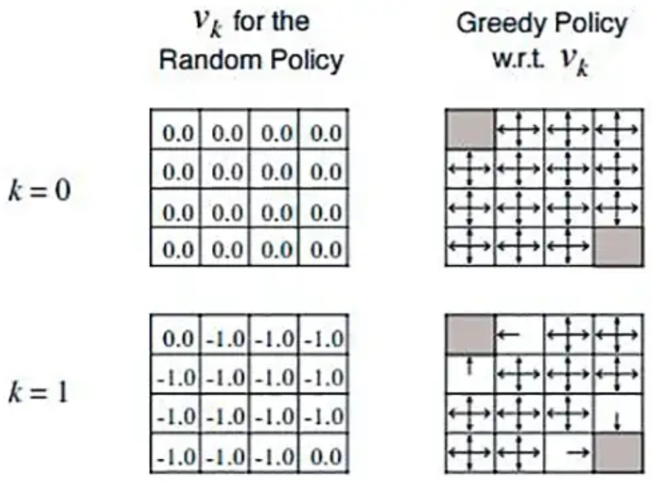

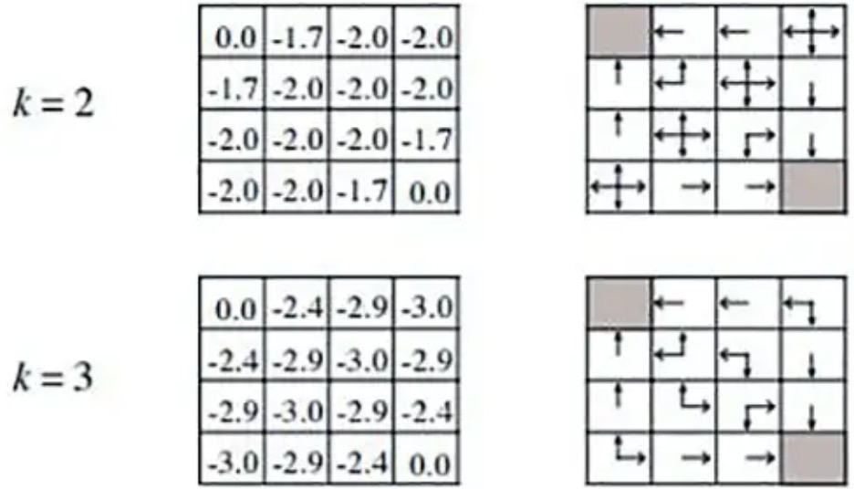

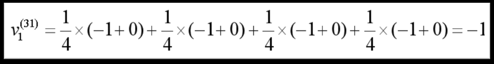

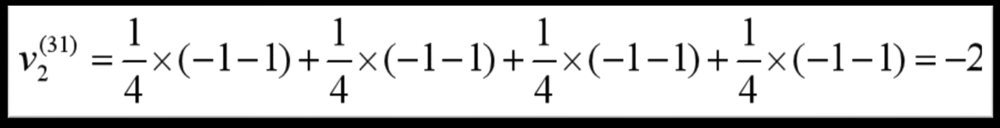

<!-- page: 62 -->

动态规划方法

Ø 策略迭代⽅法——策略改进

更新其最优策略为向上

得到Q表
上
下
左
右

…

策略评估到达收敛状态

V3,1
-14
-22
-20

…

注意：这样得到的策略不一定是最优的。如果
不是，可返回策略评估步骤，再进行策略改进，

多次迭代至收敛。

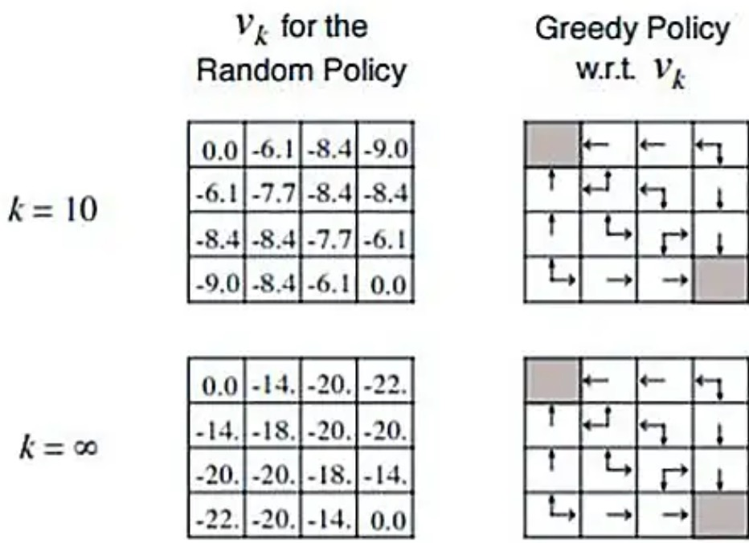

<!-- page: 63 -->

动态规划方法

Ø 价值迭代⽅法 —— 通常⽤“填表”的⽅式填写Q表

根据贝尔曼方程，写出
其递归推导的形式，然

后迭代计算直至收敛

根据Q表得到最优策略

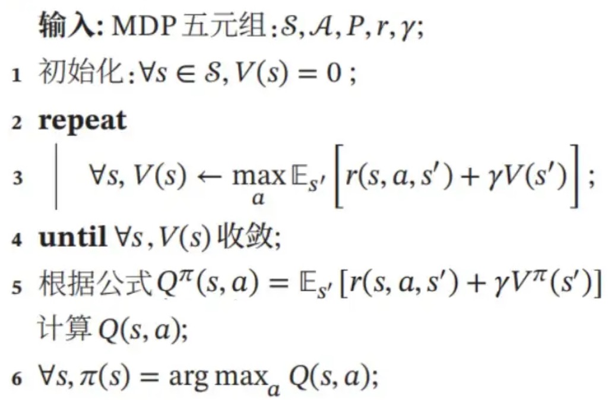

<!-- page: 64 -->

蒙特卡洛方法

Ø 动态规划⽅法需要依赖环境的模型（状态转换及其回报明确）

Ø ⼤部分实际问题环境模型未知，或包含的状态数量太⼤

蒙特卡洛⽅法（Monte Carlo）是不依赖

于模型的⽅法，在策略评估时不是求的回报的

期望，⽽是使⽤经验平均回报（empirical

mean return）。随着样本越来越多，这个平均

值是会收敛于期望。

⽤蒙特卡洛⽅法估计圆周率

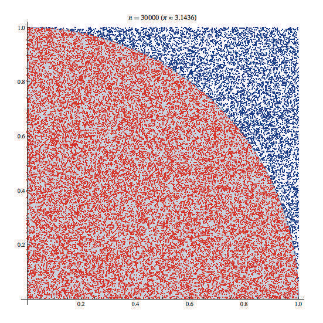

<!-- page: 65 -->

蒙特卡洛方法

主要步骤

Ø 根据策略，反复⽣成情节episode

(2,2)→(1,2)→(1,3)→(2,3)→(2,2)→(1,2)→(1,1)

(2,2)→(2,1)→(2,2)→(2,3)→(3,3)→(3,4)→(4,4)

……
Ø 根据策略⽤到达某状态后产⽣的

return的均值来估计

•
return是情节中每步reward的总和
•
例如走迷宫，仅当情节（经一系列
步骤走到出口）结束，才评估中间
状态的returns

•
First-visit ⽤第⼀次出现s后的return

•
Every-visit⽤每⼀次出现后的returns

Ø注意：仅当episode接收后，才进

增量式平均数

⾏更新

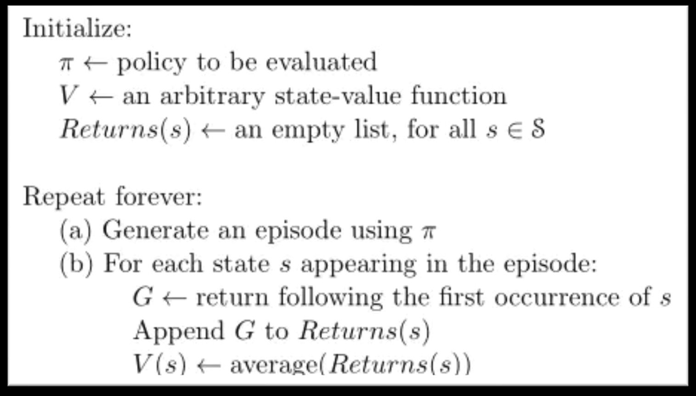

<!-- page: 66 -->

时序差分学习方法

• 不需要依赖模型
• 仅当情节结束后，
才能获得回报

• 可直接利用每一
步得到的奖励
• 必须依赖模型
蒙特卡洛

动态规划

• 不需要依赖模型
• 一边采样一边学习，加快
速度

时序差分学习

<!-- page: 67 -->

时序差分学习方法

时序差分（temporal-difference，TD）可以像蒙特卡罗⽅法那样直接从经验中

进⾏学习⽽不需要知道完整的环境模型，同时它⼜可以像动态规划⽅法那样根据

已学习到的价值函数的估计进⾏当前估计的更新（步步更新）

蒙特卡洛⽅法
⽤平均数近似期望值

改为步⻓系数α

需要episode结束之后才能计算

时序差分⽅法

一步估计：即从状态St转换到St+1获得的即时回报+当前状态价值的折扣值

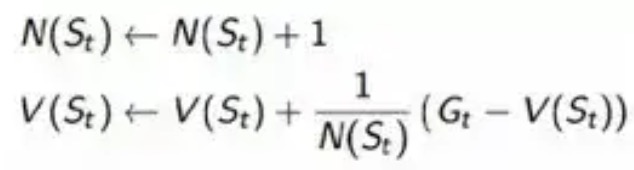

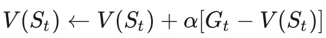

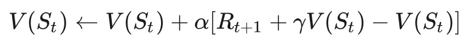

<!-- page: 68 -->

Sarsa

上述时序差分⽅法评估的是状态的价值V(st)，也可以对st下动作价

值进⾏评估，即Sarsa⽅法。

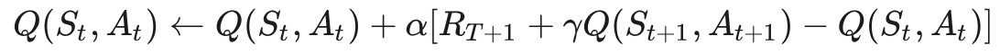

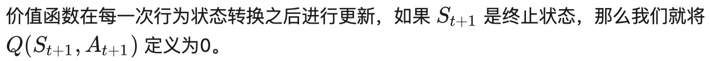

<!-- page: 69 -->

Q-Learning

Q-Learning⽅法是强化学习⽅法的重⼤突破，它与Sarsa⽅法的类

似，唯⼀不同点是直接求解关于动作值函数的⻉尔曼⽅程。

Sarsa⽅法

Q-学习⽅法

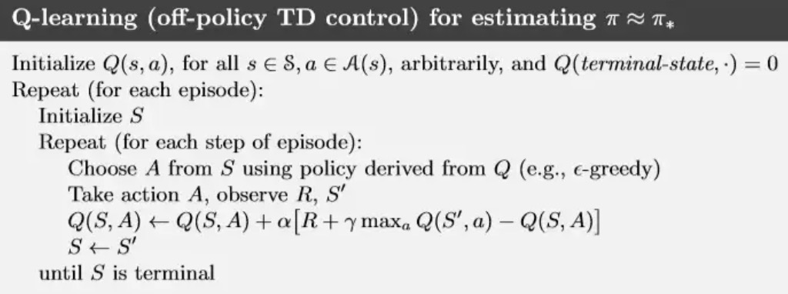

<!-- page: 70 -->

Sarsa与Q-Learning的比较

Ø Sarsa使⽤ε-greedy作为⾏为策略和评估策略

Ø Q学习使⽤ε-greedy作为⾏动策略，使⽤贪

婪作为评估策略

Ø On-policy：⾏为策略和评估策略⼀致，先通

过ε-greedy策略执⾏动作，然后根据所执⾏
的动作，更新值函数

Ø Off-policy：⾏为策略和评估策略不⼀致，

先假设下⼀步选取最⼤奖赏的动作（并没
有执⾏），更新值函数，然后再通过ε-
greedy策略选择动作。

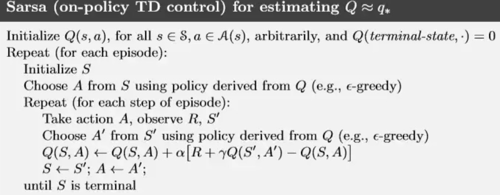

<!-- page: 71 -->

举例——冰湖问题

将⼀个结冰的湖看成是⼀个4×4的⽅格，每个格⼦可以是起始块（S），⽬标块

（G）、冻结块（F）或者危险块（H），⽬标是通过上下左右的移动，找出能最快

从起始块到⽬标块的最短路径，同时避免⾛到危险块上。

Sarsa⽅法

学习率0.1
每⾛⼀步的奖励-0.4

初始化
第⼀步
Q(1,1) ⟵ Q(1,1) + 0.1 × [-0.4 + 0.5 × (0) – 0] = 0.04

折现率0.5

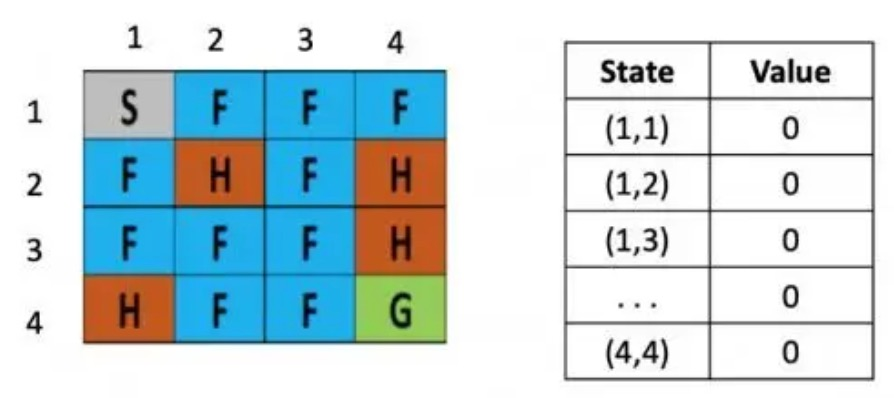

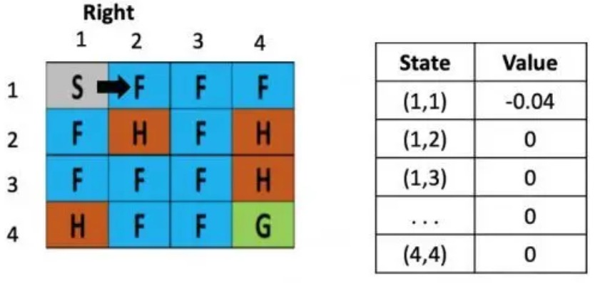

<!-- page: 72 -->

举例——冰湖问题

Sarsa⽅法

选择向右一步，类似的方法进行更新

假设现在智能体到达了如上右图所示的位置，根据公式更新（3，2）的Q value，由于向下走的Q-value

最大，假定学习率是0.1，折现率是0.5，那么（3，2）这个点向下走这个策略的更新后的Q value就是

Q((3,2)down)=Q((3,2)down)+0.1×(−0.4+0.5×(Q((4,2)down))−Q((3,2),down）

Sarsa会随机选一个action,比如这里选择的是(Q(4,2),down)

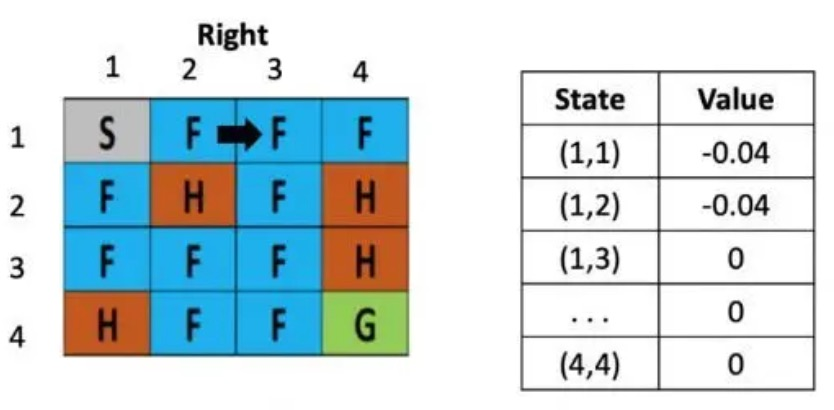

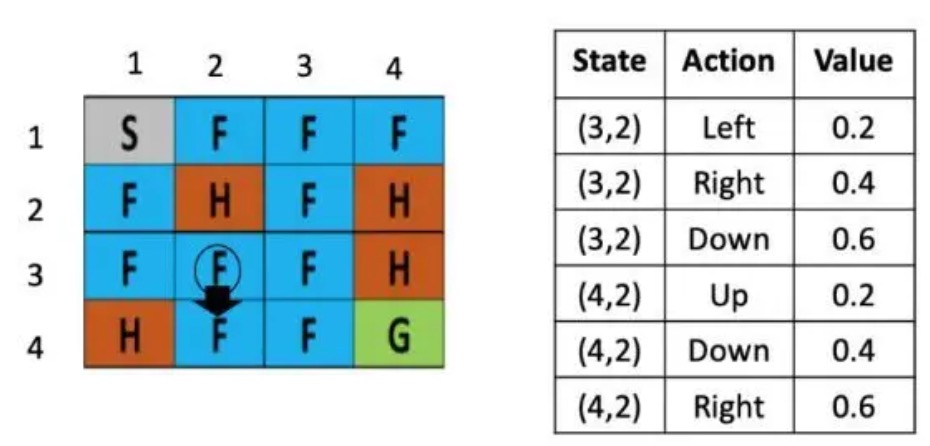

<!-- page: 73 -->

举例——冰湖问题

Q-Learning⽅法

假设现在智能体到达了如上右图所示的位置，根据公式更新（3，2）的Q value，由于向下走的Q-value
最大，假定学习率是0.1，折现率是0.5，那么（3，2）这个点向下走这个策略的更新后的Q value就是：

Q((3,2)down)=Q((3,2)down)+0.1×(−0.4+0.5×max[Q((4,2)action)]−Q((3,2),down））

Q((3,2),down)=0.6+0.1×(−0.4+0.5×max[0.2,0.4,0.6]–0.6)=0.53

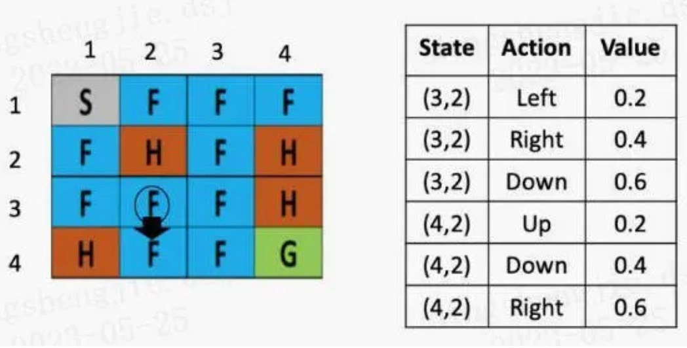

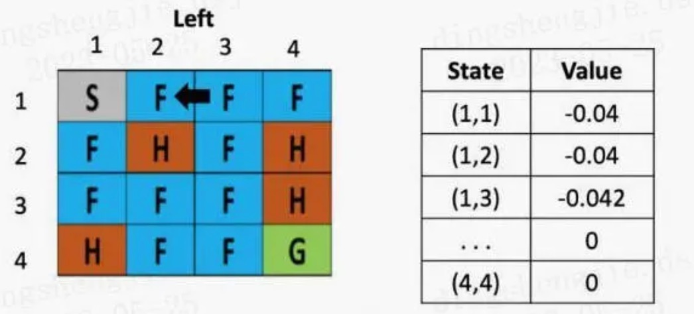

<!-- page: 74 -->

Sarsa与Q-Learning的比较

Sarsa⽅法

Ø适⽤于需要稳定学习过程、重视

探索的任务，或者在与环境进⾏

交互时进⾏在线学习的情况。

Q-Learning⽅法

Ø适⽤于倾向于学习最优策略的任

务，或者在需要快速收敛时的情

况。

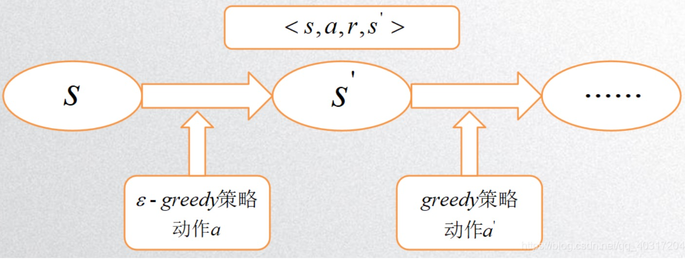

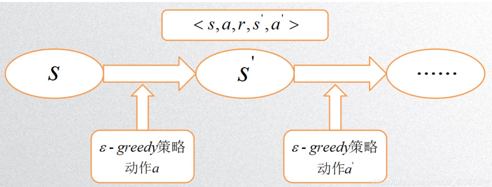

<!-- page: 75 -->

深度Q-Learning （DQN）

Sarsa和Q-Learning⽅法⼀般只能处理离散、较⼩规模状态空间

的问题。

Ø前述的Sarsa和Q-learning⽅

法都涉及到要迭代来计算Q表
Ø实际问题中Q表可能是连续空

间的（状态或动作值为连续变

量），或者存在组合爆炸现象

将Q-Learning⽅法与深度学习相结合，⽤⼀个神经⽹络来近似Q

表，则得到深度Q⽹络⽅法（Deep Q Network，DQN）。

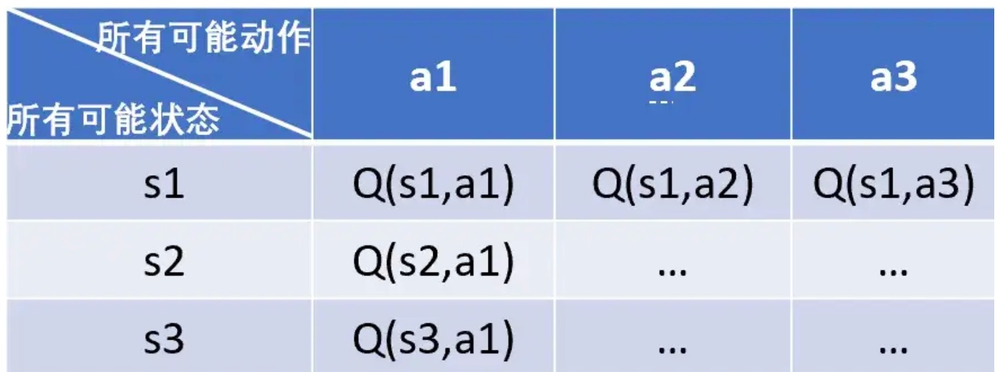

<!-- page: 76 -->

深度Q-Learning （DQN）

DQN的流程

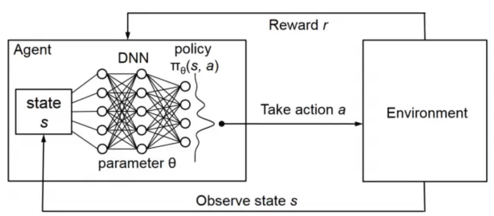

<!-- page: 77 -->

深度Q-Learning （DQN）

DQN的流程

Ø训练样本：⼀批四元组（s, a, r, s’）

Ø训练⽬标：⽤神经⽹络拟合Q学习中的

误差项，使其最⼩化
神经网络参数

Ø训练样本：⼀批四元组（s, a, r, s’）

Ø挑战：⾮独⽴同分布，因此通过经验回放等机制进⾏训练

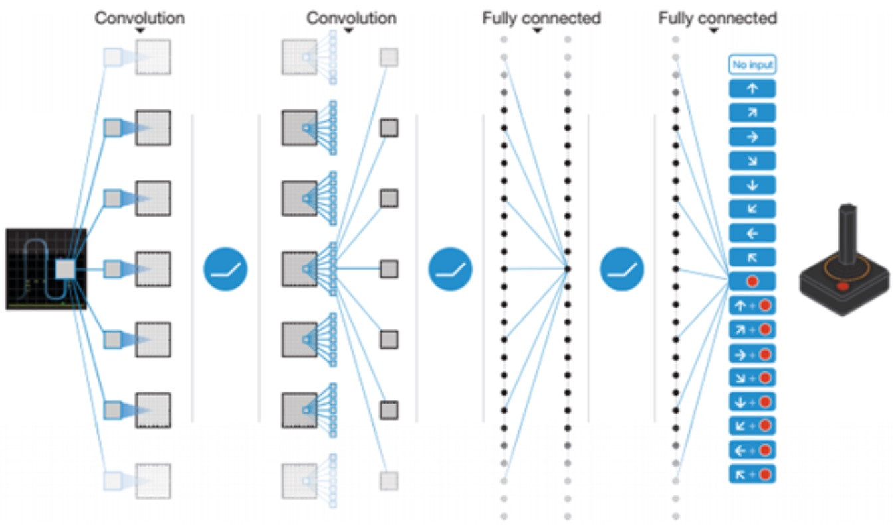

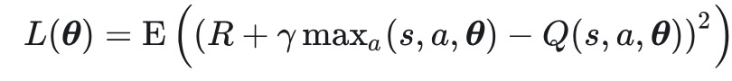

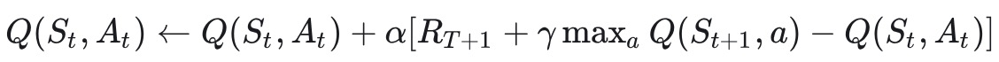

<!-- page: 78 -->

策略梯度（Policy Gradient）

DQN⽤神经⽹络拟合Q表，策略梯度PG⽅法则尝试⽤神经⽹络来

学习在某状态下使⽤某种策略的概率分布。

ØPG⽅法实际上是神经⽹络与蒙特卡洛⽅法的

结合

Ø多种设计PG的⽬标函数⽅法，例如

l 平均奖励，⽤于没有开始和结束状态情况

l 起始状态，⽤于有开始和结束状态情况

l ⽆论哪种形式的⽬标函数，其对策略参数的梯度值在形式上都是⼀致的

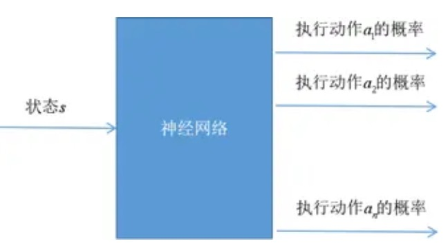

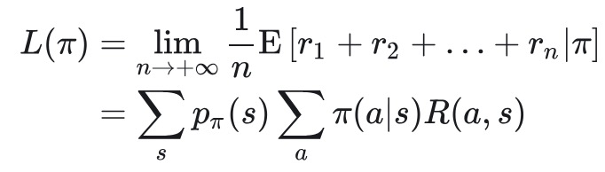

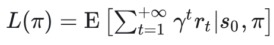

<!-- page: 79 -->

评论家方法Critic

Critic（评论家）⽅法（如Q-Learning）：计算当前状态 s, 采取某个

动作 a 后会获得的未来的奖励的期望，这个值就是 Q(s,a)

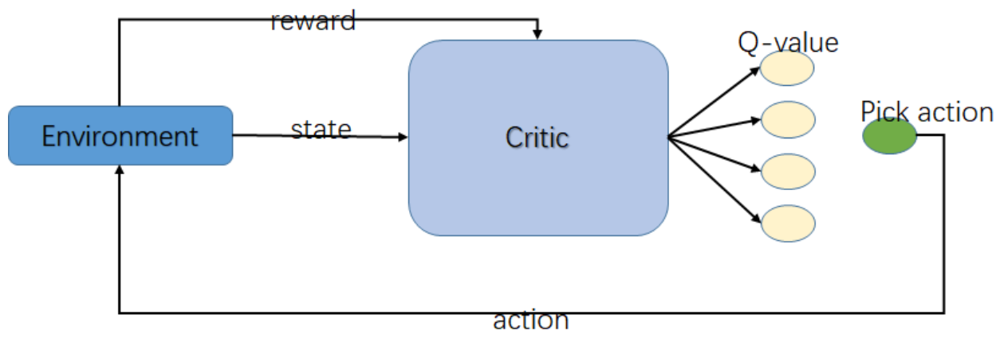

<!-- page: 80 -->

演员方法Actor

Actor（演员）⽅法（如策略梯度⽅法）：根据当前状态，直接算出下

一个动作是什么或下一个动作的概率分布是什么

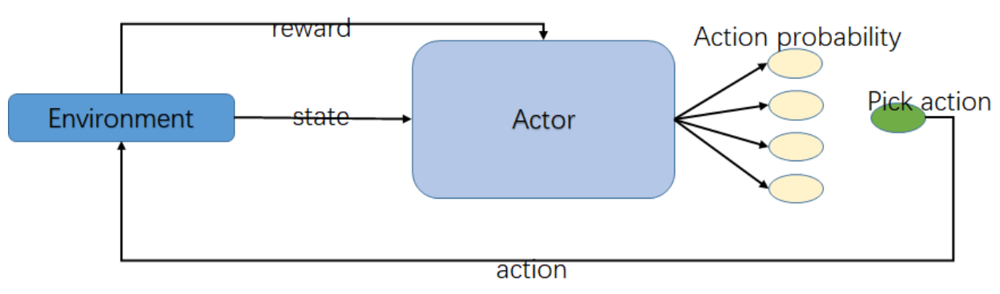

<!-- page: 81 -->

Actor-Critic方法

Actor-Critic（演员-评论家）⽅法：将上述两者结合

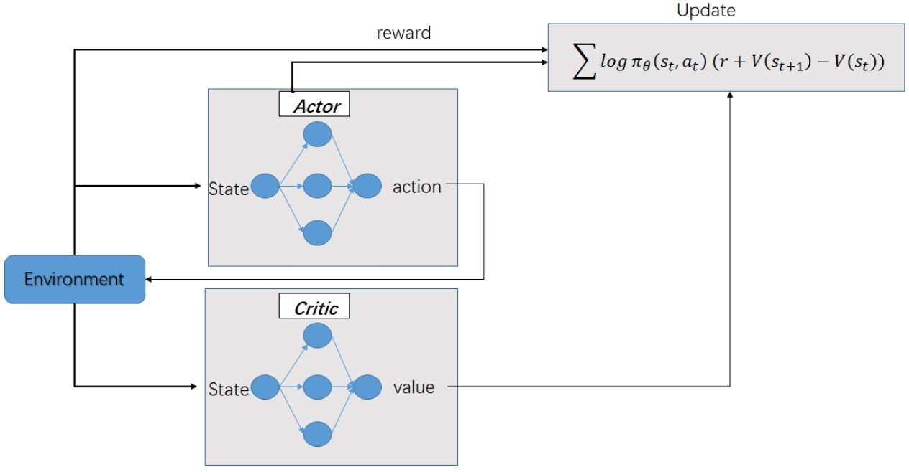

<!-- page: 82 -->

Actor-Critic方法

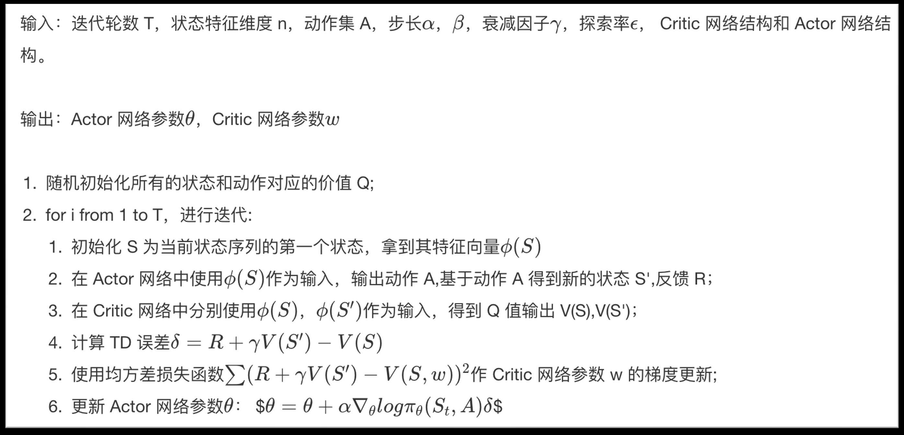

<!-- page: 83 -->

Actor-Critic方法

Ø优点

l 相⽐以值函数为中⼼的算法，Actor - Critic 应⽤了策略梯度的做法，这能让它在连续动

作或者⾼维动作空间中选取合适的动作，⽽ Q-learning 难以处理连续⾼维动作空间

l 相⽐单纯策略梯度，Actor - Critic 应⽤了 Q-learning 或其他策略评估的做法，使得

Actor Critic 能进⾏单步更新⽽不是回合更新，⽐单纯的 Policy Gradient 的效率要⾼。
Ø缺点

l 训练不容易收敛
Ø⽬前改进的⽐较好的有两个经典算法：

l DDPG 算法，使⽤了双 Actor 神经⽹络和双 Critic 神经⽹络的⽅法来改善收敛性。

l A3C 算法，使⽤了多线程的⽅式，⼀个主线程负责更新 Actor 和 Critic 的参数，多个辅

线程负责分别和环境交互，得到梯度更新值，汇总更新主线程的参数。⽽所有的辅线程会

定期从主线程更新⽹络参数。这些辅线程起到了类似 DQN 中经验回放的作⽤。

<!-- page: 84 -->

多智能体系统与博弈

Ø多智能体系统特点

l 多个智能体共同和环境发⽣

a1

st

交互

智能体1

l 智能体不仅受到环境交互的

r1

影响，还受到其他智能体⾏

联合
动作

st

a2

为的影响

智能体1

l 单个智能体回报的获得，不

r2

环境

a

仅与⾃身的动作有关，还和

其他智能体的动作有关
Ø⻢尔科夫博弈

st

an

智能体n

rn

84

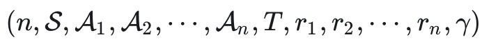

<!-- page: 85 -->

多智能体系统与博弈

Ø矩阵博弈

l ⼀个矩阵博弈可以表示为                                            ，，n表示智能体数量， Ai是第

i个智能体的动作集，                                表示第i个智能体的奖励函数。

l 从奖励函数可以看出每个智能体获得的奖励与多智能体系统的联结动作有关，联结动作空

间为                      。每个智能体的策略是⼀个关于其动作空间的概率分布，每个智能体

的⽬标是最⼤化其获得的奖励值。

l 令                             表示智能体i在，联结策略                   下的期望奖励，即值函数。
Ø纳什均衡

l 若在矩阵博弈中，如果联结策略                 满⾜

     则为⼀个纳什均衡。【即任何智能体都不能仅改变⾃⼰的策略来获取更⼤的奖励】

85

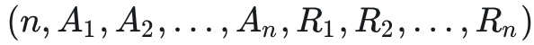

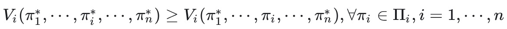

<!-- page: 86 -->

多智能体系统与博弈

Ø混合策略

l 若⼀个策略对于智能体动作集中的所有动作的概率都⼤于0，则这个策略为⼀个完全混合策略。
Ø例⼦：⽯头剪⼑布博弈

石头
剪刀
布

0
1
−1
−1
0
1
1
−1
0

0
1
−1
−1
0
1
1
−1
0

石头
0,0
1,-1
-1,1

剪刀
-1,1
0,0
1,-1

布
1,-1
-1,1
0,0
智能体1

智能体2

l 纳什均衡：⽯头、剪⼑和布都以1/3概率

86

<!-- page: 87 -->

多智能体系统与博弈

Ø纯策略

l 若智能体的策略对⼀个动作的概率分布为1，对其余的动作的概率分布为0，则为⼀个纯策略。
Ø例⼦：囚徒困境博弈

坦白
抵赖

坦白
-2,-2
-3,0

抵赖
0,-3
-1,-1

l 纳什均衡：双⽅都坦⽩（-2，-2）

l 但实际最优结果是都抵赖（-1，-1），但除

⾮两者合作共谋，否则（-1，-1）并⾮是⼀

个稳定的均衡解

87

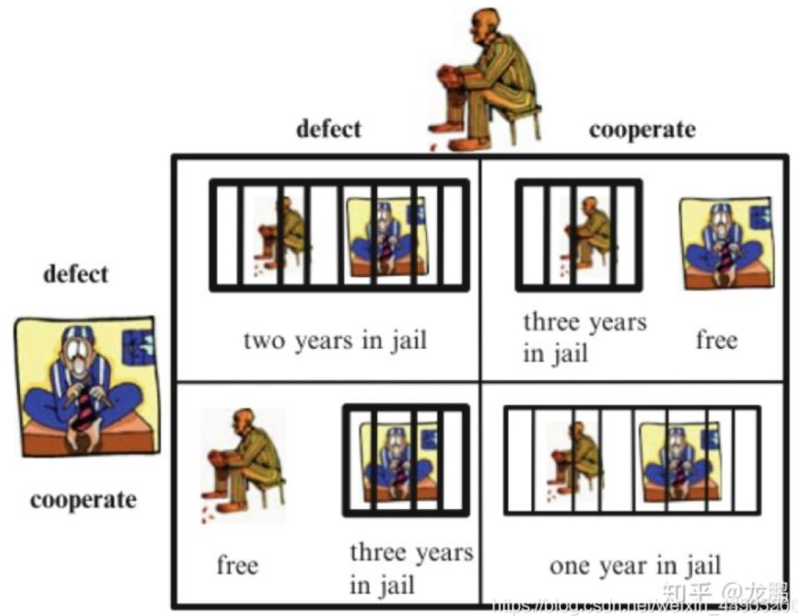

<!-- page: 88 -->

多智能体系统与博弈

Ø混合策略

l 若⼀个策略对于智能体动作集中的所有动作的概率都⼤于0，则这个策略为⼀个完全混合策略。
Ø例⼦：⽯头剪⼑布博弈

石头
剪刀
布

0
1
−1
−1
0
1
1
−1
0

0
1
−1
−1
0
1
1
−1
0

石头
0,0
1,-1
-1,1

剪刀
-1,1
0,0
1,-1

布
1,-1
-1,1
0,0
智能体1

智能体2

l 纳什均衡：⽯头、剪⼑和布都以1/3概率

88

<!-- page: 89 -->

多智能体系统与博弈

Ø零和博弈

l 两个智能体是完全竞争对抗关系，则                 。在零和博弈中只有⼀个纳什均衡值，即使

可能有很多纳什均衡策略，但是期望的奖励是相同的。

Ø⼀般和博弈

l ⼀般和博弈是指任何类型的矩阵博弈，包括完全对抗博弈、完全合作博弈以及⼆者的混合博弈。

在⼀般和博弈中可能存在多个纳什均衡点。
Ø静态博弈：static/stateless game是指没有状态s，不存在动⼒学使状态能够转移的博弈。例如

⼀个矩阵博弈。

Ø阶段博弈：stage game，是随机博弈的组成成分，状态s是固定的，相当于⼀个状态固定的静态

博弈，随机博弈中的Q值函数就是该阶段博弈的奖励函数。若⼲状态的阶段博弈组成⼀个随机博弈。
Ø重复博弈：智能体重复访问同⼀个状态的阶段博弈，并且在访问同⼀个状态的阶段博弈的过程中

收集其他智能体的信息与奖励值，并学习更好的Q值函数与策略。

89

<!-- page: 90 -->

多智能体系统与博弈

智能体之间的关系

完全合作：智能体的目标值完全一致
完全竞争：智能体之间构成零和博弈

竞争与合作并存
利己主义：智能体只关心自身的回报

90

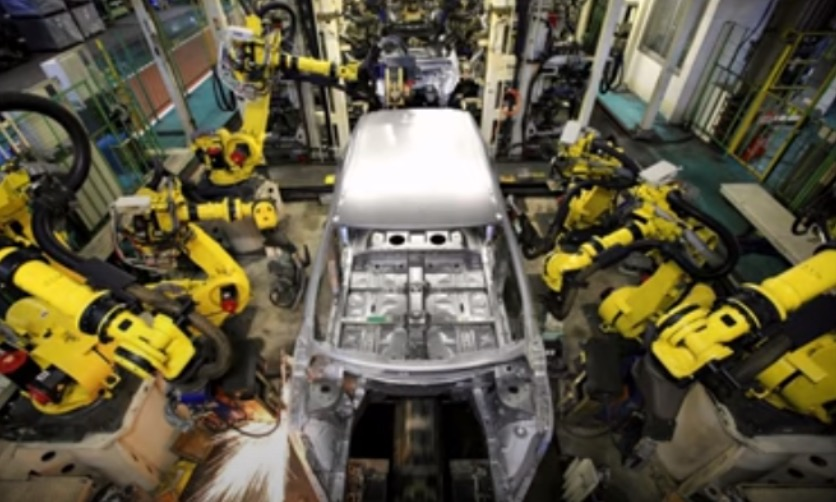

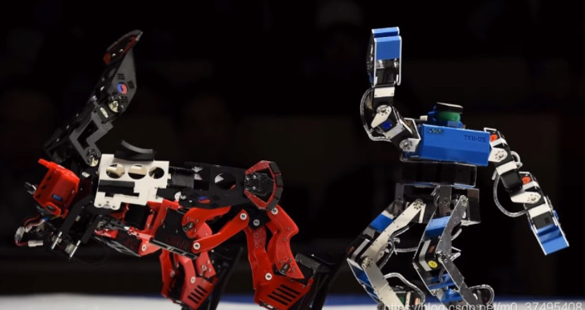

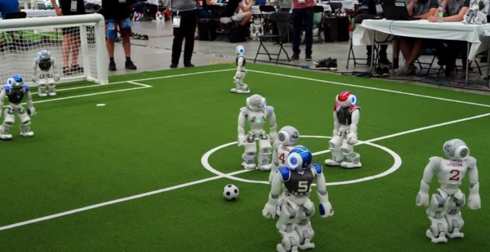

<!-- page: 91 -->

多智能体强化学习的困难与挑战

Ø环境的不稳定性：

l 智能体在做决策的同时，其他智能体也在采取动作；环境状态的变化与所有智能体

的联合动作相关；
Ø智能体获取信息的局限性：

l 不⼀定能够获得全局的信息，智能体仅能获取局部的观测信息，但⽆法得知其他智

能体的观测信息、动作和奖励等信息；

Ø个体的⽬标⼀致性或竞争性：

l 各智能体的⽬标可能是最优的全局回报，也可能是各⾃局部回报的最优，在如零和

博弈中智能体的个体⽬标存在⽭盾和竞争；
Ø可拓展性：

l 在⼤规模的多智能体系统中，就会涉及到⾼维度的状态和动作空间，对于模型表达

能⼒和真实场景中的硬件算⼒有⼀定的要求。

91

<!-- page: 92 -->

多智能体强化学习的困难与挑战

Ø智能体在同⼀个状态下的同⼀个动作，会因为其他智能体的不同动作影响

⽽得到不同的回报，因此单智能体算法在多智能体问题中不稳定

92

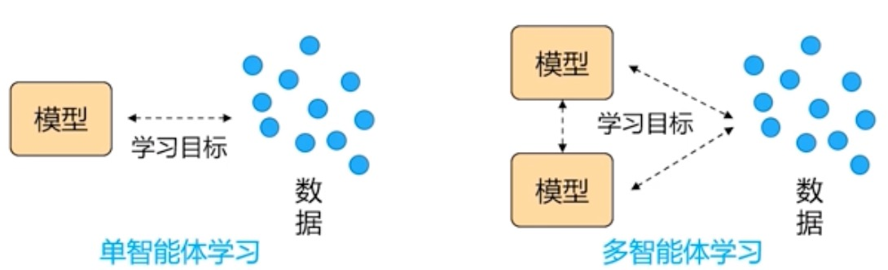

<!-- page: 93 -->

多智能体强化学习代表性方法与思路

完全中⼼化⽅法
Ø 将多智能体的整体决策，当做一个超级大智能体决策，把所有智能体的动作

结合起来成为一个联合动作
    优点：克服环境不稳定问题         缺点：组合爆炸，复杂度太高
完全去中⼼化⽅法
Ø 每个智能体都独立地在环境中学习，不考虑其他智能体的改变，每个智能体

单独采用一个单智能体方法学习
    优点：简单容易实现            缺点：环境不确定性，学习可能不收敛
集中式训练，分散式执⾏
Ø 训练时使用全局信息，达到更好效果；执行时各个智能体根据自己策略直接

行动，从而达到去中心化执行的效果
优点：兼顾中心化和去中心化方法的优势   缺点：算法设计较复杂、信用分配难

93

<!-- page: 94 -->

多智能体强化学习代表性方法与思路

完全中⼼化⽅法

Ø 大智能体： 将多智能体合并看成是一个大的智能体

                 以每个智能体的奖励和作为大智能体的奖励

智能体1动作空间
（向前，向后，向左，向右，传球，射门）
智能体2动作空间
（向前，向后，向左，向右，传球，射门）
大智能体联合动作空间
（（智能体1向前，智能体2向前）,（智能体1向前，
智能体2向后）,……) 共36个联合动作

缺点：动作空间组合爆炸，无法处理智能体非合作的任务

<!-- page: 95 -->

多智能体强化学习代表性方法与思路

完全中⼼化⽅法

Minimax-Q算法：⽤于两智能体的零和博弈

在两玩家零和随机博弈中，给定⼀个状态s，则定义第i个智能体的状态值函数为

Minimax剪枝：本⽅——希望最⼤化收益，对⽅——希望最⼩化本⽅的收益

95

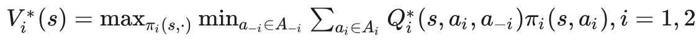

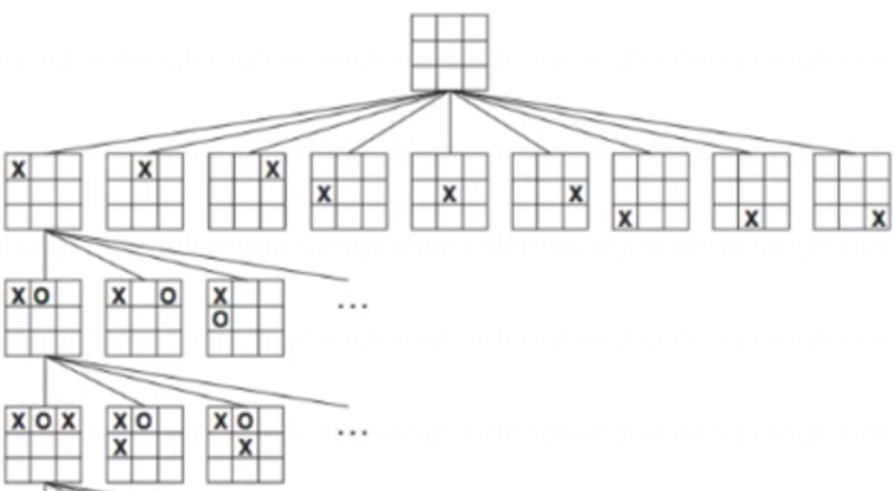

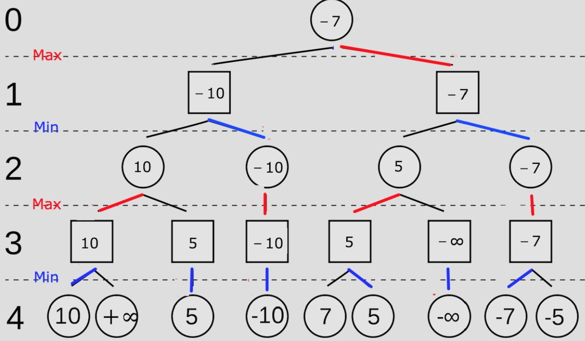

<!-- page: 96 -->

多智能体强化学习代表性方法与思路

Minimax-Q算法：

Ø 双⼈零和博弈和矩阵博弈的纳什均衡解，等价于求解下列⽅程的最⼩解

max
𝝅∈AB(C()
min
D)*∈CE(,D*∈C( &

𝑹𝒊𝝅𝒊(𝑎")

D*∈C(

因此可以使⽤线性规划⽅法进⾏求解

Ø 实际应⽤中，⾮静态博弈（⽆模型）往往不清楚𝑹𝒊，因此可以借鉴Q-

Learning的时序差分⽅法来学习

96

<!-- page: 97 -->

多智能体强化学习代表性方法与思路

完全中⼼化⽅法

Nash Q-Learning算法：⽤于⼀般和博弈

Ø 给定联合策略𝝅，则智能体i的价值函数是

Ø 因此，针对智能体i优化        依赖于联合策略𝝅
Ø 随机博弈中，纳什均衡可以表示为

Ø 如果没有⼀个智能体能通过改变它的策略来提升收益，则

97

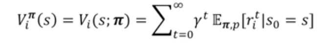

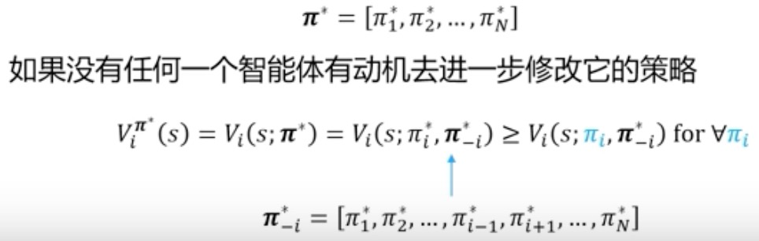

<!-- page: 98 -->

多智能体强化学习代表性方法与思路

完全中⼼化⽅法

Nash Q-Learning算法

传统Q学习

多智能体Q学习

98

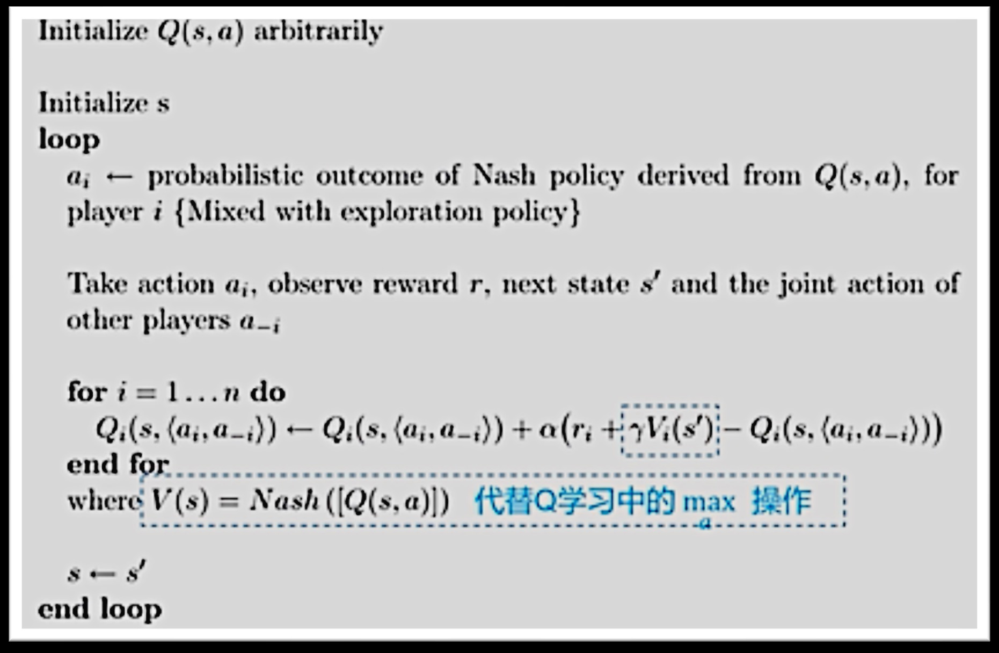

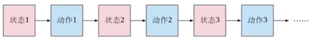

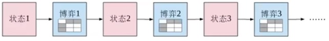

<!-- page: 99 -->

多智能体强化学习代表性方法与思路

完全去中⼼化⽅法

独⽴Q-Learning算法

Ø 每个智能体假设其他智能体策略是不变（未知）的，直接做Q学习

Ø 奖励不稳定问题、信⽤分配问题

99

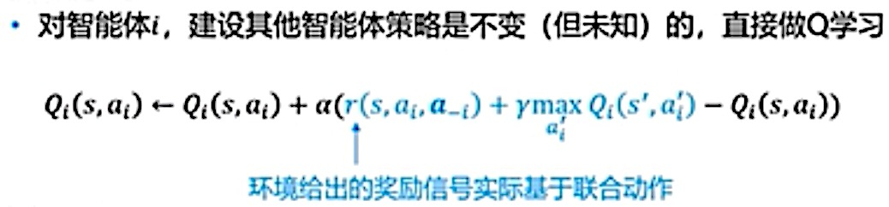

<!-- page: 100 -->

多智能体强化学习代表性方法与思路

中⼼化训练分散式执⾏

100

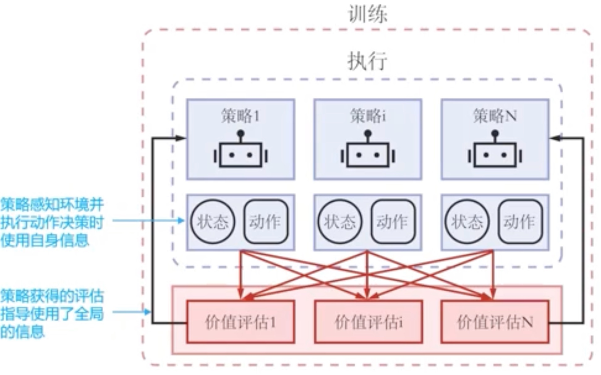

<!-- page: 101 -->

多智能体强化学习代表性方法与思路

中⼼化训练分散式执⾏

MADDPG（Multi-agent Deep Deterministic Policy Gradient）

101

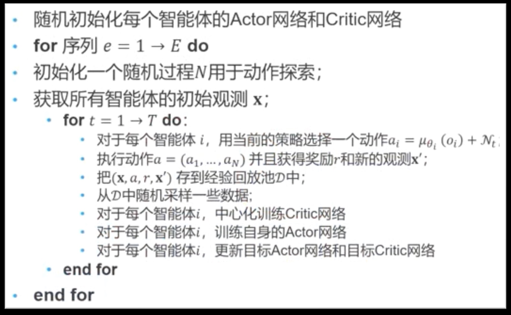

<!-- page: 102 -->

强化学习的实现环境与平台

OPENAI GYM

Ø OpenAI Gym: ⼀款⽤于研发和⽐较强化学习算法的⼯具包
Ø 主要⽀持 python

https://gym.openai.com/
⽂档:https://gym.openai.com/docs
代码:https://github.com/openai/gym

102

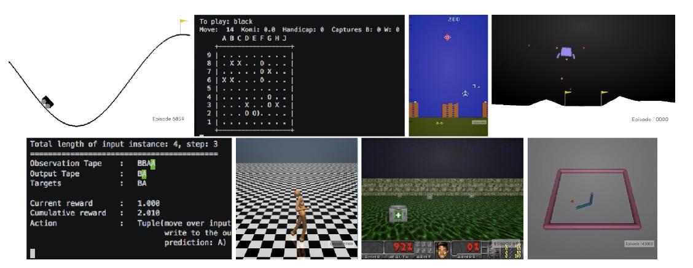

<!-- page: 103 -->

本 章 作 业

Ø 1、从本章提及的强化学习/多智能体强化学

习算法中，选择1种算法，编程实现，并分析
测试实验结果，并完成实验报告。

Outline

l 建议基于GYM平台来进行实现和应用
l 应用场景不限。

Ø 2、围绕下列两个问题，对该方向进行文献阅

读，形成文献阅读报告。同时课堂上将对这
两个问题开展讨论。

l 多智能体强化学习中，如何克服训练的训练效

率问题、不稳定性问题和信用分配问题？
l 大语言模型Agent是什么，为什么需要大语言

模型之间协作？

