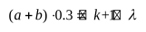

# 2022级大学物理（一）期末试卷答案及评分标准（B卷）

20230710

## 一、选择题

<!-- question: 2022-B-Q1-Q10 -->

ACBAC CBBDD

## 二、填空题

<!-- question: 2022-B-Q11 -->

11. 0

<!-- question: 2022-B-Q12 -->

12. 360 或 356

<!-- question: 2022-B-Q13 -->

13. 33

<!-- question: 2022-B-Q14 -->

14. 1.5

<!-- question: 2022-B-Q15 -->

15. $\int_p^\infty f(y)\,dy$ 或 $1-\int_0^{y_p} f(y)\,dy$

<!-- question: 2022-B-Q16 -->

16. 8310

<!-- question: 2022-B-Q17 -->

17. $\frac{A}{2}\cos\left(\frac{\pi}{2}t-\frac{\pi}{2}\right)$ 或 $x=\frac{A}{2}\cos\left(\frac{\pi}{2}t-\frac{\pi}{2}\right)$ 或 $\frac{A}{2}\cos\left(\frac{\pi}{2}t+\frac{3\pi}{2}\right)$

<!-- question: 2022-B-Q18 -->

18. 2A

<!-- question: 2022-B-Q19 -->

19. $2(n-1)e+\frac{\lambda}{2}$ 或 $2(n-1)e-\frac{\lambda}{2}$ 或 $(2n-2)e+\frac{\lambda}{2}$

<!-- question: 2022-B-Q20 -->

20. 60000 或 $6\times10^4$

## 三、计算题

<!-- question: 2022-B-Q21 -->

### 21题

各物体的受力情况如图所示．

由转动定律、牛顿第二定律及运动学方程，可列出以下联立方程：

$$
T_1R=J_1\beta_1=\frac{1}{2}M_1R^2\beta_1
$$

（2分）

$$
T_2r-T_1r=J_2\beta_2=\frac{1}{2}M_1r^2\beta_2
$$

（2分）

mg－T₂＝ma（1分）

a＝Rβ₁＝rβ₂（1分）

$$
v^2=2ah\quad\text{或}\quad v=\sqrt{2ah}
$$

（1分）

求解联立方程，得

$$
a=\frac{mg}{\frac{1}{2}(M_1+M_2)+m}=4\ \mathrm{m/s^2}
$$

$$
v=\sqrt{2ah}=2\ \mathrm{m/s}
$$

（1分）

T₂＝m(g－a)＝60 N（1分）

$$
T_1=\frac{1}{2}M_1a=50\ \mathrm{N}
$$

（1分）

<!-- question: 2022-B-Q22 -->

### 22题

解：

1. A→B：$W_1=\frac{1}{2}(p_B+p_A)(V_B-V_A)=200\ \mathrm{J}$．（2分）
2. B→C 等体过程：Q₂＝ΔE₂＝νC_V(T_C－T_B)＝3(p_CV_C－p_BV_B)/2＝－600 J．（2分）
3. C→A 等压过程：W₃＝p_A(V_A－V_C)＝－100 J．（2分）
4. C→A 等压过程：$\Delta E_1=\nu C_V(T_A-T_C)=\frac{3}{2}(p_AV_A-p_CV_C)=-150\ \mathrm{J}$．（2分）
5. Q＝W＝W₁＋W₃＝100 J．（2分）

<!-- question: 2022-B-Q23 -->

### 23题

解：

1. $T=2\ \mathrm{s}$，则 $\omega=\frac{2\pi}{T}=\pi$（2分）

   根据旋转矢量法知 P 点的初相位为 $\pi$

   P 处振动方程为 $y_P=2\cos(\pi t+\pi)$（SI）（2分）

   或 $y_P=2\cos(\pi t-\pi)$

2. OP 相位差 $\Delta\varphi=\frac{2\pi}{\lambda}\cdot\Delta x=\frac{\pi}{2}$

   O 处质点的振动方程为 $y_O=2\cos\left(\pi t+\frac{3\pi}{2}\right)$（SI）（2分）

   或 $y_O=2\cos\left(\pi t-\frac{\pi}{2}\right)$

3. 选 O 点为参考点，则波动方程为

   $$
   y=2\cos\left(\pi t+\frac{3\pi}{2}-\frac{2\pi x}{\lambda}\right)=2\cos\left(\pi t-\pi x+\frac{3\pi}{2}\right)
   $$

   （4分）

   或

   $$
   y=2\cos\left(\pi t-\frac{\pi}{2}-\frac{2\pi x}{\lambda}\right)=2\cos\left(\pi t-\pi x-\frac{\pi}{2}\right)
   $$

<!-- question: 2022-B-Q24 -->

### 24题

解：

1. 由光栅衍射主极大公式 $(a+b)\sin\theta=k\lambda$

   $$
   (a+b)\cdot0.2=k\lambda
   $$

   

   得：$(a+b)=6000\ \mathrm{nm}$（2分）

2. 由缺级公式 $k=\frac{a+b}{a}k'$

   得，在第四级缺级下，$k'$ 取 1，$a$ 取最小值

   $$
   a_{\min}=\frac{a+b}{4}=1500\ \mathrm{nm}
   $$

3. $\sin\theta<1$，故 $k<\frac{a+b}{\lambda}=10$

   又因为第四、八级缺级，

   所以实际呈现 $k=0,\pm1,\pm2,\pm3,\pm5,\pm6,\pm7,\pm9$ 级明纹．
