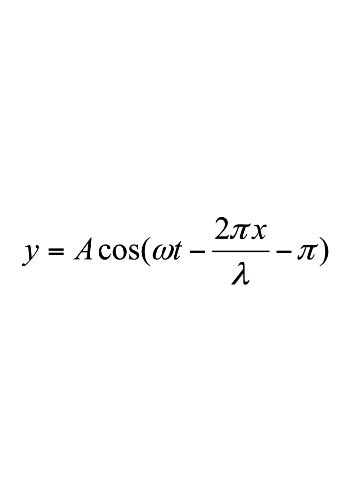
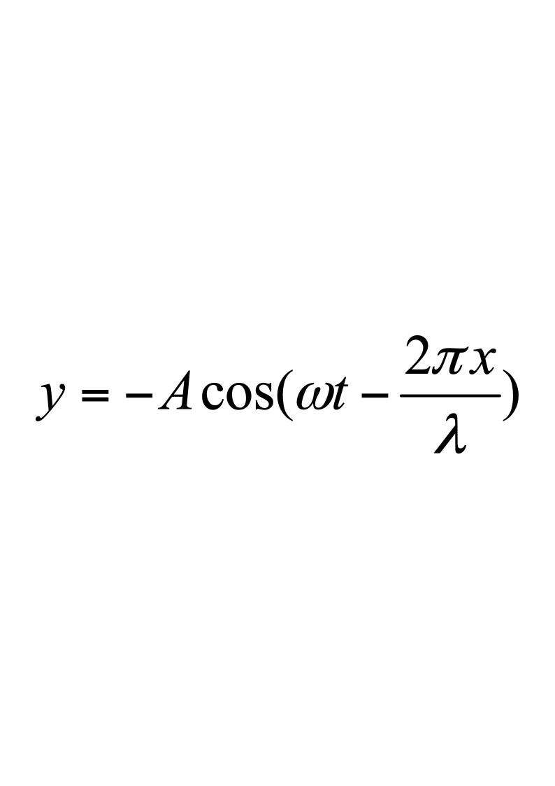
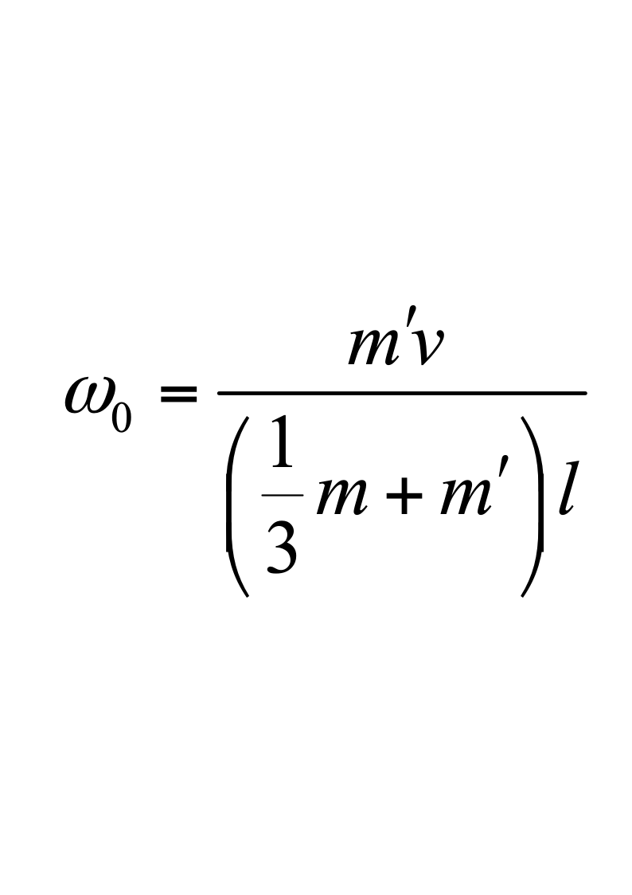
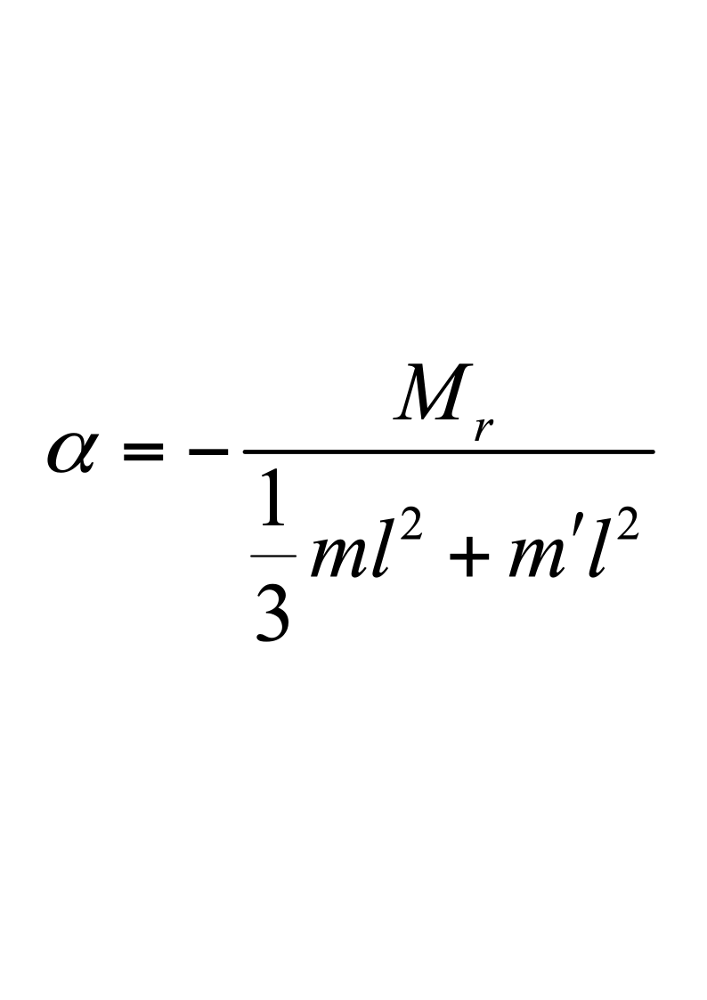
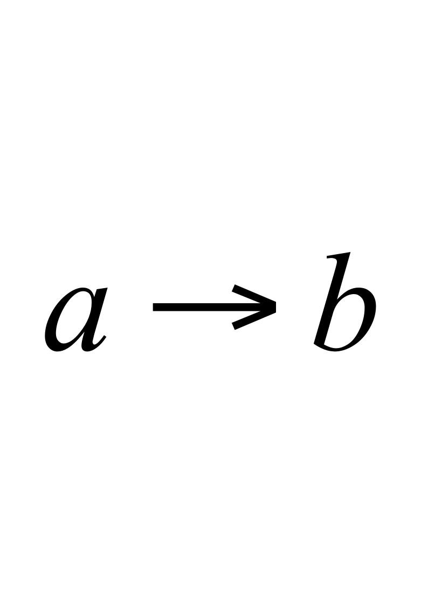
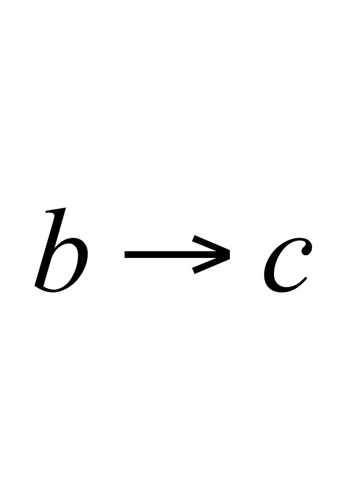
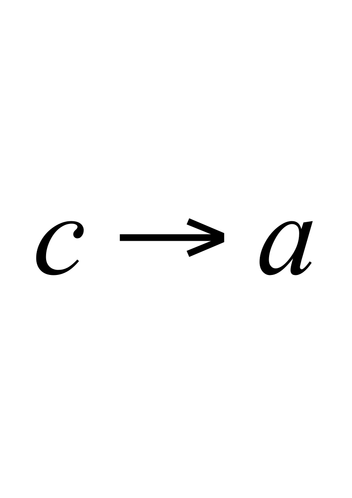
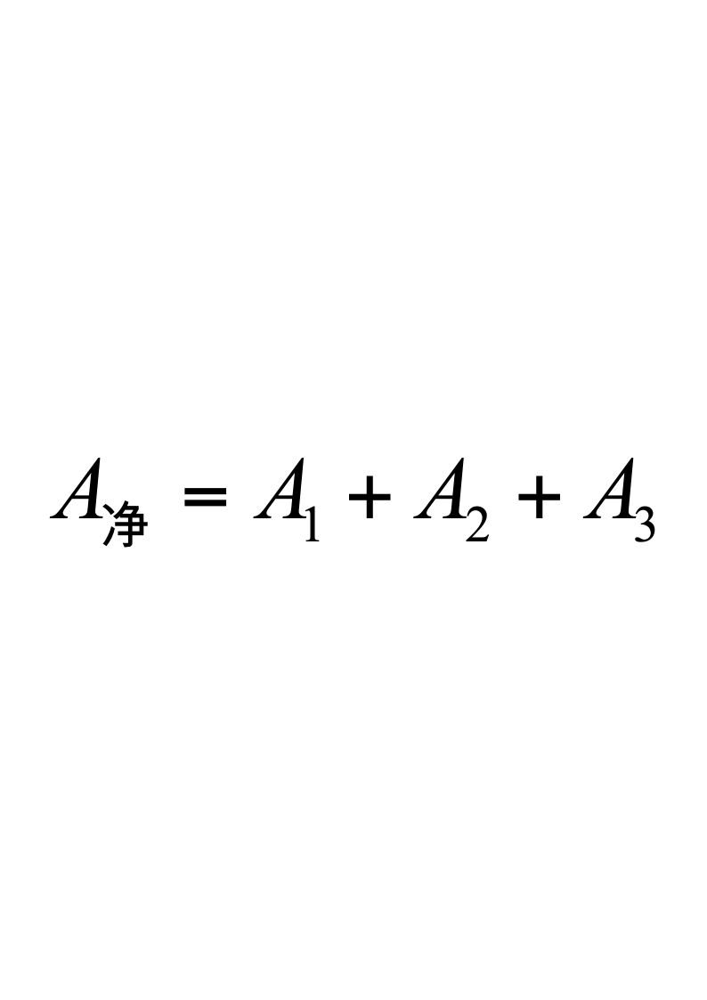
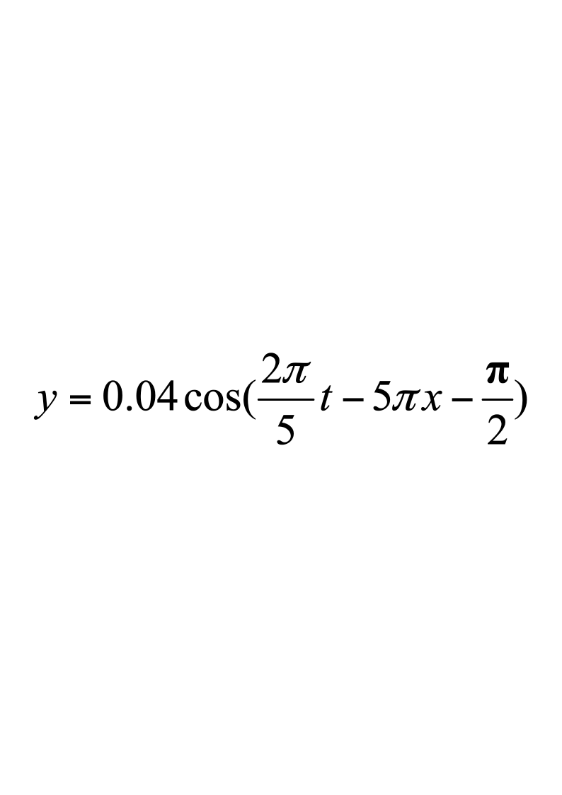

# 2012级大学物理（I）期末试卷解答（A卷）

**2012级大学物理（I）期末试卷A卷答案及评分标准**

考试日期：2013年7月8日

<!-- question: university-physics-3-1-004-Q1 -->

一、选择题(每题3分)

**D，B，C，A，D；A，C，B，A，B**

<!-- question: university-physics-3-1-004-Q2 -->

二、填空题(每题3分)

**11.**  **300**

**12.**  $2(F-\mu mg{)}^{2}k$

**13.**  **4        14.**  **$25\%$**

**15.**  **0.1      16.**  **0**

**17.**  或或

**18.** **$2\lambda$**   **1分**     **1.5   2分**

**19.  500      20.**  **$I_0/I_8$**

<!-- question: university-physics-3-1-004-Q3 -->

三、计算题(每题10分)

<!-- question: university-physics-3-1-004-Q4 -->

21．解：(1)  角动量守恒：

$m'vl=\left(\frac{1}{3}ml^{2}+m'l^{2}\right)\omega_{0}$                      2分                    ＝80  rad·s-1                                      2分

<!-- question: university-physics-3-1-004-Q5 -->

(2)解法一： 由转动定律得：

$-M_r=(\frac{1}{3}ml^2+m'l^2)\alpha$**                        2分

      为一恒量

故          $\alpha=\frac{d\omega}{dt}=\frac{d\omega}{d\theta}\cdot\frac{d\theta}{dt}=\omega\frac{d\omega}{d\theta}$

分离变量求积分得：      $alphatheta=0-\frac{1}{2}omega_0^2$        2分

∴                   $\theta=\frac{\left(\frac{1}{3}m+m'\right)l^2\omega_0^2}{2M_r}$＝10rad                        2分

解法二：由刚体转动动能定理得                        2分

$-M_{r}\theta=0-\frac{1}{2}\times(\frac{1}{3}ml^{2}+m'l^{2})\omega_0^2$        2分

$\theta=\frac{\left(\frac{1}{3}m+m'\right)l^2\omega_0^2}{2M_r}$＝10rad                        2分

22．解：设$c$状态的体积为$V_2$，则由于$a$、$c$两状态的温度相同，$p_1V_1=\frac{p_1}{4}V_2$

故      $V_{2}=4V_{1}$               2分

而在等体过程中功       $A_1=0$       2分

在等压过程中功

$A_2=\frac{p_1}{4}(V_2-V_1)=\frac{3}{4}p_1V_1$              2分

在等温过程中功

$A_3=p_1V_1\ln(\frac{V_1}{V_2})=-p_1V_1\ln4$                2分

∴                1分

$=(\frac{3}{4}-\ln4)p_1V_1=-0.636p_1V_1$           1分

23．解：(1)    $\lambda=0.40$m，$u=0.08$m/s，则$T=\frac{\lambda}{u}=5$s，$omega=\frac{2pi}{T}=\frac{2pi}{5}$     2分

根据旋转矢量法知$O$点的初相位为$\pi/2$      2分

*O*处振动方程为     $y_0=0.04\cos(\frac{2\pi}{5}t-\frac{\pi}{2})$  (SI)              2分

（2）波动表达式为         (SI)                    2分

<!-- question: university-physics-3-1-004-Q6 -->

(3)    $p$处质点的振动方程为

$y_{P}=0.04\cos(\frac{2\pi}{5}t-5\pi\times0.2-\frac{\pi}{2})$$=0.04\cos(\frac{2\pi}{5}t-\frac{3\pi}{2})$ (SI)         2分

24．解：(1)  由光栅衍射主极大公式      $(a+b)\sin\theta=k\lambda$          1分

得：$(a+b)=\frac{2\lambda}{\sin30^{0}}=2400nm$         2分

<!-- question: university-physics-3-1-004-Q7 -->

(2)  由缺级公式    $k=\frac{a+b}{a}k'$     1分

得，在第三级缺级下，$k'$取1，$a$取最小值

$a_{\min}=\frac{a+b}{3}=800\text{nm}$       2分

<!-- question: university-physics-3-1-004-Q8 -->

(3)  $sintheta<1$，故$k<\frac{a+b}{\lambda}=4$     1分

又因为第三级缺级,     1分

所以实际呈现$k=$0，±1，±2级明纹．  						2分
