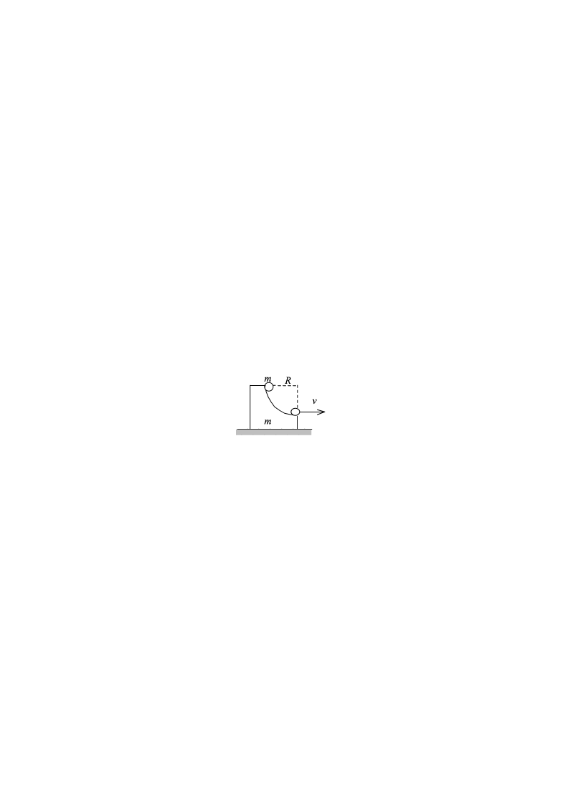
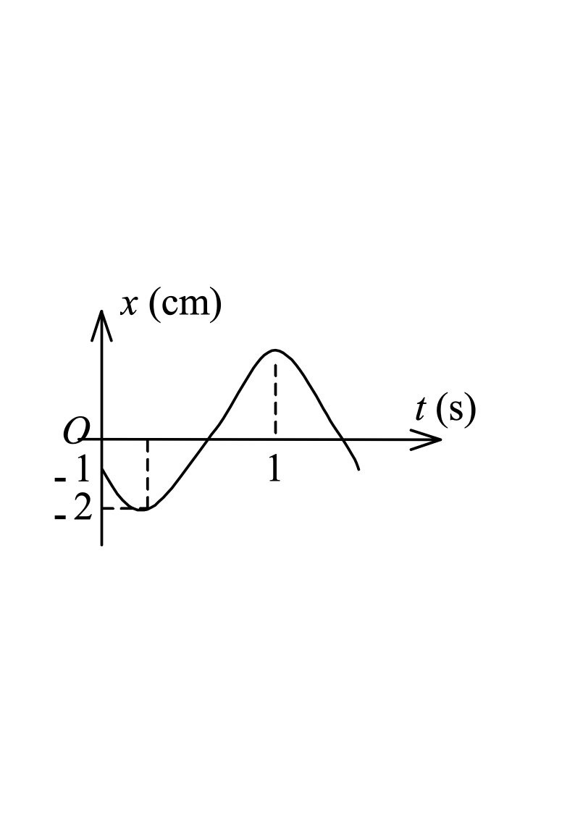
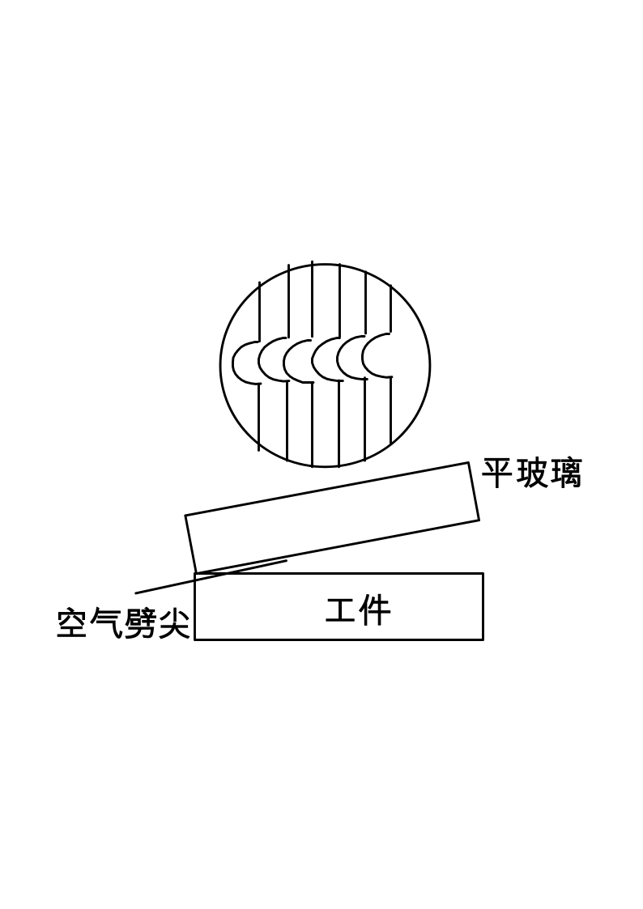
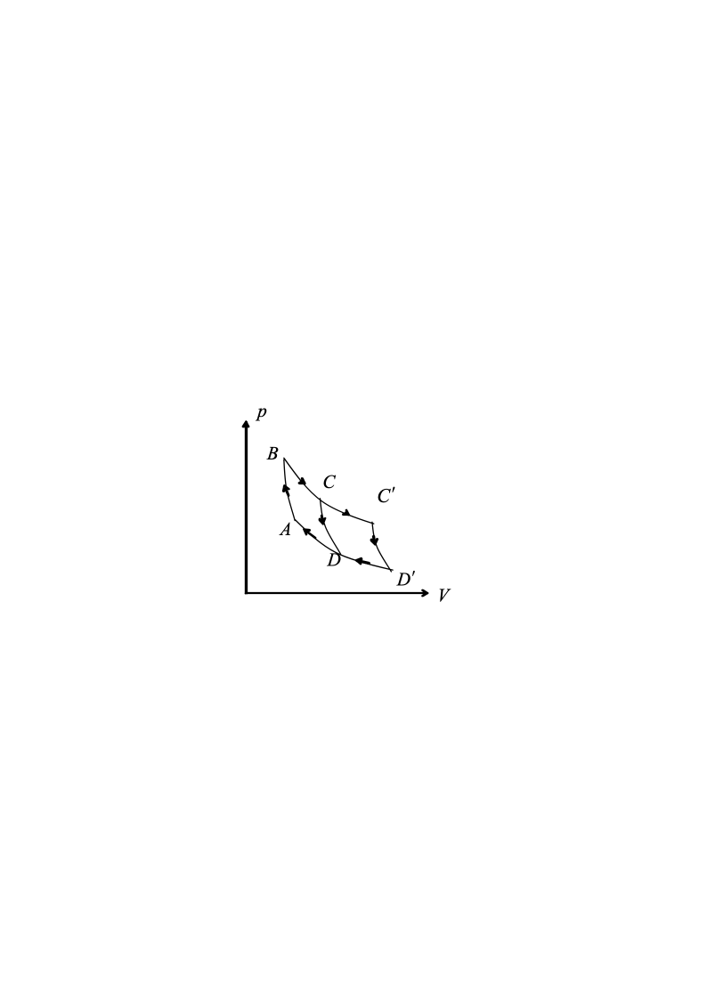
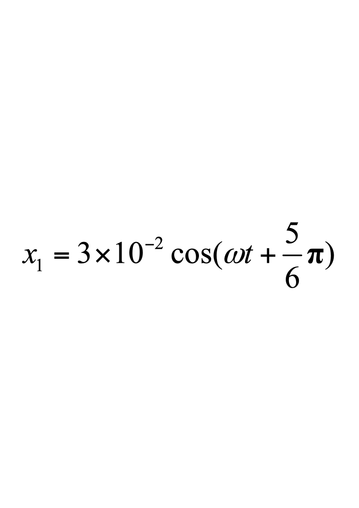
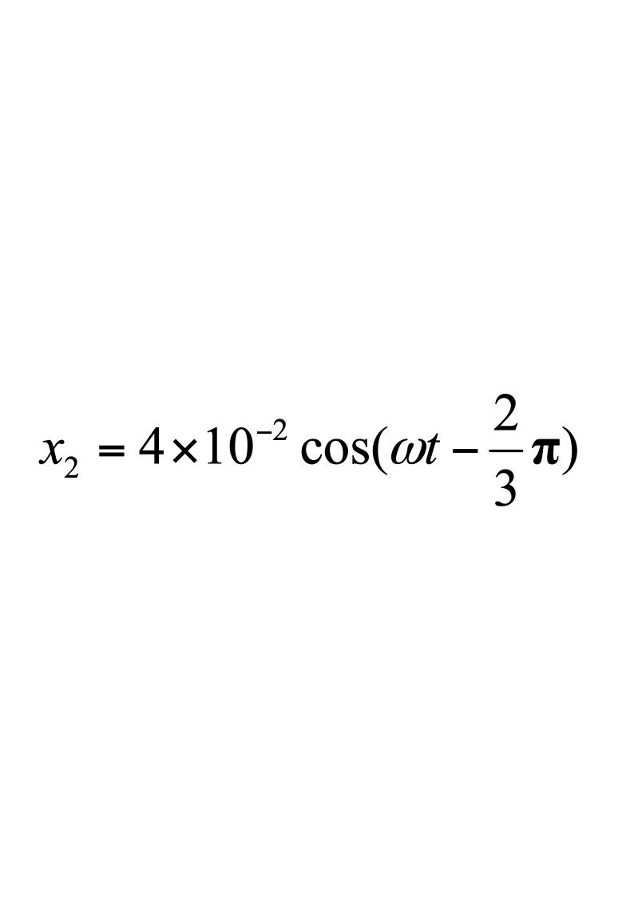
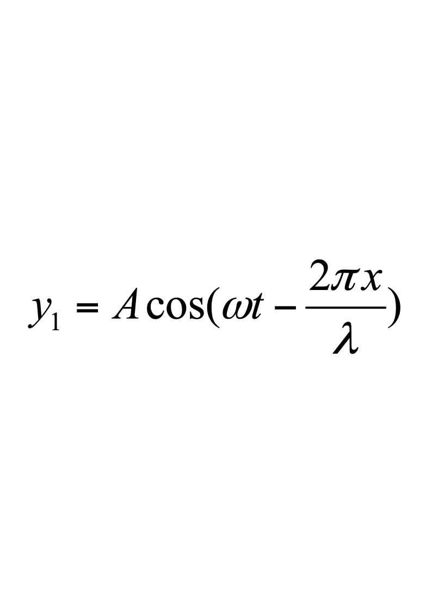

# 2013级大学物理（I）A卷试卷规范模版（4学分）

**诚信应考,考试作弊将带来严重后果！**

**华南理工大学期末考试**

**《2013级大学物理（I）期末试卷A卷》试卷（4学分）**

**注意事项：1.** **考前请将密封线内各项信息填写清楚；**

**2.** **所有答案请直接答在答题纸上；**

**3．考试形式：闭卷；**

**4.** **本试卷共24题，满分100分，**	**考试时间120分钟。**

**考试时间：2014年7月2日9：00-----11：00**

<!-- question: university-physics-3-1-005-Q1 -->

一、选择题（共30分）

1．（本题3分）

一物体质量为$10kg$。受到方向不变的力$F=3+4t(SI)$的作用，在开始的2s内，此力的冲量大小等于［    ］

A、12     B、13    C、14    D、15

2．（本题3分）

一质量为$m$的滑块，由静止开始沿着1/4圆弧形光滑的木槽滑下．设木槽的质量也是$m$．槽的圆半径为$R$，放在光滑水平地面上，如图所示．则滑块离开槽时的速度是［    ］

A、$\sqrt {Rg}$     B、$2\sqrt {Rg}$    C、$\sqrt {2Rg}$    D、$\frac {1} {2}\sqrt {Rg}$   E、$\frac {1} {2}\sqrt {2Rg}$

3．（本题3分）

已知某简谐振动的振动曲线如图所示，位移的单位为厘米，时间单位为秒．则此简谐振动的振动方程为：

A、$x=2cos(\frac {2} {3}\pi t+\frac {2} {3}\pi )$      B、$x=2cos(\frac {2} {3}\pi t-\frac {2} {3}\pi )$

C、$x=2cos(\frac {4} {3}\pi t+\frac {2} {3}\pi )$      D、$x=2cos(\frac {4} {3}\pi t-\frac {2} {3}\pi )$

4．（本题3分）

一辆汽车以25 m/s的速度远离一辆静止的正在鸣笛的机车．机车汽笛的频率为600 Hz，汽车中的乘客听到机车鸣笛声音的频率是（已知空气中的声速为330 m/s）［    ］

A、545Hz     B、555Hz      C、550Hz     D、645 Hz

5．（本题3分）

在双缝干涉实验中，入射光的波长为$\lambda$，用玻璃纸遮住双缝中的一个缝，若玻璃纸中光程比相同厚度的空气的光程大$2.5\lambda$，则屏上原来的明纹处［    ］

A、仍为明条纹            B、变为暗条纹

C、既非明纹也非暗纹              D、无法确定是明纹，还是暗纹

6．（本题3分）

用劈尖干涉法可检测工件表面缺陷，当波长为$\lambda$的单色平行光垂直入射时，若观察到的干涉条纹如图所示，每一条纹弯曲部分的顶点恰好与其左边条纹的直线部分的连线相切，则工件表面与条纹弯曲处对应的部分［    ］

A、凸起，且高度为$\lambda /4$      B、凸起，且高度为$\lambda /2$

C、凹陷，且深度为$\lambda /2$      D、凹陷，且深度为$\lambda /4$

7．（本题3分）

在单缝夫琅禾费衍射实验中波长为$\lambda$的单色光垂直入射到单缝上．对应于衍射角为$30^{\circ}$的方向上，若单缝处波面可分成 3个半波带，则缝宽度$b$等于［    ］

A、$\lambda$    B、$1.5\lambda$    C、$2\lambda$    D、$3\lambda$

8．（本题3分）

1mol单原子分子理想气体，在恒定压强下经一准静态过程从300K加热到400K，则气体的熵变为［    ］．   （普适气体常量 *R*  = 8.31 J·mol1·K1）

A、5.98  J·K1      B、6.15  J·K1          C、6.47  J·K1        D、7.26  J·K1

9．（本题3分）

一定量的理想气体贮于某一容器中，温度为$T$，气体分子的质量为$m$．根据理想气体的分子模型和统计假设，分子速度在$x$方向的分量平方的平均值［    ］

A、$\overline {{v}_{x}^{2}}=kT/m$     B、$\overline {{v}_{x}^{2}}=\frac {1} {3}\sqrt {\frac {3kT} {m}}$     C、$\overline {{v}_{x}^{2}}=\sqrt {\frac {3kT} {m}}$     D、$\overline {{v}_{x}^{2}}=3kT/m$

10．（本题3分）

如图表示的两个卡诺循环，第一个沿$ABCDA$进行，第二个沿${AB \{ C}^{'}{D}^{'}A$进行，这两个循环的效率${\eta }_{1}$和${\eta }_{2}$的关系及这两个循环所做的净功${W}_{1}{和W}_{2}$的关系是［    ］

A、${\eta }_{1}={\eta }_{2},{W}_{1}={W}_{2}$      B、${\eta }_{1}>{\eta }_{2},{W}_{1}={W}_{2}$

C、${\eta }_{1}={\eta }_{2},{W}_{1}>{W}_{2}$      D、${\eta }_{1}={\eta }_{2},{W}_{1}<{W}_{2}$

<!-- question: university-physics-3-1-005-Q2 -->

二、填空题（**共**30分）

11．（本题3分）

质点沿半径为$R$的圆周运动，运动学方程为 $\theta =3+2{t}^{2}$  (SI) ，则$t$时刻质点的切向加速度大小为$a_\tau$=  ________；法向加速度大小为${a}_{n}$=  ________；角加速度$\beta$=  ________．

12．（本题3分）

质量为0.25 kg的质点，受力$F=ti$ (SI)的作用，式中$t$为时间．$t=0$时该质点以$v=2j$ (SI)的速度通过坐标原点，则该质点任意时刻的位置矢量是________．

13．（本题3分）

一沿$x$轴正方向的力作用在一质量为0.5 kg的质点上，已知质点的运动学方程为$x=t^3$，则力在最初2秒内做的功＝________焦耳．

14．（本题3分）

$\frac{1}{2}v$如图所示，一静止的均匀细棒，长为$L$、质量为$m$，可绕通过棒的端点且垂直于棒长的光滑固定轴$O$在水平面内转动，转动惯量为$\frac{1}{3}mL^{2}$．一质量为$m$、速率为$\upsilon$的子弹在水平面内沿与棒垂直的方向射出并穿出棒的自由端，设穿过棒后子弹的速率为$\frac {1} {2}v$，则此时棒的角速度＝________

15．（本题3分）

两个同方向同频率的简谐运动

 ,          (SI)

它们的合振幅是________  (SI)．

16．（本题3分）

设入射波的表达式为  ．波在距原点$x_0=\frac{3\lambda}{8}$处发生反射，反射点为固定端，则形成的反射波表达式为________．

17．（本题3分）

一束波长为$\lambda =600nm$$(1nm={10}^{-9}m)$的平行单色光垂直入射到折射率为$n=1.33$的透明薄膜上，该薄膜是放在空气中的．要使反射光得到最大限度的加强，薄膜最小厚度应为________nm．

18．（本题3分）

一束自然光从空气投射到玻璃表面上(空气折射率为1)，当折射角为$30^{\circ}$时，反射光是完全偏振光，则此玻璃板的折射率等于________．

19．（本题3分）

$3\times10^{-2}kg$的气体放在容积为$3\times10^{-2}m^{3}$的容器中，容器内气体的压强为$0.2\times10^{5}Pa$。则气体分子的最概然速率等于________$m\cdots^{-1}$

20．（本题3分）

有容积不同的A、B两个容器，A中装有氦气，B中装有氧气，若两种气体的压强相同，那么，这两种气体的单位体积的内能$\left(\frac{U}{V}\right)_A$________$\left(\frac{U}{V}\right)_B$（填）

<!-- question: university-physics-3-1-005-Q3 -->

三、计算题（共40分）

21．（本题10分）

$m,rm'mm'$    两个大小不同、具有水平光滑轴的定滑轮，顶点在同一水平线上．小滑轮的质量为$m$，半径为$r$，对轴的转动惯量$J=\frac {1} {2}{mr}^{2}$．大滑轮的质量${m}^{'}=2m$，半径${r}^{'}=2r$，对轴的转动惯量${J}^{'}=\frac {1} {2}{m}^{'}{r}^{}$．一根不可伸长的轻质细绳跨过这两个定滑轮，绳的两端分别挂着物体A和B．A的质量为$m$，B的质量${m}^{'}=2m$．这一系统由静止开始转动．已知$m=6.0 kg$，$r=5.0 cm$    求两滑轮的角加速度和它们之间绳中的张力．

22．（本题10分）

将压强$p_1=1.013\times10^5Pa$，体积$V_{1}=1\times10^{-3}m^{3}$的氧气，自$T_1=$300K加热到$T_2=$400K，问：

（1）当压强不变时，需要多少热量?

(2)		当体积不变时，需要多少热量?

(3)  在等压和等体过程中各做多少功？

(普适气体常量$R=8.31J/(mol⋅K)$

23．（本题10分）

沿*x*轴负方向传播的平面简谐波在*t*  = 2 s时刻的波形曲线如图所示，设波速*u*  =  0.5 m/s． 求：

（1）波的角频率；

（2）原点*O*的振动方程；

（3）该波的波动方程。

24．（本题10分）

一束平行光垂直入射到某个光栅上，该光束有两种波长的光，${\lambda }_{1}=440nm$，${\lambda }_{2}=660nm$$(1nm={10}^{-9}m)$．实验发现，两种波长的谱线(不计中央明纹)第二次重合于衍射角$\phi =60^{\circ}$的方向上．求此光栅的光栅常数$d$．
