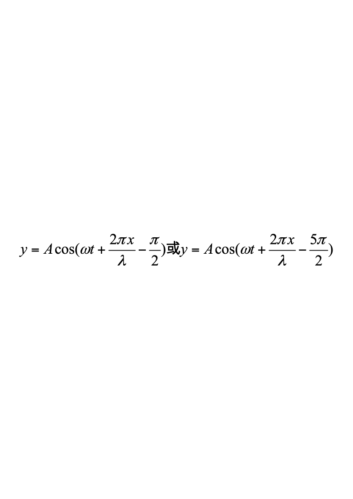
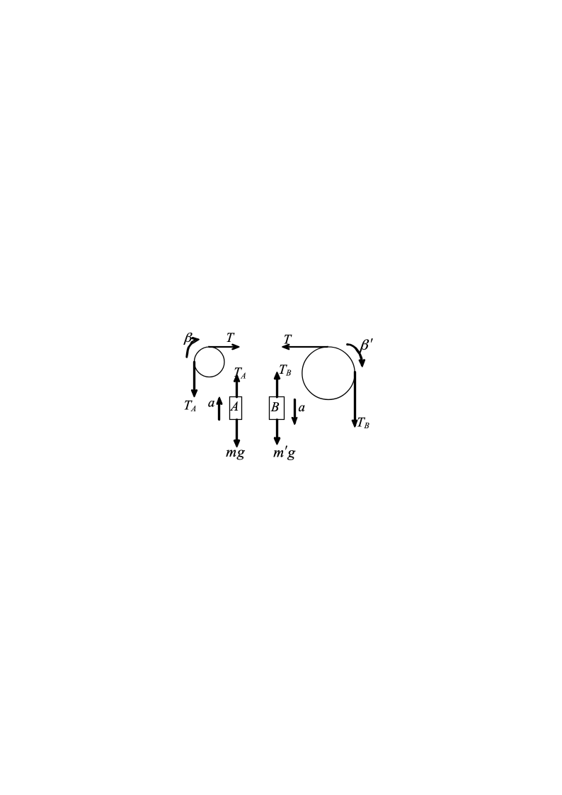
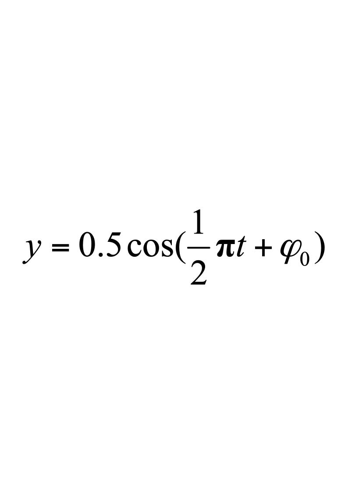
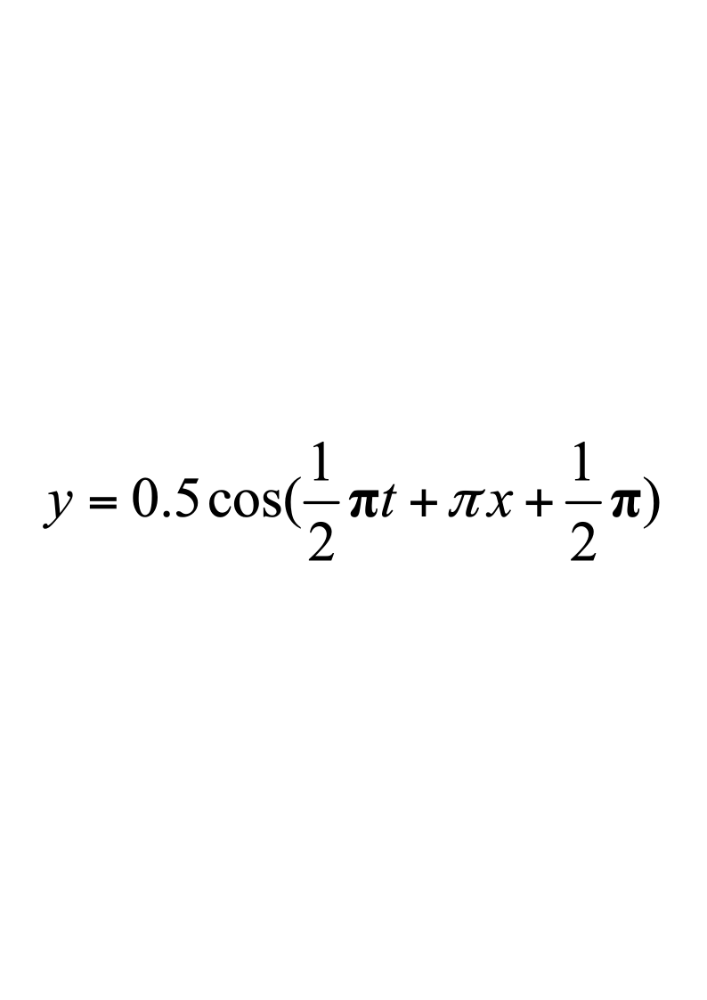

# 2013级大学物理（I）期末试卷解答（A卷）

**2013级大学物理（I）期末试卷A卷答案及评分标准**

考试日期：2013年7月2日

<!-- question: university-physics-3-1-006-Q1 -->

一、选择题(每题3分)

**C，A，C，B，B；C，D，A，A，D**

<!-- question: university-physics-3-1-006-Q2 -->

二、填空题(每题3分)

**11.**  **$4R$;**   **$16Rt^{2}$;**   4              每空1分

**12.**  **$\frac{2}{3}t^3i+2tj$**

**13.**  **36        14.**  **$\frac{3v}{2L}$**

**15.**  **$5\times10^{-2}$**

**16.**  

**17.**  **112.78或112.8**

**18.** **$\sqrt{3}$或1.732**

**19.  200      20.  <**

<!-- question: university-physics-3-1-006-Q3 -->

三、计算题(每题10分)

21．解：各物体受力情况如图．                                  

${T}_{A}-mg=ma$    1分

$(2m)g-T_B=(2m)a$      1分

或$m'g-T_B=m'a$

$(T-{T}_{A})r=\frac {1} {2}{mr}^{2}\beta$       2分

$({T}_{B}-T)(2r)=\frac {1} {2}(2m)(2r{)}^{2}{\beta }^{'}$       2分

或$(T_B-T)r'=\frac{1}{2}m'(r')^2\beta'$

$a=r\beta =(2r){\beta }^{'}$       1分

或$a=r\beta=r'\beta'$

由上述方程组解得：    $\beta =2g/(9r)=43.6 {rad/s}^{2}$                 1分

${\beta }^{'}=0.5\beta =21.8 {rad/s}^{2}$                   1分

$T=(4/3)mg=78.4 N$                   1分

<!-- question: university-physics-3-1-006-Q4 -->

22．解：（1）当压强不变时，系统所吸热为

$Q_p=\frac{m_0}{M}(\frac{i+2}{2})R(T_2-T_1)$       1分

$=(\frac{i+2}{2})\frac{p_1V_1}{T_1}(T_2-T_1)$$=1.18\times10^{2}(J)$      2分

<!-- question: university-physics-3-1-006-Q5 -->

（2）体积不变时，系统所吸热为

$Q_p=\frac{m_0}{M}\frac{i}{2}R(T_2-T_1)$       1分

$=\frac{i}{2}\frac{p_1V_1}{T_1}(T_2-T_1)$$=0.84\times10^{2}(J)$       2分

<!-- question: university-physics-3-1-006-Q6 -->

（3）在等压过程中所做功为

$A_p=\frac{m_0}{M}R(T_2-T_1)$          1分

$=\frac{p_1V_1}{T_1}(T_2-T_1)$$=0.34\times10^{2}(J)$    2分

在等体过程中，气体体积不变，故所做的功为零。      1分

<!-- question: university-physics-3-1-006-Q7 -->

23．解：（1）由图，** = 2 m，  又  ∵*u*  = 0.5 m/s，

故T = 4 s．            $\omega=\frac{1}{2}\pi$       2分

（2）设原点*O*的振动方程为

由题图知：$\frac{1}{2}\pi\times2+\varphi_0=\frac{3}{2}\pi\Rightarrow\varphi_0=\frac{1}{2}\pi$       4分（或采用波形平移法得到$\varphi_0=\frac{1}{2}\pi$）

∴     $y=0.5cos(\frac {1} {2}\pi t+\frac {1} {2}\pi )$  (SI)                  2分

（3）     2分

<!-- question: university-physics-3-1-006-Q8 -->

24．解：光栅方程       $d\sin\varphi=k\lambda$      2分

$dsin{\phi }_{1}={k}_{1}{\lambda }_{1}$

$dsin{\phi }_{2}={k}_{2}{\lambda }_{2}$

$\frac {sin{\phi }_{1}} {sin{\phi }_{2}}=\frac {{k}_{1}{\lambda }_{1}} {{k}_{2}{\lambda }_{2}}=\frac {{k}_{1}\times 440} {{k}_{2}\times 660}=\frac {2{k}_{1}} {3{k}_{2}}$         2分

当两谱线重合时有  ${\phi }_{1}={\phi }_{2}$

即       $\frac {{k}_{1}} {{k}_{2}}=\frac {3} {2}=\frac {6} {4}=\frac {9} {6}=\cdots$        2分

两谱线第二次重合即是

$\frac {{k}_{1}} {{k}_{2}}=\frac {6} {4}$，       ${k}_{1}=6$，${k}_{2}=4$            2分

由光栅公式可知$dsin60^{\circ} =6{\lambda }_{1}$

$d=\frac{6\lambda_1}{\sin60^\circ}=3.05\times10^{-6}m=3050nm$          2分
