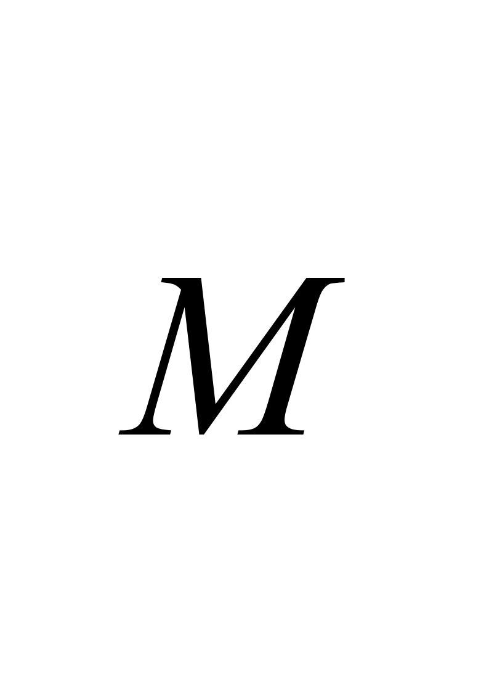
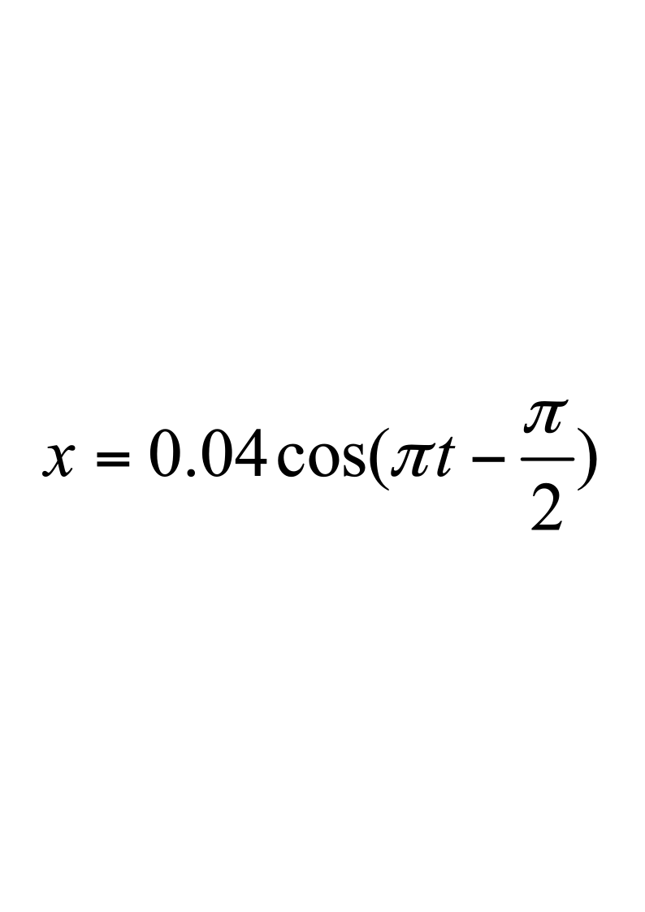
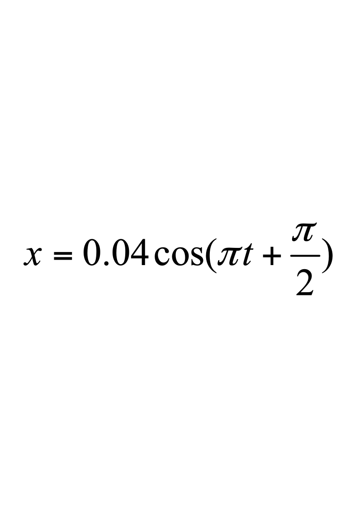
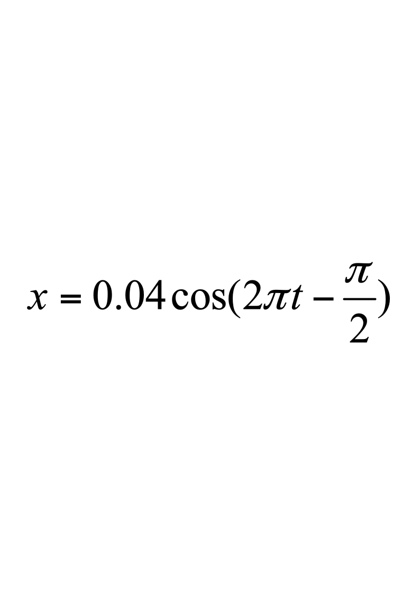
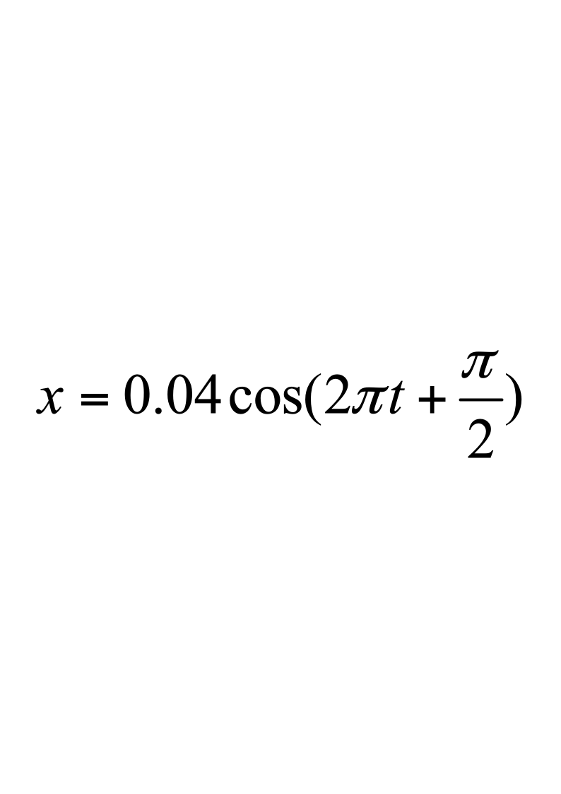
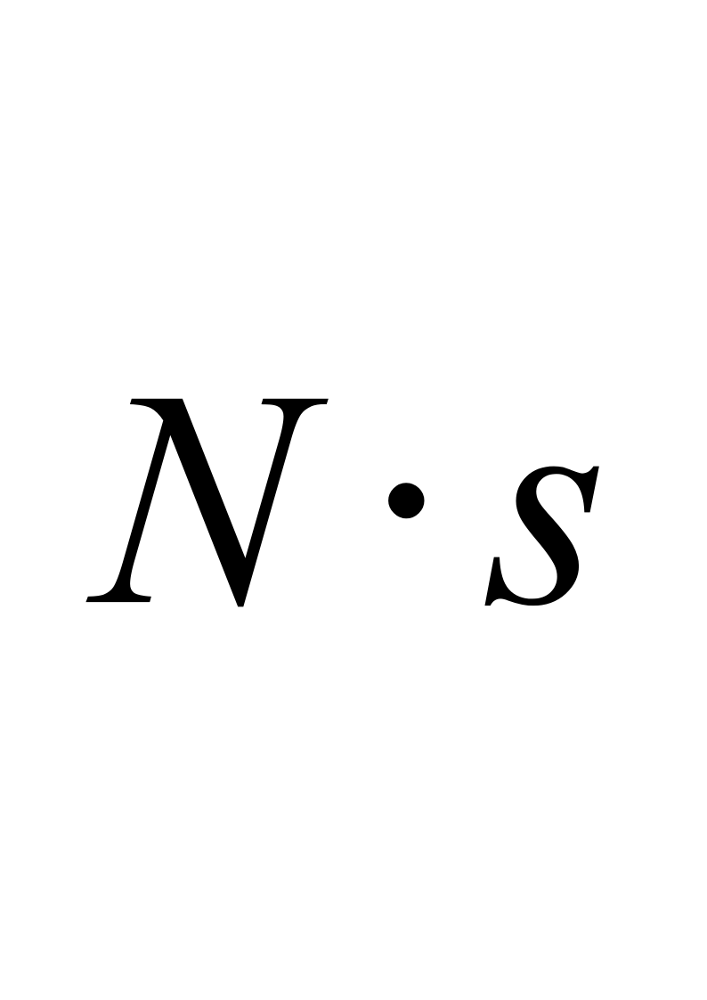
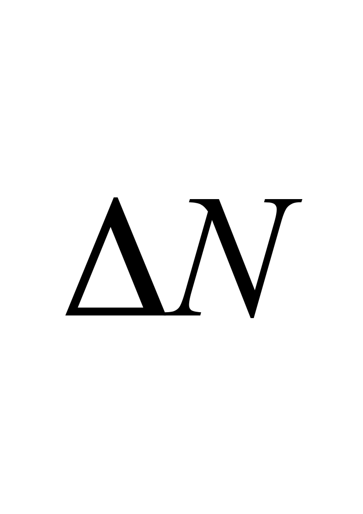
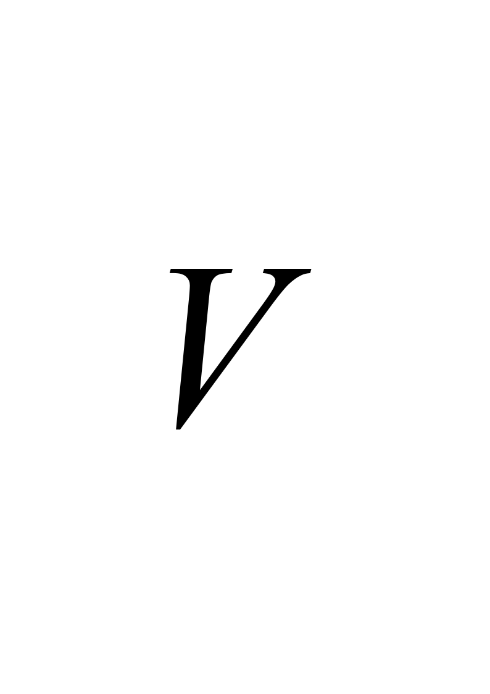
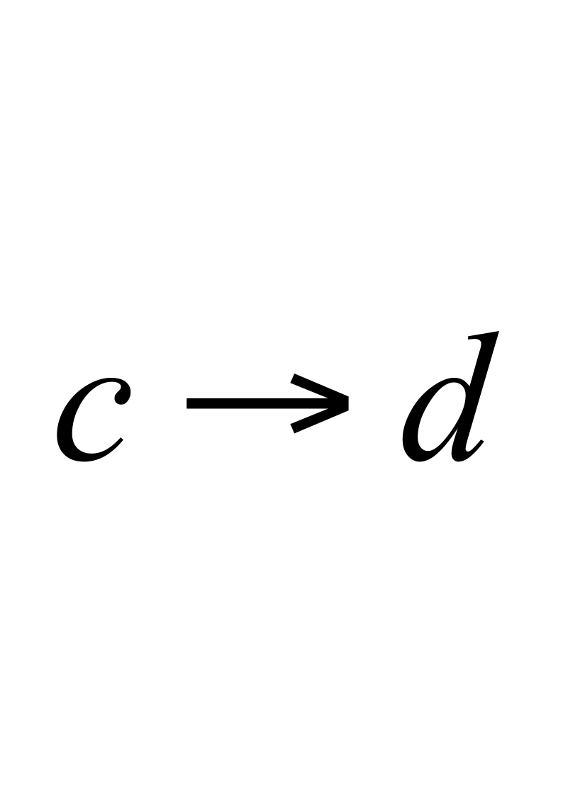
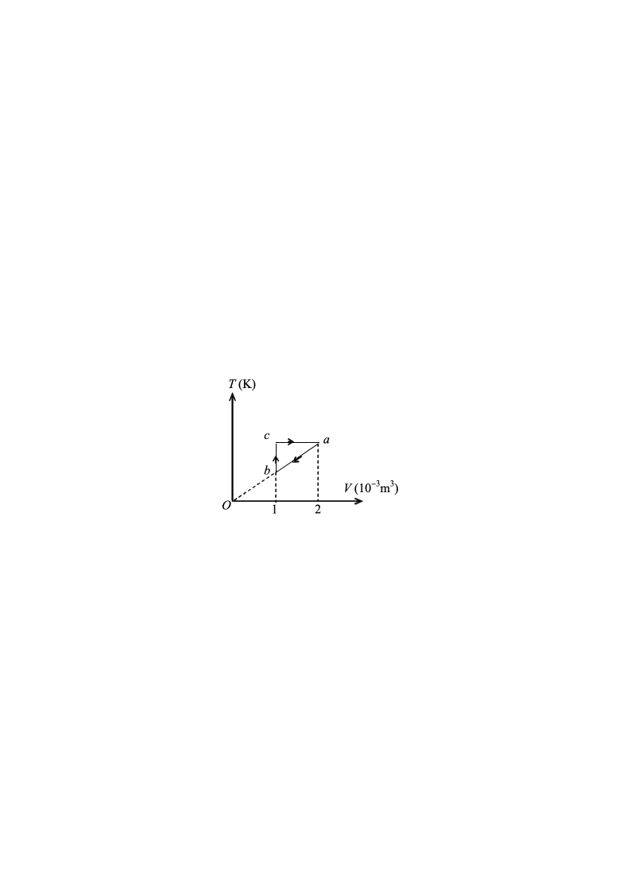

# 2020级大学物理III（一）期末考试试卷B卷（4学分）

**诚信应考，考试作弊将带来严重后果！**

**华南理工大学本科生期末考试**

**2020-2021-2学期2020级《大学物理III（一）》B卷**

**注意事项：1.** **开考前请将密封线内各项信息填写清楚；**

**2.** **所有答案请直接答在答题纸上；**

**3．考试形式：闭卷；**

**4.** **本试卷共24大题，满分100分，**	**考试时间120分钟**。

**考试时间：2021年7月5日9：00-----11：00**

<!-- question: university-physics-3-1-007-Q1 -->

一、选择题（共30分）

<!-- question: university-physics-3-1-007-Q2 -->

1．（本题3分）

一质点沿*x*方向运动，其加速度*a*  = 3+2  *t*  (SI) ，如果初始时质点的速度*v* 0为5 m/s，则当$t$为3s时，质点的速度*v* 为

(A)  23  m/s          (B)  27m/s              (C)   32m/s          (D)   38  m/s          ［      ］

<!-- question: university-physics-3-1-007-Q3 -->

2．（本题3分）

竖立的圆筒形转笼，半径为*R*，绕中心轴*OO*＇转动，物块*A*紧靠在圆筒的内壁上，物块与圆筒间的摩擦系数为*μ*，要使物块*A*不下落，圆筒转动的角速度*ω*至少应为

(A)  $\sqrt {\frac {\mu g} {R}}$    (B)$\sqrt {\mu g}$ (C) $\sqrt {\frac {g} {R}}$    (D)  $\sqrt {\frac {g} {\mu R}}$    ［      ］

<!-- question: university-physics-3-1-007-Q4 -->

3．（本题3分）

质量为*$m$*的一艘宇宙飞船关闭发动机返回地球时，可认为该飞船只在地球的引力场中运动．已知地球质量为**，万有引力恒量为**，则当它从距地球中心*R*1处下降到*R*2处时，飞船增加的动能应等于

(A)  $GMm\frac {{R}_{1}-{R}_{2}} {{R}_{1}^{2}{R}_{2}^{2}}$								(B)  $GMm\frac{R_1+R_2}{R_1R_2}$

(C)  $GMm\frac {{R}_{1}-{R}_{2}} {{R}_{1}{R}_{2}}$		        (D)  $GMm\frac{R_1^2-R_2^2}{R_1^2R_2^2}$   ［      ］

<!-- question: university-physics-3-1-007-Q5 -->

4．（本题3分）

在标准状态下，若氧气(视为刚性双原子分子的理想气体)和氦气的体积比*V*1  /  *V*2=1 /  3 ，则其内能之比*U*1 / *U*2为

(A)  3 / 10．                   (B) 5 /  9．

(C) 5 / 6．                    (D) 1 /  3．             ［      ］

<!-- question: university-physics-3-1-007-Q6 -->

5．（本题3分）

一辆机车以30 m/s的速度驶近一位静止的观察者，如果机车的汽笛的频率为550 Hz，此观察者听到的声音频率是（空气中声速为330 m/s）

(A)  600  Hz．           (B)  605  Hz．

(C)    504 Hz．           (D)    500 Hz．                   ［      ］

<!-- question: university-physics-3-1-007-Q7 -->

6．（本题3分）

图中所示为两个简谐振动的振动曲线．若以余弦函数表示这两个振动的合成结果，则合振动的方程为

(A)    ．

(B)    ．

(C)  ．

(D)    ．                     ［      ］

<!-- question: university-physics-3-1-007-Q8 -->

7．（本题3分）

在玻璃(折射率*n*3＝1.60)表面镀一层MgF2  (折射率*n*2＝1.38)薄膜作为增透膜．为了使波长为550 nm(1nm=109m)的光从空气(*n*1＝1.00)正入射时尽可能少反射，MgF2薄膜的最小厚度是

(A)  85.9  nm    (B)  90.6nm  (C)    99.6  nm  (D)    105.7  nm

［      ］

<!-- question: university-physics-3-1-007-Q9 -->

8．（本题3分）

波长**500 nm(1 nm=109 m)的单色光垂直照射到宽度*a***0.25 mm的单缝上，单缝后面放置一凸透镜，在凸透镜的焦平面上放置一屏幕，用以观测衍射条纹．今测得屏幕上中央明条纹一侧第三个暗条纹和另一侧第三个暗条纹之间的距离为*d***12 mm，则凸透镜的焦距*f*为（设衍射角很小）

(A) 1  m．     (B)  2  m．     (C) 0.2  m．     (D)  0.5  m．    ［      ］

<!-- question: university-physics-3-1-007-Q10 -->

9．（本题3分）

用劈尖干涉法可检测工件表面缺陷，当波长为**的单色平行光垂直入射时，若观察到的干涉条纹如图所示，每一条纹弯曲部分的顶点恰好与其左边条纹的直线部分的连线相切，则工件表面与条纹弯曲处对应的部分
- 凸起，且高度为** / 4．
- 凸起，且高度为** / 2．
- 凹陷，且深度为** /  4．

(D)    凹陷，且深度为** /  2．               ［      ］

<!-- question: university-physics-3-1-007-Q11 -->

10．（本题3分）

一束自然光垂直穿过两个偏振片，两个偏振片的偏振化方向间的夹角为45°．已知通过此两偏振片后的光强为*I*，则入射自然光的强度为

(A)  $21$．     (B)  $2\sqrt{21}$．     (C)  $\sqrt{21}$．     (D)  $41$．    ［      ］

<!-- question: university-physics-3-1-007-Q12 -->

二、填空题（**共**30分）

<!-- question: university-physics-3-1-007-Q13 -->

11．（本题3分）

质点沿半径为$R$的圆周运动，运动学方程为 $\theta =3+2{t}^{2}$  (SI) ，则$t$时刻质点的法向加速度大小为${a}_{n}$=  _____________．

<!-- question: university-physics-3-1-007-Q14 -->

12．（本题3分）

设作用在质量为1 kg的物体上的力*F*＝6*t*＋3（SI）．如果物体在这一力的作用下，由静止开始沿直线运动，在0到3  s的时间间隔内，这个力作用在物体上的冲量大小***Ｉ***＝__________．

<!-- question: university-physics-3-1-007-Q15 -->

13．（本题3分）

如图所示，滑块*A*、重物*B*和滑轮*C*的质量分别为2*m*、*m*和2*m*，滑轮的半径为*R*，滑轮对轴的转动惯量*J*＝$\frac {1} {2}$*m**C* *R*2（注：$m_C=2m$）**.**滑块*A*与桌面间、滑轮与轴承之间均无摩擦，绳的质量可不计，绳与滑轮之间无相对滑动．以$g$表示重力加速度，则滑块*A*的加速度*a*＝______________．

<!-- question: university-physics-3-1-007-Q16 -->

14．（本题3分）

用总分子数*N*、气体分子速率*v*和速率分布函数*f*(*v*)    表示速率大于*v* 0的分子数

＝____________________．

<!-- question: university-physics-3-1-007-Q17 -->

15．（本题3分）

体积为、压强为$p$的气体分子的平动动能的总和为_____________．

<!-- question: university-physics-3-1-007-Q18 -->

16．（本题3分）

一定量的理想气体，在$p-T$图上经历一个如图所示的循环过程()，其中，两个过程是绝热过程，则该循环的效率$n$=___________．

<!-- question: university-physics-3-1-007-Q19 -->

17．（本题3分）

一容器内盛有质量密度为*$a$*的单原子理想气体，其压强为*p*，此气体分子的方均根速率为______________．

<!-- question: university-physics-3-1-007-Q20 -->

18．（本题3分）

质量为*m*的物体和一个轻弹簧组成弹簧振子，其固有振动周期为*T.* 当它作振幅为*A*自由简谐振动时，其振动能量*E*  =  ____________．

<!-- question: university-physics-3-1-007-Q21 -->

19．（本题3分）

两相干波源*S*1和*S*2的振动方程分别是${y}_{1}=Acos\omega t$和${y}_{2}=Acos(\omega t+\frac {1} {2}\pi )$．*S*1距*P*点3个波长，*S*2距*P*点11/4个波长．两波在*P*点引起的两个振动的相位差是_________．

<!-- question: university-physics-3-1-007-Q22 -->

20．（本题3分）

一个平凸透镜的顶点和一平板玻璃接触，用单色光垂直照射，观察反射光形成的牛顿环，测得中央暗斑外第*k*个暗环半径为*r*1．现将透镜和玻璃板之间的空气换成某种液体(其折射率小于玻璃的折射率)，第*k*个暗环的半径变为*r*2，由此可知该液体的折射率为____________________．

<!-- question: university-physics-3-1-007-Q23 -->

三、计算题（共40分）

<!-- question: university-physics-3-1-007-Q24 -->

21．（本题10分）

光滑的水平桌面上，有一长为2*L*、质量为*m*的匀质细杆，可绕过其中点且垂直于杆的竖直光滑固定轴*O*自由转动，其转动惯量为$J=\frac{1}{3}mL^2$，起初杆静止．桌面上有两个质量均为*m*的小球，各自在垂直于杆的方向上，正对着杆的一端，以相同速率*v*相向运动，如图所示．当两小球同时与杆的两个端点发生完全非弹性碰撞后，就与杆粘在一起转动，则

<!-- question: university-physics-3-1-007-Q25 -->

（1）这一系统碰撞后的初始转动角速度是多少？

<!-- question: university-physics-3-1-007-Q26 -->

（2）设系统转动时受到恒定大小的阻力矩M作用，则系统从开始转动到停止转动所需要的时间是多少？

22．（本题10分）

1 mol单原子分子理想气体的循环过程如*T*－*V*图所示，其中*c*点的温度为*T**c*=600 K．试求：

<!-- question: university-physics-3-1-007-Q27 -->

(1)  *b*点的温度；

<!-- question: university-physics-3-1-007-Q28 -->

(2)  *ab*、*bc*、c*a*各个过程系统吸收的热量；

<!-- question: university-physics-3-1-007-Q29 -->

(3)  循环的效率．

(注： ln2=0.693)

(普适气体常量*R*＝8.31 J·mol-1·K-1)

<!-- question: university-physics-3-1-007-Q30 -->

23．（本题10分）

如图所示为一平面简谐波在*t*  = 0  时刻的波形图，设此简谐波的频率为250 Hz，且此时质点*P*的运动方向向下，求

<!-- question: university-physics-3-1-007-Q31 -->

(1)  原点*O*的振动方程；

<!-- question: university-physics-3-1-007-Q32 -->

(2)  该波的波动方程；

（注：要有必要的解题过程）

<!-- question: university-physics-3-1-007-Q33 -->

24．（本题10分）

波长**600nm的单色光垂直入射到一光栅上，相邻两条明纹的衍射角分别由公式$sintheta=0.2$与$sintheta=0.3$确定，已知第四级缺级．

<!-- question: university-physics-3-1-007-Q34 -->

(1)  光栅常数(*a*  +  *b*)等于多少nm？

<!-- question: university-physics-3-1-007-Q35 -->

(2)  透光缝可能的最小宽度*a*等于多少nm？

(3)  在选定了上述(*a*  +  *b*)和*a*之后，求在衍射角$-\frac{\pi}{2}<\theta<\frac{\pi}{2}$范围内可能观察到的全部主极大的级次．
