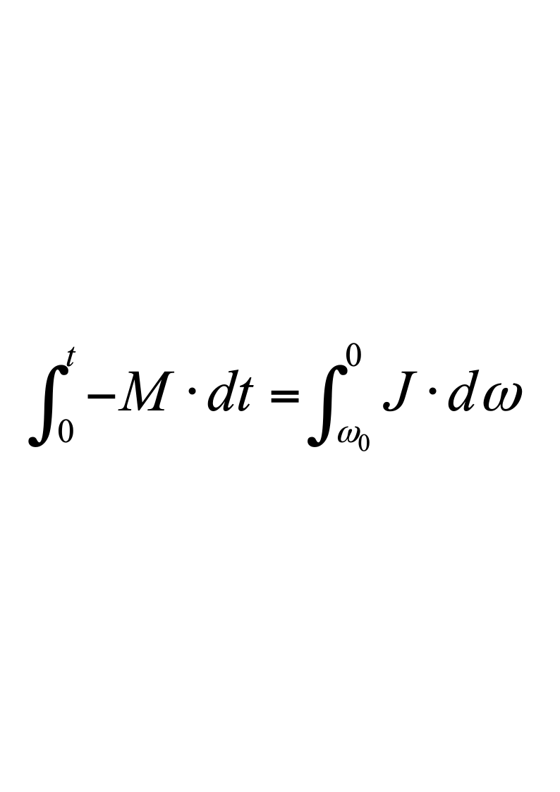
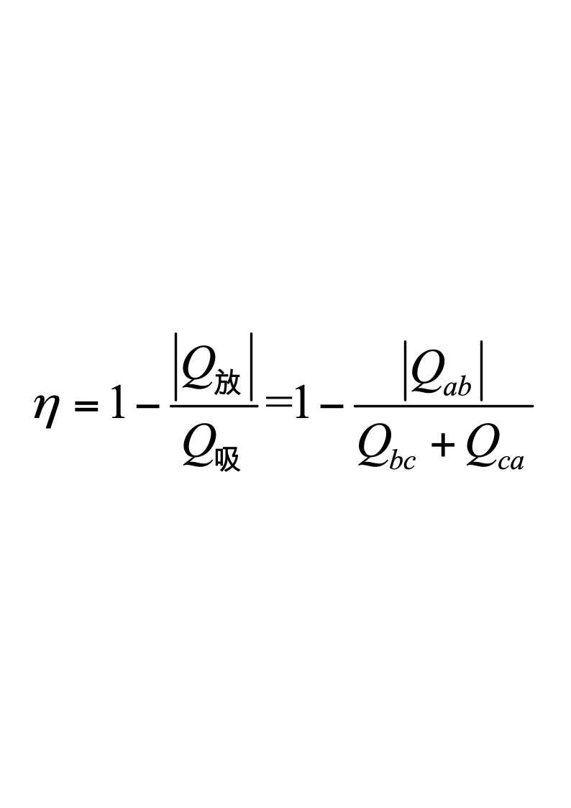
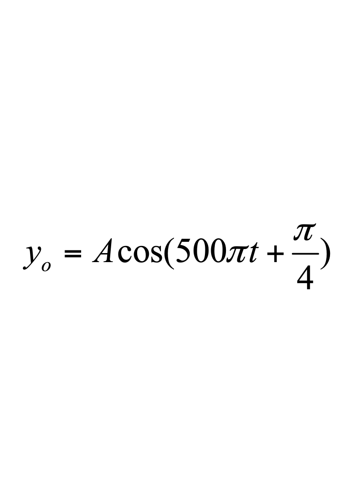
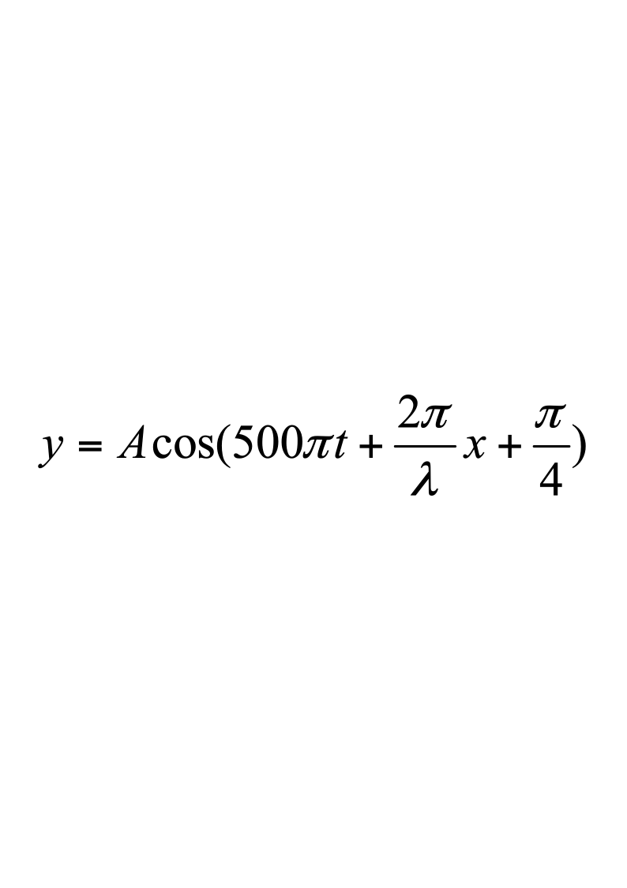
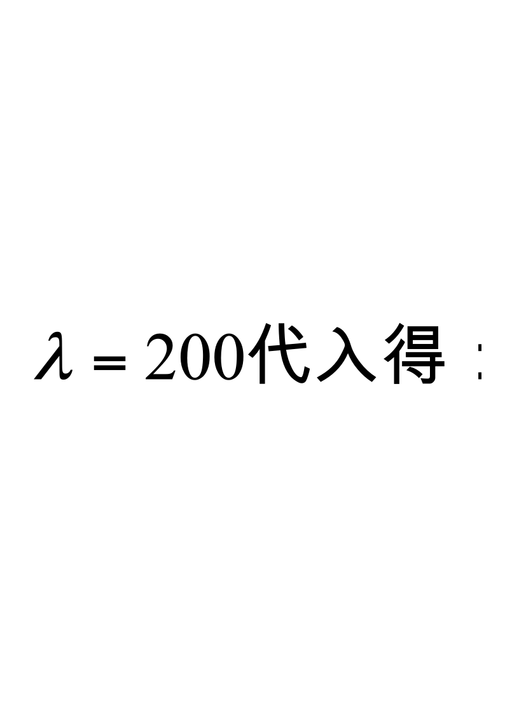
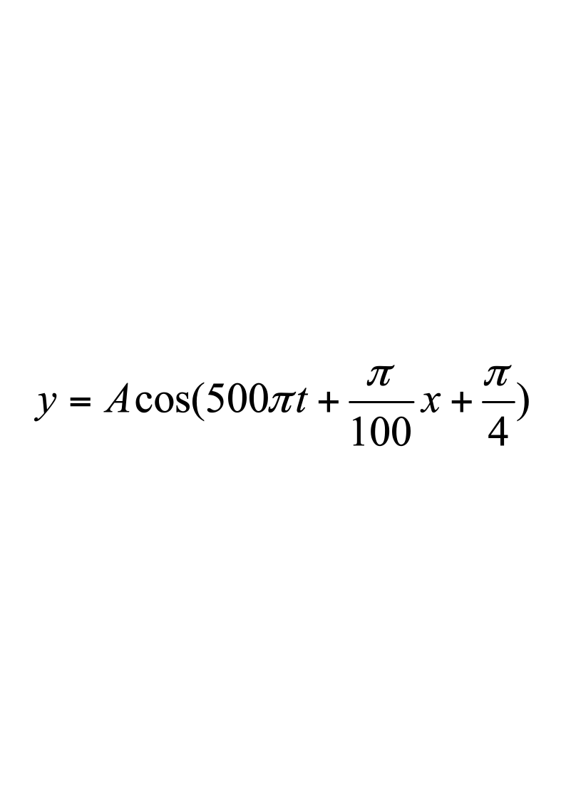

# 2020级大学物理（I）期末试卷解答（B卷）

**2020级大学物理（I）期末试卷B卷答案及评分标准**

考试日期：2021年7月5日

<!-- question: university-physics-3-1-008-Q1 -->

一、选择题(每题3分)

**A，D，C，B，B；A，C，A，D，D**

<!-- question: university-physics-3-1-008-Q2 -->

二、填空题(每题3分)

**11.**  **$16Rt^{2}$**          **12.**  36

**13.**  $\frac{1}{4}g$

**14.**  $\int Nf(v)dv$

**15.**  $\frac{3}{2}pV$         **16.**  **25%**  **或0.25**

**17.**  $\sqrt{\frac{3p}{a}}$

**18.**   $\frac{2\pi^{2}mA^{2}}{T^{2}}$

**19.**  $\pm\pi$均可             **20.**  *r*12/*r*22

<!-- question: university-physics-3-1-008-Q3 -->

三、计算题(每题10分)

21． 解：(1)  角动量守恒： 以垂直纸面向内为正方向

$2mvL=\left(\frac{1}{3}mL^{2}+2mL^{2}\right)\omega_{0}$                      3分

$\omega_0=\frac{6v}{7L}$                  2分

(2)  解法一： 由转动定律

$$
M=J\alpha=J\frac{d\omega}{dt}
$$

分离变量求积分得：      **          3分

$$
J=\frac{1}{3}mL^{2}+2mL^{2}
$$

∴        $t=\frac{2mvL}{M}$           2分

解法二：由刚体角动量定理得

$M=\frac{dL}{dt}$        $\int_{0}^{t}-Mdt=\int_{L_0}^{0}dL$        $Mt=L_0$

以上三式有一即给      3分

碰撞时角动量守恒，故 $L_0=2mvL$

$t=\frac{2mvL}{M}$             2分

22．解：（1）单原子分子的自由度*i*=3．从图可知，*ab*是等压过程，

*V**a*/*T**a*=  *V**b* /*T**b**，**T**a*=*T**c*=600 K

*T**b*  = (*V**b* /*V**a*)*T**a*=300 K                                 2分

(2)        ${Q}_{ab}={C}_{p}({T}_{b}-{T}_{c})=(\frac {i} {2}+1)R({T}_{b}-{T}_{c})$  =－6.23×103  J      (放热)      2分

${Q}_{bc}={C}_{V}({T}_{c}-{T}_{b})=\frac {i} {2}R({T}_{c}-{T}_{b})$ =3.74×103  J         (吸热)          $$2分

*Q**ca* =*RT**c*ln(*V**a* /*V**c*) =3.46×103  J                                  (吸热)     2分

(3)     ****          1分

=13.4%    （或13.5%）                      1分

23．解：(1)    $omega=2pif=500pi$        2分

由旋转矢量法知x=0处质点振动初相位为$\frac{\pi}{4}$     2分

所以          (SI)              2分

（2） 

将                 4分

24．解：(1)  由光栅方程      $(a+b)\sin\theta=k\lambda$            2分

得：   $(a+b)\times0.2=k\lambda$，        $(a+b)\times0.3=(k+1)\lambda$

解得      $k=2$

$a+b=6\times10^{-6}m=6000nm$     2分

(2)  由缺级公式    $k=\frac{a+b}{a}k'$                 2分

得，在第四级缺级下，$k'$取1，$a$取最小值

$a_{\min}=\frac{a+b}{4}=1500\text{nm}$           2分

(3)  $sintheta<1$，故  $k_{\max}<\frac{a+b}{\lambda}=10$，即$k_{max}$可取9

考虑±4，±8缺级，

实际呈现$k=$0，±1，±2，±3，±5，±6，±7，±9级共15条明纹．    2分
