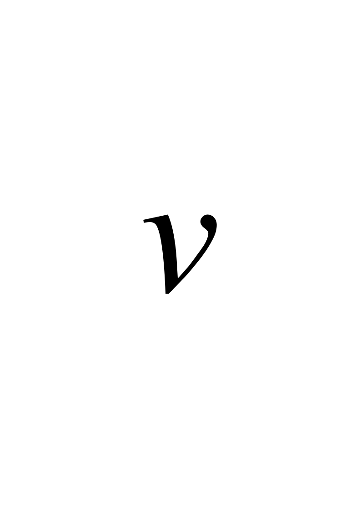
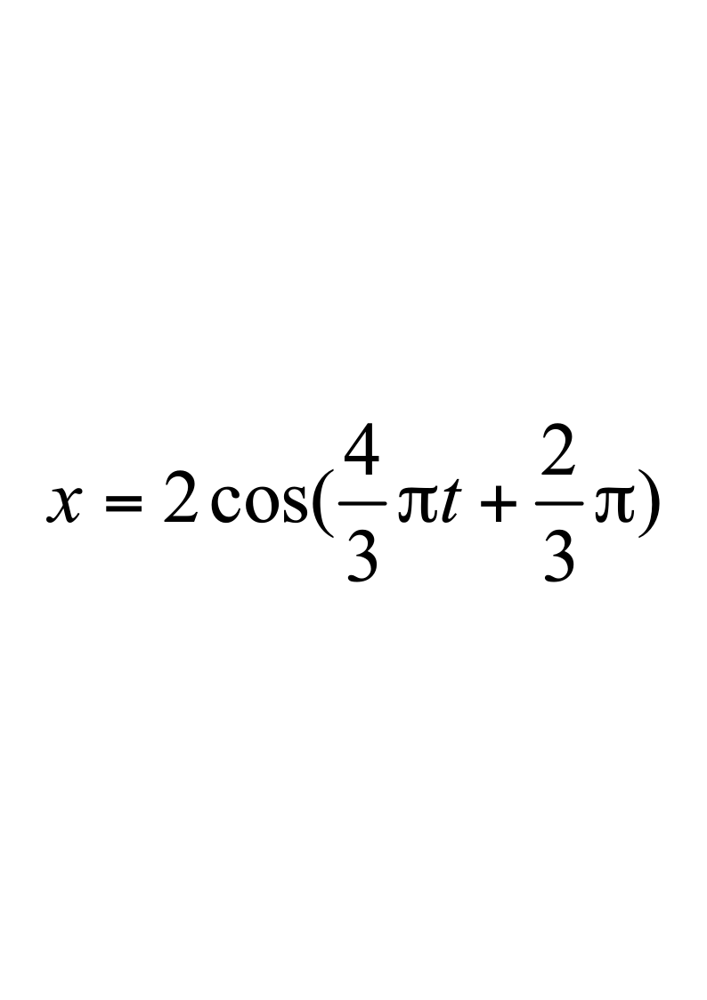
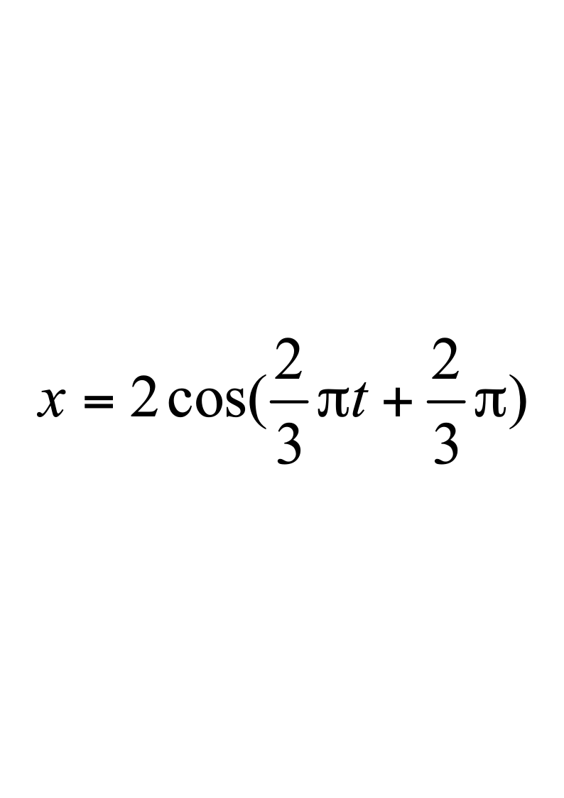
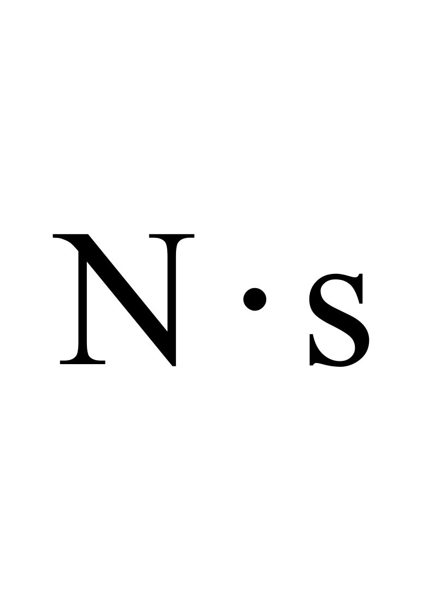
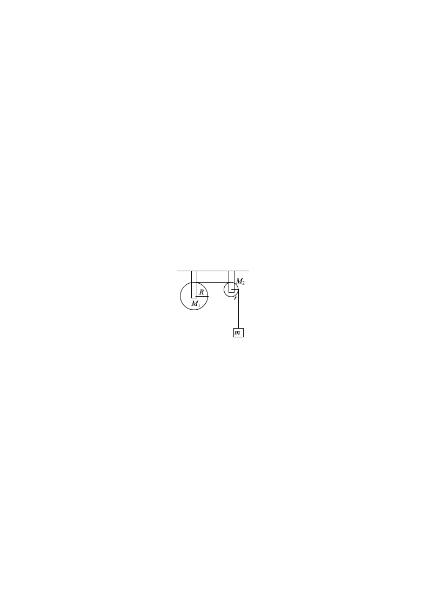
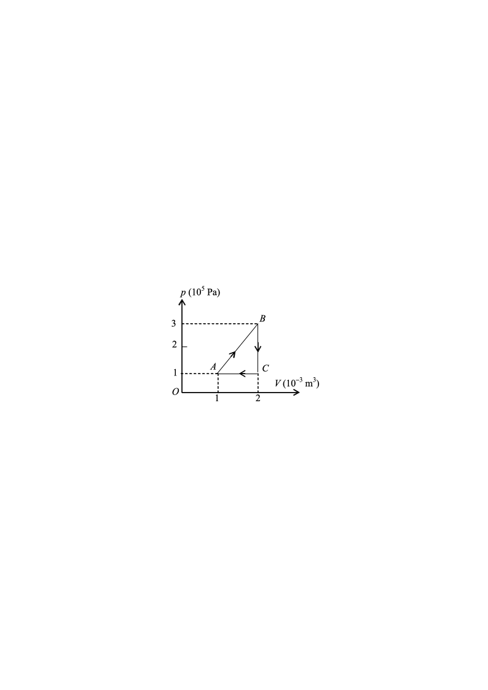

# 2022级大学物理III（一）期末考试试卷B卷（4学分）

**诚信应考，考试作弊将带来严重后果！**

**华南理工大学本科生期末考试**

**2022-2023-2学期2022级《大学物理III（一）》B卷（4学分）**

**注意事项：1.** **开考前请将密封线内各项信息填写清楚；**

**2.** **所有答案请直接答在答题纸上；**

**3．考试形式：闭卷；**

**4.** **本试卷共24大题，满分100分，**	**考试时间120分钟**。

**考试时间：2023年7月10日9：00-----11：00**

<!-- question: university-physics-3-1-009-Q1 -->

一、选择题（共30分）

1．（本题3分）

一质点在力*F*= 5*m*(5 2*t*) (SI)的作用下，*t*  =0时从静止开始作直线运动，式中*m*为质点的质量，*t*为时间，则当*t*  = 5 s时，质点的速率为

(A)    0．                          (B)  25 m·s-1．

(C)  50 m·s-1．                     (D)    -50 m·s-1．                ［      ］

2．（本题3分）

光滑的水平桌面上有长为2*l*、质量为*m*的匀质细杆，可绕通过其中点*O*且垂直于桌面的竖直固定轴自由转动，转动惯量为$\frac {1} {3}{ml}^{2}$，起初杆静止．有一质量为*m*的小球在桌面上正对着杆的一端，在垂直于杆长的方向上，以速率运动，如图所示．当小球与杆端发生碰撞后，就与杆粘在一起随杆转动．则这一系统碰撞后的转动角速度是

(A)  $\frac{v}{12l}$．       (B) $\frac{2v}{3l}$．

(C)  $\frac{3v}{4l}$．       (D)  $\frac{3v}{2l}$．        ［      ］

3．（本题3分）

在容积*V*＝4×10-3  m3的容器中，装有压强*P*＝5×102  Pa的理想气体，则容器中气体分子的平动动能总和为

(A) 2 J．          (B)  3 J．

(C)  5 J．          (D)  9 J．             ［      ］

4．（本题3分）

已知某简谐振动的振动曲线如图所示，位移的单位为厘米，时间单位为秒．则此简谐振动的振动方程为：

(A) ．

(B)  $x=2cos(\frac {2} {3}\pi t-\frac {2} {3}\pi )$．

(C) ．

(D) $x=2cos(\frac {4} {3}\pi t-\frac {2} {3}\pi )$．

［      ］

5．（本题3分）

2  mol理想气体经过一等压过程，温度变为原来的4倍，设该气体的等压摩尔热容为*C**p*，则此过程中气体熵的增量为

(A)    $8C_p$．               (B)    $C_pln8$．

(C)  $2C_pln4$．           (D)    *C**p*  ln2．               ［      ］

6．（本题3分）

某时刻驻波波形曲线如图所示，$a$处坐标为$\frac{a}{2}$，$b$处坐标为$\frac{9a}{8}$，则*a*、*b*两点振动的相位差是

(A)    0              (B)    $\frac {1} {2}\pi$

(C)    ．            (D)    5/4．        ［      ］

7．（本题3分）

在双缝干涉实验中，光的波长为600 nm  (1 nm＝10－9 m)，双缝间距为2 mm，双缝与屏的间距为300 cm．在屏上形成的干涉图样的明条纹间距为

(A) 0.45 mm．      (B) 0.9 mm．

(C) 1.2 mm                  (D)  3.0  mm．                           ［      ］

8．（本题3分）

如图，用单色光垂直照射在观察牛顿环的装置上．当平凸透镜垂直向上缓慢平移而远离平面玻璃时，可以观察到这些环状干涉条纹

(A)  向右平移．        (B)  向中心收缩．

(C) 向外扩张．        (D)  静止不动．

［      ］

9．（本题3分）

在玻璃(折射率*n*3＝1.60)表面镀一层MgF2  (折射率*n*2＝1.38)薄膜作为增透膜．为了使波长为550 nm的光从空气(*n*1＝1.00)正入射时尽可能少反射，MgF2薄膜的最小厚度应是

(A)  78.1 nm    (B)  ) 90.6 nm  (C) 125 nm  (D)  99.6  nm

［      ］

10．（本题3分）

如图所示，一束自然光入射到折射率分别为*n*1和*n*2的两种介质的交界面上，发生反射和折射．已知反射光是完全偏振光，那么折射角*r*的值为

(A)  $arctg\frac{n_2}{n_1}$．            (B)  $\arcsin\frac{n_2}{n_1}$．

(C)  $\arcsin\frac{n_1}{n_2}$．            (D)  $arctg\frac{n_1}{n_2}$．      ［      ］

<!-- question: university-physics-3-1-009-Q2 -->

二、填空题（**共**30分）

11．（本题3分）

在*xy*平面内有一运动质点，其运动学方程为：$r=10cos5 t i+10sin5 t j$（SI）

则*t*时刻其切向加速度的大小$a_\tau$= ______________．

12．（本题3分）

一吊车底板上放一质量为10 kg的物体，若吊车底板由静止开始加速上升，加速度大小为*a*＝3+5*t*  (SI)，$g=10m/s$，则前2秒内吊车底板给物体的冲量大小*I*＝___________．

13．（本题3分）

某质点在力$\overrightarrow {F}$＝(4＋2*x*)$\overrightarrow {i}$  (SI)的作用下沿*x*轴作直线运动，在从*x*＝2  m移动到*x*＝5  m的过程中，力$\overrightarrow {F}$所做的功为__________J．

14．（本题3分）

若某种理想气体分子的方均根速率$\left(\overline{v^2}\right)^{1/2}=400$ m / s，气体压强为*p*=8×104  Pa，则该气体的密度为**＝_______________ kg/m3．

15．（本题3分）

当理想气体处于平衡态时，若气体分子速率分布函数为*f*(*v*)，气体分子总数为*N*，则分子速率处于最概然速率*v**p*至∞范围内的概率＝________________．

16．（本题3分）

有一卡诺热机，用290  g空气为工作物质，工作在27℃的高温热源与 73℃的低温热源之间，若在等温膨胀的过程中气缸体积增大到2.718倍，则此热机每一循环所作的净功为___________J．

(空气的摩尔质量为29×10-3  kg/mol，摩尔气体常量*R*＝8.31$J\cdot {mol}^{-1}\cdot {K}^{-1}$，ln2.718=1)

17．（本题3分）

如图所示的是两个简谐振动的振动曲线，它们合成的余弦振动的振动方程$x=$________________(SI)  （用余弦函数描述）

18．（本题3分）

两相干波源*S*1和*S*2的振动方程分别是${y}_{1}=Acos\omega t$和${y}_{2}=Acos(\omega t+\frac {1} {2}\pi )$．*S*1距*P*点3个波长，*S*2距*P*点21/4个波长．两波在*P*点引起的合振动的振幅是__________．

19．（本题3分）

折射率分别为*n*1和*n*2的两块平板玻璃构成空气劈尖，用波长为**的单色光垂直照射．如果将该劈尖装置浸入折射率为*n*的透明液体中，且*n*2＞*n*＞*n*1，则相比于空气劈尖，劈尖厚度为*e*的地方两反射光的光程差的改变量是________________．

20．（本题3分）

He－Ne激光器发出**=500  nm (1nm=10-9  m)的平行光束，垂直照射到一单缝上，在距单缝3 m远的屏上观察夫琅禾费衍射图样，测得两个第二级暗纹间的距离是10 cm，设衍射角很小，则单缝的宽度*a*=          nm．

<!-- question: university-physics-3-1-009-Q3 -->

三、计算题（共40分）

21．（本题10分）

质量为*M*1＝25  kg的圆轮，可绕水平光滑固定轴转动，一轻绳缠绕于轮上，另一端通过质量为*M*2＝5 kg的圆盘形定滑轮悬有*m*＝10 kg的物体，$g=10m/s$．求当重物由静止开始下降了*h*＝0.5 m时，

(1)  物体的速度；

(2)  绳中张力．

(设绳与定滑轮间无相对滑动，圆轮、定滑轮绕通过轮心且垂直于横截面的水平光滑轴的转动惯量分别为${J}_{1}=\frac {1} {2}{M}_{1}{R}^{2}$，${J}_{2}=\frac {1} {2}{M}_{2}{r}^{2}$)

22．（本题10分）

一定量的单原子分子理想气体，从初态*A*出发，沿图示直线过程变到另一状态*B*，又经过等体、等压两过程回到状态*A*．求

    (1)   *A*→*B*过程中系统所做的功；

（2）*B*→*C*过程中系统吸收的热量；

（3）*C*→*A*过程中系统所做的功；

（4）*C*→*A*过程中系统内能的增量；

（5）整个循环过程中系统吸收的总热量（吸热和放热之和）．

(注：摩尔气体常量$R=8.31J/(mol⋅K)$

23．（本题10分）

如图所示，一平面简谐横波沿*Ox*轴的正方向传播，已知振幅$A=2m$，$T=2s$，$\lambda=2m$，$L=0.5m$。若$t=0$时，*P*处介质质点刚好到达负的最大位移处。以$y$轴表示振动方向，求

(1)    *P*处质点的振动方程；

（2）*O*处质点的振动方程；

（3）该波的波动方程。

（注：要有必要的解题过程）

24．（本题10分）

波长**600nm的单色光垂直入射到一光栅上，相邻两条明纹的衍射角分别由公式$sintheta=0.2$与$sintheta=0.3$确定，已知第四级缺级．

(1)  光栅常数(*a*  +  *b*)等于多少nm？

(2)  透光缝可能的最小宽度*a*等于多少nm？

(3)  在选定了上述(*a*  +  *b*)和*a*之后，求在衍射角$-\frac{\pi}{2}<\theta<\frac{\pi}{2}$范围内可能观察到的全部主极大的级次．
