# 2023级大学物理1期末复习

<!-- page: 1 -->

2023级大学物理Ⅰ期末复习

2024-06-14

1

<!-- page: 2 -->

2023级大学物理（上）期末考试复习
纲要（4学分）

大学物理（上）包括：力学（运动学、牛

顿力学、刚体的定轴转动）；热学（气体动理

论、热力学第一定律）；振动波动（机械振动、

机械波）；光学（光的干涉、衍射和偏振）。

根据大纲对各知识点的要求以及总结历年考试

的经验，现列出期末复习的纲要如下：

<!-- page: 3 -->

<!-- question: university-physics-3-1-011-Q1 -->

1．计算题可(yi)能(ding)覆盖范围
a. 刚体力学；b. 机械振动与机械波；c. 光
栅衍射；d. 热力学第一定律

计算题有4道，上面四个知识点各1道，共40分

做好了计算题相当于“及格”了一大半，所以
非常重要！！！

注意：

<!-- question: university-physics-3-1-011-Q2 -->

1. 解题格式(适当的文字说明，步骤尽可能详细，
可参考试题答案格式)

<!-- question: university-physics-3-1-011-Q3 -->

2. 写出根据的物理定律，列出基本的物理定律
<!-- question: university-physics-3-1-011-Q4 -->

3. 注意题目物理量的单位

<!-- page: 4 -->

<!-- question: university-physics-3-1-011-Q5 -->

2．大学物理(上)重要知识点(选择&填空)

（一）力学质点运动学（速度、加速度、位移、直
线运动、曲线运动、圆周运动）；牛顿运动定律；冲
量、质点动量定理；质点系动量守恒；变力做功；质
点运动的动能定理；势能；机械能；角动量；刚体力
矩；刚体定轴转动定理；刚体定轴转动角动量定理及
角动量守恒定律；刚体定轴转动中的功和能。不考非
惯性系，不考回转运动。

（二）振动、波动
简谐振动方程与振动曲线；旋转
矢量法的应用；简谐振动的能量；同方向同频率简谐
振动的合成；波速、周期（频率）与波长的关系；波
程、波程差以及相位差；波动曲线与波动方程；波的
干涉；反射波及驻波；多普勒效应。不考机械波的能
量，不考阻尼振动、受迫振动、共振。

<!-- page: 5 -->

（三）光学
杨氏双缝干涉；干涉与光程；光程差与
相位差；半波损失；薄膜干涉（劈尖及牛顿环）；
增透增反；单缝衍射（不考圆孔衍射）；光栅衍射；
光的偏振(不考双折射及以后内容)。不考迈克尔孙
干涉仪，不考晶体衍射。
（四）热学
理想气体的状态方程；理想气体的温度、
压强、内能；能均分定理；麦克斯韦速率分布函数
的意义和三种统计速率；热力学第一定律在理想气
体准静态等值过程（等体、等压、等温）中的应用；
热容；定性理解绝热过程；循环过程及热机效率、
卡诺循环；热力学第二定律的定性理解及克劳修斯
熵的计算。不考气体分子的平均自由程。

复习大纲的内容不一定全部考，但没有的内
容一定不会考。

<!-- page: 6 -->

计算题

➢刚体力学(转动定律、角动量守恒、动能定理)

质点平动+刚体转动的综合问题

质点和常见刚体的转动惯量(会给)和角动量

隔离法：

•质点——牛顿定律、动量定理、动能定理
• 刚体——转动定律、角动量定理、转动动能定理

整体法：角动量守恒

质点和刚体的联系：线量和角量的关系

6

<!-- page: 7 -->

2012级

质点对固定
点的角动量

( v)
L
r
p
r
m
=

=


sin
sin
L
rp
rmv


=
=
大小：

刚体定轴转
动的角动量
L
J
=

2
J
mr
=
质点的转动惯量

角动量守恒：
1
2
L
L
=

7

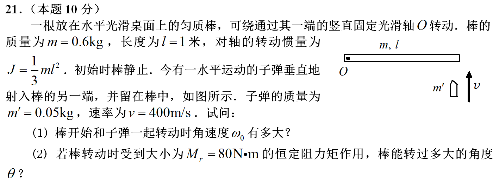

<!-- page: 8 -->

刚体定轴转动动能定理

2
2
2
1
1
1

2
2
Md
J
J






=
−


2

1

力矩做功
转动动能

转动定律
M
J
=

2
2
0
2
=
t


−
匀变速圆周运动

8

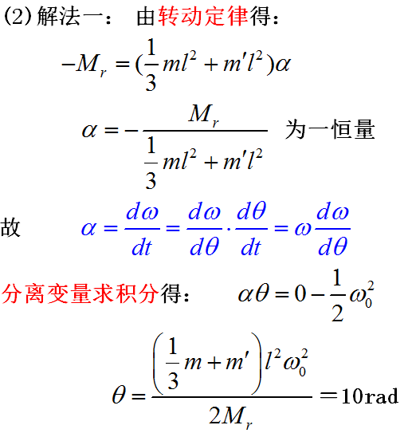

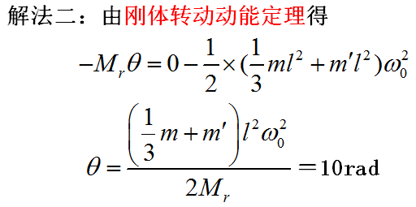

<!-- page: 9 -->

➢机械振动与机械波

知道波形图和频率/波速求振动&波动方程
从波形图结合题目，获取相关信息

•波的传播方向，某点的振动方向
•波长，周期(由频率，波长结合波速)
•圆频率(由周期)
•初相(根据旋转矢量法)
•波形图上各点的相位关系(波程差和相位差的关系)

振动方程和波动方程(注意方程后标注”(SI)”)

•由波动方程求振动方程
•由振动方程求波动方程
✓时间延迟法
✓相位差法（波程差和相位差的关系）

9

<!-- page: 10 -->

2012级

振动方程
cos(
)
y
A
t


=
+

会根据振动图和波形图判断质点的运动方向

10

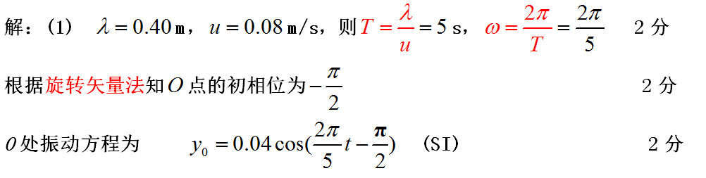

<!-- page: 11 -->

根据参考点x0的振动方程写出波动方程（相位差法）

−
=

+
“
”对应“左右”

0
cos(
2
)
+, -
x
x
y
A
t





11

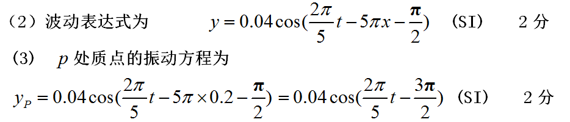

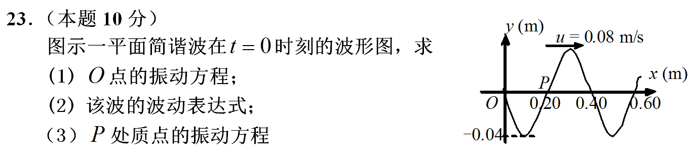

<!-- page: 12 -->

➢光栅衍射

计算光栅常数(狭缝中心距离)，狭缝宽度(根据光
栅方程或单位长度的刻痕数)

缺级现象(根据缺级公式)

主极大的最大级次(根据光栅方程)

可观察到主极大的级次(最大级次—缺级)

主极大的衍射角(光栅方程)

复色光入射，谱线的重叠问题(衍射角相同)

连续光(白光)入射，各级光谱的张角问题

12

<!-- page: 13 -->

2012级

a--透光部分宽度
b--不透光部分宽度
光栅常数
d=a+b

13

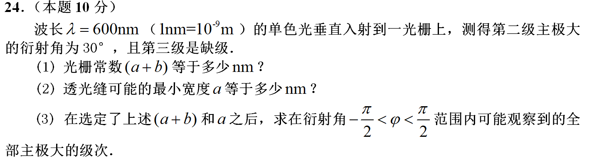

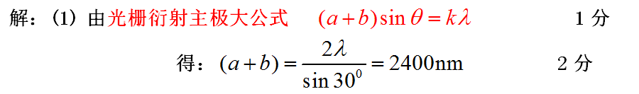

<!-- page: 14 -->

1, 2,3,
k=

考点：光栅方程，缺级公式，最大级次公式

14

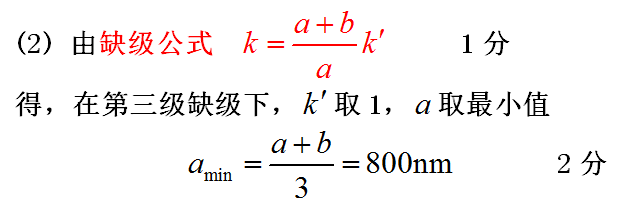

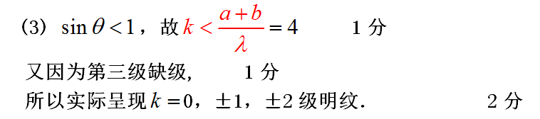

<!-- page: 15 -->

➢热力学第一定律（等值过程+绝热过程+
循环过程）

等值和绝热过程中的功、热量、内能改变量

•理想气体的状态方程
•热力学第一定律（体积功的计算）
•理想气体的热力学能
•过程的特征方程(三个绝热方程用到会给)
•定压和定体摩尔热容(刚性分子的自由度)

循环过程(包括卡诺循环)正循环&逆循环的吸热、
放热、净功和效率

•热机效率和和制冷系数(一般&卡诺循环)

15

<!-- page: 16 -->

2012级

理想气体状态方程

pV
RT

=

p
nkT
=

16

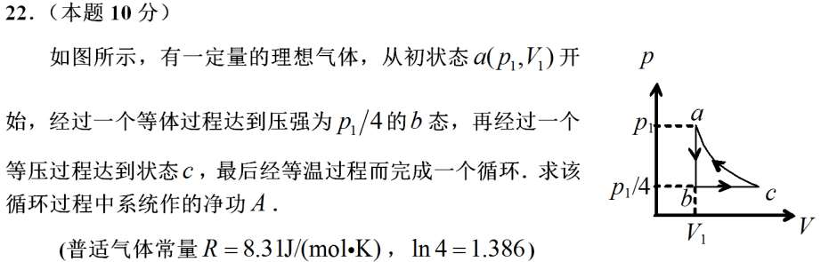

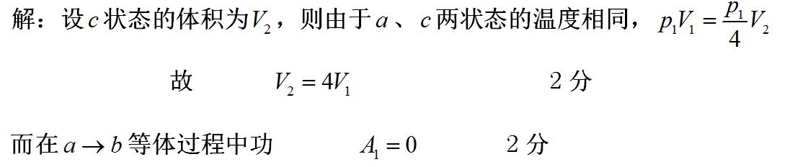

<!-- page: 17 -->

等温过程



=
=
=
=
=



V
V
RT
Q
A
pdV
dV
RT
p V
V
V
V

1
1
ln
ln
V
V

2
2

2
2
1
1

V
V

1
1

循环净功的计算：1. 各过程做功之和

<!-- question: university-physics-3-1-011-Q6 -->

2. 循环闭合曲线的面积

17

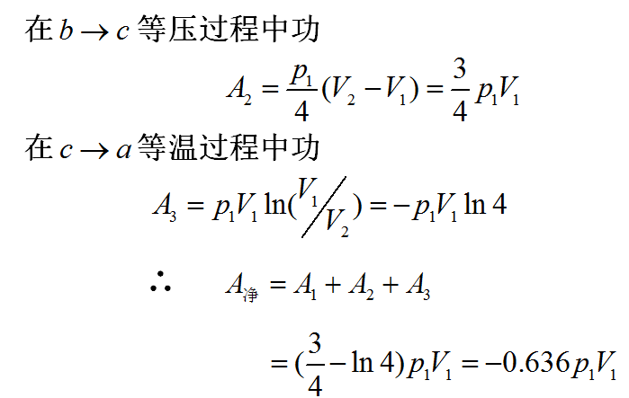

<!-- page: 18 -->

选择&填空题

（一）力学
质点运动学（速度、加速
度、位移、直线运动、曲线运动、圆周
运动）；牛顿第二定律；冲量、质点动
量定理；质点系动量守恒；变力做功；
质点运动的动能定理；势能；机械能；
角动量；刚体力矩；刚体定轴转动定理
；刚体定轴转动角动量定理及角动量守
恒定律；刚体定轴转动中的功和能；不
考非惯性系，不考回转运动

18

<!-- page: 19 -->

2012级

考点：质点运动学（速度、
加速度，位移）

D

d
/ d t
a
=
<!-- question: university-physics-3-1-011-Q7 -->

（1）v
d r / dt
v
=
（2）

dS / dt
v
=
（3）
正确
d
/ dt
a
=
<!-- question: university-physics-3-1-011-Q8 -->

（4）v

19

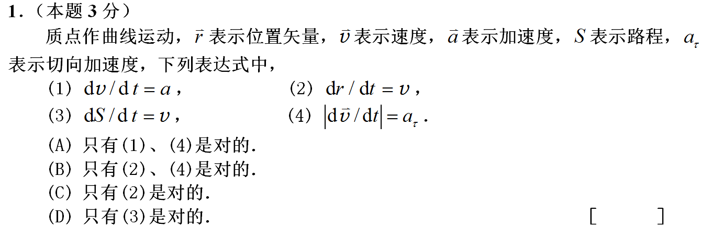

<!-- page: 20 -->

2012级

2
2
n
n

v
F
ma
m
m
r
r

考点：圆周运动，牛顿第二定律，
法向加速度


=
=
=

小球P在重力和碗的支持力的作用下做匀速圆周运动




=
=
=

2
tan
mg
m
r


=
tan
9.8 8 / 6
12.78
/
0.08

g
rad s
r

20

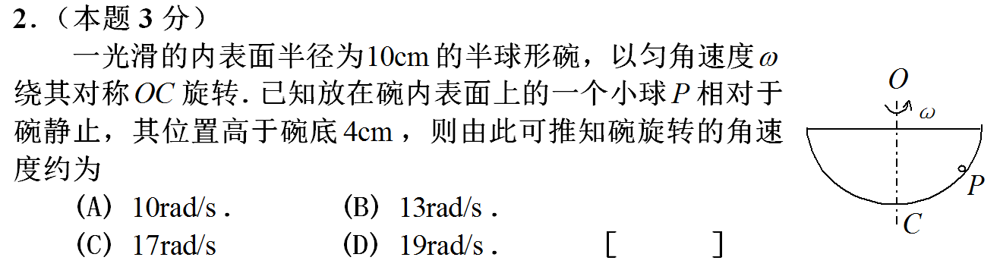

<!-- page: 21 -->

2012级

考点：变力做功

=
+
+






j
dzk
=
=
+
+
+
+

x
A
F d r
F i
F j
F k
dxi
d

(
) (
)

y

y
z

F

dx
F dy
F dz

x
y

z

10
10

0
0 (5
5 )
300
x
A
F dx
x dx
J
=
=
+
=



21

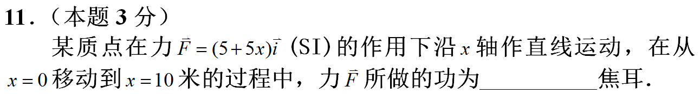

<!-- page: 22 -->

2012级

注意：最远位置不是受力
等于零，而是速度等于零

考点：质点运动的功和能

F做正功，摩擦力做负功，在最远位置处转化成弹性势能

(
)

2

2
Fx
mgx
kx

−
=
(
)
2 F
mg
x


−
=
=

F
mg
E
kx

2
2
1


−
=

2
1

2
p

k

k

22

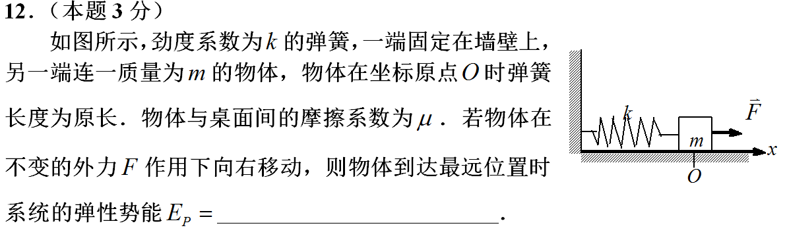

<!-- page: 23 -->

2012级

考点：牛顿第二定律，刚体定轴转动定理，圆周运动

B
B : mg
T
ma
−
=
对

A
A : T
ma
=
对

2
1

2
B
A
:T R
T R
mR 
−
=
对滑轮

a =
R

关联方程：

2
2
4
/
5
a =
g
m s
=

23

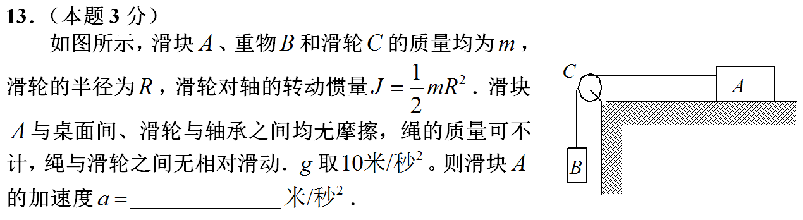

<!-- page: 24 -->

（二）振动、波动
简谐振动方程与
振动曲线；旋转矢量法的应用；简谐振
动的能量；同方向同频率简谐振动的合
成；波速、周期（频率）与波长的关系
；波程、波程差以及相位差；波动曲线
与波动方程；波的干涉；反射波及驻波
；多普勒效应；不考机械波的能量，不
考阻尼振动、受迫振动、共振；

24

<!-- page: 25 -->

2012级

考点：旋转矢量法的应用

画出旋转矢量图即可求出答案

90
60
5
360
12
t
T
T
+
=
=

25

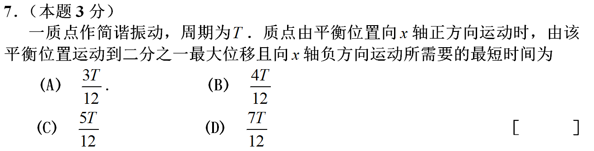

<!-- page: 26 -->

2012级

考点：机械波的能量&波的传播方向

B

A点振动动能在增大→机械波向左传播

26

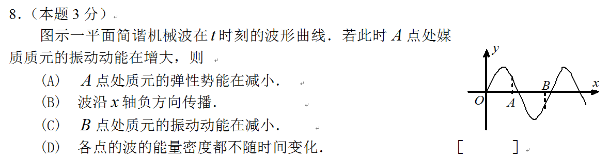

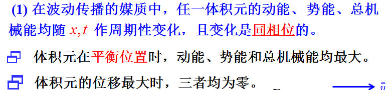

<!-- page: 27 -->

2012级

考点：同方向同频率简谐振动的合成，旋转矢量法的应用

两个旋转矢量夹角
90度，可得

2
2
1
2
0.1
A
A
A
m
=
+
=

27

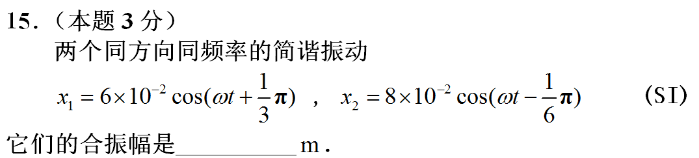

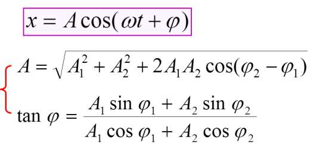

<!-- page: 28 -->

2012级

考点：波程、波程差以及相位差，波的干涉，同
方向同频率简谐振动的合成

−
−

−
−
−
= −
=
=







2
1
2
1
4.5
3
3
2 π
2
r
r






反相，振动抵消
A=0
合振动

28

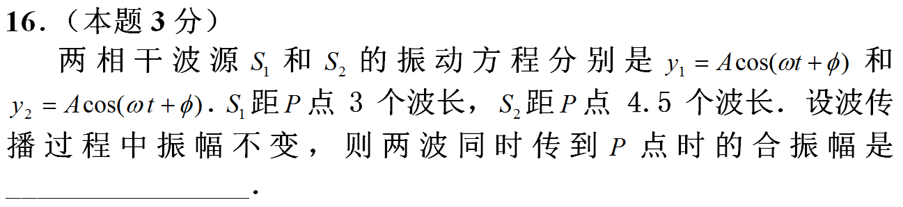

<!-- page: 29 -->

2012级

考点：反射波及驻波

1
cos
y
A
t

=
入射波在x=0处的振动：

因为反射点为固定点，反射波在x=0处的振动

(
)
2
cos
+
y
A
t


=

根据相位差法

2
cos
2
+
x
y
A
t






=
−





29

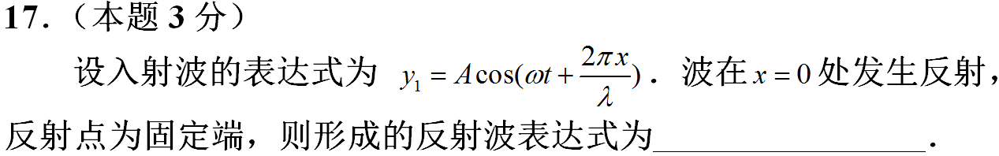

<!-- page: 30 -->

（三）光学
杨氏双缝干涉；干涉与
光程；光程差与相位差；半波损失；
薄膜干涉（劈尖及牛顿环）；增透增
反；单缝衍射（不考圆孔衍射）；光
栅衍射；光的偏振(马吕斯定律和布
儒斯特定律，不考双折射及以后内
容)；不考迈克尔孙干涉仪，不考晶
体衍射；

30

<!-- page: 31 -->

2012级

考点：干涉与光程；半波损
失；薄膜干涉；增透增反

1
2
3
n
,
n
n


有附加光程差

2
+
(
1, 2,3...)
2
nd
k
k

=
=
反射增强










=
−

−
=









1
1

2
2
2
2
4
d
k
n
n
n

31

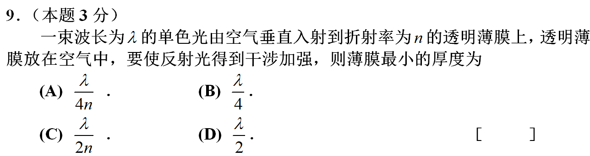

<!-- page: 32 -->

2012级

考点：薄膜干涉:等厚干涉

干涉条纹的形状取决于薄膜（空气）等厚线


空气薄膜厚度减小
，条纹移动到

凸起
+1
2
k
k
n



凸起最大
（空气
高度
）

=
=250nm
n=1
2
2
n

32

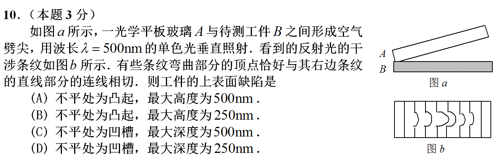

<!-- page: 33 -->

2012级

考点：光程差与相位差；杨氏双缝干涉

(
0,1, 2,3...)
=
k
k



=
k=2
=2


二级明纹
，

'
2
3
= n
n




=

=
放入介质中
1.5
n =

33

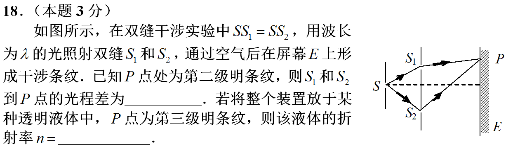

<!-- page: 34 -->

2012级

考点：单缝衍射

sin
tan











=
=

3
3
3
6
2
2
2
400
8
0.15
x
f
f
mm
a

第k暗纹距中心的距离






k
x
f
f
a

0.0005
500
mm
nm
=
=

k
k

34

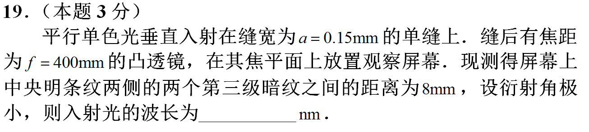

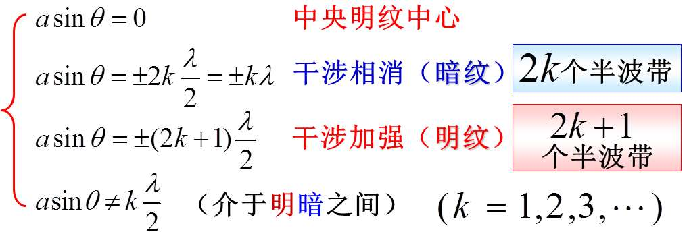

<!-- page: 35 -->

2012级

考点：马吕斯定律

0
0
1
1
cos 45
cos 45
2
8

(
) (
)

2
2

o
o
I
I
I
=
=

35

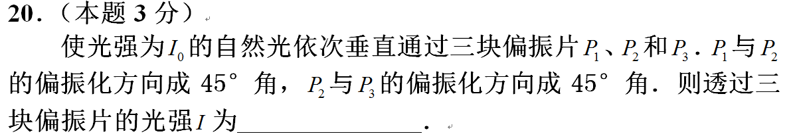

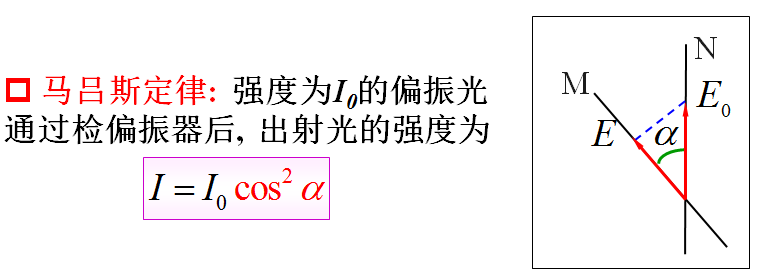

<!-- page: 36 -->

2013级

考点：布儒斯特定律

o
o
0 =90
60
i

−
=
入射角

2
0
1
tan
n
i
n
=

n
i



2
0
1

tan =

n

反射光和折射光互相垂直

o
2
1
0

=
= 
=

n
n
i

tan
1
tan 60
3

o
0
90
i

+
=

36

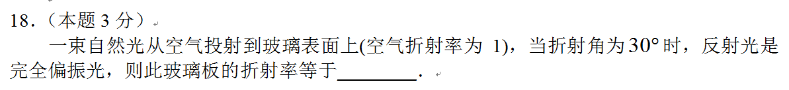

<!-- page: 37 -->

（四）热学理想气体的状态方程；理想气体的温

度、压强、内能；能均分定理；麦克斯韦速率分布

函数的意义和三种统计速率；热力学第一定律在理

想气体准静态等值过程（等体、等压、等温）中的

应用；热容；定性理解绝热过程；循环过程及热机

效率、卡诺循环；热力学第二定律的定性理解及克

劳修斯熵的计算；不考气体分子的平均自由程.

37

<!-- page: 38 -->

2012级

考点：三种统计速率（方均根速率），理想气体状态方程

3
3
kT
RT
m
M
=
=
=
v
v
:
:
1: 4 :16
A
B
C
T
T
T
=

2
rms

p
nkT
=
:
:
1: 4 :16
A
B
C
p
p
p
=

38

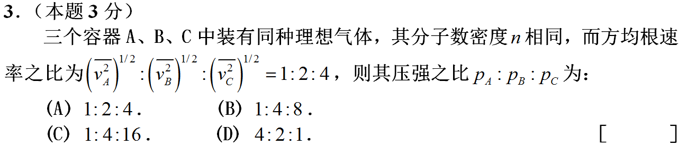

<!-- page: 39 -->

2012级

考点：理想气体的内能，能量均分定理，自由度

2
i
U
RT

=
温度不变，主要是摩尔数和
自由度变化引起内能变化

5
5
2
2
2
1
1
25%
6 2
2

+
+

RT
RT
U
U

H
O

−
=
−
=

2
2

U
RT

H O

2

39

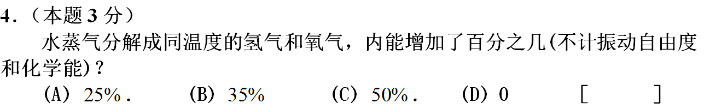

<!-- page: 40 -->

2012级

D

考点：三种统计速率（平均速率），理想气体状态方程

8
1.60
π

kT
RT

m
M

v =

温度和压强都是原来的4倍

p
nkT
=

容积不变+封闭→分子数密度n不变

40

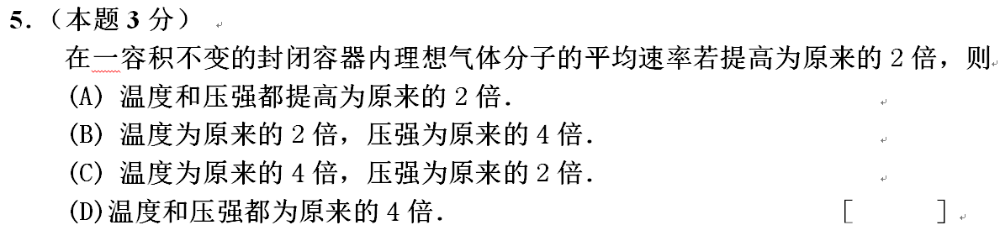

<!-- page: 41 -->

2012级

A

考点：麦克斯韦速率分布函数和三种统计速率（最概然速度）

kT
RT
m
M
=
=
v
(
)

M
=
=
v

2
2

M

1
4

p
O
H

2
2

(
)

p

v

O
p
H

2
2

41

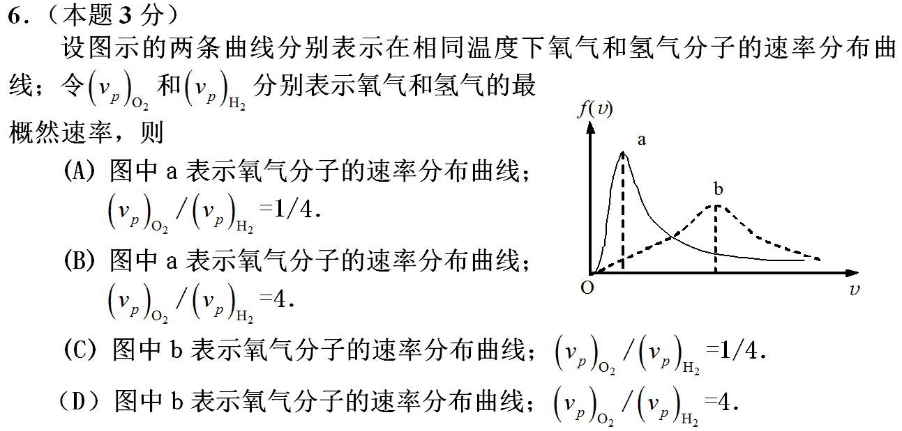

<!-- page: 42 -->

2012级

考点：绝热过程、循环过程及效率，卡诺循环

注意：这是p-T图，不是p-V图！！！
这就是卡诺循环

300
1
1
25%
400
T

T
=
−
=
−
=

2

1

42

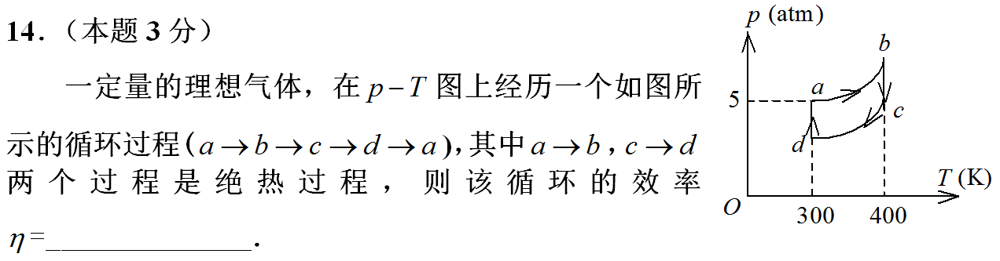
