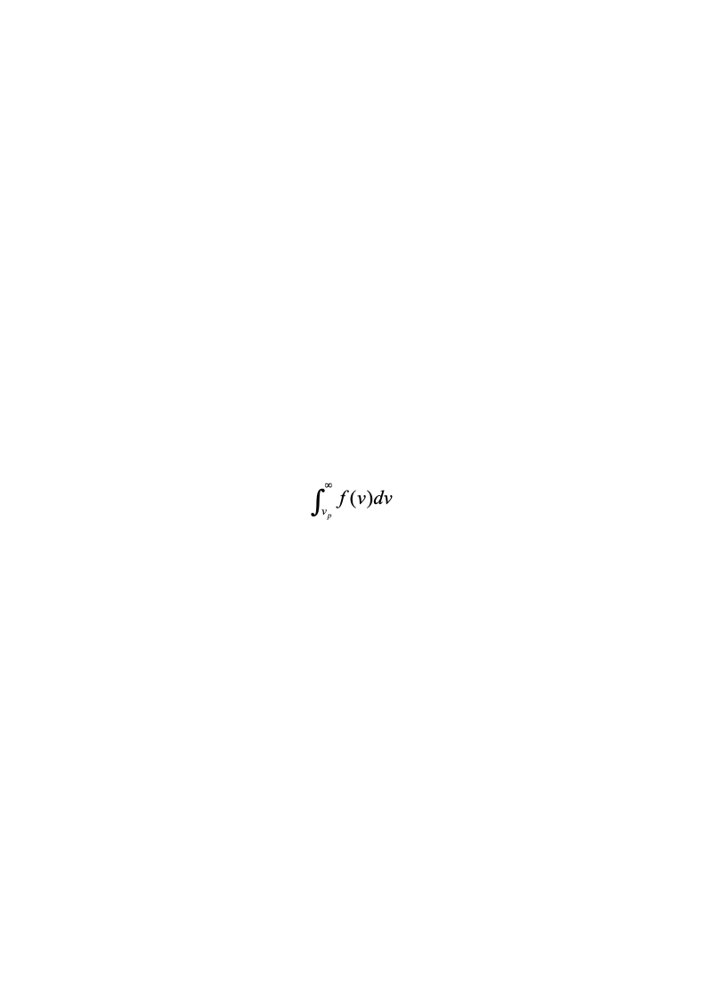
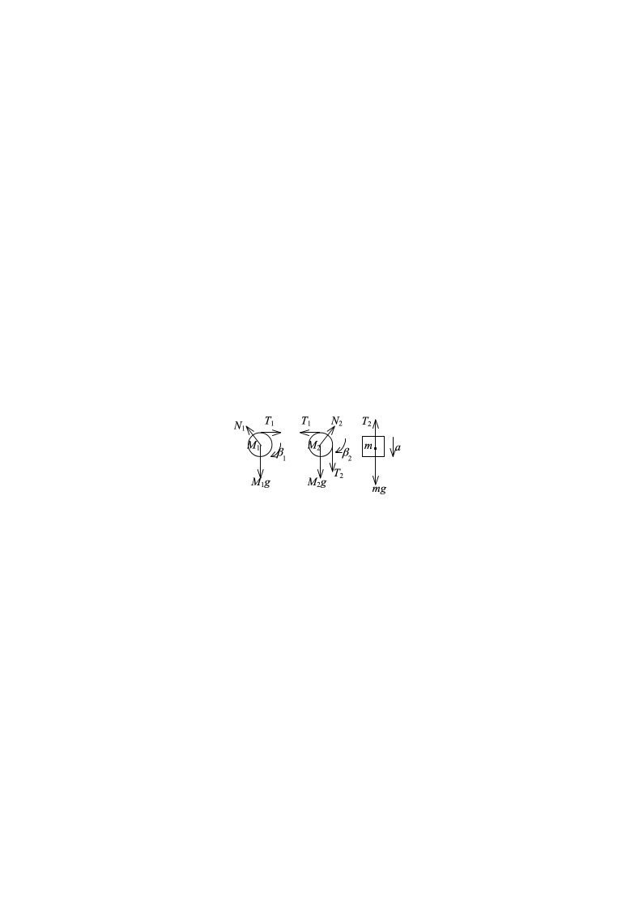
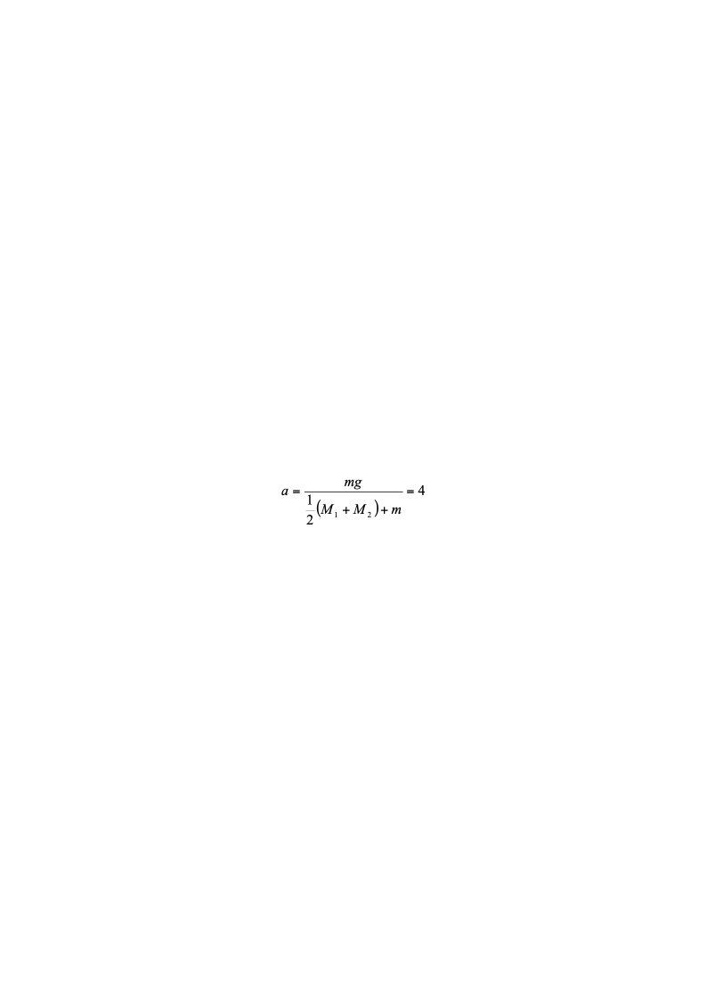
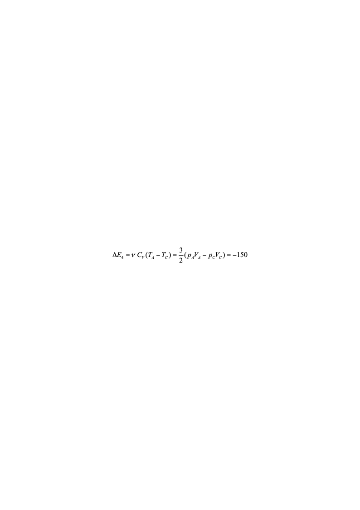
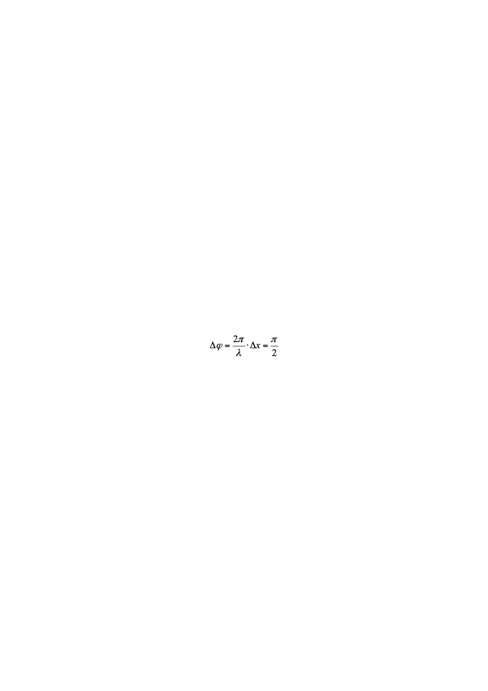
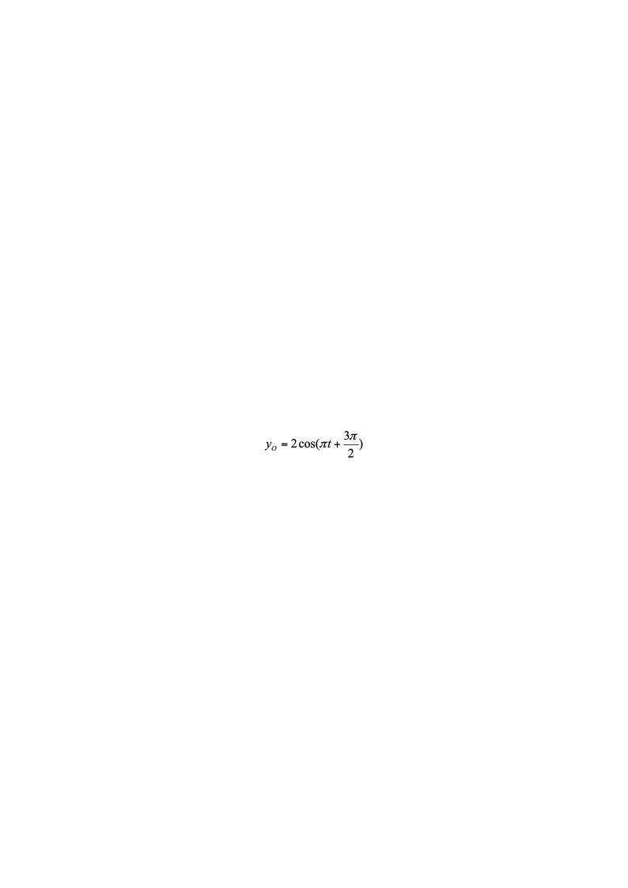
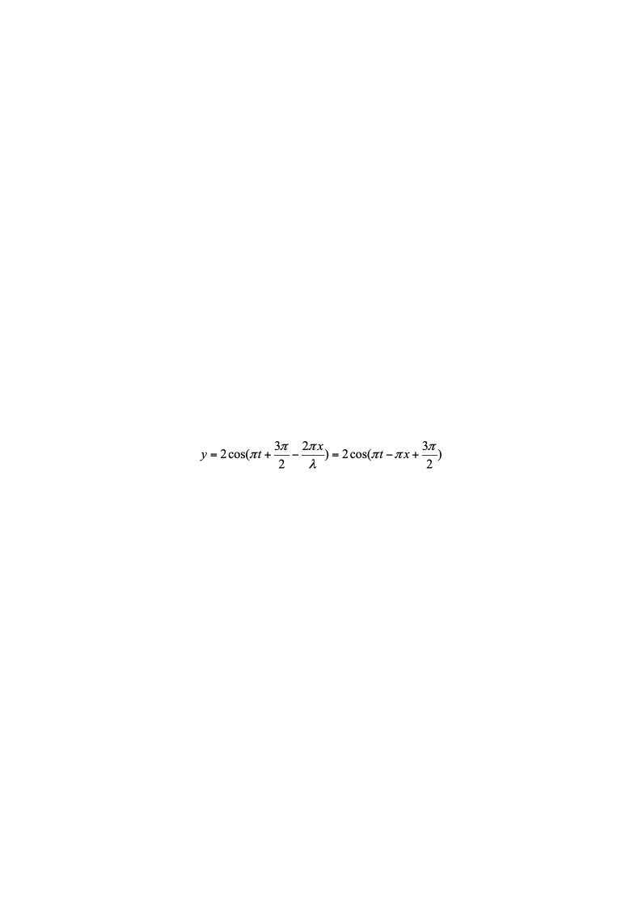
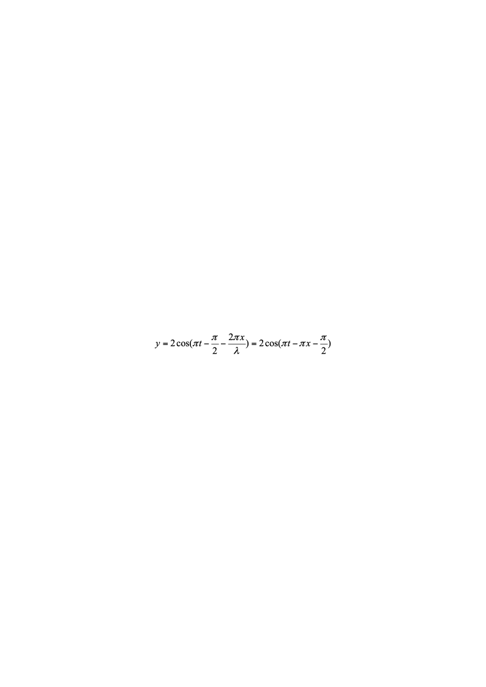

# 2022级大学物理（一）期末试卷答案简版（B卷）

2022级大学物理（一）期末试卷答案及评分标准（B卷）20230710

<!-- question: university-physics-3-1-013-Q1 -->

一、选择题

ACBAC  CBBDD

<!-- question: university-physics-3-1-013-Q2 -->

二、填空题

<!-- question: university-physics-3-1-013-Q3 -->

11.  0      12.  360    或  356      13.  33      14.    1.5

15.    或$1-\int_{0}^{v_f}f(v)dv$     16.    8310

17.    $\frac{A}{2}\cos(\frac{\pi}{2}t-\frac{\pi}{2})$或$x=\frac{A}{2}\cos(\frac{\pi}{2}t-\frac{\pi}{2})$或$\frac{A}{2}\cos(\frac{\pi}{2}t+\frac{3\pi}{2})$

18.    2A      19.  $2(n-1)e+\frac{\lambda}{2}$或$2(n-1)e^{-\frac{\lambda}{2}}$   $(2n-2)e+\frac{\lambda}{2}$

<!-- question: university-physics-3-1-013-Q4 -->

20.    60000      或$6\times10^{4}$

**三、计算题**

**21题**

各物体的受力情况如图所示．

由转动定律、牛顿第二定律及运动学方程，可列出以下联立方程：

*T*1*R*＝*J*1**1＝$\frac{1}{2}M_1R^2\beta_1$        2分

*T*2*r*－*T*1*r*＝*J*2**2＝$\frac{1}{2}M_1r^2\beta_2$        2分

*mg*－*T*2＝*ma*  ,                  1分

*a*＝*R***1＝*r***2  ,            1分

*v*2＝2*ah*或$v=\sqrt{2ah}$1分

求解联立方程，得

  m/s2

$v=\sqrt{2ah}$=2 m/s                              1分

*T*2＝*m*(*g*－*a*)＝60  N             1分

*T*1＝$\frac{1}{2}M_1a$＝50  N              1分

**22题**

解：(1)  *A*→*B*：$W_1=\frac{1}{2}(p_B+p_A)(V_E-V_A)$=200 J．2分

（2）*B*→*C*等体过程：*Q*2  =Δ*E*2=***C**V* (*T**C**－**T**B*)=3(  *p**C**V**C**－**p**B**V**B*) /2

=－600 J．2分

（3）*C*→*A*等压过程：*W*3  =  *p**A*  (*V**A**－**V**C*)=－100 J．          2分

（4）*C*→*A*等压过程：  J．    2分

(5)            *Q*= *W*= *W*1+*W*3=100 J．                  2分

**23题**

解：(1)    $T=2$s，则$\omega=\frac{2\pi}{T}=\pi$        2分

根据旋转矢量法知P点的初相位为$\pi$

P处振动方程为    (SI)              2分

或

（2）OP相位差

O处质点的振动方程为

  (SI)         2分

或

<!-- question: university-physics-3-1-013-Q5 -->

（3）选O点为参考点，则波动方程为

      4分

或

24题

解：(1)  由光栅衍射主极大公式$(a+b)\sin\theta=k\lambda$

$$
(a+b)\cdot0.2=k\lambda
$$

$$
(a+b)\cdot0.3=(k+1)\lambda
$$

得：$(a+b)=6000nm$                  2分

<!-- question: university-physics-3-1-013-Q6 -->

(2)  由缺级公式$k=\frac{a+b}{a}k'$

得，在第四级缺级下，$k'$取1，$a$取最小值

$$
a_{\min}=\frac{a+b}{4}=1500nm
$$

<!-- question: university-physics-3-1-013-Q7 -->

(3)  $sintheta<1$，故$k<\frac{a+b}{\lambda}=10$

又因为第四、八级缺级,

所以实际呈现$k=$0，±1，±2，±3，±5，±6，±7，±9级明纹．    
