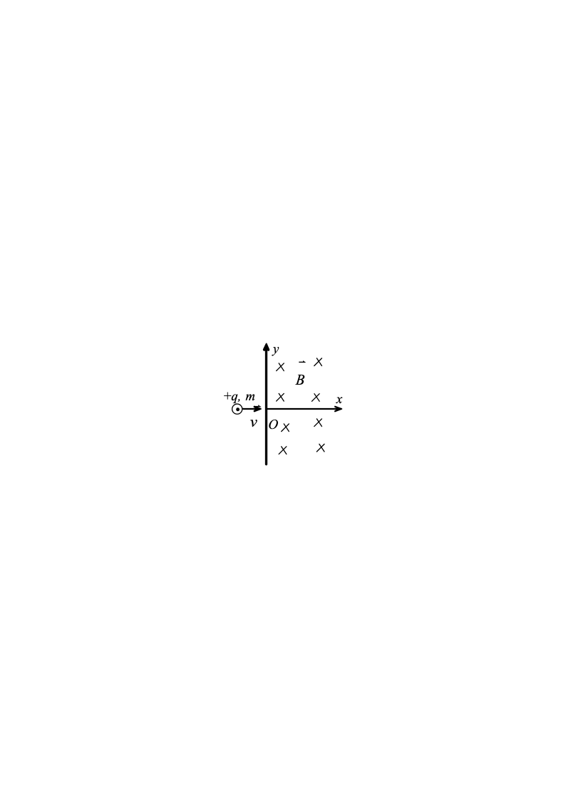
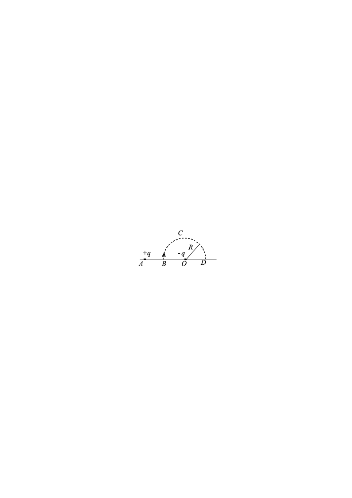
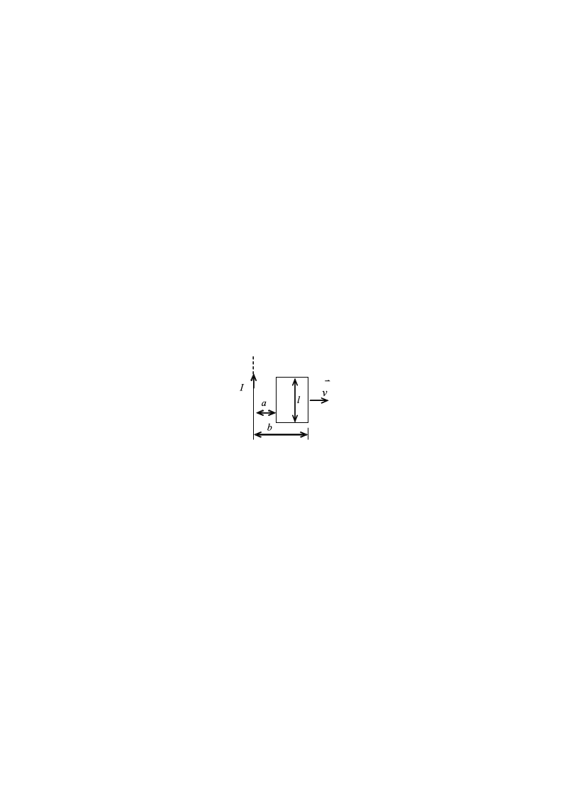

# 2012大学物理（2）A卷试卷规范模版

**诚信应考,考试作弊将带来严重后果！**

**华南理工大学期末考试**

**《2012级大学物理（II）期末试卷A卷》试卷**

**注意事项：1.** **考前请将密封线内各项信息填写清楚；**

**2.** **所有答案请直接答在答题纸上；**

**3．考试形式：闭卷；**

**4.** **本试卷共25题，满分100分，**	**考试时间120分钟。**

**考试时间：2014年1月13日9：00-----11：00**

<!-- question: university-physics-3-2-002-Q1 -->

一、选择题（共30分）

<!-- question: university-physics-3-2-002-Q2 -->

1．（本题3分）

如图所示，两个同心均匀带电球面，内球面半径为$R_1$、带有电荷$Q_1$，外球面半径为$R_2$、带有电荷$Q_2$，则在外球面外面、距离球心为$r$处的$P$点的场强大小$E$为：

(A)  $\frac {{Q}_{1}+{Q}_{2}} {4{\pi \varepsilon }_{0}{r}^{2}}$．

(B)$\frac {{Q}_{1}} {4{\pi \varepsilon }_{0}{\left ( {r-{R}_{1}}\right )}^{2}}+\frac {{Q}_{2}} {4{\pi \varepsilon }_{0}{\left ( {r-{R}_{2}}\right )}^{2}}$．

(C)  $\frac {{Q}_{1}+{Q}_{2}} {4{\pi \varepsilon }_{0}{\left ( {{R}_{2}-{R}_{1}}\right )}^{2}}$．

(D)  $\frac {{Q}_{2}} {4{\pi \varepsilon }_{0}{r}^{2}}$．              ［      ］

<!-- question: university-physics-3-2-002-Q3 -->

2．（本题3分）

如图所示，一带负电荷的金属球，外面同心地罩一不带电的金属球壳，则在球壳中一点$P$处的场强大小与电势(设无穷远处为电势零点)分别为：

(A)    *E*  = 0，*U*  > 0．    (B)    *E*  = 0，*U*  < 0．

(C)    *E*  = 0，*U*  = 0．    (D)    *E*  > 0，*U*  < 0．

［      ］

<!-- question: university-physics-3-2-002-Q4 -->

3．（本题3分）

如图，一个电荷为+*q*、质量为*m*的质点，以速度$v$沿*x*轴射入磁感强度为*B*的均匀磁场中，磁场方向垂直纸面向里，其范围从*x*  = 0延伸到无限远，如果质点在*x*  = 0和*y*  = 0处进入磁场，则它将以速度$-V$从磁场中某一点出来，这点坐标是*x*  = 0  和

(A)    $y=+\frac{mv}{qB}$．       (B)    $y=+\frac{2mv}{qB}$．

(C)    $y=-\frac{2mv}{qB}$．      (D)    $y=-\frac{mv}{qB}$．  ［      ］

<!-- question: university-physics-3-2-002-Q5 -->

4．（本题3分）

边长为*l*的正方形线圈，分别用图示两种方式通以电流*I*  (其中*ab*、*cd*与正方形共面)，在这两种情况下，线圈在其中心产生的磁感强度的大小分别为

(A)    ${B}_{1}=0$，${B}_{2}=0$．

(B)    ${B}_{1}=0$，${B}_{2}=\frac {2\sqrt {2}{\mu }_{0}I} {\pi l}$．

(C)    ${B}_{1}=\frac {2\sqrt {2}{\mu }_{0}I} {\pi l}$，${B}_{2}=0$．

(D)    ${B}_{1}=\frac {2\sqrt {2}{\mu }_{0}I} {\pi l}$,${B}_{2}=\frac {2\sqrt {2}{\mu }_{0}I} {\pi l}$．    ［      ］

<!-- question: university-physics-3-2-002-Q6 -->

5．（本题3分）

如图，流出纸面的电流为2*I*，流进纸面的电流为*I*，则下述各式中哪一个是正确的？

(A)  $\oint _{{L}_{1}} Hdl=2I$．       (B)  $\oint _{{L}_{2}} Hdl=I$

(C)  $\oint _{{L}_{3}} Hdl=-I$．       (D)  $\oint _{{L}_{4}} Hdl=-I$．

［      ］

<!-- question: university-physics-3-2-002-Q7 -->

6．（本题3分）

有两个线圈，线圈1对线圈2的互感系数为*M*21，而线圈2对线圈1的互感系数为*M*12．若它们分别流过*i*1和*i*2的变化电流且$\left | {\frac {{di}_{1}} {dt}}\right |>\left | {\frac {{di}_{2}} {dt}}\right |$，并设由*i*2变化在线圈1中产生的互感电动势为$E_{12}$，由*i*1变化在线圈2中产生的互感电动势为$E_{21}$，判断下述哪个论断正确．

(A)  *M*12  = *M*21，$\varepsilon_{21}=\varepsilon_{12}$．         (B)  *M*12≠*M*21，$\varepsilon_{21}\neq\varepsilon_{12}$．

(C)  *M*12  = *M*21，$ε_{21}>ε_{12}$．         (D)  *M*12  = *M*21，$\varepsilon_{21}<\varepsilon_{12}$．    ［      ］

<!-- question: university-physics-3-2-002-Q8 -->

7．（本题3分）

如图，平板电容器(忽略边缘效应)充电时，沿环路*L*1的磁场强度$H$的环流与沿环路*L*2的磁场强度$H$的环流两者，必有：

(A)    $\oint _{{L}_{1}} Hd{l}^{'}>$$\oint _{{L}_{2}} Hd{l}^{'}$.

(B)    $\oint _{{L}_{1}} Hd{l}^{'}=$$\oint _{{L}_{2}} Hd{l}^{'}$.

(C)    $\oint _{{L}_{1}} Hd{l}^{'}<$$\oint _{{L}_{2}} Hd{l}^{'}$.       (D)    $\oint _{{L}_{1}} Hd{l}^{'}=0$.     ［      ］

<!-- question: university-physics-3-2-002-Q9 -->

8．（本题3分）

边长为$a$的正方形薄板静止于惯性系*K*的平面内，且两边分别与$x$，$y$轴平行．今有惯性系*K*＇以$0.8c$（$c$为真空中光速）的速度相对于*K*系沿$x$轴作匀速直线运动，则从*K*＇系测得薄板的面积为

(A)    $0.6a^2$．  (B)    $0.8a^2$．   (C)  *$a^2$*．  (D)    *$a^2/0.6$* ．［      ］

<!-- question: university-physics-3-2-002-Q10 -->

9．（本题3分）

已知一单色光照射在钠表面上，测得光电子的最大动能是1.2 eV，而钠的红限波长是540nm，那么入射光的波长是

(A)    535nm．         (B)  500nm．

(C)  435nm．         (D)  355nm．                     ［      ］

(普朗克常量*h* =6.63×10-34  J·s，1 eV =1.60×10-19  J)

<!-- question: university-physics-3-2-002-Q11 -->

10．（本题3分）

在康普顿散射中，如果设反冲电子的速度为光速的60％，则因散射使电子获得的能量是其静止能量的

(A)  2倍．              (B)  1.5倍．

(C)    0.5倍．            (D)    0.25倍．                     ［      ］

<!-- question: university-physics-3-2-002-Q12 -->

二、填空题（**共**30分）

<!-- question: university-physics-3-2-002-Q13 -->

11．（本题3分）

两根相互平行的“无限长”均匀带正电直线1、2，相距为*d*，其电荷线密度分别为+**1和+**2如图所示，则场强等于零的点与直线1

的距离*a*为_____________ ．

<!-- question: university-physics-3-2-002-Q14 -->

12．（本题3分）

已知某静电场的电势分布为*U*＝8*x*＋12*x*2*y*－20*y*2  (SI)，则该静电场在点(1，1，0)处电场强度$E$＝___________$i$ +____________$j$ +_____________$k$  (SI)．

<!-- question: university-physics-3-2-002-Q15 -->

13．（本题3分）

图示*BCD*是以*O*点为圆心，以*R*为半径的半圆弧，在*A*点有一电荷为+*q*的点电荷，*O*点有一电荷为－*q*的点电荷．线段$\overline {BA}=R$．现将一单位正电荷从*B*点沿半圆弧轨道*BCD*移到*D*点，则电场力所作的

功为______________________  ．

<!-- question: university-physics-3-2-002-Q16 -->

14．（本题3分）

一空气电容器充电后切断电源，电容器储能*W*0，若此时在极板间灌入相对介电常量为$E_r$的煤油，则电容器储能变为*W*0的_______________________  倍．如果灌煤油时电容器一直与电源相连接，则电容器储能将是*W*0的____________倍．

<!-- question: university-physics-3-2-002-Q17 -->

15．（本题3分）

两个在同一平面内的同心圆线圈，大圆半径为*R*，通有电流*I*1，小圆半径为*r*，通有电流*I*2，电流方向如图，且*r*<<*R*．那么小线圈从图示位置转到两线圈平面相互垂直位置的过程中，磁力矩所作的功为__________________．

<!-- question: university-physics-3-2-002-Q18 -->

16．（本题3分）

将一个通过电流为*I*的闭合回路置于均匀磁场中，回路所围面积的法线方向与磁场方向的夹角为**．若均匀磁场通过此回路的磁通量为**，则回路所受磁力矩

的大小为____________________________________________．

<!-- question: university-physics-3-2-002-Q19 -->

17．（本题3分）

真空中两只长直螺线管1和2，长度相等，单层密绕匝数相同，直径之比*d*1  / *d*2  =1/4．当它们通以相同电流时，两螺线管贮存的磁能之比为*W*1  / *W*2=___________．

<!-- question: university-physics-3-2-002-Q20 -->

18．（本题3分）

子是一种基本粒子，在相对于子静止的坐标系中测得其寿命为**0 ＝3×10-6  s．如果子相对于地球的速度为$v=$**0. 8*****c*** **(***c*为真空中光速)，则在地球坐标系中测出的子的寿命**＝____________________秒．

<!-- question: university-physics-3-2-002-Q21 -->

19．（本题3分）

静止质量为*m**e*的电子，经电势差为*U*的静电场加速后，若不考虑相对论效应，电子的德布罗意波长**＝________________________________．

<!-- question: university-physics-3-2-002-Q22 -->

20．（本题3分）

在主量子数$n=3$，自旋磁量子数${m}_{s}=\frac {1} {2}$的量子态中，能够填充的最大电子数是____________________．

<!-- question: university-physics-3-2-002-Q23 -->

三、计算题（共40分）

<!-- question: university-physics-3-2-002-Q24 -->

21．（本题10分）

$q_0dl\lambda$    在真空中一长为*l*的细杆上均匀分布着电荷，其电荷线密度为**．在杆的延长线上，距杆的一端距离*d*的一点上，有一点电荷*q*0，如图所示．试求该点电荷所受的电场力．

<!-- question: university-physics-3-2-002-Q25 -->

22．（本题10分）

如图，一半径为*R*的带电塑料圆盘，其中半径为*r*的阴影部分均匀带正电荷，面电荷密度为+**，其余部分均匀带负电荷，面电荷密度为-***。*当圆盘以角速度**旋转时，测得圆盘中心*O*点的磁感强度为零，问*R*与*r*满足什么关系？

<!-- question: university-physics-3-2-002-Q26 -->

23．（本题5分）

要使电子的速度从*v*1  =1.2×108  m/s增加到*v*2  =2.4×108  m/s必须对它作多少功？

(电子静止质量*m**e* ＝9.11×10-31  kg)

<!-- question: university-physics-3-2-002-Q27 -->

24．（本题10分）

如图所示，有一根长直导线，载有直流电流*I*，近旁有一个两条对边与它平行并与它共面的矩形线圈，以匀速度$v$沿垂直于导线的方向离开导线．设*t*  =0时，线圈位于图示位置，求

<!-- question: university-physics-3-2-002-Q28 -->

(1)  在任意时刻*t*通过矩形线圈的磁通量**．

<!-- question: university-physics-3-2-002-Q29 -->

(2)  在图示位置时矩形线圈中的感应电动势。

<!-- question: university-physics-3-2-002-Q30 -->

25．（本题5分）

已知粒子在一维无限深势阱中运动，其波函数为

$\psi (x)=\sqrt {2/a}sin(\pi x/a)$  (0  ≤*x* ≤*a*)

求发现粒子的概率为最大的位置．
