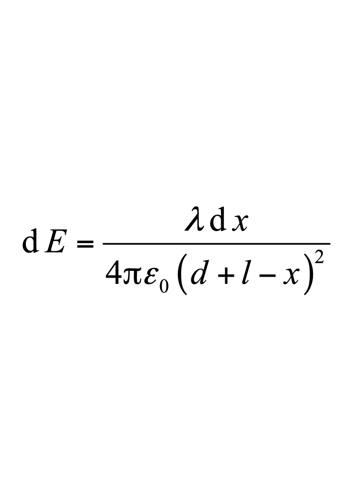
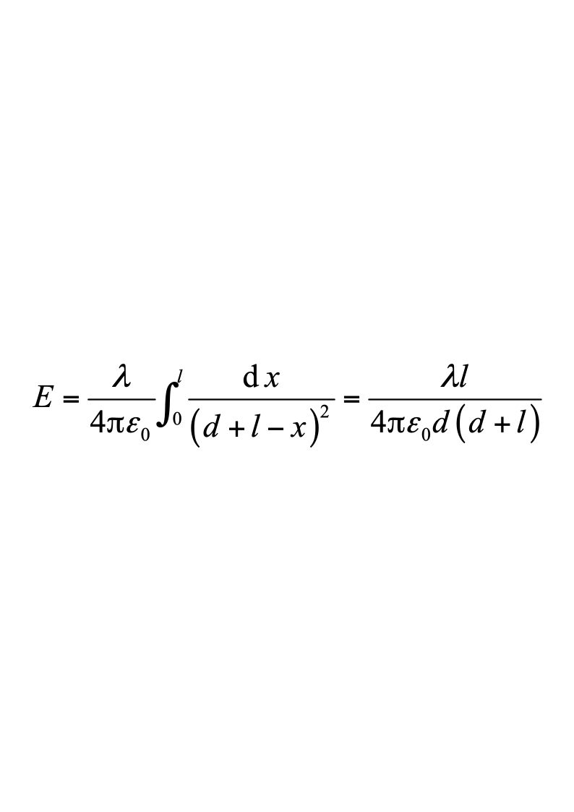
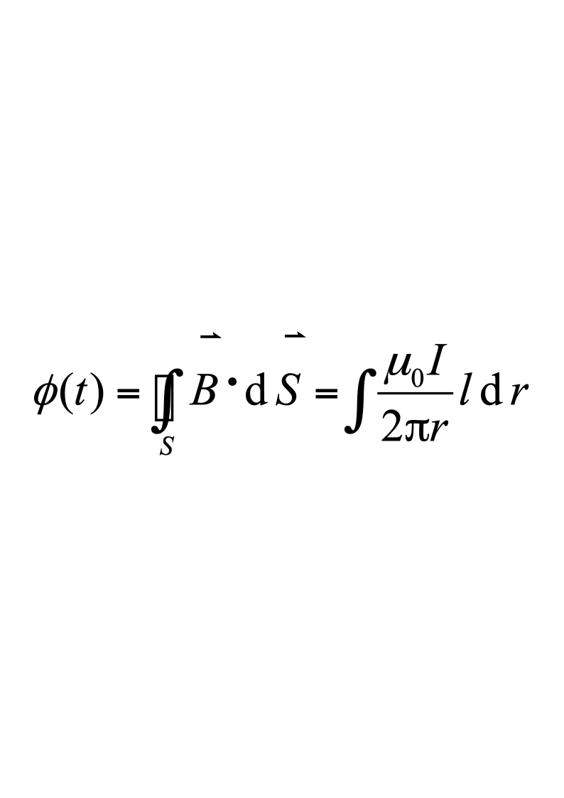
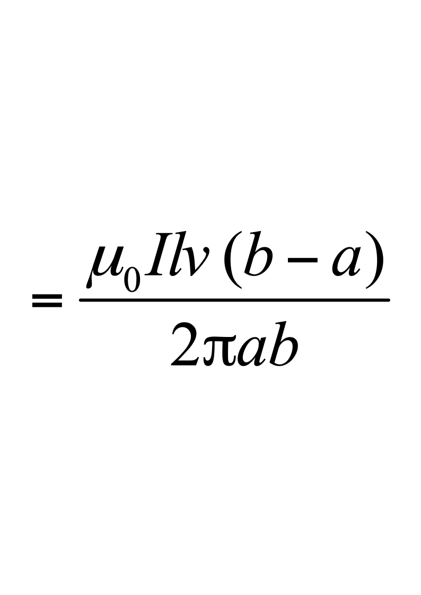
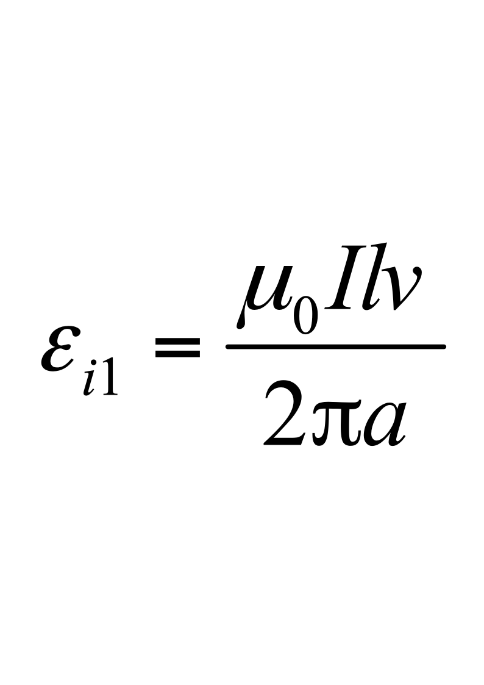
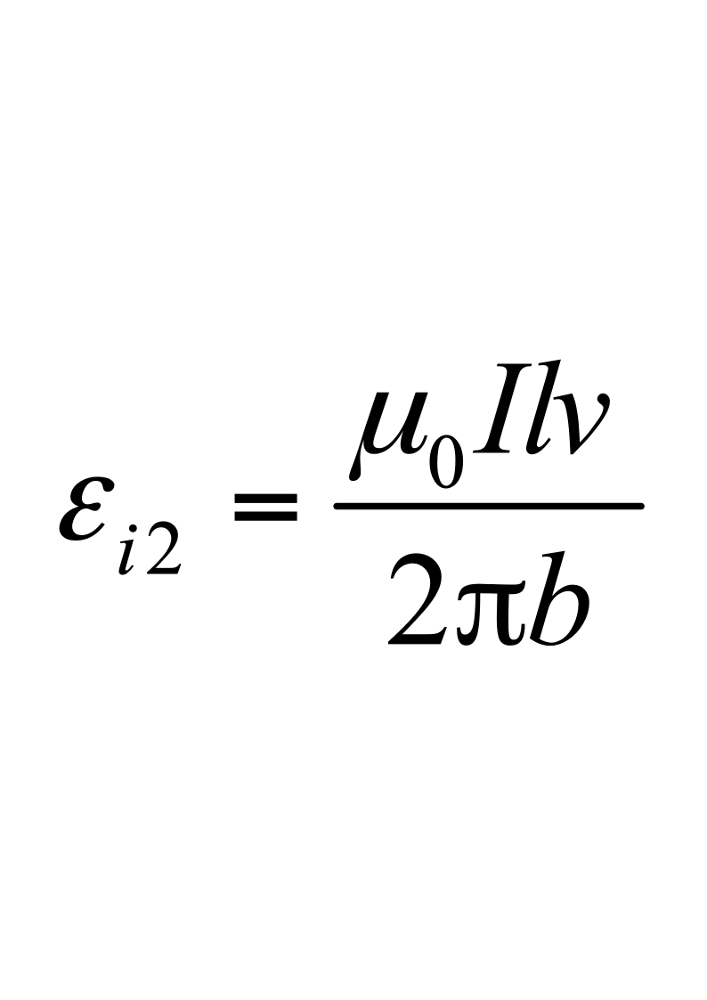
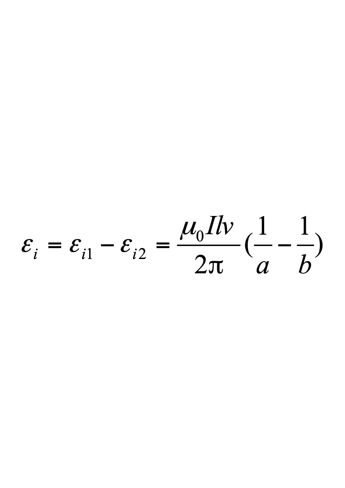

# 2012级大学物理（2）期末试卷解答（A卷）

**2012级大学物理（II）期末试卷A卷答案及评分标准**

考试日期：2014年1月13日

<!-- question: university-physics-3-2-003-Q1 -->

一、选择题(每题3分)

**A，B，B，C，D；C，C，A，D，D**

<!-- question: university-physics-3-2-003-Q2 -->

二、填空题(每题3分)

**11.**  $\frac {{\lambda }_{1}} {{\lambda }_{1}+{\lambda }_{2}}d$

**12.**  -32，    28，    0

**13.**  *q* / (6**0*R*)

**14.**  1/***r*         ，***r*

**15.**  $A=-{I}_{2}\frac {{\mu }_{0}{I}_{1}} {2R}{\pi r}^{2}$

**16.**  *I***tan**

**17.**  1∶16

**18.**  $5\times10^{-6}$

**19.**  $\frac{h}{\sqrt{2m_eU}}$ **或**$\frac{h}{\sqrt{2meU}}$或$\frac{1.23}{\sqrt{U}}nm$         **20.  9**

<!-- question: university-physics-3-2-003-Q3 -->

三、计算题(每题10分)

21．解法1：选杆的左端为坐标原点，*x*轴沿杆的方向 ．在*x*处取一电荷元**d*x*，它在点电荷所在处产生场强为：

$dE=\frac {\lambda dx} {4{\pi \varepsilon }_{0}{\left ( {d+x}\right )}^{2}}$         4分

整个杆上电荷在该点的场强为：

$E=\frac {\lambda } {4{\pi \varepsilon }_{0}}\int \frac {dx} {{\left ( {d+x}\right )}^{2}}=\frac {\lambda l} {4{\pi \varepsilon }_{0}d\left ( {d+l}\right )}$          4分

点电荷*q*0所受的电场力为：

$F=\frac {{q}_{0}\lambda l} {4{\pi \varepsilon }_{0}d\left ( {d+l}\right )}$                    2分

解法2：选杆的右端为坐标原点，*x*轴沿杆的方向指向左。在*x*处取一电荷元**d*x*，它在点电荷所在处产生场强为：

         4分

整个杆上电荷在该点的场强为：

           4分

点电荷*q*0所受的电场力为：

$F=\frac {{q}_{0}\lambda l} {4{\pi \varepsilon }_{0}d\left ( {d+l}\right )}$                    2分

<!-- question: university-physics-3-2-003-Q4 -->

22．解：解：带电圆盘转动时，可看作无数的电流圆环的磁场在*O*点的叠加．

某一半径为**的圆环的磁场为    $dB={\mu }_{0}di/(2\rho )$                       2分

而                 $di=\sigma 2\pi \rho d\rho \cdot [\omega /(2\pi )]=\sigma \omega \rho d\rho$                 2分

∴                $dB={\mu }_{0}\sigma \omega \rho d\rho /(2\rho )=\frac {1} {2}{\mu }_{0}\sigma \omega d\rho$                  2分

正电部分产生的磁感强度为    ${B}_{+}=\int _{0} ^{r} \frac {{\mu }_{0}\sigma \omega } {2}d\rho =\frac {{\mu }_{0}\sigma \omega } {2}r$                 1分

负电部分产生的磁感强度为    ${B}_{-}=\int _{r} ^{R} \frac {{\mu }_{0}\sigma \omega } {2}d\rho =\frac {{\mu }_{0}\sigma \omega } {2}(R-r)$             1分

今  ${B}_{+}={B}_{-}$          ∴     $R=2r$                                 2分

<!-- question: university-physics-3-2-003-Q5 -->

23．解：根据功能原理，要作的功     *A*=  *E*                     1分

根据相对论能量公式             *E*  =  *m*2*c*2- *m*1*c*2                          1分

根据相对论质量公式     ${m}_{2}={m}_{0}/[1-({v}_{2}/c{)}^{2}{]}^{1/2}$    

   ${m}_{1}={m}_{0}/[1-({v}_{1}/c{)}^{2}{]}^{1/2}$                       1分

∴          $A=m_0c^2(\frac{1}{\sqrt{1-\frac{v_2^2}{c^2}}}-\frac{1}{\sqrt{1-\frac{v_1^2}{c^2}}})$＝4.72×10-14  J＝2.95×105  eV       2分

24．解：(1)                 3分

$=\frac {{\mu }_{0}I l} {2\pi }\int _{a+{v}_{}t} ^{b+{v}_{}t} \frac {dr} {r}$$=\frac {{\mu }_{0}I l} {2\pi }ln\frac {b+vt} {a+vt}$            3分

(2) $\varepsilon_i=-\left.\frac{\mathrm{d}\phi}{\mathrm{d}t}\right|_{t=0}$           2分

$=\frac{\mu_0Ilv}{2\pi}(\frac{1}{a}-\frac{1}{b})$      2分

解法2：（2）$t=0$时，左竖边动生电动势为    1分

右竖边动生电动势为        1分

故动生电动势为       2分

<!-- question: university-physics-3-2-003-Q6 -->

25.解：解：先求粒子的位置概率密度

${\left | {\psi (x)}\right |}^{2}=(2/a){sin}^{2}(\pi x/a)$$=(2/2a)[1-cos(2\pi x/a)]$                2分

当  $cos(2\pi x/a)=-1$时， ${\left | {\psi (x)}\right |}^{2}$有最大值．在0≤*x*≤*a*范围内可得  $2\pi x/a=\pi$

∴                            $x=\frac {1} {2}a$．                            3分
