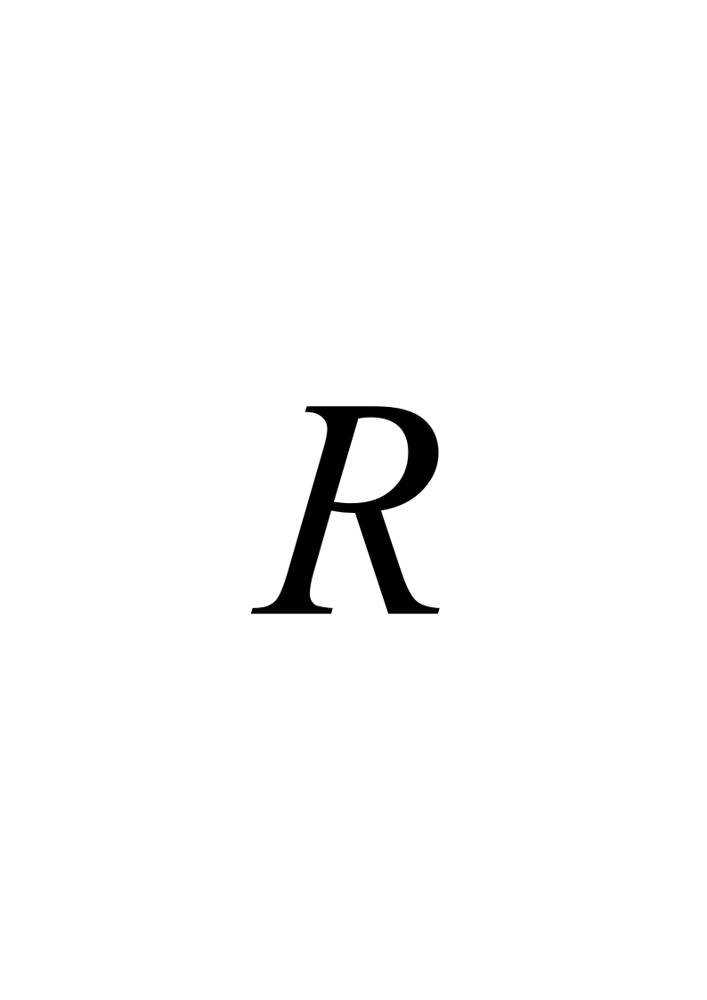
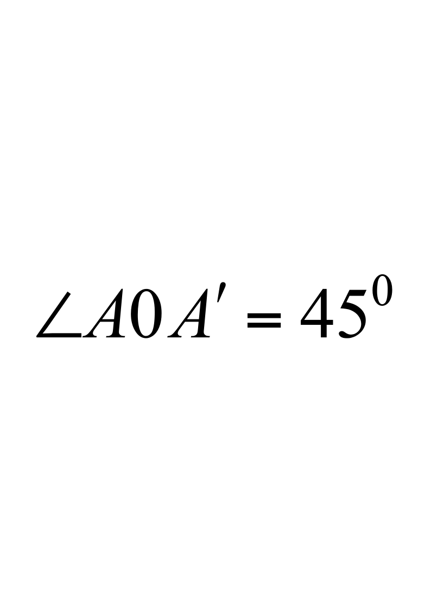
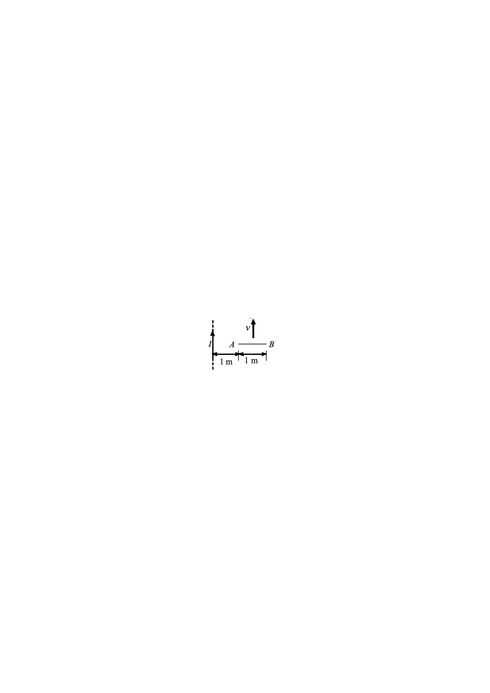
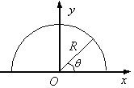
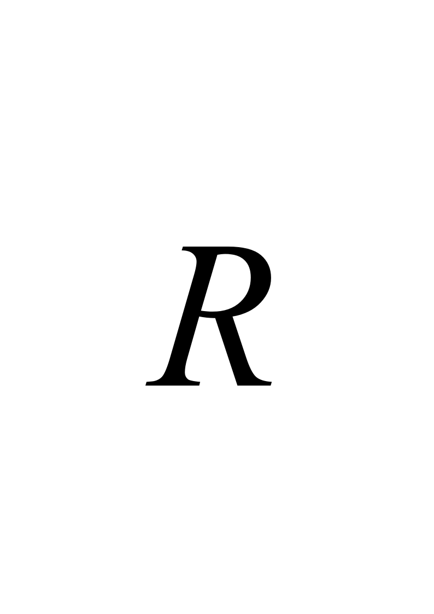
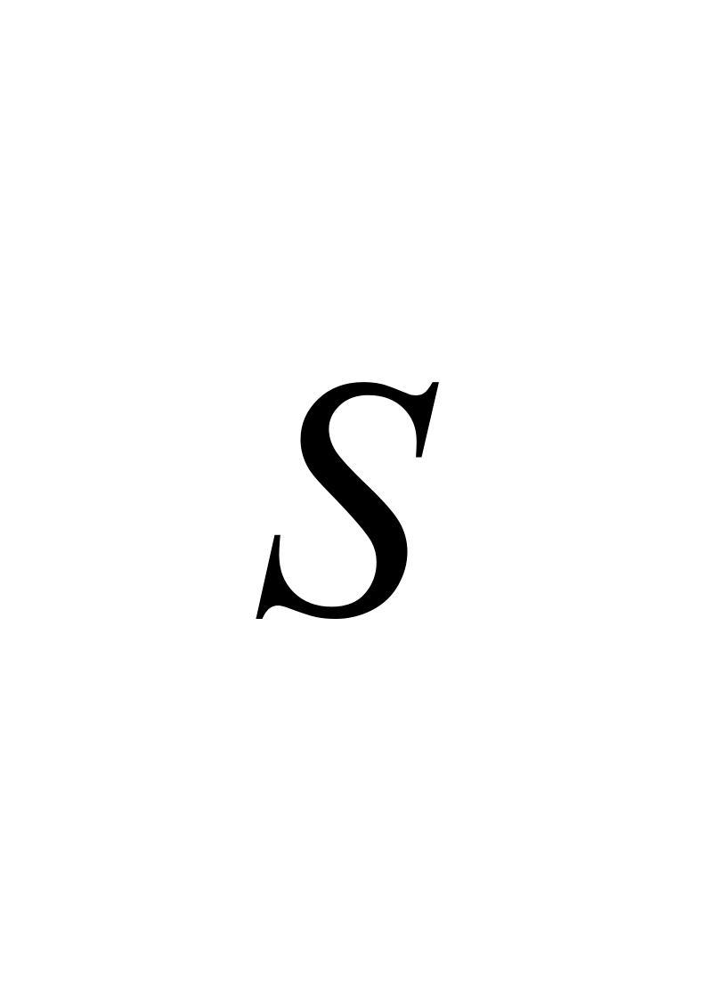

# 2013大学物理（2）A卷试卷规范模版

**诚信应考,考试作弊将带来严重后果！**

**华南理工大学期末考试**

**《2013级大学物理（II）期末试卷A卷》试卷**

**注意事项：1.** **考前请将密封线内各项信息填写清楚；**

**2.** **所有答案请直接答在答题纸上；**

**3．考试形式：闭卷；**

**4.** **本试卷共25题，满分100分，**	**考试时间120分钟。**

**考试时间：2015年1月9日9：00-----11：00**

<!-- question: university-physics-3-2-004-Q1 -->

一、选择题（共30分）

<!-- question: university-physics-3-2-004-Q2 -->

1．（本题3分）

一个静止的氢离子H+  (氢原子失去一个电子形成的阳离子)在电场中被加速而获得的速率为一静止的氧离子O+2  (氧原子失去两个电子形成的阳离子)在同一电场中且通过相同的路径被加速所获速率的

(A) 2倍．          (B) 2$\sqrt {2}$倍．

(C)  4倍．          (D)  4$\sqrt {2}$倍．                                ［      ］

<!-- question: university-physics-3-2-004-Q3 -->

2．（本题3分）

一导体球外充满相对介电常量为***r*的均匀电介质，若测得导体表面附近场强为*E*，则导体球面上的自由电荷面密度**为

(A)    ****0 *E*．      (B)  (****0 *****r* -****0)*E*．

(C)    *****r* *E*．       (D)   ****0 *****r* *E*．                         ［      ］

<!-- question: university-physics-3-2-004-Q4 -->

3．（本题3分）

一平行板电容器充电后仍与电源连接，若用绝缘手柄将电容器两极板间距离拉大，则极板上的电荷*Q*、电场强度的大小*E*和电场能量*W*将发生如下变化

(A)    *Q*减小，*E*减小，*W*减小．

(B)    *Q*增大，*E*增大，*W*增大．

(C)    *Q*增大，*E*减小，*W*增大．

(D)    *Q*增大，*E*增大，*W*减小．                          ［       ］

<!-- question: university-physics-3-2-004-Q5 -->

4．（本题3分）

一个通有电流*I*的导体，厚度为*D*，横截面积为*S*，放置在磁感强度为*B*的匀强磁场中，磁场方向垂直于导体的侧表面，如图所示．现测得导体上下两面电势差为*V*，则此导体的霍尔系数等于

(A)  $\frac {VDS} {IB}$．                  (B)  $\frac {IBV} {DS}$．

(C)  $\frac {VS} {IBD}$．                   (D)  $\frac {VD} {IB}$．

［      ］

<!-- question: university-physics-3-2-004-Q6 -->

5．（本题3分）

在某地发生两件事，静止位于该地的甲测得时间间隔为4 s，若相对于甲作匀速直线运动的乙测得时间间隔为5 s，则乙相对于甲的运动速度是(*c*表示真空中光速)

(A)  (4/5) c．        (B)  (3/5) c．

(C)  (2/5) c．        (D)  (1/5) c．                       ［      ］

<!-- question: university-physics-3-2-004-Q7 -->

6．（本题3分）

氢原子光谱的巴耳末系中波长最大的谱线用**表示，其次波长用**表示，则它们的比值**/**为：

(A)    20/27．            (B)  9/8．

(C)    27/20．            (D)  16/9．                     ［      ］

<!-- question: university-physics-3-2-004-Q8 -->

7．（本题3分）

已知粒子在一维矩形无限深势阱中运动，其归一化波函数为：

$\psi (x)=\frac {1} {\sqrt {a}}\cdot cos\frac {3\pi x} {2a}$,  (  - *a*≤*x*≤*a*  )

那么粒子在*x*  = 5*a*/6处出现的概率密度为

(A)  1/(2*a*)．      (B)  1/*a*．

(C)    $1/\sqrt {2a}$．     (D)    $1/\sqrt {a}$．                         ［      ］

<!-- question: university-physics-3-2-004-Q9 -->

8．（本题3分）

有下列四组量子数：

(1)    *n*  = 3，*l*  = 2，*m**l*  = 0，${m}_{s}=\frac {1} {2}$         (2)    *n*  = 3，*l*  = 3，*m**l*  = 1，${m}_{s}=\frac {1} {2}$．

(3)    *n*  = 3，*l*  = 1，*m**l*  =  -1，${m}_{s}=-\frac {1} {2}$．    (4)    *n*  = 3，*l*  = 0，*m**l*  = 0，${m}_{s}=-\frac {1} {2}$．

其中可以描述原子中电子状态的

(A)  只有(1)和(3)．    (B)  只有(2)、(3)和(4)．

(C) 只有(2)和(4)            (D)  只有(1)、(3)和(4)．   ［      ］

<!-- question: university-physics-3-2-004-Q10 -->

9．（本题3分）

设康普顿效应中入射X射线(伦琴射线)的波长**=0.0700nm，散射的X射线与入射的X射线垂直，则反冲电子的动能*E**K*最接近下列哪个值

(电子的静止质量*m**e*=9.11×10-31  kg  ，普朗克常量*h* =6.63×10-34  J·s，1 nm = 10-9  m)

(A)   7.34×10-17  J．         (B)  9.42×10-17J．

(C)    11.53×10-17J．         (D)    12.81×10-17  J．                     ［      ］

<!-- question: university-physics-3-2-004-Q11 -->

10．（本题3分）

波长$\lambda =500nm$的光沿$x$轴正向传播，若光的波长的不确定量$\Delta \lambda ={10}^{-4}nm$，则利用不确定关系式$\Delta {p}_{x}\Delta x\ge h$可得光子的$x$坐标的不确定量至少为

A、25 cm          B、50 cm

C、250  cm    D、500 cm    ［    ］

(普朗克常量*h* =6.63×10-34  J·s)

<!-- question: university-physics-3-2-004-Q12 -->

二、填空题（**共**30分）

<!-- question: university-physics-3-2-004-Q13 -->

11．（本题3分）

已知某静电场的电势函数*U*＝6*x*－6*x*2*y*－7*y*2  (SI)．由场强与电势梯度的关系

式可得点(1，1，0)处的电场强度$E$＝________$i$ +________$j$ +________$k$  (SI)．

<!-- question: university-physics-3-2-004-Q14 -->

12．（本题3分）

如图所示，两块很大的导体平板平行放置，面积都是*S*，有一定厚度，带电荷分别为*Q*1和*Q*2．如不计边缘效应，则*A*、*C*两个表面上的电荷面密度分别为____________、____________．

<!-- question: university-physics-3-2-004-Q15 -->

13．（本题3分）

一个带电的金属球，当其周围是真空时，储存的静电能量为*W*0，使其电荷保持不变，把它浸没在相对介电常量为***r*的无限大各向同性均匀电介质中，这时它的静电能量*W*=________ *W*0．

$$
I
$$

<!-- question: university-physics-3-2-004-Q16 -->

14．（本题3分）

如图，两根导线沿半径方向引到半径为的均质铁圆环上的*A*、*A**′*两点，并在很远处与电源相连，设，则环中心的磁感强度为____________．

<!-- question: university-physics-3-2-004-Q17 -->

15．（本题3分）

半径分别为*R*1和*R*2的两个半圆弧与直径的两小段构成的通电线圈*abcda* (如图所示)，放在磁感强度为$B$的均匀磁场中，$B$平行线圈所在平面．则线圈受到的磁力矩为______________．

16．（本题3分）

如图，一无限长直导线中通电流$I$，右侧有一长为1m的金属棒与导线垂直共面。棒的最左端A与长直导线相距为1m，当棒以速度$v$平行于长直导线匀速运动时，棒产生的动生电动势为______________．

<!-- question: university-physics-3-2-004-Q18 -->

17．（本题3分）

一线圈中的电流为1A，在$\frac {1} {16}s$内均匀地减小到零，所产生的自感电动势为8V，此线圈的自感为_________H．

<!-- question: university-physics-3-2-004-Q19 -->

18．（本题3分）

加在平行板电容器极板上的电压变化率1.0×106  V/s，在电容器内产生2A的位移电流，则该电容器的电容量为__________F．

<!-- question: university-physics-3-2-004-Q20 -->

19．（本题3分）

一根导线长为0.2m，载有电流3A，放在磁感应强度为10T的均匀磁场中，并与磁场成$30^\circ$角，则导线受到的磁力为______N．

<!-- question: university-physics-3-2-004-Q21 -->

20．（本题3分）

当氢原子中的电子处于$n=3$，$l=2$的状态时，该电子的轨道角动量有____个可能的空间取向．

<!-- question: university-physics-3-2-004-Q22 -->

三、计算题（共40分）

21．（本题10分）

如图，用绝缘细线弯成的半圆环，半径为*R*，其上均匀地带有正电荷，电荷线密度为**，**为一常数。试求圆心*O*点的电场强度的大小及方向．

<!-- question: university-physics-3-2-004-Q23 -->

22．（本题10分）

一无限长圆柱形铜导体(磁导率$mu_0$)，半径为，通有均匀分布的电流*I*．今取一矩形平面*S* (长为1 m，宽为2  *R*)，位置如右图中画斜线部分所示，求

<!-- question: university-physics-3-2-004-Q24 -->

（1）铜导体内外磁场的分布；

<!-- question: university-physics-3-2-004-Q25 -->

（2）通过该阴影矩形平面的磁通量。

<!-- question: university-physics-3-2-004-Q26 -->

23．（本题5分）

在惯性系中，两事件发生在同一地点而时间相隔为8秒，另一惯性系$S'$以速度$v=0.6c$相对于运动，则$S'$系中测得的两事件的空间间隔是多少？

<!-- question: university-physics-3-2-004-Q27 -->

24．（本题10分）

如图所示，一半径为*r*2电荷线密度为**的均匀带电圆环，里边有一半径为*r*1总电阻为*R*的导体环，两环共面同心(*r*2  >> *r*1)，当大环以变角速度*****t*)绕垂直于环面的中心轴旋转时，求小环中的感应电流．

<!-- question: university-physics-3-2-004-Q28 -->

25．（本题5分）

假如电子运动速度与光速可以比拟，则当电子的动能等于它静止能量的2倍时，其德布罗意波长为多少？

(普朗克常量*h* =6.63×10-34  J·s，电子静止质量*m**e*=9.11×10-31  kg)
