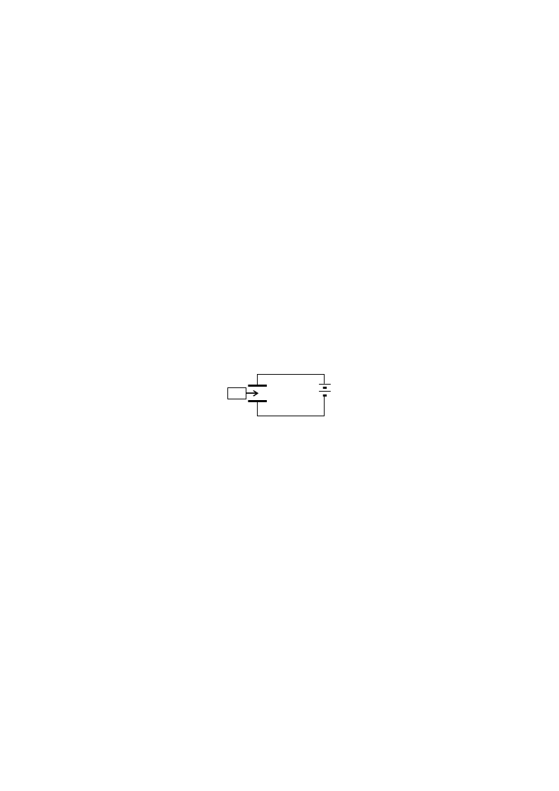

# 2021级大学物理III(二)B卷试卷规范模版（4学分）

**诚信应考,考试作弊将带来严重后果！**

**华南理工大学期末考试**

**2022-2023-1学期2021级《大学物理III（二）》期末考试B卷**

**注意事项：1.** **考前请将密封线内各项信息填写清楚；**

**2.** **所有答案请直接答在答题纸上；**

**3．考试形式：闭卷；**

**4.** **本试卷共25题，满分100分，**	**考试时间120分钟。**

**考试时间：2023年3月2日9：00-----11：00**

<!-- question: university-physics-3-2-006-Q1 -->

一、选择题（共30分）

<!-- question: university-physics-3-2-006-Q2 -->

1．（本题3分）

如图所示，在真空中半径分别为*R*和2*R*的两个同心球面，其上分别均匀地带有电荷+*q*和－3*q*．今将一电荷为+Ｑ的带电粒子从内球面处由静止释放，则该粒子到达外球面时的动能为：

(A)  $\frac {Qq} {4{\pi \varepsilon }_{0}R}$．       (B)  $\frac {Qq} {2{\pi \varepsilon }_{0}R}$．

(C)  $\frac {Qq} {8{\pi \varepsilon }_{0}R}$．       (D)  $\frac {3Qq} {8{\pi \varepsilon }_{0}R}$．        ［      ］

<!-- question: university-physics-3-2-006-Q3 -->

2．（本题3分）

*A*、*B*为两导体大平板，面积均为*S*，平行放置，如图所示．*A*板带电荷+*Q*1，*B*板带电荷+*Q*2，如果使*B*板接地，则*AB*间电场强度的大小*E*为

(A)    $\frac {{Q}_{1}} {{\varepsilon }_{0}S}$ ．          (B)    $\frac {{Q}_{1}-{Q}_{2}} {2{\varepsilon }_{0}S}$．

(C)    $\frac {{Q}_{1}} {2{\varepsilon }_{0}S}$．            (D)    $\frac {{Q}_{1}+{Q}_{2}} {2{\varepsilon }_{0}S}$．   ［       ］

<!-- question: university-physics-3-2-006-Q4 -->

3．（本题3分）

无限长直圆柱体，半径为*R*，沿轴向均匀流有电流．设圆柱体内(  *r*  <  *R*  )的磁感强度为*B**i*，圆柱体外(  *r*  >  *R*  )的磁感强度为*B**e*，则有

(A)    *B**i*、*B**e*均与*r*成正比．

(B)    *B**i*、*B**e*均与*r*成反比．

(C)  *B**i*与*r*成反比，*B**e*与*r*成正比．

(D)    *B**i*与*r*成正比，*B**e*与*r*成反比．                     ［      ］

<!-- question: university-physics-3-2-006-Q5 -->

4．（本题3分）

自感系数*L*  =0.2H的螺线管中通以*I*  =8 A的电流时，螺线管存储的磁场能量

*W* 为

(A)    0.8 J  ．          (B)    6.4 J  ．

(C)  12.8 J  ．          (D)  1.6 J  ．               ［      ］

<!-- question: university-physics-3-2-006-Q6 -->

5．（本题3分）

长直电流*I*2与圆形电流*I*1共面，并与其一直径相重合如图(但两者间绝缘)，设长直电流不动，则圆形电流将

(A)    绕*I*2旋转．      (B)    向左运动．

(C)  向右运动．      (D)    不动．

［      ］

<!-- question: university-physics-3-2-006-Q7 -->

6．（本题3分）

在磁感强度*B*  =0.02 T的匀强磁场中，有一半径为10 cm圆线圈，线圈磁矩与磁感线同向平行，回路中通有*I*  =1 A的电流．若圆线圈绕某个直径旋转180°，使其磁矩与磁感线反向平行，且线圈转动过程中电流Ｉ保持不变，则外力的功*A* 为

(A)  1.26×10-3  J．             (B)    0  J．

(C)  0.63×10-3  J  ．            (D)  2.52×10-3  J．

［      ］

<!-- question: university-physics-3-2-006-Q8 -->

7．（本题3分）

如图所示，一矩形线圈，以匀速自无场区平移进入均匀磁场区，又平移穿出．在(A)、(B)、(C)、(D)各*I*--t曲线中哪一种符合线圈中的电流随时间的变化关系(取逆时针指向为电流正方向，且不计线圈的自感)？

［      ］

<!-- question: university-physics-3-2-006-Q9 -->

8．（本题3分）

当照射光的波长从400nm变到300 nm时，对同一金属，在光电效应实验中测得的遏止电压将：

(A)  减小0.56 V．          (B)  减小0.34  V．

(C) 增大0.165 V．         (D)  增大1.035 V．               ［      ］

(电子的静止质量*m**e*=9.11×10-31  kg  ，普朗克常量*h* =6.63×10-34  J·s，1 nm = 10-9  m，

基本电荷*e*  =1.60×10-19  C)

<!-- question: university-physics-3-2-006-Q10 -->

9．（本题3分）

电子显微镜中的电子从静止开始通过电势差为*U*的静电场加速后，其德布罗意波长是 0.04  nm，则*U*约为

(A)    150 V  ．            (B)  330 V  ．

(C)  630 V  ．            (D)  940 V  ．                 ［      ］

(电子的静止质量*m**e*=9.11×10-31  kg  ，普朗克常量*h* =6.63×10-34  J·s，1 nm = 10-9  m，

基本电荷*e*  =1.60×10-19  C)

<!-- question: university-physics-3-2-006-Q11 -->

10．（本题3分）

在氢原子的L壳层中，电子可能具有的量子数(*n*，*l*，*m**l*，*m**s*)是

(A)  (1，0，0，$-\frac {1} {2}$)．       (B)  (2，1，-1，$\frac {1} {2}$)．

(C)  (2，0，1，$-\frac {1} {2}$)．       (D)    (3，1，-1，$-\frac {1} {2}$)．         ［      ］

<!-- question: university-physics-3-2-006-Q12 -->

二、填空题（共30分）

<!-- question: university-physics-3-2-006-Q13 -->

11．（本题3分）

面积为*S*的空气平行板电容器，极板上分别带电量±*q*，若不考虑边缘效应，则两极板间的相互作用力为_________________．

<!-- question: university-physics-3-2-006-Q14 -->

12．（本题3分）

在场强为$E$的均匀电场中，有一半径为*R*、长为*l*的圆柱面，其轴线与$E$的方向垂直．在通过轴线并垂直$E$的方向将此柱面切去一半，如图所示．则穿过剩下的半圆柱面的电场强度通量等于_________  ．

<!-- question: university-physics-3-2-006-Q15 -->

13．（本题3分）

一个带电荷*q*、半径为*R*的金属薄球壳，壳内是真空，壳外是电容率为** 的无限大各向同性均匀电介质，则此球壳球心的电势*U*  =________________．

<!-- question: university-physics-3-2-006-Q16 -->

14．（本题3分）

电容为*C*0的平板电容器，接在电路中，如图所示．若将相对电容率为***r*的各向同性均匀电介质插入电容器中(填满空间)，则此时电容器的电场能量是原来的____________倍．

<!-- question: university-physics-3-2-006-Q17 -->

15．（本题3分）

如图两个半径为*R*的相同的金属环在*a*、*b*两点接触(*ab*连线为环直径)，并相互垂直放置．电流*I*沿*ab*连线方向由*a*端流入，*b*端流出，则环中心*O*点的磁感强度的大小为________________．

<!-- question: university-physics-3-2-006-Q18 -->

16．（本题3分）

一自感线圈中，电流强度在 0.002 s内均匀地由10 A增加到12 A，此过程中线圈内自感电动势为 400 V，则线圈的自感系数为*L*  =____________H．

<!-- question: university-physics-3-2-006-Q19 -->

17．（本题3分）

在匀强磁场中，有两个平面线圈，其面积*A*1  =  3 *A*2，通有电流*I*1  = 3 *I*2，它们所受的最大磁力矩之比*M*1  /  *M*2等于________________________．

<!-- question: university-physics-3-2-006-Q20 -->

18．（本题3分）

在康普顿效应实验中，若散射光波长是入射光波长的 1.2倍，则散射光光子能量**与反冲电子动能*E**K*之比**/ *E**K*为________________________．

<!-- question: university-physics-3-2-006-Q21 -->

19．（本题3分）

质子在加速器中被加速，当其动能为静止能量的3倍时，其质量为静止质量的____倍．

<!-- question: university-physics-3-2-006-Q22 -->

20．（本题3分）

原子内电子的量子态由*n*、*l*、*m**l*及*m**s*四个量子数表征．当*n*、*l*一定时，不同的量子态数目为____________________．

<!-- question: university-physics-3-2-006-Q23 -->

三、计算题（共40分）

<!-- question: university-physics-3-2-006-Q24 -->

21．（本题10分）

图示为一个均匀带电的球层，其电荷体密度为**，球层内表面半径为*R*1，外表面半径为*R*2．设无穷远处为电势零点，求空腔内任一点的电势．

<!-- question: university-physics-3-2-006-Q25 -->

22．（本题10分）

在一半径*R* 的无限长半圆筒形金属薄片中，沿长度方向有半圆横截面上均匀分布的电流*I*通过（平面示意图中电流垂直纸面指向内  ）．试求半圆筒在垂直通过圆心的中心轴线任一点的磁感应强度的大小．

<!-- question: university-physics-3-2-006-Q26 -->

23．（本题10分）

载有电流*I*的长直导线附近，放一导体半圆环*MeN*与长直导线共面，且端点*MN*的连线与长直导线垂直．半圆环的半径为*b*，环心*O*与导线相距*a*．设半圆环以速度 $v$平行导线平移，求半圆环内感应电动势的大小以及*MN*两端的电压*U**M*  *U**N* ．

（注：可建立坐标系，长直导线为*y*轴，*MN*连线为*x*轴，原点在长直导线上）

<!-- question: university-physics-3-2-006-Q27 -->

24．（本题5分）

在惯性系S中，有两事件发生于同一地点，且第二事件比第一事件晚发生*t*  =2s；而在另一惯性系S＇中，观测第二事件比第一事件晚发生*t*=3s．那么在S＇系中发生两事件的地点之间的距离是多少？

<!-- question: university-physics-3-2-006-Q28 -->

25．（本题5分）

当氢原子从某初始状态跃迁到激发能(从基态到激发态所需的能量)为*E*  = 10.19 eV的状态时，发射出光子的波长是**=486  nm，试求该初始状态的能量和主量子数．(普朗克常量*h* =6.63×10-34  J·s，1 eV =1.60×10-19  J)        (里德伯常量*R*  =1.097×107  m-1 )
