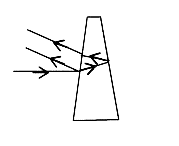
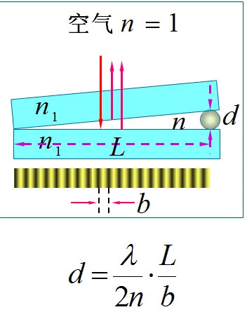

# 光的等厚干涉测量

**实验3.3** **光的等厚干涉测量**

**引言：**当频率相同、振动方向相同、相位差恒定的两束光相遇时会产生干涉现象。光的干涉现象证实了光具有波动性。光的干涉现象应用广泛，如精确地测量长度、光弹性研究、全息照相技术、检验表面粗糙度、研究零件内应力的分布等。

**一、实验目的**

（1）观察光的等厚干涉现象。

（2）利用牛顿环测量平凸透镜的曲率半径R。

（3）学习使用读数显微镜。

**二、实验仪器**

读数显微镜、牛顿环、钠光灯、劈尖。

**三、实验原理**

1.相干光的获得。一束光在遇到薄膜的上表面时首先会发生反射，命名为A光。在光透过上表面以后会在下表面处发生反射，再透过上表面，叫做B光。则A光和B光一定是相干的，在空间中某处相交就会发生干涉（显然A光与B光不是平行的）。

2.光程：光程是一个折合量，可以为计算提供简便。光程等于介质的折射率乘光在介质中传播的距离。

3.半波损失：光线从光疏介质射向光密介质发生反射引起的附加光程差λ/2。

4.牛顿环

牛顿环由一个曲率半径为R的平凸透镜A和一个平板玻璃C组成，两者之间形成一空气层。若用单色光从正上方垂直入射，则空气层上下两界面上反射的光将发生干涉，在等厚处形成同一干涉条纹。如图，若A在上C在下，从A的上观察，便可看见中心是一暗斑、周围有许多明暗相间且间隔逐渐减小的同心圆环；若C 在上A在下，从C的上方观察，便可看见中心是一亮斑、周围有许多明暗相间且间隔逐渐减小的同心圆环，以上两个图样互补。与第k级牛顿环相对应的两束相干光的光程差${ \sigma }_{k}=2{e}_{k}+\frac {\lambda } {2}$（2表示一个来回，ek为空气折射率与空气层厚度的乘积，λ/2为半波损失）由几何关系可得曲率半径$R=\sqrt {{r}_{k}^{2}+{\left ( {R-{e}_{k}}\right )}^{2}}$由相干光光程差分析可得由反射光产生明暗环的条件分别是$\left \{ {\begin {gathered} {r}_{k}=\sqrt {\left ( {2k-1}\right )R\frac {\lambda } {2}}(k=0,1,2\ldots 明环条件) \\ {r}_{k}=\sqrt {k\lambda R}(k=0,1,2\ldots 暗环条件) \end {gathered}}\right$

假设用暗环进行测量，测出第m级和第n级的暗环半径rm和rn，由数学关系可求得${r}_{m}^{2}-{r}_{n}^{2}=(m-n)R\lambda$。若用环的直径表示，则为$R=\frac {{D}_{m}^{2}-{D}_{n}^{2}} {4\left ( {m-n}\right )\lambda }$。用明环讨论结论相同。
1. 劈尖

劈尖实验通常使用单色光源，上有两个非常细小的狭缝，光线通过这两个狭缝后会形成干涉图样。利用空气劈尖测量薄膜厚度的原理：将需要测量微小厚度的待测物体夹在两片平板玻璃之间，形成劈尖干涉，用已知波长的单色光垂直照射劈尖，测量形成的干涉条纹间距，则待测物体的厚度可以用下图的公式计算出来

**四、内容步骤**

1.调节目镜使分划板十字叉丝线清晰。

2.将牛顿环仪放在读数显微镜的平台上，调整显微镜使45°透光反射镜正对钠光灯，在目镜观察到一个最亮的视场时，移动牛顿环仪使其在显微镜镜筒的正下方。

3.调节显微镜的调焦手轮使物镜接近牛顿环仪，然后在目镜观察，并继续缓慢调节调焦手轮使镜筒自上而下移动直至观察到牛顿环最清晰为止。

4.测量暗环直径D。为避免测微螺杆间隙所引起的空回误差，测量时必须使显微镜从左到右（或从右到左）分别记下叉丝线对准右（或左）边第30，…，20，19个暗环（垂直叉丝线与条纹宽度中央相切）时显微镜的读数xi，再沿同方向继续移动镜筒，并记下左（或右）边第19，20，…，30个暗环的读数xi。将数据记录于下表中。

5.换成劈尖，观察到最清晰图像后，从任意一个条纹左侧开始测量，直至20个条纹后左侧截止，观察螺旋测微器读数。

**五、数据处理**

**1表：牛顿环数据：**

<table>
<tr><td>暗环级数m</td><td>暗环位置xi</td><td>Dm (mm)</td><td>暗环级数n</td><td>暗环位置xi</td><td>Dn (mm)</td><td>Dm-Dn/m2</td></tr>
<tr><td></td><td>左</td><td>右</td><td></td><td></td><td>左</td><td>右</td><td></td><td></td></tr>
<tr><td>30</td><td>6.078</td><td>14.135</td><td>8.057</td><td>24</td><td>6.480</td><td>13.738</td><td>7.258</td><td>12.237</td></tr>
<tr><td>29</td><td>6.137</td><td>14.070</td><td>7.933</td><td>23</td><td>6.550</td><td>13.660</td><td>7.110</td><td>12.380</td></tr>
<tr><td>28</td><td>6.204</td><td>14.000</td><td>7.796</td><td>22</td><td>6.624</td><td>13.590</td><td>6.966</td><td>12.252</td></tr>
<tr><td>27</td><td>6.266</td><td>13.945</td><td>7.679</td><td>21</td><td>6.697</td><td>13.517</td><td>6.820</td><td>12.455</td></tr>
<tr><td>26</td><td>6.334</td><td>13.872</td><td>7.538</td><td>20</td><td>6.774</td><td>13.440</td><td>6.666</td><td>12.386</td></tr>
<tr><td>25</td><td>6.410</td><td>13.818</td><td>7.408</td><td>19</td><td>6.851</td><td>13.354</td><td>6.503</td><td>12.589</td></tr>
</table>

**2表：劈尖干涉数据：**

<table>
<tr><td>**次数**</td><td>**位置** **Xi/mm**</td><td>**位置X(i+20)/mm**</td><td>**L/mm**</td><td>**S/mm**</td><td>**Ave.S/mm**</td></tr>
<tr><td>**1**</td><td>**12.025**</td><td>**16.045**</td><td>**4.020**</td><td>**0.201**</td><td>**0.202**</td></tr>
<tr><td>**2**</td><td>**14.030**</td><td>**18.027**</td><td>**3.997**</td><td>**0.200**</td><td></td></tr>
<tr><td>**3**</td><td>**7.090**</td><td>**11.185**</td><td>**4.095**</td><td>**0.205**</td><td></td></tr>
</table>

1. 劈尖干涉D=N0λL/2s(L=48.0mm)=0.0021mm
1. (牛顿环)用逐差法处理数据，并根据如下公式求出球面的曲率半径。

$R=\frac{D_m^3-D_n^3}{4(m-n)\lambda}$=875.556mm
- **结论与分析**

**牛顿环：**

结论： 牛顿环是一种在透明介质（如玻璃）与平坦表面（如平板玻璃或凸透镜）接触时观察到的干涉现象。当平板玻璃和透镜之间存在微小的空气层时，由于光的波动性质，从光源射入的光在介质之间发生反射和折射，形成了一系列明暗交替的环状条纹。

分析： 牛顿环的形成可以通过光的波动理论进行解释。当光通过介质界面时，发生了反射和折射，导致了光波的相位差。在某些位置，这些相位差会导致光波叠加，形成增强的干涉条纹，而在其他位置则会形成削弱的干涉条纹。

**劈尖干涉：**

结论： 劈尖干涉是一种通过在光线经过两个狭缝后观察干涉现象的实验。当单色光通过两个狭缝时，光波从两个缝中发出，会在一定距离处形成干涉条纹。这些条纹是光波相互叠加的结果，表现为明暗交替的条纹。

分析： 劈尖干涉实验也可以用光的波动理论进行解释。当光线通过两个狭缝时，每个狭缝成为新的波源，发出球面波。这些波相遇并在空间形成干涉图样。

**个人总结：牛顿环和劈尖干涉实验都是通过观察光的波动性质来解释的。这表明光不仅具有粒子性质，还具有波动性质。两种实验都展示了干涉现象，即光波相互叠加形成的明暗条纹。这进一步证明了光的波动性质。**
