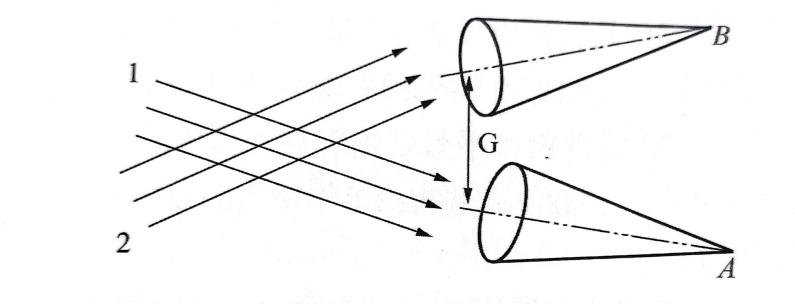
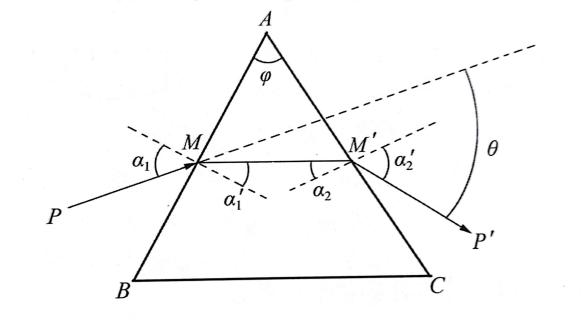
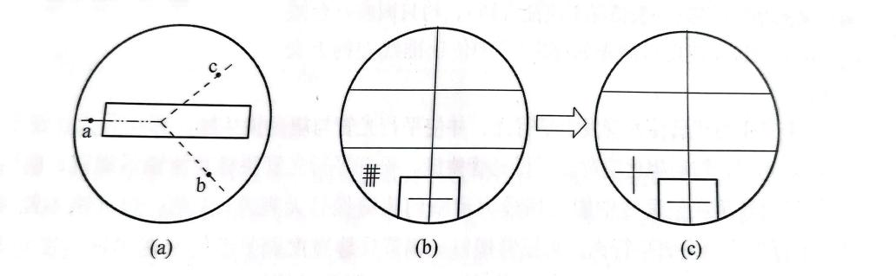
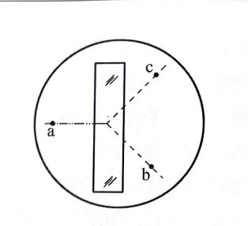
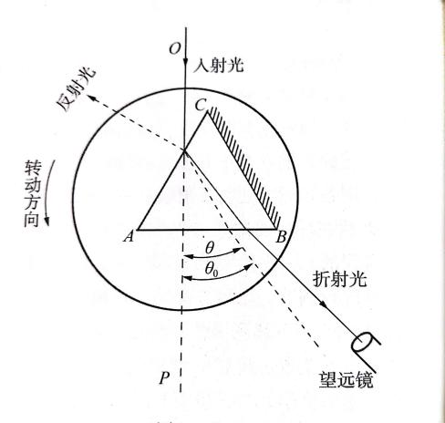

# 分光计的调整与使用

分光计的调整与使用
- **实验目的**
1. 了解分光计的构造、作用和工作原理。
1. 掌握分光计的调整和使用方法。

(3)用分光计测棱镜的折射率。
- **实验仪器**

分光计、三棱镜、反射镜、汞灯
- **实验原理**

**1.测角原理**

测量光线之间的夹角，实质是测定平行光束的方位角。如图1所示，A、B分别为平行光束和在望远镜焦平面上的会聚像点。焦平面上的每一个点，都与从一定方向入射的平行光束相对应。如果望远镜的光轴绕垂直于光束1和2的转轴转动，光轴由于平行于光束1的方位(光轴上的会聚像点为A)转到平行于光束2的方位(光轴上的会聚像点为 B  )，则光轴所转过的角度即是平行光束1与2之间的夹角$\theta_0$。

 图1

**2.用最小偏向角法测三棱镜折射率n的原理**

如图2所示，单色光PM以入射角$alpha_1$投射到三棱镜的AB面，经两次折射后，以$alpha_2'$角从 AC 面射出。入射光束与折射光束的夹角$\theta$称为偏向角。显然

$$
theta=(\alpha_1-\alpha_i')+(\alpha'_i-\alpha_2)=\alpha_1+\alpha'_i-\varphi
$$

式中$\phi$为棱镜的顶角。

图2

对于给定的棱镜，其顶角$\phi$和折射率n都是已定的。从上式可见，偏向角$\theta$是$alpha_1$的函数。用微商计算可以证明，当$\alpha_1=\alpha_2,\alpha_1^\prime=\alpha_2^\prime$时，即MM'//BC(磨砂面)，此时$\theta$值最小，称为最小偏向角，用$\theta_0$表示。此时有$\alpha_1=\frac{\varphi}{2},\alpha_1=\frac{(\varphi+\theta_0)}{2}$，

则折射率

$$
n=\frac{\sin_{2}^{1}(φ+θ_{c})}{\sin\frac{1}{2}\varphi}
$$

棱镜的顶角$\phi$由实验室给出，实验时只要测出最小偏向角0。便可计算出棱镜的折射率n。
- **内容步骤**

**1.调节分光计**

(1)目测粗调。目测粗调就是直接用眼睛观察进行调节。调节望远倾斜度调节螺钉和平行光管倾斜度调节螺钉使望远镜和平行光管平行于刻度盘;调节载物台倾斜度调节螺钉使载物台平行于刻度盘。

(2)细调的要求和步骤:

①调节目镜使能清晰地看到分划板的准线。接上小灯泡电源，打开开关，观察视场下半区是否有绿色光区。若有，则缓慢地转动目镜调焦手轮直到能够清晰地看到准线和绿色光区中的绿色“十”字。

②用自准法调节望远镜使其适合接收平行光。将载物台上三条120°等分线分别与载物台下三个调节螺钉对齐，再将双面反射镜按图3所示的位置放置在载物台上，松开载物台锁紧螺钉，升降载物台使反射镜的中心望远镜轴线等高;松开游标盘止动螺钉，微微转动游标盘(连同载物台)使反射镜面正对望远镜，并适当微调望远镜倾斜度调节螺钉使之能在目镜中观察到一个反射回来的模糊亮斑(或不清晰的亮“十”字)，松开望远镜调焦锁紧螺钉，前后缓慢伸缩目镜套筒直到能看到清晰的亮“十”字，并与分划板的准线无视差，此时望远镜已调到适合接收平行光，再将螺钉锁紧。

图3

③调节望远镜的光轴垂直于分光计旋转主轴。首先在看到清晰亮“十”字的一个面，用各半调节法将亮“十”字调至准线的上交叉点，即调节望远镜倾斜度调节螺钉使亮“十”字上升(或下降)h/2，调节三个载物台倾斜度调节螺钉中的 b(或c)使亮“十”字升高(或降低)h/2。再将游标盘(连同载物台)转过180°使反射镜的另一面对准望远镜，若此时还能在视场中看到反射回来的亮“十”字，则按上述各半调节法将亮“十”字调至准线的上交叉点。如此在两个面反复调节几次，直到两个面反射回来的亮“十”字都能与准线上交叉点重合，则望远镜的光轴垂直于分光计的旋转主轴。

若用各半调节法将反射镜的一个面反射回来的亮“十”字调到了准线上方交叉点，但转过180°后在反射镜的另一个面却找不到反射回来的亮“十”字，则应当回到已调好的面进行有目的的调节，而不应在没有看到亮“十”字的面盲目进行调节。正确方法是:将调好的一个面对准望远镜，调节望远镜的倾斜度调节螺钉使亮“十”字下移到绿色区附近，再调节载物台的调平螺钉b或c使亮“十”字重新回到准线的上交叉点。将游标盘转过180°观察另一个面看是否能看到反射回来的亮“十”字、若有，则按各半调节法将亮“十”字调至准线的上交叉点;若无，则再重复上述的调整过程一次。应当注意，若沿同一方向做了两次调节之后仍不能在两个面观察到反射回来的亮“十”字，则应当用上述的方法做相反方向调节。

④调载物台法线平行于分光计旋转主轴。将反射镜按图4所示位置放置，转动游标盘使反射镜的一个面正对望远镜。此时，不管在视场中能否看到反射回来的亮“十”字，均只调载物台倾斜度调节螺钉a使反射回来的亮“十”字位于准线上的上交叉点。                                  图4

⑤调节平行光管使光管发出平行光，并使平行光管与望远镜共轴。移动分光计使平行管正对光源，转动望远镜对准平行光管狭缝，松开平行光管狭缝套筒锁紧螺钉，前后伸缩狭缝套筒直至在望远镜中能看到最为清晰的狭缝像且无视差(注意:望远镜不能再调)，平行光管能发出平行光，再锁紧螺钉。调节狭缝宽度调节手轮使在望远镜视场中观察到的狭缝宽度为1~2mm。调节平行光管高低倾斜度调节螺钉使狭缝像被分划板中央水平准线平分;调节平行光管同轴调节螺钉和望远镜同轴调节螺钉使视场中的狭缝像与分划板垂直准线重合。

**2.测量最小偏向角**

按图5将三棱镜置于载物台，使平行光束入射三棱镜AC面(注意:应使入射角稍大些)。锁紧游标盘止动螺钉，放松望远镜止动螺钉，往偏向于BC面方向转动望远镜寻找经棱镜折射的光(即狭缝像)。找到后拧松游标锁紧螺钉，按图中所示的转动方向缓慢转动游标盘，要求所观察到的折射光线必须向入射光线方向OP移动，即沿偏向角减小的方向移动。若不能，则应沿相反方向缓慢转动游标盘。在转动过程中，若狭缝像超出视场范围，则应转动望远镜(锁紧游标盘)进行跟踪，使狭缝像一直处在视场中。当随着游标盘转动而移动的狭缝像正要开始向反方向移动时，即为相应的折射光线最小偏向角的位置。

微调望远镜使分划板准线的竖线对准狭缝中央，记下左、右游标窗的读数$alpha_1$;和$alpha_1'$，即为折射光线位置读数。

锁紧控制望远镜与刻度盘一起转动的锁紧螺钉，锁紧游标盘，取下三棱镜，转动望远镜对准平行光管狭缝，并使分划板准线的竖线对准狭缝像中央，记录左、右游标的读数$alpha_2$和$alpha_2'$，即为入射光线位置读数。最小偏向角为

$$
theta_0=\frac{|alpha_1-alpha_2|+|alpha_i-alpha_2|}{2}
$$
- **数据处理**

三棱镜顶角=60°00′±5′

<table>
<tr><td>测量序数</td><td>折射光线位置读数</td><td>入射光线位置读数</td><td>$\theta_0$</td><td>$n$</td></tr>
<tr><td></td><td>$alpha_1$（左）</td><td>$alpha_1'$（右）</td><td>$alpha_2$（左）</td><td>$alpha_2'$（右）</td><td></td><td></td></tr>
<tr><td>1</td><td>30°22′</td><td>210°22′</td><td>71°34′</td><td>251°34′</td><td>41°12′</td><td>1.545</td></tr>
<tr><td>2</td><td>46°59′</td><td>226°56′</td><td>88°11′</td><td>268°12′</td><td>41°14′</td><td>1.546</td></tr>
<tr><td>3</td><td>52°17′</td><td>232°19′</td><td>93°28′</td><td>273°28′</td><td>41°10′</td><td>1.545</td></tr>
</table>

$\sigma=\sqrt{\frac{1}{k(k-1)}\left(\sum_{i=1}^{k}(n_i-n)^2\right)}$,$n=\overline{n}+\sigma_{}$=1.545±0.002
- **结论及分析**

结论：

通过测量，我们确定了三棱镜的折射率。根据实验数据，我们计算出三棱镜的折射率为1.545±0.002。这个结果与理论值进行比较后，我们发现两者相符。

分析：

实验结果与理论值相符，实验过程准确无误，数据可靠。

误差分析：

仪器误差：分光计和其他实验仪器的精确度限制了实验结果的准确性。

人为误差：由于操作技巧、读数偏差等原因，可能会引入一定的误差。

环境因素：温度、湿度等环境因素可能影响实验结果。

改进方法：

提高仪器的精确度和稳定性。

加强操作技巧培训，减小人为误差。

控制实验环境，减少外部因素对实验的影响。

通过对实验结果的分析，我们可以更深入地理解实验过程中可能存在的误差来源，并提出改进方法，以提高实验结果的准确性和可靠性。
