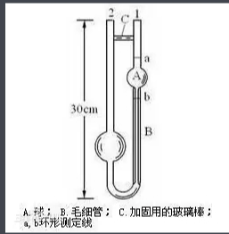
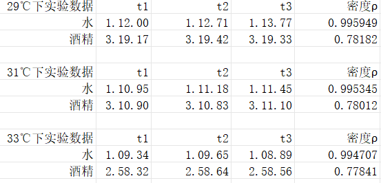
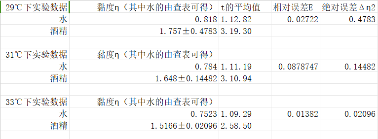

# 奥式黏度计测定液体动力黏度

实验报告

实验名称：液体动力黏度的测量
- 实验目的
1. 掌握奥式黏度计测定液体动力黏度的方法。
1. 熟练运用秒表测量时间、量杯量取液体、温度计测量温度的基本操作。
1. 了解实验方法中比较法的优点。
1. 进一步理解液体粘滞性的意义。
- 实验仪器

奥式黏度计、温度计、比重计、秒表、酒精、蒸馏水、移液管、吸球、玻璃缸、支架、胶管。
- 简要原理

本实验利用比较法，借助奥式黏度计测量酒精的黏度。由泊肃叶定理可推导得待测流体的黏度

η1=ρ1*t1*η2/ρ2*t2

η1为水的黏度，ρ1、ρ2为水和酒精的密度，t1和t2为相同体积酒精和水流过细管f所经过的时间。

奥氏粘度计就是奥斯瓦尔德（W.Ostwald）设计的。它是带有两个球泡的U形玻璃管，Ⅰ泡上、下放各有一刻痕a和b，其下方为一段毛细管。使用时，使体积相等的两种不同液体分别流过Ⅰ泡下的同一毛细管，由于两种液体的粘滞系数不同，因而流完的时间不同。测定时，一般都是用水作为标准液体。先将水注入Ⅱ泡内，然后吸入Ⅰ泡中，并使水面达到刻痕a以上。由于重力作用，水经毛细管流入Ⅱ泡，当水面从刻痕a降到刻痕b时，记下其间经历的时间t1，然后在Ⅱ泡内换以相同体积的待测液体，用相同的方法测出相应的时间t2
- 实验步骤

①用蒸馏水清洗黏度计内部，将黏度计装入盛有水的玻璃缸中，让水超过痕迹线A，加入加热装置于缸中。

②用移液管取出8毫升蒸馏水水从粗管内倒入黏度计内，注意不要留下气泡，注意：取水和待测液体的用具不能混用。

③用吸耳球插入粗管中并摁压其是黏度计中的水面略高于痕迹线A，然后让水在重力下经过毛细管落下，当水面凹平面与痕迹线A重合时按动秒表开始计时，当液面凹平面与痕迹线B相切时按停秒表，记下所需时间t1，然后重新测量三次。

④将蒸馏水换成待测酒精，重复步骤②和③，测量同体积酒精流经毛细管所需时间t2，重复测量三次。

⑤测量t1和t2时记录下当时温度，在三次不同温度下再次做实验，用密度计分别测量当时酒精的密度。

五、原始数据

六、数据处理

