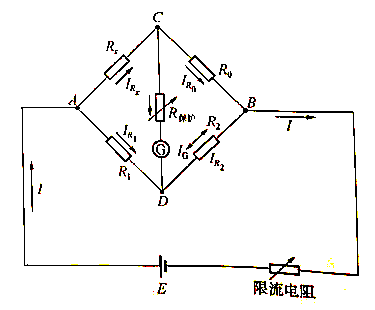
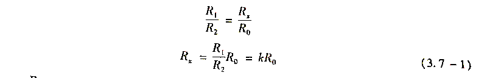
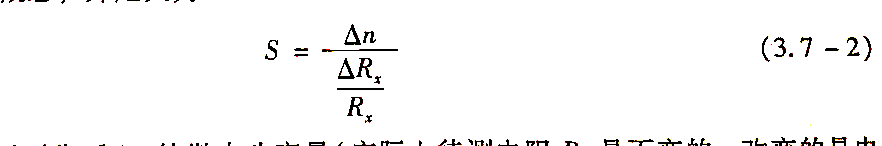
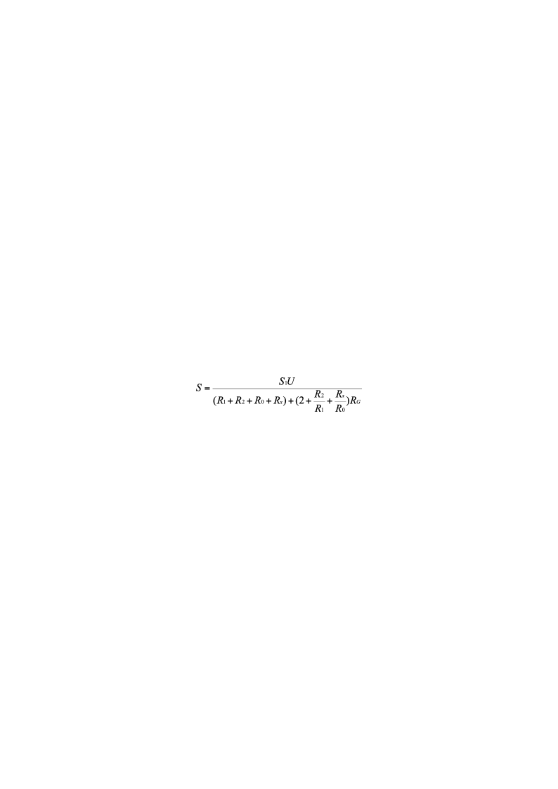
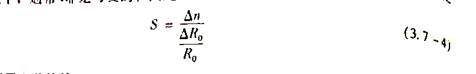
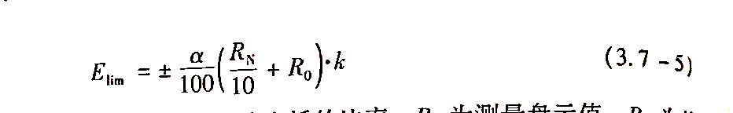
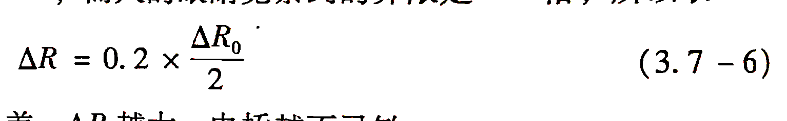
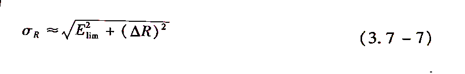
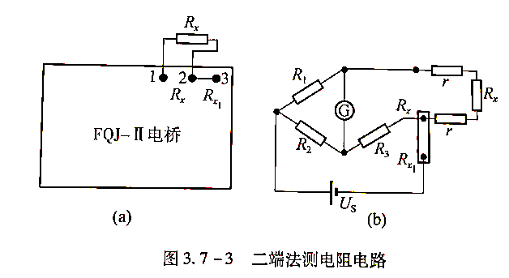

# 用惠斯登电桥测电阻

用惠斯登电桥测电阻
- **实验目的**

(1)了解惠斯登电桥的原理和特点

(2)学会使用惠斯登电桥测电阻。
- **实验仪器**

FQJ型非平衡电桥、平衡指示仪(检流计)、电阻箱、待测电阻、直流稳压电源。
- **实验原理**

**1. 惠斯登电桥的线路原理**

把待测电阻${\mathrm {R}}_{\mathrm {X}}$与另外3个可变电阻${\mathrm {R}}_{\mathrm {1}}\mathrm {、}{\mathrm {R}}_{\mathrm {2}}\mathrm {、}{\mathrm {R}}_{\mathrm {3}}$连接成一个闭路的电阻四边形电路(如图)

电池E通过与四边形的两个相对顶端A和B相连，在另外两个相对顶端C 和D之间接入检流计。这样连接的电路称为惠斯登电桥。电阻R1、R2、R3、R4,称为“桥臂”，接入检流计的对角线CD称为“桥”。检流计的作用是对“桥”的两端点的电位直接进行比较。当C、D两点电位相等时，检流计中无电流通过，电桥达到平衡，即${V}_{AC}\mathrm {=}{V}_{AD}\mathrm {;}{I}_{R\mathrm {1}}\mathrm {=}{I}_{R\mathrm {2}}\mathrm {,}{I}_{R\mathrm {0}}\mathrm {=}{I}_{RX}$。可得

式中，k=R1/R2称为比率。若${R}_{\mathrm {1}}\mathrm {、}{R}_{\mathrm {2}}\mathrm {、}{R}_{\mathrm {0}}$  (或k和${R}_{\mathrm {0}}$)已知，${R}_{X}$即可由上式求出。

**2.电桥的灵敏度**

公式(3.7-1)是在电桥平衡条件下的结果，而电桥是否平衡，实际上是看检流计有无偏转来判断的。而检流计的灵敏度总是有限的。如我们实验所用的检流计，指针偏转1格所对应的电流大约为${\mathrm {10}}^{\mathrm {-6}}$A,当通过它的电流比${\mathrm {10}}^{\mathrm {-7}}$A还要小时，指针的偏转小于0. 1格，我们就很难察觉出来(数字检流计小于${\mathrm {10}}^{\mathrm {-8}}$A)。假设电桥在$\frac {{R}_{\mathrm {1}}} {{R}_{\mathrm {2}}}\mathrm {=1}$时调整到了平衡，则有${R}_{X}\mathrm {=}{R}_{\mathrm {0}}$。这时，若${R}_{\mathrm {0}}$改变一个量${\mathrm {∆}R}_{\mathrm {0}}$，电桥就失去平衡，从而有电流${I}_{G}$流过检流计。但如果${I}_{G}$小到使检流计的偏转觉察不出来，我们就会认为电流还是平衡的，因而得出${R}_{X}\mathrm {=}{R}_{\mathrm {0}}\mathrm {+∆}{R}_{\mathrm {0}}$。$\mathrm {∆}{R}_{\mathrm {0}}$就是由于检流计灵敏度不够而带来的测量误差$\mathrm {∆}{R}_{X}$。对此，我们引入电桥灵敏度S的概念，并定义为

式中，$\mathrm {∆}{R}_{X}$是在电桥平衡后的${R}_{X}$微小改变量(实际上待测电阻${R}_{X}$是不变的，改变的是电阻${R}_{\mathrm {0}}$);  $\mathrm {∆}n$是由电桥偏离平衡而引起检流计指针偏转的格数。S越大，说明电桥越灵敏，误差也就越小。例如，S等于一格除以1%，也就是当${R}_{X}$改变1%时(实际上是${R}_{\mathrm {0}}\mathrm {改变}$1%时)，检流计可以有1格的偏转。通常我们能觉察到1/5格的偏转，也就是说，当电桥平衡后，${R}_{X}$只要改变0.2%，我们就可以觉察出来。这样，由电桥灵敏度的限制所带来的误差不会大于0.2%。

如果由于检流计灵敏度不够，或通过它的电流太微弱而无法觉察出来，可以增加电源电压，微弱电流相应增大，从而使检流计指针发生较大的偏转。因此，检流计的灵敏度和电源电压的高低对电桥灵敏度都有影响。式(3.7 -2)是对特定的电桥、检流计和电源电压而言的。可以证明，电桥灵敏度通用表达式为

式中，${S}_{\mathrm {1}}\mathrm {=}\frac {\mathrm {∆}n} {\mathrm {∆}{I}_{G}}$为检流计灵敏度，U为电源电压。

可以证明，由于桥臂电阻所处位置的对称性，改变任一桥臂电阻得到的电桥灵敏度是相同的。在实验中，通常${R}_{\mathrm {0}}$是可变的，因此有

**3.电桥的测量误差估算**

当在符合仪器规定的参考条件下使用时，根据JJQ125- 1986 文件规定，电桥的其+误差极限可用下式表示

式中，a为电桥的准确度等级; k为缩放因子，取电桥的比率;  ${R}_{\mathrm {0}}$为测量盘示值;  ${R}_{N}$为基准值，各有效量程的基准值应为该量程内最大值的10的整数幂。例如，量程为1111.1n,此量程的基准值为10000Ω。准确度等级α不但反映了电桥中各标准电阻(比率k和测量臂${R}_{\mathrm {0}}$)的准确度及检流计的灵敏度，而且还与测量范围、电源电压等因素有关(请参阅本实验附录)。

一般在实验中由电桥的灵敏度引人的误差$\mathrm {∆}R$是这样估算的：在电桥平衡时，将${R}_{\mathrm {0}}$改变${\mathrm {∆}R}_{\mathrm {0}}$使检流计指针偏转的格数$\mathrm {∆}n$=2，而人的眼睛觉察到的界限是0.2格，所以取

$\mathrm {∆}R$反映了平衡判断中可能包含的误差。AR 越大，电桥越不灵敏。

测量结果的总误差可表示为

- **内容步骤**

①首先熟悉电桥结构，再按面板上的电路Ⅰ连接电路。

②量程倍率设置:电桥的量程倍率可视被测电阻的大小自行设置。方法是：通过面标上的连线${\mathrm {R}}_{\mathrm {a}}$和${\mathrm {R}}_{\mathrm {b}}$与${\mathrm {R}}_{\mathrm {1}}\mathrm {、}{\mathrm {R}}_{\mathrm {2}}$两组接口来实现， 如“x1”倍率，由图3.7-2所示${\mathrm {R}}_{\mathrm {a}}$排空，${\mathrm {R}}_{\mathrm {1}}$的1000Ω孔用导线连接，${\mathrm {R}}_{\mathrm {b}}$接${\mathrm {R}}_{\mathrm {2}}$，“1000” 盘上打“1”，其余盘均为0；如“$\mathrm {\times }{\mathrm {10}}^{\mathrm {-1}}$倍率，连接${\mathrm {R}}_{\mathrm {1}}$孔的100Ω，${\mathrm {R}}_{\mathrm {b}}$=${\mathrm {R}}_{\mathrm {2}}$=1000Ω；如${\mathrm {\times 10}}^{\mathrm {-2}}$倍率”，连接${\mathrm {R}}_{\mathrm {1}}$=10Ω、${\mathrm {R}}_{\mathrm {b}}$=${\mathrm {R}}_{\mathrm {2}}$= 1000 Ω。

| 量程倍率 | 有效量程（Ω） | 准确度（%） | 基准电阻RS（Ω） | 电源电压（V） |
|---|---|---|---|---|
| ×10-2 | 10~111.111 | 0.5 | 100 | 5 |
| ×10-1 | 100~1111.111 | 0.3 | 1000 | 5、1.3 |
| ×1 | 1k~11.1111k | 0.2 | 10000 | 5、1.3 |
| ×10 | 10k~111.111k | 1 | 100000 | 15 |
| ×102 | 100k~111.111k | 2 | 1000000 | 15 |

③"功能、电压选择”开关置于“平衡(5 V)”或“平衡15 V"(可按表3.7-1选择)，并接通电源。

④按图3.7-3所示接上被测电阻，${R}_{\mathrm {3}}$测量盘打到等于被测电阻的标称值除以倍率的商的数字，旋下G、B按钮，调节${R}_{\mathrm {3}}$使电桥平衡(电流表示值为0)，则被测电阻阻值${R}_{X}\mathrm {=}{R}_{\mathrm {1}}\mathrm {∙}\frac {{R}_{\mathrm {1}}} {{R}_{\mathrm {2}}}\mathrm {=}k\mathrm {∙}{R}_{\mathrm {3}}$

⑤调节${R}_{\mathrm {3}}$使检流计G示值分别为+0.1 μA，记下左偏和右偏电流表示值为土0.1 μA 时对应的电阻${R}_{\mathrm {3}}$值。将测量数据记录于表中。
- **数据处理**

<table>
<tr><td>待测电阻</td><td>Rx1</td><td>Rx2</td><td>Rx3</td><td>Rx4</td></tr>
<tr><td>电阻标称值（Ω）</td><td>51</td><td>220</td><td>1.5k</td><td>22k</td></tr>
<tr><td>比率K</td><td>0.01</td><td>0.1</td><td>1</td><td>10</td></tr>
<tr><td>准确度等级α</td><td>0.5%</td><td>0.3%</td><td>0.2%</td><td>1%</td></tr>
<tr><td>R3（Ω）</td><td>5126.30</td><td>2204.00</td><td>1559.00</td><td>2226.00</td></tr>
<tr><td>平衡后将G偏0.1μA</td><td>+0.1</td><td>-0.1</td><td>+0.1</td><td>-0.1</td><td>+0.1</td><td>-0.1</td><td>+0.1</td><td>-0.1</td></tr>
<tr><td>△R3=\|R3’-R3\|（Ω）</td><td>24.3</td><td>1</td><td>3</td><td>4</td><td>1</td><td>2.1</td><td>2.1</td><td>1</td></tr>
<tr><td>△R=K△R3/1.732（Ω）</td><td>0.14030</td><td>0.00577</td><td>0.17321</td><td>0.23094</td><td>0.57736</td><td>1.21247</td><td>12.12471</td><td>5.77367</td></tr>
<tr><td>△R平均（Ω）</td><td>0.07303</td><td>0.20207</td><td>0.89491</td><td>8.94919</td></tr>
<tr><td>测量值KR3（Ω）</td><td>51.2630</td><td>220.400</td><td>1559.00</td><td>22260</td></tr>
<tr><td>\|Elim\|（Ω）</td><td>0.00261315</td><td>0.006912</td><td>0.04977</td><td>0.6978</td></tr>
<tr><td>σR（Ω）</td><td>0.07</td><td>0.2</td><td>0.8</td><td>8</td></tr>
<tr><td>Rx=KR3±σR（Ω）</td><td>51.2630±0.07</td><td>220.400±0.2</td><td>1559.00±0.8</td><td>22260±8</td></tr>
</table>

- **结论及分析**

**思考题**

1.使电桥测量误差增大的主要因素是什么?如何提高电桥的灵敏度?

用惠斯通电桥测量纯电阻时，电源电压不太稳定，不会加大测量误差，但电源电压太低，会使测量回路的电流减小，降低灵敏度，会使误差加大；用惠斯通电桥测量具有电感的电阻时，如果电源电压不太稳定，将难以调到平衡状态，因此也使测量不准，就会造成误差加大；提高驱动电源电压、增加变化的桥臂。
1. 进行为什么用电桥法测电阻较用伏安法测电阻准确?

伏安法测量电阻时因有接入误差的影响，不能实现精测电阻，欧姆表测量电阻的精度比较低，同样不能实现精测。电桥是通过比较法，交换法测量电阻，测量精度可以达到很高的精度，可以实现精测。
