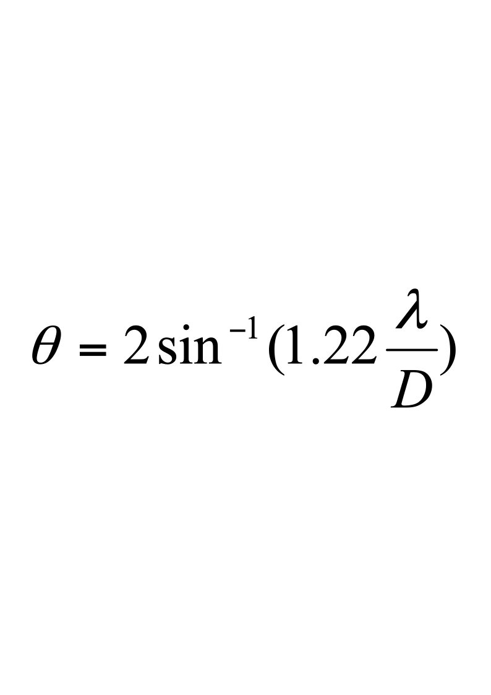
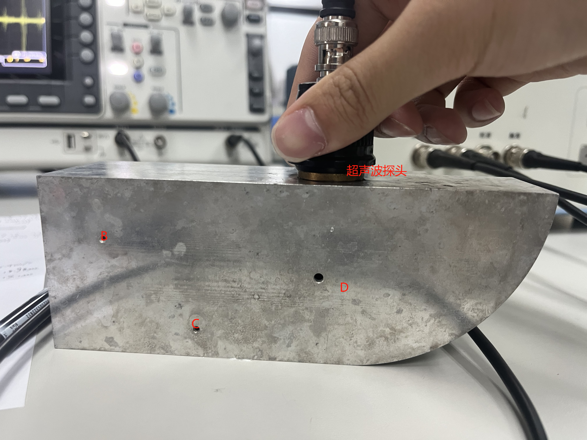
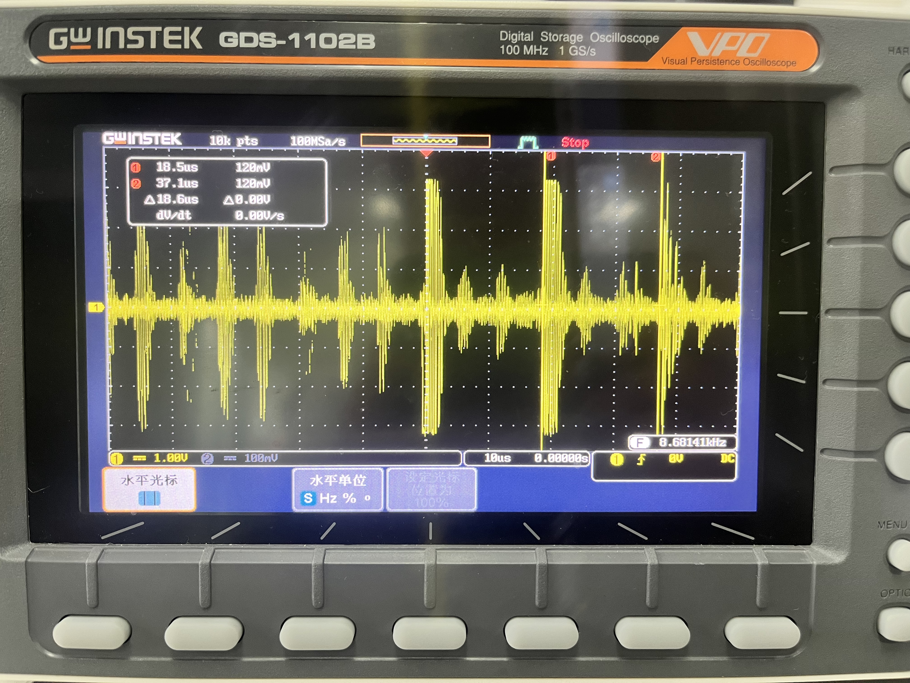
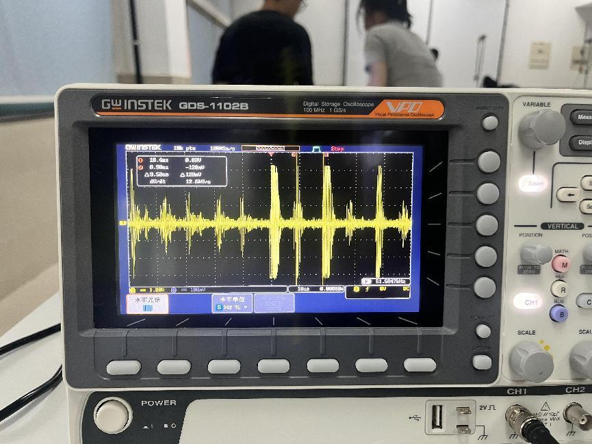
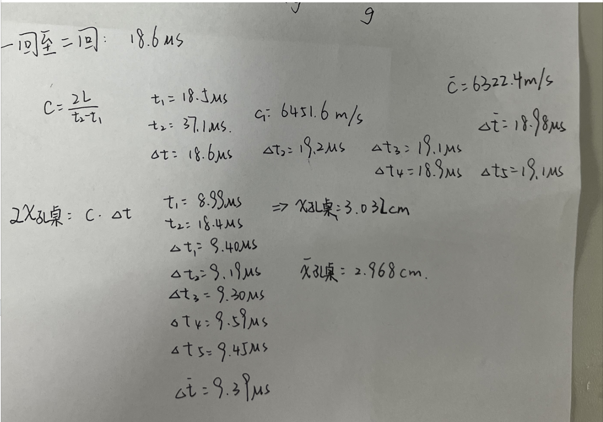
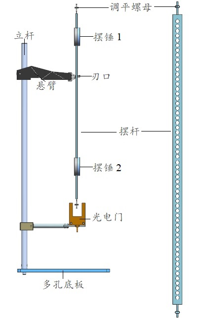
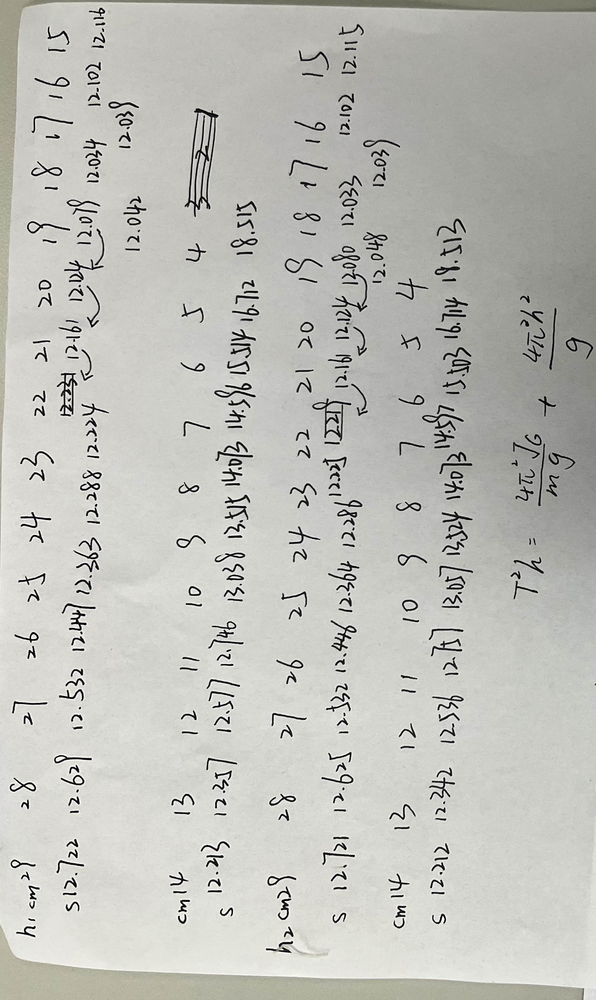
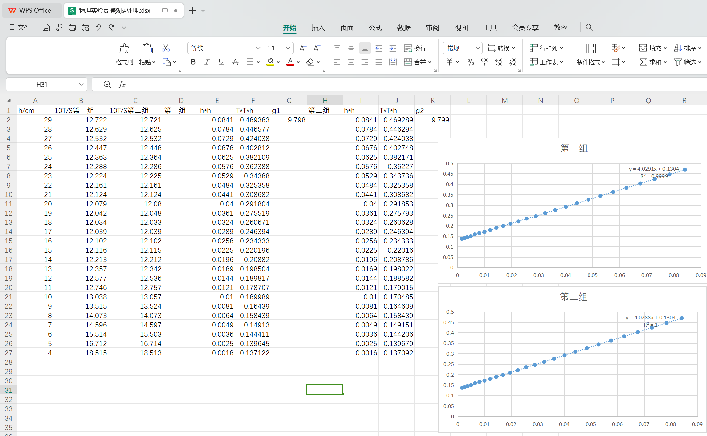

# 超声波在介质的传播

## 实验三、超声波探测及复摆测量重力加速度

超声波是一种弹性波,  能够在弹性介质中传播，而所有物质都可视为弹性介质，因此超声波对所有介质都是“透明”的。一般情况下，超声在液体和固体中传播的距离比气体中的传播距离要远得多；例如在海洋探测中，可以用超声波来探测数千米的目标。这也是超声被广泛应用于探测的主要原因之一。

利用超声波进行探测的另一个原因是超声探头发射的能量具有较强的指向性。指向性是指超声波探头发射声束扩散角的大小。扩散角越小，则指向性越好，对目标定位的准确性越高。在固体材料的尺寸测量、无损检测、超声诊断、潜艇导航等超声应用中，都利用了超声波的这一特点。

本实验在了解超声波探头指向性的基础上，学习超声波探测的基本方法。

**一、实验目的**
1. 理解超声波探头的指向性；
1. 掌握超声波探测原理和定位方法。

**二、实验仪器**

COC-CSTS-A型超声波探伤及特性综合实验仪、GOS-620型示波器（20MHz）、CSK-IB型铝试块、钢板尺、耦合剂（水）等。

**三、实验原理**

超声探头发射能量的指向性与探头的几何尺寸和波长有直接的关系。

一般来讲，波长越小，频率越高，指向性越好；尺寸越大，指向性越好。可以用公式表示如下：

在进行缺陷定位时，必须找到缺陷反射回波最大的位置，使得被测缺陷处于探头的中心轴线上，然后测量缺陷反射回波对应的时间，根据工件的声速可以计算出缺陷到探头入射点的垂直深度或水平距离。

**四、实验内容**

直探头探测CSK-IB试块厚度及缺陷深度

在超声波探测中，可以利用直探头来探测较厚工件内部缺陷的位置和当量大小。把探头按图4.17-17位置放置，观察其波形。其中底波是工件底面的反射回波。

对底面回波和缺陷波对应时间（深度）的测量，可以采用绝对测量方法，也可以采用相对测量方法。利用绝对测量方法时，必须首先测量（或已知）探头的延迟和被测材料的声速，具体方法请参看直探头延迟和声速的绝对测量方法。利用相对测量方法时，必须有与被测材料同材质试块，并已知该试块的厚度，具体方法请参看直探头延迟和声速的相对测量方法。

**五、实验步骤与要求**
1. 测量光穿过CSK-IB速度

利用探头对CSK-IB试块横孔A分别进行测量，测量三次，求平均值。

1. 探测CSK-IB试块中缺陷D的深度

利用直探头，采用绝对测量方法测量，测量三次，求平均值。

1. 自绘数据记录表格并记录测量数据和处理数据。

得到速度约为6322.4m/s

D缺陷约里桌面2.968cm

**六、分析与思考**
1. 在利用斜探头探测中，如果能够得到与被测材料同材质的试块，并且已知该试块中两个不同深度的横孔的深度，那么我们不必测量斜探头的延迟、入射点、折射角和声速就可以确定缺陷的深度。试说明该方法具体探测过程？

答：首先，使用斜探头对试块进行正常的斜探测量，通过试块中已知深度的两个横孔的回波信号，可以得到它们的时间差Δt。然后，将斜探头移动到被测材料上进行探测，当探测到缺陷时，同样可以得到缺陷处的回波信号时间。由于试块和被测材料是同材质的，因此它们的声速相同。根据声速不变的原理，可以建立以下方程：  Δt / t1 = (d1 - d) / d Δt / t2 = (d2 - d) / d  其中，Δt为试块中两个横孔的时间差，t1和t2分别为试块中两个横孔的深度对应的时间，d1和d2分别为试块中两个横孔的深度，d为待求缺陷的深度。解上述方程组，可以得到待求缺陷的深度d。
1. 试利用表面波测量CSK-IB试块中R2圆弧的长度？

答：1：将表面波传感器正确安装在CSK-IB试块上，并确保其与试块表面良好接触。

2:发射表面波信号，让其沿着试块表面传播。

3:当表面波信号遇到R2圆弧时，会发生反射或其他特定的信号变化。

4:通过分析表面波信号的变化，您可以确定R2圆弧的存在及其特征。
- **关于复摆测量重力加速度及其数据处理**

**一：实验目的：**

**1.研究复摆摆动周期与回转轴到重心距离之间的关系；**

**2.学会使用复摆测定重力加速度；**

**3.了解用光电门计时的原理；**

**二：实验装置**

**三：实验内容**

**1．安装复摆实验装置**

**（1）按图2所示结构，安装多孔底板，立杆，光电门，悬臂，光电门先放置于最低位置，锁紧悬臂。**

**（2）将摆杆（不含摆锤）放于调平架（倒T型金属架）上，将中心0刻度位置放置于调平架刃口处，调节摆杆两端的调平螺母，使摆杆基本平衡。**

**（3）将摆杆某端第一个孔位挂于悬臂刃口，取配件中的带线小球对比铅直度，调整多孔底板的机脚，使摆杆基本与带线小球的悬线平行。**

**（4）调节光电门位置，使摆杆下端螺丝正好位于光电门中心挡光位置处。**

**（5）将光电门与计时计数器相连，将计时计数器面板“单次/双次”切换开关调至“双次”模式，打开计时计数器电源。**

**2．测定转动惯量和重力加速度**

**（1）在主界面将计时计数器的记录周期数设置为10个周期。**

**（2）将当前刃口顶端与小孔的接触点位置（刻度约29.0cm，以实际读到的值为准）记入表1，摆动摆杆，注意摆杆摆动角度应小于5°，观察摆杆摆动状态，待摆杆基本没有前后方向的扭动后，按下计时计数器的“开始/暂停”按钮，开始计时计数，完成十个周期的记录后，计时计数器将自动停止，将该时间记入表1。**

**（3）移动摆杆孔位，重复步骤（2），将不同孔位的位置（实际刻度为准）和测得的十个周期时间计入表1。**

**（4）测至约4cm处的孔位之后，可将摆杆取出，更换上下方向，重复以上步骤（2）和（3），将位置和测得时间记入表1（上为h1，下为h2）。**

**四：注意事项**

**1：测量前应调节螺母使尺保持平衡！**

**2：静止释放，且释放角不超过5度！**

**3：尽量二维摆动，以减少误差！**

**4：应随着尺子的升降调节好光电门的位置！**

**数据及其处理如下：**

