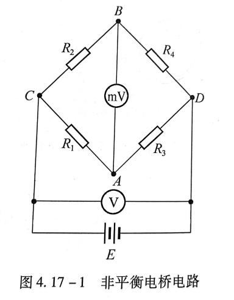
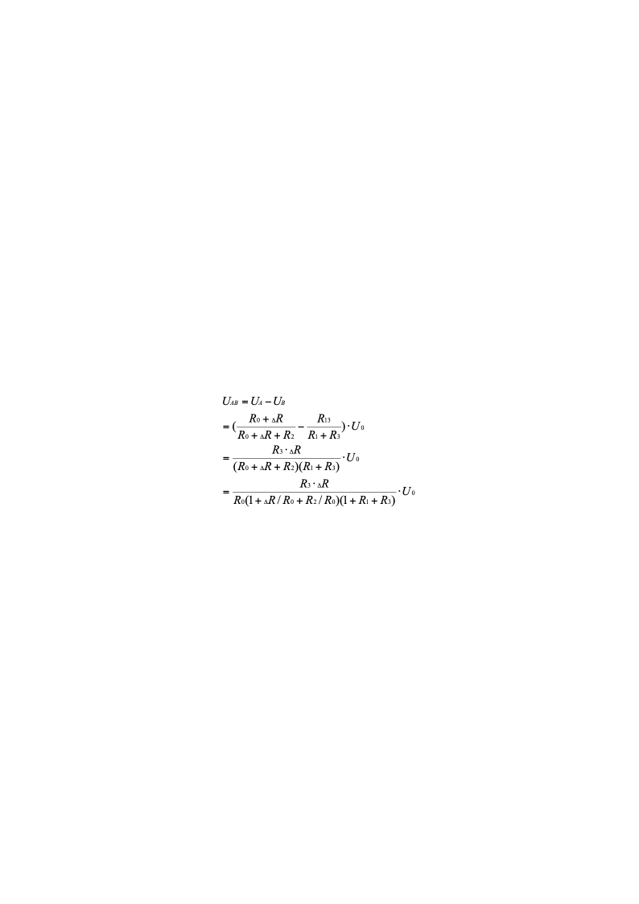
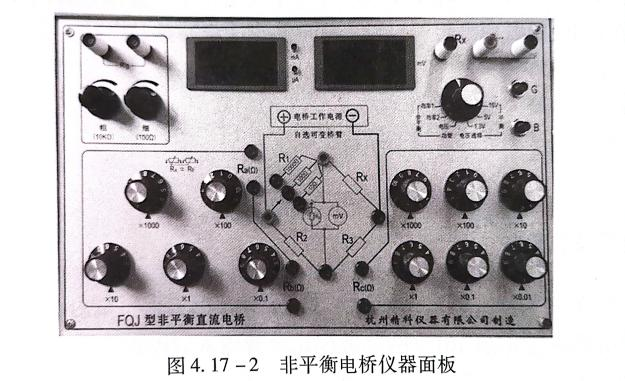

# 非平衡电桥电压输出特性研究

非平衡电桥电压输出特性研究
- **实验目的**

（1）了解非平衡电桥的工作原理；

（2）研究非平衡电桥电压输出特性。
- **实验仪器**

FQJ型非平衡电桥、电桥接线板、电阻箱、稳压电源、电压表等。
- **实验原理**
1. **单臂输入时电桥电压输出特性**

图4.17-1是由四个桥臂电阻、直流电源和电压表组成的非平衡电桥电路。当电桥平衡时，R1:R3=R2:R4，电路中A、B两点之间电位差UAB=0.若此时使一个桥臂电阻（如R4）增加很小的电阻△R，即R4=R0+△R，则电桥失去平衡，电路中A、B两点之间存在一定的电势差UAB。该电势差即为电桥不平衡时的输出电压。

若电桥供电电源的电压为U0，根据串联电阻分压原理，图4.17-1以电路中C点为零电势参考点，则电桥的输出电压为

（4.17-1）

令电桥倍率K=R3/R1。根据电桥平衡条件，R3/R1=R4/R2，且当△R<<R0时，可以略去分母中的微小项△R/R0，有

                    （4.17-2）

若△R/R0不能略去，则为

          （4.17-3）

定义SU=UAB/△R为电桥的输出电压灵敏度，则有

$S_v=\frac{KU_0}{(1+K)^RR_0}$                    （4.17-4）

由式（4.17-1）可知，当△R/R0<<1时，非平衡电桥的输出电压与△R呈线性关系。由式（4.17-4）可知，电桥的输出电压灵敏度由选择的电桥倍率K及供电电源电压决定。电桥供电一定，当K=1时，电桥输出电压灵敏度最大，且

$S_{\max}=\frac{U_0}{4R_0}$                      （4.17-5）

**2、用非平衡直流电桥测电阻**

根据式（4.17-2），得到

$xR=\frac{(1+K)^2R_0U_{IS}}{KU_s}$                （4.17-10）

当K=1时，即R2=R3，则有

                  （4.17-11）

也就是说，由于某种原因使电阻R4的值发生变化时，可以通过非平衡电桥测出电桥在非平衡状态下的输出电压，再由式（4.17-11）求得R4从初始状态至某一瞬间的电阻变化量，从而得到R4的某一瞬时值。
- **内容步骤**

**1、用非平衡电桥电压输出形式测电阻**

①通过预习熟悉各种形式非平衡电桥的特点。如非平衡电桥分为等臂电桥、立式电桥、卧式电桥。等臂电桥和立式电桥输出电压较高，灵敏度高；卧式电桥的测量范围较大。熟悉如图4.17-2所示非平衡电桥仪器的面板及仪器的操作方法。

②按图4.17-2仪器面板实验电路（I）连接电路，使桥臂电阻K=R1/R2=1，并将测量开关调至非平衡电压档。

③预调平衡，将待测电阻R4接至Rx，测量选择开关转换至非平衡电压输出档，按下G、B，微调R3使电压输出UAB=0.

④改变R4，记录△R理论值，并记下相应的电压变化值UAB。根据表4.17-1的测量条件，改变桥臂电阻R1/R2的比率（K），重复②~④。将实验数据记录在表4.17-1.

**2、用非平衡电桥测量铜热电阻Cu50的温度特性**

①用平衡电桥测量铜热电阻在室温下的电阻值R，按照图4.17-3电路将R4（电阻箱）换成热电阻Cu50（铜电阻仪器见4.17-4），将测量开关调至非平衡电压档，调节R1=R2=500Ω。按下电桥的B和G按钮，调节R3使电桥平衡，记录此时R3的度数。此度数即为铜热电阻Cu50在室温下的电阻值。

②将铜热电阻放进非平衡直流电桥加热炉内，使温度控制仪“加热选择”开关置于“断”的状态，开启温度控制仪电源。此时显示屏显示的温度为环境温度（即室温），记录此时显示的温度。将“测温/设定”转换开关置于“设定”位置，并设定加热温度上限为70°C，再将转换开关置于“测量”位置。

③将“PID调节”旋钮逆时针方向（向“—”处）旋到底，再沿顺时针方向旋至整个调节行程的1/3左右，将“加热选择”开关调节至“3”档。此时加热炉开始对铜热电阻加热。

④按测量记录表格要求，记录某一温度下非平衡电桥的输出电压UAB，直至温度升至加热温度上限为止。

断开加热炉电源（将“加热选择”开关置于“断”），开启温度控制仪的“风扇开关”，让加热炉体降温。在降温过程中再做一次测量，数据记录。
- **数据处理**

R1=R2=500Ω，U0=1300.0mV   室温下的铜电阻阻值Rx0=65.25Ω

K=R2/R3=7.6628

| 温度/°C | 非平衡电压UAB/mV | 铜电阻变化量△R/Ω | 铜电阻R/Ω |
|---|---|---|---|
| 26.6°C | 0 | 0 | 65.25 |
| 31.6°C | 2.2 | 0.441692 | 65.6917 |
| 36.6°C | 4.1 | 0.823154 | 66.0732 |
| 41.6°C | 6.3 | 1.26485 | 66.5148 |
| 46.6°C | 8.1 | 1.62623 | 66.8762 |
| 51.6°C | 10.0 | 2.00769 | 67.2577 |
| 56.6°C | 11.9 | 2.38915 | 67.6392 |
| 61.6°C | 13.8 | 2.77062 | 68.0206 |

K△R=0.331428571        KUAB=0.079160571
